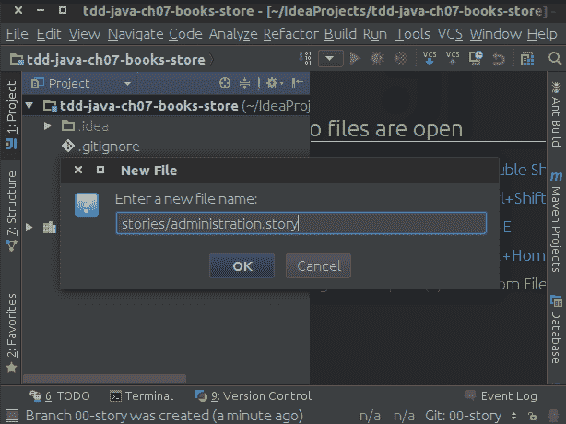
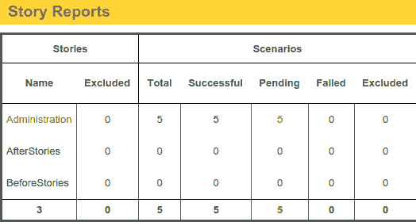
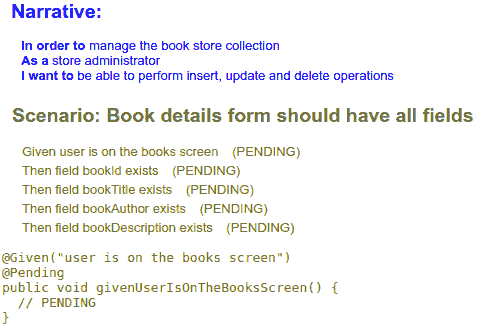
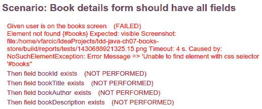
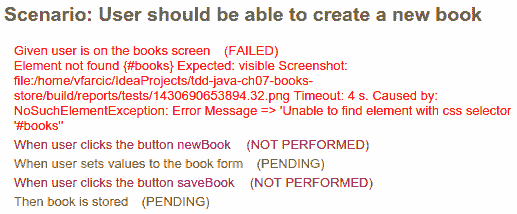
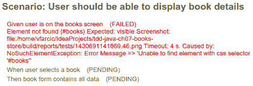
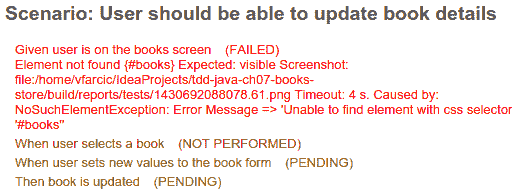
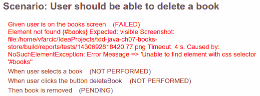
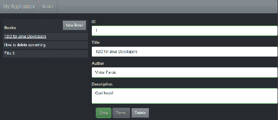
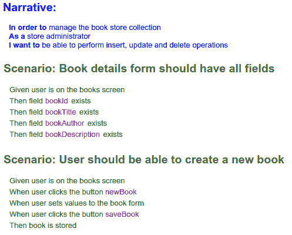

# BDD–与整个团队合作

“我不是一个优秀的程序员；我只是一个有着良好习惯的优秀程序员。”

-肯特·贝克

到目前为止，我们所做的一切都与只有开发人员才能应用的技术有关。客户、业务代表和其他不能阅读和理解代码的各方没有参与该过程。

TDD 可以比我们目前所做的多得多。我们可以定义需求，与客户讨论需求，并就应该开发什么达成一致。我们可以使用这些相同的需求，并使其可执行，从而推动和验证我们的开发。我们可以使用通用语言来编写验收标准。所有这些，以及更多，都是通过一种称为**行为驱动开发**（**BDD**的 TDD 风格来完成的。

我们将使用 BDD 方法开发一个书店应用程序。我们将用英语定义验收标准，分别实现每个特性，通过运行 BDD 场景确认其工作正常，如果需要，重构代码以达到所需的质量水平。这个过程仍然遵循红-绿重构，这是 TDD 的精髓。主要区别在于定义级别。虽然到目前为止，我们主要是在单元级工作，但这次我们将更进一步，通过功能和集成测试应用 TDD。

我们选择的框架将是 JBehave 和 Selenide。

本章将介绍以下主题：

*   不同类型的规范
*   行为驱动开发（BDD）
*   书店 BDD 故事
*   杰伯哈夫

# 不同规格

我们已经提到，TDD 的好处之一是可执行文档总是最新的。然而，通过单元测试获得的文档通常是不够的。当我们在如此低的层次上工作时，我们能洞察细节；然而，人们很容易忽略大局。例如，如果您要检查我们为 Tic-Tac-Toe 游戏创建的规范，您可能很容易忽略应用程序的要点。您将了解每个单元的功能以及它如何与其他单元互操作，但很难理解其背后的思想。确切地说，您会理解单元*X*执行*Y*并与*Z*通信；然而，功能文档及其背后的思想充其量也很难找到。

发展也是如此。在我们开始以单元测试的形式制定规范之前，我们需要有一个更全面的了解。在本书中，我们向您介绍了我们用于编写规范的需求，这些规范导致了它们的实现。这些要求后来被放弃；他们无处可寻。我们没有将它们放入存储库，也没有使用它们来验证我们的工作结果。

# 文档

在与我们合作的许多组织中，创建文档的原因是错误的。管理层倾向于认为文档在某种程度上与项目成功相关，如果没有大量（通常是短暂的）文档，项目将失败。因此，我们被要求花大量时间规划、回答问题和填写问卷，这些问卷通常不是为了帮助项目，而是为了提供一种一切都在控制之下的错觉。有人的存在通常是通过文档证明的（我的工作结果就是这个文档）。它还可以保证一切都按计划进行（有一张 Excel 表格说明我们正在按计划进行）。然而，迄今为止，创建文件的最常见原因是一个简单地说明需要创建某些文件的过程。然而，我们可能会质疑这些文件的价值，因为这个过程是神圣的，所以需要制作这些文件。

这不仅可能是因为错误的原因而创建的文档，而且没有提供足够的价值，而且，通常情况下，它还可能造成很大的损害。如果我们创建了文档，我们自然会信任它。但是，如果该文档不是最新的，会发生什么情况？需求在变化，bug 正在修复，新功能正在开发，一些功能正在被删除。如果给予足够的时间，所有传统文档都将过时。随着我们对代码的每次更改而更新文档的任务是如此巨大和复杂，以至于迟早我们必须面对这样一个事实：静态文档不能反映现实。如果我们把信任放在不准确的事情上，我们的发展是基于错误的假设。

唯一准确的文档是我们的代码。代码是我们开发和部署的，并且是真实地表示我们的应用程序的唯一来源。然而，代码并不是每个参与项目的人都可以阅读的。除了程序员，我们还可以与经理、测试人员、业务人员、最终用户等合作。

为了寻找一种更好的方法来定义什么将构成更好的文档，让我们进一步探讨谁是潜在的文档消费者。为了简单起见，我们将它们分为编码者（能够阅读和理解代码的人）和非编码者（其他人）。

# 编码员的文档

开发人员使用代码，因为我们已经确定代码是最准确的文档，所以没有理由不使用它。如果您想了解某个方法的功能，请查看该方法的代码。对某个班级的工作有疑问吗？看看那门课。理解一段代码有困难吗？我们有问题！然而，问题不是缺少文档，而是代码本身编写得不好。

仅仅看代码来理解代码通常是不够的。即使您可能理解代码的作用，但该代码的目的可能并不那么明显。最初为什么要写？

这就是规格说明的用武之地。我们不仅使用它们来持续验证代码，而且它们还充当可执行文档。它们总是最新的，因为如果它们不是最新的，它们的执行就会失败。与此同时，虽然代码本身应该以一种易于阅读和理解的方式编写，但规范提供了一种更简单、更快速的方式来理解导致我们编写一些实现代码的原因、逻辑和动机。

将代码用作文档并不排除其他类型。相反，关键不是要避免使用静态文档，而是要避免重复。当代码提供必要的详细信息时，请先使用它。在大多数情况下，这给我们留下了更高级别的文档，例如概述、系统的一般用途、使用的技术、环境设置、安装、构建和打包，以及其他类型的数据，这些数据更像是指南和快速启动信息，而不是详细信息。对于这些情况，一个简单的降价格式的[`README`](http://whatismarkdown.com/)往往是最好的。

对于所有基于代码的文档，TDD 是最好的启用码。到目前为止，我们只使用单位（方法）。我们还没有看到如何在更高的层次上应用 TDD，例如，功能规范。然而，在我们到达那里之前，让我们谈谈团队中的其他角色。

# 非编码人员的文档

传统的测试人员倾向于形成与开发人员完全分离的团队。这种分离导致越来越多的测试人员不熟悉代码，并认为他们的工作是质量检查。他们是过程结束时的验证者，充当一种边境警察，决定可以部署什么和应该返回什么。另一方面，越来越多的组织将测试员作为团队中不可或缺的成员来雇用，他们的工作是确保内在的质量。后者要求测试人员精通代码。对他们来说，使用代码作为文档是很自然的。但是，我们应该如何处理第一组？对于不理解代码的测试人员，我们应该怎么做？而且，不只是（一些）测试人员属于这一类。还包括经理、最终用户、业务代表等。世界上到处都是无法阅读和理解代码的人。

我们应该寻找一种方法来保留可执行文档所提供的优势，但要以每个人都能理解的方式编写。此外，以 TDD 的方式，我们应该允许每个人从一开始就参与可执行文档的创建。我们应该允许他们定义我们将用于开发应用程序的需求，同时验证开发结果。我们需要一些东西来定义我们将在更高级别上做什么，因为低级别已经包含了单元测试。总之，我们需要可以作为需求的文档，可以执行的文档，可以验证我们的工作，并且每个人都可以编写和理解。

向 BDD 问好。

# 行为驱动开发

行为驱动开发（BDD）是一个敏捷过程，旨在在整个项目中保持对利益相关者价值的关注；它是 TDD 的一种形式。预先定义规范，根据这些规范执行实现，并定期运行这些规范以验证结果。除了这些相似之处，还有一些不同之处。与基于单元测试的 TDD 不同，BDD 鼓励我们在开始实现（编码）之前编写多个规范（称为场景）。即使没有具体的规则，BDD 也倾向于向更高级别的功能需求倾斜。虽然它也可以在单位级别上使用，但当采用一种大家都能理解和书写的更高方法时，真正的好处就会得到。受众是 BDD 试图赋予每个人（编码人员、测试人员、经理、最终用户、业务代表等）权力的另一个不同点。

基于单元级的 TDD 可以描述为由内而外（我们从单元开始，朝着功能构建），BDD 通常被理解为由外而内（我们从功能开始，朝着单元进入）。BDD 作为**验收标准**，作为准备就绪的指标。它告诉我们什么时候完成并准备好生产。

我们从定义功能（或行为）开始，通过使用 TDD 和单元测试来处理功能（或行为），一旦完成了一个完整的行为，就用 BDD 进行验证。一个 BDD 场景可能需要几个小时甚至几天才能完成。在此期间，我们可以使用 TDD 和单元测试。完成后，我们运行 BDD 场景进行最终验证。TDD 适用于编码器，周期非常快，而 BDD 适用于所有人，投票时间要慢得多。对于每个 BDD 场景，我们都有许多 TDD 单元测试。

在这一点上，您可能会对 BDD 到底是什么感到困惑，所以让我们回顾一下。我们将从解释其格式开始。

# 叙述的

BDD 故事由一个叙述和至少一个场景组成。叙述只是提供信息，其主要目的是提供足够的信息，作为所有相关人员（测试人员、业务代表、开发人员、分析师等）之间沟通的开始。它是一个功能的简短描述，从需要它的人的角度讲。

叙述的目的是回答三个基本问题：

1.  **为了**：应该构建的功能的好处或价值是什么？
2.  **作为**：谁需要请求的功能？
3.  **我想**：应该开发的功能或目标是什么？

一旦我们回答了这些问题，我们就可以开始定义我们认为最好的解决方案。这种思考过程会导致提供较低细节级别的场景。

到目前为止，我们一直在以单元测试为驱动力的非常低的层次上工作。我们从程序员的角度指定应该构建什么。我们假设高级需求是在前面定义的，我们的工作是编写特定于其中一个需求的代码。现在，让我们后退几步，从头开始。

比方说，让我们以客户或业务代表的身份行事。有人想出了这个好主意，我们正在与团队其他成员讨论。简而言之，我们想建立一个在线书店。这只是一个想法，我们甚至不确定它将如何发展，因此我们希望开发一款**最低可行产品**（**MVP**。我们要探讨的角色之一是商店管理员。此人应该能够添加新书，更新或删除现有书籍。所有这些行动都应该是可行的，因为我们希望此人能够有效地管理我们的书店藏书。我们对这个角色的叙述如下：

```java
In order to manage the book store collection efficiently 
As a store administrator 
I want to be able to add, update, and remove books 
```

现在我们知道了好处是什么（管理书籍），谁需要它（`administrator`，最后应该开发什么功能（`insert`、`update`和`delete`操作）。请记住，这并不是对应该做什么的详细描述。叙述的目的是发起讨论，讨论将产生一个或多个场景。

与 TDD 单元测试不同，任何人都可以编写叙述，甚至 BDD 故事的其余部分。它们不需要编码技能，也不需要涉及太多细节。根据组织的不同，所有叙述可以由同一个人（业务代表、产品负责人、客户等）编写，也可以由整个团队协作编写。

现在我们对叙述有了更清晰的概念，让我们来看看场景。

# 情节

叙述充当了沟通的推动者，场景是沟通的结果。他们应该描述角色（在*叙述*部分中指定）与系统的交互。与单元测试不同，单元测试是由开发人员为开发人员编写的代码，BDD 场景应该用简单的语言定义，并包含最少的技术细节，以便所有参与项目的人员（开发人员、测试人员、设计师、经理、客户等）都可以对行为（或特性）有一个共同的理解这将被添加到系统中。

场景作为叙述的接受标准。一旦与叙述相关的所有场景都成功运行，就可以认为工作已经完成。每个场景都非常类似于单元测试，主要区别在于范围（一种方法针对整个功能）和实现它所需的时间（几秒钟或几分钟针对几小时甚至几天）。与单元测试类似，场景驱动开发；首先定义它们。

每个场景由一个描述和一个或多个步骤组成，这些步骤以单词`Given`、`When`或`Then`开头。描述简短，仅提供信息。它有助于我们一眼就了解场景的作用。另一方面，步骤是场景的先决条件、事件和预期结果的序列。它们帮助我们明确定义行为，并且很容易将它们转换为自动化测试。

在本章中，我们将更多地关注 BDD 的技术方面，以及它们如何适应开发人员的思维方式。要更广泛地使用 BDD 并进行更深入的讨论，请参阅 Gojko Adzic 的书*示例规范：**成功团队如何交付正确的软件*。

`Given`步骤定义了场景其余部分成功所需满足的上下文或先决条件。回到本书的管理叙述，其中一个前提条件可能是：

```java
Given user is on the books screen 
```

这是一个非常简单但非常必要的前提条件。我们的网站可能有很多页面，在我们执行任何操作之前，我们需要确保用户在正确的屏幕上。

`When`步骤定义了一个动作或某种事件。在我们的叙述中，我们定义了`administrator`应该能够`add`、`update`和`remove`书籍。让我们看看什么应该是与`delete`操作相关的操作：

```java
When user selects a book 
When user clicks the deleteBook button 
```

在本例中，我们将使用`When`步骤定义的操作相乘。首先，我们应该选择一本书，然后点击`deleteBook`按钮。在本例中，我们使用 ID（`deleteBook`）而不是文本（删除书籍）来定义应该单击的按钮。在大多数情况下，ID 更可取，因为它们提供多种好处。它们是唯一的（给定屏幕上只能存在一个 ID），它们为开发人员提供了清晰的说明（创建一个 ID 为`deleteBook`的元素），并且不受同一屏幕上其他更改的影响。元素的文本可以很容易地更改；如果发生这种情况，所有使用它的场景也将失败。对于网站，另一种选择是 XPath。但是，尽可能避免这种情况。只要对 HTML 结构进行最小的更改，它就会失败。

与单元测试类似，场景应该是可靠的，当功能尚未开发或出现实际问题时，场景应该失败。否则，当规范产生错误否定时，就开始忽略规范是一种自然反应。

最后，我们应该总是以某种验证来结束场景。我们应该指定所执行行动的预期结果。按照相同的场景，我们的`Then`步骤可以如下：

```java
Then book is removed 
```

这一结果在提供足够的数据和不深入设计细节之间取得了平衡。例如，我们可以提到数据库，或者更具体地说，提到 MongoDB。然而，在许多情况下，从行为的角度来看，这些信息并不重要。我们只需确认该书已从目录中删除，无论它存储在何处。

现在我们已经熟悉了 BDD 故事格式，让我们来编写书店 BDD 故事。

# 书店 BDD 故事

在我们开始之前，克隆在[上可用的代码 https://bitbucket.org/vfarcic/tdd-java-ch08-books-store](https://bitbucket.org/vfarcic/tdd-java-ch07-books-store) 。这是一个空项目，我们将在本章中使用它。与前几章一样，它包含每个部分的分支，以防遗漏某些内容。

我们将以纯文本格式编写一个 BDD 故事，用纯英语编写，不含任何代码。这样，所有涉众都可以独立于他们的编码能力而参与进来。稍后，我们将看到如何自动化我们正在编写的故事。

让我们首先在`stories`目录中创建一个名为`administration.story`的新文件：



我们已经有了我们之前写的叙述，因此我们将在此基础上继续：

```java
Narrative: 
In order to manage the book store collection efficiently 
As a store administrator 
I want to be able to add, update, and remove books 
```

我们将使用 JBehave 格式来编写故事。关于 JBehave 的更多细节即将发布。在此之前，请访问[这里](http://jbehave.org/) 了解更多信息。

叙述总是以`Narrative`行开头，后面跟着`In order to`、`As a`和`I want to lines`。我们已经讨论了它们各自的含义。

现在我们知道了为什么、谁和什么的答案，是时候和团队的其他成员坐下来讨论可能的场景了。我们仍然没有讨论步骤（`Given`、`When`和`Then`，而是简单地讨论潜在场景的概要或简短描述。清单可以是：

```java
Scenario: Book details form should have all fields 
Scenario: User should be able to create a new book 
Scenario: User should be able to display book details 
Scenario: User should be able to update book details 
Scenario: User should be able to delete a book 
```

我们遵循 JBehave 语法，使用`Scenario`后跟一个简短的描述。在现阶段没有理由详细说明；本阶段的目的是作为快速头脑风暴会议。在本例中，我们提出了这五种场景。第一个应该定义表单中用于管理书籍的字段。其余的场景试图定义不同的管理任务。他们没有什么真正的创造性。我们应该开发一个非常简单的应用程序的 MVP。如果它被证明是成功的，我们可以扩大并真正发挥我们的创造力。根据目前的目标，应用程序将简单明了。

现在，我们知道了我们的场景是什么，一般来说，是时候正确地定义每一个场景了。让我们开始研究第一个问题：

```java
Scenario: Book details form should have all fields 

Given user is on the books screen 
Then field bookId exists 
Then field bookTitle exists 
Then field bookAuthor exists 
Then field bookDescription exists 
```

此场景不包含任何操作；没有`When`步骤。这可以被认为是一种健康检查。它告诉开发人员应该在 book 表单中显示哪些字段。通过这些字段，我们可以决定将使用什么数据模式。ID 具有足够的描述性，我们知道每个字段是关于什么的（一个 ID 和三个文本字段）。请记住，这个场景（以及接下来的场景）是没有任何代码的纯文本。主要的优点是，任何人都可以编写它们，我们将尽量保持这种方式。

让我们看看第二种场景应该是什么样子：

```java
Scenario: User should be able to create a new book 

Given user is on the books screen 
When user clicks the button newBook 
When user sets values to the book form 
When user clicks the button saveBook 
Then book is stored 
```

这个场景的形式比前一个好一点。有明确的前提条件（`user`应该在某个屏幕上）；有几个动作（点击`newBook`按钮，填写表格，点击`saveBook`按钮）；最后，对结果进行验证（存储书籍）。

其余的场景如下（因为它们都以类似的方式工作，我们觉得没有理由单独解释它们）：

```java
Scenario: User should be able to display book details 

Given user is on the books screen 
When user selects a book 
Then book form contains all data 

Scenario: User should be able to update book details 

Given user is on the books screen 
When user selects a book 
When user sets values to the book form 
Then book is stored 

Scenario: User should be able to delete a book 

Given user is on the books screen 
When user selects a book 
When user clicks the deleteBook button 
Then book is removed 
```

唯一值得注意的是，我们在适当的时候使用了相同的步骤（例如，`When user selects a book`。由于我们将很快尝试自动化所有这些场景，因此在同一步骤中使用相同的文本将通过复制代码节省一些时间。重要的是要在以最佳方式表达场景的自由度和自动化的易用性之间取得平衡。在我们现有的场景中还有一些东西可以修改，但是，在我们重构它们之前，让我们向您介绍 JBehave。

[源代码可以在`tdd-java-ch08-books-store`Git 库的`00-story`分支中找到](https://bitbucket.org/vfarcic/tdd-java-ch07-books-store/branch/00-story) 。

# 杰伯哈夫

JBehave 需要两个主要组件来运行 BDD 故事和步骤。runner 是一个类，它将解析故事、运行所有场景并生成报告。步骤是与场景中编写的步骤相匹配的代码方法。该项目已经包含所有 Gradle 依赖项，因此我们可以直接创建 JBehave runner。

# JBehave 转轮

JBehave 也不例外，因为每种类型的测试都需要一个运行程序。在前面的章节中，我们使用了 JUnit 和 TestNG 运行程序。虽然它们都不需要任何特殊的配置，但 JBehave 的要求更高一些，它迫使我们创建一个类来保存运行故事所需的所有配置。

以下是我们将在本章中使用的`Runner`代码：

```java
public class Runner extends JUnitStories { 

  @Override 
  public Configuration configuration() { 
    return new MostUsefulConfiguration() 
                  .useStoryReporterBuilder(getReporter()) 
                  .useStoryLoader(new LoadFromURL()); 
  } 

  @Override 
  protected List<String> storyPaths() { 
    String path = "stories/**/*.story"; 
    return new StoryFinder().findPaths(
                CodeLocations.codeLocationFromPath("").getFile(),
                Collections.singletonList(path), 
                new ArrayList<String>(),
                "file:"); 
  }

  @Override 
  public InjectableStepsFactory stepsFactory() {
    return new InstanceStepsFactory(configuration(), new Steps());
  } 

  private StoryReporterBuilder getReporter() { 
    return new StoryReporterBuilder() 
       .withPathResolver(new FilePrintStreamFactory.ResolveToSimpleName())
       .withDefaultFormats()
       .withFormats(Format.CONSOLE, Format.HTML);
  }
}
```

这是一段非常平淡无奇的代码，所以我们只对几个重要部分进行评论。被重写的方法`storyPaths`将我们的故事文件的位置设置为`stories/**/*.story`路径。这是一个标准的 [Apache Ant](http://ant.apache.org/) 语法，当翻译成普通语言时，意味着将包括`stories`目录或任何子目录（`**`中以`.story`结尾的任何文件。另一个重要的重写方法是`stepsFactory`，它用于设置包含步骤定义的类（我们将很快处理它们）。在本例中，我们将其设置为一个名为`Steps`的类的实例（存储库中已经包含一个空类，我们稍后将使用该空类）。

[源代码可以在`tdd-java-ch08-books-store`Git 库的`01-runner`分支中找到](https://bitbucket.org/vfarcic/tdd-java-ch07-books-store/branch/01-runner) 。

现在我们已经完成了跑步，是时候开始跑步了，看看结果如何。

# 未决步骤

我们可以使用以下 Gradle 命令运行场景：

```java
$ gradle clean test
```

Gradle 只运行上次执行时更改的任务。由于我们的源代码不会总是更改（我们通常只修改文本格式的故事），因此需要在`test`之前运行`clean`任务，以便删除缓存。

JBehave 为我们创建了一个漂亮的报告，并将其放入`target/jbehave/view`目录。在您喜爱的浏览器中打开`reports.html`文件。

报告的第一页显示了我们的故事列表（在我们的例子中，只有管理）和两个预定义的故事，分别称为 BeforeStories 和 AfterStories。它们的用途类似于`@BeforeClass`和`@AfterClass`JUnit 注释方法。它们在故事前后运行，对于设置和拆除数据、服务器等非常有用。

这个初始报告页面显示我们有五个场景，它们都处于挂起状态。这是 JBehave 告诉我们他们既不成功也不失败的方式，但我们使用的步骤背后缺少代码：



每行的最后一列包含一个链接，允许我们查看每个故事的详细信息：



在我们的例子中，所有步骤都标记为挂起。JBehave 甚至提出了我们需要为每个挂起的步骤创建的方法的建议。

总而言之，在这一点上，我们写了一个有五个场景的故事。这些场景中的每一个都相当于一个规范，该规范将被用作应该开发的定义，并验证开发是否正确完成。这些场景中的每一个都由几个步骤组成，这些步骤定义了先决条件（`Given`）、行动（`When`）和预期结果（`Then`）。

现在是时候在我们的步骤后面编写代码了。然而，在我们开始编码之前，让我们先介绍一下硒和硒化物。

# 硒和硒化物

Selenium 是一组可用于自动化浏览器的驱动程序。我们可以使用它们操纵浏览器和页面元素，例如，单击按钮或链接，填充表单字段，打开特定的 URL，等等。几乎所有浏览器都有驱动程序，包括 Android、Chrome、FireFox、Internet Explorer、Safari 等。我们最喜欢的是 PhantomJS，它是一种无头浏览器，无需任何 UI 即可工作。使用它运行故事比使用传统浏览器要快，而且我们经常使用它来获得有关 web 应用程序准备就绪的快速反馈。如果它按预期工作，我们可以继续并在应用程序应该支持的所有不同浏览器和版本中进行尝试。

有关 Selenium 的更多信息，请参见[这里](http://www.seleniumhq.org/) ，支持的驱动列表位于[这里](http://www.seleniumhq.org/projects/webdriver/) 。

虽然 Selenium 非常适合自动化浏览器，但它也有它的缺点，其中之一是它的操作级别非常低。例如，单击按钮很容易，只需一行代码即可完成：

```java
selenium.click("myLink") 
```

如果 ID 为`myLink`的元素不存在，Selenium 将抛出异常，测试将失败。虽然我们希望在预期的元素不存在时测试失败，但在许多情况下它并不是那么简单。例如，我们的页面可能会动态加载，该元素只有在对服务器的异步请求得到响应后才会出现。出于这个原因，我们可能不仅要单击该元素，还要等待它可用，并且只有在达到超时时才会失败。虽然这可以用 Selenium 来完成，但它很单调且容易出错。此外，我们为什么要做别人已经做过的工作？向赛琳娜问好。

[Selenide](http://selenide.org/) 是一个围绕 Selenium`WebDrivers`的包装器，具有更简洁的 API、对 Ajax 的支持、使用 JQuery 风格的选择器等。我们将在所有 Web 步骤中使用 Selenide，您很快就会更加熟悉它

现在，让我们编写一些代码。

# JBehave 步骤

在开始编写步骤之前，请安装 PhantomJS 浏览器。您的操作系统说明可在[中找到 http://phantomjs.org/download.html](http://phantomjs.org/download.html) 。

安装了 PhantomJS 后，是时候指定几个渐变依赖项了：

```java
dependencies { 
    testCompile 'junit:junit:4.+' 
    testCompile 'org.jbehave:jbehave-core:3.+' 
    testCompile 'com.codeborne:selenide:2.+' 
    testCompile 'com.codeborne:phantomjsdriver:1.+' 
} 
```

您已经熟悉了 JUnit 和 JBehave 内核，它们是在前面设置的。两个新添加的元素是硒化物和幻影。刷新渐变依赖项，以便它们包含在 IDEA 项目中。

现在，是时候将 PhantomJS`WebDriver`添加到我们的`Steps`类中了：

```java
public class Steps { 

  private WebDriver webDriver; 

  @BeforeStory 
  public void beforeStory() { 
    if (webDriver == null) { 
      webDriver = new PhantomJSDriver(); 
      webDriverRunner.setWebDriver(webDriver); 
      webDriver.manage().window().setSize(new Dimension(1024, 768));
    }
  }
} 
```

我们正在利用`@BeforeStory`注释来定义我们用来进行一些基本设置的方法。如果尚未指定驱动程序，我们将其设置为`PhantomJSDriver`。由于此应用程序在较小的设备（手机、平板电脑等）上看起来会有所不同，因此我们必须明确指定屏幕的大小。在本例中，我们将其设置为 1024 x 768 的合理台式机/笔记本电脑显示器屏幕分辨率。

在设置不方便的情况下，让我们对第一个挂起的步骤进行编码。我们只需复制粘贴报告中建议我们使用的第一种方法`JBehave`：

```java
@Given("user is on the books screen") 
public void givenUserIsOnTheBooksScreen() { 
// PENDING 
} 
```

想象一下，我们的应用程序将有一个链接打开书的屏幕。
为此，我们需要执行两个步骤：

1.  打开网站主页。
2.  单击菜单中的“书籍”链接。

我们将指定此链接的 ID 为`books`。ID 非常重要，因为它们允许我们轻松地在页面上定位元素。

我们前面描述的步骤可以转换为以下代码：

```java
private String url = "http://localhost:9001"; 

@Given("user is on the books screen") 
public void givenUserIsOnTheBooksScreen() { 
  open(url); 
  $("#books").click(); 
} 
```

我们假设我们的应用程序将在`localhost`上的`9001`端口上运行。因此，我们首先打开主页 URL，然后单击 ID 为`books`的元素。用于指定 ID 的 Selenide/JQuery 语法为`#`。

如果我们再次跑跑步者，我们会看到第一步失败，其余的仍处于`Pending`状态。现在，我们处于红绿重构周期的红色状态。

让我们继续处理第一个场景中使用的其余步骤。第二个可以是：

```java
@Then("field bookId exists") 
public void thenFieldBookIdExists() { 
  $("#books").shouldBe(visible); 
} 
```

第三个方法几乎相同，因此我们可以重构前面的方法并将元素 ID 转换为变量：

```java
@Then("field $elementId exists") 
public void thenFieldExists(String elementId) { 
  $("#" + elementId).shouldBe(visible); 
} 
```

通过此更改，第一个场景中的所有步骤都完成了。如果我们再次运行测试，结果如下：



第一步失败了，因为我们甚至没有开始着手实现我们的书店应用程序。Selenide 有一个很好的特性，它可以在每次出现故障时创建浏览器的屏幕截图。我们可以在报告中看到路径。其余步骤处于未执行状态，因为场景的执行在失败时停止。

接下来应该做什么取决于团队的结构。如果同一个人同时处理功能测试和实现，他可以开始处理实现，并编写足够的代码使该场景通过。在许多其他情况下，独立的人员正在处理功能规范和实现代码。在这种情况下，一个可以继续处理其余场景中缺少的步骤，而另一个将开始处理实现。由于所有场景都是以文本形式编写的，因此编码人员已经知道应该做什么，并且两者可以并行工作。我们将采用前一种方法，为其余未决步骤编写代码。

让我们看一下下一个场景：



我们已经完成了前一个场景中的一半步骤，因此只有两个等待。点击`newBook`按钮后，我们应该为表单设置一些值，点击`saveBook`按钮，并验证书籍是否正确存储。我们可以通过检查它是否出现在可用书籍列表中来完成最后一部分。

缺少的步骤可能如下所示：

```java
@When("user sets values to the book form")
public void whenUserSetsValuesToTheBookForm() {
  $("#bookId").setValue("123");
  $("#bookTitle").setValue("BDD Assistant");
  $("#bookAuthor").setValue("Viktor Farcic");
  $("#bookDescription")
     .setValue("Open source BDD stories editor and runner");
}

@Then("book is stored")
public void thenBookIsStored() {
  $("#book123").shouldBe(present);
}
```

第二步假设每个可用书籍都有一个格式为`book[ID]`的 ID。

让我们看看下一个场景：



与前面的场景一样，有两个待开发的步骤。我们需要有一种方法来选择一本书，并验证表单中的数据是否正确填充：

```java
@When("user selects a book") 
public void whenUserSelectsABook() { 
  $("#book1").click(); 
} 

@Then("book form contains all data") 
public void thenBookFormContainsAllData() { 
  $("#bookId").shouldHave(value("1")); 
  $("#bookTitle").shouldHave(value("TDD for Java Developers"));
  $("#bookAuthor").shouldHave(value("Viktor Farcic")); 
  $("#bookDescription").shouldHave(value("Cool book!")); 
} 
```

这两种方法很有趣，因为它们不仅指定了预期的行为（当单击特定的图书链接时，会显示包含其数据的表单），而且还预期某些数据可用于测试。运行此场景时，应该已经存在 ID 为`1`、标题为`TDD for Java Developers`、作者为`Viktor Farcic`、描述为`Cool book!`的书籍。我们可以选择将该数据添加到数据库中，或者使用一个模拟服务器来提供预定义的值。无论选择如何设置测试数据，我们都可以完成此场景并跳转到下一个场景：



未决步骤的实施可如下所示：

```java
@When("user sets new values to the book form")
public void whenUserSetsNewValuesToTheBookForm() {
  $("#bookTitle").setValue("TDD for Java Developers revised");
  $("#bookAuthor").setValue("Viktor Farcic and Alex Garcia");
  $("#bookDescription").setValue("Even better book!"); 
  $("#saveBook").click(); 
} 

@Then("book is updated") 
public void thenBookIsUpdated() { 
  $("#book1").shouldHave(text("TDD for Java Developers revised"));
  $("#book1").click();
  $("#bookTitle").shouldHave(value("TDD for Java Developers revised"));
  $("#bookAuthor").shouldHave(value("Viktor Farcic and Alex Garcia")); 
  $("#bookDescription").shouldHave(value("Even better book!")); 
} 
```

最后，只剩下一个场景：



我们可以通过验证一本书是否不在可用书列表中来验证该书是否已被删除：

```java
@Then("book is removed") 
public void thenBookIsRemoved() { 
  $("#book1").shouldNotBe(visible); 
} 
```

我们已经完成了步骤代码。现在，开发应用程序的人不仅有需求，而且有方法验证每个行为（场景）。他可以一次一个场景地完成红绿重构周期。

[源代码可以在`tdd-java-ch08-books-store`Git 库的`02-steps`分支中找到](https://bitbucket.org/vfarcic/tdd-java-ch07-books-store/branch/02-steps) 。

# 最终验证

让我们想象一下，另一个人编写的代码应该满足我们的场景设置的需求。此人当时选择了一个场景，开发了代码，运行了该场景，并确认了他的实现是正确的。一旦完成了所有场景的实现，就可以运行整个故事并进行最终验证了。

为此，应用程序已打包为一个`Docker`文件，我们已经准备了一个带有 Vagrant 的虚拟机来执行应用程序。

在[查看分支机构 https://bitbucket.org/vfarcic/tdd-java-ch08-books-store/branch/03-validation](https://bitbucket.org/vfarcic/tdd-java-ch07-books-store/branch/03-validation) 和流浪汉：

```java
$ vagrant up

```

输出应类似于以下内容：

```java
==> default: Importing base box 'ubuntu/trusty64'...
==> default: Matching MAC address for NAT networking...
==> default: Checking if box 'ubuntu/trusty64' is up to date...
...
==> default: Running provisioner: docker...
    default: Installing Docker (latest) onto machine...
    default: Configuring Docker to autostart containers...
==> default: Starting Docker containers...
==> default: -- Container: books-fe
```

一旦 Vagrant 完成，我们可以在我们选择的浏览器中打开`http://localhost:9001`来查看应用程序：



现在，让我们再次运行我们的场景：

```java
$ gradle clean test
```

这一次没有失败，所有场景都成功运行：



一旦所有场景都通过，我们就满足了验收标准，应用程序就可以交付生产了。

# 总结

BDD 本质上是 TDD 的一种风味。它遵循在实现代码之前编写测试（场景）的相同基本原则。它推动了发展，帮助我们更好地理解应该做什么。

主要区别之一是生命周期的持续时间。使用基于单元测试的 TDD 时，我们从红色到绿色的速度非常快（几分钟甚至几秒钟），BDD 通常采用更高级别的方法，可能需要数小时或数天才能从红色到绿色。另一个重要的区别是受众。虽然基于单元测试的 TDD 是由开发人员为开发人员完成的，但 BDD 打算通过其无处不在的语言让每个人都参与进来。

虽然可以就这个主题写一整本书，但我们的目的是为您提供足够的信息，以便您可以进一步调查 BDD。

现在是时候来看看遗留代码，以及如何对其进行调整，使其更加 TDD 友好。