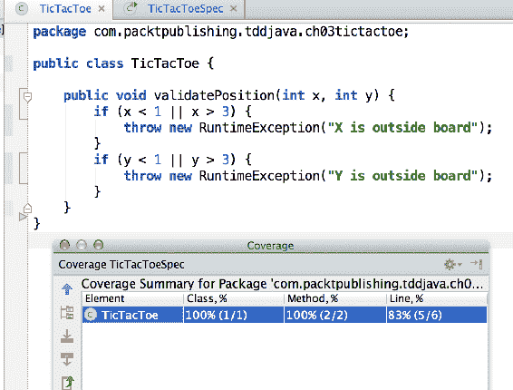
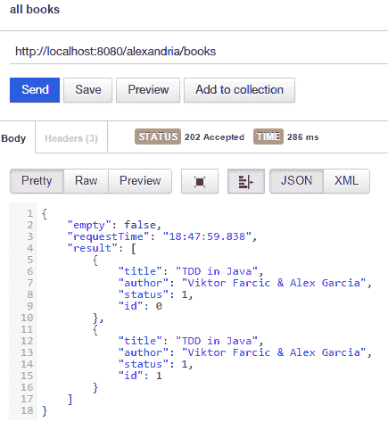
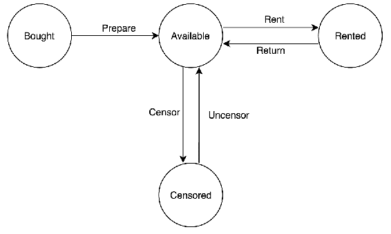

# 重构遗留代码–使其再次年轻化

TDD可能无法立即调整为旧代码。你可能需要对这些步骤稍加修改才能使之生效。请理解，在这种情况下，您的TDD可能会发生变化，因为不知何故，您不再执行以前使用的TDD。本章将向您介绍遗留代码的世界，尽可能多地利用TDD

我们将从一个目前正在生产的遗留应用程序重新开始。我们将在不引入缺陷或倒退的情况下对其进行小范围的修改，我们甚至有时间早点吃午饭！

本章涵盖以下主题：

*   遗留代码
*   处理遗留代码
*   REST通信
*   依赖注入
*   不同级别的测试：端到端、集成和单元

# 遗留代码

让我们从遗留代码的定义开始。虽然有许多作者有不同的定义，例如对应用程序或测试缺乏信任，代码不再受支持，等等。我们最喜欢Michael Feathers的作品：

“旧代码是没有测试的代码。此定义的原因是它是客观的：要么有测试，要么没有测试。”

–迈克尔·费瑟

我们如何检测遗留代码？虽然传统代码通常等同于糟糕的代码，但Michael Feathers在他的书《有效地处理传统代码》*（Dorling Kindsley（印度）私人有限公司）（1993年）中透露了一些气味。*

***Code smell**.
Smells are certain structures in the code that indicate violation of fundamental design principles and negatively impact design quality.

Code smells are usually not bugs—they are not technically incorrect and do not currently prevent the program from functioning. Instead, they indicate weaknesses in design that may be slowing down development or increasing the risk of bugs or failures in the future. 

Source: [http://en.wikipedia.org/wiki/Code_smell](http://en.wikipedia.org/wiki/Code_smell).

遗留代码的一个常见气味是*我无法测试此代码*。它正在访问外部资源，引入其他副作用，使用新的运营商，等等。一般来说，好的设计很容易测试。让我们看看一些遗留代码。*  *# 遗留代码示例

软件概念通常最容易通过代码来解释，这一点也不例外。我们已经看到了Tic-Tac-Toe应用程序并与之合作（参见[第3章](03.html)、*红绿重构——从失败到成功直至完美*。以下代码执行位置验证：

```java
public class TicTacToe { 

  public void validatePosition(int x, int y) { 
    if (x < 1 || x > 3) { 
      throw new RuntimeException("X is outside board"); 
    } 
    if (y < 1 || y > 3) { 
      throw new RuntimeException("Y is outside board"); 
    } 
  } 
} 
```

与本规范对应的规范如下：

```java
public class TicTacToeSpec { 
  @Rule 
  public ExpectedException exception = 
      ExpectedException.none(); 

  private TicTacToe ticTacToe; 

  @Before 
  public final void before() { 
    ticTacToe = new TicTacToe(); 
  } 

  @Test 
  public void whenXOutsideBoardThenRuntimeException() { 
    exception.expect(RuntimeException.class); 
    ticTacToe.validatePosition(5, 2); 
  } 

  @Test 
  public void whenYOutsideBoardThenRuntimeException() { 
    exception.expect(RuntimeException.class); 
    ticTacToe.validatePosition(2, 5); 
  } 
} 
```

JaCoCo报告指出所有内容都已涵盖（最后一行除外，即方法的结束括号）：



由于我们相信我们有很好的覆盖率，我们可以执行自动和安全的重构（片段）：

```java
public class TicTacToe { 

  public void validatePosition(int x, int y) { 
    if (isOutsideTheBoard(x)) { 
      throw new RuntimeException("X is outside board"); 
    } 
    if (isOutsideTheBoard(y)) { 
      throw new RuntimeException("Y is outside board"); 
    } 
  } 

  private boolean isOutsideTheBoard(final int position) { 
    return position < 1 || position > 3; 
  } 
} 
```

这段代码应该准备好了，因为测试是成功的，并且它有很好的测试覆盖率。

也许你已经意识到了这一点，但有一个陷阱。未检查`RuntimeException`块中的消息是否正确；甚至代码覆盖率也显示它覆盖了该行中的所有分支。

什么是覆盖率？
覆盖率是一种度量，用于描述特定测试套件测试程序源代码的程度。资料来源：[http://en.wikipedia.org/wiki/Code_coverage](http://en.wikipedia.org/wiki/Code_coverage) 。

让我们设想一个单端到端测试，它涵盖了代码的一个简单部分。此测试将获得较高的覆盖率，但安全性不高，因为还有许多其他部分尚未覆盖。

我们已经在我们的代码库中引入了遗留代码—异常消息。只要这不是一种预期的行为，那么这可能没有什么错。任何人都不应该依赖异常消息，程序员也不应该依赖异常消息来调试他们的程序、日志，甚至用户。在不久的将来，那些未被测试覆盖的项目部分可能会出现倒退。如果你接受风险，这可能没问题。可能异常类型和行号就足够了。

我们已决定删除异常消息，因为它未经测试：

```java
public class TicTacToe { 

  public void validatePosition(int x, int y) { 
    if (isOutsideTheBoard(x)) { 
      throw new RuntimeException(""); 
    } 
    if (isOutsideTheBoard(y)) { 
      throw new RuntimeException(""); 
    } 
  } 

  private boolean isOutsideTheBoard(final int position) { 
    return position < 1 || position > 3; 
  } 
} 
```

# 识别遗留代码的其他方法

您可能熟悉遗留应用程序的以下一些常见特征：

*   补丁之上的补丁，就像一个活生生的弗兰肯斯坦应用程序
*   已知错误
*   改变是昂贵的
*   脆弱的
*   难懂
*   旧的、过时的、静态的或通常不存在的文档
*   鸟枪手术
*   破窗户

关于维护它的团队，以下是它对团队成员产生的一些影响：

*   辞职：负责软件的人看到他们面前有一项艰巨的任务
*   没有人再关心了：如果你的系统中已经有坏掉的窗口，那么引入新窗口就更容易了

因为遗留代码通常比其他类型的软件更难，所以您希望您最好的人员来处理它。然而，我们常常被最后期限强加在匆忙之中，只想着尽快编程所需的功能，而忽略了解决方案的质量。

因此，为了避免以如此糟糕的方式浪费我们有才华的开发人员，我们希望非遗留应用程序能够实现相反的效果。应该是：

*   易变
*   可概括、可配置和可扩展
*   易于部署
*   健壮的
*   没有已知的缺陷或限制
*   易于向他人传授/向他人学习
*   广泛的测试套件
*   自我验证
*   能够使用锁孔手术

正如我们已经概述了遗留代码和非遗留代码的一些特性，用其他特性替换某些特性应该很容易。对吗？停止猎枪手术，使用锁孔手术，再多一些细节，你就完成了。对不对？

这并不像听起来那么容易。幸运的是，有一些技巧和规则可以在应用时改进我们的代码，使应用程序更接近于非遗留应用程序。

# 缺乏依赖注入

这是遗留代码库中经常检测到的气味之一。由于不需要单独测试类，协作者在需要的地方被实例化，将创建协作者和使用它们的责任放在同一个类中。

下面是一个使用`new`操作符的示例：

```java
public class BirthdayGreetingService { 

  private final MessageSender messageSender; 

  public BirthdayGreetingService() { 
    messageSender = new EmailMessageSender(); 
  } 

  public void greet(final Employee employee) { 
    messageSender.send(employee.getAddress(), 
     "Greetings on your birthday"); 
  } 
} 
```

在当前状态下，`BirthdayGreeting`服务不可进行单元测试。它依赖于构造函数中硬编码的`EmailMessageSender`。在不修改代码库的情况下，无法替换此依赖项（使用反射注入对象或替换`new`操作符上的对象除外）。

修改代码库始终是可能的回归的来源，因此应该谨慎地进行。重构需要测试，除非不可能。

The Legacy Code Dilemma. 

When we change code, we should have tests in place. To put tests in place, we often have to change code.

# 遗留代码更改算法

当您必须对传统代码库进行更改时，可以使用以下算法：

*   确定变化点
*   找到测试点
*   打破依赖关系
*   写测试
*   进行更改和重构

# 应用遗留代码更改算法

要应用此算法，我们通常从一组测试开始，并在重构时始终保持绿色。这与TDD的正常循环不同，因为重构不应该引入任何新特性（也就是说，它不应该编写任何新规范）。

为了更好地解释算法，假设我们收到了以下更改请求：为了以更非正式的方式问候我的员工，我想给他们发送一条推特，而不是电子邮件。

# 确定变化点

该系统目前只能发送电子邮件，因此需要进行更改。在哪里？快速调查表明，发送问候语的策略是在`BirthdayGreetingService`类的构造函数中按照策略模式（[确定的https://en.wikipedia.org/?title=Strategy_pattern](https://en.wikipedia.org/?title=Strategy_pattern) ：

```java
public class BirthdayGreetingService { 

  public BirthdayGreetingService() { 
    messageSender = new EmailMessageSender(); 
  } 
  [...] 
} 
```

# 寻找测试点

由于`BirthdayGreetingService`类没有注入可用于向对象附加额外职责的协作者，因此唯一的选择是跳出该服务类对其进行测试。一种选择是将`EmailMessageSender`类更改为模拟或伪实现，但这将使该类中的实现面临风险。

另一个选项是为此功能创建端到端测试：

```java
public class EndToEndTest { 

  @Test 
  public void email_an_employee() { 
    final StringBuilder systemOutput = 
       injectSystemOutput(); 
    final Employee john = new Employee( 
       new Email("john@example.com")); 

    new BirthdayGreetingService().greet(john); 

    assertThat(systemOutput.toString(),  
      equalTo("Sent email to " 
        + "'john@example.com' with " 
        + "the body 'Greetings on your " 
        + "birthday'\n")); 
  } 

  // This code has been used with permission from 
  //GMaur's LegacyUtils: 
  // https://github.com/GMaur/legacyutils 
  private StringBuilder injectSystemOutput() { 
    final StringBuilder stringBuilder = 
      new StringBuilder(); 
    final PrintStream outputPrintStream = 
      new PrintStream( 
        new OutputStream() { 
        @Override 
        public void write(final int b) 
          throws IOException { 
          stringBuilder.append((char) b); 
        } 
      }); 
    System.setOut(outputPrintStream); 
    return stringBuilder; 
  } 
} 
```

此代码已在[的许可下使用https://github.com/GMaur/legacyutils](https://github.com/GMaur/legacyutils) 。此库帮助您执行捕获系统的技术（`System.out`。

文件名不以规范（或`Spec`）结尾，例如`TicTacToeSpec`，因为这不是规范。这是一个测试，以确保功能保持不变。该文件被命名为`EndToEndTest`，因为我们试图涵盖尽可能多的功能。

# 打破依赖关系

在创建了确保预期行为不会改变的测试之后，我们将打破`BirthdayGreetingService`和`EmailMessageSender`之间的硬编码依赖关系。为此，我们将使用一种称为**提取**和**覆盖调用**的技术，这在Michael Feathers的书中得到了首次解释：

```java
public class BirthdayGreetingService { 

  public BirthdayGreetingService() { 
    messageSender = getMessageSender(); 
  } 

  private MessageSender getMessageSender() { 
    return new EmailMessageSender(); 
  } 

[...] 
```

再次执行测试，并验证我们之前创建的孤独测试仍然是绿色的。此外，我们需要使此方法`protected`或更开放，以便能够覆盖它：

```java
public class BirthdayGreetingService { 

  protected MessageSender getMessageSender() { 
    return new EmailMessageSender(); 
  } 

[...] 
```

既然可以重写该方法，我们就创建一个伪服务来替换该服务的原始实例。在代码中引入伪代码是一种模式，它包括创建一个可以替换现有对象的对象，其特殊性是我们可以控制其行为。通过这种方式，我们可以注入一些定制的假货来实现我们所需要的。更多信息请访问[http://xunitpatterns.com/](http://xunitpatterns.com/) 。

在这种特殊情况下，我们应该创建一个伪服务来扩展原始服务。下一步是重写复杂的方法，以便绕过代码中不相关的部分进行测试：

```java
public class FakeBirthdayGreetingService 
 extends BirthdayGreetingService { 

  @Override 
  protected MessageSender getMessageSender() { 
    return new EmailMessageSender(); 
  } 
} 
```

现在我们可以使用fake，而不是`BirthdayGreetingService`类：

```java
public class EndToEndTest { 

  @Test 
  public void email_an_employee() { 
    final StringBuilder systemOutput = 
      injectSystemOutput(); 
    final Employee john = new Employee( 
       new Email("john@example.com")); 

    new FakeBirthdayGreetingService().greet(john); 

    assertThat(systemOutput.toString(), 
      equalTo("Sent email to " 
        + "'john@example.com' with " 
        + "the body 'Greetings on  
        + "your birthday'\n")); 
  } 
```

测试仍然是绿色的。

我们现在可以应用另一种打破依赖关系的技术，参数化构造函数，在[的文章中解释https://archive.org/details/WorkingEffectivelyWithLegacyCode](https://archive.org/details/WorkingEffectivelyWithLegacyCode) 。生产代码可能如下所示：

```java
public class BirthdayGreetingService { 

  public BirthdayGreetingService(final MessageSender 
     messageSender) { 
    this.messageSender = messageSender; 
  } 
  [...] 
} 
```

与此实现相对应的测试代码可能如下所示：

```java
public class EndToEndTest { 

  @Test 
  public void email_an_employee() { 
    final StringBuilder systemOutput = 
      injectSystemOutput(); 
    final Employee john = new Employee( 
      new Email("john@example.com")); 

    new BirthdayGreetingService(new 
         EmailMessageSender()).greet(john); 

    assertThat(systemOutput.toString(),  
      equalTo("Sent email to " 
        + "'john@example.com' with " 
        + "the body 'Greetings on " 
        + "your birthday'\n")); 
  } 
  [...] 
```

我们也可以删除`FakeBirthday`，因为它不再使用。

# 写作测试

在保留旧的端到端测试的同时，创建一个交互来验证`BirthdayGreetingService`和`MessageSender`的集成：

```java
  @Test 
  public void the_service_should_ask_the_messageSender() { 
    final Email address = 
      new Email("john@example.com"); 
    final Employee john = new Employee(address); 
    final MessageSender messageSender = 
      mock(MessageSender.class); 

    new BirthdayGreetingService(messageSender) 
      .greet(john); 

    verify(messageSender).send(address, 
         "Greetings on your birthday"); 
  } 
```

此时，可以编写一个新的`TweetMessageSender`，完成算法的最后一步。

# 卡塔演习

程序员能够改进的唯一方法是通过实践。创建不同类型的程序并使用不同的技术通常会为程序员提供对软件构造的新见解。基于这一思想，kata是一种定义一些需求或固定特性以实现某些目标的练习。

程序员被要求实现一个可能的解决方案，然后与其他试图找到最佳方案的人进行比较。此练习的关键价值不是获得最快的实现，而是讨论在设计解决方案时所做的决策。在大多数情况下，在kata中创建的所有程序都会在最后被删除。

本章中的kata练习是关于遗留系统的。这是本章中要处理的一个非常简单的程序，但也非常复杂，会带来一些困难。

# 卡塔遗产酒店

您被赋予了一项任务，采用一个已经投入生产的系统，一个图书图书馆的工作软件：亚历山大项目。

该项目目前缺乏文档，旧的维护人员不再可供讨论。所以，如果你接受这个任务，这将完全是你的责任，因为没有其他人可以依靠。

# 描述

我们已经能够恢复原始项目编写时的这些规范片段：

*   Alexandria软件应该能够存储书籍并将其借给用户，用户有权归还书籍。用户还可以按作者、书名、状态和ID查询系统中的书籍。
*   还书没有时限。
*   这些书也可以被审查，因为出于商业原因，这被认为是重要的。
*   软件不应接受新用户。
*   应该随时告诉用户服务器的时间。

# 技术意见

Alexandria是一个用Java编写的后端项目，它使用RESTAPI将信息传递给前端。为了本kata练习的目的，持久性已作为内存中的对象实现，使用了在[中解释的假双重测试http://xunitpatterns.com/Fake%20Object.html](http://xunitpatterns.com/Fake%20Object.html) 。

该代码可在[获取https://bitbucket.org/vfarcic/tdd-java-alexandria](https://bitbucket.org/vfarcic/tdd-java-alexandria/) 。

# 添加新功能

在添加新特性之前，遗留代码可能不会影响程序员的工作效率。代码库的状态比预期的更糟，但是生产系统工作起来没有任何不便。

现在是问题开始出现的时候了。**产品负责人**（**PO**想要添加新功能。

例如，作为一名图书馆经理，我想知道一本书的所有历史，这样我就可以衡量哪些书比其他书更受欢迎。

# 黑盒或峰值测试

由于Alexandria项目的老维护人员不再可以提问，也没有文档，所以黑盒测试更加困难。因此，我们决定通过调查更好地了解该软件，然后进行一些尖峰测试，这将向我们泄露有关该系统的内部知识。

我们稍后将使用这些知识来实现新特性。

Black-box testing is a method of software testing that examines the functionality of an application without peering into its internal structures or workings. This type of test can be applied to virtually every level of software testing: unit, integration, system, and acceptance. It typically most if not all higher-level testing, but can dominate unit testing as well. 

Source: [http://en.wikipedia.org/wiki/Black-box_testing](http://en.wikipedia.org/wiki/Black-box_testing). 

# 初步调查

当我们了解了所需的功能后，我们将开始研究Alexandria项目：

*   15个文件
*   基于梯度的（`build.gradle`
*   0测试

首先，我们想确认该项目从未经过测试，缺少测试文件夹表明：

```java
    $ find src/test
    find: src/test: No such file or directory

```

以下是Java部件的文件夹内容：

```java
    $ cd src/main/java/com/packtpublishing/tddjava/ch09/alexandria/
    $ find .
    .
    ./Book.java
    ./Books.java
    ./BooksEndpoint.java
    ./BooksRepository.java
    ./CustomExceptionMapper.java
    ./MyApplication.java
    ./States.java
    ./User.java
    ./UserRepository.java
    ./Users.java

```

以下是剩下的：

```java
    $ cd src/main
    $ find resources webapp
    resources
    resources/applicationContext.xml
    webapp
    webapp/WEB-INF
    webapp/WEB-INF/web.xml

```

这似乎是一个使用Spring（由`applicationContext.xml`表示）的web项目（由`web.xml`文件表示）。`build.gradle`中的依赖项显示以下（片段）：

```java
compile 'org.springframework:spring-web:4.1.4.RELEASE'
```

拥有Spring已经是一个好迹象，因为它可以帮助依赖项注入，但是快速查看一下就可以发现上下文并没有真正被使用。也许是过去用过的东西？

在`web.xml`文件中，我们可以找到以下片段：

```java
<?xml version="1.0" encoding="UTF-8"?> 
<web-app version="3.0"  
         xmlns:xsi="http://www.w3.org/2001/XMLSchema-instance" 
         xsi:schemaLocation="http://java.sun.com/xml/ns/javaee 
          http://java.sun.com/xml/ns/javaee/web-app_3_0.xsd"> 

    <module-name>alexandria</module-name> 

    <context-param> 
        <param-name>contextConfigLocation</param-name> 
        <param-value>classpath:applicationContext.xml</param-value> 
    </context-param> 

    <servlet> 
        <servlet-name>SpringApplication</servlet-name> 
        <servlet-class>
 org.glassfish.jersey.servlet.ServletContainer</servlet-class> 
        <init-param> 
            <param-name>javax.ws.rs.Application</param-name> 
            <param-value>com.packtpublishing.tddjava.alexandria.MyApplication</param-value> 
        </init-param> 
        <load-on-startup>1</load-on-startup> 
    </servlet> 
```

在此文件中，我们发现以下内容：

*   `applicationContext.xml`中的上下文将被加载
*   有一个应用程序文件（`com.packtpublishing.tddjava.alexandria.MyApplication`）将在servlet中执行

`MyApplication`文件如下：

```java
public class MyApplication extends ResourceConfig { 

  public MyApplication() { 
    register(RequestContextFilter.class); 
    register(BooksEndpoint.class); 
    register(JacksonJaxbJsonProvider.class); 
    register(CustomExceptionMapper.class); 
  } 
} 
```

这将配置执行`BooksEndpoint`端点（片段）所需的类：

```java
@Path("books") 
@Component 
public class BooksEndpoint { 

  private BooksRepository books = new BooksRepository(); 

  private UserRepository users = new UserRepository(); 
```

在最后一个片段中，我们可以找到第一个指标，即这是一个遗留代码库。这两个依赖项（`books`和`users`都是在端点内部创建的，而不是注入的。这使得单元测试更加困难。

我们可以从写下重构过程中使用的元素开始；我们在`BooksEndpoint`中为**依赖注入**编写代码。

# 如何找到重构的候选对象

有不同的编程模式（例如，函数式、命令式和面向对象）和风格（例如，紧凑、冗长、简约和过于聪明）。因此，重构的候选对象是不同的。

与主观上相反，还有另一种方法可以客观地找到重构的候选对象。有许多论文研究如何客观地找到重构的候选对象。这只是一个介绍，读者可以了解更多关于这些技术的信息。

# 介绍新功能

在进一步了解代码之后，似乎最重要的功能变化是替换当前的`status`（片段）：

```java
@XmlRootElement 
public class Book { 

  private final String title; 
  private final String author; 
  private int status; //<- this attribute 
  private int id; 
```

并将其替换为它们的集合（片段）：

```java
@XmlRootElement 
public class Book { 
  private int[] statuses; 
  // ... 
```

这似乎可行（例如，在将对字段的所有访问权更改为数组之后），但这也会提示功能需求。

Alexandria软件应该能够存储书籍并将其借给有权归还的用户。用户还可以按作者、书名、状态和ID查询系统中的书籍。

PO确认通过`status`搜索书籍现在已经改变，它还允许搜索任何以前的`status`。

这种变化越来越大。每当我们觉得删除这个遗留代码的时候到了，我们就开始应用遗留代码算法。

我们还检测到了原始困扰和特征嫉妒气味：将`status`存储为整数（原始困扰），然后启动另一个对象的状态（特征嫉妒）。我们将把它添加到以下待办事项列表中：

*   图书`BooksEndpoint`中的依赖注入
*   将`status`更改为`statuses`
*   消除对`status`的原始困扰（可选）

# 应用遗留代码算法

在本例中，整个中间端作为一个独立端工作，使用内存持久性。如果将持久性保存到数据库中，则可以使用相同的算法，但是我们需要一些额外的代码来在测试运行之间清理和填充数据库。

我们将使用DbUnit。更多信息请参见[http://dbunit.sourceforge.net/](http://dbunit.sourceforge.net/) 。

# 编写端到端测试用例

我们决定采取的第一步是编写端到端测试，以确保在重构期间保持行为。在包括前端的其他应用程序中，可以使用更高级别的工具，如Selenium/Selenide。

在我们的例子中，由于前端不需要重构，所以该工具可以是较低级别的。我们选择编写HTTP请求以进行端到端测试。

这些请求应该是自动的和可测试的，并且应该遵循所有现有的自动测试规则或规范。当我们在编写这些测试时发现了真正的应用程序行为，我们决定在一个名为Postman的工具中编写一个spike。
产品网站在这里：[https://www.getpostman.com/](https://www.getpostman.com/) 。这也可以通过名为curl（[的工具实现http://curl.haxx.se/](http://curl.haxx.se/) ）。

What is curl?  
curl is a command-line tool and library for transferring data with URL syntax, supporting `[...] HTTP`, `HTTPS, [...]`, `HTTP POST`, `HTTP PUT`, and `[...]`.

What's curl used for?
curl is used in command lines or scripts to transfer data.

Source: [http://curl.haxx.se/](http://curl.haxx.se/).

为此，我们决定使用以下代码行在本地执行遗留软件：

```java
./gradlew clean jettyRun
```

这将启动处理请求的本地jetty服务器。最大的好处是部署是自动完成的，无需打包所有内容并手动部署到应用服务器（例如JBoss AS、GlassFish、Geronimo和TomEE）。这可以大大加快做出更改和看到效果的过程，从而缩短反馈提前期。稍后，我们将从Java代码以编程方式启动服务器。

我们开始寻找功能。正如我们之前发现的，`BooksEndpoint`类包含webservice端点定义，这是开始寻找功能的好地方。他们的名单如下：

1.  添加一本新书
2.  列出所有的书
3.  按ID、作者、标题和状态搜索图书
4.  准备这本书以供出租
5.  租这本书
6.  审查这本书
7.  翻阅这本书

我们手动启动服务器并开始写入请求：


这些测试似乎已经足够好了。我们已经意识到的一点是，每个响应都包含一个时间戳，因此这使得我们的自动化更加困难：



为了使测试更有价值，它们应该是自动化的、详尽的。目前，它们不是，所以我们认为它们是尖峰。它们将在未来实现自动化。

Each and every single test that we perform is not automated. In this case, the tests from the Postman interface are much faster to write than the automated ones. Also, the experience is far more representative of what production use would be like. The test client (thankfully, in this case) could introduce some problems with the production one, and therefore not return trusted results. 

In this particular case, we have found that the Postman tests are a better investment because, even after writing them, we will throw them away. They give very rapid feedback on the API and results. We also use this tool for prototyping the REST APIs, as its tools are both effective and useful. 

The general idea here is this: depending on whether you want to save those tests for the future or not, use one tool or another. This also depends on how often you want to execute them, and in which environment.

写下所有请求后，这些是我们在应用程序中找到的状态，由状态图表示：



在这些测试准备就绪并且我们开始了解应用程序之后，是时候自动化测试了。毕竟，如果它们不是自动化的，我们就没有足够的信心进行重构。

# 自动化测试用例

我们以编程方式启动服务器。为此，我们决定使用灰熊（[https://javaee.github.io/grizzly/](https://javaee.github.io/grizzly/) ），允许我们使用Jersey的`ResourceConfig`（FQCN:`org.glassfish.jersey.server.ResourceConfig`）配置启动服务器，如测试`BooksEndpointTest`（片段）所示。

代码可在[中找到https://bitbucket.org/vfarcic/tdd-java-alexandria](https://bitbucket.org/vfarcic/tdd-java-alexandria) ：

```java
public class BooksEndpointTest { 
    public static final URI FULL_PATH =  
      URI.create("http://localhost:8080/alexandria"); 
    private HttpServer server; 

    @Before 
    public void setUp() throws IOException { 
        ResourceConfig resourceConfig = 
          new MyApplication(); 
        server = GrizzlyHttpServerFactory 
          .createHttpServer(FULL_PATH, resourceConfig); 
        server.start(); 
    } 

    @After 
    public void tearDown(){ 
        server.shutdownNow(); 
    } 
```

这将在地址`http://localhost:8080/alexandria`处准备一台本地服务器。它将只在短时间内可用（测试运行时），因此，如果需要手动访问服务器，无论何时要暂停执行，请插入对以下方法的调用：

```java
public void pauseTheServer() throws Exception { 
    System.in.read(); 
} 
```

当您要停止服务器时，请停止执行或在分配的控制台中点击*回车*。

现在我们可以通过编程方式启动服务器，暂停它（使用前面的方法），然后再次执行spike。结果是相同的，因此重构是成功的。

我们将第一个自动化测试添加到系统中。

代码可在[中找到https://bitbucket.org/vfarcic/tdd-java-alexandria](https://bitbucket.org/vfarcic/tdd-java-alexandria) ：

```java
public class BooksEndpointTest { 

   public static final String AUTHOR_BOOK_1 = 
     "Viktor Farcic and Alex Garcia"; 
    public static final String TITLE_BOOK_1 = 
      "TDD in Java"; 
    private final Map<String, String> TDD_IN_JAVA; 

    public BooksEndpointTest() { 
      TDD_IN_JAVA = getBookProperties(TITLE_BOOK_1, 
        AUTHOR_BOOK_1); 
    } 

    private Map<String, String> getBookProperties 
      (String title, String author) { 
        Map<String, String> bookProperties = 
          new HashMap<>(); 
        bookProperties.put("title", title); 
        bookProperties.put("author", author); 
        return bookProperties; 
    } 

    @Test 
    public void add_one_book() throws IOException { 
        final Response books1 = addBook(TDD_IN_JAVA); 
        assertBooksSize(books1, is("1")); 
    } 

     private void assertBooksSize(Response response, 
        Matcher<String> matcher) { 
        response.then().body(matcher); 
    } 

    private Response addBook 
      (Map<String, ?> bookProperties) { 
        return RestAssured 
            .given().log().path() 
            .contentType(ContentType.URLENC) 
            .parameters(bookProperties) 
            .post("books"); 
    } 
```

出于测试目的，我们使用了一个名为`RestAssured`（[的库https://github.com/rest-assured/rest-assured](https://github.com/rest-assured/rest-assured) 允许更轻松地测试REST和JSON。

为了完成自动化测试套件，我们创建了以下测试：

*   `add_one_book()`
*   `add_a_second_book()`
*   `get_book_details_by_id()`
*   `get_several_books_in_a_row()`
*   `censor_a_book()`
*   `cannot_retrieve_a_censored_book()`

代码可在[中找到https://bitbucket.org/vfarcic/tdd-java-alexandria/](https://bitbucket.org/vfarcic/tdd-java-alexandria/) 。

现在，我们有了一个套件，可以确保不引入回归，我们来看看下面的待办事项列表：

1.  图书`BooksEndpoint`中的依赖注入
2.  将`status`更改为`statuses`
3.  消除对`status`的原始困扰（可选）

我们将首先解决依赖注入问题。

# 注入BookRepository依赖项

`BookRepository`依赖项的代码在`BooksEndpoint`中（片段）：

```java
@Path("books") 
@Component 
public class BooksEndpoint { 

    private BooksRepository books = 
      new BooksRepository(); 
[...] 
```

# 提取和覆盖调用

我们将应用已经引入的重构技术extract and override调用。为此，我们创建了一个失败的规范，如下所示：

```java
@Test 
public void add_one_book() throws IOException { 
    addBook(TDD_IN_JAVA); 

    Book tddInJava = new Book(TITLE_BOOK_1, 
      AUTHOR_BOOK_1, 
       States.fromValue(1)); 

    verify(booksRepository).add(tddInJava); 
} 
```

为了通过这个红色规范（也称为失败规范），我们将首先将依赖项创建提取到`BookRepository`类中的`protected`方法：

```java
@Path("books") 
@Component 
public class BooksEndpoint { 

    private BooksRepository books = 
      getBooksRepository(); 

    [...] 

     protected BooksRepository 
       getBooksRepository() { 
        return new BooksRepository(); 
    } 

    [...] 
```

我们将`MyApplication`启动器复制到此：

```java
public class TestApplication 
    extends ResourceConfig { 

    public TestApplication 
      (BooksEndpoint booksEndpoint) { 
        register(booksEndpoint); 
        register(RequestContextFilter.class); 
        register(JacksonJaxbJsonProvider.class); 
        register(CustomExceptionMapper.class); 
    } 

    public TestApplication() { 
        this(new BooksEndpoint( 
          new BooksRepository())); 
    } 
} 
```

这允许我们注入任何`BooksEndpoint`。在本例中，在测试`BooksEndpointInteractionTest`中，我们将使用模拟覆盖依赖项getter。通过这种方式，我们可以检查是否正在进行必要的调用（来自`BooksEndpointInteractionTest`的片段）：

```java
@Test 
public void add_one_book() throws IOException { 
    addBook(TDD_IN_JAVA); 
    verify(booksRepository) 
      .add(new Book(TITLE_BOOK_1, 
          AUTHOR_BOOK_1, 1)); 
} 
```

运行测试；一切都是绿色的。尽管规范是成功的，但我们引入了一项设计，仅用于测试目的，生产代码并没有执行这个新的启动器`TestApplication`，而是仍在执行旧的`MyApplication`。为了解决这个问题，我们必须将两个发射器统一为一个。这可以通过重构参数化构造函数来解决，Roy Osherove的书*单元测试的艺术*（[中也解释了这一点http://artofunittesting.com](http://artofunittesting.com) ）。

# 参数化构造函数

我们可以通过接受`BooksEndpoint`依赖关系来统一启动器。如果我们不指定它，它将向`BooksRepository`的实际实例注册依赖关系。否则，它将注册接收到的：

```java
public class MyApplication 
      extends ResourceConfig { 

    public MyApplication() { 
        this(new BooksEndpoint( 
          new BooksRepository())); 
    } 

    public MyApplication 
      (BooksEndpoint booksEndpoint) { 
        register(booksEndpoint); 
        register(RequestContextFilter.class); 
        register(JacksonJaxbJsonProvider.class); 
        register(CustomExceptionMapper.class); 
    } 
} 
```

在这种情况下，我们选择了**构造函数链接**，以避免在构造函数中重复。

完成此重构后，`BooksEndpointInteractionTest`类的最终状态如下
：

```java
public class BooksEndpointInteractionTest { 

    public static final URI FULL_PATH = URI. 
        create("http://localhost:8080/alexandria"); 
    private HttpServer server; 
    private BooksRepository booksRepository; 

    @Before 
    public void setUp() throws IOException { 
        booksRepository = mock(BooksRepository.class); 
        BooksEndpoint booksEndpoint = 
          new BooksEndpoint(booksRepository); 
        ResourceConfig resourceConfig = 
          new MyApplication(booksEndpoint); 
        server = GrizzlyHttpServerFactory 
           .createHttpServer(FULL_PATH, resourceConfig); 
        server.start(); 
    } 
```

第一个测试通过了，因此我们可以将依赖项注入任务标记为已完成。

执行的任务：

*   图书`BooksEndpoint`中的依赖注入

待办事项清单：

*   将`status`更改为`statuses`
*   消除对`status`的原始困扰（可选）

# 添加新功能

一旦我们有了必要的测试环境，我们就可以添加新的特性。

作为一名图书馆经理，我想知道一本书的所有历史，这样我就可以衡量哪些书比其他书更受欢迎。

我们将从红色规范开始：

```java
public class BooksSpec { 

    @Test 
    public void should_search_for_any_past_state() { 
        Book book1 = new Book("title", "author", 
           States.AVAILABLE); 
        book1.censor(); 

        Books books = new Books(); 
        books.add(book1); 

        String available = 
          String.valueOf(States.AVAILABLE); 
        assertThat( 
          books.filterByState(available).isEmpty(), 
           is(false)); 
    } 
} 
```

运行所有测试，最后一个测试失败。

在所有状态（片段）上执行搜索：

```java
public class Book { 

    private ArrayList<Integer> status; 

    public Book(String title, String author, int status) { 
        this.title = title; 
        this.author = author; 
        this.status = new ArrayList<>(); 
        this.status.add(status); 
    } 

    public int getStatus() { 
        return status.get(status.size()-1); 
    } 

     public void rent() { 
        status.add(States.RENTED); 
    } 
    [...] 

    public List<Integer> anyState() { 
        return status; 
    } 
    [...] 
```

在这个片段中，我们省略了未修改的无关部分，或者更多修改方法，例如`rent`，它们以相同的方式改变了实现：

```java
public class Books { 
    public Books filterByState(String state) { 
        Integer expectedState = Integer.valueOf(state); 
        return new Books( 
            new ConcurrentLinkedQueue<>( 
                books.stream() 
                  .filter(x 
                 -> x.anyState() 
                  .contains(expectedState)) 
                  .collect(toList()))); 
    } 
    [...] 
```

外部方法，尤其是对JSON的序列化，不会受到影响，因为`getStatus`方法仍然返回一个`int`值。

我们运行所有的测试，一切都是绿色的。

执行的任务：

*   图书`BooksEndpoint`中的依赖注入
*   将`status`更改为`statuses`

待办事项清单：

*   消除对`status`的原始困扰（可选）

# 消除对状态为int的原始困扰

我们还决定处理待办事项清单中的可选项目。

待办事项清单：

*   图书`BooksEndpoint`中的依赖注入
*   将`status`更改为`statuses`
*   消除对`status`的原始困扰（可选）

The smell: Primitive obsession involves using primitive data types to represent domain ideas. For example, we use a string to represent a message, an integer to represent an amount of money, or a struct/dictionary/hash to represent a specific object. 

The source is [http://c2.com/cgi/wiki?PrimitiveObsession](http://c2.com/cgi/wiki?PrimitiveObsession).

因为这是一个重构步骤（也就是说，我们没有在系统中引入任何新的行为），所以我们不需要任何新的规范。我们将继续努力保持绿色，或者尽可能少地离开它。

我们已将`States`从一个带有常量的Java类转换为：

```java
public class States { 
    public static final int BOUGHT = 1; 
    public static final int RENTED = 2; 
    public static final int AVAILABLE = 3; 
    public static final int CENSORED = 4; 
} 
```

把它变成了一个`enum`：

```java
enum States { 
    BOUGHT (1), 
    RENTED (2), 
    AVAILABLE (3), 
    CENSORED (4); 

    private final int value; 

    private States(int value) { 
        this.value = value; 
    } 

    public int getValue() { 
        return value; 
    } 

    public static States fromValue(int value) { 
        for (States states : values()) { 
            if(states.getValue() == value) { 
                return states; 
            } 
        } 
        throw new IllegalArgumentException( 
          "Value '" + value 
    + "' could not be found in States"); 
    } 
} 
```

调整测试如下：

```java
public class BooksEndpointInteractionTest { 
    @Test 
    public void add_one_book() throws IOException { 
        addBook(TDD_IN_JAVA); 
        verify(booksRepository).add( 
            new Book(TITLE_BOOK_1, AUTHOR_BOOK_1, 
              States.BOUGHT)); 
    } 
    [...] 
public class BooksTest { 

    @Test 
    public void should_search_for_any_past_state() { 
        Book book1 = new Book("title", "author", 
           States.AVAILABLE); 
        book1.censor(); 

        Books books = new Books(); 
        books.add(book1); 

        assertThat(books.filterByState( 
            String.valueOf( 
              States.AVAILABLE.getValue())) 
            .isEmpty(), is(false)); 
    } 
    [...] 
```

调整生产代码。代码片段如下所示：

```java
@XmlRootElement 
public class Books { 
      public Books filterByState(String state) { 
        State expected = 
          States.fromValue(Integer.valueOf(state)); 
        return new Books( 
            new ConcurrentLinkedQueue<>( 
                books.stream() 
                  .filter(x -> x.anyState() 
                    .contains(expected)) 
                  .collect(toList()))); 
    } 
    [...] 
```

还包括：

```java
@XmlRootElement 
public class Book { 

    private final String title; 
    private final String author; 
    @XmlTransient 
    private ArrayList<States> status; 
    private int id; 

    public Book 
      (String title, String author, States status) { 
        this.title = title; 
        this.author = author; 
        this.status = new ArrayList<>(); 
        this.status.add(status); 
    } 

    public States getStatus() { 
        return status.get(status.size() - 1); 
    } 

    @XmlElement(name = "status") 
    public int getStatusAsInteger(){ 
        return getStatus().getValue(); 
    } 

    public List<States> anyState() { 
        return status; 
    } 
    [...] 
```

在本例中，已使用注释完成序列化：

```java
@XmlElement(name = "status") 
```

这会将方法的结果转换为名为`status`的字段。

另外，`status`字段，现在是`ArrayList<States>`，用`@XmlTransient`标记，因此它没有序列化为JSON。

我们执行所有的测试，它们都是绿色的，因此我们现在可以在待办事项列表中划掉可选元素。

执行的任务：

*   图书`BooksEndpoint`中的依赖注入
*   将`status`更改为`statuses`
*   消除对`status`的原始困扰（可选）

# 总结

正如您已经知道的，继承遗留代码库可能是一项艰巨的任务。

我们说过，遗留代码是没有测试的代码，因此处理它的第一步是创建测试，以帮助您在过程中保留相同的功能。不幸的是，创建测试并不总是像听起来那么容易。很多时候，遗留代码是紧密耦合的，并呈现出其他症状，表明在过去设计不佳或至少对代码质量缺乏兴趣。不用担心：您可以一步一步地完成一些繁琐的任务，如[所示http://martinfowler.com/bliki/ParallelChange.html](http://martinfowler.com/bliki/ParallelChange.html) 。此外，众所周知，软件开发是一个学习过程。工作代码是一个副作用。因此，最重要的部分是了解更多关于代码库的信息，以便能够安全地修改代码库。请访问[http://www.slideshare.net/ziobrando/model-storming](http://www.slideshare.net/ziobrando/model-storming) 了解更多信息。

最后，我们鼓励您阅读Michael Feathers的一本书，书名为*有效地处理遗留代码*。对于这种代码库，它有很多技术，因此对于理解整个过程非常有用。*