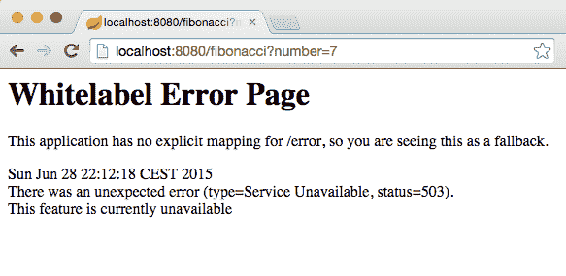
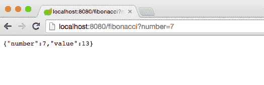
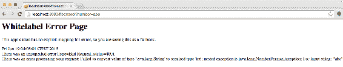
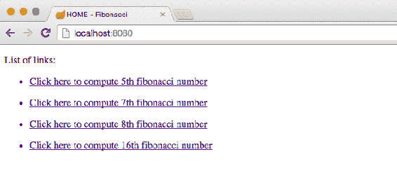
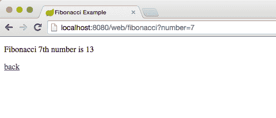
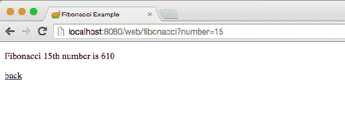

# 功能切换–将部分完成的功能部署到生产环境

“不要让环境控制你。你改变了环境。”

-成龙

到目前为止，我们已经看到了 TDD 如何使开发过程变得更容易，并减少了编写高质量代码所花费的时间。但这还有另一个特别的好处。随着代码被测试，其正确性被证明，我们可以更进一步，假设我们的代码在所有测试通过后就可以生产了。

有一些基于这种思想的软件生命周期方法。将介绍一些**极限编程**（**XP**）实践，如**持续集成**（**CI**）、持续交付和**持续部署**（**CD**等。代码示例可在[中找到 https://bitbucket.org/alexgarcia/packt-tdd-java/src/](https://bitbucket.org/alexgarcia/packt-tdd-java/src/) 、文件夹`10-feature-toggles`。

本章将介绍以下主题：

*   持续集成、交付和部署
*   在生产中测试应用程序
*   特征切换

# 持续集成、交付和部署

TDD 与 CI、连续交付或 CD 齐头并进。撇开差异不谈，这三种技术都有相似的目标。他们都在努力促进对我们代码的生产就绪性的持续验证。在这方面，它们与 TDD 非常相似。它们都促进了非常短的开发周期、对我们正在生成的代码的持续验证，以及将我们的应用程序持续保持在生产就绪状态的意图。

本书的范围不允许我们深入研究这些技术的细节。事实上，关于这个问题可以写一整本书。我们将简要解释这三者之间的区别。实践 CI 意味着我们的代码（几乎）始终与系统的其余部分集成，如果出现问题，它将很快出现。如果发生这种情况，首要任务是解决问题的根源，这意味着任何新的开发都必须降低优先级。您可能已经注意到这个定义和 TDD 工作方式之间的相似性。主要区别在于，对于 TDD，我们的主要关注点不是与系统其余部分的集成。其余的都一样。TDD 和 CI 都试图快速发现问题，并将解决问题视为最高优先级，将其他一切都搁置起来。CI 没有将整个管道自动化，在将代码部署到生产环境之前还需要额外的手动验证。

连续交付与 CI 非常相似，只是前者更进一步，并使整个管道自动化，只是实际部署到生产中。通过所有验证的每一次推送到存储库的操作都被认为是有效的，可以部署到生产环境中。但是，部署的决定是手动作出的。需要有人选择一个构建并将其推广到生产环境中。选择是政治性的还是功能性的。这取决于我们希望用户收到什么以及何时收到，即使每个用户都已准备好生产。

“持续交付是一种软件开发规程，您可以通过这种方式构建软件，以便随时将软件发布到生产中。”

-马丁·福勒

最后，当关于部署什么的决策也被自动化时，CD 就完成了。在这个场景中，通过所有验证的每个提交都部署到生产环境中，没有异常。

为了持续集成代码或将代码交付到生产环境中，分支不可能存在，或者从创建分支到将代码集成到主线之间的时间必须非常短（少于一天，最好是几个小时）。如果不是这样，我们就不会持续验证代码。

与 TDD 的真正联系来自于在提交代码之前创建验证的必要性。如果没有提前创建这些验证，则推送到存储库的代码不会伴随测试，并且该过程会失败。没有测试，人们对我们所做的没有信心。没有 TDD，我们的实现代码就没有测试。或者，延迟将提交推送到存储库，直到创建了测试，但在这种情况下，该过程没有连续的部分。代码一直保存在某人的计算机上，直到其他人完成测试。位于某个地方的代码不会针对整个系统进行持续验证。

总而言之，持续集成、交付和部署依赖于集成代码附带的测试（因此，依赖于 TDD）以及不使用分支或使其非常短暂（通常合并到主线）的实践。问题在于，有些功能无法开发得那么快。无论我们的功能有多小，在某些情况下，开发它们可能需要几天时间。在所有这些时间里，我们无法推送到存储库，因为过程将将它们交付到生产中。用户不希望看到部分功能。例如，交付部分登录过程是没有意义的。如果一个人看到一个带有用户名、密码和登录按钮的登录页面，但该按钮背后的过程实际上并不存储该信息，并提供（比方说）身份验证 cookie，那么充其量我们会让用户感到困惑。在其他一些情况下，一个功能在没有另一个功能的情况下无法工作。按照相同的示例，即使登录功能已完全开发，但如果没有注册，它也是毫无意义的。一个不能没有另一个。

想象一下玩拼图游戏。我们需要对最终的画面有一个大致的概念，但我们当时只专注于一个画面。我们挑选一块我们认为最容易放置的东西，并将它与它的邻居结合起来。只有当所有这些都到位时，画面才完整，我们也就完成了。

TDD 也是如此。我们通过关注小型单元来开发代码。随着我们的进步，他们开始成形并相互合作，直到他们全部融合。在我们等待这一切发生的时候，即使我们所有的测试都通过了，并且我们处于绿色状态，代码还没有为最终用户准备好。

解决这些问题且不影响 TDD 和 CI/CD 的最简单方法是使用功能切换。

# 特征切换

您可能也听说过这是**功能翻转**或**功能标志**。无论我们使用哪个表达式，它们都基于一种机制，允许您打开和关闭应用程序的功能。当所有代码合并到一个分支中并且必须处理部分完成（或集成）的代码时，这非常有用。使用此技术，可以隐藏未完成的功能，以便用户无法访问它们。

由于其性质，此功能还有其他可能的用途。当某个特定功能出现问题时充当断路器，提供应用程序的优雅降级，关闭辅助功能以保留用于业务核心操作的硬件资源，等等。在某些情况下，功能切换可以更进一步。我们可以使用它们来仅为某些用户启用功能，例如，基于地理位置或他们的角色。另一个用途是我们只能为测试人员启用新特性。这样，最终用户将继续忘记一些新特性的存在，而测试人员将能够在生产服务器上验证它们。

此外，在使用功能切换时，还有一些方面需要记住：

*   仅在完全部署并证明其工作正常之前使用切换开关。否则，您可能会得到一个充满了`if`/`else`语句的意大利面代码，其中包含不再使用的旧切换。
*   不要花太多时间测试切换开关。在大多数情况下，确认某些新功能的入口点不可见就足够了。例如，可以是指向新功能的链接。
*   不要过度使用开关。不需要时不要使用它们。例如，您可能正在开发一个可以通过主页中的链接访问的新屏幕。如果在末尾添加该链接，则可能不需要使用隐藏该链接的切换。

有许多很好的框架和库用于应用程序特性处理。其中两项是：

*   [**Togglz**](http://www.togglz.org/)
*   [**FF4J**](http://ff4j.org/)

这些库提供了一种复杂的功能管理方法，甚至可以添加基于角色或基于规则的功能访问。在许多情况下，您不需要它，但这些功能使我们能够在生产中测试新功能，而不向所有用户开放。然而，实现特性切换的自定义基本解决方案非常简单，我们将通过一个示例来说明这一点。

# 特征切换示例

下面是我们的演示应用程序。这一次，我们将构建一个简单而小型的**代表性状态转移**（**REST**服务，根据需要计算斐波那契序列的具体 N<sup class="calibre34">th</sup>位置。我们将使用文件跟踪启用/禁用的功能。为了简单起见，我们将使用 Spring Boot 作为我们的选择框架，并将 Thymeleaf 作为模板引擎。这也包含在 Spring 引导依赖项中。有关 Spring Boot 和相关项目的更多信息，请访问[http://projects.spring.io/spring-boot/](http://projects.spring.io/spring-boot/) 。此外，您还可以访问[http://www.thymeleaf.org/](http://www.thymeleaf.org/) 了解更多有关模板引擎的信息。

以下是`build.gradle`文件的外观：

```java
apply plugin: 'java' 
apply plugin: 'application' 

sourceCompatibility = 1.8 
version = '1.0' 
mainClassName = "com.packtpublishing.tddjava.ch09.Application" 

repositories { 
    mavenLocal() 
    mavenCentral() 
} 

dependencies { 
    compile group: 'org.springframework.boot', 
            name: 'spring-boot-starter-thymeleaf', 
            version: '1.2.4.RELEASE' 

    testCompile group: 'junit', 
    name: 'junit', 
    version: '4.12' 
} 
```

请注意，存在应用程序插件，因为我们希望使用 Gradle 命令`run`运行应用程序。以下是应用程序的`main`类：

```java
@SpringBootApplication 
public class Application { 
    public static void main(String[] args) { 
        SpringApplication.run(Application.class, args); 
    } 
} 
```

我们将创建属性文件。这次我们将使用**YAML 不是标记语言**（**YAML**格式），因为它非常全面和简洁。在`src/main/resources`文件夹中添加一个名为`application.yml`的文件，内容如下：

```java
features: 
    fibonacci: 
        restEnabled: false 
```

Spring 提供了一种自动加载此类属性文件的方法。目前，只有两个限制：名称必须为`application.yml`和/或文件应包含在应用程序的类路径中。

这是我们对该功能的`config`文件的实现：

```java
@Configuration 
@EnableConfigurationProperties 
@ConfigurationProperties(prefix = "features.fibonacci") 
public class FibonacciFeatureConfig { 
    private boolean restEnabled; 

    public boolean isRestEnabled() { 
        return restEnabled; 
    } 

    public void setRestEnabled(boolean restEnabled) { 
        this.restEnabled = restEnabled; 
    } 
} 
```

这是`fibonacci`服务类。这一次，计算操作将始终返回`-1`，只是为了模拟部分完成的功能：

```java
@Service("fibonacci") 
public class FibonacciService { 

    public int getNthNumber(int n) { 
        return -1; 
    } 
} 
```

我们还需要一个包装器来保存计算值：

```java
public class FibonacciNumber { 
    private final int number, value; 

    public FibonacciNumber(int number, int value) { 
        this.number = number; 
        this.value = value; 
    } 

    public int getNumber() { 
        return number; 
    } 

    public int getValue() { 
        return value; 
    } 
} 
```

这是`FibonacciRESTController`类，负责处理`fibonacci`服务查询：

```java
@RestController 
public class FibonacciRestController { 
    @Autowired 
    FibonacciFeatureConfig fibonacciFeatureConfig; 

    @Autowired 
    @Qualifier("fibonacci") 
    private FibonacciService fibonacciProvider; 

    @RequestMapping(value = "/fibonacci", method = GET) 
    public FibonacciNumber fibonacci( 
            @RequestParam( 
                    value = "number", 
                    defaultValue = "0") int number) { 
        if (fibonacciFeatureConfig.isRestEnabled()) { 
            int fibonacciValue = fibonacciProvider 
                    .getNthNumber(number); 
            return new FibonacciNumber(number, fibonacciValue); 
        } else throw new UnsupportedOperationException(); 
    } 

    @ExceptionHandler(UnsupportedOperationException.class) 
    public void unsupportedException(HttpServletResponse response) 
            throws IOException { 
        response.sendError( 
                HttpStatus.SERVICE_UNAVAILABLE.value(), 
                "This feature is currently unavailable" 
        ); 
    } 

    @ExceptionHandler(Exception.class) 
    public void handleGenericException( 
            HttpServletResponse response, 
            Exception e) throws IOException { 
        String msg = "There was an error processing " + 
                "your request: " + e.getMessage(); 
        response.sendError( 
                HttpStatus.BAD_REQUEST.value(), 
                msg 
        ); 
    } 
} 
```

注意，`fibonacci`方法是检查`fibonacci`服务应该启用还是禁用，在最后一种情况下为了方便起见抛出一个`UnsupportedOperationException`。还有两个错误处理功能；第一个用于处理`UnsupportedOperationException`，第二个用于一般异常处理。

现在所有组件都设置好了，我们只需要执行 Gradle 的
`run`命令：

```java
    $> gradle run

```

该命令将启动一个进程，该进程最终将在以下地址上设置服务器：`http://localhost:8080`。这可以在控制台输出中观察到：

```java
    ...
    2015-06-19 03:44:54.157  INFO 3886 --- [           main] o.s.w.s.handler.SimpleUrlHandlerMapping  : Mapped URL path [/webjars/**] onto handler of type [class org.springframework.web.servlet.resource.ResourceHttpRequestHandler]
    2015-06-19 03:44:54.160  INFO 3886 --- [           main] o.s.w.s.handler.SimpleUrlHandlerMapping  : Mapped URL path [/**] onto handler of type [class org.springframework.web.servlet.resource.ResourceHttpRequestHandler]
    2015-06-19 03:44:54.319  INFO 3886 --- [           main] o.s.w.s.handler.SimpleUrlHandlerMapping  : Mapped URL path [/**/favicon.ico] onto handler of type [class org.springframework.web.servlet.resource.ResourceHttpRequestHandler]
    2015-06-19 03:44:54.495  INFO 3886 --- [           main] o.s.j.e.a.AnnotationMBeanExporter        : Registering beans for JMX exposure on startup
    2015-06-19 03:44:54.649  INFO 3886 --- [           main] s.b.c.e.t.TomcatEmbeddedServletContainer : Tomcat started on port(s): 8080 (http)
    2015-06-19 03:44:54.654  INFO 3886 --- [           main] c.p.tddjava.ch09.Application             : Started Application in 6.916 seconds (JVM running for 8.558)
    > Building 75% > :run

```

一旦应用程序启动，我们就可以使用常规浏览器执行查询。查询的 URL 为`http://localhost:8080/fibonacci?number=7`。

这为我们提供了以下输出：



如您所见，当功能被禁用时，接收到的错误与 RESTAPI 发送的错误相对应。否则返回值应为`-1`。

# 实现斐波那契服务

你们中的大多数人可能熟悉斐波那契的数字。对于那些不知道自己是什么的人，这里有一个简单的解释。

Fibonacci's sequence is an integer sequence resulting from the recurrence *f(n) = f(n-1) - f(n - 2)*. The sequence starts with being *f(0) = 0* and *f(1) = 1*. All other numbers are generated applying the recurrence as many times as needed until a value substitution can be performed using either 0 or 1 known values.

That is: 0, 1, 1, 2, 3, 5, 8, 13, 21, 34, 55, 89, 144,...More info about Fibonacci's sequence can be found here: [http://www.wolframalpha.com/input/?i=fibonacci+sequence](http://www.wolframalpha.com/input/?i=fibonacci+sequence)

作为一项额外功能，我们希望限制值计算所需的时间，因此我们对输入施加约束；我们的服务将只计算从`0`到`30`的斐波那契数（包括这两个数）。

这是计算斐波那契数的类的可能实现：

```java
@Service("fibonacci") 
public class FibonacciService { 
    public static final int LIMIT = 30; 

    public int getNthNumber(int n) { 
        if (isOutOfLimits(n) { 
        throw new IllegalArgumentException( 
        "Requested number must be a positive " + 
           number no bigger than " + LIMIT); 
        if (n == 0) return 0; 
        if (n == 1 || n == 2) return 1; 
        int first, second = 1, result = 1; 
        do { 
            first = second; 
            second = result; 
            result = first + second; 
            --n; 
        } while (n > 2); 
        return result; 
    } 

    private boolean isOutOfLimits(int number) { 
        return number > LIMIT || number < 0; 
    } 
} 
```

为了简洁起见，TDD 红绿重构过程没有在演示中明确解释，而是通过开发呈现出来的。仅提供了带有最终测试的最终实施：

```java
public class FibonacciServiceTest { 
    private FibonacciService tested; 
    private final String expectedExceptionMessage = 
         "Requested number " + 
            "must be a positive number no bigger than " +  
            FibonacciService.LIMIT; 

    @Rule 
    public ExpectedException exception = ExpectedException.none(); 

    @Before 
    public void beforeTest() { 
        tested = new FibonacciService(); 
    } 

    @Test 
    public void test0() { 
        int actual = tested.getNthNumber(0); 
        assertEquals(0, actual); 
    } 

    @Test 
    public void test1() { 
        int actual = tested.getNthNumber(1); 
        assertEquals(1, actual); 
    } 

    @Test 
    public void test7() { 
        int actual = tested.getNthNumber(7); 
        assertEquals(13, actual); 
    } 

    @Test 
    public void testNegative() { 
        exception.expect(IllegalArgumentException.class); 
        exception.expectMessage(is(expectedExceptionMessage)); 
        tested.getNthNumber(-1); 
    } 

    @Test 
    public void testOutOfBounce() { 
        exception.expect(IllegalArgumentException.class); 
        exception.expectMessage(is(expectedExceptionMessage)); 
        tested.getNthNumber(31); 
    } 
} 
```

此外，我们现在可以打开`application.yml`文件中的`fibonacci`功能，使用浏览器执行一些查询，并检查进展情况：

```java
features: 
    fibonacci: 
        restEnabled: true 
```

执行 Gradle 的`run`命令：

```java
    $>gradle run
```

现在我们可以使用浏览器完全测试 REST API，数字介于`0`和`30`之间：



然后，我们使用大于`30`的数字进行测试，最后通过引入字符而不是数字：



# 使用模板引擎

我们正在启用和禁用`fibonacci`功能，但在许多其他情况下，功能切换可能非常有用。其中之一是隐藏链接到未完成功能的 web 链接。这是一个有趣的用途，因为我们可以使用它的 URL 测试我们发布到生产环境中的内容，但它将被其他用户隐藏，只要我们愿意。

为了说明这种行为，我们将使用前面提到的 Thymeleaf 框架创建一个简单的 web 页面。

首先，我们添加了一个新的`control`标志：

```java
features: 
    fibonacci: 
        restEnabled: true 
        webEnabled: true 
```

接下来，在配置类中映射此新标志：

```java
    private boolean webEnabled; 
    public boolean isWebEnabled() { 
        return webEnabled; 
    } 

    public void setWebEnabled(boolean webEnabled) { 
        this.webEnabled = webEnabled; 
    } 
```

我们将创建两个模板。第一个是主页。它包含一些指向不同斐波那契数计算的链接。这些链接应仅在功能启用时可见，因此有一个可选块来模拟此行为：

```java
<!DOCTYPE html> 
<html xmlns:th="http://www.thymeleaf.org"> 
<head lang="en"> 
    <meta http-equiv="Content-Type" 
          content="text/html; charset=UTF-8" /> 
    <title>HOME - Fibonacci</title> 
</head> 
<body> 
<div th:if="${isWebEnabled}"> 
    <p>List of links:</p> 
    <ul th:each="number : ${arrayOfInts}"> 
        <li><a 
            th:href="@{/web/fibonacci(number=${number})}" 
            th:text="'Compute ' + ${number} + 'th fibonacci'"> 
        </a></li> 
    </ul> 
</div> 
</body> 
</html> 
```

第二个仅显示计算出的斐波那契数的值，以及返回主页的链接：

```java
<!DOCTYPE html> 
<html xmlns:th="http://www.thymeleaf.org"> 
<head lang="en"> 
    <meta http-equiv="Content-Type" 
          content="text/html; charset=UTF-8" /> 
    <title>Fibonacci Example</title> 
</head> 
<body> 
<p th:text="${number} + 'th number: ' + ${value}"></p> 
<a th:href="@{/}">back</a> 
</body> 
</html> 
```

为了使两个模板都能工作，它们应该位于特定的位置。它们分别是`src/main/resources/templates/home.html`和`src/main/resources/templates/fibonacci.html`。

最后是杰作，它是连接所有这些并使其工作的控制器：

```java
@Controller 
public class FibonacciWebController { 
    @Autowired 
    FibonacciFeatureConfig fibonacciFeatureConfig; 

    @Autowired 
    @Qualifier("fibonacci") 
    private FibonacciService fibonacciProvider; 

    @RequestMapping(value = "/", method = GET) 
    public String home(Model model) { 
        model.addAttribute( 
            "isWebEnabled", 
            fibonacciFeatureConfig.isWebEnabled() 
        ); 
        if (fibonacciFeatureConfig.isWebEnabled()) { 
            model.addAttribute( 
                "arrayOfInts", 
                Arrays.asList(5, 7, 8, 16) 
            ); 
        } 
        return "home"; 
    } 

    @RequestMapping(value ="/web/fibonacci", method = GET) 
    public String fibonacci( 
            @RequestParam(value = "number") Integer number, 
            Model model) { 
        if (number != null) { 
            model.addAttribute("number", number); 
            model.addAttribute( 
                "value", 
                fibonacciProvider.getNthNumber(number)); 
        } 
        return "fibonacci"; 
    } 
} 
```

请注意，此控制器与 RESTAPI 示例中的前一个控制器有一些相似之处。这是因为两者都是用相同的框架构建的，并且使用相同的资源。但是，两者之间有细微差别；一个注释为`@Controller`，而不是两者都是`@RestController`。这是因为 web 控制器为模板页面提供自定义信息，而 RESTAPI 生成 JSON 对象响应。

让我们再次使用这个 Gradle 命令来看看它的工作情况：

```java
    $> gradle clean run

```

这是生成的主页：



这在访问斐波那契数字链接时显示：



但我们使用以下代码关闭该功能：

```java
features: 
    fibonacci: 
        restEnabled: true 
        webEnabled: false 
```

重新启动应用程序，我们浏览到主页，看到这些链接不再显示，但如果我们已经知道 URL，我们仍然可以访问该页面。如果我们手动写入`http://localhost:8080/web/fibonacci?number=15`，我们仍然可以访问该页面：



这种做法非常有用，但通常会给代码增加不必要的复杂性。不要忘记重构代码，删除不再使用的旧切换。它将使您的代码保持干净和可读性。另外，一个很好的方法是在不重新启动应用程序的情况下使其正常工作。有许多存储选项不需要重新启动，数据库是最常用的。

# 总结

功能切换是在生产环境中隐藏和/或处理部分完成的功能的好方法。对于那些按需将代码部署到生产环境的人来说，这听起来可能很奇怪，但在实践持续集成、交付或部署时，这种情况很常见。

我们已经介绍了这项技术，并讨论了其优缺点。我们还列举了一些切换功能可能有用的典型案例。最后，我们实现了两个不同的用例：使用非常简单的 RESTAPI 的功能切换和 web 应用程序中的功能切换。

尽管本章中介绍的代码功能齐全，但在这方面使用基于文件的属性系统并不常见。有许多库更适合于生产环境，它们可以帮助我们实现这项技术，提供许多功能，例如使用 web 界面处理功能、在数据库中存储首选项或允许访问具体的用户配置文件。

在下一章中，我们将把书中描述的 TDD 概念放在一起。我们将列举一些在以 TDD 方式编程时非常有用的好实践和建议。