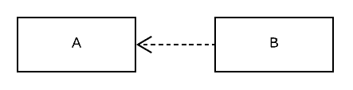
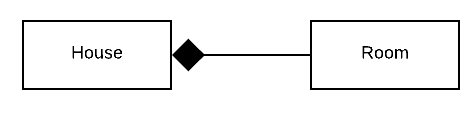
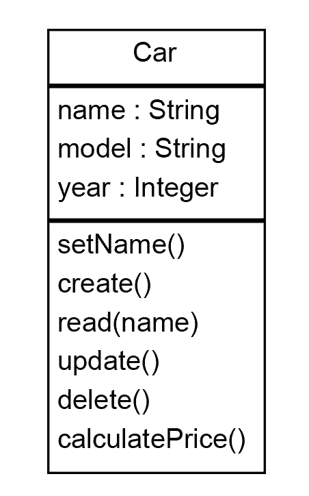
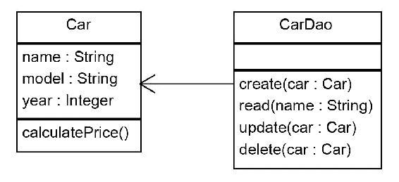
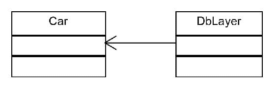
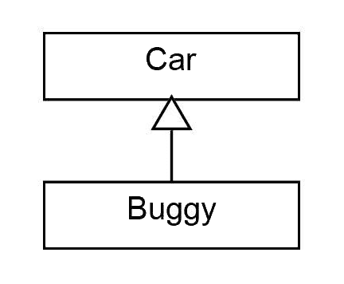
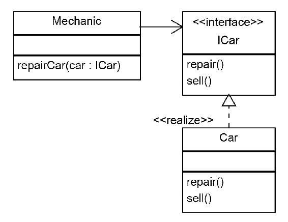
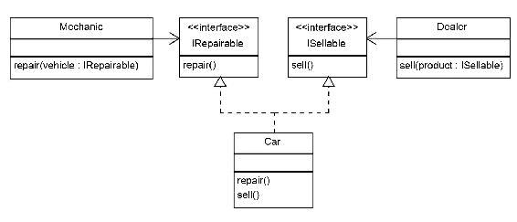

# 从面向对象到函数式编程

本章的目的是向读者介绍使用设计模式和 Java 中可用的最新特性编写健壮、可维护和可扩展代码的基本概念。为了实现我们的目标，我们将讨论以下主题：

*   什么是编程范式？
*   命令式范式
*   命令式和函数式范式
*   面向对象范式
*   统一建模语言综述
*   面向对象设计原则

# Java 简介

在 1995，一个新的编程语言被释放，灵感来自于著名的 C++ 和鲜为人知的 SimultalTalk。Java 是这门新语言的名字，它试图修复它的前身所具有的大部分局限性。例如，Java 的一个重要特性使它流行起来，那就是只需编写一次就可以在任何地方运行；也就是说，您可以在 Windows 机器上开发代码，然后在 Linux 或任何其他机器上运行，您所需要的只是一个 JVM。它还提供了垃圾收集等附加功能，使开发人员无需维护内存分配和释放；**即时编译器**（**JIT**）使 Java 智能化和快速化，删除指针等功能使其更加安全。前面提到的所有特性以及后来添加的 Web 支持使 Java 成为开发人员的热门选择。大约 22 年后，在一个新语言来去匆匆的世界里，java 10 已经成功地被社区发布和改编，这充分说明了 Java 的成功。

# Java 编程范式

什么是编程范式？自从软件开发开始，就有不同的方法来设计编程语言。对于每种编程语言，我们都有一套概念、原则和规则。这样一组概念、原则和规则称为编程范式。在理论上，语言被认为只属于一种范式，但在实践中，编程范式大多是在一种语言中结合起来的。

在下一节中，我们将重点介绍 Java 编程语言所基于的编程范式，以及描述这些范式的主要概念。它们是命令式、面向对象、声明式和函数式编程。

# 命令式程序设计

命令式编程是一种编程范式，在这种范式中，编写语句来改变程序的状态。这个概念出现在计算机的初期，非常接近计算机的内部结构。程序是在处理单元上运行的一组指令，它以命令式的方式改变状态（作为变量存储在内存中）。名称*命令*意味着执行的指令决定了程序的运行方式。

今天大多数最流行的编程语言都或多或少地基于命令式范式。主要是命令式语言的最好例子是 C。

# 现实生活中必不可少的例子

为了更好地理解命令式编程范式的概念，让我们举下面的例子：你在你的镇上和一个朋友见面，参加一个黑客竞赛，但他不知道如何去那里。我们将以一种必要的方式向他解释如何到达那里：

1.  从中心站乘有轨电车。
2.  在第三站下车。
3.  向右走，朝第六大道走，直到第三个路口。

# 面向对象范式

面向对象的范例通常与命令式编程相关联，但是在实践中，函数式范例和面向对象范例可以共存。Java 就是支持这种协作的活生生的证明。

在下一节中，我们将简要介绍主要的面向对象概念，因为它们是用 Java 语言实现的。

# 对象和类

对象是**面向对象编程**（**OOP**）语言的主要元素。对象同时包含状态和行为。

如果我们把类看作模板，那么对象就是模板的实现。例如，如果`Human`是一个类，它定义了一个人可以拥有的行为和属性，那么你和我就是这个`Human`类的对象，因为我们已经满足了作为一个人的所有要求。或者，如果我们认为汽车是一个阶级，一个特定的本田思域汽车将是这个阶级的对象。它将实现汽车的所有特性和行为，如发动机、方向盘、前照灯等，并具有前进、后退等行为。我们可以看到面向对象的范例是如何与现实世界联系在一起的。现实世界中几乎所有的东西都可以用类和对象来考虑，因此 OOP 变得轻松和流行。

面向对象编程基于四个基本原则：

*   封装
*   抽象
*   继承
*   多态（亚型多态）。

# 封装

**封装**基本上就是属性和行为的绑定。其思想是将对象的属性和行为保持在一个位置，以便易于维护和扩展。封装还提供了一种向用户隐藏不必要细节的机制。在 Java 中，我们可以为方法和属性提供访问说明符，以管理类用户可见的内容和隐藏的内容。

封装是面向对象语言的基本原则之一。它有助于不同模块的解耦。解耦模块可以或多或少地独立开发和维护。通过这种技术，解耦的模块/类/代码可以在不影响其外部公开行为的情况下进行内部更改，这种技术称为代码重构。

# 抽象

抽象与封装密切相关，在某种程度上，它与封装重叠。简单地说，抽象提供了一种机制，它公开了一个对象做什么，隐藏了这个对象如何做它应该做的事情。

一个真实的抽象例子是汽车。为了驾驶一辆汽车，我们并不需要知道汽车引擎盖下有什么，但我们需要知道它暴露给我们的数据和行为。数据显示在汽车的仪表板上，行为由我们可以用来驾驶汽车的控件表示。

# 继承

继承是将一个对象或类基于另一个对象或类的能力。有一个父类或基类，它为实体提供顶级行为。满足作为父类一部分的条件的每个子类实体或子类都可以从父类继承，并根据需要添加其他行为。

让我们举一个真实的例子。如果我们把`Vehicle`看作父类，我们就知道`Vehicle`可以有某些属性和行为。例如，它有一个引擎、门等等，而且它可以移动。现在，所有满足这些标准的实体，例如，`Car`、`Truck`、`Bike`等等，都可以从`Vehicle`继承并添加到给定的属性和行为之上。换句话说，我们可以说`Car`是`Vehicle`的*子类*。

让我们看看这将如何作为代码；我们将首先创建一个名为`Vehicle`的基类。该类有一个构造器，它接受一个`String`（车辆名称）：

```java
public class Vehicle 
{
  private Stringname;
  public Vehicle(Stringname)
  { 
    this.name=name;
  }
}
```

现在我们可以用构造器创建一个`Car`类。`Car`类派生自`Vehicle`类，因此继承并可以访问基类中声明为`protected`或`public`的所有成员和方法：

```java
public class Car extends Vehicle
{
  public Car(String name)
  {
    super(name)
  }
}
```

# 多态

广义地说，多态为我们提供了一种选择，可以为不同类型的实体使用相同的接口。多态有两种主要类型：编译时和运行时。假设你有一个`Shape`类，它有两个区域方法。一个返回圆的面积，它接受一个整数；也就是说，输入半径，它返回面积。另一种方法计算矩形的面积，并采用两种输入：长度和宽度。编译器可以根据调用中参数的数量来决定调用哪个`area`方法。这是多态的编译时类型。

有一群技术人员认为只有运行时多态才是真正的多态。运行时多态，有时也称为子类型多态，在子类继承超类并覆盖其方法时起作用。在这种情况下，编译器无法决定最终是执行子类实现还是执行超类实现，因此在运行时做出决定。

为了详细说明，让我们以前面的示例为例，向汽车类型添加一个新方法来打印对象的类型和名称：

```java
public String toString()
{
  return "Vehicle:"+name;
}
```

我们在派生的`Car`类中覆盖相同的方法：

```java
public String toString()
{ 
  return "Car:"+name;
}
```

现在我们可以看到子类型多态在起作用。我们创建一个`Vehicle`对象和一个`Car`对象。我们将每个对象分配给一个`Vehicle`变量类型，因为一个`Car`也是一个`Vehicle`。然后我们为每个对象调用`toString`方法。对于`vehicle1`，它是`Vehicle`类的一个实例，它将调用`Vehicle.toString()`类。`vehicle2`是`Car`类的实例，调用`Car`类的`toString`方法：

```java
Vehicle vehicle1 = new Vehicle("A Vehicle");
Vehicle vehicle2 = new Car("A Car")
System.out.println(vehicle1.toString());
System.out.println(vehicle2.toString());
```

# 声明式程序设计

让我们回到现实生活中的祈使式示例，在这个示例中，我们向朋友指示如何到达一个地方。当我们按照声明式编程范式思考时，我们可以简单地给他地址，让他知道如何到达那里，而不是告诉我们的朋友如何到达特定的位置。在这种情况下，我们告诉他该怎么做，而我们并不关心他是否使用地图或 GPS，或者他是否向某人请示：“早上 9:30 在第五大道和第九大道的交界处”。

与命令式编程相反，声明式编程是一种编程范式，它指定程序应该做什么，而不指定如何做。纯声明性语言包括数据库查询语言，如 SQL 和 XPath，以及正则表达式。

声明式编程语言比命令式编程语言更抽象。它们不模仿硬件结构，因此，它们不改变程序的状态，而是将程序转换为新的状态，更接近于数学逻辑。

一般来说，非强制性的编程风格被认为属于声明性的范畴。这就是为什么有许多类型的范式属于声明性范畴。在我们的探索中，我们将看到与我们的旅程范围相关的唯一一个：函数式编程。

# 函数式程序设计

函数式编程是声明式编程的一个子范式。与命令式编程相反，函数式编程不会改变程序的内部状态。

在命令式编程中，函数可以更多地看作是指令序列、例程或过程。它们不仅依赖于存储在内存中的状态，还可以改变这种状态。这样，调用具有相同参数的命令函数可以根据当前程序的状态产生不同的结果，同时，执行的函数可以更改程序的变量。

在函数式编程术语中，函数类似于数学函数，函数的输出只取决于它的参数，而不管程序的状态如何，同时不受函数执行的影响。

自相矛盾的是，虽然命令式编程自计算机诞生以来就已经存在，但函数式编程的基本概念可以追溯到这之前。大多数函数式语言都是基于 Lambda 演算的，Lambda 演算是由数学家 Alonzo Church 在 20 世纪 30 年代创建的一种形式化的数理逻辑系统。

函数式语言在那个时代如此流行的原因之一是它们可以很容易地在并行环境中运行。这不应与多线程混淆。允许函数式语言并行运行的主要特性是它们所依赖的基本原则：函数只依赖于输入参数，而不依赖于程序的状态。也就是说，它们可以在任何地方运行，然后将多个并行执行的结果连接起来并进一步使用。

# 使用集合与使用流

每个使用 Java 的人都知道集合。我们以一种强制性的方式使用集合：我们告诉程序如何做它应该做的事情。让我们以下面的示例为例，其中我们实例化了一个由 10 个整数组成的集合，从 1 到 10：

```java
List<Integer> list = new ArrayList<Integer>();
for (int i = 0; i < 10; i++)
{
  list.add(i);
}
```

现在，我们将创建另一个集合，在其中只过滤奇数：

```java
List<Integer> odds = new ArrayList<Integer>();
for (int val : list)
{
  if (val % 2 == 0)
  odds.add(val);
}
```

最后，我们要打印结果：

```java
for (int val : odds)
{
  System.out.print(val);
}
```

如您所见，我们编写了相当多的代码来执行三个基本操作：创建数字集合、过滤奇数，然后打印结果。当然，我们可以只在一个循环中完成所有的操作，但是如果我们完全不使用一个循环呢？毕竟，使用循环意味着我们告诉程序如何完成它的任务。从 Java8 开始，我们就可以使用流在一行代码中完成同样的任务：

```java
IntStream
.range(0, 10)
.filter(i -> i % 2 == 0)
.forEach( System.out::print );
```

流在`java.util.stream`包中定义，用于管理可以执行功能样式操作的对象流。流是集合的功能对应者，为映射和归约操作提供支持。

我们将在后面的章节中进一步讨论 Java 中的流和函数编程支持。

# 统一建模语言简介

**统一建模语言**（**UML**）是一种建模语言，它帮助我们表示软件是如何构造的，不同的模块、类和对象是如何相互作用的，它们之间的关系是什么。

UML 经常与面向对象设计结合使用，但是它的范围更广。但是，这超出了本书的范围，因此，在下一节中，我们将重点介绍与本书相关的 UML 特性。

在 UML 中，我们可以定义一个系统的结构和行为，我们可以通过图表来可视化模型或部分模型。有两种类型的图表：

*   结构图用来表示系统的结构。有许多类型的结构图，但我们只对类图感兴趣。对象、包和组件图类似于类图。
*   行为图用于描述系统的行为。交互图是行为图的子集，用于描述系统不同组件之间的控制流和数据流。在行为图中，序列图在面向对象设计中得到了广泛的应用。

类图是在面向对象的设计和开发阶段使用最多的一种图。它们是一种结构图，用于说明类的结构以及它们之间的关系：


类图对于描述类在应用中的结构非常有用。大多数情况下，只看结构就足以理解类是如何交互的，但有时这还不够。对于这些情况，我们可以使用行为图和交互图，其中序列图用于描述类和对象的交互。让我们用一个序列图来展示在继承和多态示例中，`Car`和`Vehicle`对象是如何交互的：


# 类的关系

在面向对象编程中，除了表示基本概念之一的继承关系外，还有一些其他类关系可以帮助我们建模和开发复杂的软件系统：

*   泛化与实现
*   依赖
*   关联、聚合和组合

# 泛化

继承也称为 **IS-A** 关系，因为从另一个类继承的类可以用作超类。

当一个类表示多个类的共享特征时，称为**泛化**；例如**车辆**是**自行车**、**轿车**、**卡车**的泛化。类似地，当一个类代表一个普通类的特殊实例时，它被称为**特化**，所以**轿车**是**车辆**的特化，如下图所示：


在 UML 术语中，描述继承的关系称为泛化。

# 实现

如果泛化是 UML 中面向对象继承的对应术语，那么在 UML 中，实现表示面向对象编程中类对接口的实现。

假设我们创建了一个名为`Lockable`的接口，该接口仅由可锁定的`Car`实现。在本例中，前面的图的一个版本为`Car`类实现`Lockable`：


# 依赖

依赖关系是 UML 关系中最通用的类型之一。它用于定义一个类以某种方式依赖于另一个类，而另一个类可能依赖于也可能不依赖于第一个类。从属关系用于表示不属于以下各节所述情形之一的关系。依赖有时被称为 **USES-A** 关系。

通常，在面向对象编程语言中，依赖关系用于描述一个类是否在方法的签名中包含第二个类的参数，或者它是否通过将第二个类的实例传递给其他类而不使用它们（不调用其方法）来创建第二个类的实例：



# 关联

关联表示两个实体之间的关系。有两种类型的关联，即组合和聚合。通常，关联由箭头表示，如下图所示：


# 聚合

聚合是一种特殊的关联类型。如果继承被认为是 IS-A 关系，那么聚合可以被认为是 **HAS-A** 关系。

聚合用于描述两个或多个类之间的关系，从逻辑角度来看，一个类包含另一个类，但包含的类的实例可以独立于第一个类，在其上下文之外，或者可以在其他类之间共享。例如，一个**学院**有一个**老师**；另外，每个**老师**必须属于**学院**，但是如果**学院**不存在，一个**老师**仍然可以是活动的，如下图所示：


# 组合

顾名思义，一个类是另一个类的组合。这在某种程度上类似于聚合，区别在于当主类不存在时，依赖类就不存在了。例如**房屋**由**房间**组成，但**房屋**被毁后**房间**不复存在，如下图所示：



在实践中，尤其是在 Java 等具有垃圾收集器的语言中，组合和聚合之间的边界没有得到很好的定义。对象不会被手动销毁；当它们不再被引用时，垃圾收集器会自动销毁它们。因此，从编码的角度来看，我们不应该真正关心我们是否处理组合或聚合关系，但是如果我们想在 UML 中有一个定义良好的模型，这一点很重要。

# 设计模式与原则

软件开发是一个不仅仅是编写代码的过程，无论您是在一个大型团队中工作还是在一个人的项目中工作。应用的结构方式对软件应用的成功程度有着巨大的影响。

当我们谈论一个成功的软件应用时，我们不仅要讨论应用是如何完成它应该做的事情，还要讨论我们在开发它上投入了多少精力，以及它是否易于测试和维护。如果不以正确的方式进行，飞涨的开发成本将导致一个没有人想要的应用。

软件应用是为了满足不断变化和发展的需求而创建的。一个成功的应用还应该提供一个简单的方法，通过它可以扩展以满足不断变化的期望。

幸运的是，我们不是第一个遇到这些问题的人。一些问题已经面临并得到处理。在软件的设计和开发过程中，应用一套面向对象的设计原则和模式，可以避免或解决这些常见问题。

面向对象的设计原则也称为**实体**。这些原则是在设计和开发软件时可以应用的一组规则，以便创建易于维护和开发的程序。它们最初是由 robertc.Martin 介绍的，它们是敏捷软件开发过程的一部分。实体原则包括单一责任原则、开闭原则、Liskov 替代原则、接口分离原则和依赖倒置原则。

除了设计原则之外，还有面向对象的设计模式。设计模式是可以应用于常见问题的通用可重用解决方案。遵循 Christopher Alexander 的概念，设计模式首先被 Kent Beck 和 Ward Cunningham 应用到编程中，并在 1994 年被所谓的**四人帮**（**GOF**）一书所推广。在下一节中，我们将介绍坚实的设计原则，在接下来的章节中，设计模式将遵循这些原则。

# 单一责任原则

单一责任原则是一种面向对象的设计原则，它规定软件模块只有一个改变的理由。在大多数情况下，在编写 Java 代码时，我们会将其应用于类。

单一责任原则可以被视为使封装发挥最佳效果的良好实践。更改的原因是触发更改代码的需要。如果一个类受到多个更改原因的影响，那么每个原因都可能引入影响其他原因的更改。当这些更改单独管理但影响同一模块时，一组更改可能会破坏与其他更改原因相关的功能。

另一方面，每一个改变的责任/理由都会增加新的依赖关系，使得代码不那么健壮，更难改变。

在我们的示例中，我们将使用数据库来持久化对象。假设`Car`类增加了方法来处理创建、读取、更新、删除的数据库操作，如下图所示：



在这种情况下，`Car`将不仅封装逻辑，而且封装数据库操作（两个职责是更改的两个原因）。这将使我们的类更难维护和测试，因为代码是紧密耦合的。`Car`类将依赖于数据库，因此如果将来要更改数据库系统，则必须更改`Car`代码。这可能会在`Car`逻辑中产生错误。

相反，更改`Car`逻辑可能会在数据持久性中产生错误。

该解决方案将创建两个类：一个封装`Car`逻辑，另一个负责持久性：



# 开/关原则

这一原则如下：

模块、类和函数应该为扩展而打开，为修改而关闭

应用这一原则将有助于我们开发复杂而健壮的软件。我们必须想象我们开发的软件正在构建一个复杂的结构。一旦我们完成了它的一部分，我们就不应该再修改它，而应该在它的基础上进行构建。

开发软件的时候，也是一样的。一旦我们开发并测试了一个模块，如果我们想改变它，我们不仅要测试我们正在改变的功能，还要测试它负责的整个功能。这涉及到大量额外的资源，这些资源可能从一开始就无法估计，而且还可能带来额外的风险。一个模块中的更改可能会影响其他模块或整个模块的功能。以下为图示：



因此，最佳实践是在模块完成后保持不变，并通过使用继承和多态扩展模块来添加新功能。开/闭原则是最重要的设计原则之一，是大多数设计模式的基础。

# 里氏替换原则

barbaraliskov 指出，*派生类型必须完全可以替代它们的基类型*。**里氏替代原则**（**LSP**）与亚型多态密切相关。基于面向对象语言中的子类型多态，派生对象可以用其父类型替换。例如，如果我们有一个`Car`对象，它可以在代码中用作`Vehicle`。

LSP 声明，在设计模块和类时，我们必须确保从行为的角度来看派生类型是可替换的。当派生类型被其父类型替换时，其余代码将以子类型的形式对其进行操作。从这个角度来看，派生类型的行为应该和它的父类型一样，而不应该破坏它的行为。这被称为强行为亚型。

为了理解 LSP，让我们举一个违反原则的例子。在开发汽车服务软件时，我们发现需要对以下场景进行建模。当一辆汽车被留下来维修时，车主就离开了汽车。服务助理拿着钥匙，当车主离开时，他去检查他是否有正确的钥匙，是否发现了正确的车。他只需打开门锁，然后把钥匙放在一个指定的地方，上面有一张便条，这样修理工在检查汽车时就可以很容易地取起来。

我们已经定义了一个`Car`类。我们现在创建一个`Key`类，并在`Car`类中添加两个方法：`lock`和`unlock`。我们添加了相应的方法，以便助手检查钥匙是否与汽车匹配：

```java
public class Assistant
{
  void checkKey(Car car, Key key)
  {
    if ( car.lock(key) == false ) System.out.println("Alert! Wrong 
    key, wrong car or car lock is broken!");
  }  
}
```

示意图如下：


在使用我们的软件时，我们意识到，小车有时是通过汽车服务来维修的。由于小车是四轮车，我们创建了一个`Buggy`类，继承自`Car`：



四轮马车没有门，所以不能上锁或开锁。我们相应地实现我们的代码：

```java
public bool lock(Key key)
{
  // this is a buggy so it can not be locked return false;
}
```

我们设计的软件适用于汽车，不管它们是否是小车，因此将来我们可能会将其扩展到其他类型的汽车。一个问题可能是因为汽车需要上锁和开锁。

# 接口分离原则

以下引用自[这个页面](https://www.oodesign.com/interface-segregation-principle.html)：

“不应强迫客户依赖他们不使用的接口。”

应用时，**接口分离原则**（**ISP**）减少了代码耦合，使软件更健壮，更易于维护和扩展。ISP 最初是由 robertmartin 宣布的，当时他意识到，如果这个原则被打破，客户端被迫依赖于他们不使用的接口，那么代码就变得紧密耦合，几乎不可能为它添加新的功能。

为了更好地理解这一点，让我们再次以汽车服务为例（参见下图）。现在我们需要实现一个名为·Mechanic的类。技工修车，所以我们增加了一种修车方法。在这种情况下，`Mechanic`类依赖于`Car`类。然而，`Car`类比`Mechanic`类需要更多的方法：



这是一个糟糕的设计，因为如果我们想用另一辆车替换一辆车，我们需要在`Mechanic`类中进行更改，这违反了开/关原则。相反，我们必须创建一个只公开`Mechanic`类中所需的相关方法的接口，如下图所示：



# 依赖倒置原则

“高级模块不应依赖于低级模块。两者都应该依赖于抽象。”

“抽象不应该依赖于细节。细节应该取决于抽象。”

为了理解这一原理，我们必须解释耦合和解耦的重要概念。耦合是指软件系统的模块之间相互依赖的程度。依赖性越低，系统的维护和扩展就越容易。

有不同的方法来解耦系统的组件。其中之一是将高级逻辑与低级模块分开，如下图所示。在这样做的时候，我们应该通过使它们依赖于抽象来减少两者之间的依赖性。这样，可以在不影响其他模块的情况下更换或扩展其中任何模块：


# 总结

在本章中，我们介绍了 Java 中使用的主要编程范式。我们已经了解到两种不同的范式，如命令式编程和函数式编程，可以在同一种语言中共存；我们还了解了 Java 如何从纯命令式面向对象编程发展到集成函数式编程元素。

尽管 Java 从版本 8 开始引入了新的功能元素，但它的核心仍然是一种面向对象的语言。为了编写易于扩展和维护的可靠而健壮的代码，我们学习了面向对象编程语言的基本原理。

开发软件的一个重要部分是设计程序组件的结构和所需的行为。这样，我们就可以在大型系统上工作，在大型团队中工作，在团队内部或团队之间共享我们的面向对象设计。为了能够做到这一点，我们重点介绍了与面向对象设计和编程相关的主要 UML 图和概念。我们在书中还广泛地使用 UML 来描述这些例子。

在介绍了类关系并展示了如何在图中表示它们之后，我们进入下一节，在这里我们描述了什么是面向对象的设计模式和原则，并介绍了主要原则。

在下一章中，我们将继续介绍一组处理对象创建的设计模式，使我们的代码具有健壮性和可扩展性。