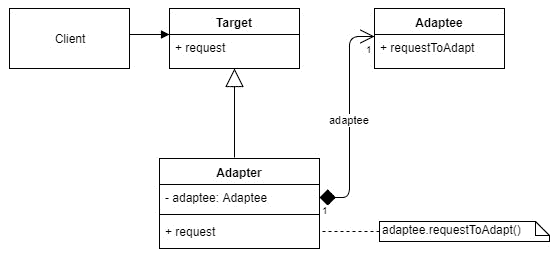
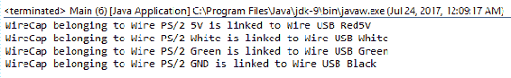
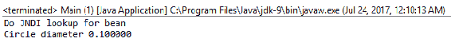
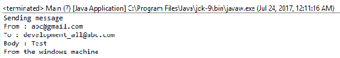
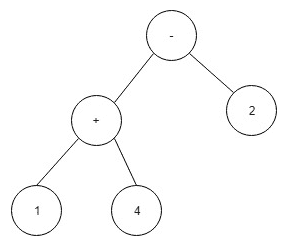
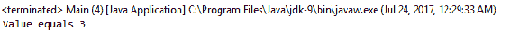
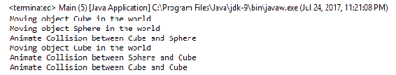

# 结构模式

本章的目的是学习结构模式。结构模式是通过利用对象和类之间的关系来创建复杂结构的模式。大多数结构模式都是基于继承的。在本章中，我们将只关注以下 GOF 模式：

*   适配器模式
*   代理模式
*   桥型
*   装饰图案
*   复合图案
*   正面图案
*   flyweight 图案

我们可能无法详细介绍其他已确定的结构模式，但值得了解。具体如下：

*   **标记接口**：使用空接口标记特定类（如 serializable），从而可以按接口名进行搜索。有关更多信息，请阅读文章*第 37 项-使用标记接口定义类型*，[http://thefinestratist.com/effective-java/37](http://thefinestartist.com/effective-java/37)，引用了乔舒亚·布洛赫的*有效 Java（第二版）*。
*   **模块**：将类分组，实现软件模块的概念。模块化架构包含多种模式，Kirk knorenschild 在[中对此进行了清晰的解释 https://dzone.com/refcardz/patterns-modular-architecture](https://dzone.com/refcardz/patterns-modular-architecture)。Java9 模块就是这种模式的一个例子，请参阅[https://labs.consol.de/development/2017/02/13/getting-started-with-java9-modules.html](https://labs.consol.de/development/2017/02/13/getting-started-with-java9-modules.html)。
*   **扩展对象**：在运行时改变现有的对象接口。更多信息请访问[http://www.brockmann-consult.de/beam-wiki/display/beam/Extension+Object+Pattern](http://www.brockmann-consult.de/beam-wiki/display/BEAM/Extension+Object+Pattern)。
*   **Twin**：这为不支持多重继承的语言添加了多重继承功能。Java8 通过添加默认方法支持类型的多个继承。即便如此，孪生模式在某些情况下仍然有用。Java 设计模式 com 站点在[中对 twin 模式有很好的描述 http://java-design-patterns.com/patterns/twin/](http://java-design-patterns.com/patterns/twin/)。

# 适配器模式

适配器模式为代码重用提供了一个解决方案；它将现有的旧代码适配/包装到新的接口，这些接口在原始代码的设计时是未知的。1987 年，当 PS/2 端口被设计出来时，没有人想到它会连接到 9 年后设计的 USB 总线上。然而，我们仍然可以使用一个旧的 PS/2 键盘在我们最新的电脑连接到 USB 端口。

适配器模式通常在处理遗留代码时使用，因为通过包装现有代码并使其适应新的代码接口，我们可以立即访问已经测试过的旧功能。这可以通过使用多个继承（在 Java8 中默认的接口实现是可能的）来实现，也可以通过使用组合（旧对象成为类属性）来实现。适配器模式也称为**包装器**。

如果旧代码需要使用新代码，反之亦然，我们需要使用一个称为双向适配器的特殊适配器，它实现两个接口（旧接口和新接口）。

JDK 中的`java.io.InputStreamReader`和`java.io.OutputStreamWriter`类是适配器，因为它们将 JDK1.0 中的输入/输出流对象适配到稍后在 JDK1.1 中定义的读写器对象。

# 意图

其目的是将现有的旧接口应用到新的客户机接口。目标是尽可能地重用旧的和已经测试过的代码，同时可以自由地对新接口进行更改。

# 实施

下面的 UML 图对新客户机代码和修改后的代码之间的交互进行了建模。适配器模式通常是通过使用多重继承在其他语言中实现的，从 Java8 开始这是部分可能的。我们将使用另一种方法，这种方法也适用于较旧的 Java 版本；我们将使用聚合。它比继承更具限制性，因为我们无法访问受保护的内容，只能访问适配器公共接口：



我们可以从实现图中区分以下参与者：

*   客户机：代码客户机
*   Adapter：将调用转发给被适配器的适配器类
*   Adaptee：需要修改的旧代码
*   目标：要支持的新接口

# 示例

下面的代码模拟在 USB 总线中使用 PS/2 键盘。它定义了一个 PS/2 键盘（适配器）、一个 USB 设备接口（目标）、一个 PS2ToUSBAdapter（适配器）和使设备工作的连接线：

```
package gof.structural.adapter;
import java.util.Arrays;
import java.util.Collections;
import java.util.List;
class WireCap 
{
  WireCap link = WireCap.LooseCap;
  private Wire wire;
  publicstatic WireCap LooseCap = new WireCap(null);
  public WireCap(Wire wire) 
  {
    this.wire = wire; 
  }
  publicvoid addLinkTo(WireCap link) 
  {
    this.link = link;
  }
  public Wire getWire() 
  {
    return wire;
  }
  public String toString() 
  {
    if (link.equals(WireCap.LooseCap))
    return "WireCap belonging to LooseCap";
    return "WireCap belonging to " + wire + " is linked to " + 
    link.getWire();
  }
  public WireCap getLink() 
  {
    return link;
  }
}
```

顾名思义，`WireCap`类模型是每根导线的两端。默认情况下，所有导线都是松的；因此，我们需要一种方法来发出信号。这是通过使用空对象模式来完成的，`LooseCap`是我们的空对象（一个空替换，它不抛出`NullPointerException`）。请看下面的代码：

```
class Wire 
{
  private String name;
  private WireCap left;
  private WireCap right;
  public Wire(String name) 
  {
    this.name = name;
    this.left = new WireCap(this);
    this.right = new WireCap(this);
  }
  publicvoid linkLeftTo(Wire link) 
  {
    left.addLinkTo(link.getRightWireCap());
    link.getRightWireCap().addLinkTo(left);
  }
  public WireCap getRightWireCap() 
  {
    return right;
  }
  publicvoid printWireConnectionsToRight() 
  {
    Wire wire = this;
    while (wire.hasLinkedRightCap()) 
    {
      wire.printRightCap();
      wire = wire.getRightLink();
    }
  }
  public Wire getRightLink() 
  {
    return getRightWireCap().getLink().getWire();
  }
  publicvoid printRightCap() 
  {
    System.out.println(getRightWireCap());
  }
  publicboolean hasLinkedRightCap() 
  {
    return !getRightWireCap().link.equals(WireCap.LooseCap);
  }
  public String getName() 
  {
    return name;
  }
  public String toString() 
  {
    return "Wire " + name;
  }
}
```

`Wire`类对来自 USB 或 PS/2 设备的电线进行建模。它有两端，默认情况下是松散的，如以下代码所示：

```
class USBPort 
{
  publicfinal Wire wireRed = new Wire("USB Red5V");
  publicfinal Wire wireWhite = new Wire("USB White");
  publicfinal Wire wireGreen = new Wire("USB Green");
  publicfinal Wire wireBlack = new Wire("USB Black");
}
```

根据 USB 规范，USBPort 有四根导线：5V 红色、绿色和白色导线用于数据，黑色导线用于接地，如下代码所示：

```
interface PS2Device
{
  staticfinal String GND = "PS/2 GND";
  staticfinal String BLUE = "PS/2 Blue";
  staticfinal String BLACK = "PS/2 Black";
  staticfinal String GREEN = "PS/2 Green";
  staticfinal String WHITE = "PS/2 White";
  staticfinal String _5V = "PS/2 5V";
  public List<Wire> getWires();
  publicvoid printWiresConnectionsToRight();
}
class PS2Keyboard implements PS2Device 
{
  publicfinal List<Wire> wires = Arrays.asList(
  new Wire(_5V),
  new Wire(WHITE),
  new Wire(GREEN),
  new Wire(BLACK),
  new Wire(BLUE),
  new Wire(GND));
  public List<Wire> getWires() 
  {
    return Collections.unmodifiableList(wires); 
  }
  publicvoid printWiresConnectionsToRight() 
  {
    for(Wire wire : wires)
    wire.printWireConnectionsToRight();
  }
}
```

`PS2Keyboard`是适配器。我们需要使用的是旧设备，如下代码所示：

```
interface USBDevice 
{
  publicvoid plugInto(USBPort port);
}
```

`USBDevice`是目标接口。它知道如何与`USBPort`接口，如下代码所示：

```
class PS2ToUSBAdapter implements USBDevice 
{
  private PS2Device device;
  public PS2ToUSBAdapter(PS2Device device) 
  {
    this.device = device;
  }
  publicvoid plugInto(USBPort port) 
  {
    List<Wire> ps2wires = device.getWires();
    Wire wireRed = getWireWithNameFromList(PS2Device._5V, 
    ps2wires);
    Wire wireWhite = getWireWithNameFromList(PS2Device.WHITE,
    ps2wires);
    Wire wireGreen = getWireWithNameFromList(PS2Device.GREEN,
    ps2wires);
    Wire wireBlack = getWireWithNameFromList(PS2Device.GND, 
    ps2wires);
    port.wireRed.linkLeftTo(wireRed);
    port.wireWhite.linkLeftTo(wireWhite);
    port.wireGreen.linkLeftTo(wireGreen);
    port.wireBlack.linkLeftTo(wireBlack);
    device.printWiresConnectionsToRight();
  }
  private Wire getWireWithNameFromList(String name, List<Wire>
  ps2wires) 
  {
    return ps2wires.stream()
    .filter(x -> name.equals(x.getName()))
    .findAny().orElse(null);
  }
}
```

`PS2ToUSBAdapter`是我们的适配器类。它知道如何布线，以便新的`USBPort`仍然可以使用旧的设备，如下代码所示：

```
publicclass Main
{
  publicstaticvoid main (String[] args)
  {
    USBDevice adapter = new PS2ToUSBAdapter(new PS2Keyboard());
    adapter.plugInto(new USBPort());
  }
}
```

输出如下：



正如预期的那样，我们的设备已连接到 USB 端口并准备好使用。所有接线都已完成，例如，如果 USB 端口将红线设置为 5 伏，则该值将到达键盘，如果键盘通过绿线发送数据，则该值将到达 USB 端口。

# 代理模式

每当您使用企业或 springbeans、模拟实例和实现 AOP 时，对具有相同接口的另一个对象进行 RMI 或 JNI 调用，或者直接/间接使用`java.lang.reflect.Proxy`，都会涉及到代理对象。它的目的是提供一个真实对象的代理，具有完全相同的封装外形。它在调用之前或之后执行其他操作时将工作委托给它。代理类型包括：

*   **远程代理**：将工作委托给远程对象（不同的进程、不同的机器），例如企业 bean。使用 JNI 手动或自动地使用 JNI 包装现有的非 java 旧代码（例如，使用 SWIG 生成胶粘代码）参见席 T2http://www.swig.org/Doc1.3/Java.html#imclass 是一种远程代理模式，因为它使用句柄（C/C++中的指针）访问实际对象。
*   **保护代理**：进行安全/权限检查。
*   **缓存代理**：使用记忆加速调用。最好的例子之一是 Spring`@Cacheable`方法，它缓存特定参数的方法结果，不调用实际代码，而是从缓存返回先前计算的结果。
*   **虚拟和智能代理**。这些增加了方法的功能，比如记录性能度量（创建一个`@Aspect`，为所需的方法定义一个`@Pointcut`，并定义一个`@Around`通知）或者进行延迟初始化。

适配器和代理之间的主要区别在于代理提供完全相同的接口。decorator 模式增强了接口，而适配器改变了接口。

# 意图

其目的是为真实对象提供代理，以便更好地控制它。它是一个实际对象的句柄，其行为类似于它，因此使客户机代码使用它就像使用实际对象一样。

# 实施

下图对代理模式进行了建模。请注意，由于 real 和 proxy 主题都实现了相同的接口，因此它们可以互换：


我们可以在实现图中区分以下参与者：

*   **主题**：客户端使用的现有接口
*   **RealSubject**：真实对象的类
*   **ProxySubject**：代理类

# 示例

下面的代码模拟从 localhost EJB 上下文中查找 bean 的远程代理。我们的远程代理是在另一个 JVM 中运行的几何计算器。我们将使用工厂方法来制作代理和真实对象，以证明它们是可互换的。代理版本的计算时间更长，因为我们还模拟 JNI 查找部分并发送/检索结果。看看代码：

```
package gof.structural.proxy;
publicclass Main
{
  publicstaticvoid main (String[] args) throws java.lang.Exception
  {
    GeometryCalculatorBean circle = GeometryCalculatorBeanFactory.
    REMOTE_PROXY.makeGeometryCalculator();
    System.out.printf("Circle diameter %fn",    
    circle.calculateCircleCircumference(new Circle()));
  }
}
class Circle 
{}
interface GeometryCalculatorBean 
{
  publicdouble calculateCircleCircumference(Circle circle);
}
```

这是我们的主题，我们要实现的接口。模拟`@RemoteInterface`和`@LocalInterface`接口的建模，如下代码所示：

```
class GeometryBean implements GeometryCalculatorBean 
{
  publicdouble calculateCircleCircumference(Circle circle) 
  {
    return 0.1f;
  }
}
```

这是我们真正的主题，知道如何执行实际的几何计算，如以下代码所示：

```
class GeometryBeanProxy implements GeometryCalculatorBean 
{
  private GeometryCalculatorBean bean;
  public GeometryBeanProxy() throws Exception 
  {
    bean = doJNDILookup("remote://localhost:4447", "user", 
    "password");
  }
  private GeometryCalculatorBean doJNDILookup
  (final String urlProvider, final String securityPrincipal, final  
  String securityCredentials)
  throws Exception 
  {
    System.out.println("Do JNDI lookup for bean");
    Thread.sleep(123);//simulate JNDI load for the remote location
    return GeometryCalculatorBeanFactory.LOCAL.
    makeGeometryCalculator();
  }
  publicdouble calculateCircleCircumference(Circle circle) 
  {
    return bean.calculateCircleCircumference(circle);
  }
}
```

这是我们的代理主题。请注意，它没有业务逻辑；它在设法建立对它的句柄之后，将它委托给真正的主题，如以下代码所示：

```
enum GeometryCalculatorBeanFactory 
{
  LOCAL 
  {
    public GeometryCalculatorBean makeGeometryCalculator() 
    {
      returnnew GeometryBean();
    }
  },
  REMOTE_PROXY 
  {
    public GeometryCalculatorBean makeGeometryCalculator() 
    {
      try 
      {
        returnnew GeometryBeanProxy();
      } 
      catch (Exception e) 
      {
        // TODO Auto-generated catch block
        e.printStackTrace();
      }
      returnnull;
    }
  };
  publicabstract GeometryCalculatorBean makeGeometryCalculator();
}
```

以下输出显示代理成功链接到真实对象并执行所需的计算：



# 装饰者模式

有时我们需要在不影响现有代码的情况下，向现有代码添加或从现有代码中删除功能，有时创建子类是不实际的。在这些情况下，decorator 非常有用，因为它允许在不更改现有代码的情况下这样做。它通过实现相同的接口、聚合要修饰的对象、将所有公共接口调用委派给它，并在子类中实现新功能来实现这一点。将此模式应用于具有轻量级接口的类。在其他情况下，通过将所需的策略注入组件（策略模式）来扩展功能是更好的选择。这将保持特定方法的局部更改，而不需要重新实现其他方法。

装饰对象及其装饰器应该是可互换的。装饰器的接口必须完全符合装饰对象的接口。

因为它使用递归，所以可以通过组合装饰器来实现新功能。在这方面，它类似于复合模式，它将多个对象组合在一起，以形成作为一个对象的复杂结构。装饰者可以被视为护照上的一块玻璃或一张卡片（*安装在一块玻璃和一张卡片*之间的图片或照片），其中图片/照片本身就是装饰对象。另一方面，策略可以看作是艺术家在照片上的签名。

`JScrollPane`swing 类是 decorator 的一个示例，因为它允许在现有容器周围添加新功能，例如滚动条，并且可以多次执行，如下代码所示：

```
JTextArea textArea = new JTextArea(10, 50);
JScrollPane scrollPane1 = new JScrollPane(textArea);
JScrollPane scrollPane2 = new JScrollPane(scrollPane1);
```

# 意图

其目的是动态扩展现有对象的功能，而不更改其代码。它符合原始接口，并且能够通过使用组合（而不是子类化）在功能上扩展。

# 实施

下图对 decorator 模式进行了建模。结果表明，扩展构件和修饰构件可以相互替换。decorator 可以递归地应用；它可以应用于现有的组件实现，但也可以应用于另一个 decorator，甚至应用于它自己。decorator 接口不是固定到组件接口的；它可以添加额外的方法，decorator 的子级可以使用这些方法，如图所示


我们可以在实现图中区分以下参与者：

*   **组件**：抽象组件（可以是接口）
*   **组件实现**：这是我们要装饰的组件之一
*   **Decorator**：这是一个抽象的组件 Decorator
*   **ExtendedComponent**：这是添加额外功能的组件装饰器

# 示例

下面的代码显示了如何增强简单的打印 ASCII 文本，以打印输入的十六进制等效字符串，以及实际文本：

```
package gof.structural.decorator;
import java.util.stream.Collectors;
publicclass Main
{
  publicstaticvoid main (String[] args) throws java.lang.Exception
  {
    final String text = "text";
    final PrintText object = new PrintAsciiText();
    final PrintText printer = new PrintTextHexDecorator(object);
    object.print(text);
    printer.print(text);
  }
}
interface PrintText 
{
  publicvoid print(String text);
}
PrintText is the component interface:
class PrintAsciiText implements PrintText 
{
  publicvoid print(String text) 
  {
    System.out.println("Print ASCII: " + text); 
  }
}
```

`PrintASCIIText`是要装饰的构件。注意，它只知道如何打印`ASCII`文本。我们想让它也以十六进制打印；我们可以使用下面的代码

```
class PrintTextHexDecorator implements PrintText 
{
  private PrintText inner;
  public PrintTextHexDecorator(PrintText inner) 
  {
    this.inner = inner;
  }  
  publicvoid print(String text) 
  {
    String hex = text.chars()
    .boxed()
    .map(x -> "0x" + Integer.toHexString(x))
    .collect(Collectors.joining(" "));
    inner.print(text + " -> HEX: " + hex);
  }
}
```

`PrintTextHexDecorator`是装饰师。也可应用于其它`PrintText`元件。假设我们要实现一个组件`PrintToUpperText`。我们可能仍然使用我们现有的装饰，使其打印十六进制以及。

以下输出显示当前功能（ASCII）和新添加的功能（十六进制显示）：


# 桥型

在软件设计过程中，我们可能会面临一个问题，即同一个抽象可以有多个实现。这在进行跨平台开发时最为明显。例如 Linux 上的换行符换行符或 Windows 上存在注册表。需要通过运行特定操作系统调用来获取特定系统信息的 Java 实现肯定需要能够改变实现。一种方法是使用继承，但这会将子级绑定到特定接口，而该接口可能不存在于不同的平台上。

在这些情况下，建议使用桥接模式，因为它允许从扩展特定抽象的大量类转移到*嵌套泛化*，这是 Rumbaugh 创造的一个术语，在这里我们处理第一个泛化，然后处理另一个泛化，从而将所有组合相乘。如果所有子类都同等重要，并且多个接口对象使用相同的实现方法，那么这种方法就可以很好地工作。如果由于某种原因，大量代码被复制，这就表明这种模式不是解决特定问题的正确选择。

# 意图

其目的是将抽象与实现分离，以允许它们独立地变化。它通过在公共接口和实现中使用继承来实现这一点。

# 实施

下图显示了一个可能的网桥实现。请注意，抽象和实现都可以更改，不仅接口可以更改，实现代码也可以更改。例如，精化抽象可以利用只有`SpecificImplementation`提供的`doImplementation3()`：


我们可以在实现图中区分以下参与者：

*   **抽象**：这是抽象组件
*   **实现**：这是抽象实现
*   **精制**：精制成分
*   **具体实施**：这是具体实施

# 示例

下面的代码展示了一个电子邮件客户端，它使用了基于运行平台的实现。可以使用工厂方法模式对其进行增强，以创建特定的平台实现：

```
package gof.structural.bridge;
publicclass Main
{
  publicstaticvoid main (String[] args) 
  {
    new AllMessageClient(new WindowsImplementation())
    .sendMessageToAll("abc@gmail.com", "Test");
  }
}
interface PlatformBridge 
{
  publicvoid forwardMessage(String msg);
}
```

`PlatformBridge`是我们的实现抽象类。它指定了每个实现需要提供什么—在我们的例子中，是转发文本给出的消息。以下两种实现（Windows 和 POSIX）都知道如何执行此任务：

```
class WindowsImplementation implements PlatformBridge 
{
  publicvoid forwardMessage(String msg) 
  {
    System.out.printf("Sending message n%s nFrom the windows 
    machine", msg);
  }
}
class PosixImplementation implements PlatformBridge 
{
  publicvoid forwardMessage(String msg) 
  {
    System.out.printf("Sending message n%s nFrom the linux 
    machine", msg);
  }
}
class MessageSender 
{
  private PlatformBridge implementation;
  public MessageSender(PlatformBridge implementation) 
  {
    this.implementation = implementation;
  }
  publicvoid sendMessage(String from, String to, String body) 
  {
    implementation.forwardMessage(String.format("From : 
    %s nTo : %s nBody : %s", from, to, body));
  }
}
```

抽象`MessageSender`使用特定于平台的实现发送消息。`AllMessageClient`细化抽象向特定组`development_all@abc.com`发送消息。其他可能的精化抽象可以包括特定于平台的代码和对平台实现的调用。代码如下：

```
class AllMessageClient extends MessageSender 
{
  private String to = "development_all@abc.com";
  public MyMessageClient(PlatformBridge implementation) 
  {
    super(implementation);
  }
  publicvoid sendMessageToAll(String from, String body) 
  {
    sendMessage(from, to, body);
  }
}
```

以下输出显示所有消息客户端都使用 Windows 实现发送了消息：



# 复合图案

顾名思义，复合模式是在将对象组合成一个作为一个对象的复杂结构时使用的（请参阅下图）。在内部，它使用数据结构（如树、图形、数组或链表）来表示模型：



JVM 提供了复合模式的最佳示例，因为它通常被实现为一个堆栈机器（出于可移植性的原因）。从当前线程堆栈中推送和弹出操作。例如，要计算*1+4-2*等于什么，它将按 1、按 4，然后执行加法。堆栈现在只有值 5，按下 2，然后执行减号。现在堆栈只有值 3，这是弹出的。操作*1+4+2-*（反向波兰符号）可以使用复合模式轻松建模，其中每个节点都是值、复数或操作数。每个节点都有一个执行操作的 perform 方法（push、execute 和 pop 或 combine，具体取决于类型）。

Composite 使用递归组合，其中客户端代码以相同的方式处理每个部分、叶或节点。

# 意图

其目的是将对象建模为树或图形结构，并以相同的方式处理它们。客户机代码不需要知道节点是单个对象（叶节点）还是对象的组合（具有子节点的节点，如根节点）；客户机代码可以对这些细节进行抽象并统一处理。

# 实施

下图显示客户端使用组件接口`doSomething()`方法。该方法在根节点和叶节点中的实现方式不同。根节点可以有*1 到 n*子节点；叶节点没有子节点。当子树的数目为 2 且不存在循环时，我们有一个二叉树的情况：


我们可以在实现图中区分以下参与者：

*   **客户**：客户代码
*   **组件**：抽象节点
*   **叶**：叶节点
*   **复合**：具有子节点的复合节点，子节点可以是复合节点，也可以是叶节点

# 示例

下面的代码为算术表达式计算器建模。表达式被构造为复合表达式，并且只有一个方法-`getValue`。这将给出当前值；对于叶，它是叶数值，对于组合节点，它是子组合值：

```
package gof.structural.composite;
publicclass Main
{
  publicstaticvoid main (String[] args) throws java.lang.Exception
  {
    ArithmeticComposite expr = new MinusOperand(
    new PlusOperand(new NumericValue(1), new NumericValue(4)),
    new NumericValue(2));
    System.out.printf("Value equals %dn", expr.getValue());
  }
}
```

客户端代码创建一个*（1+4）-2*算术表达式并打印其值，如下代码所示：

```
interface ArithmeticComposite 
{
  publicint getValue();
}
```

`ArithmeticComposite`是我们的复合接口，它只知道如何返回一个整数值，表示算术表达式的值（composition-`ArithmeticOperand`）或 hold 值（leaf-`NumericValue`），如下代码所示：

```
class NumericValue implements ArithmeticComposite 
{
  privateint value;
  public NumericValue(int value) 
  {
    this.value = value;
  }
  publicint getValue() 
  {
    return value;
  }
}
abstractclass ArithmeticOperand implements ArithmeticComposite 
{
  protected ArithmethicComposite left;
  protected ArithmethicComposite right;
  public ArithmethicOperand(ArithmeticComposite left,   
  ArithmeticComposite right) 
  {
    this.left = left;
    this.right = right;
  }
}
class PlusOperand extends ArithmeticOperand 
{
  public PlusOperand(ArithmeticComposite left, 
  ArithmeticComposite right) 
  {
    super(left, right);
  }
  publicint getValue()  
  {
    return left.getValue() + right.getValue();
  }
}
class MinusOperand extends ArithmeticOperand 
{
  public MinusOperand(ArithmeticComposite left, 
  ArithmeticComposite right) 
  {
    super(left, right); 
  }
  publicint getValue() 
  {
    return left.getValue() - right.getValue();
  }
}
```

`PlusOperand`和`MinusOperand`是当前支持的算术类型。他们知道如何表示加号（+）和减号（-）的算术表达式。

如预期，*（1+4）-2*算术表达式返回 3，并将值打印到控制台，如下图所示：



# 正面图案

许多复杂的系统可以简化为它们的几个用例，由子系统公开。这样，客户机代码就不需要了解子系统的内部结构。换句话说，客户机代码与之解耦，开发人员使用它所花费的时间更少。这被称为 façade 模式，façade 对象负责公开所有子系统的功能。这个概念类似于封装，即隐藏对象的内部。在 façade 中，我们隐藏了子系统的内部，只暴露了其本质。其结果是，用户仅限于由 façade 公开的功能，并且不能使用/重用子系统的特定功能。

façade 模式需要采用内部子系统接口（多个接口）到客户机代码接口（一个接口）。它通过创建一个新接口来实现这一点，而适配器模式适应现有接口（有时需要多个旧类来为新代码提供所需的功能）。façade 对结构的作用与 mediator 对对象通信的作用一样，它统一并简化了使用。在第一种情况下，客户机代码通过使用 façade 对象访问子系统的功能；在第二种情况下，不知道彼此（松耦合）的对象可以通过使用中介器/促进者进行交互。

# 意图

其目的是为复杂的子系统提供一个统一的接口。这通过为最重要的用例提供接口简化了大型复杂系统的使用。

# 实施

下图显示了如何简化子系统的使用并将其与客户机代码解耦。façade 是子系统的入口点；因此，子系统代码可以很容易地切换到不同的实现。客户机依赖关系也可以更容易地管理，并且更明显：


我们可以在实现图中区分以下参与者：

*   **客户端**：子系统客户端代码
*   **立面**：子系统接口
*   **子系统**：子系统中定义的类

# 示例

咖啡机就像咖啡研磨机和咖啡酿造机的正面，因为它们隐藏了它们的功能。下面的代码模拟了一台咖啡机，它可以研磨咖啡豆、冲泡咖啡并将其放入咖啡杯中。

从下面的代码中你会发现，问题是我们不能得到细磨咖啡（我们必须把咖啡豆磨得再久一点），因为`serveCoffee()`方法只知道如何制作粗磨咖啡。这对一些喝咖啡的人来说是好的，但对所有人来说不是这样：

```
package gof.structural.facade;
publicclass Main
{
  publicstaticvoid main (String[] args) throws java.lang.Exception
  {
    CoffeeMachineFacade facade = new SuperstarCoffeeMachine();
    facade.serveCoffee();
  }
}
class GroundCoffee 
{}
class Water 
{}
class CoffeeCup 
{}
```

`GroundCoffee`、`Water`和`CoffeeCup`是我们将要使用的项目类：

```
interface CoffeeMachineFacade 
{
  public CoffeeCup serveCoffee() throws Exception;
}
```

`CoffeeMachineFacade`是我们的正面。它提供了一个方法，返回一个包含`Coffee`的`CoffeCup`：

```
interface CoffeeGrinder 
{
  publicvoid startGrinding();
  public GroundCoffee stopGrinding();
}
interface CoffeeMaker 
{
  publicvoid pourWater(Water water);
  publicvoid placeCup(CoffeeCup cup);
  publicvoid startBrewing(GroundCoffee groundCoffee);
  public CoffeeCup finishBrewing();
}
class SuperstarCoffeeGrinder implements CoffeeGrinder 
{
  publicvoid startGrinding() 
  {
    System.out.println("Grinding...");
  }
  public GroundCoffee stopGrinding () 
  {
    System.out.println("Done grinding");
    returnnew GroundCoffee();
  }
}
class SuperstarCoffeeMaker implements CoffeeMaker 
{
  public CoffeeCup finishBrewing() 
  {
    System.out.println("Done brewing. Enjoy!");
    returnnull;
  }
  @Override
  publicvoid pourWater(Water water) 
  {
    System.out.println("Pouring water...");
  }
  @Override
  publicvoid placeCup(CoffeeCup cup) 
  { 
    System.out.println("Placing the cup...");
  }
  @Override
  publicvoid startBrewing(GroundCoffee groundCoffee) 
  {
    System.out.println("Brewing...");
  }
}
```

为了煮咖啡，我们使用不同的机器，比如咖啡研磨机和咖啡机。它们都是巨星公司的产品。façade 机器是一个虚拟机；它只是我们现有机器的一个接口，并且知道如何使用它们。不幸的是，它不是高度可配置的，但它完成了大多数现有的咖啡饮料者的工作。让我们看看这个代码：

```
class SuperstarCoffeeMachine implements CoffeeMachineFacade 
{
  public CoffeeCup serveCoffee() throws InterruptedException 
  {
    CoffeeGrinder grinder = new SuperstarCoffeeGrinder();
    CoffeeMaker brewer = new SuperstarCoffeeMaker();
    CoffeeCup cup = new CoffeeCup();
    grinder.startGrinding();
    Thread.sleep(500);//wait for grind size coarse
    brewer.placeCup(cup);
    brewer.pourWater(new Water());
    brewer.startBrewing(grinder.stopGrinding());
    Thread.sleep(1000);//wait for the brewing process
    return brewer.finishBrewing();
  }
}
```

以下输出显示，我们的立面能够提供我们的早餐咖啡：


# 飞锤式图案

创建对象需要花费时间和资源。最好的例子是 Java 常量字符串创建、`Boolean.valueOf(boolean b)`或`Character valueOf(char c)`，因为它们从不创建实例；它们返回不可变的缓存实例。为了提高速度（并保持较低的内存占用），应用程序使用对象池。objectpool 模式和 flyweight 模式的区别在于，第一个（创建模式）是一个保存可变域对象的容器，而 flyweight（结构模式）是一个不可变的域对象。因为它们是不可变的，所以它们的内部状态是在创建时设置的，外部状态是在每次方法调用时从外部给定的。

大多数 web 应用程序使用连接池—创建/获取、使用数据库连接并将其发送回连接池。由于这种模式非常常见，因此它有一个名称：Connection Flyweight（参见【T0）】http://wiki.c2.com/？连接飞锤。其他资源，如套接字或线程（线程池模式），也使用对象池。

flyweight 和 façade 的区别在于前者知道如何制作许多小对象，而后者制作单个对象，简化并隐藏了由许多对象组成的子系统的复杂性。

# 意图

其目的是通过在相似对象之间共享状态来减少内存占用。只有将大量的对象减少到具有代表性的、不依赖于对象相等性的、并且它们的状态可以外化的少数对象，才能做到这一点。

# 实施

下图显示了 flyweight 对象是从池中返回的，为了运行，它需要将外部状态（extrinsic）作为参数传递。有些飞锤可以与其他飞锤共享状态，但这不是强制执行的规则：


我们可以在实现图中区分以下参与者：

*   **客户**：客户代码。
*   **FlyweightFactory**：如果 flyweights 不存在，则创建 flyweights；如果 flyweights 存在，则从池中返回 flyweights。
*   **飞锤**：抽象飞锤。
*   **ConcreateShareableFlyweight**：设计为与对等方共享状态的 flyweight。
*   **ConcreateUnshareableFlyweight**：不共享其状态的 flyweight。它可以由多个混凝土飞锤组成，例如，一个由三维立方体和球体组成的结构。

# 示例

下面的代码使用附加的物理引擎模拟三维世界。因为创建新的 3D 对象在内存方面是沉重和昂贵的，一旦创建它们就会是相同的，只是从一个地方移动到另一个地方。想象一个有很多岩石、树木、灌木和不同纹理的 3D 世界。只有一种岩石，一棵树，一丛灌木（它们可以共享一些纹理），只要记住它们的位置，我们就节省了大量的内存，我们仍然能够用它们填充相当大的地形：

```
package gof.structural.flyweight;
import java.util.ArrayList;
import java.util.List;
import java.util.Map;
import java.util.concurrent.ConcurrentHashMap;
import java.util.stream.Collectors;
publicclass Main
{
  publicstaticvoid main (String[] args) throws java.lang.Exception
  {
    World world = new World();
    world.get3DObject(_3DObjectTypes.Cube).makeVisible().
    move(10d, -13.3d, 90.0d);
    world.get3DObject(_3DObjectTypes.Sphere).makeVisible().
    move(11d, -12.9d, 90.0d);
    world.get3DObject(_3DObjectTypes.Cube).makeVisible().
    move(9d, -12.9d, 90.0d);
  }
}
enum _3DObjectTypes 
{
  Cube,
 Sphere
}
```

我们的 3D 世界目前只由立方体和球体构成。它们可以组合在一起形成更复杂的形式，如以下代码所示：

```
class PhysicsEngine 
{
  publicvoid animateCollision(_3DObject collider, _3DObject 
  collidee) 
  {
    System.out.println("Animate Collision between " + collider +
    " and " + collidee);
  }
}
class World 
{
  private PhysicsEngine engine = new PhysicsEngine();
  private Map<String, _3DObject> objects = new ConcurrentHashMap<>();
  private Map<String, Location> locations = new ConcurrentHashMap<>();
  public _3DObject get3DObject(_3DObjectTypes type) 
  {
    String name = type.toString();
    if (objects.containsKey(name))
    return objects.get(name);
    _3DObject obj = make3DObject(type);
    objects.put(obj.getName(), obj);
    return obj;
  }
  private _3DObject make3DObject(_3DObjectTypes type) 
  {
    switch (type) 
    {
      caseCube:
      returnnew Cube(this, type.toString());
      caseSphere:
      returnnew Sphere(this, type.toString());
      default:
      returnnew _3DObject(this, type.toString());
    }
  }
  publicvoid move(_3DObject obj, Location location) 
  {
    final List<String> nearObjectNames = getNearObjects(location);
    locations.put(obj.getName(), location);
    for (String nearObjectName: nearObjectNames) 
    {
      engine.animateCollision(objects.get(nearObjectName), obj);
    }
  }
  private List<String> getNearObjects(Location location) 
  {
    if (objects.size() < 2)
    returnnew ArrayList<>();
    return objects.values().stream()
    .filter(obj -> 
    {
      Location loc = locations.get(obj.getName());
      return loc != null && loc.isNear(location, 1);
    }) 
    .map(obj -> obj.getName())
    .collect(Collectors.toList());
  }
}
```

`World`类表示 flyweight 工厂。它知道如何构造它们，并把自己当作一种外在的状态。除了渲染部分外，`World`类还使用了昂贵的物理引擎，它知道如何对碰撞进行建模。让我们看看代码：

```
class _3DObject 
{
  private World world;
  private String name;
  public _3DObject(World world, String name) 
  { 
    this.world = world;
    this.name = name;
  }
  public String getName() 
  {
    return name;
  }
  @Override
  public String toString() 
  {
    return name;
  }
  public _3DObject makeVisible() 
  {
    returnthis;
  }
  publicvoid move(double x, double y, double z) 
  {
    System.out.println("Moving object " + name + " in the world");
    world.move(this, new Location(x, y, z));
  }
}
class Cube extends _3DObject 
{
  public Cube(World world, String name) 
  {
    super(world, name);
  }
}
class Sphere extends _3DObject 
{
  public Sphere(World world, String name) 
  {
    super(world, name);
  }
}
```

三维物体`Sphere`和`Cube`是飞锤，它们没有同一性。`World`类知道它们的身份和属性（位置、颜色、纹理和大小）。请看下面的代码：

```
class Location 
{
  public Location(double x, double y, double z) 
  {
    super();
  }
  publicboolean isNear(Location location, int radius) 
  {
    returntrue;
  }
}
```

下面的输出显示，即使在三维世界中已经有一个立方体，添加另一个立方体也会使它与现有对象（另一个立方体和一个球体）发生碰撞。他们都没有身份；他们都是他们类型的代表：



# 摘要

在本章中，我们学习了 GOF 结构模式。我们查看了它们的描述和意图，并用示例代码说明了它们的用法。我们学习了为什么，何时，以及如何应用它们，同时也研究了它们之间的细微差别。我们还简要介绍了其他鲜为人知的结构模式。

在接下来的章节中，我们将看到这些模式中的一些是如何在功能性和反应性世界中发生变化的。