# 让我们开始反应吧

这一章将描述反应式编程范式，以及为什么它能很好地适用于带有函数元素的语言。读者将熟悉反应式编程背后的概念。我们将介绍在创建反应式应用程序时从观察者模式和迭代器模式中使用的元素。这些示例将使用反应式框架和名为**RxJava**（版本 2.0）的 Java 实现。

我们将讨论以下主题：

*   什么是反应式编程？
*   RxJava 简介
*   安装 RxJava
*   可观察、可流动、观察者和订阅
*   创建可观察对象
*   变换可观测值
*   过滤观察值
*   组合观测值
*   错误处理
*   调度者
*   学科
*   示例项目

# 什么是反应式编程？

根据*反应宣言*（[http://www.reactivemanifesto.org/](http://www.reactivemanifesto.org/)），无功系统具有以下属性：

*   **响应**：系统以一致的、可预测的方式及时响应。
*   **弹性**：系统对故障有弹性，能快速恢复。
*   **弹性**：系统通过增加或减少分配的资源，在不同的工作负载下保持其响应能力。这是通过动态查找和修复瓶颈来实现的。这不能与可伸缩性混淆。弹性系统需要根据需要上下伸缩——见[http://www.reactivemanifesto.org/glossary#弹性](http://www.reactivemanifesto.org/glossary#Elasticity)。
*   **消息驱动**：依赖异步消息传递，确保松耦合、隔离、位置透明和容错。

需求是真实的。如今，无响应系统被认为是有缺陷的，用户将避免使用。根据[的说法，一个没有回应的网站在搜索引擎中的排名很低 https://developers.google.com/search/mobile-sites/mobile-seo/](https://developers.google.com/search/mobile-sites/mobile-seo/)：

*"responsive design is Google's recommended design pattern"*

反应式系统是一种使用元素构成复杂系统的体系结构风格，有些元素是用反应式编程技术构建的。

反应式编程是一种依赖于异步数据流的范例。它是异步编程的事件驱动子集。相反，反应式系统是消息驱动的，这意味着接收者是预先知道的，而对于事件，接收者可以是任何观察者。

反应式编程不仅仅是基于事件的编程，因为它利用了数据流，它强调数据流而不是控制流。以前，诸如鼠标或键盘事件之类的事件，或者诸如服务器上的新套接字连接之类的后端事件，都是在线程事件循环（thread of execution）中处理的。现在一切都可以用来创建一个数据流；假设来自某个后端端点的 JSON REST 响应成为一个数据流，它可以被等待、过滤，或者与来自不同端点的其他响应合并。这种方法通过消除开发人员显式创建在多核和多 CPU 环境中处理异步调用的所有样板代码的需要，提供了很大的灵活性。

一个最好的也是最被过度使用的反应式编程示例是电子表格示例。定义流（flow）类似于声明 Excel 的 C1 单元格的值等于 B1 单元格和 A1 单元格的内容。每当 A1 或 B1 单元更新时，就会观察到变化并对其作出反应，其副作用是 C1 值得到更新。现在假设 C2 到 Cn 单元格等于 A2 到 An 加上 B2 到 Bn 的内容；同样的规则适用于所有单元格。

反应式编程使用以下一些编程抽象，有些抽象取自函数式编程世界：

*   **期货/承诺**：这些提供了一种手段，可以对不久的将来某个地方将要提供的价值采取行动。
*   **流**：它提供了数据管道，就像列车轨道一样，为列车运行提供了基础设施。
*   **数据流变量**：这些是应用于流函数的输入变量的函数的结果，就像电子表格单元格一样，通过对两个给定的输入参数应用加号数学函数来设置。
*   **节流**：该机制用于实时处理环境，包括**数字信号处理器**（**DSP**等硬件，通过丢弃元件来调节输入处理的速度，以赶上输入速度；用作背压策略。
*   **推送机构**：这与好莱坞原理相似，因为它反转了呼叫方向。一旦数据可用，就调用流中的相关观察者来处理数据；相反，拉机制以同步方式获取信息。

有许多 Java 库和框架允许程序员编写反应式代码，如 Reactor、Ratpack、RxJava、Spring Framework 5 和 Vert.x。通过添加 JDK 9 Flow API，开发人员可以使用反应式编程，而无需安装其他 API。

# RxJava 简介

RxJava 是从 Microsoft.NET 世界移植的反应式扩展（一个库，用于使用可观察序列编写异步和基于事件的程序）的实现。2012 年，Netflix 意识到他们需要一个范式的转变，因为他们的架构无法应对庞大的客户群，所以他们决定通过将无功扩展的力量引入 JVM 世界来实现无功扩展；RxJava 就是这样诞生的。除了 RxJava 之外，还有其他 JVM 实现，比如 RxAndroid、RxJavaFX、RxKotlin 和 RxScale。这种方法给了他们想要的动力，通过公开，它也为我们提供了使用它的机会。

rxjavajar 是根据 Apache 软件许可证 2.0 版获得许可的，可以在中央 maven 存储库中获得。

有几个外部库使用 RxJava：

*   `hystrix`：一个延迟和容错库，用于隔离远程系统的访问点
*   `rxjava-http-tail`：一个 HTTP 日志跟踪库，可用方式与`tail -f`相同
*   `rxjava-jdbc`：使用 RxJava 和到`ResultSets`流的 JDBC 连接

# 安装 RxJava 框架

在本节中，我们将介绍 Maven 的 RxJava 安装（Gradle、SBT、Ivy、Grape、Leiningen 或 Buildr 步骤类似）以及 java9 的 repljshell 的用法。

# Maven 安装

安装 RxJava 框架很容易。JAR 文件和依赖的项目反应流在 maven 下的[中可用 http://central.maven.org/maven2/io/reactivex/rxjava2/rxjava/2.1.3/rxjava-2.1.3.jar](http://central.maven.org/maven2/io/reactivex/rxjava2/rxjava/2.1.3/rxjava-2.1.3.jar)。

为了使用它，在您的`pom.xml`文件中包括这个 maven 依赖项：

```java
<project  xmlns:xsi="http://www.w3.org/2001/XMLSchema-instance" xsi:schemaLocation="http://maven.apache.org/POM/4.0.0 http://maven.apache.org/xsd/maven-4.0.0.xsd">
  <modelVersion>4.0.0</modelVersion>
  <groupId>com.packt.java9</groupId>
  <artifactId>chapter6_client</artifactId>
  <version>0.0.1-SNAPSHOT</version>
  <properties>
    <maven.compiler.source>1.8</maven.compiler.source>
    <maven.compiler.target>1.8</maven.compiler.target>
  </properties>
  <dependencies>
    <!-- https://mvnrepository.com/artifact/io.reactivex.
    rxjava2/rxjava -->
    <dependency>
      <groupId>io.reactivex.rxjava2</groupId>
      <artifactId>rxjava</artifactId>
      <version>2.1.3</version>
    </dependency>
    <!-- https://mvnrepository.com/artifact/org.
    reactivestreams/reactive-streams -->
    <dependency>
      <groupId>org.reactivestreams</groupId>
      <artifactId>reactive-streams</artifactId>
      <version>1.0.1</version>
    </dependency>
  </dependencies>
</project>
```

安装在 Gradle、SBT、Ivy、Grape、Leiningen 或 Buildr 中类似；查看[https://mvnrepository.com/artifact/io.reactivex.rxjava2/rxjava/2.1.3](https://mvnrepository.com/artifact/io.reactivex.rxjava2/rxjava/2.1.3)了解需要添加到`configuration`文件的更多信息。

# JShell 安装

我们将在[第 9 章](9.html)*Java 最佳实践*中详细讨论 JShell，现在让我们从 RxJava 的角度来看一下。在 JShell 中安装 RxJava 框架是通过将 classpath 设置为 RxJava 和 reactive streams JAR 文件来完成的。请注意，Linux 上使用冒号，Windows 上使用分号作为文件路径分隔符：

```java
"c:Program FilesJavajdk-9binjshell" --class-path D:Kitsrxjavarxjava-2.1.3.jar;D:Kitsrxjavareactive-streams-1.0.1.jar
```

屏幕上将显示以下错误：

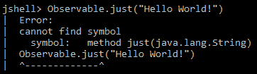

前面的错误是因为我们忘记导入相关的 Java 类。

以下代码处理此错误：

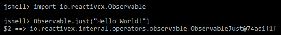

现在我们已经成功地创建了我们的第一个可观察到的。在下面的部分中，我们将学习它的功能以及如何使用它。

# 可观察、可流动、观察者和订阅

在 ReactiveX 中，观察者订阅一个可观察的对象。当观察者发射数据时，观察者通过消耗或转换数据做出反应。这种模式便于并发操作，因为它不需要在等待可观察对象发出对象时阻塞。相反，它以观察者的形式创建了一个哨兵，随时准备在以观察者的形式出现新数据时做出适当的反应。这个模型被称为反应堆模式。下图取自[http://reactivex.io/assets/operators/legend.png](http://reactivex.io/assets/operators/legend.png)，解释了可观测数据流：


反应式的可观察性与祈使式的可观察性相似。它解决了相同的问题，但策略不同。一旦可用，Observable 通过异步推送更改来工作，而 Iterable 则以同步方式拉送更改机制。处理错误的方法也不同；一种使用错误回调，而另一种使用副作用，例如抛出异常。下表显示了差异：

| 事件 | 可迭代的 | 可观察的 |
| 获取数据 | `T next()` | `onNext(T)` |
| 错误 | `throw new Exception` | `onError(Exception)` |
| 多恩 | `Return` | `onCompleted()` |

使用 subscribe（`onNextAction`、`onErrorAction`、`onCompletedAction`方法将观察者连接到被观察者。观察者实现以下方法的一些子集（只有`onNext`是必需的）：

*   `onNext`：每当被观察对象发出一个项目时调用，方法以被观察对象发出的项目作为参数
*   `onError`：调用它是为了表示它没有生成预期的数据或遇到了其他错误，并将异常/错误作为它的参数
*   `onCompleted`：当没有更多的数据要发出时调用

从设计的角度来看，反应式可观测对象通过使用`onError`和`onCompleted`回调来增加在完成和错误时发出信号的能力，从而增强了四人帮的观察者模式。

有两种类型的反应性观察结果：

*   **热**：即使没有连接用户，也会尽快开始发射。
*   **冷**：在开始发送数据之前，等待至少一个订户连接，因此至少一个订户可以从一开始就看到序列。它们被称为“可连接的”可观察对象，RxJava 拥有能够创建此类可观察对象的操作符。

rxjava2.0 引入了一种新的可观察类型，称为 Flowable。新的`io.reactivex.Flowable`是一个支持背压的基本反应类，而可观察的不再是。背压是一组策略，用于处理当可观察对象发出订户可以处理的更多数据时的情况。

RxJava Observable 应用于小数据集（最长不超过 1000 个元素），以防止`OutOfMemoryError`或用于 GUI 事件，例如鼠标移动或小频率（1000 Hz 或以下）的触摸事件。

在处理超过 10000 个元素、从磁盘读取（解析）文件（这在背压下很好地工作）、通过 JDBC 从数据库读取数据或执行基于块和/或拉的数据读取时，将使用 Flowables。

# 创建可观察对象

以下操作符用于从现有对象、其他数据结构的数组或序列或计时器中从头开始创建可观察对象。

# create 操作符

可以通过调用以下`io.reactivex.Observable`方法之一（操作符）从头开始创建可观察对象：

*   创建
*   生成
*   未净化

下面的示例演示如何从头开始构造一个可观察的。调用`onNext()`直到观察者没有被释放，`onComplete()`和`onError()`以编程方式获得 1 到 4 的数字范围：


正如我们在前面的屏幕截图中所看到的，输出与预期一样，范围从 1 到 4，序列在使用后会被处理掉。

# 延迟运算符

一旦观察者连接，可以通过调用`defer`方法为每个观察者创建一个新的观察者。以下代码显示了`defer`在我们提供号码时的用法：


console print line 方法输出 123，这是可观察的整数。

# 空运算符

可以通过调用`empty()`或`never() io.reactivex.Observable`方法来创建从不发送的空项目。

# 发件人运算符

通过调用以下方法之一，可以从数组、未来或其他对象和数据结构进行转换：

*   `fromArray`：将数组转换为可观察数组
*   `fromCallable`：将提供值的 callable 转换为 Observable
*   `fromFuture`：将未来提供的价值转换为可观察的价值
*   `fromIterable`：将 iteable 转换为 observeable
*   `fromPublisher`：将反应发布者流转换为可观察发布者流
*   `just`：将给定对象转换为可观察对象

下面的示例从字母列表（`abc`中创建一个 Observable：

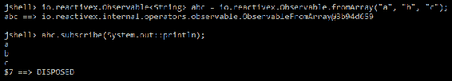

`a`、`b`和`c`的整个数组被消耗，并通过`System.out.println`方法打印到控制台。

# 区间运算符

通过使用`interval`方法，可以创建一个可观察的对象，该对象发出一个由特定时间间隔间隔隔开的整数序列。下面的示例从不停止；它每秒钟连续打印一次记号号：

**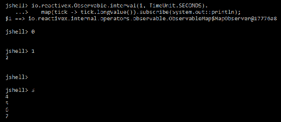** 

尝试停止计时器也无济于事（即使是*Ctrl*+*C*，只要关闭窗口），它会继续按指令每隔一秒向控制台打印递增的数字。

# 定时器操作员

通过使用计时器方法，可以在给定的延迟之后发出单个项目。

# 范围运算符

可以使用以下方法创建序列号范围：

*   `intervalRange`：发出一系列长值的信号，第一个在一些初始延迟之后，接下来是周期性的
*   `range`：发出指定范围内的整数序列

# 重复运算符

为了重复特定的项目或特定的顺序，请使用：

*   `repeat`：重复给定可观测源发射的项目序列多次或永远（取决于输入）
*   `repeatUntil`：重复可观测源发出的项目序列，直到提供的 stop 函数返回 true
*   `repeatWhen`：除了`onComplete`之外，发出与初始可观测值相同的值

以下代码重复给定的`a`值，直到满足条件：


它向控制台重复三次`a`，直到`x`的值 3 大于 2。作为练习，将`x++`替换为`++x`并检查控制台。

# 变换可观测值

这些运算符转换由可观察对象发出的项。

# subscribe 操作符

这些是订户用来消耗来自可观察对象的发射和通知的方法，例如`onNext`、`onError`和`onCompleted`。用于订阅的可观察方法有：

*   `blockingForEach`：消耗此可观察对象发出的每个项目，并阻塞直到可观察对象完成。
*   `blockingSubscribe`：订阅当前线程上的可观察事件并消耗事件。
*   `forEachWhile`：订阅 Observable 并接收每个元素的通知，直到`onNext`谓词返回 false。
*   `forEach`：订阅可观察到的元素并接收每个元素的通知。
*   `subscribe`：将给定的观察者订阅到该可观察对象。观察器可以作为回调、观察器实现或抽象`io.reactivex.subscribers.DefaultSubscriber<T>`类的子类型提供。

# 缓冲区运算符

`buffer`方法用于创建给定大小的包，然后将它们打包为列表。下面的代码显示了如何在 10 个数字中创建两个 bundle，一个有 6 个，另一个有其余 4 个：


# 平面图操作符

通过使用以下操作符之一，可以通过到达顺序（`flatMap`）、保持最后发射的顺序（`switchMap`）或通过保持原始顺序（`concatMap`）将给定的可观测值转换为单个可观测值：`concatMap`、`concatMapDelayError`、`concatMapEager`、`concatMapEagerDelayError`、`concatMapIterable`、`flatMap`、`flatMapIterable`、`switchMap`，或`switchMapDelayError`。下面的示例演示了如何通过随机选择可观察对象的顺序来更改输出的内容。（`flatMap`、`concatMap`、`switchMap`：


`concatMap`实现将`c`字符串附加到给定的`a`、`b`和`c`字符串中的每一个，因此，输出是`ac`、`bc`和`cc`。

`flatMap`实现将`f`字符串附加到给定的`a`、`b`和`c`字符串中的每一个，如下所示：

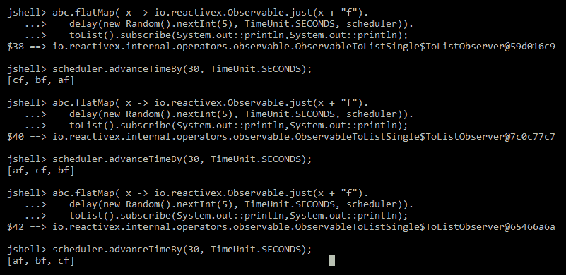

由于随机延迟，顺序与预期的`af`、`bf`、`cf`不同，运行几次就会输出预期的顺序。

下面的代码段显示了不同的输出。


`switchMap`实现将`s`字符串附加到给定的`a`、`b`和`c`字符串列表中的最后一个元素。

注意`advanceTimeBy`的用法。没有这个电话，什么都不会打印，因为排放被推迟了。

# groupBy 运算符

`groupBy`用于将一个可观察对象划分为一组可观察对象，每个可观察对象发出一组不同的项目。下面的代码按起始字母对字符串进行分组，然后打印键和特定键的组数据。请注意，这些组是可观察的，可用于构造其他数据流。

以下输出按第一个字母显示组作为一个组，并显示组键（即第一个字母）：


# 地图操作员

为每个项目应用一个函数来转换可观测值可以通过以下方法实现：

*   `cast`：将结果强制转换为给定类型
*   `map`：对每个发出的项目应用指定的函数

# 扫描操作员

利用积累的转换可以用`scan`方法来完成。以下代码通过发出元素的当前和来使用它：


# 窗口操作符

`window`方法用于周期性地将项目从一个可观察窗口细分为可观察窗口，并突发发射这些窗口。下面的代码显示，使用一个元素的窗口不起任何作用，同时使用三个元素输出它们的总和：


# 过滤观察值

这些操作符根据给定的条件/约束从给定的可观察对象选择性地发射项。

# 去抖动算符

只能在经过特定时间跨度后发射，可以使用以下方法：

*   `debounce`：镜像最初的可观察项，除了它删除源发出的项，然后在一段时间内删除另一项
*   `throttleWithTimeout`：仅发射那些在指定时间窗口内没有后跟另一个发射项的项

在下面的示例中，我们将删除在 100 毫秒的去抖动时间跨度过去之前触发的项；在我们的示例中，它只是最后一个管理的值。同样，通过使用测试调度器，我们提前了时间：


# distinct 运算符

这将使用以下方法删除可观察对象发出的不同项：

*   `distinct`：只发射不同的元素
*   `distinctUntilChanged`：仅发射与其直接前辈不同的元素

在下面的代码中，我们将看到如何使用`distinct`方法从给定序列中删除重复项：


我们可以看到重复的`aaa`字符串已经从输出中删除。

# elementAt 运算符

为了通过索引获得元素，使用`elementAt`方法。以下代码打印列表中的第三个元素：

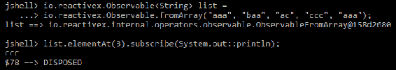

# 筛选运算符

在以下方法上使用只允许从通过测试（谓词/类型测试）的可观察对象中发出那些项：

*   `filter`：只发出满足指定谓词的元素
*   `ofType`：只发出指定类型的元素

以下代码显示了`filter`方法的用法，用于过滤掉不以字母`a`开头的元素：

**** 

# 第一个/最后一个操作员

这些方法用于根据给定条件返回项目的第一个和最后一个匹配项。也有阻塞版本可用。可用的`io.reactivex.Observable methods`是：

*   `blockingFirst`：返回可观察对象发出的第一项
*   `blockingSingle`：返回可观察对象发出的第一个`Single`项
*   `first`：返回可观察对象发出的第一项
*   `firstElement`：返回仅发射第一个项目的`Maybe`
*   `single`：返回仅发射第一个项目的`Single`
*   `singleElement`：返回一个只发出第一个单曲的`Maybe`
*   `blockingLast`：返回可观察对象发出的最后一项
*   `last`：返回可观察对象发出的最后一项
*   `lastElement`：返回只发出最后一个单曲的`Maybe`

# 示例运算符

使用此运算符可发射特定项目（由采样时间段或节气门持续时间指定）。`io.reactivex.Observable`提供以下方法：

*   `sample`：在给定的时间段内发出最近发出的项目（如果有）
*   `throttleFirst`：仅发射给定连续时间窗口内发射的第一个项目
*   `throttleLast`：仅发射给定连续时间窗口内发射的最后一项

# 跳过运算符

从可观察的输出中删除第一个和最后一个*n*元素。以下代码显示了如何跳过给定输入的前三个元素：


调用`skipLast`方法将只输出 1 和 2。

# take 运算符

它只从给定的可见光发射第一个和最后一个*n*元素。以下示例显示如何仅从可观察的数值范围中获取前三个元素：


使用具有相同参数的`takeLast`方法将输出 3、4 和 5。

# 组合观测值

这些运算符用于组合多个可观测值。

# 联合收割机操作员

通过调用以下方法之一，组合来自两个或多个可观测对象的最新发射值：

*   `combineLatest`：发出聚合每个源的最新值的项
*   `withLatestFrom`：将给定的可观察对象合并到当前实例中

下面的示例（永远运行）显示了组合两个具有不同时间跨度的间隔观测值的结果—第一个每 6 毫秒发射一次，另一个每 10 毫秒发射一次：

**** 

前面代码的执行需要通过按*Ctrl*+*C*停止，因为它创建了一个无限列表。输出与预期一样，它包含基于创建时间戳的两个序列的组合值。

# 联接运算符

通过调用以下方法之一，可以基于给定窗口组合两个观察值：

*   `join`：使用聚合函数，根据重叠的持续时间，将两个可观察对象发出的项目连接起来
*   `groupJoin`：使用聚合函数，根据重叠的持续时间，将两个可观察对象发出的项目加入到组中

下面的示例使用 join 组合两个可观察对象，一个每 100 毫秒触发一次，另一个每 160 毫秒触发一次，并每 55 毫秒从第一个值中获取一个值，每 85 毫秒从第二个值中获取一个值：


前面的代码永远执行，需要手动停止。

# 合并运算符

将多个可观测值合并为一个可观测值，所有给定的发射都可以通过调用：

*   `merge`：将多个输入源展平为一个可观察源，无需任何转换
*   `mergeArray`：将作为数组给出的多个输入源展平为一个可观察源，而不进行任何转换
*   `mergeArrayDelayError`：将作为数组给出的多个输入源展平为一个可观察源，没有任何转换，也没有被错误打断
*   `mergeDelayError`：将多个输入源展平为一个可观察源，没有任何转换，也没有被错误打断
*   `mergeWith`：将这个和给定的源展平为一个可观察的，没有任何转换

在下面的示例中，我们将合并原始 1 到 5 范围的部分，合并方式是它包含所有条目，但顺序不同：

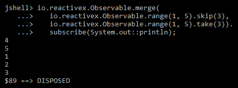

# zip 操作员

基于组合器函数将多个可观察项组合成单个可观察项可以通过调用：

*   `zip`：将指定的组合器函数的结果应用于给定可观测项所发射的多个项目的组合
*   `zipIterable`：发出一个指定的组合器函数的结果，该函数应用于给定的可观测项发出的多个项的组合
*   `zipWith`：发出一个指定的组合器函数的结果，该组合器函数应用于这个和给定的可观测值的组合

下面的代码显示了如何基于字符串串联组合器将`zip`应用于从 1 到 5 到 10 到 16（更多元素）的范围发出的元素。请注意，由于没有要应用的对应项，因此不会应用额外的发射（编号 16）：

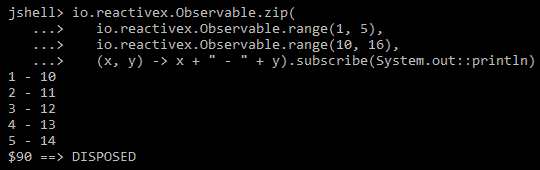

# 错误处理

observates 包含几个操作符，这些操作符允许错误处理、吞咽异常、转换异常、调用 finally 块、重试失败的序列以及即使发生错误也可以处理资源。

# 接线员

这些运算符可以通过继续执行以下顺序从错误中恢复：

*   `onErrorResumeNext`：指示一个可观察对象将控制权传递给供应商提供的另一个可观察对象，而不是在出现问题时调用`onError`
*   `onErrorReturn`：指示可观察对象发出函数提供的默认值，以防出现错误
*   `onErrorReturnItem`：指示可观察对象发出提供的缺省值，以防出现错误
*   `onExceptionResumeNext`：指示一个可观察对象将控制传递给另一个可观察对象，而不是在出现问题时调用`onError`

下面的示例演示如何使用`onErrorReturnItem`方法；不使用`flatMap`技巧调用它将停止流并在最后输出`Default`。通过延迟对异常抛出代码的调用并对其应用`onErrorReturnItem`，我们可以继续序列并使用提供的默认值：


# do 运算符

这些用于注册对特定生命周期事件采取的操作。我们可以使用它们来模拟 final 语句行为，释放分配给上游的资源，进行性能度量，或者执行不依赖于当前调用成功与否的其他任务。RxJava Observables 通过提供以下方法来实现这一点：

*   `doFinally`：注册当前可观察对象调用`onComplete`或`onError`或被释放时要调用的动作
*   `doAfterTerminate`：在当前可观察对象调用`onComplete`或`onError`之后注册要调用的动作
*   `doOnDispose`：注册一个动作，在处理序列时调用
*   `doOnLifecycle`：根据序列的生命周期事件（订阅、取消、请求），为相应的`onXXX`方法注册回调
*   `doOnTerminate`：注册当前可观察对象调用`onComplete`或`onError`时要调用的动作

以下代码段显示了前面提到的命令的用法：

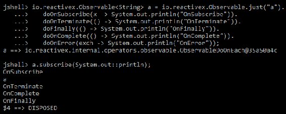

在前面的示例中，我们可以看到生命周期事件的顺序是：subscribe、terminate、complete 或 error，最后通过在每个事件上注册 print to console 操作。

# 使用运算符

using 操作符在 Java 中有一个对应的操作符，名为 try with resources。它基本上也是这样做的，即创建一个在给定时间（当可观察对象被释放时）被释放的可支配资源。rxjava2.0 方法`using`实现了这个行为。

# 重试运算符

这些是在发生可恢复的故障（例如服务暂时关闭）时要使用的操作符。他们通过重新订阅来工作，希望这次能顺利完成。可用的 RxJava 方法如下：

*   `retry`：错误时永远重放同一流程，直到成功
*   `retryUntil`：重试，直到给定的 stop 函数返回 true
*   `retryWhen`：基于接收错误/异常的重试逻辑函数，在错误情况下永远重放相同的流，直到成功为止

在下面的示例中，我们使用只包含两个值的`zip`来创建重试逻辑，该逻辑在一个时间段后重试两次以运行失败的序列，或者用 500 乘以重试计数。当连接到无响应的 web 服务时，尤其是从每次重试都会消耗设备电池的移动设备时，可以使用此方法：

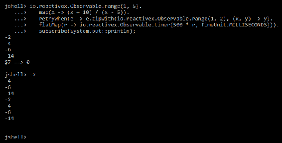

# 调度者

在线程调度方面，可观测是不可知的——在多线程环境中，这是调度程序的工作。一些操作符提供了可以将调度程序作为参数的变体。有一些特定的调用允许从下游（使用操作符的点，这是`observeOn`的情况）或不考虑调用位置（调用位置无关紧要，因为这是`subscribeOn`方法的情况）观察流。在下面的示例中，我们将从上游和下游打印当前线程。注意，在`subscribeOn`的情况下，线程总是相同的：


注意`map`方法中的线程主要用法：


请注意，`map`方法不再使用线程 main。

rxjava2.0 提供了更多来自`io.reactivex.schedulers.Schedulers`工厂的调度器，每个调度器都有特定的用途：

*   `computation()`：返回用于计算工作的`Scheduler`实例
*   `io()`：返回一个用于 I/O 工作的`Scheduler`实例
*   `single()`：对于需要在同一后台线程上强顺序执行的工作，返回`Scheduler`实例
*   `trampoline()`：返回一个`Scheduler`实例，该实例在一个参与线程上以 FIFO 方式执行给定的工作
*   `newThread()`：返回一个`Scheduler`实例，该实例为每个工作单元创建一个新线程
*   `from(Executor executor)`：将`Executor`转换成新的`Scheduler`实例，并将工作委托给它

有一个只用于特殊测试目的的`Scheduler`，称为`io.reactivex.schedulers.TestScheduler`。我们已经使用了它，因为它允许手动推进虚拟时间，因此非常适合于测试依赖于时间的流，而不必等待时间通过（例如，单元测试）。

# 学科

主体是可观察的和订户的混合体，因为它们都接收和发射事件。RxJava 2.0 提供了五个主题：

*   `AsyncSubject`：仅发射源可观测到的最后一个值，后跟一个完成
*   `BehaviorSubject`：发射最近发射的值，然后是可观测源发射的任何值
*   `PublishSubject`：仅向订阅方发送订阅时间之后源发送的项目
*   `ReplaySubject`：向任何订户发送源发出的所有项目，即使没有订阅
*   `UnicastSubject`：只允许单个用户在其生存期内订阅

# 示例项目

在下面的示例中，我们将展示 RxJava 在实时处理从多个传感器接收到的温度中的用法。传感器数据由 Spring 引导服务器提供（随机生成）。服务器配置为接受传感器名称作为配置，以便我们可以为每个实例更改它。我们将启动五个实例，并在客户端显示警告，如果其中一个传感器输出超过 80 摄氏度。

使用以下命令可以从 bash 轻松启动多个传感器：

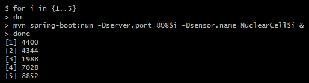

服务器端代码很简单，我们只配置了一个 REST 控制器，将传感器数据输出为 JSON，如下代码所示：

```java
@RestController
publicclass SensorController 
{
  @Value("${sensor.name}")
  private String sensorName;
  @RequestMapping(value="/sensor", method=RequestMethod.GET,   
  produces=MediaType.APPLICATION_JSON_VALUE)
  public ResponseEntity<SensorData> sensor() throws Exception 
  {
    SensorData data = new SensorData(sensorName);
    HttpHeaders headers = new HttpHeaders();
    headers.set(HttpHeaders.CONTENT_LENGTH, String.valueOf(new     
    ObjectMapper().writeValueAsString(data).length()));
    returnnew ResponseEntity<SensorData>(data, headers,     
    HttpStatus.CREATED);
  }
}
```

传感器数据是在`SensorData`构造函数中随机生成的（注意 Lombock 库的使用，以摆脱 setter/getter 代码）：

```java
@Data
publicclass SensorData 
{
  @JsonProperty
  Double humidity;
  @JsonProperty
  Double temperature;
  @JsonProperty
  String sensorName;
  public SensorData(String sensorName) 
  {
    this.sensorName = sensorName;
    humidity = Double.valueOf(20 + 80 * Math.random());
    temperature = Double.valueOf(80 + 20 * Math.random()); 
  }
}
```

现在我们已经启动了服务器，我们可以从支持 RxJava 的客户机连接到它。

客户端代码使用 rxapache http 库：

```java
publicclass Main 
{
  @JsonIgnoreProperties(ignoreUnknown = true)
  staticclass SensorTemperature 
  {
    Double temperature;
    String sensorName;
    public Double getTemperature() 
    {
      return temperature;
    }
    publicvoid setTemperature(Double temperature) 
    {
      this.temperature = temperature;
    }
    public String getSensorName() 
    {
      return sensorName;
    }
    publicvoid setSensorName(String sensorName) 
    {
      this.sensorName = sensorName;
    }
    @Override
    public String toString() 
    {
      return sensorName + " temperature=" + temperature;
    }
  }  
}
```

`SensorTemperature`是我们的客户资料。它是服务器可以提供的内容的快照。其余信息将被 Jackson data binder 忽略：

```java
publicstaticvoid main(String[] args) throws Exception 
{
  final RequestConfig requestConfig = RequestConfig.custom()
  .setSocketTimeout(3000)
  .setConnectTimeout(500).build();
  final CloseableHttpAsyncClient httpClient = HttpAsyncClients.custom()
  .setDefaultRequestConfig(requestConfig)
  .setMaxConnPerRoute(20)
  .setMaxConnTotal(50)
  .build();
  httpClient.start();
```

在前面的代码中，我们通过设置 TCP/IP 超时和允许的连接数来设置并启动 HTTP 客户端：

```java
Observable.range(1, 5).map(x ->
Try.withCatch(() -> new URI("http", null, "127.0.0.1", 8080 + x, "/sensor", null, null), URISyntaxException.class).orElse(null))
.flatMap(address -> ObservableHttp.createRequest(HttpAsyncMethods.createGet(address), httpClient)
.toObservable())
.flatMap(response -> response.getContent().map(bytes -> new String(bytes)))
.onErrorReturn(error -> "{"temperature":0,"sensorName":""}")
.map(json ->
Try.withCatch(() -> new ObjectMapper().readValue(json, SensorTemperature.class), Exception.class)
.orElse(new SensorTemperature()))
.repeatWhen(observable -> observable.delay(500, TimeUnit.MILLISECONDS))
.subscribeOn(Schedulers.io())
.subscribe(x -> {
if (x.getTemperature() > 90) {
System.out.println("Temperature warning for " + x.getSensorName());
} else {
System.out.println(x.toString());
}
}, Throwable::printStackTrace);
}
}
```

前面的代码基于范围创建 url 列表，将其转换为响应列表，将响应字节展平为字符串，将字符串转换为 JSON，并将结果打印到控制台。如果温度超过 90 度，它将打印一条警告信息。它通过在 I/O 调度程序中运行来完成所有这些，每 500 毫秒重复一次，如果出现错误，它将返回默认值。请注意 Try monad 的用法，因为选中的异常是由 lambda 代码引发的，因此需要通过转换为可由 RxJava 在`onError`中处理的未选中表达式或在 lambda 块中本地处理来处理。

由于客户端永远旋转，部分输出如下：

```java
NuclearCell2 temperature=83.92902289170053
Temperature warning for NuclearCell1
Temperature warning for NuclearCell3
Temperature warning for NuclearCell4
NuclearCell5 temperature=84.23921169948811
Temperature warning for NuclearCell1
NuclearCell2 temperature=83.16267124851476
Temperature warning for NuclearCell3
NuclearCell4 temperature=81.34379085987851
Temperature warning for NuclearCell5
NuclearCell2 temperature=88.4133065761349
```

# 摘要

在本章中，我们学习了反应式编程，然后重点介绍了可用的最常用的反应式库之一——RxJava。我们学习了反应式编程抽象及其在 RxJava 中的实现。我们通过了解可观察对象、调度器和订阅是如何工作的、最常用的方法以及它们是如何使用的，从而通过具体的示例迈出了进入 RxJava 世界的第一步。

在下一章中，我们将学习最常用的反应式编程模式，以及如何在代码中应用它们。