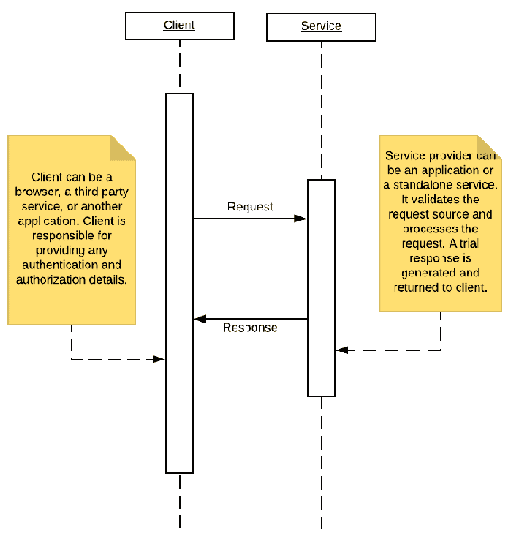

# 反应式设计模式

在最后一章中，我们讨论了反应式编程风格，并强调了进行反应式编程的重要性。在本章中，我们将逐一回顾反应式编程的四大支柱，即响应性、弹性、弹性和消息驱动，并了解实现这些支柱的各种模式。本章将介绍以下主题：

*   响应模式
*   弹性模式
*   弹性模式
*   消息驱动的通信模式

# 响应模式

响应性意味着应用程序的交互性。它是否及时与用户交互？点击一个按钮能做它应该做的吗？界面是否在需要更新时得到更新？其思想是应用程序不应该让用户不必要地等待，应该提供即时反馈。

让我们看看帮助我们在应用程序中实现响应性的一些核心模式。

# 请求-响应模式

我们将从最简单的设计模式开始，请求-响应模式，它解决了反应式编程的响应性支柱。这是我们在几乎所有应用程序中使用的核心模式之一。是我们的服务接收请求并返回响应。许多其他模式都直接或间接地依赖于此，因此值得花几分钟来理解此模式。

下图显示了一个简单的请求-响应通信：



请求-响应关系有两个参与方。一个实体发出请求，第二个实体完成请求。请求者可以是从服务器请求详细信息的浏览器，也可以是从其他服务请求数据的服务。双方需要就请求和响应格式达成一致。这些可以是 XML、HTML、String、JSON 等形式；只要两个实体都理解通信，就可以使用任何格式。

我们将从一个简单的基于 servlet 的示例开始。您可能不会在实际项目中使用基于 servlet 的实现，除非您使用的是遗留应用程序，但是了解基础知识非常重要，因为它们是我们使用的大多数现代框架的起点。

我们将在这里创建一个雇员服务，它将处理`GET`和`POST`请求：

```
/** 
*  
* This class is responsible for handling Employee Entity 
  related requests. 
*  
*/ 
public class EmployeeWebService extends HttpServlet 
{ 
  public void init() throws ServletException 
  { 
    // Do required initialization 
  } 
  public void doGet(HttpServletRequest request, 
  HttpServletResponse response) throws ServletException, 
  IOException 
  { 
    // Set response content type 
    response.setContentType("application/json"); 
    PrintWriter out = response.getWriter(); 
    /*  
    * This is a dummy example where we are simply returning 
    static employee details. 
    * This is just to give an idea how simple request response
    works. In real world you might want to  
    * fetch the data from data base and return employee list 
    or an employee object based on employee id 
    * sent by request. Well in real world you migth not want 
    to use servlet at all.  
    */ 
    JSONObject jsonObject = new JSONObject(); 
    jsonObject.put("EmployeeName", "Dave"); 
    jsonObject.put("EmployeeId", "1234"); 
    out.print(jsonObject); 
    out.flush(); 
  } 
  public void doPost(HttpServletRequest request, 
  HttpServletResponse response) throws ServletException, 
  IOException 
  { 
    // Similar to doGet, you might want to implement do post. 
    where we will read Employee values and add to database. 
  } 
  public void destroy() 
  { 
    // Handle any object cleanup or connection closures here. 
  } 
} 
```

前面的代码应该让您了解一个简单的请求-响应模式是如何工作的。`GET`和`POST`是两种最重要的通信方式。顾名思义，`GET`用于从服务器获取任何数据、信息、工件，而`POST`则向服务器添加新数据。大约 10-12 年前，您也会看到 servlet 中嵌入了 HTML。但是，最近，情况已经转向更好、更易于维护的设计。为了保持关注点的分离和松散耦合，我们尝试保持表示层或前端代码独立于服务器端代码。这使我们可以自由地创建**应用程序编程接口**（**API**），以满足各种各样的客户，无论是桌面应用程序、移动应用程序还是第三方服务调用应用程序。

让我们更进一步，讨论一下维护 api 的 RESTful 服务。**REST**代表**表征状态转移**。最常见的 REST 实现是通过 HTTP，通过实现`GET`、`POST`、`PUT`和`DELETE`来实现，即处理 CRUD 操作。

我们来看看这四个核心业务：

*   `GET`：作为列表或单个实体获取数据。假设我们有一个雇员实体：`<url>/employees/`将返回系统中所有雇员的列表。`<url>/employees/{id}/`将返回特定的员工记录。

*   `POST`：新增实体数据。`<url>/employees/`将向系统中添加新的员工记录。

*   `PUT`：更新实体的数据。`<url>/employees/{id}`将更新系统中现有的员工记录。

*   `DELETE`：删除已有的实体记录。`<url>/employees/{id}`将从系统中删除现有员工记录。

如前所述，您几乎不会编写直接处理请求和响应的显式代码。有许多框架，如 Struts、Spring 等，可以帮助我们避免编写所有样板代码，并将重点放在核心业务逻辑上。

下面是一个基于 Spring 的快速示例；正如您将看到的，我们可以避免很多样板代码：

```
@RestController
@RequestMapping("/employees")
/**
* This class implements GET and POST methods for Employee Entity
*/
publicclass EmployeeWebService 
{
  EmployeeDAO empDAO = new EmployeeDAO();
  /**
  * This method returns List of all the employees in the system.
  *
  * @return Employee List
  * @throws ServletException
  * @throws IOException
  */
  @RequestMapping(method = RequestMethod.GET)
  public List<Employee> EmployeeListService() throws 
  ServletException, IOException 
  {
    // fetch employee list and return
    List<Employee> empList = empDAO.getEmployeeList();
    return empList;
  }
  /**
  * This method returns details of a specific Employee.
  *
  * @return Employee
  * @throws ServletException
  * @throws IOException
  */
  @RequestMapping(method = RequestMethod.GET, value = "/{id}")
  public Employee EmployeeDataService(@PathVariable("id") 
  String id) throws ServletException, IOException 
  {
    // fetch employee details and return
    Employee emp = empDAO.getEmployee(id);
    return emp;
  }
  /**
  * This method returns Adds an Employee to the system  
  * 
  * @return Employee List
  * @throws ServletException
  * @throws IOException
  */
  @RequestMapping(method = RequestMethod.POST)
  public String EmployeeAddService(@RequestBody Employee emp) throws   
  ServletException, IOException 
  {
    // add employee and return id
    String empId= empDAO.addEmployee(emp);
    return empId;
  }
}
```

如您所见，我们正在使用一个**普通的旧 Java 对象**（**POJO**）类，并让它处理我们所有的 REST 调用。不需要扩展`HttpServlet`或管理 init 或 destroy 方法。

如果您了解 springmvc，就可以进入下一个模式。对于那些不熟悉 Spring 框架的人来说，花几分钟时间来理解前一个示例背后的工作原理是值得的。

当您使用 Spring 框架时，您需要告诉它您的服务器。因此，在你的`web.xml`中，添加以下内容：

```
<servlet> 
  <servlet-name>springapp</servlet-name> 
  <servlet-class>org.springframework.web.servlet.
  DispatcherServlet</servlet-class> 
  <init-param> 
    <param-name>contextClass</param-name> 
    <param-value>org.springframework.web.context.support.
    AnnotationConfigWebApplicationContext </param-value> 
  </init-param> 
  <init-param> 
    <param-name>contextConfigLocation</param-name> 
    <param-value>com.employee.config.EmployeeConfig</param-value> 
  </init-param> 
  <load-on-startup>1</load-on-startup> 
</servlet> 
<servlet-mapping> 
  <servlet-name>springapp</servlet-name> 
  <url-pattern>/service/*</url-pattern> 
 </servlet-mapping>
```

这里我们已经告诉`web.xml`我们正在使用 Spring 的 dispatcherservlet，对模式/服务的任何请求都应该转发到 Spring 代码。除了前面的代码行之外，我们还需要为 spring 提供配置。这可以在基于 Java 类或基于 XML 的配置中完成。我们已经告诉`web.xml`在`com.employee.config.EmployeeConfig`中寻找配置。

下面是一个基于类的配置示例：

```
package com.employee.config; 
import org.springframework.context.annotation.ComponentScan; 
import org.springframework.context.annotation.Configuration; 
import org.springframework.web.servlet.config.annotation.EnableWebMvc; 
@EnableWebMvc 
@Configuration 
@ComponentScan(basePackages = "com.employee.*") 
public class EmployeeConfig 
{
} 
```

如您所见，这是一个非常基本的配置文件。您还可以添加数据库配置、安全特性等。关于 springmvc 的任何进一步讨论都超出了本书的范围。

要运行前面的代码，我们需要为 spring 和其他依赖项包含某些 JAR 文件。可以用不同的方式管理这些依赖关系；例如，人们可能更喜欢将 jar 添加到存储库，或者使用 Maven、Gradle 等等。同样，对这些工具的讨论超出了本书的范围。以下是可以添加到 Maven 中的依赖项：

```
<dependencies>
  <dependency>
    <groupId>org.springframework</groupId>
    <artifactId>spring-webmvc</artifactId>
    <version>4.3.9.RELEASE</version>
  </dependency>
  <dependency>
    <groupId>javax.servlet</groupId>
    <artifactId>servlet-api</artifactId>
    <version>2.5</version>
    <scope>provided</scope>
  </dependency>
  <dependency>
    <groupId>com.fasterxml.jackson.core</groupId>
    <artifactId>jackson-databind</artifactId>
    <version>2.5.0</version>
  </dependency>
</dependencies>
```

# 异步通信模式

当我们讨论反应式编程的响应支柱时，需要考虑的另一个重要模式是异步通信模式。虽然 request-response 模式确保所有请求都获得成功响应，但它没有考虑到某些请求可能需要花费大量时间来响应这一事实。异步通信模式有助于我们的应用程序保持响应，即使我们正在执行批量任务。我们实现响应或快速响应的方法是使核心任务执行异步。可以将其视为您的代码请求服务执行特定任务，例如更新数据库中的数据；服务接收数据并立即响应它已接收到数据。请注意，对数据库的实际写入尚未完成，但会向调用方法返回一条成功消息。

一个更相关的例子是，当一个服务被要求执行一项复杂的任务时，比如通过计算每个雇员的纳税义务来生成一个 Excel 报表，这个纳税义务需要根据每个雇员提供的工资和税务详细信息进行动态计算。因此，当税务报告服务收到生成此类报告的请求时，它只会返回一个确认收到请求的响应，并且 UI 将显示一条消息，在几分钟后刷新页面以查看更新的报告链接。这样，我们就不会阻塞最终用户，他/她可以在后台生成报告的同时执行其他任务。

异步通信是在多个层次上处理的；例如，当浏览器调用服务器时，我们的 JavaScript 框架（如 ReactJS 或 AngularJS）会根据接收到的数据量智能地呈现屏幕，并异步等待挂起的数据。但是，在这里，我们将更多地关注 Java 诱导的异步通信。在 Java 中处理异步任务的最简单方法是通过线程。

举个例子。我们有一个场景，在这个场景中，我们希望在 UI 上显示一个员工列表，同时，编译一个包含一些复杂计算的报告并将其发送给 admin。

以下代码显示了使用同步类型的方法调用时代码的外观：

```
/**
* This method generates Employee data report and emails it to admin. This also
* returns number of employees in the system currently.
*
* @return EmployeeCount
* @throws ServletException
* @throws IOException
*/
@RequestMapping(method = RequestMethod.GET, value = "/report")
public List<Employee> EmployeeReport() throws ServletException, IOException 
{
  // Lets say this method gets all EmployeeDetails First
  List<Employee> empList = new EmployeeService().getEmployees();
  // Say there is a ReportUtil which takes the list data, does 
  some calculations
  // and dumps the report at a specific location
  String reportPath = ReportUtil.generateReport();
  // Finally say we have an email service which picks the report
  and send to admin. 
  EmailUtil.sendReport(reportPath);
  // Finally return the employee's count
  return empList;
}
```

假设获取数据需要一秒钟，生成报告需要四秒钟，通过电子邮件发送报告需要两秒钟。我们正在让用户等待 7 秒钟以获取他/她的数据。我们可以使报告异步化，以加快通信速度：

```
/**
* This method generates Employee data report and emails it to admin. This also
* returns number of employees in the system currently.
*
* @return EmployeeCount
* @throws ServletException
* @throws IOException
*/
@RequestMapping(method = RequestMethod.GET, value = "/report")
public List<Employee> EmployeeReport() throws ServletException, IOException 
{
  // Lets say this method gets all EmployeeDetails First
  List<Employee> empList = new EmployeeService().getEmployees();
  Runnable myrunLambda = ()->
  {
    // Say there is a ReportUtil which takes the list data, does 
    some calculations
    // and dumps the report at a specific location
    String reportPath = ReportUtil.generateReport();
    // Finally say we have an email service which picks the report 
    and send to admin.
    EmailUtil.sendReport(reportPath);
  };
  new Thread(myrunLambda).start();
  // Finally return the employee's count
  return null;
}
```

我们已经将报表生成和电子邮件发送部分移出了关键路径，现在主线程在获取记录后立即返回。报告功能是在一个单独的线程中实现的。除了线程之外，实现异步通信的另一个重要方法是使用消息队列和消息驱动 bean。

# 缓存模式

另一种可以用来确保应用程序响应的模式是实现缓存。缓存将确保通过缓存结果以更快的方式处理类似类型的请求。我们可以在不同的层次上实现缓存，比如控制器层、服务层、数据层等等。我们还可以在请求命中代码之前实现缓存；也就是说，在服务器或负载平衡器级别。

在本章中，让我们以一个非常简单的示例来了解缓存如何帮助我们提高性能。让我们看一个简单的 Web 服务，它为员工返回数据：

```
/**
* This method fetches a particular employee data.
* @param id
* @return
* @throws ServletException
* @throws IOException
*/
@RequestMapping(method = RequestMethod.GET, value = "/{id}")
public Employee EmployeeDataService(@PathVariable("id") String id) throws ServletException, IOException 
{
  /*
  * Again, to keep it simple, returning a dummy record.
  */
  EmployeeService employeeService = new EmployeeService();
  Employee emp = employeeService.getEmployee(id);
  return emp;
}
```

此方法从数据库获取数据并将其返回给最终用户。

Java 中有许多缓存实现。在本例中，我们创建一个非常简单的缓存机制：

```
/**
* A simple cache class holding data for Employees
*
*/
class EmployeeCache
{
  static Map<String,Employee> cache = new HashMap<String,Employee>();
  /**
  * get Employee from cache
  * @param id
  * @return Employee
  */
  public static Employee getData(String id) 
  {
    return cache.get(id);
  }
  /**
  * Set employee data to cache
  * @param id
  * @param employee
  */
  public static void putData(String id, Employee employee) 
  {
    cache.put(id, employee);
  }
}
```

现在让我们更新我们的方法以利用缓存：

```
/**
* This method fetches a particular employee data.
* @param id
* @return
* @throws ServletException
* @throws IOException
*/
@RequestMapping(method = RequestMethod.GET, value = "/{id}")
public Employee EmployeeDataService(@PathVariable("id") String id) throws ServletException, IOException 
{
  /*
  * Lets check of the data is available in cache.
  * If not available, we will get the data from database and 
  add to cache for future usage.
  */
  Employee emp = EmployeeCache.getData(id);
  if(emp==null)
  {
    EmployeeService employeeService = new EmployeeService();
    emp = employeeService.getEmployee(id);
    EmployeeCache.putData(id, emp);
  }
  return emp;
}
```

我们可以看到，第一次查找员工的详细信息时，缓存中将找不到这些信息，并且将执行从数据库获取数据的正常流程。同时，这些数据被添加到缓存中。因此，为同一员工获取数据的任何后续请求都不需要访问数据库。

# 扇出和最快的回复模式

在某些应用程序中，速度非常重要，尤其是在处理实时数据的情况下，例如在投注网站上，根据现场事件计算赔率非常重要。在最后五分钟内的进球，对于一场平局的比赛来说，会极大地改变胜算，有利于一支球队，你希望在人们开始增加赌注之前，这一点能在几秒钟内反映在网站上。

在这种情况下，请求处理的速度很重要，我们希望服务的多个实例来处理请求。我们将接受最先响应的服务的响应，并放弃其他服务请求。正如您所看到的，这种方法确实保证了速度，但它是有代价的。

# 快速失效模式

FailFast 模式指出，如果服务必须失败，它应该快速失败并尽快响应调用实体。想想这个场景：你点击了一个链接，它显示了一个加载器。它会让您等待三到四分钟，然后显示一条错误消息，服务不可用，请在 10 分钟后重试。好吧，服务不可用是一回事，但是为什么要让某人等着告诉他们服务现在不可用呢。简言之，如果一个服务不得不失败，它至少应该尽快做到这一点，以保持良好的用户体验。

fail-fast 实现的一个例子是，如果您的服务依赖于另一个服务，那么您应该有一个快速机制来检查第三方服务是否启动。这可以通过简单的 ping 服务来实现。因此，在发送实际请求并等待响应之前，我们会对服务进行健康检查。如果我们的服务依赖于多个服务，这一点更为重要。在我们开始实际处理之前，检查所有服务的运行状况是很好的。如果任何服务不可用，我们的服务将立即发送等待响应，而不是部分处理请求然后发送失败。

# 弹性模式

在考虑应用程序的弹性时，我们应该尝试回答以下问题：应用程序能否处理失败条件？如果应用程序的一个组件出现故障，是否会导致整个应用程序宕机？应用程序中是否存在单点故障？

让我们看看一些模式，它们将帮助我们使应用程序具有弹性。

# 断路器型式

这是在系统中实现弹性和响应性的重要模式。通常，当一个服务在系统中失败时，它也会影响其他服务。例如，服务 X 调用系统中的服务 Y 来获取或更新一些数据。如果服务 Y 由于某种原因没有响应，我们的服务 X 将调用服务 Y，等待它超时，然后自己失败。设想一个场景，其中服务 X 本身被另一个服务 P 调用，以此类推。我们看到的是一个级联故障，最终会导致整个系统崩溃。

受电路启发的断路器模式表明，我们应该将故障限制在单个服务级别，而不是让故障传播；也就是说，我们需要一种机制让服务 X 了解服务 Y 是不健康的，并处理这种情况。处理这种情况的一种方法是服务 X 调用服务 Y，如果它观察到服务 Y 在 N 次重试后没有响应，它会认为服务不正常并将其报告给监视系统。同时，它在一段固定的时间内停止对服务 Y 的调用（例如，我们设置了一个 10 分钟的阈值）。

服务 X 将根据服务 Y 执行的操作的重要性来优雅地处理此故障。例如，如果服务 Y 负责更新帐户详细信息，服务 X 将向调用服务报告故障，或者对于 Y 正在执行的记录事务详细信息的所有服务，服务 X 将添加日志详细信息到回退队列，当服务 Y 备份时，它可以被清除。

这里的重要因素是不要让一次服务故障导致整个系统瘫痪。呼叫服务应该找出哪些是不健康的服务，并管理备用方法。

# 故障处理模式

在系统中保持弹性的另一个重要方面是问这样一个问题：如果一个或多个组件或服务宕机，我的系统还能正常工作吗？例如，以一个电子商务网站为例。有许多服务和功能协同工作以保持网站正常运行，例如产品搜索、产品目录、推荐引擎、评论组件、购物车、支付网关等等。如果其中一项服务（如搜索组件）由于负载或硬件故障而宕机，是否会影响最终用户下订单的能力？理想情况下，这两个服务应该独立创建和维护。因此，如果搜索服务不可用，用户仍然可以在购物车中订购商品或直接从目录中选择商品并购买。

处理失败的第二个方面是优雅地处理对失败组件的任何请求。对于上一个示例，如果用户尝试使用搜索功能（例如，用户界面上的搜索框仍然可用），我们不应该向用户显示空白页或让他/她永远等待。我们可以向他/她显示缓存的结果，或者显示一条消息，说明服务将在接下来的几分钟内使用推荐的目录启动。

# 有界队列模式

这种模式有助于我们保持系统的弹性和响应能力。此模式表示我们应该控制服务可以处理的请求数。大多数现代服务器都提供了一个请求队列，可以将其配置为在请求被丢弃和服务器繁忙消息被发送回调用实体之前让它知道应该排队的请求数。我们正在将这种方法扩展到服务级别。每个服务都应该基于一个队列，该队列将容纳要服务的请求。

队列应该有一个固定的大小，即服务在特定时间（例如一分钟）内可以处理的量。例如，如果我们知道服务 X 可以在一分钟内处理 500 个请求，那么我们应该将队列大小设置为 500，并且任何其他请求都将被发送一条关于服务正忙的消息。基本上，我们不希望调用实体等待很长时间，从而影响整个系统的性能。

# 监测模式

为了保持系统的弹性，我们需要监控服务性能和可用性的方法。我们可以向应用程序和服务添加多种类型的监视；例如，对于响应性，我们可以向应用程序添加周期性 ping，并验证响应需要多长时间，或者我们可以检查系统的 CPU 和 RAM 使用情况。如果您使用的是第三方云，例如**Amazon Web Services**（**AWS**），那么您就获得了对这种监视的内置支持；否则您可以编写简单的脚本来检查当前的健康状态。日志监视用于检查应用程序中是否抛出错误或异常，以及这些错误或异常的严重程度。

监控到位后，我们可以在系统中添加警报和自动错误处理。警报可能意味着根据问题的严重程度发送电子邮件或文本消息。还可以内置升级机制；例如，如果问题在 X 时间内没有得到解决，则会向下一级升级点发送一条消息。通过使用自动错误处理，我们可以在需要创建其他服务实例、需要重新启动服务等情况下进行调用。

# 舱壁型式

舱壁是从货船上借来的术语。在货船中，舱壁是建造在不同货物段之间的一堵墙，它确保一段中的火灾或洪水仅限于该段，而其他段不受影响。您肯定已经猜到了我们的意图：一个服务或一组服务中的故障不应该导致整个应用程序崩溃。

为了实现隔板模式，我们需要确保我们的所有服务彼此独立地工作，并且一个服务中的故障不会导致另一个服务中的故障。维护单一责任模式、异步通信模式或快速故障和故障处理模式等技术有助于我们实现阻止一个故障在整个应用程序中传播的目标。

# 弹性模式

应用程序必须对可变负载条件作出反应。如果负载增加或减少，应用程序不应受到影响，并且应该能够处理任何负载级别而不影响性能。弹性的一个未提及的方面是应用程序不应该使用不必要的资源。例如，如果您希望您的服务器每分钟处理 1000 个用户，那么您将不会设置一个基础结构来处理 10000 个用户，因为您将支付所需成本的 10 倍。同时，您需要确保如果负载增加，应用程序不会阻塞。

让我们来看看帮助我们保持系统弹性的一些重要模式。

# 单一责任模式

也被称为简单组件模式或微服务模式，单责任模式是 OOP 单责任原则的一种扩展。在本书的最初几章中，我们已经讨论了单一责任原则。在基本层次上，当应用于面向对象编程时，单一责任原则规定一个类应该只有一个改变的理由。将此定义进一步扩展到架构级别，我们将此原则的范围扩展到组件或服务。因此，现在我们将单一责任模式定义为一个组件或服务应该只负责一个任务。

需要将应用程序划分为更小的组件或服务，其中每个组件只负责一个任务。将服务划分为更小的服务将产生更易于维护、扩展和增强的微服务。

为了进一步说明这一点，假设我们有一个名为`updateEmployeeSalaryAndTax`的服务。此服务获取基本工资并使用它计算总工资，包括可变和固定部分，最后计算税金：

```
public void updateEmployeeSalaryAndTax(String employeeId, float baseSalary) 
{
  /*
  * 1\. Fetches Employee Data
  * 2\. Fetches Employee Department Data
  * 3\. Fetches Employee Salary Data
  * 4\. Applies check like base salary cannot be less than existing
  * 5\. Calculates House Rent Allowance, Grade pay, Bonus component
  based on Employees  
  * position, department, year of experience etc.
  * 6\. Updates Final salary Data
  * 7\. Gets Tax slabs based on country
  * 8\. Get state specific tax
  * 9\. Get Employee Deductions
  * 10\. Update Employee Tax details
  */
}
```

虽然在工资更新时计算这个似乎是合乎逻辑的，但是如果我们只需要计算税呢？比如说，一个员工更新了节税细节，为什么我们需要再次计算所有的工资细节，而不仅仅是更新税务数据。复杂的服务不仅通过添加不必要的计算来增加执行时间，而且还阻碍了可伸缩性和可维护性。假设我们需要更新税务公式，我们最终也会更新包含薪资计算细节的代码。总体回归范围面积增大。此外，假设我们知道薪资更新并不常见，但每次节税细节更新都会更新税务计算，而且税务计算本质上很复杂。对我们来说，将`SalaryUpdateService`保存在容量较小的服务器上，将`TaxCalculationService`保存在单独的、更大的机器上，或者保存多个`TaxCalculationService`实例可能更容易。

检查您的服务是否只执行一项任务的经验法则是，尝试用简单的英语解释并查找单词`and`，例如，如果我们说此服务更新工资明细`and`计算税款，或者此服务修改数据格式`and`将其上载到存储。当我们在对服务的解释中看到`and`时，我们知道这可以进一步细分。

# 无状态服务模式

为了确保我们的服务是可伸缩的，我们需要确保以无状态的方式构建它们。所谓无状态，我们的意思是服务不保留以前调用的任何状态，并将每个请求视为新的请求。这种方法的优点是，我们可以轻松地创建同一服务的副本，并确保哪个服务实例处理请求并不重要。

例如，假设我们有 10 个`EmployeeDetails`服务实例，负责为我`<url>/employees/id`提供服务，并返回特定员工的数据。不管哪个实例为请求提供服务，用户最终都会得到相同的数据。这有助于我们保持系统的弹性，因为我们可以随时启动任意数量的实例，并根据服务在该时间点上的负载将它们关闭。

让我们看一个反例；假设我们正在尝试使用会话或 cookie 来维护用户操作的状态。这里，在`EmployeeDetails`服务上执行操作：

状态 1:John 成功登录。

状态二：约翰要求提供戴夫的雇员详细资料。

状态 3:John 请求 Dave 的详细信息页面上的薪资详细信息，系统返回 Dave 的薪资。

在这种情况下，*状态 3*请求没有任何意义，除非我们有来自前一状态的信息。我们得到一个请求`<url>/salary-details`，然后我们查看会话以了解谁在请求细节以及请求是为谁提出的。嗯，维护状态不是个坏主意，但是它会阻碍可伸缩性。

假设我们看到`EmployeeDetail`服务的负载在增加，并计划向集群中添加第二台服务器。挑战在于，假设前两个请求进入方框 1，第三个请求进入方框 2。现在，方框 2 不知道是谁在询问工资细节，是为谁。有一些解决方案，如维护粘性会话或跨框复制会话，或将信息保存在公共数据库中。但是这些都需要额外的工作来完成，这就破坏了快速自动缩放的目的。

如果我们认为每个请求都是独立的，也就是说，在提供所请求的信息、由谁提供、用户的当前状态等方面是自给自足的，那么我们就不必再担心维护用户的状态了。

例如，从`/salary-details to /employees/{id}/salary-details`开始的请求调用中的一个简单更改现在提供了关于请求谁的详细信息的信息。关于谁在询问详细信息，即用户的身份验证，我们可以使用基于令牌的身份验证或通过请求发送用户令牌等技术。

让我们看看基于 JWT 的身份验证。**JWT**代表**JSON Web Token**。JWT 只不过是嵌入在令牌或字符串中的 JSON。

我们先来看看如何创建 JWT 令牌：

```
/**
* This method takes a user object and returns a token.
* @param user
* @param secret
* @return
*/
public String createAccessJwtToken(User user, String secret) 
{
  Date date = new Date();
  Calendar c = Calendar.getInstance();
  c.setTime(date);
  c.add(Calendar.DATE, 1);
  // Setting expiration for 1 day
  Date expiration = c.getTime();
  Claims claims = Jwts.claims().setSubject(user.getName())
  .setId(user.getId())
  .setIssuedAt(date)
  .setExpiration(expiration);
  // Setting custom role field
  claims.put("ROLE",user.getRole());
  return Jwts.builder().setClaims(claims).signWith
  (SignatureAlgorithm.HS512, secret).compact();
}
```

类似地，我们将编写一个方法来获取令牌并从令牌中获取详细信息：

```
/**
* This method takes a token and returns User Object.
* @param token
* @param secret
* @return
*/
public User parseJwtToken(String token, String secret) 
{
  Jws<Claims> jwsClaims ;
  jwsClaims = Jwts.parser()
  .setSigningKey(secret)
  .parseClaimsJws(token);
  String role = jwsClaims.getBody().get("ROLE", String.class);
  User user = new User();
  user.setId(jwsClaims.getBody().getId());
  user.setName(jwsClaims.getBody().getSubject());
  user.setRole(role);
  return user;
}
```

关于 JWT 的完整讨论超出了本书的范围，但是前面的代码应该可以帮助我们理解 JWT 的基本概念。其思想是在令牌中添加关于请求实体的任何关键信息，这样我们就不需要显式地维护状态。令牌可以作为 params 或 header 的一部分发送到请求中，服务实体将解析令牌以确定请求是否确实来自有效方。

# 自动缩放模式

这更像是一种部署模式而不是开发模式。但理解这一点很重要，因为它将影响我们的开发实践。自动缩放与应用程序的弹性特性直接相关。服务可以通过两种方式放大或缩小以处理更高或更低数量的请求：垂直缩放和水平缩放。垂直扩展通常是指为同一台机器添加更多的电源，而水平扩展是指添加更多可以负载共享的实例。由于垂直缩放通常是昂贵的和有限制的，当我们谈到自动缩放时，我们通常指的是水平缩放。

自动缩放是通过监视实例容量使用情况并在此基础上进行调用来实现的。例如，我们可以设置一个规则，当托管服务的实例集群的平均 CPU 使用率超过 75%时，应该引导一个新实例以减少其他实例的负载。类似地，我们可以有一个规则，每当平均负载降低到 40%以下时，就会杀死一个实例以节省成本。大多数云服务提供商（如 Amazon）都提供了对自动缩放的内置支持。

# 自我遏制模式

简单地说，自包含意味着应用程序或服务应该是自给自足的，或者能够作为独立实体工作，而不依赖于任何其他实体。假设我们有一个针对`EmployeeData`的服务，处理一般员工数据处理，还有一个针对`EmployeeSalary`的服务。假设我们负责维护到`EmployeeData`服务的数据库连接。因此，每当`EmployeeSalary`服务需要处理数据库时，它都会调用`EmplyeeData`服务的`getDatabaseHandle`方法。这增加了一个不需要的依赖项，这意味着除非`EmployeeData`服务正常运行，否则我们的`EmployeeSalary`服务将无法正常工作。因此，`EmployeeSalary`服务应该维护自己的数据库连接池，并以自主的方式运行，这是合乎逻辑的。

# 消息驱动实现的模式

如果我们依赖基于消息的通信，我们可以避免紧耦合，增强弹性，因为组件可以增长或收缩而不必担心其他组件，并处理故障情况，因为一个组件的问题不会传播到其他组件。

以下是使用反应式应用程序编程时需要注意的主要设计模式。

# 事件驱动的沟通模式

事件驱动通信是指两个或多个组件基于某个事件相互传递消息。事件可以是添加新数据、更新数据状态或删除数据。例如，在系统中添加新员工记录时，需要向经理发送电子邮件。因此，负责管理员工记录的服务或组件将在添加新记录时向负责电子邮件功能的组件发送消息。处理这种通信有多种方法，但最常用的方法是通过消息队列。事件触发组件向队列中添加一条消息，接收方读取该消息并执行其部分操作：在本例中，向管理器发送一封电子邮件。

事件驱动模式背后的思想是，这两个组件彼此独立，但同时可以相互通信并采取所需的操作。在前面的示例中，emailing 组件独立于添加记录的组件。如果电子邮件组件无法立即处理请求，则不会影响记录的添加。电子邮件组件可能已加载或由于某种原因已关闭。当电子邮件组件准备好处理消息时，它将从队列中读取并执行它需要执行的操作。

# 发布服务器-订阅服务器模式

通常称为 Pub-Sub 模式，这可以看作是事件驱动通信的扩展。在事件驱动通信中，一个动作触发一个事件，另一个组件需要在此基础上执行一些动作。如果多个组件对侦听消息感兴趣怎么办？如果同一个组件对侦听多种类型的消息感兴趣呢？利用主题的概念来解决问题。更广泛地说，我们可以把一个事件看作一个话题。

让我们重温一个示例，在这个示例中，雇员记录添加事件需要触发一封给经理的电子邮件。假设还有其他组件，例如运输系统、薪资管理系统等，它们还需要根据添加新员工记录的事件执行一些操作。此外，假设 emailingthemanager 组件还对更新员工记录和删除员工记录等事件感兴趣；在这些情况下，也应该触发发送给经理的电子邮件。

所以，我们有一个主题叫做 Employee Added，另一个主题叫做 Employee Updated，还有一个主题叫做 Employee Deleted。负责管理员工数据的组件将所有这些事件发布到队列，因此称为发布者。对其中一个或多个主题感兴趣的组件将订阅这些主题，并称为订阅者。订阅者将听取他们感兴趣的主题，并根据收到的消息采取行动。

Pub-Sub 模式帮助我们实现组件之间的松散耦合，因为订阅者不需要知道发布者是谁，反之亦然。

# 幂等模式

当我们瞄准消息驱动和异步通信时，它会带来一些挑战。例如，如果系统中添加了重复的消息，是否会破坏状态？假设我们有一个银行帐户更新服务，我们发送一条消息，向帐户中添加 1000 美元。如果我们有重复的消息怎么办？系统将如何确保它不会仅仅因为收到重复的消息就两次添加钱？此外，该系统将如何区分重复消息和新消息？

有各种技术可以用来处理这个问题。最常见的方法是为每条消息添加一个消息编号或 ID，这样系统就可以确保每个具有唯一 ID 的消息只处理一次。另一种方法是保持消息中的前一个状态和新状态，即旧余额为 X，新余额为 Y，系统负责应用验证，以确保消息中提到的状态（旧余额）与系统状态匹配。

底线是，无论何时构建系统，我们都需要确保我们的应用程序能够处理这样一种情况：重复发送的消息得到了优雅的处理，并且不会破坏系统的状态。

# 摘要

在本章中，我们讨论了帮助我们保持应用程序的反应性的模式，或者换句话说，帮助我们实现反应式编程的四大支柱，即响应性、弹性、弹性和消息驱动的通信。

在下一章中，我们将继续我们的旅程，探索一个架构良好的应用程序的一些当代方面。