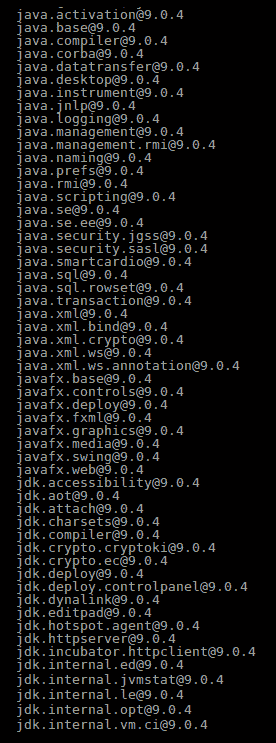
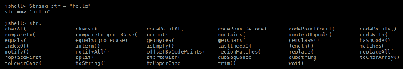

# Java 最佳实践

在本章中，我们将讨论 Java9 和 Java10 中的最佳实践。Java 从 1995 年发布的版本 1.0 到最近的版本 Java10 已经有了很大的发展。我们将快速了解 Java 从一开始到今天的发展历程，但我们将更多地关注 Java9 和 Java10 带来的最新变化。

在本章中，我们将介绍以下主题：

*   Java 简史
*   Java9 的最佳实践和新特性
*   java10 的最佳实践和新特性

# Java 简史

Java1 最初于 1995 年推出，其企业版（JavaEE）于 1999 年与 Java2 一起推出。考虑到 Java 已经存在了 20 多年的事实，毫无疑问，在构建复杂的企业应用程序时，Java 具备成为首选语言的条件。

让我们看看让 Java 一炮走红的特性：

*   **面向对象**：面向对象语言很容易学习，因为它们更接近真实世界。对于已经使用面向对象语言（如 C++）的开发人员来说，将其转换为 java 更容易，这使得它成为一种流行的选择。
*   **平台无关**：*写一次，随处执行*是 Java 的口头禅。由于 Java 代码被编译成字节码（由 JVM 解释），所以在何处编写代码和在何处执行代码没有限制。我们可以在 Linux 机器上开发一个 Java 程序，并在 Windows 或 macOS 机器上运行它，而没有任何问题。
*   **安全**：当 Java 代码被转换成字节码，字节码在**Java 虚拟机**（**JVM**内运行时，它被认为是安全的，因为它不能访问 JVM 之外的任何内存。另外，Java 不支持指针，内存管理完全由 JVM 负责，这使得语言安全。

除了核心 Java 之外，将该语言进一步普及的是 J2EE 中 servlet 等概念的引入。随着 internet 的普及，Java 提供的易用性和安全性使其成为 web 应用程序开发中的一种重要语言。进一步的概念，如多线程，有助于实现更好的性能和资源管理。

Java1.2 之所以被称为 Java2，是因为它以企业版的形式带来了重大变化。Java2 非常流行，以至于接下来的两个版本，1.3 和 1.4，通常只被称为 Java2 版本。后来出现了 Java5，它带来了一些重要的特性，并被赋予了一个独立的身份。

# Java5 的特点

Java5 引入了泛型。在泛型之前，许多数据结构（如列表和映射）都不是类型安全的。也就是说，您可以将一个人和一辆车添加到同一个列表中，然后尝试执行可能导致错误的操作。

Java5 带来的另一个重要特性是自动装箱，它有助于原语类型类和相应的包装类之间的转换。Enums 也在 Java5 中获得了新的生命。它们不仅可以保持常量值，还可以保持数据和行为。

方法采用 varargs。如果元素属于同一类型，则不再强制您提供元素的确切数目。例如，您可以简单地编写 stringMethod（字符串。。。str）并将任意数量的字符串传递给此方法。Java5 还引入了注释，这些注释在以后的版本中得到了增强，并成为许多框架的一个组成部分。

Java5 中还有许多其他增强功能，这使得该版本成为 Java 历史上的一个重要时刻。

在 Java5 之后，Java6 和 Java7 是其他重要的版本，但是 Java8 带来了重大的变化。

# Java8 的特点

Java8 是 Java 历史上另一个重要的里程碑版本。除了许多其他特性（如首次打开接口以允许静态和默认方法定义）之外，还引入了`optional`和`forEach`；两个核心添加是 streams 和 Lambda 表达式。

流可以被认为是数据管道，在其中我们可以执行两种类型的操作：中间操作和终端操作。中间操作是应用于流上转换数据的操作，但结果仍然是流；例如，`map`和`filter`。例如，在整数数据流中，使用 apply 函数（如过滤掉所有偶数或为每个数加 N）可以得到一个结果流。然而，终端操作会产生具体的输出。例如，整数数据流上的 sum 函数将返回一个最终数字作为输出。

对于 Lambda 表达式，Java 首次遇到函数式编程。lambda 帮助我们实现功能接口，这些接口只有一个未实现的方法。与以前的版本不同，我们必须创建类或匿名类，现在可以创建 Lambda 函数来实现函数接口。一个典型的例子是可以运行来实现多线程。请看下面的代码：

```
Runnable myrunnable = new Runnable() 
{
  @Override
  public void run() 
  {
    // implement code here
  }
};
new Thread(myrunnable).start();
But with Lambdas, we can do this:
Runnable myrunnableLambda = ()->
{
  // implement code here
};
new Thread(myrunnableLambda).start();
```

我们已经在[第 5 章](5.html)、*功能模式*中介绍了流和 lambda 的一些细节。

# 当前支持的 Java 版本

在编写本书时，oracleforjava 正式支持两个版本。它们是 Java8 和 Java10。Java8 是长期支持版本，Java10 是快速发布版本。Java9 是另一个快速发布版本，于 2017 年 9 月发布，从 2018 年 1 月起停止接收更新。Java8 于 2014 年 3 月发布，预计将在 2019 年 1 月之前提供商业支持，在 2020 年 12 月之前提供非商业支持。Java10 于 2018 年 3 月发布，预计将于 2018 年 9 月结束。同时，当 Java10 失去支持时，我们希望 Java11 能够发布，这将是另一个长期支持的版本，比如 Java8。

如我们所见，Java9 和 Java10 是较新的版本，因此了解它们引入的所有新特性以及使用这些新版本时的一些最佳实践是有意义的。

# Java9 的最佳实践和新特性

Java9 带来的最重要和最大的变化是 Jigsaw 项目或 Java 平台模块系统的实现。在此更改之前，您需要将完整的**Java 运行时环境**（**JRE**）作为一个整体加载到服务器或机器上以运行 Java 应用程序。使用 ProjectJigsaw，您可以决定应用程序需要加载哪些库。除了模块系统之外，Java9 还将 jshell 添加到 Java 的武库中，这对于那些使用过 RubyonRails、Python 等语言的人来说是一个福音。这与类似的功能。我们将详细讨论模块和 Jshell，以及 java9 带来的一些其他重要变化，这些变化会影响我们如何用 Java 编写代码。

# Java 平台模块系统

如果说 Java8 帮助我们改变了编码方式，那么 Java9 更多的是关于在应用程序运行时如何加载文件和模块。

首先，让我们看看 Java9 是如何将整个应用程序划分为模块的。您只需运行以下代码：

```
java --list-modules
```

您将看到与以下屏幕截图中的模块列表类似的模块列表：



我们现在的优势是可以选择应用程序将使用哪些模块，而不是默认添加所有模块。

为了理解模块的功能，让我们看一个例子。让我们尝试创建一个非常简单的计算器应用程序，它只提供`add`和`subtract`方法，以保持简单。

让我们在`provider/com.example/com/example/calc`中创建类：

```
package com.example.calc;
/**
* This class implements calculating functions on integers.
*/
public class Calculator
{
  /**
  * This method adds two numbers.
  */
  public int add(int num1, int num2)
  {
    return num1+num2; 
  }
  /**
  * This method returns difference between two numbers.
  */
  public int diff(int num1, int num2)
  {
    return num1-num2; 
  }
}
```

现在我们创建一个模块-`provider/com.example`中的`info.java`：

```
module com.example 
{
  requires java.base;
  exports com.example.calc;
}
```

我们不需要明确提供`requires java.base`。默认添加，因为所有模块都默认需要`java.base`。但我们保留它只是为了明确。

现在编译类：

```
javac -d output/classes provider/com.example/module-info.java provider/com.example/com/example/calc/Calculator.java
```

最后，创建 JAR：

```
jar cvf output/lib/example.jar -C output/classes/
```

所以，我们有一个模块，可以提供加法和减法功能。我们来看看如何在`user/com.example.user/com/example/user`中创建一个用户类来使用这个模块：

```
package com.example.user;
import com.example.calc.*;
/**
* This classes uses calculator module
*/
public class User
{
  public static void main(String s[])
  {
    Calculator calculator = new Calculator();
    System.out.println(calculator.add(1,2));
  }
}
```

同样，我们需要在`user/com.example.user`中创建模块-`info.java`：

```
module com.example.user 
{
  requires com.example;
}
```

让我们把这些方法编译成`output/userclasses`：

```
javac --module-path output/lib -d output/userclasses user/com.example.user/module-info.java user/com.example.user/com/example/user/User.java
```

创建`user.jar`，如下图：

```
jar cvf output/lib/user.jar -C output/userclasses/ 
```

最后，运行类：

```
java --module-path output/lib -m com.example.user/com.example.user.User
```

前面的代码解释了模块如何在 Java9 中工作。在继续下一个主题之前，让我们先看看 jlink，它为 Java 模块化增加了功能：

```
jlink --module-path output/lib --add-modules com.example,com.example.user --output calculaterjre
```

请注意，您需要将`java.base.mod`添加到`/output/lib`，因为我们的`com.example`依赖于`java.base`模块。创建自定义 JRE 后，可以按以下方式运行它：

```
./calculaterjre/bin/java -m com.example.user/com.example.user.User
```

你可以看到，我们能够创建自己的小 JRE。为了了解我们的小可执行文件有多紧凑和轻量级，让我们再次运行`--list-modules`：

```
calculaterjre/bin/java --list-modules w
```

这将返回以下内容：

```
com.example
com.example.user
java.base@9.0.4
```

将它与我们最初列出的缺省情况下随 Java9 提供的模块进行比较。我们可以了解我们新的可部署单元有多轻。

# JShell 公司

我们在本书前面已经给出了一些 JShell 用法的例子。在这里，我们将对 JShell 进行更具描述性的描述。如果您使用过 Python 或 Ruby-on-Rails 等语言，您一定注意到了 cool shell 特性或**Read Eval Print Loop**（**REPL**工具。这样做的目的是在开始真正的实现之前，先试用和试验这种语言。是时候让 Java 向它添加一个类似的特性了。

Jshell 是开始使用 Java 的一种简单方法。您可以编写代码片段，查看它们是如何工作的，查看不同类和方法的行为，而不必实际编写完整的代码，还可以使用 Java。让我们仔细看看，以便更好地理解。

让我们先开始贝壳吧。注意 java9 是一个先决条件，`jdk-9/bin/`应该已经添加到您的系统路径中。

只需键入`jshell`，它将带您进入 jshell 提示符，并显示一条欢迎消息：

```
$ jshell
| Welcome to JShell -- Version 9.0.4
| For an introduction type: /help intro
jshell>
```

让我们尝试几个简单的命令开始：

```
jshell> System.out.println("Hello World")
 Hello World
```

一个简单的`Hello World`。无需编写、编译或运行类：

```
jshell> 1+2
$1 ==> 3
jshell> $1
$1 ==> 3
```

当我们在 shell 中输入`1+2`时，我们在一个变量中得到结果：`$1`。请注意，我们可以在以后的命令中使用此变量：

```
jshell> int num1=10
num1 ==> 1
jshell> int num2=20
num2 ==> 2
jshell> int num3=num1+num2
num3 ==> 30
```

在前面的命令中，我们创建了几个变量，并在以后使用这些变量。

假设我想尝试一段代码，看看它在实际应用程序中是如何工作的。我可以用贝壳做。假设我想编写一个方法并进行试验，以评估它是否返回了预期的结果，以及在某些情况下是否会失败。我可以在 shell 中完成以下操作：

```
jshell> public int sum(int a, int b){
...> return a+b;
...> }
| created method sum(int,int)
jshell> sum(3,4)
$2 ==> 7
jshell> sum("str1",6)
| Error:
| incompatible types: java.lang.String cannot be converted to int
| sum("str1",6)
| ^----^
```

我创建了一个方法，并了解了它在不同输入下的行为。

您还可以使用 JShell 作为教程，学习对象可用的所有函数。

例如，假设我有一个`String str`，我想知道所有可用于此的方法。我只需要写下`str`，然后按*键*：

```
jshell> String str = "hello"
str ==> "hello"
jshell> str.
```

输出如下：



jshell 还提供了其他帮助命令。第一个你可能想用的是`/help`给你所有的命令。另一个有用的命令是`/import`检查所有已经导入的包：

```
jshell> /import
|
 import java.io.*
|
 import java.math.*
|
 import java.net.*
|
 import java.nio.file.*
|
 import java.util.*
|
 import java.util.concurrent.*
|
 import java.util.function.*
|
 import java.util.prefs.*
|
 import java.util.regex.*
|
 import java.util.stream.*
```

您可以将其他包和类导入 shell 并使用它们。

最后，`/exit`将让您关闭外壳：

```
jshell> /exit
| Goodbye
```

# 接口中的私有方法

Java8 允许我们向接口添加默认方法和静态方法，在接口中只需要实现未实现的方法。现在，当我们被允许添加默认实现时，我们可能希望将代码分解为模块，或者在一个可以被其他函数使用的方法中提取公共代码。但我们不想公开这种常用方法。为了解决这个问题，Java9 允许在接口中使用私有方法。

下面的代码显示了 Java 9 中接口的完全有效的实现，它有一个默认方法使用的 helper 私有方法：

```
package com.example;
/**
* An Interface to showcase that private methods are allowed
*
*/
public interface InterfaceExample
{
  /**
  * Private method which sums up 2 numbers
  * @param a
  * @param b
  * @return
  */
  private int sum(int a, int b)
  {
    return a+b; 
  }
  /**
  * Default public implementation uses private method
  * @param num1
  * @param num2
  * @return
  */
  default public int getSum(int num1, int num2)
  {
    return sum(num1, num2);
  }
  /**
  * Unimplemented method to be implemented by class which 
  implements this interface
  */
  public void unimplementedMethod();
}
```

# 流中的增强功能

Java8 为我们带来了流的奇妙特性，它帮助我们非常轻松高效地对列表和数据集进行操作。Java9 进一步增强了流的使用，使它们更加有用。这里我们将讨论 streams 中的重要增强：

*   **Takewhile**：java8 给了我们一个过滤器，它可以根据过滤条件检查每个元素。例如，假设从一个流中我们需要所有小于 20 的数字。可能有这样一种情况：在满足条件之前，我们需要所有数字的列表，而忽略其余的输入。也就是说，当第一次违反筛选条件时，忽略其余的输入，然后执行诸如 return 或 exit 命令之类的操作。

下面的代码展示了返回所有数字的情况，除非满足数字小于 20 的条件。条件满足一次后的所有数据被忽略：

```
jshell> List<Integer> numList = Arrays.asList(10, 13, 14, 19, 22, 19, 12, 13)
numList ==> [10, 13, 14, 19, 22, 19, 12, 13]
jshell> numList.stream().takeWhile(num -> num < 20).forEach(System.out::println)
```

输出如下：

```
10
13
14
19
```

*   **下降而**：这几乎是`takewhile()`的反转。Dropwhile 确保删除所有输入，除非满足给定的条件，并且在条件满足一次之后，所有数据都报告为输出。

让我们以 takewhile 为例来说明问题：

```
jshell> List<Integer> numList = Arrays.asList(10, 13, 14, 19, 22, 19, 12, 13)
numList ==> [10, 13, 14, 19, 22, 19, 12, 13]
jshell> numList.stream().dropWhile(num -> num < 20).forEach(System.out::println)
```

输出如下：

```
22
19
12
13
```

*   **迭代**：Java8 已经支持`Stream.iterate`，但是 Java9 可以添加一个谓词条件，使它更接近一个带有终止条件的循环。

下面的代码显示了循环条件的替换，该循环条件将变量初始化为 0，递增 2，并打印到数字小于 10 为止：

```
jshell> IntStream.iterate(0, num -> num<10, num -> num+2).forEach(System.out::println)
```

输出如下：

```
0
2
4
6
8
```

# 创建不可变集合

Java9 为我们提供了创建不可变集合的工厂方法。例如，要创建一个不可变列表，我们使用列表:

```
jshell> List immutableList = List.of("This", "is", "a", "List")
immutableList ==> [This, is, a, List]
jshell> immutableList.add("something")
| Warning:
| unchecked call to add(E) as a member of the raw type java.util.List
| immutableList.add("something")
| ^----------------------------^
| java.lang.UnsupportedOperationException thrown:
| at ImmutableCollections.uoe (ImmutableCollections.java:71)
| at ImmutableCollections$AbstractImmutableList.add (ImmutableCollections.java:77)
| at (#6:1)
```

类似地，我们有`Set.of`、`Map.of`和`Map.ofEntries`。我们来看看用法：

```
jshell> Set immutableSet = Set.of(1,2,3,4,5);
immutableSet ==> [1, 5, 4, 3, 2]
jshell> Map immutableMap = Map.of(1,"Val1",2,"Val2",3,"Val3")
immutableMap ==> {3=Val3, 2=Val2, 1=Val1}
jshell> Map immutableMap = Map.ofEntries(new AbstractMap.SimpleEntry<>(1,"Val1"), new AbstractMap.SimpleEntry<>(2,"Val2"))
immutableMap ==> {2=Val2, 1=Val1}
```

# 数组中的加法

到目前为止，我们已经讨论了流和集合。阵列中还有一些附加功能：

*   **不匹配**：尝试匹配两个数组，并返回数组不匹配的第一个元素的索引。如果两个数组相同，则返回`-1`：

```
jshell> int[] arr1={1,2,3,4}
arr1 ==> int[4] { 1, 2, 3, 4 }
jshell> Arrays.mismatch(arr1, new int[]{1,2})
$14 ==> 2
jshell> Arrays.mismatch(arr1, new int[]{1,2,3,4})
$15 ==> -1
```

我们创建了一个整数数组。第一个比较显示数组在索引 2 处不匹配。第二个比较显示两个数组是相同的。

*   **比较**：按字典顺序比较两个数组。还可以指定开始索引和结束索引，这是一个可选参数：

```
jshell> int[] arr1={1,2,3,4}
arr1 ==> int[4] { 1, 2, 3, 4 }
jshell> int[] arr2={1,2,5,6}
arr2 ==> int[4] { 1, 2, 5, 6 }
jshell> Arrays.compare(arr1,arr2)
$18 ==> -1
jshell> Arrays.compare(arr2,arr1)
$19 ==> 1
jshell> Arrays.compare(arr2,0,1,arr1,0,1)
$20 ==> 0
```

我们创建了两个数组并进行了比较。当两个数组相等时，我们将得到 0 输出。如果第一个词的词法较大，则得到`1`，否则得到`-1`。在最后一次比较中，我们提供了要比较的数组的开始索引和结束索引。因此，两个数组只比较前两个元素，这两个元素相等，因此 0 是输出。

*   **等于**：顾名思义，Equals 方法检查两个数组是否相等。同样，您可以提供开始索引和结束索引：

```
jshell> int[] arr1={1,2,3,4}
arr1 ==> int[4] { 1, 2, 3, 4 }
jshell> int[] arr2={1,2,5,6}
arr2 ==> int[4] { 1, 2, 5, 6 }
jshell> Arrays.equals(arr1, arr2)
$23 ==> false
jshell> Arrays.equals(arr1,0,1, arr2,0,1)
$24 ==> true
```

# 对可选类的添加

Java8 给了我们`java.util.Optional`类来处理空值和空指针异常。Java 9 又添加了一些方法：

*   `ifPresentOrElse`：如果存在`Optional`值，则方法`void ifPresentOrElse(Consumer<? super T> action, Runnable emptyAction)`执行给定动作；否则执行`emptyAction`。我们来看几个例子：

```
//Example 1
jshell> Optional<String> opt1= Optional.ofNullable("Val")
opt1 ==> Optional[Val]
//Example 2
jshell> Optional<String> opt2= Optional.ofNullable(null)
opt2 ==> Optional.empty
//Example 3
jshell> opt1.ifPresentOrElse(v->System.out.println("found:"+v),
()->System.out.println("no"))
found:Val
//Example 4
jshell> opt2.ifPresentOrElse(v->System.out.println("found:"+v),
()->System.out.println("not found"))
not found
```

*   **或**：由于可选对象可以有值，也可以为 null，所以当您需要返回当前可选对象时，如果它有某个合法值，或者返回其他可选对象，Or 函数会有所帮助。

我们来看几个例子：

```
//Example 1
jshell> Optional<String> opt1 = Optional.ofNullable("Val")
opt1 ==> Optional[Val]
//Example 2
jshell> Optional<String> opt2 = Optional.ofNullable(null)
opt2 ==> Optional.empty
//Example 3
jshell> Optional<String> opt3 = Optional.ofNullable("AnotherVal")
opt3 ==> Optional[AnotherVal]
//Example 4
jshell> opt1.or(()->opt3)
$41 ==> Optional[Val]
//Example 5
jshell> opt2.or(()->opt3)
$42 ==> Optional[AnotherVal]
```

由于`opt1`不为空，与或一起使用时返回；而`opt2`为空，因此返回`opt3`。

*   **流**：流在 Java8 之后开始流行，Java9 为我们提供了一种将可选对象转换为流的方法。我们来看几个例子：

```
//Example 1
jshell> Optional<List> optList = Optional.of(Arrays.asList(1,2,3,4))
optList ==> Optional[[1, 2, 3, 4]]
//Example 2
jshell> optList.stream().forEach(i->System.out.println(i))
[1, 2, 3, 4]
```

# 新建 HTTP 客户端

Java9 带来了一个新的光滑的 HTTP 客户端 API，支持 HTTP/2。让我们通过在 jshell 中运行一个示例来进一步了解一下。

要使用`httpclient`，我们需要用`jdk.incubator.httpclient`模块启动 jshell。以下命令告诉 jshell 添加所需的模块：

```
jshell -v --add-modules jdk.incubator.httpclient
```

现在让我们导入 API：

```
jshell> import jdk.incubator.http.*;
```

使用以下代码创建一个`HttpClient`对象：

```
jshell> HttpClient httpClient = HttpClient.newHttpClient();
httpClient ==> jdk.incubator.http.HttpClientImpl@6385cb26
| created variable httpClient : HttpClient
```

让我们为 URL[创建一个请求对象 https://www.packtpub.com/](https://www.packtpub.com/)：

```
jshell> HttpRequest httpRequest = HttpRequest.newBuilder().uri(new URI("https://www.packtpub.com/")).GET().build();
httpRequest ==> https://www.packtpub.com/ GET
| created variable httpRequest : HttpRequest
```

最后，调用 URL。结果将存储在`HttpResponse`对象中：

```
jshell> HttpResponse<String> httpResponse = httpClient.send(httpRequest, HttpResponse.BodyHandler.asString());
httpResponse ==> jdk.incubator.http.HttpResponseImpl@70325e14
| created variable httpResponse : HttpResponse<String>
```

我们可以检查响应状态码，甚至打印正文：

```
jshell> System.out.println(httpResponse.statusCode());
200
jshell> System.out.println(httpResponse.body());
```

我们可以看到它的易用性，并且没有必要为 HTTP 客户机包含大量的第三方库。

# 对 Java9 的更多补充

到目前为止，我们已经讨论了 Java9 的核心添加内容，它们将影响您的日常编码生活。让我们看看更多的功能添加，这些功能可能没有那么大的影响，但仍然值得了解：

*   **Javadocs 的改进**：Java9 带来了 Javadocs 的改进，比如支持 HTML5，增加了搜索功能，在现有 Javadocs 功能的基础上增加了模块信息。
*   **多版本 JAR**：假设一个类有不同的版本，应该在不同的 Java 版本上运行。例如，Java 有两个不同的版本，一个支持 Java8，另一个支持 Java9。您将创建这两个类文件，并在创建 JAR 文件时包含它们。将根据与 Java7 或 Java9 一起使用的 JAR 选择文件的正确版本。

*   **流程 API 改进**：Java5 为我们提供了 Process Builder API，它有助于生成新流程。Java9 引入了`java.lang.ProcessHandle`和`java.lang.ProcessHandle.Info`API，以便更好地控制和收集有关进程的更多信息。

*   **Try with resources improvements**：Java7 引入了一个特性，您可以使用 Try 块来管理资源并帮助删除大量样板代码。Java9 进一步改进了它，这样就不需要在 try 块中引入新的变量来使用 try 和资源。

让我们看一个小例子来理解我们的意思。以下是在 Java 9 之前编写的代码：

```
jshell> void beforeJava9() throws IOException{
...> BufferedReader reader1 = new BufferedReader(new FileReader("/Users/kamalmeetsingh/test.txt"));
...> try (BufferedReader reader2 = reader1) {
...> System.out.println(reader2.readLine());
...> }
...> }
| created method beforeJava9()
```

Java 9 之后的代码如下：

```
jshell> void afterJava9() throws IOException{
...> BufferedReader reader1 = new BufferedReader(new FileReader("/Users/kamalmeetsingh/test.txt"));
...> try (reader1) {
...> System.out.println(reader1.readLine());
...> }
...> }
| created method afterJava9()
```

*   **匿名类菱形运算符**：在 Java8 之前，您不可能将菱形运算符用于内部类。Java9 中删除了这个限制。

我们已经介绍了 Java9 的大部分重要特性，这些特性将影响您在 Java 中编写代码的方式。使用上述实践将帮助我们充分利用 Java 的功能。但是我们知道 Java10 带来了额外的变化，所以在下一节中我们将进一步讨论影响代码的一些重要特性。

# java10 的最佳实践和新特性

Java10 是 Java 的最新版本。与以前的版本一样，这也为语言添加了一些有趣的特性。在编写代码时，我们可以直接与一些功能进行交互，但也有一些在幕后起作用的改进，例如改进的垃圾收集，它可以改善用户的总体体验。在本节中，我们将讨论 Java10 添加的一些重要特性。

# 局部变量类型推断

这可能是 Java10 中最大的改变，它将影响您过去的编码方式。Java 一直被称为严格类型语言。好吧，它仍然是，但是在 Java10 中，您可以在声明局部变量时自由地使用`var`，而不是提供适当的类型。

举个例子：

```
public static void main(String s[]) 
{
  var num = 10;
  var str = "This is a String";
  var dbl = 10.01;
  var lst = new ArrayList<Integer>();
  System.out.println("num:"+num);
  System.out.println("str:"+str);
  System.out.println("dbl:"+dbl);
  System.out.println("lst:"+lst);
}
```

我们可以定义和使用变量，而无需指定类型。但这项功能并非没有它的一系列限制。

不能将类作用域变量声明为`var`。例如，以下代码将显示编译器错误：

```
public class VarExample {
// not allowed
// var classnum=10;
}
```

即使在局部范围内，只有当编译器可以从表达式的右侧推断变量的类型时，才可以使用 var。例如，以下情况很好：

```
int[] arr = {1,2,3};
```

但是，这并不好：

```
var arr = {1,2,3};
```

但是，您可以始终使用以下选项：

```
var arr = new int[]{1,2,3};
```

还有其他情况不能使用`var`。例如，不能使用 var 定义方法返回类型或方法参数。

不允许出现以下情况：

```
public var sum(int num1, int num2) 
{
  return num1+num2;
}
```

这也不允许：

```
public int sum(var num1, var num2) 
{
  return num1+num2;
} 
```

尽管可以使用 var 来声明变量，但还是需要注意一点。您需要注意如何声明变量以保持代码的可读性。例如，您可能会在代码中遇到以下行：

```
var sample = sample();
```

你能看懂这个变化多端的样品吗？是字符串还是整数？您可能会认为，我们可以在命名变量（如 strSample 或 intSample）时提供适当的命名约定。但是如果你的类型有点复杂呢？看看这个：

```
public static HashMap<Integer, HashMap<String, String>> sample()
{
  return new HashMap<Integer, HashMap<String, String>>();
}
```

在这种情况下，您可能需要确保使用了正确的基于类型的声明，以避免代码可读性问题。

在声明集合时需要小心的另一个领域是`ArrayLists`。例如，这在 Java 中是合法的：

```
var list = new ArrayList<>();
list.add(1);
list.add("str");
```

你很清楚这里的问题。编译器已推断出包含*对象*的前面列表，而您的代码可能正在查找整数列表。因此，我们预计在这种情况下会出现一些严重的运行时错误。所以，在这种情况下，最好始终明确。

因此，简而言之，`var`是 Java 的一个很好的补充，可以帮助我们更快地编写代码，但我们在使用它时需要小心，以避免代码可读性和维护问题。

# 集合的 copyOf 方法

引入了`copyOf`方法来创建集合的不可修改副本。例如，假设您有一个列表，并且您需要一个不可变或不可修改的副本，您可以使用`copyOf`函数。如果您使用过集合，您可能想知道它与`Collections.unmodifiableCollection`有何不同，后者承诺做同样的事情，即创建集合的不可修改副本。虽然这两种方法都提供了一个不可修改的副本，但是当我们在集合（比如列表）上使用`copyOf`时，它会返回一个不能进一步修改的列表，加上对原始列表的任何更改都不会影响复制的列表。另一方面，在上述情况下，`Collections.unmodifiableCollection`确实返回了一个不可修改的列表，但是这个列表仍然会反映原始列表中的任何修改。

让我们仔细看看，让事情更清楚：

```
public static void main(String args[]) {
List<Integer> list = new ArrayList<Integer>();
list.add(1);
list.add(2);
list.add(3);
System.out.println(list);
var list2 = List.copyOf(list);
System.out.println(list2);
var list3 = Collections.unmodifiableCollection(list);
System.out.println(list3);
// this will give an error
// list2.add(4);
// but this is fine
list.add(4);
System.out.println(list);
// Print original list i.e. 1, 2, 3, 4
System.out.println(list2);
// Does not show added 4 and prints 1, 2, 3
System.out.println(list3);
// Does show added 4 and prints 1, 2, 3, 4
}
```

类似地，我们可以对集合、hashmaps 等使用`copyOf`函数来创建对象的不可修改副本。

# 完全垃圾收集的并行化

在 C 语言和 C++语言中，分配和分配内存是开发者的责任。这可能很棘手，因为如果开发人员犯了一个错误，比如忘记释放分配的内存，就会导致内存不足的问题。Java 通过提供垃圾收集来处理这个问题。分配和释放内存的责任从开发人员转移到了 Java。

Java 使用两种机制来维护它的内存：堆栈和堆。您一定看到了两个不同的错误，即`StackOverFlowError`和`OutOfMemoryError`，表示某个内存区域已满。堆栈中的内存仅对当前线程可见。因此，清理是直接的；也就是说，当线程离开当前方法时，堆栈上的内存就会释放。堆中的内存更难管理，因为它可以在整个应用程序中使用；因此，需要专门的垃圾收集。

多年来，Java 对**垃圾收集**（**GC**算法）进行了改进，使其越来越有效。其核心思想是，如果分配给对象的内存空间不再被引用，则可以释放该空间。大多数 GC 算法将分配的内存分为年轻一代和老一代。从使用情况来看，Java 能够标记大多数对象在 GC 早期或初始 GC 周期期间成为符合 GC 条件的对象。例如，方法中定义的对象只有在方法处于活动状态之前是活动的，并且一旦返回响应，局部范围变量就可以进行 GC。

G1 收集器或垃圾第一垃圾收集器最早是在 java7 中引入的，在 java9 中是默认的。垃圾收集主要分为两个阶段。在第一阶段，垃圾收集器标记可以删除或清理的元素；也就是说，它们不再被引用。第二阶段实际上是清理内存。此外，这些阶段在分配了不同代内存的不同单元上独立运行。G1 收集器可以在后台并发执行大多数活动，而无需停止应用程序，但完全垃圾回收除外。当通常清理年轻一代内存的部分 gc 没有充分清理空间时，需要进行完全的垃圾收集。

在 Java10 中，完全的垃圾收集可以通过并行线程完成。这是早些时候在单线程模式下完成的。当涉及到完整 GC 时，这将提高整体 GC 性能。

# 对 Java10 的更多补充

我们已经介绍了 Java 10 的大多数重要特性添加，但还有一些值得在这里讨论：

*   **基于时间的版本控制**：这并不完全是一个新特性，但更多的是 Java 推荐的未来版本的版本控制方式。如果您长期使用 Java，那么了解 Java 版本是如何发布的是值得的。

版本号的格式如下：`$FEATURE.$INTERIM.$UPDATE.$PATCH`

Java 决定每六个月发布一个新的特性版本。记住这一点，java11 的发布定于 2018 年 9 月，也就是 java10 发布六个月之后。这个想法是每六个月不断更新一次。有两种思想流派；一种支持这种安排，因为用户将经常得到更改，但另一种则表示，这将减少开发人员习惯发布的时间。

因此，如果您查看版本号 10.0.2.1，就会知道这属于功能版本 10，没有临时版本、更新版本 2 和修补程序 1。

*   **通用编译器**：编译器是以代码为输入，将代码转换为机器语言的计算机程序。Java 的 JIT 编译器将代码转换成字节码，然后由 JVM 将字节码转换成机器语言。使用 Java10，您可以在 Linux 机器上使用实验性的 Graal 编译器。需要注意的是，这仍处于试验阶段，不建议用于生产。

*   **应用类数据共享**：这是 Java 的又一个内部更新，所以您在编写代码时可能不会注意到，但是了解它是件好事。这样做的目的是减少 Java 应用程序的启动时间。JVM 在应用程序启动时加载类。如果不更新文件，早期的 JVM 仍然会重新加载所有类。使用 java10，JVM 将只创建一次数据并将其添加到存档中，如果下次不更新类，则无需重新加载数据。另外，如果多个 jvm 正在运行，那么这些数据可以在它们之间共享。同样，此更新不是一个可见的更新，但将提高应用程序的整体性能。

到目前为止，我们已经介绍了 Java10 的大部分重要特性。在结束本章之前，让我们先看看 Java 未来的发展趋势；也就是说，Java11 有什么可以期待的，它计划什么时候发布？

# 在 Java11 中应该期望什么？

Java11 预计将于 2018 年 9 月左右发布。值得一看 Java 11 中的一些重要特性：

*   **Lambda 表达式的局部变量语法**：java10 引入了一个特性，可以在声明局部变量时使用 var，但是现在不允许与 Lambda 表达式一起使用。这个限制应该随着 Java11 而消失。

*   **Epsilon 低开销垃圾收集器**：这个 JEP 或 JDK 增强方案讨论了实现一个*no op*垃圾收集器。换句话说，这个垃圾收集器应该主要关注内存分配，而不是实现任何内存回收机制。可能很难想象一个应用程序不需要任何垃圾收集，但这是针对一组不分配太多堆内存或重用分配的对象的应用程序的，在某种意义上，没有太多的对象成为不可访问或短暂的作业。对于 no-op 垃圾收集器的有用性有不同的看法，但它将是 Java 的一个有趣的补充。

*   **动态类文件常量**：此 JEP 或 JDK 增强方案扩展了当前 Java 类文件格式，以支持新的常量池形式`CONSTANT_Dynamic`。这里的想法是减少创建新形式的可物化类文件常量的成本和中断。

除了上面提到的添加，Java11 还建议删除一些模块，比如 JavaEE 和 CORBA。这些模块在 Java9 中已经被弃用，在 JavaSDK11 中应该被完全删除。

另外，java11 应该是**长期支持**（**LTS**的版本。这意味着，与 Java9 和 Java10 不同，Java9 和 Java10 对 JDK 的支持仅限于几个月，Java11 将支持 2 到 3 年。Java 决定每三年发布一次 LTS 版本，因此如果我们预计 Java11 将在 2018 年 9 月发布，那么下一个 LTS 版本将在 2021 年发布。

# 摘要

在本章中，我们讨论了 Java 的一些重要特性和最佳实践。我们从 Java 发行版的一开始就开始了我们的旅程，并触及了 Java 的一些重要里程碑。我们讨论了一些重要的 Java 版本，比如 java5 和 java8，它们通过引入泛型、自动装箱、Lambda 表达式、流等特性，在某种程度上改变了我们在 Java 中编写代码的方式。

然后我们详细介绍了更现代的版本，即 Java9 和 Java10。Java9 给了我们模块化。我们现在可以根据不同的模块来考虑 Java 代码，并选择应用程序所需的模块。java9 还将 JShell 添加到了它的库中，这有助于我们在不实际编写和编译类的情况下尝试和实验这种语言。Java9 增加了在接口中定义私有方法的功能。此外，我们还使用 Java9 在流、集合、数组等方面获得了新特性。

Java10 为我们提供了使用`var`关键字声明变量的灵活性，而无需显式地提及对象类型。我们讨论了使用 var 的局限性，以及为什么在使用 var 声明对象时需要小心，以避免损害代码的可读性和可维护性。我们还讨论了创建集合的不可变副本的方法以及 Java10 中的垃圾收集改进。

最后，我们讨论了在 Java11 中可以预期的内容，例如添加到垃圾收集中以及将 var 与 Lambda 一起使用。与 Java9 和 Java10 不同，Java11 预计是一个长期版本。而且，根据 Oracles 的 3 年政策，下一个长期版本预计将在 2021 年 java11 之后的某个时候发布。

Java 自诞生以来已经走过了很长的一段路，它一次又一次地重新发明自己。将来还会有更多的东西，看看 Java 未来的发展会很有趣。