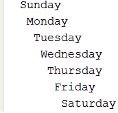
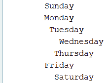

# 字符串、数字和数学

本章包括 39 个涉及字符串、数字和数学运算的问题。我们将从研究字符串的一系列经典问题开始，例如计算重复项、反转字符串和删除空格。然后，我们将研究专门用于数字和数学运算的问题，例如两个大数求和和和运算溢出，比较两个无符号数，以及计算除法和模的下限。每个问题都要经过几个解决方案，包括 Java8 的函数风格。此外，我们将讨论与 JDK9、10、11 和 12 有关的问题。

在本章结束时，您将知道如何使用一系列技术，以便您可以操纵字符串并应用、调整它们以适应许多其他问题。你还将知道如何解决可能导致奇怪和不可预测的结果的数学角落的情况。

# 问题

使用以下问题来测试您的字符串操作和数学角大小写编程能力。我强烈建议您在使用解决方案和下载示例程序之前，先尝试一下每个问题：

1.  **重复字符计数**：编写一个程序，对给定字符串中的重复字符进行计数。
2.  **寻找第一个非重复字符**：编写一个程序，返回给定字符串中的第一个非重复字符。
3.  **反转字母和单词**：编写一个反转每个单词字母的程序，以及一个反转每个单词字母和单词本身的程序。
4.  **检查字符串是否只包含数字**：编写一个程序检查给定字符串是否只包含数字。

5.  **计数元音和辅音**：编写一个程序，计算给定字符串中元音和辅音的数量。对于英语，有五个元音（a、e、i、o 和 u）。
6.  **计数某个字符的出现次数**：编写一个程序，对给定字符串中某个字符的出现次数进行计数。
7.  **将`String`转换成`int`、`long`、`float`或`double`**：编写一个程序，将给定的`String`对象（代表数字）转换成`int`、`long`、`float`或`double`。
8.  **删除字符串中的空格**：编写一个程序，删除给定字符串中的所有空格。
9.  **用一个分隔符连接多个字符串**：编写一个程序，用给定的分隔符连接给定的字符串。
10.  **生成所有排列**：编写一个程序，生成给定字符串的所有排列。
11.  **检查字符串是否为回文**：编写一个程序，确定给定的字符串是否为回文。
12.  **删除重复字符**：编写一个程序，从给定字符串中删除重复字符。
13.  **删除给定字符**：编写一个从给定字符串中删除给定字符的程序。
14.  **查找出现次数最多的字符**：编写一个程序，在给定的字符串中查找出现次数最多的字符。
15.  **按长度排序字符串数组**：编写按给定字符串数组长度排序的程序。
16.  **检查字符串是否包含子字符串**：编写程序检查给定字符串是否包含给定子字符串。
17.  **计算子串在字符串中出现的次数**：编写一个程序，计算给定字符串在另一个给定字符串中出现的次数。
18.  **检查两个字符串是否是**：编写一个检查两个字符串是否是异序词的程序。假设一个字符串的一个异序词是这个字符串的一个排列，忽略了大小写和空格。
19.  **声明多行字符串（文本块）**：编写声明多行字符串或文本块的程序。
20.  **连接同一字符串`n`次**：编写一个程序，将同一字符串连接给定次数。
21.  **删除前导和尾随空格**：编写一个程序，删除给定字符串的前导和尾随空格。

22.  **查找最长公共前缀**：编写一个程序，查找给定字符串的最长公共前缀。
23.  **应用缩进**：编写几个代码片段，对给定的文本应用缩进。
24.  **转换字符串**：写几段代码将一个字符串转换成另一个字符串。
25.  **计算两个数的最小值和最大值**：编写一个程序，返回两个数的最小值和最大值。
26.  **两个大`int`/`long`数的求和运算溢出**：编写一个程序，对两个大`int`/`long`数求和，运算溢出时抛出算术异常。
27.  **作为基数的字符串**中的无符号数：编写一个程序，将给定字符串解析为给定基数中的无符号数（`int`或`long`）。
28.  **无符号数字的转换**：编写一个程序，将给定的`int`数字无符号转换成`long`。
29.  **比较两个无符号数字**：编写一个程序，将给定的两个数字作为无符号数字进行比较。
30.  **无符号值的除法和模**：编写一个程序，计算给定无符号值的除法和模。
31.  **`double`/`float`是否是有限浮点值**：编写一个程序来确定给定的`double`/`float`值是否是一个有限浮点值。
32.  **对两个布尔表达式应用逻辑 AND/OR/XOR**：编写一个程序，对两个布尔表达式应用逻辑 AND/OR/XOR。
33.  **将`BigInteger`转换成原始类型**：编写程序，从给定的`BigInteger`中提取原始类型值。
34.  **将`long`转换成`int`**：编写一个将`long`转换成`int`的程序。
35.  **计算下限除法和模**：编写程序，计算给定除法（`x`）和除法（`y`）的下限除法和下限模。
36.  **下一个浮点值**：编写一个程序，返回给定的`float`/`double`值在正负无穷方向上相邻的下一个浮点值。
37.  **两个大`int`/`long`值相乘运算溢出**：编写一个程序，将两个大`int`/`long`值相乘，运算溢出时抛出算术异常。

38.  **融合乘加**（**FMA**）：编写一个程序，取三个`float`/`double`值（`a`、`b`、`c`），高效计算`a`b+c*。
39.  **紧凑数字格式化**：编写一个程序，将数字 1000000 格式化为 1M（美国地区）和 1ML（意大利地区）。另外，将一个字符串中的 1M 和 1MLN 解析为一个数字。

# 解决方案

以下各节介绍上述问题的解决方案。记住，通常没有一个正确的方法来解决一个特定的问题。另外，请记住，这里显示的解释只包括解决问题所需的最有趣和最重要的细节。您可以从[这个页面](https://github.com/PacktPublishing/Java-Coding-Problems)下载示例解决方案以查看更多详细信息并尝试程序。

# 1 重复字符计数

计算字符串中的字符（包括特殊字符，如#、$和%）的解决方案意味着取每个字符并将它们与其他字符进行比较。在比较过程中，计数状态是通过一个数字计数器来保持的，每次找到当前字符时，该计数器都会增加一个。

这个问题有两种解决办法。

第一种解决方案迭代字符串，并使用`Map`将字符存储为键，将出现的次数存储为值。如果当前字符从未添加到`Map`，则将其添加为`(character, 1)`。如果当前字符存在于`Map`中，则只需将其出现次数增加 1，例如`(character, occurrences+1)`。如下代码所示：

```java
public Map<Character, Integer> countDuplicateCharacters(String str) {

  Map<Character, Integer> result = new HashMap<>();

  // or use for(char ch: str.toCharArray()) { ... }
  for (int i = 0; i<str.length(); i++) {
    char ch = str.charAt(i); 

    result.compute(ch, (k, v) -> (v == null) ? 1 : ++v);
  }

  return result;
}
```

另一个解决方案依赖于 Java8 的流特性。这个解决方案有三个步骤。前两步是将给定的字符串转换成`Stream<Character>`，最后一步是对字符进行分组和计数。步骤如下：

1.  对原始字符串调用`String.chars()`方法。这将返回`IntStream`。这个`IntStream`包含给定字符串中字符的整数表示。
2.  通过`mapToObj()`方法将`IntStream`转换成字符流（将整数表示转换成人性化的字符形式）。
3.  最后，将字符分组（`Collectors.groupingBy()`）并计数（`Collectors.counting()`）。

以下代码片段将这三个步骤粘在一个方法中：

```java
public Map<Character, Long> countDuplicateCharacters(String str) {

  Map<Character, Long> result = str.chars()
    .mapToObj(c -> (char) c)
    .collect(Collectors.groupingBy(c -> c, Collectors.counting()));

  return result;
}
```

# Unicode 字符呢？

我们非常熟悉 ASCII 字符。我们有 0-31 之间的不可打印控制码，32-127 之间的可打印字符，128-255 之间的扩展 ASCII 码。但是 Unicode 字符呢？对于每个需要操作 Unicode 字符的问题，请考虑本节

因此，简而言之，早期的 Unicode 版本包含值小于 65535（0xFFFF）的字符。Java 使用 16 位`char`数据类型表示这些字符。只要`i`不超过 65535，调用`charAt(i)`就可以正常工作。但随着时间的推移，Unicode 添加了更多字符，最大值达到了 1114111（0x10FFFF）。这些字符不适合 16 位，因此 UTF-32 编码方案考虑 32 位值（称为*码位*）。

不幸的是，Java 不支持 UTF-32！尽管如此，Unicode 还是提出了一个解决方案，仍然使用 16 位来表示这些字符。此解决方案意味着：

*   16 位*高位代理*：1024 个值（U+D800 到 U+DBFF）
*   16 位*低位代理*：1024 个值（U+DC00 到 U+DFFF）

现在，一个高代理后跟一个低代理定义了所谓的**代理对**。代理项对用于表示 65536（`0x10000`）和 1114111（`0x10FFFF`）之间的值。因此，某些字符（称为 Unicode 补充字符）被表示为 Unicode 代理项对（一个字符（符号）适合于一对字符的空间），这些代理项对被合并到一个代码点中。Java 利用了这种表示，并通过一组方法来公开它，如`codePointAt()`、`codePoints()`、`codePointCount()`，和`offsetByCodePoints()`（请查看 Java 文档了解详细信息）。调用`codePointAt()`而不是`charAt()`，`codePoints()`而不是`chars()`等等，可以帮助我们编写覆盖 ASCII 和 Unicode 字符的解决方案。

例如，众所周知的双心符号是 Unicode 代理项对，可以表示为包含两个值的`char[]`：`\uD83D`和`\uDC95`。此符号的码位为`128149`。要从此代码点获取一个`String`对象，请调用`String str = String.valueOf(Character.toChars(128149))`。`str`中的码点计数可以通过调用`str.codePointCount(0, str.length())`来完成，即使`str`长度为 2，也返回 1；调用`str.codePointAt(0)`返回`128149`，调用`str.codePointAt(1)`返回`56469`。调用`Character.toChars(128149)`返回 2，因为需要两个字符来表示此代码点是 Unicode 代理项对。对于 ASCII 和 Unicode 16 位字符，它将返回 1。

因此，如果我们尝试重写第一个解决方案（迭代字符串并使用`Map`将字符存储为键，将出现次数存储为值）以支持 ASCII 和 Unicode（包括代理项对），我们将获得以下代码：

```java
public static Map<String, Integer> 
    countDuplicateCharacters(String str) {

  Map<String, Integer> result = new HashMap<>();

  for (int i = 0; i < str.length(); i++) {
 int cp = str.codePointAt(i);
 String ch = String.valueOf(Character.toChars(cp));
 if(Character.charCount(cp) == 2) { // 2 means a surrogate pair
 i++;
 }

    result.compute(ch, (k, v) -> (v == null) ? 1 : ++v);
  }

  return result;
}
```

突出显示的代码也可以编写如下：

```java
String ch = String.valueOf(Character.toChars(str.codePointAt(i)));
if (i < str.length() - 1 && str.codePointCount(i, i + 2) == 1) {
  i++;
}
```

最后，尝试重写 Java8 函数式解决方案以覆盖 Unicode 代理项对，可以执行以下操作：

```java
public static Map<String, Long> countDuplicateCharacters(String str) { 

  Map<String, Long> result = str.codePoints()
    .mapToObj(c -> String.valueOf(Character.toChars(c)))
    .collect(Collectors.groupingBy(c -> c, Collectors.counting()));

  return result;
}
```

对于第三方库支持，请考虑 Guava:`Multiset<String>`。

下面的一些问题将提供包括 ASCII、16 位 Unicode 和 Unicode 代理项对的解决方案。它们是任意选择的，因此，通过依赖这些解决方案，您可以轻松地为没有提供此类解决方案的问题编写解决方案。

# 2 找到第一个非重复字符

找到字符串中第一个不重复的字符有不同的解决方案。主要地，这个问题可以通过字符串的一次遍历或更完整/部分的遍历来解决。

在单遍历方法中，我们填充一个数组，该数组用于存储字符串中恰好出现一次的所有字符的索引。使用此数组，只需返回包含非重复字符的最小索引：

```java
private static final int EXTENDED_ASCII_CODES = 256;
...
public char firstNonRepeatedCharacter(String str) {

  int[] flags = new int[EXTENDED_ASCII_CODES];

  for (int i = 0; i < flags.length; i++) {
    flags[i] = -1;
  }

  for (int i = 0; i < str.length(); i++) {
    char ch = str.charAt(i);
    if (flags[ch] == -1) {
      flags[ch] = i;
    } else {
      flags[ch] = -2;
    }
  }

  int position = Integer.MAX_VALUE;

  for (int i = 0; i < EXTENDED_ASCII_CODES; i++) {
    if (flags[i] >= 0) {
      position = Math.min(position, flags[i]);
    }
  }

  return position == Integer.MAX_VALUE ?
    Character.MIN_VALUE : str.charAt(position);
}
```

此解决方案假定字符串中的每个字符都是扩展 ASCII 表（256 个代码）的一部分。如果代码大于 256，[则需要相应地增加数组的大小](http://www.alansofficespace.com/unicode/unicd99.htm)。只要数组大小不超过`char`类型的最大值，即`Character.MAX_VALUE`，即 65535，该解决方案就可以工作。另一方面，`Character.MAX_CODE_POINT`返回 Unicode 码位的最大值 1114111。为了覆盖这个范围，我们需要另一个基于`codePointAt()`和`codePoints()`的实现

由于采用了单次遍历的方法，所以速度非常快。另一种解决方案是循环每个字符的字符串并计算出现的次数。每出现一次（重复）就会打断循环，跳到下一个字符，并重复算法。如果到达字符串的结尾，则返回当前字符作为第一个不可重复的字符。本书附带的代码中提供了此解决方案。

这里介绍的另一个解决方案依赖于`LinkedHashMap`。这个 Java 映射是一个*插入顺序*映射（它保持了键插入到映射中的顺序），对于这个解决方案非常方便。`LinkedHashMap`以字符作为键，以出现次数作为值填充。一旦`LinkedHashMap`完成，它将返回值等于 1 的第一个键。由于*插入顺序*功能，这是字符串中第一个不可重复的字符：

```java
public char firstNonRepeatedCharacter(String str) {

  Map<Character, Integer> chars = new LinkedHashMap<>();

  // or use for(char ch: str.toCharArray()) { ... }
  for (int i = 0; i < str.length(); i++) {
    char ch = str.charAt(i);

    chars.compute(ch, (k, v) -> (v == null) ? 1 : ++v);
  }

  for (Map.Entry<Character, Integer> entry: chars.entrySet()) {
    if (entry.getValue() == 1) {
      return entry.getKey();
    }
  }

  return Character.MIN_VALUE;
}
```

在本书附带的代码中，前面提到的解决方案是用 Java8 函数式编写的。此外，支持 ASCII、16 位 Unicode 和 Unicode 代理项对的函数式解决方案如下：

```java
public static String firstNonRepeatedCharacter(String str) {

  Map<Integer, Long> chs = str.codePoints()
    .mapToObj(cp -> cp)
    .collect(Collectors.groupingBy(Function.identity(),
      LinkedHashMap::new, Collectors.counting()));

  int cp = chs.entrySet().stream()
   .filter(e -> e.getValue() == 1L)
   .findFirst()
   .map(Map.Entry::getKey)
   .orElse(Integer.valueOf(Character.MIN_VALUE));

  return String.valueOf(Character.toChars(cp));
}
```

要更详细地理解这段代码，请考虑“Unicode 字符是什么？计数重复字符”部分的小节

# 3 反转字母和单词

首先，让我们只反转每个单词的字母。这个问题的解决方案可以利用`StringBuilder`类。第一步包括使用空格作为分隔符（`Spring.split(" ")`）将字符串拆分为单词数组。此外，我们使用相应的 ASCII 码反转每个单词，并将结果附加到`StringBuilder`。首先，我们将给定的字符串按空格拆分。然后，我们循环得到的单词数组，并通过`charAt()`按相反的顺序获取每个字符来反转每个单词：

```java
private static final String WHITESPACE = " ";
...
public String reverseWords(String str) {

 String[] words = str.split(WHITESPACE);
 StringBuilder reversedString = new StringBuilder();

 for (String word: words) {
   StringBuilder reverseWord = new StringBuilder();

   for (int i = word.length() - 1; i >= 0; i--) {
     reverseWord.append(word.charAt(i));
   }

   reversedString.append(reverseWord).append(WHITESPACE);
 }

 return reversedString.toString();
}
```

在 Java8 函数样式中获得相同的结果可以如下所示：

```java
private static final Pattern PATTERN = Pattern.compile(" +");
...
public static String reverseWords(String str) {

  return PATTERN.splitAsStream(str)
    .map(w -> new StringBuilder(w).reverse())
    .collect(Collectors.joining(" "));
}
```

请注意，前面两个方法返回一个字符串，其中包含每个单词的字母，但单词本身的初始顺序相同。现在，让我们考虑另一种方法，它反转每个单词的字母和单词本身。由于内置的`StringBuilder.reverse()`方法，这非常容易实现：

```java
public String reverse(String str) {

  return new StringBuilder(str).reverse().toString();
}
```

对于第三方库支持，请考虑 ApacheCommonsLang，`StringUtils.reverse()`。

# 4 检查字符串是否只包含数字

这个问题的解决依赖于`Character.isDigit()`或`String.matches()`方法

依赖于`Character.isDigit()`的解决方案是非常简单和快速地循环字符串，如果此方法返回`false`，则中断循环：

```java
public static boolean containsOnlyDigits(String str) {

  for (int i = 0; i < str.length(); i++) {
    if (!Character.isDigit(str.charAt(i))) {
      return false;
    }
  }

  return true;
}
```

在 Java8 函数式中，前面的代码可以使用`anyMatch()`重写：

```java
public static boolean containsOnlyDigits(String str) {

  return !str.chars()
    .anyMatch(n -> !Character.isDigit(n));
}
```

另一种解决方案依赖于`String.matches()`。此方法返回一个`boolean`值，指示此字符串是否与给定的正则表达式匹配：

```java
public static boolean containsOnlyDigits(String str) {

  return str.matches("[0-9]+");
}
```

请注意，Java8 函数式和基于正则表达式的解决方案通常比较慢，因此如果速度是一个要求，那么最好使用第一个使用`Character.isDigit()`的解决方案。

避免通过`parseInt()`或`parseLong()`解决此问题。首先，捕捉`NumberFormatException`并在`catch`块中进行业务逻辑决策是不好的做法。其次，这些方法验证字符串是否为有效数字，而不是仅包含数字（例如，-4 有效）。
对于第三方库支持，请考虑 ApacheCommonsLang，`StringUtils.isNumeric()`。

# 5 元音和辅音计数

以下代码适用于英语，但取决于您所涵盖的语言种类，元音和辅音的数量可能会有所不同，因此应相应调整代码。

此问题的第一个解决方案需要遍历字符串并执行以下操作：

1.  我们需要检查当前字符是否是元音（这很方便，因为英语中只有五个纯元音；其他语言有更多元音，但数量仍然很小）。
2.  如果当前字符不是元音，则检查它是否位于`'a'`和`'z'`之间（这意味着当前字符是辅音）。

注意，最初，给定的`String`对象被转换为小写。这有助于避免与大写字符进行比较。例如，仅对`'a'`进行比较，而不是对`'A'`和`'a'`进行比较。

此解决方案的代码如下：

```java
private static final Set<Character> allVowels
            = new HashSet(Arrays.asList('a', 'e', 'i', 'o', 'u'));

public static Pair<Integer, Integer> 
    countVowelsAndConsonants(String str) {

  str = str.toLowerCase();
  int vowels = 0;
  int consonants = 0;

  for (int i = 0; i < str.length(); i++) {
    char ch = str.charAt(i);
    if (allVowels.contains(ch)) {
      vowels++;
    } else if ((ch >= 'a' && ch <= 'z')) {
      consonants++;
    }
  }

  return Pair.of(vowels, consonants);
}
```

在 Java8 函数式中，可以使用`chars()`和`filter()`重写此代码：

```java
private static final Set<Character> allVowels
            = new HashSet(Arrays.asList('a', 'e', 'i', 'o', 'u'));

public static Pair<Long, Long> countVowelsAndConsonants(String str) {

  str = str.toLowerCase();

  long vowels = str.chars()
    .filter(c -> allVowels.contains((char) c))
    .count();

  long consonants = str.chars()
    .filter(c -> !allVowels.contains((char) c))
    .filter(ch -> (ch >= 'a' && ch<= 'z'))
    .count();

  return Pair.of(vowels, consonants);
}
```

相应地过滤给定的字符串，`count()`终端操作返回结果。依赖`partitioningBy()`将减少代码，如下所示：

```java
Map<Boolean, Long> result = str.chars()
  .mapToObj(c -> (char) c)
  .filter(ch -> (ch >= 'a' && ch <= 'z'))
  .collect(partitioningBy(c -> allVowels.contains(c), counting()));

return Pair.of(result.get(true), result.get(false));
```

完成！现在，让我们看看如何计算字符串中某个字符的出现次数。

# 6 计算某个字符的出现次数

此问题的简单解决方案包括以下两个步骤：

1.  将给定字符串中出现的每个字符替换为`""`（基本上，这类似于删除给定字符串中出现的所有字符）。
2.  从初始字符串的长度中减去在第一步中获得的字符串的长度。

此方法的代码如下：

```java
public static int countOccurrencesOfACertainCharacter(
    String str, char ch) {

  return str.length() - str.replace(String.valueOf(ch), "").length();
}
```

以下解决方案还包括 Unicode 代理项对：

```java
public static int countOccurrencesOfACertainCharacter(
    String str, String ch) { 

  if (ch.codePointCount(0, ch.length()) > 1) {
    // there is more than 1 Unicode character in the given String
    return -1; 
  }

  int result = str.length() - str.replace(ch, "").length();

  // if ch.length() return 2 then this is a Unicode surrogate pair
  return ch.length() == 2 ? result / 2 : result;
}
```

另一个易于实现且快速的解决方案包括循环字符串（一次遍历）并将每个字符与给定的字符进行比较。每一场比赛增加一个计数器：

```java
public static int countOccurrencesOfACertainCharacter(
    String str, char ch) {

  int count = 0;

  for (int i = 0; i < str.length(); i++) {
    if (str.charAt(i) == ch) {
      count++;
    }
  }

  return count;
}
```

涵盖 Unicode 代理项对的解决方案包含在本书附带的代码中。在 Java8 函数风格中，一种解决方案是使用`filter()`或`reduce()`。例如，使用`filter()`将产生以下代码：

```java
public static long countOccurrencesOfACertainCharacter(
    String str, char ch) {

  return str.chars()
    .filter(c -> c == ch)
    .count();
}
```

涵盖 Unicode 代理项对的解决方案包含在本书附带的代码中。

对于第三方库支持，请考虑 Apache Commons Lang、`StringUtils.countMatches()`、Spring Framework、`StringUtils.countOccurrencesOf()`和 Guava、`CharMatcher.is().countIn()`。

# 7 将字符串转换为`int`、`long`、`float`或`double`

让我们考虑以下字符串（也可以使用负数）：

```java
private static final String TO_INT = "453"; 
private static final String TO_LONG = "45234223233"; 
private static final String TO_FLOAT = "45.823F";
private static final String TO_DOUBLE = "13.83423D";
```

将`String`转换为`int`、`long`、`float`或`double`的合适解决方案包括使用`Integer`、`Long`、`Float`和`Double`类的以下 Java 方法-`parseInt()`、`parseLong()`、`parseFloat()`和`parseDouble()`：

```java
int toInt = Integer.parseInt(TO_INT);
long toLong = Long.parseLong(TO_LONG);
float toFloat = Float.parseFloat(TO_FLOAT);
double toDouble = Double.parseDouble(TO_DOUBLE);
```

将`String`转换成`Integer`、`Long`、`Float`或`Double`对象，可以通过以下 Java 方法来完成：`Integer.valueOf()`、`Long.valueOf()`、`Float.valueOf()`、`Double.valueOf()`：

```java
Integer toInt = Integer.valueOf(TO_INT);
Long toLong = Long.valueOf(TO_LONG);
Float toFloat = Float.valueOf(TO_FLOAT);
Double toDouble = Double.valueOf(TO_DOUBLE);
```

当`String`无法成功转换时，Java 抛出`NumberFormatException`异常。以下代码不言自明：

```java
private static final String WRONG_NUMBER = "452w";

try {
  Integer toIntWrong1 = Integer.valueOf(WRONG_NUMBER);
} catch (NumberFormatException e) {
  System.err.println(e);
  // handle exception
}

try {
  int toIntWrong2 = Integer.parseInt(WRONG_NUMBER);
} catch (NumberFormatException e) {
  System.err.println(e);
  // handle exception
}
```

对于第三方库支持，请考虑 ApacheCommons BeanUtils:`IntegerConverter`、`LongConverter`、`FloatConverter`和`DoubleConverter`。

# 8 从字符串中删除空格

这个问题的解决方案是使用带有正则表达式的`String.replaceAll()`方法。主要是`\s`删除所有的空白，包括不可见的空白，如`\t`、`\n`、`\r`：

```java
public static String removeWhitespaces(String str) {
  return str.replaceAll("\\s", "");
}
```

从 JDK11 开始，`String.isBlank()`检查字符串是空的还是只包含空格代码点。对于第三方库支持，请考虑 Apache Commons Lang，`StringUtils.deleteWhitespace()`和 Spring 框架，`StringUtils.trimAllWhitespace()`。

# 9 用分隔符连接多个字符串

有几种解决方案很适合解决这个问题。在 Java8 之前，一种方便的方法依赖于`StringBuilder`，如下所示：

```java
public static String joinByDelimiter(char delimiter, String...args) {

  StringBuilder result = new StringBuilder();

  int i = 0;
  for (i = 0; i < args.length - 1; i++) {
    result.append(args[i]).append(delimiter);
  }
  result.append(args[i]);

  return result.toString();
}
```

从 Java8 开始，这个问题至少还有三种解决方案。其中一个解决方案依赖于`StringJoiner`工具类。此类可用于构造由分隔符（例如逗号）分隔的字符序列。

它还支持可选的前缀和后缀（此处忽略）：

```java
public static String joinByDelimiter(char delimiter, String...args) {
  StringJoiner joiner = new StringJoiner(String.valueOf(delimiter));

  for (String arg: args) {
    joiner.add(arg);
  }

  return joiner.toString();
}
```

另一种解决方案依赖于`String.join()`方法。此方法是在 Java8 中引入的，有两种风格：

```java
String join​(CharSequence delimiter, CharSequence... elems)
String join​(CharSequence delimiter,
  Iterable<? extends CharSequence> elems)
```

连接由空格分隔的多个字符串的示例如下：

```java
String result = String.join(" ", "how", "are", "you"); // how are you
```

更进一步说，Java8 流和`Collectors.joining()`也很有用：

```java
public static String joinByDelimiter(char delimiter, String...args) {
  return Arrays.stream(args, 0, args.length)
    .collect(Collectors.joining(String.valueOf(delimiter)));
}
```

注意通过`+=`运算符以及`concat()`和`String.format()`方法连接字符串。这些字符串可以用于连接多个字符串，但它们容易导致性能下降。例如，下面的代码依赖于`+=`并且比依赖于`StringBuilder`慢得多：

`String str = "";``for(int i = 0; i < 1_000_000; i++) {``  str += "x";`

`+=`被附加到一个字符串并重建一个新的字符串，这需要时间。

对于第三方库支持，请考虑 Apache Commons Lang，`StringUtils.join()`和 Guava，`Joiner`。

# 10 生成所有置换

涉及置换的问题通常也涉及*递归性*。基本上，递归性被定义为一个过程，其中给定了一些初始状态，并且根据*前一个状态*定义了每个*连续状态*。

在我们的例子中，状态可以通过给定字符串的字母来具体化。初始状态包含初始字符串，每个连续状态可通过以下公式计算字符串的每个字母将成为字符串的第一个字母（交换位置），然后使用递归调用排列所有剩余字母。虽然存在非递归或其他递归解决方案，但这是该问题的经典解决方案。

将这个解决方案表示为字符串`ABC`，可以这样做（注意排列是如何完成的）：


对该算法进行编码将产生如下结果：

```java
public static void permuteAndPrint(String str) {

  permuteAndPrint("", str);
}

private static void permuteAndPrint(String prefix, String str) {

  int n = str.length();

  if (n == 0) {
    System.out.print(prefix + " ");
  } else {
    for (int i = 0; i < n; i++) {
      permuteAndPrint(prefix + str.charAt(i),
        str.substring(i + 1, n) + str.substring(0, i));
    }
  }
}
```

最初，前缀应该是一个空字符串`""`。在每次迭代中，前缀将连接（固定）字符串中的下一个字母。剩下的字母将再次通过该方法传递。

假设这个方法存在于一个名为`Strings`的实用类中。你可以这样称呼它：

```java
Strings.permuteAndStore("ABC");
```

这将产生以下输出：

```java
ABC ACB BCA BAC CAB CBA
```

注意，这个解决方案在屏幕上打印结果。存储结果意味着将`Set`添加到实现中。最好使用`Set`，因为它消除了重复：

```java
public static Set<String> permuteAndStore(String str) {

  return permuteAndStore("", str);
}

private static Set<String> 
    permuteAndStore(String prefix, String str) {

  Set<String> permutations = new HashSet<>();
  int n = str.length();

  if (n == 0) {
    permutations.add(prefix);
  } else {
    for (int i = 0; i < n; i++) {
      permutations.addAll(permuteAndStore(prefix + str.charAt(i),
        str.substring(i + 1, n) + str.substring(0, i)));
    }
  }

  return permutations;
}
```

例如，如果传递的字符串是`TEST`，那么`Set`将导致以下输出（这些都是唯一的排列）：

```java
ETST SETT TEST TTSE STTE STET TETS TSTE TSET TTES ESTT ETTS
```

使用`List`代替`Set`将产生以下输出（注意重复项）：

```java
TEST TETS TSTE TSET TTES TTSE ESTT ESTT ETTS ETST ETST ETTS STTE STET STET STTE SETT SETT TTES TTSE TEST TETS TSTE TSET
```

有 24 个排列。通过计算`n`阶乘（`n!`）。对于`n = 4`（字符串长度），`4! = 1 x 2 x 3 x 4 = 24`。当以递归方式表示时，这是`n! = n x (n-1)!`。

自从`n!`以极快的速度生成大量数据（例如，`10! = 3628800`），建议避免存储结果。对于 10 个字符的字符串（如直升机），有 3628800 个排列！

尝试用 Java8 函数式实现此解决方案将导致如下结果：

```java
private static void permuteAndPrintStream(String prefix, String str) {

  int n = str.length();

  if (n == 0) {
    System.out.print(prefix + " ");
  } else {
    IntStream.range(0, n)
      .parallel()
      .forEach(i -> permuteAndPrintStream(prefix + str.charAt(i),
        str.substring(i + 1, n) + str.substring(0, i)));
  }
}
```

作为奖励，本书附带的代码中提供了返回`Stream<String>`的解决方案。

# 11 检查字符串是否为回文

作为一个快速的提醒，*回文*（无论是字符串还是数字）在反转时看起来是不变的。这意味着可以从两个方向处理（读取）回文，并且将获得相同的结果（例如，单词`madam`是回文，而单词`madam`不是）。

一个易于实现的解决方案是用中间相遇的方法比较给定字符串的字母。基本上，此解决方案将第一个字符与最后一个字符进行比较，第二个字符与最后一个字符逐个进行比较，依此类推，直到到达字符串的中间。实现依赖于`while`语句：

```java
public static boolean isPalindrome(String str) {

  int left = 0;
  int right = str.length() - 1;

  while (right > left) {
    if (str.charAt(left) != str.charAt(right)) {
      return false;
    }

    left++;
    right--;
  }
  return true;
}
```

以更简洁的方法重写上述解决方案将包括依赖于`for`语句而不是`while`语句，如下所示：

```java
public static boolean isPalindrome(String str) {

  int n = str.length();

  for (int i = 0; i < n / 2; i++) {
    if (str.charAt(i) != str.charAt(n - i - 1)) {
      return false;
    }
  }
  return true;
}
```

但是这个解决方案可以简化为一行代码吗？答案是肯定的。

JavaAPI 提供了`StringBuilder`类，该类使用`reverse()`方法。顾名思义，`reverse()`方法返回相反的给定字符串。对于回文，给定的字符串应等于它的反向版本：

```java
public static boolean isPalindrome(String str) {

  return str.equals(new StringBuilder(str).reverse().toString());
}
```

在 Java8 函数风格中，也有一行代码用于此。只需定义从 0 到给定字符串一半的`IntStream`，并使用`noneMatch()`*短路*终端操作和谓词，按照*中间相遇*的方法比较字母：

```java
public static boolean isPalindrome(String str) {

  return IntStream.range(0, str.length() / 2)
    .noneMatch(p -> str.charAt(p) != 
      str.charAt(str.length() - p - 1));
}
```

现在，让我们讨论从给定字符串中删除重复字符。

# 12 删除重复字符

让我们从依赖于`StringBuilder`的这个问题的解决方案开始。解决方案主要应该循环给定字符串的字符，并构造一个包含唯一字符的新字符串（不可能简单地从给定字符串中删除字符，因为在 Java 中，字符串是不可变的）。

`StringBuilder`类公开了一个名为`indexOf()`的方法，该方法返回指定子字符串（在本例中是指定字符）第一次出现的给定字符串中的索引。因此，这个问题的一个潜在解决方案是，每次应用于当前字符的`indexOf()`方法返回 -1（这个负数意味着`StringBuilder`不包含当前字符）时，循环给定字符串的字符并将它们逐个添加到`StringBuilder`：

```java
public static String removeDuplicates(String str) {

  char[] chArray = str.toCharArray(); // or, use charAt(i)
  StringBuilder sb = new StringBuilder();

  for (char ch : chArray) {
    if (sb.indexOf(String.valueOf(ch)) == -1) {
      sb.append(ch);
    }
  }
  return sb.toString();
}
```

下一个解决方案依赖于`HashSet`和`StringBuilder`之间的协作。主要是，`HashSet`确保消除重复，而`StringBuilder`存储结果字符串。如果`HashSet.add()`返回`true`，那么我们也在`StringBuilder`中添加字符：

```java
public static String removeDuplicates(String str) {

  char[] chArray = str.toCharArray();
  StringBuilder sb = new StringBuilder();
  Set<Character> chHashSet = new HashSet<>();

  for (char c: chArray) {
    if (chHashSet.add(c)) {
      sb.append(c);
    }
  }
  return sb.toString();
}
```

到目前为止，我们提供的解决方案使用`toCharArray()`方法将给定字符串转换为`char[]`。或者，两种解决方案也可以使用`str.charAt(position)`。

第三种解决方案依赖于 Java8 函数式风格：

```java
public static String removeDuplicates(String str) {

  return Arrays.asList(str.split("")).stream()
    .distinct()
    .collect(Collectors.joining());
}
```

首先，解决方案将给定的字符串转换为`Stream<String>`，其中每个条目实际上是一个字符。此外，该解决方案应用了有状态的中间操作`distinct()`。此操作将从流中消除重复项，因此它返回一个没有重复项的流。最后，该解决方案调用了`collect()`终端操作并依赖于`Collectors.joining()`，它只是将字符按照相遇顺序连接成一个字符串。

# 13 删除给定字符

依赖于 JDK 支持的解决方案可以利用`String.replaceAll()`方法。此方法将给定字符串中与给定正则表达式（在本例中，正则表达式是字符本身）匹配的每个子字符串（在本例中，每个字符）替换为给定的替换（在本例中，替换为空字符串，`""`）：

```java
public static String removeCharacter(String str, char ch) {

  return str.replaceAll(Pattern.quote(String.valueOf(ch)), "");
}
```

注意，正则表达式被包装在`Pattern.quote()`方法中。这是转义特殊字符所必需的，例如“<，（，[，{，\，^，-，=，$，！”！, |, ], }, ), ?、*、+、、和>。该方法主要返回指定字符串的文本模式字符串。

现在，让我们来看一个避免正则表达式的解决方案。这一次，解决方案依赖于`StringBuilder`。基本上，解决方案循环给定字符串的字符，并将每个字符与要删除的字符进行比较。每次当前字符与要删除的字符不同时，都会在`StringBuilder`中追加当前字符：

```java
public static String removeCharacter(String str, char ch) {

  StringBuilder sb = new StringBuilder();
  char[] chArray = str.toCharArray();

  for (char c : chArray) {
    if (c != ch) {
      sb.append(c);
    }
  }

  return sb.toString();
}
```

最后，让我们关注 Java8 函数式方法。这是一个四步方法：

1.  通过`String.chars()`方法将字符串转换成`IntStream`
2.  过滤`IntStream`消除重复
3.  将结果`IntStream`映射到`Stream<String>`
4.  将此流中的字符串连接起来，并将它们收集为单个字符串

此解决方案的代码可以编写如下：

```java
public static String removeCharacter(String str, char ch) {

  return str.chars()
    .filter(c -> c != ch)
    .mapToObj(c -> String.valueOf((char) c))
    .collect(Collectors.joining());
}
```

或者，如果我们想要移除 Unicode 代理项对，那么我们可以依赖于`codePointAt()`和`codePoints()`，如下面的实现所示：

```java
public static String removeCharacter(String str, String ch) {

   int codePoint = ch.codePointAt(0);

   return str.codePoints()
     .filter(c -> c != codePoint)
     .mapToObj(c -> String.valueOf(Character.toChars(c)))
     .collect(Collectors.joining());
 }
```

对于第三方库支持，请考虑 ApacheCommonsLang，`StringUtils.remove()`。

现在，让我们来谈谈如何找到最形象的字符。

# 14 寻找最形象的字符

一个非常简单的解决方案依赖于`HashMap`。此解决方案包括三个步骤：

1.  首先，循环给定字符串的字符，并将键值对放入`HashMap`，其中键是当前字符，值是当前出现的次数
2.  其次，计算`HashMap`中表示最大出现次数的最大值（例如，使用`Collections.max()`）
3.  最后，通过循环`HashMap`条目集，得到出现次数最多的字符

工具方法返回`Pair<Character, Integer>`，其中包含出现次数最多的字符和出现次数（注意，忽略了空格）。如果你不喜欢这个额外的类，也就是说，`Pair`，那就依赖`Map.Entry<K, V>`：

```java
public static Pair<Character, Integer> maxOccurenceCharacter(
  String str) {

  Map<Character, Integer> counter = new HashMap<>();
  char[] chStr = str.toCharArray();

  for (int i = 0; i < chStr.length; i++) {
    char currentCh = chStr[i];
    if (!Character.isWhitespace(currentCh)) { // ignore spaces
      Integer noCh = counter.get(currentCh);
      if (noCh == null) {
        counter.put(currentCh, 1);
      } else {
        counter.put(currentCh, ++noCh);
      }
    }
  }

  int maxOccurrences = Collections.max(counter.values());
  char maxCharacter = Character.MIN_VALUE;

  for (Entry<Character, Integer> entry: counter.entrySet()) {
    if (entry.getValue() == maxOccurrences) {
      maxCharacter = entry.getKey();
    }
  }

  return Pair.of(maxCharacter, maxOccurrences);
}
```

如果使用`HashMap`看起来很麻烦，那么另一个解决方案（稍微快一点）就是依赖 ASCII 代码。此解决方案从 256 个索引的空数组开始（256 是扩展 ASCII 表代码的最大数目；更多信息可在“查找第一个非重复字符”部分中找到）。此外，此解决方案循环给定字符串的字符，并通过增加此数组中的相应索引来跟踪每个字符的出现次数：

```java
private static final int EXTENDED_ASCII_CODES = 256;
...
public static Pair<Character, Integer> maxOccurenceCharacter(
  String str) {

  int maxOccurrences = -1;
  char maxCharacter = Character.MIN_VALUE;
  char[] chStr = str.toCharArray();
  int[] asciiCodes = new int[EXTENDED_ASCII_CODES];

  for (int i = 0; i < chStr.length; i++) {
    char currentCh = chStr[i];
    if (!Character.isWhitespace(currentCh)) { // ignoring space
      int code = (int) currentCh;
      asciiCodes[code]++;
      if (asciiCodes[code] > maxOccurrences) {
        maxOccurrences = asciiCodes[code];
        maxCharacter = currentCh;
      }
    }
  }

  return Pair.of(maxCharacter, maxOccurrences);
}
```

我们将在这里讨论的最后一个解决方案依赖于 Java8 函数式风格：

```java
public static Pair<Character, Long> 
    maxOccurenceCharacter(String str) {

  return str.chars()
    .filter(c -> Character.isWhitespace(c) == false) // ignoring space
    .mapToObj(c -> (char) c)
    .collect(groupingBy(c -> c, counting()))
    .entrySet()
    .stream()
    .max(comparingByValue())
    .map(p -> Pair.of(p.getKey(), p.getValue()))
    .orElse(Pair.of(Character.MIN_VALUE, -1L));
}
```

首先，这个解决方案收集不同的字符作为`Map`中的键，以及它们的出现次数作为值。此外，它使用 Java8`Map.Entry.comparingByValue()`和`max()`终端操作来确定地图中具有最高值（最高出现次数）的条目。因为`max()`是终端操作，所以解决方案可以返回`Optional<Entry<Character, Long>>`，但是这个解决方案增加了一个额外的步骤，并将这个条目映射到`Pair<Character, Long>`。

# 15 按长度对字符串数组排序

排序时首先想到的是比较器的使用。

在这种情况下，解决方案应该比较字符串的长度，因此通过调用给定数组中每个字符串的`String.length()`来返回整数。因此，如果整数被排序（升序或降序），那么字符串将被排序。

Java`Arrays`类已经提供了一个`sort()`方法，该方法使用数组进行排序和一个比较器。在这种情况下，`Comparator<String>`应该完成这项工作。

在 Java7 之前，实现比较器的代码依赖于`compareTo()`方法。这种方法的常见用法是计算`x1 - x2`类型的差值，但这种计算可能导致溢出。这使得`compareTo()`相当乏味。从 Java7 开始，`Integer.compare()`就是一条路（没有溢出风险）。

下面是一个依赖于`Arrays.sort()`方法对给定数组排序的方法：

```java
public static void sortArrayByLength(String[] strs, Sort direction) {
  if (direction.equals(Sort.ASC)) {
    Arrays.sort(strs, (String s1, String s2) 
      -> Integer.compare(s1.length(), s2.length()));
  } else {
    Arrays.sort(strs, (String s1, String s2) 
      -> (-1) * Integer.compare(s1.length(), s2.length()));
  }
}
```

原始数字类型的每个包装器都有一个`compare()`方法。

从 Java8 开始，`Comparator`接口被大量有用的方法丰富了。其中一个方法是`comparingInt()`，它接受一个函数，该函数从泛型类型中提取`int`排序键，并返回一个`Comparator<T>`值，将其与该排序键进行比较。另一个有用的方法是`reversed()`，它反转当前的`Comparator`值。

基于这两种方法，我们可以授权`Arrays.sort()`如下：

```java
public static void sortArrayByLength(String[] strs, Sort direction) {
  if (direction.equals(Sort.ASC)) {
    Arrays.sort(strs, Comparator.comparingInt(String::length));
  } else {
    Arrays.sort(strs, 
      Comparator.comparingInt(String::length).reversed());
  }
}
```

比较器可以用`thenComparing()`方法链接。

我们在这里给出的解决方案返回`void`，这意味着它们对给定的数组进行排序。为了返回一个新的排序数组而不改变给定的数组，我们可以使用 Java8 函数样式，如下代码片段所示：

```java
public static String[] sortArrayByLength(String[] strs, 
    Sort direction) {

  if (direction.equals(Sort.ASC)) {
    return Arrays.stream(strs)
      .sorted(Comparator.comparingInt(String::length))
      .toArray(String[]::new);
  } else {
    return Arrays.stream(strs)
      .sorted(Comparator.comparingInt(String::length).reversed())
      .toArray(String[]::new);
  }
}
```

因此，代码从给定的数组中创建一个流，通过有状态的中间操作对其进行排序，并将结果收集到另一个数组中。

# 16 检查字符串是否包含子字符串

一个非常简单的一行代码解决方案依赖于`String.contains()`方法。

此方法返回一个`boolean`值，指示字符串中是否存在给定的子字符串：

```java
String text = "hello world!";
String subtext = "orl";

// pay attention that this will return true for subtext=""
boolean contains = text.contains(subtext);
```

或者，可以通过依赖于`String.indexOf()`（或`String.lastIndexOf()`来实现解决方案，如下所示：

```java
public static boolean contains(String text, String subtext) {

  return text.indexOf(subtext) != -1; // or lastIndexOf()
}
```

另一种解决方案可以基于正则表达式实现，如下所示：

```java
public static boolean contains(String text, String subtext) {

  return text.matches("(?i).*" + Pattern.quote(subtext) + ".*");
}
```

注意，正则表达式被包装在`Pattern.quote()`方法中。这是转义特殊字符（如“<”）（[{\^-=$）所必需的！|]})?*+. 给定子串中的>。

对于第三方库支持，请考虑 ApacheCommonsLang，`StringUtils.containsIgnoreCase()`。

# 17 计算字符串中子字符串的出现次数

计算一个字符串在另一个字符串中出现的次数是一个问题，它至少有两种解释：

*   11/111 发生 1 次
*   11/111 发生 2 次

在第一种情况下（111 中的 11 发生 1 次），可以依赖于`String.indexOf()`方法来解决。此方法的一种风格允许我们从指定的索引（如果没有这样的索引，则为 -1）开始获取指定子字符串第一次出现的字符串中的索引。基于此方法，该解决方案可以简单地遍历给定的字符串并计算给定子字符串的出现次数。遍历从位置 0 开始，直到找不到子字符串为止：

```java
public static int countStringInString(String string, String toFind) {

  int position = 0;
  int count = 0;
  int n = toFind.length();

  while ((position = string.indexOf(toFind, position)) != -1) {
    position = position + n;
    count++;
  }

  return count;
}
```

或者，该溶液可以使用`String.split()`方法。基本上，该解决方案可以使用给定的子字符串作为分隔符来拆分给定的字符串。结果`String[]`数组的长度应等于预期出现的次数：

```java
public static int countStringInString(String string, String toFind) {

  int result = string.split(Pattern.quote(toFind), -1).length - 1;

  return result < 0 ? 0 : result;
}
```

在第二种情况下（111 中的 11 出现了 2 次），解决方案可以在一个简单的实现中依赖于`Pattern`和`Matcher`类，如下所示：

```java
public static int countStringInString(String string, String toFind) {

  Pattern pattern = Pattern.compile(Pattern.quote(toFind));
  Matcher matcher = pattern.matcher(string);

  int position = 0;
  int count = 0;

  while (matcher.find(position)) {

    position = matcher.start() + 1;
    count++;
  }

  return count;
}
```

很好！让我们继续讨论字符串的另一个问题。

# 18 检查两个字符串是否为异序词

两个具有相同字符但顺序不同的字符串是异序词。一些定义强制要求字谜不区分大小写和/或应忽略空格（空格）。

因此，与应用的算法无关，解决方案必须将给定的字符串转换为小写并删除空格（空格）。除此之外，我们提到的第一个解决方案通过`Arrays.sort()`对数组进行排序，并通过`Arrays.equals()`检查它们的相等性。

一旦它们被排序，如果它们是字谜，它们将相等（下图显示了两个字谜）：


此解决方案（包括其 Java8 函数式版本）在本书附带的代码中提供。这两种解决方案的主要缺点是排序部分。以下解决方案消除了这一步骤，并依赖于 256 个索引的空数组（最初仅包含 0）（字符的扩展 ASCII 表代码更多信息可在“查找第一个非重复字符”部分中找到）。

算法非常简单：

*   对于第一个字符串中的每个字符，此解决方案将此数组中对应于 ASCII 代码的值增加 1
*   对于第二个字符串中的每个字符，此解决方案将此数组中对应于 ASCII 代码的值减少 1

代码如下：

```java
private static final int EXTENDED_ASCII_CODES = 256;
...
public static boolean isAnagram(String str1, String str2) {

  int[] chCounts = new int[EXTENDED_ASCII_CODES];
  char[] chStr1 = str1.replaceAll("\\s", 
    "").toLowerCase().toCharArray();
  char[] chStr2 = str2.replaceAll("\\s", 
    "").toLowerCase().toCharArray();

  if (chStr1.length != chStr2.length) {
    return false;
  }

  for (int i = 0; i < chStr1.length; i++) {
    chCounts[chStr1[i]]++;
    chCounts[chStr2[i]]--;
  }

  for (int i = 0; i < chCounts.length; i++) {
    if (chCounts[i] != 0) {
      return false;
    }
  }

  return true;
}
```

在遍历结束时，如果给定的字符串是异序词，那么这个数组只包含 0。

# 19 声明多行字符串（文本块）

在写这本书的时候，JDK12 有一个关于添加多行字符串的建议，称为 *JEP326：原始字符串字面值*。但这是在最后一刻掉的

从 JDK13 开始，重新考虑了这个想法，与被拒绝的原始字符串字面值不同，文本块被三个双引号包围，`"""`，如下所示：

```java
String text = """My high school,
the Illinois Mathematics and Science Academy,
showed me that anything is possible
and that you're never too young to think big.""";
```

文本块对于编写多行 SQL 语句、使用 polyglot 语言等非常有用。更多详情见[这个页面](https://openjdk.java.net/jeps/355)。

尽管如此，在 JDK13 之前有几种替代解决方案可以使用。这些解决方案有一个共同点，即使用行分隔符：

```java
private static final String LS = System.lineSeparator();
```

从 JDK8 开始，解决方案可以依赖于`String.join()`，如下所示：

```java
String text = String.join(LS,
  "My high school, ",
  "the Illinois Mathematics and Science Academy,",
  "showed me that anything is possible ",
  "and that you're never too young to think big.");
```

在 JDK8 之前，一个优雅的解决方案可能依赖于`StringBuilder`。本书附带的代码中提供了此解决方案。

虽然前面的解决方案适合于相对大量的字符串，但如果我们只有几个字符串，下面的两个就可以了。第一个使用`+`运算符：

```java
String text = "My high school, " + LS +
  "the Illinois Mathematics and Science Academy," + LS +
  "showed me that anything is possible " + LS +
  "and that you're never too young to think big.";
```

第二个使用`String.format()`：

```java
String text = String.format("%s" + LS + "%s" + LS + "%s" + LS + "%s",
  "My high school, ",
  "the Illinois Mathematics and Science Academy,",
  "showed me that anything is possible ",
  "and that you're never too young to think big.");
```

如何处理多行字符串的每一行？好吧，快速方法需要 JDK11，它与`String.lines()`方法一起提供。该方法通过行分隔符（支持`\n`、`\r`、`\r\n`对给定字符串进行拆分，并将其转换为`Stream<String>`。或者，也可以使用`String.split()`方法（从 JDK1.4 开始提供）。如果字符串的数量变得重要，建议将它们放入一个文件中，并逐个读取/处理它们（例如，通过`getResourceAsStream()`方法）。其他方法依赖于`StringWriter`或`BufferedWriter.newLine()`。

对于第三方库支持，请考虑 Apache Commons Lang、`StringUtils.join()`、Guava、`Joiner`和自定义注解`@Multiline`。

# 20 连接相同字符串 n 次

在 JDK11 之前，可以通过`StringBuilder`快速提供解决方案，如下：

```java
public static String concatRepeat(String str, int n) {

  StringBuilder sb = new StringBuilder(str.length() * n);

  for (int i = 1; i <= n; i++) {
    sb.append(str);
  }

  return sb.toString();
}
```

从 JDK11 开始，解决方案依赖于`String.repeat(int count)`方法。此方法返回一个字符串，该字符串通过将此字符串`count`连接几次而得到。在幕后，这个方法使用了`System.arraycopy()`，这使得这个速度非常快：

```java
String result = "hello".repeat(5);
```

其他适合不同场景的解决方案如下：

*   以下是基于`String.join()`的解决方案：

```java
String result = String.join("", Collections.nCopies(5, TEXT));
```

*   以下是基于`Stream.generate()`的解决方案：

```java
String result = Stream.generate(() -> TEXT)
  .limit(5)
  .collect(joining());
```

*   以下是基于`String.format()`的解决方案：

```java
String result = String.format("%0" + 5 + "d", 0)
  .replace("0", TEXT);
```

*   以下是基于`char[]`的解决方案：

```java
String result = new String(new char[5]).replace("\0", TEXT);
```

对于第三方库支持，请考虑 ApacheCommonsLang，`StringUtils.repeat()`和 Guava，`Strings.repeat()`。

要检查字符串是否是相同子字符串的序列，请使用以下方法：

```java
public static boolean hasOnlySubstrings(String str) {

  StringBuilder sb = new StringBuilder();

  for (int i = 0; i < str.length() / 2; i++) {
    sb.append(str.charAt(i));
    String resultStr = str.replaceAll(sb.toString(), "");
    if (resultStr.length() == 0) {
      return true;
    }
  }

  return false;
}
```

该解决方案循环给定字符串的一半，并通过逐字符将原始字符串追加到`StringBuilder`中，逐步用`""`（子字符串构建）替换它。如果这些替换结果是空字符串，则表示给定的字符串是相同子字符串的序列。

# 21 删除前导空格和尾随空格

这个问题的最快解决方法可能依赖于`String.trim()`方法。此方法能够删除所有前导和尾随空格，即代码点小于或等于 U+0020 或 32 的任何字符（空格字符）：

```java
String text = "\n \n\n hello \t \n \r";
String trimmed = text.trim();
```

前面的代码片段将按预期工作。修剪后的字符串将为`hello`。这只适用于所有正在使用的空格小于 U+0020 或 32（空格字符）。[有 25 个字符](https://en.wikipedia.org/wiki/Whitespace_character#Unicode)定义为空格，`trim()`只覆盖其中的一部分（简而言之，`trim()`不知道 Unicode）。让我们考虑以下字符串：

```java
char space = '\u2002';
String text = space + "\n \n\n hello \t \n \r" + space;
```

`\u2002`是`trim()`无法识别的另一种类型的空白（`\u2002`在`\u0020`之上）。这意味着，在这种情况下，`trim()`将无法按预期工作。从 JDK11 开始，这个问题有一个名为`strip()`的解决方案。此方法将`trim()`的功能扩展到 Unicode 领域：

```java
String stripped = text.strip();
```

这一次，所有的前导和尾随空格都将被删除。

此外，JDK11 还提供了两种类型的`strip()`，用于仅删除前导（`stripLeading()`）或尾部（`stripTrailing()`）空格。`trim()`方法没有这些味道。

# 22 查找最长的公共前缀

让我们考虑以下字符串数组：

```java
String[] texts = {"abc", "abcd", "abcde", "ab", "abcd", "abcdef"};
```

现在，让我们把这些线一根接一根，如下所示：

```java
abc
abcd
abcde
ab abcd
abcdef
```

通过对这些字符串的简单比较可以看出，`ab`是最长的公共前缀。现在，让我们深入研究解决此问题的解决方案。我们在这里提出的解决方案依赖于一个简单的比较。此解决方案从数组中获取第一个字符串，并将其每个字符与其余字符串进行比较。如果发生以下任一情况，算法将停止：

*   第一个字符串的长度大于任何其他字符串的长度
*   第一个字符串的当前字符与任何其他字符串的当前字符不同

如果由于上述情况之一而强制停止算法，则最长的公共前缀是从 0 到第一个字符串的当前字符索引的子字符串。否则，最长的公共前缀是数组中的第一个字符串。此解决方案的代码如下：

```java
public static String longestCommonPrefix(String[] strs) {

  if (strs.length == 1) {
    return strs[0];
  }

  int firstLen = strs[0].length();

  for (int prefixLen = 0; prefixLen < firstLen; prefixLen++) {
    char ch = strs[0].charAt(prefixLen);
    for (int i = 1; i < strs.length; i++) {
      if (prefixLen >= strs[i].length() 
         || strs[i].charAt(prefixLen) != ch) {
          return strs[i].substring(0, prefixLen);
      }
    }
  }

  return strs[0];
}
```

这个问题的其他解决方案使用众所周知的算法，例如**二分搜索**或 **Trie**。在本书附带的源代码中，还有一个基于二分搜索的解决方案。

# 23 应用缩进

从 JDK12 开始，我们可以通过`String.indent(int n)`方法缩进文本。

假设我们有以下`String`值：

```java
String days = "Sunday\n" 
  + "Monday\n" 
  + "Tuesday\n" 
  + "Wednesday\n" 
  + "Thursday\n" 
  + "Friday\n" 
  + "Saturday";
```

用 10 个空格的缩进打印这个`String`值可以如下所示：

```java
System.out.print(days.indent(10));
```

输出如下：


现在，让我们试试层叠缩进：

```java
List<String> days = Arrays.asList("Sunday", "Monday", "Tuesday",
  "Wednesday", "Thursday", "Friday", "Saturday");

for (int i = 0; i < days.size(); i++) {
  System.out.print(days.get(i).indent(i));
}
```

输出如下：



现在，让我们根据`String`值的长度缩进：

```java
days.stream()
  .forEachOrdered(d -> System.out.print(d.indent(d.length())));
```

输出如下：



缩进一段 HTML 代码怎么样？让我们看看：

```java
String html = "<html>";
String body = "<body>";
String h2 = "<h2>";
String text = "Hello world!";
String closeH2 = "</h2>";
String closeBody = "</body>";
String closeHtml = "</html>";

System.out.println(html.indent(0) + body.indent(4) + h2.indent(8) 
  + text.indent(12) + closeH2.indent(8) + closeBody.indent(4)
  + closeHtml.indent(0));
```

输出如下：


# 24 转换字符串

假设我们有一个字符串，我们想把它转换成另一个字符串（例如，把它转换成大写）。我们可以通过应用像`Function<? super String,​ ? extends R>`这样的函数来实现这一点。

在 JDK8 中，我们可以通过`map()`来实现，如下两个简单的例子所示：

```java
// hello world
String resultMap = Stream.of("hello")
  .map(s -> s + " world")
  .findFirst()
  .get();

// GOOOOOOOOOOOOOOOOL! GOOOOOOOOOOOOOOOOL!
String resultMap = Stream.of("gooool! ")
  .map(String::toUpperCase)
  .map(s -> s.repeat(2))
  .map(s -> s.replaceAll("O", "OOOO"))
  .findFirst()
  .get();
```

从 JDK12 开始，我们可以依赖一个名为`transform​(Function<? super String, ​? extends R> f)`的新方法。让我们通过`transform()`重写前面的代码片段：

```java
// hello world
String result = "hello".transform(s -> s + " world");

// GOOOOOOOOOOOOOOOOL! GOOOOOOOOOOOOOOOOL!
String result = "gooool! ".transform(String::toUpperCase)
  .transform(s -> s.repeat(2))
  .transform(s -> s.replaceAll("O", "OOOO"));
```

虽然`map()`更一般，但`transform()`专用于将函数应用于字符串并返回结果字符串。

# 25 计算两个数的最小值和最大值

在 JDK8 之前，一个可能的解决方案是依赖于`Math.min()`和`Math.max()`方法，如下所示：

```java
int i1 = -45;
int i2 = -15;
int min = Math.min(i1, i2);
int max = Math.max(i1, i2);
```

`Math`类为每个原始数字类型（`int`、`long`、`float`和`double`提供了`min()`和`max()`方法。

从 JDK8 开始，每个原始数字类型的包装器类（`Integer`、`Long`、`Float`和`Double`都有专用的`min()`和`max()`方法，在这些方法后面，还有来自`Math`类的对应调用。请参见下面的示例（这是一个更具表现力的示例）：

```java
double d1 = 0.023844D;
double d2 = 0.35468856D;
double min = Double.min(d1, d2);
double max = Double.max(d1, d2);
```

在函数式风格的上下文中，潜在的解决方案将依赖于`BinaryOperator`函数式接口。此接口有两种方式，`minBy()`和`maxBy()`：

```java
float f1 = 33.34F;
final float f2 = 33.213F;
float min = BinaryOperator.minBy(Float::compare).apply(f1, f2);
float max = BinaryOperator.maxBy(Float::compare).apply(f1, f2);
```

这两种方法能够根据指定的比较器返回两个元素的最小值（分别是最大值）。

# 26 两个大的`int/long`值求和并导致操作溢出

让我们从`+`操作符开始深入研究解决方案，如下例所示：

```java
int x = 2;
int y = 7;
int z = x + y; // 9
```

这是一种非常简单的方法，适用于大多数涉及`int`、`long`、`float`和`double`的计算。

现在，让我们将此运算符应用于以下两个大数（与其自身相加为 2147483647）：

```java
int x = Integer.MAX_VALUE;
int y = Integer.MAX_VALUE;
int z = x + y; // -2
```

此时，`z`将等于 -2，这不是预期的结果，即 4294967294。仅将`z`类型从`int`更改为`long`将无济于事。但是，将`x`和`y`的类型从`int`改为`long`将有所帮助：

```java
long x = Integer.MAX_VALUE;
long y = Integer.MAX_VALUE;
long z = x + y; // 4294967294
```

但如果不是`Integer.MAX_VALUE`，而是`Long.MAX_VALUE`，问题就会再次出现：

```java
long x = Long.MAX_VALUE;
long y = Long.MAX_VALUE;
long z = x + y; // -2
```

从 JDK8 开始，`+`操作符被一个原始类型数字类型的包装器以一种更具表现力的方式包装。因此，`Integer`、`Long`、`Float`和`Double`类具有`sum()`方法：

```java
long z = Long.sum(); // -2
```

在幕后，`sum()`方法也使用`+`操作符，因此它们只产生相同的结果。

但同样从 JDK8 开始，`Math`类用两种`addExact()`方法进行了丰富。一个`addExact()`用于两个`int`变量的求和，一个用于两个`long`变量的求和。如果结果容易溢出`int`或`long`，这些方法非常有用，如前面的例子所示。在这种情况下，这些方法抛出`ArithmeticException`，而不是返回误导性的结果，如下例所示：

```java
int z = Math.addExact(x, y); // throw ArithmeticException
```

代码将抛出一个异常，例如`java.lang.ArithmeticException: integer overflow`。这是很有用的，因为它允许我们避免在进一步的计算中引入误导性的结果（例如，早期，-2 可以悄悄地进入进一步的计算）。

在函数式上下文中，潜在的解决方案将依赖于`BinaryOperator`函数式接口，如下所示（只需定义相同类型的两个操作数的操作）：

```java
BinaryOperator<Integer> operator = Math::addExact;
int z = operator.apply(x, y);
```

除`addExact()`外，`Math`还有`multiplyExact()`、`substractExact()`、`negateExact()`。此外，众所周知的增量和减量表达式`i++`和`i--`可以通过`incrementExact()`和`decrementExact()`方法（例如`Math.incrementExact(i)`）来控制溢出它们的域。请注意，这些方法仅适用于`int`和`long`。

在处理大量数字时，还要关注`BigInteger`（不可变任意精度整数）和`BigDecimal`（不可变任意精度带符号十进制数）类。

# 27 字符串按照基数转换为无符号数

对无符号算术的支持从版本 8 开始添加到 Java 中。`Byte`、`Short`、`Integer`和`Long`类受此影响最大。

在 Java 中，表示正数的字符串可以通过`parseUnsignedInt()`和`parseUnsignedLong()`JDK8 方法解析为无符号的`int`和`long`类型。例如，我们将以下整数视为字符串：

```java
String nri = "255500";
```

将其解析为以 36 为基数（最大可接受基数）的无符号`int`值的解决方案如下：

```java
int result = Integer.parseUnsignedInt(nri, Character.MAX_RADIX);
```

第一个参数是数字，第二个参数是基数。基数应在`[2, 36]`或`[Character.MIN_RADIX, Character.MAX_RADIX]`范围内。

使用基数 10 可以很容易地完成如下操作（此方法默认应用基数 10）：

```java
int result = Integer.parseUnsignedInt(nri);
```

从 JDK9 开始，`parseUnsignedInt()`有了新的味道。除了字符串和基数之外，这个方法还接受一个范围的`[beginIndex, endIndex]`类型。这一次，解析是在这个范围内完成的。例如，可以按如下方式指定范围`[1, 3]`：

```java
int result = Integer.parseUnsignedInt(nri, 1, 4, Character.MAX_RADIX);
```

`parseUnsignedInt()`方法可以解析表示大于`Integer.MAX_VALUE`的数字的字符串（尝试通过`Integer.parseInt()`完成此操作将引发`java.lang.NumberFormatException`异常）：

```java
// Integer.MAX_VALUE + 1 = 2147483647 + 1 = 2147483648
int maxValuePlus1 = Integer.parseUnsignedInt("2147483648");
```

对于`Long`类中的长数存在相同的方法集（例如，`parseUnsignedLong()`。

# 28 通过无符号转换转换数字

这个问题要求我们通过无符号转换将给定的有符号的`int`转换成`long`。那么，让我们考虑签名的`Integer.MIN_VALUE`，即 -2147483648。

在 JDK8 中，使用`Integer.toUnsignedLong()`方法，转换如下（结果为 2147483648）：

```java
long result = Integer.toUnsignedLong(Integer.MIN_VALUE);
```

下面是另一个将有符号的`Short.MIN_VALUE`和`Short.MAX_VALUE`转换为无符号整数的示例：

```java
int result1 = Short.toUnsignedInt(Short.MIN_VALUE);
int result2 = Short.toUnsignedInt(Short.MAX_VALUE);
```

其他同类方法有`Integer.toUnsignedString()`、`Long.toUnsignedString()`、`Byte.toUnsignedInt()`、`Byte.toUnsignedLong()`、`Short.toUnsignedInt()`、`Short.toUnsignedLong()`。

# 29 比较两个无符号数

让我们考虑两个有符号整数，`Integer.MIN_VALUE`（-2147483648）和`Integer.MAX_VALUE`（2147483647）。比较这些整数（有符号值）将导致 -2147483648 小于 2147483647：

```java
// resultSigned is equal to -1 indicating that
// MIN_VALUE is smaller than MAX_VALUE
int resultSigned = Integer.compare(Integer.MIN_VALUE, 
  Integer.MAX_VALUE);
```

在 JDK8 中，这两个整数可以通过`Integer.compareUnsigned()`方法作为无符号值进行比较（这相当于无符号值的`Integer.compare()`）。该方法主要忽略了符号位的概念，最左边的被认为是最重要的位。在无符号值保护伞下，如果比较的数字相等，则此方法返回 0；如果第一个无符号值小于第二个无符号值，则此方法返回小于 0 的值；如果第一个无符号值大于第二个无符号值，则此方法返回大于 0 的值。

下面的比较返回 1，表示`Integer.MIN_VALUE`的无符号值大于`Integer.MAX_VALUE`的无符号值：

```java
// resultSigned is equal to 1 indicating that
// MIN_VALUE is greater than MAX_VALUE
int resultUnsigned 
  = Integer.compareUnsigned(Integer.MIN_VALUE, Integer.MAX_VALUE);
```

`compareUnsigned()`方法在以 JDK8 开始的`Integer`和`Long`类中可用，在以 JDK9 开始的`Byte`和`Short`类中可用。

# 30 无符号值的除法和模

JDK8 无符号算术 API 通过`divideUnsigned()`和`remainderUnsigned()`方法支持计算两个无符号值的除法所得的无符号商和余数。

让我们考虑一下`Interger.MIN_VALUE`和`Integer.MAX_VALUE`有符号数，然后应用除法和模。这里没有什么新鲜事：

```java
// signed division
// -1
int divisionSignedMinMax = Integer.MIN_VALUE / Integer.MAX_VALUE; 

// 0
int divisionSignedMaxMin = Integer.MAX_VALUE / Integer.MIN_VALUE;

// signed modulo
// -1
int moduloSignedMinMax = Integer.MIN_VALUE % Integer.MAX_VALUE; 

// 2147483647
int moduloSignedMaxMin = Integer.MAX_VALUE % Integer.MIN_VALUE; 
```

现在，我们将`Integer.MIN_VALUE`和`Integer.MAX_VALUE`视为无符号值，并应用`divideUnsigned()`和`remainderUnsigned()`：

```java
// division unsigned
int divisionUnsignedMinMax = Integer.divideUnsigned(
  Integer.MIN_VALUE, Integer.MAX_VALUE); // 1
int divisionUnsignedMaxMin = Integer.divideUnsigned(
  Integer.MAX_VALUE, Integer.MIN_VALUE); // 0

// modulo unsigned
int moduloUnsignedMinMax = Integer.remainderUnsigned(
  Integer.MIN_VALUE, Integer.MAX_VALUE); // 1
int moduloUnsignedMaxMin = Integer.remainderUnsigned(
  Integer.MAX_VALUE, Integer.MIN_VALUE); // 2147483647
```

注意它们与比较操作的相似性。这两种操作，即无符号除法和无符号模运算，都将所有位解释为*值位*，并忽略*符号位*。

`divideUnsigned()` and `remainderUnsigned()` are present in the `Integer` and `Long` classes, respectively.

# 31 `double/float`是一个有限的浮点值

这个问题产生于这样一个事实：一些浮点方法和操作产生`Infinity`或`NaN`作为结果，而不是抛出异常。

检查给定的`float`/`double`是否为有限浮点值的解决方案取决于以下条件：给定的`float`/`double`值的绝对值不得超过`float`/`double`类型的最大正有限值：

```java
// for float
Math.abs(f) <= Float.MAX_VALUE;

// for double
Math.abs(d) <= Double.MAX_VALUE
```

从 Java8 开始，前面的条件通过两个专用的标志方法`Float.isFinite()`和`Double.isFinite()`公开。因此，以下示例是有限浮点值的有效测试用例：

```java
Float f1 = 4.5f;
boolean f1f = Float.isFinite(f1); // f1 = 4.5, is finite

Float f2 = f1 / 0;
boolean f2f = Float.isFinite(f2); // f2 = Infinity, is not finite

Float f3 = 0f / 0f;
boolean f3f = Float.isFinite(f3); // f3 = NaN, is not finite

Double d1 = 0.000333411333d;
boolean d1f = Double.isFinite(d1); // d1 = 3.33411333E-4,is finite

Double d2 = d1 / 0;
boolean d2f = Double.isFinite(d2); // d2 = Infinity, is not finite

Double d3 = Double.POSITIVE_INFINITY * 0;
boolean d3f = Double.isFinite(d3); // d3 = NaN, is not finite
```

这些方法在以下情况下非常方便：

```java
if (Float.isFinite(d1)) {
  // do a computation with d1 finite floating-point value
} else {
  // d1 cannot enter in further computations
}
```

# 32 对两个布尔表达式应用逻辑与/或/异或

基本逻辑运算的真值表（**与**、**或**、**异或**）如下：


在 Java 中，逻辑**和**运算符表示为`&&`，逻辑**或**运算符表示为`||`，逻辑**异或**运算符表示为`^`。从 JDK8 开始，这些运算符被应用于两个布尔值，并被包装在三个`static`方法中—`Boolean.logicalAnd()`、`Boolean.logicalOr()`和`Boolean.logicalXor()`：

```java
int s = 10;
int m = 21;

// if (s > m && m < 50) { } else { }
if (Boolean.logicalAnd(s > m, m < 50)) {} else {}

// if (s > m || m < 50) { } else { }
if (Boolean.logicalOr(s > m, m < 50)) {} else {}

// if (s > m ^ m < 50) { } else { }
if (Boolean.logicalXor(s > m, m < 50)) {} else {}
```

也可以结合使用这些方法：

```java
if (Boolean.logicalAnd(
    Boolean.logicalOr(s > m, m < 50),
    Boolean.logicalOr(s <= m, m > 50))) {} else {}
```

# 33 将`BigInteger`转换为原始类型

`BigInteger`类是表示不可变的任意精度整数的非常方便的工具。

此类还包含用于将`BigInteger`转换为`byte`、`long`或`double`等原始类型的方法（源于`java.lang.Number`）。然而，这些方法会产生意想不到的结果和混乱。例如，假设有`BigInteger`包裹`Long.MAX_VALUE`：

```java
BigInteger nr = BigInteger.valueOf(Long.MAX_VALUE);
```

让我们通过`BigInteger.longValue()`方法将这个`BigInteger`转换成一个原始`long`：

```java
long nrLong = nr.longValue();
```

到目前为止，由于`Long.MAX_VALUE`是 9223372036854775807，`nrLong`原始类型变量正好有这个值，所以一切都按预期工作。

现在，让我们尝试通过`BigInteger.intValue()`方法将这个`BigInteger`类转换成一个原始的`int`值：

```java
int nrInt = nr.intValue();
```

此时，`nrInt`原始类型变量的值将为 -1（相同的结果将产生`shortValue()`和`byteValue()`。根据文档，如果`BigInteger`的值太大，无法容纳指定的原始类型，则只返回低位`n`位（`n`取决于指定的原始类型）。但是如果代码没有意识到这个语句，那么它将在进一步的计算中把值推为 -1，这将导致混淆。

但是，从 JDK8 开始，添加了一组新的方法。这些方法专门用于识别从`BigInteger`转换为指定的原始类型过程中丢失的信息。如果检测到丢失的信息，则抛出`ArithmeticException`。这样，代码表示转换遇到了一些问题，并防止了这种不愉快的情况。

这些方法是`longValueExact()`、`intValueExact()`、`shortValueExact()`、`byteValueExact()`：

```java
long nrExactLong = nr.longValueExact(); // works as expected
int nrExactInt = nr.intValueExact();    // throws ArithmeticException
```

注意，`intValueExact()`没有返回 -1 作为`intValue()`。这一次，由于试图将最大的`long`值转换为`int`而导致的信息丢失通过`ArithmeticException`类型的异常发出信号。

# 34 将`long`转换为`int`

将`long`值转换为`int`值似乎是一件容易的工作。例如，潜在的解决方案可以依赖于以下条件：

```java
long nr = Integer.MAX_VALUE;
int intNrCast = (int) nr;
```

或者，它可以依赖于`Long.intValue()`，如下所示：

```java
int intNrValue = Long.valueOf(nrLong).intValue();
```

两种方法都很有效。现在，假设我们有以下`long`值：

```java
long nrMaxLong = Long.MAX_VALUE;
```

这一次，两种方法都将返回 -1。为了避免这种结果，建议使用 JDK8，即`Math.toIntExact()`。此方法获取一个`long`类型的参数，并尝试将其转换为`int`。如果得到的值溢出了`int`，则该方法抛出`ArithmeticException`：

```java
// throws ArithmeticException
int intNrMaxExact = Math.toIntExact(nrMaxLong); 
```

在幕后，`toIntExact()`依赖于`((int)value != value)`条件。

# 35 除法的下限与模的计算

假设我们有以下划分：

```java
double z = (double)222/14;
```

这将用这个除法的结果初始化`z`，即 15.85，但是我们的问题要求这个除法的下限是 15（这是小于或等于代数商的最大整数值）。获得该期望结果的解决方案将包括应用`Math.floor(15.85)`，即 15。

但是，222 和 14 是整数，因此前面的除法如下：

```java
int z = 222/14;
```

这一次，`z`将等于 15，这正是预期的结果（`/`运算符返回最接近零的整数）。无需申请`Math.floor(z)`。此外，如果除数为 0，则`222/0`将抛出`ArithmeticException`。

到目前为止的结论是，两个符号相同的整数（都是正的或负的）的除法底可以通过`/`运算符得到。

好的，到目前为止，很好，但是假设我们有以下两个整数（相反的符号；被除数是负数，除数是正数，反之亦然）：

```java
double z = (double) -222/14;
```

此时，`z`将等于 -15.85。同样，通过应用`Math.floor(z)`，结果将是 -16，这是正确的（这是小于或等于代数商的最大整数值）。

让我们用`int`再次讨论同样的问题：

```java
int z = -222/14;
```

这次，`z`将等于 -15。这是不正确的，`Math.floor(z)`在这种情况下对我们没有帮助，因为`Math.floor(-15)`是 -15。所以，这是一个应该考虑的问题。

从 JDK8 开始，所有这些病例都通过`Math.floorDiv()`方法被覆盖和暴露。此方法以表示被除数和除数的两个整数为参数，返回小于或等于代数商的最大值（最接近正无穷大）`int`值：

```java
int x = -222;
int y = 14;

// x is the dividend, y is the divisor
int z = Math.floorDiv(x, y); // -16
```

`Math.floorDiv()`方法有三种口味：`floorDiv(int x, int y)`、`floorDiv(long x, int y)`和`floorDiv(long x, long y)`。

在`Math.floorDiv()`之后，JDK8 附带了`Math.floorMod()`，它返回给定参数的地板模量。这是作为`x - (floorDiv(x, y) * y)`的结果计算的，因此对于符号相同的参数，它将返回与`%`运算符相同的结果；对于符号不相同的参数，它将返回不同的结果。

将两个正整数（`a`/`b`）的除法结果四舍五入可以快速完成，如下所示：

```java
long result = (a + b - 1) / b;
```

下面是一个例子（我们有`4/3=1.33`，我们想要 2）：

```java
long result = (4 + 3 - 1) / 3; // 2
```

下面是另一个例子（我们有`17/7=2.42`，我们想要 3）：

```java
long result = (17 + 7 - 1) / 7; // 3
```

如果整数不是正的，那么我们可以依赖于`Math.ceil()`：

```java
long result = (long) Math.ceil((double) a/b);
```

# 36 下一个浮点值

有一个整数值，比如 10，使得我们很容易得到下一个整数值，比如`10+1`（在正无穷方向）或者`10-1`（在负无穷方向）。尝试为`float`或`double`实现同样的目标并不像对整数那么容易。

从 JDK6 开始，`Math`类通过`nextAfter()`方法得到了丰富。此方法采用两个参数，即初始数字（`float`或`double`）和方向（`Float`/`Double.NEGATIVE`/`POSITIVE_INFINITY`）——并返回下一个浮点值。在这里，返回 0.1 附近的下一个负无穷方向的浮点值是这种方法的一个特色：

```java
float f = 0.1f;

// 0.099999994
float nextf = Math.nextAfter(f, Float.NEGATIVE_INFINITY);
```

从 JDK8 开始，`Math`类通过两个方法进行了丰富，这两个方法充当了`nextAfter()`的快捷方式，而且速度更快。这些方法是`nextDown()`和`nextUp()`：

```java
float f = 0.1f;

float nextdownf = Math.nextDown(f); // 0.099999994
float nextupf = Math.nextUp(f); // 0.10000001

double d = 0.1d;

double nextdownd = Math.nextDown(d); // 0.09999999999999999
double nextupd = Math.nextUp(d); // 0.10000000000000002
```

因此，在负无穷大方向上的`nextAfter()`可通过`Math.nextDown()`和`nextAfter()`获得，而在正无穷大方向上的`Math.nextUp()`可通过`Math.nextUp()`获得。

# 37 将两个大`int/long`值相乘并溢出

让我们从`*`操作符开始深入研究解决方案，如下例所示：

```java
int x = 10;
int y = 5;
int z = x * y; // 50
```

这是一种非常简单的方法，对于大多数涉及`int`、`long`、`float`和`double`的计算都很好。

现在，让我们将此运算符应用于以下两个大数（将 2147483647 与自身相乘）：

```java
int x = Integer.MAX_VALUE;
int y = Integer.MAX_VALUE;
int z = x * y; // 1
```

此时，`z`将等于 1，这不是预期的结果，即 4611686014132420609。仅将`z`类型从`int`更改为`long`将无济于事。但是，将`x`和`y`的类型从`int`改为`long`将：

```java
long x = Integer.MAX_VALUE;
long y = Integer.MAX_VALUE;
long z = x * y; // 4611686014132420609
```

但是如果我们用`Long.MAX_VALUE`代替`Integer.MAX_VALUE`，问题会再次出现：

```java
long x = Long.MAX_VALUE;
long y = Long.MAX_VALUE;
long z = x * y; // 1
```

因此，溢出域并依赖于`*`运算符的计算将最终导致误导性结果。

与其在进一步的计算中使用这些结果，不如在发生溢出操作时及时得到通知。JDK8 附带了`Math.multiplyExact()`方法。此方法尝试将两个整数相乘。如果结果溢出，`int`只抛出`ArithmeticException`：

```java
int x = Integer.MAX_VALUE;
int y = Integer.MAX_VALUE;
int z = Math.multiplyExact(x, y); // throw ArithmeticException
```

在 JDK8 中，`Math.muliplyExact(int x, int y)`返回`int`，`Math.muliplyExact(long x, long y)`返回`long`。在 JDK9 中，还添加了`Math.muliplyExact(long, int y)`返回`long`。

JDK9 带有返回值为`long`的`Math.multiplyFull(int x, int y)`。此方法对于获得两个整数的精确数学积`long`非常有用，如下所示：

```java
int x = Integer.MAX_VALUE;
int y = Integer.MAX_VALUE;
long z = Math.multiplyFull(x, y); // 4611686014132420609
```

为了记录在案，JDK9 还附带了一个名为`Math.muliptlyHigh(long x, long y)`的方法，返回一个`long`。此方法返回的`long`值表示两个 64 位因子的 128 位乘积的最高有效 64 位：

```java
long x = Long.MAX_VALUE;
long y = Long.MAX_VALUE;
// 9223372036854775807 * 9223372036854775807 = 4611686018427387903
long z = Math.multiplyHigh(x, y);
```

在函数式上下文中，潜在的解决方案将依赖于`BinaryOperator`函数式接口，如下所示（只需定义相同类型的两个操作数的操作）：

```java
int x = Integer.MAX_VALUE;
int y = Integer.MAX_VALUE;
BinaryOperator<Integer> operator = Math::multiplyExact;
int z = operator.apply(x, y); // throw ArithmeticException
```

对于处理大数，还应关注`BigInteger`（不可变任意精度整数）和`BigDecimal`（不可变任意精度带符号十进制数）类。

# 38 融合乘法加法

数学计算`a * b + c`在矩阵乘法中被大量利用，在**高性能计算**、人工智能应用、机器学习、深度学习、神经网络等领域有着广泛的应用。

实现此计算的最简单方法直接依赖于`*`和`+`运算符，如下所示：

```java
double x = 49.29d;
double y = -28.58d;
double z = 33.63d;
double q = (x * y) + z;
```

这种实现的主要问题是由两个舍入误差（一个用于乘法运算，一个用于加法运算）引起的精度和性能低下。

不过，多亏了 Intel AVX 执行 SIMD 操作的指令和 JDK9，JDK9 添加了`Math.fma()`方法，这种计算才得以提高。依靠`Math.fma()`，使用“四舍五入到最接近的偶数四舍五入”模式只进行一次四舍五入：

```java
double fma = Math.fma(x, y, z);
```

请注意，这种改进适用于现代 Intel 处理器，因此仅使用 JDK9 是不够的。

# 39 紧凑数字格式

从 JDK12 开始，添加了一个用于紧凑数字格式的新类。这个类被命名为`java.text.CompactNumberFormat`。这个类的主要目标是扩展现有的 Java 数字格式化 API，支持区域设置和压缩。

数字可以格式化为短样式（例如，`1000`变成`1K`），也可以格式化为长样式（例如，`1000`变成`1000`）。这两种风格在`Style`枚举中分为`SHORT`和`LONG`。

除了`CompactNumberFormat`构造器外，还可以通过两个`static`方法创建`CompactNumberFormat`，这两个方法被添加到`NumberFormat`类中：

*   第一种是默认语言环境的紧凑数字格式，带有`NumberFormat.Style.SHORT`：

```java
public static NumberFormat getCompactNumberInstance()
```

*   第二种是指定区域设置的紧凑数字格式，带有`NumberFormat.Style`：

```java
public static NumberFormat getCompactNumberInstance​(
    Locale locale, NumberFormat.Style formatStyle)
```

让我们仔细看看格式化和解析。

# 格式化

默认情况下，使用`RoundingMode.HALF_EVEN`格式化数字。但是，我们可以通过`NumberFormat.setRoundingMode()`显式设置舍入模式。

尝试将这些信息压缩成一个名为`NumberFormatters`的工具类可以实现如下：

```java
public static String forLocale(Locale locale, double number) {

  return format(locale, Style.SHORT, null, number);
}

public static String forLocaleStyle(
  Locale locale, Style style, double number) {

  return format(locale, style, null, number);
}

public static String forLocaleStyleRound(
  Locale locale, Style style, RoundingMode mode, double number) {

  return format(locale, style, mode, number);
}

private static String format(
  Locale locale, Style style, RoundingMode mode, double number) {

  if (locale == null || style == null) {
    return String.valueOf(number); // or use a default format
  }

  NumberFormat nf = NumberFormat.getCompactNumberInstance(locale,
     style);

  if (mode != null) {
    nf.setRoundingMode(mode);
  }

  return nf.format(number);
}
```

现在，我们将数字`1000`、`1000000`和`1000000000`格式化为`US`语言环境、`SHORT`样式和默认舍入模式：

```java
// 1K
NumberFormatters.forLocaleStyle(Locale.US, Style.SHORT, 1_000);

// 1M
NumberFormatters.forLocaleStyle(Locale.US, Style.SHORT, 1_000_000);

```

```java
// 1B
NumberFormatters.forLocaleStyle(Locale.US, Style.SHORT, 
  1_000_000_000);
```

我们可以对`LONG`样式做同样的处理：

```java
// 1thousand
NumberFormatters.forLocaleStyle(Locale.US, Style.LONG, 1_000);

// 1million
NumberFormatters.forLocaleStyle(Locale.US, Style.LONG, 1_000_000);

// 1billion
NumberFormatters.forLocaleStyle(Locale.US, Style.LONG, 1_000_000_000);
```

我们也可以使用`ITALIAN`区域设置和`SHORT`样式：

```java
// 1.000
NumberFormatters.forLocaleStyle(Locale.ITALIAN, Style.SHORT, 
  1_000);

// 1 Mln
NumberFormatters.forLocaleStyle(Locale.ITALIAN, Style.SHORT, 
  1_000_000);

// 1 Mld
NumberFormatters.forLocaleStyle(Locale.ITALIAN, Style.SHORT, 
  1_000_000_000);
```

最后，我们还可以使用`ITALIAN`语言环境和`LONG`样式：

```java
// 1 mille
NumberFormatters.forLocaleStyle(Locale.ITALIAN, Style.LONG, 
  1_000);

// 1 milione
NumberFormatters.forLocaleStyle(Locale.ITALIAN, Style.LONG, 
  1_000_000);

// 1 miliardo
NumberFormatters.forLocaleStyle(Locale.ITALIAN, Style.LONG, 
  1_000_000_000);
```

现在，假设我们有两个数字：`1200`和`1600`。

从取整方式来看，分别取整为`1000`和`2000`。默认取整模式`HALF_EVEN`将`1200`取整为`1000`，将`1600`取整为`2000`。但是如果我们想让`1200`变成`2000`，`1600`变成`1000`，那么我们需要明确设置取整模式如下：

```java
// 2000 (2 thousand)
NumberFormatters.forLocaleStyleRound(
  Locale.US, Style.LONG, RoundingMode.UP, 1_200);

// 1000 (1 thousand)
NumberFormatters.forLocaleStyleRound(
  Locale.US, Style.LONG, RoundingMode.DOWN, 1_600);
```

# 解析

解析是格式化的相反过程。我们有一个给定的字符串，并尝试将其解析为一个数字。这可以通过`NumberFormat.parse()`方法来实现。默认情况下，解析不利用分组（例如，不分组时，`5,50K`解析为`5`；分组时，`5,50K`解析为`550000`）。

如果我们将此信息压缩为一组助手方法，则获得以下输出：

```java
public static Number parseLocale(Locale locale, String number) 
    throws ParseException {

  return parse(locale, Style.SHORT, false, number);
}

public static Number parseLocaleStyle(
  Locale locale, Style style, String number) throws ParseException {

  return parse(locale, style, false, number);
}

public static Number parseLocaleStyleRound(
  Locale locale, Style style, boolean grouping, String number)
    throws ParseException {

  return parse(locale, style, grouping, number);
}

private static Number parse(
  Locale locale, Style style, boolean grouping, String number)
    throws ParseException {

  if (locale == null || style == null || number == null) {
    throw new IllegalArgumentException(
      "Locale/style/number cannot be null");
  }

  NumberFormat nf = NumberFormat.getCompactNumberInstance(locale, 
    style);
  nf.setGroupingUsed(grouping);

  return nf.parse(number);
}
```

让我们将`5K`和`5 thousand`解析为`5000`，而不显式分组：

```java
// 5000
NumberFormatters.parseLocaleStyle(Locale.US, Style.SHORT, "5K");

// 5000
NumberFormatters.parseLocaleStyle(Locale.US, Style.LONG, "5 thousand");
```

现在，我们用显式分组解析`5K`和`5 thousand`到`5000`：

```java
// 550000
NumberFormatters.parseLocaleStyleRound(
  Locale.US, Style.SHORT, true, "5,50K");

// 550000
NumberFormatters.parseLocaleStyleRound(
  Locale.US, Style.LONG, true, "5,50 thousand");
```

通过`setCurrency​()`、`setParseIntegerOnly()`、`setMaximumIntegerDigits()`、`setMinimumIntegerDigits()`、`setMinimumFractionDigits()`和`setMaximumFractionDigits()`方法可以获得更多的调优。

# 总结

本章收集了一系列涉及字符串和数字的最常见问题。显然，这样的问题有很多，试图涵盖所有这些问题远远超出了任何一本书的范围。然而，了解如何解决本章中提出的问题，为您自己解决许多其他相关问题提供了坚实的基础

从本章下载应用以查看结果和其他详细信息。