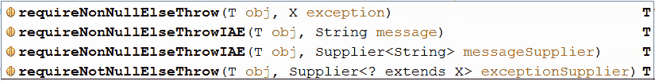
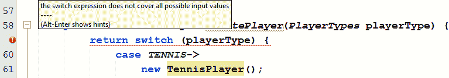

# 对象、不变性和`switch`表达式

本章包括 18 个涉及对象、不变性和`switch`表达式的问题。本章从处理`null`引用的几个问题入手。它继续处理有关检查索引、`equals()`和`hashCode()`以及不变性（例如，编写不可变类和从不可变类传递/返回可变对象）的问题。本章的最后一部分讨论了克隆对象和 JDK12`switch`表达式。本章结束时，您将掌握对象和不变性的基本知识。此外，你将知道如何处理新的`switch`表达式。在任何 Java 开发人员的武库中，这些都是有价值的、非可选的知识。

# 问题

使用以下问题来测试您的对象、不变性和`switch`表达式编程能力。我强烈建议您在转向解决方案和下载示例程序之前，尝试一下每个问题：

40.  使用**命令式**代码检查`null`函数式引用：编写程序，对给定的函数式引用和命令式代码进行`null`检查。
41.  检查`null`引用并抛出一个定制的`NullPointerException`错误：编写一个程序，对给定的引用执行`null`检查并抛出带有定制消息的`NullPointerException`。
42.  检查`null`引用并抛出指定的异常（例如，`IllegalArgumentException`：编写一个程序，对给定的引用执行`null`检查并抛出指定的异常。
43.  检查`null`引用并返回非`null`默认引用：编写程序，对给定引用执行`null`检查，如果是非`null`，则返回；否则返回非`null`默认引用。
44.  检查从 0 到长度范围内的索引：编写一个程序，检查给定索引是否在 0（含）到给定长度（不含）之间。如果给定索引超出 0 到给定长度的范围，则抛出`IndexOutOfBoundsException`。   
45.  检查从 0 到长度范围内的子范围：编写一个程序，检查给定的开始到给定的结束的给定的子范围，是否在 0 到给定的长度的范围内。如果给定的子范围不在范围内，则抛出`IndexOutOfBoundsException`。
46.  解释`equals()`和`hashCode()`并举例说明`equals()`和`hashCode()`方法在 Java 中是如何工作的。
46.  不可变对象概述：解释并举例说明什么是 Java 中的不可变对象。
47.  不可变字符串：解释`String`类不可变的原因。   
48.  编写不可变类：写一个表示不可变类的程序。
49.  向不可变类传递或从不可变类返回可变对象：编写一个程序，向不可变类传递或从不可变类返回可变对象。
50.  通过构建器模式编写一个不可变类：编写一个表示不可变类中构建器模式实现的程序。51.  避免不可变对象中的坏数据：编写防止不可变对象中的*坏数据*的程序。
52.  克隆对象：编写一个程序，演示浅层和深层克隆技术。
53.  覆盖`toString()`：解释并举例说明覆盖`toString()`的实践。
54.  `switch`表达式：简要概述 JDK12 中的`switch`表达式。
55.  多个`case`标签：写一段代码，用多个`case`标签举例说明 JDK12`switch`。
56.  语句块：编写一段代码，用于举例说明 JDK12 `switch`，其中的`case`标签指向花括号块。

以下各节介绍上述每个问题的解决方案。记住，通常没有一个正确的方法来解决一个特定的问题。另外，请记住，这里显示的解释仅包括解决问题所需的最有趣和最重要的细节。下载示例解决方案以查看更多详细信息，并[尝试程序](https://github.com/PacktPublishing/Java-Coding-Problems)。

# 40 在函数式和命令式代码中检查空引用

与函数样式或命令式代码无关，检查`null`引用是一种常用且推荐的技术，用于减少著名的`NullPointerException`异常的发生。这种检查被大量用于方法参数，以确保传递的引用不会导致`NullPointerException`或意外行为。

例如，将`List<Integer>`传递给方法可能需要至少两个`null`检查。首先，该方法应该确保列表引用本身不是`null`。其次，根据列表的使用方式，该方法应确保列表不包含`null`对象：

```java
List<Integer> numbers 
  = Arrays.asList(1, 2, null, 4, null, 16, 7, null);
```

此列表将传递给以下方法：

```java
public static List<Integer> evenIntegers(List<Integer> integers) {

  if (integers == null) {
    return Collections.EMPTY_LIST;
  }

  List<Integer> evens = new ArrayList<>();
  for (Integer nr: integers) {
    if (nr != null && nr % 2 == 0) {
      evens.add(nr);
    }
  }

  return evens;
}
```

注意，前面的代码使用依赖于`==`和`!=`运算符（`integers==null`、`nr !=null`的经典检查。从 JDK8 开始，`java.util.Objects`类包含两个方法，它们基于这两个操作符包装`null`检查：`object == null`包装在`Objects.isNull()`中，`object != null`包装在`Objects.nonNull()`中。

基于这些方法，前面的代码可以重写如下：

```java
public static List<Integer> evenIntegers(List<Integer> integers) {

  if (Objects.isNull(integers)) {
    return Collections.EMPTY_LIST;
  }

  List<Integer> evens = new ArrayList<>();

  for (Integer nr: integers) {
    if (Objects.nonNull(nr) && nr % 2 == 0) {
      evens.add(nr);
    }
  }

  return evens;
}
```

现在，代码在某种程度上更具表现力，但这并不是这两种方法的主要用法。实际上，这两个方法是为了另一个目的（符合 API 注释）而添加的——在 Java8 函数式代码中用作谓词。在函数式代码中，`null`检查可以如下例所示完成：

```java
public static int sumIntegers(List<Integer> integers) {

  if (integers == null) {
    throw new IllegalArgumentException("List cannot be null");
  }

  return integers.stream()
    .filter(i -> i != null)
    .mapToInt(Integer::intValue).sum();
}

public static boolean integersContainsNulls(List<Integer> integers) {

  if (integers == null) {
    return false;
  }

  return integers.stream()
    .anyMatch(i -> i == null);
}
```

很明显，`i -> i != null`和`i -> i == null`的表达方式与周围的代码不一样。让我们用`Objects.nonNull()`和`Objects.isNull()`替换这些代码片段：

```java
public static int sumIntegers(List<Integer> integers) {

  if (integers == null) {
    throw new IllegalArgumentException("List cannot be null");
  }

  return integers.stream()
    .filter(Objects::nonNull)
    .mapToInt(Integer::intValue).sum();
}

public static boolean integersContainsNulls(List<Integer> integers) {

  if (integers == null) {
    return false;
  }

  return integers.stream()
    .anyMatch(Objects::isNull);
}
```

或者，我们也可以使用`Objects.nonNull()`和`Objects.isNull()`方法作为参数：

```java
public static int sumIntegers(List<Integer> integers) {

  if (Objects.isNull(integers)) {
    throw new IllegalArgumentException("List cannot be null");
  }

  return integers.stream()
    .filter(Objects::nonNull)
    .mapToInt(Integer::intValue).sum();
}

public static boolean integersContainsNulls(List<Integer> integers) {

  if (Objects.isNull(integers)) {
    return false;
  }

  return integers.stream()
    .anyMatch(Objects::isNull);
}
```

令人惊叹的！因此，作为结论，无论何时需要进行`null`检查，函数式代码都应该依赖于这两种方法，而在命令式代码中，这是一种偏好。

# 41 检查空引用并引发自定义的`NullPointerException`

检查`null`引用并用定制消息抛出`NullPointerException`可以使用以下代码完成（此代码执行这四次，在构造器中执行两次，在`assignDriver()`方法中执行两次）：

```java
public class Car {

  private final String name;
  private final Color color;

  public Car(String name, Color color) {

    if (name == null) {
      throw new NullPointerException("Car name cannot be null");
    }

    if (color == null) {
      throw new NullPointerException("Car color cannot be null");
    }

    this.name = name;
    this.color = color;
  }

  public void assignDriver(String license, Point location) {

    if (license == null) {
      throw new NullPointerException("License cannot be null");
    }

    if (location == null) {
      throw new NullPointerException("Location cannot be null");
    }
  }
}
```

因此，这段代码通过结合`==`操作符和`NullPointerException`类的手动实例化来解决这个问题。从 JDK7 开始，这种代码组合隐藏在一个名为`Objects.requireNonNull()`的`static`方法中。通过这种方法，前面的代码可以用表达的方式重写：

```java
public class Car {

  private final String name;
  private final Color color;

  public Car(String name, Color color) {

    this.name = Objects.requireNonNull(name, "Car name cannot be 
      null");
    this.color = Objects.requireNonNull(color, "Car color cannot be 
      null");
  }

  public void assignDriver(String license, Point location) {

    Objects.requireNonNull(license, "License cannot be null");
    Objects.requireNonNull(location, "Location cannot be null");
  }
}
```

因此，如果指定的引用是`null`，那么`Objects.requireNonNull()`将抛出一个包含所提供消息的`NullPointerException`。否则，它将返回选中的引用。

在构造器中，当提供的引用是`null`时，有一种典型的抛出`NullPointerException`的方法。但在方法上（例如，`assignDriver()`），这是一个有争议的方法。一些开发人员更喜欢返回一个无害的结果或者抛出`IllegalArgumentException`。下一个问题，检查空引用并抛出指定的异常（例如，`IllegalArgumentException`），解决了`IllegalArgumentException`方法。

在 JDK7 中，有两个`Objects.requireNonNull()`方法，一个是以前使用的，另一个是抛出带有默认消息的`NullPointerException`，如下例所示：

```java
this.name = Objects.requireNonNull(name);
```

从 JDK8 开始，还有一个`Objects.requireNonNull()`。这个将`NullPointerException`的自定义消息封装在`Supplier`中。这意味着消息创建被推迟，直到给定的引用是`null`（这意味着使用`+`操作符连接消息的各个部分不再是一个问题）。

举个例子：

```java
this.name = Objects.requireNonNull(name, () 
  -> "Car name cannot be null ... Consider one from " + carsList);
```

如果此引用不是`null`，则不创建消息。

# 42 检查空引用并引发指定的异常

当然，一种解决方案需要直接依赖于`==`操作符，如下所示：

```java
if (name == null) {
  throw new IllegalArgumentException("Name cannot be null");
}
```

因为没有`requireNonNullElseThrow()`方法，所以这个问题不能用`java.util.Objects`的方法来解决。抛出`IllegalArgumentException`或其他指定的异常可能需要一组方法，如下面的屏幕截图所示：



让我们关注一下`requireNonNullElseThrowIAE()`方法。这两个方法抛出`IllegalArgumentException`，其中一个自定义消息被指定为`String`或`Supplier`（在`null`被求值为`true`之前避免创建）：

```java
public static <T> T requireNonNullElseThrowIAE(
    T obj, String message) {

  if (obj == null) {
    throw new IllegalArgumentException(message);
  }

  return obj;
}

public static <T> T requireNonNullElseThrowIAE(T obj,
    Supplier<String> messageSupplier) {

  if (obj == null) {
    throw new IllegalArgumentException(messageSupplier == null 
      ? null : messageSupplier.get());
  }

  return obj;
}
```

所以，投掷`IllegalArgumentException`可以通过这两种方法来完成。但这还不够。例如，代码可能需要抛出`IllegalStateException`、`UnsupportedOperationException`等。对于这种情况，最好采用以下方法：

```java
public static <T, X extends Throwable> T requireNonNullElseThrow(
    T obj, X exception) throws X {

  if (obj == null) {
    throw exception;
  }

  return obj;
}

public static <T, X extends Throwable> T requireNotNullElseThrow(
    T obj, Supplier<<? extends X> exceptionSupplier) throws X {

  if (obj != null) {
    return obj;
  } else {
    throw exceptionSupplier.get();
  }
}
```

考虑将这些方法添加到名为`MyObjects`的助手类中。如以下示例所示调用这些方法：

```java
public Car(String name, Color color) {

  this.name = MyObjects.requireNonNullElseThrow(name,
    new UnsupportedOperationException("Name cannot be set as null"));
  this.color = MyObjects.requireNotNullElseThrow(color, () ->
    new UnsupportedOperationException("Color cannot be set as null"));
}
```

此外，我们也可以通过这些例子来丰富`MyObjects`中的其他异常。

# 43 检查空引用并返回非空默认引用

通过`if`-`else`（或三元运算符）可以很容易地提供该问题的解决方案，如以下示例所示（作为变体，`name`和`color`可以声明为非`final`，并在声明时用默认值初始化）：

```java
public class Car {

  private final String name;
  private final Color color;
  public Car(String name, Color color) {

    if (name == null) {
      this.name = "No name";
    } else {
      this.name = name;
    }

    if (color == null) {
      this.color = new Color(0, 0, 0);
    } else {
      this.color = color;
    }
  }
}
```

但是，从 JDK9 开始，前面的代码可以通过`Objects`类的两个方法简化。这些方法是`requireNonNullElse()`和`requireNonNullElseGet()`。它们都有两个参数，一个是检查空值的引用，另一个是在检查的引用为`null`时返回的非`null`默认引用：

```java
public class Car {

  private final String name;
  private final Color color;

  public Car(String name, Color color) {

    this.name = Objects.requireNonNullElse(name, "No name");
    this.color = Objects.requireNonNullElseGet(color,
      () -> new Color(0, 0, 0));
  }
}
```

在前面的示例中，这些方法在构造器中使用，但也可以在方法中使用。

# 44 检查从 0 到长度范围内的索引

首先，让我们用一个简单的场景来突出这个问题。此场景可能在以下简单类中实现：

```java
public class Function {

  private final int x;

  public Function(int x) {

    this.x = x;
  }

  public int xMinusY(int y) {

    return x - y;
  }

  public static int oneMinusY(int y) {

    return 1 - y;
  }
}
```

注意，前面的代码片段没有对`x`和`y`进行任何范围限制。现在，让我们施加以下范围（这在数学函数中非常常见）：

*   `x`必须介于 0（含）和 11（不含）之间，所以`x`属于`[0, 11)`。
*   在`xMinusY()`方法中，`y`必须在 0（含）`x`（不含）之间，所以`y`属于`[0, x)`。
*   在`oneMinusY()`方法中，`y`必须介于 0（包含）和 16（排除）之间，所以`y`属于`[0, 16)`。

这些范围可以通过`if`语句在代码中施加，如下所示：

```java
public class Function {

  private static final int X_UPPER_BOUND = 11;
  private static final int Y_UPPER_BOUND = 16;
  private final int x;

  public Function(int x) {

    if (x < 0 || x >= X_UPPER_BOUND) {
      throw new IndexOutOfBoundsException("..."); 
    }

    this.x = x;
  }

  public int xMinusY(int y) {

    if (y < 0 || y >= x) {
      throw new IndexOutOfBoundsException("...");
    }

    return x - y;
  }

  public static int oneMinusY(int y) {

    if (y < 0 || y >= Y_UPPER_BOUND) {
      throw new IndexOutOfBoundsException("...");
    }

    return 1 - y;
  }
}
```

考虑用更有意义的异常替换`IndexOutOfBoundsException`（例如，扩展`IndexOutOfBoundsException`并创建一个类型为`RangeOutOfBoundsException`的自定义异常）。

从 JDK9 开始，可以重写代码以使用`Objects.checkIndex()`方法。此方法验证给定索引是否在 0 到长度的范围内，并返回该范围内的给定索引或抛出`IndexOutOfBoundsException`：

```java
public class Function {

  private static final int X_UPPER_BOUND = 11;
  private static final int Y_UPPER_BOUND = 16;
  private final int x;

  public Function(int x) {

    this.x = Objects.checkIndex(x, X_UPPER_BOUND);
  }

  public int xMinusY(int y) {

    Objects.checkIndex(y, x);

    return x - y;
  }

  public static int oneMinusY(int y) {

    Objects.checkIndex(y, Y_UPPER_BOUND);

    return 1 - y;
  }
}
```

例如，调用`oneMinusY()`，如下一个代码片段所示，将导致`IndexOutOfBoundsException`，因为`y`可以取`[0, 16]`之间的值：

```java
int result = Function.oneMinusY(20);
```

现在，让我们进一步检查从 0 到给定长度的子范围。

# 45 检查从 0 到长度范围内的子范围

让我们遵循上一个问题的相同流程。所以，这一次，`Function`类将如下所示：

```java
public class Function {

  private final int n;

  public Function(int n) {

    this.n = n;
  }

  public int yMinusX(int x, int y) {

    return y - x;
  }
}
```

注意，前面的代码片段没有对`x`、`y`和`n`进行任何范围限制。现在，让我们施加以下范围：

*   `n`必须介于 0（含）和 101（不含）之间，所以`n`属于`[0, 101]`。
*   在`yMinusX()`方法中，由`x`和`y`、`x`、`y`限定的范围必须是`[0, n]`的子范围。

这些范围可以通过`if`语句在代码中施加，如下所示：

```java
public class Function {

  private static final int N_UPPER_BOUND = 101;
  private final int n;

  public Function(int n) {

    if (n < 0 || n >= N_UPPER_BOUND) {
      throw new IndexOutOfBoundsException("...");
    }

    this.n = n;
  }

  public int yMinusX(int x, int y) {

    if (x < 0 || x > y || y >= n) {
      throw new IndexOutOfBoundsException("...");
    }

    return y - x;
  }
}
```

基于前面的问题，`n`的条件可以替换为`Objects.checkIndex()`。此外，JDK9`Objects`类还提供了一个名为`checkFromToIndex(int start, int end, int length)`的方法，该方法检查给定的子范围*给定的开始*、*给定的结束*是否在 0 到给定的长度的范围内。因此，此方法可应用于`yMinusX()`方法，以检查`x`与`y`所限定的范围是否为 0 到`n`的子范围：

```java
public class Function {

  private static final int N_UPPER_BOUND = 101;
  private final int n;

  public Function(int n) {

    this.n = Objects.checkIndex(n, N_UPPER_BOUND);
  }

  public int yMinusX(int x, int y) {

    Objects.checkFromToIndex(x, y, n);
    return y - x;
  }
}
```

例如，由于`x`大于`y`，下面的测试将导致`IndexOutOfBoundsException`：

```java
Function f = new Function(50);
int r = f.yMinusX(30, 20);
```

除了这个方法之外，`Objects`还有另一个名为`checkFromIndexSize(int start, int size, int length)`的方法。该方法检查*给定开始时间*到*给定开始时间加给定大小*的子范围，是否在 0 到*给定长度*的范围内。

# 46 `equals()`和`hashCode()`

`equals()`和`hashCode()`方法在`java.lang.Object`中定义。因为`Object`是所有 Java 对象的超类，所以这两种方法对所有对象都可用。他们的主要目标是为比较对象提供一个简单、高效、健壮的解决方案，并确定它们是否相等。如果没有这些方法和它们的契约，解决方案依赖于庞大而繁琐的`if`语句来比较对象的每个字段。

当这些方法没有被覆盖时，Java 将使用它们的默认实现。不幸的是，默认实现并不能真正实现确定两个对象是否具有相同值的目标。默认情况下，`equals()`检查*相等性*。换言之，当且仅当两个对象由相同的内存地址（相同的对象引用）表示时，它认为这两个对象相等，而`hashCode()`返回对象内存地址的整数表示。这是一个本机函数，称为*标识**哈希码。*

例如，假设以下类：

```java
public class Player {

  private int id;
  private String name;

  public Player(int id, String name) {

    this.id = id;
    this.name = name;
  }
}
```

然后，让我们创建包含相同信息的此类的两个实例，并比较它们是否相等：

```java
Player p1 = new Player(1, "Rafael Nadal");
Player p2 = new Player(1, "Rafael Nadal");

System.out.println(p1.equals(p2)); // false
System.out.println("p1 hash code: " + p1.hashCode()); // 1809787067
System.out.println("p2 hash code: " + p2.hashCode()); // 157627094
```

不要使用`==`运算符来测试对象的相等性（避免使用`if(p1 == p2)`。`==`操作符比较两个对象的引用是否指向同一个对象，而`equals()`比较对象值（作为人类，这是我们关心的）。

根据经验，如果两个变量拥有相同的引用，则它们*相同*，但是如果它们引用相同的值，则它们*相等*。*相同值*的含义由`equals()`定义。

对我们来说，`p1`和`p2`是相等的，但是请注意`equals()`返回了`false`（`p1`和`p2`实例的字段值完全相同，但是它们存储在不同的内存地址）。这意味着依赖于`equals()`的默认实现是不可接受的。解决方法是覆盖此方法，为此，重要的是要了解`equals()`合同，该合同规定了以下声明：

*   **自反性**：对象等于自身，即`p1.equals(p1)`必须返回`true`。
*   **对称性**：`p1.equals(p2)`必须返回与`p2.equals(p1)`相同的结果（`true`/`false`）。
*   **传递性**：如果是`p1.equals(p2)`和`p2.equals(p3)`，那么也是`p1.equals(p3)`。
*   **一致性**：两个相等的物体必须一直保持相等，除非其中一个改变。
*   **`null`返回`false`**：所有对象必须不等于`null`。

因此，为了遵守此约定，`Player`类的`equals()`方法可以覆盖如下：

```java
@Override
public boolean equals(Object obj) {

  if (this == obj) {
    return true;
  }

  if (obj == null) {
    return false;
  }

  if (getClass() != obj.getClass()) {
    return false;
  }

  final Player other = (Player) obj;

  if (this.id != other.id) {
    return false;
  }

  if (!Objects.equals(this.name, other.name)) {
    return false;
  }

  return true;
}
```

现在，让我们再次执行相等性测试（这次，`p1`等于`p2`：

```java
System.out.println(p1.equals(p2)); // true
```

好的，到目前为止还不错！现在，让我们将这两个`Player`实例添加到集合中。例如，让我们将它们添加到一个`HashSet`（一个不允许重复的 Java 集合）：

```java
Set<Player> players = new HashSet<>();
players.add(p1);
players.add(p2);
```

让我们检查一下这个`HashSet`的大小以及它是否包含`p1`：

```java
System.out.println("p1 hash code: " + p1.hashCode()); // 1809787067
System.out.println("p2 hash code: " + p2.hashCode()); // 157627094
System.out.println("Set size: " + players.size());    // 2
System.out.println("Set contains Rafael Nadal: "
  + players.contains(new Player(1, "Rafael Nadal"))); // false
```

与前面实现的`equals()`一致，`p1`和`p2`是相等的，因此`HashSet`的大小应该是 1，而不是 2。此外，它应该包含纳达尔。那么，发生了什么？

一般的答案在于 Java 是如何创建的。凭直觉很容易看出，`equals()`不是一种快速的方法；因此，当需要大量的相等比较时，查找将面临性能损失。例如，在通过集合中的特定值（例如，`HashSet`、`HashMap`和`HashTable`进行查找的情况下，这增加了一个严重的缺点，因为它可能需要大量的相等比较。

基于这个语句，Java 试图通过添加*桶*来减少相等比较。桶是一个基于散列的容器，它将相等的对象分组。这意味着相等的对象应该返回相同的哈希码，而不相等的对象应该返回不同的哈希码（如果两个不相等的对象具有相同的哈希码，则这是一个*散列冲突*，并且对象将进入同一个桶）。因此，Java 会比较散列代码，只有当两个不同的对象引用的散列代码相同（而不是相同的对象引用）时，它才会进一步调用`equals()`。基本上，这会加速集合中的查找。

但我们的案子发生了什么？让我们一步一步来看看：

*   当创建`p1`时，Java 将根据`p1`内存地址为其分配一个哈希码。
*   当`p1`被添加到`Set`时，Java 会将一个新的桶链接到`p1`哈希码。
*   当创建`p2`时，Java 将根据`p2`内存地址为其分配一个哈希码。
*   当`p2`被添加到`Set`时，Java 会将一个新的桶链接到`p2`哈希码（当这种情况发生时，看起来`HashSet`没有按预期工作，它允许重复）。
*   当执行`players.contains(new Player(1, "Rafael Nadal"))`时，基于`p3`存储器地址用新的哈希码创建新的播放器`p3`。
*   因此，在`contains()`的框架中，分别测试`p1`和`p3 p2`和`p3`的相等性涉及检查它们的哈希码，由于`p1`哈希码不同于`p3`哈希码，而`p2`哈希码不同于`p3`哈希码，比较停止，没有求值`equals()`，这意味着`HashSet`不包含对象（`p3`）

为了回到正轨，代码也必须覆盖`hashCode()`方法。`hashCode()`合同规定如下：

*   符合`equals()`的两个相等对象必须返回相同的哈希码。
*   具有相同哈希码的两个对象不是强制相等的。
*   只要对象保持不变，`hashCode()`必须返回相同的值。

根据经验，为了尊重`equals()`和`hashCode()`合同，遵循两条黄金法则：

*   当`equals()`被覆盖时，`hashCode()`也必须被覆盖，反之亦然。
*   以相同的顺序对两个方法使用相同的标识属性。

对于`Player`类，`hashCode()`可以被覆盖如下：

```java
@Override
public int hashCode() {

  int hash = 7;
  hash = 79 * hash + this.id;
  hash = 79 * hash + Objects.hashCode(this.name);

  return hash;
}
```

现在，让我们执行另一个测试（这次，它按预期工作）：

```java
System.out.println("p1 hash code: " + p1.hashCode()); // -322171805
System.out.println("p2 hash code: " + p2.hashCode()); // -322171805
System.out.println("Set size: " + players.size());    // 1
System.out.println("Set contains Rafael Nadal: "
  + players.contains(new Player(1, "Rafael Nadal"))); // true
```

现在，让我们列举一下使用`equals()`和`hashCode()`时的一些常见错误：

*   您覆盖了`equals()`并忘记覆盖`hashCode()`，反之亦然（覆盖两者或无）。
*   您使用`==`运算符而不是`equals()`来比较对象值。
*   在`equals()`中，省略以下一项或多项：
    *   从添加*自检*（`if (this == obj)...`开始。
    *   因为没有实例应该等于`null`，所以继续添加*空校验*（`if(obj == null)...`）。
    *   确保实例是我们期望的（使用`getClass()`或`instanceof`。
    *   最后，在这些角落案例之后，添加字段比较。

*   你通过继承来破坏对称。假设一个类`A`和一个类`B`扩展了`A`并添加了一个新字段。`B`类覆盖从`A`继承的`equals()`实现，并将此实现添加到新字段中。依赖`instanceof`会发现`b.equals(a)`会返回`false`（如预期），而`a.equals(b)`会返回`true`（非预期），因此对称性被破坏。依赖*切片比较*是行不通的，因为这会破坏及物性和自反性。解决这个问题意味着依赖于`getClass()`而不是`instanceof`（通过`getClass()`，类型及其子类型的实例不能相等），或者更好地依赖于组合而不是继承，就像绑定到本书中的应用（`P46_ViolateEqualsViaSymmetry`一样）。
*   返回一个来自`hashCode()`的常量，而不是每个对象的唯一哈希码。

自 JDK7 以来，`Objects`类提供了几个帮助程序来处理对象相等和哈希码，如下所示：

*   `Objects.equals(Object a, Object b)`：测试`a`对象是否等于`b`对象。
*   `Objects.deepEquals(Object a, Object b)`：用于测试两个对象是否相等（如果是数组，则通过`Arrays.deepEquals()`进行测试）。
*   `Objects.hash(Object ... values)`：为输入值序列生成哈希码。

通过`EqualsVerifier`库（[确保`equals()`和`hashCode()`尊重 Java SE 合同](https://mvnrepository.com/artifact/nl.jqno.equalsverifier/equalsverifier)）。

依赖`Lombok`库从对象的字段生成`hashCode()`和[`equals()`](https://projectlombok.org/)。但请注意`Lombok`与 JPA 实体结合的特殊情况。

# 47 不可变对象简述

不可变对象是一个一旦创建就不能更改的对象（其状态是固定的）。

在 Java 中，以下内容适用：

*   原始类型是不可变的。
*   著名的 Java`String`类是不可变的（其他类也是不可变的，比如`Pattern`、`LocalDate`）
*   数组不是不变的。
*   集合可以是可变的、不可修改的或不可变的。

不可修改的集合不是自动不变的。它取决于集合中存储的对象。如果存储的对象是可变的，那么集合是可变的和不可修改的。但是如果存储的对象是不可变的，那么集合实际上是不可变的。

不可变对象在并发（多线程）应用和流中很有用。由于不可变对象不能更改，因此它们无法处理并发问题，并且不会有损坏或不一致的风险。

使用不可变对象的一个主要问题与创建新对象的代价有关，而不是管理可变对象的状态。但是请记住，不可变对象在垃圾收集期间利用了特殊处理。此外，它们不容易出现并发问题，并且消除了管理可变对象状态所需的代码。管理可变对象状态所需的代码往往比创建新对象慢。

通过研究以下问题，我们可以更深入地了解 Java 中的对象不变性。

# 48 不可变字符串

每种编程语言都有一种表示字符串的方法。作为基本类型，字符串是预定义类型的一部分，几乎所有类型的 Java 应用都使用它们。

在 Java 中，字符串不是由一个像`int`、`long`和`float`这样的原始类型来表示的。它们由名为`String`的引用类型表示。几乎所有 Java 应用都使用字符串，例如，Java 应用的`main()`方法获取一个`String`类型的数组作为参数。

`String`的臭名昭著及其广泛的应用意味着我们应该详细了解它。除了知道如何声明和操作字符串（例如，反转和大写）之外，开发人员还应该理解为什么这个类是以特殊或不同的方式设计的。更确切地说，`String`为什么是不可变的？或者这个问题有一个更好的共鸣，比如说，`String`不变的利弊是什么？

# 字符串不变性的优点

在下一节中，我们来看看字符串不变性的一些优点。

# 字符串常量池或缓存池

支持字符串不变性的原因之一是由**字符串常量池**（**SCP**）或缓存池表示的。为了理解这种说法，让我们深入了解一下`String`类是如何在内部工作的。

SCP 是内存中的一个特殊区域（不是普通的堆内存），用于存储字符串文本。假设以下三个`String`变量：

```java
String x = "book";
String y = "book";
String z = "book";
```

创建了多少个`String`对象？说三个很有诱惑力，但实际上 Java 只创建一个具有`"book"`值的`String`对象。其思想是，引号之间的所有内容都被视为一个字符串文本，Java 通过遵循这样的算法（该算法称为**字符串内化**）将字符串文本存储在称为 SCP 的特殊内存区域中：

*   当一个字符串文本被创建时（例如，`String x = "book"`），Java 检查 SCP 以查看这个字符串文本是否存在。
*   如果在 SCP 中找不到字符串字面值，则在 SCP 中为字符串字面值创建一个新的字符串对象，并且相应的变量`x`将指向它。
*   如果在 SCP 中找到字符串字面值（例如，`String y = "book"`、`String z = "book"`），那么新变量将指向`String`对象（基本上，所有具有相同值的变量都将指向相同的`String`对象）：


但是`x`应该是`"cook"`而不是`"book"`，所以我们用`"c"`-`x = x.replace("b", "c");`来代替`"b"`。

而`x`应该是`"cook"`，`y`和`z`应该保持不变。这种行为是由不变性提供的。Java 将创建一个新对象，并对其执行如下更改：


因此，字符串不变性允许缓存字符串文本，这允许应用使用大量字符串文本，对堆内存和垃圾收集器的影响最小。在可变上下文中，修改字符串字面值可能导致变量损坏。

不要创建一个字符串作为`String x = new String("book")`。这不是字符串文本；这是一个`String`实例（通过构造器构建），它将进入普通内存堆而不是 SCP。在普通堆内存中创建的字符串可以通过显式调用`String.intern()`方法作为`x.intern()`指向 SCP。

# 安全

字符串不变性的另一个好处是它的安全性。通常，许多敏感信息（用户名、密码、URL、端口、数据库、套接字连接、参数、属性等）都以字符串的形式表示和传递。通过使这些信息保持不变，代码对于各种安全威胁（例如，意外或故意修改引用）变得安全。

# 线程安全性

想象一个应用使用成千上万个可变的`String`对象并处理线程安全代码。幸运的是，在这种情况下，由于不变性，我们想象的场景不会变成现实。任何不可变对象本质上都是线程安全的。这意味着字符串可以由多个线程共享和操作，没有损坏和不一致的风险。

# 哈希码缓存

`equals()`和`hashCode()`部分讨论了`equals()`和`hashCode()`。每次对特定活动进行哈希运算（例如，搜索集合中的元素）时，都应该计算哈希码。因为`String`是不可变的，所以每个字符串都有一个不可变的哈希码，可以缓存和重用，因为它在创建字符串后不能更改。这意味着可以从缓存中使用字符串的哈希码，而不是每次使用时重新计算它们。例如，`HashMap`为不同的操作（例如，`put()`、`get()`）散列其键，如果这些键属于`String`类型，则哈希码将从缓存中重用，而不是重新计算它们。

# 类加载

在内存中加载类的典型方法依赖于调用`Class.forName(String className)`方法。注意表示类名的参数`String`。由于字符串不变性，在加载过程中不能更改类名。然而，如果`String`是可变的，那么想象加载`class A`（例如，`Class.forName("A")`），在加载过程中，它的名称将被更改为`BadA`。现在，`BadA`物体可以做坏事！

# 字符串不变性的缺点

在下一节中，我们来看看字符串不变性的一些缺点。

# 字符串不能扩展

应该声明一个不可变的类`final`，以避免扩展性。然而，开发人员需要扩展`String`类以添加更多的特性，这一限制可以被认为是不变性的一个缺点。

然而，开发人员可以编写工具类（例如，Apache Commons Lang、`StringUtils`、Spring 框架、`StringUtils`、Guava 和字符串）来提供额外的特性，并将字符串作为参数传递给这些类的方法。

# 敏感数据长时间存储在内存中

字符串中的敏感数据（例如密码）可能长时间驻留在内存（SCP）中。作为缓存，SCP 利用了来自垃圾收集器的特殊处理。更准确地说，垃圾收集器不会以与其他内存区域相同的频率（周期）访问 SCP。作为这种特殊处理的结果，敏感数据在 SCP 中保存了很长一段时间，并且很容易被不必要的使用。

为了避免这一潜在缺陷，建议将敏感数据（例如密码）存储在`char[]`而不是`String`中。

# `OutOfMemoryError`错误

SCP 是一个很小的内存区，可以很快被填满。在 SCP 中存储过多的字符串字面值将导致`OutOfMemoryError`。

# 字符串是完全不变的吗？

在幕后，`String`使用`private final char[]`来存储字符串的每个字符。通过使用 Java 反射 API，在 JDK8 中，以下代码将修改此`char[]`（JDK11 中的相同代码将抛出`java.lang.ClassCastException`）：

```java
String user = "guest";
System.out.println("User is of type: " + user);

Class<String> type = String.class;
Field field = type.getDeclaredField("value");
field.setAccessible(true);

char[] chars = (char[]) field.get(user);

chars[0] = 'a';
chars[1] = 'd';
chars[2] = 'm';
chars[3] = 'i';
chars[4] = 'n';

System.out.println("User is of type: " + user);
```

因此，在 JDK8 中，`String`是*有效*不可变的，但不是*完全*。

# 49 编写不可变类

一个不可变的类必须满足几个要求，例如：

*   该类应标记为`final`以抑制可扩展性（其他类不能扩展该类；因此，它们不能覆盖方法）
*   所有字段都应该声明为`private`和`final`（在其他类中不可见，在这个类的构造器中只初始化一次）
*   类应该包含一个参数化的`public`构造器（或者一个`private`构造器和用于创建实例的工厂方法），用于初始化字段
*   类应该为字段提供获取器
*   类不应公开设置器

例如，以下`Point`类是不可变的，因为它成功地通过了前面的检查表：

```java
public final class Point {

  private final double x;
  private final double y;

  public Point(double x, double y) {
    this.x = x;
    this.y = y;
  }

  public double getX() {
    return x;
  }

  public double getY() {
    return y;
  }
}
```

如果不可变类应该操作可变对象，请考虑以下问题。

# 50 向不可变类传递/从不可变类返回可变对象

将可变对象传递给不可变类可能会破坏不可变性。让我们考虑以下可变类：

```java
public class Radius {

  private int start;
  private int end;

  public int getStart() {
    return start;
  }

  public void setStart(int start) {
    this.start = start;
  }

  public int getEnd() {
    return end;
  }

  public void setEnd(int end) {
    this.end = end;
  }
}
```

然后，让我们将这个类的一个实例传递给一个名为`Point`的不可变类。乍一看，`Point`类可以写为：

```java
public final class Point {

  private final double x;
  private final double y;
  private final Radius radius;

  public Point(double x, double y, Radius radius) {
    this.x = x;
    this.y = y;
    this.radius = radius;
  }

  public double getX() {
    return x;
  }

  public double getY() {
    return y;
  }

  public Radius getRadius() {
    return radius;
  }
}
```

这个类仍然是不变的吗？答案是否定的，`Point`类不再是不变的，因为它的状态可以改变，如下例所示：

```java
Radius r = new Radius();
r.setStart(0);
r.setEnd(120);

Point p = new Point(1.23, 4.12, r);

System.out.println("Radius start: " + p.getRadius().getStart()); // 0
r.setStart(5);
System.out.println("Radius start: " + p.getRadius().getStart()); // 5
```

注意，调用`p.getRadius().getStart()`返回两个不同的结果；因此，`p`的状态已经改变，所以`Point`不再是不可变的。该问题的解决方案是克隆`Radius`对象并将克隆存储为`Point`的字段：

```java
public final class Point {

  private final double x;
  private final double y;
  private final Radius radius;

  public Point(double x, double y, Radius radius) {
    this.x = x;
    this.y = y;

    Radius clone = new Radius();
    clone.setStart(radius.getStart());
    clone.setEnd(radius.getEnd());

    this.radius = clone;
  }

  public double getX() {
    return x;
  }

  public double getY() {
    return y;
  }

  public Radius getRadius() {
    return radius;
  }
}
```

这一次，`Point`类的不变性级别增加了（调用`r.setStart(5)`不会影响`radius`字段，因为该字段是`r`的克隆）。但是`Point`类并不是完全不可变的，因为还有一个问题需要解决，从不可变类返回可变对象会破坏不可变性。检查下面的代码，它分解了`Point`的不变性：

```java
Radius r = new Radius();
r.setStart(0);
r.setEnd(120);

Point p = new Point(1.23, 4.12, r);

System.out.println("Radius start: " + p.getRadius().getStart()); // 0
p.getRadius().setStart(5);
System.out.println("Radius start: " + p.getRadius().getStart()); // 5
```

再次调用`p.getRadius().getStart()`返回两个不同的结果；因此，`p`的状态已经改变。解决方案包括修改`getRadius()`方法以返回`radius`字段的克隆，如下所示：

```java
...
public Radius getRadius() {
    Radius clone = new Radius();
    clone.setStart(this.radius.getStart());
    clone.setEnd(this.radius.getEnd());

    return clone;
  }
...
```

现在，`Point`类又是不可变的。问题解决了！

在选择克隆技术/工具之前，在某些情况下，建议您花点时间分析/学习 Java 和第三方库中可用的各种可能性（例如，检查本章中的”克隆对象“部分）。对于浅拷贝，前面的技术可能是正确的选择，但是对于深拷贝，代码可能需要依赖不同的方法，例如复制构造器、`Cloneable`接口或外部库（例如，Apache Commons Lang`ObjectUtils`、JSON 序列化与`Gson`或 Jackson，或任何其他方法）。

# 51 通过生成器模式编写不可变类

当一个类（不可变或可变）有太多字段时，它需要一个具有许多参数的构造器。当其中一些字段是必需的，而其他字段是可选的时，这个类将需要几个构造器来覆盖所有可能的组合。这对于开发人员和类的用户来说都是很麻烦的。这就是构建器模式的用武之地。

根据**四人帮**（**GoF**），*构建器模式将复杂对象的构造与其表示分离，以便相同的构造过程可以创建不同的表示*。

生成器模式可以作为一个单独的类或内部的`static`类来实现。让我们关注第二个案例。`User`类有三个必填字段（`nickname`、`password`、`created`）和三个可选字段（`email`、`firstname`、`lastname`）。

现在，依赖于构建器模式的不可变的`User`类将显示如下：

```java
public final class User {

  private final String nickname;
  private final String password;
  private final String firstname;
  private final String lastname;
  private final String email;
  private final Date created;

  private User(UserBuilder builder) {
    this.nickname = builder.nickname;
    this.password = builder.password;
    this.created = builder.created;
    this.firstname = builder.firstname;
    this.lastname = builder.lastname;
    this.email = builder.email;
  }

  public static UserBuilder getBuilder(
      String nickname, String password) {
    return new User.UserBuilder(nickname, password);
  }

  public static final class UserBuilder {

    private final String nickname;
    private final String password;
    private final Date created;
    private String email;
    private String firstname;
    private String lastname;

    public UserBuilder(String nickname, String password) {
      this.nickname = nickname;
      this.password = password;
      this.created = new Date();
    }

    public UserBuilder firstName(String firstname) {
      this.firstname = firstname;
      return this;
    }

    public UserBuilder lastName(String lastname) {
      this.lastname = lastname;
      return this;
    }

    public UserBuilder email(String email) {
      this.email = email;
      return this;
    }

    public User build() {
      return new User(this);
    }
  }

  public String getNickname() {
    return nickname;
  }

  public String getPassword() {
    return password;
  }

  public String getFirstname() {
    return firstname;
  }

  public String getLastname() {
    return lastname;
  }

  public String getEmail() {
    return email;
  }

  public Date getCreated() {
    return new Date(created.getTime());
  }
}
```

以下是一些用法示例：

```java
import static modern.challenge.User.getBuilder;
...
// user with nickname and password
User user1 = getBuilder("marin21", "hjju9887h").build();

// user with nickname, password and email
User user2 = getBuilder("ionk", "44fef22")
  .email("ion@gmail.com")
  .build();

// user with nickname, password, email, firstname and lastname
User user3 = getBuilder("monika", "klooi0988")
  .email("monika@gmail.com")
  .firstName("Monika")
  .lastName("Ghuenter")
  .build();
```

# 52 避免不可变对象中的坏数据

*坏数据*是任何对不可变对象有负面影响的数据（例如，损坏的数据）。最有可能的是，这些数据来自用户输入或不受我们直接控制的外部数据源。在这种情况下，坏数据可能会击中不可变的对象，最糟糕的是没有修复它的方法。不可变的对象在创建后不能更改；因此，只要对象存在，坏数据就会快乐地存在。

这个问题的解决方案是根据一组全面的约束来验证输入到不可变对象中的所有数据。

执行验证有不同的方法，从自定义验证到内置解决方案。验证可以在不可变对象类的外部或内部执行，具体取决于应用设计。例如，如果不可变对象是通过构建器模式构建的，那么可以在 Builder 类中执行验证。

JSR380 是用于 bean 验证的 Java API（JavaSE/EE）规范，可用于通过注释进行验证。Hibernate 验证器是验证 API 的参考实现，它可以很容易地作为 Maven 依赖项在`pom.xml`文件中提供（请查看本书附带的源代码）。

此外，我们依赖于专用注释来提供所需的约束（例如，`@NotNull`、`@Min`、`@Max`、`@Size`和`@Email`）。在以下示例中，将约束添加到生成器类中，如下所示：

```java
...
public static final class UserBuilder {

  @NotNull(message = "cannot be null")
  @Size(min = 3, max = 20, message = "must be between 3 and 20 
    characters")
  private final String nickname;

  @NotNull(message = "cannot be null")
  @Size(min = 6, max = 50, message = "must be between 6 and 50 
    characters")
  private final String password;

  @Size(min = 3, max = 20, message = "must be between 3 and 20 
    characters")
  private String firstname;

  @Size(min = 3, max = 20, message = "must be between 3 and 20 
    characters")
  private String lastname;

  @Email(message = "must be valid")
  private String email;

  private final Date created;

  public UserBuilder(String nickname, String password) {
    this.nickname = nickname;
    this.password = password;
    this.created = new Date();
  }
...
```

最后，验证过程通过`Validator`API 从代码中触发（这仅在 JavaSE 中需要）。如果进入生成器类的数据无效，则不创建不可变对象（不要调用`build()`方法）：

```java
User user;
Validator validator 
  = Validation.buildDefaultValidatorFactory().getValidator();

User.UserBuilder userBuilder 
  = new User.UserBuilder("monika", "klooi0988")
    .email("monika@gmail.com")
    .firstName("Monika").lastName("Gunther");

final Set<ConstraintViolation<User.UserBuilder>> violations 
  = validator.validate(userBuilder);
if (violations.isEmpty()) {
  user = userBuilder.build();
  System.out.println("User successfully created on: " 
    + user.getCreated());
} else {
  printConstraintViolations("UserBuilder Violations: ", violations);
}
```

这样，坏数据就不能触及不可变的对象。如果没有生成器类，则可以直接在不可变对象的字段级别添加约束。前面的解决方案只是在控制台上显示潜在的冲突，但是根据情况，该解决方案可能执行不同的操作（例如，抛出特定的异常）。

# 53 克隆对象

克隆对象不是一项日常任务，但正确地克隆对象很重要。克隆对象主要是指创建对象的副本。拷贝主要有两种类型：*浅*拷贝（尽可能少拷贝）和*深*拷贝（复制所有内容）。

假设下面的类：

```java
public class Point {

  private double x;
  private double y;

  public Point() {}
  public Point(double x, double y) {
    this.x = x;
    this.y = y;
  }

  // getters and setters
}
```

所以，我们在一个类中映射了一个类型点`(x, y)`。现在，让我们进行一些克隆。

# 手动克隆

快速方法包括添加一个手动将当前`Point`复制到新`Point`的方法（这是一个浅复制）：

```java
public Point clonePoint() {
  Point point = new Point();
  point.setX(this.x);
  point.setY(this.y);

  return point;
}
```

这里的代码非常简单。只需创建一个新的`Point`实例，并用当前`Point`的字段填充其字段。返回的`Point`是当前`Point`的浅拷贝（因为`Point`不依赖其他对象，所以深拷贝是完全相同的）：

```java
Point point = new Point(...);
Point clone = point.clonePoint();
```

# 通过`clone()`克隆

`Object`类包含一个名为`clone()`的方法。此方法对于创建浅拷贝非常有用（也可以用于深拷贝）。为了使用它，类应该遵循给定的步骤：

*   实现`Cloneable`接口（如果该接口没有实现，则抛出`CloneNotSupportedException`。
*   覆盖`clone()`方法（`Object.clone()`为`protected`）。
*   调用`super.clone()`。

`Cloneable`接口不包含任何方法。这只是 JVM 可以克隆这个对象的一个信号。一旦实现了这个接口，代码就需要覆盖`Object.clone()`方法。这是需要的，因为`Object.clone()`是`protected`，为了通过`super`调用它，代码需要覆盖这个方法。如果将`clone()`添加到子类中，这可能是一个严重的缺点，因为所有超类都应该定义一个`clone()`方法，以避免`super.clone()`链调用失败。

此外，`Object.clone()`不依赖构造器调用，因此开发人员无法控制对象构造：

```java
public class Point implements Cloneable {

  private double x;
  private double y;

  public Point() {}

  public Point(double x, double y) {
    this.x = x;
    this.y = y;
  }

  @Override
  public Point clone() throws CloneNotSupportedException {
    return (Point) super.clone();
  }

  // getters and setters
}
```

创建克隆的步骤如下：

```java
Point point = new Point(...);
Point clone = point.clone();
```

# 通过构造器克隆

此克隆技术要求您使用构造器来丰富类，该构造器接受表示将用于创建克隆的类实例的单个参数。

让我们看看代码：

```java
public class Point {

  private double x;
  private double y;

  public Point() {}

  public Point(double x, double y) {
    this.x = x;
    this.y = y;
  }

  public Point(Point another) {
    this.x = another.x;
    this.y = another.y;
  }

  // getters and setters
}
```

创建克隆的步骤如下：

```java
Point point = new Point(...);
Point clone = new Point(point);
```

# 通过克隆库进行克隆

当一个对象依赖于另一个对象时，需要一个深度副本。执行深度复制意味着复制对象，包括其依赖链。例如，假设`Point`有一个`Radius`类型的字段：

```java
public class Radius {

  private int start;
  private int end;

  // getters and setters
}

public class Point {

  private double x;
  private double y;
  private Radius radius;

  public Point(double x, double y, Radius radius) {
    this.x = x;
    this.y = y;
    this.radius = radius;
  }

  // getters and setters
}
```

执行`Point`的浅拷贝将创建`x`和`y`的拷贝，但不会创建`radius`对象的拷贝。这意味着影响`radius`对象的修改也将反映在克隆中。是时候进行深度复制了。

一个麻烦的解决方案将涉及到调整以前提出的浅拷贝技术以支持深拷贝。幸运的是，有一些现成的解决方案可以应用，[其中之一就是克隆库](https://github.com/kostaskougios/cloning)：

```java
import com.rits.cloning.Cloner;
...
Point point = new Point(...);
Cloner cloner = new Cloner();
Point clone = cloner.deepClone(point);
```

代码是不言自明的。请注意，克隆库还附带了其他一些好处，如下面的屏幕截图所示：


# 通过序列化克隆

这种技术需要可序列化的对象（实现`java.io.Serializable`。基本上，对象在新对象中被序列化（`writeObject()`）和反序列化（`readObject()`）。可以实现这一点的助手方法如下所示：

```java
private static <T> T cloneThroughSerialization(T t) {

  try {
    ByteArrayOutputStream baos = new ByteArrayOutputStream();
    ObjectOutputStream oos = new ObjectOutputStream(baos);
    oos.writeObject(t);

    ByteArrayInputStream bais 
      = new ByteArrayInputStream(baos.toByteArray());
    ObjectInputStream ois = new ObjectInputStream(bais);

    return (T) ois.readObject();
  } catch (IOException | ClassNotFoundException ex) {
    // log exception
    return t;
  }
}
```

因此，对象在`ObjectOutputStream`中序列化，在`ObjectInputStream`中反序列化。通过此方法克隆对象的步骤如下：

```java
Point point = new Point(...);
Point clone = cloneThroughSerialization(point);
```

ApacheCommonsLang 通过`SerializationUtils`提供了一个基于序列化的内置解决方案。在它的方法中，这个类提供了一个名为`clone()`的方法，可以如下使用：

```java
Point point = new Point(...);
Point clone = SerializationUtils.clone(point);
```

# 通过 JSON 克隆

几乎所有 Java 中的 JSON 库都可以序列化任何**普通的旧 Java 对象**（**POJO**），而不需要任何额外的配置/映射。在项目中有一个 JSON 库（很多项目都有）可以避免我们添加额外的库来提供深度克隆。主要来说，该解决方案可以利用现有的 JSON 库来获得相同的效果。

以下是使用`Gson`库的示例：

```java
private static <T> T cloneThroughJson(T t) {

  Gson gson = new Gson();
  String json = gson.toJson(t);

  return (T) gson.fromJson(json, t.getClass());
}

Point point = new Point(...);
Point clone = cloneThroughJson(point);
```

除此之外，您还可以选择编写专用于克隆对象的库。

# 54 覆盖`toString()`

`toString()`方法在`java.lang.Object`中定义，JDK 附带了它的默认实现。此默认实现自动用于`print()`、`println()`、`printf()`、开发期间调试、日志记录、异常中的信息消息等的所有对象。

不幸的是，默认实现返回的对象的字符串表示形式信息量不大。例如，让我们考虑下面的`User`类：

```java
public class User {
  private final String nickname;
  private final String password;
  private final String firstname;
  private final String lastname;
  private final String email;
  private final Date created;

  // constructor and getters skipped for brevity
}
```

现在，让我们创建这个类的一个实例，并在控制台上打印它：

```java
User user = new User("sparg21", "kkd454ffc",
  "Leopold", "Mark", "markl@yahoo.com");

System.out.println(user);
```

这个`println()`方法的输出如下：


在前面的屏幕截图中，避免输出的解决方案包括覆盖`toString()`方法。例如，让我们覆盖它以公开用户详细信息，如下所示：

```java
@Override
public String toString() {
  return "User{" + "nickname=" + nickname + ", password=" + password
    + ", firstname=" + firstname + ", lastname=" + lastname
    + ", email=" + email + ", created=" + created + '}';
}
```

这次，`println()`将显示以下输出：

```java
User {
  nickname = sparg21, password = kkd454ffc, 
  firstname = Leopold, lastname = Mark, 
  email = markl@yahoo.com, created = Fri Feb 22 10: 49: 32 EET 2019
}
```

这比以前的输出信息更丰富。

但是，请记住，`toString()`是为不同的目的自动调用的。例如，日志记录可以如下所示：

```java
logger.log(Level.INFO, "This user rocks: {0}", user);
```

在这里，用户密码将命中日志，这可能表示有问题。在应用中公开日志敏感数据（如密码、帐户和秘密 IP）绝对是一种不好的做法。

因此，请特别注意仔细选择进入`toString()`的信息，因为这些信息最终可能会被恶意利用。在我们的例子中，密码不应该是`toString()`的一部分：

```java
@Override
public String toString() {
  return "User{" + "nickname=" + nickname
    + ", firstname=" + firstname + ", lastname=" + lastname
    + ", email=" + email + ", created=" + created + '}';
}
```

通常，`toString()`是通过 IDE 生成的方法。因此，在 IDE 为您生成代码之前，请注意您选择了哪些字段。

# 55 `switch`表达式

在简要概述 JDK12 中引入的`switch`表达式之前，让我们先来看一个典型的老式方法示例：

```java
private static Player createPlayer(PlayerTypes playerType) {

  switch (playerType) {

    case TENNIS:
      return new TennisPlayer();
    case FOOTBALL:
      return new FootballPlayer();
    case SNOOKER:      
      return new SnookerPlayer();
    case UNKNOWN:
      throw new UnknownPlayerException("Player type is unknown");
    default:
      throw new IllegalArgumentException(
        "Invalid player type: " + playerType);

  }
}
```

如果我们忘记了`default`，那么代码将无法编译。

显然，前面的例子是可以接受的。在最坏的情况下，我们可以添加一个伪变量（例如，`player`），一些杂乱的`break`语句，如果`default`丢失，就不会收到投诉。所以，下面的代码是一个老派，非常难看的`switch`：

```java
private static Player createPlayerSwitch(PlayerTypes playerType) {

  Player player = null;

  switch (playerType) {
    case TENNIS:
      player = new TennisPlayer();
      break;
    case FOOTBALL:
      player = new FootballPlayer();
      break;
    case SNOOKER:
      player = new SnookerPlayer();
      break;
    case UNKNOWN:
      throw new UnknownPlayerException(
        "Player type is unknown");
    default:
      throw new IllegalArgumentException(
        "Invalid player type: " + playerType);
  }

  return player;
}
```

如果我们忘记了`default`，那么编译器方面就不会有任何抱怨了。在这种情况下，丢失的`default`案例可能导致`null`播放器。

然而，自从 JDK12 以来，我们已经能够依赖于`switch`表达式。在 JDK12 之前，`switch`是一个语句，一个用来控制流的构造（例如，`if`语句），而不表示结果。另一方面，表达式的求值结果。因此，`switch`表达可产生结果。

前面的`switch`表达式可以用 JDK12 的样式写成如下：

```java
private static Player createPlayer(PlayerTypes playerType) {

  return switch (playerType) {
    case TENNIS ->
      new TennisPlayer();
    case FOOTBALL ->
      new FootballPlayer();
    case SNOOKER ->
      new SnookerPlayer();
    case UNKNOWN ->
      throw new UnknownPlayerException(
        "Player type is unknown");
    // default is not mandatory
    default ->
      throw new IllegalArgumentException(
        "Invalid player type: " + playerType);
  };
}
```

这次，`default`不是强制性的。我们可以跳过它。

JDK12`switch`足够聪明，可以在`switch`没有覆盖所有可能的输入值时发出信号。这在 Java `enum`值的情况下非常有用。JDK12`switch`可以检测所有`enum`值是否都被覆盖，如果没有被覆盖，则不会强制一个无用的`default`。例如，如果我们删除`default`并向`PlayerTypes enum`添加一个新条目（例如`GOLF`），那么编译器将通过一条消息向它发送信号，如下面的屏幕截图（这是来自 NetBeans 的）：



注意，在标签和执行之间，我们将冒号替换为箭头（Lambda 样式的语法）。此箭头的主要作用是防止跳转，这意味着只执行其右侧的代码块。不需要使用`break`。

不要断定箭头将`switch`语句转换为`switch`表达式。`switch`表达可用于结肠和`break`，如下所示：

```java
private static Player createPlayer(PlayerTypes playerType) {

  return switch (playerType) {
    case TENNIS:
      break new TennisPlayer();
    case FOOTBALL:
      break new FootballPlayer();
    case SNOOKER:
      break new SnookerPlayer();
    case UNKNOWN:
      throw new UnknownPlayerException(
        "Player type is unknown");
    // default is not mandatory
    default:
      throw new IllegalArgumentException(
        "Invalid player type: " + playerType);
  };
}
```

我们的示例在`enum`上发布了`switch`，但是 JDK12`switch`也可以在`int`、`Integer`、`short`、`Short`、`byte`、`Byte`、`char`、`Character`和`String`上使用。

注意，JDK12 带来了`switch`表达式作为预览特性。这意味着它很容易在接下来的几个版本中发生更改，需要在编译和运行时通过`--enable-preview`命令行选项来解锁它。

# 56 多个`case`标签

在 JDK12 之前，`switch`语句允许每个`case`有一个标签。从`switch`表达式开始，`case`可以有多个用逗号分隔的标签。请看下面举例说明多个`case`标签的方法：

```java
private static SportType 
  fetchSportTypeByPlayerType(PlayerTypes playerType) {

  return switch (playerType) {
    case TENNIS, GOLF, SNOOKER ->
      new Individual();
    case FOOTBALL, VOLLEY ->  
      new Team();    
  };
}
```

因此，如果我们传递给这个方法`TENNIS`、`GOLF`或`SNOOKER`，它将返回一个`Individual`类的实例。如果我们通过了`FOOTBALL`或`VOLLEY`，它将返回一个`Team`类的实例。

# 57 `case`语句块

标签的箭头可以指向单个语句（如前两个问题中的示例）或大括号中的块。这与 Lambda 块非常相似。查看以下解决方案：

```java
private static Player createPlayer(PlayerTypes playerType) {
  return switch (playerType) {
    case TENNIS -> {
      System.out.println("Creating a TennisPlayer ...");
      break new TennisPlayer();
    }
    case FOOTBALL -> {
      System.out.println("Creating a FootballPlayer ...");
      break new FootballPlayer();
    }
    case SNOOKER -> {
      System.out.println("Creating a SnookerPlayer ...");
      break new SnookerPlayer();
    }
    default ->
      throw new IllegalArgumentException(
        "Invalid player type: " + playerType);
  };
}
```

注意，我们通过`break`而不是`return`从花括号块中退出。换句话说，虽然我们可以从一个`switch`语句中`return`，但我们不能从一个表达式中`return`。

# 总结

这就是所有的人！本章向您介绍了几个涉及对象、不变性和`switch`表达式的问题。虽然覆盖对象和不变性的问题代表了编程的基本概念，但覆盖`switch`表达式的问题致力于引入新的 JDK12 特性来解决这个问题。

从本章下载应用以查看结果和其他详细信息。****