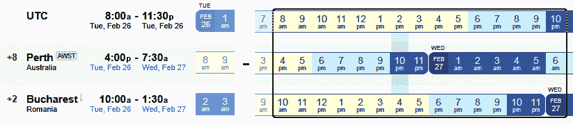
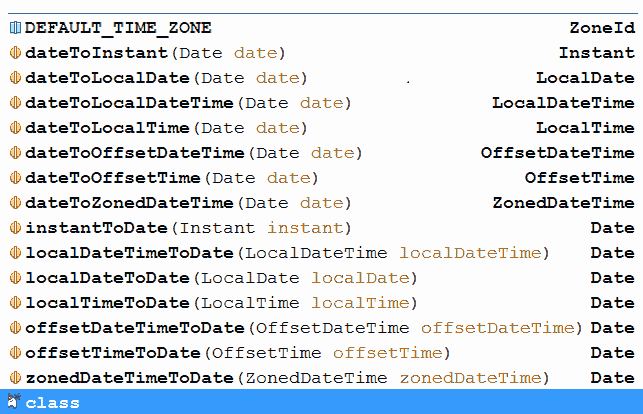

# 使用日期和时间

本章包括 20 个涉及日期和时间的问题。这些问题通过`Date`、`Calendar`、`LocalDate`、`LocalTime`、`LocalDateTime`、`ZoneDateTime`、`OffsetDateTime`、`OffsetTime`、`Instant`等涵盖了广泛的主题（转换、格式化、加减、定义时段/持续时间、计算等）。到本章结束时，您将在确定日期和时间方面没有问题，同时符合您的应用程序的需要。本章介绍的基本问题将非常有助于了解日期-时间 API 的整体情况，并将像拼图中需要拼凑起来的部分一样解决涉及日期和时间的复杂挑战。

# 问题

使用以下问题来测试您的日期和时间编程能力。我强烈建议您在使用解决方案和下载示例程序之前，先尝试一下每个问题：

58.  **将字符串转换为日期和时间**：**编写一个程序，演示字符串和日期/时间之间的转换。**
***   **格式化日期和时间**：**解释日期和时间的格式模式。*****   **获取当前日期/时间（不含时间/日期）**：**编写程序，提取当前日期（不含时间或日期）。*****   `LocalDateTime`**来自**`LocalDate`**和**`LocalTime`：**编写一个程序，从`LocalDate`对象和`LocalTime`构建一个`LocalDateTime`。它将日期和时间组合在一个`LocalDateTime`对象中。*****   通过`Instant`**类****机器时间：**解释并举例说明`Instant`API。*******   **定义使用基于日期的值的时间段（`Period`）和使用基于时间的值的时间段（`Duration`）**：**解释并举例说明`Period`和`Duration`api 的用法。************

 ********64.  **获取日期和时间单位**：编写一个程序，从表示日期时间的对象中提取日期和时间单位（例如，从日期中提取年、月、分钟等）。
65.  **对日期时间的加减**：编写一个程序，对日期时间对象加减一定的时间（如年、日、分等）（如对日期加 1 小时，对`LocalDateTime`减 2 天等）。
66.  **获取 UTC 和 GMT 的所有时区**：**编写一个程序，显示 UTC 和 GMT 的所有可用时区。**
***   **获取所有可用时区的本地日期时间**：编写一个程序，显示所有可用时区的本地时间。*   **显示航班日期时间信息**：编写程序，显示 15 小时 30 分钟的航班时刻信息。更确切地说，是从澳大利亚珀斯飞往欧洲布加勒斯特的航班。*   **将 Unix 时间戳转换为日期时间**：编写将 Unix 时间戳转换为`java.util.Date`和`java.time.LocalDateTime`的程序。*   **查找月份的第一天/最后一天**：编写一个程序，通过 jdk8，`TemporalAdjusters`查找月份的第一天/最后一天。*   **定义/提取区域偏移**：编写一个程序，展示定义和提取区域偏移的不同技术。*   **`Date`**与**`Temporal`之间的转换：编写`Date`与`Instant``LocalDate``LocalDateTime`等之间的转换程序。*****   **迭代一系列日期**：**编写一个程序，逐日（以一天的步长）迭代一系列给定日期。*****   **计算年龄**：**编写一个计算一个人年龄的程序。*****   **一天的开始和结束**：编写一个程序，返回一天的开始和结束时间。*   **两个日期之间的差异：**编写一个程序，计算两个日期之间的时间量（以天为单位）。*   **实现象棋时钟：**编写实现象棋时钟的程序。****************  ******# 解决

以下各节介绍上述问题的解决方案。记住，通常没有一个正确的方法来解决一个特定的问题。另外，请记住，这里显示的解释仅包括解决问题所需的最有趣和最重要的细节。下载示例解决方案以查看更多详细信息，并在[中试用程序 https://github.com/PacktPublishing/Java-Coding-Problems](https://github.com/PacktPublishing/Java-Coding-Problems)。

# 58 将字符串转换为日期和时间

将`String`转换或解析为日期和时间可以通过一组`parse()`方法来完成。从日期和时间到`String`的转换可以通过`toString()`或`format()`方法完成。

# JDK 8 之前

在 jdk8 之前，这个问题的典型解决方案依赖于抽象的`DateFormat`类的主扩展，名为`SimpleDateFormat`（这不是线程安全类）。在本书附带的代码中，有几个示例说明了如何使用此类。

# 从 JDK 8 开始

从 jdk8 开始，`SimpleDateFormat`可以替换为一个新类—`DateTimeFormatter`。这是一个不可变（因此是线程安全的）类，用于打印和解析日期时间对象。这个类支持从预定义的格式化程序（表示为常量，如 ISO local date，2011-12-03，is`ISO_LOCAL_DATE`）到用户定义的格式化程序（依赖于一组用于编写自定义格式模式的符号）。

此外，除了`Date`类之外，jdk8 还提供了几个新类，它们专门用于处理日期和时间。其中一些类显示在下面的列表中（这些类也被称为临时类，因为它们实现了`Temporal`接口）：

*   `LocalDate`（ISO-8601 日历系统中没有时区的日期）
*   `LocalTime`（ISO-8601 日历系统中无时区的时间）
*   `LocalDateTime`（ISO-8601 日历系统中无时区的日期时间）
*   `ZonedDateTime`（ISO-8601 日历系统中带时区的日期时间），依此类推
*   `OffsetDateTime`（在 ISO-8601 日历系统中，有 UTC/GMT 偏移的日期时间）
*   `OffsetTime`（在 ISO-8601 日历系统中与 UTC/GMT 有偏移的时间）

为了通过预定义的格式化程序将`String`转换为`LocalDate`，它应该遵循`DateTimeFormatter.ISO_LOCAL_DATE`模式，例如 2020-06-01。`LocalDate`提供了一种`parse()`方法，可以如下使用：

```java
// 06 is the month, 01 is the day
LocalDate localDate = LocalDate.parse("2020-06-01");
```

类似地，在`LocalTime`的情况下，字符串应该遵循`DateTimeFormatter.ISO_LOCAL_TIME`模式；例如，10:15:30，如下面的代码片段所示：

```java
LocalTime localTime = LocalTime.parse("12:23:44");
```

在`LocalDateTime`的情况下，字符串应该遵循`DateTimeFormatter.ISO_LOCAL_DATE_TIME`模式，例如`2020-06-01T11:20:15`，如下代码片段所示：

```java
LocalDateTime localDateTime 
  = LocalDateTime.parse("2020-06-01T11:20:15");
```

在`ZonedDateTime`的情况下，字符串必须遵循`DateTimeFormatter.ISO_ZONED_DATE_TIME`模式，例如`2020-06-01T10:15:30+09:00[Asia/Tokyo]`，如下代码片段所示：

```java
ZonedDateTime zonedDateTime 
  = ZonedDateTime.parse("2020-06-01T10:15:30+09:00[Asia/Tokyo]");
```

在`OffsetDateTime`的情况下，字符串必须遵循`DateTimeFormatter.ISO_OFFSET_DATE_TIME`模式，例如`2007-12-03T10:15:30+01:00`，如下代码片段所示：

```java
OffsetDateTime offsetDateTime 
  = OffsetDateTime.parse("2007-12-03T10:15:30+01:00");
```

最后，在`OffsetTime`的情况下，字符串必须遵循`DateTimeFormatter.ISO_OFFSET_TIME`模式，例如`10:15:30+01:00`，如下代码片段所示：

```java
OffsetTime offsetTime = OffsetTime.parse("10:15:30+01:00");
```

如果字符串不符合任何预定义的格式化程序，则是时候通过自定义格式模式使用用户定义的格式化程序了；例如，字符串`01.06.2020`表示需要用户定义格式化程序的日期，如下所示：

```java
DateTimeFormatter dateFormatter 
  = DateTimeFormatter.ofPattern("dd.MM.yyyy");
LocalDate localDateFormatted 
  = LocalDate.parse("01.06.2020", dateFormatter);
```

但是，像`12|23|44`这样的字符串需要如下用户定义的格式化程序：

```java
DateTimeFormatter timeFormatter 
  = DateTimeFormatter.ofPattern("HH|mm|ss");
LocalTime localTimeFormatted 
  = LocalTime.parse("12|23|44", timeFormatter);
```

像`01.06.2020, 11:20:15`这样的字符串需要一个用户定义的格式化程序，如下所示：

```java
DateTimeFormatter dateTimeFormatter 
  = DateTimeFormatter.ofPattern("dd.MM.yyyy, HH:mm:ss");
LocalDateTime localDateTimeFormatted 
  = LocalDateTime.parse("01.06.2020, 11:20:15", dateTimeFormatter);
```

像`01.06.2020, 11:20:15+09:00 [Asia/Tokyo]`这样的字符串需要一个用户定义的格式化程序，如下所示：

```java
DateTimeFormatter zonedDateTimeFormatter 
  = DateTimeFormatter.ofPattern("dd.MM.yyyy, HH:mm:ssXXXXX '['VV']'");
ZonedDateTime zonedDateTimeFormatted 
  = ZonedDateTime.parse("01.06.2020, 11:20:15+09:00 [Asia/Tokyo]", 
    zonedDateTimeFormatter);
```

像`2007.12.03, 10:15:30, +01:00`这样的字符串需要一个用户定义的格式化程序，如下所示：

```java
DateTimeFormatter offsetDateTimeFormatter 
  = DateTimeFormatter.ofPattern("yyyy.MM.dd, HH:mm:ss, XXXXX");
OffsetDateTime offsetDateTimeFormatted 
  = OffsetDateTime.parse("2007.12.03, 10:15:30, +01:00", 
    offsetDateTimeFormatter);
```

最后，像`10 15 30 +01:00`这样的字符串需要一个用户定义的格式化程序，如下所示：

```java
DateTimeFormatter offsetTimeFormatter 
  = DateTimeFormatter.ofPattern("HH mm ss XXXXX");
OffsetTime offsetTimeFormatted 
  = OffsetTime.parse("10 15 30 +01:00", offsetTimeFormatter);
```

前面示例中的每个`ofPattern()`方法也支持`Locale`。

从`LocalDate`、`LocalDateTime`或`ZonedDateTime`到`String`的转换至少可以通过两种方式完成：

*   依赖于`LocalDate`、`LocalDateTime`或`ZonedDateTime.toString()`方法（自动或显式）。请注意，依赖于`toString()`将始终通过相应的预定义格式化程序打印日期：

```java
// 2020-06-01 results in ISO_LOCAL_DATE, 2020-06-01
String localDateAsString = localDate.toString();

// 01.06.2020 results in ISO_LOCAL_DATE, 2020-06-01
String localDateAsString = localDateFormatted.toString();

// 2020-06-01T11:20:15 results 
// in ISO_LOCAL_DATE_TIME, 2020-06-01T11:20:15
String localDateTimeAsString = localDateTime.toString();

// 01.06.2020, 11:20:15 results in 
// ISO_LOCAL_DATE_TIME, 2020-06-01T11:20:15
String localDateTimeAsString 
  = localDateTimeFormatted.toString();

// 2020-06-01T10:15:30+09:00[Asia/Tokyo] 
// results in ISO_ZONED_DATE_TIME,
// 2020-06-01T11:20:15+09:00[Asia/Tokyo]
String zonedDateTimeAsString = zonedDateTime.toString();

// 01.06.2020, 11:20:15+09:00 [Asia/Tokyo] 
// results in ISO_ZONED_DATE_TIME,
// 2020-06-01T11:20:15+09:00[Asia/Tokyo]
String zonedDateTimeAsString 
  = zonedDateTimeFormatted.toString();
```

*   依靠`DateTimeFormatter.format()`方法。请注意，依赖于`DateTimeFormatter.format()`将始终使用指定的格式化程序打印日期/时间（默认情况下，时区将为`null`），如下所示：

```java
// 01.06.2020
String localDateAsFormattedString 
  = dateFormatter.format(localDateFormatted);

// 01.06.2020, 11:20:15
String localDateTimeAsFormattedString 
  = dateTimeFormatter.format(localDateTimeFormatted);

// 01.06.2020, 11:20:15+09:00 [Asia/Tokyo]
String zonedDateTimeAsFormattedString 
  = zonedDateTimeFormatted.format(zonedDateTimeFormatter);
```

在讨论中添加一个明确的时区可以如下所示：

```java
DateTimeFormatter zonedDateTimeFormatter 
  = DateTimeFormatter.ofPattern("dd.MM.yyyy, HH:mm:ssXXXXX '['VV']'")
    .withZone(ZoneId.of("Europe/Paris"));
ZonedDateTime zonedDateTimeFormatted 
  = ZonedDateTime.parse("01.06.2020, 11:20:15+09:00 [Asia/Tokyo]", 
    zonedDateTimeFormatter);
```

这次，字符串表示欧洲/巴黎时区中的日期/时间：

```java
// 01.06.2020, 04:20:15+02:00 [Europe/Paris]
String zonedDateTimeAsFormattedString 
  = zonedDateTimeFormatted.format(zonedDateTimeFormatter);
```

# 59 格式化日期和时间

前面的问题包含一些通过`SimpleDateFormat.format()`和`DateTimeFormatter.format()`格式化日期和时间的风格。为了定义*格式模式，*开发人员必须了解格式模式语法。换句话说，开发人员必须知道 Java 日期时间 API 使用的一组符号，以便识别有效的格式模式。

大多数符号与`SimpleDateFormat`（JDK 8 之前）和`DateTimeFormatter`（从 JDK 8 开始）通用。下表列出了 JDK 文档中提供的最常见符号的完整列表：

| **字母** | **表示** | **演示** | **例** |
| y | 年 | 年 | 1994; 94 |
| 米 | 每年的月份 | 编号/文本 | 7、 7 月 7 日 |
| W 型 | 每月的一周 | 数 | 4 |
| 电子 | 星期几 | 文本 | 星期二；星期二；T |
| d | 月日 | 数 | 15 |
| 小时 | 一天中的一小时 | 数 | 22 |
| 米 | 每分钟 | 数 | 34 |
| s | 分秒 | 数 | 55 |
| S 码 | 秒的分数 | 数 | 345 |
| z | 时区名称 | 区域名称 | 太平洋标准时间 |
| Z 轴 | 区域偏移 | 区域偏移 | -0800 |
| 五 | 时区 id（JDK 8） | 区域 id | 美洲/洛杉矶；Z；-08:30 |

下表提供了一些格式模式示例：

| **图案** | **例** |
| 每天 | 2019-02-24 |
| 年月日 | 02-24-2019 |
| 年月日 | 2019 年 2 月 24 日 |
| 年月日 | 24-02-19 |
| 年月日 | 24.02.2019 |
| yyyy-MM-dd 时：分：秒 | 2019-02-24 11:26:26 |
| yyyy-MM-dd 时：分：秒 | 2019-02-24 11:36:32743 |
| yyyy-MM-dd 时：分：秒 | 2019-02-24 11:40:35+0200 |
| 年-月-日 HH:MM:ss z | 2019-02-24 欧洲东部时间 11:45:03 |
| 年月日时分：不锈钢 SSSZ | 2019 年 2 月周日 11:46:32.393+0200 |
| yyyy-MM-dd HH:MM:ss VV（JDK 8） | 2019-02-24 11:45:41 欧洲/雅典 |

在 JDK 8 之前，可以通过`SimpleDateFormat`应用格式模式：

```java
// yyyy-MM-dd
Date date = new Date();
SimpleDateFormat formatter = new SimpleDateFormat("yyyy-MM-dd");
String stringDate = formatter.format(date);
```

从 JDK 8 开始，可以通过`DateTimeFormatter`应用格式模式：

*   对于`LocalDate`（ISO-8601 日历系统中没有时区的日期）：

```java
// yyyy-MM-dd
LocalDate localDate = LocalDate.now();
DateTimeFormatter formatterLocalDate 
  = DateTimeFormatter.ofPattern("yyyy-MM-dd");
String stringLD = formatterLocalDate.format(localDate);

// or shortly
String stringLD = LocalDate.now()
  .format(DateTimeFormatter.ofPattern("yyyy-MM-dd"));
```

*   对于`LocalTime`（ISO-8601 日历系统中没有时区的时间）：

```java
// HH:mm:ss
LocalTime localTime = LocalTime.now();
DateTimeFormatter formatterLocalTime 
  = DateTimeFormatter.ofPattern("HH:mm:ss");
String stringLT 
  = formatterLocalTime.format(localTime);

// or shortly
String stringLT = LocalTime.now()
  .format(DateTimeFormatter.ofPattern("HH:mm:ss"));
```

*   对于`LocalDateTime`（ISO-8601 日历系统中没有时区的日期时间）：

```java
// yyyy-MM-dd HH:mm:ss
LocalDateTime localDateTime = LocalDateTime.now();
DateTimeFormatter formatterLocalDateTime 
  = DateTimeFormatter.ofPattern("yyyy-MM-dd HH:mm:ss");
String stringLDT 
  = formatterLocalDateTime.format(localDateTime);

// or shortly
String stringLDT = LocalDateTime.now()
  .format(DateTimeFormatter.ofPattern("yyyy-MM-dd HH:mm:ss"));
```

*   对于`ZonedDateTime`（ISO-8601 日历系统中带时区的日期时间）：

```java
// E MMM yyyy HH:mm:ss.SSSZ
ZonedDateTime zonedDateTime = ZonedDateTime.now();
DateTimeFormatter formatterZonedDateTime 
  = DateTimeFormatter.ofPattern("E MMM yyyy HH:mm:ss.SSSZ");
String stringZDT 
  = formatterZonedDateTime.format(zonedDateTime);

// or shortly
String stringZDT = ZonedDateTime.now()
  .format(DateTimeFormatter
    .ofPattern("E MMM yyyy HH:mm:ss.SSSZ"));
```

*   对于`OffsetDateTime`（在 ISO-8601 日历系统中，与 UTC/GMT 有偏移的日期时间）：

```java
// E MMM yyyy HH:mm:ss.SSSZ
OffsetDateTime offsetDateTime = OffsetDateTime.now();
DateTimeFormatter formatterOffsetDateTime 
  = DateTimeFormatter.ofPattern("E MMM yyyy HH:mm:ss.SSSZ");
String odt1 = formatterOffsetDateTime.format(offsetDateTime);

// or shortly
String odt2 = OffsetDateTime.now()
  .format(DateTimeFormatter
    .ofPattern("E MMM yyyy HH:mm:ss.SSSZ"));
```

*   对于`OffsetTime`（在 ISO-8601 日历系统中与 UTC/GMT 有偏移的时间）：

```java
// HH:mm:ss,Z
OffsetTime offsetTime = OffsetTime.now();
DateTimeFormatter formatterOffsetTime 
  = DateTimeFormatter.ofPattern("HH:mm:ss,Z");
String ot1 = formatterOffsetTime.format(offsetTime);

// or shortly
String ot2 = OffsetTime.now()
  .format(DateTimeFormatter.ofPattern("HH:mm:ss,Z"));
```

# 60 获取没有时间/日期的当前日期/时间

在 JDK8 之前，解决方案必须集中在`java.util.Date`类上。绑定到本书的代码包含此解决方案。

从 JDK 8 开始，日期和时间可以通过专用类`LocalDate`和`LocalTime`从`java.time`包中获得：

```java
// 2019-02-24
LocalDate onlyDate = LocalDate.now();

// 12:53:28.812637300
LocalTime onlyTime = LocalTime.now();
```

# 61LocalDate 和 LocalTime 中的 LocalDateTime

`LocalDateTime`类公开了一系列`of()`方法，这些方法可用于获取`LocalDateTime`的不同类型的实例。例如，从年、月、日、时、分、秒或纳秒获得的`LocalDateTime`类如下所示：

```java
LocalDateTime ldt = LocalDateTime.of​(2020, 4, 1, 12, 33, 21, 675);
```

因此，前面的代码将日期和时间组合为`of()`方法的参数。为了将日期和时间组合为对象，解决方案可以利用以下`of()`方法：

```java
public static LocalDateTime of​(LocalDate date, LocalTime time)
```

这导致`LocalDate`和`LocalTime`，如下所示：

```java
LocalDate localDate = LocalDate.now(); // 2019-Feb-24
LocalTime localTime = LocalTime.now(); // 02:08:10 PM
```

它们可以组合在一个对象`LocalDateTime`中，如下所示：

```java
LocalDateTime localDateTime = LocalDateTime.of(localDate, localTime);
```

格式化`LocalDateTime`显示日期和时间如下：

```java
// 2019-Feb-24 02:08:10 PM
String localDateTimeAsString = localDateTime
  .format(DateTimeFormatter.ofPattern("yyyy-MMM-dd hh:mm:ss a"));
```

# 62 通过即时类的机器时间

jdk8 附带了一个新类，名为`java.time.Instant`。主要地，`Instant`类表示时间线上的一个瞬时点，从 1970 年 1 月 1 日（纪元）的第一秒开始，在 UTC 时区，分辨率为纳秒。

Java8`Instant`类在概念上类似于`java.util.Date`。两者都代表 UTC 时间线上的一个时刻。当`Instant`的分辨率高达纳秒时，`java.util.Date`的分辨率为毫秒。

这个类对于生成机器时间的时间戳非常方便。为了获得这样的时间戳，只需调用如下的`now()`方法：

```java
// 2019-02-24T15:05:21.781049600Z
Instant timestamp = Instant.now();
```

使用以下代码段可以获得类似的输出：

```java
OffsetDateTime now = OffsetDateTime.now(ZoneOffset.UTC);
```

或者，使用以下代码段：

```java
Clock clock = Clock.systemUTC();
```

调用`Instant.toString()`产生一个输出，该输出遵循 ISO-8601 标准来表示日期和时间。

# 将字符串转换为即时

遵循 ISO-8601 标准表示日期和时间的字符串可以通过`Instant.parse()`方法轻松转换为`Instant`，如下例所示：

```java
// 2019-02-24T14:31:33.197021300Z
Instant timestampFromString =
  Instant.parse("2019-02-24T14:31:33.197021300Z");
```

# 将时间加到/减去瞬间

对于添加时间，`Instant`有一套方法。例如，向当前时间戳添加 2 小时可以如下完成：

```java
Instant twoHourLater = Instant.now().plus(2, ChronoUnit.HOURS);
```

在减去时间方面，例如 10 分钟，请使用以下代码段：

```java
Instant tenMinutesEarlier = Instant.now()
  .minus(10, ChronoUnit.MINUTES);
```

除`plus()`方法外，`Instant`还包含`plusNanos()`、`plusMillis()`、`plusSeconds()`。此外，除了`minus()`方法外，`Instant`还包含`minusNanos()`、`minusMillis()`、`minusSeconds()`。

# 比较即时对象

比较两个`Instant`对象可以通过`Instant.isAfter()`和`Instant.isBefore()`方法来完成。例如，让我们看看以下两个`Instant`对象：

```java
Instant timestamp1 = Instant.now();
Instant timestamp2 = timestamp1.plusSeconds(10);
```

检查`timestamp1`是否在`timestamp2`之后：

```java
boolean isAfter = timestamp1.isAfter(timestamp2); // false
```

检查`timestamp1`是否在`timestamp2`之前：

```java
boolean isBefore = timestamp1.isBefore(timestamp2); // true
```

两个`Instant`对象之间的时差可以通过`Instant.until()`方法计算：

```java
// 10 seconds
long difference = timestamp1.until(timestamp2, ChronoUnit.SECONDS);
```

# 在 Instant 和 LocalDateTime、ZonedDateTime 和 OffsetDateTime 之间转换

这些常见的转换可以在以下示例中完成：

*   在`Instant`和`LocalDateTime`之间转换-因为`LocalDateTime`不知道时区，所以使用零偏移 UTC+0：

```java
// 2019-02-24T15:27:13.990103700
LocalDateTime ldt = LocalDateTime.ofInstant(
  Instant.now(), ZoneOffset.UTC);

// 2019-02-24T17:27:14.013105Z
Instant instantLDT = LocalDateTime.now().toInstant(ZoneOffset.UTC);
```

*   在`Instant`和`ZonedDateTime`之间转换—将`Instant`UTC+0 转换为巴黎`ZonedDateTime`UTC+1：

```java
// 2019-02-24T16:34:36.138393100+01:00[Europe/Paris]
ZonedDateTime zdt = Instant.now().atZone(ZoneId.of("Europe/Paris"));

// 2019-02-24T16:34:36.150393800Z
Instant instantZDT = LocalDateTime.now()
  .atZone(ZoneId.of("Europe/Paris")).toInstant();
```

*   在`Instant`和`OffsetDateTime`之间转换-指定 2 小时的偏移量：

```java
// 2019-02-24T17:34:36.151393900+02:00
OffsetDateTime odt = Instant.now().atOffset(ZoneOffset.of("+02:00"));

// 2019-02-24T15:34:36.153394Z
Instant instantODT = LocalDateTime.now()
  .atOffset(ZoneOffset.of("+02:00")).toInstant();
```

# 63 使用基于日期的值定义时段，使用基于时间的值定义持续时间

jdk8 附带了两个新类，分别命名为`java.time.Period`和`java.time.Duration`。让我们在下一节中详细了解它们。

# 使用基于日期的值的时间段

`Period`类意味着使用基于日期的值（年、月、周和天）来表示时间量。这段时间可以用不同的方法获得。例如，120 天的周期可以如下获得：

```java
Period fromDays = Period.ofDays(120); // P120D
```

在`ofDays()`方法旁边，`Period`类还有`ofMonths()`、`ofWeeks()`和`ofYears()`。

或者，通过`of()`方法可以得到 2000 年 11 个月 24 天的期限，如下所示：

```java
Period periodFromUnits = Period.of(2000, 11, 24); // P2000Y11M24D
```

`Period`也可以从`LocalDate`中得到：

```java
LocalDate localDate = LocalDate.now();
Period periodFromLocalDate = Period.of(localDate.getYear(),
  localDate.getMonthValue(), localDate.getDayOfMonth());
```

最后，可以从遵循 ISO-8601 周期格式`PnYnMnD`和`PnW`的`String`对象获得`Period`。例如，P2019Y2M25D 字符串表示 2019 年、2 个月和 25 天：

```java
Period periodFromString = Period.parse("P2019Y2M25D");
```

调用`Period.toString()`将返回句点，同时也遵循 ISO-8601 句点格式，`PnYnMnD`和`PnW`（例如 P120D、P2000Y11M24D）。]

但是，当`Period`被用来表示两个日期之间的一段时间（例如`LocalDate`时，`Period`的真实力量就显现出来了。2018 年 3 月 12 日至 2019 年 7 月 20 日期间可表示为：

```java
LocalDate startLocalDate = LocalDate.of(2018, 3, 12);
LocalDate endLocalDate = LocalDate.of(2019, 7, 20);
Period periodBetween = Period.between(startLocalDate, endLocalDate);
```

年、月、日的时间量可以通过`Period.getYears()`、`Period.getMonths()`、`Period.getDays()`获得。例如，以下 helper 方法使用这些方法将时间量输出为字符串：

```java
public static String periodToYMD(Period period) {

  StringBuilder sb = new StringBuilder();

  sb.append(period.getYears())
   .append("y:")
   .append(period.getMonths())
   .append("m:")
   .append(period.getDays())
   .append("d");

 return sb.toString();
}
```

我们将此方法称为`periodBetween`（差值为 1 年 4 个月 8 天）：

```java
periodToYMD(periodBetween); // 1y:4m:8d
```

当确定某个日期是否早于另一个日期时，`Period`类也很有用。有一个 flag 方法，名为`isNegative()`。有一个`A`周期和一个`B`周期，如果`B`在`A`之前，应用`Period.between(A, B)`的结果可以是负的，如果`A`在`B`之前，应用`isNegative()`的结果可以是正的，如果`B`在`A`之前，`false`在`A`之前，则`isNegative()`返回`true``B`，如我们的例子所示（基本上，如果年、月或日为负数，此方法返回`false`）：

```java
// returns false, since 12 March 2018 is earlier than 20 July 2019
periodBetween.isNegative();
```

最后，`Period`可以通过加上或减去一段时间来修改。方法有`plusYears()`、`plusMonths()`、`plusDays()`、`minusYears()`、`minusMonths()`、`minusDays()`等。例如，在`periodBetween`上加 1 年可以如下操作：

```java
Period periodBetweenPlus1Year = periodBetween.plusYears(1L);
```

添加两个`Period`类可以通过`Period.plus()`方法完成，如下所示：

```java
Period p1 = Period.ofDays(5);
Period p2 = Period.ofDays(20);
Period p1p2 = p1.plus(p2); // P25D
```

# 使用基于时间的值的持续时间

`Duration`类意味着使用基于时间的值（小时、分钟、秒或纳秒）来表示时间量。这种持续时间可以通过不同的方式获得。例如，可以如下获得 10 小时的持续时间：

```java
Duration fromHours = Duration.ofHours(10); // PT10H
```

在`ofHours()`方法旁边，`Duration`类还有`ofDays()`、`ofMillis()`、`ofMinutes()`、`ofSeconds()`和`ofNanos()`。

或者，可以通过`of()`方法获得 3 分钟的持续时间，如下所示：

```java
Duration fromMinutes = Duration.of(3, ChronoUnit.MINUTES); // PT3M
```

`Duration`也可以从`LocalDateTime`中得到：

```java
LocalDateTime localDateTime 
  = LocalDateTime.of(2018, 3, 12, 4, 14, 20, 670);

// PT14M
Duration fromLocalDateTime 
  = Duration.ofMinutes(localDateTime.getMinute());
```

也可从`LocalTime`中获得：

```java
LocalTime localTime = LocalTime.of(4, 14, 20, 670);

// PT0.00000067S
Duration fromLocalTime = Duration.ofNanos(localTime.getNano());
```

最后，可以从遵循 ISO-8601 持续时间格式`PnDTnHnMn.nS`的`String`对象获得`Duration`，其中天被认为正好是 24 小时。例如，`P2DT3H4M`字符串有 2 天 3 小时 4 分钟：

```java
Duration durationFromString = Duration.parse("P2DT3H4M");
```

调用`Duration.toString()`将返回符合 ISO-8601 持续时间格式的持续时间`PnDTnHnMn.nS`（例如，`PT10H`、`PT3M`或`PT51H4M`）。

但是，与`Period`的情况一样，当`Duration`用于表示两次之间的时间段（例如，`Instant`时，揭示了它的真实功率。从 2015 年 11 月 3 日 12:11:30 到 2016 年 12 月 6 日 15:17:10 之间的持续时间可以表示为两个`Instant`类之间的差异，如下所示：

```java
Instant startInstant = Instant.parse("2015-11-03T12:11:30.00Z");
Instant endInstant = Instant.parse("2016-12-06T15:17:10.00Z");

// PT10059H5M40S
Duration durationBetweenInstant 
  = Duration.between(startInstant, endInstant);
```

以秒为单位，可通过`Duration.getSeconds()`方法获得该差值：

```java
durationBetweenInstant.getSeconds(); // 36212740 seconds
```

或者，从 2018 年 3 月 12 日 04:14:20.000000670 到 2019 年 7 月 20 日 06:10:10.000000720 之间的持续时间可以表示为两个`LocalDateTime`对象之间的差异，如下所示：

```java
LocalDateTime startLocalDateTime 
  = LocalDateTime.of(2018, 3, 12, 4, 14, 20, 670);
LocalDateTime endLocalDateTime 
  = LocalDateTime.of(2019, 7, 20, 6, 10, 10, 720);
// PT11881H55M50.00000005S, or 42774950 seconds
Duration durationBetweenLDT 
  = Duration.between(startLocalDateTime, endLocalDateTime);
```

最后，04:14:20.000000670 和 06:10:10.000000720 之间的持续时间可以表示为两个`LocalTime`对象之间的差异，如下所示：

```java
LocalTime startLocalTime = LocalTime.of(4, 14, 20, 670);
LocalTime endLocalTime = LocalTime.of(6, 10, 10, 720);

// PT1H55M50.00000005S, or 6950 seconds
Duration durationBetweenLT 
  = Duration.between(startLocalTime, endLocalTime);
```

在前面的例子中，`Duration`通过`Duration.getSeconds()`方法以秒表示，这是`Duration`类中的秒数。然而，`Duration`类包含一组方法，这些方法专用于通过`toDays()`以天为单位、通过`toHours()`以小时为单位、通过`toMinutes()`以分钟为单位、通过`toMillis()`以毫秒为单位、通过`toNanos()`以纳秒为单位来表达`Duration`。

从一个时间单位转换到另一个时间单位可能会产生残余。例如，从秒转换为分钟可能导致秒的剩余（例如，65 秒是 1 分钟，5 秒是剩余）。残差可以通过以下一组方法获得：天残差通过`toDaysPart()`，小时残差通过`toHoursPart()`，分钟残差通过`toMinutesPart()`等等。

假设差异应该显示为天：小时:分：秒：nano（例如，9d:2h:15m:20s:230n）。将`to*Foo()*`和`to*Foo*Part()`方法的力结合在一个 helper 方法中将产生以下代码：

```java
public static String durationToDHMSN(Duration duration) {

  StringBuilder sb = new StringBuilder();
  sb.append(duration.toDays())
    .append("d:")
    .append(duration.toHoursPart())
    .append("h:")
    .append(duration.toMinutesPart())
    .append("m:")
    .append(duration.toSecondsPart())
    .append("s:")
    .append(duration.toNanosPart())
    .append("n");

  return sb.toString();
}
```

让我们调用这个方法`durationBetweenLDT`（差别是 495 天 1 小时 55 分 50 秒 50 纳秒）：

```java
// 495d:1h:55m:50s:50n
durationToDHMSN(durationBetweenLDT);
```

与`Period`类相同，`Duration`类有一个名为`isNegative()`的标志方法。当确定某个特定时间是否早于另一个时间时，此方法很有用。有持续时间`A`和持续时间`B`，如果`B`在`A`之前，应用`Duration.between(A, B)`的结果可以是负的，如果`A`在`B`之前，应用`Duration.between(A, B)`的结果可以是正的，进一步逻辑，`isNegative()`如果`B`在`A`之前，则返回`true`，如果`A`在`B`之前，则返回`false`，如以下情况：

```java
durationBetweenLT.isNegative(); // false
```

最后，`Duration`可以通过增加或减少持续时间来修改。有`plusDays()`、`plusHours()`、`plusMinutes()`、`plusMillis()`、`plusNanos()`、`minusDays()`、`minusHours()`、`minusMinutes()`、`minusMillis()`和`minusNanos()`等方法来执行此操作。例如，向`durationBetweenLT`添加 5 小时可以如下所示：

```java
Duration durationBetweenPlus5Hours = durationBetweenLT.plusHours(5);
```

添加两个`Duration`类可以通过`Duration.plus()`方法完成，如下所示：

```java
Duration d1 = Duration.ofMinutes(20);
Duration d2 = Duration.ofHours(2);

Duration d1d2 = d1.plus(d2);

System.out.println(d1 + "+" + d2 + "=" + d1d2); // PT2H20M
```

# 64 获取日期和时间单位

对于`Date`对象，解决方案可能依赖于`Calendar`实例。绑定到本书的代码包含此解决方案。

对于 jdk8 类，Java 提供了专用的`get*Foo*()`方法和`get​(TemporalField field)`方法。例如，假设下面的`LocalDateTime`对象：

```java
LocalDateTime ldt = LocalDateTime.now();
```

依靠`get*Foo*()`方法，我们得到如下代码：

```java
int year = ldt.getYear();
int month = ldt.getMonthValue();
int day = ldt.getDayOfMonth();
int hour = ldt.getHour();
int minute = ldt.getMinute();
int second = ldt.getSecond();
int nano = ldt.getNano();
```

或者，依赖于`get​(TemporalField field)`结果如下：

```java
int yearLDT = ldt.get(ChronoField.YEAR);
int monthLDT = ldt.get(ChronoField.MONTH_OF_YEAR);
int dayLDT = ldt.get(ChronoField.DAY_OF_MONTH);
int hourLDT = ldt.get(ChronoField.HOUR_OF_DAY);
int minuteLDT = ldt.get(ChronoField.MINUTE_OF_HOUR);
int secondLDT = ldt.get(ChronoField.SECOND_OF_MINUTE);
int nanoLDT = ldt.get(ChronoField.NANO_OF_SECOND);
```

请注意，月份是从 1 开始计算的，即 1 月。

例如，`2019-02-25T12:58:13.109389100`的`LocalDateTime`对象可以被切割成日期时间单位，结果如下：

```java
Year: 2019 Month: 2 Day: 25 Hour: 12 Minute: 58 Second: 13 Nano: 109389100
```

通过一点直觉和文档，很容易将此示例改编为`LocalDate`、`LocalTime`、`ZonedDateTime`和其他示例。

# 65 日期时间的加减

这个问题的解决方案依赖于专用于处理日期和时间的 javaapi。让我们在下一节中看看它们。

# 使用日期

对于`Date`对象，解决方案可能依赖于`Calendar`实例。绑定到本书的代码包含此解决方案。

# 使用 LocalDateTime

跳转到 jdk8，重点是`LocalDate`、`LocalTime`、`LocalDateTime`、`Instant`等等。新的 Java date-time API 提供了专门用于加减时间量的方法。`LocalDate`、`LocalTime`、`LocalDateTime`、`ZonedDateTime`、`OffsetDateTime`、`Instant`、`Period`、`Duration`以及许多其他方法，如`plus*Foo*()`和`minus*Foo*()`，其中*、`Foo`*可以用单位替换时间（例如，`plusYears()`、`plusMinutes()`、`minusHours()`、`minusSeconds()`等等）。

假设如下`LocalDateTime`：

```java
// 2019-02-25T14:55:06.651155500
LocalDateTime ldt = LocalDateTime.now();
```

加 10 分钟和调用`LocalDateTime.plusMinutes(long minutes)`一样简单，减 10 分钟和调用`LocalDateTime.minusMinutes(long minutes)`一样简单：

```java
LocalDateTime ldtAfterAddingMinutes = ldt.plusMinutes(10);
LocalDateTime ldtAfterSubtractingMinutes = ldt.minusMinutes(10);
```

输出将显示以下日期：

```java
After adding 10 minutes: 2019-02-25T15:05:06.651155500
After subtracting 10 minutes: 2019-02-25T14:45:06.651155500
```

除了每个时间单位专用的方法外，这些类还支持`plus/minus(TemporalAmount amountToAdd)`和`plus/minus(long amountToAdd, TemporalUnit unit)`。

现在，让我们关注`Instant`类。除了`plus/minusSeconds()`、`plus/minusMillis()`、`plus/minusNanos()`之外，`Instant`类还提供了`plus/minus(TemporalAmount amountToAdd)`方法。

为了举例说明这个方法，我们假设如下`Instant`：

```java
// 2019-02-25T12:55:06.654155700Z
Instant timestamp = Instant.now();
```

现在，让我们加减 5 个小时：

```java
Instant timestampAfterAddingHours 
  = timestamp.plus(5, ChronoUnit.HOURS);
Instant timestampAfterSubtractingHours 
  = timestamp.minus(5, ChronoUnit.HOURS);
```

输出将显示以下`Instant`：

```java
After adding 5 hours: 2019-02-25T17:55:06.654155700Z
After subtracting 5 hours: 2019-02-25T07:55:06.654155700Z
```

# 66 使用 UTC 和 GMT 获取所有时区

UTC 和 GMT 被认为是处理日期和时间的标准参考。今天，UTC 是首选的方法，但是 UTC 和 GMT 在大多数情况下应该返回相同的结果。

为了获得 UTC 和 GMT 的所有时区，解决方案应该关注 JDK8 前后的实现。所以，让我们从 JDK8 之前有用的解决方案开始。

# JDK 8 之前

解决方案需要提取可用的时区 ID（非洲/巴马科、欧洲/贝尔格莱德等）。此外，每个时区 ID 都应该用来创建一个`TimeZone`对象。最后，解决方案需要提取特定于每个时区的偏移量，并考虑到夏令时。绑定到本书的代码包含此解决方案。

# 从 JDK 8 开始

新的 Java 日期时间 API 为解决这个问题提供了新的工具。

在第一步，可用的时区 id 可以通过`ZoneId`类获得，如下所示：

```java
Set<String> zoneIds = ZoneId.getAvailableZoneIds();
```

在第二步，每个时区 ID 都应该用来创建一个`ZoneId`实例。这可以通过`ZoneId.of(String zoneId)`方法实现：

```java
ZoneId zoneid = ZoneId.of(*current_zone_Id*);
```

在第三步，每个`ZoneId`可用于获得特定于所识别区域的时间。这意味着需要一个“实验室老鼠”参考日期时间。此参考日期时间（无时区，`LocalDateTime.now()`）通过`LocalDateTime.atZone()`与给定时区（`ZoneId`）组合，以获得`ZoneDateTime`（可识别时区的日期时间）：

```java
LocalDateTime now = LocalDateTime.now();
ZonedDateTime zdt = now.atZone(ZoneId.of(*zone_id_instance*));
```

`atZone()`方法尽可能地匹配日期时间，同时考虑时区规则，例如夏令时。

在第四步，代码可以利用`ZonedDateTime`来提取 UTC 偏移量（例如，对于欧洲/布加勒斯特，UTC 偏移量为+02:00）：

```java
String utcOffset = zdt.getOffset().getId().replace("Z", "+00:00");
```

`getId()`方法返回规范化区域偏移 ID，+00:00 偏移作为`Z`字符返回；因此代码需要快速将`Z`替换为+00:00，以便与其他偏移对齐，这些偏移遵循+hh:mm 或+hh:mm:ss 格式。

现在，让我们将这些步骤合并到一个 helper 方法中：

```java
public static List<String> fetchTimeZones(OffsetType type) {

  List<String> timezones = new ArrayList<>();
  Set<String> zoneIds = ZoneId.getAvailableZoneIds();
  LocalDateTime now = LocalDateTime.now();

  zoneIds.forEach((zoneId) -> {
    timezones.add("(" + type + now.atZone(ZoneId.of(zoneId))
      .getOffset().getId().replace("Z", "+00:00") + ") " + zoneId);
  });

  return timezones;
}
```

假设此方法存在于`DateTimes`类中，则获得以下代码：

```java
List<String> timezones 
  = DateTimes.fetchTimeZones(DateTimes.OffsetType.GMT);
Collections.sort(timezones); // optional sort
timezones.forEach(System.out::println);
```

此外，还显示了一个输出快照，如下所示：

```java
(GMT+00:00) Africa/Abidjan
(GMT+00:00) Africa/Accra
(GMT+00:00) Africa/Bamako
...
(GMT+11:00) Australia/Tasmania
(GMT+11:00) Australia/Victoria
...
```

# 67 获取所有可用时区中的本地日期时间

可通过以下步骤获得此问题的解决方案：

1.  获取本地日期和时间。
2.  获取可用时区。
3.  在 JDK 8 之前，使用`SimpleDateFormat`和`setTimeZone()`方法。
4.  从 jdk8 开始，使用`ZonedDateTime`。

# JDK 8 之前

在 jdk8 之前，获取当前本地日期时间的快速解决方案是调用`Date`空构造函数。此外，还可以使用`Date`在所有可用的时区中显示，这些时区可以通过`TimeZone`类获得。绑定到本书的代码包含此解决方案。

# 从 JDK 8 开始

从 JDK 8 开始，获取默认时区中当前本地日期时间的一个方便解决方案是调用`ZonedDateTime.now()`方法：

```java
ZonedDateTime zlt = ZonedDateTime.now();
```

所以，这是默认时区中的当前日期。此外，该日期应显示在通过`ZoneId`类获得的所有可用时区中：

```java
Set<String> zoneIds = ZoneId.getAvailableZoneIds();
```

最后，代码可以循环`zoneIds`，对于每个区域 id，可以调用`ZonedDateTime.withZoneSameInstant(ZoneId zone)`方法。此方法返回具有不同时区的此日期时间的副本，并保留以下瞬间：

```java
public static List<String> localTimeToAllTimeZones() {

  List<String> result = new ArrayList<>();
  Set<String> zoneIds = ZoneId.getAvailableZoneIds();
  DateTimeFormatter formatter 
    = DateTimeFormatter.ofPattern("yyyy-MMM-dd'T'HH:mm:ss a Z");
  ZonedDateTime zlt = ZonedDateTime.now();

  zoneIds.forEach((zoneId) -> {
    result.add(zlt.format(formatter) + " in " + zoneId + " is "
      + zlt.withZoneSameInstant(ZoneId.of(zoneId))
        .format(formatter));
  });

  return result;
}
```

此方法的输出快照可以如下所示：

```java
2019-Feb-26T14:26:30 PM +0200 in Africa/Nairobi 
  is 2019-Feb-26T15:26:30 PM +0300
2019-Feb-26T14:26:30 PM +0200 in America/Marigot 
  is 2019-Feb-26T08:26:30 AM -0400
...
2019-Feb-26T14:26:30 PM +0200 in Pacific/Samoa 
  is 2019-Feb-26T01:26:30 AM -1100
```

# 68 显示航班的日期时间信息

本节提供的解决方案将显示有关从澳大利亚珀斯到欧洲布加勒斯特的 15 小时 30 分钟航班的以下信息：

*   UTC 出发和到达日期时间
*   珀斯日期到达布加勒斯特的时间
*   布加勒斯特日期到达时间

假设从珀斯出发的参考日期时间为 2019 年 2 月 26 日 16:00（或下午 4:00）：

```java
LocalDateTime ldt = LocalDateTime.of(
  2019, Month.FEBRUARY, 26, 16, 00);
```

首先，让我们将这个日期时间与澳大利亚/珀斯（+08:00）的时区结合起来。这将产生一个特定于澳大利亚/珀斯的`ZonedDateTime`对象（这是出发时珀斯的时钟日期和时间）：

```java
// 04:00 PM, Feb 26, 2019 +0800 Australia/Perth
ZonedDateTime auPerthDepart 
  = ldt.atZone(ZoneId.of("Australia/Perth"));
```

此外，让我们在`ZonedDateTime`中加上 15 小时 30 分钟。结果`ZonedDateTime`表示珀斯的日期时间（这是抵达布加勒斯特时珀斯的时钟日期和时间）：

```java
// 07:30 AM, Feb 27, 2019 +0800 Australia/Perth
ZonedDateTime auPerthArrive 
  = auPerthDepart.plusHours(15).plusMinutes(30);
```

现在，让我们计算一下布加勒斯特的日期时间和珀斯的出发日期时间。基本上，以下代码表示从布加勒斯特时区的珀斯时区出发的日期和时间：

```java
// 10:00 AM, Feb 26, 2019 +0200 Europe/Bucharest
ZonedDateTime euBucharestDepart 
  = auPerthDepart.withZoneSameInstant(ZoneId.of("Europe/Bucharest"));
```

最后，让我们计算一下到达布加勒斯特的日期和时间。以下代码表示布加勒斯特时区珀斯时区的到达日期时间：

```java
// 01:30 AM, Feb 27, 2019 +0200 Europe/Bucharest
ZonedDateTime euBucharestArrive 
  = auPerthArrive.withZoneSameInstant(ZoneId.of("Europe/Bucharest"));
```

如下图所示，从珀斯出发的 UTC 时间是上午 8:00，而到达布加勒斯特的 UTC 时间是晚上 11:30：



这些时间可以很容易地提取为`OffsetDateTime`，如下所示：

```java
// 08:00 AM, Feb 26, 2019
OffsetDateTime utcAtDepart = auPerthDepart.withZoneSameInstant(
  ZoneId.of("UTC")).toOffsetDateTime();

// 11:30 PM, Feb 26, 2019
OffsetDateTime utcAtArrive = auPerthArrive.withZoneSameInstant(
  ZoneId.of("UTC")).toOffsetDateTime();
```

# 69 将 Unix 时间戳转换为日期时间

对于这个解决方案，假设下面的 Unix 时间戳是 1573768800。此时间戳等效于以下内容：

*   2019 年 11 月 14 日，晚上 10:00（UTC）
*   ISO-8601 中的 2019-11-14T22:00:00+00:00
*   2019 年 11 月 14 日星期四 22:00:00+0000，RFC 822、1036、1123、2822
*   19 年 11 月 14 日星期四 22:00:00 UTC，RFC 2822
*   2019-11-14T22:00:00+00:00 在 RFC 3339 中

为了将 Unix 时间戳转换为日期时间，必须知道 Unix 时间戳的分辨率以秒为单位，而`java.util.Date`需要毫秒。因此，从 Unix 时间戳获取`Date`对象的解决方案需要将 Unix 时间戳乘以 1000，从秒转换为毫秒，如下两个示例所示：

```java
long unixTimestamp = 1573768800;

// Fri Nov 15 00:00:00 EET 2019 - in the default time zone
Date date = new Date(unixTimestamp * 1000L);

// Fri Nov 15 00:00:00 EET 2019 - in the default time zone
Date date = new Date(TimeUnit.MILLISECONDS
  .convert(unixTimestamp, TimeUnit.SECONDS));
```

从 jdk8 开始，`Date`类使用`from(Instant instant)`方法。此外，`Instant`类附带了`ofEpochSecond(long epochSecond)`方法，该方法使用 1970-01-01T00:00:00Z 的 epoch 的给定秒数返回`Instant`的实例：

```java
// 2019-11-14T22:00:00Z in UTC
Instant instant = Instant.ofEpochSecond(unixTimestamp);

// Fri Nov 15 00:00:00 EET 2019 - in the default time zone
Date date = Date.from(instant);
```

上一示例中获得的瞬间可用于创建`LocalDateTime`或`ZonedDateTime`，如下所示：

```java
// 2019-11-15T06:00
LocalDateTime date = LocalDateTime
  .ofInstant(instant, ZoneId.of("Australia/Perth"));

// 2019-Nov-15 00:00:00 +0200 Europe/Bucharest
ZonedDateTime date = ZonedDateTime
  .ofInstant(instant, ZoneId.of("Europe/Bucharest"));
```

# 70 查找每月的第一天/最后一天

这个问题的正确解决将依赖于 jdk8、`Temporal`和`TemporalAdjuster`接口。

`Temporal`接口位于日期和时间的表示后面。换句话说，表示日期和/或时间的类实现了这个接口。例如，以下类只是实现此接口的几个类：

*   `LocalDate`（ISO-8601 日历系统中没有时区的日期）
*   `LocalTime`（ISO-8601 日历系统中无时区的时间）
*   `LocalDateTime`（ISO-8601 日历系统中无时区的日期时间）
*   `ZonedDateTime`（ISO-8601 日历系统中带时区的日期时间），依此类推
*   `OffsetDateTime`（在 ISO-8601 日历系统中，从 UTC/格林威治时间偏移的日期时间）
*   `HijrahDate`（希吉拉历法系统中的日期）

`TemporalAdjuster`类是一个函数接口，它定义了可用于调整`Temporal`对象的策略。除了可以定义自定义策略外，`TemporalAdjuster`类还提供了几个预定义的策略，如下所示（文档包含了整个列表，非常令人印象深刻）：

*   `firstDayOfMonth()`（返回当月第一天）
*   `lastDayOfMonth()`（返回当月最后一天）
*   `firstDayOfNextMonth()`（次月 1 日返回）
*   `firstDayOfNextYear()`（次年第一天返回）

注意，前面列表中的前两个调整器正是这个问题所需要的。

考虑一个修正-`LocalDate`：

```java
LocalDate date = LocalDate.of(2019, Month.FEBRUARY, 27);
```

让我们看看二月的第一天/最后一天是什么时候：

```java
// 2019-02-01
LocalDate firstDayOfFeb 
  = date.with(TemporalAdjusters.firstDayOfMonth());

// 2019-02-28
LocalDate lastDayOfFeb 
  = date.with(TemporalAdjusters.lastDayOfMonth());
```

看起来依赖预定义的策略非常简单。但是，假设问题要求您查找 2019 年 2 月 27 日之后的 21 天，也就是 2019 年 3 月 20 日。对于这个问题，没有预定义的策略，因此需要自定义策略。此问题的解决方案可以依赖 lambda 表达式，如以下 helper 方法中所示：

```java
public static LocalDate getDayAfterDays(
    LocalDate startDate, int days) {

  Period period = Period.ofDays(days);
  TemporalAdjuster ta = p -> p.plus(period);
  LocalDate endDate = startDate.with(ta);

  return endDate;
}
```

如果此方法存在于名为`DateTimes`的类中，则以下调用将返回预期结果：

```java
// 2019-03-20
LocalDate datePlus21Days = DateTimes.getDayAfterDays(date, 21);
```

遵循相同的技术，但依赖于`static`工厂方法`ofDateAdjuster()`，下面的代码片段定义了一个静态调整器，返回下一个星期六的日期：

```java
static TemporalAdjuster NEXT_SATURDAY 
    = TemporalAdjusters.ofDateAdjuster(today -> {

  DayOfWeek dayOfWeek = today.getDayOfWeek();

  if (dayOfWeek == DayOfWeek.SATURDAY) {
    return today;
  }

  if (dayOfWeek == DayOfWeek.SUNDAY) {
    return today.plusDays(6);
  }

  return today.plusDays(6 - dayOfWeek.getValue());
});
```

我们将此方法称为 2019 年 2 月 27 日（下一个星期六是 2019 年 3 月 2 日）：

```java
// 2019-03-02
LocalDate nextSaturday = date.with(NEXT_SATURDAY);
```

最后，这个函数接口定义了一个名为`adjustInto()`的`abstract`方法。在自定义实现中，可以通过向该方法传递一个`Temporal`对象来重写该方法，如下所示：

```java
public class NextSaturdayAdjuster implements TemporalAdjuster {

  @Override
  public Temporal adjustInto(Temporal temporal) {

    DayOfWeek dayOfWeek = DayOfWeek
      .of(temporal.get(ChronoField.DAY_OF_WEEK));

    if (dayOfWeek == DayOfWeek.SATURDAY) {
      return temporal;
    }

    if (dayOfWeek == DayOfWeek.SUNDAY) {
      return temporal.plus(6, ChronoUnit.DAYS);
    }

    return temporal.plus(6 - dayOfWeek.getValue(), ChronoUnit.DAYS);
  }
}
```

下面是用法示例：

```java
NextSaturdayAdjuster nsa = new NextSaturdayAdjuster();

// 2019-03-02
LocalDate nextSaturday = date.with(nsa);
```

# 71 定义/提取分区偏移

通过*区域偏移*，我们了解需要从 GMT/UTC 时间中添加/减去的时间量，以便获得全球特定区域（例如，澳大利亚珀斯）的日期时间。通常，区域偏移以固定的小时和分钟数打印：+02:00、-08:30、+0400、UTC+01:00，依此类推。

因此，简而言之，时区偏移量是指时区与 GMT/UTC 之间的时间差。

# JDK 8 之前

在 JDK 8 之前，可以通过`java.util.TimeZone`定义一个时区，有了这个时区，代码就可以通过`TimeZone.getRawOffset()`方法得到时区偏移量（由于这个方法不考虑夏令时，*原始*部分）。绑定到本书的代码包含此解决方案。

# 从 JDK 8 开始

从 JDK8 开始，有两个类负责处理时区表示。首先是`java.time.ZoneId`，表示欧洲雅典等时区；其次是`java.time.ZoneOffset`（扩展`ZoneId`），表示指定时区的固定时间（偏移量），以 GMT/UTC 表示。

新的 Java 日期时间 API 默认处理夏令时；因此，使用夏令时的夏-冬周期区域将有两个`ZoneOffset`类。

UTC 区域偏移量可以很容易地获得，如下所示（这是+00:00，在 Java 中用`Z`字符表示）：

```java
// Z
ZoneOffset zoneOffsetUTC = ZoneOffset.UTC;
```

系统默认时区也可以通过`ZoneOffset`类获取：

```java
// Europe/Athens
ZoneId defaultZoneId = ZoneOffset.systemDefault();
```

为了使用夏令时进行分区偏移，代码需要将日期时间与其关联。例如，关联一个`LocalDateTime`类（也可以使用`Instant`），如下所示：

```java
// by default it deals with the Daylight Saving Times
LocalDateTime ldt = LocalDateTime.of(2019, 6, 15, 0, 0);
ZoneId zoneId = ZoneId.of("Europe/Bucharest");

// +03:00
ZoneOffset zoneOffset = zoneId.getRules().getOffset(ldt);
```

区域偏移量也可以从字符串中获得。例如，以下代码获得+02:00 的分区偏移：

```java
ZoneOffset zoneOffsetFromString = ZoneOffset.of("+02:00");
```

这是一种非常方便的方法，可以将区域偏移快速添加到支持区域偏移的`Temporal`对象。例如，使用它将区域偏移添加到`OffsetTime`和`OffsetDateTime`（用于在数据库中存储日期或通过电线发送的方便方法）：

```java
OffsetTime offsetTime = OffsetTime.now(zoneOffsetFromString);
OffsetDateTime offsetDateTime 
  = OffsetDateTime.now(zoneOffsetFromString);
```

我们问题的另一个解决方法是依赖于从小时、分钟和秒来定义`ZoneOffset`。`ZoneOffset`的一个助手方法专门用于：

```java
// +08:30 (this was obtained from 8 hours and 30 minutes)
ZoneOffset zoneOffsetFromHoursMinutes 
  = ZoneOffset.ofHoursMinutes(8, 30);
```

在`ZoneOffset.ofHoursMinutes()`旁边有`ZoneOffset.ofHours()`、`ofHoursMinutesSeconds()`和`ofTotalSeconds()`。

最后，每个支持区域偏移的`Temporal`对象都提供了一个方便的`getOffset()`方法。例如，下面的代码从前面的`offsetDateTime`对象获取区域偏移：

```java
// +02:00
ZoneOffset zoneOffsetFromOdt = offsetDateTime.getOffset();
```

# 72 在日期和时间之间转换

这里给出的解决方案将涵盖以下`Temporal`类—`Instant`、`LocalDate`、`LocalDateTime`、`ZonedDateTime`、`OffsetDateTime`、`LocalTime`和`OffsetTime`。

# 日期-即时

为了从`Date`转换到`Instant`，可采用`Date.toInstant()`方法求解。可通过`Date.from(Instant instant)`方法实现反转：

*   `Date`到`Instant`可以这样完成：

```java
Date date = new Date();

// e.g., 2019-02-27T12:02:49.369Z, UTC
Instant instantFromDate = date.toInstant();
```

*   `Instant`到`Date`可以这样完成：

```java
Instant instant = Instant.now();

// Wed Feb 27 14:02:49 EET 2019, default system time zone
Date dateFromInstant = Date.from(instant);
```

请记住，`Date`不是时区感知的，但它显示在系统默认时区中（例如，通过`toString()`）。`Instant`是 UTC 时区。

让我们快速地将这些代码片段包装在两个实用程序方法中，它们在一个实用程序类`DateConverters`中定义：

```java
public static Instant dateToInstant(Date date) {

  return date.toInstant();
}

public static Date instantToDate(Instant instant) {

  return Date.from(instant);
}
```

此外，让我们使用以下屏幕截图中的方法来丰富此类：



屏幕截图中的常量`DEFAULT_TIME_ZONE`是系统默认时区：

```java
public static final ZoneId DEFAULT_TIME_ZONE = ZoneId.systemDefault();
```

# 日期–本地日期

`Date`对象可以通过`Instant`对象转换为`LocalDate`。一旦我们从给定的`Date`对象中获得`Instant`对象，解决方案就可以应用于它系统默认时区，并调用`toLocaleDate()`方法：

```java
// e.g., 2019-03-01
public static LocalDate dateToLocalDate(Date date) {

  return dateToInstant(date).atZone(DEFAULT_TIME_ZONE).toLocalDate();
}
```

从`LocalDate`到`Date`的转换应该考虑到`LocalDate`不包含`Date`这样的时间成分，所以解决方案必须提供一个时间成分作为一天的开始（关于这个问题的更多细节可以在 S*一天的开始和结束*问题中找到）：

```java
// e.g., Fri Mar 01 00:00:00 EET 2019
public static Date localDateToDate(LocalDate localDate) {

  return Date.from(localDate.atStartOfDay(
    DEFAULT_TIME_ZONE).toInstant());
}
```

# 日期–日期本地时间

从`Date`到`DateLocalTime`的转换与从`Date`到`LocalDate`的转换是一样的，只是溶液应该调用`toLocalDateTime()`方法如下：

```java
// e.g., 2019-03-01T07:25:25.624
public static LocalDateTime dateToLocalDateTime(Date date) {

  return dateToInstant(date).atZone(
    DEFAULT_TIME_ZONE).toLocalDateTime();
}
```

从`LocalDateTime`到`Date`的转换非常简单。只需应用系统默认时区并调用`toInstant()`：

```java
// e.g., Fri Mar 01 07:25:25 EET 2019
public static Date localDateTimeToDate(LocalDateTime localDateTime) {

  return Date.from(localDateTime.atZone(
    DEFAULT_TIME_ZONE).toInstant());
}
```

# 日期–区域日期时间

`Date`到`ZonedDateTime`的转换可以通过从给定`Date`对象获取`Instant`对象和系统默认时区来完成：

```java
// e.g., 2019-03-01T07:25:25.624+02:00[Europe/Athens]
public static ZonedDateTime dateToZonedDateTime(Date date) {

  return dateToInstant(date).atZone(DEFAULT_TIME_ZONE);
}
```

将`ZonedDateTime`转换为`Date`就是将`ZonedDateTime`转换为`Instant`：

```java
// e.g., Fri Mar 01 07:25:25 EET 2019
public static Date zonedDateTimeToDate(ZonedDateTime zonedDateTime) {

  return Date.from(zonedDateTime.toInstant());
}
```

# 日期–偏移日期时间

从`Date`到`OffsetDateTime`的转换依赖于`toOffsetDateTime()`方法：

```java
// e.g., 2019-03-01T07:25:25.624+02:00
public static OffsetDateTime dateToOffsetDateTime(Date date) {

  return dateToInstant(date).atZone(
    DEFAULT_TIME_ZONE).toOffsetDateTime();
}
```

从`OffsetDateTime`到`Date`的转换方法需要两个步骤。首先将`OffsetDateTime`转换为`LocalDateTime`；其次将`LocalDateTime`转换为`Instant`，对应偏移量：

```java
// e.g., Fri Mar 01 07:55:49 EET 2019
public static Date offsetDateTimeToDate(
    OffsetDateTime offsetDateTime) {

  return Date.from(offsetDateTime.toLocalDateTime()
    .toInstant(ZoneOffset.of(offsetDateTime.getOffset().getId())));
}
```

# 日期–本地时间

将`Date`转换为`LocalTime`可以依赖`LocalTime.toInstant()`方法，如下所示：

```java
// e.g., 08:03:20.336
public static LocalTime dateToLocalTime(Date date) {

  return LocalTime.ofInstant(dateToInstant(date), DEFAULT_TIME_ZONE);
}
```

将`LocalTime`转换为`Date`应该考虑到`LocalTime`没有日期组件。这意味着解决方案应将日期设置为 1970 年 1 月 1 日，即纪元：

```java
// e.g., Thu Jan 01 08:03:20 EET 1970
public static Date localTimeToDate(LocalTime localTime) {

  return Date.from(localTime.atDate(LocalDate.EPOCH)
    .toInstant(DEFAULT_TIME_ZONE.getRules()
      .getOffset(Instant.now())));
}
```

# 日期-下班时间

将`Date`转换为`OffsetTime`可以依赖`OffsetTime.toInstant()`方法，如下所示：

```java
// e.g., 08:03:20.336+02:00
public static OffsetTime dateToOffsetTime(Date date) {

  return OffsetTime.ofInstant(dateToInstant(date), DEFAULT_TIME_ZONE);
}
```

将`OffsetTime`转换为`Date`应该考虑到`OffsetTime`没有日期组件。这意味着解决方案应将日期设置为 1970 年 1 月 1 日，即纪元：

```java
// e.g., Thu Jan 01 08:03:20 EET 1970
public static Date offsetTimeToDate(OffsetTime offsetTime) {

  return Date.from(offsetTime.atDate(LocalDate.EPOCH).toInstant());
}
```

# 73 迭代一系列日期

假设范围是由开始日期 2019 年 2 月 1 日和结束日期 2019 年 2 月 21 日界定的。这个问题的解决方案应该循环[2019 年 2 月 1 日，2019 年 2 月 21 日]间隔一天，并在屏幕上打印每个日期。基本上要解决两个主要问题：

*   一旦开始日期和结束日期相等，就停止循环。
*   每天增加开始日期直到结束日期。

# JDK 8 之前

在 jdk8 之前，解决方案可以依赖于`Calendar`实用程序类。绑定到本书的代码包含此解决方案。

# 从 JDK 8 开始

首先，从 JDK 8 开始，可以很容易地将日期定义为`LocalDate`，而不需要`Calendar`的帮助：

```java
LocalDate startLocalDate = LocalDate.of(2019, 2, 1);
LocalDate endLocalDate = LocalDate.of(2019, 2, 21);
```

一旦开始日期和结束日期相等，我们就通过`LocalDate.isBefore(ChronoLocalDate other)`方法停止循环。此标志方法检查此日期是否早于给定日期。

使用`LocalDate.plusDays(long daysToAdd)`方法逐日增加开始日期直到结束日期。在`for`循环中使用这两种方法会产生以下代码：

```java
for (LocalDate date = startLocalDate; 
       date.isBefore(endLocalDate); date = date.plusDays(1)) {

  // do something with this day
  System.out.println(date);
}
```

输出的快照应如下所示：

```java
2019-02-01
2019-02-02
2019-02-03
...
2019-02-20
```

# 从 JDK9 开始

JDK9 可以用一行代码解决这个问题。由于新的`LocalDate.datesUntil(LocalDate endExclusive)`方法，这是可能的。此方法返回`Stream<LocalDate>`，增量步长为一天：

```java
startLocalDate.datesUntil(endLocalDate).forEach(System.out::println);
```

如果增量步骤应以天、周、月或年表示，则依赖于`LocalDate.datesUntil(LocalDate endExclusive, Period step)`。例如，1 周的增量步骤可以指定如下：

```java
startLocalDate.datesUntil(endLocalDate, Period.ofWeeks(1)).forEach(System.out::println);
```

输出应为（第 1-8 周，第 8-15 周），如下所示：

```java
2019-02-01
2019-02-08
2019-02-15
```

# 74 计算年龄

可能最常用的两个日期之间的差异是关于计算一个人的年龄。通常，一个人的年龄以年表示，但有时应提供月，甚至天。

# JDK 8 之前

在 jdk8 之前，试图提供一个好的解决方案可以依赖于`Calendar`和/或`SimpleDateFormat`。绑定到本书的代码包含这样一个解决方案。

# 从 JDK 8 开始

更好的方法是升级到 JDK 8，并依赖以下简单的代码片段：

```java
LocalDate startLocalDate = LocalDate.of(1977, 11, 2);
LocalDate endLocalDate = LocalDate.now();

long years = ChronoUnit.YEARS.between(startLocalDate, endLocalDate);
```

由于`Period`类的原因，将月和日添加到结果中也很容易实现：

```java
Period periodBetween = Period.between(startLocalDate, endLocalDate);
```

现在，可以通过`periodBetween.getYears()`、`periodBetween.getMonths()`、`periodBetween.getDays()`获得以年、月、日为单位的年龄。

例如，在当前日期 2019 年 2 月 28 日和 1977 年 11 月 2 日之间，我们有 41 年 3 个月 26 天。

# 75 一天的开始和结束

在 jdk8 中，可以通过几种方法来找到一天的开始/结束。

让我们考虑一下通过`LocalDate`表达的一天：

```java
LocalDate localDate = LocalDate.of(2019, 2, 28);
```

找到 2019 年 2 月 28 日一天的开始的解决方案依赖于一个名为`atStartOfDay()`的方法。此方法从该日期午夜 00:00 返回`LocalDateTime`：

```java
// 2019-02-28T00:00
LocalDateTime ldDayStart = localDate.atStartOfDay();
```

或者，该溶液可以使用`of(LocalDate date, LocalTime time)`方法。该方法将给定的日期和时间组合成`LocalDateTime`。因此，如果经过的时间是`LocalTime.MIN`（一天开始时的午夜时间），则结果如下：

```java
// 2019-02-28T00:00
LocalDateTime ldDayStart = LocalDateTime.of(localDate, LocalTime.MIN);
```

一个`LocalDate`物体的一天结束时间至少可以用两种方法得到。一种解决方案是依靠`LocalDate.atTime(LocalTime time)`。得到的`LocalDateTime`可以表示该日期与一天结束时的组合，如果解决方案作为参数传递，`LocalTime.MAX`（一天结束时午夜前的时间）：

```java
// 2019-02-28T23:59:59.999999999
LocalDateTime ldDayEnd = localDate.atTime(LocalTime.MAX);
```

或者，该解决方案可以通过`atDate(LocalDate date)`方法将`LocalTime.MAX`与给定日期结合：

```java
// 2019-02-28T23:59:59.999999999
LocalDateTime ldDayEnd = LocalTime.MAX.atDate(localDate);
```

由于`LocalDate`没有时区的概念，前面的例子容易出现由不同的角落情况引起的问题，例如夏令时。有些夏令时会在午夜（00:00 变为 01:00 AM）更改时间，这意味着一天的开始时间是 01:00:00，而不是 00:00:00。为了缓解这些问题，请考虑以下示例，这些示例将前面的示例扩展为使用夏令时感知的`ZonedDateTime`：

```java
// 2019-02-28T00:00+08:00[Australia/Perth]
ZonedDateTime ldDayStartZone 
  = localDate.atStartOfDay(ZoneId.of("Australia/Perth"));

// 2019-02-28T00:00+08:00[Australia/Perth]
ZonedDateTime ldDayStartZone = LocalDateTime
  .of(localDate, LocalTime.MIN).atZone(ZoneId.of("Australia/Perth"));

// 2019-02-28T23:59:59.999999999+08:00[Australia/Perth]
ZonedDateTime ldDayEndZone = localDate.atTime(LocalTime.MAX)
  .atZone(ZoneId.of("Australia/Perth"));

// 2019-02-28T23:59:59.999999999+08:00[Australia/Perth]
ZonedDateTime ldDayEndZone = LocalTime.MAX.atDate(localDate)
  .atZone(ZoneId.of("Australia/Perth"));
```

现在，我们来考虑一下-`LocalDateTime`，2019 年 2 月 28 日，18:00:00：

```java
LocalDateTime localDateTime = LocalDateTime.of(2019, 2, 28, 18, 0, 0);
```

显而易见的解决方案是从`LocalDateTime`中提取`LocalDate`，并应用前面的方法。另一个解决方案依赖于这样一个事实，`Temporal`接口的每个实现（包括`LocalDate`）都可以利用`with(TemporalField field, long newValue)`方法。主要是，`with()`方法返回这个日期的一个副本，其中指定的字段`ChronoField`设置为`newValue`。因此，如果解决方案将`ChronoField.NANO_OF_DAY`（一天的纳秒）设置为`LocalTime.MIN`，那么结果将是一天的开始。这里的技巧是通过`toNanoOfDay()`将`LocalTime.MIN`转换为纳秒，如下所示：

```java
// 2019-02-28T00:00
LocalDateTime ldtDayStart = localDateTime
  .with(ChronoField.NANO_OF_DAY, LocalTime.MIN.toNanoOfDay());
```

这相当于：

```java
LocalDateTime ldtDayStart 
   = localDateTime.with(ChronoField.HOUR_OF_DAY, 0);
```

一天的结束是非常相似的。只需通过`LocalTime.MAX`而不是`MIN`：

```java
// 2019-02-28T23:59:59.999999999
LocalDateTime ldtDayEnd = localDateTime
  .with(ChronoField.NANO_OF_DAY, LocalTime.MAX.toNanoOfDay());
```

这相当于：

```java
LocalDateTime ldtDayEnd = localDateTime.with(
  ChronoField.NANO_OF_DAY, 86399999999999L);
```

与`LocalDate`一样，`LocalDateTime`对象不知道时区。在这种情况下，`ZonedDateTime`可以帮助：

```java
// 2019-02-28T00:00+08:00[Australia/Perth]
ZonedDateTime ldtDayStartZone = localDateTime
  .with(ChronoField.NANO_OF_DAY, LocalTime.MIN.toNanoOfDay())
  .atZone(ZoneId.of("Australia/Perth"));

// 2019-02-28T23:59:59.999999999+08:00[Australia/Perth]
ZonedDateTime ldtDayEndZone = localDateTime
  .with(ChronoField.NANO_OF_DAY, LocalTime.MAX.toNanoOfDay())
  .atZone(ZoneId.of("Australia/Perth"));
```

作为奖励，让我们看看 UTC 一天的开始/结束。除了依赖于`with()`方法的解决方案外，另一个解决方案可以依赖于`toLocalDate()`，如下所示：

```java
// e.g., 2019-02-28T09:23:10.603572Z
ZonedDateTime zdt = ZonedDateTime.now(ZoneOffset.UTC);

// 2019-02-28T00:00Z
ZonedDateTime dayStartZdt 
  = zdt.toLocalDate().atStartOfDay(zdt.getZone());

// 2019-02-28T23:59:59.999999999Z
ZonedDateTime dayEndZdt = zdt.toLocalDate()
  .atTime(LocalTime.MAX).atZone(zdt.getZone());
```

由于`java.util.Date`和`Calendar`存在许多问题，因此建议避免尝试用它们实现此问题的解决方案。

# 76 两个日期之间的差异

计算两个日期之间的差值是一项非常常见的任务（例如，请参阅*计算年龄*部分）。让我们看看其他方法的集合，这些方法可以用来获得以毫秒、秒、小时等为单位的两个日期之间的差异。

# JDK 8 之前

建议通过`java.util.Date`和`Calendar`类来表示日期时间信息。最容易计算的差异用毫秒表示。绑定到本书的代码包含这样一个解决方案。

# 从 JDK 8 开始

从 jdk8 开始，建议通过`Temporal`（例如，`DateTime`、`DateLocalTime`、`ZonedDateTime`等）来表示日期时间信息。

假设两个`LocalDate`对象，2018 年 1 月 1 日和 2019 年 3 月 1 日：

```java
LocalDate ld1 = LocalDate.of(2018, 1, 1);
LocalDate ld2 = LocalDate.of(2019, 3, 1);
```

计算这两个`Temporal`对象之间差异的最简单方法是通过`ChronoUnit`类。除了表示一组标准的日期周期单位外，`ChronoUnit`还提供了几种简便的方法，包括`between(Temporal t1Inclusive, Temporal t2Exclusive)`。顾名思义，`between()`方法计算两个`Temporal`对象之间的时间量。让我们看看计算`ld1`和`ld2`之间的差值的工作原理，以天、月和年为单位：

```java
// 424
long betweenInDays = Math.abs(ChronoUnit.DAYS.between(ld1, ld2));

// 14
long betweenInMonths = Math.abs(ChronoUnit.MONTHS.between(ld1, ld2));

// 1
long betweenInYears = Math.abs(ChronoUnit.YEARS.between(ld1, ld2));
```

或者，每个`Temporal`公开一个名为`until()`的方法。实际上，`LocalDate`有两个，一个返回`Period`作为两个日期之间的差，另一个返回`long`作为指定时间单位中两个日期之间的差。使用返回`Period`的方法如下：

```java
Period period = ld1.until(ld2);

// Difference as Period: 1y2m0d
System.out.println("Difference as Period: " + period.getYears() + "y" 
  + period.getMonths() + "m" + period.getDays() + "d");
```

使用允许我们指定时间单位的方法如下：

```java
// 424
long untilInDays = Math.abs(ld1.until(ld2, ChronoUnit.DAYS));

// 14
long untilInMonths = Math.abs(ld1.until(ld2, ChronoUnit.MONTHS));

// 1
long untilInYears = Math.abs(ld1.until(ld2, ChronoUnit.YEARS));
```

`ChronoUnit.convert()`方法也适用于`LocalDateTime`的情况。让我们考虑以下两个`LocalDateTime`对象：2018 年 1 月 1 日 22:15:15 和 2019 年 3 月 1 日 23:15:15：

```java
LocalDateTime ldt1 = LocalDateTime.of(2018, 1, 1, 22, 15, 15);
LocalDateTime ldt2 = LocalDateTime.of(2018, 1, 1, 23, 15, 15);
```

现在，让我们看看`ldt1`和`ldt2`之间的区别，用分钟表示：

```java
// 60
long betweenInMinutesWithoutZone 
  = Math.abs(ChronoUnit.MINUTES.between(ldt1, ldt2));
```

并且，通过`LocalDateTime.until()`方法以小时表示的差异：

```java
// 1
long untilInMinutesWithoutZone 
  = Math.abs(ldt1.until(ldt2, ChronoUnit.HOURS));
```

但是，`ChronoUnit.between()`和`until()`有一个非常棒的地方，那就是它们与`ZonedDateTime`一起工作。例如，让我们考虑欧洲/布加勒斯特时区和澳大利亚/珀斯时区的`ldt1`，加上一小时：

```java
ZonedDateTime zdt1 = ldt1.atZone(ZoneId.of("Europe/Bucharest"));
ZonedDateTime zdt2 = zdt1.withZoneSameInstant(
  ZoneId.of("Australia/Perth")).plusHours(1);
```

现在，我们用`ChronoUnit.between()`来表示`zdt1`和`zdt2`之间的差分，用`ZonedDateTime.until()`来表示`zdt1`和`zdt2`之间的差分，用小时表示：

```java
// 60
long betweenInMinutesWithZone 
  = Math.abs(ChronoUnit.MINUTES.between(zdt1, zdt2));

// 1
long untilInHoursWithZone 
  = Math.abs(zdt1.until(zdt2, ChronoUnit.HOURS));
```

最后，让我们重复这个技巧，但是对于两个独立的`ZonedDateTime`对象：一个为`ldt1`获得，一个为`ldt2`获得：

```java
ZonedDateTime zdt1 = ldt1.atZone(ZoneId.of("Europe/Bucharest"));
ZonedDateTime zdt2 = ldt2.atZone(ZoneId.of("Australia/Perth"));

// 300
long betweenInMinutesWithZone 
  = Math.abs(ChronoUnit.MINUTES.between(zdt1, zdt2));

// 5
long untilInHoursWithZone 
  = Math.abs(zdt1.until(zdt2, ChronoUnit.HOURS));
```

# 77 实现象棋时钟

从 jdk8 开始，`java.time`包有一个名为`Clock`的抽象类。这个类的主要目的是允许我们在需要时插入不同的时钟（例如，出于测试目的）。默认情况下，Java 有四种实现：`SystemClock`、`OffsetClock`、`TickClock`和`FixedClock`。对于每个实现，`Clock`类中都有`static`方法。例如，下面的代码创建了`FixedClock`（一个总是返回相同`Instant`的时钟）：

```java
Clock fixedClock = Clock.fixed(Instant.now(), ZoneOffset.UTC);
```

还有一个`TickClock`，它返回给定时区整秒的当前`Instant`滴答声：

```java
Clock tickClock = Clock.tickSeconds(ZoneId.of("Europe/Bucharest"));
```

还有一种方法可以用来在整分钟内打勾`tickMinutes()`，还有一种通用方法`tick()`，它允许我们指定`Duration`。

`Clock`类也可以支持时区和偏移量，但是`Clock`类最重要的方法是`instant()`。此方法返回`Clock`的瞬间：

```java
// 2019-03-01T13:29:34Z
System.out.println(tickClock.instant());
```

还有一个`millis()`方法，它以毫秒为单位返回时钟的当前时刻。

假设我们要实现一个时钟，它充当象棋时钟：


为了实现一个`Clock`类，需要遵循以下几个步骤：

1.  扩展`Clock`类。
2.  执行`Serializable`。
3.  至少重写从`Clock`继承的抽象方法。

`Clock`类的框架如下：

```java
public class ChessClock extends Clock implements Serializable {

  @Override
  public ZoneId getZone() {
    ...
  }

  @Override
  public Clock withZone(ZoneId zone) {
    ...
  }

  @Override
  public Instant instant() {
    ...
  }
}
```

我们的`ChessClock`将只与 UTC 一起工作；不支持其他时区。这意味着`getZone()`和`withZone()`方法可以实现如下（当然，将来可以修改）：

```java
@Override
public ZoneId getZone() {
  return ZoneOffset.UTC;
}

@Override
public Clock withZone(ZoneId zone) {
  throw new UnsupportedOperationException(
    "The ChessClock works only in UTC time zone");
}
```

我们实现的高潮是`instant()`方法。难度在于管理两个`Instant`，一个是左边的玩家（`instantLeft`），一个是右边的玩家（`instantRight`）。我们可以将`instant()`方法的每一次调用与当前玩家已经执行了一个移动的事实相关联，现在轮到另一个玩家了。所以，基本上，这个逻辑是说同一个玩家不能调用`instant()`两次。实现这个逻辑，`instant()`方法如下：

```java
public class ChessClock extends Clock implements Serializable {

  public enum Player {
    LEFT,
    RIGHT
  }

  private static final long serialVersionUID = 1L;

  private Instant instantStart;
  private Instant instantLeft;
  private Instant instantRight;
  private long timeLeft;
  private long timeRight;
  private Player player;

  public ChessClock(Player player) {
    this.player = player;
  }

  public Instant gameStart() {

    if (this.instantStart == null) {
      this.timeLeft = 0;
      this.timeRight = 0;
      this.instantStart = Instant.now();
      this.instantLeft = instantStart;
      this.instantRight = instantStart;
      return instantStart;
    }

    throw new IllegalStateException(
      "Game already started. Stop it and try again.");
  }

  public Instant gameEnd() {

    if (this.instantStart != null) {
      instantStart = null;
      return Instant.now();
    }

    throw new IllegalStateException("Game was not started.");
  }

  @Override
  public ZoneId getZone() {
    return ZoneOffset.UTC;
  }

  @Override
  public Clock withZone(ZoneId zone) {
    throw new UnsupportedOperationException(
      "The ChessClock works only in UTC time zone");
  }

  @Override
  public Instant instant() {

    if (this.instantStart != null) {
      if (player == Player.LEFT) {
        player = Player.RIGHT;

        long secondsLeft = Instant.now().getEpochSecond() 
          - instantRight.getEpochSecond();
        instantLeft = instantLeft.plusSeconds(
          secondsLeft - timeLeft);
        timeLeft = secondsLeft;

        return instantLeft;
      } else {
        player = Player.LEFT;

        long secondsRight = Instant.now().getEpochSecond() 
          - instantLeft.getEpochSecond();
        instantRight = instantRight.plusSeconds(
          secondsRight - timeRight);
        timeRight = secondsRight;

        return instantRight;
      }
    }

    throw new IllegalStateException("Game was not started.");
  }
}
```

因此，根据哪个玩家调用了`instant()`方法，代码计算出该玩家在执行移动之前思考所需的秒数。此外，代码会切换播放器，因此下一次调用`instant()`将处理另一个播放器。

让我们考虑一个从`2019-03-01T14:02:46.309459Z`开始的国际象棋游戏：

```java
ChessClock chessClock = new ChessClock(Player.LEFT);

// 2019-03-01T14:02:46.309459Z
Instant start = chessClock.gameStart();
```

此外，玩家执行以下一系列动作，直到右边的玩家赢得游戏：

```java
Left moved first after 2 seconds: 2019-03-01T14:02:48.309459Z
Right moved after 5 seconds: 2019-03-01T14:02:51.309459Z
Left moved after 6 seconds: 2019-03-01T14:02:54.309459Z
Right moved after 1 second: 2019-03-01T14:02:52.309459Z
Left moved after 2 second: 2019-03-01T14:02:56.309459Z
Right moved after 3 seconds: 2019-03-01T14:02:55.309459Z
Left moved after 10 seconds: 2019-03-01T14:03:06.309459Z
Right moved after 11 seconds and win: 2019-03-01T14:03:06.309459Z
```

看来时钟正确地记录了运动员的动作。

最后，比赛在 40 秒后结束：

```java
Game ended:2019-03-01T14:03:26.350749300Z
Instant end = chessClock.gameEnd();

Game duration: 40 seconds
// Duration.between(start, end).getSeconds();
```

# 摘要

任务完成了！本章提供了使用日期和时间信息的全面概述。广泛的应用程序必须处理这类信息。因此，将这些问题的解决方案放在你的工具带下不是可选的。从`Date`、`Calendar`到`LocalDate`、`LocalTime`、`LocalDateTime`、`ZoneDateTime`、`OffsetDateTime`、`OffsetTime`、`Instant`——它们在涉及日期和时间的日常任务中都是非常重要和有用的。

从本章下载应用程序以查看结果和其他详细信息。******