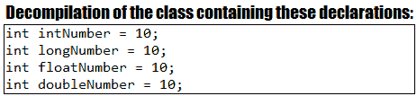

# 类型推断

本章包括 21 个涉及 jep286 或 Java **局部变量类型推断**（**LVTI**）的问题，也称为`var`类型。这些问题经过精心设计，以揭示最佳实践和使用`var`时所涉及的常见错误。到本章结束时，您将了解到将`var`推向生产所需的所有知识。

# 问题

使用以下问题来测试您的类型推断编程能力。我强烈建议您在使用解决方案和下载示例程序之前，先尝试一下每个问题：

78.  **简单`var`示例**：编写一个程序，举例说明类型推断（`var`）在代码可读性方面的正确用法。
79.  **将`var`与原始类型结合使用**：编写一个程序，举例说明将`var`与 Java 原始类型（`int`、`long`、`float`、`double`结合使用。
80.  **使用`var`和隐式类型转换来维持代码的可维护性**：编写一个程序，举例说明`var`和*隐式类型转换*如何维持代码的可维护性。
81.  **显式向下转换或更好地避免`var`**：编写一个程序，举例说明`var`和显式向下转换的组合，并解释为什么要避免`var`。
82.  **如果被调用的名称没有包含足够的人性化类型信息，请避免使用`var`**：请举例说明应避免使用`var`，因为它与被调用的*名称*的组合会导致人性化信息的丢失。
83.  **结合 LVTI 和面向接口编程技术**：编写一个程序，通过*面向接口编程*技术来举例说明`var`的用法。

84.  **结合 LVTI 和菱形运算符**：编写一个程序，举例说明`var`和*菱形运算符*的用法。
85.  **使用`var`分配数组**：编写一个将数组分配给`var`的程序。
86.  **在复合声明中使用 LVTI**：解释并举例说明 LVTI 在复合声明中的用法。
87.  **LVTI 和变量范围**：解释并举例说明为什么 LVTI 应该尽可能地缩小变量的范围。
88.  **LVTI 和三元运算符**：编写几个代码片段，举例说明 LVTI 和*三元运算符*组合的优点。
89.  **LVTI 和`for`循环**：写几个例子来举例说明 LVTI 在`for`循环中的用法。
90.  **LVTI 和流**：编写几个代码片段，举例说明 LVTI 和 Java 流的用法。
91.  **使用 LVTI 分解嵌套的/大的表达式链**：编写一个程序，举例说明如何使用 LVTI 分解嵌套的/大的表达式链。
92.  **LVTI 和方法返回和参数类型**：编写几个代码片段，举例说明 LVTI 和 Java 方法在返回和参数类型方面的用法。
93.  **LVTI 和匿名类**：编写几个代码片段，举例说明 LVTI 在匿名类中的用法。
94.  **LVTI 可以是`final`和有效的`final`**：写几个代码片段，举例说明 LVTI 如何用于`final`和有效的`final`变量。
95.  **LVTI 和 lambdas**：通过几个代码片段解释如何将 LVTI 与 lambda 表达式结合使用。
96.  **LVTI 和`null`初始值设定项、实例变量和`catch`块变量**：举例说明如何将 LVTI 与`null`*初始值设定项*、实例变量和`catch`块结合使用。
97.  **LVTI 和泛型类型`T`**：编写几个代码片段，举例说明如何将 LVTI 与泛型类型结合使用。
98.  **LVTI、通配符、协变和逆变**：编写几个代码片段，举例说明如何将 LVTI 与通配符、协变和逆变结合使用。

# 解决

以下各节介绍上述问题的解决方案。记住，通常没有一个正确的方法来解决一个特定的问题。另外，请记住，这里显示的解释仅包括解决问题所需的最有趣和最重要的细节。您可以[下载示例解决方案以查看更多详细信息并尝试程序](https://github.com/PacktPublishing/Java-Coding-Problems)。

# 78 简单 var 示例

从版本 10 开始，Java 附带了 jep286 或 javalvti，也称为`var`类型。

`var`标识符不是 Java *关键字*，而是*保留类型名*。

这是一个 100% 编译特性，在字节码、运行时或性能方面没有任何副作用。简而言之，LVTI 应用于局部变量，其工作方式如下：编译器检查右侧并推断出实类型（如果右侧是一个*初始值设定项*，则使用该类型）。

此功能可确保编译时安全。这意味着我们不能编译一个试图实现错误赋值的应用程序。如果编译器已经推断出`var`的具体/实际类型，我们只能赋值该类型的值。

LVTI 有很多好处；例如，它减少了代码的冗长，减少了冗余和*样板*代码。此外，LVTI 可以减少编写代码所花的时间，特别是在涉及大量声明的情况下，如下所示：

```java
// without var
Map<Boolean, List<Integer>> evenAndOddMap...

// with var
var evenAndOddMap = ...
```

一个有争议的优点是代码可读性。一些声音支持使用`var`会降低代码可读性，而另一些声音则支持相反的观点。根据用例的不同，它可能需要在可读性上进行权衡，但事实是，通常情况下，我们非常关注字段（实例变量）的有意义的名称，而忽略了局部变量的名称。例如，让我们考虑以下方法：

```java
public Object fetchTransferableData(String data)
    throws UnsupportedFlavorException, IOException {

  StringSelection ss = new StringSelection(data);
  DataFlavor[] df = ss.getTransferDataFlavors();
  Object obj = ss.getTransferData(df[0]);

  return obj;
}
```

这是一个简短的方法；它有一个有意义的名称和一个干净的实现。但是检查局部变量的名称。它们的名称大大减少（它们只是快捷方式），但这不是问题，因为左侧提供了足够的信息，我们可以很容易地理解每个局部变量的类型。现在，让我们使用 LVTI 编写以下代码：

```java
public Object fetchTransferableData(String data)
    throws UnsupportedFlavorException, IOException {

  var ss = new StringSelection(data);
  var df = ss.getTransferDataFlavors();
  var obj = ss.getTransferData(df[0]);

  return obj;
}
```

显然，代码的可读性降低了，因为现在很难推断出局部变量的类型。如下面的屏幕截图所示，编译器在推断正确的类型方面没有问题，但是对于人类来说，这要困难得多：


这个问题的解决方案是在依赖 LVTI 时为局部变量提供一个有意义的名称。例如，如果提供了局部变量的名称，代码可以恢复可读性，如下所示：

```java
public Object fetchTransferableData(String data)
    throws UnsupportedFlavorException, IOException {

  var stringSelection = new StringSelection(data);
  var dataFlavorsArray = stringSelection.getTransferDataFlavors();
  var obj = stringSelection.getTransferData(dataFlavorsArray[0]);

  return obj;
}
```

然而，可读性问题也是由这样一个事实引起的：通常，我们倾向于将类型视为主要信息，将变量名视为次要信息，而这应该是相反的。

让我们再看两个例子来执行上述语句。使用集合（例如，`List`）的方法如下：

```java
// Avoid
public List<Player> fetchPlayersByTournament(String tournament) {

  var t = tournamentRepository.findByName(tournament);
  var p = t.getPlayers();

  return p;
}

// Prefer
public List<Player> fetchPlayersByTournament(String tournament) {

  var tournamentName = tournamentRepository.findByName(tournament);
  var playerList = tournamentName.getPlayers();

  return playerList;
}
```

为局部变量提供有意义的名称并不意味着陷入*过度命名*技术。

例如，通过简单地重复类型名来避免命名变量：

```java
// Avoid
var fileCacheImageOutputStream​ 
  = new FileCacheImageOutputStream​(..., ...);

// Prefer
var outputStream​ = new FileCacheImageOutputStream​(..., ...);

// Or
var outputStreamOfFoo​ = new FileCacheImageOutputStream​(..., ...);
```

# 79 对原始类型使用`var`

将 LVTI 与原始类型（`int`、`long`、`float`和`double`一起使用的问题是，预期类型和推断类型可能不同。显然，这会导致代码中的混乱和意外行为。

这种情况下的犯罪方是`var`类型使用的*隐式类型转换*。

例如，让我们考虑以下两个依赖显式原始类型的声明：

```java
boolean valid = true; // this is of type boolean
char c = 'c';         // this is of type char
```

现在，让我们用 LVTI 替换显式原始类型：

```java
var valid = true; // inferred as boolean
var c = 'c';      // inferred as char
```

很好！到目前为止没有问题！现在，让我们看看另一组基于显式原始类型的声明：

```java
int intNumber = 10;       // this is of type int
long longNumber = 10;     // this is of type long
float floatNumber = 10;   // this is of type float, 10.0
double doubleNumber = 10; // this is of type double, 10.0
```

让我们按照第一个示例中的逻辑，用 LVTI 替换显式原始类型：

```java
// Avoid
var intNumber = 10;    // inferred as int
var longNumber = 10;   // inferred as int
var floatNumber = 10;  // inferred as int
var doubleNumber = 10; // inferred as int
```

根据以下屏幕截图，所有四个变量都被推断为整数：



这个问题的解决方案包括使用显式 Java *字面值*：

```java
// Prefer
var intNumber = 10;     // inferred as int
var longNumber = 10L;   // inferred as long
var floatNumber = 10F;  // inferred as float, 10.0
var doubleNumber = 10D; // inferred as double, 10.0
```

最后，让我们考虑一个带小数的数字的情况，如下所示：

```java
var floatNumber = 10.5; // inferred as double
```

变量名表明`10.5`是`float`，但实际上是推断为`double`。因此，即使是带小数的数字（尤其是带小数的数字），也建议使用*字面值*：

```java
var floatNumber = 10.5F; // inferred as float
```

# 80 使用`var`和隐式类型转换来维持代码的可维护性

在上一节中，“将`var`与原始类型结合使用”，我们看到将`var`与*隐式类型转换*结合使用会产生实际问题。但在某些情况下，这种组合可能是有利的，并维持代码的可维护性。

让我们考虑以下场景，我们需要编写一个方法，该方法位于名为`ShoppingAddicted`的外部 API 的两个现有方法之间（通过推断，这些方法可以是两个 web 服务、端点等）。有一种方法专门用于返回给定购物车的最佳价格。基本上，这种方法需要一堆产品，并查询不同的在线商店，以获取最佳价格。

结果价格返回为`int`。此方法的存根如下所示：

```java
public static int fetchBestPrice(String[] products) {

  float realprice = 399.99F; // code to query the prices in stores
  int price = (int) realprice;

  return price;
}
```

另一种方法将价格作为`int`接收并执行支付。如果支付成功，则返回`true`：

```java
public static boolean debitCard(int amount) {

  return true;
}
```

现在，通过对该代码进行编程，我们的方法将充当客户机，如下所示（客户可以决定购买哪些商品，我们的代码将为他们返回最佳价格并相应地借记卡）：

```java
// Avoid
public static boolean purchaseCart(long customerId) {

  int price = ShoppingAddicted.fetchBestPrice(new String[0]);
  boolean paid = ShoppingAddicted.debitCard(price);

  return paid;
}
```

但是过了一段时间，`ShoppingAddicted`API 的拥有者意识到他们通过将实际价格转换成`int`来赔钱（例如，实际价格是 399.99，但在`int`形式中，它是 399.0，这意味着损失 99 美分）。因此，他们决定放弃这种做法，将实际价格返回为`float`：

```java
public static float fetchBestPrice(String[] products) {

  float realprice = 399.99F; // code to query the prices in stores

  return realprice;
}
```

因为返回的价格是`float`，所以`debitCard()`也会更新：

```java
public static boolean debitCard(float amount) {

  return true;
}
```

但是，一旦我们升级到新版本的`ShoppingAddicted`API，代码将失败，并有可能从`float`到`int`异常的*有损转换*。这是正常的，因为我们的代码需要`int`。由于我们的代码不能很好地容忍这些修改，因此需要相应地修改代码。

然而，如果我们已经预见到这种情况，并且使用了`var`而不是`int`，那么由于*隐式类型转换*，代码将不会出现问题：

```java
// Prefer
public static boolean purchaseCart(long customerId) {

  var price = ShoppingAddicted.fetchBestPrice(new String[0]);
  var paid = ShoppingAddicted.debitCard(price);

  return paid;
}
```

# 81 显式向下或更好地避免`var`

在“将`var`与原始类型结合使用”一节中，我们讨论了将*字面值*与原始类型结合使用（`int`、`long`、`float`和`double`来避免*隐式类型转换*带来的问题。但并非所有 Java 原始类型都可以利用*字面值*。在这种情况下，最好的方法是避免使用`var`。但让我们看看为什么！

检查以下关于`byte`和`short`变量的声明：

```java
byte byteNumber = 25;     // this is of type byte
short shortNumber = 1463; // this is of type short
```

如果我们用`var`替换显式类型，那么推断的类型将是`int`：

```java
var byteNumber = 25;    // inferred as int
var shortNumber = 1463; // inferred as int
```

不幸的是，这两种基本类型没有可用的*字面值*。帮助编译器推断正确类型的唯一方法是依赖显式向下转换：

```java
var byteNumber = (byte) 25;     // inferred as byte
var shortNumber = (short) 1463; // inferred as short
```

虽然这段代码编译成功并按预期工作，但我们不能说使用`var`比使用显式类型带来了任何价值。因此，在这种情况下，最好避免`var`和显式的向下转型。

# 82 如果被调用的名称没有包含足够的类型信息，请避免使用`var`

好吧，`var`不是一颗银弹，这个问题将再次凸显这一点。以下代码片段可以使用显式类型或`var`编写，而不会丢失信息：

```java
// using explicit types
MemoryCacheImageInputStream is =
  new MemoryCacheImageInputStream(...);
JavaCompiler jc = ToolProvider.getSystemJavaCompiler();
StandardJavaFileManager fm = compiler.getStandardFileManager(...);
```

因此，将前面的代码片段迁移到`var`将产生以下代码（通过从右侧目视检查被调用的*名称*来选择变量名称）：

```java
// using var
var inputStream = new MemoryCacheImageInputStream(...);
var compiler = ToolProvider.getSystemJavaCompiler();
var fileManager = compiler.getStandardFileManager(...);
```

同样的情况也会发生在过度命名的边界上：

```java
// using var
var inputStreamOfCachedImages = new MemoryCacheImageInputStream(...);
var javaCompiler = ToolProvider.getSystemJavaCompiler();
var standardFileManager = compiler.getStandardFileManager(...);
```

因此，前面的代码在选择变量的名称和可读性时不会引起任何问题。所谓的*名称*包含了足够的信息，让人类对`var`感到舒服。

但让我们考虑以下代码片段：

```java
// Avoid
public File fetchBinContent() {
  return new File(...);
}

// called from another place
// notice the variable name, bin
var bin = fetchBinContent();
```

对于人类来说，如果不检查*名称*、`fetchBinContent()`的返回类型，就很难推断出*名称*返回的类型。根据经验，在这种情况下，解决方案应该避免`var`并依赖显式类型，因为右侧没有足够的信息让我们为变量选择合适的名称并获得可读性很高的代码：

```java
// called from another place
// now the left-hand side contains enough information
File bin = fetchBinContent();
```

因此，如果将`var`与被调用的*名称*组合使用导致清晰度损失，则最好避免使用`var`。忽略此语句可能会导致混淆，并会增加理解和/或扩展代码所需的时间。

考虑另一个基于`java.nio.channels.Selector`类的例子。此类公开了一个名为`open()`的`static`方法，该方法返回一个新打开的`Selector`。但是，如果我们在一个用`var`声明的变量中捕获这个返回值，我们很可能会认为这个方法可能返回一个`boolean`，表示打开当前选择器的成功。使用`var`而不考虑可能的清晰度损失会产生这些问题。像这样的一些问题和代码将成为一个真正的痛苦。

# 83LVTI 与编程相结合的接口技术

Java 最佳实践鼓励我们将代码绑定到抽象。换句话说，我们需要依赖于*面向接口编程*的技术。

这种技术非常适合于集合声明。例如，建议声明`ArrayList`如下：

```java
List<String> players = new ArrayList<>();
```

我们也应该避免这样的事情：

```java
ArrayList<String> players = new ArrayList<>();
```

通过遵循第一个示例，代码实例化了`ArrayList`类（或`HashSet`、`HashMap`等），但声明了一个`List`类型的变量（或`Set`、`Map`等）。由于`List`、`Set`、`Map`以及更多的都是接口（或契约），因此很容易用`List`（`Set`和`Map`的其他实现来替换实例化，而无需对代码进行后续修改。

不幸的是，LVTI 不能利用*面向接口编程*技术。换句话说，当我们使用`var`时，推断的类型是具体的实现，而不是合同。例如，将`List<String>`替换为`var`将导致推断类型`ArrayList<String>`：

```java
// inferred as ArrayList<String>
var playerList = new ArrayList<String>();
```

然而，有一些解释支持这种行为：

*   LVTI 在局部级别（局部变量）起作用，其中*面向接口编程*技术的的使用少于方法参数/返回类型或字段类型。
*   由于局部变量的作用域很小，因此切换到另一个实现所引起的修改也应该很小。切换实现对检测和修复代码的影响应该很小。
*   LVTI 将右侧的代码视为一个用于推断实际类型的*初始值设定项*。如果将来要修改这个*初始值设定项*，那么推断的类型可能不同，这将导致使用此变量的代码出现问题。

# 84 结合 LVTI 和菱形运算符

根据经验，如果右侧不存在推断预期类型所需的信息，则 LVTI 与*菱形*运算符结合可能会导致意外的推断类型。

在 JDK7 之前，即 Coin 项目，`List<String>`将声明如下：

```java
List<String> players = new ArrayList<String>();
```

基本上，前面的示例显式指定泛型类的实例化参数类型。从 JDK7 开始，Coin 项目引入了*菱形*操作符，可以推断泛型类实例化参数类型，如下所示：

```java
List<String> players = new ArrayList<>();
```

现在，如果我们从 LVTI 的角度来考虑这个例子，我们将得到以下结果：

```java
var playerList = new ArrayList<>();
```

但是现在推断出的类型是什么呢？好吧，我们有一个问题，因为推断的类型将是`ArrayList<Object>`，而不是`ArrayList<String>`。解释很明显：推断预期类型（`String`所需的信息不存在（注意，右侧没有提到`String`类型）。这指示 LVTI 推断出最广泛适用的类型，在本例中是`Object`。

但是如果`ArrayList<Object>`不是我们的意图，那么我们需要一个解决这个问题的方法。解决方案是提供推断预期类型所需的信息，如下所示：

```java
var playerList = new ArrayList<String>();
```

现在，推断的类型是`ArrayList<String>`。也可以间接推断类型。请参见以下示例：

```java
var playerStack = new ArrayDeque<String>();

// inferred as ArrayList<String>
var playerList = new ArrayList<>(playerStack);
```

也可以通过以下方式间接推断：

```java
Player p1 = new Player();
Player p2 = new Player();
var listOfPlayer = List.of(p1, p2); // inferred as List<Player>

// Don't do this!
var listOfPlayer = new ArrayList<>(); // inferred as ArrayList<Object>
listOfPlayer.add(p1);
listOfPlayer.add(p2);
```

# 85 将数组赋给`var`

根据经验，将数组分配给`var`不需要括号`[]`。通过相应的显式类型定义一个`int`数组可以如下所示：

```java
int[] numbers = new int[10];

// or, less preferred
int numbers[] = new int[10];
```

现在，尝试直觉地使用`var`代替`int`可能会导致以下尝试：

```java
var[] numberArray = new int[10];
var numberArray[] = new int[10];
```

不幸的是，这两种方法都无法编译。解决方案要求我们从左侧拆下支架：

```java
// Prefer
var numberArray = new int[10]; // inferred as array of int, int[]
numberArray[0] = 3;            // works
numberArray[0] = 3.2;          // doesn't work
numbers[0] = "3";              // doesn't work
```

通常的做法是在声明时初始化数组，如下所示：

```java
// explicit type work as expected
int[] numbers = {1, 2, 3};
```

但是，尝试使用`var`将不起作用（不会编译）：

```java
// Does not compile
var numberArray = {1, 2, 3};
var numberArray[] = {1, 2, 3};
var[] numberArray = {1, 2, 3};
```

此代码无法编译，因为右侧没有自己的类型。

# 86 在复合声明中使用 LVTI

复合声明允许我们声明一组相同类型的变量，而无需重复该类型。类型只指定一次，变量用逗号分隔：

```java
// using explicit type
String pending = "pending", processed = "processed", 
       deleted = "deleted";
```

将`String`替换为`var`将导致无法编译的代码：

```java
// Does not compile
var pending = "pending", processed = "processed", deleted = "deleted";
```

此问题的解决方案是将复合声明转换为每行一个声明：

```java
// using var, the inferred type is String
var pending = "pending";
var processed = "processed";
var deleted = "deleted";
```

因此，根据经验，LVTI 不能用在复合声明中。

# 87LVTI 和变量范围

干净的代码最佳实践包括为所有局部变量保留一个小范围。这是在 LVTI 存在之前就遵循的干净代码黄金规则之一。

此规则支持可读性和调试阶段。它可以加快查找错误和编写修复程序的过程。请考虑以下打破此规则的示例：

```java
// Avoid
...
var stack = new Stack<String>();
stack.push("John");
stack.push("Martin");
stack.push("Anghel");
stack.push("Christian");

// 50 lines of code that doesn't use stack

// John, Martin, Anghel, Christian
stack.forEach(...);
```

因此，前面的代码声明了一个具有四个名称的栈，包含 50 行不使用此栈的代码，并通过`forEach()`方法完成此栈的循环。此方法继承自`java.util.Vector`，将栈作为任意向量（`John`、`Martin`、`Anghel`、`Christian`循环。这是我们想要的遍历顺序。

但后来，我们决定从栈切换到`ArrayDeque`（原因无关紧要）。这次，`forEach()`方法将是由`ArrayDeque`类提供的方法。此方法的行为不同于`Vector.forEach()`，即循环将遍历**后进先出**（**LIFO**）遍历（`Christian`、`Anghel`、`Martin`、`John`之后的条目：

```java
// Avoid
...
var stack = new ArrayDeque<String>();
stack.push("John");
stack.push("Martin");
stack.push("Anghel");
stack.push("Christian");

// 50 lines of code that doesn't use stack

// Christian, Anghel, Martin, John
stack.forEach(...);
```

这不是我们的本意！我们切换到`ArrayDeque`是为了其他目的，而不是为了影响循环顺序。但是很难看出代码中有 bug，因为包含`forEach()`部分的代码部分不在我们完成修改的代码附近（代码行下面 50 行）。我们有责任提出一个解决方案，最大限度地提高快速修复这个 bug 的机会，避免一堆上下滚动来了解正在发生的事情。解决方案包括遵循我们之前调用的干净代码规则，并使用小范围的`stack`变量编写此代码：

```java
// Prefer
...
var stack = new Stack<String>();
stack.push("John");
stack.push("Martin");
stack.push("Anghel");
stack.push("Christian");

// John, Martin, Anghel, Christian
stack.forEach(...);

// 50 lines of code that doesn't use stack
```

现在，当我们从`Stack`切换到`ArrayQueue`时，我们应该更快地注意到错误并能够修复它。

# 88LVTI 与三元算子

只要写入正确，*三元*运算符允许我们在右侧使用不同类型的操作数。例如，以下代码将不会编译：

```java
// Does not compile
List evensOrOdds = containsEven ?
  List.of(10, 2, 12) : Set.of(13, 1, 11);

// Does not compile
Set evensOrOdds = containsEven ?
  List.of(10, 2, 12) : Set.of(13, 1, 11);
```

但是，可以通过使用正确/支持的显式类型重写代码来修复此代码：

```java
Collection evensOrOdds = containsEven ?
  List.of(10, 2, 12) : Set.of(13, 1, 11);

Object evensOrOdds = containsEven ?
  List.of(10, 2, 12) : Set.of(13, 1, 11);
```

对于以下代码片段，类似的尝试将失败：

```java
// Does not compile
int numberOrText = intOrString ? 2234 : "2234";

// Does not compile
String numberOrText = intOrString ? 2234 : "2234";
```

但是，可以这样修复：

```java
Serializable numberOrText = intOrString ? 2234 : "2234";

Object numberOrText = intOrString ? 2234 : "2234";
```

因此，为了在右侧有一个具有不同类型操作数的三元运算符，开发人员必须匹配支持两个条件分支的正确类型。或者，开发人员可以依赖 LVTI，如下所示（当然，这也适用于相同类型的操作数）：

```java
// inferred type, Collection<Integer>
var evensOrOddsCollection = containsEven ?
  List.of(10, 2, 12) : Set.of(13, 1, 11);

// inferred type, Serializable
var numberOrText = intOrString ? 2234 : "2234";
```

不要从这些例子中得出结论，`var`类型是在运行时推断出来的！不是的！

# 89LVTI 和`for`循环

使用显式类型声明简单的`for`循环是一项琐碎的任务，如下所示：

```java
// explicit type
for (int i = 0; i < 5; i++) {
  ...
}
```

或者，我们可以使用增强的`for`循环：

```java
List<Player> players = List.of(
  new Player(), new Player(), new Player());
for (Player player: players) {
  ...
}
```

从 JDK10 开始，我们可以将变量的显式类型`i`和`player`替换为`var`，如下所示：

```java
for (var i = 0; i < 5; i++) { // i is inferred of type int
  ...
}

for (var player: players) { // i is inferred of type Player
  ...
}
```

当循环数组、集合等的类型发生更改时，使用`var`可能会有所帮助。例如，通过使用`var`，可以在不指定显式类型的情况下循环以下`array`的两个版本：

```java
// a variable 'array' representing an int[]
int[] array = { 1, 2, 3 };

// or the same variable, 'array', but representing a String[]
String[] array = {
  "1", "2", "3"
};

// depending on how 'array' is defined 
// 'i' will be inferred as int or as String
for (var i: array) {
  System.out.println(i);
}
```

# 90LVTI 和流

让我们考虑以下`Stream<Integer>`流：

```java
// explicit type
Stream<Integer> numbers = Stream.of(1, 2, 3, 4, 5);
numbers.filter(t -> t % 2 == 0).forEach(System.out::println);
```

使用 LVTI 代替`Stream<Integer>`非常简单。只需将`Stream<Integer>`替换为`var`，如下所示：

```java
// using var, inferred as Stream<Integer>
var numberStream = Stream.of(1, 2, 3, 4, 5);
numberStream.filter(t -> t % 2 == 0).forEach(System.out::println);
```

下面是另一个例子：

```java
// explicit types
Stream<String> paths = Files.lines(Path.of("..."));
List<File> files = paths.map(p -> new File(p)).collect(toList());

// using var
// inferred as Stream<String>
var pathStream = Files.lines(Path.of(""));

// inferred as List<File>
var fileList = pathStream.map(p -> new File(p)).collect(toList());
```

看起来 Java10、LVTI、Java8 和`Stream`API 是一个很好的团队。

# 91 使用 LVTI 分解嵌套/大型表达式链

大型/嵌套表达式通常是一些代码片段，它们看起来非常令人印象深刻，令人生畏。它们通常被视为*智能*或*智慧*代码的片段。关于这是好是坏是有争议的，但最有可能的是，这种平衡倾向于有利于那些声称应该避免这种代码的人。例如，检查以下表达式：

```java
List<Integer> ints = List.of(1, 1, 2, 3, 4, 4, 6, 2, 1, 5, 4, 5);

// Avoid
int result = ints.stream()
  .collect(Collectors.partitioningBy(i -> i % 2 == 0))
  .values()
  .stream()
  .max(Comparator.comparing(List::size))
  .orElse(Collections.emptyList())
  .stream()
  .mapToInt(Integer::intValue)
  .sum();
```

这样的表达式可以是有意编写的，也可以表示一个增量过程的最终结果，该过程在时间上丰富了一个最初很小的表达式。然而，当这些表达式开始成为可读性的空白时，它们必须通过局部变量被分解成碎片。但这并不有趣，可以被认为是我们想要避免的令人筋疲力尽的工作：

```java
List<Integer> ints = List.of(1, 1, 2, 3, 4, 4, 6, 2, 1, 5, 4, 5);

// Prefer
Collection<List<Integer>> evenAndOdd = ints.stream()
  .collect(Collectors.partitioningBy(i -> i % 2 == 0))
  .values();

List<Integer> evenOrOdd = evenAndOdd.stream()
  .max(Comparator.comparing(List::size))
  .orElse(Collections.emptyList());

int sumEvenOrOdd = evenOrOdd.stream()
  .mapToInt(Integer::intValue)
  .sum();
```

检查前面代码中局部变量的类型。我们有`Collection<List<Integer>>`、`List<Integer>`和`int`。很明显，这些显式类型需要一些时间来获取和写入。这可能是避免将此表达式拆分为碎片的一个很好的理由。然而，如果我们希望采用局部变量的样式，那么使用`var`类型而不是显式类型的琐碎性是很诱人的，因为它节省了通常用于获取显式类型的时间：

```java
var intList = List.of(1, 1, 2, 3, 4, 4, 6, 2, 1, 5, 4, 5);

// Prefer
var evenAndOdd = intList.stream()
  .collect(Collectors.partitioningBy(i -> i % 2 == 0))
  .values();

var evenOrOdd = evenAndOdd.stream()
  .max(Comparator.comparing(List::size))
  .orElse(Collections.emptyList());

var sumEvenOrOdd = evenOrOdd.stream()
  .mapToInt(Integer::intValue)
  .sum();
```

令人惊叹的！现在，编译器的任务是推断这些局部变量的类型。我们只选择打破表达的点，用`var`来划分。

# 92LVTI 和方法返回和参数类型

根据经验，LVTI 不能用作`return`方法类型或参数方法类型；相反，`var`类型的变量可以作为方法参数传递或存储`return`方法。让我们通过几个例子来迭代这些语句：

*   LVTI 不能用作以下代码不编译的方法返回类型：

```java
// Does not compile
public var fetchReport(Player player, Date timestamp) {

  return new Report();
}
```

*   LVTI 不能用作方法参数类型以下代码不编译：

```java
public Report fetchReport(var player, var timestamp) {

  return new Report();
}
```

*   `var`类型的变量可以作为方法参数传递，也可以存储一个返回方法。下面的代码编译成功并且可以工作：

```java
public Report checkPlayer() {

  var player = new Player();
  var timestamp = new Date();
  var report = fetchReport(player, timestamp);

  return report;
}

public Report fetchReport(Player player, Date timestamp) {

  return new Report();
}
```

# 93LVTI 和匿名类

LVTI 可以用于匿名类。下面是一个匿名类的示例，该类对`weighter`变量使用显式类型：

```java
public interface Weighter {
  int getWeight(Player player);
}

Weighter weighter = new Weighter() {
  @Override
  public int getWeight(Player player) {
    return ...;
  }
};

Player player = ...;
int weight = weighter.getWeight(player);
```

现在，看看如果我们使用 LVTI 会发生什么：

```java
var weighter = new Weighter() {
  @Override
  public int getWeight(Player player) {
    return ...;
  }
};
```

# 94LVTI 可以是最终的，也可以是有效的最终的

作为一个快速提醒，*从 JavaSE8 开始，一个局部类可以访问封闭块的局部变量和参数，这些变量和参数是`final`或实际上是`final`。一个变量或参数，其值在初始化后从未改变，实际上是最终的。*

下面的代码片段表示一个*有效最终*变量（尝试重新分配`ratio`变量将导致错误，这意味着该变量是*有效最终*）和两个`final`变量（尝试重新分配`limit`和`bmi`变量将导致错误）的用例在一个错误中，这意味着这些变量是`final`：

```java
public interface Weighter {
  float getMarginOfError();
}

float ratio = fetchRatio(); // this is effectively final

var weighter = new Weighter() {
  @Override
  public float getMarginOfError() {
    return ratio * ...;
  }
};

ratio = fetchRatio(); // this reassignment will cause error

public float fetchRatio() {

  final float limit = new Random().nextFloat(); // this is final
  final float bmi = 0.00023f;                   // this is final

  limit = 0.002f; // this reassignment will cause error
  bmi = 0.25f;    // this reassignment will cause error

  return limit * bmi / 100.12f;
}
```

现在，让我们用`var`替换显式类型。编译器将推断出这些变量（`ratio`、`limit`和`bmi`的正确类型并保持它们的状态-`ratio`将是*有效最终*，而`limit`和`bmi`是`final`。尝试重新分配其中任何一个将导致特定错误：

```java
var ratio = fetchRatio(); // this is effectively final 
var weighter = new Weighter() {
  @Override
  public float getMarginOfError() {
    return ratio * ...;
  }
};

ratio = fetchRatio(); // this reassignment will cause error 
public float fetchRatio() {

  final var limit = new Random().nextFloat(); // this is final
 final var bmi = 0.00023f; // this is final
 limit = 0.002f; // this reassignment will cause error
 bmi = 0.25f; // this reassignment will cause error
  return limit * bmi / 100.12f;
}
```

# 95LVTI 和 lambdas

使用 LVTI 和 lambdas 的问题是无法推断具体类型。不允许使用 lambda 和方法引用*初始值设定项*。此语句是`var`限制的一部分；因此，lambda 表达式和方法引用需要显式的目标类型。

例如，以下代码片段将不会编译：

```java
// Does not compile
// lambda expression needs an explicit target-type
var incrementX = x -> x + 1;

// method reference needs an explicit target-type
var exceptionIAE = IllegalArgumentException::new;
```

由于`var`不能使用，所以这两段代码需要编写如下：

```java
Function<Integer, Integer> incrementX = x -> x + 1;
Supplier<IllegalArgumentException> exceptionIAE 
  = IllegalArgumentException::new;
```

但是在 lambdas 的上下文中，Java11 允许我们在 lambda 参数中使用`var`。例如，下面的代码在 Java11 中工作（更多详细信息可以在[《JEP323：Lambda 参数的局部变量语法》](https://openjdk.java.net/jeps/323)中找到：

```java
@FunctionalInterface
public interface Square {
  int calculate(int x);
}

Square square = (var x) -> x * x;
```

但是，请记住，以下操作不起作用：

```java
var square = (var x) -> x * x; // cannot infer
```

# 96LVTI 和 null 初始值设定项、实例变量和 catch 块变量

LVTI 与`null`*初始值设定项*、实例变量和`catch`块变量有什么共同点？嗯，LVTI 不能和它们一起使用。以下尝试将失败：

*   LVTI 不能与`null`*初始值设定项*一起使用：

```java
// result in an error of type: variable initializer is 'null'
var message = null;

// result in: cannot use 'var' on variable without initializer
var message;
```

*   LVTI 不能与实例变量（字段）一起使用：

```java
public class Player {

  private var age; // error: 'var' is not allowed here
  private var name; // error: 'var' is not allowed here
  ...
}
```

*   LVTI 不能用于`catch`块变量：

```java
try {
  TimeUnit.NANOSECONDS.sleep(1000);
} catch (var ex) {  ... }
```

# 资源尝试使用

另一方面，`var`类型非常适合*资源尝试使用*，如下例所示：

```java
// explicit type
try (PrintWriter writer = new PrintWriter(new File("welcome.txt"))) {
  writer.println("Welcome message");
}
```

```java
// using var
try (var writer = new PrintWriter(new File("welcome.txt"))) {
  writer.println("Welcome message");
}
```

# 97LVTI 和泛型类型，`T`

为了理解 LVTI 如何与泛型类型相结合，让我们从一个示例开始。以下方法是泛型类型`T`的经典用例：

```java
public static <T extends Number> T add(T t) {
  T temp = t;
  ...
  return temp;
}
```

在这种情况下，我们可以将`T`替换为`var`，代码将正常工作：

```java
public static <T extends Number> T add(T t) {
  var temp = t;
  ...
  return temp;
}
```

因此，具有泛型类型的局部变量可以利用 LVTI。让我们看看其他一些示例，首先使用泛型类型`T`：

```java
public <T extends Number> T add(T t) {

  List<T> numberList = new ArrayList<T>();
  numberList.add(t);
  numberList.add((T) Integer.valueOf(3));
  numberList.add((T) Double.valueOf(3.9));

  // error: incompatible types: String cannot be converted to T
  // numbers.add("5");

  return numberList.get(0);
}
```

现在，我们将`List<T>`替换为`var`：

```java
public <T extends Number> T add(T t) {

  var numberList = new ArrayList<T>();
  numberList.add(t);
  numberList.add((T) Integer.valueOf(3));
  numberList.add((T) Double.valueOf(3.9));

  // error: incompatible types: String cannot be converted to T
  // numbers.add("5");

  return numberList.get(0);
}
```

注意并仔细检查`ArrayList`实例化是否存在`T`。不要这样做（这将被推断为`ArrayList<Object>`，并将忽略泛型类型`T`后面的实际类型）：

```java
var numberList = new ArrayList<>();
```

# 98LVTI、通配符、协变和逆变

用 LVTI 替换通配符、协变和逆变是一项微妙的工作，应该在充分意识到后果的情况下完成。

# LVTI 和通配符

首先，我们来讨论 LVTI 和通配符（`?`。通常的做法是将通配符与`Class`关联，并编写如下内容：

```java
// explicit type
Class<?> clazz = Long.class;
```

在这种情况下，使用`var`代替`Class<?>`没有问题。根据右边的类型，编译器将推断出正确的类型。在本例中，编译器将推断出`Class<Long>`。

但是请注意，用 LVTI 替换通配符应该小心，并且您应该意识到其后果（或副作用）。让我们看一个例子，用`var`替换通配符是一个错误的选择。考虑以下代码：

```java
Collection<?> stuff = new ArrayList<>();
stuff.add("hello"); // compile time error
stuff.add("world"); // compile time error
```

由于类型不兼容，此代码无法编译。一种非常糟糕的方法是用`var`替换通配符来修复此代码，如下所示：

```java
var stuff = new ArrayList<>();
strings.add("hello"); // no error
strings.add("world"); // no error
```

通过使用`var`，错误将消失，但这不是我们在编写前面的代码（存在类型不兼容错误的代码）时想到的。所以，根据经验，不要仅仅因为一些恼人的错误会神奇地消失，就用`var`代替`Foo<?>`！试着思考一下预期的任务是什么，并相应地采取行动。例如，可能在前面的代码片段中，我们试图定义`ArrayList<String>`，但由于错误，最终得到了`Collection<?>`。

# LVTI 和协变/逆变

用 LVTI 替换协变（`Foo<? extends T>`）或逆变（`Foo<? super T>`）是一种危险的方法，应该避免。

请查看以下代码片段：

```java
// explicit types
Class<? extends Number> intNumber = Integer.class;
Class<? super FilterReader> fileReader = Reader.class;
```

在协变中，我们有一个上界，由`Number`类表示，而在逆变中，我们有一个下界，由`FilterReader`类表示。有了这些边界（或约束），以下代码将触发特定的编译时错误：

```java
// Does not compile
// error: Class<Reader> cannot be converted 
//        to Class<? extends Number>
Class<? extends Number> intNumber = Reader.class;

// error: Class<Integer> cannot be converted 
//        to Class<? super FilterReader>
Class<? super FilterReader> fileReader = Integer.class;
```

现在，让我们用`var`代替前面的协变和逆变：

```java
// using var
var intNumber = Integer.class;
var fileReader = Reader.class;
```

此代码不会导致任何问题。现在，我们可以将任何类赋给这些变量，这样我们的边界/约束就消失了。这不是我们打算做的：

```java
// this will compile just fine
var intNumber = Reader.class;
var fileReader = Integer.class;
```

所以，用`var`代替协变和逆变是个错误的选择！

# 摘要

这是本章的最后一个问题。请看[《JEP323：Lambda 参数的局部变量语法》](https://openjdk.java.net/jeps/323)、[《JEP 301：增强枚举》](http://openjdk.java.net/jeps/301)了解更多信息。只要您熟悉本章介绍的问题，采用这些特性应该是相当顺利的。

从本章下载应用程序以查看结果和其他详细信息。