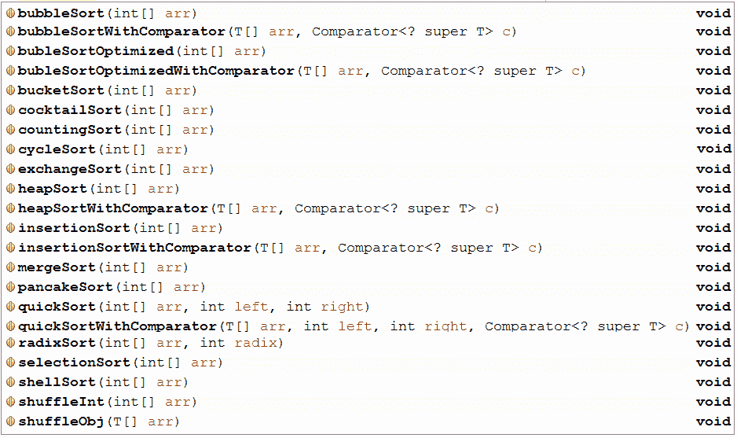
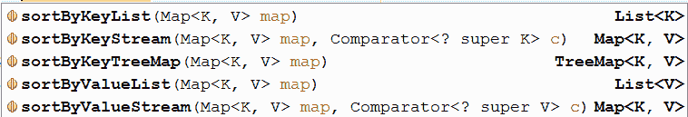
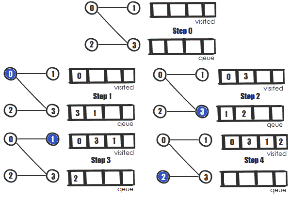
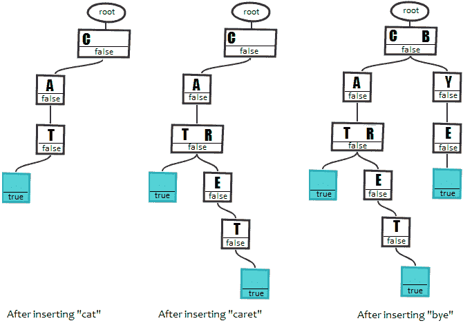
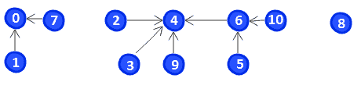
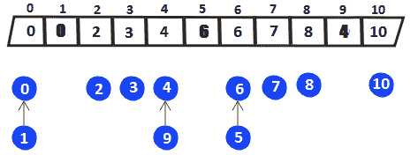
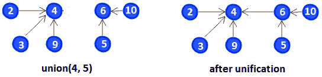

# 数组，集合和数据结构

本章包括 30 个涉及数组，集合和多个数据结构的问题。 目的是为在各种应用中遇到的问题提供解决方案，包括排序，查找，比较，订购，逆转，填充，合并，复制和更换。 提供的解决方案在 Java 8-12 中实现，它们也可以用作解决其他相关问题的基础。 在本章末尾，您将拥有稳固的知识广度，可以在解决涉及阵列，集合和数据结构的各种问题方面证明是有用的。

# 问题

使用以下问题根据数组，集合和数据结构测试您的编程实力。 我强烈建议您在转向解决方案并下载示例程序之前尝试举出每个问题：

99.  **对数组进行排序**：写几个程序，示出了数组的不同排序算法。 另外，写一个用于换阵列的程序。
100.  **在阵列**中找到一个元素：写几个程序，该节目例证了如何在给定数组中找到给定元素（基本和对象）的程序。 找到索引和/或只是检查该值是否在数组中。
101.  **检查两个数组是否相等或不匹配**：写一个检查两个给定数组是否等于或是否存在不匹配的程序。
102.  **将两个阵列进行了比较**：写入一个比较给定数组的文出的程序。

103.  **从数组中创建流**：写入从给定阵列创建流的程序。
104.  **阵列的最小，最大值和平均值**：写一个计算给定阵列的最大，最小值和平均值的程序。
105.  **反转数组**：写一个反转给定阵列的程序。
106.  **填充和设置阵列**：写几个用于填充数组的示例，并基于生成器函数设置所有元素以计算每个元素。
107.  **下一个更大的元素**（ **nge** ）：写一个程序，返回阵列的每个元素的 nge。
108.  **更改数组大小**：写一个程序，通过增加其大小将元素添加到数组。 此外，编写一个程序，该程序增加了带给定长度的数组的大小。
109.  **创建一个不可修改/不变集合**：写几个创建未经修改和不可变集的示例。
110.  **映射默认值**：写一个从`Map`或默认值的值。
111.  **计算是否在** `Map`中缺席/存在：写一个计算缺少密钥的值的程序或当前密钥的新值。
112.  **从 a** `Map`删除：写一个通过给定键从`Map`删除的程序。
113.  **替换 a** `Map`的条目：写一个替换从`Map`的给定条目的程序。
114.  **比较两个地图**：写一个比较两个地图的程序。
115.  **合并两个地图**：写一个合并两个给定映射的程序。
116.  **复制** `HashMap`：写一个执行`HashMap`的浅层和深副本的程序。
117.  **排序 A** `Map`：写一个对`Map`进行排序的程序。
118.  **删除匹配谓词**的集合的所有元素：写一个删除与给定谓词匹配的集合的所有元素的程序。
119.  **将集合转换为阵列**：写一个将集合转换为数组的程序。
120.  **通过** `List`过滤集合：写几个通过`List`过滤集合的解决方案。 揭示这样做的最佳方式。
121.  **替换** `List`的元素：编写一个程序，该程序替换`List`的每个元素的结果，结果将给定的运算符应用于它。
122.  **线程安全集合，堆栈和队列**：写几个程序，示例使用 Java 线程安全集合的使用情况。
123.  **广度优先搜索**（ **BFS** ）：写入实现 BFS 算法的程序。
124.  **trie** ：写一个实现 TRIE 数据结构的程序。
125.  **tuple** ：写一个实现元组数据结构的程序。
126.  **联盟找到**：写一个实现联盟找到算法的程序。
127.  **fenwick 树或二进制索引树**：写一个实现 fenwick 树算法的程序。
128.  **Bloom Filter** ：写入实现绽放过滤算法的程序。

# 解决方案

以下部分描述了前一个问题的解决方案。 请记住，几乎不是一个正确的方法来解决特定问题。 此外，请记住，这里所示的解释仅包括解决问题所需的最有趣和重要的细节。 下载示例解决方案以查看其他详细信息，并在 [https://github.com/packtpublishing/java-coding-problems](https://github.com/PacktPublishing/Java-Coding-Problems) 上进行实验。

# 99.排序数组

排序数组是在很多域/应用程序中遇到的常见任务。 Java 提供了一个内置解决方案，用于使用比较器对原语和对象进行排序。 该解决方案非常好，是在大多数情况下进入的优选方法。 让我们来看看下一节中的不同解决方案。

# JDK 内置解决方案

内置解决方案名为`sort()`，在`java.util.Arrays`类（15+口味）中有许多不同的味道。

在`sort()`方法后面，存在 Quicksort 类型的表现分类算法，名为 Dual-Pivot Quicksort。

让我们假设我们需要通过自然顺序对整数进行排序（原始`int`）。 为此，我们可以依赖`Arrays.sort(int[] a)`，如下例所示：

```
int[] integers = new int[]{...};
Arrays.sort(integers);
```

有时，我们需要对对象的数组进行排序。 让我们假设我们有一个类`Melon`：

```
public class Melon {

  private final String type;
  private final int weight;

  public Melon(String type, int weight) {
    this.type = type;
    this.weight = weight;
  }

  // getters omitted for brevity
}
```

可以通过正确的`Comparator`通过升重来对`Melon`阵列进行排序：

```
Melon[] melons = new Melon[] { ... };

Arrays.sort(melons, new Comparator<Melon>() {
  @Override
  public int compare(Melon melon1, Melon melon2) {
    return Integer.compare(melon1.getWeight(), melon2.getWeight());
  }
});
```

可以通过 Lambda 表达式重写前面的代码来获得相同的结果：

```
Arrays.sort(melons, (Melon melon1, Melon melon2) 
  -> Integer.compare(melon1.getWeight(), melon2.getWeight()));
```

此外，阵列提供了一种对并行分类元件的方法`parallelSort()`。 场景后面使用的排序算法是基于`ForkJoinPool`的并行排序合并，该分类合并，将数组分解为本身排序的子阵列，然后合并。 这是一个例子：

```
Arrays.parallelSort(melons, new Comparator<Melon>() {
  @Override
  public int compare(Melon melon1, Melon melon2) {
    return Integer.compare(melon1.getWeight(), melon2.getWeight());
  }
});
```

或者，通过 Lambda 表达式，我们有以下示例：

```
Arrays.parallelSort(melons, (Melon melon1, Melon melon2) 
  -> Integer.compare(melon1.getWeight(), melon2.getWeight()));
```

前面的示例按升序对数组进行排序，但有时，我们需要按降序排序。 当我们对`Object`的数组进行排序并依赖 A `Comparator`时，我们可以简单地将`Integer.compare()`返回的结果乘以-1：

```
Arrays.sort(melons, new Comparator<Melon>() {
  @Override
  public int compare(Melon melon1, Melon melon2) {
    return (-1) * Integer.compare(melon1.getWeight(), 
      melon2.getWeight());
  }
});
```

或者，我们可以简单地在`compare()`方法中切换参数。

在盒装原始类型阵列的情况下，解决方案可以依赖于`Collections.reverse()`方法，如下例所示：

```
Integer[] integers = new Integer[] {3, 1, 5};

// 1, 3, 5
Arrays.sort(integers);

// 5, 3, 1
Arrays.sort(integers, Collections.reverseOrder());
```

不幸的是，没有内置解决方案，用于按降序排序基元数组。 最常见的是，如果我们仍然希望依赖`Arrays.sort()`，则解决此问题的解决方案包括在按升序排序后反转数组（`O(n)`）：

```
// sort ascending
Arrays.sort(integers);

// reverse array to obtain it in descending order
for (int leftHead = 0, rightHead = integers.length - 1;
       leftHead < rightHead; leftHead++, rightHead--) {

  int elem = integers[leftHead];
  integers[leftHead] = integers[rightHead];
  integers[rightHead] = elem;
}
```

另一种解决方案可以依赖 Java 8 功能样式和拳击（请注意拳击是一个非常耗时的操作）：

```
int[] descIntegers = Arrays.stream(integers)
  .boxed() //or .mapToObj(i -> i)
  .sorted((i1, i2) -> Integer.compare(i2, i1))
  .mapToInt(Integer::intValue)
  .toArray();
```

# 其他排序算法

嗯，那里有很多其他分类算法。 他们每个人都有利弊，并且在它们之间选择的最佳方式是基准测试所特有的情况。

让我们检查一些这些，如下一节突出显示，并以相当慢的算法开始。

# 泡沫排序

泡沫排序是一种简单的算法，基本上冒出阵列的元素。 这意味着它多次遍历阵列，如果它们处于错误的顺序，则交换相邻元素，如下图所示：


时间复杂性案例如下：最佳情况`O(n)`，平均案例`O(n<sup>2</sup>)`，最坏情况`O(n<sup>2</sup>)`

空间复杂性案例如下：最坏情况`O(1)`

实施泡沫排序的实用方法如下：

```
public static void bubbleSort(int[] arr) {

  int n = arr.length;

  for (int i = 0; i < n - 1; i++) {
    for (int j = 0; j < n - i - 1; j++) {

      if (arr[j] > arr[j + 1]) {
        int temp = arr[j];
        arr[j] = arr[j + 1];
        arr[j + 1] = temp;
      }
    }
  }
}
```

还有一个依赖于`while`循环的优化版本。 您可以在名称`bubbleSortOptimized()`下捆绑到本书的代码中找到它。

作为时间执行的性能比较，对于 100,000 个整数的随机数组，优化版本将更快地工作为 2 秒。

前面的实现适用于对原语阵列进行排序，但是，对于对`Object`的数组进行排序，我们需要将`Comparator`带入代码，如下所示：

```
public static <T> void bubbleSortWithComparator(
    T arr[], Comparator<? super T> c) {

  int n = arr.length;

  for (int i = 0; i < n - 1; i++) {
    for (int j = 0; j < n - i - 1; j++) {

      if (c.compare(arr[j], arr[j + 1]) > 0) {
        T temp = arr[j];
        arr[j] = arr[j + 1];
        arr[j + 1] = temp;
      }
    }
  }
}
```

从以前记住`Melon`课程？ 嗯，我们可以通过实现`Comparator`界面来为其编写`Comparator`：

```
public class MelonComparator implements Comparator<Melon> {

  @Override
  public int compare(Melon o1, Melon o2) {
    return o1.getType().compareTo(o2.getType());
  }
}
```

或者，在 Java 8 功能风格中，我们有以下内容：

```
// Ascending
Comparator<Melon> byType = Comparator.comparing(Melon::getType);

// Descending
Comparator<Melon> byType 
  = Comparator.comparing(Melon::getType).reversed();
```

在命名为`ArraySorts`的实用程序类中，具有`Melon`，前`Comparator`和`bubbleSortWithComparator()`方法，我们可以在以下内容中编写某些内容：

```
Melon[] melons = {...};
ArraySorts.bubbleSortWithComparator(melons, byType);
```

对于简洁性，跳过了带有`Comparator`的泡沫分类优化版本，但它可在捆绑到书中的代码中使用。

当阵列分类时，泡沫排序快速。 此外，它适合分类*兔子*（靠近阵列的开始的大元件）和*乌龟*（靠近阵列末端的小元素）。 但总的来说，这是一种慢速算法。

# 插入排序

插入排序算法依赖于简单的流量。 它从第二个元素开始，并将其与元素进行比较。 如果元素之前的元素大于当前元素，则算法互换元素。 该过程继续，直到元素之前小于当前元素。

在这种情况下，算法将传递到数组中的下一个元素并重复流，如下图所示：


时间复杂性案例如下：最佳情况`O(n)`，平均案例`O(n<sup>2</sup>)`，最坏的情况`O(n<sup>2</sup>)`

空间复杂性案例如下：最坏情况`O(1)`

基于此流程，原始类型的实现将如下：

```
public static void insertionSort(int arr[]) {

  int n = arr.length;

  for (int i = 1; i < n; ++i) {

    int key = arr[i];
    int j = i - 1;

    while (j >= 0 && arr[j] > key) {
      arr[j + 1] = arr[j];
      j = j - 1;
    }

    arr[j + 1] = key;
  }
}
```

为了比较`Melon`数组，我们需要将`Comparator`带入实施如下：

```
public static <T> void insertionSortWithComparator(
  T arr[], Comparator<? super T> c) {

  int n = arr.length;

  for (int i = 1; i < n; ++i) {

    T key = arr[i];
    int j = i - 1;

    while (j >= 0 && c.compare(arr[j], key) > 0) {
      arr[j + 1] = arr[j];
      j = j - 1;
    }

    arr[j + 1] = key;
  }
}
```

在这里，我们有一个`Comparator`，通过使用`thenComparing()`方法，通过用 Java 8 功能样式写入的类型和重量来对瓜进行排序：

```
Comparator<Melon> byType = Comparator.comparing(Melon::getType)
  .thenComparing(Melon::getWeight);
```

在命名为`ArraySorts`的实用程序类中具有`Melon`，前`Comparator`和`insertionSortWithComparator()`方法，我们可以写下来：

```
Melon[] melons = {...};
ArraySorts.insertionSortWithComparator(melons, byType);
```

这可以快速用于小而大多数分类阵列。 此外，它在将新元素添加到数组时执行良好。 由于单个元素移动，因此它也是非常内存的。

# 计数排序

计数排序流通过计算阵列中的最小值和最大元素来启动。 基于计算的最小值和最大值，算法定义了一种新的阵列，该数组将用于通过使用*元素*作为*索引*来计算未蚀刻元素。 此外，这种新阵列以这样的方式修改，即每个*索引*索引** 存储先前计数的总和。 最后，从这个新阵列获得了排序的阵列。

时间复杂性案例如下：最佳情况`O(n + k)`，平均案例`O(n + k)`，最坏的情况`O(n + k)`

空间复杂性案例如下：最坏情况`O(k)`

`k` is the number of possible values in the range.
`n` is the number of elements to be sorted.

让我们考虑一个快速的例子。 初始阵列包含以下元素`arr`： **4** ， **2 **， **6 **， **2 **， **6 **6** ]， **8** ， **5** ：**************


最小元素为 **2** ，最大元素为 **8** 。 新的阵列`counts`将具有等于最大值的大小，最小值最小值+ 1 = 8 - 2 + 1 = 7。

计数每个元素将导致以下数组（`counts[arr[i] - min]++`）：

```
counts[2] = 1 (4); counts[0] = 2 (2); counts[4] = 2 (6);
counts[6] = 1 (8); counts[3] = 1 (5);
```

现在，我们必须循环此数组并使用它来重建排序数组，如下所示：

```
public static void countingSort(int[] arr) {

  int min = arr[0];
  int max = arr[0];

  for (int i = 1; i < arr.length; i++) {
    if (arr[i] < min) {
      min = arr[i];
    } else if (arr[i] > max) {
      max = arr[i];
    }
  }

  int[] counts = new int[max - min + 1];

  for (int i = 0; i < arr.length; i++) {
    counts[arr[i] - min]++;
  }

  int sortedIndex = 0;

  for (int i = 0; i < counts.length; i++) {
    while (counts[i] > 0) {
      arr[sortedIndex++] = i + min;
      counts[i]--;
    }
  }
}
```

这是一个非常快速的算法。

# 堆积

堆排序是一种依赖于二进制堆（完整二叉树）的算法。

时间复杂性案例如下：最佳情况`O(n log n)`，平均案例`O(n log n)`，最坏的情况`O(n log n)`

空间复杂性案例如下：最坏情况`O(1)`

按升序排序元素可以通过 *max 堆*完成（父节点始终大于或等于，子节点），并且通过 *min 堆*（ 父节点始终小于或等于子节点）。

在第一步，算法使用提供的数组来构建该堆，并将其转换为 *MAX 堆*（堆由另一个数组表示）。 由于这是一个 *max 堆*，最大元素是堆的根。 在下一步，root 与堆的最后一个元素交换，堆大小减少 1（从堆中删除最后一个节点）。 堆顶部的元素以排序的顺序出现。 最后一步由*组成 *heapify* （以自上而下方式构建堆的递归过程），以及堆的根源（重建 *max 堆*）。 重复这三个步骤，直到堆大小大于 1：*


例如，让我们从前图 - **4** ， **5** ，**， **7 **， **1 **1 **1 **1 **]：****************

1.  因此，在第一步，我们构建堆： **4** ， **5** ， **2** ， **7** ，**， **1** ]。**
2.  我们构建 *max 堆*： **7** ， **5** ， **2 **2 **， **4** ， **1 **1 [htg11 **7** 7** 7** ，** 7 **7 **，**， **5 **5 **5 **7 **7 htg23]）。****************
3.  接下来，我们使用最后一个元素（ **1** ）交换根（ **7** ）并删除 **7** 。 结果： **1** ， **5** ， **2** ， **4** ， **7** 。
4.  此外，我们可以再次构建 *MAX 堆*： **5** ， **4** ， **2 **， **1 **（我们交换 **5** 用 **1** 和 **1 **4 **4** ）。************
5.  使用最后一个元素（ **1** ）和删除 **5** 换 root（ **5** ）。 结果： **1** ， **4** ， **2** ， **5 **， **7 **7** 。******
6.  接下来，我们再次构建 *max 堆*： **4** ， **1** ， **2** （我们交换 **1** htg10] 4 ）。
7.  使用最后一个元素（ **2** ）交换根（ **4** ）并删除 **4** 。 结果： **2** ， **1** 。
8.  这是一个 *max 堆*，因此使用最后一个元素（ **1** ）交换根（ **2** ）并删除 **2** ： **1** ， **2** ， **4** ， **5 **， **7** 。****
9.  完毕！ 堆中有一个元素（ **1** ）。

在代码行中，前面的示例可以概括如下：

```
public static void heapSort(int[] arr) {
  int n = arr.length;

  buildHeap(arr, n);

  while (n > 1) {
    swap(arr, 0, n - 1);
    n--;
    heapify(arr, n, 0);
  }
}

private static void buildHeap(int[] arr, int n) {
  for (int i = arr.length / 2; i >= 0; i--) {
    heapify(arr, n, i);
  }
}

private static void heapify(int[] arr, int n, int i) {
  int left = i * 2 + 1;
  int right = i * 2 + 2;
  int greater;

  if (left < n && arr[left] > arr[i]) {
    greater = left;
  } else {
    greater = i;
  }

  if (right < n && arr[right] > arr[greater]) {
    greater = right;
  }

  if (greater != i) {
    swap(arr, i, greater);
    heapify(arr, n, greater);
  }
}

private static void swap(int[] arr, int x, int y) {
  int temp = arr[x];
  arr[x] = arr[y];
  arr[y] = temp;
}
```

如果我们想比较对象，那么我们必须将`Comparator`带入实施情况。 此解决方案可在名称`heapSortWithComparator()`下捆绑到本书的代码中。

在这里，它是用 Java 8 功能样式编写的`Comparator`，它使用`thenComparing()`和`reversed()`方法以按类型和重量按降序对瓜进行排序：

```
Comparator<Melon> byType = Comparator.comparing(Melon::getType)
  .thenComparing(Melon::getWeight).reversed();                                                                                                                                                                                                                                                                                                                        
```

在命名为`ArraySorts`的实用程序类中具有`Melon`，前`Comparator`和`heapSortWithComparator()`方法，我们可以写下来：

```
Melon[] melons = {...};
ArraySorts.heapSortWithComparator(melons, byType);
```

Heap sort is pretty fast, but is not stable. For example, sorting an array that is already sorted may leave it in a different order.

我们将停止我们关于排序阵列的论文，但是，在捆绑到本书的代码中，还有一些更多的排序算法可用：

****

有许多其他算法专用于排序阵列。 其中一些内置于这里呈现的那些（例如，梳子排序，鸡尾酒排序和奇数 - 偶数是泡沫排序的口味，桶排序是一个通常依赖于插入排序的分布分类，基数排序（LSD）是 类似于铲斗排序的稳定分布，并且 Gnome 排序是插入排序的变型）。

其他方法是不同的方法（例如，由`Arrays.sort()`方法实现的 Quicksort，并由`Arrays.parallelSort()`实现的合并排序）。

通过对此部分的奖励，让我们看看我们如何随着阵列抽搐。 实现这一目标的有效方法依赖于 Fisher-Yates Shuffle（称为 Knuth Shuffle）。 基本上，我们以相反的顺序循环阵列，我们随机交换元素。 对于原语（例如，`int`），实施方式如下：

```
public static void shuffleInt(int[] arr) {

  int index;

  Random random = new Random();

  for (int i = arr.length - 1; i > 0; i--) {

    index = random.nextInt(i + 1);
    swap(arr, index, i);
  }
}
```

在本书捆绑到本书的代码中，还有一个 Shuffling Arry 的`Object`的实现。

通过`Collections.shuffle(List<?> list)`，将列表 Shuffling 列表非常简单。

# 100.在数组中查找一个元素

当我们在阵列中搜索一个元素时，我们可能有兴趣找出此元素发生的索引，或者只有它是否存在于数组中。 本节中提出的解决方案在以下截图中的方法中实现：


让我们来看看下一节中的不同解决方案。

# 只检查是否存在

让我们假设以下阵列的整数：

```
int[] numbers = {4, 5, 1, 3, 7, 4, 1};
```

由于这是一个原语阵列，因此解决方案可以简单地循环阵列并返回给定整数的第一次出现，如下所示：

```
public static boolean containsElement(int[] arr, int toContain) {

  for (int elem: arr) {
    if (elem == toContain) {
      return true;
    }
  }

  return false;
}
```

此问题的另一个解决方案可以依赖于`Arrays.binarySearch()`方法。 这种方法有几种口味，但在这种情况下，我们需要这个：`int binarySearch​(int[] a, int key)`。 该方法将在给定阵列中搜索给定键，并将返回相应的索引或负值。 唯一的问题是此方法仅适用于排序阵列; 因此，我们需要事先对阵列进行排序：

```
public static boolean containsElement(int[] arr, int toContain) {

  Arrays.sort(arr);
  int index = Arrays.binarySearch(arr, toContain);

  return (index >= 0);
}
```

如果已经对数组进行了排序，则可以通过删除排序步骤来优化前面的方法。 此外，如果阵列被排序，前述方法可以返回元素在阵列中而不是`boolean`中的索引。 但是，如果未对数组进行排序，请记住返回的索引对应于排序阵列，而不是未蚀刻（初始）数组。 如果您不想对初始数组进行排序，那么建议将数组的克隆传递给此方法。 另一种方法将克隆该辅助方法内的阵列。

在 Java 8 中，解决方案可以依赖功能样式方法。 这里的好候选者是`anyMatch()`方法。 此方法返回流的任何元素是否与提供的谓词匹配。 因此，我们需要做的就是将数组转换为流，如下所示：

```
public static boolean containsElement(int[] arr, int toContain) {

  return Arrays.stream(arr)
    .anyMatch(e -> e == toContain);
}
```

对于任何其他原始类型，适应或概括前面的示例非常简单。

现在，让我们专注于在数组中找到`Object`。 让我们考虑`Melon`课程：

```
public class Melon {

  private final String type;
  private final int weight;

  // constructor, getters, equals() and hashCode() skipped for brevity
}
```

接下来，让我们考虑`Melon`的数组：

```
Melon[] melons = new Melon[] {new Melon("Crenshaw", 2000),
  new Melon("Gac", 1200), new Melon("Bitter", 2200)
};
```

现在，让我们假设我们想在这个阵列中找到 1,200 克的 GAC 瓜。 解决方案可以依赖于`equals()`方法，该方法用于确定两个对象的平等：

```
public static <T> boolean 
    containsElementObject(T[] arr, T toContain) {

  for (T elem: arr) {
    if (elem.equals(toContain)) {
      return true;
    }
  }

  return false;
}
```

同样，我们可以依赖`Arrays.asList(arr).contains(find)`。 基本上，将阵列转换为`List`并调用`contains()`方法。 在幕后，此方法使用`equals()`合同。

如果此方法生存在名为`ArraySearch`的实用程序类中，则以下呼叫将返回`true`：

```
// true
boolean found = ArraySearch.containsElementObject(
  melons, new Melon("Gac", 1200));
```

只要我们想要依赖`equals()`合同，此解决方案工作正常。 但如果出现其名称（GAC），或者如果发生其重量（1,200），我们可能会考虑我们的甜瓜存在于阵列中。 对于这种情况，依赖于`Comparator`更实用：

```
public static <T> boolean containsElementObject(
    T[] arr, T toContain, Comparator<? super T> c) {

  for (T elem: arr) {
    if (c.compare(elem, toContain) == 0) {
      return true;
    }
  }

  return false;
}
```

现在，考虑到仅考虑瓜类的`Comparator`可以写如下：

```
Comparator<Melon> byType = Comparator.comparing(Melon::getType);
```

由于`Comparator`忽略了甜瓜的重量（没有甜瓜为 1,205 克），因此以下调用将返回`true`：

```
// true
boolean found = ArraySearch.containsElementObject(
  melons, new Melon("Gac", 1205), byType);
```

另一种方法依赖于另一种`binarySearch()`的味道。 `Arrays`类提供了一个`binarySearch()`方法，得到`Comparator`，`<T> int binarySearch(T[] a, T key, Comparator<? super T> c)`。 这意味着我们可以使用如下：

```
public static <T> boolean containsElementObject(
    T[] arr, T toContain, Comparator<? super T> c) {

  Arrays.sort(arr, c);
  int index = Arrays.binarySearch(arr, toContain, c);

  return (index >= 0);
}
```

如果初始数组状态应保持未修改，则建议将数组的克隆传递给此方法。 另一种方法是克隆此辅助方法内的阵列。

现在，考虑到甜瓜的重量的`Comparator`可以写如下：

```
Comparator<Melon> byWeight = Comparator.comparing(Melon::getWeight);
```

由于`Comparator`忽略了甜瓜的类型（没有蜜露型的甜瓜），以下调用将返回`true`：

```
// true
boolean found = ArraySearch.containsElementObject(
  melons, new Melon("Honeydew", 1200), byWeight);
```

# 只检查第一个索引

对于一系列基元，最简单的实施是本身说话：

```
public static int findIndexOfElement(int[] arr, int toFind) {

  for (int i = 0; i < arr.length; i++) {
    if (arr[i] == toFind) {
      return i;
    }
  }

  return -1;
}
```

依靠 Java 8 功能样式，我们可以尝试循环阵列并过滤与给定元素匹配的元素。 最后，只需返回第一个找到的元素：

```
public static int findIndexOfElement(int[] arr, int toFind) {

  return IntStream.range(0, arr.length)
    .filter(i -> toFind == arr[i])
    .findFirst()
    .orElse(-1);
}
```

对于`Object`的数组，至少有三种方法。 首先，我们可以依赖`equals()`合同：

```
public static <T> int findIndexOfElementObject(T[] arr, T toFind) {

  for (int i = 0; i < arr.length; i++) {
    if (arr[i].equals(toFind)) {
      return i;
    }
  }

  return -1;
}
```

同样，我们可以依赖`Arrays.asList(arr).indexOf(find)`。 基本上，将阵列转换为`List`并调用`indexOf()`方法。 在幕后，此方法使用`equals()`合同。

其次，我们可以依赖 A `Comparator`：

```
public static <T> int findIndexOfElementObject(
    T[] arr, T toFind, Comparator<? super T> c) {

  for (int i = 0; i < arr.length; i++) {
    if (c.compare(arr[i], toFind) == 0) {
      return i;
    }
  }

  return -1;
}
```

第三，我们可以依靠 Java 8 功能样式和`Comparator`：

```
public static <T> int findIndexOfElementObject(
    T[] arr, T toFind, Comparator<? super T> c) {

  return IntStream.range(0, arr.length)
    .filter(i -> c.compare(toFind, arr[i]) == 0)
    .findFirst()
    .orElse(-1);
}
```

# 101.检查两个阵列是否相等或不匹配

如果它们包含相同数量的元素，并且两个阵列中的所有相应元素对的两个基元阵列相等。

这两个问题的解决方案依赖于`Arrays`实用类。 以下部分为这些问题提供了解决方案。

# 检查两个数组是否相等

检查是否可以通过`Arrays.equals()`方法轻松完成两个数组是否相等。 此标志方法有许多用于原始类型，`Object`和泛型的味道。 它还支持比较器。

让我们考虑以下三个整数阵列：

```
int[] integers1 = {3, 4, 5, 6, 1, 5};
int[] integers2 = {3, 4, 5, 6, 1, 5};
int[] integers3 = {3, 4, 5, 6, 1, 3};
```

现在，让我们检查`integers1`是否等于`integers2`，以及`integers1`等于`integers3`。 这很简单：

```
boolean i12 = Arrays.equals(integers1, integers2); // true
boolean i13 = Arrays.equals(integers1, integers3); // false
```

前面的示例检查两个数组是否相等，但我们可以通过布尔值`equals(int[] a, int aFromIndex, int aToIndex, int[] b, int bFromIndex, int bToIndex)`方法检查阵列的两个段（或范围）是否相等。 因此，我们通过范围的范围[`aFromIndex`，`aToIndex`和第二阵列的段划分第一阵列的段[`bFromIndex`，`bToIndex`）：

```
// true
boolean is13 = Arrays.equals(integers1, 1, 4, integers3, 1, 4);
```

现在，让我们假设三个`Melon`阵列：

```
public class Melon {

  private final String type;
  private final int weight;

  public Melon(String type, int weight) {
    this.type = type;
    this.weight = weight;
  }

  // getters, equals() and hashCode() omitted for brevity
}

Melon[] melons1 = {
  new Melon("Horned", 1500), new Melon("Gac", 1000)
};

Melon[] melons2 = {
  new Melon("Horned", 1500), new Melon("Gac", 1000)
};

Melon[] melons3 = {
  new Melon("Hami", 1500), new Melon("Gac", 1000)
};
```

基于`equals()`合同，或者基于指定的`Comparator`，或基于指定的`Comparator`相等。 我们可以轻松检查`melons1`是否等于`melons2`，以及`melons1`等于`melons3`，如下所示：

```
boolean m12 = Arrays.equals(melons1, melons2); // true
boolean m13 = Arrays.equals(melons1, melons3); // false
```

并且，在显式范围内，使用`boolean equals(Object[] a, int aFromIndex, int aToIndex, Object[] b, int bFromIndex, int bToIndex)`：

```
boolean ms13 = Arrays.equals(melons1, 1, 2, melons3, 1, 2); // false
```

虽然这些示例依赖于`Melon.equals()`实现，但以下两个示例依赖于以下两个`Comparator`：

```
Comparator<Melon> byType = Comparator.comparing(Melon::getType);
Comparator<Melon> byWeight = Comparator.comparing(Melon::getWeight);
```

使用 Boolean `equals(T[] a, T[] a2, Comparator<? super T> cmp)`，我们有以下内容：

```
boolean mw13 = Arrays.equals(melons1, melons3, byWeight); // true
boolean mt13 = Arrays.equals(melons1, melons3, byType);   // false
```

并且，在明确的范围内，使用`Comparator`，`<T> boolean equals(T[] a, int aFromIndex, int aToIndex, T[] b, int bFromIndex, int bToIndex, Comparator<? super T> cmp)`，我们有以下几个：

```
// true
boolean mrt13 = Arrays.equals(melons1, 1, 2, melons3, 1, 2, byType);
```

# 检查两个数组是否包含不匹配

如果两个阵列相等，则不匹配应返回-1。 但是如果两个阵列不等于，则不匹配应返回两个给定阵列之间的第一个不匹配的索引。 为了解决这个问题，我们可以依靠 JDK 9 `Arrays.mismatch()`方法。

例如，我们可以检查`integers1`和`integers2`之间的不匹配，如下所示：

```
int mi12 = Arrays.mismatch(integers1, integers2); // -1
```

结果是-1，因为`integers1`和`integers2`等于。 但是，如果我们检查`integers1`和`integers3`，我们会收到值 5，这是这两者之间的第一个不匹配的索引：

```
int mi13 = Arrays.mismatch(integers1, integers3); // 5
```

如果给定阵列具有不同的长度，并且较小的阵列是较大的阵列，则返回的不匹配是较小阵列的长度。

对于`Object`阵列，还有专用`mismatch()`方法。 这些方法对`equals()`合同或给定的`Comparator`。 我们可以检查`melons1`和`melons2`之间是否存在不匹配，如下所示：

```
int mm12 = Arrays.mismatch(melons1, melons2); // -1
```

如果在第一个索引上发生不匹配，则返回的值为 0.在`melons1`和`melons3`的情况下，这正在发生：

```
int mm13 = Arrays.mismatch(melons1, melons3); // 0
```

如`Arrays.equals()`的情况下，我们可以使用 A `Comparator`检查显式范围内的不匹配：

```
// range [1, 2), return -1
int mms13 = Arrays.mismatch(melons1, 1, 2, melons3, 1, 2);

// Comparator by melon's weights, return -1
int mmw13 = Arrays.mismatch(melons1, melons3, byWeight);

// Comparator by melon's types, return 0
int mmt13 = Arrays.mismatch(melons1, melons3, byType);

// range [1,2) and Comparator by melon's types, return -1
int mmrt13 = Arrays.mismatch(melons1, 1, 2, melons3, 1, 2, byType);
```

# 102.将两个阵列进行了描述的词典

从 JDK 9 开始，我们可以通过`Arrays.compare()`方法在 lexicogres 上进行比较两个阵列。 由于没有必要重新发明轮子，刚刚升级到 JDK 9 并让我们潜入其中。

两个阵列的词典比较可能会返回以下内容：

*   0，如果给定数组相等并以相同的顺序包含相同的元素
*   如果第一个阵列是少于第二个阵列的词典，则值小于 0
*   如果第一个阵列是大于第二个阵列的词典，则值大于 0

如果第一阵列长度小于第二阵列长度，则第一阵列是较小的第二阵列的词典。 如果阵列具有相同的长度，包含基元，并且共享公共前缀，则词典比较是比较两个元素，精确为`Integer.compare(int, int)`，`Boolean.compare(boolean, boolean)`，`Byte.compare(byte, byte)`等的结果。 如果阵列包含`Object`，则词典比较依赖于给定的`Comparator`或`Comparable`实现。

首先，让我们考虑以下原语阵列：

```
int[] integers1 = {3, 4, 5, 6, 1, 5};
int[] integers2 = {3, 4, 5, 6, 1, 5};
int[] integers3 = {3, 4, 5, 6, 1, 3};
```

现在，`integers1`是词典图等于`integers2`，因为它们是相等的并且包含相同顺序的相同元素`int compare(int[] a, int[] b)`：

```
int i12 = Arrays.compare(integers1, integers2); // 0
```

然而，`integers1`是伴随的大于`integers3`，因为它们共享相同的前缀（3,4,5,6,1），但对于最后一个元素，`Integer.compare(5,3)`返回大于 0 的值，因为 5 更大 超过 3：

```
int i13 = Arrays.compare(integers1, integers3); // 1
```

可以在阵列的不同范围内完成 lexicographic 比较。 例如，以下示例通过`int compare(int[] a, int aFromIndex, int aToIndex, int[] b, int bFromIndex, int bToIndex)`方法在范围[3,6）中比较`integers1`和`integers3`：

```
int is13 = Arrays.compare(integers1, 3, 6, integers3, 3, 6); // 1
```

对于`Object`的数组，`Arrays`类还提供了一组专用`compare()`方法。 记住`Melon`课程？ 嗯，为了比较两个`Melon`阵列没有明确的`Comparator`，我们需要实现`Comparable`接口并实现`compareTo()`方法。 让我们假设我们依靠瓜权，如下：

```
public class Melon implements Comparable {

  private final String type;
  private final int weight;

  @Override
  public int compareTo(Object o) {
    Melon m = (Melon) o;

    return Integer.compare(this.getWeight(), m.getWeight());
  }

  // constructor, getters, equals() and hashCode() omitted for brevity
}
```

请注意，`Object`阵列的词典比较不依赖于`equals()`。 它需要显式`Comparator`或`Comparable`元素。

让我们假设以下`Melon`阵列：

```
Melon[] melons1 = {new Melon("Horned", 1500), new Melon("Gac", 1000)};
Melon[] melons2 = {new Melon("Horned", 1500), new Melon("Gac", 1000)};
Melon[] melons3 = {new Melon("Hami", 1600), new Melon("Gac", 800)};
```

并且，通过`melons2`通过`<T extends Comparable<? super T>> int compare(T[] a, T[] b)`将词典`melons1`与`melons2`进行比较：

```
int m12 = Arrays.compare(melons1, melons2); // 0
```

由于`melons1`和`melons2`是相同的，结果为 0。

现在，让我们用`melons1`和`melons3`做同样的事情。 这一次，结果将是负的，这意味着`melons1`是碱征的少于`melons3`。 这是真的，因为在索引 0 中，角膜的重量为 1,500 克，这小于哈米甜瓜的重量，这是 1,600 克：

```
int m13 = Arrays.compare(melons1, melons3); // -1
```

我们可以通过`<T extends Comparable<? super T>> int compare(T[] a, int aFromIndex, int aToIndex, T[] b, int bFromIndex, int bToIndex)`方法在阵列的不同范围内执行比较。 例如，在公共范围[1,2）中，`melons1`是词典的大于`melons2`，因为 GAC 的重量在`melons1`和 800g 中`melons3`：

```
int ms13 = Arrays.compare(melons1, 1, 2, melons3, 1, 2); // 1
```

如果我们不想依赖`Comparable`元素（实现`Comparable`），我们可以通过`<T> int compare(T[] a, T[] b, Comparator<? super T> cmp)`方法传入`Comparator`：

```
Comparator<Melon> byType = Comparator.comparing(Melon::getType);
int mt13 = Arrays.compare(melons1, melons3, byType); // 14
```

通过`<T> int compare(T[] a, int aFromIndex, int aToIndex, T[] b, int bFromIndex, int bToIndex, Comparator<? super T> cmp)`也可以使用范围：

```
int mrt13 = Arrays.compare(melons1, 1, 2, melons3, 1, 2, byType); // 0
```

如果数字的数组应该被处理无符号，那么依赖于`Arrays.compareUnsigned​()`方法，这些方法可用于`byte`，`short`，`int`和`long`。

将两个字符串进行比较，依赖于`String.compareTo()`和`int compareTo(String anotherString)`。

# 103.从数组创建流

从数组中创建`Stream`后，我们可以访问所有流 API Goodies。 因此，这是一个方便的操作，在我们的工具带上很重要。

让我们从一系列字符串开始（也可以是其他对象）：

```
String[] arr = {"One", "Two", "Three", "Four", "Five"};
```

从该`String[]`数组中创建`Stream`的最简单方法是依赖于以 JDK 8 开头可用的`Arrays.stream()`方法：

```
Stream<String> stream = Arrays.stream(arr);
```

或者，如果我们需要来自子阵列的流，则只需将其范围添加为参数。 例如，让我们从（0,2）之间的元素中创建一个`Stream`，这是一个和两个的：

```
Stream<String> stream = Arrays.stream(arr, 0, 2);
```

同样的情况，但通过一个`List`，可以写如下：

```
Stream<String> stream = Arrays.asList(arr).stream();
Stream<String> stream = Arrays.asList(arr).subList(0, 2).stream();
```

另一种解决方案依赖于`Stream.of()`方法，如以下直接示例：

```
Stream<String> stream = Stream.of(arr);
Stream<String> stream = Stream.of("One", "Two", "Three");
```

可以通过`Stream`从`Stream`中创建一个数组来完成。 例如，一个简单的方法显示如下：

```
String[] array = stream.toArray(String[]::new);
```

此外，让我们考虑一组基元：

```
int[] integers = {2, 3, 4, 1};
```

在这种情况下，`Arrays.stream()`方法可以再次帮助，返回结果是`IntStream`类型的唯一区别（这是`Stream`的`int`原始专业化）：

```
IntStream intStream = Arrays.stream(integers);
```

但`IntStream`类还提供了可以使用的`of()`方法如下：

```
IntStream intStream = IntStream.of(integers);
```

有时，我们需要使用增量步骤来定义顺序排序的整数的`Stream`。此外，`Stream`的大小应该等于阵列的大小。 特别是对于这种情况，`IntStream`方法提供了两种方法 - `range(int inclusive, int exclusive)`和`rangeClosed(int startInclusive, int endInclusive)`：

```
IntStream intStream = IntStream.range(0, integers.length);
IntStream intStream = IntStream.rangeClosed(0, integers.length);
```

可以通过`Stream.toArray()`方法完成从整数的`Stream`中创建数组。 例如，一个简单的方法显示如下：

```
int[] intArray = intStream.toArray();

// for boxed integers
int[] intArray = intStream.mapToInt(i -> i).toArray();
```

除了流的`IntStream`专业化外，JDK 8 为 Long（`LongStream`）和 Double（`DoubleStream`）提供了专业化。

# 104.数组的最小，最大值和平均值

计算数组的最小，最大值和平均值是常见任务。 让我们看看功能风格和必要规划中解决这个问题的几种方法。

# 计算最大和最小值

计算数字数组的最大值可以通过与阵列的每个元素的比较来循环和跟踪最大值来实现。 在代码行方面，这可以写如下：

```
public static int max(int[] arr) {

  int max = arr[0];

  for (int elem: arr) {
    if (elem > max) {
      max = elem;
    }
  }

  return max;
}
```

在这里的可读性中有点捏合可能需要使用`Math.max()`方法而不是`if`语句：

```
...
max = Math.max(max, elem);
...
```

让我们假设我们有以下阵列的整数和一个名为`MathArrays`的实用程序类，其中包含上述方法：

```
int[] integers = {2, 3, 4, 1, -4, 6, 2};
```

该阵列的最大可以很容易地获得如下：

```
int maxInt = MathArrays.max(integers); // 6
```

在 Java 8 功能风格中，解决此问题的解决方案需要单行代码：

```
int maxInt = Arrays.stream(integers).max().getAsInt();
```

在功能式方法中，`max()`方法返回`OptionalInt`。 同样，我们有`OptionalLong`和`OptionalDouble`。

此外，让我们假设一个对象数组，在这种情况下，`Melon`数组：

```
Melon[] melons = {
  new Melon("Horned", 1500), new Melon("Gac", 2200),
  new Melon("Hami", 1600), new Melon("Gac", 2100)
};

public class Melon implements Comparable {

  private final String type;
  private final int weight;

  @Override
  public int compareTo(Object o) {
    Melon m = (Melon) o;

    return Integer.compare(this.getWeight(), m.getWeight());
  }

  // constructor, getters, equals() and hashCode() omitted for brevity
}
```

很明显，在这种情况下，我们的`max()`方法不能使用前面定义，但逻辑原则保持不变。 这次，实现应该依赖于`Comparable`或`Comparator`。 基于`Comparable`的实现可以如下：

```
public static <T extends Comparable<T>> T max(T[] arr) {

  T max = arr[0];

  for (T elem : arr) {
    if (elem.compareTo(max) > 0) {
      max = elem;
   }
  }

  return max;
}
```

检查`Melon.compareTo()`方法并注意我们的实现将比较瓜的权重。 因此，我们可以轻松地从我们的阵列中找到最重的瓜，如下所示：

```
Melon maxMelon = MathArrays.max(melons); // Gac(2200g)
```

依赖于`Comparator`的实现可以写入如下：

```
public static <T> T max(T[] arr, Comparator<? super T> c) {

  T max = arr[0];

  for (T elem: arr) {
    if (c.compare(elem, max) > 0) {
      max = elem;
    }
  }

  return max;
}
```

并且，如果我们根据甜瓜的类型定义`Comparator`，我们有以下内容：

```
Comparator<Melon> byType = Comparator.comparing(Melon::getType);
```

然后，我们获得符合字符串词典比较的最大甜瓜：

```
Melon maxMelon = MathArrays.max(melons, byType); // Horned(1500g)
```

在 Java 8 功能风格中，解决此问题的解决方案需要单行代码：

```
Melon maxMelon = Arrays.stream(melons).max(byType).orElseThrow();
```

# 计算平均值

计算数字数组的平均值（在这种情况下整数）可以以两个简单的步骤实现：

1.  计算来自数组的元素的总和。
2.  通过阵列的长度划分此总和。

在代码行中，我们有以下内容：

```
public static double average(int[] arr) {

  return sum(arr) / arr.length;
}

public static double sum(int[] arr) {

  double sum = 0;

  for (int elem: arr) {
    sum += elem;
  }

  return sum;
}
```

我们整数数组的平均值为 2.0：

```
double avg = MathArrays.average(integers);
```

在 Java 8 功能风格中，解决此问题的解决方案需要单行代码：

```
double avg = Arrays.stream(integers).average().getAsDouble();
```

对于第三方图书馆支持，请考虑 apache common lang（`ArrayUtil`）和 guava 的`Chars`，`Ints`，`Longs`和其他类。

# 105.逆转数组

这个问题有几个解决方案。 其中一些突变了初始数组，而其他人只返回一个新的数组。

让我们假设以下阵列的整数：

```
int[] integers = {-1, 2, 3, 1, 4, 5, 3, 2, 22};
```

让我们从一个简单的实现，将数组的第一个元素与最后一个元素递交，第二个元素与倒数第二元素一起递交，等等：

```
public static void reverse(int[] arr) {

  for (int leftHead = 0, rightHead = arr.length - 1; 
      leftHead < rightHead; leftHead++, rightHead--) {

    int elem = arr[leftHead];
    arr[leftHead] = arr[rightHead];
    arr[rightHead] = elem;
  }
}
```

前面的解决方案突变给定的阵列，这并不总是所需的行为。 当然，我们可以修改它以返回一个新数组，或者我们可以依靠 Java 8 功能样式如下：

```
// 22, 2, 3, 5, 4, 1, 3, 2, -1
int[] reversed = IntStream.rangeClosed(1, integers.length)
  .map(i -> integers[integers.length - i]).toArray();
```

现在，让我们反转一系列对象。 为此，让我们考虑`Melon`类：

```
public class Melon {

  private final String type;
  private final int weight;

  // constructor, getters, equals(), hashCode() omitted for brevity
}
```

此外，让我们考虑`Melon`的数组：

```
Melon[] melons = {
  new Melon("Crenshaw", 2000), 
  new Melon("Gac", 1200),
  new Melon("Bitter", 2200)
};
```

第一个解决方案需要使用泛型来塑造与最后一个元素一起递交阵列的第一个元素的实现，其中包含第二个最后一个元素，等等：

```
public static <T> void reverse(T[] arr) {

  for (int leftHead = 0, rightHead = arr.length - 1; 
      leftHead < rightHead; leftHead++, rightHead--) {

    T elem = arr[leftHead];
    arr[leftHead] = arr[rightHead];
    arr[rightHead] = elem;
  }
}
```

由于我们的数组包含对象，因此我们也可以依赖于`Collections.reverse()`。 我们只需通过`Arrays.asList()`方法将数组转换为`List`：

```
// Bitter(2200g), Gac(1200g), Crenshaw(2000g)
Collections.reverse(Arrays.asList(melons));
```

前面的两个解决方案突变了阵列的元素。 Java 8 功能风格可以帮助我们避免这种突变：

```
// Bitter(2200g), Gac(1200g), Crenshaw(2000g)
Melon[] reversed = IntStream.rangeClosed(1, melons.length)
  .mapToObj(i -> melons[melons.length - i])
  .toArray(Melon[]:new);
```

对于第三方图书馆支持，请考虑 apache common lang（`ArrayUtils.reverse()`）和 guava 的`Lists`类。

# 106.填充和设置数组

有时，我们需要填满具有固定值的数组。 例如，我们可能希望使用值`1`填充一系列整数。 实现这一目标的最简单方法依赖于`for`语句，如下所示：

```
int[] arr = new int[10];

// 1, 1, 1, 1, 1, 1, 1, 1, 1, 1
for (int i = 0; i < arr.length; i++) {
  arr[i] = 1;
}
```

但我们可以通过`Arrays.fill()`方法将此代码减少到单行代码。 该方法具有不同口味的原语和物体。 前面的代码可以通过`Arrays.fill(int[] a, int val)`重写如下：

```
// 1, 1, 1, 1, 1, 1, 1, 1, 1, 1
Arrays.fill(arr, 1);
```

`Arrays.fill()` also come with flavors for filling up just a segment/range of an array. For integers, this method is `fill​(int[] a, int fromIndexInclusive, int toIndexExclusive, int val)`.

现在，应用生成器函数如何计算数组的每个元素？ 例如，让我们假设我们要将每个元素计算为前一个加上 1.最简单的方法将再次依赖于`for`语句，如下所示：

```
// 1, 2, 3, 4, 5, 6, 7, 8, 9, 10
for (int i = 1; i < arr.length; i++) {
  arr[i] = arr[i - 1] + 1;
}
```

必须根据需要应用于每个元素的计算，相应地修改前面的代码。

对于此类任务，JDK 8 具有一堆`Arrays.setAll()`和`Arrays.parallelSetAll()`方法。 例如，可以通过`setAll​(int[] array, IntUnaryOperator generator)`重写前面的代码片段，如下所示：

```
// 1, 2, 3, 4, 5, 6, 7, 8, 9, 10
Arrays.setAll(arr, t -> {
  if (t == 0) {
    return arr[t];
  } else {
    return arr[t - 1] + 1;
  }
});
```

除了这种方法外，我们还有`setAll​(double[] array, IntToDoubleFunction generator)`，`setAll​(long[] array, IntToLongFunction generator)`和`setAll​(T[] array, IntFunction<? extends T> generator)`。

根据发电机功能，可以并行完成此任务。 例如，前面的生成器函数不能并行应用，因为每个元素取决于前面元素的值。 尝试并行应用此生成器功能将导致不稳定和不稳定的结果。

但是，假设我们希望采用前一阵列（1,2,3,4,5,6,7,8,9,10）并自行乘以每个偶数值，并减小每个奇值 1.由于每个元素 可以单独计算，我们可以在这种情况下授权并行过程。 这是`Arrays.parallelSetAll()`方法的完美作业。 基本上，这些方法旨在并行化`Arrays.setAll()`方法。

我们现在将`parallelSetAll​(int[] array, IntUnaryOperator generator)`应用于此数组：

```
// 0, 4, 2, 16, 4, 36, 6, 64, 8, 100
Arrays.parallelSetAll(arr, t -> {
  if (arr[t] % 2 == 0) {
    return arr[t] * arr[t];
  } else {
    return arr[t] - 1;
  }
});
```

对于每个`Arrays.setAll()`方法，存在`Arrays.parallelSetAll()`方法。

作为奖金，`Arrays`附带一组名为`parallelPrefix()`的方法。 这些方法可用于将数学函数应用于阵列的元素，累积和同时。

例如，如果我们想将数组的每个元素计算为前面元素的和，那么我们可以如下执行：

```
// 0, 4, 6, 22, 26, 62, 68, 132, 140, 240
Arrays.parallelPrefix(arr, (t, q) -> t + q);
```

# 107.下一个更大的元素

nge 是一个涉及阵列的经典问题。

基本上，具有来自 IT 的数组和一个元素，`e`，我们想获取大于`e`的下一个（右侧）元素。 例如，让我们假设以下数组：

```
int[] integers = {1, 2, 3, 4, 12, 2, 1, 4};
```

为每个元素获取 NGE 将导致以下对（-1 被解释为没有来自右侧的元素大于当前的元素）：

```
1 : 2   2 : 3   3 : 4   4 : 12   12 : -1   2 : 4   1 : 4   4 : -1
```

对此问题的简单解决方案将为每个元素循环阵列，直到找到更大的元素或者没有更多元素来检查。 如果我们只想在屏幕上打印对，那么我们可以编写一个简单的代码，如下：

```
public static void println(int[] arr) {

  int nge;
  int n = arr.length;

  for (int i = 0; i < n; i++) {
    nge = -1;
    for (int j = i + 1; j < n; j++) {
      if (arr[i] < arr[j]) {
        nge = arr[j];
        break;
      }
    }

    System.out.println(arr[i] + " : " + nge);
  }
}
```

另一种解决方案依赖于堆栈。 主要是，我们推送堆栈中的元素，直到当前处理的元素大于堆栈中的顶部元素。 当发生这种情况时，我们会弹出该元素。 该解决方案可在捆绑到本书的代码中提供。

# 108.更改数组大小

增加阵列的大小并不简单。 这是因为 Java 阵列具有固定大小，我们无法修改其大小。 解决此问题的解决方案需要创建必要大小的新阵列，并将所有值从原始数组复制到此。 这可以通过`Arrays.copyOf()`方法或通过`System.arraycopy()`来完成（由`Arrays.copyOf()`内部使用）。

对于一个基元（例如，`int`），我们可以在将其大小增加 1 之后将值添加到数组，如下所示：

```
public static int[] add(int[] arr, int item) {

  int[] newArr = Arrays.copyOf(arr, arr.length + 1);
  newArr[newArr.length - 1] = item;

  return newArr;
}
```

或者，我们可以删除最后一个值，如下所示：

```
public static int[] remove(int[] arr) {

  int[] newArr = Arrays.copyOf(arr, arr.length - 1);

  return newArr;
}
```

或者，我们可以使用给定长度调整阵列的大小如下：

```
public static int[] resize(int[] arr, int length) {

  int[] newArr = Arrays.copyOf(arr, arr.length + length);

  return newArr;
}
```

捆绑到本书的代码还包含`System.arraycopy()`备选方案。 此外，它包含通用阵列的实现。 签名如下：

```
public static <T> T[] addObject(T[] arr, T item);
public static <T> T[] removeObject(T[] arr);
public static <T> T[] resize(T[] arr, int length);
```

在一个有利的背景下，让我们将相关主题带入讨论：如何在 Java 中创建一个通用数组。 以下将无法工作：

```
T[] arr = new T[*arr_size*]; // causes generic array creation error
```

有几种方法，但 Java 在`copyOf(T[] original, int newLength)`中使用以下代码：

```
// newType is original.getClass()
T[] copy = ((Object) newType == (Object) Object[].class) ?
  (T[]) new Object[newLength] :
  (T[]) Array.newInstance(newType.getComponentType(), newLength);
```

# 109.创建一个不可改造/不可变的收藏品

通过`Collections.unmodifiable*Foo*()`方法（例如，`unmodifiableList()`）可以轻松地完成在 Java 中创建未经修改的/不变集合，并且通过`List`的`of()`方法，从 JDK 9 开始，从 JDK 9 开始，`Set` ，`Map`和其他接口。

此外，我们将在一堆示例中使用这些方法来获得不可改进的/不变的收集。 主要目标是确定每个定义的集合是否是无可腐植的或不可变的。

在阅读本节之前，建议读取专用于 [](02.html) ，对象，不变性和切换表达式的不变性的问题。

好的。 在基元的情况下，它很简单。 例如，我们可以如下创建整数的一个不变的`List`：

```
private static final List<Integer> LIST 
  = Collections.unmodifiableList(Arrays.asList(1, 2, 3, 4, 5));

private static final List<Integer> LIST = List.of(1, 2, 3, 4, 5);
```

对于下一个示例，让我们考虑以下可变类：

```
public class MutableMelon {

  private String type;
  private int weight;

  // constructor omitted for brevity

  public void setType(String type) {
    this.type = type;
  }

  public void setWeight(int weight) {
    this.weight = weight;
  }

  // getters, equals() and hashCode() omitted for brevity
}
```

# 问题 1（collections.unmodifiablist（））

让我们通过`Collections.unmodifiableList()`方法创建`MutableMelon`的列表：

```
// Crenshaw(2000g), Gac(1200g)
private final MutableMelon melon1 
  = new MutableMelon("Crenshaw", 2000);
private final MutableMelon melon2 
  = new MutableMelon("Gac", 1200);

private final List<MutableMelon> list 
  = Collections.unmodifiableList(Arrays.asList(melon1, melon2));
```

那么，是`list`，不可改进或不可变？ 答案是不可改造的。 虽然突变方法将抛出`UnsupportedOperationException`，但底层`melon1`和`melon2`是可变的。 例如，让我们将瓜子的重量设置为`0`：

```
melon1.setWeight(0);
melon2.setWeight(0);
```

现在，该列表将揭示以下瓜（所以列表突变）：

```
Crenshaw(0g), Gac(0g)
```

# 问题 2（arrays.aslist（））

让我们通过直接在`Arrays.asList()`中来创建`MutableMelon`的列表：

```
private final List<MutableMelon> list 
  = Collections.unmodifiableList(Arrays.asList(
    new MutableMelon("Crenshaw", 2000), 
    new MutableMelon("Gac", 1200)));
```

那么，列表是一个不可改造还是不可变？ 答案是不可改造的。 虽然 Mutator 方法将抛出`UnsupportedOperationException`，但是可以通过`List.get()`方法访问硬编码的实例。 一旦可以访问它们，它们就可以突变：

```
MutableMelon melon1 = list.get(0);
MutableMelon melon2 = list.get(1);

melon1.setWeight(0);
melon2.setWeight(0);
```

现在，该列表将揭示以下瓜（所以列表突变）：

```
Crenshaw(0g), Gac(0g)
```

# 问题 3（Collections.unmodifiaBlist（）和静态块）

让我们通过`Collections.unmodifiableList()`方法和`static`块创建`MutableMelon`的列表：

```
private static final List<MutableMelon> list;
static {
  final MutableMelon melon1 = new MutableMelon("Crenshaw", 2000);
  final MutableMelon melon2 = new MutableMelon("Gac", 1200);

  list = Collections.unmodifiableList(Arrays.asList(melon1, melon2));
}
```

那么，列表是一个不可改造还是不可变？ 答案是不可改造的。 虽然 Mutator 方法将抛出`UnsupportedOperationException`，但仍然可以通过`List.get()`方法访问硬编码的实例。 一旦可以访问它们，它们就可以突变：

```
MutableMelon melon1l = list.get(0);
MutableMelon melon2l = list.get(1);

melon1l.setWeight(0);
melon2l.setWeight(0);
```

现在，该列表将揭示以下瓜（所以列表突变）：

```
Crenshaw(0g), Gac(0g)
```

# 问题 4（list.of（））

让我们通过`List.of()`创建一个`MutableMelon`的列表：

```
private final MutableMelon melon1 
  = new MutableMelon("Crenshaw", 2000);
private final MutableMelon melon2 
  = new MutableMelon("Gac", 1200);

private final List<MutableMelon> list = List.of(melon1, melon2);
```

那么，列表是一个不可改造还是不可变？ 答案是不可改造的。 虽然 Mutator 方法将抛出`UnsupportedOperationException`，但仍然可以通过`List.get()`方法访问硬编码的实例。 一旦可以访问它们，它们就可以突变：

```
MutableMelon melon1l = list.get(0);
MutableMelon melon2l = list.get(1);

melon1l.setWeight(0);
melon2l.setWeight(0);
```

现在，该列表将揭示以下瓜（所以列表突变）：

```
Crenshaw(0g), Gac(0g)
```

对于下一个例子，让我们考虑以下不可变类：

```
public final class ImmutableMelon {

  private final String type;
  private final int weight;

  // constructor, getters, equals() and hashCode() omitted for brevity
}
```

# 问题 5（不可变）

现在让我们通过`Collections.unmodifiableList()`和`List.of()`方法创建`ImmutableMelon`的列表：

```
private static final ImmutableMelon MELON_1 
  = new ImmutableMelon("Crenshaw", 2000);
private static final ImmutableMelon MELON_2 
  = new ImmutableMelon("Gac", 1200);

private static final List<ImmutableMelon> LIST 
  = Collections.unmodifiableList(Arrays.asList(MELON_1, MELON_2));
private static final List<ImmutableMelon> LIST 
  = List.of(MELON_1, MELON_2);
```

那么，列表是一个不可改造还是不可变？ 答案是不可变的。 Mutator 方法将抛出`UnsupportedOperationException`，我们不能突变`ImmutableMelon`的实例。

通常，如果通过`unmodifiable*Foo*()`或`of()`方法定义并包含可变数据，则集合是未经修改的，并且如果它不可改造并且包含不可变数据（包括基元），则是不可变的。

注意，必须考虑难以合行的无能性，并考虑 Java 反射 API 和类似 API，在操纵代码中具有补充权力。

对于第三方图书馆支持，请考虑 apache common collection，`UnmodifiableList`（和同伴）和 guava 的`ImmutableList`（和同伴）。

在`Map`的情况下，我们可以通过`unmodifiableMap()`或`Map.of()`方法创建一个不可典型/不变的`Map`。

但我们还可以通过`Collections.emptyMap()`创建一个不可变空`Map`：

```
Map<Integer, MutableMelon> emptyMap = Collections.emptyMap();
```

类似于`emptyMap()`，我们有`Collections.emptyList()`和`Collections.emptySet()`。 这些方法非常方便，因为返回`Map`，`List`或`Set`的方法中的返回，我们希望避免返回`null`。

或者，我们可以通过`Collections.singletonMap(K key, V value)`用单个元素创建一个不可典型/不变的`Map`：

```
// unmodifiable
Map<Integer, MutableMelon> mapOfSingleMelon 
  = Collections.singletonMap(1, new MutableMelon("Gac", 1200));

// immutable
Map<Integer, ImmutableMelon> mapOfSingleMelon 
  = Collections.singletonMap(1, new ImmutableMelon("Gac", 1200));
```

类似于`singletonMap()`，我们有`singletonList()`和`singleton()`。 后者是`Set`。

此外，从 JDK 9 开始，我们可以通过名为`ofEntries()`的方法创建一个未经修复的`Map`。 此方法将`Map.Entry`作为参数，如下例所示：

```
// unmodifiable Map.Entry containing the given key and value
import static java.util.Map.entry;
...
Map<Integer, MutableMelon> mapOfMelon = Map.ofEntries(
  entry(1, new MutableMelon("Apollo", 3000)),
  entry(2, new MutableMelon("Jade Dew", 3500)),
  entry(3, new MutableMelon("Cantaloupe", 1500))
);
```

或者，不变的`Map`是另一种选择：

```
Map<Integer, ImmutableMelon> mapOfMelon = Map.ofEntries(
  entry(1, new ImmutableMelon("Apollo", 3000)),
  entry(2, new ImmutableMelon("Jade Dew", 3500)),
  entry(3, new ImmutableMelon("Cantaloupe", 1500))
);
```

另外，通过 JDK 10，`Map.copyOf​(Map<? extends K,​? extends V> map)`方法可以从可改变的/可变的`Map`中获得不可改造/不变的`Map`：

```
Map<Integer, ImmutableMelon> mapOfMelon = new HashMap<>();
mapOfMelon.put(1, new ImmutableMelon("Apollo", 3000));
mapOfMelon.put(2, new ImmutableMelon("Jade Dew", 3500));
mapOfMelon.put(3, new ImmutableMelon("Cantaloupe", 1500));

Map<Integer, ImmutableMelon> immutableMapOfMelon 
  = Map.copyOf(mapOfMelon);
```

通过这个部分的奖金，让我们谈谈一个不可变的阵列。

**问题**：我可以在 Java 中创建一个不可变数组吗？

**答案**：不，你不能。 或...有一种方法可以在 Java 中制作不可变的数组：

```
static final String[] immutable = new String[0];
```

因此，Java 中的所有有用阵列都是可变的。 但是，我们可以创建一个辅助类来基于`Arrays.copyOf()`创建不可变阵列，该阵列复制元素并创建一个新数组（在幕后，此方法依赖于`System.arraycopy()`。

因此，我们的辅助课程如下：

```
import java.util.Arrays;

public final class ImmutableArray<T> {

  private final T[] array;

  private ImmutableArray(T[] a) {
    array = Arrays.copyOf(a, a.length);
  }

  public static <T> ImmutableArray<T> from(T[] a) {
    return new ImmutableArray<>(a);
  }

  public T get(int index) {
    return array[index];
  }

  // equals(), hashCode() and toString() omitted for brevity
}
```

使用示例如下：

```
ImmutableArray<String> sample =
  ImmutableArray.from(new String[] {
    "a", "b", "c"
  });
```

# 110.映射默认值

在 JDK 8 之前，解决此问题的解决方案依赖于辅助方法，该方法基本上检查了`Map`中给定密钥的存在，并返回相应的值或默认值。 这种方法可以用实用程序类写入或通过扩展`Map`接口。 通过返回默认值，如果在`Map`中找不到给定的键，则避免返回`null`。 此外，这是依赖默认设置或配置的方便方法。

从 JDK 8 开始，解决此问题的解决方案包括`Map.getOrDefault()`方法的简单调用。 此方法获取两个代表，表示`Map`方法和默认值查找的键。 默认值充当备份值，当找不到给定密钥时应该返回。

例如，让我们假设涉及多个数据库的以下`Map`及其默认`host:port`：

```
Map<String, String> map = new HashMap<>();
map.put("postgresql", "127.0.0.1:5432");
map.put("mysql", "192.168.0.50:3306");
map.put("cassandra", "192.168.1.5:9042");
```

并且，让我们试着看看这个`Map`是否包含 Derby DB 的默认`host:port`：

```
map.get("derby"); // null
```

由于德比 DB 不存在于地图中，因此结果将是`null`。 这不是我们想要的。 实际上，当地图上不存在搜索的数据库时，我们可以在`69:89.31.226:27017`上使用 MongoDB，它们始终可用。 现在，我们可以轻松地塑造此行为，如下所示：

```
// 69:89.31.226:27017
String hp1 = map.getOrDefault("derby", "69:89.31.226:27017");

// 192.168.0.50:3306
String hp2 = map.getOrDefault("mysql", "69:89.31.226:27017");
```

此方法方便构建流利的表达式，避免中断`null`检查的代码。 请注意，返回默认值并不意味着将添加到`Map`中添加此值。 `Map`仍未修改。

# 111.计算是否在地图中缺席/存在

有时，`Map`不包含我们所需的精确条目。 此外，当不存在条目时，返回默认条目也不是一个选项。 基本上，我们需要计算我们的条目时存在案例。

对于这种情况，JDK 8 具有一堆方法：`compute()`，`computeIfAbsent()`，`computeIfPresent()`和`merge()`。 选择这些方法是一个非常好地了解它们的问题。

现在让我们来看看使用示例的这些方法的实现。

# 示例 1（computeIfpresent（））

让我们假设我们有以下`Map`：

```
Map<String, String> map = new HashMap<>();
map.put("postgresql", "127.0.0.1");
map.put("mysql", "192.168.0.50");
```

我们使用此映射构建不同数据库类型的 JDBC URL。

让我们假设我们要为 MySQL 构建 JDBC URL。 如果在地图中存在`mysql`键，则应基于相应的值`jdbc:mysql://192.168.0.50/customers_db`来计算 JDBC URL。 但是如果不存在`mysql`键，则 JDBC URL 应该是`null`。 除此之外，如果我们的计算结果是`null`（无法计算的 jdbc URL），那么我们要从地图中删除此条目。

这是`V computeIfPresent​(K key, BiFunction<? super K,​? super V,​? extends V> remappingFunction)`的工作。

在我们的情况下，用于计算新值的`BiFunction`将如下所示（`k`是来自地图的键，`v`是与密钥相关的值）：

```
BiFunction<String, String, String> jdbcUrl 
  = (k, v) -> "jdbc:" + k + "://" + v + "/customers_db";
```

一旦我们有此功能，我们可以计算`mysql`键的新值，如下所示：

```
// jdbc:mysql://192.168.0.50/customers_db
String mySqlJdbcUrl = map.computeIfPresent("mysql", jdbcUrl);
```

由于在地图中存在`mysql`键，因此结果将是`jdbc:mysql://192.168.0.50/customers_db`，新地图包含以下条目：

```
postgresql=127.0.0.1, mysql=jdbc:mysql://192.168.0.50/customers_db
```

再次调用`computeIfPresent()`将重新计算值，这意味着它会显然会导致`mysql= jdbc:mysql://jdbc:mysql://....`类似的东西，这不是正常的，所以要注意这方面。

另一方面，如果我们尝试对不存在的条目的相同计算（例如，`voltdb`），则返回的值将是`null`，地图保持不变：

```
// null
String voldDbJdbcUrl = map.computeIfPresent("voltdb", jdbcUrl);
```

# 示例 2（computudubsent（））

让我们假设我们有以下`Map`：

```
Map<String, String> map = new HashMap<>();
map.put("postgresql", "jdbc:postgresql://127.0.0.1/customers_db");
map.put("mysql", "jdbc:mysql://192.168.0.50/customers_db");
```

我们使用此映射构建不同数据库的 JDBC URL。

让我们假设我们要为 MongoDB 构建 JDBC URL。 这次，如果在地图中存在`mongodb`键，则应返回相应的值，而无需进一步计算。 但是，如果此键不存在（或与`null`值相关联），则应基于此键和当前 IP 计算它，并将其添加到地图。 如果计算值为`null`，则`null`是返回的结果，并且地图保持不变。

嗯，这是`V` `computeIfAbsent​(K key, Function<? super K,​? extends V> mappingFunction)`的作业。

在我们的情况下，用于计算该值的`Function`将如下（第一个`String`是来自地图的键（`k`），而第二个`String`是为此键计算的值）：

```
String address = InetAddress.getLocalHost().getHostAddress();

Function<String, String> jdbcUrl 
  = k -> k + "://" + address + "/customers_db";
```

基于此功能，我们可以尝试通过`mongodb`键获取 MongoDB 的 JDBC URL，如下所示：

```
// mongodb://192.168.100.10/customers_db
String mongodbJdbcUrl = map.computeIfAbsent("mongodb", jdbcUrl);
```

由于我们的地图不包含`mongodb`键，因此将被计算并添加到地图中。

如果我们的`Function`评估为`null`，则映射保持未缓解，返回值为`null`。

再次调用`computeIfAbsent()`不会重新计算值。 这次，由于`mongodb`在地图中（它在先前呼叫中添加），因此返回的值将是`mongodb://192.168.100.10/customers_db`。 这与尝试获取`mysql`的 JDBC URL 相同，这将返回`jdbc:mysql://192.168.0.50/customers_db`而无需进一步计算。

# 示例 3（Compute（））

让我们假设我们有以下`Map`：

```
Map<String, String> map = new HashMap<>();
map.put("postgresql", "127.0.0.1");
map.put("mysql", "192.168.0.50");
```

我们使用此映射构建不同数据库类型的 JDBC URL。

让我们假设我们要为 MySQL 和 Derby DB 构建 JDBC URL。 在这种情况下，无论地图中是否存在密钥（`mysql`或`derby`），应该基于相应的键和值（可以是`null`）计算 JDBC URL。 此外，如果键存在于地图中，并且我们计算的结果是`null`（无法计算 JDBC URL），那么我们要从地图中删除此条目。 基本上，这是`computeIfPresent()`和`computeIfAbsent()`的组合。

这是`V` `compute​(K key, BiFunction<? super K,​? super V,​? extends V> remappingFunction)`的作业。

这次，应该写入`BiFunction`涵盖搜索密钥的值`null`：

```
String address = InetAddress.getLocalHost().getHostAddress();
BiFunction<String, String, String> jdbcUrl = (k, v) 
  -> "jdbc:" + k + "://" + ((v == null) ? address : v) 
    + "/customers_db";
```

现在，让我们来计算 MySQL 的 JDBC URL。 由于在地图中存在`mysql`键，因此计算将依赖于相应的值`192.168.0.50`。 结果将在地图中更新`mysql`键的值：

```
// jdbc:mysql://192.168.0.50/customers_db
String mysqlJdbcUrl = map.compute("mysql", jdbcUrl);
```

此外，让我们计算 Derby DB 的 JDBC URL。 由于地图中不存在`derby`键，因此计算将依赖于当前 IP。 结果将在`derby`键下添加到地图上：

```
// jdbc:derby://192.168.100.10/customers_db
String derbyJdbcUrl = map.compute("derby", jdbcUrl);
```

在这两个计算之后，地图将包含以下三个条目：

*   `postgresql=127.0.0.1`
*   `derby=jdbc:derby://192.168.100.10/customers_db`
*   `mysql=jdbc:mysql://192.168.0.50/customers_db`

请注意调用`compute()`的事实将重新计算值。 这可能导致不需要的结果，例如`jdbc:derby://jdbc:derby://...`。
如果计算的结果是`null`（例如，无法计算的 JDBC URL），并且在地图中存在密钥（例如，`mysql`），然后将从地图中删除此条目的 返回的结果是`null`。

# 示例 4（fort（））

让我们假设我们有以下`Map`：

```
Map<String, String> map = new HashMap<>();
map.put("postgresql", "9.6.1 ");
map.put("mysql", "5.1 5.2 5.6 ");
```

我们使用此地图将每个数据库类型的版本存储由空格分隔的每个数据库类型。

现在，假设每次发布新版本的数据库类型时，我们都希望将其添加到相应的键下的地图上。 如果在地图中存在密钥（例如，`mysql`），则我们希望简单地将新版本连接到当前值的末尾。 如果键（例如，`derby`）不存在在地图中，那么我们只需要立即添加它。

这是`V` `merge​(K key, V value, BiFunction<? super V,​? super V,​? extends V> remappingFunction)`的完美作业。

如果给定密钥（`K`）与值无关或与`null`相关联，则新值将是`V`。 如果给定密钥（`K`）与非`null`值相关联，则基于给定的`BiFunction`计算新值。 如果此`BiFunction`的结果是`null`，并且键在地图中存在，则此条目将从地图中删除。

在我们的情况下，我们希望使用新版本连接当前值，因此我们的`BiFunction`可以写如下：

```
BiFunction<String, String, String> jdbcUrl = String::concat;
```

我们有类似的情况：

```
BiFunction<String, String, String> jdbcUrl 
  = (vold, vnew) -> vold.concat(vnew);
```

例如，让我们假设我们想要在 MySQL 的地图 8.0 版中连接。 这可以如下完成：

```
// 5.1 5.2 5.6 8.0
String mySqlVersion = map.merge("mysql", "8.0 ", jdbcUrl);
```

稍后，我们也连接了 9.0 版：

```
// 5.1 5.2 5.6 8.0 9.0
String mySqlVersion = map.merge("mysql", "9.0 ", jdbcUrl);
```

或者，我们添加 Derby DB 的版本`10.11.1.1`。 这将导致地图中的新条目，因为没有`derby`键：

```
// 10.11.1.1
String derbyVersion = map.merge("derby", "10.11.1.1 ", jdbcUrl);
```

在这三个操作结束时，地图条目将如下：

```
postgresql=9.6.1, derby=10.11.1.1, mysql=5.1 5.2 5.6 8.0 9.0
```

# 示例 5（Purifabsent（））

让我们假设我们有以下`Map`：

```
Map<Integer, String> map = new HashMap<>();
map.put(1, "postgresql");
map.put(2, "mysql");
map.put(3, null);
```

我们使用此地图存储某些数据库类型的名称。

现在，让我们假设我们希望根据以下约束包括此地图中的更多数据库类型：

*   如果地图中存在给定密钥，则只需返回相应的值并将地图未返回。
*   如果地图中不存在给定密钥（或与`null`值相关联），则将给定值放在地图中并返回`null`。

嗯，这是`putIfAbsent​(K key, V value)`的工作。

以下三次尝试为自己说：

```
String v1 = map.putIfAbsent(1, "derby");     // postgresql
String v2 = map.putIfAbsent(3, "derby");     // null
String v3 = map.putIfAbsent(4, "cassandra"); // null
```

而地图内容如下：

```
1=postgresql, 2=mysql, 3=derby, 4=cassandra
```

# 112.从地图中删除

从 A `Map`删除可以由键或键和值完成。

例如，让我们假设我们有以下`Map`：

```
Map<Integer, String> map = new HashMap<>();
map.put(1, "postgresql");
map.put(2, "mysql");
map.put(3, "derby");
```

按键删除与调用`V` `Map.remove(Object key)`方法一样简单。 如果成功删除了与给定密钥对应的条目，则此方法返回关联的值，否则返回`null`。

检查以下示例：

```
String r1 = map.remove(1); // postgresql
String r2 = map.remove(4); // null
```

现在，地图包含以下条目（删除了 key 1 的条目）：

```
2=mysql, 3=derby
```

从 JDK 8 开始，使用以下签名的新`remove()`标志方法丰富了`Map`界面：`boolean remove​(Object key, Object value)`。 使用此方法，我们只有在给定密钥和值之间存在完美匹配时，才能从地图中删除条目。 基本上，该方法是以下化合物条件的速度：`map.containsKey(key) && Objects.equals(map.get(key), value)`。

让我们有两个简单的例子：

```
// true
boolean r1 = map.remove(2, "mysql");

// false (the key is present, but the values don't match)
boolean r2 = map.remove(3, "mysql");
```

结果映射包含单个剩余条目`3=derby`。

从`Map`迭代和移除可以至少两种方式完成; 首先，通过`Iterator`（在捆绑代码中存在的解决方案），而第二，以 JDK 8 开头，我们可以通过`removeIf​(Predicate<? super E> filter)`进行：

```
map.entrySet().removeIf(e -> e.getValue().equals("mysql"));
```

有关从集合中删除的更多详细信息可在*中删除匹配谓词*部分的集合的所有元素。

# 113.从地图上替换条目

从 A `Map`替换条目是一个问题，可以在各种情况下遇到。 完成此操作的方便解决方案并避免以辅助方法编写的 *spaghetti* 代码依赖于 JDK 8，`replace()`方法。

让我们假设我们有以下`Melon`类和`Melon`的地图：

```
public class Melon {

  private final String type;
  private final int weight;

  // constructor, getters, equals(), hashCode(),
  // toString() omitted for brevity
}

Map<Integer, Melon> mapOfMelon = new HashMap<>();
mapOfMelon.put(1, new Melon("Apollo", 3000));
mapOfMelon.put(2, new Melon("Jade Dew", 3500));
mapOfMelon.put(3, new Melon("Cantaloupe", 1500));
```

更换对应于键 2 的瓜分可以通过`V` `replace​(K key, V value)`来实现。 如果替换成功，则此方法将返回初始`Melon`：

```
// Jade Dew(3500g) was replaced
Melon melon = mapOfMelon.replace(2, new Melon("Gac", 1000));
```

现在，地图包含以下条目：

```
1=Apollo(3000g), 2=Gac(1000g), 3=Cantaloupe(1500g)
```

此外，我们假设我们希望用键 1 和 Apollo Melon（3,000g）替换条目。 因此，甜瓜应该是相同的，以便获得成功的替代品。 这可以通过布尔值`replace​(K key, V oldValue, V newValue)`来完成。 此方法依赖于`equals()`合同来比较给定值; 因此，`Melon`需要实现`equals()`方法，否则结果将是不可预测的：

```
// true
boolean melon = mapOfMelon.replace(
  1, new Melon("Apollo", 3000), new Melon("Bitter", 4300));
```

现在，地图包含以下条目：

```
1=Bitter(4300g), 2=Gac(1000g), 3=Cantaloupe(1500g)
```

最后，让我们假设我们要根据给定函数替换来自`Map`的所有条目。 这可以通过`void replaceAll​(BiFunction<? super K,​? super V,​? extends V> function)`来完成。

例如，让我们用重量等于 1,000G 的甜瓜更换重量超过 1000 克的所有甜瓜。 以下`BiFunction`形状此功能（`k`是键，`v`是`Map`的每个条目的值：

```
BiFunction<Integer, Melon, Melon> function = (k, v) 
  -> v.getWeight() > 1000 ? new Melon(v.getType(), 1000) : v;
```

接下来，`replaceAll()`出现在场景上：

```
mapOfMelon.replaceAll(function);
```

现在，地图包含以下条目：

```
1=Bitter(1000g), 2=Gac(1000g), 3=Cantaloupe(1000g)
```

# 114.比较两张地图

比较两张地图很简单，只要我们依赖于`Map.equals()`方法。 比较两张地图时，此方法使用`Object.equals()`方法比较它们的键和值。

例如，让我们考虑具有相同条目的两种膜地图（存在`equals()`和`hashCode()`是`Melon`类的必备条件）：

```
public class Melon {

  private final String type;
  private final int weight;

  // constructor, getters, equals(), hashCode(),
  // toString() omitted for brevity
}

Map<Integer, Melon> melons1Map = new HashMap<>();
Map<Integer, Melon> melons2Map = new HashMap<>();
melons1Map.put(1, new Melon("Apollo", 3000));
melons1Map.put(2, new Melon("Jade Dew", 3500));
melons1Map.put(3, new Melon("Cantaloupe", 1500));
melons2Map.put(1, new Melon("Apollo", 3000));
melons2Map.put(2, new Melon("Jade Dew", 3500));
melons2Map.put(3, new Melon("Cantaloupe", 1500));
```

现在，如果我们测试`melons1Map`和`melons2Map`的平等，那么我们获取`true`：

```
boolean equals12Map = melons1Map.equals(melons2Map); // true
```

但如果我们使用阵列，这将无法工作。 例如，考虑下一个地图：

```
Melon[] melons1Array = {
  new Melon("Apollo", 3000),
  new Melon("Jade Dew", 3500), new Melon("Cantaloupe", 1500)
};
Melon[] melons2Array = {
  new Melon("Apollo", 3000),
  new Melon("Jade Dew", 3500), new Melon("Cantaloupe", 1500)
};

Map<Integer, Melon[]> melons1ArrayMap = new HashMap<>();
melons1ArrayMap.put(1, melons1Array);
Map<Integer, Melon[]> melons2ArrayMap = new HashMap<>();
melons2ArrayMap.put(1, melons2Array);
```

即使`melons1ArrayMap`和`melons2ArrayMap`等于，`Map.equals()`也会返回`false`：

```
boolean equals12ArrayMap = melons1ArrayMap.equals(melons2ArrayMap);
```

问题起源于阵列的`equals()`方法比较身份而不是数组的内容。 为了解决这个问题，我们可以根据以下方式编写辅助方法（这次依赖于`Arrays.equals()`，这比比较了数组的内容）：

```
public static <A, B> boolean equalsWithArrays(
    Map<A, B[]> first, Map<A, B[]> second) {

  if (first.size() != second.size()) {
    return false;
  }

  return first.entrySet().stream()
    .allMatch(e -> Arrays.equals(e.getValue(), 
      second.get(e.getKey())));
}
```

# 115.排序地图

有几种解决方案用于对`Map`进行排序。 对于开始，让我们假设`Melon`的以下`Map`：

```
public class Melon implements Comparable {

  private final String type;
  private final int weight;

  @Override
  public int compareTo(Object o) {
    return Integer.compare(this.getWeight(), ((Melon) o).getWeight());
  }

  // constructor, getters, equals(), hashCode(),
  // toString() omitted for brevity
}

Map<String, Melon> melons = new HashMap<>();
melons.put("delicious", new Melon("Apollo", 3000));
melons.put("refreshing", new Melon("Jade Dew", 3500));
melons.put("famous", new Melon("Cantaloupe", 1500));
```

现在，让我们来检查几个解决方案，以对此进行排序`Map`。 基本上，目标是通过名为`Maps`的实用程序类别从以下屏幕截图中公开方法：



让我们来看看下一节中的不同解决方案。

# 通过 Treemap 和自然排序排序

对`Map`进行排序的快速解决方案依赖于`TreeMap`。 根据定义，`TreeMap`中的键按其自然顺序排序。 此外，`TreeMap`具有`TreeMap​(Map<? extends K,​? extends V> m)`类型的构造函数：

```
public static <K, V> TreeMap<K, V> sortByKeyTreeMap(Map<K, V> map) {

  return new TreeMap<>(map);
}
```

并调用它将按键对地图进行排序：

```
// {delicious=Apollo(3000g), 
// famous=Cantaloupe(1500g), refreshing=Jade Dew(3500g)}
TreeMap<String, Melon> sortedMap = Maps.sortByKeyTreeMap(melons);
```

# 通过键和值通过流和比较器进行排序

一旦我们为地图创建`Stream`，我们可以通过具有或没有`Comparator`的`Stream.sorted()`方法轻松地对其进行排序。 这一次，让我们使用`Comparator`：

```
public static <K, V> Map<K, V> sortByKeyStream(
    Map<K, V> map, Comparator<? super K> c) {

  return map.entrySet()
    .stream()
    .sorted(Map.Entry.comparingByKey(c))
    .collect(toMap(Map.Entry::getKey, Map.Entry::getValue,
      (v1, v2) -> v1, LinkedHashMap::new));
}

public static <K, V> Map<K, V> sortByValueStream(
    Map<K, V> map, Comparator<? super V> c) {

  return map.entrySet()
    .stream()
    .sorted(Map.Entry.comparingByValue(c))
    .collect(toMap(Map.Entry::getKey, Map.Entry::getValue,
      (v1, v2) -> v1, LinkedHashMap::new));
}
```

我们需要依赖`LinkedHashMap`而不是`HashMap`。 否则，我们无法保留迭代顺序。

让我们排序我们的地图如下：

```
// {delicious=Apollo(3000g), 
//  famous=Cantaloupe(1500g), 
//  refreshing=Jade Dew(3500g)}
Comparator<String> byInt = Comparator.naturalOrder();
Map<String, Melon> sortedMap = Maps.sortByKeyStream(melons, byInt);

// {famous=Cantaloupe(1500g), 
//  delicious=Apollo(3000g), 
//  refreshing=Jade Dew(3500g)}
Comparator<Melon> byWeight = Comparator.comparing(Melon::getWeight);
Map<String, Melon> sortedMap 
  = Maps.sortByValueStream(melons, byWeight);
```

# 按键和值通过列表进行排序

前面的示例对给定地图进行排序，结果也是一个地图。 如果我们所需要的只是排序键（并且我们不关心值），然后反之亦然，然后我们可以依赖于通过`Map.keySet()`创建的键创建的`List`，并通过`Map.values()`来值为值：

```
public static <K extends Comparable, V> List<K>
    sortByKeyList(Map<K, V> map) {

  List<K> list = new ArrayList<>(map.keySet());
  Collections.sort(list);

  return list;
}

public static <K, V extends Comparable> List<V>
    sortByValueList(Map<K, V> map) {

  List<V> list = new ArrayList<>(map.values());
  Collections.sort(list);

  return list;
}
```

现在，让我们对我们的地图进行排序：

```
// [delicious, famous, refreshing]
List<String> sortedKeys = Maps.sortByKeyList(melons);

// [Cantaloupe(1500g), Apollo(3000g), Jade Dew(3500g)]
List<Melon> sortedValues = Maps.sortByValueList(melons);
```

如果不允许重复值，那么您必须使用`SortedSet`依赖实现：

```
SortedSet<String> sortedKeys = new TreeSet<>(melons.keySet());
SortedSet<Melon> sortedValues = new TreeSet<>(melons.values());
```

# 116.复制 HashMap.

用于执行`HashMap`浅副本的方便解决方案依赖于`HashMap`构造函数`HashMap​(Map<? extends K,​? extends V> m)`。 以下代码是不言自明的：

```
Map<K, V> mapToCopy = new HashMap<>();
Map<K, V> shallowCopy = new HashMap<>(mapToCopy);
```

另一种解决方案可以依赖于`putAll​(Map<? extends K,​? extends V> m)`方法。 此方法将所有映射复制到该地图中的所有映射，如以下辅助方法所示：

```
@SuppressWarnings("unchecked")
public static <K, V> HashMap<K, V> shallowCopy(Map<K, V> map) {

  HashMap<K, V> copy = new HashMap<>();
  copy.putAll(map);

  return copy;
}
```

我们还可以在 Java 8 功能样式中编写帮助方法，如下所示：

```
@SuppressWarnings("unchecked")
public static <K, V> HashMap<K, V> shallowCopy(Map<K, V> map) {

  Set<Entry<K, V>> entries = map.entrySet();
  HashMap<K, V> copy = (HashMap<K, V>) entries.stream()
    .collect(Collectors.toMap(
       Map.Entry::getKey, Map.Entry::getValue));

  return copy;
}
```

但是，这三种解决方案仅提供了地图的浅副本。 获得深度副本的解决方案可以依赖于[第 2 章](02.html)，*对象，Unmutency，Unmutibility（ 和切换表达式*。 将使用克隆的辅助方法可以写如下：

```
@SuppressWarnings("unchecked") 
public static <K, V> HashMap<K, V> deepCopy(Map<K, V> map) {
  Cloner cloner = new Cloner();
  HashMap<K, V> copy = (HashMap<K, V>) cloner.deepClone(map);

  return copy;
}
```

# 117.合并两张地图

合并两张地图是将两个映射加入包含两个映射元素的单个映射的过程。 此外，对于关键碰撞，我们将在最终地图中纳入属于第二地图的值。 但这是一个设计决定。

让我们考虑以下两张地图（我们故意为密钥 3 添加了碰撞）：

```
public class Melon {

  private final String type;
  private final int weight;

  // constructor, getters, equals(), hashCode(),
  // toString() omitted for brevity
}

Map<Integer, Melon> melons1 = new HashMap<>();
Map<Integer, Melon> melons2 = new HashMap<>();
melons1.put(1, new Melon("Apollo", 3000));
melons1.put(2, new Melon("Jade Dew", 3500));
melons1.put(3, new Melon("Cantaloupe", 1500));
melons2.put(3, new Melon("Apollo", 3000));
melons2.put(4, new Melon("Jade Dew", 3500));
melons2.put(5, new Melon("Cantaloupe", 1500));
```

从 JDK 8 开始，我们在`Map: V merge​(K key, V value, BiFunction<? super V,​? super V,​? extends V> remappingFunction)`中有以下方法。

如果给定密钥（`K`）与值无关，或与`null`关联，则新值将是`V`。 如果给定密钥（`K`）与非`null`值相关联，则基于给定的`BiFunction`计算新值。 如果此`BiFunction`的结果是`null`，并且键在地图中存在，则此条目将从地图中删除。

基于此定义，我们可以编写一个辅助方法，用于合并两个地图，如下所示：

```
public static <K, V> Map<K, V> mergeMaps(
    Map<K, V> map1, Map<K, V> map2) {  

  Map<K, V> map = new HashMap<>(map1);

  map2.forEach(
    (key, value) -> map.merge(key, value, (v1, v2) -> v2));

  return map;
}
```

请注意，我们不会修改原始地图。 我们更愿意返回一个包含第一个地图元素的新映射与第二地图的元素合并。 在键的碰撞的情况下，我们将现有值替换为从第二次映射（`v2`）的值。

可以基于`Stream.concat()`写入另一种解决方案。 基本上，该方法将两个流连接到单个`Stream`中。 为了从`Map`中创建一个`Stream`，我们调用`Map.entrySet().stream()`。 在连接从给定地图创建的两个流后，我们只需通过`toMap()`收集器收集结果：

```
public static <K, V> Map<K, V> mergeMaps(
    Map<K, V> map1, Map<K, V> map2) {

  Stream<Map.Entry<K, V>> combined 
    = Stream.concat(map1.entrySet().stream(), 
      map2.entrySet().stream());

  Map<K, V> map = combined.collect(
    Collectors.toMap(Map.Entry::getKey, Map.Entry::getValue,
      (v1, v2) -> v2));

  return map;
}
```

作为奖励，可以按如下方式对`Set`（例如，整数的`Set`）进行排序：

```
List<Integer> sortedList = someSetOfIntegers.stream()
  .sorted().collect(Collectors.toList());
```

对于对象，依赖于`sorted(Comparator<? super T>`。

# 118.删除与谓词匹配的集合的所有元素

我们的收藏将持有一堆`Melon`：

```
public class Melon {

  private final String type;
  private final int weight;

  // constructor, getters, equals(), 
  // hashCode(), toString() omitted for brevity
}
```

让我们在我们的示例中假设以下集合（`ArrayList`），以演示我们如何从中删除与给定谓词匹配的元素：

```
List<Melon> melons = new ArrayList<>();
melons.add(new Melon("Apollo", 3000));
melons.add(new Melon("Jade Dew", 3500));
melons.add(new Melon("Cantaloupe", 1500));
melons.add(new Melon("Gac", 1600));
melons.add(new Melon("Hami", 1400));
```

让我们来看看以下部分中给出的不同解决方案。

# 通过迭代器删除

通过`Iterator`删除是 Java 中最古老的方法。 主要是，`Iterator`允许我们迭代（或遍历）收集并删除某些元素。 最古老的方法也有一些缺点。 首先，根据收集类型，如果多个线程修改集合，则通过`Iterator`删除`Iterator`易于`ConcurrentModificationException`。 此外，除了从`ArrayList`的移除时，删除不会对所有集合的移除不相同（例如，从删除`ArrayList`，因为前者只需将指针移动到下一个元素，而后者需要移位元素。 尽管如此，解决方案可在捆绑代码中获得。

如果所有您需要的是`Iterable`的大小，那么请考虑以下方法之一：

```
// for any Iterable
StreamSupport.stream(*iterable*.spliterator(), false).count();

// for collections
((Collection<?>) *iterable*).size()
```

# 删除通过 collection.removeif（）

从 JDK 8 开始，我们可以通过`Collection.removeIf()`方法将前面的代码减少到单行代码。 此方法依赖于`Predicate`，如下例所示：

```
melons.removeIf(t -> t.getWeight() < 3000);
```

这次，`ArrayList`迭代列表和标记以删除满足我们`Predicate`的元素。 此外，`ArrayList`再次迭代以删除标记元素并移位剩余元素。

使用这种方法，`LinkedList`和`ArrayList`几乎相同的方式执行。

# 通过流删除

从 JDK 8 开始，我们可以从集合（`Collection.stream()`）创建一个`Stream`并通过`filter(Predicate p)`来过滤其元素。 过滤器只会保留满足给定`Predicate`的那些元素。

最后，我们通过适当的收集器收集这些元素：

```
List<Melon> filteredMelons = melons.stream()
  .filter(t -> t.getWeight() >= 3000)
  .collect(Collectors.toList());
```

与其他两个解决方案不同，这个不像原始集合一样突变，但它可能会慢，消耗更多的内存。

# 通过收集器分离元素.PartitionBy（）

有时，我们不想删除与我们的谓词不匹配的元素。 我们真正想要的是基于我们的谓词分隔元素。 嗯，这可以通过`Collectors.partitioningBy(Predicate p)`实现。

基本上，`Collectors.partitioningBy()`将元素分为两个列表。 这两个列表作为值添加到`Map`。 这两个`Map`的键将是`true`和`false`：

```
Map<Boolean, List<Melon>> separatedMelons = melons.stream()
  .collect(Collectors.partitioningBy(
    (Melon t) -> t.getWeight() >= 3000));

List<Melon> weightLessThan3000 = separatedMelons.get(false);
List<Melon> weightGreaterThan3000 = separatedMelons.get(true);
```

因此，`true`键用于检索包含与谓词匹配的元素的`List`，而`false`键用于检索包含与谓词不匹配的元素的`List`。

通过奖金，如果我们想检查`List`的所有元素是否相同，那么我们可以依靠`Collections.frequency(Collection c, Object obj)`。 此方法返回指定集合中的元素数等于指定的对象：

```
boolean allTheSame = Collections.frequency(
  melons, melons.get(0)) == melons.size());
```

如果`allTheSame`是`true`，则所有元素都是相同的。 请注意，必须相应地实现来自`List`的对象的`equals()`和`hashCode()`。

# 119.将集合转换为阵列

要将集合转换为数组，我们可以依赖于`Collection.toArray()`方法。 没有参数，此方法将给定的集合转换为`Object[]`，如下例所示：

```
List<String> names = Arrays.asList("ana", "mario", "vio");
Object[] namesArrayAsObjects = names.toArray();
```

显然，这并不完全有用，因为我们期待`String[]`而不是`Object[]`。 这可以通过`Collection.toArray​(T[] a)`完成如下：

```
String[] namesArraysAsStrings = names.toArray(new String[names.size()]);
String[] namesArraysAsStrings = names.toArray(new String[0]);
```

从这两个解决方案，第二个是优选的，因为我们避免计算收集大小。

但从 JDK 11 开始，还有一种专用于此任务的方法`Collection.toArray​(IntFunction<T[]> generator)`。 此方法使用提供以分配返回的数组的生成功能返回包含此集合中所有元素的数组：

```
String[] namesArraysAsStrings = names.toArray(String[]::new);
```

在固定尺寸可修改的`Arrays.asList()`旁边，我们可以通过`of()`方法从阵列中构建一个不可典型的`List` / `Set`：

```
String[] namesArray = {"ana", "mario", "vio"};

List<String> namesArrayAsList = List.of(namesArray);
Set<String> namesArrayAsSet = Set.of(namesArray);
```

# 120.按列表过滤集合

我们在应用程序中遇到的常见问题是通过`List`过滤`Collection`。 主要是，我们从一个巨大的`Collection`开始，我们希望从匹配`List`元素的元素中提取。

在以下示例中，让我们考虑`Melon`类：

```
public class Melon {

  private final String type;
  private final int weight;

  // constructor, getters, equals(), hashCode(),
  // toString() omitted for brevity
}
```

在这里，我们有一个巨大的`Collection`（在这种情况下，`Melon`的`ArrayList`）：

```
List<Melon> melons = new ArrayList<>();
melons.add(new Melon("Apollo", 3000));
melons.add(new Melon("Jade Dew", 3500));
melons.add(new Melon("Cantaloupe", 1500));
melons.add(new Melon("Gac", 1600));
melons.add(new Melon("Hami", 1400));
...
```

我们还有一个`List`包含我们要从前面的`ArrayList`中提取的甜瓜类型：

```
List<String> melonsByType 
  = Arrays.asList("Apollo", "Gac", "Crenshaw", "Hami");
```

这个问题的一个解决方案可能涉及循环综合集合并进行比较甜瓜的类型，但是由此产生的代码会很慢。 此问题的另一种解决方案可能涉及`List.contains()`方法和 Lambda 表达式：

```
List<Melon> results = melons.stream()
  .filter(t -> melonsByType.contains(t.getType()))
  .collect(Collectors.toList());
```

代码紧凑且快速。 在幕后，`List.contains()`依赖以下检查：

```
// size - the size of melonsByType
// o - the current element to search from melons
// elementData - melonsByType
for (int i = 0; i < size; i++)
  if (o.equals(elementData[i])) {
    return i;
  }
}
```

但是，我们可以通过依赖于`HashSet.contains()`而不是`List.contains()`的解决方案给予另一个提升性能。 虽然`List.contains()`使用前面的`for`语句来匹配元素，`HashSet.contains()`使用`Map.containsKey()`。 主要是`Set`基于`Map`实现，并且每个添加的元素被映射为 **- `PRESENT`类型的键值。 因此， *`element`* 是该`Map`中的一个关键，而`PRESENT`只是一个伪值。**

当我们调用`HashSet.contains(element)`时，我们实际上是调用`Map.containsKey(element)`。 此方法将给定元素与基于其`hashCode()`的地图中的适当键匹配，这比`equals()`快得多。

一旦我们将初始`ArrayList`转换为`HashSet`，我们就可以去：

```
Set<String> melonsSetByType = melonsByType.stream()
  .collect(Collectors.toSet());

List<Melon> results = melons.stream()
  .filter(t -> melonsSetByType.contains(t.getType()))
  .collect(Collectors.toList());
```

嗯，这个解决方案比前一个解决方案更快。 它应该以前解决方案所需的一半时间运行。

# 121.替换列表的元素

我们在应用程序中遇到的另一个常见问题需要替换与某些条件匹配的`List`的元素。

在以下示例中，让我们考虑`Melon`类：

```
public class Melon {

  private final String type;
  private final int weight;

  // constructor, getters, equals(), hashCode(),
  // toString() omitted for brevity
}
```

然后，让我们考虑`Melon`的`List`：

```
List<Melon> melons = new ArrayList<>();

melons.add(new Melon("Apollo", 3000));
melons.add(new Melon("Jade Dew", 3500));
melons.add(new Melon("Cantaloupe", 1500));
melons.add(new Melon("Gac", 1600));
melons.add(new Melon("Hami", 1400));
```

让我们假设我们希望用相同类型的其他甜瓜更换重量不到 3,000 克的所有甜瓜，重量为 3,000 克。

解决此问题的解决方案将需要迭代`List`，然后使用`List.set(int index, E element)`相应地更换瓜。

这是 Spaghetti 代码的片段，如下所示：

```
for (int i = 0; i < melons.size(); i++) {

  if (melons.get(i).getWeight() < 3000) {

    melons.set(i, new Melon(melons.get(i).getType(), 3000));
  }
}
```

另一种解决方案依赖于 Java 8 功能风格，或更准确地，在`UnaryOperator`功能界面上。

基于此功能界面，我们可以编写以下运算符：

```
UnaryOperator<Melon> operator = t 
  -> (t.getWeight() < 3000) ? new Melon(t.getType(), 3000) : t;
```

现在，我们可以使用 JDK 8，`List.replaceAll(UnaryOperator<E> operator)`，如下所示：

```
melons.replaceAll(operator);
```

这两种方法都应该几乎相同。

# 122.线程安全集合，堆栈和队列

每当多个线程易于访问集合/堆栈/队列时，它也容易出现特定于并发的例外（例如，`java.util.ConcurrentModificationException`）。 现在，让我们简要概述 Java 内置并发集合的简要概述。

# 并发集合

幸运的是，Java 为非线程安全集合（包括堆栈和队列）提供线程安全（并发）替代方案，如下所示。

# 线程安全列表

`ArrayList`的线程安全版本是`CopyOnWriteArrayList`。 下表枚举 Java 内置单线程和多线程列表：

| **单线** | **多线程** |
| `ArrayList``LinkedList` | `CopyOnWriteArrayList`（通常读取，很少更新）`Vector` |

`CopyOnWriteArrayList`实现将元素保存在数组中。 每次我们调用一个突变列表的方法（例如，`add()`，`set()`和`remove()`），Java 将在此阵列的副本上运行。

此集合上的`Iterator`将在收集的不可变副本上运行。 因此，可以在没有问题的情况下修改原始集合。 在`Iterator`中不可见原始收集的潜在修改：

```
List<Integer> list = new CopyOnWriteArrayList<>();
```

读取频繁时使用此集合并很少更改。

# 线程安全集合

`Set`的线程安全版本是`CopyOnWriteArraySet`。 下表枚举 Java 内置单线程和多线程集：

| **单线** | **多线程** |
| `HashSet``TreeSet`（排序集）`LinkedHashSet`（维护插入令）`BitSet``EnumSet` | `ConcurrentSkipListSet`（排序集）`CopyOnWriteArraySet`（通常读取，很少更新） |

这是一个用于所有操作的`Set`，用于所有操作。 创建此类`Set`可以如下完成：

```
Set<Integer> set = new CopyOnWriteArraySet<>();
```

读取频繁时使用此集合并很少更改。

`NavigableSet`的线程安全版本是`ConcurrentSkipListSet`（并发`SortedSet`实现，在`O(log n)`中具有大多数基本操作）。

# 线程安全地图

`Map`的线程安全版本是`ConcurrentHashMap`。

下表枚举 Java 内置单线程和多线程地图：

| **单线** | **多线程** |
| `HashMap``TreeMap`（排序键）`LinkedHashMap`（维护插入令）`IdentityHashMap`（通过==比较键）`WeakHashMap``EnumMap` | `ConcurrentHashMap``ConcurrentSkipListMap`（分拣地图）`Hashtable` |

`ConcurrentHashMap`允许检索操作（例如，`get()`）而不阻止。 这意味着检索操作可以与更新操作（包括`put()`和`remove()`）重叠。

创建`ConcurrentHashMap`可以如下完成：

```
ConcurrentMap<Integer, Integer> map = new ConcurrentHashMap<>();
```

每当需要线程安全性和高性能时，您都可以依赖于`Map`的线程安全版本，这是`ConcurrentHashMap`。

避免`Hashtable`和`Collections.synchronizedMap()`，因为它们具有差的性能。

对于支持`ConcurrentMap`支持`NavigableMap`，操作依赖于`ConcurrentSkipListMap`：

```
ConcurrentNavigableMap<Integer, Integer> map 
  = new ConcurrentSkipListMap<>();
```

# 由数组备份的线程安全队列

Java 通过`ArrayBlockingQueue`提供由阵列备份的一个线程安全队列（**（**（ **fifo** ））。 下表列出了由数组支持的单线程和多线程 Java 内置队列：

| **单线** | **多线程** |
| `ArrayDeque``PriorityQueue`（排序检索） | `ArrayBlockingQueue`（有界）`ConcurrentLinkedQueue`（无限）`ConcurrentLinkedDeque`（无限）`LinkedBlockingQueue`（可选有界）`LinkedBlockingDeque`（可选有界）`LinkedTransferQueue``PriorityBlockingQueue``SynchronousQueue``DelayQueue``Stack` |

创建后无法更改`ArrayBlockingQueue`的容量。 尝试将元素放入完整队列将导致操作阻止; 尝试从空队列中占用一个元素会类似地阻止。

创建`ArrayBlockingQueue`可以轻松完成如下：

```
BlockingQueue<Integer> queue = new ArrayBlockingQueue<>(QUEUE_MAX_SIZE);
```

Java 还通过`LinkedBlockingQueue`和`LinkedBlockingDeque`附带两个基于链接节点的三个线程安全，可选的阻塞队列（一种用于在两端支撑元件插入和移除的线性收集）。

# 基于链接节点的线程安全队列

Java 通过`ConcurrentLinkedDeque` / `ConcurrentLinkedQueue`提供由链接节点支持的无界线安全队列/排放。 在这里，它是`ConcurrentLinkedDeque`：

```
Deque<Integer> queue = new ConcurrentLinkedDeque<>();
```

# 线程安全优先级队列

Java 基于优先级堆通过`PriorityBlockingQueue`提供无限的线程安全优先级阻止队列。

创建`PriorityBlockingQueue`可以轻松完成如下：

```
BlockingQueue<Integer> queue = new PriorityBlockingQueue<>();
```

非线程安全版本名为`PriorityQueue`。

# 线程安全延迟队列

Java 提供了一个线程安全的未绑定阻止队列，其中只能在其延迟通过`DelayQueue`到期时拍摄元素。 创建`DelayQueue`与以下内容如下：

```
BlockingQueue<TrainDelay> queue = new DelayQueue<>();
```

# 线程安全传输队列

Java 通过`LinkedTransferQueue`基于链接节点提供基于链接节点的线程安全无界传输队列。

这是一个 FIFO 队列，其中 *head* 是队列中的一个元素，这是一些生产者的最长时间。 队列的 *tail* 是某些生产者最短的时间队列的元素。

创建这种队列的一种方法如下：

```
TransferQueue<String> queue = new LinkedTransferQueue<>();
```

# 线程安全同步队列

Java 提供了一个阻塞队列，其中每个插入操作必须等待另一个线程的相应删除操作，反之亦然，通过`SynchronousQueue`：

```
BlockingQueue<String> queue = new SynchronousQueue<>();
```

# 线程安全堆栈

堆栈的线程安全实现是`Stack`和`ConcurrentLinkedDeque`。

`Stack`类表示（**（ **lifo** ）堆栈的对象中的**。 它将`Vector`类扩展到几个操作，允许向量被视为堆栈。 `Stack`的每种方法都是同步的。 创建`Stack`如下所示：****

```
Stack<Integer> stack = new Stack<>();
```

A `ConcurrentLinkedDeque`实现可以通过其`push()`和`pop()`方法用作`Stack`（LIVO）：

```
Deque<Integer> stack = new ConcurrentLinkedDeque<>();
```

为了更好的性能，更喜欢`ConcurrentLinkedDeque`超过`Stack`。

捆绑到本书的代码随着前面集合中的每一个的应用程序，意味着跨越多个线程，以揭示其线程安全性的字符。

# 同步集合

除了并发集合外，我们还有`synchronized`集合。 Java 提供了一套套件，将一个集合视为线程安全集合。 这些包装器可在`Collections`中使用。 最常见的是如下：

*   `synchronizedCollection​(Collection<T> c)`：返回由指定集合备份的同步（线程安全）集合
*   `synchronizedList​(List<T> list)`：返回指定列表支持的同步（线程安全）列表：

```
List<Integer> syncList 
  = Collections.synchronizedList(new ArrayList<>());
```

*   `synchronizedMap​(Map<K,​V> m)`：返回指定地图备份的同步（线程安全）地图：

```
Map<Integer, Integer> syncMap 
  = Collections.synchronizedMap(new HashMap<>());
```

*   `synchronizedSet​(Set<T> s)`：返回由指定集合备份的同步（线程安全）：

```
Set<Integer> syncSet 
  = Collections.synchronizedSet(new HashSet<>());
```

# 并发与同步集合

明显的问题是*并发和同步收集之间有什么区别？* 嗯，主要差异包括达到线程安全的方式。 并发集合通过将数据划分为段来实现线程安全性。 线程可以同时访问这些段，并仅在使用的段上获取锁。 另一方面，同步收集通过*内在锁定*锁定整个集合（调用同步方法的线程将自动获取该方法对象的内部锁定，并在方法返回时释放它。

迭代同步收集需要手动同步，如下所示：

```
List syncList = Collections.synchronizedList(new ArrayList());
...
synchronized(syncList) {
  Iterator i = syncList.iterator();
  while (i.hasNext()) {
    *do_something_with* i.next();
  }
}
```

由于并发集合允许对线程并发访问，它们比同步收集更加表现。

# 123.宽度的搜索

BFS 是用于遍历（访问）图形或树的所有节点的经典算法。

理解该算法的最简单方法是通过伪代码和示例。 BFS 的伪代码如下：

1.  *创建队列 q*
2.  *标记 v 如访问，将 v 放入 q*
3.  *虽然* *q 是非空的*
4.  *删除 q 的头部 h*
5.  *标记和队列所有（不受检控）h h* 的邻居

让我们从下图中假设图表**步骤 0** ：



在第一步（**步骤 1** ），我们访问顶点 **0** 。 我们将其放在`visited`列表中，并在`queue`（3,1）中的所有相邻顶点。 此外，在**步骤 2** ，我们访问`queue`， **3** 的前面的元素。 顶点 **3** 在 **2** 中具有不受检测的相邻顶点，因此我们将其添加到`queue`的后面。 接下来，在**步骤 3** ，我们访问`queue`， **1** 的前面的元素。 该顶点具有单个相邻顶点（ **0** ），但访问了这一点。 最后，我们访问顶点 **2** ，从`queue`中的最后一个。 这个已经访问过的单个相邻顶点（ **3** ）。

在代码行中，BFS 算法可以实现如下：

```
public class Graph {

  private final int v;
  private final LinkedList<Integer>[] adjacents;

  public Graph(int v) {

    this.v = v;
    adjacents = new LinkedList[v];

    for (int i = 0; i < v; ++i) {
      adjacents[i] = new LinkedList();
    }
  }

  public void addEdge(int v, int e) {
    adjacents[v].add(e);
  }

  public void BFS(int start) {

    boolean visited[] = new boolean[v];
    LinkedList<Integer> queue = new LinkedList<>();
    visited[start] = true;

    queue.add(start);

    while (!queue.isEmpty()) {
      start = queue.poll();
      System.out.print(start + " ");

      Iterator<Integer> i = adjacents[start].listIterator();
      while (i.hasNext()) {
        int n = i.next();
        if (!visited[n]) {
          visited[n] = true;
          queue.add(n);
        }
      }
    }
  }
}
```

并且，如果我们介绍以下图表（从上图中介绍），我们有以下内容：

```
Graph graph = new Graph(4);
graph.addEdge(0, 3);
graph.addEdge(0, 1);
graph.addEdge(1, 0);
graph.addEdge(2, 3);
graph.addEdge(3, 0);
graph.addEdge(3, 2);
graph.addEdge(3, 3);
```

输出将为 0 3 1 2。

# 124\. Trie.

Trie（也称为数字树）是通常用于存储字符串的有序树结构。 它的名称来自 Trie 是 Re *TRIE* VAL 数据结构。 它的性能优于二叉树。

除了 TRIE 的根，TRIE 的每个节点都包含一个字符（例如，对于单词 **hey** ，将有三个节点）。 主要是，Trie 的每个节点都包含以下内容：

*   值（字符或数字）
*   指向儿童节点的指针
*   如果当前节点完成单词，则是`true`的标志
*   用于分支节点的单根

下图表示构建包含单词 **CAT** ， **CARET** 和**再见**的步骤序列：



因此，在代码线中，Trie 节点可以是如下所示：

```
public class Node {

  private final Map<Character, Node> children = new HashMap<>();
  private boolean word;

  Map<Character, Node> getChildren() {
    return children;
  }

  public boolean isWord() {
    return word;
  }

  public void setWord(boolean word) {
    this.word = word;
  }
}
```

基于此类，我们可以定义 TRIE 基本结构，如下所示：

```
class Trie {

  private final Node root;

  public Trie() {
    root = new Node();
  }

  public void insert(String word) {
    ...
  }

  public boolean contains(String word) {
    ...
  }

  public boolean delete(String word) {
    ...
  }
}
```

# 插入三角

现在，让我们专注于在 Trie 中插入单词的算法：

1.  将当前节点视为根。
2.  按字符循环给定的单词字符，从第一个字符开始。
3.  如果当前节点（`Map<Character, Node>`）映射当前字符的值（a `Node`），则只需向该节点前进。 否则，创建一个新的`Node`，将其字符设置为等于当前字符，然后前进到此节点。
4.  从步骤 2 重复（传递到下一个字符）直到单词的末尾。
5.  将当前节点标记为完成单词的节点。

在代码行方面，我们有以下几点：

```
public void insert(String word) {

  Node node = root;

  for (int i = 0; i < word.length(); i++) {
    char ch = word.charAt(i);
    Function function = k -> new Node();

    node = node.getChildren().computeIfAbsent(ch, function);
  }

  node.setWord(true);
}
```

插入的复杂性是`O(n)`，其中`n`表示字大小。

# 发现一个特色

现在，让我们在 Trie 中搜索一个单词：

1.  将当前节点视为根。
2.  按字符循环给定的单词字符（从第一个字符启动）。
3.  对于每个字符，检查其在 Trie 中的存在（在`Map<Character, Node>`中）。
4.  如果不存在字符，则返回`false`。
5.  从步骤 2 重复直到单词的末尾。
6.  在单词的末尾，如果这是一个单词，则返回`true`，如果只是一个前缀，则是`false`。

在代码行方面，我们有以下几点：

```
public boolean contains(String word) {

  Node node = root;

  for (int i = 0; i < word.length(); i++) {
    char ch = word.charAt(i);
    node = node.getChildren().get(ch);

    if (node == null) {
      return false;
    }
  }

  return node.isWord();
}
```

查找的复杂性是`O(n)`，其中`n`表示单词大小。

# 从三角删除

最后，让我们试着从 Trie 删除：

1.  验证给定的单词是否是 Trie 的一部分。
2.  如果它是 Trie 的一部分，那么只需删除它。

删除以自下而上的方式使用递归和以下规则以自下而上的方式进行：

*   如果给定的单词不在 Trie 中，那么没有任何事情发生（返回`false`）
*   如果给定的单词是唯一的（不是另一个单词的一部分），则删除所有相应的节点（返回`true`）
*   如果给定的单词是 TRIE 中另一个长字的前缀，则将叶节点标志设置为`false`（返回`false`）
*   如果给定的单词至少具有另一个单词作为前缀，则从给定字的末尾删除相应的节点，直到最长前缀字的第一个叶节点（返回`false`）

在代码行方面，我们有以下几点：

```
public boolean delete(String word) {
  return delete(root, word, 0);
}

private boolean delete(Node node, String word, int position) {

  if (word.length() == position) {
    if (!node.isWord()) {
      return false;
    }

    node.setWord(false);

    return node.getChildren().isEmpty();
  }

  char ch = word.charAt(position);
  Node children = node.getChildren().get(ch);

  if (children == null) {
    return false;
  }

  boolean deleteChildren = delete(children, word, position + 1);

  if (deleteChildren && !children.isWord()) {
    node.getChildren().remove(ch);

    return node.getChildren().isEmpty();
  }

  return false;
}
```

查找的复杂性是`O(n)`，其中`n`表示单词大小。

现在，我们可以建立一个如下：

```
Trie trie = new Trie();
trie.insert/contains/delete(...);
```

# 125.元组

基本上，元组是由多个部件组成的数据结构。 通常，元组有两三个部分。 通常，当需要三个以上的部分时，专用类是更好的选择。

元组是不可变的，每当我们需要从方法返回多个结果时使用。 例如，让我们假设我们有一个方法返回数组的最小和最大值。 通常，方法无法返回两者，并且使用元组是方便的解决方案。

不幸的是，Java 不提供内置元组支持。 尽管如此，Java 附带`Map.Entry<K,​V>`，用于表示`Map`的条目。 此外，从 JDK 9 开始，富集的`Map`接口富集了一个名为`entry(K k, V v)`的方法，该方法返回包含给定密钥和值的未经改为`Map.Entry<K, V>`。

对于两部分的元组，我们可以写下我们的方法如下：

```
public static <T> Map.Entry<T, T> array(
    T[] arr, Comparator<? super T> c) {

  T min = arr[0];
  T max = arr[0];

  for (T elem: arr) {
    if (c.compare(min, elem) > 0) {
      min = elem;
    } else if (c.compare(max, elem)<0) {
      max = elem;
    }
  }

  return entry(min, max);
}
```

如果此方法生存在名为`Bounds`的类中，那么我们可以按如下方式调用：

```
public class Melon {

  private final String type;
  private final int weight;

  // constructor, getters, equals(), hashCode(),
  // toString() omitted for brevity
}

Melon[] melons = {
  new Melon("Crenshaw", 2000), new Melon("Gac", 1200),
  new Melon("Bitter", 2200), new Melon("Hami", 800)
};

Comparator<Melon> byWeight = Comparator.comparing(Melon::getWeight);
Map.Entry<Melon, Melon> minmax = Bounds.array(melons, byWeight);

System.out.println("Min: " + minmax1.getKey());   // Hami(800g)
System.out.println("Max: " + minmax1.getValue()); // Bitter(2200g)
```

但我们也可以编写一个实施。 具有两部分的元组通常名为 A *对*; 因此，直观的实现可以如下：

```
public final class Pair<L, R> {

  final L left;
  final R right;

  public Pair(L left, R right) {
    this.left = left;
    this.right = right;
  }

  static <L, R> Pair<L, R> of (L left, R right) {

    return new Pair<>(left, right);
  }

  // equals() and hashCode() omitted for brevity
}
```

现在，我们可以重写我们的方法，可以计算最小和最大值，如下所示：

```
public static <T> Pair<T, T> array(T[] arr, Comparator<? super T> c) {
  ...
  return Pair.of(min, max);
}
```

# 126.联盟发现

Union 找到算法在 *Disjoint-Set* 数据结构上运行。

不相交的数据结构定义在不重叠的某些脱节子集中分隔的元素集。 以图形为本，我们可以表示具有三个子集的脱节集，如下图所示：



在代码中，脱节集表示如下：

*   `n`是元素的总数（例如，在前图中，`n`为 11）。
*   `rank`是一个初始化的数组，它是有用的，可用于决定如何使用多个元素（具有较低`rank`的子集成为具有较高`rank`的子集的子集）。
*   `parent`是允许我们构建基于数组的联盟的数组（最初，`parent[0] = 0; parent[1] = 1; ... parent[10] = 10;`）：

```
public DisjointSet(int n) {

  this.n = n;
  rank = new int[n];
  parent = new int[n];

  initializeDisjointSet();
}
```

主要是，联盟找到算法应该有以下内容：

*   将两个子集合并到单个子集中
*   返回给定元素的子集（这对于查找相同子集中的元素是有用的）

要在内存中存储脱节集数据结构，我们可以将其表示为数组。 最初，在阵列的每个索引上，我们存储该索引（`x[i] = i`）。 每个索引可以映射到我们的一段有意义的信息，但这不是强制性的。 例如，这样的数组可以是如下图所示的（最初，我们有 11 个子集，每个元素都是自身的父级）：


或者，如果我们使用数字，我们可以在下图中表示它：


在代码行方面，我们有以下几点：

```
private void initializeDisjointSet() {

  for (int i = 0; i < n; i++) {
    parent[i] = i;
  }
}
```

此外，我们需要通过 *Union* 操作来定义我们的子集。 我们可以通过（ *parent* ， *child* ）对定义子集。 例如，让我们定义以下三个对 - `union(0,1);`，`union(4, 9);`和`union(6, 5);`。 每次元素（子集）成为另一个元素（子集）的子项时，它将修改其值以反映其父级的值，如下图所示：



在我们定义所有子集之前，此过程仍在继续。 例如，我们可以添加更多的联合 - `union(0, 7);`，`union(4, 3);`，`union(4, 2);`，`union(6, 10);`和`union(4, 5);`。 这将导致以下图形表示：


作为经验的规则，建议将较小的子集联合到更大的子集，而不是反之亦然。 例如，在统一包含 **4** 的子集中，检查包含 **5** 的子集的子集。 在那一刻， **4** 是​​子集的父母，它有三个孩子（ **2** ， **3** 和 **9** ） **5** 旁边是 **10** ， **6** 的两个儿童。 因此，包含 **5** 的子集具有三个节点（ **6** ， **5** ， **10** ，而包含**的子集 4** 具有四个节点（ **4** ， **2** ， **3** ， **9** ）。 因此， **4** 成为 **6** 的父肢，并且隐含地， **5** 的父级。

在代码行中，这是`rank[]`数组的作业：



现在让我们看一下如何实现查找和联盟操作。

# 实现查找操作

找到给定元素的子集是递归过程，其通过遵循父元素来遍历子集，直到当前元素是自身（根元素）的父元素：

```
public int find(int x) {

  if (parent[x] == x) {
    return x;
  } else {
    return find(parent[x]);
  }
}
```

# 实施工会操作

*UNION* 操作开始通过获取给定子集的根元素。 此外，如果这两个根源不同，他们需要依靠他们的等级来确定哪一个将成为另一个人的父级（更大的排名成为父母）。 如果它们具有相同的等级，那么选择其中一个并将其排名增加 1：

```
public void union(int x, int y) {

  int xRoot = find(x);
  int yRoot = find(y);

  if (xRoot == yRoot) {
    return;
  }

  if (rank[xRoot] < rank[yRoot]) {
    parent[xRoot] = yRoot;
  } else if (rank[yRoot] < rank[xRoot]) {
    parent[yRoot] = xRoot;
  } else {
    parent[yRoot] = xRoot;
    rank[xRoot]++;
  }
}
```

好的。 现在让我们定义一个脱节集：

```
DisjointSet set = new DisjointSet(11);
set.union(0, 1);
set.union(4, 9);
set.union(6, 5);
set.union(0, 7);
set.union(4, 3);
set.union(4, 2);
set.union(6, 10);
set.union(4, 5);
```

现在让我们玩它：

```
// is 4 and 0 friends => false
System.out.println("Is 4 and 0 friends: " 
  + (set.find(0) == set.find(4)));

// is 4 and 5 friends => true
System.out.println("Is 4 and 5 friends: " 
  + (set.find(4) == set.find(5)));
```

通过压缩元件之间的路径，可以优化该算法。 例如，检查下图：


在左侧，在试图找到 **5** 的父级时，必须通过 **6** ，直到它到达 **4** 。 同样，在尝试找到 **10** 的父级时，必须通过 **6** ，直到它到达 **4** 。 然而，在右侧，我们通过将它们直接链接到 **4** 压缩 **5** 和 **10** 的路径。 这一次，我们可以找到 **5** 和 **10** 的父级，而不通过中间元素。

路径压缩可以与`find()`操作相比，如下：

```
public int find(int x) {

  if (parent[x] != x) {
    return parent[x] = find(parent[x]);
  }

  return parent[x];
}
```

捆绑到本书的代码包含两个应用程序，带有且没有路径压缩。

# 127\. Fenwick 树或二进制索引树

**fenwick 树**（ **ft** ）或**二进制索引树**（ **bit** ）是用于存储与另一个给定阵列相对应的总和的阵列。 构建的阵列具有与给定阵列相同的大小，并且构建阵列的每个位置（或节点）存储给定阵列的某些元素的总和。 由于位存储给定阵列的部分和，因此通过避免索引之间的循环和计算总和来计算两个给定索引（范围和/查询）之间给定阵列的元素和的非常有效的解决方案。

该位可以在线性时间或`O(n log n)`中构造。 显然，我们更喜欢线性时间，所以让我们看看我们如何做到这一点。 我们首先可以是（原始的）数组可以是（下标表示数组中的索引）：

3 <sub>（1），</sub> 1 <sub>（2）</sub>，5 <sub>（3）</sub>，8 <sub>（4）</sub>，12 <sub>（5 ）</sub>，9 <sub>（6）</sub>，7 <sub>（7）</sub>，13 <sub>（8）</sub>，0 <sub>（9）</sub>，3 <sub>（10）</sub>，1 <sub>（11）</sub>，4 <sub>（12）</sub>，9 <sub>（13）</sub>，0 <sub>（14）</sub> ，11 <sub>（15）</sub>，5 <sub>（16）</sub>

构建比特的想法依赖于**最低有效位**（ **LSB** ）概念。 更确切地说，让我们假设我们目前正在处理来自索引的元素 *a* 。 然后，US 上方的值必须在索引 *B* ，其中 *B = A + LSB（A）*。 为了应用算法，索引 0 的值必须为 0; 因此，我们操作的阵列如下：

**0 <sub>（0）</sub>** ，3 <sub xmlns:xsi="http://www.w3.org/2001/XMLSchema-instance" xmlns:epub="http://www.idpf.org/2007/ops">（1），</sub> 1 1 <sub xmlns:xsi="http://www.w3.org/2001/XMLSchema-instance" xmlns:epub="http://www.idpf.org/2007/ops">（2）</sub>，5 <sub xmlns:xsi="http://www.w3.org/2001/XMLSchema-instance" xmlns:epub="http://www.idpf.org/2007/ops">（3）</sub>， 8 <sub xmlns:xsi="http://www.w3.org/2001/XMLSchema-instance" xmlns:epub="http://www.idpf.org/2007/ops">（4）</sub>，12 <sub xmlns:xsi="http://www.w3.org/2001/XMLSchema-instance" xmlns:epub="http://www.idpf.org/2007/ops">（5）</sub>，9 <sub xmlns:xsi="http://www.w3.org/2001/XMLSchema-instance" xmlns:epub="http://www.idpf.org/2007/ops">（6）</sub>，7 <sub xmlns:xsi="http://www.w3.org/2001/XMLSchema-instance" xmlns:epub="http://www.idpf.org/2007/ops">（7）</sub>，13 <sub xmlns:xsi="http://www.w3.org/2001/XMLSchema-instance" xmlns:epub="http://www.idpf.org/2007/ops">（8 ）</sub>，0 <sub xmlns:xsi="http://www.w3.org/2001/XMLSchema-instance" xmlns:epub="http://www.idpf.org/2007/ops">（9）</sub>，3 <sub xmlns:xsi="http://www.w3.org/2001/XMLSchema-instance" xmlns:epub="http://www.idpf.org/2007/ops">（10）</sub>，1 <sub xmlns:xsi="http://www.w3.org/2001/XMLSchema-instance" xmlns:epub="http://www.idpf.org/2007/ops">（11）</sub>，4 <sub xmlns:xsi="http://www.w3.org/2001/XMLSchema-instance" xmlns:epub="http://www.idpf.org/2007/ops">（12）</sub>，9 <sub xmlns:xsi="http://www.w3.org/2001/XMLSchema-instance" xmlns:epub="http://www.idpf.org/2007/ops">（13）</sub>，0 <sub xmlns:xsi="http://www.w3.org/2001/XMLSchema-instance" xmlns:epub="http://www.idpf.org/2007/ops">（14）</sub>，11 <sub xmlns:xsi="http://www.w3.org/2001/XMLSchema-instance" xmlns:epub="http://www.idpf.org/2007/ops">（15）</sub>，5 <sub xmlns:xsi="http://www.w3.org/2001/XMLSchema-instance" xmlns:epub="http://www.idpf.org/2007/ops">（16）</sub>

现在，让我们使用算法的几个步骤，让我们用 SUMS 填充该位。 在索引 0 中，我们有 0.此外，我们使用 *b = a + lsb（a）*公式来计算剩余的总和，如下所示：

1.  a = 1：如果 a = 1 = 00001 <sub>2</sub> ，则 b = 00001 <sub>2</sub> + 00001 <sub>2</sub> = 1 + 1 = 2 = 00010 <sub>2</sub> 。 我们说 2 对 A 负有责任（这是 1）。 因此，在位，在索引 1，我们存储值 3，并且在索引 2，我们存储值 SUM，3 + 1 = 4。
2.  a = 2：如果 a = 2 = 00010 <sub>2</sub> ，则 b = 00010 <sub>2</sub> + 00010 <sub>2</sub> = 2 + 2 = 4 = 00100 <sub>2</sub> 。 我们说 4 对 A（这是 2）负责。 因此，在位，在索引 4，我们存储值和 8 + 4 = 12。
3.  a = 3：如果 a = 3 = 00011 <sub>2</sub> ，则 b = 00011 <sub>2</sub> + 00001 <sub>2</sub> = 3 + 1 = 4 = 00100 <sub>2</sub> 。 我们说 4 对 A（这是 3）负责。 因此，在位，在索引 4，我们存储值和值 12 + 5 = 17。
4.  a = 4 如果 a = 4 = 00100 <sub>2</sub> ，则 b = 00100 <sub>2</sub> + 00100 <sub>2</sub> = 4 + 4 = 8 = 01000 <sub>2</sub> 。 我们说 8 对 A（即 4）负责。 因此，在索引 8 中，我们存储值，13 + 17 = 30。

算法将以相同的方式继续，直到该位完成。 在图形表示中，我们的案例可以塑造如下：


如果索引的计算点已超出界限，则简单地忽略它。

在代码行中，前面的流程可以如下形式（值是给定的数组）：

```
public class FenwickTree {

  private final int n;
  private long[] tree;
  ...

  public FenwickTree(long[] values) {

    values[0] = 0 L;
    this.n = values.length;
    tree = values.clone();

    for (int i = 1; i < n; i++) {

      int parent = i + lsb(i);
      if (parent < n) {
        tree[parent] += tree[i];
      }
    }
  }

  private static int lsb(int i) {

      return i & -i;

      // or
      // return Integer.lowestOneBit(i);
    }

    ...
}
```

现在，该位已准备就绪，我们可以执行更新和 range 查询。

例如，为了执行范围和，我们必须获取相应的范围并全部 up。 考虑下图右侧的几个例子，以快速理解此过程：


在代码线方面，这可以很容易地形状如下：

```
public long sum(int left, int right) {

  return prefixSum(right) - prefixSum(left - 1);
}

private long prefixSum(int i) {

  long sum = 0L;

  while (i != 0) {
    sum += tree[i];
    i &= ~lsb(i); // or, i -= lsb(i);
  }

  return sum;
}
```

此外，我们可以添加一个新值：

```
public void add(int i, long v) {

  while (i < n) {
    tree[i] += v;
    i += lsb(i);
  }
}
```

我们还可以将新值设置为某个索引：

```
public void set(int i, long v) {
  add(i, v - sum(i, i));
}
```

拥有所有这些功能，我们可以为我们的数组创建一下如下：

```
FenwickTree tree = new FenwickTree(new long[] {
  0, 3, 1, 5, 8, 12, 9, 7, 13, 0, 3, 1, 4, 9, 0, 11, 5
});
```

然后我们可以玩它：

```
long sum29 = tree.sum(2, 9); // 55
tree.set(4, 3);
tree.add(4, 5);
```

# 128.绽放过滤器

Bloom 过滤器是一种快速和内存高效的数据结构，能够为 COMPERSION *的概率答案提供概率答案是给定集中的值 x？*

通常，当该组是巨大而大多数搜索算法都面临内存和速度问题时，该算法很有用。

盛开过滤器的速度和内存效率来自于该数据结构依赖于位阵列（例如，`java.util.BitSet`）。 最初，该阵列的比特被设置为`0`或`false`。

位阵列是盛开过滤器的第一主要成分。 第二种主要成分包括一个或多个哈希函数。 理想情况下，这些是*成对独立的*和*均匀分布的*散列函数。 此外，非常快速是非常重要的。 MURMUR，`fnv`系列和`HashMix`是尊重这些约束的一些散列函数，以便被绽放过滤器使用的可接受程度。

现在，当我们将元素添加到绽放过滤器时，我们需要哈哈这个元素（通过每个可用的哈希函数传递），并将这些索引的位数中的位设置为`1`或`true`。

以下代码片段应澄清主要想法：

```
private BitSet bitset; // the array of bits
private static final Charset CHARSET = StandardCharsets.UTF_8;
...
public void add(T element) {

  add(element.toString().getBytes(CHARSET));
}

public void add(byte[] bytes) {

  int[] hashes = hash(bytes, numberOfHashFunctions);

  for (int hash: hashes) {
    bitset.set(Math.abs(hash % bitSetSize), true);
  }

  numberOfAddedElements++;
}
```

现在，当我们搜索一个元素时，我们通过相同的哈希函数传递此元素。 此外，我们检查所得到的值是否标记为`1`或`true`的位阵列。 如果不是，那么该元素不需要确定。 但如果他们是，那么我们知道元素在集合中的某个概率。 这不是 100％肯定，因为可能已经翻转了那些元素的另一个元素或元素组合。 错误的答案被称为*误报*。

在代码行方面，我们有以下几点：

```
private BitSet bitset; // the array of bits
private static final Charset CHARSET = StandardCharsets.UTF_8;
...

public boolean contains(T element) {

  return contains(element.toString().getBytes(CHARSET));
}

public boolean contains(byte[] bytes) {

  int[] hashes = hash(bytes, numberOfHashFunctions);

  for (int hash: hashes) {
    if (!bitset.get(Math.abs(hash % bitSetSize))) {

      return false;
    }
  }

  return true;
}
```

在图形表示中，我们可以表示具有大小 11 和三个散列函数的阵列的绽放过滤器，如下所示（我们添加了两个元素）：


显然，我们希望尽可能减少*误报*的数量。 虽然我们无法完全消除它们，但我们仍然可以通过逐阵列的大小，散列函数的数量和集合中的元素数来影响它们的速率。

以下数学公式可用于塑造最佳盛开过滤器：

*   过滤器中的项目数（可以基于`m`，`k`和`p`）估计：

`n = ceil(m / (-k / log(1 - exp(log(p) / k))));`

*   *误报*的概率，0 和 1 之间的分数，或表示 1-in- `p`的数字：

`p = pow(1 - exp(-k / (m / n)), k);`

*   过滤器中的位数（或 kB，Kib，MB，MB，Gib 等大小）：

`m = ceil((n * log(p)) / log(1 / pow(2, log(2))));`

*   散列函数数量（可以基于`m`和`n`估计）：

`k = round((m / n) * log(2));`

通常，较大的滤波器比较小的过滤器更少于*误报*。 此外，通过增加散列函数的数量，我们获得了更少的*误报*，但我们慢慢地缩短过滤器，并将快速填满。 Bloom Filter 的性能是`O(h)`，其中`*h*`是散列函数的数量。

在捆绑到本书的代码中，使用基于 SHA-256 和 MURMUR 的散列函数的 Bloom Filter 的实现。 由于此代码太大而无法在本书中列出，因此请考虑作为`Main`类的示例的起始点。

# 概括

本章介绍了涉及数组，集合和多个数据结构的 30 个问题。 虽然涵盖阵列和集合的问题是日常工作的一部分，但涵盖数据结构的问题引入了一些较少众所周知的（但强大的）数据结构，例如 FT，Union 找到和 Trie。

从本章下载应用程序以查看结果并检查其他详细信息。