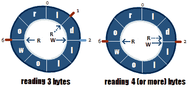
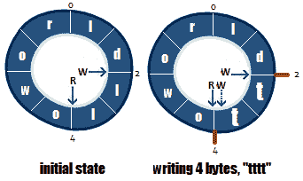
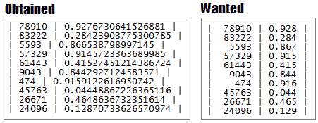

# Java I/O 路径、文件、缓冲区、扫描和格式化

本章包括 20 个涉及文件 Java I/O 的问题。从操作、行走和观察流文件的路径，以及读/写文本和二进制文件的有效方法，我们将介绍 Java 开发人员可能面临的日常问题。

通过本章所学到的技能，您将能够解决大多数涉及 Java I/O 文件的常见问题。本章中的广泛主题将提供大量有关 Java 如何处理 I/O 任务的信息

# 问题

为了测试您的 Java I/O 编程能力，请看下面的问题。我强烈建议您在使用解决方案和下载示例程序之前，先尝试一下每个问题：

129.  **创建文件路径**：写几个创建几种文件路径的例子（如绝对路径、相对路径等）。
130.  **转换文件路径**：写几个转换文件路径的例子（例如，将文件路径转换成字符串、URI、文件等）。
131.  **连接文件路径**：写几个连接（组合）文件路径的例子。定义一个固定路径并向其附加其他不同的路径（或用其他路径替换其中的一部分）。
132.  **在两个位置之间构造路径**：写出几个例子，在两个给定路径之间（从一条路径到另一条路径）之间构造相对路径。
133.  **比较文件路径**：写几个比较给定文件路径的例子。
134.  **遍历路径**：编写一个程序，访问一个目录下的所有文件，包括子目录。此外，编写一个程序，按名称搜索文件、删除目录、移动目录和复制目录。
135.  **监视路径**：编写多个程序，监视某条路径上发生的变化（如创建、删除、修改）。
136.  *“流式传输文件内容”*：编写一个流式传输给定文件内容的程序。
137.  **在文件树中搜索文件/文件夹**：编写一个程序，在给定的文件树中搜索给定的文件/文件夹。
138.  *“高效读写文本文件”*：编写几个程序，举例说明高效读写文本文件的不同方法。
139.  **高效读写二进制文件**：编写几个程序，举例说明高效读写二进制文件的不同方法。
140.  **在大文件中搜索**：编写一个程序，在大文件中高效地搜索给定的字符串。
141.  **将 JSON/CSV 文件作为对象读取**：编写一个程序，将给定的 JSON/CSV 文件作为对象读取（POJO）。
142.  **使用临时文件/文件夹**：编写几个使用临时文件/文件夹的程序。
143.  **过滤文件**：为文件编写多个自定义过滤器。
144.  **发现两个文件之间的不匹配**：编写一个程序，在字节级发现两个文件之间的不匹配。
145.  **循环字节缓冲区**：编写一个表示循环字节缓冲区实现的程序。
146.  **分词文件**：写几个代码片段来举例说明分词文件内容的不同技术。
147.  **将格式化输出直接写入文件**：编写一个程序，将给定的数字（整数和双精度）格式化并输出到文件中。
148.  **使用`Scanner`**：写几个代码片段来展示`Scanner`的功能。

# 解决方案

以下各节介绍上述问题的解决方案。记住，通常没有一个正确的方法来解决一个特定的问题。另外，请记住，这里显示的解释只包括解决问题所需的最有趣和最重要的细节。您可以从[这个页面](https://github.com/PacktPublishing/Java-Coding-Problems)下载示例解决方案以查看更多详细信息并尝试程序。

# 129 创建文件路径

从 JDK7 开始，我们可以通过 NIO.2API 创建一个文件路径。更准确地说，可以通过`Path`和`Paths`API 轻松定义文件路径。

`Path`类是文件系统中路径的编程表示。路径字符串包含以下信息：

*   文件名
*   目录列表
*   依赖于操作系统的文件分隔符（例如，在 Solaris 和 Linux 上为正斜杠`/`，在 Microsoft Windows 上为反斜杠`\`
*   其他允许的字符，例如，`.`（当前目录）和`..`（父目录）符号

`Path`类处理不同文件系统（`FileSystem`）中的文件，这些文件系统可以使用不同的存储位置（`FileStore`是底层存储）。

定义`Path`的一个常见解决方案是调用`Paths`辅助类的`get()`方法之一。另一种解决方案依赖于`FileSystems.getDefault().getPath()`方法。

`Path`驻留在文件系统中—*文件系统存储和组织文件或某种形式的媒体，通常在一个或多个硬盘驱动器上，以便于检索*。文件系统可以通过`java.nio.file.FileSystems`的`final`类获取，用于获取`java.nio.file.FileSystem`的实例。JVM 的默认`FileSystem`（俗称操作系统的默认文件系统）可以通过`FileSystems().getDefault()`方法获得。一旦我们知道文件系统和文件（或目录/文件夹）的位置，我们就可以为它创建一个`Path`对象。

另一种方法包括从**统一资源标识符**（**URI**）创建`Path`。Java 通过`URI`类包装一个`URI`，然后我们可以通过`URI.create(String uri)`方法从一个`String`获得一个`URI`。此外，`Paths`类提供了一个`get()`方法，该方法将`URI`对象作为参数并返回相应的`Path`。

从 JDK11 开始，我们可以通过两个方法创建一个`Path`。其中一个将`URI`转换为`Path`，而另一个将路径字符串或字符串序列转换为路径字符串。

在接下来的部分中，我们将了解创建路径的各种方法。

# 创建相对于文件存储根目录的路径

相对于当前文件存储根目录的路径（例如，`C:/`）必须以文件分隔符开头。在下面的例子中，如果当前文件存储根为`C`，则绝对路径为`C:\learning\packt\JavaModernChallenge.pdf`：

```java
Path path = Paths.get("/learning/packt/JavaModernChallenge.pdf");
Path path = Paths.get("/learning", "packt/JavaModernChallenge.pdf");

Path path = Path.of("/learning/packt/JavaModernChallenge.pdf");
Path path = Path.of("/learning", "packt/JavaModernChallenge.pdf");

Path path = FileSystems.getDefault()
  .getPath("/learning/packt", "JavaModernChallenge.pdf");
Path path = FileSystems.getDefault()
  .getPath("/learning/packt/JavaModernChallenge.pdf");

Path path = Paths.get(
  URI.create("file:///learning/packt/JavaModernChallenge.pdf"));
Path path = Path.of(
  URI.create("file:///learning/packt/JavaModernChallenge.pdf"));
```

# 创建相对于当前文件夹的路径

当我们创建一个相对于当前工作文件夹的路径时，路径*不*应该以文件分隔符开头。如果当前文件夹名为`books`并且在`C`根目录下，那么下面代码段返回的绝对路径将是`C:\books\learning\packt\JavaModernChallenge.pdf`：

```java
Path path = Paths.get("learning/packt/JavaModernChallenge.pdf");
Path path = Paths.get("learning", "packt/JavaModernChallenge.pdf");

Path path = Path.of("learning/packt/JavaModernChallenge.pdf");
Path path = Path.of("learning", "packt/JavaModernChallenge.pdf");

Path path = FileSystems.getDefault()
  .getPath("learning/packt", "JavaModernChallenge.pdf");
Path path = FileSystems.getDefault()
  .getPath("learning/packt/JavaModernChallenge.pdf");
```

# 创建绝对路径

创建绝对路径可以通过显式指定根目录和包含文件或文件夹的所有其他子目录来完成，如以下示例（`C:\learning\packt\JavaModernChallenge.pdf`）所示：

```java
Path path = Paths.get("C:/learning/packt", "JavaModernChallenge.pdf");
Path path = Paths.get(
  "C:", "learning/packt", "JavaModernChallenge.pdf");
Path path = Paths.get(
  "C:", "learning", "packt", "JavaModernChallenge.pdf");
Path path = Paths.get("C:/learning/packt/JavaModernChallenge.pdf");
Path path = Paths.get(
  System.getProperty("user.home"), "downloads", "chess.exe");

Path path = Path.of(
  "C:", "learning/packt", "JavaModernChallenge.pdf");
Path path = Path.of(
  System.getProperty("user.home"), "downloads", "chess.exe");

Path path = Paths.get(URI.create(
  "file:///C:/learning/packt/JavaModernChallenge.pdf"));
Path path = Path.of(URI.create(
  "file:///C:/learning/packt/JavaModernChallenge.pdf"));
```

# 使用快捷方式创建路径

我们理解快捷方式是`.`（当前目录）和`..`（父目录）符号。这种路径可以通过`normalize()`方法进行归一化。此方法消除了冗余，例如`.`和`directory/..`：

```java
Path path = Paths.get(
  "C:/learning/packt/chapters/../JavaModernChallenge.pdf")
    .normalize();
Path path = Paths.get(
  "C:/learning/./packt/chapters/../JavaModernChallenge.pdf")
    .normalize();

Path path = FileSystems.getDefault()
  .getPath("/learning/./packt", "JavaModernChallenge.pdf")
    .normalize();

Path path = Path.of(
  "C:/learning/packt/chapters/../JavaModernChallenge.pdf")
    .normalize();
Path path = Path.of(
  "C:/learning/./packt/chapters/../JavaModernChallenge.pdf")
    .normalize();
```

如果不规范化，路径的冗余部分将不会被删除。

为了创建与当前操作系统 100% 兼容的路径，我们可以依赖于`FileSystems.getDefault().getPath()`，或者是`File.separator`（依赖于系统的默认名称分隔符）和`File.listRoots()`（可用的文件系统根）的组合。对于相对路径，我们可以依赖以下示例：

```java
private static final String FILE_SEPARATOR = File.separator;
```

或者，我们可以依赖`getSeparator()`：

```java

private static final String FILE_SEPARATOR
  = FileSystems.getDefault().getSeparator();

// relative to current working folder
Path path = Paths.get("learning",
  "packt", "JavaModernChallenge.pdf");
Path path = Path.of("learning",
  "packt", "JavaModernChallenge.pdf");
Path path = Paths.get(String.join(FILE_SEPARATOR, "learning",
  "packt", "JavaModernChallenge.pdf"));
Path path = Path.of(String.join(FILE_SEPARATOR, "learning",
  "packt", "JavaModernChallenge.pdf"));

// relative to the file store root
Path path = Paths.get(FILE_SEPARATOR + "learning",
  "packt", "JavaModernChallenge.pdf");
Path path = Path.of(FILE_SEPARATOR + "learning",
  "packt", "JavaModernChallenge.pdf");
```

我们也可以对绝对路径执行相同的操作：

```java
Path path = Paths.get(File.listRoots()[0] + "learning",
  "packt", "JavaModernChallenge.pdf");
Path path = Path.of(File.listRoots()[0] + "learning",
  "packt", "JavaModernChallenge.pdf");
```

根目录列表也可以通过`FileSystems`获得：

```java
FileSystems.getDefault().getRootDirectories()
```

# 130 转换文件路径

将文件路径转换为`String`、`URI`、`File`等是一项常见任务，可以在广泛的应用中发生。让我们考虑以下文件路径：

```java
Path path = Paths.get("/learning/packt", "JavaModernChallenge.pdf");
```

现在，基于 JDK7 和 NIO.2 API，让我们看看如何将一个`Path`转换成一个`String`、一个`URI`、一个绝对路径、一个*实*路径和一个文件：

*   将`Path`转换为`String`非常简单，只需（显式地或自动地）调用`Path.toString()`方法。注意，如果路径是通过`FileSystem.getPath()`方法获得的，那么`toString()`返回的路径字符串可能与用于创建路径的初始`String`不同：

```java
// \learning\packt\JavaModernChallenge.pdf
String pathToString = path.toString();
```

*   可以通过`Path.toURI()`方法将`Path`转换为`URI`（浏览器格式）。返回的`URI`包装了一个可在 Web 浏览器地址栏中使用的路径字符串：

```java
// file:///D:/learning/packt/JavaModernChallenge.pdf
URI pathToURI = path.toUri();
```

假设我们想要将`URI`/`URL`中的文件名提取为`Path`（这是常见的场景）。在这种情况下，我们可以依赖以下代码片段：

```java
// JavaModernChallenge.pdf
URI uri = URI.create(
  "https://www.learning.com/packt/JavaModernChallenge.pdf");
Path URIToPath = Paths.get(uri.getPath()).getFileName();

// JavaModernChallenge.pdf
URL url = new URL(
  "https://www.learning.com/packt/JavaModernChallenge.pdf");
Path URLToPath = Paths.get(url.getPath()).getFileName();
```

路径转换可按以下方式进行：

*   可以通过`Path.toAbsolutePath()`方法将相对`Path`转换为绝对`Path`。如果`Path`已经是绝对值，则返回相同的结果：

```java
// D:\learning\packt\JavaModernChallenge.pdf
Path pathToAbsolutePath = path.toAbsolutePath();
```

*   通过`Path.toRealPath()`方法可以将`Path`转换为*实际*`Path`，其结果取决于实现。如果所指向的文件不存在，则此方法将抛出一个`IOException`。但是，根据经验，调用此方法的结果是没有冗余元素的绝对路径（标准化）。此方法获取一个参数，该参数指示应如何处理*符号链接*。默认情况下，如果文件系统支持*符号链接*，则此方法将尝试解析它们。如果您想忽略*符号链接*，只需将`LinkOption.NOFOLLOW_LINKS`常量传递给方法即可。此外，路径名元素将表示目录和文件的实际名称。

例如，让我们考虑下面的`Path`和调用此方法的结果（注意，我们故意添加了几个冗余元素并将`PACKT`文件夹大写）：

```java
Path path = Paths.get(
  "/learning/books/../PACKT/./", "JavaModernChallenge.pdf");

// D:\learning\packt\JavaModernChallenge.pdf
Path realPath = path.toRealPath(LinkOption.NOFOLLOW_LINKS);
```

*   可通过`Path.toFile()`方法将`Path`转换为文件。将一个文件转换成一个`Path`，我们可以依赖`File.toPath()`方法：

```java
File pathToFile = path.toFile();
Path fileToPath = pathToFile.toPath();
```

# 131 连接文件路径

连接（或组合）文件路径意味着定义一个固定的根路径，并附加一个部分路径或替换其中的一部分（例如，一个文件名需要替换为另一个文件名）。基本上，当我们想要创建共享公共固定部分的新路径时，这是一种方便的技术。

这可以通过 NIO.2 和`Path.resolve()`和`Path.resolveSibling()`方法来实现。

让我们考虑以下固定根路径：

```java
Path base = Paths.get("D:/learning/packt");
```

我们还假设我们想要得到两本不同书籍的`Path`：

```java
// D:\learning\packt\JBossTools3.pdf
Path path = base.resolve("JBossTools3.pdf");

// D:\learning\packt\MasteringJSF22.pdf
Path path = base.resolve("MasteringJSF22.pdf");
```

我们可以使用此功能循环一组文件；例如，让我们循环一`String[]`本书：

```java
Path basePath = Paths.get("D:/learning/packt");
String[] books = {
  "Book1.pdf", "Book2.pdf", "Book3.pdf"
};

for (String book: books) {
  Path nextBook = basePath.resolve(book);
  System.out.println(nextBook);
}
```

有时，固定根路径也包含文件名：

```java
Path base = Paths.get("D:/learning/packt/JavaModernChallenge.pdf");
```

这一次，我们可以通过`resolveSibling()`方法将文件名（`JavaModernChallenge.pdf`替换为另一个名称。此方法根据此路径的父路径解析给定路径，如下例所示：

```java
// D:\learning\packt\MasteringJSF22.pdf
Path path = base.resolveSibling("MasteringJSF22.pdf");
```

如果我们将`Path.getParent()`方法引入讨论，并将`resolve()`和`resolveSibling()`方法链接起来，那么我们可以创建更复杂的路径，如下例所示：

```java
// D:\learning\publisher\MyBook.pdf
Path path = base.getParent().resolveSibling("publisher")
  .resolve("MyBook.pdf");
```

`resolve()`/`resolveSibling()`方法分为两种，分别是`resolve​(String other)`/`resolveSibling​(String other)`和`resolve​(Path other)`/`resolveSibling​(Path other)`。

# 132 在两个位置之间构建路径

在两个位置之间构建相对路径是`Path.relativize()`方法的工作。

基本上，得到的相对路径（由`Path.relativize()`返回）从一条路径开始，在另一条路径上结束。这是一个强大的功能，它允许我们使用相对路径在不同的位置之间导航，相对路径是根据前面的路径解析的。

让我们考虑以下两种途径：

```java
Path path1 = Paths.get("JBossTools3.pdf");
Path path2 = Paths.get("JavaModernChallenge.pdf");
```

注意，`JBossTools3.pdf`和`JavaModernChallenge.pdf`是兄弟姐妹。这意味着我们可以通过上一级然后下一级从一个导航到另一个。以下示例也揭示了这种导航情况：

```java
// ..\JavaModernChallenge.pdf
Path path1ToPath2 = path1.relativize(path2);

// ..\JBossTools3.pdf
Path path2ToPath1 = path2.relativize(path1);
```

另一种常见情况涉及公共根元素：

```java
Path path3 = Paths.get("/learning/packt/2003/JBossTools3.pdf");
Path path4 = Paths.get("/learning/packt/2019");
```

所以，`path3`和`path4`共享相同的根元素`/learning`。从`path3`到`path4`需要上两层下一层。另外，从`path4`到`path3`的航行，需要上一级，下两级。查看以下代码：

```java
// ..\..\2019
Path path3ToPath4 = path3.relativize(path4);

// ..\2003\JBossTools3.pdf
Path path4ToPath3 = path4.relativize(path3);
```

两个路径都必须包含根元素。完成这个需求并不能保证成功，因为相对路径的构建依赖于实现。

# 133 比较文件路径

根据我们如何看待两个文件路径之间的相等性，有几种解决方案。主要来说，平等性可以通过不同的方式为不同的目标进行验证。

假设我们有以下三种路径（考虑在您的计算机上复制`C:\learning\packt\JavaModernChallenge.pdf`：

```java
Path path1 = Paths.get("/learning/packt/JavaModernChallenge.pdf");
Path path2 = Paths.get("/LEARNING/PACKT/JavaModernChallenge.pdf");
Path path3 = Paths.get("D:/learning/packt/JavaModernChallenge.pdf");
```

在下面的部分中，我们将研究用于比较文件路径的不同方法。

# `Path.equals()`

`path1`等于`path2`吗？或者，`path2`等于`path3`吗？好吧，如果我们通过`Path.equals()`进行这些测试，那么可能的结果将显示`path1`等于`path2`，但`path2`不等于`path3`：

```java
boolean path1EqualsPath2 = path1.equals(path2); // true
boolean path2EqualsPath3 = path2.equals(path3); // false
```

`Path.equals()`方法遵循`Object.equals()`规范。虽然此方法不访问文件系统，但相等性取决于文件系统实现。例如，一些文件系统实现可能会以区分大小写的方式比较路径，而其他文件系统实现可能会忽略大小写。

# 表示相同文件/文件夹的路径

然而，这可能不是我们想要的那种比较。如果两条路径是相同的文件或文件夹，那么说它们相等就更有意义了。这可以通过`Files.isSameFile()`方法来实现。此方法分为两个步骤：

1.  首先，它调用`Path.equals()`，如果此方法返回`true`，则路径相等，无需进一步操作。

2.  其次，如果`Path.equals()`返回`false`，则检查两个路径是否代表同一个文件/文件夹（根据实现，此操作可能需要打开/访问两个文件，因此文件必须存在，以避免出现`IOException`）。

```java
//true
boolean path1IsSameFilePath2 = Files.isSameFile(path1, path2);
//true
boolean path1IsSameFilePath3 = Files.isSameFile(path1, path3);
//true
boolean path2IsSameFilePath3 = Files.isSameFile(path2, path3);
```

# 词典比较

如果我们只需要对路径进行词典比较，那么我们可以依赖于`Path.compareTo()`方法（这对于排序很有用）。

此方法返回以下信息：

*   如果路径相等，则为 0
*   如果第一条路径在词典上小于参数路径，则该值小于零
*   如果第一条路径在词典中大于参数路径，则该值大于零：

```java
int path1compareToPath2 = path1.compareTo(path2); // 0
int path1compareToPath3 = path1.compareTo(path3); // 24
int path2compareToPath3 = path2.compareTo(path3); // 24
```

请注意，您可能会获得与上一示例不同的值。此外，在您的业务逻辑中，重要的是依赖于它们的含义，而不是依赖于它们的值（例如，说`if(path1compareToPath3 > 0) { ... }`，避免使用`if(path1compareToPath3 == 24) { ... }`）。

# 部分比较

部分比较可通过`Path.startsWith()`和`Path.endsWith()`方法实现。使用这些方法，我们可以测试当前路径是否以给定路径开始/结束：

```java
boolean sw = path1.startsWith("/learning/packt");       // true
boolean ew = path1.endsWith("JavaModernChallenge.pdf"); // true
```

# 134 遍历

对于遍历（或访问）路径有不同的解决方案，其中一种由 NIO.2API 通过`FileVisitor`接口提供。

此接口公开了一组方法，这些方法表示访问给定路径的递归过程中的检查点。通过覆盖这些检查点，我们可以干预这个过程。我们可以处理当前访问的文件/文件夹，并通过`FileVisitResult`枚举决定应该进一步执行的操作，该枚举包含以下常量：

*   `CONTINUE`：遍历过程应该继续（访问下一个文件、文件夹、跳过失败等）
*   `SKIP_SIBLINGS`：遍历过程应继续，而不访问当前文件/文件夹的同级
*   `SKIP_SUBTREE`：遍历过程应继续，而不访问当前文件夹中的条目
*   `TERMINATE`：遍历应该残酷地终止

`FileVisitor`公开的方法如下：

*   `FileVisitResult visitFile​(T file, BasicFileAttributes attrs) throws IOException`：对每个访问的文件/文件夹自动调用
*   `FileVisitResult preVisitDirectory​(T dir, BasicFileAttributes attrs) throws IOException`：在访问文件夹内容前自动调用文件夹
*   `FileVisitResult postVisitDirectory​(T dir, IOException exc) throws IOException`：在目录（包括子目录）中的内容被访问后，或在文件夹的迭代过程中，发生 I/O 错误或访问被编程中止后自动调用
*   `FileVisitResult visitFileFailed​(T file, IOException exc) throws IOException`：由于不同原因（如文件属性无法读取或文件夹无法打开）无法访问（访问）文件时自动调用

好的，到目前为止，很好！让我们继续几个实际的例子。

# 琐碎的文件夹遍历

实现`FileVisitor`接口需要覆盖它的四个方法。然而，NIO.2 附带了这个接口的一个内置的简单实现，称为`SimpleFileVisitor`。对于简单的情况，扩展这个类比实现`FileVisitor`更方便，因为它只允许我们覆盖必要的方法。

例如，假设我们将电子课程存储在`D:/learning`文件夹的子文件夹中，我们希望通过`FileVisitor`API 访问每个子文件夹。如果在子文件夹的迭代过程中出现问题，我们只会抛出报告的异常。

为了塑造这种行为，我们需要覆盖`postVisitDirectory()`方法，如下所示：

```java
class PathVisitor extends SimpleFileVisitor<Path> {

  @Override
  public FileVisitResult postVisitDirectory(
      Path dir, IOException ioe) throws IOException {

    if (ioe != null) {
      throw ioe;
    }

    System.out.println("Visited directory: " + dir);

    return FileVisitResult.CONTINUE;
  }
}
```

为了使用`PathVisitor`类，我们只需要设置路径并调用其中一个`Files.walkFileTree()`方法，如下所示（这里使用的`walkFileTree()`的风格得到起始文件/文件夹和相应的`FileVisitor`：

```java
Path path = Paths.get("D:/learning");
PathVisitor visitor = new PathVisitor();

Files.walkFileTree(path, visitor);
```

通过使用前面的代码，我们将收到以下输出：

```java
Visited directory: D:\learning\books\ajax
Visited directory: D:\learning\books\angular
...
```

# 按名称搜索文件

在计算机上搜索某个文件是一项常见的任务。通常，我们依赖于操作系统提供的工具或其他工具，但如果我们想通过编程实现这一点（例如，我们可能想编写一个具有特殊功能的文件搜索工具），那么`FileVisitor`可以帮助我们以非常简单的方式实现这一点。本申请存根如下：

```java
public class SearchFileVisitor implements FileVisitor {

  private final Path fileNameToSearch;
  private boolean fileFound;
  ...

  private boolean search(Path file) throws IOException {

    Path fileName = file.getFileName();

    if (fileNameToSearch.equals(fileName)) {
      System.out.println("Searched file was found: " +
        fileNameToSearch + " in " + file.toRealPath().toString());

      return true;
    }

    return false;
  }
}
```

让我们看看主要检查点和按名称搜索文件的实现：

*   `visitFile()`是我们的主要检查站。一旦有了控制权，就可以查询当前访问的文件的名称、扩展名、属性等。需要此信息才能与搜索文件上的相同信息进行比较。例如，我们比较名字，在第一次匹配时，我们`TERMINATE`搜索。但是如果我们搜索更多这样的文件（如果我们知道不止一个），那么我们可以返回`CONTINUE`：

```java
@Override
public FileVisitResult visitFile(
  Object file, BasicFileAttributes attrs) throws IOException {

  fileFound = search((Path) file);

  if (!fileFound) {
    return FileVisitResult.CONTINUE;
  } else {
    return FileVisitResult.TERMINATE;
  }
}
```

`visitFile()`方法不能用于查找文件夹。改用`preVisitDirectory()`或`postVisitDirectory()`方法。

*   `visitFileFailed()`是第二个重要关卡。调用此方法时，我们知道在访问当前文件时出现了问题。我们宁愿忽略任何这样的问题和搜索。停止搜索过程毫无意义：

```java
@Override
public FileVisitResult visitFileFailed(
  Object file, IOException ioe) throws IOException {
  return FileVisitResult.CONTINUE;
}
```

`preVisitDirectory()`和`postVisitDirectory()`方法没有任何重要的任务，因此为了简洁起见，我们可以跳过它们。

为了开始搜索，我们依赖另一种风格的`Files.walkFileTree()`方法。这一次，我们指定搜索的起点（例如，所有根）、搜索期间使用的选项（例如，跟随*符号链接*）、要访问的最大目录级别数（例如，`Integer.MAX_VALUE`）和`FileVisitor`（例如，`SearchFileVisitor`）：

```java
Path searchFile = Paths.get("JavaModernChallenge.pdf");

SearchFileVisitor searchFileVisitor 
  = new SearchFileVisitor(searchFile);

EnumSet opts = EnumSet.of(FileVisitOption.FOLLOW_LINKS);
Iterable<Path> roots = FileSystems.getDefault().getRootDirectories();

for (Path root: roots) {
  if (!searchFileVisitor.isFileFound()) {
    Files.walkFileTree(root, opts,
      Integer.MAX_VALUE, searchFileVisitor);
  }
}
```

如果您查看本书附带的代码，前面的搜索将以递归方式遍历计算机的所有根（目录）。前面的例子可以很容易地通过扩展名、模式进行搜索，或者从一些文本中查看文件内部。

# 删除文件夹

在试图删除文件夹之前，我们必须删除其中的所有文件。这个语句非常重要，因为它不允许我们对包含文件的文件夹简单地调用`delete()`/`deleteIfExists()`方法。此问题的优雅解决方案依赖于从以下存根开始的`FileVisitor`实现：

```java
public class DeleteFileVisitor implements FileVisitor {
  ...
  private static boolean delete(Path file) throws IOException {

    return Files.deleteIfExists(file);
  }
}
```

让我们看看主要检查点和删除文件夹的实现：

*   `visitFile()`是从给定文件夹或子文件夹删除每个文件的理想位置（如果文件不能删除，则我们只需将其传递到下一个文件，但可以随意调整代码以满足您的需要）：

```java
@Override
public FileVisitResult visitFile(
  Object file, BasicFileAttributes attrs) throws IOException {

  delete((Path) file);

  return FileVisitResult.CONTINUE;
}
```

*   只有当文件夹为空时，才可以删除它，因此`postVisitDirectory()`是执行此操作的最佳位置（我们忽略任何潜在的`IOException`，但可以随意调整代码以满足您的需要（例如，记录无法删除的文件夹的名称或引发异常以停止进程））：

```java
@Override
public FileVisitResult postVisitDirectory(
    Object dir, IOException ioe) throws IOException {

  delete((Path) dir);

  return FileVisitResult.CONTINUE;
}
```

在`visitFileFailed()`和`preVisitDirectory()`中，我们只返回`CONTINUE`。

删除文件夹时，在`D:/learning`中，我们可以调用`DeleteFileVisitor`，如下所示：

```java
Path directory = Paths.get("D:/learning");
DeleteFileVisitor deleteFileVisitor = new DeleteFileVisitor();
EnumSet opts = EnumSet.of(FileVisitOption.FOLLOW_LINKS);

Files.walkFileTree(directory, opts, 
  Integer.MAX_VALUE, deleteFileVisitor);
```

通过将`SearchFileVisitor`和`DeleteFileVisitor`组合，我们可以得到一个搜索删除应用。

# 复制文件夹

为了复制一个文件，我们可以使用`Path copy​(Path source, Path target, CopyOption options) throws IOException`方法。此方法使用指定如何执行复制的参数`options`将文件复制到目标文件。

通过将`copy()`方法与自定义`FileVisitor`相结合，我们可以复制整个文件夹（包括其所有内容）。本次定制`FileVisitor`存根代码如下：

```java
public class CopyFileVisitor implements FileVisitor {

  private final Path copyFrom;
  private final Path copyTo;
  ...

  private static void copySubTree(
      Path copyFrom, Path copyTo) throws IOException {

    Files.copy(copyFrom, copyTo, 
      REPLACE_EXISTING, COPY_ATTRIBUTES);
  }
}
```

让我们看一下主要的检查点和复制文件夹的实现（注意，我们将通过复制任何可以复制的内容来进行操作，并避免抛出异常，但可以随意调整代码以满足您的需要）：

*   在从源文件夹复制任何文件之前，我们需要复制源文件夹本身。复制源文件夹（空或不空）将导致目标文件夹为空。这是用`preVisitDirectory()`方法完成的完美任务：

```java
@Override
public FileVisitResult preVisitDirectory(
  Object dir, BasicFileAttributes attrs) throws IOException {

  Path newDir = copyTo.resolve(
    copyFrom.relativize((Path) dir));

  try {
    Files.copy((Path) dir, newDir, 
      REPLACE_EXISTING, COPY_ATTRIBUTES);
  } catch (IOException e) {
    System.err.println("Unable to create "
      + newDir + " [" + e + "]");

    return FileVisitResult.SKIP_SUBTREE;
  }

  return FileVisitResult.CONTINUE;
}
```

*   `visitFile()`方法是复制每个文件的最佳场所：

```java
@Override
public FileVisitResult visitFile(
  Object file, BasicFileAttributes attrs) throws IOException {

  try {
    copySubTree((Path) file, copyTo.resolve(
      copyFrom.relativize((Path) file)));
  } catch (IOException e) {
    System.err.println("Unable to copy " 
      + copyFrom + " [" + e + "]");
  }

  return FileVisitResult.CONTINUE;
}
```

*   或者，我们可以保留源目录的属性。只有将文件复制到`postVisitDirectory()`方法后才能完成（例如，保留上次修改的时间）：

```java
@Override
public FileVisitResult postVisitDirectory(
    Object dir, IOException ioe) throws IOException {

  Path newDir = copyTo.resolve(
    copyFrom.relativize((Path) dir));

  try {
    FileTime time = Files.getLastModifiedTime((Path) dir);
    Files.setLastModifiedTime(newDir, time);
  } catch (IOException e) {
    System.err.println("Unable to preserve 
      the time attribute to: " + newDir + " [" + e + "]");
  }

  return FileVisitResult.CONTINUE;
}
```

*   如果无法访问文件，则调用`visitFileFailed()`。现在是检测*循环链接*并报告它们的好时机。通过以下链接（`FOLLOW_LINKS`），我们可以遇到文件树与父文件夹有*循环链接*的情况。这些病例通过`visitFileFailed()`中的`FileSystemLoopException`异常报告：

```java
@Override
public FileVisitResult visitFileFailed(
    Object file, IOException ioe) throws IOException {

  if (ioe instanceof FileSystemLoopException) {
    System.err.println("Cycle was detected: " + (Path) file);
  } else {
    System.err.println("Error occured, unable to copy:"
      + (Path) file + " [" + ioe + "]");
  }

  return FileVisitResult.CONTINUE;
}
```

把`D:/learning/packt`文件夹复制到`D:/e-courses`：

```java
Path copyFrom = Paths.get("D:/learning/packt");
Path copyTo = Paths.get("D:/e-courses");

CopyFileVisitor copyFileVisitor 
  = new CopyFileVisitor(copyFrom, copyTo);

EnumSet opts = EnumSet.of(FileVisitOption.FOLLOW_LINKS);

Files.walkFileTree(copyFrom, opts, Integer.MAX_VALUE, copyFileVisitor);
```

通过组合`CopyFileVisitor`和`DeleteFileVisitor`，我们可以很容易地形成一个移动文件夹的应用。在本书附带的代码中，还有一个移动文件夹的完整示例。基于我们迄今为止积累的专业知识，代码应该是非常容易访问的，没有更多的细节。

在记录有关文件的信息（例如，处理异常的情况）时要注意，因为文件（例如，它们的名称、路径和属性）可能包含敏感信息，这些信息可能会被恶意利用。

# JDK8，`Files.walk()`

从 JDK8 开始，`Files`类用两个`walk()`方法进行了丰富。这些方法返回一个由`Path`惰性填充的`Stream`。它通过使用给定的最大深度和选项遍历以给定起始文件为根的文件树来实现这一点：

```java
public static Stream<Path> walk​(
  Path start, FileVisitOption...options) 
    throws IOException

public static Stream<Path> walk​(
  Path start, int maxDepth, FileVisitOption...options) 
    throws IOException
```

例如，让我们显示从`D:/learning`开始并以`D:/learning/books/cdi`开头的所有路径：

```java
Path directory = Paths.get("D:/learning");

Stream<Path> streamOfPath = Files.walk(
  directory, FileVisitOption.FOLLOW_LINKS);

streamOfPath.filter(e -> e.startsWith("D:/learning/books/cdi"))
  .forEach(System.out::println);
```

现在，让我们计算一个文件夹的字节大小（例如，`D:/learning`）：

```java
long folderSize = Files.walk(directory)
  .filter(f -> f.toFile().isFile())
  .mapToLong(f -> f.toFile().length())
  .sum();
```

此方法为*弱一致*。它不会在迭代过程中冻结文件树。对文件树的潜在更新可能会反映出来，也可能不会反映出来。

# 135 监视路径

监视路径的变化只是可以通过 JDK7nio.2（低级的`WatchService`API）实现的线程安全目标之一。

简而言之，可以通过以下两个主要步骤来观察路径的变化：

1.  为不同类型的事件类型注册要监视的文件夹。
2.  当`WatchService`检测到注册的事件类型时，它在单独的线程中处理，因此监视服务不会被阻塞。

在 API 级别，起点是`WatchService`接口。对于不同的文件/操作系统，这个接口有不同的风格。

这个接口与两个主要类一起工作。它们一起提供了一种方便的方法，您可以实现这种方法来将监视功能添加到特定上下文（例如，文件系统）：

*   `Watchable`：实现此接口的任何对象都是*可观察对象*，因此可以观察其变化（例如`Path`）

*   `StandardWatchEventKinds`：这个类定义了标准的*事件类型*（这些是我们可以注册通知的事件类型：
    *   `ENTRY_CREATE`：创建目录条目
    *   `ENTRY_DELETE`：删除目录条目
    *   `ENTRY_MODIFY`：目录条目已修改；被认为是修改的内容在某种程度上是特定于平台的，但实际上修改文件的内容应该始终触发此事件类型
    *   `OVERFLOW`：一种特殊事件，表示事件可能已经丢失或丢弃

`WatchService`被称为*观察者*，我们说*观察者*观察*可观察对象*。在下面的示例中，`WatchService`将通过`FileSystem`类创建，并监视已注册的`Path`。

# 监视文件夹的更改

让我们从一个桩方法开始，该方法获取应该监视其更改的文件夹的`Path`作为参数：

```java
public void watchFolder(Path path) 
    throws IOException, InterruptedException {
  ...
}
```

当给定文件夹中出现`ENTRY_CREATE`、`ENTRY_DELETE`和`ENTRY_MODIFY`事件类型时，`WatchService`将通知我们。为此，我们需要遵循以下几个步骤：

1.  创建`WatchService`以便我们可以监视文件系统这是通过`FileSystem.newWatchService()`完成的，如下所示：

```java
WatchService watchService 
  = FileSystems.getDefault().newWatchService();
```

2.  注册应通知的事件类型这是通过`Watchable.register()`完成的：

```java
path.register(watchService, StandardWatchEventKinds.ENTRY_CREATE,
  StandardWatchEventKinds.ENTRY_MODIFY,
  StandardWatchEventKinds.ENTRY_DELETE);
```

对于每个*可监视对象*，我们接收一个注册令牌作为`WatchKey`实例（*监视密钥*）。我们在注册时收到这个*监视键*，但是每次触发事件时`WatchService`都返回相关的`WatchKey`。

3.  现在，我们需要等待传入事件。这是在无限循环中完成的（当事件发生时，*观察者*负责将相应的*观察键*排队等待以后检索，并将其状态更改为*已发射*：

```java
while (true) {
  // process the incoming event types
}
```

4.  现在，我们需要检索*监视键*——检索*监视键*的方法至少有三种：
    *   `poll()`：返回队列中的下一个键并将其移除（或者，如果没有键，则返回`null`）。
    *   `poll​(long timeout, TimeUnit unit)`：返回队列中的下一个键并将其删除；如果没有键，则等待指定的超时并重试。如果密钥仍然不可用，则返回`null`。
    *   `take()`：返回队列中的下一个密钥并将其删除；如果没有密钥，则等待某个密钥排队或无限循环停止：

```java
WatchKey key = watchService.take();
```

5.  接下来，我们需要检索*监视键*的未决事件。一个*已发射*状态的*监视键*至少有一个挂起事件，我们可以通过`WatchKey.pollEvents()`方法检索并删除某个*监视键*的所有事件（每个事件由一个`WatchEvent`实例表示）：

```java
for (WatchEvent<?> watchEvent : key.pollEvents()) {
  ...
}
```

6.  然后，我们检索关于*事件类型*的信息。对于每个事件，我们可以获得不同的信息（例如，事件类型、出现次数和上下文特定的信息（例如，导致事件的文件名），这对于处理事件很有用）：

```java
Kind<?> kind = watchEvent.kind();
WatchEvent<Path> watchEventPath = (WatchEvent<Path>) watchEvent;
Path filename = watchEventPath.context();
```

7.  接下来，我们重置*监视键*。*监视键*的状态可以是*就绪*（创建时的初始状态）、*已发射*或*无效*。一旦*发出*信号，一个*监视键*就会保持这样，直到我们调用`reset()`方法，尝试将其放回*就绪*状态，接受事件的状态。如果*已发射*到*就绪*（恢复等待事件）转换成功，则`reset()`方法返回`true`；否则返回`false`，表示*监视键*可能*无效*。一个*监视键*如果不再处于活动状态，可能会处于*无效*状态（显式调用*监视键*的`close()`方法、关闭监视程序、删除目录等都会导致不活动）：

```java
boolean valid = key.reset();

if (!valid) {
  break;
}
```

当有一个*监视键*处于*无效*状态时，就没有理由停留在无限循环中。只需调用`break`即可跳出循环。

8.  最后，我们关闭*监视器*。具体调用`WatchService`的`close()`方法或依赖*资源尝试*，可实现如下：

```java
try (WatchService watchService
    = FileSystems.getDefault().newWatchService()) {
  ...
}
```

本书附带的代码将所有这些代码片段粘在一个名为`FolderWatcher`的类中。结果将是一个*观察者*，它能够报告在指定路径上发生的创建、删除和修改事件。

为了观察路径，即`D:/learning/packt`，我们只调用`watchFolder()`方法：

```java
Path path = Paths.get("D:/learning/packt");

FolderWatcher watcher = new FolderWatcher();
watcher.watchFolder(path);
```

运行应用将显示以下消息：

```java
Watching: D:\learning\packt
```

现在，我们可以直接在此文件夹下创建、删除或修改文件，并检查通知。例如，如果我们简单地复制粘贴一个名为`resources.txt`的文件，那么输出如下：

```java
ENTRY_CREATE -> resources.txt
ENTRY_MODIFY -> resources.txt
```

最后，不要忘记停止应用，因为它将无限期地运行（理论上）。

从这个应用开始，本书附带的源代码附带了另外两个应用。其中一个是视频捕获系统的模拟，而另一个是打印机托盘观察器的模拟。依靠我们在本节中积累的知识，理解这两个应用应该非常简单，无需进一步的细节。

# 136 流式传输文件内容

流式传输文件内容是一个可以通过 JDK8 使用`Files.lines()`和`BufferedReader.lines()`方法解决的问题。

`Stream<String> Files.lines​(Path path, Charset cs)`将文件中的所有行读取为`Stream`。当流被消耗时，这种情况会缓慢发生。在终端流操作的执行过程中，不应该修改文件的内容；否则，结果是未定义的。

让我们看一个读取`D:/learning/packt/resources.txt`文件内容并将其显示在屏幕上的示例（注意，我们使用*资源尝试*运行代码，因此通过关闭流来关闭文件）：

```java
private static final String FILE_PATH 
  = "D:/learning/packt/resources.txt";
...
try (Stream<String> filesStream = Files.lines(
  Paths.get(FILE_PATH), StandardCharsets.UTF_8)) {

  filesStream.forEach(System.out::println);
} catch (IOException e) {
  // handle IOException if needed, otherwise remove the catch block
}
```

在`BufferedReader`类中也有类似的无参数方法：

```java
try (BufferedReader brStream = Files.newBufferedReader(
  Paths.get(FILE_PATH), StandardCharsets.UTF_8)) {

  brStream.lines().forEach(System.out::println);
} catch (IOException e) {
  // handle IOException if needed, otherwise remove the catch block
}
```

# 137 在文件树中搜索文件/文件夹

在文件树中搜索文件或文件夹是一项常见的任务，在很多情况下都需要这样做。多亏了 JDK8 和新的`Files.find()`方法，我们可以很容易地完成这个任务。

`Files.find()`方法返回一个`Stream<Path>`，其中惰性地填充了与提供的查找约束匹配的路径：

```java
public static Stream<Path> find​(
  Path start,
  int maxDepth,
  BiPredicate<Path, ​BasicFileAttributes > matcher,
  FileVisitOption...options
) throws IOException
```

此方法作为`walk()`方法，因此它遍历当前文件树，从给定路径（`start`）开始，到达最大给定深度（`maxDepth`）。在当前文件树的迭代过程中，此方法应用给定的谓词（`matcher`）。通过这个谓词，我们指定最终流中的每个文件必须匹配的约束。或者，我们可以指定一组访问选项（`options`）。

```java
Path startPath = Paths.get("D:/learning");
```

让我们看看一些示例，这些示例旨在阐明此方法的用法：

*   找到以`.properties`扩展名结尾的所有文件，并遵循*符号链接*：

```java
Stream<Path> resultAsStream = Files.find(
  startPath,
  Integer.MAX_VALUE,
  (path, attr) -> path.toString().endsWith(".properties"),
  FileVisitOption.FOLLOW_LINKS
);
```

*   查找所有以`application`开头的常规文件：

```java
Stream<Path> resultAsStream = Files.find(
  startPath,
  Integer.MAX_VALUE,
  (path, attr) -> attr.isRegularFile() &amp;&amp;
  path.getFileName().toString().startsWith("application")
);
```

*   查找 2019 年 3 月 16 日之后创建的所有目录：

```java
Stream<Path> resultAsStream = Files.find(
  startPath,
  Integer.MAX_VALUE,
  (path, attr) -> attr.isDirectory() &amp;&amp;
    attr.creationTime().toInstant()
      .isAfter(LocalDate.of(2019, 3, 16).atStartOfDay()
        .toInstant(ZoneOffset.UTC))
);
```

如果我们喜欢将约束表示为表达式（例如，正则表达式），那么我们可以使用`PathMatcher`接口。这个接口附带了一个名为`matches(Path path)`的方法，它可以判断给定的路径是否匹配这个匹配器的模式。

`FileSystem`实现通过`FileSystem.getPathMatcher(String syntaxPattern)`支持 *glob* 和 *regex* 语法（也可能支持其他语法）。约束采用`syntax:pattern`的形式。

基于`PathMatcher`，我们可以编写能够覆盖广泛约束的辅助方法。例如，下面的辅助方法仅获取与给定约束相关的文件作为`syntax:pattern`：

```java
public static Stream<Path> fetchFilesMatching(Path root,
    String syntaxPattern) throws IOException {

  final PathMatcher matcher
    = root.getFileSystem().getPathMatcher(syntaxPattern);

  return Files.find(root, Integer.MAX_VALUE, (path, attr)
    -> matcher.matches(path) &amp;&amp; !attr.isDirectory());
}
```

通过 *glob* 语法查找所有 Java 文件可以实现如下：

```java
Stream<Path> resultAsStream 
  = fetchFilesMatching(startPath, "glob:**/*.java");
```

如果我们只想列出当前文件夹中的文件（没有任何约束，只有一层深），那么我们可以使用`Files.list()`方法，如下例所示：

```java
try (Stream<Path> allfiles = Files.list(startPath)) {
  ...
}
```

# 138 高效读写文本文件

在 Java 中，高效地读取文件需要选择正确的方法。为了更好地理解下面的示例，我们假设平台的默认字符集是 UTF-8。通过编程，可以通过`Charset.defaultCharset()`获取平台的默认字符集。

首先，我们需要从 Java 的角度区分原始二进制数据和文本文件。处理原始二进制数据是两个`abstract`类的工作，即`InputStream`和`OutputStream`。对于原始二进制数据的流文件，我们关注于一次读/写一个字节（8 位）的`FileInputStream`和`FileOutputStream`类。对于著名的二进制数据类型，我们也有专门的类（例如，音频文件应该通过`AudioInputStream`而不是`FileInputStream`进行处理）。

虽然这些类在处理原始二进制数据方面做得非常出色，但它们不适合处理文本文件，因为它们速度慢并且可能产生错误的输出。如果我们认为通过这些类流式传输文本文件意味着从文本文件中读取并处理每个字节（写入一个字节需要相同的繁琐流程），那么这一点就非常清楚了。此外，如果一个字符有超过 1 个字节，那么可能会看到一些奇怪的字符。换句话说，独立于字符集（例如，拉丁语、汉语等）对 8 位进行解码和编码可能产生意外的输出。

例如，假设我们有一首保存在 UTF-16 中的中国诗：

```java
Path chineseFile = Paths.get("chinese.txt");

...
```

以下代码将不会按预期显示：

```java
try (InputStream is = new FileInputStream(chineseFile.toString())) {

  int i;
  while ((i = is.read()) != -1) {
    System.out.print((char) i);
  }
}
```

所以，为了解决这个问题，我们应该指定适当的字符集。虽然`InputStream`对此没有支持，但我们可以依赖`InputStreamReader`（或`OutputStreamReader`）。此类是从原始字节流到字符流的桥梁，允许我们指定字符集：

```java
try (InputStreamReader isr = new InputStreamReader(
    new FileInputStream(chineseFile.toFile()), 
      StandardCharsets.UTF_16)) {

  int i;
  while ((i = isr.read()) != -1) {
    System.out.print((char) i);
  }
}
```

事情已经回到正轨，但仍然很慢！现在，应用可以一次读取多个单字节（取决于字符集），并使用指定的字符集将它们解码为字符。但再多几个字节仍然很慢。

`InputStreamReader`是射线二进制数据流和字符流之间的桥梁。但是 Java 也提供了`FileReader`类。它的目标是消除由字符文件表示的字符流的桥接。

对于文本文件，我们有一个称为`FileReader`类（或`FileWriter`类）的专用类。这个类一次读取 2 或 4 个字节（取决于使用的字符集）。实际上，在 JDK11 之前，`FileReader`不支持显式字符集。它只是使用了平台的默认字符集。这对我们不利，因为以下代码不会产生预期的输出：

```java
try (FileReader fr = new FileReader(chineseFile.toFile())) {

  int i;
  while ((i = fr.read()) != -1) {
    System.out.print((char) i);
  }
}
```

但从 JDK11 开始，`FileReader`类又增加了两个支持显式字符集的构造器：

*   `FileReader​(File file, Charset charset)`
*   `FileReader​(String fileName, Charset charset)`

这一次，我们可以覆盖前面的代码片段并获得预期的输出：

```java
try (FileReader frch = new FileReader(
    chineseFile.toFile(), StandardCharsets.UTF_16)) {

  int i;
  while ((i = frch.read()) != -1) {
    System.out.print((char) i);
  }
}
```

一次读取 2 或 4 个字节仍然比读取 1 个字节好，但仍然很慢。此外，请注意，前面的解决方案使用一个`int`来存储检索到的`char`，我们需要显式地将其转换为`char`以显示它。基本上，从输入文件中检索到的`char`被转换成`int`，然后我们将其转换回`char`。

这就是*缓冲流*进入场景的地方。想想当我们在线观看视频时会发生什么。当我们观看视频时，浏览器正在提前缓冲传入的字节。这样，我们就有了一个平稳的体验，因为我们可以看到缓冲区中的字节，避免了在网络传输过程中看到字节可能造成的中断：


同样的原理也用于类，例如用于原始二进制流的`BufferedInputStream`、`BufferedOutputStream`和用于字符流的`BufferedReader`、`BufferedWriter`。其主要思想是在处理之前对数据进行缓冲。这一次，`FileReader`将数据返回到`BufferedReader`直到它到达行的末尾（例如，`\n`或`\n\r`）。`BufferedReader`使用 RAM 存储缓冲数据：

```java
try (BufferedReader br = new BufferedReader(
    new FileReader(chineseFile.toFile(), StandardCharsets.UTF_16))) {

  String line;
  // keep buffering and print
  while ((line = br.readLine()) != null) {
    System.out.println(line);
  }
}
```

因此，我们不是一次读取 2 个字节，而是读取一整行，这要快得多。这是一种非常有效的读取文本文件的方法。

为了进一步优化，我们可以通过专用构造器设置缓冲区的大小。

注意，`BufferedReader`类知道如何在传入数据的上下文中创建和处理缓冲区，但与数据源无关。在我们的例子中，数据的来源是`FileReader`，它是一个文件，但是相同的`BufferedReader`可以缓冲来自不同来源的数据（例如，网络、文件、控制台、打印机、传感器等等）。最后，我们读取缓冲的内容。

前面的例子代表了在 Java 中读取文本文件的主要方法。从 JDK8 开始，添加了一组新的方法，使我们的生活更轻松。为了创建一个`BufferedReader`，我们也可以依赖`Files.newBufferedReader​(Path path, Charset cs)`：

```java
try (BufferedReader br = Files.newBufferedReader(
    chineseFile, StandardCharsets.UTF_16)) {

  String line;
  while ((line = br.readLine()) != null) {
    System.out.println(line);
  }
}
```

对于`BufferedWriter`，我们有`Files.newBufferedWriter()`。这些方法的优点是直接支持`Path`。

要将文本文件的内容提取为`Stream<T>`，请查看“流式传输文件内容”部分中的问题。

另一种可能导致眼睛疲劳的有效解决方案如下：

```java
try (BufferedReader br = new BufferedReader(new InputStreamReader(
    new FileInputStream(chineseFile.toFile()), 
      StandardCharsets.UTF_16))) {

  String line;
  while ((line = br.readLine()) != null) {
    System.out.println(line);
  }
}
```

现在，我们来谈谈如何将文本文件直接读入内存。

# 读取内存中的文本文件

`Files`类提供了两个方法，可以读取内存中的整个文本文件。其中之一是`List<String> readAllLines​(Path path, Charset cs)`：

```java
List<String> lines = Files.readAllLines(
  chineseFile, StandardCharsets.UTF_16);
```

此外，我们可以通过`Files.readString​(Path path, Charset cs)`阅读`String`中的全部内容：

```java
String content = Files.readString(chineseFile, 
  StandardCharsets.UTF_16);
```

虽然这些方法对于相对较小的文件非常方便，但对于较大的文件来说并不是一个好的选择。试图在内存中获取大文件很容易导致`OutOfMemoryError`，显然，这会消耗大量内存。或者，对于大文件（例如 200GB），我们可以关注内存映射文件（`MappedByteBuffer`。`MappedByteBuffer`允许我们创建和修改巨大的文件，并将它们视为非常大的数组。它们看起来像是在记忆中，即使它们不是。一切都发生在本机级别：

```java
// or use, Files.newByteChannel()
try (FileChannel fileChannel = (FileChannel.open(chineseFile,
    EnumSet.of(StandardOpenOption.READ)))) {

  MappedByteBuffer mbBuffer = fileChannel.map(
    FileChannel.MapMode.READ_ONLY, 0, fileChannel.size());

  if (mbBuffer != null) {
    String bufferContent 
      = StandardCharsets.UTF_16.decode(mbBuffer).toString();

    System.out.println(bufferContent);
    mbBuffer.clear();
  }
}
```

对于大文件，建议使用固定大小遍历缓冲区，如下所示：

```java
private static final int MAP_SIZE = 5242880; // 5 MB in bytes

try (FileChannel fileChannel = (FileChannel.open(chineseFile,
    EnumSet.of(StandardOpenOption.READ)))) {

  int position = 0;
  long length = fileChannel.size();

  while (position < length) {
    long remaining = length - position;
    int bytestomap = (int) Math.min(MAP_SIZE, remaining);

    MappedByteBuffer mbBuffer = fileChannel.map(
      MapMode.READ_ONLY, position, bytestomap);

    ... // do something with the current buffer

    position += bytestomap;
  }
}
```

JDK13 准备发布非易失性`MappedByteBuffer`。敬请期待！

# 写入文本文件

对于每个专用于读取文本文件的类/方法（例如，`BufferedReader`和`readString()`），Java 提供其对应的用于写入文本文件的类/方法（例如，`BufferedWriter`和`writeString()`）。下面是通过`BufferedWriter`写入文本文件的示例：

```java
Path textFile = Paths.get("sample.txt");

try (BufferedWriter bw = Files.newBufferedWriter(
    textFile, StandardCharsets.UTF_8, StandardOpenOption.CREATE, 
      StandardOpenOption.WRITE)) {
  bw.write("Lorem ipsum dolor sit amet, ... ");
  bw.newLine();
  bw.write("sed do eiusmod tempor incididunt ...");
}
```

将`Iterable`写入文本文件的一种非常方便的方法是`Files.write​(Path path, Iterable<? extends CharSequence> lines, Charset cs, OpenOption... options)`。例如，让我们将列表的内容写入文本文件（列表中的每个元素都写在文件中的一行上）：

```java
List<String> linesToWrite = Arrays.asList("abc", "def", "ghi");
Path textFile = Paths.get("sample.txt");
Files.write(textFile, linesToWrite, StandardCharsets.UTF_8,
  StandardOpenOption.CREATE, StandardOpenOption.WRITE);
```

最后，要将一个`String`写入一个文件，我们可以使用`Files.writeString​(Path path, CharSequence csq, OpenOption... options)`方法：

```java
Path textFile = Paths.get("sample.txt");

String lineToWrite = "Lorem ipsum dolor sit amet, ...";
Files.writeString(textFile, lineToWrite, StandardCharsets.UTF_8,
  StandardOpenOption.CREATE, StandardOpenOption.WRITE);
```

通过`StandardOpenOption`可以控制文件的打开方式。在前面的示例中，如果文件不存在（`CREATE`），则创建这些文件，并打开这些文件进行写访问（`WRITE`）。有许多其他选项可用（例如，`APPEND`、`DELETE_ON_CLOSE`等）。

最后，通过`MappedByteBuffer`编写文本文件可以如下完成（这对于编写大型文本文件非常有用）：

```java
Path textFile = Paths.get("sample.txt");
CharBuffer cb = CharBuffer.wrap("Lorem ipsum dolor sit amet, ...");

try (FileChannel fileChannel = (FileChannel) Files.newByteChannel(
    textFile, EnumSet.of(StandardOpenOption.CREATE,
      StandardOpenOption.READ, StandardOpenOption.WRITE))) {

  MappedByteBuffer mbBuffer = fileChannel
    .map(FileChannel.MapMode.READ_WRITE, 0, cb.length());

  if (mbBuffer != null) {
    mbBuffer.put(StandardCharsets.UTF_8.encode(cb));
  }
}
```

# 139 高效读写二进制文件

在上一个问题“高效读写文本文件”中，我们讨论了*缓冲流*（为了清晰起见，请考虑在本问题之前读取该问题）。对于二进制文件也一样，因此我们可以直接跳到一些示例中。

让我们考虑以下二进制文件及其字节大小：

```java
Path binaryFile = Paths.get(
  "build/classes/modern/challenge/Main.class");

int fileSize = (int) Files.readAttributes(
  binaryFile, BasicFileAttributes.class).size();
```

我们可以通过`FileInputStream`读取`byte[]`中的文件内容（这不使用缓冲）：

```java
final byte[] buffer = new byte[fileSize];
try (InputStream is = new FileInputStream(binaryFile.toString())) {

  int i;
  while ((i = is.read(buffer)) != -1) {
    System.out.print("\nReading ... ");
  }
}
```

然而，前面的例子不是很有效。当从该输入流将`buffer.length`字节读入字节数组时，可以通过`BufferedInputStream`实现高效率，如下所示：

```java
final byte[] buffer = new byte[fileSize];

try (BufferedInputStream bis = new BufferedInputStream(
    new FileInputStream(binaryFile.toFile()))) {

  int i;
  while ((i = bis.read(buffer)) != -1) {
    System.out.print("\nReading ... " + i);
  }
}
```

也可通过`Files.newInputStream()`方法获得`FileInputStream`。这种方法的优点在于它直接支持`Path`：

```java
final byte[] buffer = new byte[fileSize];

try (BufferedInputStream bis = new BufferedInputStream(
    Files.newInputStream(binaryFile))) {

  int i;
  while ((i = bis.read(buffer)) != -1) {
    System.out.print("\nReading ... " + i);
  }
}
```

如果文件太大，无法放入文件大小的缓冲区，则最好通过具有固定大小（例如 512 字节）的较小缓冲区和`read()`样式来读取文件，如下所示：

*   `read​(byte[] b)`
*   `read​(byte[] b, int off, int len)`
*   `readNBytes​(byte[] b, int off, int len)`
*   `readNBytes​(int len)`

没有参数的`read()`方法将逐字节读取输入流。这是最低效的方法，尤其是在不使用缓冲的情况下。

或者，如果我们的目标是将输入流读取为字节数组，我们可以依赖于`ByteArrayInputStream`（它使用内部缓冲区，因此不需要使用`BufferedInputStream`）：

```java
final byte[] buffer = new byte[fileSize];

try (ByteArrayInputStream bais = new ByteArrayInputStream(buffer)) {

  int i;
  while ((i = bais.read(buffer)) != -1) {
    System.out.print("\nReading ... ");
  }
}
```

前面的方法非常适合原始二进制数据，但有时二进制文件包含某些数据（例如，`int`、`float`等）。在这种情况下，`DataInputStream`和`DataOutputStream`为读写某些数据类型提供了方便的方法。假设我们有一个文件，`data.bin`，它包含`float`个数字。我们可以有效地阅读如下：

```java
Path dataFile = Paths.get("data.bin");

try (DataInputStream dis = new DataInputStream(
    new BufferedInputStream(Files.newInputStream(dataFile)))) {

  while (dis.available() > 0) {
    float nr = dis.readFloat();
    System.out.println("Read: " + nr);
  }
}
```

这两个类只是 Java 提供的*数据过滤器*中的两个。有关所有受支持的*数据过滤器*的概述，请查看`FilterInputStream`的子类。此外，`Scanner`类是读取某些类型数据的好选择。有关更多信息，请查看“使用扫描器”部分中的问题。

现在，让我们看看如何将二进制文件直接读入内存。

# 将二进制文件读入内存

可以通过`Files.readAllBytes()`将整个二进制文件读入内存：

```java
byte[] bytes = Files.readAllBytes(binaryFile);
```

类似的方法也存在于`InputStream`类中。

虽然这些方法对于相对较小的文件非常方便，但对于较大的文件来说并不是一个好的选择。尝试将大文件提取到内存中很容易出现 OOM 错误，而且显然会消耗大量内存。或者，对于大文件（例如 200GB），我们可以关注内存映射文件（`MappedByteBuffer`。`MappedByteBuffer`允许我们创建和修改巨大的文件，并将它们视为一个非常大的数组。他们看起来像是在记忆中，即使他们不是。一切都发生在本机级别：

```java
try (FileChannel fileChannel = (FileChannel.open(binaryFile,
    EnumSet.of(StandardOpenOption.READ)))) {

  MappedByteBuffer mbBuffer = fileChannel.map(
    FileChannel.MapMode.READ_ONLY, 0, fileChannel.size());

  System.out.println("\nRead: " + mbBuffer.limit() + " bytes");
}
```

对于大型文件，建议在缓冲区内遍历固定大小的缓冲区，如下所示：

```java
private static final int MAP_SIZE = 5242880; // 5 MB in bytes

try (FileChannel fileChannel = FileChannel.open(
    binaryFile, StandardOpenOption.READ)) {

  int position = 0;
  long length = fileChannel.size();

  while (position < length) {
    long remaining = length - position;
    int bytestomap = (int) Math.min(MAP_SIZE, remaining);

    MappedByteBuffer mbBuffer = fileChannel.map(
      MapMode.READ_ONLY, position, bytestomap);

    ... // do something with the current buffer

    position += bytestomap;
  }
}
```

# 写入二进制文件

写入二进制文件的一种有效方法是使用`BufferedOutputStream`。例如，将`byte[]`写入文件可以如下完成：

```java
final byte[] buffer...;
Path classFile = Paths.get(
  "build/classes/modern/challenge/Main.class");

try (BufferedOutputStream bos = newBufferedOutputStream(
    Files.newOutputStream(classFile, StandardOpenOption.CREATE,
      StandardOpenOption.WRITE))) {

  bos.write(buffer);
}
```

如果您正在逐字节写入数据，请使用`write(int b)`方法，如果您正在写入数据块，请使用`write​(byte[] b, int off, int len)`方法。

向文件写入`byte[]`的一种非常方便的方法是`Files.write​(Path path, byte[] bytes, OpenOption... options)`。例如，让我们编写前面缓冲区的内容：

```java
Path classFile = Paths.get(
  "build/classes/modern/challenge/Main.class");

Files.write(classFile, buffer,
  StandardOpenOption.CREATE, StandardOpenOption.WRITE);
```

通过`MappedByteBuffer`写入二进制文件可以如下完成（这对于写入大型文本文件非常有用）：

```java
Path classFile = Paths.get(
  "build/classes/modern/challenge/Main.class");
try (FileChannel fileChannel = (FileChannel) Files.newByteChannel(
    classFile, EnumSet.of(StandardOpenOption.CREATE,
      StandardOpenOption.READ, StandardOpenOption.WRITE))) {

  MappedByteBuffer mbBuffer = fileChannel
    .map(FileChannel.MapMode.READ_WRITE, 0, buffer.length);

  if (mbBuffer != null) {
    mbBuffer.put(buffer);
  }
}
```

最后，如果我们正在写一段数据（不是原始的二进制数据），那么我们可以依赖于`DataOutputStream`。这个类为不同类型的数据提供了`writeFoo()`方法。例如，让我们将几个浮点值写入一个文件：

```java
Path floatFile = Paths.get("float.bin");

try (DataOutputStream dis = new DataOutputStream(
    new BufferedOutputStream(Files.newOutputStream(floatFile)))) {
  dis.writeFloat(23.56f);
  dis.writeFloat(2.516f);
  dis.writeFloat(56.123f);
}
```

# 140 在大文件中搜索

搜索和计算文件中某个字符串的出现次数是一项常见的任务。尽可能快地实现这一点是一项强制性要求，尤其是当文件很大（例如 200GB）时。

注意，以下实现假设字符串`11`在`111`中只出现一次，而不是两次。此外，前三个实现依赖于第 1 章“字符串、数字和数学”节的“在另一个字符串中对字符串进行计数”的帮助方法：

```java
private static int countStringInString(String string, String tofind) {
  return string.split(Pattern.quote(tofind), -1).length - 1;
}
```

既然如此，让我们来看看解决这个问题的几种方法。

# 基于`BufferedReader`的解决方案

从前面的问题中我们已经知道，`BufferedReader`对于读取文本文件是非常有效的。因此，我们也可以用它来读取一个大文件。在读取时，对于通过`BufferedReader.readLine()`获得的每一行，我们需要通过`countStringInString()`计算所搜索字符串的出现次数：

```java
public static int countOccurrences(Path path, String text, Charset ch)
    throws IOException {

  int count = 0;

  try (BufferedReader br = Files.newBufferedReader(path, ch)) {
    String line;
    while ((line = br.readLine()) != null) {
      count += countStringInString(line, text);
    }
  }

  return count;
}
```

# 基于`Files.readAllLines()`的解决方案

如果内存（RAM）对我们来说不是问题，那么我们可以尝试将整个文件读入内存（通过`Files.readAllLines()`并从那里处理它。将整个文件放在内存中支持并行处理。因此，如果我们的硬件可以通过并行处理突出显示，那么我们可以尝试依赖`parallelStream()`，如下所示：

```java
public static int countOccurrences(Path path, String text, Charset ch)
    throws IOException {

  return Files.readAllLines(path, ch).parallelStream()
    .mapToInt((p) -> countStringInString(p, text))
    .sum();
}
```

如果`parallelStream()`没有任何好处，那么我们可以简单地切换到`stream()`。这只是一个基准问题。

# 基于`Files.lines()`的解决方案

我们也可以尝试通过`Files.lines()`利用流。这一次，我们将文件作为一个懒惰的`Stream<String>`来获取。如果我们可以利用并行处理（基准测试显示出更好的性能），那么通过调用`parallel()`方法来并行化`Stream<String>`就非常简单了：

```java
public static int countOccurrences(Path path, String text, Charset ch)
    throws IOException {

  return Files.lines(path, ch).parallel()
    .mapToInt((p) -> countStringInString(p, text))
    .sum();
}
```

# 基于扫描器的解决方案

从 JDK9 开始，`Scanner`类附带了一个方法，该方法返回分隔符分隔的标记流`Stream<String> tokens()`。如果我们将要搜索的文本作为`Scanner`的分隔符，并对`tokens()`返回的`Stream`的条目进行计数，则得到正确的结果：

```java
public static long countOccurrences(
  Path path, String text, Charset ch) throws IOException {

  long count;

  try (Scanner scanner = new Scanner(path, ch)
      .useDelimiter(Pattern.quote(text))) {

    count = scanner.tokens().count() - 1;
  }

  return count;
}
```

JDK10 中添加了支持显式字符集的扫描器构造器。

# 基于`MappedByteBuffer`的解决方案

我们将在这里讨论的最后一个解决方案是基于 JavaNIO.2、`MappedByteBuffer`和`FileChannel`的。此解决方案从给定文件上的一个`FileChannel`打开一个内存映射字节缓冲区（`MappedByteBuffer`）。我们遍历提取的字节缓冲区并查找与搜索字符串的匹配（该字符串被转换为一个`byte[]`并逐字节进行搜索）。

对于小文件，将整个文件加载到内存中会更快。对于大型/大型文件，以块（例如，5 MB 的块）的形式加载和处理文件会更快。一旦我们加载了一个块，我们就必须计算所搜索字符串的出现次数。我们存储结果并将其传递给下一个数据块。我们重复这个过程，直到遍历了整个文件。

让我们看一下这个实现的核心行（看一下与本书捆绑在一起的源代码以获得完整的代码）：

```java
private static final int MAP_SIZE = 5242880; // 5 MB in bytes

public static int countOccurrences(Path path, String text)
                                          throws IOException {

  final byte[] texttofind = text.getBytes(StandardCharsets.UTF_8);
  int count = 0;

  try (FileChannel fileChannel = FileChannel.open(path,
                                   StandardOpenOption.READ)) {
    int position = 0;
    long length = fileChannel.size();

    while (position < length) {
      long remaining = length - position;
      int bytestomap = (int) Math.min(MAP_SIZE, remaining);

      MappedByteBuffer mbBuffer = fileChannel.map(
        MapMode.READ_ONLY, position, bytestomap);

      int limit = mbBuffer.limit();
      int lastSpace = -1;
      int firstChar = -1;

      while (mbBuffer.hasRemaining()) {        
        // spaghetti code omitted for brevity
        ...
      }
    }
  }

  return count;
}
```

这个解决方案非常快，因为文件直接从操作系统的内存中读取，而不必加载到 JVM 中。这些操作在本机级别进行，称为操作系统级别。请注意，此实现仅适用于 UTF-8 字符集，但也可以适用于其他字符集。

# 141 将 JSON/CSV 文件读取为对象

如今，JSON 和 CSV 文件无处不在。读取（反序列化）JSON/CSV 文件可能是一项日常任务，通常位于业务逻辑之前。编写（序列化）JSON/CSV 文件也是一项常见的任务，通常发生在业务逻辑的末尾。在读写这些文件之间，应用将数据用作对象。

# 将 JSON 文件读/写为对象

让我们从三个文本文件开始，它们代表典型的类似 JSON 的映射：


在`melons_raw.json`中，每行有一个 JSON 条目。每一行都是一段独立于前一行的 JSON，但具有相同的模式。在`melons_array.json`中，我们有一个 JSON 数组，而在`melons_map.json`中，我们有一个非常适合 Java`Map`的 JSON 数组。

对于这些文件中的每一个，我们都有一个`Path`，如下所示：

```java
Path pathArray = Paths.get("melons_array.json");
Path pathMap = Paths.get("melons_map.json");
Path pathRaw = Paths.get("melons_raw.json");
```

现在，让我们看看三个专用库，它们将这些文件的内容作为`Melon`实例读取：

```java
public class Melon {

  private String type;
  private int weight;

  // getters and setters omitted for brevity
}
```

# 使用 JSON-B

JavaEE8 附带了一个类似 JAXB 的声明性 JSON 绑定，称为 JSON-B（JSR-367）。JSON-B 与 JAXB 和其他 JavaEE/SE API 保持一致。JakartaEE 将 JavaEE8 JSON-P/B 提升到了一个新的层次。其 API 通过`javax.json.bind.Jsonb`和`javax.json.bind.JsonbBuilder`类公开：

```java
Jsonb jsonb = JsonbBuilder.create();
```

对于反序列化，我们使用`Jsonb.fromJson()`，而对于序列化，我们使用`Jsonb.toJson()`：

*   让我们把`melons_array.json`读作`Melon`的`Array`：

```java
Melon[] melonsArray = jsonb.fromJson(Files.newBufferedReader(
  pathArray, StandardCharsets.UTF_8), Melon[].class);
```

*   让我们把`melons_array.json`读作`Melon`的`List`：

```java
List<Melon> melonsList 
  = jsonb.fromJson(Files.newBufferedReader(
    pathArray, StandardCharsets.UTF_8), ArrayList.class);
```

*   让我们把`melons_map.json`读作`Melon`的`Map`：

```java
Map<String, Melon> melonsMap 
  = jsonb.fromJson(Files.newBufferedReader(
    pathMap, StandardCharsets.UTF_8), HashMap.class);
```

*   让我们把`melons_raw.json`逐行读成`Map`：

```java
Map<String, String> stringMap = new HashMap<>();

try (BufferedReader br = Files.newBufferedReader(
    pathRaw, StandardCharsets.UTF_8)) {

  String line;

  while ((line = br.readLine()) != null) {
    stringMap = jsonb.fromJson(line, HashMap.class);
    System.out.println("Current map is: " + stringMap);
  }
}
```

*   让我们把`melons_raw.json`逐行读成`Melon`：

```java
try (BufferedReader br = Files.newBufferedReader(
    pathRaw, StandardCharsets.UTF_8)) {

  String line;

  while ((line = br.readLine()) != null) {
    Melon melon = jsonb.fromJson(line, Melon.class);
    System.out.println("Current melon is: " + melon);
  }
}
```

*   让我们将一个对象写入一个 JSON 文件（`melons_output.json`）：

```java
Path path = Paths.get("melons_output.json");

jsonb.toJson(melonsMap, Files.newBufferedWriter(path,
  StandardCharsets.UTF_8, StandardOpenOption.CREATE, 
    StandardOpenOption.WRITE));
```

# 使用 Jackson

Jackson 是一个流行且快速的库，专门用于处理（序列化/反序列化）JSON 数据。Jackson API 依赖于`com.fasterxml.jackson.databind.ObjectMapper`。让我们再看一次前面的例子，但这次使用的是 Jackson：

```java
ObjectMapper mapper = new ObjectMapper();
```

反序列化使用`ObjectMapper.readValue()`，序列化使用`ObjectMapper.writeValue()`：

*   让我们把`melons_array.json`读作`Melon`的`Array`：

```java
Melon[] melonsArray 
  = mapper.readValue(Files.newBufferedReader(
    pathArray, StandardCharsets.UTF_8), Melon[].class);
```

*   让我们把`melons_array.json`读作`Melon`的`List`：

```java
List<Melon> melonsList 
  = mapper.readValue(Files.newBufferedReader(
    pathArray, StandardCharsets.UTF_8), ArrayList.class);
```

*   让我们把`melons_map.json`读作`Melon`的`Map`：

```java
Map<String, Melon> melonsMap 
  = mapper.readValue(Files.newBufferedReader(
    pathMap, StandardCharsets.UTF_8), HashMap.class);
```

*   让我们把`melons_raw.json`逐行读成`Map`：

```java
Map<String, String> stringMap = new HashMap<>();

try (BufferedReader br = Files.newBufferedReader(
    pathRaw, StandardCharsets.UTF_8)) {

  String line;

  while ((line = br.readLine()) != null) {
    stringMap = mapper.readValue(line, HashMap.class);
    System.out.println("Current map is: " + stringMap);
  }
}
```

*   让我们把`melons_raw.json`逐行读成`Melon`：

```java
try (BufferedReader br = Files.newBufferedReader(
    pathRaw, StandardCharsets.UTF_8)) {

  String line;

  while ((line = br.readLine()) != null) {
    Melon melon = mapper.readValue(line, Melon.class);
    System.out.println("Current melon is: " + melon);
  }
}
```

*   让我们将一个对象写入一个 JSON 文件（`melons_output.json`）：

```java
Path path = Paths.get("melons_output.json");

mapper.writeValue(Files.newBufferedWriter(path, 
  StandardCharsets.UTF_8, StandardOpenOption.CREATE, 
    StandardOpenOption.WRITE), melonsMap);
```

# 使用 Gson

Gson 是另一个专门用于处理（序列化/反序列化）JSON 数据的简单库。在 Maven 项目中，它可以作为依赖项添加到`pom.xml`。它的 API 依赖于类名`com.google.gson.Gson`。本书附带的代码提供了一组示例。

# 将 CSV 文件作为对象读取

最简单的 CSV 文件类似于下图中的文件（用逗号分隔的数据行）：


反序列化这种 CSV 文件的简单而有效的解决方案依赖于`BufferedReader`和`String.split()`方法。我们可以通过`BufferedReader.readLine()`读取文件中的每一行，并通过`Spring.split()`用逗号分隔符将其拆分。结果（每行内容）可以存储在`List<String>`中。最终结果为`List<List<String>>`，如下所示：

```java
public static List<List<String>> readAsObject(
    Path path, Charset cs, String delimiter) throws IOException {

  List<List<String>> content = new ArrayList<>();

  try (BufferedReader br = Files.newBufferedReader(path, cs)) {

    String line;

    while ((line = br.readLine()) != null) {
      String[] values = line.split(delimiter);
      content.add(Arrays.asList(values));
    }
  }

  return content;
}
```

如果 CSV 数据有 POJO 对应项（例如，我们的 CSV 是序列化一堆`Melon`实例的结果），那么它可以反序列化，如下例所示：

```java
public static List<Melon> readAsMelon(
    Path path, Charset cs, String delimiter) throws IOException {

  List<Melon> content = new ArrayList<>();

  try (BufferedReader br = Files.newBufferedReader(path, cs)) {

    String line;

    while ((line = br.readLine()) != null) {
      String[] values = line.split(Pattern.quote(delimiter));
      content.add(new Melon(values[0], Integer.valueOf(values[1])));
    }
  }

  return content;
}
```

对于复杂的 CSV 文件，建议使用专用库（例如 OpenCSV、ApacheCommons CSV、Super CSV 等）。

# 142 使用临时文件/文件夹

JavaNIO.2API 支持使用临时文件夹/文件。例如，我们可以很容易地找到临时文件夹/文件的默认位置，如下所示：

```java
String defaultBaseDir = System.getProperty("java.io.tmpdir");
```

通常，在 Windows 中，默认的临时文件夹是`C:\Temp, %Windows%\Temp`，或者是`Local Settings\Temp`中每个用户的临时目录（这个位置通常通过`TEMP`环境变量控制）。在 Linux/Unix 中，全局临时目录是`/tmp`和`/var/tmp`。前一行代码将返回默认位置，具体取决于操作系统。

在下一节中，我们将学习如何创建临时文件夹/文件。

# 创建临时文件夹/文件

使用`Path createTempDirectory​(Path dir, String prefix, FileAttribute<?>... attrs)`可以创建临时文件夹。这是`Files`类中的`static`方法，可以按如下方式使用：

*   让我们在操作系统的默认位置创建一个没有前缀的临时文件夹：

```java
// C:\Users\Anghel\AppData\Local\Temp\8083202661590940905
Path tmpNoPrefix = Files.createTempDirectory(null);
```

*   让我们在操作系统的默认位置创建一个带有自定义前缀的临时文件夹：

```java
// C:\Users\Anghel\AppData\Local\Temp\logs_5825861687219258744
String customDirPrefix = "logs_";
Path tmpCustomPrefix 
  = Files.createTempDirectory(customDirPrefix);
```

*   让我们在自定义位置创建一个带有自定义前缀的临时文件夹：

```java
// D:\tmp\logs_10153083118282372419
Path customBaseDir 
  = FileSystems.getDefault().getPath("D:/tmp");
String customDirPrefix = "logs_";
Path tmpCustomLocationAndPrefix 
  = Files.createTempDirectory(customBaseDir, customDirPrefix);
```

创建临时文件可以通过`Path createTempFile​(Path dir, String prefix, String suffix, FileAttribute<?>... attrs)`完成。这是`Files`类中的`static`方法，可以按如下方式使用：

*   让我们在操作系统的默认位置创建一个没有前缀和后缀的临时文件：

```java
// C:\Users\Anghel\AppData\Local\Temp\16106384687161465188.tmp
Path tmpNoPrefixSuffix = Files.createTempFile(null, null);
```

*   让我们在操作系统的默认位置创建一个带有自定义前缀和后缀的临时文件：

```java
// C:\Users\Anghel\AppData\Local\Temp\log_402507375350226.txt
String customFilePrefix = "log_";
String customFileSuffix = ".txt";
Path tmpCustomPrefixAndSuffix 
  = Files.createTempFile(customFilePrefix, customFileSuffix);
```

*   让我们在自定义位置创建一个带有自定义前缀和后缀的临时文件：

```java
// D:\tmp\log_13299365648984256372.txt
Path customBaseDir 
  = FileSystems.getDefault().getPath("D:/tmp");
String customFilePrefix = "log_";
String customFileSuffix = ".txt";
Path tmpCustomLocationPrefixSuffix = Files.createTempFile(
  customBaseDir, customFilePrefix, customFileSuffix);
```

在下面的部分中，我们将研究删除临时文件夹/文件的不同方法。

# 通过关闭挂钩删除临时文件夹/文件

删除临时文件夹/文件是一项可以由操作系统或专用工具完成的任务。然而，有时，我们需要通过编程来控制这一点，并基于不同的设计考虑删除一个文件夹/文件。

这个问题的解决依赖于*关闭挂钩*机制，可以通过`Runtime.getRuntime().addShutdownHook()`方法来实现。当我们需要在 JVM 关闭之前完成某些任务（例如，清理任务）时，这种机制非常有用。它被实现为一个 Java 线程，当 JVM 在关闭时执行*关闭挂钩*时调用其`run()`方法。如下代码所示：

```java
Path customBaseDir = FileSystems.getDefault().getPath("D:/tmp");
String customDirPrefix = "logs_";
String customFilePrefix = "log_";
String customFileSuffix = ".txt";

try {
  Path tmpDir = Files.createTempDirectory(
    customBaseDir, customDirPrefix);
  Path tmpFile1 = Files.createTempFile(
    tmpDir, customFilePrefix, customFileSuffix);
  Path tmpFile2 = Files.createTempFile(
    tmpDir, customFilePrefix, customFileSuffix);

  Runtime.getRuntime().addShutdownHook(new Thread() {
    @Override
    public void run() {
      try (DirectoryStream<Path> ds 
          = Files.newDirectoryStream(tmpDir)) {
        for (Path file: ds) {
          Files.delete(file);
        }

        Files.delete(tmpDir);
      } catch (IOException e) {
        ...
      }
    }
  });

  //simulate some operations with temp file until delete it
  Thread.sleep(10000);
} catch (IOException | InterruptedException e) {
  ...
}
```

在异常/强制终止的情况下（例如 JVM 崩溃、触发终端操作等），将不执行*关闭挂钩*。当所有线程完成或调用`System.exit(0)`时，它运行。建议快速运行，因为如果出现问题（例如，操作系统关闭），可以在完成之前强制停止它们。通过编程，*关闭挂钩*只能由`Runtime.halt()`停止。

# 通过`deleteOnExit()`删除临时文件夹/文件

另一个删除临时文件夹/文件的解决方案依赖于`File.deleteOnExit()`方法。通过调用此方法，我们可以注册删除文件夹/文件。删除操作在 JVM 关闭时发生：

```java
Path customBaseDir = FileSystems.getDefault().getPath("D:/tmp");
String customDirPrefix = "logs_";
String customFilePrefix = "log_";
String customFileSuffix = ".txt";

try {
  Path tmpDir = Files.createTempDirectory(
    customBaseDir, customDirPrefix);
  System.out.println("Created temp folder as: " + tmpDir);
  Path tmpFile1 = Files.createTempFile(
    tmpDir, customFilePrefix, customFileSuffix);
  Path tmpFile2 = Files.createTempFile(
    tmpDir, customFilePrefix, customFileSuffix);

  try (DirectoryStream<Path> ds = Files.newDirectoryStream(tmpDir)) {
    tmpDir.toFile().deleteOnExit();

    for (Path file: ds) {
      file.toFile().deleteOnExit();
    }
  } catch (IOException e) {
    ...
  }

  // simulate some operations with temp file until delete it
  Thread.sleep(10000);
} catch (IOException | InterruptedException e) {
  ...
}
```

当应用管理少量临时文件夹/文件时，建议仅依赖此方法（`deleteOnExit()`）。此方法可能会消耗大量内存（它会为每个注册删除的临时资源消耗内存），并且在 JVM 终止之前，此内存可能不会被释放。请注意，因为需要调用此方法才能注册每个临时资源，而删除的顺序与注册的顺序相反（例如，我们必须先注册临时文件夹，然后再注册其内容）。

# 通过`DELETE_ON_CLOSE`删除临时文件

当涉及到删除临时文件时，另一个解决方案依赖于`StandardOpenOption.DELETE_ON_CLOSE`（这会在流关闭时删除文件）。例如，下面的代码通过`createTempFile()`方法创建一个临时文件，并为其打开一个缓冲的写入器流，其中明确指定了`DELETE_ON_CLOSE`：

```java
Path customBaseDir = FileSystems.getDefault().getPath("D:/tmp");
String customFilePrefix = "log_";
String customFileSuffix = ".txt";
Path tmpFile = null;

try {
  tmpFile = Files.createTempFile(
    customBaseDir, customFilePrefix, customFileSuffix);
} catch (IOException e) {
  ...
}

try (BufferedWriter bw = Files.newBufferedWriter(tmpFile,
    StandardCharsets.UTF_8, StandardOpenOption.DELETE_ON_CLOSE)) {

  //simulate some operations with temp file until delete it
  Thread.sleep(10000);
} catch (IOException | InterruptedException e) {
  ...
}
```

此解决方案可用于任何文件。它不是针对临时资源的。

# 143 过滤文件

从`Path`中过滤文件是一项非常常见的任务。例如，我们可能只需要特定类型的文件、具有特定名称模式的文件、今天修改的文件等等。

# 通过`Files.newDirectoryStream()`过滤

不需要任何类型的过滤器，我们可以通过`Files.newDirectoryStream(Path dir)`方法轻松地循环文件夹的内容（一层深）。此方法返回一个`DirectoryStream<Path>`，这是一个对象，我们可以使用它来迭代目录中的条目：

```java
Path path = Paths.get("D:/learning/books/spring");

try (DirectoryStream<Path> ds = Files.newDirectoryStream(path)) {

  for (Path file: ds) {
    System.out.println(file.getFileName());
  }
}
```

如果我们想用过滤器丰富这段代码，那么我们至少有两种解决方案。一种解决方案依赖于另一种口味的`newDirectoryStream()`方法`newDirectoryStream​(Path dir, String glob)`。除了`Path`之外，该方法还使用 *glob* 语法接收一个过滤器。例如，我们可以在`D:/learning/books/spring`文件夹中过滤 PNG、JPG 和 BMP 类型的文件：

```java
try (DirectoryStream<Path> ds =
    Files.newDirectoryStream(path, "*.{png,jpg,bmp}")) {

  for (Path file: ds) {
    System.out.println(file.getFileName());
  }
}
```

当 *glob* 语法不能再帮助我们时，是时候使用另一种风格的`newDirectoryStream()`来获得`Filter`，即`newDirectoryStream​(Path dir, DirectoryStream.Filter<? super Path> filter)`。首先，让我们为大于 10 MB 的文件定义一个过滤器：

```java
DirectoryStream.Filter<Path> sizeFilter 
    = new DirectoryStream.Filter<>() {

  @Override
  public boolean accept(Path path) throws IOException {
    return (Files.size(path) > 1024 * 1024 * 10);
  }
};
```

我们也可以在函数式风格上做到这一点：

```java
DirectoryStream.Filter<Path> sizeFilter 
  = p -> (Files.size(p) > 1024 * 1024 * 10);
```

现在，我们可以这样应用这个过滤器：

```java
try (DirectoryStream<Path> ds =
    Files.newDirectoryStream(path, sizeFilter)) {

  for (Path file: ds) {
    System.out.println(file.getFileName() + " " +
      Files.readAttributes(file, BasicFileAttributes.class).size() 
        + " bytes");
  }
}
```

让我们再看几个可以用于此技术的过滤器：

*   以下是文件夹的用户定义过滤器：

```java
DirectoryStream.Filter<Path> folderFilter 
    = new DirectoryStream.Filter<>() {

  @Override
  public boolean accept(Path path) throws IOException {
    return (Files.isDirectory(path, NOFOLLOW_LINKS));
  }
};
```

*   以下是今天修改的文件的用户定义过滤器：

```java
DirectoryStream.Filter<Path> todayFilter 
    = new DirectoryStream.Filter<>() {

  @Override
  public boolean accept(Path path) throws IOException {
    FileTime lastModified = Files.readAttributes(path,
      BasicFileAttributes.class).lastModifiedTime();

    LocalDate lastModifiedDate = lastModified.toInstant()
      .atOffset(ZoneOffset.UTC).toLocalDate();
    LocalDate todayDate = Instant.now()
      .atOffset(ZoneOffset.UTC).toLocalDate();

    return lastModifiedDate.equals(todayDate);
  }
};
```

*   以下是隐藏文件/文件夹的用户定义过滤器：

```java
DirectoryStream.Filter<Path> hiddenFilter 
    = new DirectoryStream.Filter<>() {

  @Override
  public boolean accept(Path path) throws IOException {
    return (Files.isHidden(path));
  }
};
```

在下面的部分中，我们将研究过滤文件的不同方法。

# 144 发现两个文件之间的不匹配

此问题的解决方案是比较两个文件的内容（逐字节比较），直到发现第一个不匹配或达到 EOF。

让我们考虑以下四个文本文件：


只有前两个文件（`file1.txt`和`file2.txt`相同。任何其他比较都应显示至少存在一个不匹配。

一种解决方法是使用`MappedByteBuffer`。这个解决方案是超级快速和易于实现。我们只需打开两个`FileChannels`（每个文件一个），然后逐字节进行比较，直到找到第一个不匹配或 EOF。如果文件的字节长度不同，则我们假设文件不相同，并立即返回：

```java
private static final int MAP_SIZE = 5242880; // 5 MB in bytes

public static boolean haveMismatches(Path p1, Path p2) 
    throws IOException {

  try (FileChannel channel1 = (FileChannel.open(p1,
      EnumSet.of(StandardOpenOption.READ)))) {

    try (FileChannel channel2 = (FileChannel.open(p2,
        EnumSet.of(StandardOpenOption.READ)))) {

      long length1 = channel1.size();
      long length2 = channel2.size();

      if (length1 != length2) {
        return true;
      }

      int position = 0;
      while (position < length1) {
        long remaining = length1 - position;
        int bytestomap = (int) Math.min(MAP_SIZE, remaining);

        MappedByteBuffer mbBuffer1 = channel1.map(
          MapMode.READ_ONLY, position, bytestomap);
        MappedByteBuffer mbBuffer2 = channel2.map(
          MapMode.READ_ONLY, position, bytestomap);

        while (mbBuffer1.hasRemaining()) {
          if (mbBuffer1.get() != mbBuffer2.get()) {
            return true;
          }
        }

        position += bytestomap;
      }
    }
  }

  return false;
}
```

JDK-13 准备发布非易失性`MappedByteBuffers`。敬请期待！

从 JDK12 开始，`Files`类通过一种新方法得到了丰富，该方法专门用于指出两个文件之间的不匹配。此方法具有以下签名：

```java
public static long mismatch​(Path path, Path path2) throws IOException
```

此方法查找并返回两个文件内容中第一个不匹配字节的位置。如果没有错配，则返回`-1`：

```java
long mismatches12 = Files.mismatch(file1, file2); // -1
long mismatches13 = Files.mismatch(file1, file3); // 51
long mismatches14 = Files.mismatch(file1, file4); // 60
```

# 通过`FilenameFilter`过滤

`FilenameFilter`函数式接口也可以用来过滤文件夹中的文件。首先，我们需要定义一个过滤器（例如，下面是 PDF 类型文件的过滤器）：

```java
String[] files = path.toFile().list(new FilenameFilter() {

  @Override
  public boolean accept(File folder, String fileName) {
    return fileName.endsWith(".pdf");
  }
});
```

我们可以在函数式风格上做同样的事情：

```java
FilenameFilter filter = (File folder, String fileName) 
  -> fileName.endsWith(".pdf");
```

让我们更简洁一点：

```java
FilenameFilter filter = (f, n) -> n.endsWith(".pdf");
```

为了使用这个过滤器，我们需要将它传递给过载的`File.list​(FilenameFilter filter)`或`File.listFiles​(FilenameFilter filter)`方法：

```java
String[] files = path.toFile().list(filter);
```

文件数组将只包含 PDF 文件的名称。

为了将结果取为`File[]`，我们应该调用`listFiles()`而不是`list()`。

# 通过`FileFilter`过滤

`FileFilter`是另一个可以用来过滤文件和文件夹的函数式接口。例如，让我们只过滤文件夹：

```java
File[] folders = path.toFile().listFiles(new FileFilter() {

  @Override
  public boolean accept(File file) {
    return file.isDirectory();
  }
});
```

我们可以在函数式风格上做同样的事情：

```java
File[] folders = path.toFile().listFiles((File file) 
  -> file.isDirectory());
```

让我们更简洁一点：

```java
File[] folders = path.toFile().listFiles(f -> f.isDirectory());
```

最后，我们可以通过成员引用：

```java
File[] folders = path.toFile().listFiles(File::isDirectory);
```

# 145 循环字节缓冲区

JavaNIO.2API 附带了一个名为`java.nio.ByteBuffer`的字节缓冲区的实现。基本上，这是一个字节数组（`byte[]`），由一组专门用于操作该数组的方法包装（例如，`get()`、`put()`等等）。循环缓冲区（循环缓冲区、环形缓冲区或循环队列）是端到端连接的固定大小的缓冲区。下图显示了循环队列的外观：


循环缓冲区依赖于预先分配的数组（预先分配的容量），但某些实现可能也需要调整大小的功能。元素写入/添加到后面（*尾部*），从前面删除/读取（*头部*），如下图所示：


对于主操作，即读（获取）和写（设置），循环缓冲区维护一个指针（读指针和写指针）。两个指针都围绕着缓冲区容量。我们可以找出有多少元素可以读取，有多少空闲的插槽可以随时写入。此操作发生在`O(1)`。

循环字节缓冲区是字节的循环缓冲区；它可以是字符或其他类型。这正是我们要在这里实现的。我们可以从编写实现的存根开始，如下所示：

```java
public class CircularByteBuffer {

  private int capacity;
  private byte[] buffer;
  private int readPointer;
  private int writePointer;
  private int available;

  CircularByteBuffer(int capacity) {
    this.capacity = capacity;
    buffer = new byte[capacity];
  }

  public synchronized int available() {
    return available;
  }

  public synchronized int capacity() {
    return capacity;
  }

  public synchronized int slots() {
    return capacity - available;
  }

  public synchronized void clear() {
    readPointer = 0;
    writePointer = 0;
    available = 0;
  }
  ...
}
```

现在，让我们集中精力放置（写入）新字节和读取（获取）现有字节。例如，容量为 8 的循环字节缓冲区可以表示为：


让我们看看每一步都发生了什么：

1.  循环字节缓冲区为空，两个指针都指向插槽 0（第一个插槽）。
2.  我们将`hello`对应的 5 个字节放在缓冲区中，`readPointer`保持不变，而`writePointer`指向插槽 5。
3.  我们得到与`h`对应的字节，所以`readPointer`移动到插槽 1。
4.  最后，我们尝试将`world`的字节放入缓冲区。这个字由 5 个字节组成，但在达到缓冲区容量之前，我们只有 4 个空闲插槽。这意味着我们只能写与`world`对应的字节。

现在，让我们看一下下图中的场景：


从左到右，步骤如下：

1.  前两个步骤与前一个场景中的步骤相同。
2.  我们得到了`hell`的字节。这将把`readPointer`移动到位置 4。
3.  最后，我们将`world`的字节放入缓冲区。这一次，字放入缓冲区，`writePointer`移动到槽 2。

基于此流程，我们可以轻松实现一种方法，将一个字节放入缓冲区，另一个从缓冲区获取一个字节，如下所示：

```java
public synchronized boolean put(int value) {
  if (available == capacity) {
    return false;
  }

  buffer[writePointer] = (byte) value;
  writePointer = (writePointer + 1) % capacity;
  available++;

  return true;
}

public synchronized int get() {
  if (available == 0) {
    return -1;
  }

  byte value = buffer[readPointer];
  readPointer = (readPointer + 1) % capacity;
  available--;

  return value;
}
```

如果我们检查 JavaNIO.2`ByteBuffer`API，我们会注意到它公开了`get()`和`put()`方法的几种风格。例如，我们应该能够将一个`byte[]`传递给`get()`方法，这个方法应该将一系列元素从缓冲区复制到这个`byte[]`中。从当前的`readPointer`开始从缓冲区读取元素，从指定的`offset`开始在给定的`byte[]`中写入元素。

下图显示了`writePointer`大于`readPointer`的情况：


在左边，我们正在读 3 个字节。这将`readPointer`从其初始插槽 1 移动到插槽 4。在右边，我们正在读取 4 个（或超过 4 个）字节。由于只有 4 个字节可用，`readPointer`从其初始插槽移动到与`writePointer`相同的插槽（插槽 5）。

现在，我们来分析一个例子，`writePointer`小于`readPointer`：



在左边，我们正在读 3 个字节。这将`readPointer`从其初始插槽 6 移动到插槽 1。在右边，我们正在读取 4 个（或超过 4 个）字节。这会将`readPointer`从其初始插槽 6 移动到插槽 2（与`writePointer`相同的插槽）。

既然我们已经考虑到了这两个用例，我们可以编写一个`get()`方法，以便将一系列字节从缓冲区复制到给定的`byte[]`，如下所示（该方法尝试从缓冲区读取`len`字节，然后将它们写入给定的`byte[]`，从给定的`offset`开始）：

```java
public synchronized int get(byte[] dest, int offset, int len) {

  if (available == 0) {
    return 0;
  }

  int maxPointer = capacity;

  if (readPointer < writePointer) {
    maxPointer = writePointer;
  }

  int countBytes = Math.min(maxPointer - readPointer, len);
  System.arraycopy(buffer, readPointer, dest, offset, countBytes);
  readPointer = readPointer + countBytes;

  if (readPointer == capacity) {
    int remainingBytes = Math.min(len - countBytes, writePointer);

    if (remainingBytes > 0) {
      System.arraycopy(buffer, 0, dest,
        offset + countBytes, remainingBytes);
      readPointer = remainingBytes;
      countBytes = countBytes + remainingBytes;
    } else {
      readPointer = 0;
    }
  }

  available = available - countBytes;

  return countBytes;
}
```

现在，让我们集中精力将给定的`byte[]`放入缓冲区。从指定的`offset`开始从给定的`byte[]`读取元素，并从当前的`writePointer`开始写入缓冲区。下图显示了`writePointer`大于`readPointer`的情况：


在左边，我们有缓冲区的初始状态。所以，`readPointer`指向插槽 2，`writePointer`指向插槽 5。在写入 4 个字节（右侧）之后，我们可以看到，`readPointer`没有受到影响，`writePointer`指向插槽 1。

另一个用例假设`readPointer`大于`writePointer`：



在左边，我们有缓冲区的初始状态。所以，`readPointer`指向插槽 4，`writePointer`指向插槽 2。在写入 4 个字节（右侧）之后，我们可以看到，`readPointer`没有受到影响，`writePointer`指向插槽 4。请注意，只有两个字节被成功写入。这是因为我们在写入所有 4 个字节之前已经达到了缓冲区的最大容量。

既然我们已经考虑到了这两个用例，我们可以编写一个`put()`方法，以便将给定的`byte[]`中的一系列字节复制到缓冲区中，如下（该方法尝试从给定的`offset`开始从给定的`byte[]`读取`len`字节，并尝试从当前的`writePointer`开始将其写入缓冲区）：

```java
public synchronized int put(byte[] source, int offset, int len) {

  if (available == capacity) {
    return 0;
  }

  int maxPointer = capacity;

  if (writePointer < readPointer) {
    maxPointer = readPointer;
  }

  int countBytes = Math.min(maxPointer - writePointer, len);
  System.arraycopy(source, offset, buffer, writePointer, countBytes);
  writePointer = writePointer + countBytes;

  if (writePointer == capacity) {
    int remainingBytes = Math.min(len - countBytes, readPointer);

    if (remainingBytes > 0) {
      System.arraycopy(source, offset + countBytes,
        buffer, 0, remainingBytes);
      writePointer = remainingBytes;
      countBytes = countBytes + remainingBytes;
    } else {
      writePointer = 0;
    }
  }

  available = available + countBytes;

  return countBytes;
}
```

如前所述，有时需要调整缓冲区的大小。例如，我们可能希望通过简单地调用`resize()`方法将其大小增加一倍。基本上，这意味着将所有可用字节（元素）复制到一个容量加倍的新缓冲区中：

```java
public synchronized void resize() {

  byte[] newBuffer = new byte[capacity * 2];

  if (readPointer < writePointer) {
    System.arraycopy(buffer, readPointer, newBuffer, 0, available);
  } else {
    int bytesToCopy = capacity - readPointer;
    System.arraycopy(buffer, readPointer, newBuffer, 0, bytesToCopy);
    System.arraycopy(buffer, 0, newBuffer, bytesToCopy, writePointer);
  }

  buffer = newBuffer;
  capacity = buffer.length;
  readPointer = 0;
  writePointer = available;
}
```

查看本书附带的源代码，看看它是如何完整工作的。

# 146 分词文件

文件中的内容并不总是以可以立即处理的方式接收，并且需要一些额外的步骤，以便为处理做好准备。通常，我们需要对文件进行标记，并从不同的数据结构（数组、列表、映射等）中提取信息。

例如，让我们考虑一个文件，`clothes.txt`：

```java
Path path = Paths.get("clothes.txt");
```

其内容如下：

```java
Top|white\10/XXL&amp;Swimsuit|black\5/L
Coat|red\11/M&amp;Golden Jacket|yellow\12/XLDenim|Blue\22/M
```

此文件包含一些服装物品及其详细信息，这些物品以`&amp;`字符分隔。单一条款如下：

```java
article name | color \ no. available items / size
```

这里，我们有几个分隔符（`&amp;`、`|`、`\`、`/`）和一个非常具体的格式。

现在，让我们来看看几个解决方案，它们将从这个文件中提取信息并将其标记为一个`List`。我们将在工具类`FileTokenizer`中收集这些信息。

在`List`中获取物品的一种解决方案依赖于`String.split()`方法。基本上，我们必须逐行读取文件并对每行应用`String.split()`。每行分词的结果通过`List.addAll()`方法收集在`List`中：

```java
public static List<String> get(Path path, 
    Charset cs, String delimiter) throws IOException {

  String delimiterStr = Pattern.quote(delimiter);
  List<String> content = new ArrayList<>();

  try (BufferedReader br = Files.newBufferedReader(path, cs)) {

    String line;
    while ((line = br.readLine()) != null) {
      String[] values = line.split(delimiterStr);
      content.addAll(Arrays.asList(values));
    }
  }

  return content;
}
```

使用`&amp;`分隔符调用此方法将产生以下输出：

```java
[Top|white\10/XXL, Swimsuit|black\5/L, Coat|red\11/M, Golden Jacket|yellow\12/XL, Denim|Blue\22/M]
```

上述溶液的另一种风味可以依赖于`Collectors.toList()`而不是`Arrays.asList()`：

```java
public static List<String> get(Path path, 
    Charset cs, String delimiter) throws IOException {

  String delimiterStr = Pattern.quote(delimiter);
  List<String> content = new ArrayList<>();

  try (BufferedReader br = Files.newBufferedReader(path, cs)) {

    String line;
    while ((line = br.readLine()) != null) {
      content.addAll(Stream.of(line.split(delimiterStr))
        .collect(Collectors.toList()));
    }
  }

  return content;
}
```

或者，我们可以通过`Files.lines()`以惰性方式处理内容：

```java
public static List<String> get(Path path, 
    Charset cs, String delimiter) throws IOException {

  try (Stream<String> lines = Files.lines(path, cs)) {

    return lines.map(l -> l.split(Pattern.quote(delimiter)))
      .flatMap(Arrays::stream)
      .collect(Collectors.toList());
  }
}
```

对于相对较小的文件，我们可以将其加载到内存中并进行相应的处理：

```java
Files.readAllLines(path, cs).stream()
  .map(l -> l.split(Pattern.quote(delimiter)))
  .flatMap(Arrays::stream)
  .collect(Collectors.toList());
```

另一种解决方案可以依赖于 JDK8 的`Pattern.splitAsStream()`方法。此方法从给定的输入序列创建流。为了便于修改，这次我们通过`Collectors.joining(";")`收集结果列表：

```java
public static List<String> get(Path path, 
    Charset cs, String delimiter) throws IOException {

  Pattern pattern = Pattern.compile(Pattern.quote(delimiter));
  List<String> content = new ArrayList<>();

  try (BufferedReader br = Files.newBufferedReader(path, cs)) {

    String line;
    while ((line = br.readLine()) != null) {
      content.add(pattern.splitAsStream(line)
        .collect(Collectors.joining(";")));
    }
  }
  return content;
}
```

我们用`&amp;`分隔符调用这个方法：

```java
List<String> tokens = FileTokenizer.get(
  path, StandardCharsets.UTF_8, "&amp;");
```

结果如下：

```java
[Top|white\10/XXL;Swimsuit|black\5/L, Coat|red\11/M;Golden Jacket|yellow\12/XL, Denim|Blue\22/M]
```

到目前为止，提出的解决方案通过应用一个分隔符来获得文章列表。但有时，我们需要应用更多的分隔符。例如，假设我们希望获得以下输出（列表）：

```java
[Top, white, 10, XXL, Swimsuit, black, 5, L, Coat, red, 11, M, Golden Jacket, yellow, 12, XL, Denim, Blue, 22, M]
```

为了获得这个列表，我们必须应用几个分隔符（`&amp;`、`|`、`\`和`/`。这可以通过使用`String.split()`并将基于逻辑`OR`运算符（`x|y`）的正则表达式传递给它来实现：

```java
public static List<String> getWithMultipleDelimiters(
    Path path, Charset cs, String...delimiters) throws IOException {

  String[] escapedDelimiters = new String[delimiters.length];
  Arrays.setAll(escapedDelimiters, t -> Pattern.quote(delimiters[t]));
  String delimiterStr = String.join("|", escapedDelimiters);

  List<String> content = new ArrayList<>();

  try (BufferedReader br = Files.newBufferedReader(path, cs)) {

    String line;
    while ((line = br.readLine()) != null) {
      String[] values = line.split(delimiterStr);
      content.addAll(Arrays.asList(values));
    }
  }

  return content;
}
```

让我们用分隔符（`&amp;`、`|`、`\`和`/`调用此方法以获得所需的结果：

```java
List<String> tokens = FileTokenizer.getWithMultipleDelimiters(
  path, StandardCharsets.UTF_8, 
    new String[] {"&amp;", "|", "\\", "/"});
```

好的，到目前为止，很好！所有这些解决方案都基于`String.split()`和`Pattern.splitAsStream()`。另一组解决方案可以依赖于`StringTokenizer`类（它在性能方面并不出色，所以请小心使用它）。此类可以对给定的字符串应用一个（或多个）分隔符，并公开控制它的两个主要方法，即`hasMoreElements()`和`nextToken()`：

```java
public static List<String> get(Path path,
    Charset cs, String delimiter) throws IOException {

  StringTokenizer st;
  List<String> content = new ArrayList<>();

  try (BufferedReader br = Files.newBufferedReader(path, cs)) {

    String line;
    while ((line = br.readLine()) != null) {
      st = new StringTokenizer(line, delimiter);
      while (st.hasMoreElements()) {
        content.add(st.nextToken());
      }
    }
  }

  return content;
}
```

也可与`Collectors`配合使用：

```java
public static List<String> get(Path path, 
    Charset cs, String delimiter) throws IOException {

  List<String> content = new ArrayList<>();

  try (BufferedReader br = Files.newBufferedReader(path, cs)) {

    String line;
    while ((line = br.readLine()) != null) {
      content.addAll(Collections.list(
          new StringTokenizer(line, delimiter)).stream()
        .map(t -> (String) t)
        .collect(Collectors.toList()));
    }
  }

  return content;
}
```

如果我们使用`//`分隔多个分隔符，则可以使用多个分隔符：

```java
public static List<String> getWithMultipleDelimiters(
    Path path, Charset cs, String...delimiters) throws IOException {

  String delimiterStr = String.join("//", delimiters);
  StringTokenizer st;
  List<String> content = new ArrayList<>();

  try (BufferedReader br = Files.newBufferedReader(path, cs)) {

    String line;
    while ((line = br.readLine()) != null) {
      st = new StringTokenizer(line, delimiterStr);
      while (st.hasMoreElements()) {
        content.add(st.nextToken());
      }
    }
  }

  return content;
}
```

为了获得更好的性能和正则表达式支持（即高灵活性），建议使用`String.split()`而不是`StringTokenizer`。从同一类别中，也考虑“使用扫描器”部分。

# 147 将格式化输出直接写入文件

假设我们有 10 个数字（整数和双精度）并且我们希望它们在一个文件中被很好地格式化（有缩进、对齐和一些小数，以保持可读性和有用性）。

在我们的第一次尝试中，我们像这样将它们写入文件（没有应用格式）：

```java
Path path = Paths.get("noformatter.txt");

try (BufferedWriter bw = Files.newBufferedWriter(path,
    StandardCharsets.UTF_8, StandardOpenOption.CREATE,
      StandardOpenOption.WRITE)) {

  for (int i = 0; i < 10; i++) {
    bw.write("| " + intValues[i] + " | " + doubleValues[i] + " | ");
    bw.newLine();
  }
}
```

前面代码的输出类似于下图左侧所示：



但是，我们希望得到上图右侧所示的结果。为了解决这个问题，我们需要使用`String.format()`方法。此方法允许我们将格式规则指定为符合以下模式的字符串：

```java
%[flags][width][.precision]conversion-character
```

现在，让我们看看这个模式的每个组成部分是什么：

*   `[flags]`是可选的，包括修改输出的标准方法。通常，它们用于格式化整数和浮点数。
*   `[width]`是可选的，并设置输出的字段宽度（写入输出的最小字符数）。
*   `[.precision]`可选，指定浮点值的精度位数（或从`String`中提取的子串长度）。
*   `conversion-character`是强制的，它告诉我们参数的格式。最常用的转换字符如下：
    *   `s`：用于格式化字符串
    *   `d`：用于格式化十进制整数
    *   `f`：用于格式化浮点数
    *   `t`：用于格式化日期/时间值

作为行分隔符，我们可以使用`%n`。

有了这些格式化规则的知识，我们可以得到如下所示（`%6s`用于整数，`%.3f`用于双精度）：

```java
Path path = Paths.get("withformatter.txt");

try (BufferedWriter bw = Files.newBufferedWriter(path,
    StandardCharsets.UTF_8, StandardOpenOption.CREATE, 
      StandardOpenOption.WRITE)) {

  for (int i = 0; i<10; i++) {
    bw.write(String.format("| %6s | %.3f |",
      intValues[i], doubleValues[i]));
    bw.newLine();
  }
}
```

可以通过`Formatter`类提供另一种解决方案。此类专用于格式化字符串，并使用与`String.format()`相同的格式化规则。它有一个`format()`方法，我们可以用它覆盖前面的代码片段：

```java
Path path = Paths.get("withformatter.txt");

try (Formatter output = new Formatter(path.toFile())) {

  for (int i = 0; i < 10; i++) {
    output.format("| %6s | %.3f |%n", intValues[i], doubleValues[i]);
  }
}
```

只格式化整数的数字怎么样？


好吧，我们可以通过应用一个`DecimalFormat`和一个字符串格式化程序来获得它，如下所示：

```java
Path path = Paths.get("withformatter.txt");
DecimalFormat formatter = new DecimalFormat("###,### bytes");

try (Formatter output = new Formatter(path.toFile())) {

 for (int i = 0; i < 10; i++) {
   output.format("%12s%n", formatter.format(intValues[i]));
 }
}
```

# 148 使用扫描器

`Scanner`公开了一个 API，用于解析字符串、文件、控制台等中的文本。解析是将给定的输入分词并根据需要返回它的过程（例如，整数、浮点、双精度等）。默认情况下，`Scanner`使用空格（默认分隔符）解析给定的输入，并通过一组`nextFoo()`方法（例如，`next()`、`nextLine()`、`nextInt()`、`nextDouble()`等）公开令牌。

从同一类问题出发，也考虑“分词文件”部分。

例如，假设我们有一个文件（`doubles.txt`），其中包含由空格分隔的双数，如下图所示：


如果我们想获得这个文本作为双精度文本，那么我们可以读取它并依赖于一段*意大利面*代码来标记并将其转换为双精度文本。或者，我们可以依赖于`Scanner`及其`nextDouble()`方法，如下所示：

```java
try (Scanner scanDoubles = new Scanner(
    Path.of("doubles.txt"), StandardCharsets.UTF_8)) {

  while (scanDoubles.hasNextDouble()) {
    double number = scanDoubles.nextDouble();
    System.out.println(number);
  }
}
```

上述代码的输出如下：

```java
23.4556
1.23
...
```

但是，文件可能包含不同类型的混合信息。例如，下图中的文件（`people.txt`）包含由不同分隔符（逗号和分号）分隔的字符串和整数：


`Scanner`公开了一个名为`useDelimiter()`的方法。此方法采用`String`或`Pattern`类型的参数，以指定应用作正则表达式的分隔符：

```java
try (Scanner scanPeople = new Scanner(Path.of("people.txt"),
    StandardCharsets.UTF_8).useDelimiter(";|,")) {

  while (scanPeople.hasNextLine()) {
    System.out.println("Name: " + scanPeople.next().trim());
    System.out.println("Surname: " + scanPeople.next());
    System.out.println("Age: " + scanPeople.nextInt());
    System.out.println("City: " + scanPeople.next());
  }
}
```

使用此方法的输出如下：

```java
Name: Matt
Surname: Kyle
Age: 23
City: San Francisco
...
```

从 JDK9 开始，`Scanner`公开了一个名为`tokens()`的新方法。此方法返回来自`Scanner`的分隔符分隔的令牌流。例如，我们可以用它来解析`people.txt`文件并在控制台上打印出来，如下所示：

```java
try (Scanner scanPeople = new Scanner(Path.of("people.txt"),
    StandardCharsets.UTF_8).useDelimiter(";|,")) {

  scanPeople.tokens().forEach(t -> System.out.println(t.trim()));
}
```

使用上述方法的输出如下：

```java
Matt
Kyle
23
San Francisco
...
```

或者，我们可以通过空格连接令牌：

```java
try (Scanner scanPeople = new Scanner(Path.of("people.txt"),
    StandardCharsets.UTF_8).useDelimiter(";|,")) {

  String result = scanPeople.tokens()
    .map(t -> t.trim())
    .collect(Collectors.joining(" "));
}
```

在“大文件搜索”部分中，有一个示例说明如何使用此方法搜索文件中的某一段文本。

使用上述方法的输出如下：

```java
Matt Kyle 23 San Francisco Darel Der 50 New York ...
```

在`tokens()`方法方面，JDK9 还附带了一个名为`findAll()`的方法。这是一种非常方便的方法，用于查找所有与某个正则表达式相关的标记（以`String`或`Pattern`形式提供）。此方法返回一个`Stream<MatchResult>`，可以这样使用：

```java
try (Scanner sc = new Scanner(Path.of("people.txt"))) {

  Pattern pattern = Pattern.compile("4[0-9]");

  List<String> ages = sc.findAll(pattern)
    .map(MatchResult::group)
    .collect(Collectors.toList());

  System.out.println("Ages: " + ages);
}
```

前面的代码选择了所有表示 40-49 岁年龄的标记，即 40、43 和 43。

如果我们希望解析控制台中提供的输入，`Scanner`是一种方便的方法：

```java
Scanner scanConsole = new Scanner(System.in);

String name = scanConsole.nextLine();
String surname = scanConsole.nextLine();
int age = scanConsole.nextInt();
// an int cannot include "\n" so we need
//the next line just to consume the "\n"
scanConsole.nextLine();
String city = scanConsole.nextLine();
```

注意，对于数字输入（通过`nextInt()`、`nextFloat()`等读取），我们也需要使用换行符（当我们点击`Enter`时会出现这种情况）。基本上，`Scanner`在解析一个数字时不会获取这个字符，因此它将进入下一个标记。如果我们不通过添加一个`nextLine()`代码行来消耗它，那么从这一点开始，输入将变得不对齐，并导致`InputMismatchException`类型的异常或过早结束。
JDK10 中引入了支持字符集的`Scanner`构造器。

我们来看看`Scanner`和`BufferedReader`的区别。

# 扫描器与`BufferedReader`

那么，我们应该使用`Scanner`还是`BufferedReader`？好吧，如果我们需要解析这个文件，那么`Scanner`就是最好的方法，否则`BufferedReader`更合适，对它们进行一个正面比较，会发现：

*   `BufferedReader`比`Scanner`快，因为它不执行任何解析操作。
*   `BufferedReader`在阅读方面优于`Scanner`在句法分析方面优于`BufferedReader`。
*   默认情况下，`BufferedReader`使用 8KB 的缓冲区，`Scanner`使用 1KB 的缓冲区。
*   `BufferedReader`非常适合读取长字符串，而`Scanner`更适合于短输入。
*   `BufferedReader`同步，但`Scanner`不同步。
*   `Scanner`可以使用`BufferedReader`，反之则不行。如下代码所示：

```java
try (Scanner scanDoubles = new Scanner(Files.newBufferedReader(
    Path.of("doubles.txt"), StandardCharsets.UTF_8))) { 
  ...
}
```

# 总结

我们已经到了本章的结尾，在这里我们讨论了各种特定于 I/O 的问题，从操作、行走和监视路径到流文件以及读/写文本和二进制文件的有效方法，我们已经讨论了很多。

从本章下载应用以查看结果和其他详细信息。