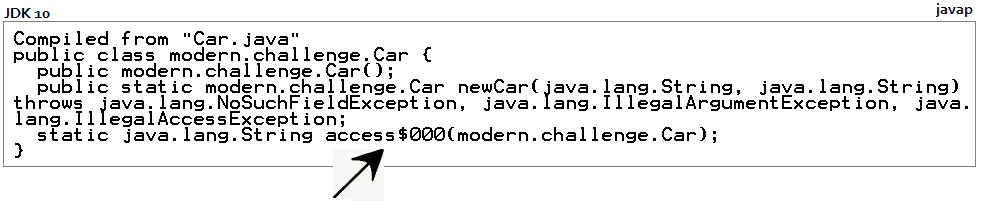
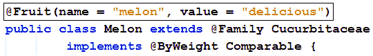
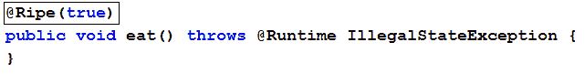
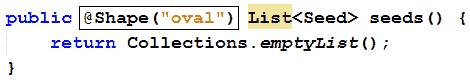
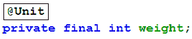
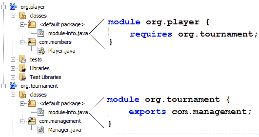
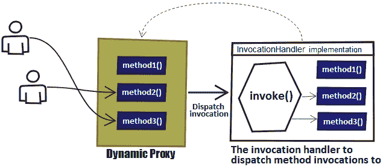

# Java 反射类，接口，构造函数，方法和字段

本章包括 17 个涉及 Java Reflection API 的问题。 从古典主题，例如检查和实例化 Java 工件（例如，模块，包，类，接口，超类，构造函数，方法，注释和阵列）到*合成*和*桥*构造 或基于巢的访问控制（JDK 11），本章提供了 Java 反射 API 的稳定覆盖范围。 到本章结束时，Java 反射 API 将没有秘密遗漏，您将随时向您的同事展示哪些反思可以做些什么。

# 问题

使用以下问题来测试 Java 反射 API 编程实力。 我强烈建议您在转向解决方案并下载示例程序之前尝试举出每个问题：

149.  **检查包：**为检查 Java 软件包（例如，名称，类列表等）编写几个示例。
150.  **检查类和超类：**为检查类和超类写几个例子（例如，通过类名，修饰符，实现的接口，构造函数，方法和字段获取`Class`。
151.  **通过反射构造函数实例化：**写入通过反射创建实例的程序。

152.  **获取接收器类型的注释：**写一个在接收器类型上获取注释的程序。
153.  **获得合成和桥接构造：**通过反射写入*合成*和*桥梁*桥梁的程序。**
154.  **检查变量数量的参数：**写一个检查方法是否获得变量数量的参数。
155.  **检查默认方法：**写一个检查方法是否为`default`的程序。
156.  **基于巢的访问控制通过反射：**编写一个程序，该程序通过反射提供对基于巢构造的访问。
157.  **getters 和 setter 的反射：**编写几个通过反射调用 getter 和 setter 的示例。 此外，编写通过反射生成 Getter 和 Setter 的程序。
158.  **反射注释：**通过反射写出取出不同辅助的几个示例。
159.  **调用实例方法：**编写通过反射调用实例方法的程序。
160.  **获取`static`方法：**编写一个程序，该程序组分组给定类的`static`方法，并通过反射调用其中一个。
161.  **获取通用类型的方法，字段和例外：**编写一个程序，该程序通过反射来获取给定方法，字段和异常的通用类型。
162.  **获取公共和私有字段：**通过反射写一个程序，获取给定类的`public`和`private`字段。
163.  **使用阵列：**写几个例子，用于通过反射使用阵列。
164.  **检查模块：**通过反射写入用于检查 Java 9 模块的几个示例。
165.  **动态代理：**写一个依赖于*动态代理*的程序，用于计算给定接口的方法的调用次数。

# 解决方案

以下部分描述了前述问题的解决方案。 请记住，几乎不是一个正确的方法来解决特定问题。 此外，请记住，这里所示的解释仅包括解决问题所需的最有趣和重要细节。 您可以下载示例解决方案以查看其他详细信息并与 [https://github.com/packtpublishing/java-coding-problems 的程序进行实验](https://github.com/PacktPublishing/Java-Coding-Problems)。

# 149.检查包裹

当我们需要获取有关特定包的信息时，`java.lang.Package`课程是我们的主要焦点。 使用此类，我们可以找到包装的名称，实现此包的供应商，其标题，包的版本等。

此类通常用于查找包含某个类的包的名称。 例如，可以轻松获得`Integer`类的包名称如下：

```
Class clazz = Class.forName("java.lang.Integer");
Package packageOfClazz = clazz.getPackage();

// java.lang
String packageNameOfClazz = packageOfClazz.getName();
```

现在，让我们找到`File`类的包名称：

```
File file = new File(".");
Package packageOfFile = file.getClass().getPackage();

// java.io
String packageNameOfFile = packageOfFile.getName();
```

如果我们正在尝试找到当前类的包名称，那么我们可以依赖于`this.getClass().getPackage().getName()`。 这在非静态上下文中工作。

但是，如果我们想要的只是快速列出当前类加载器的所有包，那么我们可以依赖于`getPackages()`方法，如下所示：

```
Package[] packages = Package.getPackages();
```

基于`getPackages()`方法，我们可以列出由呼叫者类加载器以及其祖先定义的所有包，它从给定的前缀开始，如下所示：

```
public static List<String> fetchPackagesByPrefix(String prefix) {

  return Arrays.stream(Package.getPackages())
    .map(Package::getName)
    .filter(n -> n.startsWith(prefix))
    .collect(Collectors.toList());
}
```

如果此方法生存在名为`Packages`的实用程序类中，那么我们可以按如下方式调用：

```
List<String> packagesSamePrefix 
  = Packages.fetchPackagesByPrefix("java.util");
```

您将看到类似于以下内容的输出：

```
java.util.function, java.util.jar, java.util.concurrent.locks,
java.util.spi, java.util.logging, ...
```

有时，我们只想在系统类加载器中列出所有类的包。 让我们看看我们如何做到这一点。

# 获取包的课程

例如，我们可能希望从当前应用程序的一个包中列出类（例如，`modern.challenge`包）或来自编译时库的一个软件包的类（例如，`commons-lang-2.4.jar` ）。

课程包装在包装中可以存档在罐子里，尽管他们不必是。 为了涵盖这两种情况，我们需要发现给定的包装是否住在罐子里。 我们可以通过通过`ClassLoader.getSystemClassLoader().getResource(package_path)`加载资源并检查资源的返回 URL 来执行此操作。 如果包裹不住在 jar 中，则资源将是与`file:`方案开始的 URL，如以下示例中（我们使用的`modern.challenge`）：

```
file:/D:/Java%20Modern%20Challenge/Code/Chapter%207/Inspect%20packages/build/classes/modern/challenge
```

但如果包裹在 jar 内（例如，`org.apache.commons.lang3.builder`），则 URL 将从`jar:`方案开始，如下例所示：

```
jar:file:/D:/.../commons-lang3-3.9.jar!/org/apache/commons/lang3/builder
```

如果我们考虑到从 jar 的包的资源以`jar:`前缀启动，那么我们可以编写一个区分它们的方法，如下所示：

```
private static final String JAR_PREFIX = "jar:";

public static List<Class<?>> fetchClassesFromPackage(
    String packageName) throws URISyntaxException, IOException {

  List<Class<?>> classes = new ArrayList<>();
  String packagePath = packageName.replace('.', '/');

  URL resource = ClassLoader
    .getSystemClassLoader().getResource(packagePath);

  if (resource != null) {
    if (resource.toString().startsWith(JAR_PREFIX)) {
      classes.addAll(fetchClassesFromJar(resource, packageName));
    } else {
      File file = new File(resource.toURI());
      classes.addAll(fetchClassesFromDirectory(file, packageName));
    }
  } else {
    throw new RuntimeException("Resource not found for package: " 
      + packageName);
  }

  return classes;
}
```

因此，如果给定的包裹在罐子里，那么我们调用另一个辅助方法`fetchClassesFromJar()`; 否则，我们称之为辅助方法`fetchClassesFromDirectory()`。 随着他们的名字建议，这些帮助者知道如何从 jar 或目录中提取给定包的类。

主要是，这两种方法只是*的一些片段*代码，该代码旨在识别具有`.class`扩展的文件。 每个类都通过`Class.forName()`来确保它返回为`Class`，而不是`String`。 两种方法都可以在与本书捆绑在一起的代码中。**

如何从系统类加载器中的包中列出类，例如，来自外部 jar 的包？ 实现这一目标的便捷方式依赖于`URLClassLoader`。 此类用于从引用 JAR 文件和目录的 URL 的搜索路径加载类和资源。 我们只处理罐子，但对于目录也非常简单。

因此，基于给定路径，我们需要获取所有罐子并将其返回为`URL[]`（此数组需要定义`URLClassLoader`）。 例如，我们可以依靠`Files.find()`方法来遍历给定的路径并提取所有罐子，如下所示：

```
public static URL[] fetchJarsUrlsFromClasspath(Path classpath)
    throws IOException {

  List<URL> urlsOfJars = new ArrayList<>();
  List<File> jarFiles = Files.find(
      classpath,
      Integer.MAX_VALUE,
      (path, attr) -> !attr.isDirectory() &&
        path.toString().toLowerCase().endsWith(JAR_EXTENSION))
      .map(Path::toFile)
      .collect(Collectors.toList());

  for (File jarFile: jarFiles) {

    try {
      urlsOfJars.add(jarFile.toURI().toURL());
    } catch (MalformedURLException e) {
      logger.log(Level.SEVERE, "Bad URL for{0} {1}",
        new Object[] {
          jarFile, e
        });
    }
  }

  return urlsOfJars.toArray(URL[]::new);
}
```

请注意，我们正在扫描所有子目录，从给定路径开始。 当然，这是一个设计决策，很容易参数化搜索深度。 目前，让我们从`tomcat8/lib`文件夹中获取 jar（特别是为此安装 Tomcat;只需使用任何其他本地目录并进行适当的修改）：

```
URL[] urls = Packages.fetchJarsUrlsFromClasspath(
  Path.of("D:/tomcat8/lib"));
```

现在，我们可以实例化`URLClassLoader`：

```
URLClassLoader urlClassLoader = new URLClassLoader(
  urls, Thread.currentThread().getContextClassLoader());
```

这将为给定的 URL 构建一个新的`URLClassLoader`对象，并将使用当前类加载器进行委派（第二个参数也可以是`null`）。 我们的`URL[]`仅对 jars 点，而是作为拇指的规则，假设任何`jar:`方案网址引用 JAR 文件，并且假设以`/`结尾的任何`file:`方案 URL 指定为引用 a 目录。

`tomcat8/lib`文件夹中存在的 jar 之一被称为`tomcat-jdbc.jar`。 在这个 jar 中，有一个名为`org.apache.tomcat.jdbc.pool`的包。 让我们列出此包的类：

```
List<Class<?>> classes = Packages.fetchClassesFromPackage(
  "org.apache.tomcat.jdbc.pool", urlClassLoader);
```

`fetchClassesFromPackage()`方法是一个帮助程序，即扫描`URLClassLoader`的`URL[]`阵列，并获取给定包中的类。 它的源代码可使用本书捆绑的代码。

# 检查模块内的包裹

如果我们使用 Java 9 模块化，那么我们的软件包将居住在模块内。 例如，如果我们在一个名为`org.tournament`的模块中的软件包中有一个名为`Manager`的类，那么我们可以获取此模块的所有包装，如下所示：

```
Manager mgt = new Manager();
Set<String> packages = mgt.getClass().getModule().getPackages();
```

另外，如果我们想创建一个类，那么我们需要以下`Class.forName()`味道：

```
Class<?> clazz = Class.forName(mgt.getClass()
  .getModule(), "com.management.Manager");
```

请记住，每个模块都在磁盘上表示为具有相同名称的目录。 例如，`org.tournament`模块位于磁盘上具有此名称的文件夹。 此外，每个模块都被映射为具有此名称的单独罐（例如，`org.tournament.jar`）。 通过铭记这些坐标，从本节调整代码非常简单，使其列出给定模块的给定包的所有类别。

# 150.检查课程

通过使用 Java Reflection API，我们可以检查类 - 对象的类名，修饰符，构造函数，方法，字段，实现接口等的详细信息。

让我们假设我们有以下`Pair`类：

```
public final class Pair<L, R> extends Tuple implements Comparable {

  final L left;
  final R right;

  public Pair(L left, R right) {
    this.left = left;
    this.right = right;
  }

  public class Entry<L, R> {}
    ...
}
```

我们还假设我们有一个实例：

```
Pair pair = new Pair(1, 1);
```

现在，让我们使用反思来获取`Pair`类的名称。

# 通过实例获取该对类的名称

通过具有`Pair`的实例（对象），我们可以通过调用`getClass()`方法以及`Class.getName()`，`getSimpleName()`和`getCanonicalName()`来查找其类的名称，如图所示 以下示例：

```
Class<?> clazz = pair.getClass();

// modern.challenge.Pair
System.out.println("Name: " + clazz.getName());

// Pair
System.out.println("Simple name: " + clazz.getSimpleName());

// modern.challenge.Pair
System.out.println("Canonical name: " + clazz.getCanonicalName());
```

匿名课程没有简单和规范名称。

请注意`getSimpleName()`返回不合格的类名。 或者，我们可以如下获得课程：

```
Class<Pair> clazz = Pair.class;
Class<?> clazz = Class.forName("modern.challenge.Pair");
```

# 获取 Fire 类修饰符

为了获得类的修饰符（`public`，`protected`，`protected`，`final`，`final`，`abstract`和`abstract`），我们可以调用`Class.getModifiers()`方法。 此方法返回表示每个修改器作为标志位的`int`值。 为了解码结果，我们依赖于`Modifier`类，如下所示：

```
int modifiers = clazz.getModifiers();

System.out.println("Is public? " 
  + Modifier.isPublic(modifiers)); // true
System.out.println("Is final? " 
  + Modifier.isFinal(modifiers)); // true
System.out.println("Is abstract? " 
  + Modifier.isAbstract(modifiers)); // false
```

# 获取该基类实现的接口

为了获得由对象表示的类或接口直接实现的接口，我们只需调用`Class.getInterfaces()`。 此方法返回数组。 由于`Pair`类实现单个接口（`Comparable`），因此返回的数组将包含单个元素：

```
Class<?>[] interfaces = clazz.getInterfaces();

// interface java.lang.Comparable
System.out.println("Interfaces: " + Arrays.toString(interfaces));

// Comparable
System.out.println("Interface simple name: " 
  + interfaces[0].getSimpleName());
```

# 获取对类构造函数

可以通过`Class.getConstructors()`类获得类的`public`构造函数。 返回的结果是`Constructor<?>[]`：

```
Constructor<?>[] constructors = clazz.getConstructors();

// public modern.challenge.Pair(java.lang.Object,java.lang.Object)
System.out.println("Constructors: " + Arrays.toString(constructors));
```

用于获取所有声明的构造函数（例如，`private`和`protected`构造函数），调用`getDeclaredConstructors()`。 在搜索某个构造函数时，请调用`getConstructor​(Class<?>... parameterTypes)`或`getDeclaredConstructor​(Class<?>... parameterTypes)`。

# 获取 Fire 类字段

类的所有字段都可以通过`Class.getDeclaredFields()`方法访问。 此方法返回`Field`的数组：

```
Field[] fields = clazz.getDeclaredFields();

// final java.lang.Object modern.challenge.Pair.left
// final java.lang.Object modern.challenge.Pair.right
System.out.println("Fields: " + Arrays.toString(fields));
```

要获取字段的实际名称，我们可以轻松提供辅助方法：

```
public static List<String> getFieldNames(Field[] fields) {

  return Arrays.stream(fields)
    .map(Field::getName)
    .collect(Collectors.toList());
}
```

现在，我们只收到字段的名称：

```
List<String> fieldsName = getFieldNames(fields);

// left, right
System.out.println("Fields names: " + fieldsName);
```

可以通过名为`Object get(Object obj)`的一般方法来完成字段的值，并通过一组`get*Foo*()`方法（考虑详细信息）。 `obj`表示`static`或实例字段。 例如，让我们假设具有名为`callableStatement`的`ProcedureOutputs`字段的`ProcedureOutputs`类是类型`CallableStatement`的`callableStatement`。 让我们使用`Field.get()`方法访问此字段以检查`CallableStatement`是否已关闭：

```
ProcedureOutputs procedureOutputs 
  = storedProcedure.unwrap(ProcedureOutputs.class);

Field csField = procedureOutputs.getClass()
  .getDeclaredField("callableStatement"); 
csField.setAccessible(true);

CallableStatement cs 
  = (CallableStatement) csField.get(procedureOutputs);

System.out.println("Is closed? " + cs.isClosed());
```

仅用于仅获取`public`字段，请调用`getFields()`。 为了搜索某个字段，请调用`getField​(String fieldName)`或`getDeclaredField​(String name)`。

# 获取对类方法

A 类的`public`方法可通过`Class.getMethods()`方法访问。 此方法返回`Method`的数组：

```
Method[] methods = clazz.getMethods();
// public boolean modern.challenge.Pair.equals(java.lang.Object)
// public int modern.challenge.Pair.hashCode()
// public int modern.challenge.Pair.compareTo(java.lang.Object)
// ...
System.out.println("Methods: " + Arrays.toString(methods));
```

要获取方法的实际名称，我们可以快速提供帮助方法：

```
public static List<String> getMethodNames(Method[] methods) {

  return Arrays.stream(methods)
    .map(Method::getName)
    .collect(Collectors.toList());
}
```

现在，我们只检索方法的名称：

```
List<String> methodsName = getMethodNames(methods);

// equals, hashCode, compareTo, wait, wait,
// wait, toString, getClass, notify, notifyAll
System.out.println("Methods names: " + methodsName);
```

用于获取所有已声明的方法（例如，`private`和`protected`），调用`getDeclaredMethods()`。 用于搜索某种方法，调用`getMethod​(String name, Class<?>... parameterTypes)`或`getDeclaredMethod​(String name, Class<?>... parameterTypes)`。

# 获取一对类模块

如果我们使用 JDK 9 模块化，那么我们的课程将在内的模块内。 `Pair`类不在模块中，但我们可以通过 JDK 9 的`Class.getModule()`方法轻松获取类的模块（如果类不在模块中，则此方法返回`null`）：

```
// null, since Pair is not in a Module
Module module = clazz.getModule();
```

# 得到一对类超级类

`Pair`类扩展了`Tuple`类; 因此，`Tuple`类是`Pair`的超类。 我们可以通过`Class.getSuperclass()`方法获得它，如下所示：

```
Class<?> superClass = clazz.getSuperclass();
// modern.challenge.Tuple
System.out.println("Superclass: " + superClass.getName());
```

# 获取某种类型的名称

从 JDK 8 开始，我们可以获得某种类型的名称的信息字符串。

此方法返回与`getName()`，`getSimpleName()`或`getCanonicalName()`中的一个或多个相同的字符串：

*   对于原语，它对所有三种方法返回相同的方法：

```
System.out.println("Type: " + int.class.getTypeName()); // int
```

*   对于`Pair`，它将与`getName()`和`getCanonicalName()`返回相同的东西：

```
// modern.challenge.Pair
System.out.println("Type name: " + clazz.getTypeName());
```

*   对于内部类（如`Entry`为`Pair`），它将与`getName()`返回相同的东西：

```
// modern.challenge.Pair$Entry
System.out.println("Type name: " 
  + Pair.Entry.class.getTypeName());
```

*   对于匿名类，它将与`getName()`返回相同的东西：

```
Thread thread = new Thread() {
  public void run() {
    System.out.println("Child Thread");
  }
};

// modern.challenge.Main$1
System.out.println("Anonymous class type name: "
  + thread.getClass().getTypeName());
```

*   对于数组，它将与`getCanonicalName()`返回相同的东西：

```
Pair[] pairs = new Pair[10];
// modern.challenge.Pair[]
System.out.println("Array type name: " 
  + pairs.getClass().getTypeName());
```

# 获取描述该类的字符串

从 JDK 8 开始，我们可以通过`Class.toGenericString()`方法获取类（包含修饰符，名称，类型参数等）的快速描述。

让我们来看看几个例子：

```
// public final class modern.challenge.Pair<L,R>
System.out.println("Description of Pair: " 
  + clazz.toGenericString());

// public abstract interface java.lang.Runnable
System.out.println("Description of Runnable: " 
  + Runnable.class.toGenericString());

// public abstract interface java.util.Map<K,V>
System.out.println("Description of Map: " 
  + Map.class.toGenericString());
```

# 获取类的类型描述符字符串

从 JDK 12 开始，我们可以通过`Class.descriptorString()`方法获取类作为`String`对象的类描述符：

```
// Lmodern/challenge/Pair;
System.out.println("Type descriptor of Pair: " 
  + clazz.descriptorString());

// Ljava/lang/String;
System.out.println("Type descriptor of String: " 
  + String.class.descriptorString());
```

# 获取数组的组件类型

仅用于阵列，JDK 12 提供了`Class<?> componentType()`方法。 此方法返回阵列的组件类型，如以下两个示例所示：

```
Pair[] pairs = new Pair[10];
String[] strings = new String[] {"1", "2", "3"};

// class modern.challenge.Pair
System.out.println("Component type of Pair[]: " 
  + pairs.getClass().componentType());

// class java.lang.String
System.out.println("Component type of String[]: " 
  + strings.getClass().componentType());
```

# 获取 Array Type 的 Array 类型由配对描述

从 JDK 12 开始，我们可以获得`Class`以获取其组件类型的数组类型，其通过`Class.arrayType()`描述了给定的类：

```
Class<?> arrayClazz = clazz.arrayType();

// modern.challenge.Pair<L,R>[]
System.out.println("Array type: " + arrayClazz.toGenericString());
```

# 151.通过反射的构造函数实例化

我们可以使用 Java Reflection API 通过`Constructor.newInstance()`来实例化 A 类。

让我们考虑以下类，其中有四个构造函数：

```
public class Car {

  private int id;
  private String name;
  private Color color;

  public Car() {}

  public Car(int id, String name) {
    this.id = id;
    this.name = name;
  }

  public Car(int id, Color color) {
    this.id = id;
    this.color = color;
  }

  public Car(int id, String name, Color color) {
    this.id = id;
    this.name = name;
    this.color = color;
  }

  // getters and setters omitted for brevity
}
```

可以通过这四个构造函数之一创建`Car`实例。 `Constructor`类公开了一种方法，该方法采用构造函数的参数的类型，并返回反映匹配的构造函数的`Constructor`对象。 此方法称为`getConstructor​(Class<?>... parameterTypes)`。

让我们调用每个前面的构造函数：

```
Class<Car> clazz = Car.class;

Constructor<Car> emptyCnstr 
  = clazz.getConstructor();

Constructor<Car> idNameCnstr 
  = clazz.getConstructor(int.class, String.class);

Constructor<Car> idColorCnstr 
  = clazz.getConstructor(int.class, Color.class);

Constructor<Car> idNameColorCnstr 
  = clazz.getConstructor(int.class, String.class, Color.class);
```

此外，`Constructor.newInstance​(Object... initargs)`可以返回与调用的构造函数对应的`Car`的实例：

```
Car carViaEmptyCnstr = emptyCnstr.newInstance();

Car carViaIdNameCnstr = idNameCnstr.newInstance(1, "Dacia");

Car carViaIdColorCnstr = idColorCnstr
  .newInstance(1, new Color(0, 0, 0));

Car carViaIdNameColorCnstr = idNameColorCnstr
  .newInstance(1, "Dacia", new Color(0, 0, 0));
```

现在，是时候了解我们如何通过反射实例化`private`构造函数。

# 通过私有构造函数实例化课程

Java 反射 API 可用于通过其`private`构造函数来实例化类。 例如，让我们假设我们有一个名为`Cars`的实用程序类。 在最佳实践之后，我们将定义此类作为`final`，并使用`private`构造函数不允许实例：

```
public final class Cars {

  private Cars() {}
    // static members
}
```

获取此构造函数可以通过`Class.getDeclaredConstructor()`完成，如下所示：

```
Class<Cars> carsClass = Cars.class;
Constructor<Cars> emptyCarsCnstr = carsClass.getDeclaredConstructor();
```

在这种情况下调用`newInstance()`将抛出`IllegalAccessException`，因为调用的构造函数有`private`访问。 但是，Java 反射允许我们通过标志方法进行修改访问级别`Constructor.setAccessible()`。 这次，实例化按预期工作：

```
emptyCarsCnstr.setAccessible(true);
Cars carsViaEmptyCnstr = emptyCarsCnstr.newInstance();
```

为了阻止这种方法，建议从`private`构造函数抛出错误，如下所示：

```
public final class Cars {

  private Cars() {
    throw new AssertionError("Cannot be instantiated");
  }

  // static members
}
```

这次，实例化尝试将失败`AssertionError`。

# 从一个罐子里实例化一个课程

让我们假设我们在`D:/Java Modern Challenge/Code/lib/`文件夹中有 guava jar，我们希望创建一个`CountingInputStream`的实例，并从文件中读取一个字节。

首先，我们为 Guava jar 定义一个`URL[]`数组，如下所示：

```
URL[] classLoaderUrls = new URL[] {
  new URL(
    "file:///D:/Java Modern Challenge/Code/lib/guava-16.0.1.jar")
};
```

然后，我们将为此`URL[]`数组定义`URLClassLoader`：

```
URLClassLoader urlClassLoader = new URLClassLoader(classLoaderUrls);
```

接下来，我们将加载目标类（`CountingInputStream`是一个计算从`InputStream`读取的字节数）的类：

```
Class<?> cisClass = urlClassLoader.loadClass(
  "com.google.common.io.CountingInputStream");
```

载入目标类后，我们可以获取其构造函数（`CountingInputStream`有一个包装给定`InputStream`的单个构造函数）：

```
Constructor<?> constructor 
  = cisClass.getConstructor(InputStream.class);
```

此外，我们可以通过此构造函数创建`CountingInputStream`的实例：

```
Object instance = constructor.newInstance(
  new FileInputStream​(Path.of("test.txt").toFile()));
```

为了确保返回的实例是可操作的，让我们调用其两个方法（`read()`方法一次读取单个字节，而`getCount()`方法返回读取字节的数量）：

```
Method readMethod = cisClass.getMethod("read");
Method countMethod = cisClass.getMethod("getCount");
```

接下来，让我们阅读一个字节，看看`getCount()`返回：

```
readMethod.invoke(instance);
Object readBytes = countMethod.invoke(instance);
System.out.println("Read bytes (should be 1): " + readBytes); // 1
```

# 有用的代码片段

作为奖励，让我们看看使用反射和构造函数时通常需要的几个代码片段。

首先，让我们获取可用构造函数的数量：

```
Class<Car> clazz = Car.class;
Constructor<?>[] cnstrs = clazz.getConstructors();
System.out.println("Car class has " 
  + cnstrs.length + " constructors"); // 4
```

现在，让我们看看这四个构造函数中的每一个参数：

```
for (Constructor<?> cnstr : cnstrs) {
  int paramCount = cnstr.getParameterCount();
  System.out.println("\nConstructor with " 
    + paramCount + " parameters");
}
```

要获取有关构造函数的每个参数的详细信息，我们可以调用`Constructor.getParameters()`。 此方法返回`Parameter`的数组（此类在 JDK 8 中添加，它提供了*解剖* A 参数的全面方法列表：

```
for (Constructor<?> cnstr : cnstrs) {
  Parameter[] params = cnstr.getParameters();
  ...
}
```

如果我们只需要知道参数的类型，那么`Constructor.getParameterTypes()`将完成作业：

```
for (Constructor<?> cnstr : cnstrs) {
  Class<?>[] typesOfParams = cnstr.getParameterTypes();
  ...
}
```

# 152.获取接收器类型的注释

从 JDK 8 开始，我们可以使用显式*接收器*参数。 主要是，这意味着我们可以使用`this` Java 关键字来声明将包含封闭类型的参数的实例方法。

通过显式*接收器*参数，我们可以将型注释附加到`this`。 例如，让我们假设我们有以下注释：

```
@Target({ElementType.TYPE_USE})
@Retention(RetentionPolicy.RUNTIME)
public @interface Ripe {}
```

让我们用它来注释`eat()`方法中的`this`：

```
public class Melon {
  ...
  public void eat(@Ripe Melon this) {}
  ...
}
```

换句话说，如果`Melon`的实例代表成熟的甜瓜，我们只能调用`eat()`方法：

```
Melon melon = new Melon("Gac", 2000);

// works only if the melon is ripe
melon.eat();
```

可以通过 JDK 8 与`java.lang.reflect.Executable.getAnnotatedReceiverType()`方法通过 JDK 8 完成使用反射的显式*接收器*参数的注释。 此方法在`Constructor`和`Method`类中也可用，因此我们可以使用它如下：

```
Class<Melon> clazz = Melon.class;
Method eatMethod = clazz.getDeclaredMethod("eat");

AnnotatedType annotatedType = eatMethod.getAnnotatedReceiverType();

// modern.challenge.Melon
System.out.println("Type: " + annotatedType.getType().getTypeName());

// [@modern.challenge.Ripe()]
System.out.println("Annotations: " 
  + Arrays.toString(annotatedType.getAnnotations()));

// [interface java.lang.reflect.AnnotatedType]
System.out.println("Class implementing interfaces: " 
  + Arrays.toString(annotatedType.getClass().getInterfaces()));

AnnotatedType annotatedOwnerType 
  = annotatedType.getAnnotatedOwnerType();

// null
System.out.println("\nAnnotated owner type: " + annotatedOwnerType);
```

# 153.获得合成和桥梁结构

通过使用*综合*构造，我们可以了解编译器添加的任何构造。 更精确地，符合 Java 语言规范： *Java 编译器引入的任何构造都必须在源代码中具有相应构造的构造必须标记为合成，除了默认构造函数，类初始化方法和值之外* *`*Enum*` *类** 。

有不同种类的*合成*构造（例如，字段，方法和构造函数），但是让我们看一下*合成*字段的示例。 让我们假设我们有以下课程：

```
public class Melon {
  ...
  public class Slice {}
  ...
}
```

请注意，我们有一个名为`Slice`的内部类。 编译代码时，编译器将通过添加 *synthetic* 字段来更改此类，这意味着引用顶级类。 这一个*综合*现场设施从嵌套类访问封闭类成员。

要检查此*合成*字段的存在，让我们获取所有声明的字段并计算它们：

```
Class<Melon.Slice> clazzSlice = Melon.Slice.class;
Field[] fields = clazzSlice.getDeclaredFields();

// 1
System.out.println("Number of fields: " + fields.length);
```

即使我们没有明确声明任何字段，请注意已报告一个字段。 让我们看看它是*合成*，看看它的名字：

```
// true
System.out.println("Is synthetic: " + fields[0].isSynthetic());

// this$0
System.out.println("Name: " + fields[0].getName());
```

类似于此示例，我们可以通过`Method.isSynthetic()`和`Constructor.isSynthetic()`方法检查方法或构造函数是否是*合成的*。

现在，让我们谈谈*桥*方法。 这些方法也是*合成*，其目标是处理泛型的*擦除*。

考虑以下`Melon`类：

```
public class Melon implements Comparator<Melon> {

  @Override
  public int compare(Melon m1, Melon m2) {
    return Integer.compare(m1.getWeight(), m2.getWeight());
  }
  ...
}
```

在这里，我们实现`Comparator`接口并覆盖`compare()`方法。 此外，我们明确指出了`compare()`方法需要两个`Melon`实例。 编译器将继续执行*删除*并创建一个带有两个对象的新方法，如下所示：

```
public int compare(Object m1, Object m2) {
  return compare((Melon) m1, (Melon) m2);
}
```

该方法称为*合成桥*方法。 我们看不到它，但 Java 反射 API 可以：

```
Class<Melon> clazz = Melon.class;
Method[] methods = clazz.getDeclaredMethods();
Method compareBridge = Arrays.asList(methods).stream()
  .filter(m -> m.isSynthetic() && m.isBridge())
  .findFirst()
  .orElseThrow();

// public int modern.challenge.Melon.compare(
// java.lang.Object, java.lang.Object)
System.out.println(compareBridge);
```

# 154.检查变量数量的参数

在 Java 中，如果其签名包含`varargs`类型的参数，则可以接收一个方法的参数。

例如，`plantation()`方法采用可变数量的参数，例如`Seed... seeds`：

```
public class Melon {
  ...
  public void plantation(String type, Seed...seeds) {}
  ...
}
```

现在，Java 反射 API 可以判断此方法是否通过`Method.isVarArgs()`方法支持可变数量的参数，如下所示：

```
Class<Melon> clazz = Melon.class;
Method[] methods = clazz.getDeclaredMethods();

for (Method method: methods) {
  System.out.println("Method name: " + method.getName() 
    + " varargs? " + method.isVarArgs());
}
```

您将收到类似于以下内容的输出：

```
Method name: plantation, varargs? true
Method name: getWeight, varargs? false
Method name: toString, varargs? false
Method name: getType, varargs? false
```

# 155.检查默认方法

Java 8 丰富了与`default`方法的接口的概念。 这些方法是在接口内写入并具有默认实现。 例如，`Slicer`接口具有一个默认方法，称为`slice()`：

```
public interface Slicer {

  public void type();

  default void slice() {
    System.out.println("slice");
  }
}
```

现在，`Slicer`的任何实现必须实现`type()`方法，并且可选地，可以覆盖`slice()`方法或依赖于默认实现。

Java Reflection API 可以通过`Method.isDefault()`标志方法识别`default`方法：

```
Class<Slicer> clazz = Slicer.class;
Method[] methods = clazz.getDeclaredMethods();

for (Method method: methods) {
  System.out.println("Method name: " + method.getName() 
    + ", is default? " + method.isDefault());
}
```

我们将收到以下输出：

```
Method name: type, is default? false
Method name: slice, is default? true
```

# 156.通过反射的基于巢的访问控制

在 JDK 11 的特征中，我们有几个*热点*（在字节级级别的变化）。 其中一个*热点*称为 JEP181，或**基于 Nest 的访问控制**（**嵌套**）。 基本上， *nest* 术语定义了一个新的访问控制上下文，即*允许逻辑上是相同代码实体的类，但是与不同的类文件编译，以访问彼此的私有成员 需要编译器来插入辅助性扩大桥接方法。*

因此，换句话说，*嵌套*允许嵌套类被编译为属于同一封闭类的不同类文件。 然后允许这些在不使用*合成* / *桥*方法的情况下访问彼此的私有类。

让我们考虑以下代码：

```
public class Car {

  private String type = "Dacia";

  public class Engine {

    private String power = "80 hp";

    public void addEngine() {
      System.out.println("Add engine of " + power 
        + " to car of type " + type);
    }
  }
}
```

让我们在 JDK 10 中运行`javap`（允许我们分析字节码的 Java 类文件反汇编工具）在 JDK 10 中为`Car.class`进行分析。以下屏幕截图突出显示本代码的重要部分：



正如我们所看到的，要访问封闭类字段`Car.type`，从`Engine.addEngine()`方法，Java 已更改代码并添加了*桥* `package` - `private`方法，称为`access$000()`。 主要是，这是合成生成的，可以通过使用`Method.isSynthetic()`和`Method.isBridge()`方法来看通过反射来观察。

即使我们看到（或感知）`Car`（外）和`Engine`（嵌套）类是在同一类中的情况下，它们也被编译为不同的文件（`Car.class`和`Car$Engine.class`）。 符合本声明，我们的期望意味着外部和嵌套类可以访问对方的`private`成员。

但在单独的文件中，这是不可能的。 为了维持我们的期望，Java 增加了*合成* *桥* `package` - `private`方法，`access$000()`。

但是，Java 11 介绍了*嵌套*访问控制上下文，它提供了在外部和嵌套类中的`private`访问的支持。 这次，外部和嵌套类与两个属性链接到两个属性，它们形成了*巢*（我们说它们是 *nestmates* ）。 主要是，嵌套类与`NestMembers`属性链接，而外部类链接到`NestHost`属性。 生成额外的*合成*方法。

在以下屏幕截图中，我们可以看到`javap`在 JDK 11 中执行`Car.class`（注意`NestMembers`属性）：


以下屏幕截图显示`Car$Engine.class`的 JDK 11 中的`javap`输出（注意`NestHost`属性）：


# 通过反射 API 访问

没有基于巢的访问控制，反射功能也有限。 例如，在 JDK 11 之前，以下代码片段将抛出`IllegalAccessException`：

```
Car newCar = new Car();
Engine engine = newCar.new Engine();

Field powerField = Engine.class.getDeclaredField("power");
powerField.set(engine, power);
```

我们可以通过显式调用`powerField.setAccessible(true)`来允许访问：

```
...
Field powerField = Engine.class.getDeclaredField("power");
powerField.setAccessible(true);
powerField.set(engine, power);
...
```

从 JDK 11 开始，无需调用`setAccessible()`。

此外，JDK 11 具有三种方法，可以通过支持*嵌套*来丰富 Java Reflection API。 这些方法是`Class.getNestHost()`，`Class.getNestMembers()`和`Class.isNestmateOf()`。

让我们考虑带有几个嵌套类（`Slice`，`Peeler`和`Juicer`）的以下`Melon`类：

```
public class Melon {
  ...
  public class Slice {
    public class Peeler {}
  }

  public class Juicer {}
  ...
}
```

现在，让我们为每个人定义一个`Class`：

```
Class<Melon> clazzMelon = Melon.class;
Class<Melon.Slice> clazzSlice = Melon.Slice.class;
Class<Melon.Juicer> clazzJuicer = Melon.Juicer.class;
Class<Melon.Slice.Peeler> clazzPeeler = Melon.Slice.Peeler.class;
```

为了看到每个班级的`NestHost`，我们需要调用`Class.getNestHost()`：

```
// class modern.challenge.Melon
Class<?> nestClazzOfMelon = clazzMelon.getNestHost();

// class modern.challenge.Melon
Class<?> nestClazzOfSlice = clazzSlice.getNestHost();

// class modern.challenge.Melon
Class<?> nestClazzOfPeeler = clazzPeeler.getNestHost();

// class modern.challenge.Melon
Class<?> nestClazzOfJuicer = clazzJuicer.getNestHost();
```

这里应该突出两件事。 首先，注意`Melon`的`NestHost`本身是`Melon`。 其次，注意`Peeler`的`NestHost`是`Melon`，而不是`Slice`。 由于`Peeler`是`Slice`的内类，我们可能认为其`NestHost`是`Slice`，但这种假设不是真的。

现在，让我们列出每个班级的`NestMembers`：

```
Class<?>[] nestMembersOfMelon = clazzMelon.getNestMembers();
Class<?>[] nestMembersOfSlice = clazzSlice.getNestMembers();
Class<?>[] nestMembersOfJuicer = clazzJuicer.getNestMembers();
Class<?>[] nestMembersOfPeeler = clazzPeeler.getNestMembers();
```

所有这些都将返回相同的`NestMembers`：

```
[class modern.challenge.Melon, class modern.challenge.Melon$Juicer, class modern.challenge.Melon$Slice, class modern.challenge.Melon$Slice$Peeler]
```

最后，让我们来检查*巢 nest* ：

```
boolean melonIsNestmateOfSlice 
  = clazzMelon.isNestmateOf(clazzSlice);  // true

boolean melonIsNestmateOfJuicer 
  = clazzMelon.isNestmateOf(clazzJuicer); // true

boolean melonIsNestmateOfPeeler 
  = clazzMelon.isNestmateOf(clazzPeeler); // true

boolean sliceIsNestmateOfJuicer 
  = clazzSlice.isNestmateOf(clazzJuicer); // true

boolean sliceIsNestmateOfPeeler 
  = clazzSlice.isNestmateOf(clazzPeeler); // true

boolean juicerIsNestmateOfPeeler 
  = clazzJuicer.isNestmateOf(clazzPeeler); // true
```

# 157\. Getters 和 Setter 的反思

正如一个快速提醒，getters 和 setser 是用于访问类的字段的方法（也称为访问器）（例如，`private`字段）。

首先，让我们看看我们如何获取现有的 Getter 和 Setter。 稍后，我们将尝试通过反思生成丢失的吸气器和定居者。

# 获取 getters 和 setter

主要是，通过反射获得课程的 Getters 和 Servers 的解决方案。 让我们假设我们要获取以下`Melon`类的 Getter 和 Setter：

```
public class Melon {

  private String type;
  private int weight;
  private boolean ripe;
  ...

  public String getType() {
    return type;
  }

  public void setType(String type) {
    this.type = type;
  }

  public int getWeight() {
    return weight;
  }

  public void setWeight(int weight) {
    this.weight = weight;
  }

  public boolean isRipe() {
    return ripe;
  }

  public void setRipe(boolean ripe) {
    this.ripe = ripe;
  }
  ...
}
```

让我们从一个解决方案开始，通过反射获取类的所有声明方法（例如，通过`Class.getDeclaredMethods()`）。 现在，循环`Method[]`并通过特定于吸取器和设置器的约束来过滤它（例如，从`get` / `set`前缀开始，返回`void`或某种类型，等等）。

另一种解决方案是通过反射获取类的所有已声明的字段（例如，通过`Class.getDeclaredFields()`）。 现在，循环`Field[]`并尝试通过传递字段的名称（用`get` / `set` / `is`为前缀和第一个字母）和第一个字母的类型来获取 getters 和 setters 领域（在案件中）到它。

最后，更优雅的解决方案将依赖于`PropertyDescriptor`和`Introspector` API。 这些 API 在`java.beans.*`包中可用，致力于使用 JavaBeans。

这两个课程暴露的许多功能依赖于场景后面的反射。

`PropertyDescriptor`类可以返回用于通过`getReadMethod()`读取 javabean 属性的方法。 此外，它可以通过`getWriteMethod()`返回用于编写 JavaBean 属性的方法。 依靠这两种方法，我们可以获取`Melon`类的 Getter 和 Setter，如下所示：

```
for (PropertyDescriptor pd:
    Introspector.getBeanInfo(Melon.class).getPropertyDescriptors()) {

  if (pd.getReadMethod() != null && !"class".equals(pd.getName())) {
    System.out.println(pd.getReadMethod());
  }

  if (pd.getWriteMethod() != null && !"class".equals(pd.getName())) {
    System.out.println(pd.getWriteMethod());
  }
}
```

输出如下：

```
public boolean modern.challenge.Melon.isRipe()
public void modern.challenge.Melon.setRipe(boolean)
public java.lang.String modern.challenge.Melon.getType()
public void modern.challenge.Melon.setType(java.lang.String)
public int modern.challenge.Melon.getWeight()
public void modern.challenge.Melon.setWeight(int)
```

现在，让我们假设我们有以下`Melon`实例：

```
Melon melon = new Melon("Gac", 1000);
```

在这里，我们想调用`getType()` getter：

```
// the returned type is Gac
Object type = new PropertyDescriptor("type",
  Melon.class).getReadMethod().invoke(melon);
```

现在，让我们调用`setWeight()` setter：

```
// set weight of Gac to 2000
new PropertyDescriptor("weight", Melon.class)
  .getWriteMethod().invoke(melon, 2000);
```

调用不证实属性将导致`IntrospectionException`：

```
try {
  Object shape = new PropertyDescriptor("shape",
      Melon.class).getReadMethod().invoke(melon);
  System.out.println("Melon shape: " + shape);
} catch (IntrospectionException e) {
  System.out.println("Property not found: " + e);
}
```

# 生成 Getters 和 Setter

让我们假设`Melon`有三个字段（`type`，`weight`和`ripe`），并且仅定义`type`的 getter 和 setter for `ripe`：

```
public class Melon {

  private String type;
  private int weight;
  private boolean ripe;
  ...

  public String getType() {
    return type;
  }

  public void setRipe(boolean ripe) {
    this.ripe = ripe;
  }
  ...
}
```

为了生成缺少的吸气器和定居者，我们首先识别它们。 以下解决方案循环给定类的已声明的字段，并假设如果以下适用，则`foo`字段没有 getter：

*   没有`get` / `isFoo()`方法
*   返回类型与字段类型不同
*   参数的数量不是 0

对于每个缺少的 getter，此解决方案在映射中添加包含字段名称和类型的条目：

```
private static Map<String, Class<?>> 
    fetchMissingGetters(Class<?> clazz) {

  Map<String, Class<?>> getters = new HashMap<>();
  Field[] fields = clazz.getDeclaredFields();
  String[] names = new String[fields.length];
  Class<?>[] types = new Class<?>[fields.length];

  Arrays.setAll(names, i -> fields[i].getName());
  Arrays.setAll(types, i -> fields[i].getType());

  for (int i = 0; i < names.length; i++) {
    String getterAccessor = fetchIsOrGet(names[i], types[i]);

    try {
      Method getter = clazz.getDeclaredMethod(getterAccessor);
      Class<?> returnType = getter.getReturnType();

      if (!returnType.equals(types[i]) ||
          getter.getParameterCount() != 0) {
        getters.put(names[i], types[i]);
      }
    } catch (NoSuchMethodException ex) {
      getters.put(names[i], types[i]);
      // log exception
    }
  }

  return getters;
}
```

此外，解决方案循环给定类的已声明的字段，并假设如果以下适用，则`*foo*`字段没有设置：

*   该字段不是`final`
*   没有`setFoo()`方法
*   该方法返回`void`
*   该方法具有单个参数
*   参数类型与字段类型相同
*   如果存在参数名称，则应与字段的名称相同

对于每个缺少的 setter，此解决方案添加了包含字段名称和类型的条目：

```
private static Map<String, Class<?>> 
    fetchMissingSetters(Class<?> clazz) {

  Map<String, Class<?>> setters = new HashMap<>();
  Field[] fields = clazz.getDeclaredFields();
  String[] names = new String[fields.length];
  Class<?>[] types = new Class<?>[fields.length];

  Arrays.setAll(names, i -> fields[i].getName());
  Arrays.setAll(types, i -> fields[i].getType());

  for (int i = 0; i < names.length; i++) {
    Field field = fields[i];
    boolean finalField = !Modifier.isFinal(field.getModifiers());

    if (finalField) {
      String setterAccessor = fetchSet(names[i]);

      try {
        Method setter = clazz.getDeclaredMethod(
            setterAccessor, types[i]);

        if (setter.getParameterCount() != 1 ||
            !setter.getReturnType().equals(void.class)) {

          setters.put(names[i], types[i]);
          continue;
        }

        Parameter parameter = setter.getParameters()[0];
        if ((parameter.isNamePresent() &&
              !parameter.getName().equals(names[i])) ||
                !parameter.getType().equals(types[i])) {
          setters.put(names[i], types[i]);
        }
      } catch (NoSuchMethodException ex) {
        setters.put(names[i], types[i]);
        // log exception
      }
    }
  }

  return setters;
}
```

好吧，到目前为止，我们知道哪个领域没有吸尘器和定居者。 他们的名称和类型存储在地图中。 让我们循环地图并生成 getter：

```
public static StringBuilder generateGetters(Class<?> clazz) {

  StringBuilder getterBuilder = new StringBuilder();
  Map<String, Class<?>> accessors = fetchMissingGetters(clazz);

  for (Entry<String, Class<?>> accessor: accessors.entrySet()) {
    Class<?> type = accessor.getValue();
    String field = accessor.getKey();
    String getter = fetchIsOrGet(field, type);

    getterBuilder.append("\npublic ")
      .append(type.getSimpleName()).append(" ")
      .append(getter)
      .append("() {\n")
      .append("\treturn ")
      .append(field)
      .append(";\n")
      .append("}\n");
  }

  return getterBuilder;
}
```

让我们生成定居者：

```
public static StringBuilder generateSetters(Class<?> clazz) {

  StringBuilder setterBuilder = new StringBuilder();
  Map<String, Class<?>> accessors = fetchMissingSetters(clazz);

  for (Entry<String, Class<?>> accessor: accessors.entrySet()) {
    Class<?> type = accessor.getValue();
    String field = accessor.getKey();
    String setter = fetchSet(field);

    setterBuilder.append("\npublic void ")
      .append(setter)
      .append("(").append(type.getSimpleName()).append(" ")
      .append(field).append(") {\n")
      .append("\tthis.")
      .append(field).append(" = ")
      .append(field)
      .append(";\n")
      .append("}\n");
  }

  return setterBuilder;
}
```

前面的解决方案依赖以下列出的三个简单助手。 代码很简单：

```
private static String fetchIsOrGet(String name, Class<?> type) {
  return "boolean".equalsIgnoreCase(type.getSimpleName()) ?
    "is" + uppercase(name) : "get" + uppercase(name);
}

private static String fetchSet(String name) {
  return "set" + uppercase(name);
}

private static String uppercase(String name) {
  return name.substring(0, 1).toUpperCase() + name.substring(1);
}
```

现在，让我们称之为`Melon`类：

```
Class<?> clazz = Melon.class;
StringBuilder getters = generateGetters(clazz);
StringBuilder setters = generateSetters(clazz);
```

输出将显示以下生成的 getters 和 setter：

```
public int getWeight() {
  return weight;
}

public boolean isRipe() {
  return ripe;
}

public void setWeight(int weight) {
  this.weight = weight;
}

public void setType(String type) {
  this.type = type;
}
```

# 158.反思诠释

Java 注释从 Java Reflection API 中有很多关注。 让我们看几种用于检查几种注释的解决方案（例如，包，类和方法）。

主要是，代表支持注释（例如，`Package`，`Constructor`，`Constructor`，`Method`和`Method`和`Field`）的所有主要反射 API 类揭示了一组用于处理注释的常用方法。 常用方法包括：

*   `getAnnotations()`：将特定于某个工件特定的所有注释返回
*   `getDeclaredAnnotations()`：将直接声明给某个工件的所有注释返回
*   `getAnnotation()`：按类型返回注释
*   `getDeclaredAnnotation()`：通过直接声明为某个工件的类型返回注释（JDK 1.8）
*   `getDeclaredAnnotationsByType()`：通过直接声明为某个工件的类型返回所有​​注释（JDK 1.8）
*   `isAnnotationPresent()`：返回`true`如果在给定的工件上找到指定类型的注释

`getAnnotatedReceiverType()` was discussed earlier in the *Get annotation on receiver type* section.

在下一节中，让我们讨论检查包，类，方法等的注释。

# 检查包包注释

包的注释在`package-info.java`中添加到以下屏幕截图中。 在这里，`modern.challenge`包装用`@Packt`注释：


检查包的注释的方便解决方案从其一个类开始。 例如，如果在此包（`modern.challenge`）中，我们有`Melon`类，那么我们可以获得此包的所有注释，如下所示：

```
Class<Melon> clazz = Melon.class;
Annotation[] pckgAnnotations = clazz.getPackage().getAnnotations();
```

通过`Arrays.toString()`打印的`Annotation[]`揭示了一个结果：

```
[@modern.challenge.Packt()]
```

# 检查类注释

`Melon`类具有单个注释，`@Fruit`：



但我们可以通过`getAnnotations()`来获取所有这些：

```
Class<Melon> clazz = Melon.class;
Annotation[] clazzAnnotations = clazz.getAnnotations();
```

通过`Arrays.toString()`打印的返回数组显示了一个结果：

```
[@modern.challenge.Fruit(name="melon", value="delicious")]
```

要访问注释的名称和值属性，我们可以将其投用如下：

```
Fruit fruitAnnotation = (Fruit) clazzAnnotations[0];
System.out.println("@Fruit name: " + fruitAnnotation.name());
System.out.println("@Fruit value: " + fruitAnnotation.value());
```

或者我们可以使用`getDeclaredAnnotation()`方法直接获取右键：

```
Fruit fruitAnnotation = clazz.getDeclaredAnnotation(Fruit.class);
```

# 检查方法注释

让我们检查`@Ripe`从`Melon`类的`eat()`方法的注释：



首先，让我们获取所有声明的注释，然后让我们恢复`@Ripe`：

```
Class<Melon> clazz = Melon.class;
Method methodEat = clazz.getDeclaredMethod("eat");
Annotation[] methodAnnotations = methodEat.getDeclaredAnnotations();
```

通过`Arrays.toString()`打印的返回数组显示了一个结果：

```
[@modern.challenge.Ripe(value=true)]
```

让我们投入`methodAnnotations[0]`到`Ripe`：

```
Ripe ripeAnnotation = (Ripe) methodAnnotations[0];
System.out.println("@Ripe value: " + ripeAnnotation.value());
```

或者我们可以使用`getDeclaredAnnotation()`方法直接获取右键：

```
Ripe ripeAnnotation = methodEat.getDeclaredAnnotation(Ripe.class);
```

# 检查抛出例外的注释

用于检查抛出异常的注释，我们需要调用`getAnnotatedExceptionTypes()`方法：


此方法返回抛出的例外类型包含注释的类型：

```
Class<Melon> clazz = Melon.class;
Method methodEat = clazz.getDeclaredMethod("eat");
AnnotatedType[] exceptionsTypes 
  = methodEat.getAnnotatedExceptionTypes();
```

通过`Arrays.toString()`打印的返回数组显示了一个结果：

```
[@modern.challenge.Runtime() java.lang.IllegalStateException]
```

提取第一异常类型可以完成如下：

```
// class java.lang.IllegalStateException
System.out.println("First exception type: "
  + exceptionsTypes[0].getType());
```

提取第一个异常类型的注释可以如下完成：

```
// [@modern.challenge.Runtime()]
System.out.println("Annotations of the first exception type: " 
  + Arrays.toString(exceptionsTypes[0].getAnnotations()));
```

# 检查返回类型的注释

要检查方法的注释返回，我们需要调用`getAnnotatedReturnType()`方法：



此方法返回给定方法的注释返回类型：

```
Class<Melon> clazz = Melon.class;
Method methodSeeds = clazz.getDeclaredMethod("seeds");
AnnotatedType returnType = methodSeeds.getAnnotatedReturnType();

// java.util.List<modern.challenge.Seed>
System.out.println("Return type: " 
  + returnType.getType().getTypeName());

// [@modern.challenge.Shape(value="oval")]
System.out.println("Annotations of the return type: " 
  + Arrays.toString(returnType.getAnnotations()));
```

# 检查方法的参数注释

拥有方法，我们可以通过调用`getParameterAnnotations()`来检查其参数的注释：


此方法以声明顺序返回包含正式参数上的注释的矩阵（数组）：

```
Class<Melon> clazz = Melon.class;
Method methodSlice = clazz.getDeclaredMethod("slice", int.class);
Annotation[][] paramAnnotations 
  = methodSlice.getParameterAnnotations();
```

通过其注释获取每个参数类型（在这种情况下，我们通过`getParameterTypes()`可以完成`int`具有两个注释的参数。 由于此方法同时维护了声明令，因此我们可以提取一些信息，如下所示：

```
Class<?>[] parameterTypes = methodSlice.getParameterTypes();

int i = 0;
for (Annotation[] annotations: paramAnnotations) {
  Class parameterType = parameterTypes[i++];
  System.out.println("Parameter: " + parameterType.getName());

  for (Annotation annotation: annotations) {
    System.out.println("Annotation: " + annotation);
    System.out.println("Annotation name: " 
      + annotation.annotationType().getSimpleName());
  }
}
```

并且，输出应如下：

```
Parameter type: int
Annotation: @modern.challenge.Ripe(value=true)
Annotation name: Ripe
Annotation: @modern.challenge.Shape(value="square")
Annotation name: Shape
```

# 检查领域的注释

有一个字段，我们可以通过`getDeclaredAnnotations()`来获取其注释：



这是代码：

```
Class<Melon> clazz = Melon.class;
Field weightField = clazz.getDeclaredField("weight");
Annotation[] fieldAnnotations = weightField.getDeclaredAnnotations();
```

获取`@Unit`注释的值可以如下完成：

```
Unit unitFieldAnnotation = (Unit) fieldAnnotations[0];
System.out.println("@Unit value: " + unitFieldAnnotation.value());
```

或者，使用`getDeclaredAnnotation()`方法直接获取右键：

```
Unit unitFieldAnnotation 
  = weightField.getDeclaredAnnotation(Unit.class);
```

# 检查超类的注释

要检查超类的注释，我们需要调用`getAnnotatedSuperclass()`方法：


此方法返回注释的超类类型：

```
Class<Melon> clazz = Melon.class;
AnnotatedType superclassType = clazz.getAnnotatedSuperclass();
```

让我们获得一些信息：

```
// modern.challenge.Cucurbitaceae
 System.out.println("Superclass type: " 
   + superclassType.getType().getTypeName());

 // [@modern.challenge.Family()]
 System.out.println("Annotations: " 
   + Arrays.toString(superclassType.getDeclaredAnnotations()));

 System.out.println("@Family annotation present: " 
   + superclassType.isAnnotationPresent(Family.class)); // true
```

# 检查接口注释

要检查所实现接口的注释，我们需要调用`getAnnotatedInterfaces()`方法：


此方法返回注释的接口类型：

```
Class<Melon> clazz = Melon.class;
AnnotatedType[] interfacesTypes = clazz.getAnnotatedInterfaces();
```

通过`Arrays.toString()`打印的返回数组显示了一个结果：

```
[@modern.challenge.ByWeight() java.lang.Comparable]
```

提取第一接口类型可以完成如下：

```
// interface java.lang.Comparable
System.out.println("First interface type: " 
  + interfacesTypes[0].getType());
```

此外，提取第一接口类型的注释可以如下进行：

```
// [@modern.challenge.ByWeight()]
System.out.println("Annotations of the first exception type: " 
  + Arrays.toString(interfacesTypes[0].getAnnotations()));
```

# 按类型获取注释

在某些组件上具有多个相同类型的注释，我们可以通过`getAnnotationsByType()`来获取所有这些。 对于课程，我们可以如下所述：

```
Class<Melon> clazz = Melon.class;
Fruit[] clazzFruitAnnotations 
  = clazz.getAnnotationsByType(Fruit.class);
```

# 获取声明的注释

尝试通过类型获取的单个注释可以直接在某个伪像上声明，如下例所示：

```
Class<Melon> clazz = Melon.class;
Method methodEat = clazz.getDeclaredMethod("eat");
Ripe methodRipeAnnotation 
  = methodEat.getDeclaredAnnotation(Ripe.class);
```

# 159.调用实例方法

让我们假设我们有以下`Melon`类：

```
public class Melon {
  ...
  public Melon() {}

  public List<Melon> cultivate(
      String type, Seed seed, int noOfSeeds) {

    System.out.println("The cultivate() method was invoked ...");

    return Collections.nCopies(noOfSeeds, new Melon("Gac", 5));
  }
  ...
}
```

我们的目标是调用`cultivate()`方法并通过 Java Reflection API 获取返回。

首先，让我们通过`Method.getDeclaredMethod()`来获取`cultivate()`方法作为`Method`。 我们要做的就是通过方法的名称（在这种情况下，`cultivate()`）和正确类型的参数（`String`，`Seed`和`int`）到`getDeclaredMethod()`。 `getDeclaredMethod()`的第二个参数是`Class<?>`类型的`varargs`，因此，对于没有参数的方法可以为空，或者包含参数类型列表的方法，如下例：

```
Method cultivateMethod = Melon.class.getDeclaredMethod(
  "cultivate", String.class, Seed.class, int.class);
```

然后，让我们获取`Melon`类的实例。 我们想调用一个实例方法; 因此，我们需要一个实例。 依赖于`Melon`的空构造函数和 Java Reflection API，我们可以按如下方式执行以下操作：

```
Melon instanceMelon = Melon.class
  .getDeclaredConstructor().newInstance();
```

最后，我们专注于`Method.invoke()`方法。 主要是，我们需要传递到这种方法，用于调用`cultivate()`方法和参数的某些值的实例：

```
List<Melon> cultivatedMelons = (List<Melon>) cultivateMethod.invoke(
  instanceMelon, "Gac", new Seed(), 10);
```

调用的成功由以下消息揭示：

```
The cultivate() method was invoked ...
```

此外，如果我们通过`System.out.println()`打印调用返回，那么我们得到以下结果：

```
[Gac(5g), Gac(5g), Gac(5g), ...]
```

我们刚刚通过反思培养了 10 个 GAC。

# 160.获得静态方法

让我们假设我们有以下`Melon`类：

```
public class Melon {
  ...
  public void eat() {}

  public void weighsIn() {}

  public static void cultivate(Seed seeds) {
    System.out.println("The cultivate() method was invoked ...");
  }

  public static void peel(Slice slice) {
    System.out.println("The peel() method was invoked ...");
  }

  // getters, setters, toString() omitted for brevity
}
```

此类具有两个`static`方法 - `cultivate()`和`peel()`。 让我们在`List<Method>`中获取这两种方法。

解决此问题的解决方案有两个主要步骤：

1.  获取给定类的所有可用方法
2.  通过`Modifier.isStatic()`方法过滤包含`static`修饰符的那些方法

在代码中，它看起来像这样：

```
List<Method> staticMethods = new ArrayList<>();

Class<Melon> clazz = Melon.class;
Method[] methods = clazz.getDeclaredMethods();

for (Method method: methods) {

  if (Modifier.isStatic(method.getModifiers())) {
    staticMethods.add(method);
  }
}
```

通过`System.out.println()`打印列表的结果如下：

```
[public static void 
  modern.challenge.Melon.peel(modern.challenge.Slice),

 public static void 
  modern.challenge.Melon.cultivate(modern.challenge.Seed)]
```

更进一步，我们可能想调用这两种方法中的一个。

例如，让我们调用`peel()`方法（注意，我们通过`null`而不是`Melon`的实例，因为`static`方法不需要实例）：

```
Method method = clazz.getMethod("peel", Slice.class);
method.invoke(null, new Slice());
```

`peel()`方法已成功调用的输出信号：

```
The peel() method was invoked ...
```

# 161.获取通用类型的方法，字段和异常

让我们假设我们有以下`Melon`类（列出只是与此问题相关的部分）：

```
public class Melon<E extends Exception>
    extends Fruit<String, Seed> implements Comparable<Integer> {

  ...
  private List<Slice> slices;
  ...

  public List<Slice> slice() throws E {
    ...
  }

  public Map<String, Integer> asMap(List<Melon> melons) {
    ...
  }
  ...
}
```

`Melon`类包含几种与不同工件关联的一般类型。 主要是，超级类，接口，类，方法和字段的通用类型是`ParameterizedType`实例。 对于每个`ParameterizedType`，我们需要通过`ParameterizedType.getActualTypeArguments()`来获取实际类型的参数。 可以迭代通过此方法返回的`Type[]`以提取有关每个参数的信息，如下所示：

```
public static void printGenerics(Type genericType) {

  if (genericType instanceof ParameterizedType) {
    ParameterizedType type = (ParameterizedType) genericType;
    Type[] typeOfArguments = type.getActualTypeArguments();

    for (Type typeOfArgument: typeOfArguments) {
      Class classTypeOfArgument = (Class) typeOfArgument;
      System.out.println("Class of type argument: " 
        + classTypeOfArgument);

      System.out.println("Simple name of type argument: " 
        + classTypeOfArgument.getSimpleName());
    }
  }
}
```

现在，让我们看看我们如何处理方法的泛型。

# 泛型方法

例如，让我们获取`slice()`和`asMap()`方法的通用返回类型。 这可以通过`Method.getGenericReturnType()`方法来完成如下：

```
Class<Melon> clazz = Melon.class;

Method sliceMethod = clazz.getDeclaredMethod("slice");
Method asMapMethod = clazz.getDeclaredMethod("asMap", List.class);

Type sliceReturnType = sliceMethod.getGenericReturnType();
Type asMapReturnType = asMapMethod.getGenericReturnType();
```

现在，调用`printGenerics(sliceReturnType)`将输出以下内容：

```
Class of type argument: class modern.challenge.Slice
Simple name of type argument: Slice
```

并且，调用`printGenerics(asMapReturnType)`将输出以下内容：

```
Class of type argument: class java.lang.String
Simple name of type argument: String

Class of type argument: class java.lang.Integer
Simple name of type argument: Integer
```

通过`Method.getGenericParameterTypes()`可以获得方法的通用参数，如下：

```
Type[] asMapParamTypes = asMapMethod.getGenericParameterTypes();
```

此外，我们为每个`Type`（每个泛型参数）调用`printGenerics()`：

```
for (Type paramType: asMapParamTypes) {
  printGenerics(paramType);
}
```

以下是输出（有一个通用参数，`List<Melon>`）：

```
Class of type argument: class modern.challenge.Melon
Simple name of type argument: Melon
```

# 泛型的字段

在字段的情况下（例如，`slices`），可以通过`Field.getGenericType()`来获取泛型，如下所示：

```
Field slicesField = clazz.getDeclaredField("slices");
Type slicesType = slicesField.getGenericType();
```

调用`printGenerics(slicesType)`将输出以下内容：

```
Class of type argument: class modern.challenge.Slice
Simple name of type argument: Slice
```

# 超类的泛型

可以通过调用当前类的`getGenericSuperclass()`方法来实现超类的泛型：

```
Type superclassType = clazz.getGenericSuperclass();
```

调用`printGenerics(superclassType)`将输出以下内容：

```
Class of type argument: class java.lang.String
Simple name of type argument: String

Class of type argument: class modern.challenge.Seed
Simple name of type argument: Seed
```

# 界面的泛型

通过调用当前类的`getGenericInterfaces()`方法，可以通过调用当前类的方法来实现实现的接口的泛型：

```
Type[] interfacesTypes = clazz.getGenericInterfaces();
```

此外，我们为每个`Type`调用`printGenerics()`。 以下是输出（有一个接口，`Comparable<Integer>`）：

```
Class of type argument: class java.lang.Integer
Simple name of type argument: Integer
```

# 泛滥例外

在`TypeVariable`或`ParameterizedType`的情况下，将通用类型的异常物质化。 此时，用于基于`TypeVariable`的关于泛型信息的提取和打印信息的辅助方法可以写入如下：

```
public static void printGenericsOfExceptions(Type genericType) {

  if (genericType instanceof TypeVariable) {
    TypeVariable typeVariable = (TypeVariable) genericType;
    GenericDeclaration genericDeclaration
      = typeVariable.getGenericDeclaration();

    System.out.println("Generic declaration: " + genericDeclaration);

    System.out.println("Bounds: ");
    for (Type type: typeVariable.getBounds()) {
      System.out.println(type);
    }
  }
}
```

拥有此帮助程序，我们可以通过它通过`getGenericExceptionTypes()`通过方法抛出的例外。 如果异常类型是类型变量（`TypeVariable`）或参数化类型（`ParameterizedType`），则会创建。 否则，它已得到解决：

```
Type[] exceptionsTypes = sliceMethod.getGenericExceptionTypes();
```

此外，我们调用每个`Type`的`printGenerics()`：

```
for (Type paramType: exceptionsTypes) {
  printGenericsOfExceptions(paramType);
}
```

输出将如下：

```
Generic declaration: class modern.challenge.Melon
Bounds: class java.lang.Exception
```

最可能，打印有关泛型的提取信息不会有用，因此可以根据您的需求来调整前面的帮助者。 例如，收集信息并将其作为`List`，`Map`等返回。

# 162.获得公共和私人领域

解决此问题的解决方案依赖于`Modifier.isPublic()`和`Modifier.isPrivate()`方法。

让我们假设以下`Melon`类有两个`public`字段和两个`private`字段：

```
public class Melon {

  private String type;
  private int weight;

  public Peeler peeler;
  public Juicer juicer;
  ...
}
```

首先，我们需要通过`getDeclaredFields()`方法获取与此类对应的`Field[]`数组：

```
Class<Melon> clazz = Melon.class;
Field[] fields = clazz.getDeclaredFields();
```

`Field[]`包含前面的所有四个字段。 此外，让我们迭代这个阵列，让我们将`Modifier.isPublic()`和`Modifier.isPrivate()`标志方法应用于每个`Field`：

```
List<Field> publicFields = new ArrayList<>();
List<Field> privateFields = new ArrayList<>();

for (Field field: fields) {
  if (Modifier.isPublic(field.getModifiers())) {
    publicFields.add(field);
  }

  if (Modifier.isPrivate(field.getModifiers())) {
    privateFields.add(field);
  }
}
```

`publicFields`列表仅包含`public`字段，而`privateFields`列表仅包含`private`字段。 如果我们通过`System.out.println()`快速打印这两个列表，则输出将如下：

```
Public fields:
[public modern.challenge.Peeler modern.challenge.Melon.peeler,
public modern.challenge.Juicer modern.challenge.Melon.juicer]

Private fields:
[private java.lang.String modern.challenge.Melon.type,
private int modern.challenge.Melon.weight]
```

# 163.与阵列一起使用

Java Reflection API 附带一个专用于使用数组的类。 此类名为`java.lang.reflect.Array`。

例如，以下代码片段创建了一个`int`的数组。 第一个参数讲述了数组中每个元素的类型应该是什么。 第二个参数表示阵列的长度。 因此，可以通过`Array.newInstance()`定义 10 个整数的数组，如下所示：

```
int[] arrayOfInt = (int[]) Array.newInstance(int.class, 10);
```

使用 Java 反射，我们可以更改数组的内容。 存在一般的`set()`方法和一堆`set*Foo*()`方法（例如，`setInt()`和`setFloat()`）。 将索引 0 到 100 的值设置如下：

```
Array.setInt(arrayOfInt, 0, 100);
```

从数组中获取值可以通过`get()`和`getFoo()`方法（这些方法将数组和索引作为参数完成，并从指定的索引中返回值）：

```
int valueIndex0 = Array.getInt(arrayOfInt, 0);
```

获取数组的`Class`可以如下完成：

```
Class<?> stringClass = String[].class;
Class<?> clazz = arrayOfInt.getClass();
```

我们可以通过`getComponentType()`提取阵列的类型：

```
// int
Class<?> typeInt = clazz.getComponentType();

// java.lang.String
Class<?> typeString = stringClass.getComponentType();
```

# 164.检查模块

Java 9 通过 Java 平台模块系统添加了*模块*的概念。 基本上，模块是由该模块管理的一组包（例如，模块决定哪些软件包在模块外部可见）。

具有两个模块的应用程序可以成形为如下屏幕截图：



有两个模块 - `org.player`和`org.tournament`。 `org.player`模块需要`org.tournament`模块，`org.tournament`模块导出`com.management`包。

Java Reflection API 通过`java.lang.Module`类表示模块（在`java.base module`中）。 通过 Java Reflection API，我们可以提取信息或修改模块。

首先，我们可以在以下两个示例中获取`Module`实例：

```
Module playerModule = Player.class.getModule();
Module managerModule = Manager.class.getModule();
```

可以通过`Module.getName()`方法获得模块的名称：

```
// org.player
System.out.println("Class 'Player' is in module: " 
  + playerModule.getName());

// org.tournament
System.out.println("Class 'Manager' is in module: " 
  + managerModule.getName());
```

具有`Module`实例，我们可以调用几种方法来获取不同的信息。 例如，我们可以了解模块是否命名或导出或打开某个包：

```
boolean playerModuleIsNamed = playerModule.isNamed();   // true
boolean managerModuleIsNamed = managerModule.isNamed(); // true

boolean playerModulePnExported 
  = playerModule.isExported("com.members");     // false
boolean managerModulePnExported 
  = managerModule.isExported("com.management"); // true

boolean playerModulePnOpen 
  = playerModule.isOpen("com.members");     // false
boolean managerModulePnOpen 
  = managerModule.isOpen("com.management"); // false
```

除了获取信息外，`Module`类允许我们更改模块。 例如，`org.player`模块不会将`com.members`包导出到`org.tournament`模块。 我们可以快速检查：

```
boolean before = playerModule.isExported(
  "com.members", managerModule); // false
```

但我们可以通过反思改变这一点。 我们可以通过`Module.addExports()`方法（在我们有`addOpens()`，`addReads()`和`addUses()`中的相同类别中执行此导出：

```
playerModule.addExports("com.members", managerModule);
```

现在，让我们再次检查：

```
boolean after = playerModule.isExported(
  "com.members", managerModule); // true
```

模块也需要自己的描述符。 `ModuleDescriptor`类可以用作与模块一起使用的起点：

```
ModuleDescriptor descriptorPlayerModule 
  = playerModule.getDescriptor();
```

例如，我们可以提取模块的软件包，如下所示：

```
Set<String> pcks = descriptorPlayerModule.packages();
```

# 165.动态代理

*动态代理*可用于支持作为 C **罗斯切割关注的一部分**（ **CCC** ）类别的不同功能的实现。 CCC 是代表核心功能的辅助功能的问题，例如数据库连接管理，事务管理（例如，Spring `@Transactional`），安全性和日志记录。

更准确地说，Java 反射附带一个名为`java.lang.reflect.Proxy`的类，主要目的是提供支持在运行时在运行时创建接口的动态实现。 `Proxy`反映了混凝土界面在运行时的实现。

我们可以将`Proxy`视为*前包装*，将我们的调用传递给正确的方法。 可选地，`Proxy`可以在委派调用之前干扰该过程。

动态代理依赖于单个方法（`invoke()`）（`invoke()`），如下图所示：



如果我们从该图中描绘了流程，那么我们获取以下步骤：

1.  actors 通过暴露的*动态代理*呼叫所需的方法（例如，如果我们想调用`List.add()`方法，我们将通过动态代理，而不是直接）

2.  动态代理将调度调用`InvocationHandler`实现的实例（每个代理实例具有关联的调用处理程序）

3.  调度调用将击中`invoke()`方法作为包含代理对象的三合会，调用的方法（作为`Method`实例）和此方法的参数数组

4.  `InvocationHandler`将运行其他可选功能（例如，CCC），并调用相应的方法

5.  `InvocationHandler`将作为对象返回调用结果

如果我们尝试恢复此流程，那么我们可以通过单个方法（`invoke()`）来说，通过单个类（`InvocationHandler`）来说，动态代理维持多个任意类别的调用。

# 实现动态代理

例如，让我们写一个动态代理，这些代理计算`List`的方法的调用次数。

通过`Proxy.newProxyInstance()`方法创建动态代理。 `newProxyInstance()`方法需要三个参数：

*   `ClassLoader`：这用于加载动态代理类
*   `Class<?>[]`：这是实现的接口数组
*   `InvocationHandler`：这是调用方法调用的调用处理程序

看看这个例子：

```
List<String> listProxy = (List<String>) Proxy.newProxyInstance(
  List.class.getClassLoader(), new Class[] {
    List.class}, invocationHandler);
```

此代码片段返回`List`接口的动态实现。 此外，通过该代理的所有调用将被调度到`invocationHandler`实例。

主要是`InvocationHandler`实现的骨架看起来如下：

```
public class DummyInvocationHandler implements InvocationHandler {

  @Override
  public Object invoke(Object proxy, Method method, Object[] args)
      throws Throwable {
    ...
  }
}
```

由于我们想要计算`List`方法的调用次数，因此我们应该存储所有方法签名和每个方法的调用数。 这可以通过在`CountingInvocationHandler`的构造函数中初始化的`Map`来完成（这是我们的`InvocationHandler`实现，`invocationHandler`是它的实例）：

```
public class CountingInvocationHandler implements InvocationHandler {

  private final Map<String, Integer> counter = new HashMap<>();
  private final Object targetObject;

  public CountingInvocationHandler(Object targetObject) {
    this.targetObject = targetObject;

    for (Method method:targetObject.getClass().getDeclaredMethods()) {
      this.counter.put(method.getName() 
        + Arrays.toString(method.getParameterTypes()), 0);
    }
  }
  ...
}
```

`targetObject`字段持有`List`接口的实现（在这种情况下，`ArrayList`）。

我们创建一个`CountingInvocationHandler`实例如下：

```
CountingInvocationHandler invocationHandler 
  = new CountingInvocationHandler(new ArrayList<>());
```

`invoke()`方法只需使用指定的参数来计算调用并调用`Method`：

```
@Override
public Object invoke(Object proxy, Method method, Object[] args)
    throws Throwable {

  Object resultOfInvocation = method.invoke(targetObject, args);
  counter.computeIfPresent(method.getName() 
    + Arrays.toString(method.getParameterTypes()), (k, v) -> ++v);

  return resultOfInvocation;
}
```

最后，我们公开了一种方法，返回给定方法的调用次数：

```
public Map<String, Integer> countOf(String methodName) {

  Map<String, Integer> result = counter.entrySet().stream()
    .filter(e -> e.getKey().startsWith(methodName + "["))
    .filter(e -> e.getValue() != 0)
    .collect(Collectors.toMap(Entry::getKey, Entry::getValue));

  return result;
}
```

捆绑到本书的代码将这些代码的代码片段粘贴在名为`CountingInvocationHandler`的类中。

此时，我们可以使用`listProxy`来调用几种方法，如下所示：

```
listProxy.add("Adda");
listProxy.add("Mark");
listProxy.add("John");
listProxy.remove("Adda");
listProxy.add("Marcel");
listProxy.remove("Mark");
listProxy.add(0, "Akiuy");
```

让我们看看我们调用的`add()`和`remove()`方法有多少次：

```
// {add[class java.lang.Object]=4, add[int, class java.lang.Object]=1}
invocationHandler.countOf("add");

// {remove[class java.lang.Object]=2}
invocationHandler.countOf("remove");
```

由于通过其两个签名调用了`add()`方法，因此产生的`Map`包含两个条目。

# 概括

这是本章的最后一个问题。 希望我们已经完成了 java 反射 API 的全面遍历。 我们已经详细介绍了关于类，接口，构造函数，方法，字段，注释等的问题。

从本章下载应用程序以查看结果并查看其他详细信息。