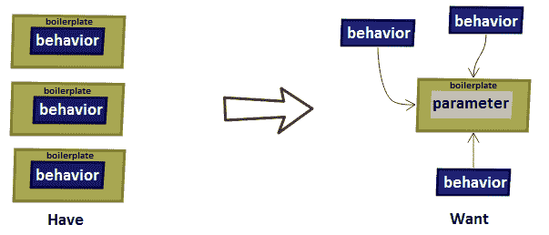
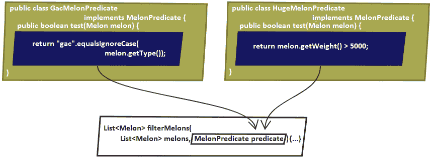
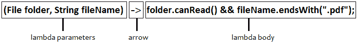
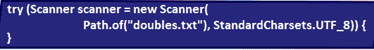
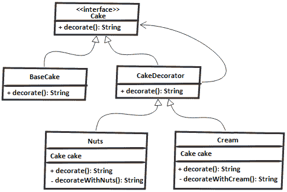

# 功能式规划 - 基础和设计模式

本章包括 11 个涉及 Java 功能式编程的问题。 我们将从一个问题开始，这意味着提供从 0 到功能接口的完整旅程。 然后，我们将继续查看来自 GOF 的一套设计模式，我们将以 Java 功能样式解释。

到本章末尾，您应该熟悉功能式编程，并准备继续使用一系列问题，使我们能够深入潜入本主题。 您应该能够使用一堆以功能式编写的常用设计模式，并对如何发展代码以利用功能界面的方式非常了解。

# 问题

使用以下问题来测试功能样式编程实力。 我强烈建议您在转向解决方案并下载示例程序之前尝试举出每个问题：

166.  **编写功能界面**：编写一个程序，以通过一组有意义的示例将道路定义到功能界面。
167.  **NutShell 中的 lambdas** ：解释λ表达是什么。
168.  **实现模式围绕图案**：写入一个表示基于 lambdas 的模式的执行的程序。

169.  实现工厂模式：写一个表示基于 lambdas 的工厂模式实现的程序。
170.  **实现策略模式**：编写一个程序，表示基于 lambdas 的策略模式的实现。
171.  实现模板方法模式 ：编写一个程序，该程序表示基于 lambdas 的模板方法模式的实现。
172.  **实现观察者模式**：写一个程序，该程序表示基于 lambdas 的观察者模式的实现。
173.  **实现贷款模式**：编写一个代表基于 lambdas 贷款模式实现的程序。
174.  **实现装饰器模式**：写入一个代表基于 LAMBDA 的装饰器模式的实现的程序。
175.  **实现级联构建器模式**：编写一个程序，该程序表示基于 lambdas 的级联构建器模式的实现。
176.  实现命令模式：编写一个程序，表示基于 lambdas 的命令模式的实现。

# 解决方案

以下部分描述了前一个问题的解决方案。 请记住，几乎不是一个正确的方法来解决特定问题。 此外，请记住，这里所示的解释仅包括解决这些问题所需的最有趣和最重要的细节。 您可以下载示例解决方案以查看其他详细信息并与 [https://github.com/packtpublishing/java-coding-problems 的程序进行实验](https://github.com/PacktPublishing/Java-Coding-Problems)。

# 166.写作功能界面

在此解决方案中，我们将突出与几种替代方案相比的功能界面的目的和可用性。 我们将研究如何基于功能界面将代码从其基本和僵化的实现从其基本和刚性的实现中的柔性实现。 为此，让我们考虑以下`Melon`类：

```
public class Melon {

  private final String type;
  private final int weight;
  private final String origin;

  public Melon(String type, int weight, String origin) {
    this.type = type;
    this.weight = weight;
    this.origin = origin;
  }

  // getters, toString(), and so on omitted for brevity
}
```

让我们假设我们有一个客户 - 让我们打电话给他 - 谁想开始兴奋的业务。 基于他的描述，我们塑造了前一类。 他的主要目标是拥有一份库存应用程序，这些应用程序将维持他的想法和决策，因此需要创建一个必须基于业务需求和进化增长的申请。 我们将在以下几个部分中查看在日常开发此应用程序所需的时间。

# 第 1 天（通过它们的类型过滤甜瓜）

有一天，Mark 要求我们为通过它们的类型过滤甜瓜提供一个功能。 因此，我们创建了一个名为`Filters`的实用程序类，并实现了一个`static`方法，它采用瓜子和类型作为参数过滤。

得到的方法非常简单：

```
public static List<Melon> filterByType(
    List<Melon> melons, String type) {

  List<Melon> result = new ArrayList<>();

  for (Melon melon: melons) {
    if (melon != null && type.equalsIgnoreCase(melon.getType())) {
      result.add(melon);
    }
  }

  return result;
}
```

完毕！ 现在，我们可以通过类型轻松过滤瓜，如下例所示：

```
List<Melon> bailans = Filters.filterByType(melons, "Bailan");
```

# 第 2 天（过滤一定重量的瓜）

虽然标记对结果感到满意，但他要求另一个过滤器以获得一定重量的甜瓜（例如，所有甜瓜为 1,200 克）。 我们刚刚为甜瓜类型实现了这样的过滤器，因此我们可以提出一个新的`static`方法，用于一定重量的甜瓜，如下：

```
public static List<Melon> filterByWeight(
    List<Melon> melons, int weight) {

  List<Melon> result = new ArrayList<>();

  for (Melon melon: melons) {
    if (melon != null && melon.getWeight() == weight) {
      result.add(melon);
    }
  }

  return result;
}
```

这类似于`filterByType()`，除了它具有不同的条件/过滤器。 作为开发人员，我们开始了解这一点，如果我们继续这样的话，那么`Filters`类将结束很多方法，只需重复代码并使用不同的条件。 我们非常接近 A *样板代码*案例。

# 第 3 天（通过类型和重量过滤晶元）

事情变得更糟。 Mark 现在要求我们添加一个新的过滤器，以通过类型和体重筛选滤器，并且他很快就需要。 但是，最快的实现是最丑陋的。 看看这个：

```
public static List<Melon> filterByTypeAndWeight(
    List<Melon> melons, String type, int weight) {
  List<Melon> result = new ArrayList<>();

  for (Melon melon: melons) {
    if (melon != null && type.equalsIgnoreCase(melon.getType()) 
        && melon.getWeight() == weight) {
      result.add(melon);
    }
  }

  return result;
}
```

在我们的背景下，这是不可接受的。 如果我们在此添加新的过滤器标准，则代码将变得难以维护以及易于错误。

# 第 4 天（将行为推为参数）

会议时间！ 我们不能继续添加更多的过滤器; 通过每个属性过滤我们可以想到将最终在一个具有很大，复杂的方法的巨大`Filters`类中，具有太多参数和大量 *patherplate* 代码。

主要问题是我们在*水板*代码中有不同的行为。 因此，写入*代码只会才能将行为作为参数推送。 这样，我们可以根据需要塑造任何选择条件/标准作为行为，并根据需要叠加它们。 代码将变得更清晰，灵活，易于维护，参数较少。*

这被称为**行为参数化**，其在下图中被说明（左侧显示我们现在拥有的内容;右侧展示了我们想要的）：



如果我们认为每个选择条件/标准作为行为，那么将每个行为视为界面的实现非常直观。 基本上，所有这些行为都有共同点 - 选择条件/标准和`boolean`类型的返回（这称为**谓词**）。 在接口的上下文中，这是一个可以如下写入的合同：

```
public interface MelonPredicate {
  boolean test(Melon melon);
}
```

此外，我们可以编写`MelonPredicate`的不同实现。 例如，过滤`Gac`甜瓜可以像这样写得：

```
public class GacMelonPredicate implements MelonPredicate {
  @Override
  public boolean test(Melon melon) {
    return "gac".equalsIgnoreCase(melon.getType());
  }
}
```

或者，过滤可以写入比 5,000g 重的所有甜瓜：

```
public class HugeMelonPredicate implements MelonPredicate {
  @Override
  public boolean test(Melon melon) {
    return melon.getWeight() > 5000;
  }
}
```

该技术具有名称 - 策略设计模式。 根据 GOF 的说法，这可以“*定义一个算法系列，封装每个算法，使它们互换。策略模式允许算法独立于客户端不同。*”

因此，主要思想是在运行时动态选择算法的行为。 `MelonPredicate`界面统一专用于选择瓜的所有算法，并且每个实现它是一种策略。

目前，我们有策略，但我们没有任何接收`MelonPredicate`参数的方法。 我们需要一个`filterMelons()`方法，如下图所示：



所以，我们需要一个参数和多个行为。 让我们来看看`filterMelons()`的源代码：

```
public static List<Melon> filterMelons(
    List<Melon> melons, MelonPredicate predicate) {

  List<Melon> result = new ArrayList<>();

  for (Melon melon: melons) {
    if (melon != null && predicate.test(melon)) {
      result.add(melon);
    }
  }

  return result;
}
```

这更好！ 我们可以用不同的行为重用此方法如下（这里，我们通过`GacMelonPredicate`和`HugeMelonPredicate`）：

```
List<Melon> gacs = Filters.filterMelons(
  melons, new GacMelonPredicate());

List<Melon> huge = Filters.filterMelons(
  melons, new HugeMelonPredicate());
```

# 第 5 天（实施另外 100 个过滤器）

马克要求我们实施另外 100 个过滤器。 这次，我们有灵活性和支持来完成此任务，但我们仍需要为每个选择标准提供 100 个策略或类来实现`MelonPredicate`。 此外，我们必须创建这些策略的实例并将其传递给`filterMelons()`方法。

这意味着很多代码和时间。 为了保存两者，我们可以依赖 Java 匿名类。 换句话说，具有没有声明和实例化的名称的类将导致类似的东西：

```
List<Melon> europeans = Filters.filterMelons(
    melons, new MelonPredicate() {
    @Override
    public boolean test(Melon melon) {
      return "europe".equalsIgnoreCase(melon.getOrigin());
    }
});
```

这里有一些进展，但这不是很重要，因为我们仍然需要编写大量代码。 在下图中检查突出显示的代码（此代码为每个实现的行为重复）：


在这里，代码不友好。 匿名课程似乎很复杂，他们的某种方式看起来不完整，奇怪，特别是新手。

# 第 6 天（匿名课程可以写成 lambdas）

一个新的一天，一个新的想法！ 任何智能 IDE 都可以向我们展示前方的道路。 例如，NetBeans IDE 将自由地警告我们，这种匿名类可以被写为 Lambda 表达式。

这在以下屏幕截图中显示：


消息是 Crystal 清除 - 此匿名内部类创建可以变成 Lambda 表达式。 在这里，通过手动转换或让 IDE 为我们做。

结果看起来像这样：

```
List<Melon> europeansLambda = Filters.filterMelons(
  melons, m -> "europe".equalsIgnoreCase(m.getOrigin()));
```

这更好！ Java 8 Lambda 表达式这次做得很好。 现在，我们可以以更灵活，快速，干净，可读和可维护的方式编写 Mark 的过滤器。

# 第 7 天（抽象列表类型）

第二天，马克出现了一些好消息 - 他将延伸他的业务并销售其他水果以及甜瓜。 这很酷，但我们的谓词只支持`Melon`实例。

那么，我们该如何继续支持其他水果？ 有多少其他水果？ 如果标记决定开始销售其他类别的产品，如蔬菜？ 我们不能简单地为每个人创建一个谓词。 这将使我们回到一开始。

显而易见的解决方案是抽出`List`类型。 我们通过定义新接口来启动这一点，此时间命名为`Predicate`（从名称中删除`Melon`）：

```
@FunctionalInterface
public interface Predicate<T> {
  boolean test(T t);
}
```

接下来，我们重写`filterMelons()`方法并将其重命名为`filter()`：

```
public static <T> List<T> filter(
    List<T> list, Predicate<T> predicate) {

  List<T> result = new ArrayList<>();

  for (T t: list) {
    if (t != null && predicate.test(t)) {
      result.add(t);
    }
  }

  return result;
}
```

现在，我们可以为`Melon`编写过滤器：

```
List<Melon> watermelons = Filters.filter(
  melons, (Melon m) -> "Watermelon".equalsIgnoreCase(m.getType()));
```

我们也可以为数字做同样的事情：

```
List<Integer> numbers = Arrays.asList(1, 13, 15, 2, 67);
List<Integer> smallThan10 = Filters
  .filter(numbers, (Integer i) -> i < 10);
```

退后一步，看看我们在哪里以及我们现在的位置。 由于 Java 8 功能界面和 Lambda 表达式，差异很大。 您是否注意到`Predicate`界面上的`@FunctionalInterface`注释？ 嗯，这是一种用于标记功能界面的信息界面类型。 如果标记的接口不起作用，则它对于发生错误是有用的。

概念上，功能界面具有一个抽象方法。 此外，我们定义的`Predicate`接口已在 Java 8 中作为`java.util.function.Predicate`接口存在。 `java.util.function`包包含 40 多个此类接口。 因此，在定义新的之前，建议检查此包的内容。 大多数时候，六个标准内置功能接口将完成作业。 这些列出如下：

*   `Predicate<T>`
*   `Consumer<T>`
*   ``Supplier<T>``
*   `Function<T, R>`
*   `UnaryOperator<T>`
*   `BinaryOperator<T>`

功能界面和 Lambda 表达式成为一个伟大的团队。 Lambda 表达式支持直接内联函数界面的抽象方法的实现。 基本上，整个表达式被认为是功能界面的具体实现的实例，如以下代码所示：

```
Predicate<Melon> predicate = (Melon m) 
  -> "Watermelon".equalsIgnoreCase(m.getType());
```

# 167.兰德斯坚果壳

解剖λ表达将显示三个主要部分，如下图所示：



以下是 Lambda 表达式的每个部分的描述：

*   在箭头的左侧，我们具有此λ在λ机体中使用的该λ的参数。 这些是`FilenameFilter.accept​(File folder, String fileName)`方法的参数。
*   在箭头的右侧，我们有 Lambda 主体，在这种情况下，如果可以读取文件的文件夹，并且如果文件名以`.pdf`后缀结尾。
*   箭头只是 Lambda 参数和身体的分隔符。

此 Lambda 的匿名类版本如下：

```
FilenameFilter filter = new FilenameFilter() {
  @Override
  public boolean accept(File folder, String fileName) {
    return folder.canRead() && fileName.endsWith(".pdf");
  }
};
```

现在，如果我们查看 Lambda 和匿名版本，那么我们可以得出结论，Lambda 表达式是一个简洁的匿名函数，可以作为参数传递给方法或保存在变量中。 我们可以得出结论，可以根据下图所示的四个单词描述 Lambda 表达式：


lambdas 维持行为参数化，这是一个大加（检查前一个问题以获取此详细说明）。 最后，请记住，Lambdas 只能在功能界面的上下文中使用。

# 168.在模式周围实施执行

围绕图案的执行尝试消除围绕特定任务的*样板*代码。 例如，特定于文件的任务需要被代码包围，以便打开和关闭文件。

主要是，围绕模式的执行在方案中有用，这意味着在资源开放式寿命内部发生的任务。 例如，让我们假设我们有一个`Scanner`，我们的第一个任务包括从文件中读取`double`值：

```
try (Scanner scanner = new Scanner(
    Path.of("doubles.txt"), StandardCharsets.UTF_8)) {

  if (scanner.hasNextDouble()) {
    double value = scanner.nextDouble();
  }
}
```

稍后，另一项任务包括打印所有`double`值：

```
try (Scanner scanner = new Scanner(
    Path.of("doubles.txt"), StandardCharsets.UTF_8)) {
  while (scanner.hasNextDouble()) {
    System.out.println(scanner.nextDouble());
  }
}
```

下图突出显示 *patherplate* 围绕这两个任务的代码：



为了避免这种 *b* *oilterplate* 代码，围绕模式的执行依赖于行为参数化（*中进一步详细说明函数接口*部分）。 完成此操作的步骤如下：

1.  第一步是定义与`Scanner -> double`签名匹配的功能界面，这可能会抛出`IOException`：

```
@FunctionalInterface
public interface ScannerDoubleFunction {
  double readDouble(Scanner scanner) throws IOException;
}
```

声明功能界面只是解决方案的一半。

2.  到目前为止，我们可以编写`Scanner -> double`类型的 lambda，但我们需要一种接收它并执行它的方法。 为此，让我们在`Doubles`实用程序类中考虑以下方法：

```
public static double read(ScannerDoubleFunction snf)
    throws IOException {

  try (Scanner scanner = new Scanner(
      Path.of("doubles.txt"), StandardCharsets.UTF_8)) {

    return snf.readDouble(scanner);
  }
}
```

将传递给`read()`方法的 LAMBDA 在该方法的主体内执行。 当我们传递 Lambda 时，我们提供了称为`readDouble()`的`abstract`方法直列的实现。 主要是，这被认为是功能界面，`ScannerDoubleFunction`的实例，因此我们可以调用`readDouble()`方法来获得所需的结果。

3.  现在，我们可以简单地将我们的任务传递为 lambdas 并重用`read()`方法。 例如，我们的任务可以包装在两个`static`方法中，如此所示（此类做法需要获取干净的代码并避免大 Lambdas）：

```
private static double getFirst(Scanner scanner) {
  if (scanner.hasNextDouble()) {
    return scanner.nextDouble();
  }

  return Double.NaN;
}

private static double sumAll(Scanner scanner) {
  double sum = 0.0d;
  while (scanner.hasNextDouble()) {

    sum += scanner.nextDouble();
  }

  return sum;
}
```

4.  将这两个任务作为示例，我们也可以编写其他任务。 让我们将它们传递给`read()`方法：

```
double singleDouble 
  = Doubles.read((Scanner sc) -> getFirst(sc));
double sumAllDoubles 
  = Doubles.read((Scanner sc) -> sumAll(sc));
```

图案周围的执行对于消除用于打开和关闭资源（I / O 操作）的特定的*样板（HTG1]代码非常有用。*

# 169.实施工厂模式

简而言之，出厂模式允许我们在不将实例化进程暴露给呼叫者的情况下创建几种物体。 这样，我们可以隐藏创建对象的复杂和/或敏感过程，并将对象的直观且易于使用的对象工厂揭示到呼叫者。

在经典实现中，出厂模式依赖于实习`switch()`，如以下示例所示：

```
public static Fruit newInstance(Class<?> clazz) {
  switch (clazz.getSimpleName()) {
    case "Gac":
      return new Gac();
    case "Hemi":
      return new Hemi();
    case "Cantaloupe":
      return new Cantaloupe();
    default:
      throw new IllegalArgumentException(
        "Invalid clazz argument: " + clazz);
  }
}
```

这里，`Gac`，`Hemi`和`Cantaloupe`正在实现相同的`Fruit`接口，并具有空构造函数。 如果此方法生存在名为`MelonFactory`的实用程序类中，我们可以称为以下内容：

```
Gac gac = (Gac) MelonFactory.newInstance(Gac.class);
```

但是，Java 8 功能风格允许我们使用*方法参考*技术来指代构造函数。 这意味着我们可以定义一个`Supplier<Fruit>`来引用`Gac`空构造函数，如下所示：

```
Supplier<Fruit> gac = Gac::new;
```

怎么样`Hemi`，`Cantaloupe`，等等？ 嗯，我们可以简单地将所有它们放在`Map`中（注意，这里不实例化甜瓜类型;这些只是懒惰*方法引用*）：

```
private static final Map<String, Supplier<Fruit>> MELONS 
  = Map.of("Gac", Gac::new, "Hemi", Hemi::new,
     "Cantaloupe", Cantaloupe::new);
```

此外，我们可以重写`newInstance()`方法来使用此地图：

```
public static Fruit newInstance(Class<?> clazz) {

    Supplier<Fruit> supplier = MELONS.get(clazz.getSimpleName());

    if (supplier == null) {
      throw new IllegalArgumentException(
        "Invalid clazz argument: " + clazz);
    }

    return supplier.get();
  }
```

来电代码不需要任何进一步的修改：

```
Gac gac = (Gac) MelonFactory.newInstance(Gac.class);
```

但是，显然，构造函数并不总是空的。 例如，以下`Melon`类公开了一个具有三个参数的单个构造函数：

```
public class Melon implements Fruit {

  private final String type;
  private final int weight;
  private final String color;

  public Melon(String type, int weight, String color) {
    this.type = type;
    this.weight = weight;
    this.color = color;
  }
}
```

无法通过空构造函数创建此类的实例。 但是，如果我们定义支持三个参数和返回的功能界面，那么我们就会追溯：

```
@FunctionalInterface
public interface TriFunction<T, U, V, R> {
  R apply(T t, U u, V v);
}
```

这次，以下语句将尝试获取具有`String`，`Integer`和`String`类型的三个参数的构造函数：

```
private static final
  TriFunction<String, Integer, String, Melon> MELON = Melon::new;
```

尤其用于`Melon`类的`newInstance()`方法是：

```
public static Fruit newInstance(
    String name, int weight, String color) {
  return MELON.apply(name, weight, name);
}
```

可以如下创建`Melon`实例：

```
Melon melon = (Melon) MelonFactory.newInstance("Gac", 2000, "red");
```

完毕！ 现在，我们通过功能接口有一个`Melon`的工厂。

# 170.实施战略模式

经典的策略模式非常简单。 它由一个界面组成，代表算法系列（策略）和该接口的几种实现（每个实现是策略）。

例如，以下界面统一删除给定字符串的字符的策略：

```
public interface RemoveStrategy {
  String execute(String s);
}
```

首先，我们将定义从字符串中删除数字值的策略：

```
public class NumberRemover implements RemoveStrategy {
  @Override
  public String execute(String s) {
    return s.replaceAll("\\d", "");
  }
}
```

然后，我们将定义一种从字符串中删除白色空格的策略：

```
public class WhitespacesRemover implements RemoveStrategy {
  @Override
  public String execute(String s) {
    return s.replaceAll("\\s", "");
  }
}
```

最后，让我们定义一个用作策略的入口点的实用类：

```
public final class Remover {

  private Remover() {
    throw new AssertionError("Cannot be instantiated");
  }

  public static String remove(String s, RemoveStrategy strategy) {
    return strategy.execute(s);
  }
}
```

这是一种简单典型的策略模式实现。 如果我们要从字符串中删除数字值，我们可以如下执行以下操作：

```
String text = "This is a text from 20 April 2050";
String noNr = Remover.remove(text, new NumberRemover());
```

但我们真的需要`NumberRemover`和`WhitespacesRemover`课程？ 我们是否需要为进一步的策略编写类似的课程？ 显然，答案是否定的。

再次查看我们的界面：

```
@FunctionalInterface
public interface RemoveStrategy {
  String execute(String s);
}
```

我们刚刚添加了`@FunctionalInterface`提示，因为`RemoveStrategy`接口定义了一个抽象方法，因此它是一个功能界面。

我们可以在功能界面的上下文中使用什么？ 好吧，明显的答案是 lambdas。 而且，在这种情况下，兰德巴可以为我们做些什么？ 它可以删除*样板*代码（在这种情况下，代表策略的类）并封装其身体中的策略：

```
String noNr = Remover.remove(text, s -> s.replaceAll("\\d", ""));
String noWs = Remover.remove(text, s -> s.replaceAll("\\s", ""));
```

因此，这就是策略模式通过 Lambdas 看起来像什么。

# 171.实施模板方法模式

模板方法是 GOF 的经典设计模式，其允许我们在方法中编写算法的骨架，并将该算法的某些步骤推迟到客户端子类。

例如，制作披萨涉及三个主要步骤 - 准备面团，添加浇头，烘烤披萨。 虽然第一步和最后一步可以被视为所有比萨饼的相同（固定步骤），但是对于每种类型的披萨（可变步长）不同的第二步是不同的。

如果我们通过模板方法模式在代码中输入此代码，那么我们获取如下的内容（`make()`方法表示模板方法，并包含明确定义的顺序中的固定和可变步骤）：

```
public abstract class PizzaMaker {

  public void make(Pizza pizza) {
    makeDough(pizza);
    addTopIngredients(pizza);
    bake(pizza);
  }

  private void makeDough(Pizza pizza) {
    System.out.println("Make dough");
  }

  private void bake(Pizza pizza) {
    System.out.println("Bake the pizza");
  }

  public abstract void addTopIngredients(Pizza pizza);
}
```

固定步骤具有默认实现，而变量由称为`addTopIngredients()`的`abstract`方法表示。 此方法由此类的子类实现。 例如，那不勒斯披萨将被抽象如下：

```
public class NeapolitanPizza extends PizzaMaker {

  @Override
  public void addTopIngredients(Pizza p) {
    System.out.println("Add: fresh mozzarella, tomatoes,
      basil leaves, oregano, and olive oil ");
  }
}
```

另一方面，希腊披萨将如下：

```
public class GreekPizza extends PizzaMaker {

  @Override
  public void addTopIngredients(Pizza p) {
    System.out.println("Add: sauce and cheese");
  }
}
```

因此，每种类型的披萨都需要一个覆盖`addTopIngredients()`方法的新类。 最后，我们可以制作披萨这样：

```
Pizza nPizza = new Pizza();
PizzaMaker nMaker = new NeapolitanPizza();
nMaker.make(nPizza);
```

这种方法的缺点包括*样板*代码和冗长。 但是，我们可以通过 lambdas 解决这个缺点。 我们可以表示模板方法的变量步骤作为 lambdas 表达式。 根据案例，我们必须选择适当的功能接口。 在我们的情况下，我们可以依赖 A `Consumer`，如下所示：

```
public class PizzaLambda {

  public void make(Pizza pizza, Consumer<Pizza> addTopIngredients) {
    makeDough(pizza);
    addTopIngredients.accept(pizza);
    bake(pizza);
  }

  private void makeDough(Pizza p) {
    System.out.println("Make dough");
  }

  private void bake(Pizza p) {
    System.out.println("Bake the pizza");
  }
}
```

这一次，不需要定义子类（无需具有`NeapolitanPizza`，`GreekPizza`或其他）。 我们刚刚通过 Lambda 表达式传递变量步骤。 让我们制作一个西西里披萨：

```
Pizza sPizza = new Pizza();
new PizzaLambda().make(sPizza, (Pizza p) 
    -> System.out.println("Add: bits of tomato, onion,
      anchovies, and herbs "));
```

完毕！ 不再需要*样板*代码。 Lambda 解决方案严重改善了溶液。

# 172.实施观察员模式

在简而言之，观察者模式依赖于当某些事件发生时自动通知其用户（称为**观察者**）的对象（称为**主题**）。

例如，消防局总部可以是*主题*，局部消防站可以是*观察者*。 当火灾开始时，消防局总部通知所有当地的消防站，并将其发出火灾正在发生的地址。 每个*观察者*分析所接收的地址，具体取决于不同的标准，决定是否熄灭火灾。

所有本地消防站都通过称为`FireObserver`的接口进行分组。 此方法定义了由消防局总部调用的单个抽象方法（*主题*）：

```
public interface FireObserver {
  void fire(String address);
}
```

每个本地消防站（*观察者*）实现此界面，并决定是否在`fire()`实现中熄灭火灾。 在这里，我们有三个本地站（`Brookhaven`，`Vinings`和`Decatur`）：

```
public class BrookhavenFireStation implements FireObserver {

  @Override
  public void fire(String address) {
    if (address.contains("Brookhaven")) {
      System.out.println(
        "Brookhaven fire station will go to this fire");
    }
  }
}

public class ViningsFireStation implements FireObserver {
  // same code as above for ViningsFireStation
}

public class DecaturFireStation implements FireObserver {
  // same code as above for DecaturFireStation
}
```

一半的工作完成了！ 现在，我们需要注册这些*观察者*，以*主题*通知。 换句话说，每个本地消防站需要注册为消防站总部的*观察者*（*主题*）。 为此，我们声明了另一个接口，该接口定义了*主题*合同，用于注册和通知其*观察者*：

```
public interface FireStationRegister {
  void registerFireStation(FireObserver fo);
  void notifyFireStations(String address);
}
```

最后，我们可以编写消防局总部（*主题*）：

```
public class FireStation implements FireStationRegister {

  private final List<FireObserver> fireObservers = new ArrayList<>();

  @Override
  public void registerFireStation(FireObserver fo) {
    if (fo != null) {
      fireObservers.add(fo);
    }
  }

  @Override
  public void notifyFireStations(String address) {
    if (address != null) {
      for (FireObserver fireObserver: fireObservers) {
        fireObserver.fire(address);
      }
    }
  }
}
```

现在，让我们注册我们的三个本地站（*观察员*）到消防站总部（*主题*）：

```
FireStation fireStation = new FireStation();
fireStation.registerFireStation(new BrookhavenFireStation());
fireStation.registerFireStation(new DecaturFireStation());
fireStation.registerFireStation(new ViningsFireStation());
```

现在，当发生火灾时，消防局总部将通知所有注册的本地消防站：

```
fireStation.notifyFireStations(
  "Fire alert: WestHaven At Vinings 5901 Suffex Green Ln Atlanta");
```

观察者模式在那里成功实施。

这是另一个古典案例 *patherplate* 代码。 每个本地消防站需要一种新的类和实现`fire()`方法。

然而，Lambdas 可以再次帮助我们！ 查看`FireObserver`界面。 它有一个抽象方法; 因此，这是一个功能界面：

```
@FunctionalInterface
public interface FireObserver {
  void fire(String address);
}
```

此功能界面是`Fire.registerFireStation()`方法的参数。 在此上下文中，我们可以将 Lambda 传递给此方法而不是本地消防站的新实例。 λ将含有其体内的行为; 因此，我们可以删除本地站类并依赖于 Lambdas，如下所示：

```
fireStation.registerFireStation((String address) -> {
  if (address.contains("Brookhaven")) {
    System.out.println(
      "Brookhaven fire station will go to this fire");
  }
});

fireStation.registerFireStation((String address) -> {
  if (address.contains("Vinings")) {
    System.out.println("Vinings fire station will go to this fire");
  }
});

fireStation.registerFireStation((String address) -> {
  if (address.contains("Decatur")) {
    System.out.println("Decatur fire station will go to this fire");
  }
});
```

完毕！ 不再 *patherplate* 代码。

# 173.实施贷款模式

在这个问题中，我们将谈谈实施贷款模式。 让我们假设我们有一个包含三个数字的文件（假设，双打），每个数字是公式的系数。 例如，数字 *x* ， *y* 和 *z* 是​​以下两种公式的系数： *x + yz* 和 *xy * sqrt（z）。* 以同样的方式，我们也可以写其他公式。

此时，我们有足够的经验来认识到这种情况听起来很适合行为参数化。 这次，我们没有定义自定义功能界面，我们使用称为`Function<T, R>`的内置功能界面。 此功能界面表示一个接受一个参数并产生结果的函数。 其抽象方法的签名是`R apply(T t)`。

此功能界面成为`static`方法的参数，该方法将旨在实现贷款模式。 让我们将这种方法放在一个名为`Formula`的类中：

```
public class Formula {
  ...
  public static double compute(
      Function<Formula, Double> f) throws IOException {
    ...
  }
}
```

请注意，`compute()`方法在`Formula`类中声明时，`compute()`方法接受`Formula -> Double`类型的 lambdas。 让我们揭示`compute()`的整个源代码：

```
public static double compute(
    Function<Formula, Double> f) throws IOException {

  Formula formula = new Formula();
  double result = 0.0 d;

  try {
    result = f.apply(formula);
  } finally {
    formula.close();
  }

  return result;
}
```

这里应该突出三点。 首先，当我们创建一个新的`Formula`的实例时，我们实际上将一个新的`Scanner`打开到我们的文件（检查此类的`private`构造函数）：

```
public class Formula {

  private final Scanner scanner;
  private double result;

  private Formula() throws IOException {
    result = 0.0 d;

    scanner = new Scanner(
      Path.of("doubles.txt"), StandardCharsets.UTF_8);
  }
  ...
}
```

其次，当我们执行 Lambda 时，我们实际上调用了执行计算（应用公式）的`Formula`的实例方法。 这些方法中的每一种都返回当前实例。 应该调用的实例方法在 Lambda 表达式的主体中定义。

我们只需要以下计算，但可以添加更多信息：

```
public Formula add() {
  if (scanner.hasNextDouble()) {
    result += scanner.nextDouble();
  }

  return this;
}

public Formula minus() {
  if (scanner.hasNextDouble()) {
    result -= scanner.nextDouble();
  }

  return this;
}

public Formula multiplyWithSqrt() {
  if (scanner.hasNextDouble()) {
    result *= Math.sqrt(scanner.nextDouble());
  }

  return this;
}
```

由于计算结果（公式）是一个`double`，我们需要提供一个返回最终结果的终端方法：

```
public double result() {
  return result;
}
```

最后，我们关闭`Scanner`并重置结果。 这发生在`private` `close()`方法中：

```
private void close() {
  try (scanner) {
    result = 0.0 d;
  }
}
```

在命名为`Formula`的类中，这些作品已粘在一起与本书捆绑在一起的代码。

现在，你还记得我们的公式吗？ 我们有 *x + y-z* 和 *x-y * sqrt（z）*。 第一个可以如下写：

```
double xPlusYMinusZ = Formula.compute((sc)
  -> sc.add().add().minus().result());
```

第二个公式可以如下写：

```
double xMinusYMultiplySqrtZ = Formula.compute((sc)
  -> sc.add().minus().multiplyWithSqrt().result());
```

请注意，我们可以专注于我们的公式，我们不需要打开并关闭文件。 此外，流利的 API 允许我们塑造任何公式，并且非常容易丰富更多的操作。

# 174.实施装饰器模式

装饰器模式更喜欢构成遗产; 因此，它是对子类化技术的优雅替代方案。 有了这个，我们主要从基础对象开始，并以动态的方式添加其他功能。

例如，我们可以使用这种模式来装饰蛋糕。 装饰过程不会改变蛋糕本身 - 它只需添加一些螺母，奶油，水果等。

下图说明了我们将实施的内容：



首先，我们创建一个名为`Cake`的界面：

```
public interface Cake {
 String decorate();
}
```

然后，我们通过`BaseCake`实现此接口：

```
public class BaseCake implements Cake {

  @Override
  public String decorate() {
    return "Base cake ";
  }
}
```

之后，我们为此创建一个抽象`CakeDecorator`类`Cake`。 本课程的主要目标是调用给定`Cake`的`decorate()`方法：

```
public class CakeDecorator implements Cake {

  private final Cake cake;

  public CakeDecorator(Cake cake) {
    this.cake = cake;
  }

  @Override
  public String decorate() {
    return cake.decorate();
  }
}
```

接下来，我们专注于写下我们的装饰者。

每个装饰器都会扩展`CakeDecorator`并改变`decorate()`方法以添加相应的装饰。

例如，`Nuts`装饰员如下所示：

```
public class Nuts extends CakeDecorator {

  public Nuts(Cake cake) {
    super(cake);
  }

  @Override
  public String decorate() {
    return super.decorate() + decorateWithNuts();
  }

  private String decorateWithNuts() {
    return "with Nuts ";
  }
}
```

对于简洁的目的，我们跳过`Cream`装饰员。 然而，这个装饰者大多数与`Nuts`大多是相同的。

所以，再次，我们有一些*样板*代码。

现在，我们可以创建一个用螺母和奶油装饰的`Cake`，如下所示：

```
Cake cake = new Nuts(new Cream(new BaseCake()));
// Base cake with Cream with Nuts

System.out.println(cake.decorate());
```

因此，这是装饰器模式的经典实现。 现在，让我们来看看基于 Lambda 的实现，这大幅减少了这段代码。 当我们拥有大量装饰器时，尤其如此。

这次，我们将`Cake`接口转换为类，如下所示：

```
public class Cake {

  private final String decorations;

  public Cake(String decorations) {
    this.decorations = decorations;
  }

  public Cake decorate(String decoration) {
    return new Cake(getDecorations() + decoration);
  }

  public String getDecorations() {
    return decorations;
  }
}
```

这里的高潮是`decorate()`方法。 主要是，此方法将给定装饰应用于现有装饰旁边，并返回一个新的`Cake`。

作为另一个例子，让我们考虑一个具有命名为`brighter()`的方法的`java.awt.Color`类。 此方法创建一个新的`Color`，它是当前`Color`的更亮版本。 类似地，`decorate()`方法创建一个新的`Cake`，即最具装饰版的当前`Cake`。

此外，无需将装饰器写为单独的类。 我们将依靠 Lambdas 将装饰者传递给`CakeDecorator`：

```
public class CakeDecorator {

  private Function<Cake, Cake> decorator;

  public CakeDecorator(Function<Cake, Cake>... decorations) {
    reduceDecorations(decorations);
  }

  public Cake decorate(Cake cake) {
    return decorator.apply(cake);
  }

  private void reduceDecorations(
      Function<Cake, Cake>... decorations) {

    decorator = Stream.of(decorations)
      .reduce(Function.identity(), Function::andThen);
  }
}
```

主要是，这个班级完成了两件事：

*   在构造函数中，它调用`reduceDecorations()`方法。 该方法将通过`Stream.reduce()`和`Function.andThen()`方法将传递的`Function`的阵列链断。 结果是由给定`Function`的阵列组成的单个`Function`。
*   当从`decorate()`方法调用组成的`apply()`方法时，它将逐个应用给定函数的链。 由于给定阵列中的每个`Function`是装饰器，所以组合的`Function`将逐个应用每个装饰器。

让我们创建一个`Cake`装饰着坚果和奶油：

```
CakeDecorator nutsAndCream = new CakeDecorator(
  (Cake c) -> c.decorate(" with Nuts"),
  (Cake c) -> c.decorate(" with Cream"));

Cake cake = nutsAndCream.decorate(new Cake("Base cake"));

// Base cake with Nuts with Cream
System.out.println(cake.getDecorations());
```

完毕！ 考虑使用本书捆绑的代码运行以检查输出。

# 175.实施级联的建设者模式

我们已经在 [](02.html) ，*，immutibility 和切换表达式*中介绍了在*中的此模式，通过构建器模式*部分在*中编写不可变类。 建议是为了快速提醒建造者模式的问题。*

在我们的工具腰带下具有 Classic Builder，让我们假设我们想为提供包裹编写一个类。 主要是，我们要设置接收者的名字，姓氏，地址和包裹内容，然后提供包裹。

我们可以通过 Builder 模式和 Lambdas 来完成此操作，如下所示：

```
public final class Delivery {

  public Delivery firstname(String firstname) {
    System.out.println(firstname);

    return this;
  }

  //similar for lastname, address and content

  public static void deliver(Consumer<Delivery> parcel) {
    Delivery delivery = new Delivery();
    parcel.accept(delivery);

    System.out.println("\nDone ...");
  }
}
```

要提供包裹，我们只需使用 Lambda：

```
Delivery.deliver(d -> d.firstname("Mark")
  .lastname("Kyilt")
  .address("25 Street, New York")
  .content("10 books"));
```

显然，`Consumer<Delivery>`论证促进了使用 lambdas。

# 176.实施命令模式

在简而言之，命令模式用于命令在对象中包装的情况下。 可以在不了解命令本身或命令的接收方的情况下传递此对象。

此模式的经典实现包括多个类。 在我们的方案中，我们有以下几点：

*   `Command`接口负责执行某个操作（在这种情况下，可能的操作是移动，复制和删除）。 该界面的具体实施方式是`CopyCommand`，`MoveCommand`和`DeleteCommand`。
*   `IODevice`接口定义了支持的动作（`move()`，`copy()`和`delete()`）。 `HardDisk`类是`IODevice`的具体实现，代表*接收器*。
*   `Sequence`类是命令的*调用*，它知道如何执行给定的命令。 *调用*可以以不同的方式行动，但在这种情况下，我们只需在调用`runSequence()`时批量记录命令并在批处理中执行它们。

命令模式可以由下图表示：


因此，`HardDisk`实现了`IODevice`界面中给出的操作。 作为*接收器*，当调用某个命令的`execute()`方法时，`HardDisk`负责运行实际操作。 `IODevice`的源代码如下：

```
public interface IODevice {
  void copy();
  void delete();
  void move();
}
```

`HardDisk`是`IODevice`的具体实现：

```
public class HardDisk implements IODevice {

  @Override
  public void copy() {
    System.out.println("Copying ...");
  }

  @Override
  public void delete() {
    System.out.println("Deleting ...");
  }

  @Override
  public void move() {
    System.out.println("Moving ...");
  }
}
```

所有具体命令类都实现了`Command`界面：

```
public interface Command {
  public void execute();
}

public class DeleteCommand implements Command {

  private final IODevice action;

  public DeleteCommand(IODevice action) {
    this.action = action;
  }

  @Override
  public void execute() {
    action.delete()
  }
}
```

以相同的方式，我们已经实现了`CopyCommand`和`MoveCommand`并跳过这些简洁目的。

此外，`Sequence`类充当*调用*类。 *调用*知道如何执行给定的命令，但它没有关于命令实现的任何线索（它只知道命令的界面）。 在这里，我们将命令记录在`List`中，并在调用`runSequence()`方法时在批处理中执行这些命令：

```
public class Sequence {

  private final List<Command> commands = new ArrayList<>();

  public void recordSequence(Command cmd) {
    commands.add(cmd);
  }

  public void runSequence() {
    commands.forEach(Command::execute);
  }

  public void clearSequence() {
    commands.clear();
  }
}
```

现在，让我们在工作中看到它。 让我们在`HardDisk`上执行一批操作：

```
HardDisk hd = new HardDisk();
Sequence sequence = new Sequence();
sequence.recordSequence(new CopyCommand(hd));
sequence.recordSequence(new DeleteCommand(hd));
sequence.recordSequence(new MoveCommand(hd));
sequence.recordSequence(new DeleteCommand(hd));
sequence.runSequence();
```

显然，我们这里有很多*样板*代码。 查看命令的类。 我们真的需要所有这些课程吗？ 嗯，如果我们意识到`Command`界面实际上是一个功能界面，那么我们可以删除它的实现并通过 lambdas 提供行为（命令类只是行为块，因此它们可以通过 lambdas 表示），因此 遵循：

```
HardDisk hd = new HardDisk();
Sequence sequence = new Sequence();
sequence.recordSequence(hd::copy);
sequence.recordSequence(hd::delete);
sequence.recordSequence(hd::move);
sequence.recordSequence(hd::delete);
sequence.runSequence();
```

# 概括

我们现在已到达本章的末尾。 使用 Lambdas 来减少甚至消除*样板*代码是一种可以在其他设计模式和场景中使用的技术。 到目前为止，您累积的知识应该为您提供坚实的基础，以便相应地调整案件。

从本章下载应用程序以查看结果和其他详细信息。