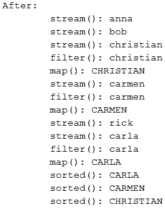
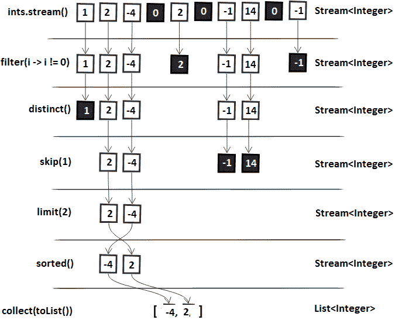
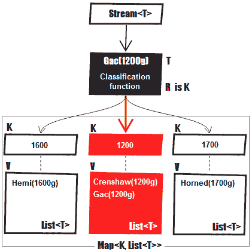
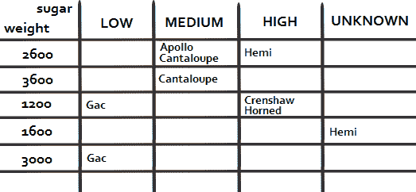
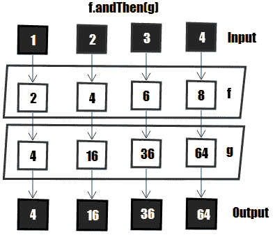

# 函数式编程——深入研究

本章包括 22 个涉及 Java 函数式编程的问题。这里，我们将重点讨论在流中遇到的涉及经典操作的几个问题（例如，`filter`和`map`），并讨论无限流、空安全流和缺省方法。这个问题的综合列表将涵盖分组、分区和收集器，包括 JDK12`teeing()`收集器和编写自定义收集器。此外，还将讨论`takeWhile()`、`dropWhile()`、组合函数、谓词和比较器、Lambda 测试和调试以及其他一些很酷的话题。

一旦您涵盖了本章和上一章，您就可以在生产应用上释放函数式编程了。下面的问题将为您准备各种各样的用例，包括角落用例或陷阱。

# 问题

使用以下问题来测试您的函数式编程能力。我强烈建议您在使用解决方案和下载示例程序之前，先尝试一下每个问题：

177.  **测试高阶函数**：编写几个单元测试来测试所谓的高阶函数。
178.  **使用 Lambda 的测试方法**：为使用 Lambda 的测试方法编写几个单元测试。
179.  **调试 Lambda**：提供一种调试 Lambda 的技术。
180.  **过滤流中的非零元素**：编写流管道，过滤流中的非零元素。
181.  **无限流的`takeWhile()`和`dropWhile()`**：编写几个处理无限流的代码片段。另外，写几个使用`takeWhile()`和`dropWhile()`API 的例子。
182.  **流的映射**：写几个通过`map()`和`flatMap()`映射流的例子。
183.  **查找流中的不同元素**：编写查找流中不同元素的程序。
184.  **匹配流中不同元素**：编写一个匹配流中不同元素的程序。
185.  **流的总和、最大、最小**：通过`Stream`和`Stream.reduce()`的原始类型特化编写计算给定流的总和、最大、最小的程序。
186.  **收集流的结果**：编写一些代码片段，用于收集列表、映射和集合中的流的结果。
187.  **连接流的结果**：写几个代码片段，将流的结果连接到`String`中。
188.  **摘要收集器**：写几个代码片段来展示摘要收集器的用法。
189.  **分组**：编写用于处理`groupingBy()`收集器的代码片段。
190.  **分区**：编写几个代码片段，用于使用`partitioningBy()`收集器。
191.  **过滤、展开和映射收集器**：编写几段代码，举例说明过滤、展开和映射收集器的用法。
192.  **Teeing**：编写几个合并两个收集器（JDK12 和`Collectors.teeing()`的结果的示例。
193.  **编写自定义收集器**：编写一个表示自定义收集器的程序。
194.  **方法引用**：写一个方法引用的例子。
195.  **流的并行处理**：简要介绍流的并行处理。分别为`parallelStream()`、`parallel()`和`spliterator()`提供至少一个示例。
196.  **空安全流**：编写一个程序，从元素或元素集合返回空安全流。
197.  **组合函数、谓词和比较器**：编写几个组合函数、谓词和比较器的示例。
198.  **默认方法**：编写一个包含`default`方法的接口。

以下各节介绍上述问题的解决方案。记住，通常没有一个正确的方法来解决一个特定的问题。另外，请记住，这里显示的解释只包括解决问题所需的最有趣和最重要的细节。您可以从[下载示例解决方案以查看更多详细信息并尝试程序](https://github.com/PacktPublishing/Java-Coding-Problems)。

# 177 测试高阶函数

*高阶函数*是用来描述返回函数或将函数作为参数的函数的术语。

基于此语句，在 Lambda 上下文中测试高阶函数应包括两种主要情况：

*   测试以 Lambda 作为参数的方法
*   测试返回函数式接口的方法

我们将在接下来的部分中了解这两个测试。

# 测试以 Lambda 作为参数的方法

将 Lambda 作为参数的方法的测试可以通过向该方法传递不同的 Lambda 来完成。例如，假设我们有以下函数式接口：

```java
@FunctionalInterface
public interface Replacer<String> {
  String replace(String s);
}
```

我们还假设我们有一个方法，该方法接受`String -> String`类型的 Lambda，如下所示：

```java
public static List<String> replace(
    List<String> list, Replacer<String> r) {

  List<String> result = new ArrayList<>();
  for (String s: list) {
    result.add(r.replace(s));
  }

  return result;
}
```

现在，让我们使用两个 Lambda 为这个方法编写一个 JUnit 测试：

```java
@Test
public void testReplacer() throws Exception {

  List<String> names = Arrays.asList(
    "Ann a 15", "Mir el 28", "D oru 33");

  List<String> resultWs = replace(
    names, (String s) -> s.replaceAll("\\s", ""));
  List<String> resultNr = replace(
    names, (String s) -> s.replaceAll("\\d", ""));

  assertEquals(Arrays.asList(
    "Anna15", "Mirel28", "Doru33"), resultWs);
  assertEquals(Arrays.asList(
    "Ann a ", "Mir el ", "D oru "), resultNr);
}
```

# 测试返回函数式接口的方法

另一方面，测试返回函数式接口的方法可以解释为测试该函数式接口的行为。让我们考虑以下方法：

```java
public static Function<String, String> reduceStrings(
    Function<String, String> ...functions) {

  Function<String, String> function = Stream.of(functions)
    .reduce(Function.identity(), Function::andThen);

  return function;
}
```

现在，我们可以测试返回的`Function<String, String>`的行为，如下所示：

```java
@Test
public void testReduceStrings() throws Exception {

  Function<String, String> f1 = (String s) -> s.toUpperCase();
  Function<String, String> f2 = (String s) -> s.concat(" DONE");

  Function<String, String> f = reduceStrings(f1, f2);

  assertEquals("TEST DONE", f.apply("test"));
}
```

# 178 测试使用 Lambda 的方法

让我们从测试一个没有包装在方法中的 Lambda 开始。例如，以下 Lambda 与一个字段关联（用于重用），我们要测试其逻辑：

```java
public static final Function<String, String> firstAndLastChar
  = (String s) -> String.valueOf(s.charAt(0))
    + String.valueOf(s.charAt(s.length() - 1));
```

让我们考虑到 Lambda 生成函数式接口实例；然后，我们可以测试该实例的行为，如下所示：

```java
@Test
public void testFirstAndLastChar() throws Exception {

  String text = "Lambda";
  String result = firstAndLastChar.apply(text);
  assertEquals("La", result);
}
```

另一种解决方案是将 Lambda 包装在方法调用中，并为方法调用编写单元测试。

通常，Lambda 用于方法内部。对于大多数情况，测试包含 Lambda 的方法是可以接受的，但是在有些情况下，我们需要测试 Lambda 本身。这个问题的解决方案包括三个主要步骤：

1.  用`static`方法提取 Lambda
2.  用*方法引用*替换 Lambda
3.  测试这个`static`方法

例如，让我们考虑以下方法：

```java
public List<String> rndStringFromStrings(List<String> strs) {

  return strs.stream()
    .map(str -> {
      Random rnd = new Random();
      int nr = rnd.nextInt(str.length());
      String ch = String.valueOf(str.charAt(nr));

      return ch;
    })
    .collect(Collectors.toList());
}
```

我们的目标是通过此方法测试 Lambda：

```java
str -> {
  Random rnd = new Random();
  int nr = rnd.nextInt(str.length());
  String ch = String.valueOf(str.charAt(nr));

  return ch;
})
```

那么，让我们应用前面的三个步骤：

1.  让我们用`static`方法提取这个 Lambda：

```java
public static String extractCharacter(String str) {

  Random rnd = new Random();
  int nr = rnd.nextInt(str.length());
  String chAsStr = String.valueOf(str.charAt(nr));

  return chAsStr;
}
```

2.  让我们用相应的方法引用替换 Lambda：

```java
public List<String> rndStringFromStrings(List<String> strs) {

  return strs.stream()
    .map(StringOperations::extractCharacter)
    .collect(Collectors.toList());
}
```

3.  让我们测试一下`static`方法（即 Lambda）：

```java
@Test
public void testRndStringFromStrings() throws Exception {

  String str1 = "Some";
  String str2 = "random";
  String str3 = "text";

  String result1 = extractCharacter(str1);
  String result2 = extractCharacter(str2);
  String result3 = extractCharacter(str3);

  assertEquals(result1.length(), 1);
  assertEquals(result2.length(), 1);
  assertEquals(result3.length(), 1);
  assertThat(str1, containsString(result1));
  assertThat(str2, containsString(result2));
  assertThat(str3, containsString(result3));
}
```

建议避免使用具有多行代码的 Lambda。因此，通过遵循前面的技术，Lambda 变得易于测试。

# 179 调试 Lambda

在调试 Lambda 时，至少有三种解决方案：

*   检查栈跟踪
*   日志
*   依赖 IDE 支持（例如，NetBeans、Eclipse 和 IntelliJ IDEA 支持调试 Lambda，*开箱即用*或为其提供插件）

让我们把重点放在前两个方面，因为依赖 IDE 是一个非常大和具体的主题，不在本书的范围内。

检查 Lambda 或流管道中发生的故障的栈跟踪可能非常令人费解。让我们考虑以下代码片段：

```java
List<String> names = Arrays.asList("anna", "bob", null, "mary");

names.stream()
  .map(s -> s.toUpperCase())
  .collect(Collectors.toList());
```

因为这个列表中的第三个元素是`null`，所以我们将得到一个`NullPointerException`，并且定义流管道的整个调用序列都被公开，如下面的屏幕截图所示：


突出显示的行告诉我们这个`NullPointerException`发生在一个名为`lambda$main$5`的 Lambda 表达式中。由于 Lambda 没有名称，因此此名称是由编译器编写的。此外，我们不知道哪个元素是`null`。

因此，我们可以得出结论，报告 Lambda 或流管道内部故障的栈跟踪不是很直观。

或者，我们可以尝试记录输出。这将帮助我们调试流中的操作管道。这可以通过`forEach()`方法实现：

```java
List<String> list = List.of("anna", "bob",
  "christian", "carmen", "rick", "carla");

list.stream()
  .filter(s -> s.startsWith("c"))
  .map(String::toUpperCase)
  .sorted()
  .forEach(System.out::println);
```

这将为我们提供以下输出：

```java
CARLA
CARMEN
CHRISTIAN
```

在某些情况下，这种技术可能很有用。当然，我们必须记住，`forEach()`是一个终端操作，因此流将被消耗。因为一个流只能被消费一次，所以这可能是一个问题。

而且，如果我们在列表中添加一个`null`值，那么输出将再次变得混乱。

一个更好的选择是依靠`peek()`方法。这是一个中间操作，它对当前元素执行某个操作，并将该元素转发到管道中的下一个操作。下图显示了工作中的`peek()`操作：


让我们看看代码形式：

```java
System.out.println("After:");

names.stream()
  .peek(p -> System.out.println("\tstream(): " + p))
  .filter(s -> s.startsWith("c"))
  .peek(p -> System.out.println("\tfilter(): " + p))
  .map(String::toUpperCase)
  .peek(p -> System.out.println("\tmap(): " + p))
  .sorted()
  .peek(p -> System.out.println("\tsorted(): " + p))
  .collect(Collectors.toList());
```

以下是我们可能收到的输出示例：



现在，我们故意在列表中添加一个`null`值，然后再次运行：

```java
List<String> names = Arrays.asList("anna", "bob", 
  "christian", null, "carmen", "rick", "carla");
```

在向列表中添加一个`null`值后获得以下输出：


这一次，我们可以看到在应用了`stream()`之后出现了`null`值。因为`stream()`是第一个操作，所以我们可以很容易地发现错误存在于列表内容中。

# 180 过滤流中的非零元素

在第 8 章、“函数式编程——基础与设计模式”中，在“编写函数式接口”部分，我们定义了一个基于函数式接口`Predicate`的`filter()`方法。Java 流 API 已经有了这样的方法，函数式接口称为`java.util.function.Predicate`。

假设我们有以下`List`个整数：

```java
List<Integer> ints = Arrays.asList(1, 2, -4, 0, 2, 0, -1, 14, 0, -1);
```

流式传输此列表并仅提取非零元素可以按如下方式完成：

```java
List<Integer> result = ints.stream()
  .filter(i -> i != 0)
  .collect(Collectors.toList());
```

结果列表将包含以下元素：1、2、-4、2、-1、14、-1

下图显示了`filter()`如何在内部工作：


注意，对于几个常见的操作，Java 流 API 已经提供了现成的中间操作。因此，不需要提供`Predicate`。其中一些操作如下：

*   `distinct()`：从流中删除重复项
*   `skip(`n`)`：丢弃前`n`个元素
*   `limit(`s`)`：截断流长度不超过`s`
*   `sorted()`：根据自然顺序对河流进行排序
*   `sorted(Comparator<? super T> comparator)`：根据给定的`Comparator`对流进行排序

让我们将这些操作和一个`filter()`添加到一个示例中。我们将过滤零，过滤重复项，跳过 1 个值，将剩余的流截断为两个元素，并按其自然顺序排序：

```java
List<Integer> result = ints.stream()
  .filter(i -> i != 0)
  .distinct()
  .skip(1)
  .limit(2)
  .sorted()
  .collect(Collectors.toList());
```

结果列表将包含以下两个元素：`-4`和`2`。

下图显示了此流管道如何在内部工作：



当`filter()`操作需要复杂/复合或长期条件时，建议采用辅助`static`方法提取，并依赖*方法引用*。因此，避免这样的事情：

```java
List<Integer> result = ints.stream()
  .filter(value -> value > 0 && value < 10 && value % 2 == 0)
  .collect(Collectors.toList());
```

您应该更喜欢这样的内容（`Numbers`是包含辅助方法的类）：

```java
List<Integer> result = ints.stream()
  .filter(Numbers::evenBetween0And10)
  .collect(Collectors.toList());

private static boolean evenBetween0And10(int value) {
  return value > 0 && value < 10 && value % 2 == 0;
}
```

# 181 无限流、`takeWhile()`和`dropWhile()`

在这个问题的第一部分，我们将讨论无限流。在第二部分中，我们将讨论`takeWhile()`和`dropWhile()`api。

无限流是无限期地创建数据的流。因为流是懒惰的，它们可以是无限的。更准确地说，创建无限流是作为中间操作完成的，因此在执行管道的终端操作之前，不会创建任何数据。

例如，下面的代码理论上将永远运行。此行为由`forEach()`终端操作触发，并由缺少约束或限制引起：

```java
Stream.iterate(1, i -> i + 1)
  .forEach(System.out::println);
```

Java 流 API 允许我们以多种方式创建和操作无限流，您很快就会看到。

此外，根据定义的*相遇顺序*，可以*有序*或*无序*。流是否有*相遇顺序*取决于数据源和中间操作。例如，`Stream`以`List`作为其源，因为`List`具有内在顺序，所以对其进行排序。另一方面，`Stream`以`Set`作为其来源是无序的，因为`Set`不保证有序。一些中间操作（例如，`sorted()`）可以向无序的`Stream`施加命令，而一些终端操作（例如，`forEach()`）可以忽略遭遇命令。

通常，顺序流的性能不受排序的显著影响，但是取决于所应用的操作，并行流的性能可能会受到顺序`Stream`的存在的显著影响。

不要把`Collection.stream().forEach()`和`Collection.forEach()`混为一谈。虽然`Collection.forEach()`可以依靠集合的迭代器（如果有的话）来保持顺序，`Collection.stream().forEach()`的顺序没有定义。例如，通过`list.forEach()`多次迭代`List`将按插入顺序处理元素，而`list.parallelStream().forEach()`在每次运行时产生不同的结果。根据经验，如果不需要流，则通过`Collection.forEach()`对集合进行迭代。

我们可以通过`BaseStream.unordered()`将有序流转化为无序流，如下例所示：

```java
List<Integer> list 
  = Arrays.asList(1, 4, 20, 15, 2, 17, 5, 22, 31, 16);

Stream<Integer> unorderedStream = list.stream()
  .unordered();
```

# 无限有序流

通过`Stream.iterate​(T seed, UnaryOperator<T> f)`可以得到无限的有序流。结果流从指定的种子开始，并通过将`f`函数应用于前一个元素（例如，`n`元素是`f(n-1)`来继续）。

例如，类型 1、2、3、…、n 的整数流可以如下创建：

```java
Stream<Integer> infStream = Stream.iterate(1, i -> i + 1);
```

此外，我们可以将此流用于各种目的。例如，让我们使用它来获取前 10 个偶数整数的列表：

```java
List<Integer> result = infStream
  .filter(i -> i % 2 == 0)
  .limit(10)
  .collect(Collectors.toList());
```

`List`内容如下（注意无限流将创建元素 1、2、3、…、20，但只有以下元素与我们的过滤器匹配，直到达到 10 个元素的限制）：

```java
2, 4, 6, 8, 10, 12, 14, 16, 18, 20
```

注意`limit()`中间操作的存在。它的存在是强制的；否则，代码将无限期运行。我们必须显式地丢弃流；换句话说，我们必须显式地指定在最终列表中应该收集多少与我们的过滤器匹配的元素。一旦达到极限，无限流就会被丢弃。

但是假设我们不想要前 10 个偶数整数的列表，实际上我们希望直到 10（或任何其他限制）的偶数的列表。从 JDK9 开始，我们可以通过一种新的味道`Stream.iterate()`来塑造这种行为。这种味道让我们可以直接将`hasNext`谓词嵌入流声明（`iterate​(T seed, Predicate<? super T> hasNext, UnaryOperator<T> next)`。当`hasNext`谓词返回`false`后，流即终止：

```java
Stream<Integer> infStream = Stream.iterate(
  1, i -> i <= 10, i -> i + 1);
```

这一次，我们可以删除`limit()`中间操作，因为我们的`hasNext`谓词施加了 10 个元素的限制：

```java
List<Integer> result = infStream
  .filter(i -> i % 2 == 0)
  .collect(Collectors.toList());
```

结果`List`如下（与我们的`hasNext`谓词一致，无限流创建元素 1、2、3、…、10，但只有以下五个元素与我们的流过滤器匹配）：

```java
2, 4, 6, 8, 10
```

当然，我们可以将`Stream.iterate()`和`limit()`的味道结合起来形成更复杂的场景。例如，下面的流将创建新元素，直到*下一个*谓词`i -> i <= 10`。因为我们使用的是随机值，`hasNext`谓词返回`false`的时刻是不确定的：

```java
Stream<Integer> infStream = Stream.iterate(
  1, i -> i <= 10, i -> i + i % 2 == 0 
    ? new Random().nextInt(20) : -1 * new Random().nextInt(10));
```

此流的一个可能输出如下：

```java
1, -5, -4, -7, -4, -2, -8, -8, ..., 3, 0, 4, -7, -6, 10, ...
```

现在，下面的管道将收集最多 25 个通过`infStream`创建的数字：

```java
List<Integer> result = infStream
  .limit(25)
  .collect(Collectors.toList());
```

现在，无限流可以从两个地方丢弃。如果`hasNext`谓词返回`false`，直到我们收集了 25 个元素，那么此时我们仍然保留收集的元素（少于 25 个）。如果直到我们收集了 25 个元素，`hasNext`谓词才返回`false`，那么`limit()`操作将丢弃流的其余部分。

# 无限伪随机值流

如果我们想要创建无限的伪随机值流，我们可以依赖于`Random`的方法，例如`ints()`、`longs()`和`doubles()`。例如，伪随机整数值的无限流可以声明如下（生成的整数将在[1100]范围内）：

```java
IntStream rndInfStream = new Random().ints(1, 100);
```

尝试获取 10 个偶数伪随机整数值的列表可以依赖于此流：

```java
List<Integer> result = rndInfStream
  .filter(i -> i % 2 == 0)
  .limit(10)
  .boxed()
  .collect(Collectors.toList());
```

一种可能的输出如下：

```java
8, 24, 82, 42, 90, 18, 26, 96, 86, 86
```

这一次，在收集到上述列表之前，很难说实际生成了多少个数字。

`ints()`的另一种味道是`ints​(long streamSize, int randomNumberOrigin, int randomNumberBound)`。第一个参数允许我们指定应该生成多少伪随机值。例如，下面的流将在`[1100]`范围内正好生成 10 个值：

```java
IntStream rndInfStream = new Random().ints(10, 1, 100);
```

我们可以从这 10 中取偶数值，如下所示：

```java
List<Integer> result = rndInfStream
  .filter(i -> i % 2 == 0)
  .boxed()
  .collect(Collectors.toList());
```

一种可能的输出如下：

```java
80, 28, 60, 54
```

我们可以使用此示例作为生成固定长度随机字符串的基础，如下所示：

```java
IntStream rndInfStream = new Random().ints(20, 48, 126);
String result = rndInfStream
  .mapToObj(n -> String.valueOf((char) n))
  .collect(Collectors.joining());
```

一种可能的输出如下：

```java
AIW?F1obl3KPKMItqY8>
```

`Stream.ints()` comes with two more flavors: one that doesn't take any argument (an unlimited stream of integers) and another that takes a single argument representing the number of values that should be generated, that is, `ints​(long streamSize)`.

# 无限连续无序流

为了创建一个无限连续的无序流，我们可以依赖于`Stream.generate​(Supplier<? extends T> s)`。在这种情况下，每个元素由提供的`Supplier`生成。这适用于生成恒定流、随机元素流等。

例如，假设我们有一个简单的助手，它生成八个字符的密码：

```java
private static String randomPassword() {

  String chars = "abcd0123!@#$";

  return new SecureRandom().ints(8, 0, chars.length())
    .mapToObj(i -> String.valueOf(chars.charAt(i)))
    .collect(Collectors.joining());
}
```

此外，我们要定义一个无限顺序无序流，它返回随机密码（`Main`是包含前面助手的类）：

```java
Supplier<String> passwordSupplier = Main::randomPassword;
Stream<String> passwordStream = Stream.generate(passwordSupplier);
```

此时，`passwordStream`可以无限期地创建密码。但是让我们创建 10 个这样的密码：

```java
List<String> result = passwordStream
  .limit(10)
  .collect(Collectors.toList());
```

一种可能的输出如下：

```java
213c1b1c, 2badc$21, d33321d$, @a0dc323, 3!1aa!dc, 0a3##@3!, $!b2#1d@, 0@0#dd$#, cb$12d2@, d2@@cc@d
```

# 谓词返回`true`时执行

从 JDK9 开始，添加到`Stream`类中最有用的方法之一是`takeWhile​(Predicate<? super T> predicate)`。此方法具有两种不同的行为，如下所示：

*   如果流是有序的，它将返回一个流，该流包含从该流中获取的、与给定谓词匹配的元素的最长前缀。
*   如果流是无序的，并且此流的某些（但不是全部）元素与给定谓词匹配，则此操作的行为是不确定的；它可以自由获取匹配元素的任何子集（包括空集）。

对于有序的`Stream`，元素的*最长前缀*是流中与给定谓词匹配的连续元素序列。

注意，`takeWhile()`将在给定谓词返回`false`后丢弃剩余的流。

例如，获取 10 个整数的列表可以按如下方式进行：

```java
List<Integer> result = IntStream
  .iterate(1, i -> i + 1)
  .takeWhile(i -> i <= 10)
  .boxed()
  .collect(Collectors.toList());
```

这将为我们提供以下输出：

```java
1, 2, 3, 4, 5, 6, 7, 8, 9, 10
```

或者，我们可以获取随机偶数整数的`List`，直到第一个生成的值小于 50：

```java
List<Integer> result = new Random().ints(1, 100)
  .filter(i -> i % 2 == 0)
  .takeWhile(i -> i >= 50)
  .boxed()
  .collect(Collectors.toList());
```

我们甚至可以连接`takeWhile()`中的谓词：

```java
List<Integer> result = new Random().ints(1, 100)
  .takeWhile(i -> i % 2 == 0 && i >= 50)
  .boxed()
  .collect(Collectors.toList());
```

一个可能的输出可以如下获得（也可以为空）：

```java
64, 76, 54, 68
```

在第一个生成的密码不包含`!`字符之前，取一个随机密码的`List`怎么样？

根据前面列出的助手，我们可以这样做：

```java
List<String> result = Stream.generate(Main::randomPassword)
  .takeWhile(s -> s.contains("!"))
  .collect(Collectors.toList());
```

一个可能的输出可以如下获得（也可以为空）：

```java
0!dac!3c, 2!$!b2ac, 1d12ba1!
```

现在，假设我们有一个无序的整数流。以下代码片段采用小于或等于 10 的元素子集：

```java
Set<Integer> setOfInts = new HashSet<>(
  Arrays.asList(1, 4, 3, 52, 9, 40, 5, 2, 31, 8));

List<Integer> result = setOfInts.stream()
  .takeWhile(i -> i<= 10)
  .collect(Collectors.toList());
```

一种可能的输出如下（请记住，对于无序流，结果是不确定的）：

```java
1, 3, 4
```

# 谓词返回`true`时删除

从 JDK9 开始，我们还有`Stream.dropWhile​(Predicate<? super T> predicate)`方法。此方法与`takeWhile()`相反。此方法不在给定谓词返回`false`之前获取元素，而是在给定元素返回`false`之前删除元素，并在返回流中包含其余元素：

*   如果流是有序的，则在删除与给定谓词匹配的元素的*最长前缀*之后，它返回一个由该流的其余元素组成的流。
*   如果流是无序的，并且此流的某些（但不是全部）元素与给定谓词匹配，则此操作的行为是不确定的；可以随意删除匹配元素的任何子集（包括空集）。

对于有序的`Stream`，元素的*最长前缀*是流中与给定谓词匹配的连续元素序列。

例如，让我们在删除前 10 个整数后收集 5 个整数：

```java
List<Integer> result = IntStream
  .iterate(1, i -> i + 1)
  .dropWhile(i -> i <= 10)
  .limit(5)
  .boxed()
  .collect(Collectors.toList());
```

这将始终提供以下输出：

```java
11, 12, 13, 14, 15
```

或者，我们可以获取五个大于 50 的随机偶数整数的`List`（至少，这是我们认为代码所做的）：

```java
List<Integer> result = new Random().ints(1, 100)
  .filter(i -> i % 2 == 0)
  .dropWhile(i -> i < 50)
  .limit(5)
  .boxed()
  .collect(Collectors.toList());
```

一种可能的输出如下：

```java
78, 16, 4, 94, 26
```

但为什么是 16 和 4 呢？它们是偶数，但不超过 50！它们之所以存在，是因为它们位于第一个元素之后，而第一个元素没有通过谓词。主要是当值小于 50（`dropWhile(i -> i < 50)`时，我们会降低值。78 值将使该谓词失败，因此`dropWhile`结束其作业。此外，所有生成的元素都包含在结果中，直到`limit(5)`采取行动。

让我们看看另一个类似的陷阱。让我们获取一个由五个随机密码组成的`List`，其中包含`!`字符（至少，我们可能认为代码就是这样做的）：

```java
List<String> result = Stream.generate(Main::randomPassword)
  .dropWhile(s -> !s.contains("!"))
  .limit(5)
  .collect(Collectors.toList());
```

一种可能的输出如下：

```java
bab2!3dd, c2@$1acc, $c1c@cb@, !b21$cdc, #b103c21
```

同样，我们可以看到不包含`!`字符的密码。`bab2!3dd`密码将使我们的谓词失败，并最终得到最终结果（`List`。生成的四个密码被添加到结果中，而不受`dropWhile()`的影响。

现在，假设我们有一个无序的整数流。以下代码片段将删除小于或等于 10 的元素子集，并保留其余元素：

```java
Set<Integer> setOfInts = new HashSet<>(
  Arrays.asList(5, 42, 3, 2, 11, 1, 6, 55, 9, 7));

List<Integer> result = setOfInts.stream()
  .dropWhile(i -> i <= 10)
  .collect(Collectors.toList());
```

一种可能的输出如下（请记住，对于无序流，结果是不确定的）：

```java
55, 7, 9, 42, 11
```

如果所有元素都匹配给定的谓词，那么`takeWhile()`接受并`dropWhile()`删除所有元素（不管流是有序的还是无序的）。另一方面，如果没有一个元素与给定的谓词匹配，那么`takeWhile()`什么也不取（返回一个空流）`dropWhile()`什么也不掉（返回流）。

避免在并行流的上下文中使用`take`/`dropWhile()`，因为它们是昂贵的操作，特别是对于有序流。如果适合这种情况，那么只需通过`BaseStream.unordered()`移除排序约束即可。

# 182 映射流的元素

映射一个流的元素是一个中间操作，用于将这些元素转换成一个新的版本，方法是将给定的函数应用于每个元素，并将结果累加到一个新的`Stream`（例如，将`Stream<String>`转换成`Stream<Integer>`，或将`Stream<String>`转换成另一个`Stream<String>`等）。

# 使用`Stream.map()`

基本上，我们调用`Stream.map​(Function<? super T,​? extends R> mapper)`对流的每个元素应用`mapper`函数。结果是一个新的`Stream`。不修改源`Stream`。

假设我们有以下`Melon`类：

```java
public class Melon {

  private String type;
  private int weight;

  // constructors, getters, setters, equals(),
  // hashCode(), toString() omitted for brevity
}
```

我们还需要假设我们有`List<Melon>`：

```java
List<Melon> melons = Arrays.asList(new Melon("Gac", 2000),
  new Melon("Hemi", 1600), new Melon("Gac", 3000),
  new Melon("Apollo", 2000), new Melon("Horned", 1700));
```

此外，我们只想提取另一个列表中的瓜名，`List<String>`。

对于这个任务，我们可以依赖于`map()`，如下所示：

```java
List<String> melonNames = melons.stream()
  .map(Melon::getType)
  .collect(Collectors.toList());
```

输出将包含以下类型的瓜：

```java
Gac, Hemi, Gac, Apollo, Horned
```

下图描述了`map()`在本例中的工作方式：


因此，`map()`方法得到一个`Stream<Melon>`，并输出一个`Stream<String>`。每个`Melon`经过`map()`方法，该方法提取瓜的类型（即一个`String`），并存储在另一个`Stream`中。

同样，我们可以提取西瓜的重量。由于权重是整数，`map()`方法将返回一个`Stream<Integer>`：

```java
List<Integer> melonWeights = melons.stream()
  .map(Melon::getWeight)
  .collect(Collectors.toList());
```

输出将包含以下权重：

```java
2000, 1600, 3000, 2000, 1700
```

除`map()`之外，`Stream`类还为`mapToInt()`、`mapToLong()`和`mapToDouble()`等原始类型提供口味。这些方法返回`Stream`（`IntStream`）的`int`原初特化、`Stream`（`LongStream`）的`long`原初特化和`Stream`（`StreamDouble`）的`double`原初特化。

虽然`map()`可以通过`Function`将`Stream`的元素映射到新的`Stream`，但不能得出这样的结论：

```java
List<Melon> lighterMelons = melons.stream()
  .map(m -> m.setWeight(m.getWeight() - 500))
  .collect(Collectors.toList());
```

这将无法工作/编译，因为`setWeight()`方法返回`void`。为了使它工作，我们需要返回`Melon`，但这意味着我们必须添加一些敷衍代码（例如，`return`）：

```java
List<Melon> lighterMelons = melons.stream()
  .map(m -> {
    m.setWeight(m.getWeight() - 500);

    return m;
  })
  .collect(Collectors.toList());
```

你觉得诱惑怎么样？好吧，`peek()`代表*看但不要碰*，但它可以用来改变状态，如下所示：

```java
List<Melon> lighterMelons = melons.stream()
  .peek(m -> m.setWeight(m.getWeight() - 500))
  .collect(Collectors.toList());
```

输出将包含以下西瓜（这看起来很好）：

```java
Gac(1500g), Hemi(1100g), Gac(2500g), Apollo(1500g), Horned(1200g)
```

这比使用`map()`更清楚。调用`setWeight()`是一个明确的信号，表明我们计划改变状态，但是文档中指定传递给`peek()`的`Consumer`应该是一个*非干扰*动作（不修改流的数据源）。

对于连续流（如前一个流），打破这一预期可以得到控制，而不会产生副作用；然而，对于并行流管道，问题可能会变得更复杂。

可以在上游操作使元素可用的任何时间和线程中调用该操作，因此如果该操作修改共享状态，它将负责提供所需的同步。

根据经验，在使用`peek()`改变状态之前，要三思而后行。另外，请注意，这种做法是一种辩论，属于不良做法，甚至反模式的保护伞。

# 使用`Stream.flatMap()`

正如我们刚才看到的，`map()`知道如何在`Stream`中包装一系列元素。

这意味着`map()`可以产生诸如`Stream<String[]>`、`Stream<List<String>>`、`Stream<Set<String>>`甚至`Stream<Stream<R>>`的流。

但问题是，这些类型的流不能被成功地操作（或者，正如我们所预期的那样），比如流操作，比如`sum()`、`distinct()`、`filter()`等等。

例如，让我们考虑下面的`Melon`数组：

```java
Melon[][] melonsArray = {
  {new Melon("Gac", 2000), new Melon("Hemi", 1600)}, 
  {new Melon("Gac", 2000), new Melon("Apollo", 2000)}, 
  {new Melon("Horned", 1700), new Melon("Hemi", 1600)}
};
```

我们可以通过`Arrays.stream()`将这个数组包装成一个流，如下代码片段所示：

```java
Stream<Melon[]> streamOfMelonsArray = Arrays.stream(melonsArray);
```

有许多其他方法可以获得数组的`Stream`。例如，如果我们有一个字符串，`s`，那么`map(s -> s.split(""))`将返回一个`Stream<String[]>`。

现在，我们可以认为，获得不同的`Melon`实例就足够调用`distinct()`，如下所示：

```java
streamOfMelonsArray
  .distinct()
  .collect(Collectors.toList());
```

但这是行不通的，因为`distinct()`不会寻找一个不同的`Melon`；相反，它会寻找一个不同的数组`Melon[]`，因为这是我们在流中拥有的。

此外，在本例中返回的结果是`Stream<Melon[]>`类型，而不是`Stream<Melon>`类型。最终结果将在`List<Melon[]>`中收集`Stream<Melon[]>`。

我们怎样才能解决这个问题？

我们可以考虑应用`Arrays.stream()`将`Melon[]`转换为`Stream<Melon>`：

```java
streamOfMelonsArray
  .map(Arrays::stream) // Stream<Stream<Melon>>
  .distinct()
  .collect(Collectors.toList());
```

再说一遍，`map()`不会做我们认为它会做的事。

首先，调用`Arrays.stream()`将从每个给定的`Melon[]`返回一个`Stream<Melon>`。但是，`map()`返回元素的`Stream`，因此它将把应用`Arrays.stream()`的结果包装成`Stream`。它将在`Stream<Stream<Melon>>`中结束。

所以，这一次，`distinct()`试图检测不同的`Stream<Melon>`元素：


为了解决这个问题，我们必须依赖于`flatMap()`，下图描述了`flatMap()`是如何在内部工作的：


与`map()`不同，该方法通过展开所有分离的流来返回流。因此，所有数组都将在同一个流中结束：

```java
streamOfMelonsArray
  .flatMap(Arrays::stream) // Stream<Melon>
  .distinct()
  .collect(Collectors.toList());
```

根据`Melon.equals()`实现，输出将包含不同的瓜：

```java
Gac(2000g), Hemi(1600g), Apollo(2000g), Horned(1700g)
```

现在，让我们尝试另一个问题，从一个`List<List<String>>`开始，如下所示：

```java
List<List<String>> melonLists = Arrays.asList(
  Arrays.asList("Gac", "Cantaloupe"),
  Arrays.asList("Hemi", "Gac", "Apollo"),
  Arrays.asList("Gac", "Hemi", "Cantaloupe"),
  Arrays.asList("Apollo"),
  Arrays.asList("Horned", "Hemi"),
  Arrays.asList("Hemi"));
```

我们试图从这张单子上找出不同的瓜名。如果可以通过`Arrays.stream()`将数组包装成流，那么对于集合，我们有`Collection.stream()`。因此，第一次尝试可能如下所示：

```java
melonLists.stream()
  .map(Collection::stream)
  .distinct();
```

但是基于前面的问题，我们已经知道这将不起作用，因为`map()`将返回`Stream<Stream<String>>`。

`flatMap()`提供的解决方案如下：

```java
List<String> distinctNames = melonLists.stream()
  .flatMap(Collection::stream)
  .distinct()
  .collect(Collectors.toList());
```

输出如下：

```java
Gac, Cantaloupe, Hemi, Apollo, Horned
```

除`flatMap()`之外，`Stream`类还为`flatMapToInt()`、`flatMapToLong()`和`flatMapToDouble()`等原始类型提供口味。这些方法返回`Stream`（`IntStream`）的`int`原特化、`Stream`（`LongStream`）的`long`原特化和`Stream`（`StreamDouble`的`double`原特化。

# 183 在流中查找元素

除了使用`filter()`允许我们通过谓词过滤流中的元素外，我们还可以通过`anyFirst()`和`findFirst()`在流中找到元素。

假设我们将以下列表包装在流中：

```java
List<String> melons = Arrays.asList(
  "Gac", "Cantaloupe", "Hemi", "Gac", "Gac", 
    "Hemi", "Cantaloupe", "Horned", "Hemi", "Hemi");
```

# `findAny()`

`findAny()`方法从流中返回任意（不确定）元素。例如，以下代码片段将返回前面列表中的元素：

```java
Optional<String> anyMelon = melons.stream()
  .findAny();

if (!anyMelon.isEmpty()) {
  System.out.println("Any melon: " + anyMelon.get());
} else {
  System.out.println("No melon was found");
}
```

注意，不能保证每次执行时都返回相同的元素。这种说法是正确的，尤其是在并行流的情况下。

我们也可以将`findAny()`与其他操作结合起来。举个例子：

```java
String anyApollo = melons.stream()
  .filter(m -> m.equals("Apollo"))
  .findAny()
  .orElse("nope");
```

这一次，结果将是`nope`。列表中没有`Apollo`，因此`filter()`操作将产生一个空流。此外，`findAny()`还将返回一个空流，因此`orElse()`将返回最终结果作为指定的字符串`nope`。

# `findFirst()`

如果`findAny()`返回任何元素，`findFirst()`返回流中的第一个元素。显然，当我们只对流的第一个元素感兴趣时（例如，竞赛的获胜者应该是竞争对手排序列表中的第一个元素），这种方法很有用。

然而，如果流没有*相遇顺序*，则可以返回任何元素。根据文档，*流可能有也可能没有定义的相遇顺序。这取决于源和中间操作*。同样的规则也适用于并行性。

现在，假设我们想要列表中的第一个瓜：

```java
Optional<String> firstMelon = melons.stream()
  .findFirst();

if (!firstMelon.isEmpty()) {
  System.out.println("First melon: " + firstMelon.get());
} else {
  System.out.println("No melon was found");
}
```

输出如下：

```java
First melon: Gac
```

我们也可以将`findFirst()`与其他操作结合起来。举个例子：

```java
String firstApollo = melons.stream()
  .filter(m -> m.equals("Apollo"))
  .findFirst()
  .orElse("nope");
```

这一次，结果将是`nope`，因为`filter()`将产生一个空流。

下面是整数的另一个问题（只需按照右侧的注释快速发现流）：

```java
List<Integer> ints = Arrays.asList(4, 8, 4, 5, 5, 7);

int result = ints.stream()
  .map(x -> x * x - 1)     // 23, 63, 23, 24, 24, 48
  .filter(x -> x % 2 == 0) // 24, 24, 48
  .findFirst()             // 24
  .orElse(-1);
```

# 184 匹配流中的元素

为了匹配`Stream`中的某些元素，我们可以采用以下方法：

*   `anyMatch()`
*   `noneMatch()`
*   `allMatch()`

所有这些方法都以一个`Predicate`作为参数，并针对它获取一个`boolean`结果。

这三种操作依赖于*短路*技术。换句话说，在我们处理整个流之前，这些方法可能会返回。例如，如果`allMatch()`匹配`false`（将给定的`Predicate`求值为`false`，则没有理由继续。最终结果为`false`。

假设我们将以下列表包装在流中：

```java
List<String> melons = Arrays.asList(
  "Gac", "Cantaloupe", "Hemi", "Gac", "Gac", "Hemi", 
    "Cantaloupe", "Horned", "Hemi", "Hemi");
```

现在，让我们试着回答以下问题：

*   元素是否与`Gac`字符串匹配？让我们看看下面的代码：

```java
boolean isAnyGac = melons.stream()
  .anyMatch(m -> m.equals("Gac")); // true
```

*   元素是否与`Apollo`字符串匹配？让我们看看下面的代码：

```java
boolean isAnyApollo = melons.stream()
  .anyMatch(m -> m.equals("Apollo")); // false
```

作为一般性问题，流中是否有与给定谓词匹配的元素？

*   没有与`Gac`字符串匹配的元素吗？让我们看看下面的代码：

```java
boolean isNoneGac = melons.stream()
  .noneMatch(m -> m.equals("Gac")); // false
```

*   没有与`Apollo`字符串匹配的元素吗？让我们看看下面的代码：

```java
boolean isNoneApollo = melons.stream()
  .noneMatch(m -> m.equals("Apollo")); // true
```

一般来说，流中没有与给定谓词匹配的元素吗？

*   所有元素都与`Gac`字符串匹配吗？让我们看看下面的代码：

```java
boolean areAllGac = melons.stream()
  .allMatch(m -> m.equals("Gac")); // false
```

*   所有元素都大于 2 吗？让我们看看下面的代码：

```java
boolean areAllLargerThan2 = melons.stream()
  .allMatch(m -> m.length() > 2);
```

作为一般问题，流中的所有元素是否都与给定的谓词匹配？

# 185 流中的总和，最大和最小

假设我们有以下`Melon`类：

```java
public class Melon {

  private String type;
  private int weight;

  // constructors, getters, setters, equals(),
  // hashCode(), toString() omitted for brevity
}
```

我们还假设在一个流中包装了下面的`Melon`列表：

```java
List<Melon> melons = Arrays.asList(new Melon("Gac", 2000),
  new Melon("Hemi", 1600), new Melon("Gac", 3000),
  new Melon("Apollo", 2000), new Melon("Horned", 1700));
```

让我们使用`sum()`、`min()`和`max()`终端操作来处理`Melon`类。

# `sum()`、`min()`和`max()`终端操作

现在，让我们结合此流的元素来表示以下查询：

*   如何计算瓜的总重量（`sum()`）？
*   最重的瓜是什么？
*   最轻的瓜是什么？

为了计算西瓜的总重量，我们需要把所有的重量加起来。对于`Stream`（`IntStream`、`LongStream`等）的原始特化，Java 流 API 公开了一个名为`sum()`的终端操作。顾名思义，这个方法总结了流的元素：

```java
int total = melons.stream()
  .mapToInt(Melon::getWeight)
  .sum();
```

在`sum()`之后，我们还有`max()`和`min()`终端操作。显然，`max()`返回流的最大值，`min()`则相反：

```java
int max = melons.stream()
  .mapToInt(Melon::getWeight)
  .max()
  .orElse(-1);

int min = melons.stream()
  .mapToInt(Melon::getWeight)
  .min()
  .orElse(-1);
```

`max()`和`min()`操作返回一个`OptionalInt`（例如`OptionalLong`）。如果无法计算最大值或最小值（例如，在空流的情况下），则我们选择返回`-1`。既然我们是在处理权值，以及正数的性质，返回`-1`是有意义的。但不要把这当成一个规则。根据情况，应该返回另一个值，或者使用`orElseGet()`/`orElseThrow()`更好。

对于非原始特化，请查看本章的“摘要收集器”部分。

让我们在下一节学习如何减少。

# 归约

`sum()`、`max()`、`min()`被称为*归约*的特例。我们所说的*归约*，是指基于两个主要语句的抽象：

*   取初始值（`T`）
*   取一个`BinaryOperator<T>`将两个元素结合起来，产生一个新的值

缩减可以通过名为`reduce()`的终端操作来完成，该操作遵循此抽象并定义两个签名（第二个签名不使用初始值）：

*   `T reduce​(T identity, BinaryOperator<T> accumulator)`
*   `Optional<T> reduce​(BinaryOperator<T> accumulator)`

也就是说，我们可以依赖于`reduce()`终端运算来计算元素的和，如下所示（初始值为 0，λ为`(m1, m2) -> m1 + m2)`）：

```java
int total = melons.stream()
  .map(Melon::getWeight)
  .reduce(0, (m1, m2) -> m1 + m2);
```

下图描述了`reduce()`操作的工作原理：


那么，`reduce()`操作是如何工作的呢？

让我们看一下以下步骤来解决这个问题：

1.  首先，0 被用作 Lambda 的第一个参数（`m1`），2000 被从流中消耗并用作第二个参数`(m2)`。`0+2000`产生 2000，这成为新的累计值。
2.  然后，用累积值和流的下一个元素 1600 再次调用 Lambda，其产生新的累积值 3600。
3.  向前看，Lambda 被再次调用，并使用累计值和下一个元素 3000 生成 6600。
4.  如果我们再向前一步，Lambda 会被再次调用，并使用累计值和下一个元素 2000 生成 8600。
5.  最后，用 8600 调用 Lambda，流的最后一个元素 1700 产生最终值 10300。

也可以计算最大值和最小值：

```java
int max = melons.stream()
  .map(Melon::getWeight)
  .reduce(Integer::max)
  .orElse(-1);

int min = melons.stream()
  .map(Melon::getWeight)
  .reduce(Integer::min)
  .orElse(-1);
```

使用`reduce()`的优点是，我们可以通过简单地传递另一个 Lambda 来更改计算。例如，我们可以快速地用乘积替换总和，如下例所示：

```java
List<Double> numbers = Arrays.asList(1.0d, 5.0d, 8.0d, 10.0d);

double total = numbers.stream()
  .reduce(1.0 d, (x1, x2) -> x1 * x2);
```

然而，要注意那些可能导致不想要的结果的案例。例如，如果我们要计算给定数字的调和平均数，那么就没有一个开箱即用的*归约特例*，因此我们只能依赖`reduce()`，如下所示：

 *```java
List<Double> numbers = Arrays.asList(1.0d, 5.0d, 8.0d, 10.0d);
```

调和平均公式如下：


在我们的例子中，`n`是列表的大小，`H`是 2.80701。使用简单的`reduce()`函数将如下所示：

```java
double hm = numbers.size() / numbers.stream()
  .reduce((x1, x2) -> (1.0d / x1 + 1.0d / x2))
  .orElseThrow();
```

这将产生 3.49809。

这个解释依赖于我们如何表达计算。在第一步中，我们计算`1.0/1.0+1.0/5.0=1.2`。那么，我们可以期望做`1.2+1.0/1.8`，但实际上，计算是`1.0/1.2+1.0/1.8`。显然，这不是我们想要的。

我们可以使用`mapToDouble()`来解决这个问题，如下所示：

```java
double hm = numbers.size() / numbers.stream()
  .mapToDouble(x -> 1.0d / x)
  .reduce((x1, x2) -> (x1 + x2))
  .orElseThrow();
```

这将产生预期结果，即 2.80701。

# 186 收集流的结果

假设我们有以下`Melon`类：

```java
public class Melon {

  private String type;
  private int weight;

  // constructors, getters, setters, equals(),
  // hashCode(), toString() omitted for brevity
}
```

我们还假设有`Melon`的`List`：

```java
List<Melon> melons = Arrays.asList(new Melon("Crenshaw", 2000),
  new Melon("Hemi", 1600), new Melon("Gac", 3000),
  new Melon("Apollo", 2000), new Melon("Horned", 1700),
  new Melon("Gac", 3000), new Melon("Cantaloupe", 2600));
```

通常，流管道以流中元素的摘要结束。换句话说，我们需要在数据结构中收集结果，例如`List`、`Set`或`Map`（以及它们的同伴）。

为了完成这项任务，我们可以依靠`Stream.collect​(Collector<? super T,​A,​R> collector)`方法。此方法获取一个表示`java.util.stream.Collector`或用户定义的`Collector`的参数。

最著名的收集器包括：

*   `toList()`
*   `toSet()`
*   `toMap()`
*   `toCollection()`

他们的名字不言自明。我们来看几个例子：

*   过滤重量超过 1000g 的瓜，通过`toList()`和`toCollection()`将结果收集到`List`中：

```java
List<Integer> resultToList = melons.stream()
  .map(Melon::getWeight)
  .filter(x -> x >= 1000)
  .collect(Collectors.toList());

List<Integer> resultToList = melons.stream()
  .map(Melon::getWeight)
  .filter(x -> x >= 1000)
  .collect(Collectors.toCollection(ArrayList::new));
```

`toCollection()`方法的参数为`Supplier`，提供了一个新的空`Collection`，结果将插入其中。

*   过滤重量超过 1000g 的瓜，通过`toSet()`和`toCollection()`在`Set`中收集无重复的结果：

```java
Set<Integer> resultToSet = melons.stream()
  .map(Melon::getWeight)
  .filter(x -> x >= 1000)
  .collect(Collectors.toSet());

Set<Integer> resultToSet = melons.stream()
  .map(Melon::getWeight)
  .filter(x -> x >= 1000)
  .collect(Collectors.toCollection(HashSet::new));
```

*   过滤重量超过 1000 克的瓜，收集无重复的结果，通过`toCollection()`按`Set`升序排序：

```java
Set<Integer> resultToSet = melons.stream()
  .map(Melon::getWeight)
  .filter(x -> x >= 1000)
  .collect(Collectors.toCollection(TreeSet::new));
```

*   过滤不同的`Melon`，通过`toMap()`将结果收集到`Map<String, Integer>`中：

```java
Map<String, Integer> resultToMap = melons.stream()
  .distinct()
  .collect(Collectors.toMap(Melon::getType, 
    Melon::getWeight));
```

`toMap()`方法的两个参数表示一个映射函数，用于生成键及其各自的值（如果两个`Melon`具有相同的键，则容易出现`java.lang.IllegalStateException`重复键异常）。

*   过滤一个不同的`Melon`并使用随机键通过`toMap()`将结果收集到`Map<Integer, Integer>`中（如果生成两个相同的键，则容易产生`java.lang.IllegalStateException`重复键）：

```java
Map<Integer, Integer> resultToMap = melons.stream()
  .distinct()
  .map(x -> Map.entry(
    new Random().nextInt(Integer.MAX_VALUE), x.getWeight()))
  .collect(Collectors.toMap(Entry::getKey, Entry::getValue));
```

*   通过`toMap()`采集映射中的`Melon`，并通过选择现有（旧）值避免可能的`java.lang.IllegalStateException`重复键，以防发生键冲突：

```java
Map<String, Integer> resultToMap = melons.stream()
  .collect(Collectors.toMap(Melon::getType, Melon::getWeight,
    (oldValue, newValue) -> oldValue));
```

`toMap()`方法的最后一个参数是一个`merge`函数，用于解决提供给`Map.merge(Object, Object, BiFunction)`的与同一个键相关的值之间的冲突。

显然，可以通过`(oldValue, newValue) -> newValue`选择新值：

*   将上述示例放入排序后的`Map`（例如，按重量）：

```java
Map<String, Integer> resultToMap = melons.stream()
 .sorted(Comparator.comparingInt(Melon::getWeight))
 .collect(Collectors.toMap(Melon::getType, Melon::getWeight,
   (oldValue, newValue) -> oldValue,
     LinkedHashMap::new));
```

这个`toMap()`风格的最后一个参数表示一个`Supplier`，它提供了一个新的空`Map`，结果将被插入其中。在本例中，需要这个`Supplier`来保存排序后的顺序。因为`HashMap`不能保证插入的顺序，所以我们需要依赖`LinkedHashMap`。

*   通过`toMap()`采集词频计数：

```java
String str = "Lorem Ipsum is simply 
              Ipsum Lorem not simply Ipsum";

Map<String, Integer> mapOfWords = Stream.of(str)
  .map(w -> w.split("\\s+"))
  .flatMap(Arrays::stream)
  .collect(Collectors.toMap(
    w -> w.toLowerCase(), w -> 1, Integer::sum));
```

除了`toList()`、`toMap()`和`toSet()`之外，`Collectors`类还将收集器公开给不可修改的并发集合，例如`toUnmodifiableList()`、`toConcurrentMap()`等等。

# 187 连接流的结果

假设我们有以下`Melon`类：

```java
public class Melon {

  private String type;
  private int weight;

  // constructors, getters, setters, equals(),
  // hashCode(), toString() omitted for brevity
}
```

我们还假设有`Melon`的`List`：

```java
List<Melon> melons = Arrays.asList(new Melon("Crenshaw", 2000),
  new Melon("Hemi", 1600), new Melon("Gac", 3000),
  new Melon("Apollo", 2000), new Melon("Horned", 1700),
  new Melon("Gac", 3000), new Melon("Cantaloupe", 2600));
```

在上一个问题中，我们讨论了内置于`Collectors`中的`Stream`API。在这个类别中，我们还有`Collectors.joining()`。这些收集器的目标是将流中的元素连接成一个按*相遇顺序*的`String`。或者，这些收集器可以使用分隔符、前缀和后缀，因此最全面的`joining()`风格是`String joining​(CharSequence delimiter, CharSequence prefix, CharSequence suffix)`。

但是，如果我们只想在不使用分隔符的情况下连接西瓜的名称，那么这就是一种方法（只是为了好玩，让我们排序并删除重复的名称）：

```java
String melonNames = melons.stream()
  .map(Melon::getType)
  .distinct()
  .sorted()
  .collect(Collectors.joining());
```

我们将收到以下输出：

```java
ApolloCantaloupeCrenshawGacHemiHorned
```

更好的解决方案是添加分隔符，例如逗号和空格：

```java
String melonNames = melons.stream()
  ...
  .collect(Collectors.joining(", "));
```

我们将收到以下输出：

```java
Apollo, Cantaloupe, Crenshaw, Gac, Hemi, Horned
```

我们还可以使用前缀和后缀来丰富输出：

```java
String melonNames = melons.stream()
  ...
  .collect(Collectors.joining(", ", 
    "Available melons: ", " Thank you!"));
```

我们将收到以下输出：

```java
Available melons: Apollo, Cantaloupe, Crenshaw, Gac, Hemi, Horned Thank you!
```

# 188 摘要收集器

假设我们有著名的`Melon`类（使用`type`和`weight`以及`Melon`的`List`：

```java
List<Melon> melons = Arrays.asList(new Melon("Crenshaw", 2000),
  new Melon("Hemi", 1600), new Melon("Gac", 3000),
  new Melon("Apollo", 2000), new Melon("Horned", 1700),
  new Melon("Gac", 3000), new Melon("Cantaloupe", 2600));
```

Java`Stream`API 将计数、总和、最小、平均和最大操作分组在术语*摘要*下。用于执行*摘要*操作的方法可以在`Collectors`类中找到。

我们将在下面的部分中查看所有这些操作。

# 求和

假设我们要把所有的西瓜重量加起来。我们通过`Stream`的原始特化在流部分的“总和最小和最大”中实现了这一点。现在，让我们通过`summingInt​(ToIntFunction<? super T> mapper)`收集器来完成：

```java
int sumWeightsGrams = melons.stream()
  .collect(Collectors.summingInt(Melon::getWeight));
```

所以，`Collectors.summingInt()`是一个工厂方法，它接受一个函数，这个函数能够将一个对象映射成一个`int`，这个函数必须作为一个参数求和。返回一个收集器，该收集器通过`collect()`方法执行*摘要*。下图描述了`summingInt()`的工作原理：


当遍历流时，每个权重（`Melon::getWeight`）被映射到它的数字，并且这个数字被添加到累加器中，从初始值开始，即 0。

在`summingInt()`之后，我们有`summingLong()`和`summingDouble()`。我们怎样用公斤来计算西瓜的重量？这可以通过`summingDouble()`实现，如下所示：

```java
double sumWeightsKg = melons.stream()
  .collect(Collectors.summingDouble(
    m -> (double) m.getWeight() / 1000.0d));
```

如果我们只需要以千克为单位的结果，我们仍然可以以克为单位求和，如下所示：

```java
double sumWeightsKg = melons.stream()
  .collect(Collectors.summingInt(Melon::getWeight)) / 1000.0d;
```

因为*摘要*实际上是*归约*，所以`Collectors`类也提供了`reducing()`方法。显然，这种方法有更广泛的用途，允许我们通过其三种口味提供各种 Lambda：

*   `reducing​(BinaryOperator<T> op)`
*   `reducing​(T identity, BinaryOperator<T> op)`
*   `reducing​(U identity, Function<? super T,​? extends U> mapper, BinaryOperator<U> op)`

`reducing()`的参数很直截了当。我们有用于减少的`identity`值（以及没有输入元素时返回的值）、应用于每个输入值的映射函数和用于减少映射值的函数。

例如，让我们通过`reducing()`重写前面的代码片段。请注意，我们从 0 开始求和，通过映射函数将其从克转换为千克，并通过 Lambda 减少值（结果千克）：

```java
double sumWeightsKg = melons.stream()
  .collect(Collectors.reducing(0.0,
    m -> (double) m.getWeight() / 1000.0d, (m1, m2) -> m1 + m2));
```

或者，我们可以简单地在末尾转换为千克：

```java
double sumWeightsKg = melons.stream()
  .collect(Collectors.reducing(0,
    m -> m.getWeight(), (m1, m2) -> m1 + m2)) / 1000.0d;
```

当没有合适的内置解决方案时，依赖`reducing()`。把`reducing()`想象成*摘要*。

# 平均

计算一个瓜的平均重量怎么样？

为此，我们有`Collectors.averagingInt()`、`averagingLong()`和`averagingDouble()`：

```java
double avgWeights = melons.stream()
  .collect(Collectors.averagingInt(Melon::getWeight));
```

# 计数

计算一段文字的字数是一个常见的问题，可以通过`count()`来解决：

```java
String str = "Lorem Ipsum is simply dummy text ...";

long numberOfWords = Stream.of(str)
  .map(w -> w.split("\\s+"))
  .flatMap(Arrays::stream)
  .filter(w -> w.trim().length() != 0)
  .count();
```

但是让我们看看我们的流里有多少重 3000 磅的`Melon`：

```java
long nrOfMelon = melons.stream()
  .filter(m -> m.getWeight() == 3000)
  .count();
```

我们可以使用`counting()`工厂方法返回的收集器：

```java
long nrOfMelon = melons.stream()
  .filter(m -> m.getWeight() == 3000)
  .collect(Collectors.counting());
```

我们也可以使用笨拙的方法使用`reducing()`：

```java
long nrOfMelon = melons.stream()
  .filter(m -> m.getWeight() == 3000)
  .collect(Collectors.reducing(0L, m -> 1L, Long::sum));
```

# 最大值和最小值

在“流的求和、最大、最小”部分，我们已经通过`min()`和`max()`方法计算了最小值和最大值。这次，让我们通过`Collectors.maxBy()`和`Collectors.minBy()`收集器来计算最重和最轻的`Melon`。这些收集器以一个`Comparator`作为参数来比较流中的元素，并返回一个`Optional`（如果流为空，则该`Optional`将为空）：

```java
Comparator<Melon> byWeight = Comparator.comparing(Melon::getWeight);

Melon heaviestMelon = melons.stream()
  .collect(Collectors.maxBy(byWeight))
  .orElseThrow();

Melon lightestMelon = melons.stream()
  .collect(Collectors.minBy(byWeight))
  .orElseThrow();
```

在这种情况下，如果流是空的，我们只抛出`NoSuchElementException`。

# 获取全部

有没有办法在一次幺正运算中获得计数、和、平均值、最小值和最大值？

是的，有！当我们需要两个或更多这样的操作时，我们可以依赖于`Collectors.summarizingInt​()`、`summarizingLong()`和`summarizingDouble()`。这些方法将这些操作分别包装在`IntSummaryStatistics`、`LongSummaryStatistics`和`DoubleSummaryStatistics`中，如下所示：

```java
IntSummaryStatistics melonWeightsStatistics = melons
  .stream().collect(Collectors.summarizingInt(Melon::getWeight));
```

打印此对象会产生以下输出：

```java
IntSummaryStatistics{count=7, sum=15900, min=1600, average=2271.428571, max=3000}
```

对于每个操作，我们都有专门的获取器：

```java
int max = melonWeightsStatistics.getMax()
```

我们都完了！现在，让我们来讨论如何对流的元素进行分组。

# 189 分组

假设我们有以下`Melon`类和`Melon`的`List`：

```java
public class Melon {

  enum Sugar {
    LOW, MEDIUM, HIGH, UNKNOWN
  }

  private final String type;
  private final int weight;
  private final Sugar sugar;

  // constructors, getters, setters, equals(),
  // hashCode(), toString() omitted for brevity
}

List<Melon> melons = Arrays.asList(
  new Melon("Crenshaw", 1200),
  new Melon("Gac", 3000), new Melon("Hemi", 2600),
  new Melon("Hemi", 1600), new Melon("Gac", 1200),
  new Melon("Apollo", 2600), new Melon("Horned", 1700),
  new Melon("Gac", 3000), new Melon("Hemi", 2600)
);
```

Java`Stream`API 通过`Collectors.groupingBy()`公开了与 SQL`GROUP BY`子句相同的功能。

当 SQL`GROUP BY`子句作用于数据库表时，`Collectors.groupingBy()`作用于流的元素。

换句话说，`groupingBy()`方法能够对具有特定区别特征的元素进行分组。在流和函数式编程（java8）之前，这样的任务是通过一堆繁琐、冗长且容易出错的*意大利面*代码应用于集合的。从 Java8 开始，我们有*分组收集器*。

在下一节中，我们来看看单级分组和多级分组。我们将从单级分组开始。

# 单级分组

所有分组收集器都有一个*分类函数*（将流中的元素分为不同组的函数），主要是`Function<T, R>`函数式接口的一个实例。

流的每个元素（属于`T`类型）都通过这个函数，返回的将是*分类器对象*（属于`R`类型）。所有返回的`R`类型代表一个`Map<K, V>`的键（`K`，每组都是这个`Map<K, V>`中的一个值。

换句话说，关键字（`K`是分类函数返回的值，值（`V`是流中具有该分类值的元素的列表（`K`）。所以，最终的结果是`Map<K, List<T>>`类型。

让我们看一个例子，为这个大脑的逗逗解释带来一些启示。本例依赖于`groupingBy()`最简单的味道，即`groupingBy​(Function<? super T,​? extends K> classifier)`。

那么，让我们按类型将`Melon`分组：

```java
Map<String, List<Melon>> byTypeInList = melons.stream()
  .collect(groupingBy(Melon::getType));
```

输出如下：

```java
{
  Crenshaw = [Crenshaw(1200 g)],
  Apollo = [Apollo(2600 g)],
  Gac = [Gac(3000 g), Gac(1200 g), Gac(3000 g)],
  Hemi = [Hemi(2600 g), Hemi(1600 g), Hemi(2600 g)],
  Horned = [Horned(1700 g)]
}
```

我们也可以将`Melon`按重量分组：

```java
Map<Integer, List<Melon>> byWeightInList = melons.stream()
  .collect(groupingBy(Melon::getWeight));
```

输出如下：

```java
{
  1600 = [Hemi(1600 g)],
  1200 = [Crenshaw(1200 g), Gac(1200 g)],
  1700 = [Horned(1700 g)],
  2600 = [Hemi(2600 g), Apollo(2600 g), Hemi(2600 g)],
  3000 = [Gac(3000 g), Gac(3000 g)]
}
```

此分组如下图所示。更准确地说，这是`Gac(1200 g)`通过分类函数（`Melon::getWeight`的瞬间的快照：



因此，在甜瓜分类示例中，一个键是`Melon`的权重，它的值是包含该权重的所有`Melon`对象的列表。

分类函数可以是方法引用或任何其他 Lambda。

上述方法的一个问题是存在不需要的重复项。这是因为这些值是在一个`List`中收集的（例如，`3000=[Gac(3000g), Gac(3000g)`。但我们可以依靠另一种口味的`groupingBy()`，即`groupingBy​(Function<? super T,​? extends K> classifier, Collector<? super T,​A,​D> downstream)`，来解决这个问题。

这一次，我们可以指定所需的下游收集器作为第二个参数。所以，除了分类函数，我们还有一个下游收集器。

如果我们想拒绝复制品，我们可以使用`Collectors.toSet()`，如下所示：

```java
Map<String, Set<Melon>> byTypeInSet = melons.stream()
  .collect(groupingBy(Melon::getType, toSet()));
```

输出如下：

```java
{
  Crenshaw = [Crenshaw(1200 g)],
  Apollo = [Apollo(2600 g)],
  Gac = [Gac(1200 g), Gac(3000 g)],
  Hemi = [Hemi(2600 g), Hemi(1600 g)],
  Horned = [Horned(1700 g)]
}
```

我们也可以按重量计算：

```java
Map<Integer, Set<Melon>> byWeightInSet = melons.stream()
  .collect(groupingBy(Melon::getWeight, toSet()));
```

输出如下：

```java
{
  1600 = [Hemi(1600 g)],
  1200 = [Gac(1200 g), Crenshaw(1200 g)],
  1700 = [Horned(1700 g)],
  2600 = [Hemi(2600 g), Apollo(2600 g)],
  3000 = [Gac(3000 g)]
}
```

当然，在这种情况下，也可以使用`distinct()`：

```java
Map<String, List<Melon>> byTypeInList = melons.stream()
  .distinct()
  .collect(groupingBy(Melon::getType));
```

按重量计算也是如此：

```java
Map<Integer, List<Melon>> byWeightInList = melons.stream()
  .distinct()
  .collect(groupingBy(Melon::getWeight));
```

好吧，没有重复的了，但是结果不是有序的。这个映射最好按键排序，所以默认的`HashMap`不是很有用。如果我们可以指定一个`TreeMap`而不是默认的`HashMap`，那么问题就解决了。我们可以通过另一种口味的`groupingBy()`，也就是`groupingBy​(Function<? super T,​? extends K> classifier, Supplier<M> mapFactory, Collector<? super T,​A,​D> downstream)`。

这个风格的第二个参数允许我们提供一个`Supplier`对象，它提供一个新的空`Map`，结果将被插入其中：

```java
Map<Integer, Set<Melon>> byWeightInSetOrdered = melons.stream()
  .collect(groupingBy(Melon::getWeight, TreeMap::new, toSet()));
```

现在，输出是有序的：

```java
{
  1200 = [Gac(1200 g), Crenshaw(1200 g)],
  1600 = [Hemi(1600 g)],
  1700 = [Horned(1700 g)],
  2600 = [Hemi(2600 g), Apollo(2600 g)],
  3000 = [Gac(3000 g)]
}
```

我们也可以有一个`List<Integer>`包含 100 个瓜的重量：

```java
List<Integer> allWeights = new ArrayList<>(100);
```

我们想把这个列表分成 10 个列表，每个列表有 10 个权重。基本上，我们可以通过分组得到，如下（我们也可以应用`parallelStream()`：

```java
final AtomicInteger count = new AtomicInteger();
Collection<List<Integer>> chunkWeights = allWeights.stream()
  .collect(Collectors.groupingBy(c -> count.getAndIncrement() / 10))
  .values();
```

现在，让我们来解决另一个问题。默认情况下，`Stream<Melon>`被分成一组`List<Melon>`。但是我们怎样才能将`Stream<Melon>`划分成一组`List<String>`，每个列表只包含瓜的类型，而不是`Melon`实例？

嗯，转化一个流的元素通常是`map()`的工作。但是在`groupingBy()`中，这是`Collectors.mapping()`的工作（更多细节可以在本章的“过滤、展开和映射收集器”部分找到）：

```java
Map<Integer, Set<String>> byWeightInSetOrdered = melons.stream()
  .collect(groupingBy(Melon::getWeight, TreeMap::new,
    mapping(Melon::getType, toSet())));
```

这一次，输出正是我们想要的：

```java
{
  1200 = [Crenshaw, Gac],
  1600 = [Hemi],
  1700 = [Horned],
  2600 = [Apollo, Hemi],
  3000 = [Gac]
}
```

好的，到目前为止，很好！现在，让我们关注一个事实，`groupingBy()`的三种风格中有两种接受收集器作为参数（例如，`toSet()`。这可以是任何收集器。例如，我们可能需要按类型对西瓜进行分组并计数。为此，`Collectors.counting()`很有帮助（更多细节可以在“摘要收集器”部分找到）：

```java
Map<String, Long> typesCount = melons.stream()
  .collect(groupingBy(Melon::getType, counting()));
```

输出如下：

```java
{Crenshaw=1, Apollo=1, Gac=3, Hemi=3, Horned=1}
```

我们也可以按重量计算：

```java
Map<Integer, Long> weightsCount = melons.stream()
  .collect(groupingBy(Melon::getWeight, counting()));
```

输出如下：

```java
{1600=1, 1200=2, 1700=1, 2600=3, 3000=2}
```

我们能把最轻和最重的瓜按种类分类吗？我们当然可以！我们可以通过`Collectors.minBy()`和`maxBy()`来实现这一点，这在*摘要收集器*部分有介绍：

```java
Map<String, Optional<Melon>> minMelonByType = melons.stream()
  .collect(groupingBy(Melon::getType,
    minBy(comparingInt(Melon::getWeight))));
```

输出如下（注意，`minBy()`返回一个`Optional`：

```java
{
  Crenshaw = Optional[Crenshaw(1200 g)],
  Apollo = Optional[Apollo(2600 g)],
  Gac = Optional[Gac(1200 g)],
  Hemi = Optional[Hemi(1600 g)],
  Horned = Optional[Horned(1700 g)]
}
```

我们也可以通过`maxMelonByType()`实现：

```java
Map<String, Optional<Melon>> maxMelonByType = melons.stream()
  .collect(groupingBy(Melon::getType,
    maxBy(comparingInt(Melon::getWeight))));
```

输出如下（注意，`maxBy()`返回一个`Optional`：

```java
{
  Crenshaw = Optional[Crenshaw(1200 g)],
  Apollo = Optional[Apollo(2600 g)],
  Gac = Optional[Gac(3000 g)],
  Hemi = Optional[Hemi(2600 g)],
  Horned = Optional[Horned(1700 g)]
}
```

`minBy()`和`maxBy()`收集器采用`Comparator`作为参数。在这些示例中，我们使用了内置的`Comparator.comparingInt​()`函数。从 JDK8 开始，`java.util.Comparator`类增加了几个新的比较器，包括用于链接比较器的`thenComparing()`口味。

此处的问题由应删除的选项表示。更一般地说，这类问题将继续使收集器返回的结果适应不同的类型。

嗯，特别是对于这类任务，我们有`collectingAndThen​(Collector<T,​A,​R> downstream, Function<R,​RR> finisher)`工厂方法。此方法采用的函数将应用于下游收集器（分页装订器）的最终结果。可按如下方式使用：

```java
Map<String, Integer> minMelonByType = melons.stream()
  .collect(groupingBy(Melon::getType,
    collectingAndThen(minBy(comparingInt(Melon::getWeight)),
      m -> m.orElseThrow().getWeight())));
```

输出如下：

```java
{Crenshaw=1200, Apollo=2600, Gac=1200, Hemi=1600, Horned=1700}
```

我们也可以使用`maxMelonByType()`：

```java
Map<String, Integer> maxMelonByType = melons.stream()
  .collect(groupingBy(Melon::getType, 
    collectingAndThen(maxBy(comparingInt(Melon::getWeight)),
      m -> m.orElseThrow().getWeight())));
```

输出如下：

```java
{Crenshaw=1200, Apollo=2600, Gac=3000, Hemi=2600, Horned=1700}
```

我们还可以在`Map<String, Melon[]>`中按类型对瓜进行分组。同样，我们可以依赖`collectingAndThen()`来实现这一点，如下所示：

```java
Map<String, Melon[]> byTypeArray = melons.stream()
  .collect(groupingBy(Melon::getType, collectingAndThen(
    Collectors.toList(), l -> l.toArray(Melon[]::new))));
```

或者，我们可以创建一个通用收集器并调用它，如下所示：

```java
private static <T> Collector<T, ? , T[]> 
    toArray(IntFunction<T[]> func) {

  return Collectors.collectingAndThen(
    Collectors.toList(), l -> l.toArray(func.apply(l.size())));
}

Map<String, Melon[]> byTypeArray = melons.stream()
  .collect(groupingBy(Melon::getType, toArray(Melon[]::new)));
```

# 多级分组

前面我们提到过三种口味的`groupingBy()`中有两种以另一个收集器为论据。此外，我们说，这可以是任何收集器。任何一个收集器，我们也指`groupingBy()`。

通过将`groupingBy()`传递到`groupingBy()`，我们可以实现`n`——层次分组或多层次分组。主要有`n`级分类函数。

让我们考虑一下`Melon`的以下列表：

```java
List<Melon> melonsSugar = Arrays.asList(
  new Melon("Crenshaw", 1200, HIGH),
  new Melon("Gac", 3000, LOW), new Melon("Hemi", 2600, HIGH),
  new Melon("Hemi", 1600), new Melon("Gac", 1200, LOW),
  new Melon("Cantaloupe", 2600, MEDIUM),
  new Melon("Cantaloupe", 3600, MEDIUM),
  new Melon("Apollo", 2600, MEDIUM), new Melon("Horned", 1200, HIGH),
  new Melon("Gac", 3000, LOW), new Melon("Hemi", 2600, HIGH));
```

因此，每个`Melon`都有一个类型、一个重量和一个糖分水平指示器。首先，我们要根据糖分指标（`LOW`、`MEDIUM`、`HIGH`或`UNKNOWN`（默认值））对西瓜进行分组。此外，我们想把西瓜按重量分组。这可以通过两个级别的分组来实现，如下所示：

```java
Map<Sugar, Map<Integer, Set<String>>> bySugarAndWeight = melonsSugar.stream()
  .collect(groupingBy(Melon::getSugar,
    groupingBy(Melon::getWeight, TreeMap::new,
      mapping(Melon::getType, toSet()))));
```

输出如下：

```java
{
  MEDIUM = {
    2600 = [Apollo, Cantaloupe], 3600 = [Cantaloupe]
  },
  HIGH = {
    1200 = [Crenshaw, Horned], 2600 = [Hemi]
  },
  UNKNOWN = {
    1600 = [Hemi]
  },
  LOW = {
    1200 = [Gac], 3000 = [Gac]
  }
}
```

我们现在可以说，克伦肖和角重 1200 克，含糖量高。我们还有 2600 克的高含糖量半胱胺。

我们甚至可以在一个表中表示数据，如下图所示：



现在，让我们学习分区。

# 190 分区

分区是一种分组类型，它依赖于一个`Predicate`将一个流分成两组（一组用于`true`和一组用于`false`）。`true`的组存储流中已通过谓词的元素，`false`的组存储其余元素（未通过谓词的元素）。

此`Predicate`代表划分的*分类函数*，称为*划分函数*。因为`Predicate`被求值为`boolean`值，所以分区操作返回`Map<Boolean, V>`。

假设我们有以下`Melon`类和`Melon`的`List`：

```java
public class Melon {

  private final String type;
  private int weight;

  // constructors, getters, setters, equals(),
  // hashCode(), toString() omitted for brevity
}

List<Melon> melons = Arrays.asList(new Melon("Crenshaw", 1200),
  new Melon("Gac", 3000), new Melon("Hemi", 2600),
  new Melon("Hemi", 1600), new Melon("Gac", 1200),
  new Melon("Apollo", 2600), new Melon("Horned", 1700),
  new Melon("Gac", 3000), new Melon("Hemi", 2600));
```

分区通过`Collectors.partitioningBy​()`完成。这个方法有两种风格，其中一种只接收一个参数，即`partitioningBy​(Predicate<? super T> predicate)`。

例如，按 2000 克的重量将西瓜分成两份，可按以下步骤进行：

```java
Map<Boolean, List<Melon>> byWeight = melons.stream()
  .collect(partitioningBy(m -> m.getWeight() > 2000));
```

输出如下：

```java
{
  false=[Crenshaw(1200g),Hemi(1600g), Gac(1200g),Horned(1700g)],
  true=[Gac(3000g),Hemi(2600g),Apollo(2600g), Gac(3000g),Hemi(2600g)]
}
```

分区优于过滤的优点在于分区保留了流元素的两个列表。

下图描述了`partitioningBy()`如何在内部工作：


如果我们想拒绝重复，那么我们可以依赖于其他口味的`partitioningBy()`，比如`partitioningBy​(Predicate<? super T> predicate, Collector<? super T,​A,​D> downstream)`。第二个参数允许我们指定另一个`Collector`来实现下游还原：

```java
Map<Boolean, Set<Melon>> byWeight = melons.stream()
  .collect(partitioningBy(m -> m.getWeight() > 2000, toSet()));
```

输出将不包含重复项：

```java
{
  false=[Horned(1700g), Gac(1200g), Crenshaw(1200g), Hemi(1600g)], 
  true=[Gac(3000g), Hemi(2600g), Apollo(2600g)]
}
```

当然，在这种情况下，`distinct()`也会起作用：

```java
Map<Boolean, List<Melon>> byWeight = melons.stream()
  .distinct()
  .collect(partitioningBy(m -> m.getWeight() > 2000));
```

也可以使用其他收集器。例如，我们可以通过`counting()`对这两组中的每一组元素进行计数：

```java
Map<Boolean, Long> byWeightAndCount = melons.stream()
  .collect(partitioningBy(m -> m.getWeight() > 2000, counting()));
```

输出如下：

```java
{false=4, true=5}
```

我们还可以计算没有重复的元素：

```java
Map<Boolean, Long> byWeight = melons.stream()
  .distinct()
  .collect(partitioningBy(m -> m.getWeight() > 2000, counting()));
```

这一次，输出如下：

```java
{false=4, true=3}
```

最后，`partitioningBy()`可以与`collectingAndThen()`结合，我们在*分组*段中介绍了这一点。例如，让我们按 2000 g 的重量对西瓜进行分区，并将每个分区中的西瓜保持最重的部分：

```java
Map<Boolean, Melon> byWeightMax = melons.stream()
  .collect(partitioningBy(m -> m.getWeight() > 2000,      
    collectingAndThen(maxBy(comparingInt(Melon::getWeight)),
      Optional::get)));
```

输出如下：

```java
{false=Horned(1700g), true=Gac(3000g)}
```

# 191 过滤、展开和映射收集器

假设我们有以下`Melon`类和`Melon`的`List`：

```java
public class Melon {

  private final String type;
  private final int weight;
  private final List<String> pests;

  // constructors, getters, setters, equals(),
  // hashCode(), toString() omitted for brevity
}

List<Melon> melons = Arrays.asList(new Melon("Crenshaw", 2000),
  new Melon("Hemi", 1600), new Melon("Gac", 3000),
  new Melon("Hemi", 2000), new Melon("Crenshaw", 1700),
  new Melon("Gac", 3000), new Melon("Hemi", 2600));
```

Java`Stream`API 提供了`filtering()`、`flatMapping()`和`mapping()`，特别是用于多级降阶（如`groupingBy()`或`partitioningBy()`的下游）。

在概念上，`filtering()`的目标与`filter()`相同，`flatMapping()`的目标与`flatMap()`相同，`mapping()`的目标与`map()`相同。

# `filtering​()`

用户问题：*我想把所有重 2000 克以上的西瓜都按种类分类。对于每种类型，将它们添加到适当的容器中（每种类型都有一个容器—只需检查容器的标签即可）*。

通过使用`filtering​(Predicate<? super T> predicate, Collector<? super T,​A,​R> downstream)`，我们对当前收集器的每个元素应用谓词，并在下游收集器中累积输出。

因此，要将重量超过 2000 克的西瓜按类型分组，我们可以编写以下流管道：

```java
Map<String, Set<Melon>> melonsFiltering = melons.stream()
  .collect(groupingBy(Melon::getType,
    filtering(m -> m.getWeight() > 2000, toSet())));
```

输出如下（每个`Set<Melon>`是一个容器）：

```java
{Crenshaw=[], Gac=[Gac(3000g)], Hemi=[Hemi(2600g)]}
```

请注意，没有比 2000g 重的 Crenshaw，因此`filtering()`已将此类型映射到一个空集（容器）。现在，让我们通过`filter()`重写这个：

```java
Map<String, Set<Melon>> melonsFiltering = melons.stream()
  .filter(m -> m.getWeight() > 2000)
  .collect(groupingBy(Melon::getType, toSet()));
```

因为`filter()`不会对其谓词失败的元素执行映射，所以输出将如下所示：

```java
{Gac=[Gac(3000g)], Hemi=[Hemi(2600g)]}
```

用户问题：*这次我只对哈密瓜感兴趣。有两个容器：一个用于装重量小于（或等于）2000 克的哈密瓜，另一个用于装重量大于 2000 克的哈密瓜*。

过滤也可以与`partitioningBy()`一起使用。要将重量超过 2000 克的西瓜进行分区，并按某种类型（在本例中为哈密瓜）进行过滤，我们有以下几点：

```java
Map<Boolean, Set<Melon>> melonsFiltering = melons.stream()
  .collect(partitioningBy(m -> m.getWeight() > 2000,
    filtering(m -> m.getType().equals("Hemi"), toSet())));
```

输出如下：

```java
{false=[Hemi(1600g), Hemi(2000g)], true=[Hemi(2600g)]}
```

应用`filter()`将导致相同的结果：

```java
Map<Boolean, Set<Melon>> melonsFiltering = melons.stream()
  .filter(m -> m.getType().equals("Hemi"))
  .collect(partitioningBy(m -> m.getWeight() > 2000, toSet()));
```

输出如下：

```java
{false=[Hemi(1600g), Hemi(2000g)], true=[Hemi(2600g)]}
```

# `mapping​()`

用户问题：*对于每种类型的甜瓜，我都需要按升序排列的权重列表*。

通过使用`mapping​(Function<? super T,​? extends U> mapper, Collector<? super U,​A,​R> downstream)`，我们可以对电流收集器的每个元件应用映射函数，并在下游收集器中累积输出。

例如，要按类型对西瓜的重量进行分组，我们可以编写以下代码片段：

```java
Map<String, TreeSet<Integer>> melonsMapping = melons.stream()
  .collect(groupingBy(Melon::getType,
    mapping(Melon::getWeight, toCollection(TreeSet::new))));
```

输出如下：

```java
{Crenshaw=[1700, 2000], Gac=[3000], Hemi=[1600, 2000, 2600]}
```

用户问题：*我想要两个列表。一个应包含重量小于（或等于）2000 克的甜瓜类型，另一个应包含其余类型*。

对重达 2000 克以上的西瓜进行分区，只收集其类型，可按以下步骤进行：

```java
Map<Boolean, Set<String>> melonsMapping = melons.stream()
  .collect(partitioningBy(m -> m.getWeight() > 2000,
    mapping(Melon::getType, toSet())));
```

输出如下：

```java
{false=[Crenshaw, Hemi], true=[Gac, Hemi]}
```

# `flatMapping()`

要快速提醒您如何展开流，建议阅读“映射”部分。

现在，假设我们有下面的`Melon`列表（注意，我们还添加了有害生物的名称）：

```java
List<Melon> melonsGrown = Arrays.asList(
  new Melon("Honeydew", 5600,
    Arrays.asList("Spider Mites", "Melon Aphids", "Squash Bugs")),
  new Melon("Crenshaw", 2000,
    Arrays.asList("Pickleworms")),
  new Melon("Crenshaw", 1000,
    Arrays.asList("Cucumber Beetles", "Melon Aphids")),
  new Melon("Gac", 4000,
    Arrays.asList("Spider Mites", "Cucumber Beetles")),
  new Melon("Gac", 1000,
    Arrays.asList("Squash Bugs", "Squash Vine Borers")));
```

用户问题：*对于每种类型的甜瓜，我想要一份它们的害虫清单*。

所以，让我们把西瓜按种类分类，收集它们的害虫。每个甜瓜都没有、一个或多个害虫，因此我们预计产量为`Map<String, List<String>>`型。第一次尝试将依赖于`mapping()`：

```java
Map<String, List<List<String>>> pests = melonsGrown.stream()
  .collect(groupingBy(Melon::getType, 
    mapping(m -> m.getPests(), toList())));
```

显然，这不是一个好方法，因为返回的类型是`Map<String, List<List<String>>>`。

另一种依赖于映射的简单方法如下：

```java
Map<String, List<List<String>>> pests = melonsGrown.stream()
  .collect(groupingBy(Melon::getType, 
    mapping(m -> m.getPests().stream(), toList())));
```

显然，这也不是一个好方法，因为返回的类型是`Map<String, List<Stream<String>>>`。

是时候介绍`flatMapping()`了。通过使用`flatMapping​(Function<? super T,​? extends Stream<? extends U>> mapper, Collector<? super U,​A,​R> downstream)`，我们将`flatMapping`函数应用于电流收集器的每个元件，并在下游收集器中累积输出：

```java
Map<String, Set<String>> pestsFlatMapping = melonsGrown.stream()
  .collect(groupingBy(Melon::getType, 
    flatMapping(m -> m.getPests().stream(), toSet())));
```

这一次，类型看起来很好，输出如下：

```java
{
  Crenshaw = [Cucumber Beetles, Pickleworms, Melon Aphids],
  Gac = [Cucumber Beetles, Squash Bugs, Spider Mites, 
         Squash Vine Borers],
  Honeydew = [Squash Bugs, Spider Mites, Melon Aphids]
}
```

用户问题：*我想要两个列表。一种应含有重量小于 2000 克的瓜类害虫，另一种应含有其余瓜类害虫*。

对重达 2000 克以上的瓜类进行分区并收集害虫可按以下步骤进行：

```java
Map<Boolean, Set<String>> pestsFlatMapping = melonsGrown.stream()
  .collect(partitioningBy(m -> m.getWeight() > 2000, 
    flatMapping(m -> m.getPests().stream(), toSet())));
```

输出如下：

```java
{
  false = [Cucumber Beetles, Squash Bugs, Pickleworms, Melon Aphids,
           Squash Vine Borers],
  true = [Squash Bugs, Cucumber Beetles, Spider Mites, Melon Aphids]
}
```

# 192 `teeing()`

从 JDK12 开始，我们可以通过`Collectors.teeing()`合并两个收集器的结果：

*   `public static <T,​R1,​R2,​R> Collector<T,​?,​R> teeing​(Collector<? super T,​?,​R1> downstream1, Collector<? super T,​?,​R2> downstream2, BiFunction<? super R1,​? super R2,​R> merger)`：


结果是一个`Collector`，它是两个经过下游收集器的组合。传递给结果收集器的每个元素都由两个下游收集器处理，然后使用指定的`BiFunction`将它们的结果合并到最终结果中。

让我们看一个经典问题。下面的类仅存储整数流中的元素数及其和：

```java
public class CountSum {

  private final Long count;
  private final Integer sum;

  public CountSum(Long count, Integer sum) {
      this.count = count;
      this.sum = sum;
    }
    ...
}
```

我们可以通过`teeing()`获得此信息，如下所示：

```java
CountSum countsum = Stream.of(2, 11, 1, 5, 7, 8, 12)
  .collect(Collectors.teeing(
    counting(),
    summingInt(e -> e),
    CountSum::new));
```

这里，我们将两个收集器应用于流中的每个元素（`counting()`和`summingInt()`），结果已合并到`CountSum`的实例中：

```java
CountSum{count=7, sum=46}
```

让我们看看另一个问题。这次，`MinMax`类存储整数流的最小值和最大值：

```java
public class MinMax {

  private final Integer min;
  private final Integer max;

  public MinMax(Integer min, Integer max) {
      this.min = min;
      this.max = max;
    }
    ...
}
```

现在，我们可以得到这样的信息：

```java
MinMax minmax = Stream.of(2, 11, 1, 5, 7, 8, 12)
  .collect(Collectors.teeing(
    minBy(Comparator.naturalOrder()),
    maxBy(Comparator.naturalOrder()),
    (Optional<Integer> a, Optional<Integer> b) 
      -> new MinMax(a.orElse(Integer.MIN_VALUE),
        b.orElse(Integer.MAX_VALUE))));
```

这里，我们将两个收集器应用于流中的每个元素（`minBy()`和`maxBy()`），结果已合并到`MinMax`的实例中：

```java
MinMax{min=1, max=12}
```

最后，考虑`Melon`的`Melon`类和`List`：

```java
public class Melon {

  private final String type;
  private final int weight;

  public Melon(String type, int weight) {
    this.type = type;
    this.weight = weight;
  }
  ...
}

List<Melon> melons = Arrays.asList(new Melon("Crenshaw", 1200),
  new Melon("Gac", 3000), new Melon("Hemi", 2600),
  new Melon("Hemi", 1600), new Melon("Gac", 1200),
  new Melon("Apollo", 2600), new Melon("Horned", 1700),
  new Melon("Gac", 3000), new Melon("Hemi", 2600));
```

这里的目的是计算这些西瓜的总重量并列出它们的重量。我们可以将其映射如下：

```java
public class WeightsAndTotal {

  private final int totalWeight;
  private final List<Integer> weights;

  public WeightsAndTotal(int totalWeight, List<Integer> weights) {
    this.totalWeight = totalWeight;
    this.weights = weights;
  }
  ...
}
```

这个问题的解决依赖于`Collectors.teeing()`，如下所示：

```java
WeightsAndTotal weightsAndTotal = melons.stream()
  .collect(Collectors.teeing(
    summingInt(Melon::getWeight),
    mapping(m -> m.getWeight(), toList()),
    WeightsAndTotal::new));
```

这一次，我们应用了`summingInt()`和`mapping()`收集器。输出如下：

```java
WeightsAndTotal {
  totalWeight = 19500,
  weights = [1200, 3000, 2600, 1600, 1200, 2600, 1700, 3000, 2600]
}
```

# 193 编写自定义收集器

假设我们有以下`Melon`类和`Melon`的`List`：

```java
public class Melon {

  private final String type;
  private final int weight;
  private final List<String> grown;

  // constructors, getters, setters, equals(),
  // hashCode(), toString() omitted for brevity
}

List<Melon> melons = Arrays.asList(new Melon("Crenshaw", 1200),
  new Melon("Gac", 3000), new Melon("Hemi", 2600),
  new Melon("Hemi", 1600), new Melon("Gac", 1200),
  new Melon("Apollo", 2600), new Melon("Horned", 1700),
  new Melon("Gac", 3000), new Melon("Hemi", 2600));
```

在“分割”部分，我们看到了如何使用`partitioningBy()`收集器对重达 2000 克的西瓜进行分割：

```java
Map<Boolean, List<Melon>> byWeight = melons.stream()
  .collect(partitioningBy(m -> m.getWeight() > 2000));
```

现在，让我们看看是否可以通过专用的定制收集器实现相同的结果。

首先，让我们说编写自定义收集器不是一项日常任务，但是知道如何做可能会很有用。内置 Java`Collector`接口如下：

```java
public interface Collector<T, A, R> {
  Supplier<A> supplier();
  BiConsumer<A, T> accumulator();
  BinaryOperator<A> combiner();
  Function<A, R> finisher();
  Set<Characteristics> characteristics();
  ...
}
```

要编写自定义收集器，非常重要的一点是要知道，`T`、`A`和`R`表示以下内容：

*   `T`表示`Stream`中的元素类型（将被收集的元素）。
*   `A`表示收集过程中使用的对象类型，称为*累加器*，用于将流元素累加到*可变结果容器*中。
*   `R`表示采集过程（最终结果）后的对象类型。

收集器可以返回累加器本身作为最终结果，或者可以对累加器执行可选转换以获得最终结果（执行从中间累加器类型`A`到最终结果类型`R`的可选最终转换）。

就我们的问题而言，我们知道`T`是`Melon`、`A`是`Map<Boolean, List<Melon>>`、`R`是`Map<Boolean, List<Melon>>`。此收集器通过`Function.identity()`返回累加器本身作为最终结果。也就是说，我们可以按如下方式启动自定义收集器：

```java
public class MelonCollector implements
  Collector<Melon, Map<Boolean, List<Melon>>,
    Map<Boolean, List<Melon>>> {
  ...
}
```

因此，`Collector`由四个函数指定。这些函数一起工作，将条目累积到可变的结果容器中，并可以选择对结果执行最终转换。具体如下：

*   新建空的可变结果容器（`supplier()`）
*   将新的数据元素合并到可变结果容器中（`accumulator()`）
*   将两个可变结果容器合并为一个（`combiner()`）
*   对可变结果容器执行可选的最终转换以获得最终结果（`finisher()`）

此外，收集器的行为在最后一种方法`characteristics()`中定义。`Set<Characteristics>`可以包含以下四个值：

*   `UNORDERED`：元素积累/收集的顺序对最终结果并不重要。
*   `CONCURRENT`：流中的元素可以由多个线程并发地累加（最终收集器可以对流进行并行归约）。流的并行处理产生的容器组合在单个结果容器中。数据源的性质应该是无序的，或者应该有`UNORDERED`标志。
*   `IDENTITY_FINISH`：表示累加器本身就是最终结果（基本上我们可以将`A`强制转换为`R`），此时不调用`finisher()`。

# 供应者——`Supplier<A> supplier()`

`supplier()`的任务是（在每次调用时）返回一个空的可变结果容器的`Supplier`。

在我们的例子中，结果容器是`Map<Boolean, List<Melon>>`类型，因此`supplier()`可以实现如下：

```java
@Override
public Supplier<Map<Boolean, List<Melon>>> supplier() {

  return () -> {
    return new HashMap<Boolean, List<Melon>> () {
      {
        put(true, new ArrayList<>());
        put(false, new ArrayList<>());
      }
    };
  };
}
```

在并行执行中，可以多次调用此方法。

# 累积元素——`BiConsumer<A, T> accumulator()`

`accumulator()`方法返回执行归约操作的函数。这是`BiConsumer`，这是一个接受两个输入参数但不返回结果的操作。第一个输入参数是当前结果容器（到目前为止是归约的结果），第二个输入参数是流中的当前元素。此函数通过累积遍历的元素或遍历此元素的效果来修改结果容器本身。在我们的例子中，`accumulator()`将当前遍历的元素添加到两个`ArrayList`之一：

```java
@Override
public BiConsumer<Map<Boolean, List<Melon>>, Melon> accumulator() {

  return (var acc, var melon) -> {
    acc.get(melon.getWeight() > 2000).add(melon);
  };
}
```

# 应用最终转换——`Function<A, R> finisher()`

`finisher()`方法返回在累积过程结束时应用的函数。调用此方法时，没有更多的流元素可遍历。所有元素将从中间累积类型`A`累积到最终结果类型`R`。如果不需要转换，那么我们可以返回中间结果（累加器本身）：

```java
@Override
public Function<Map<Boolean, List<Melon>>,
    Map<Boolean, List<Melon>>> finisher() {

  return Function.identity();
}
```

# 并行化收集器——`BinaryOperator<A> combiner()`

如果流是并行处理的，那么不同的线程（累加器）将生成部分结果容器。最后，这些部分结果必须合并成一个单独的结果。这正是`combiner()`所做的。在这种情况下，`combiner()`方法需要合并两个映射，将第二个`Map`的两个列表中的所有值加到第一个`Map`中相应的列表中：

```java
@Override
public BinaryOperator<Map<Boolean, List<Melon>>> combiner() {

  return (var map, var addMap) -> {
    map.get(true).addAll(addMap.get(true));
    map.get(false).addAll(addMap.get(false));

    return map;
  };
}
```

# 返回最终结果–`Function<A, R> finisher()`

最终结果用`finisher()`方法计算。在这种情况下，我们只返回`Function.identity()`，因为累加器不需要任何进一步的转换：

```java
@Override
public Function<Map<Boolean, List<Melon>>,
    Map<Boolean, List<Melon>>> finisher() {

  return Function.identity();
}
```

# 特征——`Set<Characteristics> characteristics()`

最后，我们指出我们的收集器是`IDENTITY_FINISH`和`CONCURRENT`：

```java
@Override
public Set<Characteristics> characteristics() {
  return Set.of(IDENTITY_FINISH, CONCURRENT);
}
```

本书附带的代码将拼图的所有部分粘在一个名为`MelonCollector`的类中。

# 测试时间

`MelonCollector`可以通过`new`关键字使用，如下所示：

```java
Map<Boolean, List<Melon>> melons2000 = melons.stream()
  .collect(new MelonCollector());
```

我们将收到以下输出：

```java
{
  false = [Crenshaw(1200 g),Hemi(1600 g),Gac(1200 g),Horned(1700 g)],
  true = [Gac(3000 g),Hemi(2600 g),Apollo(2600 g),
          Gac(3000 g),Hemi(2600 g)]
}
```

我们也可以通过`parallelStream()`使用：

```java
Map<Boolean, List<Melon>> melons2000 = melons.parallelStream()
  .collect(new MelonCollector());
```

如果我们使用`combiner()`方法，那么输出可能如下所示：

```java
{false = [], true = [Hemi(2600g)]} 
    ForkJoinPool.commonPool - worker - 7
...
{false = [Horned(1700g)], true = []} 
    ForkJoinPool.commonPool - worker - 15 
{false = [Crenshaw(1200g)], true = [Gac(3000g)]} 
    ForkJoinPool.commonPool - worker - 9
...
{false = [Crenshaw(1200g), Hemi(1600g), Gac(1200g), Horned(1700g)], 
true = [Gac(3000g), Hemi(2600g), Apollo(2600g), 
        Gac(3000g), Hemi(2600g)]}
```

# 通过`collect()`自定义收集

在`IDENTITY_FINISH`收集操作的情况下，存在至少一个以上用于获得定制收集器的解决方案。此解决方案通过以下方法实现：

```java
<R> R collect​(Supplier<R> supplier, BiConsumer<R,​? super T> accumulator, BiConsumer<R,​R> combiner)
```

这种口味的`collect()`非常适合，只要我们处理`IDENTITY_FINISH`采集操作，我们可以提供供应器、累加器和合路器。

我们来看看一些例子：

```java
List<String> numbersList = Stream.of("One", "Two", "Three")
  .collect(ArrayList::new, ArrayList::add,
    ArrayList::addAll);

Deque<String> numbersDeque = Stream.of("One", "Two", "Three")
  .collect(ArrayDeque::new, ArrayDeque::add,
    ArrayDeque::addAll);

String numbersString = Stream.of("One", "Two", "Three")
  .collect(StringBuilder::new, StringBuilder::append,
    StringBuilder::append).toString();
```

您可以使用这些示例来识别更多的 JDK 类，这些类的签名非常适合与作为`collect()`参数的方法引用一起使用。

# 194 方法引用

假设我们有以下`Melon`类和`Melon`的`List`：

```java
public class Melon {

  private final String type;
  private int weight;

  public static int growing100g(Melon melon) {
    melon.setWeight(melon.getWeight() + 100);

    return melon.getWeight();
  }

  // constructors, getters, setters, equals(),
  // hashCode(), toString() omitted for brevity
}

List<Melon> melons = Arrays.asList(
  new Melon("Crenshaw", 1200), new Melon("Gac", 3000),
  new Melon("Hemi", 2600), new Melon("Hemi", 1600));
```

简而言之，*方法引用*是 Lambda 表达式的快捷方式。

方法引用主要是一种通过名称而不是通过描述如何调用方法来调用方法的技术。主要的好处是可读性。

方法引用是通过将目标引用放在分隔符`::`之前来编写的，方法的名称在它之后提供。

在接下来的小节中，我们将查看所有四种方法引用。

# 静态方法的方法引用

我们可以通过名为`growing100g()`的`static`方法将上述 100 克的列表中的每一个`Melon`分组：

*   无方法引用：

```java
melons.forEach(m -> Melon.growing100g(m));
```

*   方法引用：

```java
melons.forEach(Melon::growing100g);
```

# 实例方法的方法引用

假设我们为`Melon`定义了以下`Comparator`：

```java
public class MelonComparator implements Comparator {

  @Override
  public int compare(Object m1, Object m2) {
    return Integer.compare(((Melon) m1).getWeight(),
      ((Melon) m2).getWeight());
  }
}
```

现在，我们可以引用一下：

*   无方法引用：

```java
MelonComparator mc = new MelonComparator();

List<Melon> sorted = melons.stream()
  .sorted((Melon m1, Melon m2) -> mc.compare(m1, m2))
  .collect(Collectors.toList());
```

*   方法引用：

```java
List<Melon> sorted = melons.stream()
  .sorted(mc::compare)
  .collect(Collectors.toList());
```

当然，我们也可以直接调用`Integer.compare()`：

*   无方法引用：

```java
List<Integer> sorted = melons.stream()
  .map(m -> m.getWeight())
  .sorted((m1, m2) -> Integer.compare(m1, m2))
  .collect(Collectors.toList());
```

*   方法引用：

```java
List<Integer> sorted = melons.stream()
  .map(m -> m.getWeight())
  .sorted(Integer::compare)
  .collect(Collectors.toList());
```

# 构造器的方法引用

可以通过`new`关键字引用构造器，如下所示：

```java
BiFunction<String, Integer, Melon> melonFactory = Melon::new;
Melon hemi1300 = melonFactory.apply("Hemi", 1300);
```

在上一章的“实现工厂模式”一节中提供了更多关于方法引用构造器的细节和示例。

# 195 流的并行处理

简言之，并行处理流指的是由三个步骤组成的过程：

1.  将流的元素拆分为多个块
2.  在单独的线程中处理每个块
3.  将处理结果合并到单个结果中

这三个步骤通过默认的`ForkJoinPool`方法在幕后进行，正如我们在第 10 章、“并发-线程池、可调用对象和同步器”和第 11 章、“并发-深入”中所讨论的。

根据经验，并行处理只能应用于*无状态*（一个元素的状态不影响另一个元素）、*无干扰*（数据源不受影响）和*关联*（结果不受操作数顺序影响）操作。

假设我们的问题是求和双倍列表的元素：

```java
Random rnd = new Random();
List<Double> numbers = new ArrayList<>();

for (int i = 0; i < 1 _000_000; i++) {
  numbers.add(rnd.nextDouble());
}
```

我们也可以直接以流的形式执行此操作：

```java
DoubleStream.generate(() -> rnd.nextDouble()).limit(1_000_000)
```

在顺序方法中，我们可以如下所示：

```java
double result = numbers.stream()
  .reduce((a, b) -> a + b).orElse(-1d);
```

此操作可能会在幕后的单个内核上进行（即使我们的机器有更多内核），如下图所示：


这个问题是杠杆并行化的一个很好的候选者，因此我们可以调用`parallelStream()`而不是`stream()`，如下所示：

```java
double result = numbers.parallelStream()
  .reduce((a, b) -> a + b).orElse(-1d);
```

一旦我们调用了`parallelStream()`，Java 将采取行动并使用多个线程处理流。并行化也可以通过`parallel()`方法实现：

```java
double result = numbers.stream()
  .parallel()
  .reduce((a, b) -> a + b).orElse(-1d);
```

这一次，处理通过 Fork/Join 进行，如下图所示（每个可用核心有一个线程）：


在`reduce()`的上下文中，并行化可以描述如下：


默认情况下，Java`ForkJoinPool`将尝试获取尽可能多的可用处理器线程，如下所示：

```java
int noOfProcessors = Runtime.getRuntime().availableProcessors();
```

我们可以全局地影响线程数（所有并行流都将使用它），如下所示：

```java
System.setProperty(
  "java.util.concurrent.ForkJoinPool.common.parallelism", "10");
```

或者，我们可以按如下方式影响单个并行流的线程数：

```java
ForkJoinPool customThreadPool = new ForkJoinPool(5);

double result = customThreadPool.submit(
  () -> numbers.parallelStream()
    .reduce((a, b) -> a + b)).get().orElse(-1d);
```

影响线程数是一个重要的决定。根据环境确定最佳线程数不是一件容易的任务，在大多数情况下，默认设置（*线程数等于处理器数量*）最合适。

即使这个问题是利用并行化的一个很好的候选者，也不意味着并行处理是一个银弹。决定是否使用并行处理应该是在基准测试和比较顺序处理和并行处理之后做出的决定。最常见的情况是，在大数据集的情况下，并行处理的效果更好。

不要陷入这样的思维陷阱：线程数量越多，处理速度就越快。避免以下情况（这些数字只是 8 核机器的指标）：

```java
5 threads (~40 ms)
20 threads (~50 ms)
100 threads (~70 ms)
1000 threads (~ 250 ms)
```

# 拆分器

Java`Spliterator`接口（也称为*可拆分迭代器*）是用于并行遍历源元素（例如，集合或流）的接口。此接口定义以下方法：

```java
public interface Spliterator<T> {
  boolean tryAdvance(Consumer<? super T> action);
  Spliterator<T> trySplit();
  long estimateSize();
  int characteristics();
}
```

让我们考虑一个由 10 个整数组成的简单列表：

```java
List<Integer> numbers = Arrays.asList(1, 2, 3, 4, 5, 6, 7, 8, 9, 10);
```

我们可以这样获得这个列表的`Spliterator`接口：

```java
Spliterator<Integer> s1 = numbers.spliterator();
```

我们也可以从流中执行相同的操作：

```java
Spliterator<Integer> s1 = numbers.stream().spliterator();
```

为了前进到（遍历）第一个元素，我们需要调用`tryAdvance()`方法，如下所示：

```java
s1.tryAdvance(e 
  -> System.out.println("Advancing to the 
       first element of s1: " + e));
```

我们将收到以下输出：

```java
Advancing to the first element of s1: 1
```

`Spliterator`可通过`estimateSize()`方法估算剩余导线的元件数量，具体如下：

```java
System.out.println("\nEstimated size of s1: " + s1.estimateSize());
```

我们将收到以下输出（我们已经遍历了一个元素；还有九个元素）：

```java
Estimated size of s1: 9
```

我们可以使用`trySplit()`方法通过`Spliterator`接口将其分成两部分。结果将是另一个`Spliterator`接口：

```java
Spliterator<Integer> s2 = s1.trySplit();
```

检查元素的数量可以发现`trySplit()`的效果：

```java
System.out.println("Estimated size s1: " + s1.estimateSize());
System.out.println("Estimated size s2: " + s2.estimateSize());
```

我们将收到以下输出：

```java
Estimated size s1: 5
Estimated size s2: 4
```

使用`forEachRemaining()`可以尝试打印`s1`和`s2`中的所有元素，如下所示：

```java
s1.forEachRemaining(System.out::println); // 6, 7, 8, 9, 10
s2.forEachRemaining(System.out::println); // 2, 3, 4, 5
```

`Spliterator`接口为其特性定义了一组常量–`CONCURRENT`（`4096`）、`DISTINCT`（`1`）、`IMMUTABLE`（`1024`）、`NONNULL`（`256`）、`ORDERED`（`16`）、`SIZED`（`64`）、`SORTED`（`4`）和`SUBSIZED`（`16384`。

我们可以通过`characteristics()`方法打印特征，如下所示：

```java
System.out.println(s1.characteristics()); // 16464
System.out.println(s2.characteristics()); // 16464
```

使用`hasCharacteristics()`测试是否呈现某一特性更简单：

```java
if (s1.hasCharacteristics(Spliterator.ORDERED)) {
  System.out.println("ORDERED");
}

if (s1.hasCharacteristics(Spliterator.SIZED)) {
  System.out.println("SIZED");
}
```

# 编写自定义拆分器

显然，编写一个自定义的`Spliterator`不是一项日常任务，但是假设我们正在进行一个项目，由于某种原因，需要我们处理包含表意字符的字符串（**CJKV**）（简写为**中日韩越**）和非表意字符。我们要并行处理这些字符串。这就要求我们只能在代表表意字符的位置将它们拆分为字符。

显然，默认的`Spliterator`将无法按我们的意愿执行，因此我们可能需要编写自定义`Spliterator`。为此，我们必须实现`Spliterator`接口，并提供一些方法的实现。实现在与本书捆绑的代码中可用。考虑打开`IdeographicSpliterator`源代码，并在阅读本节其余部分时保持其接近。

实现的高潮在`trySplit()`方法中。在这里，我们试图将当前字符串一分为二，并继续遍历它，直到找到一个表意字符。为了便于检查，我们刚刚添加了以下行：

```java
System.out.println("Split successfully at character: " 
  + str.charAt(splitPosition));
```

现在，让我们考虑一个包含表意字符的字符串：

```java
String str = "Character Information  Development and Maintenance " 
  + "Project  for e-Government MojiJoho-Kiban  Project";
```

现在，让我们为这个字符串创建一个并行流，并强制`IdeographicSpliterator`完成它的工作：

```java
Spliterator<Character> spliterator = new IdeographicSpliterator(str);
Stream<Character> stream = StreamSupport.stream(spliterator, true);

// force spliterator to do its job
stream.collect(Collectors.toList());
```

一个可能的输出将显示拆分仅发生在包含表意字符的位置：

```java
Split successfully at character: 
Split successfully at character: 
```

# 196 空安全流

创建元素的`Stream`的问题可能是`null`，也可能不是`null`，可以使用`Optional.ofNullable()`来解决，或者更好地通过 JDK9 来解决`Stream.ofNullable()`：

*   `static <T> Stream<T> ofNullable​(T t)`

此方法获取单个元素（`T`，并返回包含此单个元素的顺序`Stream`（`Stream<T>`），否则，如果不是`null`，则返回空的`Stream`。

例如，我们可以编写一个辅助方法来包装对`Stream.ofNullable()`的调用，如下所示：

```java
public static <T> Stream<T> elementAsStream(T element) {
  return Stream.ofNullable(element);
}
```

如果这个方法存在于名为`AsStreams`的工具类中，那么我们可以执行几个调用，如下所示：

```java
// 0
System.out.println("Null element: " 
  + AsStreams.elementAsStream(null).count());

// 1
System.out.println("Non null element: " 
  + AsStreams.elementAsStream("Hello world").count());
```

注意，当我们通过`null`时，我们得到一个空流（`count()`方法返回 0）！

如果我们的元素是一个集合，那么事情就会变得更有趣。例如，假设我们有以下列表（请注意，此列表包含一些`null`值）：

```java
List<Integer> ints = Arrays.asList(5, null, 6, null, 1, 2);
```

现在，让我们编写一个辅助方法，返回一个`Stream<T>`，其中`T`是一个集合：

```java
public static <T> Stream<T> collectionAsStreamWithNulls(
    Collection<T> element) {
  return Stream.ofNullable(element).flatMap(Collection::stream);
}
```

如果我们用`null`调用此方法，则得到一个空流：

```java
// 0
System.out.println("Null collection: " 
  + AsStreams.collectionAsStreamWithNulls(null).count());
```

现在，如果我们用我们的列表来调用它，`ints`，那么我们得到一个`Stream<Integer>`：

```java
// 6
System.out.println("Non-null collection with nulls: "
  + AsStreams.collectionAsStreamWithNulls(ints).count());
```

注意，流有六个元素（底层列表中的所有元素）-5、`null`、6、`null`、1 和 2。

如果我们知道集合本身不是`null`，但可能包含`null`值，则可以编写另一个辅助方法，如下所示：

```java
public static <T> Stream<T> collectionAsStreamWithoutNulls(
    Collection<T> collection) {

  return collection.stream().flatMap(e -> Stream.ofNullable(e));
}
```

这次，如果集合本身是`null`，那么代码将抛出一个`NullPointerException`。但是，如果我们将我们的列表传递给它，那么结果将是一个不带`null`值的`Stream<Integer>`：

```java
// 4
System.out.println("Non-null collection without nulls: " 
 + AsStreams.collectionAsStreamWithoutNulls(ints).count());
```

返回的流只有四个元素 -5、6、1 和 2。

最后，如果集合本身可能是`null`并且可能包含`null`值，那么下面的助手将执行此任务并返回空安全流：

```java
public static <T> Stream<T> collectionAsStream(
    Collection<T> collection) {

  return Stream.ofNullable(collection)
    .flatMap(Collection::stream)
    .flatMap(Stream::ofNullable);
}
```

如果我们通过`null`，那么我们得到一个空流：

```java
// 0
System.out.println(
  "Null collection or non-null collection with nulls: " 
    + AsStreams.collectionAsStream(null).count());
```

如果我们通过我们的列表，我们会得到一个没有`null`值的`Stream<Integer>`流：

```java
// 4
System.out.println(
  "Null collection or non-null collection with nulls: " 
    + AsStreams.collectionAsStream(ints).count());
```

# 197 组合函数、谓词和比较器

组合（或链接）函数、谓词和比较器允许我们编写应该统一应用的复合标准。

# 组合谓词

假设我们有以下`Melon`类和`Melon`的`List`：

```java
public class Melon {

  private final String type;
  private final int weight;

  // constructors, getters, setters, equals(),
  // hashCode(), toString() omitted for brevity
}

List<Melon> melons = Arrays.asList(new Melon("Gac", 2000),
  new Melon("Horned", 1600), new Melon("Apollo", 3000),
  new Melon("Gac", 3000), new Melon("Hemi", 1600));
```

`Predicate`接口提供了三种方法，它们接受一个`Predicate`，并使用它来获得一个丰富的`Predicate`。这些方法是`and()`、`or()`和`negate()`。

例如，假设我们要过滤重量超过 2000 克的西瓜。为此，我们可以写一个`Predicate`，如下所示：

```java
Predicate<Melon> p2000 = m -> m.getWeight() > 2000;
```

现在，让我们假设我们想要丰富这个`Predicate`，只过滤符合`p2000`的瓜，并且是`Gac`或`Apollo`类型的瓜。为此，我们可以使用`and()`和`or()`方法，如下所示：

```java
Predicate<Melon> p2000GacApollo 
  = p2000.and(m -> m.getType().equals("Gac"))
    .or(m -> m.getType().equals("Apollo"));
```

这从左到右被解释为`a && (b || c)`，其中我们有以下内容：

*   `a`是`m -> m.getWeight() > 2000`
*   `b`是`m -> m.getType().equals("Gac")`
*   `c`是`m -> m.getType().equals("Apollo")`

显然，我们可以以同样的方式添加更多的标准。

我们把这个`Predicate`传给`filter()`：

```java
// Apollo(3000g), Gac(3000g)
List<Melon> result = melons.stream()
  .filter(p2000GacApollo)
  .collect(Collectors.toList());
```

现在，假设我们的问题要求我们得到上述复合谓词的否定。将这个谓词重写为`!a && !b && !c`或任何其他对应的表达式是很麻烦的。更好的解决方案是调用`negate()`方法，如下所示：

```java
Predicate<Melon> restOf = p2000GacApollo.negate();
```

我们把它传给`filter()`：

```java
// Gac(2000g), Horned(1600g), Hemi(1600g)
List<Melon> result = melons.stream()
  .filter(restOf)
  .collect(Collectors.toList());
```

从 JDK11 开始，我们可以否定作为参数传递给`not()`方法的`Predicate`。例如，让我们使用`not()`过滤所有重量小于（或等于）2000 克的西瓜：

```java
Predicate<Melon> pNot2000 = Predicate.not(m -> m.getWeight() > 2000);

// Gac(2000g), Horned(1600g), Hemi(1600g)
List<Melon> result = melons.stream()
  .filter(pNot2000)
  .collect(Collectors.toList());
```

# 组合比较器

让我们考虑上一节中相同的`Melon`类和`Melon`的`List`。

现在，让我们使用`Comparator.comparing()`按重量对`Melon`中的`List`进行排序：

```java
Comparator<Melon> byWeight = Comparator.comparing(Melon::getWeight);

// Horned(1600g), Hemi(1600g), Gac(2000g), Apollo(3000g), Gac(3000g)
List<Melon> sortedMelons = melons.stream()
  .sorted(byWeight)
  .collect(Collectors.toList());
```

我们也可以按类型对列表进行排序：

```java
Comparator<Melon> byType = Comparator.comparing(Melon::getType);

// Apollo(3000g), Gac(2000g), Gac(3000g), Hemi(1600g), Horned(1600g)
List<Melon> sortedMelons = melons.stream()
  .sorted(byType)
  .collect(Collectors.toList());
```

要反转排序顺序，只需调用`reversed()`：

```java
Comparator<Melon> byWeight 
  = Comparator.comparing(Melon::getWeight).reversed();
```

到目前为止，一切都很好！

现在，假设我们想按重量和类型对列表进行排序。换言之，当两个瓜的重量相同时（例如，`Horned (1600g)`、`Hemi(1600g`），它们应该按类型分类（例如，`Hemi(1600g)`、`Horned(1600g)`）。朴素的方法如下所示：

```java
// Apollo(3000g), Gac(2000g), Gac(3000g), Hemi(1600g), Horned(1600g)
List<Melon> sortedMelons = melons.stream()
  .sorted(byWeight)
  .sorted(byType)
  .collect(Collectors.toList());
```

显然，结果不是我们所期望的。这是因为比较器没有应用于同一个列表。`byWeight`比较器应用于原始列表，而`byType`比较器应用于`byWeight`的输出。基本上，`byType`取消了`byWeight`的影响。

解决方案来自`Comparator.thenComparing()`方法。此方法允许我们链接比较器：

```java
Comparator<Melon> byWeightAndType 
  = Comparator.comparing(Melon::getWeight)
    .thenComparing(Melon::getType);

// Hemi(1600g), Horned(1600g), Gac(2000g), Apollo(3000g), Gac(3000g)
List<Melon> sortedMelons = melons.stream()
  .sorted(byWeightAndType)
  .collect(Collectors.toList());
```

这种口味的`thenComparing()`以`Function`为参数。此`Function`用于提取`Comparable`排序键。返回的`Comparator`只有在前面的`Comparator`找到两个相等的对象时才应用。

另一种口味的`thenComparing()`得到了`Comparator`：

```java
Comparator<Melon> byWeightAndType = Comparator.comparing(Melon::getWeight)
  .thenComparing(Comparator.comparing(Melon::getType));
```

最后，我们来考虑一下`Melon`的以下`List`：

```java
List<Melon> melons = Arrays.asList(new Melon("Gac", 2000),
  new Melon("Horned", 1600), new Melon("Apollo", 3000),
  new Melon("Gac", 3000), new Melon("hemi", 1600));
```

我们故意在最后一个`Melon`上加了一个错误。它的类型这次是小写的。如果我们使用`byWeightAndType`比较器，则输出如下：

```java
Horned(1600g), hemi(1600g), ...
```

作为一个字典顺序比较器，`byWeightAndType`将把`Horned`放在`hemi`之前。因此，以不区分大小写的方式按类型排序将非常有用。这个问题的优雅解决方案将依赖于另一种风格的`thenComparing()`，它允许我们传递一个`Function`和`Comparator`作为参数。传递的`Function`提取`Comparable`排序键，给定的`Comparator`用于比较该排序键：

```java
Comparator<Melon> byWeightAndType = Comparator.comparing(Melon::getWeight)
  .thenComparing(Melon::getType, String.CASE_INSENSITIVE_ORDER);
```

这一次，结果如下（我们回到正轨）：

```java
hemi(1600g), Horned(1600g),...
```

对于`int`、`long`和`double`，我们有`comparingInt()`、`comparingLong()`、`comparingDouble()`、`thenComparingInt()`、`thenComparingLong()`和`thenComparingDouble()`。`comparing()`和`thenComparing()`方法有相同的味道。

# 组合函数

通过`Function`接口表示的 Lambda 表达式可以通过`Function.andThen()`和`Function.compose()`方法组合。

`andThen​(Function<? super R,​? extends V> after)`返回一个组合的`Function`，它执行以下操作：

*   将此函数应用于其输入
*   将`after`函数应用于结果

我们来看一个例子：

```java
Function<Double, Double> f = x -> x * 2;
Function<Double, Double> g = x -> Math.pow(x, 2);
Function<Double, Double> gf = f.andThen(g);
double resultgf = gf.apply(4d); // 64.0
```

在本例中，将`f`函数应用于其输入（4）。`f`的应用结果为 8（`f(4) = 4 * 2`。此结果是第二个函数`g`的输入。`g`申请结果为 64（`g(8) = Math.pow(8, 2)`。下图描述了四个输入的流程—`1`、`2`、`3`、`4`



所以，这就像`g(f(x))`。相反的`f(g(x))`可以用`Function.compose()`来塑造。返回的合成函数将函数之前的*应用于其输入，然后将*此函数*应用于结果：*

```java
double resultfg = fg.apply(4d); // 32.0
```

在本例中，`g`函数应用于其输入（4）。应用`g`的结果是 16（`g(4) = Math.pow(4, 2)`。这个结果是第二个函数`f`的输入。应用`f`的结果为 32（`f(16) = 16 * 2`）。下图描述了四个输入的流程–`1`、`2`、`3`和`4`：


基于同样的原则，我们可以通过组合`addIntroduction()`、`addBody()`和`addConclusion()`方法来开发编辑文章的应用。请看一下与本书捆绑在一起的代码，看看这本书的实现。

我们也可以编写其他管道，只需将其与合成过程结合起来。

# 198 默认方法

默认方法被添加到 Java8 中。它们的主要目标是为接口提供支持，以便它们能够超越抽象契约（仅包含抽象方法）而发展。对于编写库并希望以兼容的方式发展 API 的人来说，这个工具非常有用。通过默认方法，可以在不中断现有实现的情况下丰富接口。

接口直接实现默认方法，并通过`default`关键字进行识别。

例如，以下接口定义了一个抽象方法`area()`，默认方法称为`perimeter()`：

```java
public interface Polygon {

  public double area();

  default double perimeter(double...segments) {
    return Arrays.stream(segments)
      .sum();
  }
}
```

因为所有公共多边形（例如，正方形）的周长都是边的总和，所以我们可以在这里实现它。另一方面，面积公式因多边形而异，因此默认实现将不太有用。

现在，我们定义一个实现`Polygon`的`Square`类。其目标是通过周长表示正方形的面积：

```java
public class Square implements Polygon {

  private final double edge;

  public Square(double edge) {
    this.edge = edge;
  }

  @Override
  public double area() {
    return Math.pow(perimeter(edge, edge, edge, edge) / 4, 2);
  }
}
```

其他多边形（例如矩形和三角形）可以实现`Polygon`，并基于通过默认实现计算的周长来表示面积。

但是，在某些情况下，我们可能需要覆盖默认方法的默认实现。例如，`Square`类可以覆盖`perimeter()`方法，如下所示：

```java
@Override
public double perimeter(double...segments) {
  return segments[0] * 4;
}
```

我们可以称之为：

```java
@Override
public double area() {
  return Math.pow(perimeter(edge) / 4, 2);
}
```

# 总结

我们的任务完成了！本章介绍无限流、空安全流和默认方法。一系列问题涵盖了分组、分区和收集器，包括 JDK12 `teeing()`收集器和编写自定义收集器。此外，`takeWhile()`、`dropWhile()`、组合函数、谓词和比较器、Lambda 的测试和调试，以及其他一些很酷的话题。

从本章下载应用以查看结果和其他详细信息。