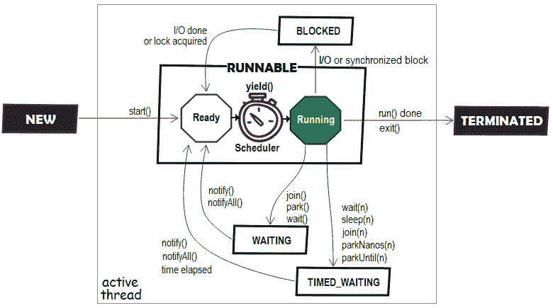
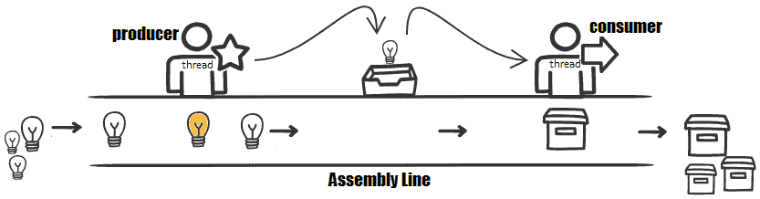
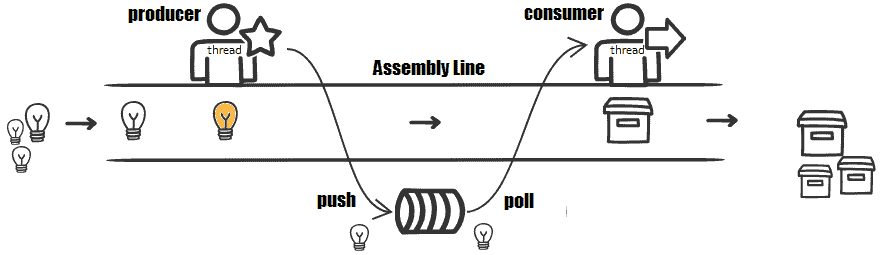
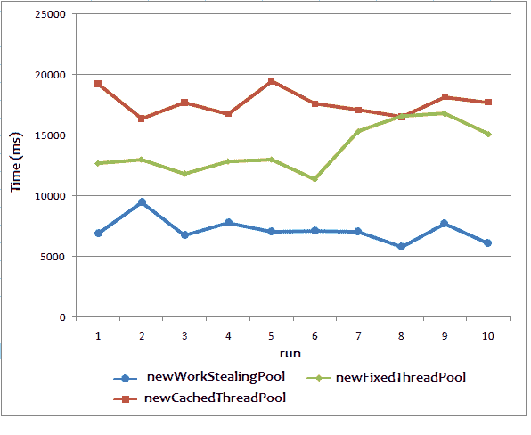
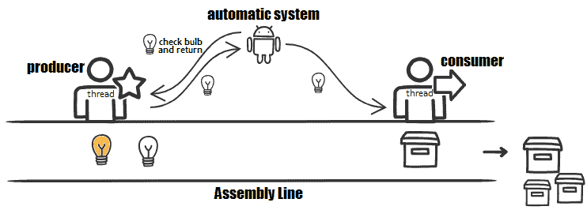
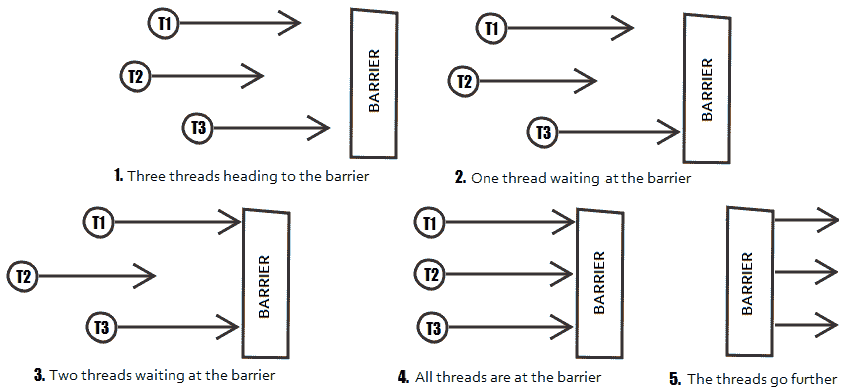
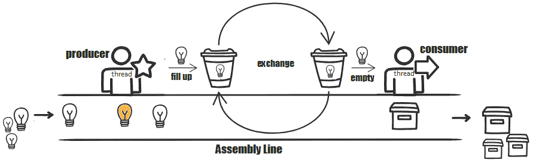

# 并发-线程池、可调用和同步器

本章包括涉及 Java 并发的 14 个问题。我们将从线程生命周期以及对象级和类级锁定的几个基本问题开始。然后我们继续讨论 Java 中线程池的一系列问题，包括 JDK8 工作线程池。在那之后，我们有关于`Callable`和`Future`的问题。然后，我们将几个问题专门讨论 Java 同步器（例如，屏障、信号量和交换器）。在本章结束时，您应该熟悉 Java 并发的主要坐标，并准备好继续处理一组高级问题。

# 问题

使用以下问题来测试您的并发编程能力。我强烈建议您在使用解决方案和下载示例程序之前，先尝试一下每个问题：

199.  **线程生命周期状态**：编写多个程序，捕捉线程的每个生命周期状态。
200.  **对象级与类级的锁定**：写几个例子来举例说明通过线程同步实现对象级与类级的锁定。
201.  **Java 中的线程池**：简要概述 Java 中的线程池。
202.  **单线程线程池**：编写一个程序，模拟一条装配线，用两个工人来检查和打包灯泡。
203.  **固定线程数的线程池**：编写一个程序，模拟一条装配线，使用多个工人检查和打包灯泡。

204.  **缓存****和调度线程池**：编写一个程序，模拟装配线，根据需要使用工人检查和打包灯泡（例如，调整打包机的数量（增加或减少）以吸收检查器产生的传入流量）。
205.  **偷工线程池**：编写依赖偷工线程池的程序。更准确地说，编写一个程序，模拟一条装配线来检查和打包灯泡，如下所示：检查在白天进行，打包在晚上进行。检查过程导致每天有 1500 万只灯泡排队。
206.  **`Callable``Future`**：用`Callable`和`Future`编写模拟灯泡检查打包流水线的程序。
207.  **调用多个`Callable`任务**：编写一个模拟装配线的程序，对灯泡进行检查和打包，如下所示：检查在白天进行，打包在晚上进行。检查过程导致每天有 100 个灯泡排队。包装过程应一次包装并归还所有灯泡。也就是说，我们应该提交所有的`Callable`任务，等待它们全部完成。
208.  **锁存**：编写一个依赖`CountDownLatch`的程序来模拟服务器的启动过程。服务器在其内部服务启动后被视为已启动。服务可以同时启动并且相互独立。
209.  **屏障**：编写一个依赖`CyclicBarrier`来模拟服务器启动过程的程序。服务器在其内部服务启动后被视为已启动。服务可以同时启动（这很费时），但它们是相互依赖的—因此，一旦准备好启动，就必须一次启动所有服务。
210.  **换热器**：编写一个程序，模拟使用`Exchanger`，一条由两名工人组成的灯泡检查打包流水线。一个工人（检查人员）正在检查灯泡，并把它们放进篮子里。当篮子装满时，工人将篮子交给另一个工人（包装工），他们从另一个工人那里得到一个空篮子。这个过程不断重复，直到装配线停止。
211.  **信号量**：编写一个程序，模拟每天在理发店使用一个`Semaphore`。我们的理发店一次最多只能接待三个人（只有三个座位）。当一个人到达理发店时，他们试着坐下。理发师为他们服务后，这个人就把座位打开。如果一个人在三个座位都坐满的时候到达理发店，他们必须等待一定的时间。如果这段时间过去了，没有座位被释放，他们将离开理发店。

212.  **Phaser****s**：编写一个依赖`Phaser`的程序，分三个阶段模拟服务器的启动过程。服务器在其五个内部服务启动后被视为已启动。在第一阶段，我们需要同时启动三个服务。在第二阶段，我们需要同时启动另外两个服务（只有在前三个服务已经运行的情况下才能启动）。在第三阶段，服务器执行最后一次签入，并被视为已启动。

# 解决

以下各节介绍上述问题的解决方案。记住，解决一个特定问题通常不是只有一种正确的方法。另外，请记住，这里显示的解释仅包括解决问题所需的最有趣和最重要的细节。下载示例解决方案以查看更多详细信息，并在[中试用程序 https://github.com/PacktPublishing/Java-Coding-Problems](https://github.com/PacktPublishing/Java-Coding-Problems)。

# 199 线程生命周期状态

Java 线程的状态通过`Thread.State`枚举表示。Java 线程的可能状态如下图所示：



不同的生命周期状态如下：

*   **新**状态
*   **可运行**状态
*   **阻塞**状态
*   **等待**状态
*   **定时等待**状态
*   **终止**状态

让我们在下面的部分学习所有不同的状态。

# 新国家

如果 Java 线程已创建但未启动，则该线程处于**新**状态（线程构造函数以**新**状态创建线程）。这是它的状态，直到`start()`方法被调用。本书附带的代码包含几个代码片段，这些代码片段通过不同的构造技术（包括 lambdas）揭示了这种状态。为简洁起见，以下只是其中一种结构：

```java
public class NewThread {

  public void newThread() {
    Thread t = new Thread(() -> {});
    System.out.println("NewThread: " + t.getState()); // NEW
  }
}

NewThread nt = new NewThread();
nt.newThread();
```

# 可运行状态

通过调用`start()`方法获得从**新**到**可运行**的转换。在此状态下，线程可以正在运行或准备运行。当它准备好运行时，线程正在等待 JVM 线程调度程序为它分配运行所需的资源和时间。一旦处理器可用，线程调度程序就会运行线程。

下面的代码片段应该打印**RUNNABLE**，因为我们在调用`start()`之后打印线程的状态。但由于线程调度程序的内部机制，这一点无法保证：

```java
public class RunnableThread {

  public void runnableThread() {
    Thread t = new Thread(() -> {});
    t.start();

    // RUNNABLE
    System.out.println("RunnableThread : " + t.getState()); 
 }
}

RunnableThread rt = new RunnableThread();
rt.runnableThread();
```

# 阻塞状态

当线程试图执行 I/O 任务或同步块时，它可能会进入**阻塞**状态。例如，如果一个线程`t1`试图进入另一个线程`t2`正在访问的同步代码块，那么`t1`将保持在**阻塞**状态，直到它能够获得锁为止。

此场景在以下代码片段中形成：

1.  创建两个线程：`t1`和`t2`。
2.  通过`start()`方法启动`t1`：
    1.  `t1`将执行`run()`方法并获取同步方法`syncMethod()`的锁。
    2.  因为`syncMethod()`有一个无限循环，所以`t1`将永远留在里面。
3.  2 秒（任意时间）后，通过`start()`方法启动`t2`
    1.  `t2`将执行`run()`代码，由于无法获取`syncMethod()`的锁，最终进入**阻塞**状态。

代码段如下：

```java
public class BlockedThread {

  public void blockedThread() {

    Thread t1 = new Thread(new SyncCode());
    Thread t2 = new Thread(new SyncCode());

    t1.start();
    Thread.sleep(2000);
    t2.start();
    Thread.sleep(2000);

    System.out.println("BlockedThread t1: " 
      + t1.getState() + "(" + t1.getName() + ")");
    System.out.println("BlockedThread t2: " 
      + t2.getState() + "(" + t2.getName() + ")");

    System.exit(0);
  }

  private static class SyncCode implements Runnable {

    @Override
    public void run() {
      System.out.println("Thread " + Thread.currentThread().getName() 
        + " is in run() method");
      syncMethod();
    }

    public static synchronized void syncMethod() {
      System.out.println("Thread " + Thread.currentThread().getName() 
        + " is in syncMethod() method");

      while (true) {
        // t1 will stay here forever, therefore t2 is blocked
      }
    }
  }
}

BlockedThread bt = new BlockedThread();
bt.blockedThread();
```

下面是一个可能的输出（线程的名称可能与此处不同）：

```java
Thread Thread-0 is in run() method
Thread Thread-0 is in syncMethod() method
Thread Thread-1 is in run() method
BlockedThread t1: RUNNABLE(Thread-0)
BlockedThread t2: BLOCKED(Thread-1)
```

# 等待状态

等待另一个线程`t2`完成的线程`t1`处于**等待**状态。

此场景在以下代码片段中形成：

1.  创建线程：`t1`。
2.  通过`start()`方法启动`t1`。
3.  在`t1`的`run()`方法中：
    1.  创建另一个线程：`t2`。
    2.  通过`start()`方法启动`t2`。
    3.  当`t2`运行时，调用`t2.join()`——由于`t2`需要加入`t1`（也就是说`t1`需要等待`t2`死亡），`t1`处于**等待**状态。
4.  在`t2`的`run()`方法中`t2`打印`t1`的状态，应该是**等待**（打印`t1`状态时`t2`正在运行，所以`t1`正在等待）。

代码段如下：

```java
public class WaitingThread {

  public void waitingThread() {
    new Thread(() -> {
      Thread t1 = Thread.currentThread();
      Thread t2 = new Thread(() -> {

        Thread.sleep(2000);
        System.out.println("WaitingThread t1: " 
          + t1.getState()); // WAITING
      });

      t2.start();

      t2.join();

    }).start();
  }
}

WaitingThread wt = new WaitingThread();
wt.waitingThread();
```

# 定时等待状态

等待另一个线程`t2`完成显式时间段的线程`t1`处于**TIMED\u WAITING**状态。

此场景在以下代码片段中形成：

1.  创建线程：`t1`。
2.  通过`start()`方法启动`t1`。
3.  在`t1`的`run()`方法中，增加 2 秒的睡眠时间（任意时间）。
4.  当`t1`运行时，主线程打印`t1`状态，该状态应为**定时等待**，因为`t1`处于两秒后过期的`sleep()`中。

代码段如下：

```java
public class TimedWaitingThread {

  public void timedWaitingThread() {
    Thread t = new Thread(() -> {
      Thread.sleep(2000);
    });

    t.start();

    Thread.sleep(500);

    System.out.println("TimedWaitingThread t: " 
      + t.getState()); // TIMED_WAITING
  }
}

TimedWaitingThread twt = new TimedWaitingThread();
twt.timedWaitingThread();
```

# 终止状态

成功完成任务或异常中断的线程处于**终止**状态。模拟起来非常简单，如下面的代码片段（应用程序的主线程打印线程的状态，`t`——发生这种情况时，线程`t`已经完成了它的工作）：

```java
public class TerminatedThread {

  public void terminatedThread() {
    Thread t = new Thread(() -> {});
    t.start();

    Thread.sleep(1000);

    System.out.println("TerminatedThread t: " 
      + t.getState()); // TERMINATED
  }
}

TerminatedThread tt = new TerminatedThread();
tt.terminatedThread();
```

为了编写线程安全类，我们可以考虑以下技术：

*   没有*状态*（类没有实例和`static`变量）
*   有*状态，*但不共享（例如，通过`Runnable`、`ThreadLocal`等使用实例变量）
*   有*状态，*但不可变*状态*
*   使用消息传递（例如，作为 Akka 框架）
*   使用`synchronized`块
*   使用`volatile`变量
*   使用`java.util.concurrent`包中的数据结构
*   使用同步器（例如，`CountDownLatch`和`Barrier`）
*   使用`java.util.concurrent.locks`包中的锁

# 200 对象级与类级锁定

在 Java 中，标记为`synchronized`的代码块一次可以由一个线程执行。由于 Java 是一个多线程环境（它支持并发），因此它需要一个同步机制来避免并发环境特有的问题（例如死锁和内存一致性）。

线程可以在对象级或类级实现锁。

# 在对象级别锁定

对象级的锁定可以通过在非`static`代码块或非`static`方法（该方法的对象的锁定对象）上标记`synchronized`来实现。在以下示例中，一次只允许一个线程在类的给定实例上执行`synchronized`方法/块：

*   同步方法案例：

```java
public class ClassOll {
  public synchronized void methodOll() {
    ...
  }
}
```

*   同步代码块：

```java
public class ClassOll {
  public void methodOll() {
    synchronized(this) {
      ...
    }
  }
}
```

*   另一个同步代码块：

```java
public class ClassOll {

  private final Object ollLock = new Object();
  public void methodOll() {
    synchronized(ollLock) {
      ...
    }
  }
}
```

# 在类级别锁定

为了保护`static`数据，可以通过标记`static`方法/块或用`synchronized`获取`.class`引用上的锁来实现类级锁定。在以下示例中，一次只允许运行时可用实例之一的一个线程执行`synchronized`块：

*   `synchronized static`方法：

```java
public class ClassCll {

  public synchronized static void methodCll() {
    ...
  }
}
```

*   `.class`同步闭锁：

```java
public class ClassCll {

  public void method() {
    synchronized(ClassCll.class) {
      ...
    }
  }
}
```

*   同步的代码块和其他`static`对象的锁定：

```java
public class ClassCll {

  private final static Object aLock = new Object();

  public void method() {
    synchronized(aLock) {
      ...
    }
  }
}
```

# 很高兴知道

以下是一些暗示同步的常见情况：

*   两个线程可以同时执行同一类的`synchronized static`方法和非`static`方法（参见`P200_ObjectVsClassLevelLocking`app 的`OllAndCll`类）。这是因为线程在不同的对象上获取锁。

*   两个线程不能同时执行同一类的两个不同的`synchronized static`方法（或同一`synchronized static`方法）（检查`P200_ObjectVsClassLevelLocking`应用程序的`TwoCll`类）。这不起作用，因为第一个线程获得了类级锁。以下组合将输出`staticMethod1(): Thread-0`，因此，只有一个线程执行一个`static synchronized`方法：

```java
TwoCll instance1 = new TwoCll();
TwoCll instance2 = new TwoCll();
```

*   两个线程，两个实例：

```java
new Thread(() -> {
  instance1.staticMethod1();
}).start();

new Thread(() -> {
  instance2.staticMethod2();
}).start();
```

*   两个线程，一个实例：

```java
new Thread(() -> {
  instance1.staticMethod1();
}).start();

new Thread(() -> {
  instance1.staticMethod2();
}).start();
```

*   两个线程可以同时执行非`synchronized`、`synchronized static`和`synchronized`非`static`方法（检查`P200_ObjectVsClassLevelLocking`应用程序的`OllCllAndNoLock`类）。

*   从需要相同锁的同一类的另一个`synchronized`方法调用`synchronized`方法是安全的，因为`synchronized`是*可重入的*（只要是相同的锁，第一个方法获取的锁也会用于第二个方法）。检查`P200_ObjectVsClassLevelLocking`应用程序的`TwoSyncs`类。

根据经验，`synchronized`关键字只能用于`static`/非`static`方法（不是构造函数）/代码块。避免同步非`final`字段和`String`文本（通过`new`创建的`String`实例是可以的）。

# 201Java 中的线程池

线程池是可用于执行任务的线程的集合。线程池负责管理其线程的创建、分配和生命周期，并有助于提高性能。现在，我们来谈谈遗嘱执行人。

# 遗嘱执行人

在`java.util.concurrent`包中，有一堆专用于执行任务的接口。最简单的一个叫做`Executor`。这个接口公开了一个名为`execute​(Runnable command)`的方法。下面是使用此方法执行单个任务的示例：

```java
public class SimpleExecutor implements Executor {

  @Override
  public void execute(Runnable r) {
    (new Thread(r)).start();
  }
}

SimpleExecutor se = new SimpleExecutor();

se.execute(() -> {
  System.out.println("Simple task executed via Executor interface");
});
```

# 执行者服务

一个更复杂、更全面的接口提供了许多附加方法，它是`ExecutorService`。这是`Executor`的丰富版本。Java 附带了一个成熟的实现`ExecutorService`，名为`ThreadPoolExecutor`。这是一个线程池，可以用一组参数实例化，如下所示：

```java
ThreadPoolExecutor​(
  int corePoolSize,
  int maximumPoolSize,
  long keepAliveTime,
  TimeUnit unit,
  BlockingQueue<Runnable> workQueue,
  ThreadFactory threadFactory,
  RejectedExecutionHandler handler)
```

下面是对前面代码中实例化的每个参数的简短描述：

*   `corePoolSize`：池中要保留的线程数，即使它们是空闲的（除非设置了`allowCoreThreadTimeOut`）
*   `maximumPoolSize`：允许的最大线程数
*   `keepAliveTime`：当这个时间过去后，空闲线程将从池中移除（这些是超过`corePoolSize`的空闲线程）
*   `unit`：`keepAliveTime`参数的时间单位
*   `workQueue`：在`Runnable`的实例（只有`execute()`方法提交的`Runnable`任务）执行之前，用来存放这些实例的队列
*   `threadFactory`：执行器创建新线程时使用此工厂
*   `handler`：当`ThreadPoolExecutor`由于饱和而无法执行`Runnable`时，即线程边界和队列容量已满（例如，`workQueue`大小固定，同时设置了`maximumPoolSize`），它将控制和决策交给这个处理程序

为了优化池大小，我们需要收集以下信息：

*   CPU 数量（`Runtime.getRuntime().availableProcessors()`）
*   目标 CPU 利用率（在范围内，[0，1]）

*   等待时间（W）
*   计算时间（C）

以下公式有助于我们确定池的最佳大小：

```java
Number of threads 
  = Number of CPUs * Target CPU utilization * (1 + W/C)
```

根据经验，对于计算密集型任务（通常是小型任务），最好使用线程数等于处理器数或处理器数+1（以防止潜在的暂停）来对线程池进行基准测试。对于耗时且阻塞的任务（例如，I/O），更大的池更好，因为线程将无法以高速率进行调度。另外，还要注意与其他池（例如，数据库连接池和套接字连接池）的干扰。

让我们看一个`ThreadPoolExecutor`的例子：

```java
public class SimpleThreadPoolExecutor implements Runnable {

  private final int taskId;

  public SimpleThreadPoolExecutor(int taskId) {
    this.taskId = taskId;
  }

  @Override
  public void run() {
    Thread.sleep(2000);
    System.out.println("Executing task " + taskId 
      + " via " + Thread.currentThread().getName());
  }

  public static void main(String[] args) {

    BlockingQueue<Runnable> queue = new LinkedBlockingQueue<>(5);
    final AtomicInteger counter = new AtomicInteger();

    ThreadFactory threadFactory = (Runnable r) -> {
      System.out.println("Creating a new Cool-Thread-" 
        + counter.incrementAndGet());

      return new Thread(r, "Cool-Thread-" + counter.get());
    };

    RejectedExecutionHandler rejectedHandler
      = (Runnable r, ThreadPoolExecutor executor) -> {
        if (r instanceof SimpleThreadPoolExecutor) {
          SimpleThreadPoolExecutor task=(SimpleThreadPoolExecutor) r;
          System.out.println("Rejecting task " + task.taskId);
        }
    };

    ThreadPoolExecutor executor = new ThreadPoolExecutor(10, 20, 1,
      TimeUnit.SECONDS, queue, threadFactory, rejectedHandler);

    for (int i = 0; i < 50; i++) {
      executor.execute(new SimpleThreadPoolExecutor(i));
    }

    executor.shutdown();
    executor.awaitTermination(
      Integer.MAX_VALUE, TimeUnit.MILLISECONDS);
  }
}
```

`main()`方法触发`Runnable`50 个实例。每个`Runnable`睡两秒钟，打印一条消息。工作队列限制为`Runnable`的 5 个实例——核心线程为 10，线程数最多为 20 个，空闲超时为 1 秒。可能的输出如下：

```java
Creating a new Cool-Thread-1
...
Creating a new Cool-Thread-20
Rejecting task 25
...
Rejecting task 49
Executing task 22 via Cool-Thread-18
...
Executing task 12 via Cool-Thread-2
```

# ScheduledExecutorService 服务

`ScheduledExecutorService`是一个`ExecutorService`，它可以安排任务在给定的延迟后执行，或者定期执行。这里，我们有`schedule()`、`scheduleAtFixedRate()`和`scheduleWithFixedDelay​()`等方法。`schedule()`用于一次性任务，`scheduleAtFixedRate()`和`scheduleWithFixedDelay()`用于周期性任务。

# 通过执行器的线程池

更进一步，我们将介绍 helper 类`Executors`。此类使用以下方法公开几种类型的线程池：

*   `newSingleThreadExecutor()`：这是一个线程池，只管理一个线程，队列无限，一次只执行一个任务：

```java
ExecutorService executor 
  = Executors.newSingleThreadExecutor();
```

*   `newCachedThreadPool()`：这是一个线程池，根据需要创建新线程并删除空闲线程（60 秒后）；核心池大小为 0，最大池大小为`Integer.MAX_VALUE`（此线程池在需求增加时扩展，在需求减少时收缩）：

```java
ExecutorService executor = Executors.newCachedThreadPool();
```

*   `newFixedThreadPool()`：这是一个线程数固定、队列无限的线程池，产生无限超时的效果（核心池大小和最大池大小等于指定的大小）：

```java
ExecutorService executor = Executors.newFixedThreadPool(5);
```

*   `newWorkStealingThreadPool()`：这是一个基于工作窃取算法的线程池（它充当 fork/join 框架上的一层）：

```java
ExecutorService executor = Executors.newWorkStealingPool();
```

*   `newScheduledThreadPool()`：一个线程池，可以安排命令在给定的延迟后运行，或者定期执行（我们可以指定核心池的大小）：

```java
ScheduledExecutorService executor 
  = Executors.newScheduledThreadPool(5);
```

# 202 具有单个线程的线程池

为了演示单线程线程池的工作原理，假设我们想编写一个程序，模拟装配线（或输送机），用两个工人检查和包装灯泡。

通过*检查*，我们了解到工人测试灯泡是否亮起。通过*包装*，我们了解到，工人将经过验证的灯泡拿到盒子里。这种工艺在几乎所有工厂都很常见。

两名工人如下：

*   一种所谓的生产者（或检查者），负责测试每个灯泡，看灯泡是否亮起
*   一个所谓的消费者（或包装商），负责将每个检查过的灯泡包装到一个盒子里

这种问题完全适合于下图所示的生产者消费者设计模式：


最常见的是，在这种模式中，生产者和消费者通过队列（生产者排队数据，消费者排队数据）进行通信。这个队列称为*数据缓冲区*。当然，根据流程设计，其他数据结构也可以起到数据缓冲的作用。

现在，让我们看看如果生产者等待消费者可用，我们如何实现这个模式。

稍后，我们将为不等待消费者的生产者实现此模式。

# 生产者等待消费者可用

装配线启动时，生产商将逐个检查进线灯泡，而消费者将将其打包（每个盒子中有一个灯泡）。此流重复，直到装配线停止。

下图是**生产者**和**消费者**之间的流程图：



我们可以将装配线视为我们工厂的助手，因此它可以实现为助手或实用程序类（当然，它也可以很容易地切换到非`static`实现，因此如果对您的情况更有意义，请随意切换）：

```java
public final class AssemblyLine {

  private AssemblyLine() {
    throw new AssertionError("There is a single assembly line!");
  }
  ...
}
```

当然，实现这个场景的方法很多，但是我们对使用 Java`ExecutorService`感兴趣，更准确地说是`Executors.newSingleThreadExecutor()`。使用一个工作线程来操作未绑定队列的`Executor`通过此方法创建。

我们只有两个 worker，所以我们可以使用两个实例`Executor`（一个`Executor`将启动生产者，另一个将启动消费者）。因此，生产者将是一个线程，消费者将是另一个线程：

```java
private static ExecutorService producerService;
private static ExecutorService consumerService;
```

由于生产者和消费者是好朋友，他们决定根据一个简单的场景来工作：

*   只有消费者不忙时，生产者才会检查灯泡并将其传递给消费者（如果消费者忙，生产者会等待一段时间，直到消费者有空）
*   生产商在将当前灯泡传递给用户之前不会检查下一个灯泡
*   耗电元件将尽快包装每个进入的灯泡

这个场景适用于`TransferQueue`或`SynchronousQueue`，它执行的过程与前面提到的场景非常相似。让我们使用`TransferQueue`。这是一个`BlockingQueue`，其中生产者可以等待消费者接收元素。`BlockingQueue`实现是线程安全的：

```java
private static final TransferQueue<String> queue 
  = new LinkedTransferQueue<>();
```

生产者和消费者之间的工作流程是**先进先出**类型（**FIFO**：第一个检查的灯泡是第一个打包的灯泡），因此`LinkedTransferQueue`是一个不错的选择。

一旦装配线启动，生产商将持续检查灯泡，因此我们可以将其作为一个类来实现，如下所示：

```java
private static final int MAX_PROD_TIME_MS = 5 * 1000;
private static final int MAX_CONS_TIME_MS = 7 * 1000;
private static final int TIMEOUT_MS = MAX_CONS_TIME_MS + 1000;
private static final Random rnd = new Random();
private static volatile boolean runningProducer;
...
private static class Producer implements Runnable {

  @Override
  public void run() {
    while (runningProducer) {
      try {
        String bulb = "bulb-" + rnd.nextInt(1000);

        Thread.sleep(rnd.nextInt(MAX_PROD_TIME_MS));

        boolean transfered = queue.tryTransfer(bulb,
          TIMEOUT_MS, TimeUnit.MILLISECONDS);

        if (transfered) {
          logger.info(() -> "Checked: " + bulb);
        }
      } catch (InterruptedException ex) {
        Thread.currentThread().interrupt();
        logger.severe(() -> "Exception: " + ex);
        break;
      }
    }
  }
}
```

因此，生产者通过`tryTransfer()`方法将检查过的灯泡转移给消费者。如果可以在超时时间过去之前将元素传输到使用者，则此方法将执行此操作。

避免使用`transfer()`方法，这可能会无限期地堵塞螺纹。

为了模拟生产者检查灯泡所花的时间，相应的线程将在 0 到 5 之间随机休眠几秒（5 秒是检查灯泡所需的最长时间）。如果消费者在此时间之后不可用，则会花费更多时间（在`tryTransfer()`中），直到消费者可用或超时结束。

另一方面，使用另一个类实现使用者，如下所示：

```java
private static volatile boolean runningConsumer;
...
private static class Consumer implements Runnable {

  @Override
  public void run() {
    while (runningConsumer) {
      try {
        String bulb = queue.poll(
          MAX_PROD_TIME_MS, TimeUnit.MILLISECONDS);

        if (bulb != null) {
          Thread.sleep(rnd.nextInt(MAX_CONS_TIME_MS));
          logger.info(() -> "Packed: " + bulb);
        }
      } catch (InterruptedException ex) {
        Thread.currentThread().interrupt();
        logger.severe(() -> "Exception: " + ex);
        break;
      }
    }
  }
}
```

消费者可以通过`queue.take()`方法从生产商处取灯泡。此方法检索并删除此队列的头，如有必要，请等待，直到灯泡可用。也可以调用`poll()`方法，在该方法中检索并移除队列的头，或者如果该队列为空，则返回`null`。但这两个都不适合我们。如果生产商不在，消费者可能仍然停留在`take()`方法中。另一方面，如果队列是空的（生产者现在正在检查当前灯泡），`poll()`方法将很快被一次又一次地调用，导致伪重复。解决这个问题的方法是`poll​(long timeout, TimeUnit unit)`。此方法检索并删除此队列的头，并在指定的等待时间内（如果需要）等待灯泡变为可用。仅当等待时间过后队列为空时，才会返回`null`。

为了模拟耗电元件包装灯泡所需的时间，相应的线程将在 0 到 7 之间随机休眠几秒（7 秒是包装灯泡所需的最长时间）。

启动生产者和消费者是一项非常简单的任务，它是通过一种名为`startAssemblyLine()`的方法完成的，如下所示：

```java
public static void startAssemblyLine() {

  if (runningProducer || runningConsumer) {
    logger.info("Assembly line is already running ...");
    return;
  }

  logger.info("\n\nStarting assembly line ...");
  logger.info(() -> "Remaining bulbs from previous run: \n"
    + queue + "\n\n");

  runningProducer = true;
  producerService = Executors.newSingleThreadExecutor();
  producerService.execute(producer);

  runningConsumer = true;
  consumerService = Executors.newSingleThreadExecutor();
  consumerService.execute(consumer);
}
```

停止装配线是一个微妙的过程，可以通过不同的场景来解决。主要是，当装配线停止时，生产商应检查当前灯泡作为最后一个灯泡，消费者必须包装它。生产商可能需要等待消费者包装好当前灯泡，然后才能转移最后一个灯泡；此外，消费者也必须包装好这个灯泡。

为了遵循此场景，我们首先停止生产者，然后停止消费者：

```java
public static void stopAssemblyLine() {

  logger.info("Stopping assembly line ...");

  boolean isProducerDown = shutdownProducer();
  boolean isConsumerDown = shutdownConsumer();

  if (!isProducerDown || !isConsumerDown) {
    logger.severe("Something abnormal happened during
      shutting down the assembling line!");

    System.exit(0);
  }

  logger.info("Assembling line was successfully stopped!");
}

private static boolean shutdownProducer() {
  runningProducer = false;
  return shutdownExecutor(producerService);
}

private static boolean shutdownConsumer() {
  runningConsumer = false;
  return shutdownExecutor(consumerService);
}
```

最后，我们给生产者和消费者足够的时间来正常停止（不中断线程）。这在`shutdownExecutor()`方法中发生，如下所示：

```java
private static boolean shutdownExecutor(ExecutorService executor) {

  executor.shutdown();

  try {
    if (!executor.awaitTermination(TIMEOUT_MS * 2,
        TimeUnit.MILLISECONDS)) {
      executor.shutdownNow();
      return executor.awaitTermination(TIMEOUT_MS * 2,
        TimeUnit.MILLISECONDS);
    }

    return true;
  } catch (InterruptedException ex) {
    executor.shutdownNow();
    Thread.currentThread().interrupt();
    logger.severe(() -> "Exception: " + ex);
  }

  return false;
}
```

我们要做的第一件事是将`runningProducer``static`变量设置为`false`。这将破坏`while(runningProducer)`，因此这将是最后一次检查灯泡。此外，我们启动生产商的关闭程序。

对于消费者，我们要做的第一件事是将`runningConsumer``static`变量设置为`false`。这将打破`while(runningConsumer)`，因此这将是最后一个灯泡包装。此外，我们启动耗电元件的关闭程序。

让我们看看装配线的可能执行（运行 10 秒）：

```java
AssemblyLine.startAssemblyLine();
Thread.sleep(10 * 1000);
AssemblyLine.stopAssemblyLine();
```

可能的输出如下：

```java
Starting assembly line ...
...
[2019-04-14 07:39:40] [INFO] Checked: bulb-89
[2019-04-14 07:39:43] [INFO] Packed: bulb-89
...
Stopping assembly line ...
...
[2019-04-14 07:39:53] [INFO] Packed: bulb-322
Assembling line was successfully stopped!
```

一般来说，如果停产需要很长时间（就好像停产一样），那么生产商和消费者的数量和/或生产和消费时间之间可能存在不平衡率。您可能需要添加或减去生产者或消费者。

# 生产者不会等待消费者出现

如果生产者检查灯泡的速度比消费者包装灯泡的速度快，那么他们很可能会决定采用以下工作流程：

*   生产商将逐一检查灯泡，并将其推入队列
*   消费者将从队列中轮询并打包灯泡

由于消费者比生产者慢，队列将容纳已检查但未包装的灯泡（我们可以假设有空队列的可能性很低）。在下图中，我们有生产者、消费者和用于存储已检查但未包装灯泡的队列：



为了形成这种情况，我们可以依赖于`ConcurrentLinkedQueue`（或`LinkedBlockingQueue`）。这是一个基于链接节点的无限线程安全队列：

```java
private static final Queue<String> queue 
  = new ConcurrentLinkedQueue<>();
```

为了在队列中推一个灯泡，生产者调用`offer()`方法：

```java
queue.offer(bulb);
```

另一方面，消费者使用`poll()`方法处理队列中的灯泡（因为消费者比生产者慢，所以当`poll()`返回`null`时应该是罕见的情况）：

```java
String bulb = queue.poll();
```

让我们第一次启动装配线 10 秒钟。这将输出以下内容：

```java
Starting assembly line ...
...
[2019-04-14 07:44:58] [INFO] Checked: bulb-827
[2019-04-14 07:44:59] [INFO] Checked: bulb-257
[2019-04-14 07:44:59] [INFO] Packed: bulb-827
...
Stopping assembly line ...
...
[2019-04-14 07:45:08] [INFO] Checked: bulb-369
[2019-04-14 07:45:09] [INFO] Packed: bulb-690
...
Assembling line was successfully stopped!
```

此时，装配线停止，在队列中，我们有以下内容（这些灯泡已检查，但未包装）：

```java
[bulb-968, bulb-782, bulb-627, bulb-886, ...]
```

我们重新启动装配线并检查突出显示的行，这表明消费者从停止的位置恢复其工作：

```java
Starting assembly line ...
[2019-04-14 07:45:12] [INFO ] Packed: bulb-968 [2019-04-14 07:45:12] [INFO ] Checked: bulb-812
[2019-04-14 07:45:12] [INFO ] Checked: bulb-470
[2019-04-14 07:45:14] [INFO ] Packed: bulb-782 [2019-04-14 07:45:15] [INFO ] Checked: bulb-601
[2019-04-14 07:45:16] [INFO ] Packed: bulb-627 ...
```

# 203 具有固定线程数的线程池

这个问题重复了*线程池中具有单个线程*部分的场景。这一次，装配线使用了三个生产商和两个消费者，如下图所示：


我们可以依靠`Executors.newFixedThreadPool​(int nThreads)`来模拟固定数量的生产者和消费者。我们为每个生产者（分别为消费者）分配一个线程，因此代码非常简单：

```java
private static final int PRODUCERS = 3;
private static final int CONSUMERS = 2;
private static final Producer producer = new Producer();
private static final Consumer consumer = new Consumer();
private static ExecutorService producerService;
private static ExecutorService consumerService;
...
producerService = Executors.newFixedThreadPool(PRODUCERS);
for (int i = 0; i < PRODUCERS; i++) {
  producerService.execute(producer);
}

consumerService = Executors.newFixedThreadPool(CONSUMERS);
for (int i = 0; i < CONSUMERS; i++) {
  consumerService.execute(consumer);
}
```

生产者可以在其中添加已检查灯泡的队列可以是`LinkedTransferQueue`或`ConcurrentLinkedQueue`类型，依此类推。

基于`LinkedTransferQueue`和`ConcurrentLinkedQueue`的完整源代码可以在本书附带的代码中找到。

# 204 缓存和计划线程池

这个问题重复了*线程池中具有单个线程*部分的场景。这一次，我们假设生产者（也可以使用多个生产者）在不超过 1 秒的时间内检查一个灯泡。此外，一个耗电元件（包装器）最多需要 10 秒来包装一个灯泡。生产器和耗电元件的时间可以如下所示：

```java
private static final int MAX_PROD_TIME_MS = 1 * 1000;
private static final int MAX_CONS_TIME_MS = 10 * 1000;
```

显然，在这种情况下，一个消费者无法面对即将到来的流量。用于存储灯泡的队列将不断增加，直到它们被打包。生产者添加到此队列的速度比消费者可以轮询的速度快得多。因此，需要更多的消费者，如下图所示：


由于只有一个生产商，我们可以依赖`Executors.newSingleThreadExecutor()`：

```java
private static volatile boolean runningProducer;
private static ExecutorService producerService;
private static final Producer producer = new Producer();
...
public static void startAssemblyLine() {
  ...
  runningProducer = true;
  producerService = Executors.newSingleThreadExecutor();
  producerService.execute(producer);
  ...
}
```

除了`extraProdTime`变量外，`Producer`与前面的问题几乎相同：

```java
private static int extraProdTime;
private static final Random rnd = new Random();
...
private static class Producer implements Runnable {

  @Override
  public void run() {
    while (runningProducer) {
      try {
        String bulb = "bulb-" + rnd.nextInt(1000);
        Thread.sleep(rnd.nextInt(MAX_PROD_TIME_MS) + extraProdTime);
        queue.offer(bulb);

        logger.info(() -> "Checked: " + bulb);
      } catch (InterruptedException ex) {
        Thread.currentThread().interrupt();
        logger.severe(() -> "Exception: " + ex);
        break;
      }
    }
  }
}
```

`extraProdTime`变量最初为 0。当我们放慢生产速度时，需要这样做：

```java
Thread.sleep(rnd.nextInt(MAX_PROD_TIME_MS) + extraProdTime);
```

在高速运行一段时间后，生产者会感到疲倦，需要更多的时间来检查每个灯泡。如果生产者放慢生产速度，消费者的数量也应该减少。

当生产商高速运转时，我们将需要更多的消费者（包装商）。但是有多少？使用固定数量的消费者（`newFixedThreadPool()`会带来至少两个缺点：

*   如果生产商在某个时候放慢速度，一些消费者将继续失业，只会继续留在那里
*   如果生产商变得更有效率，就需要更多的消费者来面对即将到来的流量

基本上，我们应该能够根据生产者的效率来改变消费者的数量。

对于这类工作，我们有`Executors.newCachedThreadPool​()`。缓存的线程池将重用现有的线程，并根据需要创建新的线程（我们可以添加更多的使用者）。如果线程在 60 秒内未被使用，那么线程将被终止并从缓存中删除（我们可以删除使用者）。

让我们从一个活动消费者开始：

```java
private static volatile boolean runningConsumer;
private static final AtomicInteger 
  nrOfConsumers = new AtomicInteger();
private static final ThreadGroup threadGroup 
  = new ThreadGroup("consumers");
private static final Consumer consumer = new Consumer();
private static ExecutorService consumerService;
...
public static void startAssemblyLine() {
  ...
  runningConsumer = true;
  consumerService = Executors
    .newCachedThreadPool((Runnable r) -> new Thread(threadGroup, r));
  nrOfConsumers.incrementAndGet();
  consumerService.execute(consumer);
  ...
}
```

因为我们希望能够看到一个时刻有多少线程（使用者）处于活动状态，所以我们通过一个自定义的`ThreadFactory`将它们添加到`ThreadGroup`中：

```java
consumerService = Executors
  .newCachedThreadPool((Runnable r) -> new Thread(threadGroup, r));
```

稍后，我们将能够使用以下代码获取活动消费者的数量：

```java
threadGroup.activeCount();
```

了解活动消费者的数量是一个很好的指标，可以与灯泡队列的当前大小相结合，以确定是否需要更多消费者。

使用者实现如下所示：

```java
private static class Consumer implements Runnable {

  @Override
  public void run() {

    while (runningConsumer && queue.size() > 0
                           || nrOfConsumers.get() == 1) {
      try {
        String bulb = queue.poll(MAX_PROD_TIME_MS 
           + extraProdTime, TimeUnit.MILLISECONDS);

        if (bulb != null) {
          Thread.sleep(rnd.nextInt(MAX_CONS_TIME_MS));
          logger.info(() -> "Packed: " + bulb + " by consumer: " 
            + Thread.currentThread().getName());
        }
      } catch (InterruptedException ex) {
        Thread.currentThread().interrupt();
        logger.severe(() -> "Exception: " + ex);
        break;
      }
    }

    nrOfConsumers.decrementAndGet();
    logger.warning(() -> "### Thread " +
      Thread.currentThread().getName() 
        + " is going back to the pool in 60 seconds for now!");
  }
}
```

假设装配线正在运行，只要队列不是空的或者他们是剩下的唯一消费者（我们不能有 0 个消费者），消费者就会继续打包灯泡。我们可以解释为，空队列意味着有太多的消费者。因此，当使用者看到队列为空并且他们不是唯一的工作使用者时，他们将变为空闲（60 秒后，他们将自动从缓存的线程池中删除）。

不要混淆`nrOfConsumers`和`threadGroup.activeCount()`。`nrOfConsumers`变量存储当前打包灯泡的使用者（线程）的数量，而`threadGroup.activeCount()`表示所有活动使用者（线程），包括那些当前不工作（空闲）并且正等待从缓存中重用或调度的使用者（线程）。

现在，在一个真实的案例中，一个主管将监控装配线，当他们注意到当前数量的消费者无法面对即将到来的涌入时，他们将呼叫更多的消费者加入（最多允许 50 个消费者）。此外，当他们注意到一些消费者只是停留在附近，他们会派遣他们到其他工作。下图是此场景的图形表示：


出于测试目的，我们的监管者`newSingleThreadScheduledExecutor()`将是一个单线程执行器，可以调度给定的命令在指定的延迟后运行。它还可以定期执行命令：

```java
private static final int MAX_NUMBER_OF_CONSUMERS = 50;
private static final int MAX_QUEUE_SIZE_ALLOWED = 5;
private static final int MONITOR_QUEUE_INITIAL_DELAY_MS = 5000;
private static final int MONITOR_QUEUE_RATE_MS = 3000;
private static ScheduledExecutorService monitorService;
...
private static void monitorQueueSize() {

  monitorService = Executors.newSingleThreadScheduledExecutor();

  monitorService.scheduleAtFixedRate(() -> {
    if (queue.size() > MAX_QUEUE_SIZE_ALLOWED 
        && threadGroup.activeCount() < MAX_NUMBER_OF_CONSUMERS) {
      logger.warning("### Adding a new consumer (command) ...");

      nrOfConsumers.incrementAndGet();
      consumerService.execute(consumer);
    }

    logger.warning(() -> "### Bulbs in queue: " + queue.size() 
      + " | Active threads: " + threadGroup.activeCount() 
      + " | Consumers: " + nrOfConsumers.get() 
      + " | Idle: " + (threadGroup.activeCount() 
        - nrOfConsumers.get()));
  }, MONITOR_QUEUE_INITIAL_DELAY_MS, MONITOR_QUEUE_RATE_MS,
        TimeUnit.MILLISECONDS);
}
```

我们依靠`scheduleAtFixedRate()`每 3 秒监控一次装配线，初始延迟 5 秒。因此，每三秒，主管检查一次灯泡队列大小。如果排队的灯泡超过 5 个，消费者少于 50 个，主管会要求新的消费者加入装配线。如果队列包含 5 个或更少的灯泡，或者已经有 50 个消费者，则主管不会采取任何行动。

如果我们现在开始装配线，我们可以看到消费者的数量是如何增加的，直到队列大小小于 6。可能的快照如下所示：

```java
Starting assembly line ...
[11:53:20] [INFO] Checked: bulb-488
...
[11:53:24] [WARNING] ### Adding a new consumer (command) ...
[11:53:24] [WARNING] ### Bulbs in queue: 7 
                       | Active threads: 2 
                       | Consumers: 2 
                       | Idle: 0
[11:53:25] [INFO] Checked: bulb-738
...
[11:53:36] [WARNING] ### Bulbs in queue: 23 
                       | Active threads: 6
                       | Consumers: 6
                       | Idle: 0
...
```

当线程数超过需要时，其中一些线程将变为空闲线程。如果在 60 秒内没有收到作业，则会将其从缓存中删除。如果作业在没有空闲线程时发生，则将创建一个新线程。这个过程不断重复，直到我们注意到装配线上的平衡。过了一段时间，事情开始平静下来，适当数量的消费者会在一个小范围内（小波动）。这是因为生产者输出的速度是随机的，最大值为 1 秒。

一段时间后（例如，20 秒后），让我们将生产者的速度降低 4 秒（这样，灯泡现在最多可以在 5 秒钟内检查）：

```java
private static final int SLOW_DOWN_PRODUCER_MS = 20 * 1000;
private static final int EXTRA_TIME_MS = 4 * 1000;
```

这可以使用另一个`newSingleThreadScheduledExecutor()`来完成，如下所示：

```java
private static void slowdownProducer() {

  slowdownerService = Executors.newSingleThreadScheduledExecutor();

  slowdownerService.schedule(() -> {
    logger.warning("### Slow down producer ...");
    extraProdTime = EXTRA_TIME_MS;
  }, SLOW_DOWN_PRODUCER_MS, TimeUnit.MILLISECONDS);
}
```

这只会发生一次，在装配线启动 20 秒后。由于生产者的速度降低了 4 秒，因此不需要有相同数量的消费者来维持最多 5 个灯泡的队列。

输出中显示了这一点，如图所示（请注意，有时只需要一个使用者来处理队列）：

```java
...
[11:53:36] [WARNING] ### Bulbs in queue: 23 
                       | Active threads: 6
                       | Consumers: 6
                       | Idle: 0
...
[11:53:39] [WARNING] ### Slow down producer ...
...
[11:53:56] [WARNING] ### Thread Thread-5 is going
                         back to the pool in 60 seconds for now!
[11:53:56] [INFO] Packed: bulb-346 by consumer: Thread-2
...
[11:54:36] [WARNING] ### Bulbs in queue: 1 
                       | Active threads: 12
                       | Consumers: 1
                       | Idle: 11
...
[11:55:48] [WARNING] ### Bulbs in queue: 3 
                       | Active threads: 1
                       | Consumers: 1 
                       | Idle: 0
...
Assembling line was successfully stopped!
```

在启动装配线后启动主管：

```java
public static void startAssemblyLine() {
  ...
  monitorQueueSize();
  slowdownProducer();
}
```

完整的应用程序可以在与本书捆绑的代码中使用。

使用缓存线程池时，请注意为容纳提交的任务而创建的线程数。对于单线程池和固定线程池，我们控制创建的线程数，而缓存池可以决定创建太多的线程。基本上，不可控地创建线程可能会很快耗尽资源。因此，在容易过载的系统中，最好依赖固定线程池。

# 205 工作线程池

让我们关注打包过程，它应该通过一个窃取工作的线程池来实现。首先，让我们讨论什么是偷工作线程池，并通过与经典线程池的比较来实现。下图描述了经典线程池的工作原理：


因此，线程池依赖于内部入站队列来存储任务。每个线程必须将一个任务出列并执行它。这适用于任务耗时且数量相对较少的情况。另一方面，如果这些任务多而小（它们需要很少的时间来执行），也会有很多争论。这是不好的，即使这是一个无锁队列，问题也没有完全解决。

为了减少争用并提高性能，线程池可以依赖于工作窃取算法和每个线程的队列。在这种情况下，所有任务都有一个中心入站队列，每个线程（工作线程）都有一个额外的队列（称为本地任务队列），如下图所示：


因此，每个线程都会将任务从中心队列中出列，并将它们放入自己的队列中。每个线程都有自己的本地任务队列。此外，当一个线程想要处理一个任务时，它只是将一个任务从它自己的本地队列中取出。只要它的本地队列不是空的，线程就将继续处理来自它的任务，而不会影响其他线程（与其他线程没有冲突）。当其本地队列为空时（如上图中的**线程 2**的情况），它尝试从属于其他线程的本地队列中窃取（通过工作窃取算法）任务（例如，**线程 2**从**线程 3**窃取任务）。如果找不到任何可窃取的内容，它将访问共享的中心入站队列。

每个本地队列实际上是一个**deque**（简称**双头队列**），因此可以从两端高效访问。线程将其 deque 视为一个堆栈，这意味着它将只从一端排队（添加新任务）和出列（获取要处理的任务）。另一方面，当一个线程试图从另一个线程的队列中窃取时，它将访问另一端（例如，**线程 2**从另一端从**线程 3**队列中窃取）。因此，任务从一端处理，从另一端窃取。

如果两个线程试图从同一个本地队列中窃取数据，那么就存在争用，但通常情况下这应该是无关紧要的。

我们刚才描述的是 jdk7 中引入的 fork/join 框架，*fork/join 框架*部分举例说明。从 jdk8 开始，`Executors`类通过使用可用处理器的数量作为其目标并行级别的工作窃取线程池进行了丰富。可通过`Executors.newWorkStealingPool()`和`Executors.newWorkStealingPool​(int parallelism)`获取。

让我们看看这个线程池的源代码：

```java
public static ExecutorService newWorkStealingPool() {

  return new ForkJoinPool(Runtime.getRuntime().availableProcessors(),
    ForkJoinPool.defaultForkJoinWorkerThreadFactory,
      null, true);
}
```

因此，在内部，这个线程池通过以下构造函数实例化`ForkJoinPool`：

```java
public ForkJoinPool​(int parallelism,
  ForkJoinPool.ForkJoinWorkerThreadFactory factory,
  Thread.UncaughtExceptionHandler handler,
  boolean asyncMode)
```

我们将并行级别设置为`availableProcessors()`，返回新线程的默认线程工厂`Thread.UncaughtExceptionHandler`，作为`null`传递，`asyncMode`设置为`true`。将`asyncMode`设置为`true`意味着它授权本地**先进先出**（**先进先出**调度模式，用于分叉且从未联接的任务。在依赖工作线程仅处理事件样式异步任务的程序中，此模式可能比默认模式（基于本地堆栈）更合适。

不过，不要忘记，只有当工作线程在自己的本地队列中调度新任务时，本地任务队列和工作窃取算法才被授权。否则，`ForkJoinPool`只是一个额外开销的`ThreadPoolExecutor`。

当我们直接使用`ForkJoinPool`时，我们可以使用`ForkJoinTask`（通常通过`RecursiveTask`或`RecursiveAction`指示任务在执行期间显式地调度新任务。

但是由于`newWorkStealingPool()`是`ForkJoinPool`的更高抽象级别，我们不能指示任务在执行期间显式地调度新任务。因此，`newWorkStealingPool()`将根据我们通过的任务在内部决定如何工作。我们可以尝试比较一下`newWorkStealingPool()`、`newCachedThreadPool()`和`newFixedThreadPool()`，看看它们在两种情况下的表现：

*   对于大量的小任务
*   对于少量耗时的任务

在下一节中，我们来看看这两种场景的解决方案。

# 大量的小任务

由于生产商（checker）和消费者（packer）不同时工作，我们可以通过一个简单的`for`循环（我们对装配线的这部分不太感兴趣）轻松地用 15000000 个灯泡填满一个队列。这在以下代码段中显示：

```java
private static final Random rnd = new Random();
private static final int MAX_PROD_BULBS = 15_000_000;
private static final BlockingQueue<String> queue 
  = new LinkedBlockingQueue<>();
...
private static void simulatingProducers() {
  logger.info("Simulating the job of the producers overnight ...");
  logger.info(() -> "The producers checked " 
    + MAX_PROD_BULBS + " bulbs ...");

  for (int i = 0; i < MAX_PROD_BULBS; i++) {
    queue.offer("bulb-" + rnd.nextInt(1000));
  }
}
```

此外，让我们创建一个默认的工作线程池：

```java
private static ExecutorService consumerService 
  = Executors.newWorkStealingPool();
```

为了进行比较，我们还将使用以下线程池：

*   缓存的线程池：

```java
private static ExecutorService consumerService 
  = Executors.newCachedThreadPool();
```

*   使用可用处理器数作为线程数的固定线程池（默认工作线程池使用处理器数作为并行级别）：

```java
private static final Consumer consumer = new Consumer();
private static final int PROCESSORS 
  = Runtime.getRuntime().availableProcessors();
private static ExecutorService consumerService 
  = Executors.newFixedThreadPool(PROCESSORS);
```

让我们开始 15000000 个小任务：

```java
for (int i = 0; i < queueSize; i++) {
  consumerService.execute(consumer);
}
```

`Consumer`包装了一个简单的`queue.poll()`操作，因此它应该运行得非常快，如下面的代码片段所示：

```java
private static class Consumer implements Runnable {

  @Override
  public void run() {
    String bulb = queue.poll();

    if (bulb != null) {
      // nothing
    }
  }
}
```

下图显示了 10 次运行的收集数据：



即使这不是一个专业的基准测试，我们也可以看到工作线程池获得了最好的结果，而缓存线程轮询的结果更差。

# 少量耗时的任务

与其让一个队列装满 15000000 个灯泡，不如让我们让 15 个队列装满 1000000 个灯泡：

```java
private static final int MAX_PROD_BULBS = 15 _000_000;
private static final int CHUNK_BULBS = 1 _000_000;
private static final Random rnd = new Random();
private static final Queue<BlockingQueue<String>> chunks 
  = new LinkedBlockingQueue<>();
...
private static Queue<BlockingQueue<String>> simulatingProducers() {
  logger.info("Simulating the job of the producers overnight ...");
  logger.info(() -> "The producers checked " 
    + MAX_PROD_BULBS + " bulbs ...");

  int counter = 0;
  while (counter < MAX_PROD_BULBS) {
    BlockingQueue chunk = new LinkedBlockingQueue<>(CHUNK_BULBS);

    for (int i = 0; i < CHUNK_BULBS; i++) {
      chunk.offer("bulb-" + rnd.nextInt(1000));
    }

    chunks.offer(chunk);
    counter += CHUNK_BULBS;
  }

  return chunks;
}
```

让我们使用以下代码启动 15 个任务：

```java
while (!chunks.isEmpty()) {
  Consumer consumer = new Consumer(chunks.poll());
  consumerService.execute(consumer);
}
```

每个`Consumer`循环 1000000 个灯泡，使用此代码：

```java
private static class Consumer implements Runnable {

  private final BlockingQueue<String> bulbs;

  public Consumer(BlockingQueue<String> bulbs) {
    this.bulbs = bulbs;
  }

  @Override
  public void run() {
    while (!bulbs.isEmpty()) {
      String bulb = bulbs.poll();

      if (bulb != null) {}
    }
  }
}
```

下图显示了 10 次运行的收集数据：


这一次，工作线程池看起来像一个常规线程池。

# 206 可赎回和未来

这个问题重复了*线程池中具有单个线程*部分的场景。我们需要一个单一的生产商和消费者遵循以下场景：

1.  一个自动系统向生产商发出一个请求，说，*检查这个灯泡，如果没有问题，就把它还给我，否则告诉我这个灯泡出了什么问题*。
2.  自动系统等待生产者检查灯泡。

3.  当自动系统接收到检查过的灯泡时，它会进一步传递给耗电元件（打包机）并重复此过程。
4.  如果灯泡有缺陷，生产者抛出异常（`DefectBulbException`），自动系统将检查问题的原因。

该场景如下图所示：



为了形成这个场景，生产者应该能够返回一个结果并抛出一个异常。因为我们的制作人是`Runnable`，所以这两个都做不到。但是 Java 定义了一个名为`Callable`的接口。这是一个函数接口，其方法名为`call()`。与`Runnable`的`run()`方法相比，`call()`方法可以返回结果，甚至抛出异常`V call() throws Exception`。

这意味着生产者（检查者）可以写为：

```java
private static volatile boolean runningProducer;
private static final int MAX_PROD_TIME_MS = 5 * 1000;
private static final Random rnd = new Random();
...
private static class Producer implements Callable {

  private final String bulb;

  private Producer(String bulb) {
    this.bulb = bulb;
  }

  @Override
  public String call() 
      throws DefectBulbException, InterruptedException {

    if (runningProducer) {
      Thread.sleep(rnd.nextInt(MAX_PROD_TIME_MS));

      if (rnd.nextInt(100) < 5) {
        throw new DefectBulbException("Defect: " + bulb);
      } else {
        logger.info(() -> "Checked: " + bulb);
      }

      return bulb;
    }

    return "";
  }
}
```

执行者服务可以通过`submit()`方法向`Callable`提交任务，但不知道提交任务的结果何时可用。因此，`Callable`立即返回一个特殊类型，名为`Future`。异步计算的结果由`Future`表示，通过`Future`可以在任务可用时获取任务结果。从概念上讲，我们可以将`Future`看作 JavaScript 承诺，或者是在稍后时间点进行的计算的结果。现在，我们创建一个`Producer`提交给`Callable`

```java
String bulb = "bulb-" + rnd.nextInt(1000);
Producer producer = new Producer(bulb);

Future<String> bulbFuture = producerService.submit(producer);
// this line executes immediately
```

由于`Callable`会立即返回一个`Future`，所以我们可以在等待提交任务结果的同时执行其他任务（如果该任务完成，`isDone()`flag 方法返回`true`）：

```java
while (!future.isDone()) {
  System.out.println("Do something else ...");
}
```

检索`Future`的结果可以使用阻塞方法`Future.get()`来完成。此方法将阻塞，直到结果可用或指定的超时已过（如果在超时之前结果不可用，则抛出一个`TimeoutException`：

```java
String checkedBulb = bulbFuture.get(
  MAX_PROD_TIME_MS + 1000, TimeUnit.MILLISECONDS);

// this line executes only after the result is available
```

一旦得到结果，我们就可以将其传递给`Consumer`，并向`Producer`提交另一个任务。只要消费者和生产者都在运行，这个循环就会重复。其代码如下：

```java
private static void automaticSystem() {

  while (runningProducer &amp;&amp; runningConsumer) {
    String bulb = "bulb-" + rnd.nextInt(1000);

    Producer producer = new Producer(bulb);
    Future<String> bulbFuture = producerService.submit(producer);
    ...
    String checkedBulb = bulbFuture.get(
      MAX_PROD_TIME_MS + 1000, TimeUnit.MILLISECONDS);

    Consumer consumer = new Consumer(checkedBulb);
    if (runningConsumer) {
      consumerService.execute(consumer);
    }
  }
  ...
}
```

`Consumer`仍然是`Runnable`，因此不能返回结果或抛出异常：

```java
private static final int MAX_CONS_TIME_MS = 3 * 1000;
...
private static class Consumer implements Runnable {

  private final String bulb;

  private Consumer(String bulb) {
    this.bulb = bulb;
  }

  @Override
  public void run() {
    if (runningConsumer) {
      try {
        Thread.sleep(rnd.nextInt(MAX_CONS_TIME_MS));
        logger.info(() -> "Packed: " + bulb);
      } catch (InterruptedException ex) {
        Thread.currentThread().interrupt();
        logger.severe(() -> "Exception: " + ex);
      }
    }
  }
}
```

最后，我们需要启动自动系统。其代码如下：

```java
public static void startAssemblyLine() {
  ...
  runningProducer = true;
  consumerService = Executors.newSingleThreadExecutor();

  runningConsumer = true;
  producerService = Executors.newSingleThreadExecutor();

  new Thread(() -> {
    automaticSystem();
  }).start();
}
```

注意，我们不想阻塞主线程，因此我们在一个新线程中启动自动系统。这样主线程就可以控制装配线的启停过程。

让我们运行装配线几分钟来收集一些输出：

```java
Starting assembly line ...
[08:38:41] [INFO ] Checked: bulb-879
...
[08:38:52] [SEVERE ] Exception: DefectBulbException: Defect: bulb-553
[08:38:53] [INFO ] Packed: bulb-305
...
```

好了，任务完成了！让我们来讨论最后一个话题。

# 取消未来

`Future`可以取消。这是使用`cancel​(boolean mayInterruptIfRunning)`方法完成的。如果我们将其作为`true`传递，则执行该任务的线程被中断，否则，该线程可以完成该任务。如果任务取消成功，则返回`true`，否则返回`false`（通常是因为任务已经正常完成）。下面是一个简单的示例，用于在运行任务所需时间超过 1 秒时取消该任务：

```java
long startTime = System.currentTimeMillis();

Future<String> future = executorService.submit(() -> {
  Thread.sleep(3000);

  return "Task completed";
});

while (!future.isDone()) {
  System.out.println("Task is in progress ...");
  Thread.sleep(100);

  long elapsedTime = (System.currentTimeMillis() - startTime);

  if (elapsedTime > 1000) {
    future.cancel(true);
  }
}
```

如果任务在正常完成前被取消，`isCancelled()`方法返回`true`：

```java
System.out.println("Task was cancelled: " + future.isCancelled() 
  + "\nTask is done: " + future.isDone());
```

输出如下：

```java
Task is in progress ...
Task is in progress ...
...
Task was cancelled: true
Task is done: true
```

以下是一些额外的例子：

*   使用`Callable`和 lambdas：

```java
Future<String> future = executorService.submit(() -> {
  return "Hello to you!";
});
```

*   获取通过`Executors.callable​(Runnable task)`返回`null`的`Callable`：

```java
Callable<Object> callable = Executors.callable(() -> {
  System.out.println("Hello to you!");
});

Future<Object> future = executorService.submit(callable);
```

*   通过`Executors.callable​(Runnable task, T result)`获取返回结果（`T`的`Callable`：

```java
Callable<String> callable = Executors.callable(() -> {
  System.out.println("Hello to you!");
}, "Hi");

Future<String> future = executorService.submit(callable);
```

# 207 调用多个可调用任务

由于生产者（checker）不与消费者（packer）同时工作，我们可以通过一个`for`来模拟他们的工作，这个`for`在一个队列中添加 100 个选中的灯泡：

```java
private static final BlockingQueue<String> queue 
  = new LinkedBlockingQueue<>();
...
private static void simulatingProducers() {

  for (int i = 0; i < MAX_PROD_BULBS; i++) {
    queue.offer("bulb-" + rnd.nextInt(1000));
  }
}
```

现在，消费者必须将每个灯泡打包并退回。这意味着`Consumer`是`Callable`：

```java
private static class Consumer implements Callable {

  @Override
  public String call() throws InterruptedException {
    String bulb = queue.poll();

    Thread.sleep(100);

    if (bulb != null) {
      logger.info(() -> "Packed: " + bulb + " by consumer: " 
        + Thread.currentThread().getName());

      return bulb;
    }

    return "";
  }
}
```

但是请记住，我们应该提交所有的任务并等待它们全部完成。这可以通过`ExecutorService.invokeAll()`方法实现。此方法接受任务集合`(Collection<? extends Callable<T>>)`，并返回`Future`（`List<Future<T>>`的实例列表作为参数。对`Future.get()`的任何调用都将被阻止，直到`Future`的所有实例都完成。

因此，首先我们创建一个包含 100 个任务的列表：

```java
private static final Consumer consumer = new Consumer();
...
List<Callable<String>> tasks = new ArrayList<>();
for (int i = 0; i < queue.size(); i++) {
  tasks.add(consumer);
}
```

进一步，我们执行所有这些任务并得到`Future`的列表：

```java
private static ExecutorService consumerService
  = Executors.newWorkStealingPool();
...
List<Future<String>> futures = consumerService.invokeAll(tasks);
```

最后，我们处理（在本例中，显示）结果：

```java
for (Future<String> future: futures) {
  String bulb = future.get();
  logger.info(() -> "Future done: " + bulb);
}
```

请注意，对`future.get()`语句的第一次调用将阻塞直到所有的`Future`实例都完成。这将导致以下输出：

```java
[12:06:41] [INFO] Packed: bulb-595 by consumer: ForkJoinPool-1-worker-9
...
[12:06:42] [INFO] Packed: bulb-478 by consumer: ForkJoinPool-1-worker-15
[12:06:43] [INFO] Future done: bulb-595
...
```

有时，我们需要提交几个任务，然后等待其中任何一个任务完成。这可以通过`ExecutorService.invokeAny()`实现。与`invokeAll()`完全一样，此方法获取一组任务（`Collection<? extends Callable<T>>`作为参数）。但它返回最快任务的结果（不是一个`Future`），并取消所有其他尚未完成的任务，例如：

```java
String bulb = consumerService.invokeAny(tasks);
```

如果您不想等待所有`Future`完成，请按以下步骤进行：

```java
int queueSize = queue.size();
List<Future<String>> futures = new ArrayList<>();
for (int i = 0; i < queueSize; i++) {
  futures.add(consumerService.submit(consumer));
}

for (Future<String> future: futures) {
  String bulb = future.get();
  logger.info(() -> "Future done: " + bulb);
}
```

在所有任务完成之前，这不会阻塞。请看以下输出示例：

```java
[12:08:56] [INFO ] Packed: bulb-894 by consumer: ForkJoinPool-1-worker-7
[12:08:56] [INFO ] Future done: bulb-894
[12:08:56] [INFO ] Packed: bulb-953 by consumer: ForkJoinPool-1-worker-5
...
```

# 208 闩锁

*锁存器*是一个 Java 同步器，它允许一个或多个线程等待其他线程中的一组事件完成。它从给定的计数器开始（通常表示应该等待的事件数），完成的每个事件负责递减计数器。当计数器达到零时，所有等待的线程都可以通过。这是闩锁的终端状态。闩锁不能重置或重用，因此等待的事件只能发生一次。下图分四个步骤显示了具有三个线程的闩锁的工作原理：


在 API 术语中，锁存器是使用`java.util.concurrent.CountDownLatch`实现的。

初始计数器在`CountDownLatch`构造函数中设置为整数。例如，计数器等于`3`的`CountDownLatch`可以定义为：

```java
CountDownLatch latch = new CountDownLatch(3);
```

所有调用`await()`方法的线程都将被阻塞，直到计数器达到零。因此，一个线程要被阻塞直到锁存器达到终端状态，它将调用`await()`。每个完成的事件都可以调用`countDown()`方法。此方法用一个值递减计数器。在计数器变为零之前，调用`await()`的线程仍然被阻塞。

闩锁可用于各种各样的问题。现在，让我们集中讨论应该模拟启动服务器过程的问题。服务器在其内部服务启动后被视为已启动。服务可以同时启动并且相互独立。启动服务器需要一段时间，需要我们启动该服务器的所有底层服务。因此，完成并验证服务器启动的线程应该等到其他线程中的所有服务器服务（事件）都已启动。如果我们假设我们有三个服务，我们可以编写一个`ServerService`类，如下所示：

```java
public class ServerInstance implements Runnable {

  private static final Logger logger =
    Logger.getLogger(ServerInstance.class.getName());

  private final CountDownLatch latch = new CountDownLatch(3);

  @Override
  public void run() {
    logger.info("The server is getting ready to start ");
    logger.info("Starting services ...\n");

    long starting = System.currentTimeMillis();

    Thread service1 = new Thread(
      new ServerService(latch, "HTTP Listeners"));
    Thread service2 = new Thread(
      new ServerService(latch, "JMX"));
    Thread service3 = new Thread(
      new ServerService(latch, "Connectors"));

    service1.start();
    service2.start();
    service3.start();

    try {
      latch.await();
      logger.info(() -> "Server has successfully started in " 
        + (System.currentTimeMillis() - starting) / 1000 
        + " seconds");
    } catch (InterruptedException ex) {
      Thread.currentThread().interrupt();
      // log ex
    }
  }
}
```

首先，我们定义一个计数器为 3 的`CountDownLatch`。其次，我们在三个不同的线程中启动服务。最后，我们通过`await()`阻塞这个线程。现在，下面的类通过随机睡眠模拟服务的启动过程：

```java
public class ServerService implements Runnable {

  private static final Logger logger =
    Logger.getLogger(ServerService.class.getName());

  private final String serviceName;
  private final CountDownLatch latch;
  private final Random rnd = new Random();

  public ServerService(CountDownLatch latch, String serviceName) {
    this.latch = latch;
    this.serviceName = serviceName;
  }

  @Override
  public void run() {

    int startingIn = rnd.nextInt(10) * 1000;

    try {
      logger.info(() -> "Starting service '" + serviceName + "' ...");

      Thread.sleep(startingIn);

      logger.info(() -> "Service '" + serviceName 
        + "' has successfully started in " 
        + startingIn / 1000 + " seconds");

    } catch (InterruptedException ex) {
      Thread.currentThread().interrupt();
      // log ex
    } finally {
      latch.countDown();

      logger.info(() -> "Service '" + serviceName + "' running ...");
    }
  }
}
```

每个启动成功（或失败）的服务将通过`countDown()`减少锁存。一旦计数器达到零，服务器就被认为已启动。我们称之为：

```java
Thread server = new Thread(new ServerInstance());
server.start();
```

以下是可能的输出：

```java
[08:49:17] [INFO] The server is getting ready to start

[08:49:17] [INFO] Starting services ...
[08:49:17] [INFO] Starting service 'JMX' ...
[08:49:17] [INFO] Starting service 'Connectors' ...
[08:49:17] [INFO] Starting service 'HTTP Listeners' ...

[08:49:22] [INFO] Service 'HTTP Listeners' started in 5 seconds
[08:49:22] [INFO] Service 'HTTP Listeners' running ...
[08:49:25] [INFO] Service 'JMX' started in 8 seconds
[08:49:25] [INFO] Service 'JMX' running ...
[08:49:26] [INFO] Service 'Connectors' started in 9 seconds
[08:49:26] [INFO] Service 'Connectors' running ...

[08:49:26] [INFO] Server has successfully started in 9 seconds
```

为了避免不确定的等待，`CountDownLatch`类具有接受超时的`await()`风格`await​(long timeout, TimeUnit unit)`。如果在计数为零之前等待时间已过，则此方法返回`false`。

# 209 屏障

A*barrier*是一种 Java 同步器，它允许一组线程（称为*方*到达共同的屏障点。基本上，一组线程在屏障处等待彼此相遇。就像一帮朋友决定一个会议点，当他们都明白这一点时，他们会走得更远。他们不会离开会议地点，直到他们所有人都到了，或者直到他们觉得他们已经等了太久。

对于依赖于可划分为子任务的任务的问题，此同步器工作得很好。每个子任务在不同的线程中运行，并等待其余的线程。当所有线程完成时，它们将结果合并为一个结果。

下图显示了具有三个线程的屏障流的示例：



在 API 术语中，屏障是使用`java.util.concurrent.CyclicBarrier`实现的。

一个`CyclicBarrier`可以通过两个构造器来构造：

*   其中一个允许我们指定参与方的数量（这是一个整数）
*   另一个允许我们添加一个动作，该动作应该在各方都到达障碍后发生（这是一个`Runnable`）

此操作在参与方中的所有线程到达时发生，但在释放任何线程之前发生。

当线程准备在屏障处等待时，它只调用`await()`方法。此方法可以无限期地等待或直到指定的超时（如果指定的超时已过或线程被中断，则用一个`TimeoutException`释放此线程；屏障被认为*已损坏*，屏障处所有等待的线程都用一个`BrokenBarrierException`释放）。我们可以通过`getParties()`方法找出需要多少方跳过此障碍，以及目前有多少方通过`getNumberWaiting()`方法在障碍处等待。

`await()`方法返回一个整数，表示当前线程的到达索引，其中索引`getParties()`-1 或 0 分别表示第一个或最后一个到达的线程。

假设我们要启动一个服务器。服务器在其内部服务启动后被视为已启动。服务可以同时启动（这很耗时），但它们是相互依赖的，因此，一旦准备好启动，就必须一次启动所有服务。

因此，每个服务都可以准备在单独的线程中启动。一旦准备好启动，线程将在屏障处等待其余的服务。当他们都准备好出发时，他们就越过障碍开始奔跑。让我们考虑三种服务，`CyclicBarrier`可以定义如下：

```java
Runnable barrierAction
  = () -> logger.info("Services are ready to start ...");

CyclicBarrier barrier = new CyclicBarrier(3, barrierAction);
```

让我们通过三个线程来准备服务：

```java
public class ServerInstance implements Runnable {

  private static final Logger logger
    = Logger.getLogger(ServerInstance.class.getName());

  private final Runnable barrierAction
    = () -> logger.info("Services are ready to start ...");

  private final CyclicBarrier barrier 
    = new CyclicBarrier(3, barrierAction);

  @Override
  public void run() {
    logger.info("The server is getting ready to start ");
    logger.info("Starting services ...\n");

    long starting = System.currentTimeMillis();

    Thread service1 = new Thread(
      new ServerService(barrier, "HTTP Listeners"));
    Thread service2 = new Thread(
      new ServerService(barrier, "JMX"));
    Thread service3 = new Thread(
      new ServerService(barrier, "Connectors"));

    service1.start();
    service2.start();
    service3.start();

    try {
      service1.join();
      service2.join();
      service3.join();

      logger.info(() -> "Server has successfully started in " 
        + (System.currentTimeMillis() - starting) / 1000 
        + " seconds");
    } catch (InterruptedException ex) {
      Thread.currentThread().interrupt();
      logger.severe(() -> "Exception: " + ex);
    }
  }
}
```

`ServerService`负责准备每一项服务启动，并通过`await()`将其阻塞在屏障上：

```java
public class ServerService implements Runnable {

  private static final Logger logger =
    Logger.getLogger(ServerService.class.getName());

  private final String serviceName;
  private final CyclicBarrier barrier;
  private final Random rnd = new Random();

  public ServerService(CyclicBarrier barrier, String serviceName) {
    this.barrier = barrier;
    this.serviceName = serviceName;
  }

  @Override
  public void run() {

    int startingIn = rnd.nextInt(10) * 1000;

    try {
      logger.info(() -> "Preparing service '" 
        + serviceName + "' ...");

      Thread.sleep(startingIn);
      logger.info(() -> "Service '" + serviceName 
        + "' was prepared in " + startingIn / 1000 
        + " seconds (waiting for remaining services)");

      barrier.await();

      logger.info(() -> "The service '" + serviceName 
        + "' is running ...");
    } catch (InterruptedException ex) {
      Thread.currentThread().interrupt();
      logger.severe(() -> "Exception: " + ex);
    } catch (BrokenBarrierException ex) {
      logger.severe(() -> "Exception ... barrier is broken! " + ex);
    }
  }
}
```

现在，让我们运行它：

```java
Thread server = new Thread(new ServerInstance());
server.start();
```

下面是一个可能的输出（请注意线程是如何被释放以跨越屏障的）：

```java
[10:38:34] [INFO] The server is getting ready to start

[10:38:34] [INFO] Starting services ...
[10:38:34] [INFO] Preparing service 'Connectors' ...
[10:38:34] [INFO] Preparing service 'JMX' ...
[10:38:34] [INFO] Preparing service 'HTTP Listeners' ...

[10:38:35] [INFO] Service 'HTTP Listeners' was prepared in 1 seconds
                  (waiting for remaining services)
[10:38:36] [INFO] Service 'JMX' was prepared in 2 seconds
                  (waiting for remaining services)
[10:38:38] [INFO] Service 'Connectors' was prepared in 4 seconds
                  (waiting for remaining services)

[10:38:38] [INFO] Services are ready to start ...

[10:38:38] [INFO] The service 'Connectors' is running ...
[10:38:38] [INFO] The service 'HTTP Listeners' is running ...
[10:38:38] [INFO] The service 'JMX' is running ...

[10:38:38] [INFO] Server has successfully started in 4 seconds
```

`CyclicBarrier`是循环的，因为它可以重置和重用。为此，请在释放所有等待屏障的线程后调用`reset()`方法，否则会抛出`BrokenBarrierException`。

处于*破损*状态的屏障将导致`isBroken()`标志方法返回`true`。

# 210 交换器

*交换器*是一个 Java 同步器，它允许两个线程在一个交换点或同步点交换对象。

主要是这种同步器起到了屏障作用。两个线程在一个屏障处互相等待。他们交换一个对象，并在两个到达时继续他们通常的任务。

下图分四个步骤描述了交换器的流量：


在 API 术语中，这个同步器是由`java.util.concurrent.Exchanger`公开的。

一个`Exchanger`可以通过一个空构造函数创建，并公开了两个`exchange()`方法：

*   只得到它将提供的对象的人
*   获得超时的线程（在另一个线程进入交换之前，如果经过指定的等待时间，将抛出一个`TimeoutException`）。

还记得我们的灯泡装配线吗？好吧，假设生产者（检查者）将检查过的灯泡添加到篮子中（例如，`List<String>`。当篮子满了，生产商将其与消费者（包装机）交换为空篮子（例如，另一个`List<String>`。只要装配线正在运行，该过程就会重复。

下图表示此流程：



所以，首先我们需要`Exchanger`：

```java
private static final int BASKET_CAPACITY = 5;
...
private static final Exchanger<List<String>> exchanger 
  = new Exchanger<>();
```

生产者装满篮子，在交换点等待消费者：

```java
private static final int MAX_PROD_TIME_MS = 2 * 1000;
private static final Random rnd = new Random();
private static volatile boolean runningProducer;
...
private static class Producer implements Runnable {

  private List<String> basket = new ArrayList<>(BASKET_CAPACITY);

  @Override
  public void run() {

    while (runningProducer) {
      try {
        for (int i = 0; i < BASKET_CAPACITY; i++) {

          String bulb = "bulb-" + rnd.nextInt(1000);
          Thread.sleep(rnd.nextInt(MAX_PROD_TIME_MS));
          basket.add(bulb);

          logger.info(() -> "Checked and added in the basket: " 
            + bulb);
        }

        logger.info("Producer: Waiting to exchange baskets ...");

        basket = exchanger.exchange(basket);
      } catch (InterruptedException ex) {
        Thread.currentThread().interrupt();
        logger.severe(() -> "Exception: " + ex);
        break;
      }
    }
  }
}
```

另一方面，消费者在交换点等待从生产商那里收到装满灯泡的篮子，然后给出一个空的篮子作为交换。此外，当生产者再次装满篮子时，消费者从收到的篮子中包装灯泡。完成后，他们将再次前往兑换点等待另一个满满的篮子。因此，`Consumer`可以写成：

```java
private static final int MAX_CONS_TIME_MS = 5 * 1000;
private static final Random rnd = new Random();
private static volatile boolean runningConsumer;
...
private static class Consumer implements Runnable {

  private List<String> basket = new ArrayList<>(BASKET_CAPACITY);

  @Override
  public void run() {

    while (runningConsumer) {
      try {
        logger.info("Consumer: Waiting to exchange baskets ...");
        basket = exchanger.exchange(basket);
        logger.info(() -> "Consumer: Received the following bulbs: " 
          + basket);

        for (String bulb: basket) {
          if (bulb != null) {
            Thread.sleep(rnd.nextInt(MAX_CONS_TIME_MS));
            logger.info(() -> "Packed from basket: " + bulb);
          }
        }

        basket.clear();
      } catch (InterruptedException ex) {
        Thread.currentThread().interrupt();
        logger.severe(() -> "Exception: " + ex);
        break;
      }
    }
  }
}
```

为了简洁起见，代码的其余部分被省略了。

现在，让我们看看可能的输出：

```java
Starting assembly line ...
[13:23:13] [INFO] Consumer: Waiting to exchange baskets ...
[13:23:15] [INFO] Checked and added in the basket: bulb-606
...
[13:23:18] [INFO] Producer: Waiting to exchange baskets ...
[13:23:18] [INFO] Consumer: Received the following bulbs:
[bulb-606, bulb-251, bulb-102, bulb-454, bulb-280]
[13:23:19] [INFO] Checked and added in the basket: bulb-16
...
[13:23:21] [INFO] Packed from basket: bulb-606
...
```

# 211 信号量

*信号量*是一个 Java 同步器，它允许我们控制在任何时候可以访问资源的线程数。从概念上讲，这个同步器管理一组*许可证*（例如，类似于令牌）。需要访问资源的线程必须从同步器获得许可。在线程使用资源完成其工作之后，它必须通过将许可返回给信号量来释放它，以便另一个线程可以获取它。线程可以立即获取许可证（如果许可证是空闲的），可以等待一定的时间，或者可以等待直到许可证变为空闲。此外，一个线程一次可以获取和释放多个许可证，一个线程即使没有获取许可证也可以释放许可证。这将向信号量添加一个许可证；因此信号量可以从一个许可证数开始，然后从另一个许可证数结束。

在 API 术语中，这个同步器用`java.util.concurrent.Semaphore`表示。

创建一个`Semaphore`就像调用它的两个构造函数中的一个一样简单：

*   `public Semaphore​(int permits)`
*   `public Semaphore​(int permits, boolean fair)`

一个公平的`Semaphore`保证 FIFO 在争议中授予许可。

可使用`acquire()`方法获得许可证。该过程可以用以下项目符号表示：

*   如果没有参数，这个方法将从这个信号量获取一个许可，阻塞直到一个可用，或者线程被中断
*   要获得多个许可证，请使用`acquire​(int permits)`
*   要尝试获取许可证并立即返回标志值，请使用`tryAcquire()`或`tryAcquire​(int permits)`
*   要在给定的等待时间内等待一个线程变为可用（并且当前线程未被中断），请使用`tryAcquire​(int permits, long timeout, TimeUnit unit)`
*   为了从这个信号机获得许可，可以通过`acquireUninterruptibly()`和`acquireUninterruptibly(int permits)`获得阻塞直到一个可用
*   要发布许可证，请使用`release()`

现在，在我们的场景中，理发店有三个座位，并以先进先出的方式为顾客服务。一位顾客试了五秒钟才坐下。最后，它释放了获得的座位。查看以下代码以了解如何获取和释放座椅：

```java
public class Barbershop {

  private static final Logger logger =
    Logger.getLogger(Barbershop.class.getName());

  private final Semaphore seats;

  public Barbershop(int seatsCount) {
    this.seats = new Semaphore(seatsCount, true);
  }

  public boolean acquireSeat(int customerId) {
    logger.info(() -> "Customer #" + customerId 
      + " is trying to get a seat");

    try {
      boolean acquired = seats.tryAcquire(
        5 * 1000, TimeUnit.MILLISECONDS);

      if (!acquired) {
        logger.info(() -> "Customer #" + customerId 
          + " has left the barbershop");

        return false;
      }

      logger.info(() -> "Customer #" + customerId + " got a seat");

      return true;
    } catch (InterruptedException ex) {
      Thread.currentThread().interrupt();
      logger.severe(() -> "Exception: " + ex);
    }

    return false;
  }

  public void releaseSeat(int customerId) {
    logger.info(() -> "Customer #" + customerId 
      + " has released a seat");
    seats.release();
  }
}
```

如果在这五秒钟内没有座位被释放，那么这个人就离开理发店。另一方面，成功入座的顾客由理发师服务（这将需要 0 到 10 之间的随机秒数）。最后，客户松开座椅。在代码行中，可以按以下方式编写：

```java
public class BarbershopCustomer implements Runnable {

  private static final Logger logger =
    Logger.getLogger(BarbershopCustomer.class.getName());
  private static final Random rnd = new Random();

  private final Barbershop barbershop;
  private final int customerId;

  public BarbershopCustomer(Barbershop barbershop, int customerId) {
    this.barbershop = barbershop;
    this.customerId = customerId;
  }

  @Override
  public void run() {

    boolean acquired = barbershop.acquireSeat(customerId);

    if (acquired) {
      try {
        Thread.sleep(rnd.nextInt(10 * 1000));
      } catch (InterruptedException ex) {
        Thread.currentThread().interrupt();
        logger.severe(() -> "Exception: " + ex);
      } finally {
        barbershop.releaseSeat(customerId);
      }
    } else {
      Thread.currentThread().interrupt();
    }
  }
}
```

让我们带 10 位顾客来我们的理发店：

```java
Barbershop bs = new Barbershop(3);

for (int i = 1; i <= 10; i++) {
  BarbershopCustomer bc = new BarbershopCustomer(bs, i);
  new Thread(bc).start();
}
```

以下是可能输出的快照：

```java
[16:36:17] [INFO] Customer #10 is trying to get a seat
[16:36:17] [INFO] Customer #5 is trying to get a seat
[16:36:17] [INFO] Customer #7 is trying to get a seat
[16:36:17] [INFO] Customer #5 got a seat
[16:36:17] [INFO] Customer #10 got a seat
[16:36:19] [INFO] Customer #10 has released a seat
...
```

**A permit is not acquired on a thread basis.**

This means that the `T1` thread can acquire a permit from a `Semaphore` and the `T2` thread can release it. Of course, the developer is responsible for managing the process.

# 212 相位器

*相器*是一种灵活的 Java 同步器，结合了`CyclicBarrier`和`CountDownLatch`在以下上下文中的功能：

*   一个相位器由一个或多个相位组成，这些相位充当动态数量的参与方（线程）的屏障。
*   在移相器寿命期间，可以动态修改同步方（线程）的数量。我们可以注册/注销当事人。
*   当前注册方必须在当前阶段（障碍）中等待，然后才能进入下一个执行步骤（下一阶段）-如`CyclicBarrier`的情况。
*   相位器的每个相位可以通过从 0 开始的相关数字/索引来识别。第一阶段为 0，下一阶段为 1，下一阶段为 2，等至`Integer.MAX_VALUE`。
*   一个移相器的任何一个阶段都可以有三种类型的参与方：*注册*、*到达*（这些是在当前阶段/关卡等待的注册方）和*未到达*（这些是在前往当前阶段的途中的注册方）。
*   缔约方的动态计数器有三种类型：登记缔约方计数器、到达缔约方计数器和未完结缔约方计数器。当所有参与方到达当前阶段（注册参与方的数量等于到达参与方的数量）时，阶段器将进入下一阶段。
*   或者，我们可以在进入下一个阶段之前（当所有各方到达阶段/关卡时）执行一个操作（代码片段）。
*   相位器具有终止状态。注册方的计数不受终止的影响，但是在终止之后，所有同步方法立即返回，而不必等待进入另一个阶段。同样，在终止时尝试注册也没有效果。

在下图中，我们可以看到一个相位器，在相位 0 中有四个注册方，在相位 1 中有三个注册方。我们还将进一步讨论一些 API 风格：


通常，通过参与方，我们理解线程（一方=一个线程），但是移相器不执行参与方和特定线程之间的关联。一个移相器只是统计和管理注册方和注销方的数量。

在 API 术语中，这个同步器用`java.util.concurrent.Phaser`表示。

一个`Phaser`可以由零个参与方、一个通过空构造函数的显式参与方数或一个采用整数参数`Phaser​(int parties)`的构造函数创建。`Phaser`还可以通过`Phaser​(Phaser parent)`或`Phaser​(Phaser parent, int parties)`指定父级。通常由一方启动`Phaser`，称为控制器或控制方。通常，这个聚会在`Phaser`寿命期内寿命最长。

一方可以通过`register()`方式随时注册（在上图中，在 0 期和 1 期之间，我们注册**T5**和**T6**）。我们也可以通过`bulkRegister​(int parties)`注册一大批当事人。注册方可以通过`arriveAndDeregister()`取消注册，无需等待其他方。此方法允许一方到达当前屏障（`Phaser`）并取消注册，而无需等待其他方到达（在上图中，**T4**、**T3**、**T2**方逐一取消注册）。每个注销方减少一个注册方的数量。

为了达到当前阶段（障碍），等待其他方到达，需要调用`arriveAndAwaitAdvance()`方法。这种方法将阻止所有登记方到达当前阶段。一旦最后一注册方到达本阶段，各方将进入`Phaser`的下一阶段。

或者，当所有注册方到达当前阶段时，我们可以通过重写`onAdvance()`方法`onAdvance​(int phase, int registeredParties)`来运行特定操作。如果要触发`Phaser`的终止，则此方法返回一个`boolean`值，即`true`。另外，我们可以通过`forceTermination()`强制终止，也可以通过`isTerminated()`的 flag 方法进行测试。重写`onAdvance()`方法需要我们扩展`Phaser`类（通常通过匿名类）。

现在，我们应该有足够的细节来解决我们的问题。因此，我们必须在`Phaser`的三个阶段中模拟服务器的启动过程。服务器被认为是在其五个内部服务启动之后启动并运行的。在第一阶段，我们需要同时启动三个服务。在第二阶段，我们需要同时启动另外两个服务（只有在前三个服务已经运行的情况下才能启动）。在第三阶段，服务器执行最后一次签入，并被视为已启动并正在运行。

因此，管理服务器启动进程的线程（参与方）可以被视为控制其余线程（参与方）的线程。这意味着我们可以创建`Phaser`并通过`Phaser`构造函数注册这个控制线程（或，控制器）：

```java
public class ServerInstance implements Runnable {

  private static final Logger logger =
    Logger.getLogger(ServerInstance.class.getName());

  private final Phaser phaser = new Phaser(1) {

    @Override
    protected boolean onAdvance(int phase, int registeredParties) {
      logger.warning(() -> "Phase:" + phase 
        + " Registered parties: " + registeredParties);

      return registeredParties == 0;
    }
  };
  ...
}
```

使用匿名类，我们创建这个`Phaser`对象并重写其`onAdvance()`方法来定义一个有两个主要目的的操作：

*   打印当前阶段的快速状态和注册方的数量
*   如果没有注册方，触发`Phaser`终止

当所有当前注册方到达当前屏障（当前阶段）时，将为每个阶段调用此方法。

管理服务器服务的线程需要启动这些服务并从`Phaser`注销它们自己。因此，每个服务在一个单独的线程中启动，该线程将在其作业结束时通过`arriveAndDeregister()`取消注册。为此，我们可以使用以下`Runnable`：

```java
public class ServerService implements Runnable {

  private static final Logger logger =
    Logger.getLogger(ServerService.class.getName());

  private final String serviceName;
  private final Phaser phaser;
  private final Random rnd = new Random();

  public ServerService(Phaser phaser, String serviceName) {
    this.phaser = phaser;
    this.serviceName = serviceName;
    this.phaser.register();
  }

  @Override
  public void run() {

    int startingIn = rnd.nextInt(10) * 1000;

    try {
      logger.info(() -> "Starting service '" + serviceName + "' ...");
      Thread.sleep(startingIn);
      logger.info(() -> "Service '" + serviceName 
        + "' was started in " + startingIn / 1000 
        + " seconds (waiting for remaining services)");
    } catch (InterruptedException ex) {
      Thread.currentThread().interrupt();
      logger.severe(() -> "Exception: " + ex);
    } finally {
      phaser.arriveAndDeregister();
    }
  }
}
```

现在，控制线程可以触发`service1`、`service2`和`service3`的启动进程。此过程按以下方法成形：

```java
private void startFirstThreeServices() {

  Thread service1 = new Thread(
    new ServerService(phaser, "HTTP Listeners"));
  Thread service2 = new Thread(
    new ServerService(phaser, "JMX"));
  Thread service3 = new Thread(
    new ServerService(phaser, "Connectors"));

  service1.start();
  service2.start();
  service3.start();

  phaser.arriveAndAwaitAdvance(); // phase 0
}
```

注意，在这个方法的末尾，我们调用了`phaser.arriveAndAwaitAdvance()`。这是等待其他注册方到达的控制方。其余注册方（`service1`、`service2`、`service3`逐一注销，直至`Phaser`中只剩下控制方。此时，是时候进入下一阶段了。所以，控制方是唯一进入下一阶段的。

与此实现类似，控制线程可以触发`service4`和`service5`的启动进程。此过程按以下方法成形：

```java
private void startNextTwoServices() {

  Thread service4 = new Thread(
    new ServerService(phaser, "Virtual Hosts"));
  Thread service5 = new Thread(
    new ServerService(phaser, "Ports"));

  service4.start();
  service5.start();

  phaser.arriveAndAwaitAdvance(); // phase 1
}
```

最后，在这五个服务启动之后，控制线程执行最后一个检查，该检查在下面的方法中作为虚拟的`Thread.sleep()`实现。注意，在这个操作结束时，启动服务器的控制线程从`Phaser`注销了自己。当发生这种情况时，意味着不再有注册方，并且由于从`onAdvance()`方法返回`true`而终止`Phaser`：

```java
private void finalCheckIn() {

  try {
    logger.info("Finalizing process (should take 2 seconds) ...");
    Thread.sleep(2000);
  } catch (InterruptedException ex) {
    Thread.currentThread().interrupt();
    logger.severe(() -> "Exception: " + ex);
  } finally {
    phaser.arriveAndDeregister(); // phase 2
  }
}
```

控制线程的任务是按正确的顺序调用前面的三个方法。代码的其余部分由一些日志组成；因此为了简洁起见，跳过了它。本书附带了这个问题的完整源代码。

在任何时候，我们都可以通过`getRegisteredParties()`查询到注册方的数量，通过`getArrivedParties()`查询到到达方的数量，通过`getUnarrivedParties()`查询到未到达方的数量。您可能还需要检查`arrive()`、`awaitAdvance​(int phase)`和`awaitAdvanceInterruptibly​(int phase)`方法。

# 摘要

本章概述了 Java 并发的主要坐标，应该为下一章做好准备。我们讨论了线程生命周期、对象级和类级锁定、线程池以及`Callable`和`Future`等几个基本问题

下载本章中的应用程序以查看结果并查看一些其他详细信息。