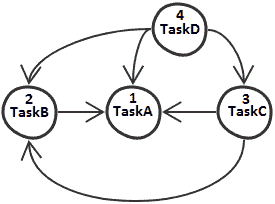
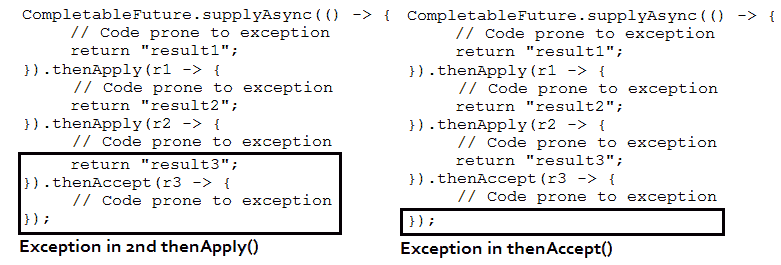
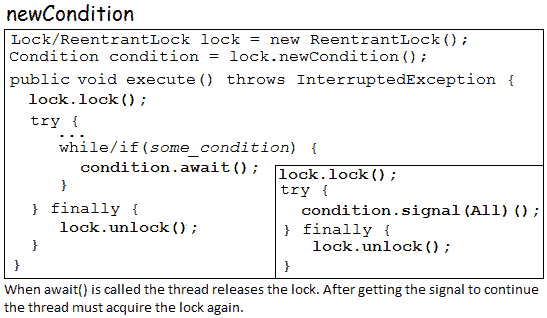
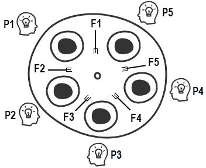

# 并发-深潜

本章包括涉及 Java 并发的 13 个问题，涉及 fork/join 框架、`CompletableFuture`、`ReentrantLock`、`ReentrantReadWriteLock`、`StampedLock`、原子变量、任务取消、可中断方法、线程局部、死锁等方面。对于任何开发人员来说，并发性都是必需的主题之一，在工作面试中不能被忽视。这就是为什么这一章和最后一章如此重要。读完本章，您将对并发性有相当的了解，这是每个 Java 开发人员都需要的。

# 问题

使用以下问题来测试您的并发编程能力。我强烈建议您在使用解决方案和下载示例程序之前，先尝试一下每个问题：

213.  **可中断方法**：**编写一个程序，举例说明处理可中断方法的最佳方法。**
***   **Fork/join framework**：编写一个依赖 Fork/join framework 对列表元素求和的程序。编写一个依赖 fork/join 框架的程序来计算给定位置的 Fibonacci 数（例如，F<sub>12</sub>=144）。另外，编写一个程序来举例说明`CountedCompleter`的用法。*   **叉/接框架和`compareAndSetForkJoinTaskTag()`**：编写一个程序，将 Fork/join 框架应用到一组相互依存的任务，只需执行一次（例如*任务 D*依赖于*任务 C*和*任务 B*，但*任务 C*依赖于*任务 B*也一样，因此*任务 B*只能执行一次，不能执行两次。**

 **216.  **`CompletableFuture`**：通过`CompletableFuture`写几个代码片段来举例说明异步代码。
217.  **组合多个`CompletableFuture`****对象**：写几段代码举例说明组合多个`CompletableFuture`对象的不同解决方案。
218.  **优化忙等待**：写一个概念证明来举例说明通过`onSpinWait()`优化*忙等待*技术。
219.  **任务取消**：写一个概念证明，举例说明如何使用`volatile`变量来保存进程的取消状态。
220.  `ThreadLocal`：写一个概念证明，举例说明`ThreadLocal`的用法。
221.  **原子变量**：使用多线程应用程序（`Runnable`编写一个从 1 到 1000000 的整数计数程序。
222.  **`ReentrantLock`**：编写一个程序，使用`ReentrantLock`将整数从 1 递增到 1000000。
223.  **`ReentrantReadWriteLock`**：通过`ReentrantReadWriteLock`编写模拟读写过程编排的程序。
224.  **`StampedLock`**：通过`StampedLock`编写模拟读写过程编排的程序。
225.  **死锁（就餐哲学家）**：编写一个程序，揭示并解决著名餐饮哲学家问题中可能出现的死锁（*循环等待*或*致命拥抱*。**  **# 解决

以下各节介绍上述问题的解决方案。记住，通常没有一个正确的方法来解决一个特定的问题。另外，请记住，这里显示的解释仅包括解决问题所需的最有趣和最重要的细节。下载示例解决方案以查看更多详细信息，并在[中试用程序 https://github.com/PacktPublishing/Java-Coding-Problems](https://github.com/PacktPublishing/Java-Coding-Problems)。

# 213 可中断方法

所谓可中断方法，是指可以抛出`InterruptedException`的阻塞方法，例如`Thread.sleep()`、`BlockingQueue.take()`、`BlockingQueue.poll(long timeout, TimeUnit unit)`等。阻塞线程通常处于**阻塞**、**等待**或**定时等待**状态，如果被中断，则该方法尝试尽快抛出`InterruptedException`。

因为`InterruptedException`是一个检查过的异常，所以我们必须捕获它和/或抛出它。换句话说，如果我们的方法调用了抛出`InterruptedException`的方法，那么我们必须准备好处理这个异常。如果我们可以抛出它（将异常传播给调用方），那么它就不再是我们的工作了。打电话的人必须进一步处理。所以，当我们必须抓住它的时候，让我们把注意力集中在这个案子上。当我们的代码在`Runnable`内运行时，就会出现这种情况，因为它不能抛出异常。

让我们从一个简单的例子开始。试图通过`poll(long timeout, TimeUnit unit)`从`BlockingQueue`获取元素可以写为：

```
try {
  queue.poll(3000, TimeUnit.MILLISECONDS);
} catch (InterruptedException ex) {
  ...
  logger.info(() -> "Thread is interrupted? "
    + Thread.currentThread().isInterrupted());
}
```

尝试轮询队列中的元素可能会导致`InterruptedException`。有一个 3000 毫秒的窗口可以中断线程。在中断的情况下（例如，`Thread.interrupt()`），我们可能会认为调用`catch`块中的`Thread.currentThread().isInterrupted()`将返回`true`。毕竟，我们处在一个`InterruptedException catch`街区，所以相信这一点是有道理的。实际上，它会返回`false`，答案在`poll(long timeout, TimeUnit unit)`方法的源代码中，如下所示：

```
1: public E poll(long timeout, TimeUnit unit) 
       throws InterruptedException {
2:   E e = xfer(null, false, TIMED, unit.toNanos(timeout));
3:   if (e != null || !Thread.interrupted())
4:     return e;
5:   throw new InterruptedException();
6: }
```

更准确地说，答案在第 3 行。如果线程被中断，那么`Thread.interrupted()`将返回`true`，并将导致第 5 行（`throw new InterruptedException()`。但是除了测试之外，如果当前线程被中断，`Thread.interrupted()`清除线程的中断状态。请查看以下连续调用中断线程：

```
Thread.currentThread().isInterrupted(); // true
Thread.interrupted() // true
Thread.currentThread().isInterrupted(); // false
Thread.interrupted() // false
```

注意，`Thread.currentThread().isInterrupted()`测试这个线程是否被中断，而不影响中断状态。

现在，让我们回到我们的案子。所以，我们知道线程在捕捉到`InterruptedException`后就中断了，但是中断状态被`Thread.interrupted()`清除了。这也意味着我们代码的调用者不会意识到中断。

我们有责任成为好公民，通过调用`interrupt()`方法恢复中断。这样，我们代码的调用者就可以看到发出了中断，并相应地采取行动。正确的代码如下：

```
try {
  queue.poll(3000, TimeUnit.MILLISECONDS);
} catch (InterruptedException ex) {
  ...
  Thread.currentThread().interrupt(); // restore interrupt
}
```

根据经验，在捕捉到`InterruptedException`之后，不要忘记通过调用`Thread.currentThread().interrupt()`来恢复中断。

让我们来解决一个突出显示忘记恢复中断的问题。假设一个`Runnable`只要当前线程没有中断就可以运行（例如，`while (!Thread.currentThread().isInterrupted()) { ... }`。

在每次迭代中，如果当前线程中断状态为`false`，那么我们尝试从`BlockingQueue`中获取一个元素。

实现代码如下：

```
Thread thread = new Thread(() -> {

  // some dummy queue
  TransferQueue<String> queue = new LinkedTransferQueue<>();

  while (!Thread.currentThread().isInterrupted()) {
    try {
      logger.info(() -> "For 3 seconds the thread " 
        + Thread.currentThread().getName() 
        + " will try to poll an element from queue ...");

      queue.poll(3000, TimeUnit.MILLISECONDS);
    } catch (InterruptedException ex) {
      logger.severe(() -> "InterruptedException! The thread "
        + Thread.currentThread().getName() + " was interrupted!");
      Thread.currentThread().interrupt();
    }
  }

  logger.info(() -> "The execution was stopped!");
});
```

作为调用者（另一个线程），我们启动上面的线程，睡眠 1.5 秒，只是给这个线程时间进入`poll()`方法，然后我们中断它。如下代码所示：

```
thread.start();
Thread.sleep(1500);
thread.interrupt();
```

这将导致`InterruptedException`。

记录异常并恢复中断。

下一步，`while`计算`Thread.currentThread().isInterrupted()`到`false`并退出。

因此，输出如下：

```
[18:02:43] [INFO] For 3 seconds the thread Thread-0
                  will try to poll an element from queue ...

[18:02:44] [SEVERE] InterruptedException!
                    The thread Thread-0 was interrupted!

[18:02:45] [INFO] The execution was stopped!
```

现在，让我们对恢复中断的行进行注释：

```
...
} catch (InterruptedException ex) {
  logger.severe(() -> "InterruptedException! The thread " 
    + Thread.currentThread().getName() + " was interrupted!");

  // notice that the below line is commented
  // Thread.currentThread().interrupt();
}
...
```

这一次，`while`块将永远运行，因为它的保护条件总是被评估为`true`。

代码不能作用于中断，因此输出如下：

```
[18:05:47] [INFO] For 3 seconds the thread Thread-0
                  will try to poll an element from queue ...

[18:05:48] [SEVERE] InterruptedException!
                    The thread Thread-0 was interrupted!

[18:05:48] [INFO] For 3 seconds the thread Thread-0
                  will try to poll an element from queue ...
...
```

根据经验，当我们可以接受中断（而不是恢复中断）时，唯一可以接受的情况是我们可以控制整个调用堆栈（例如，`extend Thread`）。

否则，捕获的`InterruptedException`也应该包含`Thread.currentThread().interrupt()`。

# 214Fork/join 框架

我们已经在*工作线程池*一节中介绍了 fork/join 框架。

fork/join 框架主要用于处理一个大任务（通常，通过 big，我们可以理解大量的数据）并递归地将其拆分为可以并行执行的小任务（子任务）。最后，在完成所有子任务后，它们的结果将合并（合并）为一个结果。

下图是 fork-join 流的可视化表示：


在 API 方面，可以通过`java.util.concurrent.ForkJoinPool`创建叉/连接。

JDK 8 之前，推荐的方法依赖于`public static`变量，如下所示：

```
public static ForkJoinPool forkJoinPool = new ForkJoinPool();
```

从 JDK 8 开始，我们可以按如下方式进行：

```
ForkJoinPool forkJoinPool = ForkJoinPool.commonPool();
```

这两种方法都避免了在单个 JVM 上有太多池线程这一令人不快的情况，这是由创建它们自己的池的并行操作造成的。

对于自定义的`ForkJoinPool`，依赖于此类的构造函数。jdk9 添加了迄今为止最全面的一个（详细信息见文档）。

A`ForkJoinPool`对象操作任务。`ForkJoinPool`中执行的任务的基本类型为`ForkJoinTask<V>`。更确切地说，执行以下任务：

*   `RecursiveAction`对于`void`任务
*   `RecursiveTask<V>`对于返回值的任务
*   `CountedCompleter<T>`对于需要记住挂起任务计数的任务

这三种类型的任务都有一个名为 T1 的 T0 方法，在这个方法中任务的逻辑是成形的。

向`ForkJoinPool`提交任务可以通过以下方式完成：

*   `execute()`和`submit()`
*   `invoke()`分岔等待结果
*   `invokeAll()`用于分叉一堆任务（例如，集合）
*   `fork()`用于安排在池中异步执行此任务，`join()`用于在完成时返回计算结果

让我们从一个通过`RecursiveTask`解决的问题开始。

# 通过 RecursiveTask 计算和

为了演示框架的分叉行为，我们假设我们有一个数字列表，并且我们要计算这些数字的总和。为此，我们使用`createSubtasks()`方法递归地拆分（fork）这个列表，只要它大于指定的`THRESHOLD`。每个任务都被添加到`List<SumRecursiveTask>`中。最后通过`invokeAll​(Collection<T> tasks)`方式将该列表提交给`ForkJoinPool`。这是使用以下代码完成的：

```
public class SumRecursiveTask extends RecursiveTask<Integer> {

  private static final Logger logger 
    = Logger.getLogger(SumRecursiveTask.class.getName());
  private static final int THRESHOLD = 10;

  private final List<Integer> worklist;

  public SumRecursiveTask(List<Integer> worklist) {
    this.worklist = worklist;
  }

  @Override
  protected Integer compute() {
    if (worklist.size() <= THRESHOLD) {
      return partialSum(worklist);
    }

    return ForkJoinTask.invokeAll(createSubtasks())
      .stream()
      .mapToInt(ForkJoinTask::join)
      .sum();
  }

  private List<SumRecursiveTask> createSubtasks() {

    List<SumRecursiveTask> subtasks = new ArrayList<>();
    int size = worklist.size();

    List<Integer> worklistLeft 
      = worklist.subList(0, (size + 1) / 2);
    List<Integer> worklistRight 
      = worklist.subList((size + 1) / 2, size);

    subtasks.add(new SumRecursiveTask(worklistLeft));
    subtasks.add(new SumRecursiveTask(worklistRight));

    return subtasks;
  }

  private Integer partialSum(List<Integer> worklist) {

    int sum = worklist.stream()
      .mapToInt(e -> e)
      .sum();

    logger.info(() -> "Partial sum: " + worklist + " = "
      + sum + "\tThread: " + Thread.currentThread().getName());

    return sum;
  }
}
```

为了测试它，我们需要一个列表和`ForkJoinPool`如下：

```
ForkJoinPool forkJoinPool = ForkJoinPool.commonPool();

Random rnd = new Random();
List<Integer> list = new ArrayList<>();

for (int i = 0; i < 200; i++) {
  list.add(1 + rnd.nextInt(10));
}

SumRecursiveTask sumRecursiveTask = new SumRecursiveTask(list);
Integer sumAll = forkJoinPool.invoke(sumRecursiveTask);

logger.info(() -> "Final sum: " + sumAll);
```

可能的输出如下：

```
...
[15:17:06] Partial sum: [1, 3, 6, 6, 2, 5, 9] = 32
ForkJoinPool.commonPool-worker-9
...
[15:17:06] Partial sum: [1, 9, 9, 8, 9, 5] = 41
ForkJoinPool.commonPool-worker-7
[15:17:06] Final sum: 1084
```

# 用递归运算计算斐波那契函数

斐波那契数通常表示为*F<sub>n</sub>*，是一个遵循以下公式的序列：

*F<sub>0</sub>=0，F<sub>1</sub>=1。。。F<sub>n</sub>=F<sub>n-1</sub>+F<sub>n-2</sub>（n>1*

斐波那契数的快照是：

0, 1, 1, 2, 3, 5, 8, 13, 21, 34, 55, 89, 144, ...

通过`RecursiveAction`实现斐波那契数可以如下完成：

```
public class FibonacciRecursiveAction extends RecursiveAction {

  private static final Logger logger =
    Logger.getLogger(FibonacciRecursiveAction.class.getName());
  private static final long THRESHOLD = 5;

  private long nr;

  public FibonacciRecursiveAction(long nr) {
    this.nr = nr;
  }

  @Override
  protected void compute() {

    final long n = nr;

    if (n <= THRESHOLD) {
      nr = fibonacci(n);
    } else {
      nr = ForkJoinTask.invokeAll(createSubtasks(n))
        .stream()
        .mapToLong(x -> x.fibonacciNumber())
        .sum();
    }
  }

  private List<FibonacciRecursiveAction> createSubtasks(long n) {

    List<FibonacciRecursiveAction> subtasks = new ArrayList<>();

    FibonacciRecursiveAction fibonacciMinusOne
      = new FibonacciRecursiveAction(n - 1);
    FibonacciRecursiveAction fibonacciMinusTwo
      = new FibonacciRecursiveAction(n - 2);

    subtasks.add(fibonacciMinusOne);
    subtasks.add(fibonacciMinusTwo);

    return subtasks;
  }

  private long fibonacci(long n) {
    logger.info(() -> "Number: " + n 
      + " Thread: " + Thread.currentThread().getName());

    if (n <= 1) {
      return n;
    }

    return fibonacci(n - 1) + fibonacci(n - 2);
  }

  public long fibonacciNumber() {
    return nr;
  }
}
```

为了测试它，我们需要以下`ForkJoinPool`对象：

```
ForkJoinPool forkJoinPool = ForkJoinPool.commonPool();

FibonacciRecursiveAction fibonacciRecursiveAction
  = new FibonacciRecursiveAction(12);
forkJoinPool.invoke(fibonacciRecursiveAction);

logger.info(() -> "Fibonacci: "
  + fibonacciRecursiveAction.fibonacciNumber());
```

*F<sub>12</sub>*的输出如下：

```
[15:40:46] Number: 5 Thread: ForkJoinPool.commonPool-worker-3
[15:40:46] Number: 5 Thread: ForkJoinPool.commonPool-worker-13
[15:40:46] Number: 4 Thread: ForkJoinPool.commonPool-worker-3
[15:40:46] Number: 4 Thread: ForkJoinPool.commonPool-worker-9
...
[15:40:49] Number: 0 Thread: ForkJoinPool.commonPool-worker-7
[15:40:49] Fibonacci: 144
```

# 使用 CountedCompleter

`CountedCompleter`是 JDK 8 中增加的`ForkJoinTask`类型。

`CountedCompleter`的任务是记住挂起的任务计数（不能少，不能多）。我们可以通过`setPendingCount()`设置挂起计数，也可以通过`addToPendingCount​(int delta)`用显式的`delta`递增。通常，我们在分叉之前调用这些方法（例如，如果我们分叉两次，则根据具体情况调用`addToPendingCount(2)`或`setPendingCount(2)`）。

在`compute()`方法中，我们通过`tryComplete()`或`propagateCompletion()`减少挂起计数。当调用挂起计数为零的`tryComplete()`方法或调用无条件`complete()`方法时，调用`onCompletion()`方法。`propagateCompletion()`方法与`tryComplete()`类似，但不调用`onCompletion()`。

`CountedCompleter`可以选择返回计算值。为此，我们必须重写`getRawResult()`方法来返回一个值。

下面的代码通过`CountedCompleter`对列表的所有值进行汇总：

```
public class SumCountedCompleter extends CountedCompleter<Long> {

  private static final Logger logger 
    = Logger.getLogger(SumCountedCompleter.class.getName());
  private static final int THRESHOLD = 10;
  private static final LongAdder sumAll = new LongAdder();

  private final List<Integer> worklist;

  public SumCountedCompleter(
    CountedCompleter<Long> c, List<Integer> worklist) {
    super(c);
    this.worklist = worklist;
  }

  @Override
  public void compute() {
    if (worklist.size() <= THRESHOLD) {
      partialSum(worklist);
    } else {
      int size = worklist.size();

      List<Integer> worklistLeft 
        = worklist.subList(0, (size + 1) / 2);
      List<Integer> worklistRight 
        = worklist.subList((size + 1) / 2, size);

      addToPendingCount(2);
      SumCountedCompleter leftTask
        = new SumCountedCompleter(this, worklistLeft);
      SumCountedCompleter rightTask
        = new SumCountedCompleter(this, worklistRight);

      leftTask.fork();
      rightTask.fork();
    }

    tryComplete();
  }

  @Override
  public void onCompletion(CountedCompleter<?> caller) {
    logger.info(() -> "Thread complete: " 
      + Thread.currentThread().getName());
  }

  @Override
  public Long getRawResult() {
    return sumAll.sum();
  }

  private Integer partialSum(List<Integer> worklist) {
    int sum = worklist.stream()
      .mapToInt(e -> e)
      .sum();

    sumAll.add(sum);

    logger.info(() -> "Partial sum: " + worklist + " = "
      + sum + "\tThread: " + Thread.currentThread().getName());

    return sum;
  }
}
```

现在，让我们看看一个潜在的调用和输出：

```
ForkJoinPool forkJoinPool = ForkJoinPool.commonPool();
Random rnd = new Random();
List<Integer> list = new ArrayList<>();

for (int i = 0; i < 200; i++) {
  list.add(1 + rnd.nextInt(10));
}

SumCountedCompleter sumCountedCompleter
  = new SumCountedCompleter(null, list);
forkJoinPool.invoke(sumCountedCompleter);

logger.info(() -> "Done! Result: "
  + sumCountedCompleter.getRawResult());
```

输出如下：

```
[11:11:07] Partial sum: [7, 7, 8, 5, 6, 10] = 43
  ForkJoinPool.commonPool-worker-7
[11:11:07] Partial sum: [9, 1, 1, 6, 1, 2] = 20
  ForkJoinPool.commonPool-worker-3
...
[11:11:07] Thread complete: ForkJoinPool.commonPool-worker-15
[11:11:07] Done! Result: 1159
```

# 215Fork/join 框架和 compareAndSetForkJoinTaskTag（）

现在，我们已经熟悉了 fork/join 框架，让我们看看另一个问题。这次让我们假设我们有一组相互依赖的对象。下图可以被视为一个用例：



以下是前面图表的说明：

*   **TaskD**有三个依赖项：**TaskA**、**TaskB**、**TaskC**。
*   **TaskC**有两个依赖项：**TaskA**和**TaskB**。
*   **TaskB**有一个依赖关系：**TaskA**。
*   **TaskA**没有依赖关系。

在代码行中，我们将对其进行如下塑造：

```
ForkJoinPool forkJoinPool = ForkJoinPool.commonPool();

Task taskA = new Task("Task-A", new Adder(1));

Task taskB = new Task("Task-B", new Adder(2), taskA);

Task taskC = new Task("Task-C", new Adder(3), taskA, taskB);

Task taskD = new Task("Task-D", new Adder(4), taskA, taskB, taskC);

forkJoinPool.invoke(taskD);
```

`Adder`是一个简单的`Callable`，每个任务只能执行一次（因此，对于**任务 d**、**任务 c**、**任务 b**、**任务 a**执行一次）。`Adder`由以下代码启动：

```
private static class Adder implements Callable {

  private static final AtomicInteger result = new AtomicInteger();

  private Integer nr;

  public Adder(Integer nr) {
    this.nr = nr;
  }

  @Override
  public Integer call() {
    logger.info(() -> "Adding number: " + nr
      + " by thread:" + Thread.currentThread().getName());

    return result.addAndGet(nr);
  }
}
```

我们已经知道如何将 fork/join 框架用于具有非循环和/或不可重复（或者我们不关心它们是否重复）完成依赖关系的任务。但是如果我们用这种方式实现，那么每个任务都会多次调用`Callable`。例如，**TaskA**作为其他三个任务的依赖项出现，因此`Callable`将被调用三次。我们只想要一次。

JDK 8 中添加的一个非常方便的特性`ForkJoinPool`是用`short`值进行原子标记：

*   `short getForkJoinTaskTag()`：返回该任务的标签。
*   `short setForkJoinTaskTag​(short newValue)`：自动设置此任务的标记值，并返回旧值。
*   `boolean compareAndSetForkJoinTaskTag​(short expect, short update)`：如果当前值等于`expect`并且更改为`update`，则返回`true`。

换句话说，`compareAndSetForkJoinTaskTag()`允许我们将任务标记为`VISITED`。一旦标记为`VISITED`，则不执行。让我们在以下代码行中看到它：

```
public class Task<Integer> extends RecursiveTask<Integer> {

  private static final Logger logger 
    = Logger.getLogger(Task.class.getName());
  private static final short UNVISITED = 0;
  private static final short VISITED = 1;

  private Set<Task<Integer>> dependencies = new HashSet<>();

  private final String name;
  private final Callable<Integer> callable;

  public Task(String name, Callable<Integer> callable,
      Task<Integer> ...dependencies) {
    this.name = name;
    this.callable = callable;
    this.dependencies = Set.of(dependencies);
  }

  @Override
  protected Integer compute() {
    dependencies.stream()
      .filter((task) -> (task.updateTaskAsVisited()))
      .forEachOrdered((task) -> {
        logger.info(() -> "Tagged: " + task + "("
          + task.getForkJoinTaskTag() + ")");

        task.fork();
      });

    for (Task task: dependencies) {
      task.join();
    }

    try {
      return callable.call();
    } catch (Exception ex) {
      logger.severe(() -> "Exception: " + ex);
    }

    return null;
  }

  public boolean updateTaskAsVisited() {
    return compareAndSetForkJoinTaskTag(UNVISITED, VISITED);
  }

  @Override
  public String toString() {
    return name + " | dependencies=" + dependencies + "}";
  }
}
```

可能的输出如下：

```
[10:30:53] [INFO] Tagged: Task-B(1)
[10:30:53] [INFO] Tagged: Task-C(1)
[10:30:53] [INFO] Tagged: Task-A(1)
[10:30:53] [INFO] Adding number: 1 
                   by thread:ForkJoinPool.commonPool-worker-3
[10:30:53] [INFO] Adding number: 2 
                   by thread:ForkJoinPool.commonPool-worker-3
[10:30:53] [INFO] Adding number: 3 
                   by thread:ForkJoinPool.commonPool-worker-5
[10:30:53] [INFO] Adding number: 4 
                   by thread:main
[10:30:53] [INFO] Result: 10
```

# 216 可完成的未来

jdk8 通过用`CompletableFuture`增强`Future`，在异步编程领域迈出了重要的一步。`Future`的主要限制是：

*   它不能显式地完成。
*   它不支持对结果执行操作的回调。
*   它们不能链接或组合以获得复杂的异步管道。
*   它不提供异常处理。

`CompletableFuture`没有这些限制。一个简单但无用的`CompletableFuture`可以写如下：

```
CompletableFuture<Integer> completableFuture 
  = new CompletableFuture<>();
```

通过阻断`get()`方法可以得到结果：

```
completableFuture.get();
```

除此之外，让我们看几个在电子商务平台上下文中运行异步任务的示例。我们将这些示例添加到名为`CustomerAsyncs`的助手类中。

# 运行异步任务并返回 void

用户问题：*打印某个客户订单。*

因为打印是一个不需要返回结果的过程，所以这是一个针对`runAsync()`的作业。此方法可以异步运行任务，并且不返回结果。换句话说，它接受一个`Runnable`对象并返回`CompletableFuture<Void>`，如下代码所示：

```
public static void printOrder() {

  CompletableFuture<Void> cfPrintOrder 
      = CompletableFuture.runAsync(new Runnable() {

    @Override
    public void run() {
      logger.info(() -> "Order is printed by: "
        + Thread.currentThread().getName());
      Thread.sleep(500);
    }
  });

  cfPrintOrder.get(); // block until the order is printed
  logger.info("Customer order was printed ...\n");
}
```

或者，我们可以用 lambda 来写：

```
public static void printOrder() {

  CompletableFuture<Void> cfPrintOrder 
      = CompletableFuture.runAsync(() -> {

    logger.info(() -> "Order is printed by: "
      + Thread.currentThread().getName());
    Thread.sleep(500);
  });

  cfPrintOrder.get(); // block until the order is printed
  logger.info("Customer order was printed ...\n");
}
```

# 运行异步任务并返回结果

用户问题：*获取某客户的订单汇总。*

这一次，异步任务必须返回一个结果，因此`runAsync()`没有用处。这是`supplyAsync()`的工作。取`Supplier<T>`返回`CompletableFuture<T>`。`T`是通过`get()`方法从该供应商处获得的结果类型。在代码行中，我们可以如下解决此问题：

```
public static void fetchOrderSummary() {

  CompletableFuture<String> cfOrderSummary 
      = CompletableFuture.supplyAsync(() -> {

    logger.info(() -> "Fetch order summary by: "
      + Thread.currentThread().getName());
    Thread.sleep(500);

    return "Order Summary #93443";
  });

  // wait for summary to be available, this is blocking
  String summary = cfOrderSummary.get();
  logger.info(() -> "Order summary: " + summary + "\n");
}
```

# 运行异步任务并通过显式线程池返回结果

用户问题：*取某客户的订单摘要。*

默认情况下，与前面的示例一样，异步任务在从全局`ForkJoinPool.commonPool()`获取的线程中执行。通过简单地记录`Thread.currentThread().getName()`，我们可以看到`ForkJoinPool.commonPool-worker-3`。

但是我们也可以使用显式的`Executor`自定义线程池。所有能够运行异步任务的`CompletableFuture`方法都提供了一种采用`Executor`的风格。

下面是使用单线程池的示例：

```
public static void fetchOrderSummaryExecutor() {

  ExecutorService executor = Executors.newSingleThreadExecutor();

  CompletableFuture<String> cfOrderSummary 
      = CompletableFuture.supplyAsync(() -> {

    logger.info(() -> "Fetch order summary by: "
      + Thread.currentThread().getName());
    Thread.sleep(500);

    return "Order Summary #91022";
  }, executor);

  // wait for summary to be available, this is blocking
  String summary = cfOrderSummary.get();
  logger.info(() -> "Order summary: " + summary + "\n");
  executor.shutdownNow();
}
```

# 附加处理异步任务结果并返回结果的回调

用户问题：*取某客户的订单发票，然后计算总金额并签字。*

依赖阻塞`get()`对此类问题不是很有用。我们需要的是一个回调方法，当`CompletableFuture`的结果可用时，该方法将被自动调用。

所以，我们不想等待结果。当发票准备就绪时（这是`CompletableFuture`的结果），回调方法应该计算总值，然后，另一个回调应该对其签名。这可以通过`thenApply()`方法实现。

`thenApply()`方法可用于`CompletableFuture`结果到达时的处理和转换。它以`Function<T, R>`为参数。让我们在工作中看看：

```
public static void fetchInvoiceTotalSign() {

  CompletableFuture<String> cfFetchInvoice 
      = CompletableFuture.supplyAsync(() -> {

    logger.info(() -> "Fetch invoice by: "
      + Thread.currentThread().getName());
    Thread.sleep(500);

    return "Invoice #3344";
  });

  CompletableFuture<String> cfTotalSign = cfFetchInvoice
    .thenApply(o -> o + " Total: $145")
    .thenApply(o -> o + " Signed");

  String result = cfTotalSign.get();
  logger.info(() -> "Invoice: " + result + "\n");
}
```

或者，我们可以将其链接如下：

```
public static void fetchInvoiceTotalSign() {

  CompletableFuture<String> cfTotalSign 
      = CompletableFuture.supplyAsync(() -> {

    logger.info(() -> "Fetch invoice by: "
      + Thread.currentThread().getName());
    Thread.sleep(500);

    return "Invoice #3344";
  }).thenApply(o -> o + " Total: $145")
    .thenApply(o -> o + " Signed");

  String result = cfTotalSign.get();
  logger.info(() -> "Invoice: " + result + "\n");
}
```

同时检查`applyToEither()`和`applyToEitherAsync()`。当这个或另一个给定的阶段以正常方式完成时，这两个方法将返回一个新的完成阶段，并将结果作为提供函数的参数执行。

# 附加处理异步任务结果并返回 void 的回调

用户问题：*取某客户订单打印。*

通常，不返回结果的回调充当异步管道的终端操作。

这种行为可以通过`thenAccept()`方法获得。取`Consumer<T>`返回`CompletableFuture<Void>`。此方法可以对`CompletableFuture`的结果进行处理和转换，但不返回结果。因此，它可以接受一个订单，它是`CompletableFuture`的结果，并按下面的代码片段打印出来：

```
public static void fetchAndPrintOrder() {

  CompletableFuture<String> cfFetchOrder 
      = CompletableFuture.supplyAsync(() -> {

    logger.info(() -> "Fetch order by: "
      + Thread.currentThread().getName());
    Thread.sleep(500);

    return "Order #1024";
  });

  CompletableFuture<Void> cfPrintOrder = cfFetchOrder.thenAccept(
    o -> logger.info(() -> "Printing order " + o +
      " by: " + Thread.currentThread().getName()));

  cfPrintOrder.get();
  logger.info("Order was fetched and printed \n");
}
```

或者，它可以更紧凑，如下所示：

```
public static void fetchAndPrintOrder() {

  CompletableFuture<Void> cfFetchAndPrintOrder 
      = CompletableFuture.supplyAsync(() -> {

    logger.info(() -> "Fetch order by: "
      + Thread.currentThread().getName());
    Thread.sleep(500);

    return "Order #1024";
  }).thenAccept(
      o -> logger.info(() -> "Printing order " + o + " by: "
        + Thread.currentThread().getName()));

  cfFetchAndPrintOrder.get();
  logger.info("Order was fetched and printed \n");
}
```

同时检查`acceptEither()`和`acceptEitherAsync()`。

# 附加在异步任务之后运行并返回 void 的回调

用户问题：*下订单通知客户。*

通知客户应在交付订单后完成。这只是一条*亲爱的客户的短信，您的订单已经在*类型的今天送达，所以通知任务不需要知道任何关于订单的信息。这类任务可以通过`thenRun()`来完成。此方法取`Runnable`，返回`CompletableFuture<Void>`。让我们在工作中看看：

```
public static void deliverOrderNotifyCustomer() {

  CompletableFuture<Void> cfDeliverOrder 
      = CompletableFuture.runAsync(() -> {

    logger.info(() -> "Order was delivered by: "
      + Thread.currentThread().getName());
    Thread.sleep(500);
  });

  CompletableFuture<Void> cfNotifyCustomer 
      = cfDeliverOrder.thenRun(() -> logger.info(
        () -> "Dear customer, your order has been delivered today by:"
          + Thread.currentThread().getName()));

  cfNotifyCustomer.get();
  logger.info(() -> "Order was delivered 
                       and customer was notified \n");
}
```

为了进一步的并行化，`thenApply()`、`thenAccept()`和`thenRun()`伴随着`thenApplyAsync()`、`thenAcceptAsync()`和`thenRunAsync()`。其中每一个都可以依赖于全局`ForkJoinPool.commonPool()`或自定义线程池（`Executor`。当`thenApply`/`Accept`/`Run()`在与之前执行的`CompletableFuture`任务相同的线程中执行时（或在主线程中），可以在不同的线程中执行`thenApplyAsync`/`AcceptAsync`/`RunAsync()`（来自`ForkJoinPool.commonPool()`或自定义线程池（【T16）】）。

# 通过异常（）处理异步任务的异常

用户问题：*计算订单总数。如果出了问题，就扔一个*`IllegalStateException`*。*

以下屏幕截图举例说明了异常是如何在异步管道中传播的；在某个点发生异常时，不会执行矩形中的代码：


以下截图显示了`thenApply()`和`thenAccept()`中的异常：



因此，在`supplyAsync()`中，如果发生异常，则不会调用以下回调。此外，未来将得到解决，但这一例外情况除外。相同的规则适用于每个回调。如果第一个`thenApply()`出现异常，则不调用以下`thenApply()`和`thenAccept()`。

如果我们试图计算订单总数的结果是一个`IllegalStateException`，那么我们可以依赖`exceptionally()`回调，这给了我们一个恢复的机会。此方法接受一个`Function<Throwable,​? extends T>`，并返回一个`CompletionStage<T>`，因此返回一个`CompletableFuture`。让我们在工作中看看：

```
public static void fetchOrderTotalException() {

  CompletableFuture<Integer> cfTotalOrder 
      = CompletableFuture.supplyAsync(() -> {

    logger.info(() -> "Compute total: "
      + Thread.currentThread().getName());

    int surrogate = new Random().nextInt(1000);
    if (surrogate < 500) {
      throw new IllegalStateException(
        "Invoice service is not responding");
    }

    return 1000;
  }).exceptionally(ex -> {
    logger.severe(() -> "Exception: " + ex
      + " Thread: " + Thread.currentThread().getName());

    return 0;
  });

  int result = cfTotalOrder.get();
  logger.info(() -> "Total: " + result + "\n");
}
```

异常情况下，输出如下：

```
Compute total: ForkJoinPool.commonPool-worker-3
Exception: java.lang.IllegalStateException: Invoice service
           is not responding Thread: ForkJoinPool.commonPool-worker-3
Total: 0
```

让我们看看另一个问题。

用户问题：*取发票，计算合计，签字。如有问题，则抛出*`IllegalStateException`*，停止处理。*

如果我们用`supplyAsync()`取发票，用`thenApply()`计算合计，用另一个`thenApply()`签字，那么我们可以认为正确的实现如下：

```
public static void fetchInvoiceTotalSignChainOfException()
throws InterruptedException, ExecutionException {

  CompletableFuture<String> cfFetchInvoice 
      = CompletableFuture.supplyAsync(() -> {

    logger.info(() -> "Fetch invoice by: "
      + Thread.currentThread().getName());

    int surrogate = new Random().nextInt(1000);
    if (surrogate < 500) {
      throw new IllegalStateException(
        "Invoice service is not responding");
    }

    return "Invoice #3344";
  }).exceptionally(ex -> {
    logger.severe(() -> "Exception: " + ex
      + " Thread: " + Thread.currentThread().getName());

    return "[Invoice-Exception]";
  }).thenApply(o -> {
      logger.info(() -> "Compute total by: "
        + Thread.currentThread().getName());

    int surrogate = new Random().nextInt(1000);
    if (surrogate < 500) {
      throw new IllegalStateException(
        "Total service is not responding");
    }

    return o + " Total: $145";
  }).exceptionally(ex -> {
    logger.severe(() -> "Exception: " + ex
      + " Thread: " + Thread.currentThread().getName());

    return "[Total-Exception]";
  }).thenApply(o -> {
    logger.info(() -> "Sign invoice by: "
      + Thread.currentThread().getName());

    int surrogate = new Random().nextInt(1000);
    if (surrogate < 500) {
      throw new IllegalStateException(
        "Signing service is not responding");
    }

    return o + " Signed";
  }).exceptionally(ex -> {
    logger.severe(() -> "Exception: " + ex
      + " Thread: " + Thread.currentThread().getName());

    return "[Sign-Exception]";
  });

  String result = cfFetchInvoice.get();
  logger.info(() -> "Result: " + result + "\n");
}
```

好吧，这里的问题是，我们可能面临如下输出：

```
[INFO] Fetch invoice by: ForkJoinPool.commonPool-worker-3
[SEVERE] Exception: java.lang.IllegalStateException: Invoice service
         is not responding Thread: ForkJoinPool.commonPool-worker-3
[INFO] Compute total by: ForkJoinPool.commonPool-worker-3
[INFO] Sign invoice by: ForkJoinPool.commonPool-worker-3
[SEVERE] Exception: java.lang.IllegalStateException: Signing service
         is not responding Thread: ForkJoinPool.commonPool-worker-3
[INFO] Result: [Sign-Exception]
```

即使发票拿不到，我们也会继续计算总数并签字。显然，这没有道理。如果无法提取发票，或者无法计算总额，则我们希望中止该过程。当我们可以恢复并继续时，这个实现可能是一个很好的选择，但它绝对不适合我们的场景。对于我们的场景，需要以下实现：

```
public static void fetchInvoiceTotalSignException()
throws InterruptedException, ExecutionException {

  CompletableFuture<String> cfFetchInvoice 
      = CompletableFuture.supplyAsync(() -> {

    logger.info(() -> "Fetch invoice by: "
      + Thread.currentThread().getName());

    int surrogate = new Random().nextInt(1000);
    if (surrogate < 500) {
      throw new IllegalStateException(
        "Invoice service is not responding");
    }

    return "Invoice #3344";
  }).thenApply(o -> {
      logger.info(() -> "Compute total by: "
        + Thread.currentThread().getName());

    int surrogate = new Random().nextInt(1000);
    if (surrogate < 500) {
      throw new IllegalStateException(
        "Total service is not responding");
    }

    return o + " Total: $145";
  }).thenApply(o -> {
      logger.info(() -> "Sign invoice by: "
        + Thread.currentThread().getName());

    int surrogate = new Random().nextInt(1000);
    if (surrogate < 500) {
      throw new IllegalStateException(
        "Signing service is not responding");
    }

    return o + " Signed";
  }).exceptionally(ex -> {
    logger.severe(() -> "Exception: " + ex
      + " Thread: " + Thread.currentThread().getName());

    return "[No-Invoice-Exception]";
  });

  String result = cfFetchInvoice.get();
  logger.info(() -> "Result: " + result + "\n");
}
```

这一次，在任何隐含的`CompletableFuture`中发生的异常将停止该过程。以下是可能的输出：

```
[INFO ] Fetch invoice by: ForkJoinPool.commonPool-worker-3
[SEVERE] Exception: java.lang.IllegalStateException: Invoice service
         is not responding Thread: ForkJoinPool.commonPool-worker-3
[INFO ] Result: [No-Invoice-Exception]
```

从 jdk12 开始，异常情况可以通过`exceptionallyAsync()`进一步并行化，它可以使用与引起异常的代码相同的线程或给定线程池（`Executor`中的线程）。举个例子：

```
public static void fetchOrderTotalExceptionAsync() {

  ExecutorService executor = Executors.newSingleThreadExecutor();

  CompletableFuture<Integer> totalOrder 
      = CompletableFuture.supplyAsync(() -> {

    logger.info(() -> "Compute total by: "
      + Thread.currentThread().getName());

    int surrogate = new Random().nextInt(1000);
    if (surrogate < 500) {
      throw new IllegalStateException(
        "Computing service is not responding");
    }

    return 1000;
  }).exceptionallyAsync(ex -> {
    logger.severe(() -> "Exception: " + ex 
      + " Thread: " + Thread.currentThread().getName());

    return 0;
  }, executor);

  int result = totalOrder.get();
  logger.info(() -> "Total: " + result + "\n");
  executor.shutdownNow();
}
```

输出显示导致异常的代码是由名为`ForkJoinPool.commonPool-worker-3`的线程执行的，而异常代码是由给定线程池中名为`pool-1-thread-1`的线程执行的：

```
Compute total by: ForkJoinPool.commonPool-worker-3
Exception: java.lang.IllegalStateException: Computing service is
           not responding Thread: pool-1-thread-1
Total: 0
```

# JDK 12 例外公司（）

用户问题：*通过打印服务获取打印机 IP 或回退到备份打印机 IP。或者，一般来说，当**这个阶段异常完成时，应该使用应用于这个阶段异常*的所提供函数的结果来合成。

我们有`CompletableFuture`获取打印服务管理的打印机的 IP。如果服务没有响应，则抛出如下异常：

```
CompletableFuture<String> cfServicePrinterIp 
    = CompletableFuture.supplyAsync(() -> {

  int surrogate = new Random().nextInt(1000);
  if (surrogate < 500) {
    throw new IllegalStateException(
      "Printing service is not responding");
  }

  return "192.168.1.0";
});
```

我们还有获取备份打印机 IP 的`CompletableFuture`：

```
CompletableFuture<String> cfBackupPrinterIp 
    = CompletableFuture.supplyAsync(() -> {

  return "192.192.192.192";
});
```

现在，如果没有打印服务，那么我们应该依靠备份打印机。这可以通过 JDK 12`exceptionallyCompose()`实现，如下所示：

```
CompletableFuture<Void> printInvoice 
    = cfServicePrinterIp.exceptionallyCompose(th -> {

  logger.severe(() -> "Exception: " + th
    + " Thread: " + Thread.currentThread().getName());

  return cfBackupPrinterIp;
}).thenAccept((ip) -> logger.info(() -> "Printing at: " + ip));
```

调用`printInvoice.get()`可能会显示以下结果之一：

*   如果打印服务可用：

```
[INFO] Printing at: 192.168.1.0
```

*   如果打印服务不可用：

```
[SEVERE] Exception: java.util.concurrent.CompletionException ...
[INFO] Printing at: 192.192.192.192
```

对于进一步的并行化，我们可以依赖于`exceptionallyComposeAsync()`。

# 通过句柄（）处理异步任务的异常

用户问题：*计算订单总数。如果出现问题，则抛出一个*`IllegalStateException`*。*

有时我们希望执行一个异常代码块，即使没有发生异常。类似于`try`-`catch`块的`finally`子句。这可以使用`handle()`回调。无论是否发生异常，都会调用此方法，它类似于一个`catch`+`finally`。它使用一个函数来计算返回的`CompletionStage, BiFunction<? super T,​Throwable,​? extends U>`的值并返回`CompletionStage<U>`（`U`是函数的返回类型）。

让我们在工作中看看：

```
public static void fetchOrderTotalHandle() {

  CompletableFuture<Integer> totalOrder 
      = CompletableFuture.supplyAsync(() -> {

    logger.info(() -> "Compute total by: "
      + Thread.currentThread().getName());

    int surrogate = new Random().nextInt(1000);
    if (surrogate < 500) {
      throw new IllegalStateException(
        "Computing service is not responding");
    }

    return 1000;
  }).handle((res, ex) -> {
    if (ex != null) {
      logger.severe(() -> "Exception: " + ex
        + " Thread: " + Thread.currentThread().getName());

      return 0;
    }

    if (res != null) {
      int vat = res * 24 / 100;
      res += vat;
    }

    return res;
  });

  int result = totalOrder.get();
  logger.info(() -> "Total: " + result + "\n");
}
```

注意，`res`将是`null`；否则，如果发生异常，`ex`将是`null`。

如果我们需要在例外情况下完成，那么我们可以通过`completeExceptionally()`继续，如下例所示：

```
CompletableFuture<Integer> cf = new CompletableFuture<>();
...
cf.completeExceptionally(new RuntimeException("Ops!"));
...
cf.get(); // ExecutionException : RuntimeException
```

取消执行并抛出`CancellationException`可以通过`cancel()`方法完成：

```
CompletableFuture<Integer> cf = new CompletableFuture<>();
...
// is not important if the argument is set to true or false
cf.cancel(true/false);
...
cf.get(); // CancellationException
```

# 显式完成可完成的未来

`CompletableFuture`可以使用`complete​(T value)`、`completeAsync​(Supplier<? extends T> supplier)`和`completeAsync​(Supplier<? extends T> supplier, Executor executor)`显式完成。`T`是`get()`返回的值。这里是一个创建`CompletableFuture`并立即返回它的方法。另一个线程负责执行一些税务计算并用相应的结果完成`CompletableFuture`：

```
public static CompletableFuture<Integer> taxes() {

  CompletableFuture<Integer> completableFuture 
    = new CompletableFuture<>();

  new Thread(() -> {
    int result = new Random().nextInt(100);
    Thread.sleep(10);

    completableFuture.complete(result);
  }).start();

  return completableFuture;
}
```

我们称这个方法为：

```
logger.info("Computing taxes ...");

CompletableFuture<Integer> cfTaxes = CustomerAsyncs.taxes();

while (!cfTaxes.isDone()) {
  logger.info("Still computing ...");
}

int result = cfTaxes.get();
logger.info(() -> "Result: " + result);
```

可能的输出如下：

```
[14:09:40] [INFO ] Computing taxes ...
[14:09:40] [INFO ] Still computing ...
[14:09:40] [INFO ] Still computing ...
...
[14:09:40] [INFO ] Still computing ...
[14:09:40] [INFO ] Result: 17
```

如果我们已经知道了`CompletableFuture`的结果，那么我们可以调用`completedFuture​(U value)`，如下例所示：

```
CompletableFuture<String> completableFuture 
  = CompletableFuture.completedFuture("How are you?");

String result = completableFuture.get();
logger.info(() -> "Result: " + result); // Result: How are you?
```

同时检查`whenComplete()`和`whenCompleteAsync()`的文件。

# 217 组合多个 CompletableFuture 实例

在大多数情况下，组合`CompletableFuture`实例可以使用以下方法完成：

*   `thenCompose()`
*   `thenCombine()`
*   `allOf()`
*   `anyOf()`

通过结合`CompletableFuture`实例，我们可以形成复杂的异步解决方案。这样，多个`CompletableFuture`实例就可以合并它们的能力来达到一个共同的目标。

# 通过合成（）组合

假设在名为`CustomerAsyncs`的助手类中有以下两个`CompletableFuture`实例：

```
private static CompletableFuture<String> 
    fetchOrder(String customerId) {

  return CompletableFuture.supplyAsync(() -> {
    return "Order of " + customerId;
  });
}

private static CompletableFuture<Integer> computeTotal(String order) {

  return CompletableFuture.supplyAsync(() -> {
    return order.length() + new Random().nextInt(1000);
  });
}
```

现在，我们要获取某个客户的订单，一旦订单可用，我们就要计算这个订单的总数。这意味着我们需要调用`fetchOrder()`，然后调用`computeTotal()`。我们可以通过`thenApply()`实现：

```
CompletableFuture<CompletableFuture<Integer>> cfTotal 
  = fetchOrder(customerId).thenApply(o -> computeTotal(o));

int total = cfTotal.get().get();
```

显然，这不是一个方便的解决方案，因为结果是`CompletableFuture<CompletableFuture<Integer>>`类型的。为了避免嵌套`CompletableFuture`实例，我们可以依赖`thenCompose()`如下：

```
CompletableFuture<Integer> cfTotal 
  = fetchOrder(customerId).thenCompose(o -> computeTotal(o));

int total = cfTotal.get();

// e.g., Total: 734
logger.info(() -> "Total: " + total);
```

当我们需要从一系列的`CompletableFuture`实例中获得一个平坦的结果时，我们可以使用`thenCompose()`。这样我们就避免了嵌套的`CompletableFuture`实例。

使用`thenComposeAsync()`可以获得进一步的并行化。

# 通过合并（）合并

`thenCompose()`用于链接两个依赖的`CompletableFuture`实例，`thenCombine()`用于链接两个独立的`CompletableFuture`实例。当两个`CompletableFuture`实例都完成时，我们可以继续。

假设我们有以下两个`CompletableFuture`实例：

```
private static CompletableFuture<Integer> computeTotal(String order) {

  return CompletableFuture.supplyAsync(() -> {
    return order.length() + new Random().nextInt(1000);
  });
}

private static CompletableFuture<String> packProducts(String order) {

  return CompletableFuture.supplyAsync(() -> {
    return "Order: " + order 
      + " | Product 1, Product 2, Product 3, ... ";
  });
}
```

为了交付客户订单，我们需要计算总金额（用于发出发票），并打包订购的产品。这两个动作可以并行完成。最后，我们把包裹寄了，里面有订购的产品和发票。通过`thenCombine()`实现此目的，可如下：

```
CompletableFuture<String> cfParcel = computeTotal(order)
  .thenCombine(packProducts(order), (total, products) -> {
    return "Parcel-[" + products + " Invoice: $" + total + "]";
  });

String parcel = cfParcel.get();

// e.g. Delivering: Parcel-[Order: #332 | Product 1, Product 2,
// Product 3, ... Invoice: $314]
logger.info(() -> "Delivering: " + parcel);
```

给`thenCombine()`的回调函数将在两个`CompletableFuture`实例完成后调用。

如果我们只需要在两个`CompletableFuture`实例正常完成时做一些事情（这个和另一个），那么我们可以依赖`thenAcceptBoth()`。此方法返回一个新的`CompletableFuture`，将这两个结果作为所提供操作的参数来执行。这两个结果是此阶段和另一个给定阶段（它们必须正常完成）。下面是一个示例：

```
CompletableFuture<Void> voidResult = CompletableFuture
  .supplyAsync(() -> "Pick")
  .thenAcceptBoth(CompletableFuture.supplyAsync(() -> " me"),
    (pick, me) -> System.out.println(pick + me));
```

如果不需要这两个`CompletableFuture`实例的结果，则`runAfterBoth()`更为可取。

# 通过 allOf（）组合

假设我们要下载以下发票列表：

```
List<String> invoices = Arrays.asList("#2334", "#122", "#55");
```

这可以看作是一堆可以并行完成的独立任务，所以我们可以使用`CompletableFuture`来完成，如下所示：

```
public static CompletableFuture<String> 
    downloadInvoices(String invoice) {

  return CompletableFuture.supplyAsync(() -> {
    logger.info(() -> "Downloading invoice: " + invoice);

    return "Downloaded invoice: " + invoice;
  });
}

CompletableFuture<String> [] cfInvoices = invoices.stream()
  .map(CustomerAsyncs::downloadInvoices)
  .toArray(CompletableFuture[]::new);
```

此时，我们有一个`CompletableFuture`实例数组，因此，还有一个异步计算数组。此外，我们希望并行运行它们。这可以通过`allOf​(CompletableFuture<?>... cfs)`方法实现。结果由一个`CompletableFuture<Void>`组成，如下所示：

```
CompletableFuture<Void> cfDownloaded 
  = CompletableFuture.allOf(cfInvoices);
cfDownloaded.get();
```

显然，`allOf()`的结果不是很有用。我们能用`CompletableFuture<Void>`做什么？在这个并行化过程中，当我们需要每次计算的结果时，肯定会遇到很多问题，因此我们需要一个获取结果的解决方案，而不是依赖于`CompletableFuture<Void>`。

我们可以通过`thenApply()`来解决这个问题，如下所示：

```
List<String> results = cfDownloaded.thenApply(e -> {
  List<String> downloaded = new ArrayList<>();

  for (CompletableFuture<String> cfInvoice: cfInvoices) {
    downloaded.add(cfInvoice.join());
  }

  return downloaded;
}).get();
```

`join()`方法类似于`get()`，但是，如果基础`CompletableFuture`异常完成，则抛出未检查的异常。

由于我们在所有相关`CompletableFuture`完成后呼叫`join()`，因此没有阻塞点。

返回的`List<String>`包含调用`downloadInvoices()`方法得到的结果，如下所示：

```
Downloaded invoice: #2334

Downloaded invoice: #122

Downloaded invoice: #55
```

# 通过 anyOf（）组合

假设我们想为客户组织一次抽奖活动：

```
List<String> customers = Arrays.asList(
  "#1", "#4", "#2", "#7", "#6", "#5"
);
```

我们可以通过定义以下琐碎的方法开始解决这个问题：

```
public static CompletableFuture<String> raffle(String customerId) {

  return CompletableFuture.supplyAsync(() -> {
    Thread.sleep(new Random().nextInt(5000));

    return customerId;
  });
}
```

现在，我们可以创建一个`CompletableFuture<String>`实例数组，如下所示：

```
CompletableFuture<String>[] cfCustomers = customers.stream()
  .map(CustomerAsyncs::raffle)
  .toArray(CompletableFuture[]::new);
```

为了找到抽奖的赢家，我们要并行运行`cfCustomers`，第一个完成的`CompletableFuture`就是赢家。因为`raffle()`方法阻塞随机数秒，所以将随机选择获胜者。我们对其余的`CompletableFuture`实例不感兴趣，所以应该在选出获胜者后立即完成。

这是`anyOf​(CompletableFuture<?>... cfs)`的工作。它返回一个新的`CompletableFuture`，当涉及的任何`CompletableFuture`实例完成时，这个新的`CompletableFuture`就完成了。让我们在工作中看看：

```
CompletableFuture<Object> cfWinner 
  = CompletableFuture.anyOf(cfCustomers);

Object winner = cfWinner.get();

// e.g., Winner: #2
logger.info(() -> "Winner: " + winner);
```

注意依赖于返回不同类型结果的`CompletableFuture`的场景。因为`anyOf()`返回`CompletableFuture<Object>`，所以很难知道先完成的`CompletableFuture`类型。

# 218 优化忙等待

*忙等待*技术（也称为*忙循环*或*旋转*）由检查条件（通常，标志条件）的循环组成。例如，以下循环等待服务启动：

```
private volatile boolean serviceAvailable;
...
while (!serviceAvailable) {}
```

Java9 介绍了`Thread.onSpinWait()`方法。这是一个热点，它向 JVM 提示以下代码处于自旋循环中：

```
while (!serviceAvailable) {
  Thread.onSpinWait();
}
```

英特尔 SSE2 暂停指令正是出于这个原因提供的。有关详细信息，请参阅英特尔官方文档。也看看这个链接：[https://software.intel.com/en-us/articles/benefitting-power-and-performance-sleep-loops](https://software.intel.com/en-us/articles/benefitting-power-and-performance-sleep-loops)。

如果我们在上下文中添加这个`while`循环，那么我们得到以下类：

```
public class StartService implements Runnable {

  private volatile boolean serviceAvailable;

  @Override
  public void run() {
    System.out.println("Wait for service to be available ...");

    while (!serviceAvailable) {
      // Use a spin-wait hint (ask the processor to
      // optimize the resource)
      // This should perform better if the underlying
      // hardware supports the hint
      Thread.onSpinWait();
    }

    serviceRun();
  }

  public void serviceRun() {
    System.out.println("Service is running ...");
  }

  public void setServiceAvailable(boolean serviceAvailable) {
    this.serviceAvailable = serviceAvailable;
  }
}
```

而且，我们可以很容易地测试它（不要期望看到`onSpinWait()`的效果）：

```
StartService startService = new StartService();
new Thread(startService).start();

Thread.sleep(5000);

startService.setServiceAvailable(true);
```

# 219 任务取消

取消是一种常用的技术，用于强制停止或完成当前正在运行的任务。取消的任务不会自然完成。取消对已完成的任务没有影响。可以将其视为 GUI 的**取消**按钮。

Java 没有提供一种抢先停止线程的方法。因此，对于取消任务，通常的做法是依赖于使用标志条件的循环。任务的职责是定期检查这个标志，当它找到设置的标志时，它应该尽快停止。下面的代码就是一个例子：

```
public class RandomList implements Runnable {
  private volatile boolean cancelled;
  private final List<Integer> randoms = new CopyOnWriteArrayList<>();
  private final Random rnd = new Random();

  @Override
  public void run() {
    while (!cancelled) {
      randoms.add(rnd.nextInt(100));
    }
  }

  public void cancel() {
    cancelled = true;
  }

  public List<Integer> getRandoms() {
    return randoms;
  }
}
```

这里的重点是`canceled`变量。注意，这个变量被声明为`volatile`（也称为轻量级同步机制）。作为一个`volatile`变量，它不会被线程缓存，对它的操作也不会在内存中重新排序；因此，线程看不到旧值。任何读取`volatile`字段的线程都将看到最近写入的值。这正是我们所需要的，以便将取消操作传递给对该操作感兴趣的所有正在运行的线程。下图描述了`volatile`和非`volatile`的工作原理：


注意，`volatile`变量不适合读-修改-写场景。对于这样的场景，我们将依赖于原子变量（例如，`AtomicBoolean`、`AtomicInteger`、`AtomicReference`等等）。

现在，让我们提供一个简单的代码片段，用于取消在`RandomList`中实现的任务：

```
RandomList rl = new RandomList();

ExecutorService executor = Executors.newFixedThreadPool(10);

for (int i = 0; i < 100; i++) {
  executor.execute(rl);
}

Thread.sleep(100);

rl.cancel();

System.out.println(rl.getRandoms());
```

# 220 线程本地

Java 线程共享相同的内存，但有时我们需要为每个线程提供专用内存。Java 提供`ThreadLocal`作为一种方法，分别存储和检索每个线程的值。`ThreadLocal`的一个实例可以存储和检索多个线程的值。如果线程`A`存储`x`值，线程`B`在`ThreadLocal`的同一实例中存储`y`值，那么稍后，线程`A`检索`x`值，线程`B`检索`y`值。

Java`ThreadLocal`通常用于以下两种场景：

*   用于提供每线程实例（线程安全和内存效率）

*   用于提供每线程上下文

让我们在下一节中看看每个场景的问题。

# 每线程实例

假设我们有一个使用`StringBuilder`类型的全局变量的单线程应用程序。为了在多线程应用程序中转换应用程序，我们必须处理`StringBuilder`，它不是线程安全的。基本上，我们有几种方法，例如同步和`StringBuffer`或其他方法。不过，我们也可以使用`ThreadLocal`。这里的主要思想是为每个线程提供一个单独的`StringBuilder`。使用`ThreadLocal`，我们可以做如下操作：

```
private static final ThreadLocal<StringBuilder> 
    threadLocal = new ThreadLocal<>() {

  @Override
  protected StringBuilder initialValue() {
    return new StringBuilder("ThreadSafe ");
  }
};
```

此线程局部变量的当前线程的*初始值*通过`initialValue()`方法设置。在 Java 8 中，可以通过`withInitial()`重写如下：

```
private static final ThreadLocal<StringBuilder> threadLocal 
    = ThreadLocal.<StringBuilder> withInitial(() -> {

  return new StringBuilder("Thread-safe ");
});
```

使用`get()`和`set()`对`ThreadLocal`进行操作。`set()`的每次调用都将给定的值存储在只有当前线程才能访问的内存区域中。稍后，调用`get()`将从该区域检索值。另外，一旦工作完成，建议通过调用`ThreadLocal`实例上的`remove()`或`set(null)`方法来避免内存泄漏。

让我们看看 a`ThreadLocal`在工作中使用`Runnable`

```
public class ThreadSafeStringBuilder implements Runnable {

  private static final Logger logger =
    Logger.getLogger(ThreadSafeStringBuilder.class.getName());
  private static final Random rnd = new Random();

  private static final ThreadLocal<StringBuilder> threadLocal 
      = ThreadLocal.<StringBuilder> withInitial(() -> {

    return new StringBuilder("Thread-safe ");
  });

  @Override
  public void run() {
    logger.info(() -> "-> " + Thread.currentThread().getName() 
      + " [" + threadLocal.get() + "]");

    Thread.sleep(rnd.nextInt(2000));

    // threadLocal.set(new StringBuilder(
    // Thread.currentThread().getName()));
    threadLocal.get().append(Thread.currentThread().getName());

    logger.info(() -> "-> " + Thread.currentThread().getName() 
      + " [" + threadLocal.get() + "]");

    threadLocal.set(null);
    // threadLocal.remove();

    logger.info(() -> "-> " + Thread.currentThread().getName() 
      + " [" + threadLocal.get() + "]");
  }
}
```

让我们用几个线程来测试它：

```
ThreadSafeStringBuilder threadSafe = new ThreadSafeStringBuilder();

for (int i = 0; i < 3; i++) {
  new Thread(threadSafe, "thread-" + i).start();
}
```

输出显示每个线程访问自己的`StringBuilder`：

```
[14:26:39] [INFO] -> thread-1 [Thread-safe ]
[14:26:39] [INFO] -> thread-0 [Thread-safe ]
[14:26:39] [INFO] -> thread-2 [Thread-safe ]
[14:26:40] [INFO] -> thread-0 [Thread-safe thread-0]
[14:26:40] [INFO] -> thread-0 [null]
[14:26:41] [INFO] -> thread-1 [Thread-safe thread-1]
[14:26:41] [INFO] -> thread-1 [null]
[14:26:41] [INFO] -> thread-2 [Thread-safe thread-2]
[14:26:41] [INFO] -> thread-2 [null]
```

在上述场景中，也可以使用`ExecutorService`。

下面是为每个线程提供 JDBC`Connection`的另一段代码：

```
private static final ThreadLocal<Connection> connections 
    = ThreadLocal.<Connection> withInitial(() -> {

  try {
    return DriverManager.getConnection("jdbc:mysql://...");
  } catch (SQLException ex) {
    throw new RuntimeException("Connection acquisition failed!", ex);
  }
});

public static Connection getConnection() {
  return connections.get();
}
```

# 每线程上下文

假设我们有以下`Order`类：

```
public class Order {

  private final int customerId;

  public Order(int customerId) {
    this.customerId = customerId;
  }

  // getter and toString() omitted for brevity
}
```

我们写下`CustomerOrder`如下：

```
public class CustomerOrder implements Runnable {

  private static final Logger logger
    = Logger.getLogger(CustomerOrder.class.getName());
  private static final Random rnd = new Random();

  private static final ThreadLocal<Order> 
    customerOrder = new ThreadLocal<>();

  private final int customerId;

  public CustomerOrder(int customerId) {
    this.customerId = customerId;
  }

  @Override
  public void run() {
    logger.info(() -> "Given customer id: " + customerId 
      + " | " + customerOrder.get() 
      + " | " + Thread.currentThread().getName());

    customerOrder.set(new Order(customerId));

    try {
      Thread.sleep(rnd.nextInt(2000));
    } catch (InterruptedException ex) {
      Thread.currentThread().interrupt();
      logger.severe(() -> "Exception: " + ex);
    }

    logger.info(() -> "Given customer id: " + customerId 
      + " | " + customerOrder.get() 
      + " | " + Thread.currentThread().getName());

    customerOrder.remove();
  }
}
```

对于每一个`customerId`，我们都有一个我们控制的专用线程：

```
CustomerOrder co1 = new CustomerOrder(1);
CustomerOrder co2 = new CustomerOrder(2);
CustomerOrder co3 = new CustomerOrder(3);

new Thread(co1).start();
new Thread(co2).start();
new Thread(co3).start();
```

因此，每个线程修改`CustomerOrder`的某个实例（每个实例都有一个特定的线程）。

`run()`方法取给定`customerId`的顺序，并用`set()`方法存储在`ThreadLocal`变量中。

可能的输出如下：

```
[14:48:20] [INFO] 
  Given customer id: 3 | null | Thread-2
[14:48:20] [INFO] 
  Given customer id: 2 | null | Thread-1
[14:48:20] [INFO] 
  Given customer id: 1 | null | Thread-0

[14:48:20] [INFO] 
  Given customer id: 2 | Order{customerId=2} | Thread-1
[14:48:21] [INFO] 
  Given customer id: 3 | Order{customerId=3} | Thread-2
[14:48:21] [INFO] 
  Given customer id: 1 | Order{customerId=1} | Thread-0
```

在前一种情况下，避免使用`ExecutorService`。无法保证（给定的`customerId`的）每个`Runnable`在每次执行时都会被同一个线程处理。这可能会导致奇怪的结果。

# 221 原子变量

通过`Runnable`计算从 1 到 1000000 的所有数字的简单方法如下所示：

```
public class Incrementator implements Runnable {

  public [static] int count = 0;

  @Override
  public void run() {
    count++;
  }

  public int getCount() {
    return count;
  }
}
```

让我们旋转五个线程，同时递增`count`变量：

```
Incrementator nonAtomicInc = new Incrementator();
ExecutorService executor = Executors.newFixedThreadPool(5);

for (int i = 0; i < 1 _000_000; i++) {
  executor.execute(nonAtomicInc);
}
```

但是，如果我们多次运行此代码，会得到不同的结果，如下所示：

```
997776, 997122, 997681 ...
```

所以，为什么我们不能得到预期的结果，1000000？原因是`count++`不是原子操作/动作。它由三个原子字节码指令组成：

```
iload_1
iinc 1, 1
istore_1
```

在一个线程中，读取`count`值并逐个递增，另一个线程读取较旧的值，导致错误的结果。在多线程应用程序中，调度器可以停止在这些字节码指令之间执行当前线程，并启动一个新线程，该线程在同一个变量上工作。我们可以通过同步来修复问题，或者通过原子变量来更好地解决问题。

原子变量类在`java.util.concurrent.atomic`中可用。它们是将争用范围限制为单个变量的包装类；它们比 Java 同步轻量级得多，基于**CAS**（简称**比较交换**：现代 CPU 支持这种技术，它将给定内存位置的内容与给定值进行比较，如果当前值等于预期值，则更新为新值。主要是以类似于`volatile`的无锁方式影响单个值的原子复合作用。最常用的原子变量是标量：

*   `AtomicInteger`
*   `AtomicLong`
*   `AtomicBoolean`
*   `AtomicReference`

并且，以下是针对阵列的：

*   `AtomicIntegerArray`
*   `AtomicLongArray`
*   `AtomicReferenceArray`

让我们通过`AtomicInteger`重写我们的示例：

```
public class AtomicIncrementator implements Runnable {

  public static AtomicInteger count = new AtomicInteger();

  @Override
  public void run() {
    count.incrementAndGet();
  }

  public int getCount() {
    return count.get();
  }
}
```

注意，我们写的不是`count++`，而是`count.incrementAndGet()`。这只是`AtomicInteger`提供的方法之一。此方法以原子方式递增变量并返回新值。这一次，`count`将是 1000000。

下表列出了几种常用的`AtomicInteger`方法。左栏包含方法，右栏包含非原子含义：

```
AtomicInteger ai = new AtomicInteger(0); // atomic
int i = 0; // non-atomic

// and
int q = 5;
int r;

// and
int e = 0;
boolean b;
```

| **原子操作** | **非原子对应物** |
| `r = ai.get();` | `r = i;` |
| `ai.set(q);` | `i = q;` |
| `r = ai.incrementAndGet();` | `r = ++i;` |
| `r = ai.getAndIncrement();` | `r = i++;` |
| `r = ai.decrementAndGet();` | `r = --i;` |
| `r = ai.getAndDecrement();` | `r = i--;` |
| `r = ai.addAndGet(q);` | `i = i + q; r = i;` |
| `r = ai.getAndAdd(q);` | `r = i; i = i + q;` |
| `r = ai.getAndSet(q);` | `r = i; i = q;` |
| `b = ai.compareAndSet(e, q);` | `if (i == e) { i = q; return true; } else { return false; }` |

让我们通过原子操作解决几个问题：

*   通过`updateAndGet​(IntUnaryOperator updateFunction)`更新数组元素：

```
// [9, 16, 4, 25]
AtomicIntegerArray atomicArray
  = new AtomicIntegerArray(new int[] {3, 4, 2, 5});

for (int i = 0; i < atomicArray.length(); i++) {
  atomicArray.updateAndGet(i, elem -> elem * elem);
}
```

*   通过`updateAndGet​(IntUnaryOperator updateFunction)`更新单个整数：

```
// 15
AtomicInteger nr = new AtomicInteger(3);
int result = nr.updateAndGet(x -> 5 * x);
```

*   通过`accumulateAndGet​(int x, IntBinaryOperator accumulatorFunction)`更新单个整数：

```
// 15
AtomicInteger nr = new AtomicInteger(3);
// x = 3, y = 5
int result = nr.accumulateAndGet(5, (x, y) -> x * y);
```

*   通过`addAndGet​(int delta)`更新单个整数：

```
// 7
AtomicInteger nr = new AtomicInteger(3);
int result = nr.addAndGet(4);
```

*   通过`compareAndSet​(int expectedValue, int newValue)`更新单个整数：

```
// 5, true
AtomicInteger nr = new AtomicInteger(3);
boolean wasSet = nr.compareAndSet(3, 5);
```

从 jdk9 开始，原子变量类被多种方法所丰富，如`get`/`setPlain()`、`get`/`setOpaque()`、`getAcquire()`以及它们的同伴。要了解这些方法，请看一下 Doug Lea 的*使用 JDK 9 内存顺序模式*，可在[上找到 http://gee.cs.oswego.edu/dl/html/j9mm.html，](http://gee.cs.oswego.edu/dl/html/j9mm.html)在写作时。

# 加法器和累加器

在 JavaAPI 文档之后，如果多线程应用程序更新频繁，但读取频率较低，建议使用`LongAdder`、`DoubleAdder`、`LongAccumulator`、`DoubleAccumulator`，而不是`Atomic*Foo*`类。对于这种情况，这些类的设计是为了优化线程的使用。

这意味着，我们不需要使用`AtomicInteger`来计算从 1 到 1000000 的整数，而可以使用`LongAdder`如下：

```
public class AtomicAdder implements Runnable {

  public static LongAdder count = new LongAdder();

  @Override
  public void run() {

    count.add(1);
  }

  public long getCount() {

    return count.sum();
  }
}
```

或者，我们可以使用`LongAccumulator`如下：

```
public class AtomicAccumulator implements Runnable {

  public static LongAccumulator count
    = new LongAccumulator(Long::sum, 0);

  @Override
  public void run() {

    count.accumulate(1);
  }

  public long getCount() {

    return count.get();
  }
}
```

`LongAdder`和`DoubleAdder`适用于暗示加法的场景（特定于加法的操作），而`LongAccumulator`和`DoubleAccumulator`适用于依赖给定函数组合值的场景。

# 222 重入锁

`Lock`接口包含一组锁定操作，可以显式地用于微调锁定过程（它提供比内在锁定更多的控制）。其中，我们有轮询、无条件、定时和可中断的锁获取。基本上，`Lock`用附加功能公开了`synchronized`关键字的未来。`Lock`接口如下图所示：

```
public interface Lock {
  void lock();
  void lockInterruptibly() throws InterruptedException;
  boolean tryLock();
  boolean tryLock(long timeout, TimeUnit unit)
  throws InterruptedException;
  void unlock();
  Condition newCondition();
}
```

`Lock`的实现之一是`ReentrantLock`。*可重入的*锁的作用如下：当线程第一次进入锁时，保持计数设置为 1。在解锁之前，线程可以重新进入锁，从而使每个条目的保持计数增加一。每个解锁请求将保留计数减一，当保留计数为零时，将打开锁定的资源。

与`synchronized`关键字具有相同的坐标，`ReentrantLock`遵循以下实现习惯用法：

```
Lock / ReentrantLock lock = new ReentrantLock();
...
lock.lock();

try {
  ...
} finally {
  lock.unlock();
}
```

对于非公平锁，未指定线程被授予访问权限的顺序。如果锁应该是公平的（优先于等待时间最长的线程），那么使用`ReentrantLock​(boolean fair)`构造函数。

通过`ReentrantLock`将 1 到 1000000 之间的整数求和可以如下完成：

```
public class CounterWithLock {

  private static final Lock lock = new ReentrantLock();

  private static int count;

  public void counter() {
    lock.lock();

    try {
      count++;
    } finally {
      lock.unlock();
    }
  }
}
```

让我们通过几个线程来使用它：

```
CounterWithLock counterWithLock = new CounterWithLock();
Runnable task = () -> {
  counterWithLock.counter();
};

ExecutorService executor = Executors.newFixedThreadPool(8);
for (int i = 0; i < 1 _000_000; i++) {
  executor.execute(task);
}
```

完成！

另外，下面的代码表示一种基于`ReentrantLock.lockInterruptibly()`解决问题的习惯用法。绑定到本书的代码附带了一个使用`lockInterruptibly()`的示例：

```
Lock / ReentrantLock lock = new ReentrantLock();
public void execute() throws InterruptedException {
  lock.lockInterruptibly();

  try {
    // do something
  } finally {
    lock.unlock();
  }
}
```

如果持有此锁的线程被中断，则抛出`InterruptedException`。用`lock()`代替`lockInterruptibly()`不接受中断。

另外，下面的代码表示使用`ReentrantLock.tryLock(long timeout, TimeUnit unit) throws InterruptedException`的习惯用法。本书附带的代码还有一个示例：

```
Lock / ReentrantLock lock = new ReentrantLock();

public boolean execute() throws InterruptedException {

  if (!lock.tryLock(n, TimeUnit.SECONDS)) {
    return false;
  }

  try {
    // do something
  } finally {
    lock.unlock();
  }

  return true;
}
```

注意，`tryLock()`尝试获取指定时间的锁。如果这段时间过去了，那么线程将不会获得锁。它不会自动重试。如果线程在获取锁的过程中被中断，则抛出`InterruptedException`。

最后，绑定到本书的代码附带了一个使用`ReentrantLock.newCondition()`的示例。下一个屏幕截图显示了这个成语：



# 223 重入读写锁

通常，读写串联（例如，读写文件）应基于两个语句完成：

*   只要没有编写器（共享悲观锁），读者就可以同时阅读。

*   单个写入程序一次可以写入（独占/悲观锁定）。

下图显示了左侧的读卡器和右侧的写卡器：


主要由`ReentrantReadWriteLock`实现以下行为：

*   为两个锁（读锁和写锁）提供悲观锁语义。

*   如果某些读卡器持有读锁，而某个写卡器需要写锁，则在写卡器释放写锁之前，不允许更多的读卡器获取读锁。

*   写入程序可以获得读锁，但读取器不能获得写锁。

对于非公平锁，未指定线程被授予访问权限的顺序。如果锁应该是公平的（优先于等待时间最长的线程），那么使用`ReentrantReadWriteLock​(boolean fair)`构造函数。

`ReentrantReadWriteLock`的用法如下：

```
ReadWriteLock / ReentrantReadWriteLock lock 
  = new ReentrantReadWriteLock();
...
lock.readLock() / writeLock().lock();
try {
  ...
} finally {
  lock.readLock() / writeLock().unlock();
}
```

下面的代码表示一个`ReentrantReadWriteLock`用例，它读取和写入一个整数量变量：

```
public class ReadWriteWithLock {

  private static final Logger logger
    = Logger.getLogger(ReadWriteWithLock.class.getName());
  private static final Random rnd = new Random();

  private static final ReentrantReadWriteLock lock
    = new ReentrantReadWriteLock(true);

  private static final Reader reader = new Reader();
  private static final Writer writer = new Writer();

  private static int amount;

  private static class Reader implements Runnable {

    @Override
    public void run() {
      if (lock.isWriteLocked()) {
        logger.warning(() -> Thread.currentThread().getName() 
          + " reports that the lock is hold by a writer ...");
      }

      lock.readLock().lock();

      try {
        logger.info(() -> "Read amount: " + amount 
          + " by " + Thread.currentThread().getName());
      } finally {
        lock.readLock().unlock();
      }
    }
  }

  private static class Writer implements Runnable {

    @Override
    public void run() {
        lock.writeLock().lock();
        try {
          Thread.sleep(rnd.nextInt(2000));
          logger.info(() -> "Increase amount with 10 by " 
            + Thread.currentThread().getName());

          amount += 10;
        } catch (InterruptedException ex) {
          Thread.currentThread().interrupt();
          logger.severe(() -> "Exception: " + ex);
        } finally {
          lock.writeLock().unlock();
        }
      }
      ...
  }
```

让我们用两个读卡器和四个写卡器执行 10 次读卡和 10 次写卡：

```
ExecutorService readerService = Executors.newFixedThreadPool(2);
ExecutorService writerService = Executors.newFixedThreadPool(4);

for (int i = 0; i < 10; i++) {
  readerService.execute(reader);
  writerService.execute(writer);
}
```

可能的输出如下：

```
[09:09:25] [INFO] Read amount: 0 by pool-1-thread-1
[09:09:25] [INFO] Read amount: 0 by pool-1-thread-2
[09:09:26] [INFO] Increase amount with 10 by pool-2-thread-1
[09:09:27] [INFO] Increase amount with 10 by pool-2-thread-2
[09:09:28] [INFO] Increase amount with 10 by pool-2-thread-4
[09:09:29] [INFO] Increase amount with 10 by pool-2-thread-3
[09:09:29] [INFO] Read amount: 40 by pool-1-thread-2
[09:09:29] [INFO] Read amount: 40 by pool-1-thread-1
[09:09:31] [INFO] Increase amount with 10 by pool-2-thread-1
...
```

在决定依赖`ReentrantReadWriteLock`之前，请考虑它可能会挨饿（例如，当作家被优先考虑时，读者可能会挨饿）。此外，我们无法将读锁升级为写锁（可以从 writer 降级为 reader），并且不支持乐观读。如果其中任何一个问题对您来说很重要，那么请考虑`StampedLock`，我们将在下一个问题中研究它。

# 224 冲压锁

简言之，`StampedLock`的性能优于`ReentrantReadWriteLock`，支持乐观读取。它不像*可重入的；*因此容易死锁。主要地，锁获取返回一个戳记（一个`long`值），它在`finally`块中用于解锁。每次尝试获取一个锁都会产生一个新的戳，如果没有可用的锁，那么它可能会阻塞，直到可用为止。换句话说，如果当前线程持有锁，并且再次尝试获取锁，则可能导致死锁。

`StampedLock`读/写编排过程通过以下几种方法实现：

*   `readLock()`：非独占获取锁，必要时阻塞，直到可用。对于获取读锁的非阻塞尝试，我们必须`tryReadLock()`。对于超时阻塞，我们有`tryReadLock​(long time, TimeUnit unit)`。退回的印章用于`unlockRead()`。

*   `writeLock()`：独占获取锁，必要时阻塞直到可用。对于获取写锁的非阻塞尝试，我们有`tryWriteLock()`。对于超时阻塞，我们有`tryWriteLock​(long time, TimeUnit unit)`。退回的印章用于`unlockWrite()`。

*   `tryOptimisticRead()`：这是给`StampedLock`增加一个大加号的方法。此方法返回一个应通过`validate​()`标志方法验证的戳记。如果锁当前未处于写入模式，则返回的戳记仅为非零。

`readLock()`和`writeLock()`的成语非常简单：

```
StampedLock lock = new StampedLock();
...
long stamp = lock.readLock() / writeLock();

try {
  ...
} finally {
  lock.unlockRead(stamp) / unlockWrite(stamp);
}
```

试图给`tryOptimisticRead()`一个成语可能会导致以下结果：

```
StampedLock lock = new StampedLock();

int x; // a writer-thread can modify x
...
long stamp = lock.tryOptimisticRead();
int thex = x;

if (!lock.validate(stamp)) {
  stamp = lock.readLock();

  try {
    thex = x;
  } finally {
    lock.unlockRead(stamp);
  }
}

return thex;
```

在这个习惯用法中，注意初始值（`x`）是在获得乐观读锁之后分配给`thex`变量的。然后利用`validate()`标志法验证了自给定戳的发射度以来，戳锁没有被独占获取。如果`validate()`返回`false`（相当于在获得乐观锁之后由线程获取写锁），则通过阻塞`readLock()`获取读锁，并再次赋值（`x`。请记住，如果有任何写锁，读锁可能会阻塞。获取乐观锁允许我们读取值，然后验证这些值是否有任何更改。只有在存在的情况下，我们才能通过阻塞读锁。

下面的代码表示一个`StampedLock`用例，它读取和写入一个整数量变量。基本上，我们通过乐观的方式重申了前一个问题的解决方案：

```
public class ReadWriteWithStampedLock {

  private static final Logger logger
    = Logger.getLogger(ReadWriteWithStampedLock.class.getName());
  private static final Random rnd = new Random();

  private static final StampedLock lock = new StampedLock();

  private static final OptimisticReader optimisticReader
    = new OptimisticReader();
  private static final Writer writer = new Writer();

  private static int amount;

  private static class OptimisticReader implements Runnable {

    @Override
    public void run() {
      long stamp = lock.tryOptimisticRead();

      // if the stamp for tryOptimisticRead() is not valid
      // then the thread attempts to acquire a read lock
      if (!lock.validate(stamp)) {
        stamp = lock.readLock();
        try {
          logger.info(() -> "Read amount (read lock): " + amount 
            + " by " + Thread.currentThread().getName());
        } finally {
          lock.unlockRead(stamp);
        }
      } else {
        logger.info(() -> "Read amount (optimistic read): " + amount 
          + " by " + Thread.currentThread().getName());
      }
    }
  }

  private static class Writer implements Runnable {

    @Override
    public void run() {

      long stamp = lock.writeLock();

      try {
        Thread.sleep(rnd.nextInt(2000));
        logger.info(() -> "Increase amount with 10 by " 
          + Thread.currentThread().getName());

        amount += 10;
      } catch (InterruptedException ex) {
        Thread.currentThread().interrupt();
        logger.severe(() -> "Exception: " + ex);
      } finally {
        lock.unlockWrite(stamp);
      }
    }
  }
  ...
}
```

让我们用两个读卡器和四个写卡器执行 10 次读卡和 10 次写卡：

```
ExecutorService readerService = Executors.newFixedThreadPool(2);
ExecutorService writerService = Executors.newFixedThreadPool(4);

for (int i = 0; i < 10; i++) {
  readerService.execute(optimisticReader);
  writerService.execute(writer);
}
```

可能的输出如下：

```
...
[12:12:07] [INFO] Increase amount with 10 by pool-2-thread-4
[12:12:07] [INFO] Read amount (read lock): 90 by pool-1-thread-2
[12:12:07] [INFO] Read amount (optimistic read): 90 by pool-1-thread-2
[12:12:07] [INFO] Increase amount with 10 by pool-2-thread-1
...
```

从 JDK10 开始，我们可以使用`isWriteLockStamp()`、`isReadLockStamp()`、`isLockStamp()`和`isOptimisticReadStamp()`查询戳记的类型。根据类型，我们可以决定合适的解锁方法，例如：

```
if (StampedLock.isReadLockStamp(stamp))
  lock.unlockRead(stamp);
}
```

在捆绑到本书的代码中，还有一个应用程序，用于举例说明`tryConvertToWriteLock​()`方法。此外，您可能对开发使用`tryConvertToReadLock​()`和`tryConvertToOptimisticRead()`的应用程序感兴趣。

# 225 死锁（餐厅）

什么是僵局？网上一个著名的笑话解释如下：

*面试官：*向我们解释一下，我们会雇佣你的！

*我：*雇佣我，我会向你解释。。。

简单的死锁可以解释为一个持有`L`锁并试图获取`P `锁的`A`线程，同时，还有一个持有`P`锁并试图获取`L`锁的`B`线程。这种死锁称为**c****循环等待**。Java 没有死锁检测和解决机制（就像数据库一样），因此死锁对于应用程序来说非常尴尬。死锁可能会完全或部分阻塞应用程序，会导致严重的性能损失、奇怪的行为等等。通常情况下，死锁很难调试，解决死锁的唯一方法是重新启动应用程序，并希望取得最好的结果。

哲学家吃饭是一个著名的问题，用来说明僵局。这个问题说五位哲学家围坐在一张桌子旁。他们每个人轮流思考和吃饭。为了吃饭，哲学家需要双手叉子左手叉子右手叉子。困难是因为只有五个叉子。吃完后，哲学家把两个叉子放回桌上，然后由另一个重复同样循环的哲学家拿起。当一个哲学家不吃饭时，他/她在思考。下图说明了这种情况：



主要任务是找到解决这个问题的办法，让哲学家们思考和进食，以避免饿死。

在《法典》中，我们可以把每个哲学家看作一个实例。作为`Runnable`实例，我们可以在不同的线程中执行它们。每个哲学家都能拿起两个叉子放在他左右两侧。如果我们将叉表示为`String`，则可以使用以下代码：

```
public class Philosopher implements Runnable {

  private final String leftFork;
  private final String rightFork;

  public Philosopher(String leftFork, String rightFork) {
    this.leftFork = leftFork;
    this.rightFork = rightFork;
  }

  @Override
  public void run() {
    // implemented below
  }
}
```

所以，哲学家可以拿起`leftFork`和`rightFork`。但是，由于哲学家们共用这些叉子，哲学家必须在这两个叉子上获得唯一的锁。`leftFork`上有专用锁，且`rightFork`上有专用锁，等于手中有两个叉子。`leftFork`和`rightFork`上有专属锁，相当于哲学家的饮食。释放两个专属锁就等于哲学家不吃不思。

通过`synchronized`关键字可以实现锁定，如下`run()`方法：

```
@Override
public void run() {

  while (true) {
    logger.info(() -> Thread.currentThread().getName() 
      + ": thinking");
    doIt();

    synchronized(leftFork) {
      logger.info(() -> Thread.currentThread().getName() 
        + ": took the left fork (" + leftFork + ")");
      doIt();

      synchronized(rightFork) {
        logger.info(() -> Thread.currentThread().getName() 
          + ": took the right fork (" + rightFork + ") and eating");
        doIt();

        logger.info(() -> Thread.currentThread().getName() 
          + ": put the right fork ( " + rightFork 
          + ") on the table");
        doIt();
      }

      logger.info(() -> Thread.currentThread().getName() 
        + ": put the left fork (" + leftFork 
        + ") on the table and thinking");
      doIt();
    }
  }
}
```

哲学家从思考开始。过了一会儿他饿了，所以他试着拿起左叉子和右叉子。如果成功，他会吃一会儿。后来，他把叉子放在桌子上，继续思考，直到他又饿了。同时，另一个哲学家会吃东西。

`doIt()`方法通过随机睡眠模拟所涉及的动作（思考、进食、采摘和放叉）。代码中可以看到以下内容：

```
private static void doIt() {
  try {
    Thread.sleep(rnd.nextInt(2000));
  } catch (InterruptedException ex) {
    Thread.currentThread().interrupt();
    logger.severe(() -> "Exception: " + ex);
  }
}
```

最后，我们需要福克斯和哲学家，请参见以下代码：

```
String[] forks = {
  "Fork-1", "Fork-2", "Fork-3", "Fork-4", "Fork-5"
};

Philosopher[] philosophers = {
  new Philosopher(forks[0], forks[1]),
  new Philosopher(forks[1], forks[2]),
  new Philosopher(forks[2], forks[3]),
  new Philosopher(forks[3], forks[4]),
  new Philosopher(forks[4], forks[0])
};
```

每个哲学家都将在一个线程中运行，如下所示：

```
Thread threadPhilosopher1 
  = new Thread(philosophers[0], "Philosopher-1");
...
Thread threadPhilosopher5 
  = new Thread(philosophers[4], "Philosopher-5");

threadPhilosopher1.start();
...
threadPhilosopher5.start();
```

这个实现似乎还可以，甚至可以正常工作一段时间。但是，此实现迟早会以如下方式阻止输出：

```
[17:29:21] [INFO] Philosopher-5: took the left fork (Fork-5)
...
// nothing happens
```

这是僵局！每个哲学家都有左手叉（锁在上面），等待右手叉放在桌子上（锁要放了）。显然，这种期望是不能满足的，因为只有五个叉子，每个哲学家手里都有一个叉子。

为了避免这种死锁，有一个非常简单的解决方案。我们只是强迫其中一个哲学家先拿起正确的叉子。在成功地选择了右叉子之后，他可以试着选择左叉子。在代码中，这是对以下行的快速修改：

```
// the original line
new Philosopher(forks[4], forks[0])

// the modified line that eliminates the deadlock
new Philosopher(forks[0], forks[4])
```

这一次我们可以在没有死锁的情况下运行应用程序。

# 摘要

好吧，就这些！本章讨论了 fork/join 框架、`CompletableFuture`、`ReentrantLock`、`ReentrantReadWriteLock`、`StampedLock`、原子变量、任务取消、可中断方法、线程局部和死锁等问题

从本章下载应用程序以查看结果和其他详细信息。**