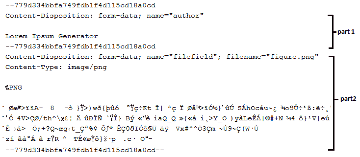

# HTTP 客户端和 WebSocket API

本章包括 20 个问题，旨在介绍 HTTP 客户机和 WebSocket API。

你还记得`HttpUrlConnection`吗？好吧，JDK 11 附带了 HTTP 客户机 API，它是对`HttpUrlConnection`的重新发明。HTTP 客户端 API 易于使用，支持 HTTP/2（默认）和 HTTP/1.1。为了向后兼容，当服务器不支持 HTTP/2 时，HTTP 客户端 API 将自动从 HTTP/2 降级到 HTTP 1.1。此外，HTTP 客户机 API 支持同步和异步编程模型，并依赖流来传输数据（反应流）。它还支持 WebSocket 协议，该协议用于实时 web 应用程序，以较低的消息开销提供客户机-服务器通信。

# 问题

使用以下问题来测试您的 HTTP 客户机和 websocketapi 编程能力。我强烈建议您在使用解决方案和下载示例程序之前，先尝试一下每个问题：

250.  **HTTP/2**：简要介绍 HTTP/2 协议
251.  **触发异步`GET`请求**：编写一个程序，使用 HTTP 客户端 API 触发异步`GET`请求，并显示响应代码和正文。
252.  **设置代理**：编写一个使用 HTTP 客户端 API 通过代理建立连接的程序。
253.  **设置/获取标头**：编写一个程序，在请求中添加额外的标头，获取响应的标头。

254.  **指定 HTTP 方法**：编写指定请求的 HTTP 方法的程序（例如`GET`、`POST`、`PUT`、`DELETE`）。
255.  **设置请求体**：编写一个程序，使用 HTTP 客户端 API 为请求添加主体。
256.  **设置连接认证**：编写一个程序，使用 HTTP 客户端 API 通过用户名和密码设置连接认证。
257.  **设置超时**：编写一个程序，使用 HTTP 客户端 API 设置我们要等待响应的时间量（超时）。
258.  **设置重定向策略**：编写一个程序，根据需要使用 HTTP 客户端 API 自动重定向。
259.  **发送同步和异步请求**：编写一个程序，在同步和异步模式下发送相同的请求。
260.  **处理 Cookie**：编写一个程序，使用 HTTP 客户端 API 设置 Cookie 处理程序。
261.  **获取响应信息**：编写一个程序，使用 HTTP 客户端 API 获取响应信息（如 URI、版本、头、状态码、主体等）。
262.  **处理响应体类型**：写几段代码举例说明如何通过`HttpResponse.BodyHandlers`处理常见的响应体类型。
263.  **获取、更新和保存 JSON**：编写一个程序，使用 HTTP 客户端 API 获取、更新和保存 JSON。
264.  **压缩**：编写处理压缩响应的程序（如`.gzip`。
265.  **处理表单数据**：编写一个使用 HTTP 客户端 API 提交数据表单的程序（`application/x-www-form-urlencoded`。
266.  **下载资源**：编写使用 HTTP 客户端 API 下载资源的程序。
267.  **分块上传**：编写一个使用 HTTP 客户端 API 上传资源的程序。
268.  **HTTP/2 服务器推送**：编写一个程序，通过 HTTP 客户端 API 演示 HTTP/2 服务器推送特性。
269.  **WebSocket**：编写一个程序，打开到 WebSocket 端点的连接，收集数据 10 秒，然后关闭连接。

# 解决

以下各节介绍上述问题的解决方案。记住，通常没有一个正确的方法来解决一个特定的问题。另外，请记住，这里显示的解释只包括解决问题所需的最有趣和最重要的细节。您可以从[下载示例解决方案以查看更多详细信息并尝试程序 https://github.com/PacktPublishing/Java-Coding-Problems](https://github.com/PacktPublishing/Java-Coding-Problems)。

# 250.HTTP/2

**HTTP/2** 是一种有效的协议，它对 **HTTP/1.1** 协议进行了显著的改进。

作为大局的一部分，**HTTP/2** 有两部分：

*   **帧层**：这是 **HTTP/2** 复用核心能力
*   **数据层**：它包含数据（我们通常称之为 HTTP）

下图描述了 **HTTP/1.1**（顶部）和 **HTTP/2**（底部）中的通信：


**HTTP/2**被服务器和浏览器广泛采用，与**HTTP/1.1**相比有如下改进：

*   **二进制协议**：**HTTP/2** 的*帧层*是一种二进制分帧协议，不易被人类读取，但更易于机器操作。
*   **复用**：请求和响应交织在一起。在同一连接上同时运行多个请求。
*   **服务器推送**：服务器可以决定向客户端发送额外的资源。
*   **到服务器的单一连接**：**HTTP/2** 对每个源（域）使用单一通信线路（TCP 连接）。
*   **标头压缩**：**HTTP/2** 依靠 HPACK 压缩来减少标头。这对冗余字节有很大影响。
*   **加密**：通过电线传输的大部分数据都是加密的。

# 251 触发异步 GET 请求

触发异步`GET`请求是一个三步工作，如下：

1.  新建`HttpClient`对象（`java.net.http.HttpClient`）：

```java
HttpClient client = HttpClient.newHttpClient();
```

2.  构建`HttpRequest`对象（`java.net.http.HttpRequest`并指定请求（默认为`GET`请求）：

```java
HttpRequest request = HttpRequest.newBuilder()
  .uri(URI.create("https://reqres.in/api/users/2"))
  .build();
```

为了设置 URI，我们可以调用`HttpRequest.newBuilder(URI)`构造器，或者在`Builder`实例上调用`uri(URI)`方法（就像我们以前做的那样）。

3.  触发请求并等待响应（`java.net.http.HttpResponse`。作为同步请求，应用程序将阻止，直到响应可用：

```java
HttpResponse<String> response 
  = client.send(request, BodyHandlers.ofString());
```

如果我们将这三个步骤分组，并添加用于在控制台上显示响应代码和主体的行，那么我们将获得以下代码：

```java
HttpClient client = HttpClient.newHttpClient();

HttpRequest request = HttpRequest.newBuilder()
  .uri(URI.create("https://reqres.in/api/users/2"))
  .build();

HttpResponse<String> response 
  = client.send(request, BodyHandlers.ofString());

System.out.println("Status code: " + response.statusCode());
System.out.println("\n Body: " + response.body());
```

上述代码的一个可能输出如下：

```java
Status code: 200
Body:
{
  "data": {
    "id": 2,
    "email": "janet.weaver@reqres.in",
    "first_name": "Janet",
    "last_name": "Weaver",
    "avatar": "https://s3.amazonaws.com/..."
 }
}
```

默认情况下，此请求使用 HTTP/2 进行。但是，我们也可以通过`HttpRequest.Builder.version()`显式设置版本。此方法获取一个参数，其类型为`HttpClient.Version`，是一个`enum`数据类型，它公开了两个常量：`HTTP_2`和`HTTP_1_1`。以下是显式降级到 HTTP/1.1 的示例：

```java
HttpRequest request = HttpRequest.newBuilder()
  .version(HttpClient.Version.HTTP_1_1)
  .uri(URI.create("https://reqres.in/api/users/2"))
  .build();
```

`HttpClient`的默认设置如下：

*   HTTP/2 协议
*   没有验证器
*   无连接超时
*   没有 cookie 处理程序
*   默认线程池执行器
*   `NEVER`的重定向策略
*   默认代理选择器
*   默认 SSL 上下文

我们将在下一节中查看查询参数生成器。

# 查询参数生成器

使用包含查询参数的 uri 意味着对这些参数进行编码。完成此任务的 Java 内置方法是`URLEncoder.encode()`。但将多个查询参数串联起来并对其进行编码会导致类似以下情况：

```java
URI uri = URI.create("http://localhost:8080/books?name=" +
  URLEncoder.encode("Games & Fun!", StandardCharsets.UTF_8) +
  "&no=" + URLEncoder.encode("124#442#000", StandardCharsets.UTF_8) +
  "&price=" + URLEncoder.encode("$23.99", StandardCharsets.UTF_8)
);
```

当我们必须处理大量的查询参数时，这种解决方案不是很方便。但是，我们可以尝试编写一个 helper 方法，将`URLEncoder.encode()`方法隐藏在查询参数集合的循环中，也可以依赖 URI 生成器。

在春季，URI 生成器是`org.springframework.web.util.UriComponentsBuilder`。以下代码是不言自明的：

```java
URI uri = UriComponentsBuilder.newInstance()
  .scheme("http")
  .host("localhost")
  .port(8080)
  .path("books")
  .queryParam("name", "Games & Fun!")
  .queryParam("no", "124#442#000")
  .queryParam("price", "$23.99")
  .build()
  .toUri();
```

在非 Spring 应用程序中，我们可以依赖 URI 生成器，比如[`urlbuilder`库](https://github.com/mikaelhg/urlbuilder)。这本书附带的代码包含了一个使用这个的例子。

# 252 设置代理

为了建立代理，我们依赖于`Builder`方法的`HttpClient.proxy()`方法。`proxy()`方法获取一个`ProxySelector`类型的参数，它可以是系统范围的代理选择器（通过`getDefault()`）或通过其地址指向的代理选择器（通过`InetSocketAddress`）。

假设我们在`proxy.host:80`地址有代理。我们可以按以下方式设置此代理：

```java
HttpClient client = HttpClient.newBuilder()
  .proxy(ProxySelector.of(new InetSocketAddress("proxy.host", 80)))
  .build();
```

或者，我们可以设置系统范围的代理选择器，如下所示：

```java
HttpClient client = HttpClient.newBuilder()
  .proxy(ProxySelector.getDefault())
  .build();
```

# 253 设置/获取标题

`HttpRequest`和`HttpResponse`公开了一套处理头文件的方法。我们将在接下来的章节中学习这些方法。

# 设置请求头

`HttpRequest.Builder`类使用三种方法来设置附加头：

*   `header​(String name, String value)`、`setHeader​(String name, String value)`：用于逐个添加表头，如下代码所示：

```java
HttpRequest request = HttpRequest.newBuilder()
  .uri(...)
  ...
  .header("key_1", "value_1")
  .header("key_2", "value_2")
  ...
  .build();

HttpRequest request = HttpRequest.newBuilder()
  .uri(...)
  ...
  .setHeader("key_1", "value_1")
  .setHeader("key_2", "value_2")
  ...
  .build();
```

`header()`和`setHeader()`的区别在于前者添加指定的头，后者设置指定的头。换句话说，`header()`将给定值添加到该名称/键的值列表中，而`setHeader()`覆盖该名称/键先前设置的任何值。

*   `headers​(String... headers)`：用于添加以逗号分隔的表头，如下代码所示：

```java
HttpRequest request = HttpRequest.newBuilder()
  .uri(...)
  ...
  .headers("key_1", "value_1", "key_2",
    "value_2", "key_3", "value_3", ...)
  ...
  .build();
```

例如，`Content-Type: application/json`和`Referer: https://reqres.in/`头可以添加到由`https://reqres.in/api/users/2`URI 触发的请求中，如下所示：

```java
HttpRequest request = HttpRequest.newBuilder()
  .header("Content-Type", "application/json")
  .header("Referer", "https://reqres.in/")
  .uri(URI.create("https://reqres.in/api/users/2"))
  .build();
```

您还可以执行以下操作：

```java
HttpRequest request = HttpRequest.newBuilder()
  .setHeader("Content-Type", "application/json")
  .setHeader("Referer", "https://reqres.in/")
  .uri(URI.create("https://reqres.in/api/users/2"))
  .build();
```

最后，你可以这样做：

```java
HttpRequest request = HttpRequest.newBuilder()
  .headers("Content-Type", "application/json",
    "Referer", "https://reqres.in/")
  .uri(URI.create("https://reqres.in/api/users/2"))
  .build();
```

根据目标的不同，可以将这三种方法结合起来以指定请求头。

# 获取请求/响应头

可以使用`HttpRequest.headers()`方法获取请求头。`HttpResponse`中也存在类似的方法来获取响应的头。两个方法都返回一个`HttpHeaders`对象。

这两种方法可以以相同的方式使用，因此让我们集中精力获取响应头。我们可以得到这样的标题：

```java
HttpResponse<...> response ...
HttpHeaders allHeaders = response.headers();
```

可以使用`HttpHeaders.allValues()`获取头的所有值，如下所示：

```java
List<String> allValuesOfCacheControl
  = response.headers().allValues("Cache-Control");
```

使用`HttpHeaders.firstValue()`只能获取头的第一个值，如下所示：

```java
Optional<String> firstValueOfCacheControl
  = response.headers().firstValue("Cache-Control");
```

如果表头返回值为`Long`，则依赖`HttpHeaders.firstValueAsLong()`。此方法获取一个表示标头名称的参数并返回`Optional<Long>`。如果指定头的值不能解析为`Long`，则抛出`NumberFormatException`。

# 254 指定 HTTP 方法

我们可以使用`HttpRequest.Builder`中的以下方法指示请求使用的 HTTP 方法：

*   `GET()`：此方法使用 HTTP`GET`方法发送请求，如下例所示：

```java
HttpRequest requestGet = HttpRequest.newBuilder()
  .GET() // can be omitted since it is default
  .uri(URI.create("https://reqres.in/api/users/2"))
  .build();
```

*   `POST()`：此方法使用 HTTP`POST`方法发送请求，如下例所示：

```java
HttpRequest requestPost = HttpRequest.newBuilder()
  .header("Content-Type", "application/json")
  .POST(HttpRequest.BodyPublishers.ofString(
    "{\"name\": \"morpheus\",\"job\": \"leader\"}"))
  .uri(URI.create("https://reqres.in/api/users"))
  .build();
```

*   `PUT()`：此方法使用 HTTP`PUT`方法发送请求，如下例所示：

```java
HttpRequest requestPut = HttpRequest.newBuilder()
  .header("Content-Type", "application/json")
  .PUT(HttpRequest.BodyPublishers.ofString(
    "{\"name\": \"morpheus\",\"job\": \"zion resident\"}"))
  .uri(URI.create("https://reqres.in/api/users/2"))
  .build();
```

*   `DELETE()`：此方法使用 HTTP`DELETE`方法发送请求，如下例所示：

```java
HttpRequest requestDelete = HttpRequest.newBuilder()
  .DELETE()
  .uri(URI.create("https://reqres.in/api/users/2"))
  .build();
```

客户端可以处理所有类型的 HTTP 方法，不仅仅是预定义的方法（`GET`、`POST`、`PUT`、`DELETE`）。要使用不同的 HTTP 方法创建请求，只需调用`method()`。

以下解决方案触发 HTTP`PATCH`请求：

```java
HttpRequest requestPatch = HttpRequest.newBuilder()
  .header("Content-Type", "application/json")
  .method("PATCH", HttpRequest.BodyPublishers.ofString(
    "{\"name\": \"morpheus\",\"job\": \"zion resident\"}"))
  .uri(URI.create("https://reqres.in/api/users/1"))
  .build();
```

当不需要请求体时，我们可以依赖于`BodyPublishers.noBody()`。以下解决方案使用`noBody()`方法触发 HTTP`HEAD`请求：

```java
HttpRequest requestHead = HttpRequest.newBuilder()
  .method("HEAD", HttpRequest.BodyPublishers.noBody())
  .uri(URI.create("https://reqres.in/api/users/1"))
  .build();
```

如果有多个类似的请求，我们可以依赖`copy()`方法来复制生成器，如下代码片段所示：

```java
HttpRequest.Builder builder = HttpRequest.newBuilder()
  .uri(URI.create("..."));

HttpRequest request1 = builder.copy().setHeader("...", "...").build();
HttpRequest request2 = builder.copy().setHeader("...", "...").build();
```

# 255 设置请求体

请求体的设置可以通过`HttpRequest.Builder.POST()`和`HttpRequest.Builder.PUT()`来完成，也可以通过`method()`来完成（例如`method("PATCH", HttpRequest.BodyPublisher)`。`POST()`和`PUT()`采用`HttpRequest.BodyPublisher`类型的参数。API 在`HttpRequest.BodyPublishers`类中附带了此接口（`BodyPublisher`的几个实现，如下所示：

*   `BodyPublishers.ofString()`
*   `BodyPublishers.ofFile()`
*   `BodyPublishers.ofByteArray()`
*   `BodyPublishers.ofInputStream()`

我们将在下面几节中查看这些实现。

# 从字符串创建实体

使用`BodyPublishers.ofString()`可以从字符串创建主体，如下代码片段所示：

```java
HttpRequest requestBody = HttpRequest.newBuilder()
  .header("Content-Type", "application/json")
  .POST(HttpRequest.BodyPublishers.ofString(
    "{\"name\": \"morpheus\",\"job\": \"leader\"}"))
  .uri(URI.create("https://reqres.in/api/users"))
  .build();
```

要指定`charset`调用，请使用`ofString(String s, Charset charset)`。

# 从 InputStream 创建主体

从`InputStream`创建主体可以使用`BodyPublishers.ofInputStream()`来完成，如下面的代码片段所示（这里，我们依赖于`ByteArrayInputStream`，当然，任何其他`InputStream`都是合适的）：

```java
HttpRequest requestBodyOfInputStream = HttpRequest.newBuilder()
  .header("Content-Type", "application/json")
  .POST(HttpRequest.BodyPublishers.ofInputStream(()
    -> inputStream("user.json")))
  .uri(URI.create("https://reqres.in/api/users"))
  .build();

private static ByteArrayInputStream inputStream(String fileName) {

  try (ByteArrayInputStream inputStream = new ByteArrayInputStream(
    Files.readAllBytes(Path.of(fileName)))) {

    return inputStream;
  } catch (IOException ex) {
    throw new RuntimeException("File could not be read", ex);
  }
}
```

为了利用延迟创建，`InputStream`必须作为`Supplier`传递。

# 从字节数组创建实体

从字节数组创建主体可以使用`BodyPublishers.ofByteArray()`完成，如下代码片段所示：

```java
HttpRequest requestBodyOfByteArray = HttpRequest.newBuilder()
  .header("Content-Type", "application/json")
  .POST(HttpRequest.BodyPublishers.ofByteArray(
    Files.readAllBytes(Path.of("user.json"))))
  .uri(URI.create("https://reqres.in/api/users"))
  .build();
```

我们也可以使用`ofByteArray(byte[] buf, int offset, int length)`发送字节数组的一部分。此外，我们还可以使用`ofByteArrays(Iterable<byte[]> iter)`提供字节数组的`Iterable`数据。

# 从文件创建实体

从文件创建主体可以使用`BodyPublishers.ofFile()`完成，如下代码片段所示：

```java
HttpRequest requestBodyOfFile = HttpRequest.newBuilder()
  .header("Content-Type", "application/json")
  .POST(HttpRequest.BodyPublishers.ofFile(Path.of("user.json")))
  .uri(URI.create("https://reqres.in/api/users"))
  .build();
```

# 256 设置连接认证

通常，对服务器的认证是使用用户名和密码完成的。在代码形式下，可以使用`Authenticator`类（此协商 HTTP 认证凭证）和`PasswordAuthentication`类（用户名和密码的持有者）一起完成，如下：

```java
HttpClient client = HttpClient.newBuilder()
  .authenticator(new Authenticator() {

    @Override
    protected PasswordAuthentication getPasswordAuthentication() {

      return new PasswordAuthentication(
        "username",
        "password".toCharArray());
    }
  })
  .build();
```

此外，客户端可用于发送请求：

```java
HttpRequest request = HttpRequest.newBuilder()
  ...
  .build();

HttpResponse<String> response
  = client.send(request, HttpResponse.BodyHandlers.ofString());
```

`Authenticator`支持不同的认证方案（例如，“基本”或“摘要”认证）。

另一种解决方案是在标头中添加凭据，如下所示：

```java
HttpClient client = HttpClient.newHttpClient();

HttpRequest request = HttpRequest.newBuilder()
  .header("Authorization", basicAuth("username", "password"))
  ...
  .build();

HttpResponse<String> response 
  = client.send(request, HttpResponse.BodyHandlers.ofString());

private static String basicAuth(String username, String password) {
  return "Basic " + Base64.getEncoder().encodeToString(
    (username + ":" + password).getBytes());
}
```

在`Bearer`认证（HTTP 承载令牌）的情况下，我们执行以下操作：

```java
HttpRequest request = HttpRequest.newBuilder()
  .header("Authorization", 
          "Bearer mT8JNMyWCG0D7waCHkyxo0Hm80YBqelv5SBL")
  .uri(URI.create("https://gorest.co.in/public-api/users"))
  .build();
```

我们也可以在`POST`请求的正文中这样做：

```java
HttpClient client = HttpClient.newHttpClient();

HttpRequest request = HttpRequest.newBuilder()
  .header("Content-Type", "application/json")
  .POST(BodyPublishers.ofString("{\"email\":\"eve.holt@reqres.in\",
    \"password\":\"cityslicka\"}"))
  .uri(URI.create("https://reqres.in/api/login"))
  .build();

HttpResponse<String> response 
  = client.send(request, HttpResponse.BodyHandlers.ofString());
```

不同的请求可以使用不同的凭据。此外，`Authenticator`提供了一套方法（例如，`getRequestingSite()`），如果我们希望找出应该提供什么值，这些方法非常有用。在生产环境中，应用程序不应该像在这些示例中那样以明文形式提供凭据。

# 257 设置超时

默认情况下，请求没有超时（无限超时）。要设置等待响应的时间量（超时），可以调用`HttpRequest.Builder.timeout()`方法。此方法获取一个`Duration`类型的参数，可以这样使用：

```java
HttpRequest request = HttpRequest.newBuilder()
  .uri(URI.create("https://reqres.in/api/users/2"))
  .timeout(Duration.of(5, ChronoUnit.MILLIS))
  .build();
```

如果指定的超时已过，则抛出`java.net.http.HttpConnectTimeoutException`。

# 258 设置重定向策略

当我们尝试访问移动到其他 URI 的资源时，服务器将返回一个范围为`3xx`的 HTTP 状态码，以及有关新 URI 的信息。当浏览器收到重定向响应（`301`、`302`、`303`、`307`和`308`时，它们能够自动向新位置发送另一个请求。

如果我们通过`followRedirects()`显式设置重定向策略，HTTP 客户端 API 可以自动重定向到这个新 URI，如下所示：

```java
HttpClient client = HttpClient.newBuilder()
  .followRedirects(HttpClient.Redirect.ALWAYS)
  .build();
```

为了不重定向，只需将`HttpClient.Redirect.NEVER`常量赋给`followRedirects()`（这是默认值）。

要始终重定向，除了从 HTTPS URL 到 HTTP URL，只需将`HttpClient.Redirect.NORMAL`常量指定给`followRedirects()`。

当重定向策略未设置为`ALWAYS`时，应用程序负责处理重定向。通常，这是通过从 HTTP`Location`头读取新地址来完成的，如下所示（如果返回的状态码是`301`（永久移动）或`308`（永久重定向），则以下代码只对重定向感兴趣）：

```java
int sc = response.statusCode();

if (sc == 301 || sc == 308) { // use an enum for HTTP response codes
  String newLocation = response.headers()
    .firstValue("Location").orElse("");

  // handle the redirection to newLocation
}
```

通过比较请求 URI 和响应 URI，可以很容易地检测到重定向。如果它们不相同，则会发生重定向：

```java
if (!request.uri().equals(response.uri())) {
  System.out.println("The request was redirected to: " 
    + response.uri());
}
```

# 259 发送同步和异步请求

通过`HttpClient`中的两种方式，可以完成向服务器发送请求：

*   `send()`：此方法同步发送请求（这将阻塞，直到响应可用或发生超时）
*   `sendAsync()`：此方法异步发送请求（非阻塞）

我们将在下一节解释发送请求的不同方式。

# 同步发送请求

我们已经在前面的问题中完成了这一点，因此我们将为您提供一个简短的剩余部分，如下所示：

```java
HttpClient client = HttpClient.newHttpClient();

HttpRequest request = HttpRequest.newBuilder()
  .uri(URI.create("https://reqres.in/api/users/2"))
  .build();

HttpResponse<String> response 
  = client.send(request, HttpResponse.BodyHandlers.ofString());
```

# 异步发送请求

为了异步发送请求，HTTP 客户端 API 依赖于`CompletableFeature`，如第 11 章、“并发-深入了解”和`sendAsync()`方法所述，如下所示：

```java
HttpClient client = HttpClient.newHttpClient();

HttpRequest request = HttpRequest.newBuilder()
  .uri(URI.create("https://reqres.in/api/users/2"))
  .build();

client.sendAsync(request, HttpResponse.BodyHandlers.ofString())
  .thenApply(HttpResponse::body)
  .exceptionally(e -> "Exception: " + e)
  .thenAccept(System.out::println)
  .get(30, TimeUnit.SECONDS); // or join()
```

或者，假设在等待响应的同时，我们还希望执行其他任务：

```java
HttpClient client = HttpClient.newHttpClient();

HttpRequest request = HttpRequest.newBuilder()
  .uri(URI.create("https://reqres.in/api/users/2"))
  .build();

CompletableFuture<String> response
    = client.sendAsync(request, HttpResponse.BodyHandlers.ofString())
  .thenApply(HttpResponse::body)
  .exceptionally(e -> "Exception: " + e);

while (!response.isDone()) {
  Thread.sleep(50);
  System.out.println("Perform other tasks 
    while waiting for the response ...");
}

String body = response.get(30, TimeUnit.SECONDS); // or join()
System.out.println("Body: " + body);
```

# 同时发送多个请求

如何同时发送多个请求并等待所有响应可用？

据我们所知，`CompletableFuture`附带了`allOf()`方法（详见第 11 章、“并发-深入了解”），可以并行执行任务，等待所有任务完成，返回`CompletableFuture<Void>`。

以下代码等待对四个请求的响应：

```java
List<URI> uris = Arrays.asList(
  new URI("https://reqres.in/api/users/2"),      // one user
  new URI("https://reqres.in/api/users?page=2"), // list of users
  new URI("https://reqres.in/api/unknown/2"),    // list of resources
  new URI("https://reqres.in/api/users/23"));    // user not found

HttpClient client = HttpClient.newHttpClient();

List<HttpRequest> requests = uris.stream()
  .map(HttpRequest::newBuilder)
  .map(reqBuilder -> reqBuilder.build())
  .collect(Collectors.toList());

CompletableFuture.allOf(requests.stream()
  .map(req -> client.sendAsync(
     req, HttpResponse.BodyHandlers.ofString())
  .thenApply((res) -> res.uri() + " | " + res.body() + "\n")
  .exceptionally(e -> "Exception: " + e)
  .thenAccept(System.out::println))
  .toArray(CompletableFuture<?>[]::new))
  .join();
```

要收集响应的主体（例如，在`List<String>`中），请考虑`WaitAllResponsesFetchBodiesInList`类，该类在本书附带的代码中提供。

使用定制的`Executor`对象可以如下完成：

```java
ExecutorService executor = Executors.newFixedThreadPool(5);

HttpClient client = HttpClient.newBuilder()
  .executor(executor)
  .build();
```

# 260 处理 Cookie

默认情况下，JDK11 的 HTTP 客户机支持 Cookie，但也有一些实例禁用了内置支持。我们可以按以下方式启用它：

```java
HttpClient client = HttpClient.newBuilder()
  .cookieHandler(new CookieManager())
  .build();
```

因此，HTTP 客户端 API 允许我们使用`HttpClient.Builder.cookieHandler()`方法设置 cookie 处理程序。此方法获取一个`CookieManager`类型的参数。

以下解决方案设置不接受 cookies 的`CookieManager`：

```java
HttpClient client = HttpClient.newBuilder()
  .cookieHandler(new CookieManager(null, CookiePolicy.ACCEPT_NONE))
  .build();
```

要接受 cookies，请将`CookiePolicy`设置为`ALL`（接受所有 cookies）或`ACCEPT_ORIGINAL_SERVER`（只接受来自原始服务器的 cookies）。

以下解决方案接受所有 cookie 并在控制台中显示它们（如果有任何凭据被报告为无效，则考虑从[获取新令牌）https://gorest.co.in/rest-console.html](https://gorest.co.in/rest-console.html)：

```java
CookieManager cm = new CookieManager();
cm.setCookiePolicy(CookiePolicy.ACCEPT_ALL);

HttpClient client = HttpClient.newBuilder()
  .cookieHandler(cm)
  .build();

HttpRequest request = HttpRequest.newBuilder()
  .header("Authorization", 
          "Bearer mT8JNMyWCG0D7waCHkyxo0Hm80YBqelv5SBL")
  .uri(URI.create("https://gorest.co.in/public-api/users/1"))
  .build();

HttpResponse<String> response
  = client.send(request, HttpResponse.BodyHandlers.ofString());

System.out.println("Status code: " + response.statusCode());
System.out.println("\n Body: " + response.body());

CookieStore cookieStore = cm.getCookieStore();
System.out.println("\nCookies: " + cookieStore.getCookies());
```

检查`set-cookie`收割台可按以下步骤进行：

```java
Optional<String> setcookie 
  = response.headers().firstValue("set-cookie");
```

# 261 获取响应信息

为了获得关于响应的信息，我们可以依赖于`HttpResponse`类中的方法。这些方法的名称非常直观；因此，下面的代码片段是不言自明的：

```java
...
HttpResponse<String> response
  = client.send(request, HttpResponse.BodyHandlers.ofString());

System.out.println("Version: " + response.version());
System.out.println("\nURI: " + response.uri());
System.out.println("\nStatus code: " + response.statusCode());
System.out.println("\nHeaders: " + response.headers());
System.out.println("\n Body: " + response.body());
```

考虑浏览文档以找到更有用的方法。

# 262 处理响应体类型

处理响应体类型可以使用`HttpResponse.BodyHandler`完成。API 在`HttpResponse.BodyHandlers`类中附带了此接口（`BodyHandler`的几个实现，如下所示：

*   `BodyHandlers.ofByteArray()`
*   `BodyHandlers.ofFile()`
*   `BodyHandlers.ofString()`
*   `BodyHandlers.ofInputStream()`
*   `BodyHandlers.ofLines()`

考虑到以下请求，让我们看看处理响应体的几种解决方案：

```java
HttpClient client = HttpClient.newHttpClient();

HttpRequest request = HttpRequest.newBuilder()
  .uri(URI.create("https://reqres.in/api/users/2"))
  .build();
```

下面的部分将介绍如何处理不同类型的响应体

# 将响应体作为字符串处理

将主体响应作为字符串处理可以使用`BodyHandlers.ofString()`完成，如下面的代码片段所示：

```java
HttpResponse<String> responseOfString
  = client.send(request, HttpResponse.BodyHandlers.ofString());

System.out.println("Status code: " + responseOfString.statusCode());
System.out.println("Body: " + responseOfString.body());
```

要指定一个`charset`，请调用`ofString(String s, Charset charset)`。

# 将响应体作为文件处理

将主体响应作为文件处理可以使用`BodyHandlers.ofFile()`完成，如下面的代码片段所示：

```java
HttpResponse<Path> responseOfFile = client.send(
  request, HttpResponse.BodyHandlers.ofFile(
    Path.of("response.json")));

System.out.println("Status code: " + responseOfFile.statusCode());
System.out.println("Body: " + responseOfFile.body());
```

如需指定开放式选项，请呼叫`ofFile(Path file, OpenOption... openOptions)`。

# 将响应体作为字节数组处理

将主体响应作为字节数组处理可以使用`BodyHandlers.ofByteArray()`完成，如下代码片段所示：

```java
HttpResponse<byte[]> responseOfByteArray = client.send(
  request, HttpResponse.BodyHandlers.ofByteArray());

System.out.println("Status code: " 
  + responseOfByteArray.statusCode());
System.out.println("Body: "
  + new String(responseOfByteArray.body()));
```

要使用字节数组，请调用`ofByteArrayConsumer(Consumer<Optional<byte[]>> consumer)`。

# 将响应体作为输入流处理

可以使用`BodyHandlers.ofInputStream()`来处理作为`InputStream`的主体响应，如下面的代码片段所示：

```java
HttpResponse<InputStream> responseOfInputStream = client.send(
  request, HttpResponse.BodyHandlers.ofInputStream());

System.out.println("\nHttpResponse.BodyHandlers.ofInputStream():");
System.out.println("Status code: " 
  + responseOfInputStream.statusCode());

byte[] allBytes;
try (InputStream fromIs = responseOfInputStream.body()) {
  allBytes = fromIs.readAllBytes();
}

System.out.println("Body: "
  + new String(allBytes, StandardCharsets.UTF_8));
```

# 将响应体作为字符串流处理

将主体响应作为字符串流处理可以使用`BodyHandlers.ofLines()`完成，如下面的代码片段所示：

```java
HttpResponse<Stream<String>> responseOfLines = client.send(
  request, HttpResponse.BodyHandlers.ofLines());

System.out.println("Status code: " + responseOfLines.statusCode());
System.out.println("Body: " 
  + responseOfLines.body().collect(toList()));
```

# 263 获取、更新和保存 JSON

在前面的问题中，我们将 JSON 数据作为纯文本（字符串）处理。HTTP 客户机 API 不提供对 JSON 数据的特殊或专用支持，而是将此类数据视为任何其他字符串。

然而，我们习惯于将 JSON 数据表示为 Java 对象（pojo），并在需要时依赖于 JSON 和 Java 之间的转换。我们可以为我们的问题编写一个解决方案，而不涉及 HTTP 客户机 API。但是，我们也可以使用`HttpResponse.BodyHandler`的自定义实现编写一个解决方案，该实现依赖于 JSON 解析器将响应转换为 Java 对象。例如，我们可以依赖 JSON-B（在第 6 章中介绍，“Java I/O 路径、文件、缓冲区、扫描和格式化”中）。

实现`HttpResponse.BodyHandler`接口意味着重写`apply(HttpResponse.ResponseInfo responseInfo)`方法。使用这种方法，我们可以从响应中获取字节，并将它们转换为 Java 对象。代码如下：

```java
public class JsonBodyHandler<T> 
    implements HttpResponse.BodyHandler<T> {

  private final Jsonb jsonb;
  private final Class<T> type;

  private JsonBodyHandler(Jsonb jsonb, Class<T> type) {
    this.jsonb = jsonb;
    this.type = type;
  }

  public static <T> JsonBodyHandler<T> 
      jsonBodyHandler(Class<T> type) {
    return jsonBodyHandler(JsonbBuilder.create(), type);
  }

  public static <T> JsonBodyHandler<T> jsonBodyHandler(
      Jsonb jsonb, Class<T> type) {
    return new JsonBodyHandler<>(jsonb, type);
  }

  @Override
  public HttpResponse.BodySubscriber<T> apply(
    HttpResponse.ResponseInfo responseInfo) {

    return BodySubscribers.mapping(BodySubscribers.ofByteArray(),
      byteArray -> this.jsonb.fromJson(
        new ByteArrayInputStream(byteArray), this.type));
  }
}
```

假设我们要处理的 JSON 如下所示（这是来自服务器的响应）：

```java
{
  "data": {
    "id": 2,
    "email": "janet.weaver@reqres.in",
    "first_name": "Janet",
    "last_name": "Weaver",
    "avatar": "https://s3.amazonaws.com/..."
  }
}
```

表示此 JSON 的 Java 对象如下：

```java
public class User {

  private Data data;
  private String updatedAt;

  // getters, setters and toString()
}

public class Data {

  private Integer id;
  private String email;

  @JsonbProperty("first_name")
  private String firstName;

  @JsonbProperty("last_name")
  private String lastName;

  private String avatar;

  // getters, setters and toString()
}
```

现在，让我们看看如何在请求和响应中操作 JSON。

# 对用户的 JSON 响应

以下解决方案触发`GET`请求，并将返回的 JSON 响应转换为`User`：

```java
Jsonb jsonb = JsonbBuilder.create();
HttpClient client = HttpClient.newHttpClient();

HttpRequest requestGet = HttpRequest.newBuilder()
  .uri(URI.create("https://reqres.in/api/users/2"))
  .build();

HttpResponse<User> responseGet = client.send(
  requestGet, JsonBodyHandler.jsonBodyHandler(jsonb, User.class));

User user = responseGet.body();
```

# 已将用户更新为 JSON 请求

以下解决方案更新我们在上一小节中获取的用户的电子邮件地址：

```java
user.getData().setEmail("newemail@gmail.com");

HttpRequest requestPut = HttpRequest.newBuilder()
  .header("Content-Type", "application/json")
  .uri(URI.create("https://reqres.in/api/users"))
  .PUT(HttpRequest.BodyPublishers.ofString(jsonb.toJson(user)))
  .build();

HttpResponse<User> responsePut = client.send(
  requestPut, JsonBodyHandler.jsonBodyHandler(jsonb, User.class));

User updatedUser = responsePut.body();
```

# 新用户到 JSON 请求

以下解决方案创建一个新用户（响应状态码应为`201`）：

```java
Data data = new Data();
data.setId(10);
data.setFirstName("John");
data.setLastName("Year");
data.setAvatar("https://johnyear.com/jy.png");

User newUser = new User();
newUser.setData(data);

HttpRequest requestPost = HttpRequest.newBuilder()
  .header("Content-Type", "application/json")
  .uri(URI.create("https://reqres.in/api/users"))
  .POST(HttpRequest.BodyPublishers.ofString(jsonb.toJson(user)))
  .build();

HttpResponse<Void> responsePost = client.send(
  requestPost, HttpResponse.BodyHandlers.discarding());

int sc = responsePost.statusCode(); // 201
```

注意，我们忽略了通过`HttpResponse.BodyHandlers.discarding()`的任何响应体。

# 264 压缩

在服务器上启用`.gzip`压缩是一种常见的做法，这意味着可以显著提高站点的加载时间。但是 JDK11 的 HTTP 客户端 API 没有利用`.gzip`压缩。换句话说，HTTP 客户机 API 不需要压缩响应，也不知道如何处理这些响应。

为了请求压缩响应，我们必须发送带有`.gzip`值的`Accept-Encoding`头。此标头不是由 HTTP 客户端 API 添加的，因此我们将按如下方式添加它：

```java
HttpClient client = HttpClient.newHttpClient();

HttpRequest request = HttpRequest.newBuilder()
  .header("Accept-Encoding", "gzip")
  .uri(URI.create("https://davidwalsh.name"))
  .build();
```

这只是工作的一半。到目前为止，如果在服务器上启用了`gzip`编码，那么我们将收到一个压缩响应。为了检测响应是否被压缩，我们必须检查`Encoding`头，如下所示：

```java
HttpResponse<InputStream> response = client.send(
  request, HttpResponse.BodyHandlers.ofInputStream());

String encoding = response.headers()
  .firstValue("Content-Encoding").orElse("");

if ("gzip".equals(encoding)) {
  String gzipAsString = gZipToString(response.body());
  System.out.println(gzipAsString);
} else {
  String isAsString = isToString(response.body());
  System.out.println(isAsString);
}
```

`gZipToString()`方法是一种辅助方法，它接受`InputStream`并将其视为`GZIPInputStream`。换句话说，此方法从给定的输入流中读取字节并使用它们创建字符串：

```java
public static String gzipToString(InputStream gzip) 
    throws IOException {

  byte[] allBytes;
  try (InputStream fromIs = new GZIPInputStream(gzip)) {
    allBytes = fromIs.readAllBytes();
  }

  return new String(allBytes, StandardCharsets.UTF_8);
}
```

如果响应没有被压缩，那么`isToString()`就是我们需要的 helper 方法：

```java
public static String isToString(InputStream is) throws IOException {

  byte[] allBytes;
  try (InputStream fromIs = is) {
    allBytes = fromIs.readAllBytes();
  }

  return new String(allBytes, StandardCharsets.UTF_8);
}
```

# 265 处理表单数据

JDK11 的 HTTP 客户机 API 没有内置支持用`x-www-form-urlencoded`触发`POST`请求。这个问题的解决方案是依赖于一个定制的`BodyPublisher`类。

如果我们考虑以下几点，那么编写一个定制的`BodyPublisher`类非常简单：

*   数据表示为键值对
*   每对为`key = value`型
*   成对通过`&`字符分开
*   键和值应正确编码

由于数据是用键值对表示的，所以存储在`Map`中非常方便。此外，我们只是循环这个`Map`并应用前面的信息，如下所示：

```java
public class FormBodyPublisher {

  public static HttpRequest.BodyPublisher ofForm(
      Map<Object, Object> data) {

    StringBuilder body = new StringBuilder();

    for (Object dataKey: data.keySet()) {
      if (body.length() > 0) {
        body.append("&");
      }

      body.append(encode(dataKey))
        .append("=")
        .append(encode(data.get(dataKey)));
    }

    return HttpRequest.BodyPublishers.ofString(body.toString());
  }

  private static String encode(Object obj) {
    return URLEncoder.encode(obj.toString(), StandardCharsets.UTF_8);
  }
}
```

依赖此解决方案，可以触发如下的`POST`（`x-www-form-urlencoded`）请求：

```java
Map<Object, Object> data = new HashMap<>();
data.put("firstname", "John");
data.put("lastname", "Year");
data.put("age", 54);
data.put("avatar", "https://avatars.com/johnyear");

HttpClient client = HttpClient.newHttpClient();

HttpRequest request = HttpRequest.newBuilder()
  .header("Content-Type", "application/x-www-form-urlencoded")
  .uri(URI.create("http://jkorpela.fi/cgi-bin/echo.cgi"))
  .POST(FormBodyPublisher.ofForm(data))
  .build();

HttpResponse<String> response = client.send(
  request, HttpResponse.BodyHandlers.ofString());
```

在这种情况下，响应只是发送数据的回音。根据服务器的响应，应用程序需要处理它，如“处理响应体类型”部分所示。

# 266 下载资源

正如我们在“设置请求体”和“处理响应体类型”部分中看到的，HTTP 客户端 API 可以发送和接收文本和二进制数据（例如，图像、视频等）。

下载文件依赖于以下两个坐标：

*   发送`GET`请求
*   处理接收到的字节（例如，通过`BodyHandlers.ofFile()`）

以下代码从项目类路径中的 Maven 存储库下载`hibernate-core-5.4.2.Final.jar`：

```java
HttpClient client = HttpClient.newHttpClient();

HttpRequest request = HttpRequest.newBuilder()
  .uri(URI.create("http://.../hibernate-core-5.4.2.Final.jar"))
  .build();

HttpResponse<Path> response 
  = client.send(request, HttpResponse.BodyHandlers.ofFile(
    Path.of("hibernate-core-5.4.2.Final.jar")));
```

如果要下载的资源是通过`Content-Disposition`HTTP 头传递的，属于`Content-Disposition attachment; filename="..."`类型，那么我们可以依赖`BodyHandlers.ofFileDownload()`，如下例：

```java
import static java.nio.file.StandardOpenOption.CREATE;
...
HttpClient client = HttpClient.newHttpClient();

HttpRequest request = HttpRequest.newBuilder()
  .uri(URI.create("http://...downloadfile.php
    ?file=Hello.txt&cd=attachment+filename"))
  .build();

HttpResponse<Path> response = client.send(request,
  HttpResponse.BodyHandlers.ofFileDownload(Path.of(
    System.getProperty("user.dir")), CREATE));
```

[更多可以测试的文件可以在这里找到](http://demo.borland.com/testsite/download_testpage.php)。

# 267 使用多部分上载

正如我们在“设置请求体”部分所看到的，我们可以通过`BodyPublishers.ofFile()`和`POST`请求向服务器发送一个文件（文本或二进制文件）。

但是发送一个经典的上传请求可能涉及多部分形式`POST`，其中`Content-Type`为`multipart/form-data`。

在这种情况下，请求体由边界分隔的部分组成，如下图所示（`--779d334bbfa...`是边界）：



然而，JDK11 的 HTTP 客户端 API 并没有为构建这种请求体提供内置支持。尽管如此，按照前面的屏幕截图，我们可以定义一个定制的`BodyPublisher`，如下所示：

```java
public class MultipartBodyPublisher {

  private static final String LINE_SEPARATOR = System.lineSeparator();

  public static HttpRequest.BodyPublisher ofMultipart(
    Map<Object, Object> data, String boundary) throws IOException {

    final byte[] separator = ("--" + boundary +
      LINE_SEPARATOR + "Content-Disposition: form-data;
      name = ").getBytes(StandardCharsets.UTF_8);

      final List<byte[] > body = new ArrayList<>();

      for (Object dataKey: data.keySet()) {

        body.add(separator);
        Object dataValue = data.get(dataKey);

        if (dataValue instanceof Path) {
          Path path = (Path) dataValue;
          String mimeType = fetchMimeType(path);

          body.add(("\"" + dataKey + "\"; filename=\"" +
            path.getFileName() + "\"" + LINE_SEPARATOR +
            "Content-Type: " + mimeType + LINE_SEPARATOR +
            LINE_SEPARATOR).getBytes(StandardCharsets.UTF_8));

          body.add(Files.readAllBytes(path));
          body.add(LINE_SEPARATOR.getBytes(StandardCharsets.UTF_8));
        } else {
          body.add(("\"" + dataKey + "\"" + LINE_SEPARATOR +
              LINE_SEPARATOR + dataValue + LINE_SEPARATOR)
                .getBytes(StandardCharsets.UTF_8));
        }
      }

      body.add(("--" + boundary 
        + "--").getBytes(StandardCharsets.UTF_8));

      return HttpRequest.BodyPublishers.ofByteArrays(body);
    }

    private static String fetchMimeType(
      Path filenamePath) throws IOException {

      String mimeType = Files.probeContentType(filenamePath);

      if (mimeType == null) {
        throw new IOException("Mime type could not be fetched");
      }

      return mimeType;
    }
  }
```

现在，我们可以创建一个 multipart 请求，如下所示（我们尝试将一个名为`LoremIpsum.txt`的文本文件上传到一个只发送原始表单数据的服务器）：

```java
Map<Object, Object> data = new LinkedHashMap<>();
data.put("author", "Lorem Ipsum Generator");
data.put("filefield", Path.of("LoremIpsum.txt"));

String boundary = UUID.randomUUID().toString().replaceAll("-", "");

HttpClient client = HttpClient.newHttpClient();

HttpRequest request = HttpRequest.newBuilder()
  .header("Content-Type", "multipart/form-data;boundary=" + boundary)
  .POST(MultipartBodyPublisher.ofMultipart(data, boundary))
  .uri(URI.create("http://jkorpela.fi/cgi-bin/echoraw.cgi"))
  .build();

HttpResponse<String> response = client.send(
  request, HttpResponse.BodyHandlers.ofString());
```

响应应类似于以下（边界只是一个随机的`UUID`：

```java
--7ea7a8311ada4804ab11d29bcdedcc55
Content-Disposition: form-data; name="author"
Lorem Ipsum Generator
--7ea7a8311ada4804ab11d29bcdedcc55
Content-Disposition: form-data; name="filefield"; filename="LoremIpsum.txt"
Content-Type: text/plain
Lorem ipsum dolor sit amet, consectetur adipiscing elit, sed do 
eiusmod tempor incididunt ut labore et dolore magna aliqua.
--7ea7a8311ada4804ab11d29bcdedcc55--
```

# 268HTTP/2 服务器推送

除了*复用*之外，HTTP/2 的另一个强大特性是它的*服务器推送*功能。

主要地，在传统方法（HTTP/1.1）中，浏览器触发获取 HTML 页面的请求，并解析接收到的标记以识别引用的资源（例如 JS、CSS、图像等）。为了获取这些资源，浏览器发送额外的请求（每个引用的资源一个请求）。另一方面，HTTP/2 发送 HTML 页面和引用的资源，而不需要来自浏览器的显式请求。因此，浏览器请求 HTML 页面并接收该页面以及显示该页面所需的所有其他内容。

HTTP 客户端 API 通过`PushPromiseHandler`接口支持此 HTTP/2 特性。此接口的实现必须作为`send()`或`sendAsync()`方法的第三个参数给出。

`PushPromiseHandler`依赖于三个坐标，如下所示：

*   发起客户端发送请求（`initiatingRequest`）
*   合成推送请求（`pushPromiseRequest`）
*   接受函数，必须成功调用它才能接受推送承诺（接受方）

通过调用给定的接受者函数来接受推送承诺。接受函数必须传递一个非空的`BodyHandler`，用于处理承诺的响应体。acceptor 函数将返回一个完成承诺响应的`CompletableFuture`实例。

基于这些信息，我们来看一下`PushPromiseHandler`的实现：

```java
private static final List<CompletableFuture<Void>>
  asyncPushRequests = new CopyOnWriteArrayList<>();
...
private static HttpResponse.PushPromiseHandler<String>
  pushPromiseHandler() {

    return (HttpRequest initiatingRequest, 
      HttpRequest pushPromiseRequest,
      Function<HttpResponse.BodyHandler<String> ,
      CompletableFuture<HttpResponse<String>>> acceptor) -> {
      CompletableFuture<Void> pushcf =
      acceptor.apply(HttpResponse.BodyHandlers.ofString())
      .thenApply(HttpResponse::body)
      .thenAccept((b) -> System.out.println(
        "\nPushed resource body:\n " + b));

      asyncPushRequests.add(pushcf);

      System.out.println("\nJust got promise push number: " +
        asyncPushRequests.size());
      System.out.println("\nInitial push request: " +
        initiatingRequest.uri());
      System.out.println("Initial push headers: " +
        initiatingRequest.headers());
      System.out.println("Promise push request: " +
        pushPromiseRequest.uri());
      System.out.println("Promise push headers: " +
        pushPromiseRequest.headers());
    };
  }
```

现在，让我们触发一个请求并将这个`PushPromiseHandler`传递给`sendAsync()`：

```java
HttpClient client = HttpClient.newHttpClient();

HttpRequest request = HttpRequest.newBuilder()
  .uri(URI.create("https://http2.golang.org/serverpush"))
  .build();

client.sendAsync(request,
    HttpResponse.BodyHandlers.ofString(), pushPromiseHandler())
  .thenApply(HttpResponse::body)
  .thenAccept((b) -> System.out.println("\nMain resource:\n" + b))
  .join();

asyncPushRequests.forEach(CompletableFuture::join);

System.out.println("\nFetched a total of " +
  asyncPushRequests.size() + " push requests");
```

如果我们想返回一个 push-promise 处理程序，该处理程序将 push-promise 及其响应累积到给定的映射中，那么我们可以使用`PushPromiseHandler.of()`方法，如下所示：

```java
private static final ConcurrentMap<HttpRequest,
  CompletableFuture<HttpResponse<String>>> promisesMap 
    = new ConcurrentHashMap<>();

private static final Function<HttpRequest,
  HttpResponse.BodyHandler<String>> promiseHandler 
    = (HttpRequest req) -> HttpResponse.BodyHandlers.ofString();

public static void main(String[] args)
    throws IOException, InterruptedException {

  HttpClient client = HttpClient.newHttpClient();

  HttpRequest request = HttpRequest.newBuilder()
    .uri(URI.create("https://http2.golang.org/serverpush"))
    .build();

  client.sendAsync(request,
      HttpResponse.BodyHandlers.ofString(), pushPromiseHandler())
    .thenApply(HttpResponse::body)
    .thenAccept((b) -> System.out.println("\nMain resource:\n" + b))
    .join();

  System.out.println("\nPush promises map size: " +
    promisesMap.size() + "\n");

  promisesMap.entrySet().forEach((entry) -> {
    System.out.println("Request = " + entry.getKey() +
      ", \nResponse = " + entry.getValue().join().body());
  });
}

private static HttpResponse.PushPromiseHandler<String>
  pushPromiseHandler() {

    return HttpResponse.PushPromiseHandler
      .of(promiseHandler, promisesMap);
  }
```

在上述两种解决方案中，我们通过`ofString()`使用了`String`类型的`BodyHandler`。如果服务器也推送二进制数据（例如，图像），则这不是很有用。所以，如果我们处理二进制数据，我们需要通过`ofByteArray()`切换到`byte[]`类型的`BodyHandler`。或者，我们可以通过`ofFile()`将推送的资源发送到磁盘，如下面的解决方案所示，这是前面解决方案的一个改编版本：

```java
private static final ConcurrentMap<HttpRequest,
  CompletableFuture<HttpResponse<Path>>>
    promisesMap = new ConcurrentHashMap<>();

private static final Function<HttpRequest,
  HttpResponse.BodyHandler<Path>> promiseHandler 
    = (HttpRequest req) -> HttpResponse.BodyHandlers.ofFile(
      Paths.get(req.uri().getPath()).getFileName());

public static void main(String[] args)
    throws IOException, InterruptedException {

  HttpClient client = HttpClient.newHttpClient();

  HttpRequest request = HttpRequest.newBuilder()
    .uri(URI.create("https://http2.golang.org/serverpush"))
    .build();

  client.sendAsync(request, HttpResponse.BodyHandlers.ofFile(
      Path.of("index.html")), pushPromiseHandler())
    .thenApply(HttpResponse::body)
    .thenAccept((b) -> System.out.println("\nMain resource:\n" + b))
    .join();

  System.out.println("\nPush promises map size: " +
    promisesMap.size() + "\n");

  promisesMap.entrySet().forEach((entry) -> {
    System.out.println("Request = " + entry.getKey() +
      ", \nResponse = " + entry.getValue().join().body());
  });
}

private static HttpResponse.PushPromiseHandler<Path>
  pushPromiseHandler() {

    return HttpResponse.PushPromiseHandler
      .of(promiseHandler, promisesMap);
  }
```

前面的代码应该将推送的资源保存在应用程序类路径中，如下面的屏幕截图所示：


# 269 网套

HTTP 客户机支持 WebSocket 协议。在 API 方面，实现的核心是`java.net.http.WebSocket`接口。这个接口公开了一套处理 WebSocket 通信的方法。

异步构建`WebSocket`实例可以通过`HttpClient.newWebSocketBuilder().buildAsync()`完成。

例如，我们可以连接到众所周知的 Meetup RSVP WebSocket 端点（`ws://stream.meetup.com/2/rsvps`），如下所示：

```java
HttpClient client = HttpClient.newHttpClient();

WebSocket webSocket = client.newWebSocketBuilder()
  .buildAsync(URI.create("ws://stream.meetup.com/2/rsvps"), 
    wsListener).get(10, TimeUnit.SECONDS);
```

就其性质而言，WebSocket 协议是双向的。为了发送数据，我们可以依赖于`sendText()`、`sendBinary()`、`sendPing()`和`sendPong()`。Meetup RSVP 不会处理我们发送的消息，但为了好玩，我们可以发送一条文本消息，如下所示：

```java
webSocket.sendText("I am an Meetup RSVP fan", true);
```

`boolean`参数用于标记消息的结束。如果此调用未完成，则消息将通过`false`。

要关闭连接，我们需要使用`sendClose()`，如下所示：

```java
webSocket.sendClose(WebSocket.NORMAL_CLOSURE, "ok");
```

最后，我们需要编写处理传入消息的`WebSocket.Listener`。这是一个包含一系列具有默认实现的方法的接口。以下代码简单覆盖`onOpen()`、`onText()`、`onClose()`。粘贴 WebSocket 侦听器和前面的代码将导致以下应用程序：

```java
public class Main {

  public static void main(String[] args) throws 
      InterruptedException, ExecutionException, TimeoutException {

    Listener wsListener = new Listener() {

      @Override
      public CompletionStage<?> onText(WebSocket webSocket,
          CharSequence data, boolean last) {
        System.out.println("Received data: " + data);

        return Listener.super.onText(webSocket, data, last);
      }

      @Override
      public void onOpen(WebSocket webSocket) {
        System.out.println("Connection is open ...");
        Listener.super.onOpen(webSocket);
      }

      @Override
      public CompletionStage<? > onClose(WebSocket webSocket,
          int statusCode, String reason) {
        System.out.println("Closing connection: " +
          statusCode + " " + reason);

        return Listener.super.onClose(webSocket, statusCode, reason);
      }
    };

    HttpClient client = HttpClient.newHttpClient();

    WebSocket webSocket = client.newWebSocketBuilder()
      .buildAsync(URI.create(
        "ws://stream.meetup.com/2/rsvps"), wsListener)
      .get(10, TimeUnit.SECONDS);

    TimeUnit.SECONDS.sleep(10);

    webSocket.sendClose(WebSocket.NORMAL_CLOSURE, "ok");
  }
}
```

此应用程序将运行 10 秒，并将产生类似于以下内容的输出：

```java
Connection is open ...

Received data: {"visibility":"public","response":"yes","guests":0,"member":{"member_id":267133566,"photo":"https:\/\/secure.meetupstatic.com\/photos\/member\/8\/7\/8\/a\/thumb_282154698.jpeg","member_name":"SANDRA MARTINEZ"},"rsvp_id":1781366945...

Received data: {"visibility":"public","response":"yes","guests":1,"member":{"member_id":51797722,...
...
```

10 秒后，应用程序与 WebSocket 端点断开连接。

# 摘要

我们的任务完成了！这是本章的最后一个问题。现在，我们已经到了这本书的结尾。看起来新的 HTTP 客户机和 websocketapi 非常酷。它们具有很大的灵活性和多功能性，非常直观，并且成功地隐藏了许多我们不想在开发过程中处理的令人痛苦的细节。

从本章下载应用程序以查看结果和其他详细信息。