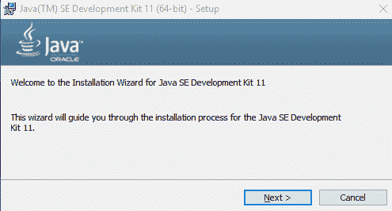
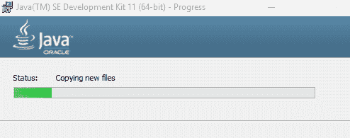
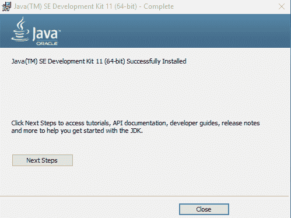
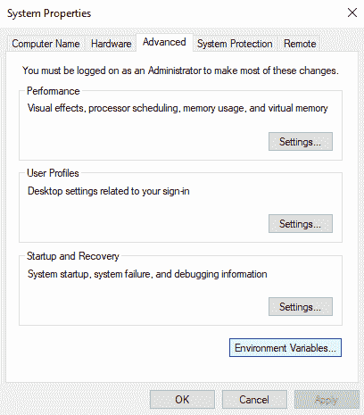
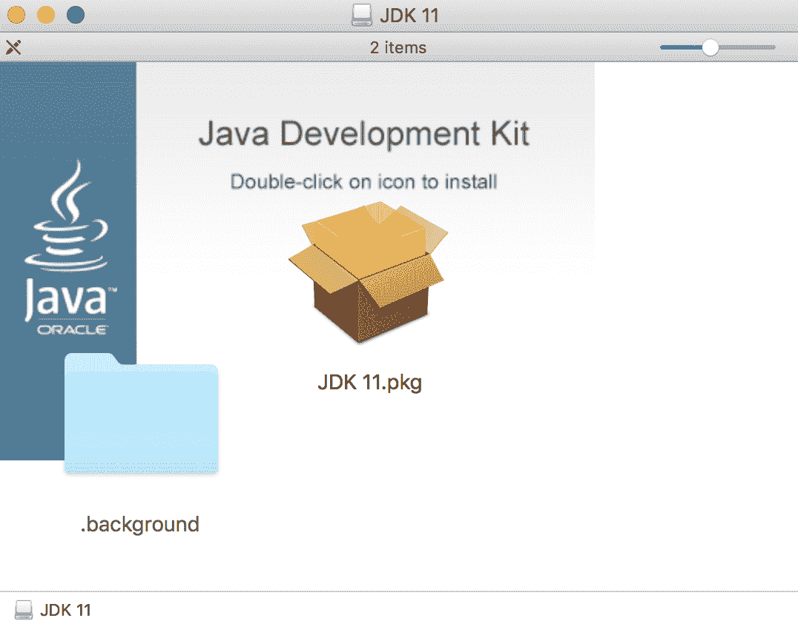
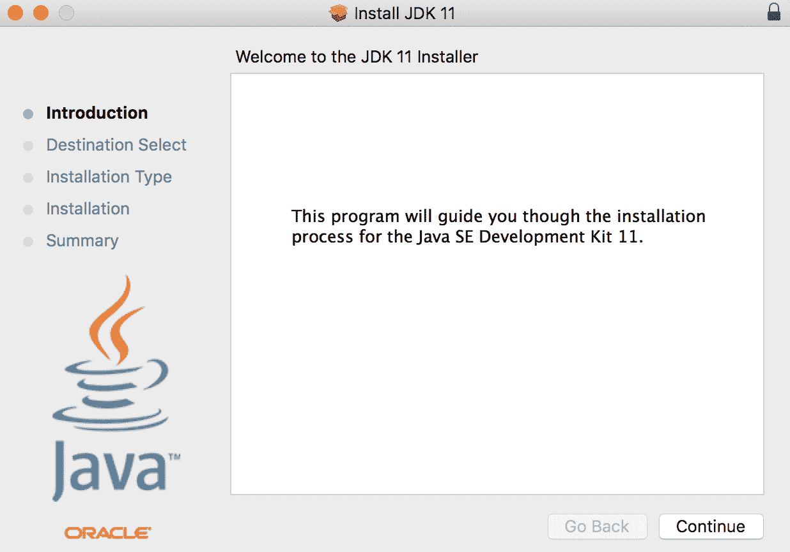
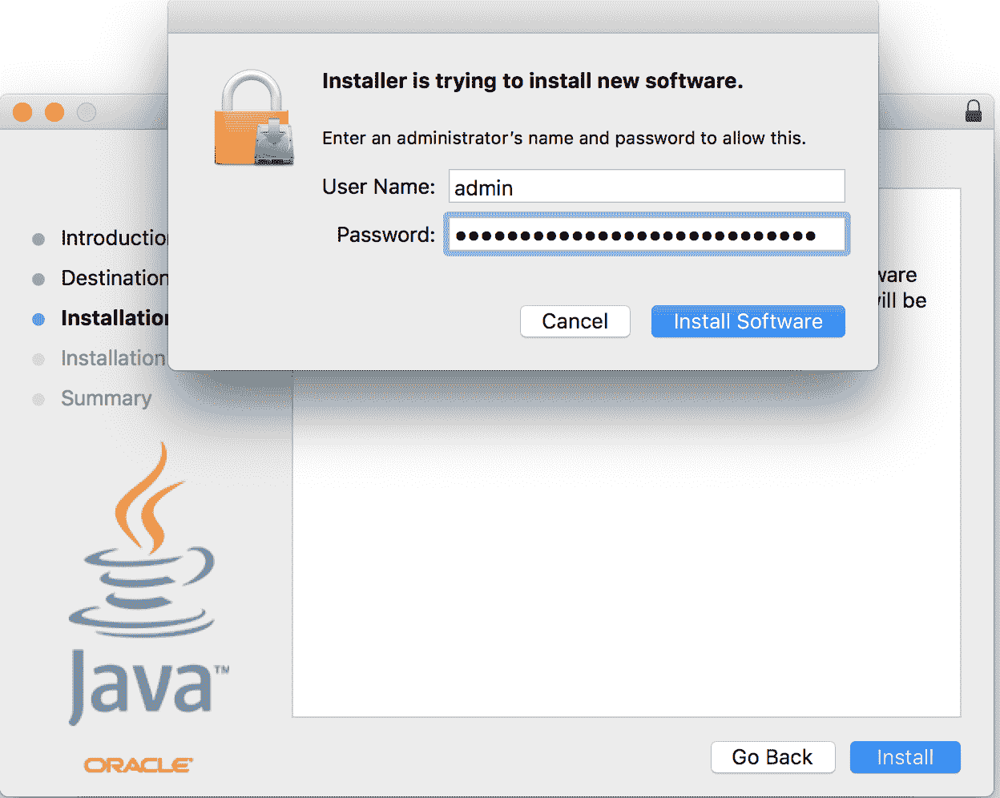
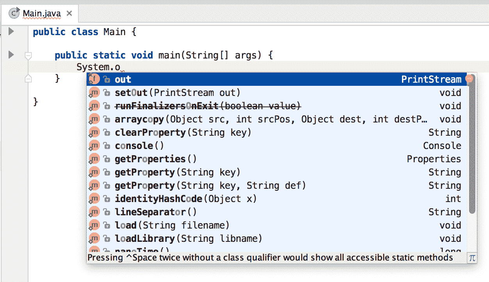
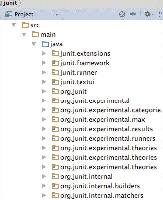

# Java 11 入门

你想学习 Java，你有充分的理由。Java 是一种成熟的现代应用编程语言，广泛应用于电信、金融等行业。Java 开发人员的职位是最多的，而且可能是薪水最高的。除其他外，这使得年轻的专业人士学习这门语言有利可图。

另一方面，这并非毫无道理。Java 语言、工具以及它周围的整个基础设施都是复杂和复杂的。成为 Java 专业人员不会在一天或一周内发生；这是一项多年的工作。要成为一名 Java 专家，您不仅需要了解编程语言，还需要了解面向对象编程原则、开源库、应用程序服务器、网络、数据库等许多方面。然而，学习语言是绝对的最低限度。所有其他实践都是基于此。在本书中，您将学习 Java 版本 18.9，也称为 Java11，以及其他内容。您不仅要学习语言，还将学习最重要的工具，如 maven、gradle、spring、Guice、SoapUI；http/2、SOAP、REST 等协议；如何在敏捷专业团队中工作；以及团队应该使用哪些工具进行合作。在最后一章中，您甚至将学习如何规划您打算作为 Java 开发人员开始的职业生涯。

在本章中，您将介绍 Java 环境，并将逐步给出如何安装、编辑示例代码、编译和运行 Java 的说明。您将了解在开发中帮助的基本工具，无论是 Java 的一部分还是其他供应商提供的。本章将介绍以下主题：

*   Java 简介
*   在 Windows、Linux 和 macOS 上安装
*   执行`jshell`
*   使用其他 Java 工具
*   使用集成开发环境

# Java 入门

就像穿过森林里的小路。你可以把注意力集中在道路的碎石上，但这是毫无意义的。相反，你可以欣赏你周围的景色、树木、鸟儿和环境，这更令人愉快。这本书很相似，因为我不会只关注语言。我会不时地介绍一些接近道路的话题，并将给你一些概述和指导，你可以在你完成这本书之后去哪里。我不仅要教你语言，而且还将介绍一些算法、面向对象的编程原则、围绕 Java 开发的工具以及专业人员如何工作。这将与我们将要遵循的编码示例混合。最后，最后一章将全面讨论这个主题，接下来要学习什么，以及如何进一步成为一个专业的 Java 开发人员。

到这本书出版的时候，[爪哇已经完成了 22 年](http://www.oracle.com/technetwork/java/javase/overview/javahistory-index-198355.html)。在这段时间里，语言发生了很大的变化，变得更好了。真正要问的问题不是它在这里呆了多久，而是它会呆多久？这门语言还值得学吗？自从 Java 诞生以来，[有许多新的语言被开发出来](http://blog.takipi.com/java-vs-net-vs-python-vs-ruby-vs-node-js-who-reigns-the-job-market/)。这些语言更加现代，并且具有函数式编程特性，顺便说一句，Java 从版本 8 开始就有了这些特性。很多人说 Java 是过去的，未来是 Scala、Swift、Go、Kotlin、JavaScript 等等。您可以将许多其他语言添加到此列表中，对于每一种语言，您都可以找到一篇庆祝 Java 诞生的博客文章。对于这一问题，有两种答案：一种是务实的商业方法，另一种更注重工程：

*   考虑到 COBOL 仍在金融业中得到积极应用，而且 COBOL 开发人员的薪酬可能比 Java 开发人员高，所以说作为一名 Java 开发人员，您将在未来 40 年内找到合适的职位并不太冒险。就我个人而言，我会赌 100 多年，但考虑到我的年龄，预测未来 20 到 40 年是不公平的。
*   Java 不仅是一种语言，也是一种技术，您将从本书中了解到一些。该技术包括 **Java 虚拟机**（**JVM**），通常被称为 JVM，为多种语言提供了运行环境；例如 Kotlin 和 Scala，没有 JVM 就无法运行。即使 Java 将被预示，JVM 仍将是企业场景中的头号玩家。

理解和学习 JVM 的基本操作几乎和语言本身一样重要。Java 是一种编译和解释语言。它是一种特殊的野兽，能锻造两个世界的精华。在 Java 之前，有解释语言和编译语言。

解释器从源代码中读取解释语言，然后解释器执行代码。在每种语言中，都有一些初步的词法和语法分析步骤；然而，在这之后，解释器作为程序本身由处理器执行，解释器不断地解释程序代码，以知道该做什么。编译语言是不同的。在这种情况下，源代码被编译成二进制文件（Windows 平台上的`.exe`文件），由操作系统加载，处理器直接执行。编译后的程序通常运行得更快，但通常有一个较慢的编译阶段，这可能会使开发速度变慢，而且执行环境也不是那么灵活。Java 结合了这两种方法。

要执行 Java 程序，必须将 Java 源代码编译成 JVM 字节码（`.class`文件），JVM 加载该字节码并对其进行解释或编译。嗯…是解释的还是编译的？Java 附带的东西是**即时**（JIT）编译器。这使得编译阶段的计算密集型和编译语言的编译相对缓慢。JVM 首先开始解释 Java 字节码，同时跟踪执行统计信息。当它收集到足够的代码执行统计信息时，它会编译成本机代码（例如，Intel/AMD 平台上的 x86 代码），以便直接执行频繁执行的代码部分，并不断解释很少使用的代码片段。毕竟，为什么要浪费昂贵的 CPU 时间来编译一些很少使用的代码呢？（例如，在启动期间读取配置的代码，除非应用程序服务器重新启动，否则不会再次执行。）字节码的编译速度很快，并且代码生成只针对有回报的段。

JIT 使用代码执行的统计信息来优化代码，这也很有趣。例如，如果它可以看到某个条件分支在 99%的情况下执行，而另一个分支仅在 1%的情况下执行，那么它将生成运行速度很快的本机代码，从而支持频繁的分支。如果该部分程序的行为随时间而变化，并且统计数据显示比率发生了变化，那么 JIT 会不时地自动重新编译字节码。这一切都是自动的和幕后的。

除了自动编译之外，JVM 还有一个非常重要的特性，它管理 Java 程序的内存。现代语言的执行环境是这样做的，Java 是第一个拥有自动垃圾收集（GC）的主流语言。在 Java 之前，我用 C 编程了 20 年，跟踪所有内存分配情况，并且在程序不再需要时忘记释放内存是一个巨大的痛苦。忘记代码中的单个点的内存分配，而长时间运行的程序会慢慢地耗尽所有内存。这种问题在 Java 中实际上已经不存在了。我们必须为 it GC 支付一个代价，它需要处理器容量和一些额外的内存，但这在大多数企业应用程序中我们并不缺少。一些特殊的程序，比如控制重型卡车刹车的实时嵌入式系统，可能没有那么豪华。

这些程序仍然是用汇编或 C 语言编写的。对于我们其他人来说，我们有 Java，尽管这对许多专业人士来说似乎很奇怪，但即使是几乎实时的程序，如高频交易应用程序，也是用 Java 编写的。

这些应用程序通过网络连接到证券交易所，它们根据市场变化在毫秒内进行股票买卖。Java 能够做到这一点。执行编译的 Java 代码所需的 Java 运行时环境（也包括 JVM 本身）包含允许 Java 程序访问网络、磁盘上的文件和其他资源的代码。为此，运行时包含代码可以实例化、执行的高级类，以及执行低级作业的高级类。你也要这样做。这意味着实际的 Java 代码不需要处理 IP 包、TCP 连接，甚至当它想要在某些微服务架构中使用或提供 REST 服务时，也不需要处理 HTTP。它已经在运行库中实现，应用程序程序员所要做的就是在代码中包含类，并在与程序匹配的抽象级别上使用它们提供的 api。当你用 Java 编程时，你可以专注于你想要解决的实际问题，那就是*业务*代码，而不是底层的系统代码。如果它不在标准库中，您将在某个外部库中的某个产品中找到它，并且您很可能会找到解决该问题的开源解决方案。

这也是 Java 的一个优点。有大量的开源库可用于各种不同的用途。如果您找不到适合您的问题的库，并且开始编写一些低级代码，那么您可能是做错了什么。本书中的一些主题很重要，比如类加载器或反射，不是因为你必须每天使用它们，而是因为它们被框架使用，了解它们有助于你理解这些框架是如何工作的。如果不使用反射或直接编写自己的类加载器或程序多线程就无法解决问题，那么您可能选择了错误的框架。几乎可以肯定有一个很好的例子：Apache 项目、Google 和软件行业的许多其他重要参与者将其 Java 库发布为开源。

多线程编程也是如此。Java 从一开始就是一个多线程编程环境。JVM 和运行时支持执行代码的程序。执行在多个线程上并行运行。有一些运行时语言结构支持程序的并行执行。这些构造中的一些是非常低级的，而另一些则处于高度抽象级别。多线程代码利用多核处理器，这是更有效的。这些处理器越来越普遍。20 年前，只有高端服务器有多个处理器，只有数字 Alpha 处理器有 64 位架构，CPU 时钟高于 100mhz。10 年前，多处理器结构在服务器端很常见，大约 5 年前，多核处理器出现在一些台式机和笔记本电脑上；今天，甚至手机也有。当 Java 在 1995 年诞生时，创造它的天才们已经看到了这个未来。

他们设想 Java 是一种只写一次，可以在任何地方运行的语言。当时，该语言的第一个目标是浏览器中运行的 applet。今天，许多人认为（我也同意这种观点）applet 是一个错误的目标，或者至少事情没有以正确的方式进行。到目前为止，您在 internet 上遇到小程序的频率将低于 Flash 应用程序或恐龙。更重要的是，applet 接口在 java9 中已经被弃用了，这使得人们认为 applet 并不好。

然而，与此同时，Java 解释器也在不使用任何浏览器的情况下执行服务器和客户机应用程序。此外，随着语言和执行环境的发展，这些应用领域变得越来越重要。如今，Java 主要用于企业计算和移动应用，主要用于 Android 平台。未来，随着**物联网**（**IoT**）越来越多地进入人们的视野，环境在嵌入式系统中的应用也越来越广泛。

# 版本号

Java 版本控制是不断变化的。这不仅仅意味着版本号在从一个版本到另一个版本的变化。这是很明显的；毕竟，这就是版本号的意义所在。然而，在 Java 中，版本号的结构也在改变。Java 从版本 1.0 开始（惊喜！）紧接着是 1.1 版。下一个版本是 1.2，它与以前的版本有很大的不同，人们开始称它为 Java2。然后，我们使用 Java1.3 直到 Java1.8。就我们考虑版本号的结构而言，这是一个稳定的时期。然而，下一个 Java 版本在 2017 年被命名为 Java9，而不是去年的 1.9。这是有道理的，因为经过 22 年的开发和 9 次发布，版本号的`1.`部分并没有真正意义。没有人期待一个“真正的”Java2.0，它与任何其他版本有如此大的不同，以至于它应该有`2.`版本前缀。实际上，Java 版本实际上是 1、2、3 等等；它们只是被命名为 1.1、1.2、1.3 等等。

您可以预期，在版本号格式发生巨大变化之后，Java 的下一个版本将是 java10。一点也不。甲骨文决定使用基于日期的版本号。dot 之前的版本号的第一部分将是两位数的年份，如 2018 年发布的版本的`18`。点后面的部分是月份的数字，通常是 3 月的`3`，9 月的`9`。因此，当您看到 Java 版本号 18.3 时，您马上就会知道这个版本是在 2018 年 3 月发布的，按照旧的命名法，实际上是 Java10。

# 安装 Java

要开发、编译和执行 Java 程序，需要 Java 执行环境。由于我们通常用于软件开发的操作系统不包含预先安装的语言，因此您必须下载它。尽管该语言有多种实现，但我建议您从 Oracle 下载该软件的正式版本。Java 的官方网站是[这个页面](http://java.com)，这是该语言最新版本的下载站点。在撰写本书时，Java 的第 11 个版本尚未发布。早期预发布版本可通过[这个页面](http://jdk.java.net/11/)下载。稍后，还将从以下位置提供发布版本：


您可以从这里下载的是所谓的早期访问版本的代码，它只能用于实验，任何专业人士都不应将其用于商业目的。

在页面上，您必须单击单选按钮才能接受，但必须单击许可证。之后，您可以单击直接启动安装工具包下载的链接。许可证是一个特殊的早期访问许可版本，您作为专业人士，只有在您同意条款的情况下才应仔细阅读、理解和接受该版本。

对于 Windows 32 和 64 位系统、macOS、Linux 32 和 64 位版本、Linux for ARM 处理器、Solaris for SPARC 处理器系统和 Solaris x86 版本，有一个单独的安装工具包。由于不太可能使用 Solaris，因此我将仅详细介绍 Windows、Linux 和 macOS 的安装过程。在后面的章节中，示例将始终是 macOS，但是由于 Java 是一种*编写一次、在任何地方运行*的语言，因此在安装之后没有区别。目录分隔符的倾斜方式可能不同，类路径分隔符字符在 Windows 上是分号而不是冒号，终端或命令应用程序的外观也不同。然而，在重要的地方，我将尽量不忘记提到它。

让您感到困惑的是，这些操作系统版本的 Java 下载都列出了一个 JRE 链接和一个 JDK 链接。**JRE** 代表 **Java 运行时环境**，它包含运行 Java 程序所需的所有工具和可执行文件。**JDK** 是 **Java 开发工具包**，包含开发 Java 程序所需的所有工具和可执行文件，包括 Java 程序的执行。换句话说，JDK 包含自己的 JRE。现在，您需要做的就是下载 JDK。

安装的一个要点是在三个操作系统中的每一个上都是相同的，您必须在安装之前做好准备要安装 Java，您应该具有管理权限。

# 在 Windows 上安装

Windows 上的安装过程从双击下载的文件开始。它将启动安装程序并向您显示欢迎屏幕。Windows 10 可能会要求您具有安装 Java 的管理员权限：



按下 Next 按钮可获得一个窗口，您可以在其中选择要安装的零件，并且，我们还可以更改 Java 将安装的位置：


让我们在这里保留默认设置，这意味着我们将安装 Java 的所有下载部分，然后按 Next：



当 Java 正在安装时，我们会看到一个进度屏幕。这是一个相当快的过程，不超过 10 秒。安装 Java 后，我们会看到一个确认屏幕：



我们可以按关闭键。可以按下 nextsteps 按钮，打开浏览器，进入一个页面，描述我们可以使用 Java 执行的下一步操作。使用预发布版本会导致 HTTP404 错误。当你读这本书的时候，这个问题有望得到解决。

最后一步是设置环境变量`JAVA_HOME`。为此，在 Windows 中，我们必须打开 control center 并选择“编辑帐户的环境变量”菜单：



这将打开一个新窗口，我们应该使用该窗口为当前用户创建新的环境变量：


新变量的名称必须是`JAVA_HOME`，值应该指向 JDK 的安装目录：


大多数系统上的这个值是`C:\Program Files\Java\jdk-11`。许多 Java 程序和工具都使用它来定位 Java 运行时。

# 在 macOS 上安装

在本节中，我们将逐步了解如何在 macOS 平台上安装 Java。我将描述在编写本书时发布的版本的安装过程。到目前为止，Java18.9EarlyAccess 版本的安装有点棘手。Java18.9 的发行版很可能有与 Java9 相似或相同的安装步骤。

Java 的 macOS 版本以`.dmg`文件的形式出现。这是 macOS 的打包格式。要打开它，只需双击浏览器保存的`Download`文件夹中的文件，操作系统就会将该文件挂载为只读磁盘映像：



这个磁盘上只有一个文件安装映像。双击 Finder 应用程序中的文件名或图标，安装过程将开始：



第一个屏幕是欢迎屏幕。单击 Continue，您将看到 Summary 页面，其中显示将要安装的内容。

您将看到一个标准的 Java 安装，这并不奇怪。这次，这个按钮被称为 Install。单击它，您将看到以下内容：


此时您必须为管理用户提供登录参数（用户名和密码）：



提供后，安装开始，几秒钟后，您将看到摘要页面：


点击关闭，你就准备好了。你的 Mac 上安装了 Java。或者，您可以卸载安装盘，稍后还可以删除`.dmg`文件。您将不需要它，如果需要，您可以随时从 Oracle 下载它。

最后一件事是检查安装是否正常。吃布丁就是证据。启动一个终端窗口，在提示符处键入`java -version`；Java 将告诉您已安装的版本。

在下面的屏幕截图中，您可以看到 my workstation 上的输出以及便于在不同版本的 Java 之间切换的 macOS 命令：


在前面的屏幕截图中，您可以看到我已经安装了 Java11 版本，同时，我还安装了 Java18.9 早期版本，我将用它来测试本书中 Java 的新特性。

# 在 Linux 上安装

在 Linux 上安装 Java 有几种方法，这取决于它的风格。在这里，我将描述一种安装方法，它在所有风格上的工作方式或多或少都是相同的。我用的是 Debian。

第一步与在任何其他操作系统中下载安装工具包的步骤相同。在 Linux 中，您应该选择一个以`tar.gz`结尾的包。这是一种压缩的存档格式。您还应该仔细选择与计算机中的处理器和 32/64 位操作系统版本相匹配的软件包。软件包下载完成后，需要切换到 root 模式，发出`su`命令。这是您在以下屏幕截图中看到的第一个命令，显示了安装命令：


`tar`命令将存档解压缩到一个子文件夹中。在 Debian 中，此子文件夹必须移动到`/opt/jdk`，而`mv`命令用于此目的。这两个`update-alternatives`命令是 Debian 特有的。这些命令告诉操作系统使用这个新安装的 Java，以防已经安装了旧的 Java。我用来在虚拟机上测试和演示安装过程的 Debian 附带了一个有 7 年历史的 Java 版本。

安装的最后一步与检查安装是否成功发出了`java -version`命令的任何其他操作系统相同。对于 Linux，这一点更为重要。安装过程不会检查下载的版本是否与操作系统和处理器架构匹配。

# 设置 JAVA\u 主页

`JAVA_HOME`环境变量在 Java 中起着特殊的作用。即使 JVM 可执行文件`java.exe`或`java`位于`PATH`（因此，您可以通过键入名称`java`来执行它，而无需在命令提示符中指定目录）（终端），建议您使用正确的 Java 安装来设置此环境变量。变量的值应该指向已安装的 JDK。有许多与 Java 相关的程序，例如 Tomcat 或 Maven，使用这个变量来定位已安装和当前使用的 Java 版本。在 macOS 中，设置这个变量是不可避免的。

在 macOS 中，当您键入`java`时开始执行的程序是一个包装器，它首先查看`JAVA_HOME`来决定启动哪个 Java 版本。如果未设置此变量，macOS 将自行决定，从可用的已安装 JDK 版本中进行选择。要查看可用版本，可以发出以下命令：

```java
~$ /usr/libexec/java_home -V
Matching Java Virtual Machines (13):
    11, x86_64: "Java SE 11-ea" /Library/Java/JavaVirtualMachines/jdk-11.jdk/Contents/Home
    10, x86_64: "Java SE 10"    /Library/Java/JavaVirtualMachines/jdk-10.jdk/Contents/Home
    9.0.1, x86_64:      "Java SE 9.0.1" /Library/Java/JavaVirtualMachines/jdk-9.0.1.jdk/Contents/Home
    9, x86_64:  "Java SE 9-ea"  /Library/Java/JavaVirtualMachines/jdk-9.jdk/Contents/Home
    1.8.0_92, x86_64:   "Java SE 8"     /Library/Java/JavaVirtualMachines/jdk1.8.0_92.jdk/Contents/Home
    1.8.0_20, x86_64:   "Java SE 8"     /Library/Java/JavaVirtualMachines/jdk1.8.0_20.jdk/Contents/Home
    1.8.0_05, x86_64:   "Java SE 8"     /Library/Java/JavaVirtualMachines/jdk1.8.0_05.jdk/Contents/Home
    1.8.0, x86_64:      "Java SE 8"     /Library/Java/JavaVirtualMachines/jdk1.8.0.jdk/Contents/Home
    1.7.0_60, x86_64:   "Java SE 7"     /Library/Java/JavaVirtualMachines/jdk1.7.0_60.jdk/Contents/Home
    1.7.0_40, x86_64:   "Java SE 7"     /Library/Java/JavaVirtualMachines/jdk1.7.0_40.jdk/Contents/Home
    1.7.0_21, x86_64:   "Java SE 7"     /Library/Java/JavaVirtualMachines/jdk1.7.0_21.jdk/Contents/Home
    1.7.0_07, x86_64:   "Java SE 7"     /Library/Java/JavaVirtualMachines/jdk1.7.0_07.jdk/Contents/Home
    1.7.0_04, x86_64:   "Java SE 7"     /Library/Java/JavaVirtualMachines/1.7.0.jdk/Contents/Home

/Library/Java/JavaVirtualMachines/jdk-11.jdk/Contents/Home
```

然后您将得到已安装 jdk 的列表。注意，命令是小写的，但是选项是大写的。如果您不向程序提供任何选项和参数，它只会返回它认为最新、最适合该用途的 JDK。当我从终端窗口复制命令的输出时，您可以看到我的机器上安装了相当多的 Java 版本。

程序响应的最后一行是 JDK 的主目录，这是默认的。您可以使用它来使用一些 bash 编程来设置您的`JAVA_HOME`变量：

```java
export JAVA_HOME=$(/usr/libexec/java_home)
```

您可以将此文件放入`.bashrc`文件中，每次启动终端应用程序时都会执行该文件，因此`JAVA_HOME`始终设置。如果您想使用不同版本，可以使用`-v`，这次使用小写选项，到同一个实用程序，如下所示：

```java
export JAVA_HOME=$(/usr/libexec/java_home -v 1.8)
```

参数是要使用的 Java 版本。请注意，此版本控制将变为以下内容：

```java
export JAVA_HOME=$(/usr/libexec/java_home -v 11)
```

如果您想使用 javajdkearly-Access 版本，而不是 1.11，那么对于同样的情况没有一个解释。

注意，还有一个环境变量对 Java 很重要-`CLASSPATH`。我们稍后再谈。

# 执行 jshell

现在我们已经花了很多时间安装 Java，是时候让你的手指烧伤了。当我们使用 Java18.9 时，有一个新的工具可以帮助开发人员使用该语言。这是一个**读取-求值-打印-循环**（**REPL**）工具，许多语言工具集都包含这个工具，也有来自 Java 的实现，但是版本 9 是第一个包含这个特性的现成工具。

REPL 是一个具有交互式提示和语言命令的工具，可以直接输入这些命令，而无需编辑一些独立的文件。直接执行输入的命令，然后循环再次启动，等待用户键入下一个命令。

这是一个非常有效的工具，可以在不延迟编辑、编译和加载的情况下尝试一些语言构造。这些步骤由 REPL 工具自动透明地完成。

Java18.9 中的 REPL 工具称为 jshell。要启动它，只需键入它的名称。如果它不在`PATH`上，则键入 Java 18.9 附带的 jshell 的完整路径，如下例所示：

```java
$ jshell | Welcome to JShell -- Version 11-ea | For an introduction type: /help intro jshell>
```

jshell 以交互方式启动，它显示的提示是`jshell>`，以帮助您识别 jshell 正在运行。输入的内容由程序读取，而不是由操作系统外壳读取。由于这是您第一次启动 jshell，它告诉您键入`/help intro`。我们开始吧。它将打印出一个关于 jshell 是什么的简短文本，如下代码所示：

```java
jshell> /help intro
|  
|                                   intro
|                                   =====
|  
|  The jshell tool allows you to execute Java code, getting immediate results.
|  You can enter a Java definition (variable, method, class, etc), like:  int x = 8
|  or a Java expression, like:  x + x
|  or a Java statement or import.
|  These little chunks of Java code are called 'snippets'.
|  
|  There are also the jshell tool commands that allow you to understand and
|  control what you are doing, like:  /list
|  
|  For a list of commands: /help
```

好的，我们可以输入 Java 代码段和`/list`，但这只是可用命令的一个示例。我们可以通过键入`/help`来获得更多信息，如下代码所示：

```java
jshell> /help
|  Type a Java language expression, statement, or declaration.
|  Or type one of the following commands:
|  /list [<name or id>|-all|-start]
|       list the source you have typed
|  /edit <name or id>
|       edit a source entry
|  /drop <name or id>
|       delete a source entry
|  /save [-all|-history|-start] <file>
|       Save snippet source to a file
...
```

你得到的是一长串命令。这里介绍的大部分内容并不是为了节省纸张和您的注意力。在接下来的几页中，我们将使用其中的许多命令。让我们从一个小的 Java 片段开始，即永恒的 Hello World 示例：

```java
jshell> System.out.println("Hello, World!")
Hello World!
```

这是 Java 中有史以来最短的 Hello World 程序。在 Java9 之前，如果您只想打印出`Hello World!`，就必须创建一个程序文件。它必须包含一个类的源代码，包括`public static main`方法，其中包含一行我们必须用 Java9JShell 输入的代码。仅仅对于一个简单的示例代码打印输出来说，这是很麻烦的。现在就容易多了，jshell 也很宽容。它原谅了我们在行尾缺少分号的问题。

接下来我们应该尝试声明一个变量，如下所示：

```java
jshell> var a = 13
a ==> 13
```

我们声明了一个名为`a`的变量，并将值赋给它-`13`。变量的类型是`int`，是 Java 中整数类型的缩写。现在，我们的代码段中已经有了这个变量，所以如果需要，我们可以打印出来，如下所示：

```java
jshell> System.out.println(a)
13
```

现在是时候将比一个行更复杂的东西写入 jshell 了：

```java
jshell> void main(String[] args){
   ...> System.out.println("Hello, World")
   ...> }
|  Error:
|  ';' expected
|  System.out.println("Hello, World")
|                                   ^
```

jshell 认识到这不是一行，当我们在第一行末尾按`Enter`时，它无法处理我们迄今为止键入的内容，并且它表示它希望我们输入更多字符，因此它显示`...>`作为继续提示。我们输入组成整个 helloworld`main`方法的命令。

但是，这次 jshell 不允许我们忽略分号；这只允许在单行代码段的情况下使用。由于 jshell 是交互式的，因此很容易纠正错误按几次向上箭头键返回前几行，这次在第二行末尾添加分号：

```java
jshell> void main(String[] args){
   ...> System.out.println("Hello, World");
   ...> }
|  created method main(String[])
```

此方法是作为代码段为我们创建的，现在我们可以调用它：

```java
jshell> main(null)
Hello, World
```

它起作用了。您可以列出创建的所有代码段，如下所示：

```java
jshell> /list 
   1 : System.out.println("Hello World!")
   2 : var a = 13;
   3 : System.out.println(a)
   4 : void main(String[] args){
       System.out.println("Hello, World");
       }
   5 : main(null)
```

另外，当我们想继续编写一个完整的 Java 版本的 *hello world* 时，我们可以将我们的工作从 jshell 保存到一个文件中，如下所示：

```java
jshell> /save HelloWorld.java
```

最后，我们通过键入`/exit`退出 jshell。返回系统提示时，键入`cat HelloWorld.java`（或在 Windows 上键入`type HelloWorld.java`以查看文件的内容。具体如下：

```java
$ cat HelloWorld.java 
System.out.println("Hello, World!")
var a = 13;
System.out.println(a)
void main(String[] args){
System.out.println("Hello, World");
}
main(null)
```

这个文件包含我们输入的所有片段，一个接一个。如果你认为你已经用很多你不再需要的变量和代码片段弄乱了 shell，你可以发出`/reset`命令：

```java
jshell> /reset
|  Resetting state.
```

执行此命令后，jshell 与之前启动时一样干净：

```java
jshell> /list

jshell>
```

清单并没有产生任何结果，因为我们将其全部删除。幸运的是，我们将 jshell 的状态保存到了一个文件中，我们还可以通过发出`/open`命令来加载该文件的内容：

```java
jshell> /open HelloWorld.java
Hello, World!
13
Hello, World
```

它从文件中加载行并执行它，就像在命令提示符中键入字符一样。

您可能还记得，`/list`命令在每个片段前面都打印了一个数字。我们可以使用它来单独编辑代码段。为此，发出`/edit`命令，后跟代码段的编号：

```java
jshell> /edit 1
```

您可能还记得，我们输入的第一个命令是将参数打印到控制台的`System.out.println`系统调用。当您在`/edit 1`命令后按`Enter`时，不会得到返回的提示。相反，jshell 会打开一个单独的图形编辑器，其中包含要编辑的代码段，如图所示：


编辑框中的文本，使其如下所示：

```java
void printf(String format, Object... args) { System.out.printf(format, args); }
printf("Hello World!")
```

单击“接受”，然后单击“退出”。单击 Accept 时，终端将执行代码段并显示以下结果：

```java
| created method printf(String,Object...) Hello World!
```

我们使用的方法`printf`表示格式化打印。这可能是许多其他语言所熟知的。它最初是由 C 语言引入的，虽然它很神秘，但它的名字仍然存在。这也是标准 Java 类`PrintStream`的一部分，就像`println`。如果是`println`，我们必须在方法名称前面写`System.out`。为了避免这种情况，我们在编辑器中定义了被截取的，并为我们定义了`printf`方法。

Jshell 还定义了一些在 Jshell 启动或重置时自动加载的代码段。如果您使用`-start`选项发出`/list`命令，您可以看到这些，如下所示：

```java
jshell> /list -start

  s1 : import java.io.*;
  s2 : import java.math.*;
  s3 : import java.net.*;
  s4 : import java.nio.file.*;
  s5 : import java.util.*;
  s6 : import java.util.concurrent.*;
  s7 : import java.util.function.*;
  s8 : import java.util.prefs.*;
  s9 : import java.util.regex.*;
 s10 : import java.util.stream.*;
```

这些预定义的代码片段有助于 jshell 的使用。大多数用户将导入这些类。

如果您想列出您输入的所有代码段以及预定义的代码段，以及那些包含一些错误并因此未执行的代码段，您可以使用`/list`命令上的`-all`选项，如下所示：

```java
jshell> /list -all
  s1 : import java.io.*;
  s2 : import java.math.*;
  s3 : import java.net.*;
  s4 : import java.nio.file.*;
  s5 : import java.util.*;
  s6 : import java.util.concurrent.*;
  s7 : import java.util.function.*;
  s8 : import java.util.prefs.*;
  s9 : import java.util.regex.*;
 s10 : import java.util.stream.*;
   1 : System.out.println("Hello, World!")
   2 : var a = 13;
   3 : System.out.println(a)
   4 : void main(String[] args){
       System.out.println("Hello, World");
       }
   5 : main(null)
   6 : void printf(String format, Object... args) { System.out.printf(format, args); }
   7 : System.out.println("Hello, World!");
```

预加载的行用`s`前缀编号。包含错误的代码段有一个前缀为`e`的数字。（此打印输出中没有。）

如果要再次执行某些代码段，只需键入`/n`，其中`n`是代码段的编号，如下所示：

```java
jshell> /1 System.out.println("Hello, World!") Hello, World!
```

不能重新执行预加载的代码段或包含错误的代码段。无论如何，这些都没有必要。预加载的代码段声明了一些导入；错误的代码段不会执行，因为它们是错误的。

当您想重新执行一个代码段时，不需要依赖 jshell 的数量。当 jshell 会话中已经有很多代码段时，将它们全部列出会太麻烦；有一个快捷方式可以重新执行最后 n 个代码段。你必须写`/-n`。这里，n 是从最后一个开始计算的片段数。因此，如果要执行最后一个代码段，就必须编写`/-1`。如果要执行上一个之前的一个，必须写入`/-2`。请注意，如果您已经键入了`/-1`，那么最后一个是最后一个代码段的重新执行，代码段编号-2 将成为编号`-3`。

列出所有代码片段也可以通过其他方式避免。当您只对某些类型的代码段感兴趣时，可以使用特殊的命令。

如果我们只想看到我们在代码段中定义的变量，我们可以发出`/vars`命令，如下所示：

```java
jshell> /vars
|    int a = 13
```

如果我们只想看到类，`/types`命令将执行以下操作：

```java
jshell> class s {}
|  created class s

jshell> /types
|    class s
```

在这里，我们只是创建了一个空类，然后列出它。

要列出代码段中定义的方法，可以发出`/methods`命令：

```java
jshell> /methods
|    void main(String[])
|    void printf(String,Object...)
```

您可以在输出中看到，只有两种方法，如下所示：

*   `main`：该程序的主要类别
*   `printf`：这个，我们在使用编辑器的时候定义的

如果您想查看您键入的所有内容，则必须对您键入的所有代码段和命令发出`/history`命令。（我不会在这里复制输出；我不想让自己羞愧地展示我所有的打字错误和失败。你应该试试自己，看看自己的历史！）

回想一下，我们可以通过发出`/reset`命令来删除所有代码段。也可以单独删除代码段。为此，您应该发出`/drop n`命令，其中`n`是截取的编号：

```java
jshell> /drop 1

jshell> /list

   2 : var a = 13;
   3 : System.out.println(a)
   4 : void main(String[] args){
       System.out.println("Hello, World");
       }
   5 : main(null)
   6 : void printf(String format, Object... args) { System.out.printf(format, args); }
   7 : System.out.println("Hello, World!");
   8 : System.out.println("Hello, World!")
```

我们可以看到，我们删除了第一个片段：

```java
jshell> /drop 2
|  dropped variable a

jshell> /drop 4
|  dropped method main(String[])
```

jshell 错误消息要求我们查看`/types`、`/methods`、`/vars`或`/list`命令的输出。问题是，`/types`、`/methods`和`/vars`不显示代码段的编号。这很可能是 jshell 预发布版本中的一个小错误，可能在 JDK 发布时修复。

当我们编辑代码片段时，jshell 打开了一个单独的图形编辑器。您可能正在远程服务器上使用 ssh 运行 jshell，并且无法打开单独的窗口。您可以使用`/set`命令设置编辑器。这个命令可以设置 jshell 的许多配置选项。要将编辑器设置为使用无处不在的 vi，请发出以下命令：

```java
jshell> /set editor "vi"
|  Editor set to: vi
```

在此之后，jshell 将在您发出`/edit`命令的同一终端窗口中打开在`vi`中截取的。

您不仅可以设置编辑器。您可以设置启动文件，还可以设置 jshell 在执行命令后将反馈打印到控制台的方式。

如果您设置了启动文件，则将执行启动文件中列出的命令，而不是在`/reset`命令之后执行 jshell 的内置命令。这也意味着您将无法使用默认情况下直接导入的类，并且您将没有`printf`方法片段，除非您自己的启动文件包含导入和片段的定义。

创建具有以下内容的`sample.startup`文件：

```java
void println(String message) { System.out.println(message); }
```

启动一个新的 jshell，执行如下操作：

```java
jshell> /set start sample.startup

jshell> /reset
|  Resetting state.

jshell> println("wuff")
wuff

jshell> printf("This won't work...")
|  Error:
|  cannot find symbol
|    symbol:   method printf(java.lang.String)
|  printf("This won't work...")
|  ^----^
```

定义了`println`方法，但是我们前面定义的`printf`方法没有定义。

反馈定义了 jshell 打印并等待输入的提示、连续行的提示以及每个命令之后的消息详细信息。有预定义的模式，如下所示：

*   正常
*   沉默
*   简洁的
*   冗长的

默认情况下选择 Normal。如果您发出`/set feedback silent`，提示变为`->`，jshell 将不打印有关命令的详细信息。`/set feedback concise`代码打印更多信息，`/set feedback verbose`打印执行命令的详细信息：

```java
jshell> /set feedback verbose
|  Feedback mode: verbose

jshell> int z = 13
z ==> 13
|  created variable z : int

jshell> int z = 13
z ==> 13
|  modified variable z : int
|    update overwrote variable z : int
```

您还可以定义自己的模式，使用`/set mode xyz`命令为新模式命名，其中`xyz`是新模式的名称。之后，可以为模式设置提示、截断和格式。定义格式后，可以使用与内置模式相同的方式使用它。

最后，jshell 最重要的命令是`/exit`。这将终止程序，您将返回操作系统 shell 提示符。

现在，让我们编辑`HelloWorld.java`文件来创建我们的第一个 Java 程序。要做到这一点，您可以使用 vi、记事本、Emacs 或您的机器上提供的任何适合您的工具。稍后，我们将使用一些集成开发环境（IDE）、NetBeans、Eclipse 或 IntelliJ；不过，就目前而言，一个简单的文本编辑器就足够了。

编辑文件，使内容如下：

```java
public class HelloWorld { 
  public static void main(String[] args){ 
        System.out.println("Hello World"); 
       } 
  }
```

为了将源代码编译成字节码，而字节码是 JVM 可执行的，我们必须使用名为`javac`的 Java 编译器：

```java
javac HelloWorld.java
```

这将在当前目录中生成`java.class`文件。这是一个编译代码，可以按如下方式执行：

```java
$ java HelloWorld
Hello World
```

通过这个，您已经创建并执行了第一个完整的 Java 程序。你可能仍然想知道我们在做什么，一切都会很清楚的。此时此刻，我想让你感受到它的作用。

我们编辑的文件只包含代码片段，我们删除了大部分行，除了`main`方法的声明，并在其周围插入了类的声明。

在 Java 中，不能像在许多其他语言中那样拥有独立的方法或函数。每个方法都属于某个类，每个类都应该在一个单独的文件中声明（好吧，差不多，但现在，让我们跳过异常）。文件名必须与类名相同。编译器对`public`类要求这样。即使是非公立的课程，我们也通常遵循这个惯例。如果您将文件从`HelloWorld.java`重命名为`Hello.java`，则当您尝试用新名称编译文件时，编译器将显示一个错误：

```java
$ mv HelloWorld.java Hello.java
~/Dropbox/java_9-by_Example$ javac Hello.java
Hello.java:2: error: class HelloWorld is public, should be declared in a file named HelloWorld.java
public class HelloWorld {
       ^
1 error
```

那么，让我们把它移回原来的名字，也就是，`mv Hello.java HelloWorld.java`。

类的声明以`class`关键字开始，然后是类的名称，一个大括号开始，直到匹配的大括号结束。中间的一切都属于班级。

现在，让我们跳过为什么我在课堂前写了`public`，重点讨论其中的主要方法。该方法不返回任何值，因此返回值为`void`。参数，名为`args`，是一个字符串数组。当 JVM 启动`main`方法时，它将命令行参数传递给这个数组中的程序。然而，这次我们没有用。`main`方法包含打印出`Hello World`的行。现在，让我们再检查一下这条线。

在其他语言中，将内容打印到控制台只需要一个`print`语句，或者一个非常类似的命令。我记得有些初级口译员甚至允许我们输入`?`而不是`print`，因为在屏幕上打印是很常见的。这在过去的 40 年里已经发生了很大的变化。我们使用图形屏幕、互联网和许多其他输入和输出通道。现在，在控制台上写东西已经不是很常见了。

通常，在专业的大型企业应用程序中，甚至没有一行可以做到这一点。相反，我们将文本定向到日志文件，将消息发送到消息队列，并通过 TCP/IP 协议发送请求和响应。由于这是如此不经常使用，没有理由创造一个快捷方式的目的，在语言。在最初的几个程序之后，当您熟悉了调试器和日志记录的可能性之后，您将不会自己将任何内容直接打印到控制台。

尽管如此，Java 仍然有一些特性，可以让您直接将文本发送到进程的标准输出，就像它最初是为 UNIX 发明的那样。这是以 Java 方式实现的，其中所有内容都必须是对象或类。为了访问系统输出，有一个名为`System`的类，它有以下三个变量：

*   `in`：这是标准的输入流
*   `out`：这是标准输出流
*   `err`：这是标准错误流

要引用输出流变量，因为它不在我们的类中，而是在`System`中，我们必须指定类名，所以在我们的程序中将它引用为`System.out`。这个变量的类型是`PrintStream`，也是一个类。类和类型在 Java 中是同义词。每个属于`PrintStream`类型的对象都有一个名为`println`的方法，该方法接受一个`String`。如果实际的打印流是标准输出，并且我们正在从命令行执行 Java 代码，那么字符串将被发送到控制台。

方法名为`main`，这是 Java 程序中的一个特殊名称。当我们从命令行启动 Java 程序时，JVM 从我们在命令行上指定的类中调用名为`main`的方法。它可以做到这一点，因为我们声明了这个方法`public`，以便任何人都可以看到和调用它。如果它是`private`，则只能从同一个类或在同一源文件中定义的类中看到和调用它。

方法也被声明为`static`，这意味着可以在没有包含方法的类的实际实例的情况下调用它。如今，使用静态方法通常不被视为一种好的做法，除非它们实现的函数实际上与实例不相关，或者具有不同的实现，例如`java.lang.Math`类中的函数。然而，在某些地方，代码执行必须开始，Java 运行时通常不会自动为我们创建类的实例。

要启动代码，命令行应如下所示：

```java
java -cp . HelloWorld
```

`-cp`选项代表类路径。对于 Java 来说，类路径是一个相当复杂的概念，但是现在，让我们简单地说，它是包含类的目录和 JAR 文件的列表。类路径的列表分隔符在类 UNIX 系统中是`:`（冒号），在 Windows 系统中是`;`（分号）。在我们的例子中，类路径是实际的目录，因为那是 Java 编译器创建`HelloWorld.class`的地方。如果不在命令行中指定 classpath，Java 将使用当前目录作为默认目录。这就是为什么我们的程序在没有`-cp`选项的情况下运行的原因。

`java`和`javac`都处理许多选项。要获取选项列表，请键入`javac -help`或`java -help`。我们使用 IDE 来编辑代码，并在开发过程中多次编译、构建和运行它。在这种情况下，环境会设置合理的参数。对于生产，我们使用同样支持环境配置的构建工具。因此，我们很少遇到这些命令行选项。然而，专业人士必须至少理解它们的含义，并且知道在哪里学习它们的实际用法，以防需要。

# 查看字节码

类文件是二进制文件。这种格式的主要作用是由 JVM 执行，并在代码使用库中的某些类时为 Java 编译器提供符号信息。当我们编译包含`System.out.println`的程序时，编译器会查看编译的`.class`文件，而不是源代码。它必须找到`System`类、`out`字段和`println`方法

当我们调试一段代码或试图找出程序找不到类或方法的原因时，我们需要一种方法来查看`.class`文件的二进制文件。这不是一项日常工作，它需要一些先进的知识。

为此，有一个*反编译器*，它可以以或多或少可读的格式显示`.class`文件的内容。此命令称为`javap`。要执行它，可以发出以下命令：

```java
$ javap HelloWorld.class
Compiled from "HelloWorld.java"
public class HelloWorld {
  public HelloWorld();
  public static void main(java.lang.String[]);
}
```

程序的输出显示类文件包含一个 Java 类，它有一个名为`HelloWorld()`的东西；它似乎是一个与类同名的方法，它还包含我们编写的方法。

与类同名的*方法*是类的构造器。由于 Java 中的每个类都可以实例化，因此需要一个构造器。如果我们不给出一个，Java 编译器将为我们创建一个。这是默认构造器。默认构造器不执行任何特殊操作，但返回类的新实例。如果我们自己提供一个构造器，Java 编译器就不会费心去创建一个。

除非我们提供`-c`选项，否则`javap`反编译器不会显示方法内部的内容或它包含的 Java 代码：

```java
$ javap -c HelloWorld.class
Compiled from "HelloWorld.java"
public class HelloWorld {
  public HelloWorld();
    Code:
       0: aload_0
       1: invokespecial #1                  // Method java/lang/Object."<init>":()V
       4: return
  public static void main(java.lang.String[]);
    Code:
       0: getstatic     #2                  // Field java/lang/System.out:Ljava/io/PrintStream;
       3: ldc           #3                  // String hali
       5: invokevirtual #4                  // Method java/io/PrintStream.println:(Ljava/lang/String;)V
       8: return
}
```

它非常神秘，不适合普通人。只有少数处理 Java 代码生成的专家能够流利地阅读这些内容。然而，看一下它可以帮助您了解字节码的含义。这有点像一个古老的集会。虽然这是二进制代码，但里面没有什么秘密：Java 是开源的，类文件格式有很好的文档记录，专家可以调试。

# 将类打包到 JAR 文件中

在交付 Java 应用程序时，通常将代码打包为 JAR、WAR、EAR 或其他打包格式。我们又学到了一些乍一看似乎晦涩难懂的东西，但实际上，这并没有那么复杂。它们都是 ZIP 文件。您可以使用 WinZip 或其他您有许可证的 ZIP 管理器打开这些文件中的任何一个。额外的要求是，例如，在 JAR 文件的情况下，归档文件应该包含一个名为`META-INF`的目录和一个名为`MANIFEST.MF`的文件。此文件为文本文件，包含格式如下的元信息：

```java
Manifest-Version: 1.0 
Created-By: 11-ea (Oracle Corporation)
```

文件中可能有很多其他信息，但这是 Java 提供的工具`jar`在将类文件打包到一个 JAR 中时，发出以下命令的最低限度：

```java
jar -cf hello.jar HelloWorld.class
```

`-c`选项告诉 JAR 归档程序创建一个新的 JAR 文件，`f`选项用于指定新归档文件的名称。我们在这里指定的是`hello.jar`，添加到其中的文件是类文件。

打包的 JAR 文件也可以用来启动 Java 应用程序。Java 可以直接从 JAR 档案中读取并从那里加载类。唯一的要求是它们在类路径上。

不能将单个类放在类路径上，只能放在目录上。由于 JAR 文件是带有内部目录结构的归档文件，它们的行为就像一个目录。

检查 JAR 文件是使用`ls hello.jar`创建的，删除`rm HelloWorld.class`类文件只是为了确保在发出命令行时，代码是从 JAR 文件执行的，而不是从类执行的：

```java
$ java -cp hello.jar HelloWorld
Hello World
```

但是，要查看 JAR 文件的内容，建议您使用 JAR 工具，而不是 WinZip，尽管这可能更为方便。真正的专业人士使用 Java 工具来处理 Java 文件：

```java
$ jar -tf hello.jar META-INF/ META-INF/MANIFEST.MF HelloWorld.class
```

# 管理正在运行的 Java 应用程序

JDK 附带的 Java 工具集也支持运行 Java 应用程序的执行和管理。为了让一些程序在执行时能够管理，我们需要一个不仅能运行几毫秒的代码，而且在它运行时，还能将一些东西打印到控制台。我们创建一个名为`HelloWorldLoop.java`的新程序，内容如下：

```java
public class HelloWorldLoop { 
  public static void main(String[] args){ 
       for( ;; ){ 
         System.out.println("Hello World"); 
         } 
       } 
  }
```

程序包含一个`for`循环。循环允许重复执行代码块，我们将在第 2 章“第一个真正的 Java 程序——排序名称”讨论。我们在这里创建的循环是一个特殊的循环，它从不终止，而是重复打印方法调用，打印`Hello World`，直到在 Linux 或 macOS X 上按`Ctrl + C`或发出`kill`命令终止程序，或者在 Windows 下的任务管理器中终止程序。

在一个窗口中编译并启动它，然后打开另一个终端窗口来管理应用程序。

我们首先要熟悉的命令是`jps`。为了更熟悉`jps`，[您可以在这里阅读一些内容](http://docs.oracle.com/javase/7/docs/technotes/tools/share/jps.html)，列出了机器上运行的 Java 进程，如下所示：

```java
$ jps 
21873 sun.tools.jps.Jps 
21871 HelloWorldLoop
```

您可以看到有两个进程：一个是我们执行的程序，另一个是`jps`程序本身。毫不奇怪，`jps`工具也是用 Java 编写的。您还可以将选项传递给`jps`，这些选项记录在 web 上。

还有许多其他工具，我们将研究其中一个，它是一个非常强大且易于使用的工具 Java VisualVM：


VisualVM 是一个命令行图形工具，它连接到正在运行的 Java 进程并显示不同的性能参数。要启动 VisualVM 工具，您将发出不带任何参数的`jvisualvm`命令。很快，就会出现一个窗口，左侧是一棵探索树，右侧是一个欢迎窗格。左侧显示了名为 Local 的分支下所有正在运行的 Java 进程。如果您双击`HelloWorldLoop`，它将在右侧窗格中打开流程的详细信息。在 header 选项卡上，可以选择 Overview、Monitor、Threads、Sampler 和 Profiler。前三个选项卡是最重要的，它可以让您很好地了解 JVM 中的线程数、CPU 使用率、内存消耗等情况。

# 使用 IDE

集成开发环境是优秀的工具，它通过将机械任务从开发人员的肩上卸下来来帮助开发。当我们键入代码时，它们可以识别许多编程错误，帮助我们找到所需的库方法，显示库的文档，并为样式检查、调试等提供额外的工具。

在本节中，我们将介绍一些 ide 以及如何利用它们提供的功能。

要获得 IDE，您必须下载并安装它。它不随 Java 开发工具一起提供，因为它们不是语言环境的一部分。不过，别担心，它们可以免费下载，安装也很简单。它们可能比记事本编辑器更复杂，但即使工作了几个小时，它们也会回报你花在学习上的时间。毕竟，并不是没有理由没有开发人员用记事本或 vi 编写 Java 代码。

最上面的三个 ide 是* NetBeans*、*Eclipse* 和 *IntelliJ*。所有这些都可以在社区版本，这意味着你不需要支付他们。IntelliJ 有一个*完整的*版本，您也可以购买。社区版将用于学习语言。如果您不喜欢 IntelliJ，可以使用 Eclipse 或 NetBeans。这些都是免费的。就我个人而言，我的大多数项目都使用 IntelliJ 社区版，本书中显示 IDE 的屏幕示例将以该 IDE 为特色。然而，这并不一定意味着你必须坚持这个 IDE。

在开发人员社区中，有些话题可以引起激烈的争论。这些话题是关于意见的。如果他们讨论的是事实，辩论很快就会结束。其中一个主题是“哪一个是最好的 IDE？”。这是品味的问题。没有确切的答案。如果你学会如何使用一个，你会喜欢的，你会不愿意学习另一个，除非你看到另一个更好。这就是为什么开发人员喜欢他们使用的 IDE（或者只是讨厌，这取决于他们的个性），但是他们一直使用同一个 IDE，通常是很长一段时间。没有最好的 IDE。

要下载您选择的 IDE，您可以访问以下任一网站：

*   [NetBeans](https://netbeans.org/)
*   [Eclipse](http://www.eclipse.org/)
*   [IntelliJ](https://www.jetbrains.com/idea/)

# 网虫

NetBeans 是由 Oracle 支持的，并且是不断开发的。它包含一些组件，如 NetBeans profiler，这些组件已成为 oraclejava 发行版的一部分。您可能会注意到，当您启动 visualvm 并启动评测时，Java 进程 started 的名称中有`netbeans`。

一般来说，NetBeans 是一个开发富客户机应用程序的框架，IDE 只是构建在该框架之上的众多应用程序中的一个。它支持多种语言，不仅仅是 Java。您可以使用 NetBeans 开发 PHP、C 或 JavaScript 代码，并为 Java 提供类似的服务。为了支持不同的语言，您可以下载插件或 NetBeans 的特殊版本。这些特殊版本可以从 IDE 的下载页面获得，它们只不过是带有一些预配置插件的基本 IDE。在 C 包中，开发人员配置开发 C 所需的插件；在 PHP 版本中，开发人员配置 PHP。

# 日食

IBM 支持 Eclipse。与 NetBeans 类似，它也是一个富客户机应用程序平台，它是围绕 *OSGi* 容器架构构建的，而这个架构本身就是一个可以填满这样一本书的主题。大多数开发人员都使用 Eclipse，而且几乎完全是这样，当开发人员为 *ibmwebsphere* 应用服务器创建代码时，可以选择 Eclipse。Eclipse 特殊版本包含 WebSphere 的开发人员版本。

Eclipse 还具有支持不同编程语言的插件，并且具有类似于 NetBeans 的不同变体。这些变体是用基本 IDE 预先打包的插件。

# 智能

前面枚举中的最后一个是 IntelliJ。这个 IDE 是唯一一个不想成为框架的 IDE。IntelliJ 是一个 IDE。它也有插件，但是您需要下载以在 NetBeans 或 Eclipse 中使用的大多数插件都是预先配置的。当你想使用一些更高级的插件时，它可能是你必须付费的，这在你从事专业的有偿工作时应该不是问题，对吗？这些东西没那么贵。要学习本书中的主题，您不需要任何社区版以外的插件。在本书中，我将使用 IntelliJ 开发示例，我建议您在学习过程中遵循我的建议。

我想强调的是，本书中的示例独立于要使用的实际 IDE。您可以使用 NetBeans、Eclipse 甚至 Emacs、notepad 或 vi 来阅读本书。

# IDE 服务

集成开发环境为我们提供服务。最基本的服务是您可以用它们编辑文件，但它们也可以帮助构建代码、查找 bug、运行代码、以开发模式部署到应用程序服务器、调试等等。在下面的部分中，我们将研究这些特性。关于如何使用一个或另一个 IDE，我将不作确切的介绍。像这样的书对这样的教程来说不是一个好的媒介。

IDE 在菜单位置、键盘快捷键上有所不同，甚至可能随着新版本的发布而改变。最好看一下实际的 IDE 教程视频或在线帮助。另一方面，它们的特征非常相似。IntelliJ 在[有视频文档 https://www.jetbrains.com/idea/documentation/](https://www.jetbrains.com/idea/documentation/)。

# IDE 屏幕结构

不同的 ide 看起来很相似，它们的屏幕结构也差不多。在下面的屏幕截图中，您可以看到 IntelliJ IDE：


在左边，您可以看到 Java 项目的文件结构。Java 项目通常包含不同目录中的许多文件，我们将在下一章中讨论。简单的 *HelloWorld* 应用程序包含一个`pom.xml`项目描述文件。Maven 构建工具需要这个文件，这也是下一章的主题。现在，您应该只知道它是一个描述 maven 项目结构的文件。IDE 还为自己跟踪一些管理数据。存储在`HelloWorld.iml`中。主程序文件存储在`src/main/java`目录中，命名为`HelloWorld.java`。

在右边，你可以看到文件。在前面的截图中，我们只打开了一个文件。如果打开了多个文件，则会有选项卡，每个文件有一个选项卡。现在，活动文件为`HelloWorld.java`，可以在源代码编辑器中编辑。

# 编辑文件

编辑时，您可以键入字符或删除字符、单词和行，但这是所有编辑器都可以做的事情。ide 提供了额外的功能，它们分析源代码并对其进行格式化，从而自动缩进行。它还会在您编辑代码时在后台不断编译代码，如果有语法错误，它会用红色的放弃线来强调这一点。修复错误时，红色下划线将消失：



编辑器还会自动为您键入的其他字符提供建议。您可以忽略弹出的窗口并继续键入。但很多时候，在按`Enter`键之前，更容易在一个字符后停下来，用上下箭头选择需要完成的单词；该单词会自动插入到源代码中。

在前面的截图中，你可以看到我写了`System.o`，编辑马上建议我写`out`。其他替代方法是`System`类中包含字母`o`的其他静态字段和方法。

IDE 编辑器不仅可以为您输入提示，而且可以为您输入提示。在下面的屏幕截图中，IDE 告诉您键入一些表达式作为`println()`方法的参数，即`boolean`、`char`、`int`等等。IDE 完全不知道在那里输入什么。你必须构造表达式。不过，它可以告诉你它需要某种类型：


编辑不仅知道内置类型。与 JDK 集成的编辑器不断地扫描源文件，并知道源代码中有哪些类、方法和字段，以及哪些类、方法和字段在编辑时可用。

当您想重命名方法或变量时，也会大量使用此知识。旧方法是重命名源文件中的字段或方法，然后对变量的所有引用进行彻底搜索。使用 IDE，机械工作由它完成。它知道字段或方法的所有用途，并自动用新标识符替换旧标识符。它还可以识别本地变量是否恰好与我们重命名的变量同名，IDE 仅重命名那些真正指的事件，我们正在重命名。

你通常可以做的不仅仅是重命名。程序员称之为**重构**的机械任务或多或少都有。IDE 使用一些键盘快捷键和编辑器中的上下文相关菜单右键单击鼠标并单击菜单来支持这些功能：


IDE 还帮助您阅读库的文档和源代码，如下所示：


库为`public`方法提供 *Javadoc* 文档，您还应该为自己的方法编写 Javadoc。Javadoc 文档是从源代码中的特殊注释中提取出来的，我们将在第 4 章、“策划人——创建游戏”中学习如何创建这些文档。它们位于实际方法头前面的注释中。由于创建编译文档是编译流的一部分，IDE 也知道文档，当您将光标定位到元素上时，它会显示为方法名、类名或任何要在源文件中使用的元素上方的悬停框。

# 管理项目

在 IDE 窗口的左侧，您可以看到项目的目录结构。IDE 了解不同类型的文件，并以编程的角度显示它们的方式。例如，它不显示`Main.java`作为文件名。相反，它显示`Main`和一个图标，表示`Main`是一个类。它也可以是一个仍然在名为`Main.java`的文件中的接口，但是在这种情况下，图标将显示这是一个接口。IDE 继续扫描和编译代码，这一点再次实现。

当我们开发 Java 代码时，这些文件被构造成子目录。这些子目录遵循代码的打包结构。很多时候，在 Java 中，我们使用复合的和长的包名，而将其显示为一个深度嵌套的目录结构将不那么容易处理。

包用于对源文件进行分组。以某种方式相关的类的源文件应该放在一个包中。我们将在下一章讨论包的概念以及如何使用它们。

IDE 能够显示包结构，而不是包含源文件的项目目录的嵌套目录：



当您将类或接口从一个包移动到另一个包时，它的发生方式与重命名或任何其他重构操作的发生方式类似。源文件中对类或接口的所有引用都将重命名为新包。如果文件包含引用该类的`import`语句，则该语句中的类名称将被更正。要移动一个类，可以打开包并使用旧的拖放技术。

包层次结构不是 IDE 中显示的唯一层次结构。类在包中，但同时存在继承层次结构。类可以实现接口，也可以扩展其他类。javaides 通过显示类型层次结构来帮助我们，您可以在其中沿着继承关系在图形界面上导航。

IDE 可以显示另一个层次结构，以帮助我们使用开发方法调用层次结构。在分析代码之后，IDE 可以向我们展示一个图形，显示方法之间的关系：哪个方法调用哪个其他方法。有时，这个调用图在显示方法之间的依赖关系时也很重要。

# 构建代码并运行它

ide 通常编译代码进行分析，以帮助我们及时发现语法错误或未定义的类和方法。这种编译通常是局部的，涵盖了代码的一部分，而且由于它一直在运行，源代码会发生变化，而且永远不会真正完成。要创建可部署文件，即项目的最终可交付代码，必须启动一个单独的构建过程。大多数 IDE 都有一些内置的工具，但是除了最小的项目外，不建议使用这些工具，专业开发项目使用 Ant、Maven 或 Gradle。

下面是 Maven 的一个例子：


IDE 准备使用这样一个外部工具，它们可以帮助我们启动它们。这样，构建过程可以在开发人员机器上运行，而不需要启动新的 shell 窗口。IDE 还可以从这些外部构建工具的配置文件导入设置，以识别项目结构、源文件所在位置以及在编辑时支持错误检查的编译内容。

构建过程通常包含对代码执行某些检查。一堆 Java 源文件可以编译得很好，很流畅。尽管如此，代码可能包含很多 bug，并且可能以糟糕的风格编写。从长远来看，这些东西使这个项目无法维持。为了避免这些问题，我们将使用单元测试和静态代码分析工具。这些并不能保证无错误的代码，但可能性要小得多。

ide 有运行静态代码分析工具和单元测试的插件。集成到 IDE 中有一个巨大的优势。当分析工具或某些单元测试发现任何问题时，IDE 会提供一条错误消息，其功能类似于网页上的链接。如果单击消息（通常是蓝色和下划线的），就像在网页上一样，编辑器会打开有问题的文件并将光标放在问题所在的位置。

# 调试 Java

开发代码需要调试。Java 在开发过程中有很好的工具来调试代码。JVM 通过 Java 平台调试器架构支持调试器。这允许您在调试模式下执行代码，JVM 将接受外部调试器工具通过网络连接到它，或者根据命令行选项尝试连接到调试器。JDK 包含一个客户机，`jdb`工具，它包含一个调试器；然而，与 ide 中内置的图形客户机相比，它的使用非常麻烦，我从来没有听说有人在实际工作中使用它。

要在调试模式下启动 Java 程序，以便 JVM 接受调试器客户机将选项附加到该程序，请执行以下命令：

```java
-Xagentlib:jdwp=transport=dt_socket,server=y,suspend=y,address=7896
```

`Xagentlib`选项指示 Java 运行时加载`jdwp`代理。`-Xagentlib:jdwp=`后面的选项部分由调试器代理解释。这些选项如下：

*   `transport`：应该指定要使用的传输。它可以是共享内存（`dt_shmem`）套接字或 TCP/IP 套接字传输，但实际上，您将始终使用后者。这在前面的`dt_socket`样本中有规定。
*   `server`：指定被调试的 JVM 是以服务器模式还是以客户端模式启动。当您在服务器模式下启动 JVM 时，它开始侦听套接字并接受调试器连接到它。如果它是在客户机模式下启动的，它会尝试连接一个调试器，该调试器应该在服务器模式下启动，监听一个端口。该选项的值为`y`，表示服务器模式；或`n`，表示非服务器，表示客户端模式。
*   `suspend`：也可以是`y`或`n`。如果 JVM 是在挂起模式下启动的，它将不会启动 Java 代码，直到一个调试器连接到它。如果它是以`suspend=n`启动的，JVM 将启动，当调试器连接时，它将在到达断点时立即停止。如果您启动一个独立的 Java 应用程序，您通常会使用默认值`suspend=y`启动调试。如果要在应用程序服务器或 servlet 容器环境中调试应用程序，最好从`suspend=n`开始；否则，直到调试器连接到服务器，服务器才会启动。在`suspend=y`模式下启动 Java 进程，以防 servlet 应用程序只在您想要调试 servlet 静态初始值设定项代码时才有用，该代码是在服务器启动时执行的。如果没有挂起模式，则需要快速附加调试器。在这种情况下，JVM 最好只是等待您。
*   `address`：应该指定 JVM 与之通信的地址。如果 JVM 以客户机模式启动，它将开始连接到此地址。如果 JVM 在服务器模式下运行，它将接受来自该地址上调试器的连接。地址只能指定端口。在这种情况下，IP 地址是本地机器的 IP 地址。

调试器代理可能处理的其他选项用于特殊情况。对于本书涵盖的主题，前面的选项就足够了。

下面的截图显示了一个典型的调试会话，在 IntelliJ IDE 中调试最简单的程序：


在调试模式下从 IDE 启动程序时，所有这些选项都会自动为您设置。只需在编辑器中单击源代码，就可以设置断点。您可以使用单独的窗体来添加、删除和编辑断点。断点可以附加到特定的行或特定的事件，比如抛出异常时。附加到特定行的断点也可以有条件告诉调试器停止代码的执行，但只有在条件为 true 时才停止；例如，如果变量具有某个预定义的值。

# 摘要

在本章中，我们互相介绍了 Java。我们不太了解对方，但我们是认识的。我们安装了 Java 环境：Java、JDK 和集成开发环境。我们编写了一个小程序，简要介绍了使用开发工具可以做些什么。这远非精通，但即使是最长的旅程也要从第一步开始，这一步有时是最难迈出的。我们已经在 Java 之旅中做到了这一点。我们开始滚动，对于我们这样的狂热者来说，没有什么能阻止我们一路前行。