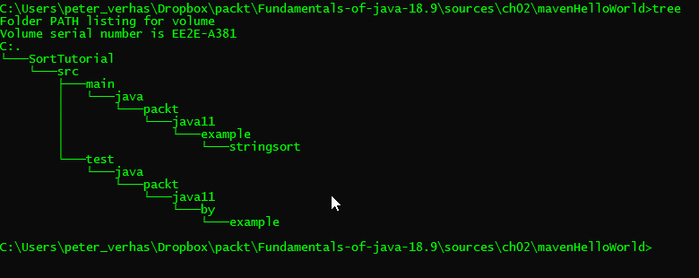
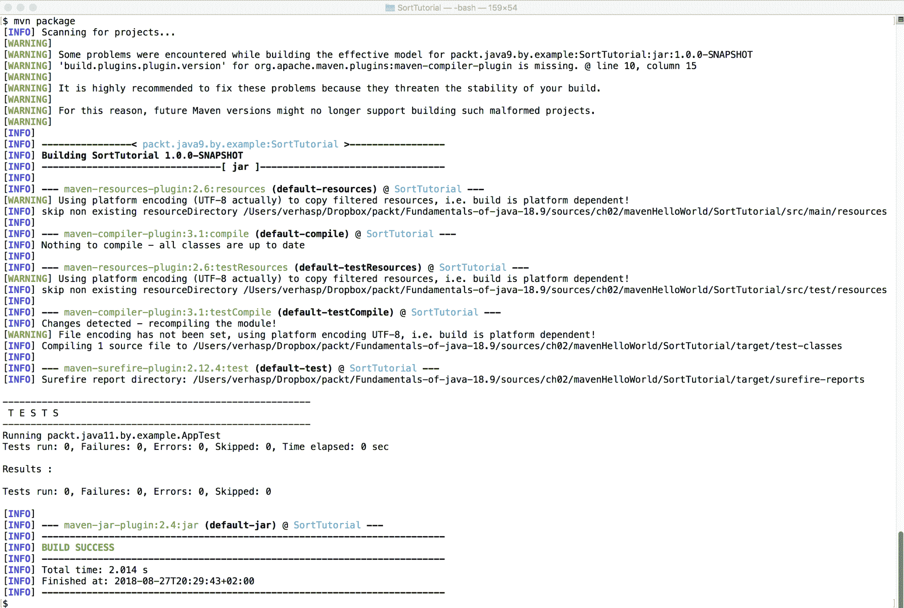
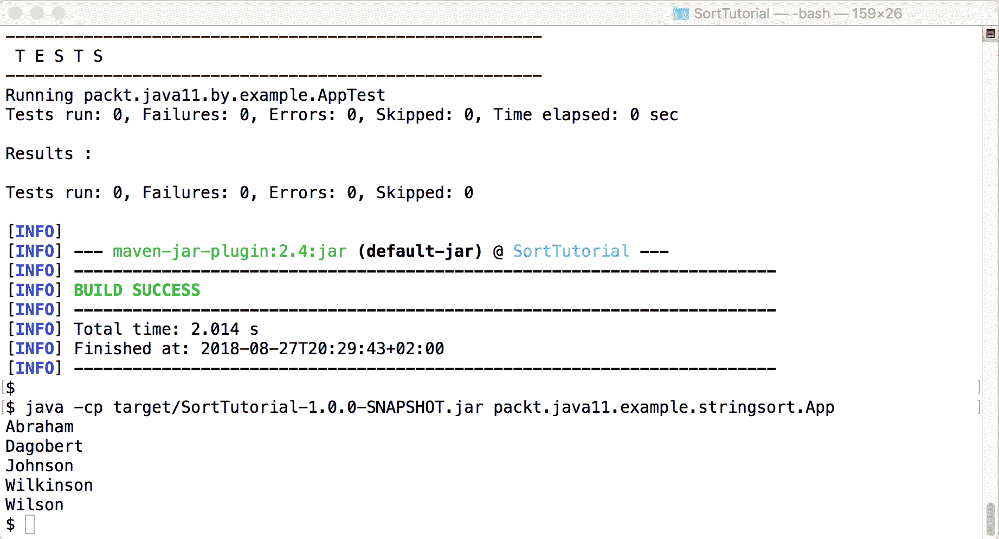
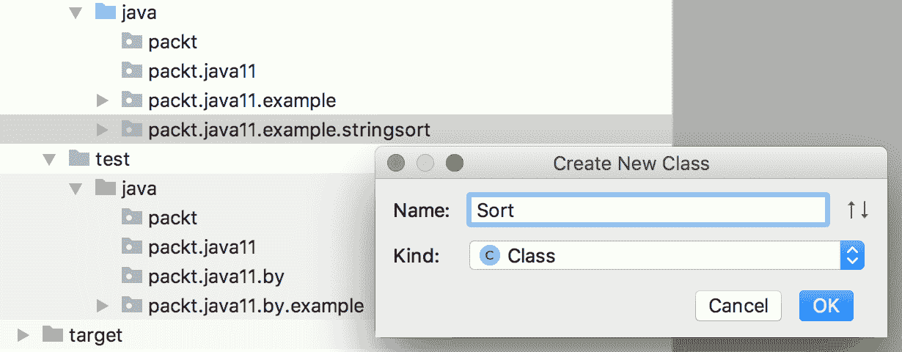
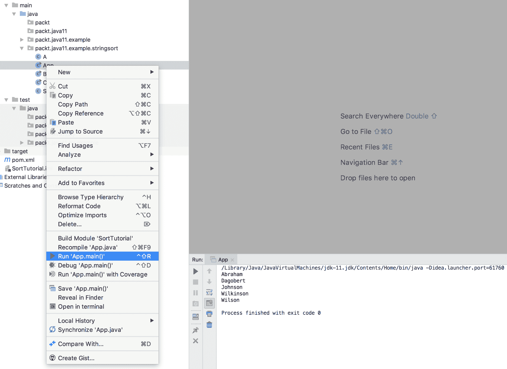
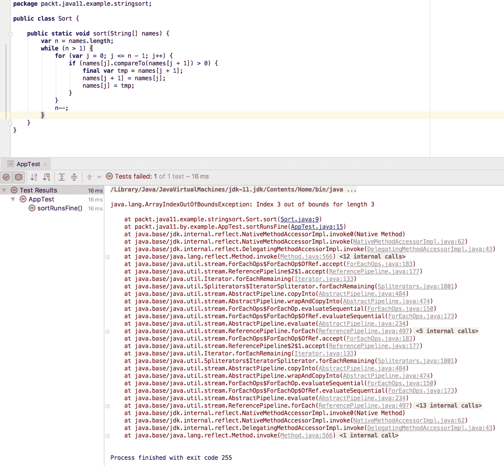

# 第一个真正的 Java 程序-排序名称

在上一章中，我们熟悉了 Java，特别是使用 REPL 工具和交互式地执行一些简单代码。这是一个好的开始，但我们需要更多。在本章中，我们将开发一个简单的程序。以这段代码为例，我们将研究 Java 项目中常用的不同构建工具，并学习 Java 语言的基本特性。

本章将涵盖以下主题：

*   排序问题
*   项目结构和构建工具
*   Make、Ant、Maven 和 Gradle 构建工具
*   Java 语言相关功能的代码示例

# 排序入门

排序问题是工程师处理的最古老的编程任务之一。我们有一套记录，我们知道我们想尽快找到一个具体的。为了找到它，我们按照特定的顺序对记录进行排序，以帮助我们快速找到所需的记录。

例如，我们有学生的名字，他们的标记在一些卡片上。当学生们来到院长的小屋要求成绩时，我们一张接一张地查看所有卡片，找到询问学生的姓名。然而，如果我们按学生的名字按字母顺序排列卡片，那就更好了。当学生进行查询时，我们可以更快地搜索附加在名字上的标记。

我们可以看看中间的卡片；如果它显示了学生的名字，那么我们很高兴找到了名字和标记。如果卡片按字母顺序在学生姓名之前，那么我们将在下半部分继续搜索；否则，我们将检查上半部分。

按照这个方法，我们可以通过几个步骤找到学生的名字。步数不能超过牌包减半的次数。如果我们有两张牌，那么最多是两步。如果是四步，那么我们最多需要三步。如果有八张牌，那么我们可能需要四个步骤，但不能更多。如果有 1000 张卡片，那么我们可能最多需要 11 个步骤，而原始的，未排序的一组将需要 1000 个步骤，作为最坏的情况。也就是说，它大约将搜索速度提高了 100 倍，因此这是值得对卡片进行排序的，除非排序本身花费太多时间。在我们刚才描述的已经排序的集合中查找元素的算法称为[**二分搜索**](https://en.wikipedia.org/wiki/Binary_search_algorithm)。

在许多情况下，对数据集进行排序是值得的，有许多排序算法可以做到这一点。有更简单和更复杂的算法，在许多情况下，更复杂的算法运行得更快。

由于我们关注的是 Java 编程部分，而不是算法锻造，因此在本章中，我们将开发一个 Java 代码来实现一个简单而不是那么快的算法。

# 气泡排序

我们将在本章中实现的算法是众所周知的**气泡排序**。方法非常简单。从卡片的开头开始，比较第一张和第二张卡片。如果第一张卡片的字典顺序比第二张晚，那么交换这两张卡片。然后，对第二位的牌重复这个步骤，然后是第三位，依此类推。威尔逊说，有一张卡片是最新的。当我们得到这张卡片并开始与下一张卡片比较时，我们总是交换它们；这样，威尔逊的卡片就会移动到最后一个地方，在排序之后。我们所要做的就是从一开始就重复这个过程，偶尔再交换一次牌，但这次只换到最后一个元素。这一次，第二个最新的元素将得到它的位置说，威尔金森将在威尔逊之前。如果我们有`n`张牌，我们重复这个*n-1*次，所有的牌都会到达它们的位置。

在接下来的小节中，我们将创建一个实现该算法的 Java 项目。

# 项目结构和构建工具入门

当一个项目比一个类更复杂时，通常是这样，那么定义一个项目结构是明智的。我们必须决定源文件存储在哪里，资源文件（那些包含程序的一些资源但不是 Java 源代码的文件）在哪里，`.class`文件应该由编译器写在哪里，等等。通常，结构主要是目录设置和执行构建的工具的配置。

使用发出`javac`命令的命令行不可能编译复杂的程序。如果我们有 100 个 Java 源文件，编译将需要发出许多`javac`命令。它可以使用通配符来缩短，比如`javac *.java`，或者我们可以编写一个简单的 bash 脚本或一个 BAT 命令文件来实现这一点。首先，它将只有 100 行，每行编译一个源 Java 文件到类文件。然后，我们会意识到这是编译自上次编译以来没有更改的文件所消耗的 CPU 和电源的唯一时间，因此我们可以添加一些 bash 编程来检查源代码和生成的文件的时间戳。最后，我们将得到一个基本上是构建工具的工具。构建工具是现成的；不值得重新设计轮子。

我们将使用一个准备好的构建工具，而不是创建一个。在[可以找到的很少 https://en.wikipedia.org/wiki/List\u of the u build\u automation\u 软件](https://en.wikipedia.org/wiki/List_of_build_automation_software)。在本章中，我们将使用一个名为 Maven 的工具；但是，在深入讨论这个工具的细节之前，我们将研究一些其他工具，您可能会在企业项目中作为 Java 专业人员遇到这些工具。

在接下来的部分中，我们将讨论以下四种构建工具：

*   制造
*   蚂蚁
*   马文
*   格拉德尔

我们将简要地提到 Make，因为它现在不在 Java 环境中使用。然而，Make 是第一个构建工具，现代 Java 构建工具所基于的许多思想都来自于*古老的*`make`。作为一名专业的 Java 开发人员，您还应该熟悉 Make，这样当您碰巧看到 Make 在某个项目中用于某种目的时，您就不会惊慌失措，并且可以知道它是什么以及在哪里可以找到它的详细文档。

Ant 是许多年前第一个广泛用于 Java 的构建工具，现在它仍在许多项目中使用。

Maven 比 Ant 更新，它使用了不同的方法。我们将详细地看一下。Maven 也是 Apache 软件基金会的 java 项目的官方构建工具。我们也将在本章中使用 Maven 作为构建工具。

Gradle 甚至比 Maven 更新，最近它已经开始赶上 Maven 了。我们将在本书后面的章节中更详细地使用这个工具。

# 制造

`make`程序最初创建于 1976 年 4 月，因此这不是一个新工具。它包含在 Unix 系统中，因此此工具在 Linux、macOS X 或任何其他基于 Unix 的系统上都不需要额外安装。另外，这个工具在 Windows 上有许多端口，visualstudio 编译器工具集中包含了一些版本。

Make 与 Java 无关。它是在主要编程语言是 C 时创建的，但它与 C 或任何其他语言无关。`make`是一种语法非常简单的依赖描述语言。与任何其他构建工具一样，`make`由项目描述文件控制。对于 make，此文件包含一个规则集。描述文件通常命名为`Makefile`，但如果描述文件的名称不同，则可以将其指定为`make`命令的命令行选项。

`Makefile`中的规则相互遵循，由一行或多行组成。第一行从第一个位置开始（行首没有制表符或空格），下面的行从制表符字符开始。因此，`Makefile`可能类似于以下代码：

```java
run : hello.jar
    java -cp hello.jar HelloWorld

hello.jar : HelloWorld.class
    jar -cf hello.jar HelloWorld.class

HelloWorld.class : HelloWorld.java
    javac HelloWorld.java
```

这个文件定义了三个所谓的目标：`run`、`hello.jar`和`HelloWorld.class`。要创建`HelloWorld.class`，请在命令提示符处键入以下行：

```java
make HelloWorld.class
```

Make 将查看规则并确定它依赖于`HelloWorld.java`。如果`HelloWorld.class`文件不存在，或者`HelloWorld.java`比 Java 类文件更新，`make`执行下一行写的命令，编译 Java 源文件。如果类文件是在上次修改`HelloWorld.java`之后创建的，则`make`知道不需要运行该命令。

在创建`HelloWorld.class`的情况下，`make`程序的任务很简单。源文件已经存在。如果您发出`make hello.jar`命令，程序会更复杂。`make`命令看到为了创建`hello.jar`，它需要`HelloWorld.class`，它本身也是另一个规则的目标。因此，我们可能不得不创造它。

首先，它以与以前一样的方式开始问题。如果`HelloWorld.class`存在且年龄大于`hello.jar`，则无需做任何事情。如果不存在或更新于`hello.jar`，则需要执行`jar -cf hello.jar HelloWorld.class`命令，尽管在意识到必须执行时不一定执行。`make`程序记得，当创建`HelloWorld.class`所需的所有命令都已成功执行时，必须在将来某个时间执行此命令。因此，它继续以与前面描述的完全相同的方式创建类文件。

一般来说，规则可以具有以下格式：

```java
target : dependencies
    command
```

`make`命令可以使用`make target`命令创建任何目标，首先计算要执行的命令，然后逐个执行。这些命令是在不同进程中执行的 shell 命令，在 Windows 下可能会出现问题，这可能会导致`Makefile`文件的操作系统相互依赖。

注意，`run`目标不是`make`创建的实际文件。目标可以是文件名，也可以只是目标的名称。在后一种情况下，`make`永远不会认为目标是现成的。

由于我们不将`make`用于 Java 项目，因此没有理由深入了解更多细节。此外，我还通过使规则的描述比它应该的更简单来作弊。`make`工具有许多强大的特性，超出了本书的范围。还有几个实现彼此略有不同。你很可能会遇到一个由自由软件基金会 GNU 制造的。当然，就任何 Unix 命令行工具而言，`man`是您的朋友。`man make`命令将在屏幕上显示工具的文档。

以下是关于`make`你应该记住的要点：

*   它以声明的方式定义各个工件（目标）的依赖关系
*   它以命令式的方式定义了创建缺少的工件的操作

这种结构是几十年前发明的，并且一直存在到现在，对于大多数构建工具，您将在接下来的几章中看到。

# 蚂蚁

`ant`构建工具是专门为 2000 年左右的 Java 项目构建的。Java 的目标是成为一种只需一次编写就可以在任何地方运行的语言，这就需要一种也可以在不同环境中使用的工具。尽管`make`在 Unix 机器和 Windows 上都可用，但`Makefiles`并不总是兼容的。在使用制表符时出现了一个小问题，一些编辑器用空格代替了制表符，导致`Makefile`无法使用，但这不是主要原因。`make`引发 Ant 发展的主要问题是命令是 shell 命令。即使`make`程序的实现是兼容的，运行在不同的操作系统上，所使用的命令也常常是不兼容的，这是 make 本身无法改变的。因为`make`发出外部命令来构建目标，开发人员可以自由地使用开发机器上为他们提供的任何外部工具。使用相同操作系统的另一台机器可能没有`make`调用的相同工具集。这破坏了`make`已建项目的可移植性。

同时，Ant 遵循了`make`的主要原则。有些目标可能相互依赖，有些命令需要按适当的顺序执行，以便按照依赖顺序一个接一个地创建目标。依赖关系和命令的描述是 XML（解决了制表符问题），命令是用 Java 实现的（解决了系统依赖关系，以及。。。或多或少）。

由于 Ant 既不是操作系统的一部分，也不是 JDK 的一部分，因此如果您想使用它，就必须单独下载并安装它。

# 安装 Ant

蚂蚁可从其官方网站（[下载 http://ant.apache.org](http://ant.apache.org)）。您可以下载源或预编译版本。最简单的方法是以`tar.gz`格式下载二进制文件。

无论何时从 Internet 下载软件，强烈建议您检查下载文件的完整性。HTTP 协议不包含错误检查，并且可能发生网络错误仍然隐藏或恶意内部代理修改下载的文件的情况。下载站点通常为可下载的文件提供校验和。它们通常是 MD5、SHA1、SHA512 或其他一些校验和。

当我以`tar.gz`格式下载 apacheant1.9.7 版本时，我还打开了导致 MD5 校验和的页面。校验和值为`bc1d9e5fe73eee5c50b26ed411fb0119`：


可以使用以下命令行检查下载的文件：`$ md5 apache-ant-1.9.7-bin.tar.gz``MD5 (apache-ant-1.9.7-bin.tar.gz) = bc1d9e5fe73eee5c50b26ed411fb0119`计算出的 MD5 校验和与网站上的相同，说明文件完整性没有受到损害。在 Windows 操作系统上，没有计算 MD5 摘要的工具。微软提供了一个工具，叫做**文件完整性校验和验证工具**，可以在[上找到 https://support.microsoft.com/en-us/help/841290/availability-and-description-of-the-file-checksum-integrity-verifier-utility](https://support.microsoft.com/en-us/help/841290/availability-and-description-of-the-file-checksum-integrity-verifier-utility)。如果您使用 Linux，可能会发生未安装`md5`或`md5sum`实用程序的情况。在这种情况下，您可以使用`apt-get`命令或 Linux 发行版支持的任何安装工具来安装它。

下载文件后，可以使用以下命令将其分解为子目录：

```java
tar xfz apache-ant-1.9.7-bin.tar.gz
```

创建的子目录是 Ant 的可用二进制分布。通常我会把它移到`~/bin`下，只让我在 OSX 上的用户可以使用，然后把环境变量设为`ANT_HOME`指向这个目录，同时把安装的`bin`目录添加到`PATH`。为此，您应该编辑`~/.bashrc`文件并添加以下行：

```java
export ANT_HOME=~/bin/apache-ant-1.9.7/
export PATH=${ANT_HOME}bin:$PATH
```

然后，重新启动终端应用程序，或者只需键入`. ~/.bashrc`并通过键入以下命令来测试 Ant 的安装：

```java
$ ant
Buildfile: build.xml does not exist!
Build failed
```

如果安装正确，您应该看到前面的错误消息。

# 使用 Ant

当您看到一个由 Ant 构建的项目时，您将看到一个`build.xml`文件。这是项目构建文件，当您检查安装是否正确时，Ant 丢失了这个文件。它可以有任何其他名称，并且您可以将文件名指定为 Ant 的命令行选项，但这是默认文件名，因为`Makefile`是针对`make`的。`build.xml`样本如下：

```java
<project name="HelloWorld" default="jar" basedir=".">
<description>
    This is a sample HelloWorld project build file.
</description>
    <property name="buildDir" value="build"/>
    <property name="srcDir" value="src"/>
    <property name="classesDir" value="${buildDir}/classes"/>
    <property name="jarDir" value="${buildDir}/jar"/>

    <target name="dirs">
        <mkdir dir="${classesDir}"/>
        <mkdir dir="${jarDir}"/>
    </target>

    <target name="compile" depends="dirs">
        <javac srcdir="${srcDir}" destdir="${classesDir}"/>
    </target>

    <target name="jar" depends="dirs,compile">
        <jar destfile="${jarDir}/HelloWorld.jar" basedir="${classesDir}"/>
    </target>
</project>
```

顶层 XML 标记为`project`。每个构建文件都描述一个项目，因此名称。标记有三个可能的属性，如下所示：

*   `name`：定义了项目的名称，一些 IDE 使用它在左侧面板中显示项目名称
*   `default`：当命令行上没有定义目标时，命名要使用的目标
*   `basedir`：定义生成文件中其他目录名计算的初始目录

生成文件可以包含项目的描述以及属性标记中的属性。这些属性可以作为`${`和`}`字符之间任务属性的变量，并在构建过程中发挥重要作用。

目标在目标 XML 标记中定义。每个标记都应该有一个唯一标识生成文件中目标的名称，并且可以有一个指定该目标所依赖的一个或多个其他目标的`depends`标记。如果有多个目标，则这些目标在属性中用逗号分隔。属于目标的任务按照目标依赖链要求的相同顺序执行，方式与我们在`make`中看到的非常相似。

您还可以向 Ant 在使用`-projecthelp`命令行选项时打印的目标添加一个`description`属性。这有助于构建文件的用户知道存在哪些目标，哪些目标做什么。构建文件往往会随着许多目标而变大，当您有 10 个或更多目标时，很难记住每个目标。

`HelloWorld.java`样本项目现安排在以下目录中：

*   `build.xml`：存在于项目的`root`文件夹中
*   `HelloWorld.java`：存在于项目的`src`文件夹中
*   `build/`：此文件夹不存在，将在生成过程中创建
*   `build/classes`和`build/jar`：这些还不存在，将在构建过程中创建

当您第一次启动`HelloWorld`项目的构建时，您将看到以下输出：

```java
$ ant
Buildfile: ~/java_11-fundamentalssources/ch02/build.xml

dirs:
    [mkdir] Created dir:
~/java_11-fundamentalssources/ch02/build/classes
    [mkdir] Created dir:
~/java_11-fundamentalssources/ch02/build/jar

compile:
...
    [javac] Compiling 1 source file to
~/java_11-fundamentalssources/ch02/build/classes

jar:
      [jar] Building jar:
~/java_11-fundamentalssources/ch02/build/jar/HelloWorld.jar

BUILD SUCCESSFUL
Total time: 0 seconds
```

从实际输出中删除一些不重要的行。

Ant 意识到，首先，它必须创建目录，然后它必须编译源代码，最后，它可以将`.class`文件打包成`.jar`文件。现在，您需要记住执行`HelloWorld`应用程序的命令。它已经在第一章列出了。注意，这次 JAR 文件名为`HelloWorld.jar`，它不在当前目录中。您还可以尝试阅读 Ant 的在线文档，并创建一个执行编译和打包程序的目标`run`。

Ant 有一个名为`java`的内置任务，它执行 Java 类的方式与您在终端中键入`java`命令的方式几乎相同。

# 马文

由于 Ant 是为了克服`make`的不足而被创造的，Maven 也是为了克服 Ant 的不足而被创造的。您可能还记得，`make`不能保证构建的可移植性，因为`make`执行的命令是任意 shell 命令，可能是系统特定的。如果所有任务都在类路径上可用，那么只要 Java 在不同的平台上以相同的方式运行，Ant 构建就是可移植的。

蚂蚁的问题有点不同。当您下载一个项目的源代码并想要构建时，命令是什么？您应该让 Ant 列出所有目标，并选择一个似乎最合适的目标。任务的名称取决于创建`build.xml`文件的工程师。有一些惯例，但它们不是严格的规则。

在哪里可以找到 Java 源文件？它们是否在`src`目录中？如果项目是 polyglot，还会有一些 Groovy 或其他编程语言文件吗？那要看情况了。同样，有些团体或公司文化可能会提出一些惯例，但没有一般的最佳行业实践。

使用 Ant 启动新项目时，必须创建编译、测试执行和打包的目标。这是你已经为其他项目做过的事情。在完成第二个或第三个项目后，您只需将以前的`build.xml`复制并粘贴到新项目中。有问题吗？是的，是的。它是复制/粘贴编程，即使只是一些构建文件。

开发人员意识到，使用 Ant 的项目的很大一部分精力都集中在项目构建工具配置上，包括重复性任务。当一个新手加入团队时，他们首先要学习如何配置构建。如果启动了新项目，则必须创建生成配置。如果这是一个重复的任务，那么最好让电脑来做。这通常就是编程的意义所在，不是吗？

Maven 处理构建问题的方式有点不同。我们想要构建 Java 项目。有时候，一些 Groovy*或*Jython 之类的东西，但它们也是 JVM 语言；因此，说我们要构建 Java 项目并不是一个很大的限制。Java 项目包含 Java 文件，有时是一些其他编程语言的源文件、资源文件，通常就是这样。Ant 可以做任何事情，但是我们不想仅仅用构建工具做任何事情。我们想建立项目。

好吧，在我们限制自己并且接受了我们不需要一个可以用于任何事情的构建工具之后，我们可以继续。我们可以要求源文件在`src`目录下。有些文件是操作代码所需要的，有些文件包含一些测试代码和数据。因此，我们将有两个目录，`src/test`和`src/main`。Java 文件在`src/main/java`和`src/test/java`中。资源文件在`src/main/resources`和`src/test/resources`下。

如果你想把你的源文件放在别的地方，那就不要。我是认真的。这是可能的，但我甚至不告诉你怎么做。没人会这么做。我甚至不知道为什么 Maven 能做到这一点。每当您看到一个使用 Maven 作为构建工具的项目时，源代码都是这样组织的。不需要理解项目的构建工程师所设想的目录结构。总是一样的。

目标和任务如何？对于所有基于 Maven 的项目，它们也是相同的。除了编译、测试、打包或部署 Java 项目之外，您还想对它做些什么？Maven 为我们定义了这些项目生命周期。当您想使用 Maven 作为构建工具来编译项目时，您必须键入`$ mvn compile`来编译项目。你甚至可以在了解项目的实际情况之前就这么做。

由于我们有相同的目录结构和相同的目标，导致目标的实际任务也都是相同的。当我们创建一个 Maven 项目时，我们不必描述构建过程必须做什么以及它必须如何做。我们将不得不描述该项目，只有部分是具体项目。

Maven 项目的构建配置在 XML 文件中给出。这个文件的名字通常是`pom.xml`，应该在项目的`root`目录下，这个目录应该是启动 Maven 时的当前工作目录。**POM**代表**项目对象模型**，对项目进行分层描述。源目录、打包和其他内容都在所谓的超级 POM 中定义。这个 POM 是 Maven 程序的一部分。POM 定义的任何内容都会覆盖超级 POM 中定义的默认值。当一个项目有多个模块时，pom 被安排成一个层次结构，并且它们从父级到模块都继承了配置值。由于我们将使用 Maven 来开发排序代码，我们将在后面看到更多细节。

# 安装 Maven

Maven 既不是操作系统的一部分，也不是 JDK 的一部分。它必须以与 Ant 非常相似的方式下载和安装。您可以从 Maven 的官方网站（[下载 https://maven.apache.org/](https://maven.apache.org/)）下载部分。目前，最新的稳定版本是 3.5.4。当您下载它时，实际版本可能会有所不同；相反，请使用最新的稳定版本。您可以下载源代码或预编译版本。最简单的方法是下载`tar.gz`格式的二进制文件。

我不能不提请您注意使用校验和检查下载完整性的重要性。我在*安装 Ant*一节中详细介绍了该方法。

下载文件后，可以使用以下命令将其分解为子目录：

```java
tar xfz apache-maven-3.5.4-bin.tar.gz
```

创建的子目录是 Maven 的可用二进制分布。通常我会在`~/bin`下移动，只对 OSX 上的用户使用，之后，您应该将安装的`bin`目录添加到`PATH`。为此，您应该编辑`~/.bashrc`文件并将以下行添加到其中：

```java
export M2_HOME=~/bin/apache-maven-3.5.4/
export PATH=${M2_HOME}bin:$PATH
```

然后，重新启动终端应用程序，或者只需键入`. ~/.bashrc`并测试 Maven typing 的安装，如下所示：

```java
$ mvn -v
Apache Maven 3.5.4 (1edded0938998edf8bf061f1ceb3cfdeccf443fe; 2018-06-17T20:33:14+02:00)
Maven home: /Users/verhasp/bin/apache-maven-3.5.4
Java version: 11-ea, vendor: Oracle Corporation, runtime: /Library/Java/JavaVirtualMachines/jdk-11.jdk/Contents/Home
Default locale: en_HU, platform encoding: UTF-8
OS name: "mac os x", version: "10.13.6", arch: "x86_64", family: "mac" 
```

您应该会在屏幕上看到类似的消息，其中显示已安装的 Maven 版本和其他信息。

# 使用 Maven

与 Ant 不同，Maven 帮助您创建新项目的框架。为此，必须键入以下命令：

```java
$ mvn archetype:generate
```

Maven 将首先从网络上下载实际可用的项目类型，并提示您选择要使用的项目类型。这种方法似乎是一个好主意，而 Maven 是新的。当我第一次启动 Maven 时，列出的项目数量大约在 10 到 20 个之间。今天，我在写这本书的时候，列出了 1635 种不同的原型。这个数字似乎更像是一个历史日期（法国科学院的章程），而不是不同原型的可用大小列表。但是，不要惊慌失措。Maven 在请求您选择时提供一个默认值。违约对`HelloWorld`有利，我们选择。

```java
Choose a number: 817: 
```

安装时实际数量可能不同。不管是什么，接受建议，按*键进入*。之后，Maven 会向您询问项目的版本：

```java
Choose version:
1: 1.0-alpha-1
2: 1.0-alpha-2
3: 1.0-alpha-3
4: 1.0-alpha-4
5: 1.0
6: 1.1
Choose a number: 6: 5
```

选择列为编号`5`的`1.0`版本。Maven 接下来要求的是项目的组 ID 和工件 ID。我们将在后面讨论的依赖关系管理使用这些。我根据书和出版商选择了一个组 ID。这个项目的工件是`SortTutorial`，因为我们将在这个项目中开始我们的章节示例。

```java
Define value for property 'groupId': : packt.java11.example
Define value for property 'artifactId': : SortTutorial
```

下一个问题是项目的当前版本。我们已经选择了`1.0`，Maven 提供`1.0-SNAPSHOT`。在这里，我选择了`1.0.0-SNAPSHOT`，因为我更喜欢语义版本。

```java
Define value for property 'version':  1.0-SNAPSHOT: : 1.0.0-SNAPSHOT
```

语义版本控制，定义于[这个页面](http://semver.org/)是一种版本控制方案，建议主要*、*次要*和*补丁版本号使用三位版本号 M.M.p。这对图书馆非常有用。如果自上一版本以来只有一个 bug 修复，那么您将增加最后一个版本号。当新版本还包含新功能，但库与以前的版本兼容时，您将增加次要数字；换句话说，任何使用旧版本的程序仍然可以使用新版本。当新版本与前一版本有显著差异时，主要版本号会增加。在应用程序的情况下，没有使用应用程序 API 的代码；因此，次要版本号没有那么重要。不过，这并没有什么坏处，而且事实证明，在应用程序中发出较小变化的信号通常是有用的。我们将在最后一章讨论如何对软件进行版本化。

Maven 将带有`-SNAPSHOT`后缀的版本处理为非发布版本。在开发代码时，我们将有许多版本的代码，所有版本都具有相同的快照版本号。另一方面，非快照版本号只能用于单个版本：

```java
Define value for property 'package':  packt.java11.example: :
```

程序框架生成的最后一个问题是 Java 包的名称。默认值是我们为`groupId`提供的值，我们将使用它。使用其他东西是一个罕见的例外。

当我们指定了所有需要的参数后，最后的请求是确认设置：

```java
Confirm properties configuration:
groupId: packt.java11.example
artifactId: SortTutorial
version: 1.0.0-SNAPSHOT
package: packt.java11.example
 Y: : Y
```

进入`Y`后，Maven 会生成项目所需的文件，并显示此报告：

```java
[INFO] -----------------------------------------------------------
[INFO] Using following parameters for creating project from Old (1.x)
Archetype: maven-archetype-quickstart:1.0
[INFO] -----------------------------------------------------------
[INFO] Parameter: basedir, Value: .../mavenHelloWorld
[INFO] Parameter: package, Value: packt.java11.example
[INFO] Parameter: groupId, Value: packt.java11.example
[INFO] Parameter: artifactId, Value: SortTutorial
[INFO] Parameter: packageName, Value: packt.java11.example
[INFO] Parameter: version, Value: 1.0.0-SNAPSHOT
[INFO] *** End of debug info from resources from generated POM ***
[INFO] project created from Old (1.x) Archetype in dir:
.../mavenHelloWorld/SortTutorial
[INFO] -----------------------------------------------------------
[INFO] BUILD SUCCESS
[INFO] -----------------------------------------------------------
[INFO] Total time: 01:27 min
[INFO] Finished at: 2016-07-24T14:22:36+02:00
[INFO] Final Memory: 11M/153M
[INFO] -----------------------------------------------------------
```

您可以查看以下生成的目录结构：



您还可以看到，它生成了以下三个文件：

*   `SortTutorial/pom.xml`：包含**项目对象模型**
*   `SortTutorial/src/main/java/packt/java11/example/App.java`：这包含一个`HelloWorld`示例应用程序
*   `SortTutorial/src/test/java/packt/java11/example/AppTest.java`：它包含一个利用`junit4`库的单元测试框架

我们将在下一章讨论单元测试。现在，我们将重点讨论排序应用程序。由于 Maven 非常友好，并为应用程序生成了一个示例类，因此我们可以编译并运行它，而无需实际编码，只是为了看看如何使用 Maven 构建项目。通过发出`cd SortTutorial`将默认目录更改为`SortTutorial`，并发出以下命令：

```java
$ mvn package
```

我们将得到以下输出：



Maven 自动启动、编译和打包项目。如果没有，请阅读下一个信息框。

当您第一次启动 Maven 时，它会从中央存储库下载很多依赖项。这些下载需要时间，时间值会在屏幕上报告，并且这些值对于不同的运行可能不同。实际输出可能与您在前面代码中看到的不同。Maven 使用 Java 版本 1.5 的默认设置编译代码。这意味着生成的类文件与 Java1.5 版本兼容，而且编译器只接受 Java1.5 中已有的语言结构。后来的 Maven 编译器插件版本将此行为更改为使用 1.6 作为默认版本。如果我们想使用较新的语言特性，并且在本书中，我们使用了很多这些特性，`pom.xml`文件应该被编辑为包含以下行：

```java
<build>
    <plugins>
      <plugin>
        <groupId>org.apache.maven.plugins</groupId>
        <artifactId>maven-compiler-plugin</artifactId>
        <version>3.8.0</version>
        <configuration>
            <source>1.11</source>
            <target>1.11</target>
            <release>11</release>
        </configuration>
      </plugin>
    </plugins>
  </build>
```

当使用 Java11 对 Maven 的默认设置时，它变得更加复杂，因为 Java9 和更高版本不生成类格式，也不限制早于 Java1.6 的源代码兼容性。这就是编译器插件更改其默认行为的原因。

现在，可以使用以下命令启动代码：

```java
$ java -cp target/SortTutorial-1.0.0-SNAPSHOT.jar packt.java11.example.App
```

您可以在以下屏幕截图中看到示例运行的结果：



# 格拉德尔

蚂蚁和马文是两个世界，使用一个或另一个可能导致在互联网论坛上激烈的辩论。Ant 给开发人员自由创建符合他们口味的构建过程。Maven 限制团队使用更标准的构建过程。一些特殊的过程与任何标准构建不匹配，但有时在某些环境中需要，很难使用 Maven 实现。在 Ant 中，您可以使用内置任务编写几乎任何脚本，几乎与编程 bash 的方式相同。使用 Maven 并不是那么简单，而且它通常需要编写一个插件。即使编写插件不是火箭科学，开发人员通常也喜欢以更简单的方式编写脚本。我们有两种方法，两种思维方式和风格，而不是一个工具来满足所有的需求。毫不奇怪，当 Java 技术开发时，一个新的构建工具正在出现。

Gradle 试图利用两个世界中最好的，利用 Maven 和 Ant 最初开发时所没有的技术。

Gradle 有内置目标和生命周期，但同时，您也可以编写自己的目标。您可以像使用 Maven 一样配置项目，而不需要编写任务脚本来完成，但是同时，您也可以像 Ant 那样编写自己的目标脚本。更重要的是，Gradle 集成 Ant，因此为 Ant 实现的任何任务都可以用于 Gradle。

Maven 和 Ant 使用 XML 文件来描述构建。今天，XML 已经成为过去的技术。我们仍然使用它，开发人员应该能够熟练地处理、读取和编写 XML 文件，但现代工具不使用 XML 进行配置。新的、新奇的格式，比如 JSON，更受欢迎。格拉德尔也不例外。Gradle 的配置文件使用基于 Groovy 的**领域专用语言**（**DSL**）。这种语言对于程序员来说更具可读性，并且给了编程构建过程更多的自由。这也是格拉德尔的危险所在。

将强大的 JVM 语言 Groovy 交给开发人员来创建构建工具，这给了开发人员创建复杂构建过程的自由和诱惑，这在一开始似乎是个好主意，但后来可能会被证明过于复杂和困难，因此维护成本高昂。这正是 Maven 最初实现的原因。

在进入另一个激烈而毫无意义的辩论的领域之前，我必须停下来。Gradle 是一个非常强大的构建工具。你应该小心使用它，就像你会用武器一样不要射你的腿。

# 安装 Gradle

要安装 Gradle，您必须从[下载编译的二进制文件 https://gradle.org/gradle-download/](https://gradle.org/gradle-download/)网站。

再次强调使用校验和检查下载完整性的重要性。我已经在 Ant 安装一节中给出了一个详细的方法。不幸的是，Gradle 网站没有提供可下载文件的校验和值。

Gradle 以 ZIP 格式下载。要解压缩文件，必须使用 unzip 命令：

```java
$ unzip gradle-4.9-bin.zip
```

创建的子目录是 Gradle 的可用二进制分布。通常，我会把它移到`~/bin`下，使它只对我在 OSX 上的用户可用。之后，您应该将安装的`bin`目录添加到`PATH`中。

为此，您应该编辑`~/.bashrc`文件并添加以下行：

```java
export GRADLE_HOME=~/bin/gradle-4.9/
export PATH=${GRADLE_HOME}bin:$PATH
```

然后，重新启动终端应用程序，或者只需键入`. ~/.bashrc`并通过键入以下内容来测试 Gradle 的安装：

```java
$ gradle -version
```

我们将得到以下输出：


# 与 Maven 建立项目

为了启动项目，我们将使用目录结构和`pom.xml`，它是由 Maven 自己创建的，当我们使用以下命令行启动时：

```java
$ mvn archetype:generate
```

它创建了目录、`pom.xml`文件和`App.java`文件。现在，我们将通过创建新文件来扩展这个项目。我们将首先在`packt.java11.example.stringsort`包中对排序算法进行编码：


当我们在 IDE 中创建新包时，编辑器会自动在已经存在的`src/main/java/packt/java11/example`目录下创建`stringsort`子目录：



使用 IDE 创建新的`Sort`类也会自动在这个目录中创建一个名为`Sort.java`的新文件，它会填充类的骨架：

```java
package packt.java11.example.stringsort;

public class Sort {
}
```

我们现在将有包含以下代码的`App.java`：

```java
package packt.java11.example;

public class App {
    public static void main(String[] args) {
        System.out.println("Hello, World!");
    }
}
```

Maven 将其创建为初始版本。我们将编辑此文件以提供排序算法可以排序的示例列表。我建议您使用 IDE 来编辑文件，并编译和运行代码。IDE 提供了一个快捷菜单来启动代码，这比在终端中键入命令要简单一些。通常，建议您熟悉 IDE 特性，以节省时间并避免重复性任务，例如键入终端命令。专业开发人员几乎完全使用命令行来测试命令行功能，并尽可能使用 IDE：



# 分类编码

Maven 和 IDE 为排序程序创建了文件。它们构成了我们代码的骨架，现在是时候在它们身上长些肌肉让它移动了。我们花了相当长的时间通过访问不同的构建工具来设置项目，只是为了学习如何编译代码。

我希望这不会让你分心太多，但无论如何，我们应该看到一些真正的代码。

首先，我们将为排序代码创建代码，然后是调用排序的代码。调用排序的代码是一种测试代码。为了简单起见，我们现在将简单地使用一个`public static void main()`方法来启动代码。我们将在后面的章节中使用测试框架。

目前，排序代码如下所示：

```java
var n = names.length;
while (n > 1) {
    for (var j = 0; j < n - 1; j++) {
        if (names[j].compareTo(names[j + 1]) > 0) {
            final var tmp = names[j + 1];
            names[j + 1] = names[j];
            names[j] = tmp;
        }
    }
    n--;
}
```

这是进行排序的类。这个类中只有一个方法进行排序。该方法的参数是一个包含字符串的数组，该方法对该数组进行排序。方法没有返回值。这在使用伪类型`void`的声明中表示。方法使用其参数执行某些任务，并且可能返回一个值。方法的参数是按值传递的，这意味着方法不能修改作为参数传递的变量。但是，它可以修改参数包含的对象。在本例中，将修改数组并对其进行排序。另一方面，`actualNames`变量将指向同一数组，`sort()`方法无法使该变量指向不同的数组。

这个类中没有`main()`方法，这意味着它不能单独从命令行启动。这个类只能从其他类中使用，因为每个 Java 程序都应该有一个类，该类具有我们单独创建的`public static void main()`方法。

我也可以在类中放入一个`main()`方法，使其可执行，但这不是一个好的做法。真正的程序是由许多类组成的，一个类不应该做很多事情。恰恰相反。*单一责任原则*说一个类应该负责一件事；因此，`class sort`进行排序。执行应用程序是一个不同的任务，因此它必须在不同的类中实现。

通常，我们不实现包含`main()`方法的类；框架提供了它。例如，编写在 servlet 容器中运行的 servlet 需要包含实现`javax.servlet.Servlet`接口的类。在这种情况下，程序似乎没有`main()`方法。servlet 容器的实际实现并不需要。Java 命令行启动容器，容器在需要时加载 servlet。

在下面的示例代码中，我们实现了包含`main()`方法的`App`类：

```java
package packt.java11.example.stringsort;

public class App {
    public static void main(String[] args) {
        var actualNames = new String[]{
                "Johnson", "Wilson",
                "Wilkinson", "Abraham", "Dagobert"};
        Sort.sort(actualNames);
        for (final String name : actualNames) {
            System.out.println(name);
        }
    }
}
```

该代码包含一个初始化为包含常量值的字符串数组，创建一个新的`Sort`类实例，调用`sort()`方法，然后将代码打印到标准输出。

在实际的程序中，我们几乎从来没有在程序代码中有这样的常量；我们将它们放入资源文件中，并有一些代码来读取实际值。这将代码与数据分离，简化维护，消除了仅更改数据时意外修改代码结构的风险。同样，我们几乎永远不会使用`System.out`将任何内容写入标准输出。通常，我们将使用不同来源的日志记录可能性。有不同的库提供日志功能，日志也可以从 JDK 本身获得。

目前，我们将重点关注简单的解决方案，以避免由于大量不同的库和工具而分散您对 Java 的关注。在接下来的部分中，我们将介绍我们在编码算法时使用的 Java 语言构造。首先，我们将一般地看它们，然后，在更详细的地方。这些语言特性彼此不独立，因此，解释首先是一般性的，我们将在下面的小节中详细介绍。

# 理解算法和语言结构

在本章的开头对算法进行了说明。实现在`sort()`方法内`Sort`类中，仅由几行组成：

```java
var n = names.length;
while (n > 1) {
    for (var j = 0; j < n - 1; j++) {
        if (names[j].compareTo(names[j + 1]) > 0) {
            final var tmp = names[j + 1];
            names[j + 1] = names[j];
            names[j] = tmp;
        }
    }
    n--;
}
```

`n`变量在排序开始时保持数组的长度。Java 中的数组总是有一个给定长度的属性，它被称为`length`。当我们开始排序时，我们将从数组的开始到它的末尾，正如您可能记得的，最后一个元素 Wilson 将在第一次迭代中到达最后一个位置。后续迭代将更短，因此，变量`n`将减少。

# 阻碍

Java 中的代码是在代码块中创建的。任何介于`{`和`}`字符之间的字符都是块。在前面的示例中，方法的代码是一个块。它包含命令，其中一些命令，比如`while`循环，也包含一个块。在该块中，有两个命令。其中一个是一个`for`循环，同样是一个块。虽然我们可以使用单个表达式来形成循环体，但我们通常使用块。我们将在几页中详细讨论循环。

正如我们在前面的示例中所看到的，循环可以嵌套，因此，`{`和`}`字符形成成对。一个块可以在另一个块内，但两个块不能重叠。当代码包含一个`}`字符时，它将关闭最后打开的块。

# 变量

在 Java 中，就像在几乎所有编程语言中一样，我们使用变量。Java 中的变量是类型化的。这意味着变量可以保存单一类型的值。变量不可能在程序中的某个点上保存`int`类型，然后保存`String`类型。声明变量时，变量的类型写在变量名前面。当局部变量在声明它的行上获得初始值时，可以使用名为`var`的特殊保留类型。它表示与赋值运算符右侧表达式的类型完全相同的类型。

代码的外观如下：

```java
var n = names.length;
```

也可以这样写：

```java
int n = names.length;
```

这是因为表达式`names.length`具有`int`类型。此功能称为局部变量类型推断，因为类型是从右侧推断的。如果变量不是某个方法的局部变量，则不能使用此选项。

当我们声明一个字段（一个在类的方法体之外的类级别上的变量，而不是在初始化程序块或构造器中）时，我们必须指定我们想要的变量的确切类型。

变量也具有可见性范围。方法中的局部变量只能在定义它们的块内使用。变量可以在方法内部使用，也可以属于类或对象。为了区分两者，我们通常称之为变量字段。

# 类型

每个变量都有一种类型。在 Java 中，主要有两组类型：原始类型和引用类型。原始类型是预定义的，不能定义或创建新的原始类型。原始类型有八种：`byte`、`short`、`int`、`long`、`float`、`double`、`boolean`、`char`。

前四种类型`byte`、`short`、`int`和`long`是有符号数字整数类型，能够存储 8 位、16 位、32 位和 64 位的正数和负数。

`float`和`double`类型以 ieee754 浮点格式存储 32 位和 64 位的浮点数。

`boolean`类型是一个原始类型，只能是`true`或`false`。

`char`类型是存储单个 16 位 Unicode 字符的字符数据类型。

对于每个原始类型，都有一个对应的类。类的实例可以存储相同类型的值。当一个原始类型必须转换为匹配的类类型时，它是自动完成的。它被称为自动装箱。这些类型是`Byte`、`Short`、`Integer`、`Long`、`Float`、`Double`、`Boolean`和`Character`。以以下变量声明为例：

```java
Integer a = 113;
```

这将值`113`（即`int`数字）转换为`Integer`对象。

这些类型是运行时的一部分，也是语言的一部分。

有一个特殊的类，叫`String`。此类型的对象包含字符。`String`没有原始对应物，但我们使用它很多次，就像是原始类型，它不是。它在 Java 程序中无处不在，并且有一些语言构造，例如直接与这种类型一起工作的字符串连接。

原始类型和对象之间的主要区别在于原始类型不能用来调用它们的方法。它们只是价值观。当我们创建并发程序时，它们不能用作锁。另一方面，它们消耗更少的内存。内存消耗与其对速度的影响之间的差异非常重要，尤其是当我们有一个值数组时。

# 数组

根据它们的声明，变量可以是原始类型，也可以包含对对象的引用。一种特殊的对象类型是数组。当一个变量持有一个数组的引用时，它可以用`[`和`]`字符以及一个由 0 组成的整数值或一个小于数组长度的正数来索引，以访问数组的某个元素。当数组中的元素也是数组时，Java 也支持多维数组。在 Java 中数组是从零开始索引的。在运行时检查索引不足或索引过度，结果是异常。

异常是一种特殊情况，它会中断正常的执行流并停止代码的执行或跳到最近的封闭的`catch`语句。我们将在下一章讨论异常以及如何处理它们。

当一个代码有一个原始类型的数组时，该数组包含内存槽，每个槽都保存该类型的值。当数组有一个引用类型时，换句话说，当它是一个对象数组时，那么数组元素就是对对象的引用，每个元素都引用该类型的一个实例。例如，在`int`的情况下，数组的每个元素是 32 位的，即 4 字节。如果数组是一种类型`Integer`，那么元素就是对对象、指针的引用，也就是说，使用 64 位 JVM 通常是 64 位的，32 位 JVM 通常是 32 位的。除此之外，内存中某处还有一个包含 4 字节值的`Integer`对象，还有一个可能高达 24 字节的对象头。

标准中没有定义管理每个对象所需的额外信息的实际大小。在 JVM 的不同实现上可能会有所不同。实际的编码，甚至环境中代码的优化，不应该依赖于实际的大小。但是，开发人员应该意识到这种开销是存在的，每个对象的开销大约在 20 字节左右。对象在内存消耗方面是昂贵的。

内存消耗是一个问题，但还有其他问题。当程序处理大量数据并且工作需要数组中的连续元素时，CPU 会将一块内存加载到处理器缓存中。这意味着 CPU 可以连续访问阵列中速度更快的元素。如果数组是原始类型，那么它是快速的。如果数组是某个类类型，那么 CPU 可能需要访问内存，通过数组中的引用获取数组元素的实际值。这可能要慢 50 倍。

# 表达

Java 中的表达式与其他编程语言非常相似。可以使用类似于 C 语言或 C++语言的操作符。具体如下：

*   一元前缀和后缀递增运算符（`--`和`++`在变量前后）
*   一元符号（`+`和`-`运算符
*   逻辑（`!`）和位（`~`取反
*   乘法（`*`）、除法（`/`）和模（`%`）
*   加减法（`+`和`-`再次，但这次是二进制运算符）
*   移位运算符按位移动值，有左移位（`<<`）、右移位（`>>`）和无符号右移位（`>>>`）
*   比较运算符为产生`boolean`值的`<`、`>`、`<=`、`>=`、`==`、`!=`和`instanceof`
*   有位或（`|`）和（`&`）、异或（`^`）运算符，以及类似的逻辑或（`||`）和（`&&`运算符

对逻辑运算符求值时，将对其进行快捷方式求值。这意味着，只有在无法从左操作数的结果中识别结果时，才对右操作数求值。

三元运算符也类似于 C 上的运算符，根据某种条件从表达式中选择-`condition ? expression 1 : expression 2`。通常，三元运算符没有问题，但有时必须小心，因为有一个复杂的规则控制类型转换，以防两个表达式的类型不同。最好有两个相同类型的表达式。

最后，还有一个赋值运算符（`=`），它将表达式的值赋给变量。对于每个二元运算符，都有一个赋值版本，它将`=`与一个二元运算符结合起来，执行一个涉及右操作数的操作，并将结果赋给左操作数，左操作数必须是一个变量。它们是`+=`、`-=`、`*=`、`/=`、`%=`、`&=`、`^=`、`|=`、`<<=`、`>>=`和`>>>=`。

运算符具有优先权，可以像往常一样用括号覆盖。

表达式的一个重要部分是调用方法。静态方法可以通过类的名称和方法的名称点分隔来调用。例如，要计算 1.22 的正弦值，我们可以编写以下代码行：

```java
double z = Math.sin(1.22);
```

这里，`Math`是包`java.lang`中的类。调用`sin`方法时不使用`Math`的实例。这个方法是`static`，除了类`Math`中提供的方法之外，我们不太可能需要任何其他的实现。

可以使用实例和方法名调用非静态方法，方法名之间用点分隔。例如，考虑以下代码：

```java
System.out.println("Hello World");
```

该代码使用通过`System`类中的静态字段随时可用的`PrintStream`类实例。这个变量叫做`out`，当我们编写代码时，我们必须引用它为`System.out`。`println`方法是在`PrintStream`类中定义的，我们在`out`变量引用的对象上调用它。这个例子还显示静态字段也可以通过类的名称和用点分隔的字段来引用。类似地，当我们需要引用非静态字段时，我们可以通过类的实例来实现。

在同一个类中定义的静态方法可以在没有类名的情况下调用，这些静态方法是从调用它的地方或*继承的*。调用在同一类中定义的或被继承的非静态方法可以在没有显式实例表示法的情况下调用。在本例中，实例是执行所在的当前对象。这个对象也可以通过`this`关键字获得。类似地，当我们使用代码所在的同一类的字段时，我们只使用名称。对于静态字段，我们所在的类是默认的。对于非静态字段，实例是由`this`关键字引用的对象。

您还可以使用`import static`语言特性将静态方法导入到代码中，在这种情况下，您可以调用不带类名的方法。

方法调用的参数用逗号分隔。方法和方法参数传递是我们稍后将讨论的一个重要主题。

# 循环

让我们再次看看字符串排序的代码。`while`循环中的`for`循环将遍历从第一个元素（在 Java 中用零索引）到最后一个元素（用`n-1`索引）的所有元素。一般来说，这个`for`循环与 C 中的语法相同：

```java
for( initial expression ; condition ; increment expression )
  block
```

首先，计算初始表达式。它可能包含变量声明，如我们的示例所示。前例中的`j`变量仅在循环块内可见。之后，将评估条件，在执行块之后，执行增量表达式。只要条件为真，循环就会重复。如果在执行初始表达式之后条件为 false，则循环根本不会执行。该块是一个用分号分隔的命令列表，并在`{`和`}`字符之间封闭。

封闭块 Java 代替了`{`和`}`，它允许您在`for`循环头之后使用单个命令。在`while`循环的情况下也是如此，对于`if...else`构造也是如此。实践表明，这不是专业人士应该使用的。专业代码总是使用大括号，即使只有一个命令块在适当的位置。这就避免了悬空`else`问题，通常使代码更具可读性。这类似于许多 C 语言。它们中的大多数都允许在这些地方使用单个命令，而专业程序员为了可读性的目的避免在这些语言中使用单个命令。讽刺的是，在这些地方，唯一严格要求使用`{`和`}`大括号的语言是 Perl—一种因代码不可读而臭名昭著的语言。

`for (var j = 0; j < n - 1; j++) {`样品回路从零开始，进入`n-2`。在这种情况下，写入`j < n-1`与`j <= n-2`相同。我们将限制`j`在数组结束之前停止在循环中，因为我们通过比较和有条件地交换`j`和`j+1`索引的元素，达到了索引`j`之外的范围。如果我们进一步讨论一个元素，我们将尝试访问数组中不存在的元素，并且它会导致运行时异常。尝试将回路条件修改为`j < n`或`j <= n-1`，系统会得到以下错误信息：



Java 的一个重要特性是运行时检查内存访问，并在数组索引错误的情况下抛出异常。在过去的好日子里，当我们用 C 语言编写代码时，我们经常会遇到无法解释的错误，这些错误使我们的代码在很久以后停止运行，并且与真正的错误所在的代码位置完全不同。C 中的数组索引悄悄地损坏了内存。一旦你犯了错误，Java 就会阻止你。它遵循同样应该在代码中使用的 fail-fast 方法。如果出了问题，程序就会失败。任何代码都不应该试图忍受或克服来自编码错误的错误。在编码错误造成更大的损害之前，应该先修复它们。

Java 中还有另外两个循环构造，`while`循环和`do`循环。下面的示例包含一个`while`循环。只要阵列中至少有两个元素可能需要交换，就可以运行外部循环：

```java
while (n > 1) {
```

`while`循环的一般语法和语义非常简单，如下代码所示：

```java
while ( condition ) block
```

只要条件是`true`，就重复执行该块。如果条件在循环的最开始不是真的，那么根本不执行块。`do`循环也是类似的，但是它在每次执行块之后检查条件：

```java
do block while( condition );
```

出于某种原因，程序员很少使用`do`循环。

# 有条件执行

排序的核心是循环内的条件和值交换。

```java
if (names[j].compareTo(names[j + 1]) > 0) {
                    final String tmp = names[j + 1];
                    names[j + 1] = names[j];
                    names[j] = tmp;
                }
```

Java 中只有一个条件命令，`if`命令。其格式如下：

```java
if( condition ) block else block
```

代码结构的含义非常简单。如果条件为`true`，则执行第一块，否则执行第二块。`else`关键字和第二个块是可选的。创建`else`并在其后面创建一个块是可选的。如果条件为`false`时没有要执行的内容，那么我们就不创建`else`部分。如果用`j`索引的数组元素在排序顺序上晚于元素`j+1`，那么我们交换它们；但是，如果它们已经在排序中，则与它们无关。

为了交换这两个数组元素，我们使用了一个名为`tmp`的临时变量。该变量的类型为`String`，声明为`final`。`final`关键字有不同的含义，这取决于它在 Java 中的使用位置。这可能会让初学者感到困惑，除非你像现在一样被警告过。`final`类或方法与`final`字段完全不同，后者又不同于`final`局部变量。

注意，这次我们使用显式类型`String`来声明变量。我们可以用`var`和`final var`来代替，这样就可以推断出相同的类型。这里使用显式类型的唯一原因是为了演示。

# 最终变量

在我们的例子中，`tmp`是一个`final`局部变量。这个变量的作用域被限制在`if`语句后面的块中，在这个块中，这个变量只得到一个值。该块在代码执行期间执行多次，每次变量进入作用域时，它都会得到一个值。但是，此值不能在块内更改，并且在块外不存在。这可能有点混乱。您可以将其视为每次执行块时都有一个新的`tmp`。变量被声明；首先它是未定义的，然后它得到一个值。

最终的局部变量不需要获得声明它们的值。您可以稍后为一个`final`变量赋值。重要的是，不应该有一个代码执行为之前已经赋值的`final`变量赋值。如果存在重新分配`final`变量的可能性，编译器会检查它，并且不会编译代码。编译器还检查在未定义变量时不应使用局部变量（不仅仅是`final`变量）的值。

将变量声明为`final`通常是为了简化代码的可读性。当您在代码中看到一个声明为`final`的变量时，您可以假设该变量的值不会改变，并且该变量的含义在方法中使用的任何地方都是相同的。当你试图修改一些变量时，它也会帮助你避免一些错误，IDE 会立即对此提出抱怨。在这种情况下，很可能是一个很早就发现的编程错误。

原则上，可以编写一个所有变量都是`final`的程序。通常，将所有可声明为`final`的`final`变量声明为`final`是一种好的做法，如果某些变量可能未声明为`final`，则尝试找到某种方法对该方法进行稍微不同的编码。

如果您需要引入一个新变量来实现这一点，可能意味着您使用了一个变量来存储两个不同的东西。这些东西属于同一类型，在不同的时间存储在同一个变量中，但从逻辑上讲，它们仍然是不同的东西。不要试图优化变量的使用。永远不要使用变量，因为您的代码中已经有一个可用的相同类型的变量。如果它在逻辑上是一个不同的东西，那么声明一个新变量。在编码时，总是喜欢源代码的清晰性和可读性。特别是在 Java 中，Just-In-Time 编译器将为您优化所有这些。

尽管我们不明确地倾向于在方法的参数列表中使用`final`关键字，但是如果参数声明为`final`，那么确保方法编译并工作是一种很好的做法。包括我在内的一些专家认为，默认情况下，该语言应该将方法参数设置为 final。只要 Java 遵循向后兼容的理念，这在任何版本的 Java 中都不会发生。

# 班级

现在我们已经查看了实际的代码行，并且已经了解了算法的工作原理，接下来让我们看看更全局的代码结构，它将类和封装方法的包结合在一起。

Java 程序中的每个文件都定义一个类。Java 程序中的任何代码都在一个类中。没有什么比 C、Python、Go 或其他语言中的全局变量或全局函数更好的了。Java 是完全面向对象的。

一个文件中可以有多个类，但通常一个文件就是一个类。稍后，当一个类在另一个类中时，我们将看到有内部类，但是，现在，我们将把一个类放入一个文件中。

Java 语言中有一些我们不使用的特性。当语言被创建时，这些特性似乎是个好主意。CPU、内存和其他资源，包括平庸的开发人员，也比今天更加有限。由于这些环境限制，其中一些特性可能更有意义。有时候，我会提到这些。对于类，您可以将多个类放入一个文件中，只要只有一个是`public`。那是不好的做法，我们永远不会那样做。Java 从不抛弃这些特性。直到最近，Java 的一个理念是保持与以前所有版本的兼容性，这种理念变化缓慢。这对于已经编写的大量遗留代码来说是很好的。使用旧版本编写和测试的 Java 代码将在更新的环境中工作。同时，这些特性将初学者引入错误的风格。出于这个原因，有时，我甚至不会提及这些特性。例如，在这里，我可以说-*文件中有一个类。*这不是绝对正确的。同时，详细解释一个我建议不要使用的特性或多或少是没有意义的。稍后，我可能会跳过它们。这些功能并不多。

类是使用`class`关键字定义的，每个类都必须有一个名称。名称在包中应该是唯一的（请参阅下一节），并且必须与文件名相同。一个类可以实现一个接口或扩展另一个类，我们将在后面看到一个示例。类也可以是`abstract`、`final`、`public`。这些是用适当的关键字定义的，您将在下面的示例中看到。

我们的课程有两个班。它们都是`public`。`public`类可以从任何地方访问。不是`public`的类只在包内可见。内部类和嵌套类也可以`private`仅在文件级定义的顶级类中可见。

包含要由 Java 环境调用的`main()`方法的类应该是`public`。这是因为它们是由 JVM 调用的。

类从文件的开头开始，在包声明之后，所有字符之间的`{`和`}`字符都属于该类。方法、字段、内部或嵌套类等是类的一部分。通常，大括号表示 Java 中的某些块。这是用 C 语言发明的，许多语言都遵循这个符号。类声明是块，方法是使用块、循环和条件命令定义的，所有这些命令都使用块。

当我们使用类时，我们必须创建类的实例。这些实例是对象。换句话说，对象是通过实例化类来创建的。为此，在 Java 中使用了`new`关键字。在`App`类中执行`final Sort sorter = new Sort();`行时，它会创建一个实例化`Sort`类的新对象。我们还将说我们创建了一个新的`Sort`对象，或者该对象的类型是`Sort`。创建新对象时，将调用该对象的构造器。有点草率，我可以说，构造器是类中的一个特殊方法，它与类本身具有相同的名称，并且没有返回值。这是因为它返回创建的对象。准确地说，构造器不是方法。它们是初始值设定项，不返回新对象。他们正在处理尚未准备好的对象。当执行对象的构造器未完全初始化时，某些最终字段可能未初始化，并且如果构造器引发异常，则整体初始化仍可能失败。在我们的示例中，代码中没有任何构造器。在这种情况下，Java 会创建一个默认构造器，它不接受任何参数，也不会修改已经分配但尚未初始化的对象。如果 Java 代码定义了一个初始值设定项，那么 Java 编译器不会创建一个默认的初始值设定项。

一个类可以有许多构造器，每个构造器都有不同的参数列表。

除了构造器之外，Java 类还可以包含初始值设定项块。它们是类级别上的块，与构造器和方法处于同一级别。这些块中的代码被编译到构造器中，并在构造器执行时执行。

也可以初始化静态初始化程序块中的静态字段。这些是类中顶层的块，前面有`static`关键字。它们只执行一次，也就是说，当类被加载时。

我们将示例中的类命名为`App`和`Sort`。这是 Java 示例`App`和`Sort`中的约定。这是 Java 中的一个约定，在这个约定中，您必须命名 CamelCase 中的几乎所有内容。

CamelCase 是单词之间没有空格的情况。第一个单词可以以小写或大写开头，为了表示第二个和随后的单词的开头，它们以大写开头。`ForExampleThisIsALongCamelCase`姓名。

类名以大写字母开头。这不是语言形式上的要求，但这是每个程序员都应该遵循的惯例。这些编码约定可以帮助您创建其他程序员更容易理解的代码，并使维护更容易。静态代码分析器工具，如 [Checkstyle](http://checkstyle.sourceforge.net/)，还要检查程序员是否遵循约定。

# 内部、嵌套、本地和匿名类

在上一节中我已经提到了内部类和嵌套类。现在，我们将更详细地了解它们。

此时，内部类和嵌套类的细节可能很难理解。如果你不完全理解这一节，不要感到羞愧。如果太难，请跳到下一节，阅读有关软件包的内容，稍后返回此处。嵌套类、内部类和本地类很少使用，尽管它们在 Java 中有自己的角色和用途。匿名类在 GUI 编程中非常流行，Swing 用户界面允许开发人员创建 javagui 应用程序。有了 Java8 和 lambda 特性，匿名类现在已经不那么重要了，而随着 JavaScript 和浏览器技术的出现，JavaGUI 变得不那么流行了。

当一个类单独在一个文件中定义时，它被称为顶级类。显然，在另一个类中的类不是顶级类。如果它们是在与字段（不是某个方法或另一个块的局部变量）相同级别的类中定义的，则它们是内部类或嵌套类。它们之间有两个区别。一种是嵌套类在其定义中将`static`关键字放在`class`关键字之前，而内部类则没有。

另一个区别是嵌套类的实例可以在没有周围类实例的情况下存在。内部类实例总是引用周围类的实例。

由于没有周围类的实例，内部类实例不可能存在，因此只能通过提供外部类的实例来创建它们的实例。如果周围的类实例是实际的`this`变量，我们将看不到区别，但是如果我们想从周围类外部创建一个内部类的实例，那么我们必须在`new`关键字之前提供一个实例变量，用点分隔，就像 new 是方法一样。例如，我们可以有一个名为`TopLevel`的类，它有一个名为`InnerClass`的类，如下面的代码段所示：

```java
public class TopLevel {

    class InnerClass { }
}
```

然后，我们可以从外部创建一个只包含一个`TopLevel`对象的`InnerClass`实例，如下代码段所示：

```java
TopLevel tl = new TopLevel();
InnerClass ic = tl.new InnerClass();
```

由于非静态内部类具有对封闭类实例的隐式引用，因此内部类中的代码可以访问封闭类的字段和方法。

嵌套类没有对封闭类实例的隐式引用，它们可以用`new`关键字实例化，而不引用任何其他类的实例。因此，它们不能访问封闭类的字段，除非它们是静态字段。

局部类是在方法、构造器或初始值设定项块中定义的类。我们将很快讨论初始化程序块和构造器。本地类可以在定义它们的块中使用。

匿名类是在一个命令中定义和实例化的。它们是嵌套、内部或本地类的一种短形式，以及类的实例化。匿名类总是实现接口或扩展命名类。新关键字后面是接口的名称或类，在括号之间的构造器中包含参数列表。定义匿名类主体的块在构造器调用之后立即站在后面。在扩展接口的情况下，构造器可以是唯一没有参数的构造器。没有名称的匿名类不能有自己的构造器。在现代 Java 中，我们通常使用 lambda 而不是匿名类。

最后但同样重要的是，实际上，至少我应该提到嵌套类和内部类也可以嵌套在更深的结构中。内部类不能包含嵌套类，但嵌套类可以包含内部类。为什么？我从来没有遇到过谁能可靠地告诉我真正的原因。没有建筑上的原因。可能是这样的。Java 不允许这样。然而，这并不是很有趣。如果您碰巧编写了具有多个类嵌套级别的代码，那么请停止这样做。很可能你做错了什么。

# 包装

类被组织成包，文件中的第一行代码应该指定类所在的包：

```java
package packt.java11.example.stringsort;
```

如果不指定包，则类将位于默认包中。除非在最简单的情况下您想尝试一些代码，否则不应使用此选项。在 Java11 中，您可以使用`jshell`来实现这个目的。因此，与以前版本的 Java 不同，现在的建议变得非常简单：不要将任何类放在默认包中。

包的名称是分层的。名字的各个部分用点隔开。使用包名有助于避免名称冲突。类的名称通常保持简短，将它们放入包中有助于程序的组织。类的全名包括类所在的包的名称。通常，我们会将这些类放入一个以某种方式相关的包中，并向程序的类似方面添加一些内容。例如，MVC 模式程序中的控制器保存在单个包中。包还可以帮助您避免类的名称冲突。但是，这只会将问题从类名冲突推到包名冲突。我们必须确保包的名称是唯一的，并且当我们的代码与任何其他库一起使用时不会引起任何问题。当开发一个应用程序时，我们只是不知道在以后的版本中将使用哪些库。为了防患于未然，惯例是根据一些互联网域名来命名软件包。当开发公司拥有域名`acmecompany.com`时，他们的软件通常在`com.acmecompany...`包下。这不是一个严格的语言要求。从右到左写域名，并将其用作包名，这只是一种惯例，但这在实践中证明是相当好的。有时，就像我在这本书中所做的，一个人可以偏离这一做法，所以你可以看到这条规则不是刻在石头上的。

当 rubber 启动时，代码被编译成字节码，包就成为类的名称。因此，`Sort`类的全名是`packt.java11.example.stringsort.Sort`。使用另一个包中的类时，可以使用此全名或将该类导入到类中。同样，这是在语言层面。当 Java 变成字节码时，使用完全限定名或导入没有区别。

# 方法

我们已经讨论了方法，但没有详细讨论，在继续之前，还有一些方面需要讨论。

示例类中有两个方法。一个类中可以有许多方法。方法名也是按约定大小写的，名称以小写字母开头，而不是类。

方法可能返回一个值。如果一个方法返回一个值，那么这个方法必须声明它返回的值的类型，在这种情况下，任何代码的执行都必须用一个`return`语句来完成。`return`语句在关键字后面有一个表达式，在方法执行时对其求值，然后由方法返回。一个方法只有一个返回是一个很好的实践，但是在一些简单的情况下，打破这种编码惯例是可以原谅的。编译器检查可能的方法执行路径，如果某些路径不返回值，则为编译时错误。

当一个方法不返回任何值时，它必须声明为`void`。这是一个特殊类型，表示没有值。`void`方法，例如`public static void main()`方法，可能只是错过了 return 语句而只是结束。如果有一个`return`语句，则在`return`关键字后面没有定义返回值的表达式。同样，这是一种编码约定，在方法不返回任何值的情况下不使用`return`语句，但在某些编码模式中，可能不遵循这种约定。

方法可以是`private`、`protected`、`public`、`static`，我们稍后再讨论它们的含义。

我们已经看到，程序启动时调用的`main()`方法是`static`方法。这样的方法属于类，可以在没有类实例的情况下调用。静态方法是用`static`修饰符声明的，它们不能访问任何非静态的字段或方法。

在我们的例子中，`sort()`方法不是静态的，但是因为它不访问任何字段，也不调用任何非静态方法（事实上，它根本不调用任何方法）；它也可以是`static`。如果我们将方法的声明改为`public static void sort(String[] names) {`（注意`static`一词），程序仍然可以运行，但是编辑时 IDE 会给出警告，如下例所示：

```java
Static member 'packt.java11.example.stringsort.Sort.sort(java.lang.String[])' accessed via instance reference
```

这是因为您可以通过`Sort.sort(actualNames);`类的名称直接访问方法，而无需使用`sorter`变量。在 Java 中，通过实例变量调用静态方法是可能的（同样，在 Java 的起源中似乎是一个好主意，但可能不是），但它可能会误导代码的读者，使他们认为该方法是一个实例方法。

制作`sort()`方法`static`，`main()`方法如下：

```java
public static void main(String[] args) {
    String[] actualNames = new String[]{
            "Johnson", "Wilson",
            "Wilkinson", "Abraham", "Dagobert"
    };
    Sort.sort(actualNames);
    for (final String name : actualNames) {
        System.out.println(name);
    }
}
```

它看起来简单得多（它是），并且，如果方法没有使用任何字段，您可能认为没有理由使方法非静态。在 Java 的前 10 年中，静态方法得到了大量使用。甚至还有一个术语，实用程序类，它意味着一个类只有静态方法，不应该实例化。随着**控制容器倒置的出现，我们往往采用较少的静态方法。当使用静态方法时，使用**依赖注入**难度较大，创建测试也比较困难。我们将在接下来的几章中讨论这些高级主题。目前，您将了解静态方法是什么，哪些方法可以使用；但是，通常，除非对它们有非常特殊的需求，否则我们将避免使用它们。**

稍后，我们将研究如何在层次结构中实现类，以及类如何实现接口和扩展其他类。当我们查看这些特性时，我们将看到，有所谓的抽象类可能包含抽象方法。这些方法有`abstract`修饰符，它们不仅定义名称、参数类型（和名称）以及返回类型。扩展抽象类的具体（非抽象）类应该定义它们。

抽象方法的对立面是用`final`修饰符声明的最终方法。`final`方法不能在子类中重写。

# 接口

方法也在接口中声明。接口中声明的方法不定义方法的实际行为；它们不包含代码。它们只有方法的头；换句话说，它们是隐式抽象的。虽然没有人这样做，但在定义方法时，甚至可以在接口中使用`abstract`关键字。

接口看起来与类非常相似，但是我们没有使用`class`关键字，而是使用`interface`关键字。由于接口主要用于定义方法，如果不使用修饰符，则方法为`public`。

接口也可以定义字段，但由于接口不能有实例（只有实现类才能有实例），所以这些字段都是`static`，也必须是`final`。这是接口中字段的默认值，因此如果在接口中定义字段，则不需要编写这些字段。

通常的做法是只在一些接口中定义常量，然后在类中使用这些常量。为此，最简单的方法是实现接口。因为这些接口没有定义任何方法，所以实现只不过是将 implements 关键字和接口的名称写入类声明的头中。这种做法不好，因为这样接口就成为类的公共声明的一部分，尽管类中需要这些常量。如果您需要定义不是某个类的本地常量，而是在许多类中使用的常量，那么可以在一个类中定义这些常量，并使用`import static`导入字段，或者只使用类和字段的名称。

接口也可以有嵌套类，但不能有内部类。这样做的明显原因是内部类实例引用了封闭类的实例。在接口的情况下，没有实例，因此内部类不能有对封闭接口实例的引用，因为封闭接口实例不存在。令人高兴的是，在嵌套类的情况下，我们不需要使用`static`关键字，因为这是默认值，就像在字段的情况下一样。

随着 Java8 的出现，您还可以在接口中拥有`default`方法，这些方法为实现接口的类提供该方法的默认实现。从 Java9 开始，接口中也可以有`static`和`private`方法。

方法由它们的名称和参数列表标识。您可以重用方法的名称，并具有不同的参数类型；Java 将根据实际参数的类型确定要使用哪种方法。这称为**方法过载**。通常，很容易判断您调用的方法，但是当有类型相互扩展时，情况会变得更加复杂。标准为编译器所遵循的方法的实际选择定义了非常精确的规则，因此不存在歧义。然而，阅读代码的同行程序员可能会误解重载方法，或者至少很难确定实际调用哪种方法。方法重载可能会妨碍在扩展类时向后兼容。一般建议是在创建重载方法之前仔细考虑。它们是有利可图的，但有时可能会很昂贵。

# 参数传递

在 Java 中，参数是按值传递的。当方法修改参数变量时，只修改原始值的副本。在方法调用期间复制任何基元值。当对象作为参数传递时，则传递对该对象的引用的副本。

这样，就可以为方法修改对象。对于具有其原始对应项的类，以及对于`String`和其他一些类类型，对象只是不提供方法或字段来修改状态。这对于语言的完整性很重要，并且在对象和原语值自动转换时不会遇到麻烦。

在其他情况下，当对象是可修改的时，该方法可以有效地处理传递给它的对象。这也是我们示例中的`sort()`方法在数组上的工作方式。同一个数组本身也是一个对象，会被修改。

这种论点的传递比其他语言要简单得多。其他语言允许开发人员混合传递引用和**传递值**参数。在 Java 中，当您单独使用一个变量作为表达式将一个参数传递给一个方法时，您可以确保变量本身不会被修改。但是，如果对象是可变的，则可以修改它。

一个对象是可变的，如果它可以被修改，直接或通过一些方法调用改变它的一些字段的值。当一个类被设计成在对象创建之后没有正常的方式来修改对象的状态时，对象是不可变的。类`Byte`、`Short`、`Integer`、`Long`、`Float`、`Double`、`Boolean`、`Character`以及`String`在 JDK 中被设计成对象是不可变的。使用反射可以克服某些类的不变性实现的限制，但这样做是黑客行为，而不是专业的编码。这样做的目的只有一个，即更好地了解和理解一些 Java 类的内部工作原理，而不是别的。

# 领域

字段是类级别的变量。它们代表一个物体的状态。它们是定义了类型和可能的初始值的变量。字段可以是`static`、`final`、`transient`、`volatile`，可以使用`public`、`protected`、`private`关键字修改访问权限。

静态字段属于该类。这意味着类的所有实例都共享其中一个。正常的、非静态的字段属于对象。如果您有一个名为`f`的字段，那么类的每个实例都有自己的`f`。如果将`f`声明为`static`，则实例将共享同一`f`字段。

`final`字段初始化后不能修改。初始化可以在声明它们的行、初始化程序块或构造器代码中完成。严格的要求是初始化必须在构造器返回之前发生。这样，`final`关键字的含义就与类或方法的含义大不相同了。在扩展类中，`final`类不能被扩展，`final`方法不能被重写，我们将在下一章中看到。`final`字段要么未初始化，要么在实例创建期间获取值。编译器还检查代码是否在创建对象实例期间或类加载期间初始化了所有的`final`字段（如果`final`字段是`static`），以及代码是否没有访问/读取任何尚未初始化的`final`字段。

一个常见的误解是，`final`字段必须在声明时初始化。它可以在初始值设定项代码或构造器中完成。限制条件是，如果有更多的构造器，无论调用哪个构造器，`final`字段都必须初始化一次。

`transient`字段不是对象序列化状态的一部分。序列化是将对象的实际值转换为物理字节的行为。当从字节创建对象时，反序列化则相反。它在某些框架中用于保存状态。执行序列化的代码`java.lang.io.ObjectOutputStream`只与实现`Serializable`接口的类一起工作，并且只使用那些不属于`transient`的对象中的字段。很明显，`transient`字段也不会从表示对象序列化形式的字节还原，因为它们的值不在那里。

序列化通常用于分布式程序。一个很好的例子是 servlet 的 session 对象。当 servlet 容器在集群节点上运行时，存储在 session 对象中的一些对象字段可能会在 HTTP 点击之间神奇地消失。这是因为序列化保存并重新加载会话以在节点之间移动会话。在这种情况下，如果开发人员不知道会话中存储的大型对象的副作用，序列化也可能是一个性能问题。

`volatile`关键字告诉编译器该字段可能被不同的线程使用。当任何代码访问`volatile`字段时，JIT 编译器生成代码，以确保所访问字段的值是最新的。

如果一个字段不是易失性的，编译器生成的代码可能会将该字段的值存储在处理器缓存或注册表中，以便在看到某个后续代码片段很快就需要该值时更快地访问。在`volatile`字段的情况下，无法进行此优化。另外，请注意，将值保存到内存并从中一直加载可能比从注册表或缓存访问值慢 50 倍或更多倍。

# 修饰语

方法、构造器、字段、接口和类可以有访问修饰符。一般规则是，如果没有修饰符，那么方法、构造器等的作用域就是包。同一个包中的任何代码都可以访问它。

当使用`private`修饰符时，范围仅限于所谓的编译单元。这意味着一个文件中的类。一个文件中的内容可以看到并使用任何声明为`private`的内容。这样，内部类和嵌套类就可以访问彼此的`private`变量，这可能不是一种好的编程风格，但 Java 允许这样做。

`private`成员可以从同一顶级类中的代码访问。如果顶级类中有内部类，那么编译器将从这些文件中生成单独的类文件。JVM 不知道什么是内部类。对于 JVM，类只是一个类。`private`成员仍然必须可以从顶级类访问，或者在`private`成员（方法或字段）所在的顶级类中访问。同时，其他类应该不能访问`private`字段。为了解决这种模糊性，Java 生成了所谓的合成代理方法，这些方法从外部可见，因此可以访问。当您想从同一顶级类调用不同内部类中的`private`方法时，编译器会生成一个代理类。这就是 IDE 多次警告`private`方法从性能角度来看可能不是最优方法的原因。

Java11 引入了嵌套的概念，这就改变了。顶级类是一个嵌套宿主，每个类都能分辨出哪些在它们的嵌套中，哪些是它们的嵌套宿主。通过这种方式，JVM 知道是否允许访问`private`成员（读取或写入字段或调用方法）。同时，Java11 不再生成合成代理方法。

`private`的反面是`public`。它将可见性扩展到整个 Java 程序，或者至少在整个模块中（如果项目是 Java 模块）扩展。

中间有一条路：`protected`。具有此修饰符的任何内容都可以在包内访问，也可以在扩展受保护方法、字段等所在的类（无论包是什么）的类中访问。

# 对象初始值设定项和构造器

当实例化一个对象时，会调用相应的构造器。构造器声明看起来像具有以下偏差的方法构造器没有返回值。这是因为构造器在调用`new`命令操作符时处理未完全就绪的实例，并且不返回任何内容。构造器与类同名，不能相互区分。如果需要多个构造器，则必须重载它们。因此，构造器可以互相调用，就像它们是具有不同参数的方法一样。但是，当一个构造器调用另一个构造器时有一个限制，它必须是构造器中的第一条指令。使用`this()`语法和适当的参数列表（可能为空）从另一个构造器调用构造器。

对象实例的初始化也执行初始化程序块。这些块在方法和构造器之外的`{`和`}`字符中包含可执行代码。它们按照在代码中出现的顺序在构造器之前执行，如果它们的声明包含值初始化，则还会初始化字段。

如果在初始值设定项块前面看到`static`关键字，则该块属于类，并且在加载类时与静态字段初始值设定项一起执行。

# 编译和运行程序

最后，我们将从命令行编译并执行我们的程序。本章没有什么新内容；我们将仅使用以下两个命令应用本章所学内容：

```java
$ mvn package
```

这将编译程序，将结果打包到 JAR 文件中，最后执行以下命令：

```java
$ java -cp target/SortTutorial-1.0.0-SNAPSHOT.jar packt.java11.example.App
```

这将在命令行上打印以下结果：


# 摘要

在本章中，我们开发了一个非常基本的排序算法。它被有意地简化了，以便我们可以重申基本的和最重要的 Java 语言元素、类、包、变量、方法等等。我们还研究了构建工具，因此在接下来的章节中，当项目将包含两个以上的文件时，我们不会空手而归。在接下来的章节中，我们将使用 Maven 和 Gradle。

在下一章中，我们将使排序程序更复杂，实现更高效的算法，并使代码更灵活，使我们有机会学习更高级的 Java 语言特性。