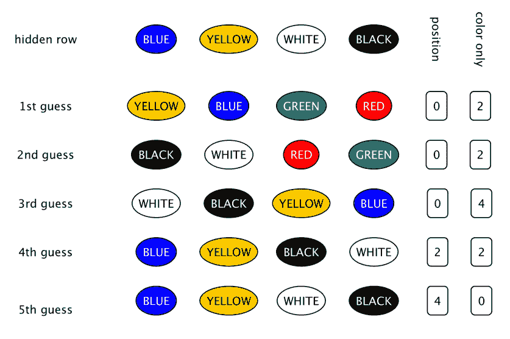
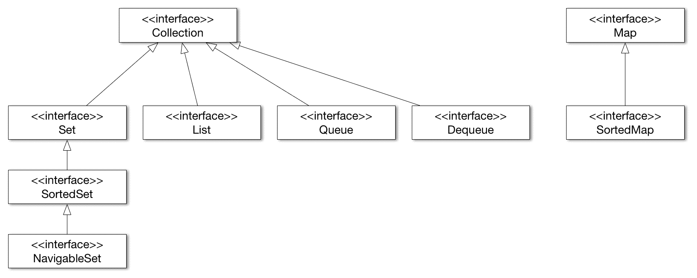
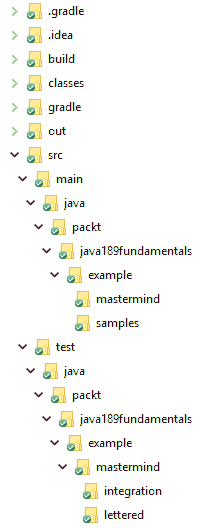

# Mastermind-创造游戏

在本章中，我们将开始开发一个简单的游戏。游戏是主谋，两个玩家。玩家一从六种可能的颜色中选择四种不同颜色的别针，并将它们排列在一个棋盘上，对另一个玩家隐藏起来。另一个玩家试着猜别针的颜色和位置。在每一次猜测中，玩家一猜匹配颜色的数量以及匹配颜色和位置的针脚。该程序将同时充当播放器 1 和播放器 2。我们的代码将单独运行。然而，留给我们玩的是最重要的代码。

这个例子非常复杂，足以深化**面向对象**（**OO**）原则，以及我们如何设计类和建模现实世界。我们已经使用了 Java 运行时中提供的类。这次，我们将使用集合并讨论这一重要领域。这些类和接口在 JDK 中广泛使用和可用，对于专业 Java 开发人员来说，它们和语言本身一样重要。

这次的构建工具是 Gradle。

在本章中，我们将介绍以下内容：

*   Java 集合
*   依赖注入
*   如何注释代码和创建 JavaDoc 文档
*   如何创建集成测试

# 游戏

[策划人](https://en.wikipedia.org/wiki/Mastermind_(board_game))是一个古老的游戏。在每个有孩子的房子里随处可见的塑料版本是 1970 年发明的。我在 1980 年得到了一块棋盘作为圣诞礼物，一个用 BASIC 语言解决游戏难题的程序是我在 1984 年左右创建的第一个程序之一。

游戏板上有四列几行的洞。有六种不同颜色的塑料别针可以插入孔中。每个针都有一种颜色。它们通常是红色、绿色、蓝色、黄色、黑色和白色。有一个特殊的行对其中一个玩家（猜测者）隐藏。

要玩这个游戏，其中一个玩家（hider）必须从一组别针中选择四个别针。所选管脚应具有不同的颜色。这些插针被一个接一个地放置在隐藏的行中，每个插针都处于一个位置。

猜测者试图找出什么颜色在哪个位置，猜测。每个猜测选择四个管脚并将它们排成一行。隐藏者告诉猜测者有多少针脚在正确的位置，有多少针脚的颜色在桌子上，但不在正确的位置：



示例剧本可能是这样的：

1.  隐藏者隐藏了四个针脚，分别是蓝色、黄色、白色和黑色。
2.  猜测者猜测黄色、蓝色、绿色和红色。

3.  隐藏者告诉猜测者有两种颜色匹配，但没有一种颜色在隐藏行中的正确位置。隐藏者这样说是因为黄色和蓝色在隐藏行中，而不是在猜测者猜测的位置。它们实际上是交换的，但是这个信息隐藏者是保密的。他们只说有两种颜色匹配，没有一种在正确的位置。
4.  下一个猜测是。。。

当猜猜者找到正确的颜色以正确的顺序时，游戏结束。同样的游戏也可以用文字符号来描述-`B`表示蓝色，`Y`表示黄色，`G`表示绿色，`W`表示白色，`R`表示红色，`b`表示黑色（幸运的是，计算机上有上下小写字母）：

```java
RGBY 0/0

GRWb 0/2
YBbW 0/2
BYGR 0/4
RGYB 2/2
RGBY 4/0
```

你猜怎么着！这是我们将在本章中开发的程序的实际输出。

我们也玩了这个游戏，允许一个位置是空的。这与第七种颜色基本相同。当我们发现游戏太简单，即使有七种颜色，我们改变了规则，允许颜色出现在不同的位置。这些都是游戏的有效变体。

在本章中，我们将使用六种颜色，在隐藏行中不使用颜色重复。游戏的其他版本编程起来有点复杂，但它们本质上是相同的，解决这些变化不会增加我们的学习经验。

# 游戏的模型

当我们用面向对象的思想开发一段代码时，我们会尝试对真实世界建模，并将真实世界的对象映射到程序中的对象。你肯定听过面向对象的解释，用非常典型的几何物体的例子，或者用汽车和马达的东西来解释组成。就我个人而言，我认为这些例子太简单了，无法得到很好的理解。他们可能是好的开始，但我们已经在这本书的第四章。策划者的游戏好多了。它比矩形和三角形要复杂一些，但没有电信计费应用或原子能发电厂控制那么复杂。

在这个游戏中，我们有哪些真实世界的物体？我们有一张桌子，我们有不同颜色的别针。我们当然需要两个 Java 类。桌子里有什么？每行有四个位置。也许我们需要一节课。表将有行。我们还需要一些隐藏秘密的东西。这也可以是一行，并且每行还可以保存关于有多少位置和多少颜色匹配的信息。在秘密行的情况下，这个信息是明显的 -4 和 0。

什么是别针？每个别针都有一种颜色，通常就是它。除了可以插入桌子上的孔之外，没有其他的销钉的特性，但这是我们不会建模的真实特性。基本上，别针是一种颜色，而不是别的。这样，我们可以在早期就从模型中消除别针类，甚至在我们用 Java 创建别针类之前。相反，我们有颜色。

什么是颜色？这可能是第一次很难理解的。我们都很清楚什么是颜色。它是不同频率光的混合物，正如我们的眼睛所感知的那样。我们可以有不同颜色的油漆和印刷品，等等。在这个程序中有很多东西我们没有建模。在我们的代码中，很难判断我们对颜色的模型是什么，因为这些特性非常明显，在现实生活中我们认为这是理所当然的；我们可以分辨出两种颜色是不同的。这是我们唯一需要的功能。为此，可以使用最简单的 Java 类：

```java
public class Color {
}
```

如果您有两个类型为`Color`的变量，您可以判断它们是否相同。可以使用表达式`a == b`比较`a`和`b`的对象标识，也可以使用继承自`Object`类`a.equals(b)`的`equals()`方法。用字母来编码颜色或用`String`常数来表示它们是很诱人的。首先可能比较容易，但之后会有严重的缺点。当代码变得复杂时，它会导致 bug；传递同样编码为`String`而不是颜色的东西很容易，而且只有单元测试可以节省时间。这比编译器在 IDE 中输入错误参数时发出的抱怨要好。

当我们玩游戏时，别针在小盒子里。我们从盒子里拔出别针。我们如何在程序中获得颜色？我们需要一些东西，从那里我们可以得到颜色。或者换个角度看，我们需要一些能给我们颜色的东西。我们称之为`ColorManager`。现在，`ColorManager`知道我们有多少种不同的颜色，任何时候我们需要一种颜色，我们都可以要求它。

同样，有一种设计`ColorManager`的诱惑，它可以通过序列号来提供颜色。如果我们有四种颜色，我们可以要求颜色数字 0，1，2，或 3。但话说回来，它只是将颜色隐式编码为整数，我们同意不这样做。我们应该找到最基本的功能，我们将需要模型的游戏。

为了描述类的结构，专业开发人员通常使用**统一建模语言**（**UML**）类图。UML 是一种标准化的图表符号，几乎只用于可视化软件架构。UML 中有许多图表类型来描述程序的静态结构和动态行为。这一次，我们将看到一个非常简化的类图：


我们没有空间去深入了解 UML 类图的细节。矩形表示类，法线箭头表示类具有另一类类型的字段时的关系，三角形箭头表示类扩展另一类。箭头指向要扩展的类的方向。

一个`Game`类包含一个秘密`Row`类和一个`Table`类。`Table`有`ColorManager`类和`Row`类的`List<>`。`ColorManager`具有第一颜色，并且具有`Color`类的`Map<>`。我们还没有讨论为什么会有这样的设计；我们将到达那里，图表帮助我们做到这一点。一个`Row`类本质上是一个`Color`类的数组。

玩家有一个功能，他们必须猜很多次，直到他们找到隐藏的秘密。为了得到`ColorManager`的模型，我们需要设计`Guesser`的算法。

当玩家做出第一个猜测时，任何颜色的组合都和其他颜色一样好。稍后，猜测应该考虑之前猜测的回答。这是一个合理的方法，只尝试颜色的变化，可以是真正的秘密。玩家选择一个变体并查看所有先前的猜测，假设所选变体是秘密。如果对他们已经做出的行的响应与对游戏中未知秘密的响应相同，那么尝试这种变化是合理的。如果在反应中有任何差异，那么这种变化肯定不是隐藏的变化。

有更复杂的方法，这个游戏有一个特殊的策略，选择一个颜色变化从一组可能的猜测匹配的答案。我们这里不讨论这些算法。当我们找到一个颜色变化，可以解决，我们将使用这个。

为了遵循这种方法，猜测者必须一个接一个地生成所有可能的颜色变化，并将它们与表格进行比较。猜测代码不会创建和存储所有可能的变体。它必须知道它在哪里，并且能够计算出下一个变化。这假定了变化的顺序。暂时，让我们忘记没有颜色可能会出现两次的变化。一个简单的排序方法可以和我们对十进制数排序的方法一样。如果我们有一个三位数的数字，那么第一个是 000，下一个是 001，依此类推直到 009，总是取最后一个位置的下一个数字。之后，010 来了。我们在最后一个数字旁边增加了一个数字，然后又将最后一个数字设为 0。现在，我们有 011012，等等。你知道，我们是怎么数数的。现在，把数字换成颜色，我们只有六个而不是十个。或者，当我们实例化一个`ColorManager`对象时，我们有我们想要的任何数量。

这就产生了`ColorManager`的功能。它必须做以下两件事：

*   给来电者第一种颜色
*   给出给定颜色后面的下一种颜色（我们将方法命名为`nextColor`）

后一种功能也应该在没有下一种颜色时发出信号。这将使用另一个名为`thereIsNextColor`的方法来实现。

这是一个惯例，以返回布尔值的方法名开始使用`is`。这将导致这个约定后面的名称-`isThereNextColor`；或者这个名称-`isNextColor`。这两个名称中的任何一个都解释了方法的功能。如果我问问题`isThereNextColor`，方法会回答我`true`或`false`。但是，这不是我们将如何使用的方法。我们将用简单的句子交谈。我们将使用短句。我们将避免不必要的、胡言乱语的表达。我们也将以这种方式编程。调用者很可能会在`if`语句中使用此方法。他们将写下：

```java
 if( thereIsNextColor(currentColor)){...}
```

They will not write this:

```java
 if( isThereNextColor(currentColor)){...}
```

我认为第一个版本更具可读性，可读性是第一位的。最后，但并非最不重要的一点是，如果你遵循旧的惯例，没有人会责怪你，如果这是公司的标准，你无论如何都必须这样做。

要做到这一切，`ColorManager`还必须创建颜色对象，并将它们存储在有助于执行操作的结构中：

```java
 1\. package packt.java189fundamentals.example.mastermind;
 2\. 
 3\. import java.util.HashMap;
 4\. import java.util.Map;
 5\. 
 6\. public class ColorManager {
 7\.     final protected int nrColors;
 8\.     final protected Map<Color, Color> successor = new HashMap<>();
 9\.     private Color first;
10\. 
11\.     public ColorManager(int nrColors) {
12\.         this.nrColors = nrColors;
13\.         createOrdering();
14\.     }
15\. 
16\.     protected Color newColor(){
17\.         return new Color();
18\.     }
19\. 
20\.     private Color[] createColors() {
21\.         Color[] colors = new Color[nrColors];
22\.         for (int i = 0; i < colors.length; i++) {
23\.             colors[i] = newColor();
24\.         }
25\.         return colors;
26\.     }
27\. 
28\.     private void createOrdering() {
29\.         Color[] colors = createColors();
30\.         first = colors[0];
31\.         for (int i = 0; i < nrColors - 1; i++) {
32\.             successor.put(colors[i], colors[i + 1]);
33\.         }
34\.     }
35\.     public Color firstColor() {
36\.         return first;
37\.     }
38\. 
39\.     boolean thereIsNextColor(Color color) {
40\.         return successor.containsKey(color);
41\.     }
42\. 
43\.     public Color nextColor(Color color) {
44\.         return successor.get(color);
45\.     }
46\. }
```

我们使用的结构是一个`Map`。现在，`Map`是 Java 运行时中定义的一个接口，从 Java 的早期版本开始就可以使用。`Map`有键和值，对于任何键，您都可以轻松地检索分配给键的值。

您可以在第 8 行看到，`successor`变量的定义，我们将变量的类型定义为接口，但值是类的实例。显然，该值不能是接口的实例，因为这样的对象不存在。但是，为什么我们要将变量定义为接口呢？原因是抽象和编码实践。如果出于某种原因需要更改所使用的实现，那么变量类型可能仍然保持不变，不需要在其他地方更改代码。将变量声明为接口也是一种很好的做法，这样我们就不会因为方便而使用接口中不可用的实现的某些特殊 API。当确实需要时，我们可以更改变量的类型并使用特殊的 API。毕竟，API 的存在是有原因的，但是仅仅因为 API 存在而使用某些特殊事物的诱惑是受到阻碍的。这有助于编写更简单、更干净的程序。

`Map`只是 Java 运行时中定义的属于 Java 集合的接口之一。还有许多其他接口和类。尽管 JDK 和所有的类都很多，而且几乎没有人知道其中的所有类，但是集合是一个专业开发人员应该了解的特殊领域。在详细说明此代码中使用`HashMap`的原因之前，我们将对集合类和接口进行概述。这将有助于我们了解本程序中使用的其他集合。

# Java 集合

集合是帮助我们存储多个对象的接口和类。我们已经看到了数组，它可以做到这一点。我们在前面的章节中也看到了`ArrayList`。我们没有详细讨论 JDK 中还有哪些其他可能性。在这里，我们将更详细地讨论，但将流和函数方法留给后面的章节，我们也将避免讨论细节。那是一本参考书的任务。

使用集合类和接口的实现可以减少编程工作。首先，您不需要编写已经存在的程序。其次，这些类在实现和特性上都进行了高度优化。他们有非常好的设计 API 和代码是快速的，并使用小内存占用。但是，他们的代码是很久以前写的，风格不好，很难阅读和理解。

当您使用来自 JDK 的集合时，更有可能与某些库进行互操作。如果你自己制作一个链表，你不可能找到一个现成的解决方案来排序你的列表。如果您使用 JDK 标准类库中的`LinkedList`类，您将从`Collections`类获得现成的解决方案，就在 JDK 中。还值得一提的是，Java 语言本身支持这些类。例如，您可以使用`for`命令的缩短的特殊语法轻松地遍历`Collection`的元素。

JDK 中的集合包含定义不同集合类型、实现类和执行某些操作（如排序）的算法的行为的接口。很多时候，这些算法在不同的实现版本上工作，得到相同的结果，但是针对特定于实现的类进行了优化。

您可以使用接口提供的 API，如果您在代码中更改实现，您将获得适合实现的优化版本。

下图显示了不同`Collection`接口之间的关系：



`Collection`接口可分为两类。一个包包含扩展`Collection`接口的接口，另一个包包含`Map`和扩展`Map`的`SortedMap`。这样，`Map`就不是一个真正的集合，因为它不仅仅包含其他对象，而是成对的值和键。

# `Collection`接口

`Collection`是接口层次结构的顶层。这个接口定义了所有实现应该提供的方法，不管它们是直接实现`Set`、`SortedSet`、`List`、`Queue`还是`Deque`接口。正如`Collection`简单地说，实现`Collection`接口的对象只是一个将其他对象集合在一起的对象，它定义的方法就像向集合中添加一个新对象，清除其中的所有元素，检查一个对象是否已经是集合的成员，并遍历这些元素。

有关接口的最新定义，请参阅 [Java API 文档](https://download.java.net/java/early_access/JDK11/docs/api/)。您可以随时查阅在线 API，建议您这样做。

Java 语言本身直接支持接口。您可以使用增强的`for`循环语法遍历`Collection`的元素，就像您可以迭代数组中的元素一样，在数组中集合应该是表达式，从而导致实现`Collection`接口的对象：

```java
for( E element : collection ){...}
```

在前面的代码中，`E`要么是对象，要么是`Collection`元素的泛型类型。

JDK 中没有直接实现`Collection`接口。类实现了`Collection`的一个子接口。

# `Set`

`Set`是一个特殊的集合，不能包含重复的元素。当您想将一个对象添加到一个已经有该对象或一个与实际对象相等的对象集时，`add`方法将不会添加实际对象。`add`方法返回`false`，表示失败。

当您需要一个唯一元素的集合时，您可以在程序中使用`Set`，您只需要检查一个元素是否是一个集合的成员，一个对象是否属于某个组。

当我们返回到我们的程序代码时，我们将看到`UniqueGuesser`类必须实现一个算法来检查猜测中的颜色只存在一次。此算法是使用`Set`的理想候选者：

```java
    private boolean isNotUnique(Color[] guess) {
        final var alreadyPresent = new HashSet<Color>();
        for (final var color : guess) {
            if (alreadyPresent.contains(color)) {
                return true;
            }
            alreadyPresent.add(color);
        }
        return false;
    }
```

代码创建一个集合，当方法启动时该集合为空。之后，它检查每种颜色（注意数组元素上增强的`for`循环），如果它以前已经存在的话。为此，代码检查`color`是否已经在集合中。如果有，猜测是不是唯一的，因为我们已经发现了一种颜色，是目前至少两次。如果`color`不在场景中，那么猜测的颜色仍然是唯一的。为了以后能够检测到，代码将颜色放入集合中。

我们使用的`Set`的实际实现是`HashSet`。在 JDK 中，有许多类实现了`Set`接口。使用最广泛的是`HashSet`。值得一提的还有`EnumSet`、`LinkedHashSet`和`TreeSet`。最后一个还实现了`SortedSet`接口，我们将在这里详细介绍。

为了理解什么是`HashSet`（以及后面的`HashMap`）以及它们是如何工作的，我们必须讨论什么是散列。它们在许多应用中起着非常重要的核心作用。他们在 JDK 中秘密地工作，但是程序员必须遵循一些非常重要的限制，否则真的很奇怪而且很难找到 bug 会让他们的生活很悲惨。我敢说，违反了`HashSet`和`HashMap`中的哈希约定，是继多线程问题之后第二个最难发现的 bug 的原因。

因此，在继续不同的集合实现之前，我们将访问这个主题。在本次讨论集合的绕道中，我们的示例已经深入了一个层次，现在我们将更深入一个层次。我保证这是最后一次深入的迂回。

# 散列函数

散列是一个数学函数，它为一个元素赋值。听起来很可怕，不是吗？假设你是一名大学行政人员，你必须判断威尔金森是否是你班的学生。你可以把名字放在信封里的小纸上，每封信一个。不用搜索 10000 名学生，你可以查看信封中标题为 W 的论文。这个非常简单的哈希函数将名字的第一个字母指定给名字（或者字母的序数，正如我们所说的哈希函数产生一个数字）。这实际上不是一个好的散列函数，因为它只将一些元素（如果有的话）放入表示为 X 的信封中，而将许多元素放入 A 中。

好的散列函数以相似的概率返回每个可能的序数。在哈希表中，我们通常拥有比要存储的元素数量更多的桶（在上一个示例中是信封）。因此，当搜索一个元素时，很可能只有一个元素。至少这是我们想要的。如果一个桶中有多个元素，则称为碰撞。一个好的哈希函数有尽可能少的冲突。

为了向后兼容，JDK 中有一个`Hashtable`类。这是第一个版本中第一个用 Java 实现的哈希表，因为 Java 是向后兼容的，所以它没有被丢弃。`Map`接口仅在版本 1.2 中引入。`Hashtable`有很多缺点，不推荐使用。（甚至名称也违反了 Java 命名约定）本书中我们不讨论这个类。每当我们谈论哈希表时，我们指的是`HashSet`、`HashMap`实现中的实际数组，或者使用哈希索引表的任何其他集合。

哈希表是使用哈希函数的结果对数组进行索引的数组。数组元素称为桶。哈希表实现试图避免在同一个桶中有多个元素的情况。要做到这一点，当桶满了超过某个限制时，表会不时地调整大小。当超过 70% 的桶已经包含一个元素时，表的大小将增加一倍。即使有这样一个阈值和调整数组的大小，也不能保证在一个桶中永远不会有多个元素。因此，实现通常不在桶中存储单个元素，而是存储元素的链表。大多数情况下，列表将只包含一个元素，但当发生冲突时，两个或多个元素具有相同的哈希值，然后列表可以存储这些元素。

调整桶数组的大小时，必须再次放置每个元素。此操作可能需要相当长的时间，在此期间，单个元件在铲斗之间移动。

在此操作期间，无法可靠地使用哈希表，这可能是多线程环境中的一些问题源。在单线程代码中，您不会遇到这个问题。当您调用`add()`方法时，哈希表（集合或映射）决定必须调整表的大小。`add()`方法调用调整大小的方法，直到完成后才返回。单线程代码在此期间不可能使用哈希表—单线程正在执行调整大小。在多线程环境中，可能会发生这样的情况：一个线程调用开始调整大小的`add()`，而另一个线程也在重新组织哈希表时调用`add()`。在这种情况下，JDK 中的哈希表实现将抛出`ConcurrentModificationException`。

`HashSet`和`HashMap`使用集合中存储的`Object`提供的哈希函数。`Object`类实现了`hashCode()`和`equals()`方法。你可以重写它们，如果你这样做了，你应该以一致的方式重写它们。首先，我们将看到它们是什么，然后如何一致地覆盖它们。

# `equals()`方法

`Set`的文件中，集中不含`e1`和`e2`两个元素，使`e1.equals`（`e2`。`equals()`方法返回`true`如果`e1`和`e2`在某种程度上相等。它可能与两个对象相同。可以有两个不同的对象是相等的。例如，我们可以有一个颜色实现，该颜色实现的名称为属性，两个颜色对象可以返回`true`，在其中一个对象上调用`equals()`方法，当两个字符串相等时，将参数作为另一个传递。`equals()`方法默认实现在`Object`类的代码中，如果且仅当`e1`和`e2`完全相同且单一对象时，返回`true`。

这似乎是显而易见的，但我的经验表明，在一个对象中实现`equals()`必须如下，这一点再怎么强调也不为过：

*   **自反**：意思是物体总是等于它自己
*   **对称**（可交换）：这意味着如果`e1.equals(e2)`是`true`，那么`e2.equals(e1)`也应该是`true`
*   **传递**：表示如果`e1.equals(e2)`和`e2.equals(e3)`，那么`e1.equals(e3)`
*   **一致**：这意味着如果两次调用之间对象没有改变，返回值就不应该改变

# `hashCode`方法

`hashCode()`方法返回一个`int`。文档中说，任何重新定义此方法的类都应该提供以下实现：

*   如果未修改对象，则始终返回相同的值
*   结果相等的两个对象有相同的`int`值（`equals()`方法返回`true`）

文档还提到，这不是对不相等对象产生不同的`int`值的要求，但希望支持哈希实现集合的性能。

如果在实现`equals()`和`hashCode()`时违反了这些规则中的任何一个，那么使用它们的 JDK 类可能会失败。您可以确定，`HashSet`、`HashMap`和类似的类已经过充分的调试，看到您向一个集合添加了一个对象，然后集合报告如果它不在那里，将是一个令人困惑的体验。但是，只有在您发现集合中存储的两个相等的对象具有不同的`hashCode()`值之前，`HashSet`和`HashMap`才会在由`hashCode()`值索引的桶中查找该对象。

将对象存储在`HashSet`或`HashMap`中，然后对其进行修改也是一个常见的错误。对象在集合中，但找不到它，因为`hashCode()`返回的值不同，因为它已被修改。除非您知道自己在做什么，否则不应修改存储在集合中的对象。

很多时候，对象包含的字段从平等的角度看是不有趣的。`hashCode()`和`equals()`方法对这些字段都是幂等的，即使将对象存储在`HashSet`或`HashMap`中，也可以对这些字段进行修改。（幂等表示可以随意更改这些字段的值，并且方法的结果不会更改。）

例如，可以管理对象中的三角形，以保持顶点的坐标和三角形的颜色。但是，您并不关心颜色是否相等，只关心两个三角形在空间中处于完全相同的位置。在这种情况下，`equals()`和`hashCode()`方法不应考虑字段颜色。这样，我们就可以画出我们的三角形；不管颜色场是什么，它们仍然会出现在`HashSet`或`HashMap`中。

# 实现`equals`和`hashCode`

实现这些方法相当简单。由于这是一项非常常见的任务，IDE 支持生成这些方法。这些方法紧密地联系在一起，以至于 IDE 中的菜单项不是独立的；它们允许您一次生成这些方法。

要求 IDE 生成`equals()`方法将产生如下代码：

```java
@Override 
public boolean equals(Object o) { 
  if (this == o) return true; 
  if (o == null || getClass() != o.getClass()) return false;   
  MyObjectJava7 that = (MyObjectJava7) o;
  return Objects.equals(field1, that.field1) && 
  Objects.equals(field2, that.field2) && 
  Objects.equals(field3, that.field3); 
}
```

对于这个示例，我们有三个名为`field1`、`field2`和`field3`的`Object`字段。与任何其他类型和字段的代码看起来都非常相似。

首先，该方法检查对象标识。一个`Object`总是`equals()`本身。如果作为参数传递的引用是`null`而不是对象，或者它们属于不同的类，那么这个生成的方法将返回`false`。在其他情况下，`Objects`类的静态方法（注意复数形式）将用于比较每个字段。

`Objects`实用程序类是在 Java7 中引入的。静态方法`equals()`和`hash()`支持`Object equals`和`hashCode()`方法的重写。`hashCode()`在 Java7 之前的创建是相当复杂的，需要用一些幻数实现模运算，这些幻数很难解释，仅仅看代码而不知道背后的数学。

这种复杂性现在隐藏在以下`Objects.hash`方法背后：

```java
@Override 
 public int hashCode() { 
     return Objects.hash(field1, field2, field3); 
 }
```

生成的方法只是调用`Objects::hash`方法，将重要字段作为参数传递。

# `HashSet`（哈希集）

现在，我们基本上知道了很多关于散列的事情，所以我们可以勇敢地讨论`HashSet`类。`HashSet`是`Set`接口的一个实现，它在内部使用哈希表。一般来说，就是这样。将对象存储在那里，可以查看对象是否已经存在。当需要一个`Set`实现时，几乎总是选择`HashSet`。几乎。。。

# `EnumSet`（枚举集）

`EnumSet`可以包含某个枚举中的元素。回想一下，枚举是一些类，它们修复了`enum`本身中声明的大量实例。由于这限制了不同对象实例的数量，并且这个数量在编译时是已知的，`EnumSet`代码的实现是相当优化的。在内部，`EnumSet`被实现为一个位域，是一个很好的选择，如果我们用低级语言编程，位域操作将是一个选择。

# `LinkedHashSet`（链接哈希集）

`LinkedHashSet`是一个`HashSet`，它还维护它所持有的元素的双链表。当我们迭代一个`HashSet`时，元素没有保证的顺序。当`HashSet`被修改时，新元素被插入到其中一个桶中，并且哈希表可能被调整大小。这意味着元素被重新排列并进入完全不同的桶中。对`HashSet`中的元素的迭代只是将桶和其中的元素按某种顺序进行，从调用者的角度来看，这种顺序是任意的。

然而，`LinkedHashSet`使用它维护的链表对元素进行迭代，并且迭代保证按照元素插入的顺序进行。这样，`LinkedHashSet`就是一个复合数据结构，同时是一个`HashSet`和一个`LinkedList`。

# `SortedSet`（有序集）

`SortedSet`是一个接口，它保证实现它的类将按排序顺序遍历集合。如果对象实现了`Comparable`接口，则顺序可以是对象的自然顺序，或者`Comparator`对象可以驱动它。这个对象应该在实现`SortedSet`的类的实例被创建时可用；换句话说，它必须是一个构造器参数。

# `NavigableSet`（可导航集）

`NavigableSet`使用方法扩展`SortedSet`接口，这些方法允许您在集合中进行邻近搜索。这基本上允许您搜索搜索中的元素，该元素可以是以下任一元素：

*   小于搜索对象
*   小于或等于搜索的元素
*   大于或等于搜索的对象

# `TreeSet`（树集）

`TreeSet`是`NavigableSet`的实现，也是`SortedSet`的实现，事实上，它也是`Set`，因为`SortableSet`文档暗示有两种类型的构造器，每种都有多个版本。一个需要一些`Comparator`，而另一个则依赖于元素的自然顺序。

# `List`（列表）

`List`是一个要求实现类跟踪元素顺序的接口。还有一些方法通过索引和`Collection`接口定义的迭代来访问元素，这些接口保证元素的顺序。接口还定义了`listIterator`方法，该方法返回一个也实现了`ListIterator`接口的`Iterator`。这个接口提供了一些方法，让调用者在遍历列表的同时将元素插入到列表中，并在迭代中来回执行。也可以在`List`中搜索某个元素，但大多数接口实现的性能较差，而搜索只是遍历所有元素，直到找到所搜索的元素。JDK 中有许多类实现这个接口。在这里，我们将提到两个。

# `LinkedList`（链表）

这是一个`List`接口的双链接列表实现，该接口引用了前面的元素，并且也引用了列表中每个元素的下一个元素。类还实现了`Deque`接口。从列表中插入或删除元素是相当便宜的，因为它只需要调整很少的引用。另一方面，按索引访问元素需要从列表的开始或列表末尾进行迭代；以更接近指定索引元素的为准。

# `ArrayList`（数组列表）

这个类是`List`接口的一个实现，该接口保持对数组中元素的引用。这样，通过索引访问元素就相当快了。另一方面，在`ArrayList`中插入一个元素可能代价高昂。它需要将插入元素上方的所有引用移到一个更高的索引，并且可能还需要调整背景数组的大小，以防原始数组中没有空间存储新元素。本质上，这意味着分配一个新数组并复制对它的所有引用。

如果我们知道数组将增长多大并调用`ensureCapacity()`方法，那么可以优化数组的重新分配。这会将数组调整为作为参数提供的大小，即使当前使用的插槽编号较少。

我的经验是，新手程序员在需要列表时使用`ArrayList`，而不考虑不同实现的算法性能。我真的不知道为什么`ArrayList`会这么流行。在程序中使用的实际实现应该基于正确的决定而不是习惯。

# `Queue`（队列）

`Queue`是一个集合，通常存储元素供以后使用。您可以将元素放入队列中，然后将它们拉出。一个实现可以指定给定的顺序，可以是**先进先出**（**FIFO**）或**后进先出**（**LIFO**），或者一些基于优先级的顺序。

在队列中，您可以调用`add()`方法添加元素，`remove()`方法删除头元素，`element()`方法访问头元素而不将其从队列中删除。当存在容量问题且无法将元素添加到队列时，`add()`方法将引发异常。当队列为空且没有头元素时，`element()`和`remove()`方法抛出异常。

由于异常只能在异常情况下使用，并且调用程序可以在正常的代码过程中处理这些情况，因此所有这些方法都有一个版本，该版本只返回一些特殊的值来表示这种情况。调用者可以调用`offer()`来代替`add()`，以提供用于存储的元素。如果队列不能存储元素，则返回`false`。同样地，`peek()`会尝试接近头部元件，如果没有，则返回`null`，如果没有，`poll()`会移除并返回头部元件，如果没有，则返回`null`。

请注意，这些返回`null`的方法只是在实现（如`LinkedList`允许`null`元素）时使情况变得模糊。永远不要在队列中存储一个`null`元素，否则您将无法判断队列是空的还是只有第一个元素是`null`。

# `Deque`（双端队列）

`Deque`是一个双端队列接口。它使用允许访问队列两端的方法来扩展`Queue`接口，以便从队列两端添加、查看和删除元素。

对于`Queue`接口，我们需要六种方法。`Dequeue`有两个可管理的端，需要 12 种方法。我们有`addFirst()`和`addLast()`，而不是`add()`。同样，我们可以使用`offerFirst()`和`offerLast()`、`peekFirst()`和`peekLast()`、`pollFirst()`和`pollLast()`。由于某种原因，在`Queue`接口中实现`element()`方法功能的方法在`Dequeue`接口中被命名为`getFirst()`和`getLast()`。

因为这个接口扩展了`Queue`接口，所以这里定义的方法也可以用来访问队列的头部。除此之外，此接口还定义了`removeFirstOccurrence()`和`removeLastOccurrence()`方法，可用于移除队列中的特定元素。我们不能指定要删除的元素的索引，也不能基于索引访问元素。`removeFirst()`/`LastOccurrence()`方法的参数是要删除的对象。如果我们需要这个功能，我们可以使用`Deque`，即使我们在队列的一端添加和删除元素。

为什么`Deque`中有这些方法而`Queue`中没有？这些方法与`Deque`的双头性无关。原因是方法在发布后无法添加到接口。如果我们向接口添加一个方法，就会破坏向后兼容性，因为实现该接口的所有类都必须实现新方法。Java8 引入了默认方法来减轻这个限制，但是在 Java1.5 中定义了`Queue`接口，在 Java1.6 中定义了`Deque`接口。当时没有办法将新方法添加到已经存在的接口中。

# `Map`（映射）

`Map`将键和值配对。如果我们想从`Collection`的角度接近`Map`，那么`Map`就是一组键/值对。您可以将键/值对放入一个`Map`中，并可以基于一个键获得一个值。键与`Set`中的元素具有相同的唯一性。如果您查看`Set`接口的不同实现的源代码，您可能会发现其中一些实现是作为`Map`实现的包装器实现的，其中的值被简单地丢弃。

接口定义了很多方法。两种最重要的方法是`put()`和`get()`。`put(key,value)`方法可用于在地图中存储密钥/值对。如果有一对有一个键，我们想在对中设置的键`equals()`，那么旧值将被替换。此时，`put()`的返回值为旧对象，否则返回`null`。注意，返回的`null`值也可能表示与该键相关的值为`null`。

`get(key)`方法返回用指定键存储的值。同样，方法`equals()`用于检查所提供的密钥与地图中使用的密钥是否相等。如果映射没有任何与作为参数提供的键相关联的值，则此方法返回`null`。这也可能意味着与键相关联的实际值是`null`参考。

为了区分给定键没有存储值和存储值为`null`的两种情况，有另一种方法称为`contains()`。如果此映射包含指定键的映射，则此方法返回`true`。

您可以在 JDK 的 JavaDoc 文档中找到`Map`接口中的许多其他方法。

使用`Map`简单，诱人。许多语言（如 Python、Go、JavaScript 和 Perl）在语言级别上支持这种数据结构。然而，当数组足够时使用`Map`是一种我见过很多次的糟糕做法，尤其是在脚本语言中。Java 不容易出现新手程序员的错误，但是当你想使用一个`Map`的时候，你仍然会发现你自己处于这样的境地，而且，还有一个更好的解决方案。一般来说，应该使用最简单的数据结构来实现算法。

# `HashMap`（哈希映射）

`HashMap`是基于哈希表的`Map`接口实现。因为实现使用哈希表，`get()`和`put()`方法通常执行速度非常快、恒定，并且与映射中的实际元素数无关。如果映射大小增加，并且表元素的数量不足以以符合人体工程学的方式存储元素，那么将新元素放入这种类型的映射可能会迫使实现调整底层数组的大小。在这种情况下，数组中已经存在的每个元素都必须重新放置在新的、增大的数组中。在这些情况下，`put()`操作可能消耗大量时间，与地图中元素的数量成比例。

当一个元素要存储在这个映射中时，对键对象调用`hashCode()`方法，返回值用来决定底层哈希表的哪个桶应该存储这个新元素。桶包含一个简单的二叉树结构。如果桶是空的，在这个结构中存储元素就像元素直接存储在桶中一样简单。另一方面，当两个或多个元素具有相同的`hashCode()`值时，它们也可以存储在同一个存储桶中的映射中，尽管效率有点下降。

由于`hashCode()`值可能发生冲突，`get()`或`put()`方法调用所需的时间可能比其他方法长一点点。

`Map`接口的实现是 Java 程序中使用最频繁的一种，实现经过微调，使用可以配置。最简单的方法是创建一个调用默认构造器的`HashMap`。如果我们碰巧知道地图上有多少元素，那么我们可以指定它，并将`int`传递给构造器。在这种情况下，构造器将分配一个数组，数组的大小不小于我们所需的容量，大小是两个幂。

还有第三个构造器，我们可以在其中定义一个`float`负载因子。负荷系数的默认值为`0.75`。当映射中的元素数大于哈希表大小乘以加载因子的大小时，下一个`put()`调用将使基础哈希表的大小加倍。这种提前调整大小的方法试图避免`hashCode()`碰撞变得过于频繁。如果我们将某个特殊类的实例存储在我们确信`hashCode()`非常好的地方，那么我们可以将负载因子设置得更接近`1.0`。如果我们不太在意速度，也不希望底层哈希表增加太多，我们甚至可以使用大于`1.0`的值。不过，在这种情况下，我会考虑使用一些不同的数据结构。

在大多数情况下，我们需要`Map`时的选择是`HashMap`。通常，我们不应该太过担心这些实现细节。然而，在一些罕见的情况下，当内存使用或性能下降时，我们应该知道我们使用的映射的实现复杂性。

# `IdentityHashMap`（身份哈希映射）

`IdentityHashMap`是实现`Map`接口本身的特殊`Map`，但事实上，该实现违反了文档定义的`Map`接口的约定。它这样做是有充分理由的。实现使用的哈希表与`HashMap`相同，但是为了确定桶中找到的键与`get`方法的参数键元素的相等性，它使用了`Object`引用（`==`运算符），而不是`Map`接口文档要求的方法`equals()`。

当我们想将不同的`Object`实例区分为键时，使用此实现是合理的，否则是相等的。出于性能原因使用此实现几乎肯定是错误的决定。另外，注意，JDK 中没有`IdentityHashSet`实现。很可能，这样的集合很少使用，以至于它在 JDK 中的存在会造成比好的更大的危害，这会引诱新手程序员误用。

# 依赖注入

在上一章中，我们已经简要讨论了**依赖注入**（**DI**）。在继续我们的示例之前，我们将更详细地研究它。我们之所以这样做，是因为我们将创建的编程结构在很大程度上建立在这个原则之上。

对象通常不会自己工作。大多数时候，实现依赖于其他类的服务。例如，当我们想向控制台写入内容时，我们使用`System`类，并通过该对象使用`final`字段`out`和`println()`方法。另一个例子是，当我们管理猜测表时，我们需要`Color`对象和`ColorManager`。

在写入控制台时，我们可能没有意识到依赖性，因为类作为 JDK 类库的一部分，一直都是可用的，我们需要做的就是写入`System.out.println()`。因为我们有腿，所以这可能和能走路一样明显。无论这看起来多么简单，我们都依赖于我们的腿来行走，同样地，当我们要向控制台写入数据时，我们也依赖于`System`类。

当我们刚刚编写`System.out.println()`时，依赖关系就被连接到了代码中。除非修改代码，否则无法将输出发送到其他地方。这不是很灵活，而且在许多情况下，我们需要一个能够处理不同输出、不同颜色管理器或不同类型的代码所依赖的服务的解决方案。

第一步是使用一个字段来引用为类提供服务的对象。在输出的情况下，字段的类型可以是`OutputStream`类型。如果我们在代码中使用这个字段，而不是直接连接到代码中的内容，那么我们就有可能使用不同的依赖关系。例如，我们可以将输出发送到文件而不是控制台。我们不需要更改编写代码的地方。我们所要做的就是在对象创建过程中为引用`OutputStream`的字段指定一个不同的值。

这已经是下一步了，即该字段如何获取值。

解决方案之一是使用 DI。在这种方法中，一些外部代码准备依赖项并将它们注入到对象中。当发出对类的方法的第一个调用时，所有依赖项都已填充并准备好使用。

在这个结构中，我们有四个不同的参与者：

*   `client`对象是在该过程中获取注入的`service`对象的对象
*   `service`对象被注入`client`对象
*   喷油器是执行喷油的代码
*   接口定义客户端需要的服务

如果我们从客户机代码中移动创建`service`对象的逻辑，代码就会变得更短、更干净。`client`类的实际能力几乎不应涵盖`service`对象的创建。例如，`Game`类包含`Table`实例，但游戏不负责创建`Table`。它被赋予与它一起工作，就像我们在现实生活中建模一样。

创建`service`对象有时就像发出`new`操作符一样简单。有时，`service`对象也依赖于其他`service`对象，并且在 DI 过程中充当客户机。在这种情况下，`service`对象的创建可能需要很多行。依赖关系的结构可以用一种声明性的方式来表示，它描述了哪个`service`对象需要其他`service`对象，以及要使用的服务接口的实现。DI 注入器使用这种声明性描述。当需要一个需要`service`对象的对象本身需要其他`service`对象时，注入器使用与声明性描述匹配的实现以适当的顺序创建服务实例。注入器以传递方式发现所有依赖项，并创建依赖项的传递闭包图。

对所需依赖项的声明性描述可以是 XML，或者是专门为 DI 开发的一种特殊语言，甚至可以是 Java 本身，使用一个专门设计的 [Fluent API](https://blog.jooq.org/2012/01/05/the-java-fluent-api-designer-crash-course/)。XML 最早是在 DI 中使用的。后来，基于 **Groovy** 的[**领域专用语言**](https://martinfowler.com/books/dsl.html)是作为一种 Java Fluent API 方法出现的。我们将只使用最后一个，因为它是最现代的，我们将使用 **Spring** 和 **Guice** **DI** 容器，因为它们是最著名的注入器实现。

# 实现游戏

没有例子的收藏很无聊。幸运的是，在我们的游戏中，我们使用了一些集合类，以及我们将在本章中研究的其他方面。

# 色彩管理

我们跳进了池中，池中充满了实现`ColorManager`类的集合类。让我们用类中我们感兴趣的部分来刷新我们的记忆，现在是构造器：

```java
package packt.java189fundamentals.example.mastermind;

import java.util.HashMap;
import java.util.Map;

public class ColorManager {
    final protected int nrColors;
    final protected Map<Color, Color> successor = new HashMap<>();
    private Color first;

    public ColorManager(int nrColors) {
        this.nrColors = nrColors;
        createOrdering();
    }

    protected Color newColor(){
        return new Color();
    }

    private Color[] createColors() {
        Color[] colors = new Color[nrColors];
        for (int i = 0; i < colors.length; i++) {
            colors[i] = newColor();
        }
        return colors;
    }

    private void createOrdering() {
        Color[] colors = createColors();
        first = colors[0];
        for (int i = 0; i < nrColors - 1; i++) {
            successor.put(colors[i], colors[i + 1]);
        }
    }
    // ...
}
```

我们用`HashMap`来保持颜色在一个有序的列表中。一开始，选择`HashMap`似乎很奇怪。的确，在`ColorManager`的编码过程中，我也考虑了`List`，这似乎是一个比较明显的选择。如果我们有一个`List<Color> colors`变量，那么`nextColor`方法是这样的：

```java
public Color nextColor(Color color) { 
     if (color == Color.none) 
         return null; 
     else 
         return colors.get(colors.indexOf(color) + 1); 
 }
```

构造器将更简单，如以下代码所示：

```java
final List<Color> colors = new ArrayList<>(); 

     public ColorManager(int nrColors) { 
         this.nrColors = nrColors; 
         for (int i = 0; i < nrColors; i++) { 
             colors.add(new Color()); 
         } 
         colors.add(Color.none); 
     } 

     public Color firstColor() { 
         return colors.get(0); 
     }
```

为什么我要选择更复杂的解决方案和更复杂的数据结构？原因是性能。调用`nextColor()`方法时，列表实现首先找到检查列表中所有元素的元素，然后获取下一个元素。时间与颜色的数量成正比。当我们的颜色数量增加时，时间也会增加到下一个颜色有一个。

同时，如果我们关注我们想要实现的实际方法`nextColor(Color)`，而不是我们想要解决的任务的口头表达（以排序顺序获得颜色），那么我们很容易得出`Map`更合理的结论。我们需要的正是一个`Map`元素，我们想要另一个与我们有关联的元素。键和值也是`Color`。使用`HashMap`获取下一个元素实际上是恒定时间。这种实现可能比基于`ArrayList`的实现更快。

问题是它只可能更快。当您考虑重构代码以获得更好的性能时，您的决策应该始终基于度量。实践表明，如果你实现了你认为更快的代码，你就会失败。在最好的情况下，您将优化代码，使其速度极快，并在应用服务器安装期间运行。同时，优化后的代码通常可读性较差。为了某样东西。决不能过早地进行优化。代码的可读性第一。然后，评估性能，如果性能有问题，分析执行情况并优化对整体性能影响最大的代码。微优化也无济于事。我是否做了过早的优化选择`HashMap`实现而不是`List`？如果我真的用`List`实现了代码，然后重构了它，那么是的。如果我在考虑`List`解决方案，然后我发现`Map`解决方案在没有事先编码的情况下更好，那么我没有。随着你积累更多的经验，这样的考虑会变得更容易。

# `Color`类

我们已经研究了类代码的代码，它是世界上最简单的类。实际上，由于它位于 Packt 代码存储库中，代码更复杂：

```java
/**
 * Represents a color in the MasterMind table.
 */
public class Color {
    /**
     * A special object that represents a
     * value that is not a valid color.
     */
    public static final Color none = new Color();
}
```

我们有一个名为`none`的特殊颜色常数，用来表示一个类型为`Color`但不是有效的`Color`的引用。在专业发展中，我们长期使用`null`值来表示无效引用，因为我们向后兼容，所以我们仍然使用它。但是，建议尽可能避免引用`null`。

[托尼·霍尔](https://en.wikipedia.org/wiki/Tony_Hoare)，曾经承认这是一个错误，在 IT 行业花费了数十亿美元。

`null`值的问题是它将控件从类中移除，从而打开了封装。如果某个方法在某种情况下返回`null`，则严格要求调用方检查空值并据此进行操作。例如，您不能在`null`引用上调用方法（至少在 Java 中不能这样做），也不能访问任何字段。如果方法返回一个对象的特殊实例，这些问题就不那么严重了。如果调用方忘记检查特殊返回值并调用特殊实例上的方法，则调用的方法仍有可能实现某些异常或错误处理。该类封装了控件，并可以引发一个特殊异常，该异常可能会提供有关调用方未检查特殊值的编程错误所导致的错误的更多信息。

# JavaDoc 和代码注释

我们前面介绍的内容和清单之间还有另一个区别。这是代码的注释。代码注释是程序的一部分，被编译器忽略并过滤掉。这些注释仅适用于维护或使用代码的人员。

在 Java 中，有两种不同的注释。`/*`和`*/`之间的代码是注释。注释的开头和结尾不必在同一行。另一种类型的注释以`//`字符开始，并在行尾结束。

为了记录代码，可以使用 JavaDoc 工具。JavaDoc 是 JDK 的一部分，它是一个特殊的工具，可以读取源代码并提取有关类、方法、字段和其他实体的 HTML 文档，这些实体的注释以`/**`字符开头。文档将以格式化的方式包含 JavaDoc 注释以及从程序代码中提取的信息。

当您将鼠标移到方法调用或类名（如果有）上时，文档也会显示为 IDE 中的联机帮助。JavaDoc 注释可以包含 HTML 代码，但通常不应该包含。如果真的需要，可以使用`<p>`开始一个新段落或`<pre>`标签，将一些预先格式化的代码样本包含到文档中，但没有什么能带来真正的好处。文档应尽可能短，并包含尽可能少的格式。

JavaDoc 文档中可以出现一些特殊的标记。当您开始将 JavaDoc 键入为`/**`，然后按`Enter`时，IDE 会预先填充这些内容。这些都在注释中，以`@`字符开头。有一组预定义的标签-`@author`、`@version`、`@param`、`@return`、`@exception`、`@see`、`@since`、`@serial`和`@deprecated`。最重要的标签是`@param`和`@return`。它们用于描述方法参数和返回值。虽然我们还没有到，但是让我们先看看`Guesser`类中的`guessMatch`方法：

```java
/**
 * A guess matches if all rows in the table matches the guess.
 *
 * @param guess to match against the rows
 * @return true if all rows match
 */
private boolean guessMatch(Color[] guess) {
    for (Row row : table.rows) {
        if (!row.guessMatches(guess)) {
            return false;
        }
    }
    return true;
}
```

参数的名称由 IDE 自动生成。当你创建文档时，写一些有意义的东西，而不是重复。很多时候，新手程序员都有编写 JavaDoc 的冲动，必须编写一些关于参数的内容。他们创建如下文档：

```java
* @param guess is the guess
```

真正地？我怎么也猜不到。如果您不知道在那里写什么来记录参数，那么可能是您选择了参数的名称。

我们前面示例的文档如下所示：


关注方法、类和接口的作用以及如何使用 JavaDoc。不要解释它是如何在内部工作的。JavaDoc 不是解释算法或编码的地方。它的目的是帮助使用代码。然而，如果有人碰巧解释了一个方法是如何工作的，那就不是灾难了。评论很容易被删除。

然而，有一条评论比什么都没有更糟糕：过时的文档不再有效。当元素的约定发生了更改，但文档没有遵循更改，并且误导了希望调用方法、接口或类的用户时，它将面临严重的错误，并且将不知所措。

从现在起，JavaDoc 注释将不会以打印的形式列出以保存树，电子版也不会列出，但它们在存储库中，可以检查。

# `Row`

现在，我们有一个`Color`类，甚至当我们需要一个`ColorManager`时还有实例。这是在`Row`对象中存储`Color`对象的时间。`Row`类稍长，但不太复杂。在本节中，我们将以小片段的形式查看代码，并在其中进行解释：

```java
package packt.java189fundamentals.example.mastermind;

public class Row {
    final Color[] positions;
    protected int matchedPositions;
    protected int matchedColors;
```

`Row`包含三个字段。一种是`positions`数组。数组的每个元素都是一个`Color`。`matchedPositions`是匹配的位置数，`matchedColors`是匹配隐藏行中某一颜色但不在隐藏行中相同位置的颜色数：

```java
public static final Row none = new Row(Guesser.none);
```

`none`是一个常量，它包含一个特殊的`Row`实例，我们将在任何地方使用`null`。构造器获取数组中应位于行中的颜色：

```java
public Row(Color[] positions) {
    this.positions = Arrays.copyOf(positions, positions.length);
}
```

构造器复制原始数组。这是一段重要的代码，我们将稍微研究一下。让我们重申一下，Java 通过值传递参数。这意味着当您将一个数组传递给一个方法时，您将传递保存该数组的变量的值。然而，Java 中的数组是一个对象，就像其他任何东西一样（除了像`int`这样的原语）。因此，变量所包含的是对恰好是数组的对象的引用。如果更改数组的元素，实际上就是更改原始数组的元素。参数通过时复制数组引用，但数组本身和元素不通过。

`java.util.Arrays`实用类提供了很多有用的工具。我们可以很容易地用 Java 编写数组复制代码，但是为什么要重新设计这个轮子呢？此外，数组是一个连续的内存区域，可以使用低级机器代码非常有效地从一个地方复制到另一个位置。我们调用的`copyOf`方法调用了`System.arraycopy`方法，它是一个本地方法，因此执行本机代码。

请注意，不能保证`Arrays.copyOf`调用本机实现，并且在大型数组的情况下这将非常快。我正在测试和调试的版本就是这样做的，我们可以假设一个好的 JDK 做了类似的、有效的和快速的事情。

在我们复制了数组之后，如果调用方修改了传递给构造器的数组，这就不是问题了。该类将引用一个包含相同元素的副本。但是，请注意，如果调用者更改了存储在数组中的任何对象（不是数组中的引用，而是数组元素引用的对象本身），则会修改同一对象。`Arrays.copyOf`不复制数组引用的对象，只复制数组元素。在我们的例子中，数组中有`Color`个实例，因为这个类根本没有字段，所以它本质上是不可变的，没有可以更改的实例。

该行与颜色一起创建，因此我们为名为`positions`的`Color`数组使用了一个`final`字段。但是，当创建一行时，无法知道匹配项；因此，它们不能是`final`。其中一个玩家创建了`Row`，然后，另一个玩家稍后会告诉你这两个`int`值。我们需要一个设置器来设置这些字段。但是，我们不会为这两个值创建两个设置器，因为它们在游戏中总是同时定义在一起：

```java
public void setMatch(int matchedPositions, int matchedColors) {
    if (matchedColors + matchedPositions > positions.length) {
        throw new IllegalArgumentException(
                "Number of matches can not be more that the position.");
    }
    this.matchedColors = matchedColors;
    this.matchedPositions = matchedPositions;
}
```

`setMatch`方法不仅设置值，而且检查值是否一致。两个值之和不能超过列数。此检查确保使用`Row`类 API 的调用方不会不一致地使用它。如果这个 API 只在我们的代码中使用，那么这个断言不应该是代码的一部分。在这种情况下，良好的编码风格将确保使用单元测试时不会不一致地调用该方法。当我们在无法控制的情况下创建要使用的 API 时，我们应该检查使用是否一致。如果不这样做，我们的代码在不一致地使用时可能会表现得很奇怪。当调用者将匹配设置为与任何可能的猜测都不匹配的值时，游戏可能永远不会结束，调用者可能很难弄清楚到底发生了什么。这可能需要我们代码的调试执行。这不是图书馆用户的任务。始终尝试创建不需要从 API 使用者处调试的代码。

如果我们在这种情况下抛出异常，程序将在错误所在的位置停止。不需要调试库。

以下方法决定作为参数给出的猜测是否与实际行匹配：

```java
public boolean guessMatches(Color[] guess) {
    return nrMatchingColors(guess) == matchedColors &&
            nrMatchingPositions(guess) == matchedPositions;
}
```

如果当前猜测在隐藏行中，此方法检查行中猜测的答案是否有效。实现相当简短。如果匹配的颜色数和匹配的位置数与行中给定的数字相同，则猜测匹配一行。当然，在`nrMatchingColors()`和`nrMatchingPositions()`方法的实现中有一些额外的代码，但是这个方法确实很简单。不要羞于写简短的方法！不要认为本质上只包含一条语句的单行方法是无用的。无论在哪里使用这个方法，我们都可以编写表达式，它就在`return`语句的后面，但是我们不这样做有两个原因。第一个也是最重要的原因是，决定行与猜测匹配的算法属于类`Row`的实现。如果实现发生了任何变化，那么要更改代码的唯一位置就是这里。另一个原因也很重要，那就是可读性。在我们的代码库中，我们从`abstract class Guesser`调用这个方法。它包含一个具有以下表达式的`if`语句：

```java
if (!row.guessMatches(guess)) {
```

下面的方式会更容易阅读吗？

```java
if( !(nrMatchingColors(guess) == matchedColors && nrMatchingPositions(guess) ==
matchedPositions)) {
```

我确信大多数程序员更容易理解第一个版本的意图。我甚至建议实现`doesNotMatchGuess`方法来进一步提高代码的可读性：

```java
public int nrMatchingColors(Color[] guess) {
    int count = 0;
    for (int i = 0; i < guess.length; i++) {
        for (int j = 0; j < positions.length; j++) {
            if (i != j && guess[i] == positions[j]) {
                count++;
            }
        }
    }
    return count;
}
```

匹配颜色的数量是行中和猜测中出现的颜色的数量，但不在同一位置。如果隐藏行中不能出现两次颜色，那么定义以及如何计算它是相当简单和明确的。如果颜色可能在隐藏行中多次出现，则此实现将将猜测中该颜色的所有出现次数计算为人工时间，因为它显示在隐藏行中。例如，如果我们有一个隐藏的`RRGB`行，并且猜测是`bYRR`，计算将是 4。这是球员之间的一致性问题，他们在这个案子中的计数方式。重要的方面是，他们使用的算法是相同的，在我们的例子中应该是正确的，因为我们会要求程序同时播放两个播放器，而且因为我们在本章开头定义，在隐藏行中没有颜色可以出现不止一次。

因为我们自己会编写代码，所以我们可以相信它不会作弊。

计算好的颜色，以及它们应该在的位置，就更简单了：

```java
public int nrMatchingPositions(Color[] guess) {
    int count = 0;
    for (int i = 0; i < guess.length; i++) {
        if (guess[i] == positions[i]) {
            count++;
        }
    }
    return count;
}
```

此类中的最后一个方法是返回列数的方法：

```java
public int nrOfColumns() {
    return positions.length;
}
```

此方法告知`Row`中的列数。在控制整个游戏流程的`Game`类中需要此方法。由于该类与`Row`在同一个包中，因此可以访问字段位置。我创建了代码以获得列数作为`row.positions.length`。但是第二天，我在看代码的时候告诉自己这太难看了！这里我感兴趣的不是一些神秘位置的长度，而是列的数量。列的数量是`Row`类的责任，而不是任何其他类的业务。如果我开始将位置存储在一个`List`中，它没有`length`（它有方法`size()`），这是`Row`的唯一责任，不应影响任何其他代码。因此，我创建了`nrOfColumns()`方法来改进代码并进行适当的封装。

`Row`类有另一个从另一行克隆行的构造器：

```java
protected Row(Row cloneFrom) {
    this(cloneFrom.positions);
    setMatch(cloneFrom.matchedPositions, cloneFrom.matchedColors);
}
```

这是通过扩展`PrintableRow`类来使用的。这个类使得在测试运行期间，我们可以打印出表、猜测以及游戏的一般运行方式。

`PrintableRow`类如下：

```java
package packt.java189fundamentals.example.mastermind;

public class PrintableRow extends Row {
    public PrintableRow(Row row) {
        super(row);
    }

    public Color position(int i) {
        return positions[i];
    }

    public int matchedPositions() {
        return matchedPositions;
    }

    public int matchedColors() {
        return matchedColors;
    }
}
```

这些方法的第一个版本在`Row`类中，然后转移到新的`PrintableRow`类中。在重构过程中，我经常剪切和粘贴 IDE 的功能。我还可以使用重构支持将方法直接从一个类移动到另一个类。有一个 IDE 功能不应该用于复制和粘贴。

在编写代码时，请不要使用复制和粘贴。您可以使用剪切和粘贴来移动代码片段。危险在于复制粘贴的使用。许多开发人员声称他们实际使用的复制和粘贴并不是复制粘贴编程。他们的理由是，他们更改粘贴的代码太多，几乎与原始代码没有任何关系。真正地？在这种情况下，为什么在开始修改时需要复制的代码？为什么不从头开始呢？这是因为如果您使用 IDE 的复制和粘贴功能，那么不管怎样，您都要进行复制粘贴编程。面对现实，不要试图欺骗自己。

`PrintableRow`非常简洁，将输出关注点与核心功能分开。当你需要一个实例时，你手头已经有一个`Row`实例不是问题。构造器将基本上克隆原始类并返回可打印的版本，调用父类中定义的克隆构造器。在这个类的开发过程中，我在`PrintableRow`类中创建了克隆代码。但是，这种功能放置违反了封装。即使`PrintableRow`扩展了`Row`类，因此，了解父类的内部工作并不是永恒的罪恶，如果可能的话，最好不要依赖它。因此，新的`protected`构造器是在父类中创建的，并从子类调用。

一段代码永远不会完成，也永远不会完美。在专业环境中，程序员往往会在代码足够好的时候完成抛光。没有任何代码是无法改进的，但是有一个最后期限。软件必须传递给测试人员和用户，并且必须用来帮助节约。毕竟，拥有支持业务的代码是专业开发人员的最终目标。从不运行的代码一文不值。我不想让你认为我在这里提供的例子是在前面完美地创造出来的。在这本书的第二版中，我甚至不敢说它们是完美的。原因是（你仔细阅读了吗？）因为它们并不完美。正如我所说，代码永远都不是完美的。当我第一次创建`Row`时，它包含了一个内部类中的打印方法。我不喜欢它。密码很臭。所以，我决定将功能移到`Row`类。不过，我还是不喜欢这个解决方案。然后，我上床睡觉，工作，几天后又回来了。我前一天无法创建的东西现在看来很明显，这些方法必须移动到一个子类中。现在又出现了另一个困境。我应该给出这个最终的解决方案还是应该在这里有不同的版本？在某些情况下，我将只介绍最终版本。在其他情况下，像这样，从开发步骤中可以学到一些东西。在这些案例中，我不仅介绍了代码，而且还介绍了代码的一部分演变过程。我承认，有时候，我创建的代码甚至让我一天后自己也会捂脸。谁不呢？

# `Table`

Mastermind 表是一个简单的类，它只有一个非常简单的功能：

```java
public class Table {
    final ColorManager manager;
    final int nrColumns;
    final List<Row> rows;
    public Table(int nrColumns, ColorManager manager) {
        this.nrColumns = nrColumns;
        this.rows = new LinkedList<>();
        this.manager = manager;
    }
    public void addRow(Row row) {
        rows.add(row);
    }
}
```

有一件事要提，这不是什么新鲜事，但值得重复。`rows`变量被声明为`final`，并在构造器中获取值。这是一个`List<Row>`型变量。它是`final`这一事实意味着它将在其生存期内持有相同的列表对象。列表的长度、成员和其他特性可能会改变，也将改变。我们将向该列表添加新行。最终对象变量引用一个对象，但不能保证对象本身是不可变的。只有变量不变。

当你做一个代码回顾并向你的同事解释一个类是做什么的时候，你发现自己开始*非常简单*地解释这个类很多次，这意味着代码是好的。好吧，它在其他方面可能仍然是错误的，但至少类的粒度似乎是好的。

# `Guesser`

`Guesser`抽象类和`UniqueGuesser`和`GeneralGuesser`子类是程序中最有趣的类。他们实际执行的任务是游戏的核心。给定一个带有隐藏行的`Table`，猜测者必须创建新的猜测。

为此，`Guesser`需要在创建时获得`Table`。这是作为构造器参数传递的。它应该实现的唯一方法是`guess`，它根据表和它的实际状态返回一个新的猜测。

我们要实现一个猜测器，它假设隐藏行中的所有颜色都是不同的，同时也要实现一个不做此假设的猜测器；我们将实现三个类来实现这一点。`Guesser`是一个抽象类，它只实现独立于假设的逻辑。这些方法将被两个实际实现继承，`UniqueGuesser`和`GeneralGuesser`，如果每种颜色在一行中是唯一的或不是唯一的，它们将分别实现猜测功能。

让我们看看这个类的实际代码：

```java
package packt.java189fundamentals.example.mastermind;

public abstract class Guesser {
    protected final Table table;
    private final ColorManager manager;
    protected final Color[] lastGuess;
    public static final Color[] none = new Color[]{Color.none};

    public Guesser(Table table) {
        this.table = table;
        this.lastGuess = new Color[table.nrColumns];
        this.manager = table.manager;
    }
```

猜测者的状态是最后一次猜测。虽然这是表的最后一行，但更多的是猜测者的内部问题。猜测者拥有所有可能的猜测，一个接一个；`lastGuess`是它上次停止的地方，当它再次被调用时，应该从那里继续。

在这个类中，`none`只是一个对象，当我们需要返回某个对`Guess`的引用但不是真正的猜测时，我们尝试使用它来代替`null`。

设置第一个猜测在很大程度上取决于颜色唯一性的假设：

```java
abstract protected void setFirstGuess();
```

如果隐藏行不允许包含任何颜色，则第一个猜测不应包含重复的颜色，因此此类中的方法是抽象的。

下一个方法是在具体类中重写的内部方法：

```java
protected Color[] nextGuess() {
    if (lastGuess[0] == null) {
        setFirstGuess();
        return lastGuess;
    } else {
        return nextNonFirstGuess();
    }
}
```

`nextGuess`方法是一个内部的方法，它生成下一个猜测，它正好在我们排序可能的猜测时出现。它不检查任何与`Table`相对的东西；它几乎不经过思考只生成下一个猜测。如何进行第一次猜测和如何进行连续猜测的实现是不同的。因此，我们用不同的方法实现这些算法，并从这里调用它们。

`nextNonFirstGuess`方法表示在特殊情况下，当猜测不是第一个猜测时的下一个猜测：

```java
private Color[] nextNonFirstGuess() {
    int i = 0;
    boolean guessFound = false;
    while (i < table.nrColumns && !guessFound) {
        if (manager.thereIsNextColor(lastGuess[i])) {
            lastGuess[i] = manager.nextColor(lastGuess[i]);
            guessFound = true;
        } else {
            lastGuess[i] = manager.firstColor();
            i++;
        }
    }
    if (guessFound) {
        return lastGuess;
    } else {
        return none;
    }
}
```

回顾几页我们详细介绍了算法的工作原理。我们说过，这种工作方式很像我们用十进制数计算的方式。到目前为止，您已经有足够的 Java 知识和编程技能来理解该方法的功能。更有趣的是知道为什么它是这样编码的。

一如既往地暗示，要可读。

有消除`guessFound`变量的诱惑。当我们发现幸运的猜测时，从方法的中间返回不是更简单吗？如果我们这样做了，在返回`none`值之前就不需要检查`guessFound`值。如果我们从循环中间返回，代码就不会到达那里。

是的，写起来会更简单。但是，我们创建的代码是可读的，而不是可写的。你可以说*是的，但是代码越少可读性越强*。在这种情况下不行！从循环返回会降低可读性。更不用说，`return`语句分散在方法的不同执行阶段。

此外，从循环返回表示循环的隐式结束条件。在我们的例子中，循环的头清楚地说明了我们在循环中迭代了多长时间，直到我们在计算表的总宽度或者我们找到了一个猜测。

当有人以这种方式编写优化的代码时，就像一个蹒跚学步的孩子迈出第一步，然后骄傲地看着他/她的母亲。好吧，男孩/女孩，你很棒。现在，继续走吧。当你是邮递员时，走路会很无聊。那将是你的职业。所以，把骄傲放在一边，写一些无聊的代码。专业人士编写枯燥的代码。不会很慢吧？

不！不会慢的。首先，在探查器证明代码不满足业务需求之前，它并不慢。如果是这样的话，它就足够快了，不管它有多慢。慢是好的，只要它是好的业务。毕竟，实时编译器（JIT）应该有一些任务来优化要运行的代码。

下面的方法检查猜测是否与之前的猜测及其在`Table`上的结果相匹配：

```java
private boolean guessMatch(Color[] guess) {
    for (Row row : table.rows) {
        if (!row.guessMatches(guess)) {
            return false;
        }
    }
    return true;
}
```

因为我们已经在类`Row`中实现了猜测匹配，所以我们所要做的就是为表中的每一行调用该方法。如果所有行都匹配，那么猜测可能对表有利。如果前面的任何猜测都不匹配，那么这个猜测就泡汤了。

在检查匹配的否定表达式时，我们创建了否定方法的英文版本。

在这种情况下，创建方法的`guessDoesNotMatch`版本就足够了。但是，如果方法没有被求反，那么代码的逻辑执行更具可读性。因此，单独编写`guessDoesNotMatch`方法更容易出错。相反，我们将实现原始的、可读的版本，并且 aux 方法只不过是一个否定。

在所有 aux 方法之后，我们要实现的下一个也是最后一个方法是`public`方法，`guess()`：

```java
public Row guess() {
    Color[] guess = nextGuess();
    while (guess != none && guessDoesNotMatch(guess)) {
        guess = nextGuess();
    }
    if (guess == none) {
        return Row.none;
    } else {
        return new Row(guess);
    }
}
```

它只是一次又一次地调用`nextGuess()`，直到找到一个与隐藏行匹配的猜测，或者没有更多的猜测。如果它找到一个正确的猜测，它会将它封装到一个`Row`对象中，并返回它，以便以后可以由`Game`类将它添加到`Table`中。这种算法在两种情况下是相同的，在一行中有唯一和非唯一的颜色。

# `UniqueGuesser`

`UniqueGuesser`类必须实现`setFirstGuess`（所有扩展抽象类的具体类都应该实现父类的抽象方法），它可以并且将覆盖受保护的`nextGuess`方法：

```java
package packt.java189fundamentals.example.mastermind;

import java.util.HashSet;

public class UniqueGuesser extends Guesser {

    public UniqueGuesser(Table table) {
        super(table);
    }

    @Override
    protected void setFirstGuess() {
        int i = lastGuess.length - 1;
        for (var color = table.manager.firstColor();
             i >= 0;
             color = table.manager.nextColor(color)) {
            lastGuess[i--] = color;
        }
    }
```

`setFirstGuess`方法选择第一个猜测的方式是，如果我们遵循算法，在第一个猜测之后出现的任何可能的颜色变化都会一个接一个地产生猜测。

如果猜测包含重复的颜色，`isNotUnique` aux 方法返回`true`。看多少不有趣。如果所有颜色都相同，或者只有一种颜色出现两次，则无所谓。这个猜测并不独特，不适合我们的猜测者。这个方法告诉我们。

注意，在讨论`Set`JDK 接口时，已经列出了此方法：

```java
private boolean isNotUnique(Color[] guess) {
    final var alreadyPresent = new HashSet<Color>();
    for (final var color : guess) {
        if (alreadyPresent.contains(color)) {
            return true;
        }
        alreadyPresent.add(color);
    }
    return false;
}
```

为此，它使用一个`Set`，并且每当在`guess`数组中发现新颜色时，该颜色就存储在集合中。如果在数组中找到该颜色时，该集包含该颜色，则表示该颜色以前已经使用过；猜测不是唯一的。

另外，请注意，在本例中，我以从循环中间返回的方式对循环进行了编码。*不要从循环/方法中间返回*规则不是一成不变的。在这种情况下，我觉得从循环的中间返回会提供更好的可读性，而不是引入一个新的`boolean`。循环很短，无论谁读代码，都可以很容易地发现循环头下面的两行。

我们必须在这个具体类中实现的最后一个方法是`nextGuess()`：

```java
@Override
protected Color[] nextGuess() {
    Color[] guess = super.nextGuess();
    while (isNotUnique(guess)) {
        guess = super.nextGuess();
    }
    return guess;
}
```

重写的`nextGuess()`方法很简单。它要求超类的`nextGuess()`实现进行猜测，但丢弃了它不喜欢的猜测。

# `GeneralGuesser`

`GeneralGuesser`类还必须实现构造器和`setFirstGuess`，但一般来说就是这样。它不需要做任何其他事情：

```java
package packt.java189fundamentals.example.mastermind;

public class GeneralGuesser extends Guesser {

    public GeneralGuesser(Table table) {
        super(table);
    }

    @Override
    protected void setFirstGuess() {
        int i = 0;
        for (Color color = table.manager.firstColor();
             i < lastGuess.length;
            ) {
            lastGuess[i++] = color;
        }
    }
}
```

算法非常简单。它只是将第一种颜色放入`lastGuess`数组的每一列。`Guess`再简单不过了。其他一切都是从`abstract class Guesser`继承的。

# `Game`类

`Game`类的实例包含保存秘密颜色值的`Row`，还包含`Table`。当有新的猜测时，`Game`实例将猜测存储到`Table`中，并设置与秘密行匹配的位置数和颜色数：

```java
package packt.java189fundamentals.example.mastermind;

public class Game {

    final Table table;
    final private Row secretRow;
    boolean finished = false;
    final int nrOfColumns;

    public Game(Table table, Color[] secret) {
        this.table = table;
        this.secretRow = new Row(secret);
        this.nrOfColumns = secretRow.nrOfColumns();
    }

    public void addNewGuess(Row row) {
        if (isFinished()) {
            throw new IllegalArgumentException(
                "You can not guess on a finished game.");
        }
        final int positionMatch =
            secretRow.nrMatchingPositions(row.positions);
        final int colorMatch =
            secretRow.nrMatchingColors(row.positions);
        row.setMatch(positionMatch, colorMatch);
        table.addRow(row);
        if (positionMatch == nrOfColumns) {
            finished = true;
        }
    }

    public boolean isFinished() {
        return finished;
    }
}
```

想想我之前写的简短方法。当您从 Packt 存储库下载代码来使用它时，请尝试使它看起来更可读。您也许可以创建并使用一个名为`boolean itWasAWinningGuess(int positionMatch)`的方法。

# 创建集成测试

我们已经在上一章中创建了单元测试，并且在本章的类中也有实现功能的单元测试。我们不会在这里打印这些单元测试，但是您可以在 Packt 代码库中找到它们。我们将看一个集成测试，而不是列出单元测试。

集成测试需要调用许多协同工作的类。它们检查功能是否可以由整个应用交付，或者至少是由应用的较大部分交付，而不是集中在单个单元上。它们被称为集成测试，因为它们测试类之间的集成。光上课都可以。他们不应该有任何问题，因为它已经被单元测试验证了。集成的重点是它们如何协同工作。

如果我们想测试`Game`类，我们要么创建模仿其他`Game`类行为的模拟，要么编写一个集成测试。从技术上讲，集成测试与单元测试非常相似。在大多数情况下，使用完全相同的 JUnit 框架来执行集成测试。这个游戏的集成测试就是这样。

但是，构建工具需要配置为仅在需要时执行集成测试。通常，集成测试的执行需要更多的时间，有时还需要更多的资源，例如外部数据库，这些资源可能不在每个开发人员的桌面上都可用。每次编译应用时都会运行单元测试，所以它们必须很快。为了将单元测试和集成测试分开，有不同的技术和配置选项，但实际上没有这样的标准，比如 Maven 引入的目录结构（后来由 Gradle 改编）。

在我们的例子中，集成测试不需要任何额外的资源，也不需要花费大量的时间来运行。它从头到尾都是一场比赛，扮演着双方球员的角色。这很像一个人和自己下棋，迈出一步，然后转身。在那些比赛中谁赢是一个有趣的问题。

这段代码有两个目的。一方面，我们希望看到代码运行并执行整个游戏。如果比赛结束了，那就没事了。这是一个非常弱的断言，而真正的集成测试执行很多断言（尽管一个测试只测试一个断言）。我们将集中在另一个目标，提供一些乐趣和可视化的游戏控制台上的文本格式，使读者不会感到无聊。

为此，我们将创建一个实用程序类，该类打印出一种颜色，并动态地将字母分配给`Color`实例。

警告：这个类中有几个限制，我们必须在查看代码后讨论。我想说这段代码在这里只是为了演示*不要做*什么，为下一章建立一些推理，以及为什么我们需要重构我们在这一章中创建的代码。仔细阅读！

这是`PrettyPrintRow`类：

```java
package packt.java189fundamentals.example.mastermind;

import java.util.HashMap;
import java.util.Map;

public class PrettyPrintRow {

    private static final Map<Color, Character>
            letterMapping = new HashMap<>();
    private static final String letters = "RGBYWb";
    private static int counter = 0;

    private static char colorToChar(Color color) {
        if (!letterMapping.containsKey(color)) {
            letterMapping.put(color, letters.charAt(counter));
            counter++;

        }
        return letterMapping.get(color);
    }
```

这是这个班的核心。当一种颜色要打印时，它会得到一个指定的字母，除非它已经有了一个。由于在 JVM 中运行的每个游戏中包含分配的`Map`将使用相同的映射，因此新的`Game`被启动。它分配新的`Color`对象，很快就会用完我们在`String`常量中分配的六个字符。

如果`Game`实例并行运行，那么我们的麻烦就更大了。这个类根本不是线程安全的。如果两个线程同时调用同一个`Color`实例的`colorToChar`方法（这不太可能，因为每个`Game`都使用自己的颜色，但请注意，编程中的**不太可能**非常像墓碑上有名的最后一句话），那么两个线程可能都会看到此时没有为颜色分配字母同时，两者都会指定字母（相同的字母或两个不同的字母，取决于运气）并增加计数器一到两次。至少，我们可以说，执行是不确定的。

您可能还记得，我说过违反哈希约定是继多线程问题之后第二难发现的 bug。这种不确定的代码正是多线程问题。找到最难的虫子是没有奖赏的。当应用不运行，并且一个 bug 影响生产系统达数小时或数天时，没有任何业务人员会感到高兴，在您发现 bug 之后，他们也不会感到惊讶。这可能是一个智力上的挑战，许多程序员都经历过类似的调试，但真正的价值并不是一开始就产生 bug。

总之，这个代码只能在一个 JVM 中（在同一个类加载器下）由一个线程使用一次。对于这一章来说，它是好的，虽然是一个难闻和可耻的代码。稍后，这将是下一章的一个很好的例子，在下一章中，我们将看到如何重构应用，以便它不需要这样的黑客来打印颜色。

根据 [Martin Fowler](http://martinfowler.com/bliki/CodeSmell.html) 的说法，代码气味是 Kent Back 创造的一个术语。这意味着有些代码看起来不好，也不明显不好，但是有些构造让开发人员觉得可能不好。正如在网页上定义的那样，*代码气味是一种表面指示，通常对应于系统中更深层的问题*。这个术语被广泛接受，并在过去的 10 年中用于软件开发。

其余代码简单明了：

```java
    public static String pprint(Row row) {
        var string = "";
        final var pRow = new PrintableRow(row);
        for (int i = 0; i < pRow.nrOfColumns(); i++) {
            string += colorToChar(pRow.position(i));
        }
        string += " ";
        string += pRow.matchedPositions();
        string += "/";
        string += pRow.matchedColors();
        return string;
    }
}
```

集成测试，或者更确切地说，演示代码（因为它不包含任何断言，除了它运行之外，它无一例外地运行），定义了六种颜色和四列。这是原来游戏的大小。它创建颜色管理器，然后创建一个表和一个秘密。这个秘密可能只是从可用的六种颜色中随机选择颜色（在 Packt 代码库中的`UniqueGuesserTest`单元测试中有 360 种不同的可能性进行测试）。我们知道`Guesser`实现从颜色集的一端开始，系统地创建新的猜测，我们希望设置一个秘密，它将持续猜测。这不是因为我们是邪恶的，而是因为我们希望看到我们的代码确实有效。

代码的目录结构与我们在 Maven 构建工具中使用的目录结构非常相似，如在 Windows 机器上创建的以下屏幕截图所示：



源代码位于`src`目录下，`main`和`test`源代码文件分为两个子目录结构。编译后的文件在`build`目录下使用 Gradle 时生成。

集成测试类的代码如下：

```java
package packt.java189fundamentals.example.mastermind.integration;

import org.junit.Assert;
import org.junit.Test;
import packt.java189fundamentals.example.mastermind.*;

public class IntegrationTest {

    final int nrColors = 6;
    final int nrColumns = 4;
    final ColorManager manager = new ColorManager(nrColors);

    private Color[] createSecret() {
        Color[] secret = new Color[nrColumns];
        int count = 0;
        Color color = manager.firstColor();
        while (count < nrColors - nrColumns) {
            color = manager.nextColor(color);
            count++;
        }
        for (int i = 0; i < nrColumns; i++) {
            secret[i] = color;
            color = manager.nextColor(color);
        }
        return secret;
    }

    @Test
    public void testSimpleGame() {
        Table table = new Table(nrColumns, manager);
        Color[] secret = createSecret();
        System.out.println(PrettyPrintRow.pprint(new Row(secret)));
        System.out.println();
        Game game = new Game(table, secret);

        Guesser guesser = new UniqueGuesser(table);
        while (!game.isFinished()) {
            Row guess = guesser.guess();
            if (guess == Row.none) {
                Assert.fail();
            }
            game.addNewGuess(guess);
            System.out.println(PrettyPrintRow.pprint(guess));
        }
    }
}
```

运行测试的最简单方法是从 IDE 内部启动测试。IDE 根据生成文件导入项目时，无论是 Maven`pom.xml`还是 Gradle`build.gradle`，IDE 通常提供一个运行按钮或菜单来启动代码。运行游戏将打印出我们在本章中努力工作的以下代码：

```java
RGBY 0/0

GRWb 0/2
YBbW 0/2
BYGR 0/4
RGYB 2/2
RGBY 4/0
```

# 总结

在这一章中，我们编写了一个桌游策划。我们不仅编写了游戏的模型，还创建了一个可以猜测的算法。我们重温了一些面向对象的原则，并讨论了为什么模型是这样创建的。我们创建了游戏模型，同时学习了 Java 集合、集成测试和 JavaDoc。在下一章中，我们将以这些知识为基础，增强游戏在多个处理器上运行的能力。