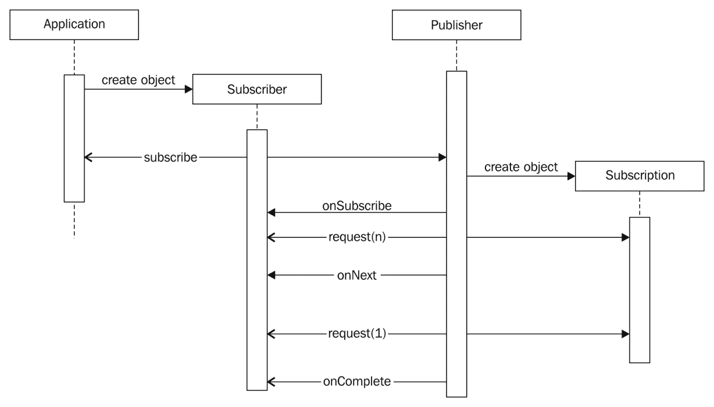
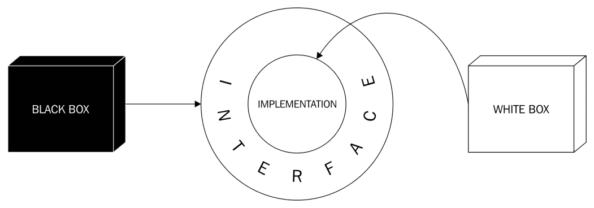
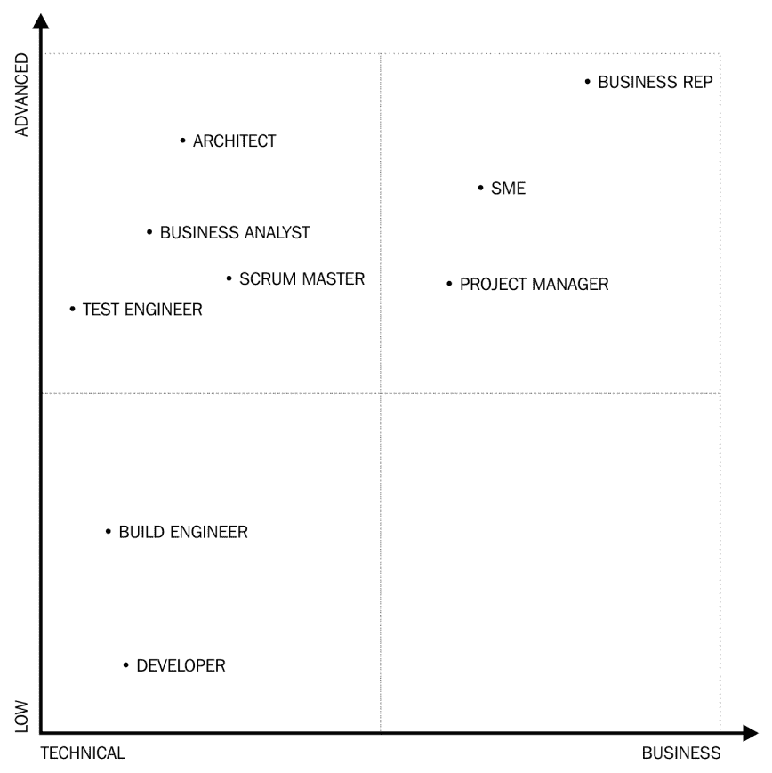

# 使用无功规划构建会计应用程序

在本章中，我们将开发一个样本程序，该计划是公司的库存管理部分我们创建了订单处理代码。 不要指望完全发达，即立即使用的专业应用。 此外，不要指望我们将详细介绍会计和簿记。 这不是我们的目标。 我们将更多地关注问题 - **反应性编程**的编程技术。 对不起，PALS; 我知道簿记和会计很有趣，但这不是那些主题的书。

反应性编程是一个旧的（好，计算机科学中的旧什么？）最近到了 Java 的方法。 Java 9 是第一个支持标准 JDK 中反应性编程的一些方面的版本。 为了将其判处一句话，反应编程是关于更多关于数据如何流动的信息，并且少于实现如何处理数据流。 正如您可能会记得的那样，这也是描述*的步骤，从*如何执行它*，我们要做什么*。

经过本章后，您将了解可靠性的反应编程以及可以使用的 Java 中的工具。 您还将理解反应性编程是什么擅长，以及如何在将来利用这一原则，因为越来越多的框架支持 Java 中的反应编程。 在本章中，您将了解以下主题：

*   反应性编程一般
*   Java 中的反应流
*   如何以反应方式实现我们的示例代码

# 反应......什么？

有反应性编程，反应系统和反应流。 这些是彼此相关的三个不同的东西。 并非没有理由的是，所有三个都被称为*反应*。

无功编程是一个类似于面向对象编程和功能编程的编程范式。 A **无功系统**是一种系统设计，可以对某些类型的信息系统设计为无功而设定某些目标和技术限制。 在此内部有很多与无功编程原则的相似之处。 A **反应流**是一组界面定义，有助于实现与无功系统的类似编码优势，其可用于产生反应系统。 反应流接口是 JDK 9 的一部分。它们可用于 Java 和其他语言。

我们将在单独的部分中查看这些; 在这些部分结束时，您应该更好地了解为什么每个人称为*反应*。

# 坚果壳的反应性编程

反应性编程是一个范式，它在计算期间更长的位置关注数据流量而不是如何计算结果。 该问题最好被描述为彼此彼此依赖的若干计算，但是如果可以独立于另一个可以独立地执行，则可以进入图片中的无功编程。 作为一个简单的例子，我们可以使用以下计算，从一些给定`b`，`c`，`e`和`f`值，使用`f1`，`f2`，`f2`，`f3`，`f4`和`f5`作为简单的计算步骤：

```
a = f1(b,c) 
d = f2(e,f) 
k = f3(e,c) 
g = f4(b,f,k) 
h = f5(d,a,g)
```

如果我们以常规方式在 Java 中编写这些，则将在另一个之后调用`f1`到`f5`的方法。 如果我们有多个处理器，我们能够并行执行执行，我们还可以执行以下一些方法并行。 当然，这假设这些方法纯粹是计算方法，并且不改变环境的状态，并且以这种方式可以彼此独立地执行。 例如，可以彼此独立地执行`f1`，`f2`和`f3`。 `f4`功能的执行取决于`f3`的输出，并且`f5`的执行取决于`f1`，`f2`和`f4`的输出。

如果我们有两个处理器，我们可以一起执行`f1`和`f2`，然后执行`f3`，然后`f4`，最后，`f5`。 这些是四个步骤。 如果我们查看前面的计算不作为命令，而是作为表达式以及计算方式彼此相互依赖，那么我们不决定实际的执行顺序，并且环境可能决定将`f1`和`f3`一起计算在一起，然后 `f2`和`f4`，最后`f5`，节省一步。 这样，我们可以专注于数据流，让反应环境在没有额外的限制


这是一种非常简单的反应编程方法。 表单形式的计算描述给出了数据流，但在说明中，我们仍然假设计算是同步执行的。 如果在位于连接到网络的不同机器上的不同处理器上执行计算，则计算可能不会且不需要同步。 如果环境异步，可以异步执行反应程序。 可能发生在不同的计算机上实现和部署不同的计算`f1`至`f4`。 在这种情况下，计算的值从网络发送到另一个，并且节点每次都有输入时执行计算。 这与使用简单构建块创建的良好的旧模拟计算机非常相似，并且使用模拟信号完成计算。

该程序被实施为电子电路，当输入电压或电流（通常电压）在输入中发生变化时，模拟电路随后在光速下，结果出现在输出中。 在这种情况下，信号传播受到线缆上的光线和有线模块中的模拟电路速度的速度的限制，这非常快，并且可以击败数字计算机。

当我们谈论数字计算机时，*信号*的传播是数字的，这种方式需要从一个计算节点发送到另一个计算节点，是 JVM 中的一些对象或某些程序 网络。 如果以下任一应用，则必须执行其计算：

*   输入中的一些值已更改
*   需要计算的输出

如果输入没有改变，那么结果应该最终与最后一次相同; 因此，计算不需要再次执行 - 这将是浪费资源。 如果不需要计算结果，那么即使结果与最后一个结果也不相同，不需要执行计算。 没人在乎。

为了适应这一点，无功环境实现了两种传播值的方法。 节点可以从其他模块的输出中拉出值。 这将确保未执行不需要的计算。 模块可以将其输出推向依赖于它们的下一个模块。 这种方法将确保只有更改的值点燃计算。 一些环境可以实现混合解决方案。

当系统中的值更改时，更改将转发到另一个节点，该节点再次将更改传播到另一个节点，等等。 如果我们将计算依赖性想象为定向图，则更改沿连接的节点沿着所连接的节点朝向变化值的传递关闭。 数据可以与从一个节点输出到另一节点输入的节点的所有值行进，或者只有更改可能行进。 第二种方法更复杂，因为它需要更改的数据以及描述已更改的内容的元信息。 另一方面，当输出和输入的数据集是巨大的，增益可能是显着的，并且只改变了一小部分。 当存在高概率时，仅计算和传播变化的实际增量也可能很重要，因为某些节点不会为许多不同输入改变输出。 在这种情况下，变化传播可以在没有实际改变的节点处停止，尽管改变了输入值。 这可以在一些网络中省略大量计算。

在数据传播的配置中，定向的非循环图可以在程序的代码中表示; 它可以配置，或者它甚至可以在动态执行代码期间设置和更改。 当程序代码包含图形的结构时，路由和依赖项是相当静态的。 要更改数据传播，必须更改程序的代码，重新编译和部署。 如果有多个网络节点程序，则甚至可能需要多个部署，应仔细配置，以避免在不同节点上运行的不同不兼容的版本。 在某些配置中描述了图表时应该存在类似的考虑因素。 在这种情况下，当仅改变图形的布线时，可能不需要编译程序，但是在网络执行的情况下在不同节点上具有兼容配置的负担。

动态地改变图表也没有解决这个问题。 设置和结构更灵活，同时更复杂。 沿着图形的边缘传播的数据不仅可以包含计算数据，还可以包含驱动图中的变化的数据。 很多时候，这导致了一个非常灵活的模型，称为**高阶反应性编程**。

反应性编程具有很大的好处，但同时，这可能非常复杂，有时太复杂，对于简单的问题。 当使用数据图和简单的数据传播可以轻易描述要解决的问题时，可以考虑。 我们可以分开问题的描述和不同块的执行顺序。 这与我们在上一章中讨论的同样的考虑因素。 我们更详细地描述了*该方法*部分，少于*如何执行*部分。

另一方面，当反应系统决定执行顺序时，改变了什么，以及如何反映在其他块的输出上，它应该这样做，而不知道它正在解决问题的核心。 在某些情况下，基于原始问题的手动编码执行顺序可能更好。

这类似于内存管理问题。 在现代运行时环境中，例如 JVM，Python 运行时，SWIFT 编程，甚至是 Golang，有一些自动内存管理。 在 C 中编程时，程序员可以完全控制内存分配和内存释放。 在实时应用程序的情况下，在性能和响应时间至关重要的情况下，无法让自动垃圾收集器需要时间并不时延迟执行。 在这种情况下，可以优化 C 代码以在需要时分配内存; 有可能在可能时分配和释放内存的资源，并且有时间管理内存。 这些程序比使用垃圾收集器为相同目的创建的程序更好。 尽管如此，我们不在大多数应用程序中使用 C，因为我们可以负担自动内存集合所需的额外资源。 即使可以通过手动管理内存来编写更快的代码，即使是使用 C 创建的平均程序员的自动代码速度快，而且编程误差的频率也大得多。

正如我们必须注意使用自动内存管理时要注意的一些问题，我们必须注意反应环境中的一些问题，这在手动编码时不存在。 尽管如此，我们仍然利用反应方法的益处。

最重要的问题是避免依赖图中的循环。 虽然写入计算定义绝对是完美的，但是反应系统可能无法应对这些定义。 一些反应系统可以在一些简单的循环冗余中解决，但这是一个额外的功能，我们通常只需要避免这种情况。 考虑以下计算：

```
a = b + 3 
b = 4 / a
```

这里，`a`取决于`b`，因此当`b`改变时，计算`a`。 然而，`b`还取决于重新计算的`a`，并且以这种方式，系统进入无限循环。 前面的示例似乎很简单，但这是一个很好的例子的特征。 现实生活中的问题并不简单，并且在分布式环境中，有时会发现循环冗余非常困难。

另一个问题被称为**毛刺**。 考虑以下定义：

```
a = b + 3 
q = b + a
```

例如，当参数`b`改变时，例如，从`3`到`6`，`a`的值将从`6`变为`9`，因此，`q`将从[htg7 改变 ]到`15`。 这很简单。 然而，基于对改变的识别的执行顺序可以首先将`9`到`12`改变`q`的值，然后在第二步修改到`15`之前。 如果负责计算`q`的计算节点识别`a`的值之前识别`a`的值之前，则可能发生这种情况。 在短时间内，`q`的值将是`12`，其与前一个匹配不匹配并且也与改变状态不匹配。 此值仅在输入更改后发生的系统中的毛刺，并且在系统中输入的任何进一步更改，也会消失：


如果您曾经学习过逻辑电路的设计，则**静态危险**可能会响铃。 它们完全相同的现象。

无功编程还假定计算无状态。 执行计算的各个节点可以在实践中具有状态，并且在大多数情况下，它们可以进行。 在某些计算中具有一个状态并不是邪恶的。 但是，调试某个状态的内容明显更复杂，而不是调试无状态和功能。

它对反应环境的重要辅助也是一个重要的辅助，让它根据计算是实际的事实来执行不同的优化。 如果节点具有状态，则计算可能不会自由重新排列，因为结果可能取决于实际评估顺序。 这些系统可能不是真正的*反应性*，或者至少，这可能是争论。

# 反应系统

A **反应性系统**在 [http://www.reacectivemanifesto.org/](http://www.reactivemanifesto.org/) 的反应性宣言中定义。 宣言的创作者意识到，随着技术的变化，需要在企业计算中开发新的系统模式，以利用新技术并产生更好的结果。 Manifesto Envisions 系统如下：

*   响应
*   有弹性的
*   松紧带
*   消息驱动

前三个功能是用户值; 最后一个更像是获得价值的技术方法。

# 响应

系统是*响应*如果它以可靠的方式提供结果。 如果你跟我说话，我会回答你的问题，或者至少告诉你，我不知道答案或者我无法理解这个问题。 是的，最好得到答案，但如果系统不能给你，它仍然有望回馈一些东西。 如果您只有十年前与客户操作系统的经验，以及一些旧计算机，可以理解这一点。 获得旋转的沙漏是令人沮丧的。 你只是不知道系统是否正常工作，以帮助您答案或是否完全冻结。

反应系统必须响应。 响应应该及时出现。 实际时间取决于实际系统。 如果系统在朝向木星的另一侧行驶的宇宙飞船上运行，则可能是毫秒，秒甚至几个小时。 重要的是，系统应保证一些*软*上限响应时间。 这并不一定意味着该系统应该是实时解决方案，这是一个更严格的要求。

响应能力的优点不仅是用户在计算机前面没有紧张。 毕竟，大多数这些服务都被主要与彼此通信的其他服务使用。 实际优势是错误发现更可靠。 如果反应系统元素变得不响应，则当然是一个错误条件，并且应该在正常操作范围内完成一些错误状态（更换故障通信卡，重新启动系统等）。 我们越早可以识别错误状态，更便宜的是修复它。 我们越多可以识别问题所在的位置，我们可以花费的时间和金钱来定位错误。 响应不是速度; 它是关于更好的操作和更好的质量。

# 有弹性的

**弹性系统**继续工作，即使存在错误。 好吧，没有任何错误。 这将是一个奇迹，或简单的废话！ 错误通常是错误。 如果 Armageddon 来了，这是我们所知道的世界末日，甚至弹性系统也不会响应。 然而，对于较小的破坏，可能有一些方法可以使系统有弹性。

有技术可以帮助只有磁盘发生故障，有一个停电，或者存在编程错误。 可以复制系统，因此当其中一个实例停止响应时，一些其他实例可以占用失败的实例并且可以继续工作。 在空间或时间方面可以彼此逐一地分离错误。 当一个地方发生地震或洪水时，其他位置仍然可以继续工作。 如果不同的组件不需要实时通信，并且以可靠的方式存储和转发消息，那么即使两个系统也不同时可用，这不是问题。 它们仍然可以通过占用消息，执行它们所在的任务，并以后发送所产生的消息。

即使系统仍然响应，也必须解决系统中的错误。 错误不会影响弹性系统的响应性，但弹性水平降低，应恢复。

# 松紧带

**弹性**意味着系统正在适应负载。 我们可以拥有一个巨大的系统，拥有许多处理器，能够提供最大的预期需求，但这不是弹性，因为需求不是恒定的，大多数时候都小于最大值，所以这样的系统的资源 是空闲的。 这浪费时间，CPU 周期和能量，从而创造了生态足迹：


在云上运行系统可以避免这种损失。 云只不过是许多计算机，即某人为多个应用程序运行，即使是多个公司，也只有每个租用它真正需要的 CPU 周期，并且只有在需要它们时才。 在其他时代，当负载较小时，可以由其他人使用 CPU 和电力。 由于不同的应用和不同的公司具有不同的高峰时间，因此该模型的资源损失较少。 有许多问题必须解决，例如来自窃听的数据隔离和信息保护，但这些主要是解决的。 秘密服务公司不会从云服务租用资源以运行他们的计算（也许，他们为其他目的而做的），其他一些偏执的公司也可能避免这样做，但大多数公司都将要做。 它更有效，因此即使在考虑所有可能的副作用后也便宜。

弹性意味着分配的资源遵循，或者更相当预期的需求。 当系统预期更高容量的需求时，它会分配更多资源，并且在非高峰时段，它释放资源，以便其他云客户可以使用它。

弹性还假定系统可扩展。 这两件事，弹性和可扩展性，密切相关，但不一样。 *可伸缩性*意味着应用程序可以容纳更高的负载，分配更多资源。 可扩展性并不关心此分配是否是庞大的计算机框在庞大的计算机盒中专用于云的应用程序或动态分配来自云的需求。 可扩展性简单意味着，如果需求加倍，那么资源也可以乘以满足需求。 如果所需资源中的乘法因子是相同或不超过需求的因素，则应用程序是可扩展的。 如果我们需要更多资源来满足需求，或者如果我们无法满足需求，即使需求量仅适度增加，那么应用程序也不可扩展。 弹性应用始终可扩展; 否则，它们不能弹性。

# 消息驱动

反应系统是**消息驱动的**，而不是因为我们需要消息驱动的系统，而是因为消息驱动的系统是那些可以同时提供响应性，弹性和弹性的系统。

消息驱动的架构意味着信息在断开连接的组件之间进行行进。 一个组件发送消息，然后*忘记*它。 它不等待其他组件在消息上行动。 发送消息时，执行发送组件的所有任务，并且释放处理任务所需的所有资源，导致释放消息并准备好用于下一个任务。

*消息驱动*不一定是指*网络*。 消息可以在同一台计算机内的对象，线程和进程之间旅行。 另一方面，如果对消息传递架构的接口设计良好，那么如果基础设施的变化，并且之前在线程之间传递的消息现在必须在 IP 中旅行，因此不需要修改组件 数据包。

发送消息使得可以在空间和时间内隔离发件人和接收器，就像我们所描述的那样，作为弹性的手段。 当它有资源时，接收器可以在到达之后一段时间来播放消息。 但是，响应性要求这次不可在无法到达的遥远的未来，而是在一些有限的距离中。 如果无法成功处理消息，则另一个消息可能会发信号错误。 错误消息不是我们预期的结果，但它仍然是一个响应，系统仍然响应它所提供的所有优势。

# 背压

消息处理，使用适当的消息传递接口和实现，支持**后压**。 后压是在不能或几乎无法处理更多消息时减少组件的负担的手段。 消息可能排队以进行处理，但没有现实队列具有无限容量，而无功系统不应丢失不受控制的消息。 背压表示组件的负载到消息生产商，要求他们减轻生产。 它就像一个水管。 如果开始关闭管道的出口，则压力开始向向后增加管道，水源强迫它越来越少的水。

后压是一种有效的处理负载方式，因为它将负载处理移动到能够真正做到的组件。 在旧式的排队系统中，有一个队列存储项目，直到接收它们的组件可以消耗它们，执行其工作。 如果队列大小和队列的最大大小存在明确限制，则队列设计可能是良好的。 如果队列完整，则无法传送项目，并且系统摊位。

施加反压有点不同。 队列仍可能在组件前面用于性能优化并确保响应性。 该物品的生产者仍然可以将生产的项目放在队列中，并返回参加自己的职责，并且不需要等到消费者可以参加该项目。 正如我们之前提到的那样，这是解耦的。 看到队列完全或几乎完全可以充当一个非常简单的背压。 如果有人说队列完全缺少此功能，则不是真的。 有时，它可以简单地只是为了看看队列的容量，以及它中的项目，看看是否有一些需要减少队列所属的接收器上的负载。 但制作人这样做，而不是接收者，这是一个重要的问题。

制片人看到接收器没有跟上供应的步伐，但生产者没有关于原因的任何信息，而且不知道原因无法预测未来的行为。 从接收器到生产商的后压信息通道使故事更细粒度。

生产者可能会看到，在队列中有 10 个插槽，它认为没有问题; 制片人决定在接下来的 150ms 中提供八个项目。 一个项目通常需要 10 毫秒来处理，给予或服用; 因此，预计该项目将在小于 100ms 的情况下处理，这与最大所需的 200ms 更好。 生产商仅知道一个项目*通常*需要 10ms 才能处理。 另一方面，接收器看到它进入队列的最后一个项目需要如此多的处理，本身将需要 200ms。 为了发出信号，它可以在背部压力下告诉生产者不提供新项目，直到进一步通知。 接收方知道该项目将很好地拟合到队列中，但不会及时处理。 使用此信息，生产者将向云控件发出一些命令，分配另一个处理，并将下一个八个项目发送到新接收器，让旧的一个笨重的作业将其繁琐的作业，它必须与远远超过平均项目。

背部压力允许您帮助数据加载控制，其中由具有关于处理项目的最多信息的接收器创建的信息。

# 反应溪流

**反应流**开始作为一种主动，以通过使用反压力调节数据的推动来提供异步模式下的处理数据流的标准。 该项目的原始站点是 [http://www.revective-streams.org/](http://www.reactive-streams.org/) 。

现在在`java.util.concurrent`封装中的 JDK 9 中实现了反应流。

反应流定义的目的是定义可以在完全异步方式处理所生成的数据的传播，而无需接收侧的需要，以缓冲无限制的创建数据。 当在流中创建数据并且可用于工作时，获取数据的工作人员必须足够快，以处理生成的所有数据。 容量应该高，以处理最高的生产。 一些中间缓冲区可以处理峰值，但如果在消费者处于其容量的顶部时，如果没有阻止或延迟产生的控制，则系统将失败。 无功系统界面旨在提供一种支持背压的方法。 背压是一种用信号发出数据的过程，以减速甚至停止生产到适合消费者的水平。 每个呼叫接口定义都是异步，以便一个部分的性能不受其他部分执行中的延迟的影响。

该倡议没有旨在确定数据在生产和消费之间转移的方式。 它侧重于接口，为程序提供明确的结构，并提供将与所有实现一起使用的 API。

# Java 中的反应性编程

Java 不是反应性语言。 但是，这并不意味着我们无法在 Java 中创建反应程序。 有网格支持不同的无功编程方法。 我应该提到 AKKA 框架和 Reactivex 也存在其他语言。 使用 Java 9，JDK 开始支持无功编程，为此目的提供一些类和接口。 我们现在将专注于这些功能。

JDK 包含`java.util.concurrent.Flow`类，其中包含相关的接口和一些静态方法来支持流量控制程序。 此类支持的模型基于`Publisher`，`Subscriber`和`Subscription`。

作为一个非常简单的解释，`Publisher`接受来自 A `Subscriber`的订阅。 a `Subscriber`获取数据可用时的数据。 接口专注于通信数据流控制的非常核心，它们是一个摘要，因此它们是接口。 然而，最初可能不太清楚地工作。

`Publisher`接口定义了`subscribe()`方法。 这是此接口定义的唯一方法，这是因为这是 *Real* 发布者可以询问的唯一方法。 您可以订阅出版物。 该方法的参数是`Subscriber`，用于订购出版物：

```
void subscribe(Flow.Subscriber<? super T> subscriber)
```

在 JDK 中有一个随机可用的`Publisher`类，我们稍后会看到。 当调用`Publisher`的`subscribe()`方法时，它必须决定订户是否可以获得订阅。 通常，订阅被接受，但实施具有拒绝订阅尝试的自由。 `Publisher`例如，如果已经执行了实际订户的订阅并且`Publisher`实现不允许来自同一订户的多个订阅的订阅，则可以拒绝订阅。

该方法的实现是呼叫`subscriber`的`onError()`方法，`Throwable`作为参数。 在多个订阅的情况下，`IllegalStateException`似乎是合适的，因为 JDK 文档目前定义。

如果订阅成功，则预计`Publisher`将调用`subscriber`的`onSubscribe()`方法。 此方法的参数是`Subscription`对象（实现接口`Subscription`的类的实例）。 这样，`Publisher`通知`Subscriber`已接受订阅请求，并通过对象来管理订阅。

管理订阅作为抽象可以将其想象为一个复杂的任务，但在反应流的情况下，它非常简单。 所有订阅者都可以并且应该做的是它目前可以接收的物品数量，并且可以取消订阅。

为什么`Publisher`应该调用`Subscriber`的`onSubscribe`方法？ 为什么它不仅仅返回订阅或抛出一些错误？ 这种复杂行为的原因是它可能不是调用`subscribe()`方法的`Subscriber`。 就像现实生活一样，我可以为圣诞礼物订阅一年的杂志订阅。 （这是我写这本书的这一本部分的季节。）在我们的代码中，一些负责谁的接线组件是关于某些数据更改调用`subscribe`的通知，而不是用户。 `Subscriber`仅对订阅者应对的最小件物品负责。 另一个原因是整个方法是异步的。 当我们订阅某些东西时，订阅可能无法立即提供并准备好。 在订阅将可用之前，可能需要完成一些需要完成的过程，并且调用`subscribe`的来电者不需要等待完成过程。 订阅准备就绪后，它将传递给订户，以确保真正需要它的实体。

`Subscriber`接口定义了`onSubscribe()`，`onError()`（我们已经谈过这些），`onComplete()`和`onNext()`方法。

在订户从`Publisher`中的项目或来自`Publisher`通过某种推动的一些其他对象中的某些其他对象的定义非常重要。 订阅者不需要转到*报摊*以获得下一个问题; 调用`onNext`方法的人直接向其提供问题。

这也承担了结果，除非`Subscriber`手中有一些控件，否则可能会发生`Publisher`泛洪与物品的`Subscriber`。 不是每个`Subscriber`都能够处理无限的物品。 `Subscriber`在执行订阅时获取`Subscription`对象，并且该对象可用于控制项目对象的流程。

`Publisher`创建`Subscription`对象，接口定义了两个方法 - `cancel`和`request`。 `cancel()`方法应由`Subscriber`调用以通知`Publisher`，它不应该提供更多项目。 订阅已取消。 `request(long n)`方法指定订户准备通过对`onNext()`方法的后续调用获得最多`n`项：



如果订阅者已经调用了`request()`方法，则将指定的数字添加到订阅计数器中。 换句话说，指定的`long`值不反映订户的实际状态。 它是一个 *delta* ，增加由`Publisher`维护的一些计数器，这些计数器计数可以传递的项目数，添加`long`参数的值并通过*一个* 在交付给`Subscriber`的每个项目上。 最常的方法是每次调用`request(1)`，每次`Subscriber`完成处理请求时。

如果使用`Long.MAX_VALUE`参数调用`request()`方法，`Publisher`可以只发送它可以在不计数且无限制的情况下发送任何物品。 这基本上是关闭背压机制。

该规范还提到了对`cancel`的呼叫并不一定意味着根本没有更多的问题。 取消完成最佳努力。 就像在现实生活中一样，当您将邮件发送到日常纸张时，您的意图取消订阅时，发布者不会在将问题放入邮箱之前发送代理程序来停止邮递员。 如果在取消到达出版商时已经出现了一些东西，它继续前进。 如果`Publisher`已经开始了无法合理停止的异步进程，则将使用一些元素调用`onNext()`方法。

`Publisher`和`Subscriber`接口具有泛型参数`T`。 这是`Publisher`接口发布和`Subscriber`接口在`onNext()`方法中的项目类型。 要更精确，`Subscriber`界面可以具有`R`类型，这是`T`的超类; 因此，它与`Publisher`界面兼容。 例如，如果`Publisher`发布`Long`值，那么根据类的声明，`Subscriber`接口可以在`onNext()`方法的参数中接受`Long`，`Number`，`Object` 实现`Subscriber`。

`Flow`类还包含一个`Processor`接口，其延伸了`Publisher`和`Subscriber`。 该接口是由类实现的，也可以接受数据并将数据发送到反应流中的其他组件。 这种元素在反应流程序中非常常见，因为执行一些任务的许多元素获取从其他反应流元素工作的项目; 因此，它们是`Subscriber` s，同时，他们在完成任务后发送它; 因此，它们是`Publisher` s。

# 实施库存

现在我们已经讨论了很多技术和编程方法，是时候实现一些示例代码了。 我们将使用反应流实施库存，在我们的应用中保持应用。 对于该示例，库存将非常简单。 它是一个`Map<Product,InventoryItem>`，其包含每个产品的项目数。 实际地图是`ConcurrentHashMap`，`InventoryItem`类比`Long`编号更复杂，以正确处理并发问题。 当我们设计一个基于响应流的程序时，我们不需要处理大量的并发锁定，但我们仍然应该意识到代码在多线程环境中运行，如果我们不遵循一些规则，可能会表现出奇怪的行为。

`Inventory`类的代码非常简单，因为它只处理地图：

```
package packt.java11.mybusiness.inventory;

import ...

@Component
public class Inventory {
    private final Map<Product, InventoryItem> inventory =
            new ConcurrentHashMap<>();

    private InventoryItem getItem(Product product) {
        inventory.putIfAbsent(product, new InventoryItem());
        return inventory.get(product);
    }

    public void store(Product product, long amount) {
        getItem(product).store(amount);
    }

    public void remove(Product product, long amount)
            throws ProductIsOutOfStock {
        if (getItem(product).remove(amount) != amount)
            throw new ProductIsOutOfStock(product);
    }
}
```

维护类的库存项有点复杂，因为这是我们处理一系列并发的级别，或者至少是我们必须支付一些关注的课程：

```
package packt.java11.mybusiness.inventory;

import java.util.concurrent.atomic.AtomicLong;

public class InventoryItem {
    private final AtomicLong amountOnStock =
            new AtomicLong(0);

    void store(long n) {
        amountOnStock.accumulateAndGet(n,
                (stock, delta) -> stock + delta);
    }

    long remove(long delta) {
        class ClosureData {
            long actNr;
        }
        var d = new ClosureData();
        amountOnStock.accumulateAndGet(delta,
                (stock, n) ->
                        stock >= n ?
                                stock - (d.actNr = n) :
                                stock - (d.actNr = 0));
        return d.actNr;
    }
}
```

当我们将产品添加到库存时，我们没有限制。 存储架非常巨大，我们不会模拟它们可能完整，并且库存可能无法容纳更多物品。 但是，当我们想要从存储库中删除物品时，我们必须处理产品中可能没有足够的物品。 在这种情况下，我们不会从存储库中删除任何项目。 我们为客户提供全面满足，或者我们根本不服务。

要维护库存中的项目的数量，我们使用`AtomicLong`。 此类具有`accumulateAndGet()`方法。 此方法获取`Long`参数和我们在代码中作为 Lambda 提供的`LongBinaryOperator`。 `accumulateAndGet()`方法调用此代码来计算股票的新价值。 如果有足够的物品，那么我们删除了所请求的项目数。 如果有足够的物品库存，那么我们会删除零。 该方法返回我们实际返回的项目数。 由于该数字在λ内计算出来，它必须从那里逃脱。 为此，我们使用`ClosureData`，该方法在方法内定义。

请注意，例如，在 Groovy 中，我们可以简单地使用`Long d`变量并更改闭合内的变量。 Groovy 称 lambda 封闭，所以说话。 在 Java 中，我们不能这样做，因为我们可以从内部访问方法访问的变量应该有效。 但是，这几乎没有比封闭环境更明显的符号。 `ClosureData d`对象是最终的，而不是该类的字段，这可以在 Lambda 内修改。

我们对本章非常感兴趣的最有趣的课程是`InventoryKeeper`。 此类实现`Subscriber`界面，并能够消耗订单以维护库存：

```
package packt.java11.mybusiness.inventory;

import ...

public class InventoryKeeper implements Flow.Subscriber<Order> {
    private static final Logger log = LoggerFactory.getLogger(InventoryKeeper.class);
    private static final long WORKERS = 3;
    private final Inventory inventory;
    private Flow.Subscription subscription = null;
    private ExecutorService service = Executors.newFixedThreadPool((int) WORKERS);

    public InventoryKeeper(@Autowired Inventory inventory) {
        this.inventory = inventory;
    }

    @Override
    public void onSubscribe(Flow.Subscription subscription) {
        log.info("onSubscribe was called");
        subscription.request(3);
        this.subscription = subscription;
    }

    @Override
    public void onNext(Order order) {
        service.submit(() -> {
                    log.info("Thread {}", Thread.currentThread().getName());
                    for (final var item : order.getItems()) {
                        try {
                            inventory.remove(item.getProduct(), item.getAmount());
                            log.info("{} items removed from stock", item.getAmount());
                        } catch (ProductIsOutOfStock exception) {
                            log.error("Product out of stock");
                        }
                    }
                    subscription.request(1);
                }
        );
    }

    @Override
    public void onError(Throwable throwable) {
        log.info("onError was called for {}", throwable);
    }

    @Override
    public void onComplete() {
        log.info("onComplete was called");
    }
}
```

在订阅对象后调用`onSubscribe()`方法。 订阅传递给对象，也存储在字段中。 由于订户在后续调用中需要此订阅，因此处理在`onNext`中传递的项目并可接受新项目时，字段是存储此对象的好地方。在此方法中，我们还将初始请求设置为 三个项目。 实际值简单地说明。 企业环境应该能够配置此类参数：

```
private ExecutorService service =  
                   Executors.newFixedThreadPool((int) WORKERS);
```

代码中最重要的部分是`onNext()`方法。 它实际上是通过订单的所有项目，然后从库存中删除项目数。 如果某些项目缺货，则会记录错误。 这是无聊的部分。 有趣的部分是通过执行者服务完成这一点。 这是因为对`onNext`的调用应该是异步的。 出版商调用`onNext`来提供该项目，但我们不应该让它等待实际处理。 当邮递员带来您最喜欢的杂志时，您就不会立即开始阅读并使邮递员等待您的签名批准。 您在`onNext()`中必须做的就是获取下一个订单，并确保将在适当的时间处理。

此代码中的实际实现使用其中三个线程使用`ThreadPool`。 此外，所需物品的数量是三个。 这是一个逻辑巧合 - 每个线程在单个项目上工作。 它不需要像那样，即使在大多数情况下也是如此。 如果有意义，没有什么可以阻止我们在同一项目上工作的更多线程。 相反也是如此。 可以创建一个单线以在多个项目上工作。 这些代码可能更复杂，这些复杂的执行模型的整个想法是使编码和逻辑更简单，将多线程，编码和实现问题移动到框架中，并专注于应用程序代码中的业务逻辑 。 但我不能说明用户在多个项目上工作多个线程的用户可能没有示例。

我们必须在本章中查看的最后一个代码是使用一些示例驱动代码的单元测试：

```
@Test
public void testInventoryRemoval() throws InterruptedException {
    Inventory inventory = new Inventory();
    try (SubmissionPublisher<Order> p = new SubmissionPublisher<>();) {
```

我们使用 JDK 类（HTG1]创建`Publisher`，`SubmissionPublisher`通过为我们提供多线程功能而无需非常麻烦来实现此界面：

```
p.subscribe(new InventoryKeeper(inventory));
```

我们创建了一个库存守门员，我们订阅了发布商。 这不会开始提供任何东西，因为尚未出版物，但它在订户和发布者之间创造了债券，告诉他们，每当提交产品时，订户都希望它。

之后，我们创建产品并将其存储在库存中，共 20 件，我们还创建了一个想要交付 10 个产品的订单。 我们将多次执行此订单。 这是一点简化，但对于测试，没有理由在项目列表中创建具有相同产品的单独订单对象和相同的数量：

```
Product product = new Product();
inventory.store(product, 20);
OrderItem item = new OrderItem();
item.setProduct(product);
item.setAmount(10);
Order order = new Order();
List<OrderItem> items = new LinkedList<>();
items.add(item);
order.setItems(items);
```

毕竟，这已经完成了; 我们将订单提交给`Publisher` 10 次。 这意味着同一产品有 10 个订单，每个订单每次要求 10 件，这是完全 100 件。 那些对仓库有 100 件，我们只有 20 个。 我们应该期望的是，只有前两个订单将得到满足，其余的将被拒绝，这就是在执行此代码时实际发生的事情：

```
for (int i = 0; i < 10; i++)
    p.submit(order);
log.info("All orders were submitted");
```

毕竟订单发布后，我们等待半秒，以便其他线程有时间执行，然后我们完成：

```
    for (int j = 0; j < 10; j++) {
        log.info("Sleeping a bit...");
        Thread.sleep(50);
    }
}//try( p )
```

请注意，这不是常规的单位测试文件。 它是一些测试代码，我还建议您执行，调试和查看不同的日志输出。

# 概括

在本简要章节中，我们介绍了反应性编程，无功系统和反应流。 我们讨论了这些相似之处和这些可能导致混淆的差异。 我们特别注意 Java 反应流（在 Java 9 中引入），与`Stream`类和方法几乎无关。

在本章的下半部分，我们讨论了一个非常简单的例子，它使用反应流。

阅读本章后，您已经学到了很多关于 Java 语言和编程。 我们没有详细介绍一下 java 的所有小位，因为这是一本书中的不可能。 我敢说，地球上没有人，或者在轨道路线上，无论人类都是关于 Java 的一切。 然而，我们现在已经知道了，现在可以在企业环境中开始编码，并在我们退休的情况下了解更多和更多，甚至在此之后。 仍然剩下的是一点点编程。 在上一句话中，我使用了*编码*的区别。 编码与编程不同。 编码是用于编程专业的技术。 在最后一章中，我们将看到编程的各个方面以及它如何，而且应该以专业的方式完成。 这是一个介绍的书籍很少涵盖，但我很高兴我们可以与出版商同意这一主题。 这样，你可以完成这本书，不仅仅是你从这本书中学到的知识，而且还有一个愿景，展望在路上，你将走上山坡到顶部。 您将了解您可以参加学习的主题，领域和科目。

# 将 Java 知识定位到专业水平

到目前为止，您已经了解了专业 Java 开发人员所需的最重要的领域和主题。 我们仍然领先于我们的是讨论一些将导致您成为高级开发人员的初级开发人员的主题。 虽然阅读本章不会让任何人成为高级开发人员。 之前的章节是我们走下去的道路。 本章只是地图。 如果之前的每个章节在编码到达港口的旅程中覆盖了几英里的距离，那么这一章是船舶​​地图，可以发现一个新的大陆。

我们将简要介绍一些非常深度和高级别的专业领域，如创建 Java 代理，编译时注释处理，Polyglot 编程，一些架构设计，工具和技术在团队中工作。 我们将提供这些领域的捷克。 现在，您有足够的知识来了解这些主题的重要性，而且获得一种味道将为未来几年的自我开发创造胃口，或者至少是我打算让您成为读者，上瘾。

# Java Deep Technologies

在本节中，我们将涵盖三种技术：

*   Java 代理人
*   polyglot 编程
*   注释处理

知道它们不是 java 专业人士的必备。 了解它们是。 Java 代理主要用于开发环境和运营中。 它们是复杂的运行时技术，它与已经运行的 *JVM* 交互。 注释处理是另一个区域。 注释处理器已插入 Java 编译器。 Polyglot 编程位于中间。 它是 JVM 编程，就像 Java 中的编程一样，但使用不同的语言或者，也许是不同的语言和 Java。 甚至多种语言，如 Jython，Groovy 或 Clojure，以及 Java 在一起。

我们将讨论这些技术，以便您了解他们是什么以及在您想要了解更多信息的情况下，在哪里寻找更多信息。

# Java 代理人

Java 代理是 Java 程序，该程序由 Java 运行时以特殊方式加载，并且可用于干扰加载类的字节码以更改它们。 它们可用于执行以下操作：

*   列表或日志，并在加载时在运行时报告加载的类
*   修改类，以便该方法包含额外的代码以报告运行时行为
*   支持调试器以更改类的内容，因为开发人员修改了源代码

该技术用于例如 **JREBEL** 和 **XREBEL** 产品来自 [https://zeroturnaround.com/](https://zeroturnaround.com/) 。

虽然 Java 代理在 Java 的深刻细节中工作，但它们不是魔法。 它们有点复杂，您需要深入了解 Java，但任何可以在 Java 中编程的人都可以编写 Java 代理。 所有必需的是，作为代理的类都有一些预定义的方法包装成 JAR 文件以及代理的其他类，并且具有一个`META-INF/MANIFEST.MF`文件，该文件定义实现`premain()`的类名称 和/或`agentmain()`方法和一些其他字段。

详细和精确的参考文档是 *javadoc* 的一部分： [https://docs.oracle.com/javase/8/docs/technotes/guides/instrumentation/index.html](https://docs.oracle.com/javase/8/docs/technotes/guides/instrumentation/index.html) 在`java.lang.instrument`包的文档中。

使用 Java 代理启动 Java 应用程序时，命令行必须包含以下选项：

```
-javaagent:jarpath[=options]
```

这里，`jarpath`指向包含代理类和清单文件的 jar 文件。 该类必须具有命名为`premain`或`agentmain`的方法。 它可能有一个或两个参数。 JVM 尝试首先在初始化 JVM 之后调用双参数版本：

```
public static void premain(String agentArgs, Instrumentation inst);
```

如果不存在两个参数版本，则使用一个参数版本，这与双参数版本基本相同，但遗漏了仪器参数，从我认为，这不会产生太多意义 没有`Instrumentation`对象，Java 代理无法做得很多：

```
public static void premain(String agentArgs);
```

`agentArgs`参数是作为命令行上作为选项传递的字符串。 `Instrumentation`的第二个参数提供了注册类变换器的方法，可以修改可以要求 jvm 在运行时在运行时询问 jvm 的类字节码和方法的方法。

Java 应用程序还可以在程序已启动后加载代理。 在这种情况下，无法在 Java 应用程序的主要方法之前调用代理，因为它已经开始了该时间。 要分开这两种情况，JVM 调用`agentmain`在这样的场景中。 请注意，为代理调用`premain`或`agentmain`，而不是两者。 单个代理可以实现这两者，使得它能够在命令行或 JVM 启动后指定的启动时执行其在启动时加载的任务。

如果使用`agentmain`，它具有与`premain`相同的参数。

`premain()`和`agentmain()`的调用之间存在一个重要和重要的差异。 如果在启动期间无法加载代理，例如，如果找不到 jar 文件，如果 jar 文件不存在，则如果类没有`premain()`方法，或者它抛出异常，则 JVM 将中止。 如果在启动 JVM 后加载代理（在这种情况下，要使用`agentmain`），则 JVM 将不会中止如果代理中存在某些错误。

这种方法相当合理。 想象一下，有一个在 Tomcat servlet 容器上运行的服务器应用程序。 启动新版本时，系统会进入维护期间。 如果无法启动新版本，因为代理程序不是良好的，因此最好不要启动。 调试情况的损坏并修复它，或将应用程序滚动到旧版本并呼叫更长的修复会话，可能小于启动应用程序而不具有适当的代理功能。 如果应用程序仅在没有代理的情况下启动，则可能无法立即识别次优操作。 另一方面，稍后附加代理时，应用程序已运行。 代理附加到已运行的应用程序中以从已运行的实例获取信息。 要停止已运行的实例并失败，特别是在操作环境中，比未附加代理更具损害。 无论如何，它可能不会被忽视，因为运营人员使用的是最可能附加的代理。

`premain`或`agentmain`代理作为第二个参数获取`Instrumentation`对象。 此对象实现了几种方法。 其中一个是：

```
void addTransformer(ClassFileTransformer transformer)
```

代理实现变压器，它具有`transform()`方法签名：

```
byte[] transform(Module module, ClassLoader loader, 
                 String className, 
                 Class<?> classBeingRedefined, 
                 ProtectionDomain protectionDomain, 
                 byte[] classfileBuffer) 
throws IllegalClassFormatException
```

当加载类或将要转换时，通过 JVM 调用此方法。 该方法获取类对象本身，但更重要的是，它获取包含类的字节码的字节数组。 该方法预计将返回变换类的字节码。 修改字节码需要一些了解字节码如何构建和类文件的结构。 有有助于这样做的库，例如 javassist（ [http://www.javassist.org/](http://www.javassist.org/) ）或 asm（ [http://asm.ow2.org/](http://asm.ow2.org/) ） 。 尽管如此，我不会开始编码，然后熟悉字节码的结构。

代理，在一个单独的线程中运行并大概与用户或文件系统交互并基于任何时间的外部观察，可以使用注册的变压器调用以下方法来执行类的再转换：

```
void retransformClasses(Class<?>... classes)
```

代理还可以调用以下方法，这将重新定义作为参数给出的类：

```
void redefineClasses(ClassDefinition... definitions)
```

`ClassDefinition`类简单地是一个`Class`和`byte[]`对。 这将通过 JVM 的类维护机制重新定义类。

请注意，这些方法和 Java 代理与 JVM 的深度低级别部分交互。 这也承担了摧毁整个 JVM 的结果。 未检查字节码，与类的加载不同，因此，如果它有一些错误，则结果不仅可能是异常，而且可能是 JVM 的崩溃。 此外，重新定义和变换不应改变类的结构。 它们不应更改其继承足迹，添加，重命名或删除方法，或更改方法的签名，而且对于字段也是如此。

另请注意，已创建的对象不会受到更改的影响; 它们仍将使用类的旧定义，只有新的实例将受到影响。

# polyglot 编程

Polyglot 编程是在相同应用中使用不同编程语言的技术。 当应用程序的不同部分在不同的环境下运行时，这种方法不仅适当。 例如，客户端在浏览器中使用 JavaScript，CSS 和 HTML 执行，而服务器被编程为在 Java 中的 Tomcat 环境中运行。 这是一个不同的故事，而且，通常情况下，如果有人在谈论 Polyglot 编程时，这不是典型的用例。

当在服务器上运行的应用程序部分运行在 Java 中，也可以在其他语言中运行，然后我们可以将其称为 PolyGlot 编程。 例如，我们在 Java 和一些代码中创建订单处理应用程序，这些代码基于订单包含的特定于产品的代码在 JavaScript 中编写的特定于产品的代码。 它响铃吗？ 我们已经在本书中完成了这一点，以演示 JDK 的脚本 API。 即使我们没有提到这一点，这是真正的 Polyglot 编程。

运行编译的 Java 代码的 JVM 是对不同语言编译器的非常好的目标，因此，有许多语言编译它。 当 JVM 运行类的字节码时，它不知道源语言是什么，它并不真正关心; 编译器由字节码创建，它只是执行。

我们可以使用不同的语言，例如 Jython，Groovy 和 Scala，命名一些流行的语言，这为 JVM 编译。 我们可以使用一种语言编写一个类，另一类使用另一个语言。 当它们组合成罐子，战争或耳朵文件时，运行时系统将只是运行它们。

我们什么时候使用 polyglot 编程？

# Polyglot 配置

通常，当我们想要创建更灵活和可配置的应用程序时，我们会转向多胶编程。 在许多实例中安装的应用程序通常在不同的客户站点上有一些配置。 这些配置可以是 XML 文件，属性文件和 INI 文件（来自 Windows 的 INI 文件）。 随着程序的发展，这些静态配置可能性达到了限制。 应用程序开发人员很快就会看到他们需要配置使用这些技术的繁琐的功能。 配置文件开始越来越大，读取和解释配置文件的代码增长太大。 良好的开发人员必须意识到这是这种情况，并且在配置文件和处理它们变得无法管理的代码之前，必须实现一些脚本配置，多革编程 Polyglot 编程：


当他们开发他们的配置语言和该语言的解释器时，体面的开发人员团队可能会达到一个点。 它可以基于 XML，或者它可以是任何其他语言。 毕竟，写一种语言很有趣; 我自己已经完成了几次。 然而，大多数人都是爱好，而不是专业的项目。 通常，在制定另一种语言方面没有客户价值。 最好使用现有的。

在配置的情况下，Groovy 是一种非常方便的语言，支持复杂的封闭和元类语法和实现。 这样，语言非常适合创建特定于域的语言。 由于 Groovy 编译为 JVM，因此可以直接从 Java 调用 Groovy 类，并读取配置基本上调用从配置文件编译的类。 汇编可以在应用程序构建时，但在配置的情况下，在应用程序启动期间会更有意义才能执行此操作。 我们已经看到，Groovy 提供的脚本 API 或特殊 API 的 Groovy 实现绝对能够这样做。

我们在书中看到了这一点吗？ 对您来说可能是一个惊喜，但我们实际上已经使用了 Groovy 来描述多次配置。 *gradle* 构建文件只不过是 Groovy DSL，主要用于 Groovy 以支持项目的构建配置。

# polyglot 脚本

配置不是 PolyGlot 编程的唯一应用。 配置在程序的启动时执行，并且配置数据后方用作静态数据。 我们可以在应用程序的执行期间执行脚本，而且不仅在启动期间。 这可用于为程序的用户提供额外的功能，使用相同应用程序的安装，但是由不同的脚本提供。

提供此脚本功能的第一个应用程序之一是 Emacs 编辑器。 应用程序的核心是用 C 语言编写的，它包含一个 LISP 解释器，让用户编写脚本，该脚本在编辑器环境中执行。 AutoCAD，工程计划，也使用了用于类似目的的 Lisp 解释器。 为什么 Lisp 用于此目的？ Lisp 具有非常简单的语法，因此，可以轻松解析 LISP 代码。 与此同时，语言强大，当时还有开源 LISP 解释器（至少一个）。

为了获得这种灵活性，应用程序通常提供开发人员可以用于扩展应用程序的插件 API。 这要求开发人员设置编码工具，包括 IDE，构建工具和持续集成，即专业编程环境。 当用插件要解决的任务很简单时，开销太大了。 在这种情况下，脚本解决方案是允许的。

脚本不是一切的解决方案。 当扩展应用程序的脚本变得过于复杂时，这意味着脚本可能性太大。 然而，难以从孩子那里收回玩具。 如果用户习惯了脚本可能性，那么如果我们发布的应用程序的下一个版本没有提供这种可能性，则它们不会妥善。 因此，评估我们应用中可能使用脚本能力的使用非常重要。 脚本和更通常是我们程序的任何特征，不会以我们的意图方式使用。 它们将用于任何可以使用它们的东西。 在滥用功能时，用户可以超越所有想象力。 想想预先限制脚本可能性或限制脚本的运行时间或我们的程序同意与之合作的脚本的大小的脚本可能性可能是一个好主意。 如果合理地设定了这些限制，并且用户理解并接受这些限制，则必须考虑除了脚本功能之外的插件结构。

应用程序的安全性，包括插件或脚本扩展，也非常重要。 脚本或插件在与核心应用程序相同的 JVM 上运行。 一些脚本语言在脚本周围提供了一个限制对核心应用程序对象和类的访问的围绕，但这是一个例外。 通常，脚本以与核心应用程序相同的权限运行，这样他们就可以执行任何操作。 因此，脚本应该以与核心应用程序相同的方式信任。 脚本安装或修改不应该对应用程序的一个未体现的用户来说。 此类操作几乎始终为系统管理员保留。

如果一个未经特权的用户可以将脚本上传到服务器然后执行它，我们刚刚在我们的应用程序中打开了一个安全漏洞。 由于应用程序强制执行访问限制，因此使用不受控制的脚本易于覆盖这些限制。 黑客可以轻松访问其他用户的数据，它们无权获得，并读取和修改我们的数据库。

# 商业 DSL.

当应用程序的代码可以分成商业代码和技术代码时，Polyglot 编程也可能进入图片。 业务密码包含我们实际编写应用程序的顶级业务逻辑，这是包含客户支付的逻辑的代码。 技术代码是支持在业务 DSL 中编码的算法。

大多数企业应用程序包含这两种类型的代码，但许多人不会分开它们。 这导致包含重复码的单片应用程序。 当您觉得当您在编码某些业务规则时再次在需要相同类型的代码时编写相同类型的代码时，那么此代码 Smell 表明两个代码类型不分开。 DSL 和脚本不是魔法魔杖，并没有解决源于不正确的应用结构的所有问题。 在这种情况下，代码必须首先重构以分离业务逻辑和基础架构代码，并且只有实现 DSL 的第二步和支持它的业务 API 并将业务代码重写为 DSL。 这样一个项目的每个步骤都会为应用程序提供价值，即使它从未达到 DSL 和脚本，则投入的努力不会浪费。

业务 DSL 脚本标记与可插拔脚本非常相似，除了这一时间它不是调用脚本来执行某些特殊扩展功能的应用程序。 相反，DSL 代码通过提供的商业 API 调用应用程序。 提供 API 和使用 DSL 的优点是实现业务逻辑的代码将摆脱技术细节，可以非常摘要，并且通过这种方式，可以更接近对问题的业务级描述 而不是计划代码。 即使是商人可以了解商业 DSL，虽然它不是现实生活中的目标，但它们甚至可以编写代码。

在 Tu 维也纳，我们还使用了类似的方法来使半导体模拟更适合半导体设计工程师。 核心计算代码是在 Fortran 中编写的，C 语言框架处理了大规模仿真数据输入和输出，嵌入执行这些程序的 XLISP 解释器。 LISP 代码包含模拟配置数据，并且在要为许多配置点执行模拟时也可以包含简单的循环。 它是多胶编程，除了当时没有被称为。

# 多胶类问题

Polyglot 编程不仅仅是关于优势的全部。 在跳到这个方向之前，开发人员必须考虑很多事情。

使用其他语言进行应用程序需要知识。 寻找可以用所使用的语言代码的人最终比找到只知道 Java 的开发人员更困难。 （如果内核应用程序语言不是 Java，这也是如此。）不同的语言需要不同的 Mindsets，并且通常，不同的人。 该团队还应该有一些熟练两种语言的成员，如果大多数人至少知道其他语言，这也是一个优势。

支持 Java 的工具集是出色的。 与其他语言相比，构建工具，集成开发环境，库，调试可能性和记录框架，与其他语言相比都非常好。 Polyglot 开发也需要支持其他语言，这也可能与 Java 的支持一样高级。 通常，调试 DSL 解决方案和 IDE 支持也可能是滞后的问题。

当我们在 Java 中编程时，我们经常认为 IDE 读取图书馆的元数据，并且只要我们需要调用方法，或者引用类，IDE 就会提出最好的可能性。 也可以支持 XML 和属性文件，并且 IDE 可能知道一些最常用的框架，例如 *spring* ，并了解 XML 配置处理类的名称作为超链接，即使类名 在某些属性字符串中。

在其他语言的情况下，它远非这一简单。 对于具有广泛用户群的语言，工具支持可能是好的，但如果您选择异国情调的语言，您就是自己的。 语言的异国情调越多，您可能的支持就越少。

您可以创建一个支持您的 DSL 的工具。 使用诸如 [http://www.eclipse.org/xtext/](http://www.eclipse.org/Xtext/) 等工具并不难。 在这种情况下，您与 *Eclipse* 相关联，这可能也可能不是问题。 您可以选择一种特殊语言，例如 *Kotlin* ，由 *Intellij* 广泛支持，因为同一家公司支持语言和 IDE，但再次，您可以购买特殊的 如果必须，可以替换的技术可能是昂贵的。 它通常不仅适用于语言，而且是您在您的开发中包含的任何技术。 选择一个时，如果在开始死亡时，您应该考虑支持和下车的成本。

# 注释处理

我们已经详细讨论了注释。 您可能会记住我们使用以下注释定义了我们的注释接口：

```
@Retention(RetentionPolicy.RUNTIME)
```

这告诉 Java 编译器保留注释并将其放入 JVM 代码中，以便代码在运行时使用反射时访问它。 默认值为`RetentionPolicy.CLASS`，这意味着注释进入字节码，但 JVM 不会使其可用于运行时系统。 如果我们使用`RetentionPolicy.SOURCE`，注释甚至没有进入类文件。 在这种情况下，只有一种可能与注释编译时间做任何事情。

我们如何编写在编译期间运行的代码？ Java 支持注释处理器的概念。 如果在 Compiler 的 Comperather 的 ClassPath 上有一个类，则编译器将调用一个或多次实现的方法，传递有关编译器实际处理的源文件的信息。 该方法将能够访问编译的方法，类或任何注释的任何内容，以及触发处理器调用的注释。 但是，此访问与运行时中的此访问不同。 注释处理器访问既不是编译的也不是加载的类，也就是说，当代码使用反射时可用。 此时的源文件是编译; 因此，描述代码的数据结构实际上是编译器的结构，正如我们在下一个示例中看到的那样。

注释处理器称为一次或多次。 许多次调用它的原因是编译器使得注释处理器可以基于在部分编译的源代码中所看到的内容来生成源代码。 如果注释处理器生成 Java 源文件，则编译器必须编译新源代码，并且可能再次编译一些已编译的文件。 此新的编译阶段需要注释处理器支持，直到没有更多轮舍将执行。

一个接一个地执行注释处理器，它们在同一组源文件组上执行。 没有办法指定注释处理器执行的顺序; 因此，两个处理器一起工作应该执行他们的任务，无论在哪些顺序中都被调用。 另请注意，这些代码在编译器内运行。 如果注释处理器抛出异常，则编译过程可能会失败。 因此，只有在无法恢复的错误时才能完成退出注释处理器的异常，并且注释处理器决定在无法完成该错误之后的编译。

当编译器达到阶段以执行注释处理器时，它会查看实现`javax.annotation.processing.Processor`界面的类并创建这些类的实例。 这些类必须具有公共 No-Argument 构造函数。 为了简化处理器的执行并仅为它可以处理的注释调用处理器，该接口包含两种方法：

*   `getSupportedSourceVersion()`：返回注释处理器可以支持的最新版本
*   `getSupportedAnnotationTypes()`：返回包含此处理器可以处理的注释的完全限定类名的`String`对象

如果为 Java 1.8 创建了注释处理器，它可能与 Java 9 一起使用，但它也可能不起作用。 如果声明最新支持的版本为 1.8，则 Java 9 环境中的编译器将不会调用它。 最好不要调用注释处理器，而不是调用它并搞定编译过程，甚至可以创建编译但错误的代码。

这些方法返回的值对于注释处理器相当恒定。 注释处理器将返回它可以处理的相同源版本，并将返回相同的注释集。 因此，有一些方法可以以声明方式在源代码中定义这些值。

当我们扩展`javax.annotation.processing.AbstractProcessor`类而不是直接实现`Processor`接口时，可以完成。 此抽象类实现了这些方法。 它们都从注释中获取信息，以便我们可以装饰扩展抽象类的类。 例如，`getSupportedAnnotationTypes()`方法查看`SupportedAnnotationTypes`注释，并返回注释中列出的注释类型字符串数组。

现在，这有点脑扭曲，也可能令人困惑。 我们在编译时正在执行我们的注释处理器。 但是编译器本身是一个 Java 应用程序，以这种方式，时间是运行编译器中运行的代码的运行时。 `AbstractProcessor`的代码访问`SupportedAnnotationTypes`注释作为使用反射方法的运行时注释。 它没有魔法。 JDK 9 中的方法如下：

```
public Set<String> getSupportedAnnotationTypes() { 
    SupportedAnnotationTypes sat = this.getClass()
                      .getAnnotation(SupportedAnnotationTypes.class); 
    if  (sat == null) { 
        ... error message is sent to compiler output ... 
        return Collections.emptySet(); 
    } 
    else 
        return arrayToSet(sat.value()); 
}
```

（代码已被编辑为简洁起见。在 Java 11 中，代码有点复杂，因为它处理 Java 9 中引入的模块，但结构基本相同。）

要查看一个示例，我们将查看 PolyGlot 注释处理器的代码。 我们非常简单的注释处理器将处理一个简单的注释`com.javax0.scriapt.CompileScript`，可以指定脚本文件。 注释处理器将加载脚本文件并使用 Java 9 的脚本界面执行它。

我几年前将此代码作为演示码; 它可提供 GitHub 的 Apache 许可证。 因此，保留了类的包装。

注释处理器包含两个代码文件。 一个是处理器工作的注释本身：

```
@Retention(RetentionPolicy.SOURCE) 
@Target(ElementType.TYPE) 
public @interface CompileScript { 
    String value(); 
    String engine() default ""; 
}
```

如您所见，此注释在编译后不会进入类文件; 因此，在运行时不会在轨迹期间，任何类源偶尔可能会偶尔使用该注释。 注释的`Target`是`ElementType.TYPE`意味着该注释只能应用于那些是某种类型 - `class`，`interface`和`enum`的 Java 9 语言构造。

注释有两个参数。 该值应指定脚本文件的名称，引擎可以定义该文件中的脚本的类型。 我们将创建的实现将尝试从文件名扩展中识别脚本的类型，但如果某人希望将一些 Groovy 代码埋入具有`.jy`扩展的文件（通常为 Jython），因此可以 它。

处理器扩展`AbstractProcessor`，并以这种方式，某些方法是以班级中使用的一些注释为代价继承的：

```
package com.javax0.scriapt; 
import ... 
@SupportedAnnotationTypes("com.javax0.scriapt.CompileScript") 
@SupportedSourceVersion(SourceVersion.RELEASE_11) 
public class Processor extends AbstractProcessor {
```

无需实现`getSupportedAnnotationTypes()`和`getSupportedSourceVersion()`方法。 这些被使用的注释所取代。 我们仅支持此处理器中的一个注释，我们在以前列出的源文件中定义的一个注释，我们准备管理到 Java 版本 11 的源代码。我们必须覆盖的唯一方法是`process()`：

```
@Override
public boolean process(final Set<? extends TypeElement> annotations,
                       final RoundEnvironment roundEnv) {
    for (final var element : roundEnv.getRootElements()) {
        processClass(element);
    }
    return false;
}
```

此方法获取两个参数。 第一个是它被调用的注释集。 第二个是圆形环境。 因为处理器可以多次调用，所以不同的调用可能具有不同的环境。 每个调用都在围绕，`RoundEnvironment`参数是一个可用于获取有关给定轮换的信息的对象。 它可用于获取调用该注释的圆的根元素。 在我们的情况下，这将是具有`CompileScript`注释的一组类元素。 我们迭代这个集，对于每个类，我们调用`processClass()`方法。 请参阅下一个代码片段：

```
private static void processClass(final AnnotatedConstruct element) {
    for (final var ann : element.getAnnotationMirrors()) {
        processAnnotation(ann);
    }
}
```

正如我们已经提到的，在编译时，实际注释在编译时不可用。 因此，我们有用的只是注释的编译时镜像。 它具有`AnnotationMirror`类型，可用于获取注释的实际类型，并且还为注释的值。 编译期间注释的类型可用。 编译器需要它; 否则，它无法编译注释。 这些值可从注释本身获得。 我们的`processAnnotation()`方法处理它作为参数的每个注释：

```
private static void processAnnotation(final AnnotationMirror mirror) {
    final var script = FromThe.annotation(mirror).getStringValue();
    final var engine = FromThe.annotation(mirror).getStringValue("engine");
    execute(script, engine);
}
```

我们的`@CompileScript`注释定义了两个参数。 第一个值是脚本文件名，第二个值是脚本引擎名称。 如果未指定第二个，则将空字符串设置为默认值。 调用 Annotation 的每次和每次的`execute()`方法：

```
private static void execute(final String scriptFileName, final String engineName) {
    final var manager = new ScriptEngineManager();
    final ScriptEngine engine;
    if (engineName != null && !engineName.isEmpty()) {
        engine = manager.getEngineByName(engineName);
    } else {
        final var ext = getExtensionFrom(scriptFileName);
        engine = manager.getEngineByExtension(ext);
    }
    try (final var reader = new FileReader(new File(scriptFileName), StandardCharsets.UTF_8)) {
        engine.eval(reader);
    } catch (final IOException | ScriptException e) {
        throw new RuntimeException(e);
    }
}
```

该方法尝试根据文件名加载脚本，并尝试基于给定名称来实例化脚本引擎。 如果没有给出任何名称，则使用文件名扩展名用于标识脚本引擎。 默认情况下，JavaScript 引擎在类路径上，因为它是 JDK 的一部分。 如果正在使用任何其他基于 JVM 的脚本引擎，则必须在 CLASSPATH 或模块路径上提供。

该类的最后一个方法是一个简单的脚本操作方法，没有什么特别的。 它只需串联文件名扩展，以便可以根据扩展字符串识别引擎：

```
private static String getExtensionFrom(final String scriptFileName) {
    final int extPos = scriptFileName.lastIndexOf('.');
    return extPos == -1 ? "" : scriptFileName.substring(extPos + 1);
}
```

只是为了完整起见，我们有课程的结束括号：

```
}
```

# 企业编程

当专业为企业工作时，他们不仅仅是独自工作。 有很多人开发人员以及其他同事 - 我们必须与之合作。 企业的 IT 部门越大，企业越大，而且人们更加专业的职位。您将符合业务分析师，项目经理，测试工程师，构建工程师，主题专家，测试人员，建筑师，Scrum 大师， 和自动化工程师，命名几个角色。 其中一些角色可能重叠; 每个人可能有一个具体的责任，而在其他情况下，一些角色甚至可以更加专业化。 一些角色是非常技术性的，需要更少的业务相关知识; 其他人更具业务化。

作为一支与如此多的团队一起工作，有这么多不同的角色并不简单。 任务的复杂性可能会为新手开发人员提供压倒性，并且在没有明确的政策的情况下，所有操作成员都在遵循，或多或少。 也许你的经历将表明它更常见于更多，但这是一个不同的故事。

因为开发人员共同努力，有完善的行业实践。 这些支持**软件开发生命周期**（ **SDLC** ）在某种程度上使用瀑布，敏捷或两种模型的混合。 在以下部分中，我们将查看每个软件开发组织的工具和技术，或者至少应使用。 这些都是：

*   静态代码分析工具，可控制检查源代码的代码的质量
*   源代码版本控制，用于存储源代码的所有版本，并有助于获取任何旧版本的开发过程的源代码
*   软件版本控制，以保留一些订单，我们如何识别不同的版本，并且不会丢失它们
*   代码审查和工具，有助于查明测试的错误，并援助知识共享
*   基于知识的工具来记录和记录调查结果
*   录制错误，客户问题和某人必须参加的其他任务的问题跟踪工具
*   外部产品和图书馆的选择过程和考虑因素
*   将软件保持在一致状态的持续积分并立即在错误传播到其他版本或其他代码之前报告错误，具体取决于错误的代码如何开发
*   发布管理，可跟踪软件的不同版本版本
*   代码存储库，存储已编译和包装的工件

下图显示了这些任务的最广泛使用的工具：


# 静态代码分析

静态代码分析工具读取代码就像编译器并分析它，但它代替编译，他们尝试找到它的错误或错误。 不是语法错误。 为此，我们已经拥有了 Java 编译器。 错误，例如在循环外面使用循环变量，这可能绝对有效，但通常是糟糕的风格，并且通常，这种用法来自一个简单的错误。 他们还检查了我们设置的造型规则遵循的代码。

静态代码分析仪有助于确定代码中的许多小而明显的错误。 有时，他们很讨厌，警告可能不是问题的事情。 在这种情况下，最好是不同地编码程序，而不是因为我们希望静态代码分析没有警告运行。 我们永远不会因为工具修改代码。 如果我们以这样的方式代码，它通过了质量检查工具，而不是因为它更好的方式，那么我们正在为工具提供服务而不是服务我们的工具。

改变代码通过代码分析的原因是，如果它不违反编码样式，则代码更可读于普通程序员。 您或其他团队成员，即使它使用特殊的构造，也可以是非常了解代码的优秀程序员。 但是，您不能说关于将来将维护您的代码的所有程序员。 代码生活了很长的寿命。 我与 50 年前写的一些程序合作。 他们仍然跑步，由年轻专业人士维持; 当代码开发时，他们甚至没有出生。 它很容易发生，即将在您编写代码时尚未出生的人尚未出生。 您对他们的能力和编码做法什么都不了解。 您可以做的最好的准备平均值，这正是静态代码分析工具的依据。

这些工具执行的检查不会硬于工具。 工具中的一些特殊语言描述了规则，可以删除它们，可以添加其他规则，可以修改规则。 这样，您可以满足您为之工作的企业的编码标准。 不同的规则可以被分类为化妆品，次要，专业和关键。 化妆品主要是警告，我们并不真正关心他们，即使很好解决这些问题也很好。 有时，这些小东西可能会发出一个非常大的问题。 我们可以在支票被声明为失败之前为次要和重大错误的数量设定限制，并且还为严重错误。 在最后一个情况下，这个限制通常为零。 如果编码错误似乎是至关重要的，那么它就更好地没有任何代码。

最常用的工具是 **checkstyle** ， **findbugs** 和 **pmd** 。 这些工具的执行通常是自动化的，尽管它们可以从 IDE 或从开发人员的命令行执行，但它们的主要用途是在**连续积分**（ **CI** ）服务器上。 在构建过程中，这些工具在 CI 服务器上配置了运行，并且可以配置为使得如果静态代码分析失败，则应损坏构建。 执行静态代码分析通常是编译和单位测试执行后的下一步，以及在实际包装之前。

**sonarqube** （ [https://www.sonarqube.org/](https://www.sonarqube.org/) ）除了成为静态代码分析工具外还是一个特殊的工具。 SONARQUBE 维护先前检查的历史，支持单元测试代码覆盖，并可以随时间报告质量的变化。 这样，您可以看到如何改变代码样式错误的质量，覆盖百分比和不同资格的数量。 通常，当接近发布日期时，代码质量随着人们匆忙而减少。 这是非常糟糕的，因为这是应该消除大多数错误的时间。 对质量的统计数据可能通过在质量之前看到趋势来帮助改变实践，因此代码的可维护性失控。

# 源代码版本控制

源代码版本控制系统存储不同版本的源代码。 这些天，我们无法想象没有它的专业软件开发。 这种情况并非总是如此，但是免费在线存储库的可用性鼓励业余爱好开发人员使用一些版本控制，并且当这些开发商以后为企业工作时，很明显使用这些系统是一种必须的。

有许多不同的版本控制系统。 最广泛使用的是 git。 先前广泛使用的版本控制是 **SVN** ，甚至在此之前， **CVS** 。 这些天少且较少使用。 我们可以看到 **SVN** 作为 **CVS** 的继承者，并作为 **SVN** 的继承者。 除此之外，还有其他版本控制系统，如 **Mercurial** ， **Bazaar** ，或 **Visual Studio 团队服务**。 有关可用工具的全面列表，请访问 [https://en.wikipedia.org/wiki/list_of_version_control_software](https://en.wikipedia.org/wiki/List_of_version_control_software) 访问 Wikipedia 页面。

我的赌注是你将在为企业编程时遇到 Git，并且在编程时，您将在 SVN 跨越 SVN。 水星可能会出现在您的练习中，而是目前存在的任何其他人都非常罕见，用于特定区域，或者只是灭绝。

版本控制系统允许开发团队以组织方式存储不同版本的软件，在维护的存储（以可靠的方式定期备份）。 这对不同目的很重要。

可以部署到不同的实例的软件的不同版本。 如果我们为客户开发软件，我们有许多客户与我们希望做出一个伟大的业务，那么不同的客户可能会有不同的版本。 这不仅是因为某些客户不愿意支付升级，我们只是不想免费提供新版本。 通常，在客户方面产生的成本很长一段时间就可以防止升级。 软件产品在孤立的环境中不起作用。 不同的客户具有不同的综合环境; 软件与不同的应用程序通信。 当在企业环境中引入新版本时，必须测试它是否适用于它必须与之合作的所有系统。 这种测试需要很多努力和金钱。 如果新版本提供的新功能或其他价值观，则无法证明成本，它会浪费部署新版本。 有一个新版本的软件并不意味着旧版本无法使用。

如果客户端存在一些错误，我们将修复该版本中的错误是至关重要的。 为此，必须在开发环境中转载错误，这最终意味着该版本的源代码必须可用于开发人员。

这确实要求客户数据库包含对客户网站安装的软件产品的不同版本的引用。 为了使其更复杂，客户可能在不同的系统中拥有多个版本，也可能具有不同的许可证，因此问题比首先似乎更复杂。 如果我们不知道客户拥有哪个版本，我们遇到了麻烦。 由于数据库注册客户的版本和现实生活可能会获得未同步的，软件产品在启动时记录其版本。 我们在本章中有一个关于版本管理的单独部分。

如果在客户端的版本中修复了错误，则在部署后可能会解决客户端的事件。 但是，如果版本不是先前版本的软件版本，则仍然存在问题。 引入到旧版本软件的错误修复可能仍可能在后来潜伏在此事件上，或者对于此事项，早期版本仍然存在。 开发团队必须确定哪些版本与客户有关。 例如，在任何客户端的网站不再安装的旧版本不值得调查。 之后，必须调查相关版本以检查它们是否呈现错误。 如果我们有源版本，这只能完成。 如果在更高版本中引入了导致错误的代码，某些旧版本可能没有错误。 一些新版本也可能对该错误免疫，因为该错误已经在以前的版本中已修复，或者只是因为甚至在错误表现出的错误之前引起错误的代码即使是重构的代码也被重构。 一些错误甚至可能影响特定版本而不是一系列产品。 可以将错误修复应用于不同的版本，并且它们可能需要略微不同的修复。 所有这些都需要一个维护的源版本存储库。

即使我们没有不同版本的不同客户，也可能很可能我们在开发中拥有多个版本的软件。 一个主要版本的发展即将结束，因此，负责测试和错误定影的团队的一部分重点是这些活动。 与此同时，下一个版本的功能的开发仍在继续。 实现下一个版本功能的代码不应进入即将发布的版本。 新代码可能非常清新，未经测试，可能会引入新的错误。 在释放过程中冻结时间是常见的。 例如，可以禁止实现即将发布的任何新功能。 这被称为功能冻结。

修订控制系统处理这些冻结期，维护代码的不同分支。 该版本将在一个分支中维护，并且在不同的一个分支中释放版本。 当释放熄灭时，应用于它的错误修复也应该传播到更新版本; 否则，可能会发生下一个版本将包含已在以前版本中修复的错误。 为此，释放分支与正在进行的释放分支合并。 因此，版本控制系统维护了版本的图表，其中每个版本的代码是图中的节点，并且更改是顶点。

Git 沿着这个方向走得太远。 它支持分支创建和合并，因此开发人员为每个更改创建单独的分支，然后在完成功能开发时它们会使用主分支与主分支合并。 这也是为了代码审查的良好机会。 制作功能开发或错误修复的开发人员在 GitHub 应用程序中创建了拉拔请求，并要求另一个开发人员审核更改并执行拉动。 这是一种适用于代码开发的四眼原则。

一些修订控制系统将存储库保留在服务器上，并且任何更改都会到达服务器。 这样做的优点是，提出的任何更改都会到达经常备份的服务器磁盘，因此安全。 由于控制了服务器端访问，因此不会在没有跟踪的情况下回滚发送到服务器的任何代码。 所有版本，即使是错误的版本，也存储在服务器上。 这可能是合法的。 另一方面，如果提交需要网络访问和服务器交互，则可能会慢，从长远来看，这将激励开发人员不经常提交变更。 在本地机器上保持较长的变化，我们丢失了一些代码的风险就越多，并且随着时间的推移，合并变得越来越困难。 为了愈合这种情况，Git 分发了存储库，提交到本地存储库，它与服务器上的远程位置完全相同。 当一个存储库将更改推向另一个存储库时，存储库同步。 这鼓励开发人员经常向存储库进行频繁提交，提供短的提交消息，这有助于跟踪对代码所做的更改。

一些旧版本控制系统支持文件锁定。 这样，当开发人员检查代码文件时，其他人无法在同一代码上工作。 这基本上避免了代码合并期间的碰撞。 多年来，这种方法似乎并没有符合发展方法。 合并问题的问题较少，而不是从中签出和忘记的文件。 SVN 支持文件锁定，但这并不严重，并且不会阻止一个开发人员向某人锁定的文件提交更改。 它更多的建议而不是真正的锁定。

源代码存储库非常重要，但不应与发布存储库混淆，该释放存储库存储二进制文件中的代码的编译已发布版本。 来源和发布存储库一起工作。

# 软件版本化

软件版本控制是魔术。 考虑不同版本的 Windows 或*星球大战*电影。 好吧，后者不是真正的软件版本控制，但它表明这个问题是非常一般的。 在 Java 的情况下，版本控制不是那么复杂。 首先，我们现在使用的 Java 版本为 9.以前的版本为 1.8，在 1.7 之前，等等，下降到 1.0。 早期版本的 Java 被称为橡树，但这是历史。 毕竟，谁可以讲述 Java 2 是什么？

幸运的是，当我们创建 Java 应用程序时，情况更简单。 从 java 1.3 的时间有一个建议，关于如何发布版本 jars： [http://docs.oracle.com/javase/7/docs/technotes/guides/extensions/versioning.html](http://docs.oracle.com/javase/7/docs/technotes/guides/extensions/versioning.html) 。

本文档区分了规范版本和实现版本。 如果 jar 内容的规范更改，则代码必须与其行为的行为不同; 规范版本应该改变。 如果未更改规范，但实现是 - 例如，当我们修复错误时 - 然后实现版本更改。

在实践中，没有人使用此方案，尽管至少在理论上分开实现和规范版本是一个辉煌的想法。 我甚至敢打赌，大多数同事从未听说过这个版本化。 我们在实践中使用的是语义版本化。

语义版本 - [http://semver.org/](http://semver.org/) ）将规范和实现版本与一个单个版本号三态组混合。 该三联网具有 **MMP 的格式，**是：

*   **m** ：主要版本号
*   **m** ：次要版本号
*   **p** ：补丁号码

该规范表明这些数字以零开始并增加一个。 如果主要数字为零，则意味着该软件仍在开发中。 在这种状态下，API 不稳定，可能在没有新的主要版本号的情况下更改。 当软件发布时，主要版本号可达一个。 稍后，当应用程序（库）的 API 从先前版本发生变化时，必须增加，并且应用程序并不与以前版本向后兼容。 当变化仅影响实现但变化很大时，次要版本数量会增加; 也许即使 API 也在变化，但以后兼容的方式。 当某些错误修复时，补丁版本增加，但更改不是主要的，API 不会更改。 如果其中任何一个版本中的三元组中的任何版本号增加，则次要和修补程序级别必须重置为零：主要版本数量增加重置次要和补丁版本; 次要版本号增加重置补丁号。

这样，语义版本控制将为规范版本的三联网元素保留第一个元素。 次要是规范和实现版本的混合。 补丁版本更改显然是实现版本更改。

除了这些，语义版本允许我们追加预发布字符串，例如`-RC1`和`-RC2`。 它还允许附加元数据，例如加上符号之后的日期，例如`+20160120`作为日期。

使用语义版本的使用有助于那些使用该软件可以轻松发现兼容版本的人，并查看哪个版本较旧，较新版本。

# 代码评论

当我们以专业方式创建计划时，它就在团队中完成。 除了作为业余爱好或与教程一起进行的编程中没有人展示。 这不仅是因为在团队中工作更有效，而且因为一个人很容易受到伤害。 如果您单独工作并由公共汽车击中或赢得彩票并失去您在项目上工作的能力或动力，您的客户遇到了麻烦。 这不是专业的。 专业项目应该适应任何成员脱落。

团队合作需要合作，一种合作形式是准则审查。 这是开发人员或一组开发人员读取其他团队成员所写的代码的一部分的过程。 这项活动有直接提升：

*   阅读代码的开发人员可以获得更多关于代码的知识; 他们学习代码。 这样，如果开发人员创建代码的任何原因离开进程，那么其他人可以继续使用最小的问题。
*   可以对齐编码样式。 开发商，即使是老年人，需要仔细注意编码错误。 可能存在错误或编码样式。 编码样式很重要，因为代码越读，未被注意的错误就越可能。 对于团队来说，编码风格也是重要的。 所有团队成员都应该使用相同的风格。 看着一个从我写的那个有不同风格的代码有点难以遵循和理解。 差异可能会分散读者的注意力，而团队成员必须能够读取代码。 代码属于团队而不是单个开发人员。 任何团队成员都应该知道代码并能够修改它。
*   在代码审核期间，可以发现很多错误。 派对正在寻找代码并尝试了解它的工作可能偶尔可能会发现代码结构中的错误，否则难以发现使用测试。 如果您喜欢，代码审查是最白盒式测试。 人们认为不同的思维方式不同的虫子。

代码审查可以在线和脱机完成。 它可以在团队或对等方面完成。

大多数团队遵循 Github 支持的代码审查流程，这是最简单的。 对代码的更改已提交给分支，并且不直接与代码合并，但相反，在 Web 界面上创建了拉拔请求。 本地政策可能要求不同的开发人员执行拉动。 Web 界面将突出显示更改，我们可以向已更改的代码添加注释。 如果评论很重要，请求拉力的原始开发人员应该修改代码以回答评论并再次请求拉。 这确保至少有两个开发人员看到任何变化; 知识是共享的。

反馈是对等体。 这不是一个初级教学。 这需要一个不同的频道。 GitHub 中的评论对此目的不利; 至少，有更好的渠道，例如谈论面对面。 评论可能来自高级学生或从初级到一名高级。 在这项工作中，并在提供关于代码的质量的反馈，老年人和小辈都是平等的。

最简单的，也许是最常见的评论是以下 - *我可以看到* `Xyz.java` *在修改中更改，但我看不到* `XyzTest.java` *没有更改。* 这几乎是合并的即时拒绝。 如果开发了一个新功能，则必须创建单元测试以测试该功能。 如果修复了错误，则必须创建单元测试以防止 BUG 返回。 我个人多次得到这个评论，即使是小辈。 其中一个人告诉我，“我们知道如果我们敢于提供反馈，你只能测试我们。” 上帝知道，我不是。 他们不相信。 当`Xyz.java`的变化不需要后面需要更改`XyzTest.java`时有一种情况 - 当更改没有改变类的功能时，它只改变了一个非功能性的功能，例如性能 。

虽然更改审核和 GitHub 是在开发过程中的好工具，但在必须审查更大的代码块时可能不合适。 在这种情况下，必须使用其他工具，例如 **Fisheye** 。 在此工具中，即使它们最近未更改，我们也可以选择源文件进行审核。 我们还可以选择审阅者和截止日期。 评论类似于 github。 最后，这种类型的代码审查完成了代码审查会话，开发人员收集和讨论代码。

在组织这样的会议时，重要的是一个有经验管理其他人的人介导这些会议。 代码和讨论款式可以获得非常个人化。 与此同时，在参加这样的会议时，你应该注意，以免获得个人。 将有足够的参与者可能不知道这一点或者不太纪律处分。

如果不使用在线工具，请勿参加审核会话而无需审阅代码。 当您发表评论时，由于我已经提到的原因，语言应该非常有礼貌。 最后，调解员应该能够分开重要和不如此重要的问题，并停止对 Bagatelle 事物的任何辩论。 不知何故，不太重要的问题更敏感。 我个人不关心格式化选项卡大小如果是两个或四个空格，并且文件是否应仅允许空格或是否允许制表符，但人们往往喜欢浪费时间在此类问题上。

代码审查会议期间最重要的问题是我们是专业人士。 它可能会发生我今天的评论和评论你的代码，但明天，这将是相反的，我们必须作为一个团队共同努力。

# 知识库

几年前知识库是一个流行语。 一些公司正在传播 Wiki 技术的想法，没有人使用它。 今天，知识库的景观完全不同。 所有企业都使用某种 Wiki 实施，即在那里分享知识。 他们大多使用汇合，但还有其他维基解决方案，商业和免费。

知识库存储信息您作为开发人员将在纸质笔记本中写下来，以便以后的参考，例如，开发服务器的 IP 地址，用于安装 JAR 文件的目录，使用的命令，哪些库 您收集了，以及为什么要使用它们。 主要区别在于您将其以格式化的方式写入 Wiki，它可以为其他开发人员提供。 它是开发人员写下这些页面的一种负担，并且首先需要一些自律。 坚持开发服务器的 IP 地址的示例和安装目录的 IP 地址，您不仅要写了服务器的 IP 地址，还要写一些解释信息的内容，因为其他文本否则可能无法理解它。 将页面与 Wiki 系统中的信息放在具有优秀名称，将其链接到其他页面，或在页面树中链接到页面中页面的适当位置，将页面与 Wiki 系统中的信息。 如果您使用的是纸质笔记本，您只需在书的第一个免费页面上写下 IP 地址和目录，您会记得所有其他免费页面。

当同事不需要找到信息时，维基方法将支付股息; 您可以以更轻松的方式找到信息，因为其他同事还在知识库中录制了他们的发现，并且几个月后，您可以找到您录制的信息。 在纸张笔记本的情况下，您将打开页面以查找 IP 地址，您可能会或可能不记得哪一个是主要的，并且是辅助服务器。 您甚至可能忘记了那么有两个服务器（或者是双簇？）。

要查看一个可用的 Wiki 软件的长期列表，请访问 [https://en.wikipedia.org/wiki/comparison_of_wiki_software](https://en.wikipedia.org/wiki/Comparison_of_wiki_software) 。

# 问题跟踪

问题跟踪系统跟踪问题，错误和其他任务。 创建第一个问题跟踪系统以维护错误列表以及错误修复过程的状态，以确保错误，识别和录制，不会被遗忘。 后来，这些软件解决方案开发并成为了全面的问题跟踪器，并且在每个企业中都是不可避免的项目管理工具。

最广泛使用的问题跟踪应用程序是 Jira，但在 [https://en.wikipedia.org/wiki/comparison_of_issue-tracking_systems](https://en.wikipedia.org/wiki/Comparison_of_issue-tracking_systems) 页面，您可以找到许多其他应用程序。

问题跟踪应用程序的最重要的特征是它必须以可编辑的方式详细录制问题。 如果在问题处理期间需要更多信息，它必须记录记录问题的人。 问题的来源很重要。 同样，必须将问题分配给负责任的人员，该负责人是对问题处理进展的责任。

现代问题跟踪系统提供复杂的访问控制，工作流管理，关系管理和与其他系统集成。

访问控制只允许与此问题有关的人访问它，因此其他人无法更改问题的状态，甚至无法读取附加的信息。

问题可能会通过不同的工作流程步骤，具体取决于问题的类型 - 可以报告或复制错误，分析了根本原因，创建的修补程序，修复了一个修正，与下一个版本版本合并或发布 释放。 这是一个简单的工作流，具有一些状态。

关系管理允许我们设置问题之间的不同关系，并允许用户从问题导航到沿着这些关系的问题。 例如，客户端报告错误，错误被标识为已修复的另一个。 在这种情况下，通过原始工作流程将是疯狂的，并为同一个错误创建一个新补丁。 相反，该问题获得了指向原始问题的关系，并将状态设置为关闭。

与其他系统的集成也很有用来保持一致的发展状态。 版本控件可能要求，对于每个提交，提交消息包含对描述代码修改支持的要求，错误或更改的问题的引用。 问题可以与使用 Web 链接相关联的知识库文章或敏捷项目管理软件工具。

# 测试

我们已经讨论了谈论单元测试时讨论过测试。 单元测试在敏捷开发中非常重要，有助于保持代码清洁并减少错误的数量。 但这不是您在企业开发中所看到的唯一测试类型。

# 测试类型

由于许多原因进行测试，但我们必须提及至少两个原因。 一个是寻找错误并尽可能地创建无错误的代码。 另一种是证明应用程序是可用的，可以用于它的目的。 从企业的角度来看，这是一个很多方面，单位测试没有。 虽然单位测试侧重于一个单元，因此，指出错误是一个非常好的工具，可以在错误的情况下指出，当涉及发现来自模块之间的错误接口的错误时完全无法使用。 单元测试模拟外部模块，从而测试该单元按预期工作的测试。 但是，如果在此期望中存在错误，并且其他模块不会以与单元测试模拟相同的方式行事，则不会发现错误。

要发现此级别的错误，这是一个上面的下一个级别测试，我们必须使用集成测试。 在集成测试期间，我们测试单个单位如何一起工作。 当我们在 Java 中编程时，单位通常是课程; 因此，集成测试将测试不同类的方式如何共同努力。 虽然有一种共识（或多或少）关于单元测试在 Java 编程中，但在集成测试的情况下，这减少了。

在这方面，可以将外部依赖性（例如通过网络或数据库层到达的其他模块）可以被嘲笑，或者可以在集成测试期间使用某些测试实例来建立或可以进行模块。 该论点不是关于这些部件是否应该嘲笑，只有术语。 嘲笑一些组件，例如数据库，具有优势以及缺点。 如在任何模拟的情况下，缺点是设置模拟的成本以及 Mock 与真实系统不同的事实。 这样的差异可能导致系统仍然存在一些错误，并且在那里潜伏在那里，直到稍后的测试或上帝禁止，生产。

集成测试通常以类似于单元测试的方式自动化。 但是，它们通常需要更多时间执行。 这就是为什么这些测试在每个源代码中未执行这些测试。 通常，创建单独的 Maven 或 DEVEDLE 项目，该项目在应用程序 jar 上具有依赖性，并仅包含集成测试代码。 该项目通常每天编译和执行。

可能会发生日常执行不足以及时发现集成问题，但更频繁地执行集成测试仍然不可行。 在这种情况下，例如每小时更频繁地执行集成测试用例的子集。 这种类型的测试称为烟雾测试。 下图显示了不同测试类型的位置：


在完全设置的环境中测试应用程序时，测试称为系统测试。 此类测试应发现在先前测试阶段期间可能潜伏和覆盖的所有集成错误。 不同类型的系统测试也可以发现非功能性问题。 功能测试和性能测试都在此级别完成。

功能测试检查应用程序的功能。 它确保应用程序的功能按预期或至少具有在生产环境中安装的功能，并且可以降低成本节约或利润增加。 在现实生活中，程序几乎从不提供任何在任何要求文档中设想的功能，但如果程序以 SANE 方式可用，则值得安装，假设没有安全问题或其他问题。

如果应用程序中有很多功能，功能测试可能会花费很多。 在这种情况下，一些公司进行了理智测试。 此测试不检查应用程序的全部功能，仅是一个子集，以确保应用程序达到最小的质量要求，值得花钱在功能测试上。

在设计申请时，可能存在一些测试用例，因此功能测试计划中没有测试用例。 它可能是一些奇怪的用户动作，例如当没有人认为可以的屏幕上按一个按钮的用户。 用户，即使是仁，可能会碰巧按或触摸任何内容，并在系统中输入所有可能的不现实的输入。 Ad-hoc 测试试图修改此短缺。 在 Ad-hoc 测试期间，测试仪尝试使用应用程序的所有可能方法，以便在执行测试时可以想象。

这也与安全测试有关，当发现系统的漏洞时，也称为穿透性测试。 这些是由具有安全性专业领域的专业人士执行的特殊测试。 开发人员通常没有这种专业知识，但至少，开发人员应该能够讨论在此类测试期间发现的问题，并修改该计划以修复安全漏洞。 在互联网应用程序中非常重要。

性能测试检查应用程序在合理的环境中可以处理用户在系统上的预期负载。 负载测试模拟攻击系统并测量响应时间的用户。 如果响应时间是合适的，即低于最大负载下的所需的最大值，测试通过; 否则，它失败了。 如果负载测试失败，则不一定是软件错误。 可能是应用程序需要更多或更快的硬件。 负载测试通常只以有限的方式测试应用程序的功能，并且仅测试应用程序上的读取负载的测试 usecase 方案。

很多年前，我们正在测试一个不得不具有两秒钟的响应时间的 Web 应用程序。 负载测试非常简单 - 问题`GET`请求，以便最多 10,000 个请求同时活动。 我们从 10 个客户端开始，然后脚本将并发用户增加到 100，然后是 1,000，然后每分钟加入 1,000。 这样，负载测试长 12 分钟。 该脚本打印了平均响应时间，我们已准备好在下午 4:40 执行负载测试。 星期五。 平均响应时间从几毫秒开始开始，随着负载增加到 5,000 个并发用户，从那里增加到 5,000 秒，从那里下降到 1 秒，因为负载增加到 10,000 个用户。 您可以在星期五下午理解人民的态度，欢迎我们达到要求。 我的同事们幸福地离开了周末。 我一直在测试一点，因为当我们增加 5,000 的负荷时，我被响应时间减少的现象所困扰。 首先，我再现测量，然后开始查看日志文件。 在晚上 7 点，我已经知道了原因。 当负载超过 5,000 时，Apache 服务器正在管理的连接开始排气，Web 服务器开始发送回退 500 个内部错误代码。 这是 Apache 可以非常有效的事情。 告诉你你不能提供的很快。 当负载约为 10,000 个并发用户时，70％的响应已经有 500 个错误。 平均下来，但实际上没有送达用户。 我重新配置了 Apache 服务器，以便它可以为我们的应用程序提供所有请求，并将其应用程序转发只是为了了解我们应用程序的响应时间在最大负载下大约 10 秒。 晚上 10 点，当我的妻子在第三次呼叫我的手机时，我也知道我应该在 JVM 选项中设置的内存在 Tomcat 启动文件中，以便在 10,000 的情况下获得所需的 2 秒响应时间 并发用户。

压力测试是您可能面临的一种性能测试。 这种类型的测试增加了系统上的负载，直到它无法处理负载。 该测试应该确保系统可以自动或手动从极端负载中恢复，但在任何情况下，都会做一些不应该的事情。 例如，无论负载有多大，烘焙系统都不应该提交未经证实的交易。 如果负载过高，它应该离开面团原料，但不应该烘烤额外的面包。

层次结构顶部最重要的测试是用户验收测试。 这通常是官方测试，即客户购买软件，执行和在成功执行的情况下，为软件付出代价。 因此，这在专业发展中非常重要。

# 测试自动化

测试可以自动化。 这不是一个问题是否有可能自动测试，只有它是否值得这样做。 单位测试和集成测试是自动化的，随着时间的推移，随着时间的推移，随着我们向**用户验收测试**（ **UAT** ）的更高步骤，越来越多的测试获得自动化。 UAT 不太可能自动化。 毕竟，此测试检查应用程序和用户之间的集成。 当用户作为外部模块时，可以使用较低级别的自动化模块嘲笑，而我们应该达到在没有模型的情况下发生集成测试的水平。

有许多工具有助于测试的自动化。 这些天，测试自动化的阻挡者是这样做的工具的成本，学习成本和开发测试的成本，以及担心自动化测试没有发现一些错误。

确实，在没有的情况下，更容易做一些错误的问题。 对于几乎任何东西都是如此，而不仅仅是测试。 我们仍然使用程序; 为什么你会读这本书？ 在自动功能测试期间可能无法发现一些错误，否则会使用手动测试发现。 同时，当相同的测试通过同一开发人员执行相同的测试时，非常容易错过错误。 自动化测试永远不会这样做。 最重要的是，自动化测试的成本不是运行一次的 100 倍。

我们在本书中使用了测试自动化工具。 **soapui** 是一种帮助您创建可以自动执行的测试的工具。 其他测试工具值得关注的是**黄瓜**， **concordion** ， **fintnesse** 和 **jbbehave** 。 在 [https://www.qatestingtools.com/](https://www.qatestingtools.com/) 上有很好的比较。

# 黑匣子与白色框

您可能已经听到了多次测试是黑匣子测试。 这只是意味着测试不知道如何实现**系统**系统**（**（ **SUT** ）。 该测试仅依赖于为外界导出的 SUT 的界面。 一个白色盒子测试，在规模的另一端，测试了 SUT 的内部工作，非常依赖于实现：****



两种方法都具有优缺点。 我们应该使用一个或两种方法的混合物，当它符合测试的目的最多时。 如果实现更改，则不依赖实现的黑匣子测试不需要更改。 如果测试系统的界面发生变化，则还应更改测试。 如果实现更改，则可能需要更改，即使接口保持不变，也可能需要更改。 白盒测试的优势在于，通常，更容易创建这种测试，测试可以更有效。

为了获得两个世界的最佳，系统旨在可测试。 但是要小心。 通常意味着测试系统内部的功能将传播到接口。 这样，测试只能使用界面，因此，可以声明是一个黑匣子，但它没有帮助。 如果在测试系统的内部工作中发生变化，则测试必须遵循它。 唯一的区别是，如果接口也会更改，您可以将其称为黑盒测试。 这不保存任何工作。 相反，它会增加它 - 我们必须检查是否需要任何更改时依赖界面的所有模块。

我不说我们不应该注意创建可测试系统。 通常，使系统可测试可在更清洁和更简单的代码中产生结果。 但是，如果代码，那么凌乱，更长时间，因为我们想要使其无法进行可测试，我们可能不会以正确的方式进入。

# 选择图书馆

在不使用外部库的情况下，不能在企业或甚至编程中编程企业编程。 在 Java 世界中，我们使用的大多数图书馆都是开源的，或多或少，免费。 当我们购买图书馆时，购买部门通常强制执行标准流程。 在这种情况下，有一个关于如何选择供应商和库的书面策略。 在“免费”软件的情况下，他们通常不会关心，尽管他们应该。 在这种情况下，选择过程主要与 IT 部门不同，因此即使是自由的选择，也要知道在选择图书馆之前要考虑的主要观点是重要的。

在上一段中，我将这个词放在引号之间。 这是因为没有软件真的是免费的。 正如他们所说，没有免费的午餐。 您已经听到了这么多次，但在您要选择的开源代码库或框架的情况下，可能不会显而易见。 任何购买或实施的主要选择因素是成本，价格。 如果软件是免费的，这意味着您不需要为软件支付前期费用。 但是，有成本集成和使用它。 支持费用。 有人可以说支持是社区支持，也可以免费提供。 这是你花的时间来追捕一个解决方法，帮助你克服一个虫子仍然是金钱。 这是你的时间，或者如果你是经理，那是你部门的专业时间，或者，如果你没有进入，它可以是一个外部承包商，如果你没有 - 解决问题的专业知识。

由于自由软件没有附加价格标签，因此我们必须查看在选择过程中非常重要的其他因素。 在一天结束时，他们都会以某种方式影响成本。 有时，标准改变成本的方式不明显或容易可计算。 但是，对于每个人来说，我们可以设置基于技术决策的无级别，我们可以比较库与每个标准更好或更糟糕。

# 适合宗旨

这也许是最重要的因素。 其他因素可以在重要性规模方面争论，但如果图书馆不适合我们的目的，那么无论如何，这肯定没有选择。 在许多情况下可能是显而易见的，但是您可能会惊讶于我所看到的产品有多少次选择，因为它是其他项目中的一个人的最爱，并且即使要求，图书馆被迫在新项目中使用 完全不同。

# 执照

许可证是一个重要的问题，不是所有自由软件都是免费的所有用途。 一些许可证允许自由使用爱好项目和教育，但要求您购买专业，利润的使用软件。

最广泛使用的许可证及其解释（以及许可证的整个文本）可在**开源启动**（ [https://opensource.org/licenses](https://opensource.org/licenses) 的网页上获得 ）。 它列出了九种不同的许可证，并使情况更复杂，这些许可证有版本。

最古老的许可证之一是**通用公共许可证**（ **GPL** ）站在 GNU。 此许可证包含以下句子：

“例如，如果您分发此类程序的副本，无论是免费还是费用，您必须传递给收件人的收件人与您收到的相同的自由。您必须确保它们也接收或可以获得源代码 。“

如果您为营利企业创建软件，公司打算销售软件，您可能无法使用来自 GPL-授权软件的任何代码。 它意味着您需要通过您自己的源代码，这可能不是最好的销售策略。 另一方面，Apache 许可证可能对您的公司无法确定。 这是你的律师应该决定的事情。

即使这是律师的工作，也有一个重要的观点，我们开发人员必须意识到并密切关注。 有时，图书馆包含来自其他项目的代码及其许可证，如识，可能不是真实的。 可以在 Apache 许可下分发库，但包含 GPL 许可的代码。 这显然是违反了 GPL 许可的行为，由某个开源开发人员犯下。 你为什么要关心？ 这里通过想象的情况来解释。

您为企业开发软件。 让我们说这家公司是世界上最大的汽车制造商之一，或最大的银行，制药之一。 GPL 软件的所有者旨在滥用其软件的补救措施。 他们会起诉软件开发人员，John Doe，他们拥有 200,000 美元或贵公司的总财富，声称您没有正式检查代码的许可证吗？ 他们当然不会挖掘那里没有的金子。 起诉你工作的公司可能不会成功，但肯定不是公司想要的任何良好过程。

我们可以作为软件专业人士，做什么？

我们必须使用众所周知和广泛使用的库。 我们可以检查库的源代码以查看是否有复制的代码。 某些包名称可能会呈现线索。 您可以查找匹配项的 Google 部分源代码。 最后但并非最不重要的是，该公司可以订阅提供对图书馆类似研究的服务。

# 文件

文档是一个重要方面。 如果文档不合适，则很难学习如何使用库。 一些团队成员可能已经知道图书馆，但是，较新的团队成员可能不是这种情况。 我们应该考虑我们的同事，预计将成为平均程序员，因为他们必须学会使用图书馆。 因此，文档很重要。

当我们谈论文档时，我们不仅要考虑 *javadoc* 参考文档，还要考虑参考文档，但如果它们提供教程和书籍。

# 一个活着的项目

重要的是不要选择一个不活跃的库。 看看图书馆的路线图，最后一次发布发布，以及提交的频率。 如果图书馆不活跃，我们应该考虑不使用它。 图书馆在环境中工作，环境变化。 库可以连接到数据库。 新版本的数据库可以提供新功能，只有在修改库以适应这些新功能时，才能提供更好的性能。 图书馆通过 HTTP 进行通信; 它会支持新的 2.0 版本的协议吗？ 如果没有别的，Java 环境的版本将多年来改变，我们使用的库将迟早遵循它以利用新功能。

没有保证活着的图书馆将永远保持活力。 然而，已经死亡的图书馆肯定不会复活。

即使项目目前还活着，也有一些可能会给图书馆的未来带来一些暗示。 如果公司开发它是完善和经济稳定的，而且图书馆采用合理的商业模式开发，那么项目死亡的风险很低。 如果有很多使用图书馆的公司，那么该项目可能会保持活力，即使原始团队是否停止工作或原始融资结构的变化。 然而，这些只是小因素，不是很好的事实。 没有保证，并告诉未来更像是一个艺术而不是科学。

# 到期

成熟度类似于以前的标准。 刚刚开始时，一个项目可能很好，但如果它处于起步性，我们最好不要使用图书馆进行大型项目。 当一个项目在早期阶段时，很多错误都可以在代码中，API 可能会根本性地改变，并且可能只有可能只有少量依赖于代码的公司。 这也意味着社区支持较低。

当然，如果所有项目只选择成熟，开源代码，那么没有开源项目将才能到达成熟状态。 我们应该评估项目的重要性。 项目业务是否至关重要？ 该项目是否会成为企业 - 关键？

如果该项目不是业务至关重要的，该公司可以指出一个不是那个成熟的新图书馆。 如果没有成熟的库是为了宗旨，可能是合理的，因为您要使用的技术相对较新。 在这种情况下，公司中的项目可能也是新的，而不是业务至关重要。 它将是企业关键的，我们希望在一段时间之后，但到那时，图书馆将成熟，或者可能只是死，我们可以在项目变得太昂贵之前选择竞争解决方案。

判断图书馆的成熟始终困难，必须与我们想要使用图书馆的项目的成熟度和重要性保持一致。

# 用户数量

如果图书馆还活着和成熟，但没有许多用户，有些东西是错误的。 如果人们不好，为什么人们不使用图书馆？ 如果库或框架的用户数量低，并且用户之间没有大型公司，则可能不是一个好的。 如果没有人使用它，这可能是指我们对其他标准的评估可能不合适。

另请注意，如果图书馆只有少数用户，社区的知识也稀缺，我们可能无法获得社区支持。

# “我喜欢它”因素

最后但并非最不重要的是，“我喜欢它”因素非常重要。 问题不是你是否喜欢图书馆，而是开发人员喜欢它。 开发人员会喜欢一个易于使用和与之合作的库，这将导致低成本。 如果库难以使用并且开发人员不喜欢它，他们就不会学会将其用作良好质量所需的水平，只能达到所需的水平。 最终结果将是次优软件。

# 持续集成和部署

持续集成意味着每当新版本被推到源代码存储库时，持续集成服务器才会将代码拉到其磁盘，然后启动构建。 它首先编译代码，运行单元测试，触发静态代码分析工具，如果所有顺序，请打包快照版本并将其部署在开发服务器上。

CI 服务器具有可用于创建发布的 Web 接口。 在这种情况下，部署甚至可以转到测试服务器或根据当地业务需求和相应创建的策略进行生产。

自动化构建和部署过程具有与任何其他自动化重复任务相同的优点，而无需手动干预，这是繁琐的，乏味的，并且因此，如果由人类完成，则易于出错。 出色的优势是，如果可以通过自动构建过程发现的源代码中存在错误，将发现它。 新手开发人员表示，它在本地建立代码更便宜，更容易，该开发人员无论如何，如果已经检查了构建过程，则将代码推送到服务器。 这部分是真实的。 开发人员必须检查代码是否具有良好的质量，并在将其发送到中央回购之前良好建立。 但是，这不能永远实现。 某些错误可能在本地环境中不明显。

它可能使一个开发人员意外地使用较新版本的 java 而不是支持的新版本的新功能。 企业通常不使用最新技术。 它们倾向于使用已被证明的版本，有许多用户，并且是成熟的。 今年，2018 年，当 Java 11 将于 9 月发布时，巨大的企业仍然使用 Java 1.6 和 1.7。 由于 Java 9,10 和 11 具有许多新功能，这并不是实现的实现，我预计该技术的采用可能比采用 Java 1.8 所采用更长，这给了我们功能规划和兰布。

还可能发生新的库被添加到构建的依赖关系中，将其添加到构建文件（`pom.xml`或`build.gradle`）的开发人员可以使用它，而不会在其本地计算机上任何问题。 它并不意味着库正式添加到项目中，它可能无法在中央代码库（代码存储库的其他实施方式中）。 库可能只在开发人员的本地存储库上，并且他们可能已经假定自代码编译以来，构建就可以了。

一些大型组织对不同的项目使用不同的代码存储库。 在细致的考试和决定之后，图书馆进入这些存储库。 一些图书馆可能会到达那里，而其他图书馆则可能不会。 有不同存储库的原因可能很多。 开发了一个项目，为一个关于开源项目的不同政策而不是另一个项目。 如果企业为自己开发代码，则可能会发生库已逐帧或不支持该库，并且只能用于旧的项目。 维护版本可能不需要替换库，但可能无法允许新项目使用染色软件库。

CI 服务器可以在单个计算机上运行，​​或者它可以在几台机器上运行。 如果它提供许多项目，则可以将其作为中央服务器设置为具有在不同机器上运行的许多代理商。 必须启动构建过程时，中央服务器将此任务委托给其中一个代理。 代理可以具有不同的负载，运行几个不同的构建过程，并且可以具有不同的硬件配置。 构建过程可能具有关于处理器的速度或可用内存的要求。 某些代理可以为较小的项目运行更简单的构建，但将无法执行大型项目的构建或一些仍然具有巨大内存要求来执行某些测试的小项目。

当构建失败时，构建服务器向开发人员发送电子邮件，并且将最后更新发送到代码存储库的人员有义务在没有延迟的情况下修复错误。 这鼓励开发人员经常提交。 变化越小，建立问题的机会越少。 构建服务器 Web 界面可用于查看项目的实际状态，该项目无法构建，这很好。 如果构建失败，构建行中有一个红色的签名，如果构建还可以，则标志是绿色的。

通常，这些报告不断使用巨大的显示器在旧机器上显示，以便每个开发者或任何进入房间的人都可以看到构建的实际状态。 甚至有特殊的硬件，您可以购买具有红色，黄色和绿色灯的特殊硬件，以遵循构建的状态并在构建失败时敲响铃铛。

# 发布管理

开发软件意味着一个不断变化的代码库。 不是每个版本的软件都应该安装在生产中。 大多数版本都被推到半完成的分支上的存储库。 一些版本仅用于测试，即使只有其中一些最终达到生产，也意味着即使只安装在生产中也是如此。

几乎所有时间，发布都遵循我们在早期部分中讨论的语义版本。 仅测试的版本通常在版本号的末尾具有`-SNAPSHOT`修饰符。 例如，`1.3.12-SNAPSHOT`版本是调试后的版本，并将成为`1.3.12`版本。 快照版本不是明确的版本。 它们是代码，因为它就是这样。 由于 Snapshot Release 从未安装在生产中，因此不需要重现用于维护的快照版本。 因此，快照版本不断增加。 有时，他们可能会改变，但这是一个罕见的例外。

可能会发生在错误修复，`1.3.12-SNAPSHOT`和开发期间工作，我们更改了这么多的代码，我们决定在发布时必须是`1.4.0`，因此我们将快照重命名为`1.4.0-SNAPSHOT`。 这是一个罕见的案例。 通常，释放创建从`1.3.12-SNAPSHOT`创建一个`1.4.0`版本，因为在创建发布时作出了关于新版本号的决定。

当发布过程启动时，通常来自 CI 服务器的 Web 界面，开发人员创建释放必须指定发布版本。 这通常与没有`-SNAPSHOT` postfix 的快照版本相同。 构建过程不仅创建构建，还标记它使用的源代码存储库版本并将打包程序（工件）加载到代码存储库。 稍后可以使用标记以访问用于创建发布的源代码的确切版本。 如果特定版本中存在错误，则必须在开发人员计算机上签出此版本以重现错误并找到根本原因。

如果释放的构建失败，则可以滚回，或者您可以跳过该发行号码并记下它作为失败的发布构建。 现有版本永远不会有两个版本。 源代码是唯一一个用于该发布的唯一一个，而生成的代码必须正好置于任何存储中的代码。 随后的同一源的编译可能导致稍微不同的代码，例如，如果使用不同版本的 Java 来创建后者。 即使在这样的情况下，首先由构建服务器创建的一个是属于发布的版本。 再现错误并且代码从完全相同的源重新编译时，它已经是快照版本。 例如，可以从相同的源版本中发布多个版本，例如，使用从 1.5 到 1.8 和版本 9 的 Java 版本编译，但单个版本始终属于完全相同的源代码。

如果在 QA 检查期间应该是版本版本的版本失败，则必须创建一个新的版本，并且必须指出失败的版本。 营销用于命名不同版本的版本不应与我们使用的技术版本号有关。 通常是，它导致很多头痛。 如果你意识到这两个是完全不同的事情，而且一个不必与另一个人做任何事情，生活变得更加简单。 查看 Windows 操作系统或 Java 的不同版本控制。 作为市场营销，Java 中使用 1.0 1.1 然后，但是 Java 1.2 的被宣传如 Java 2 和静止的代码包含 1.2（现在，七个主要的版本后，也成为 9 代替 1.9）

发布管理的最后部分是部署应注册版本号。 该公司必须知道哪个版本安装在哪个服务器上以及哪个客户端。

# 代码存储库

代码存储库存储库并有助于管理不同库的依赖项。 当代以前，当 Java 项目使用 Ant 作为构建工具而没有后续常见的常见依赖性管理时，将项目所需的库下载到源代码，通常是`lib`库。 如果一个图书馆需要另一个库，那么也可以手动下载和存储，直到所有下载的库的所有库都被复制到源代码树。

这是许多手动工作，而且，库代码存储在源代码存储库中，因为许多副本。 编译的库不是源代码，在源代码存储库中无关。 可以自动化的手动工作是自动化的。 这不是因为开发人员是懒惰的（是的，我们是，我们必须是），但由于手动工作易于出错，因此，昂贵。

这是当 Apache Ivy 被发明和 Maven 之后的 Maven，已经支持的存储库管理。 库在目录和支持的元数据中构建了描述了对其他库的依赖项。 幸运的是，Gradle 没有发明自己的代码存储库。 相反，它支持 Maven 和 Ivy 存储库。

使用存储库，构建工具会自动下载所需的库。 如果库具有新版本，则开发人员只需要在构建配置中更新所需库的版本，然后更新所有任务，包括下载该版本所需的其他库的所有新版本 。

# 走了梯子

此时，您有很多信息将作为企业 Java 开发人员重新启动。 您有一个可以构建的知识库。 有很长的路要走成为一个专业的 Java 开发人员。 读取了很多文档，很多代码要扫描和理解，而且还要写入很多代码，直到您可以声称是专业的 Java 开发人员。 您可能可能面临多年的持续教育。 好事是，即使在那之后，你也可以继续你的旅程，你可以教育自己，因为作为一个专业的 Java 开发人员很少是一名工作人员退休。 不，不！ 不是因为他们死了！ 相反，具有经验的专业软件开发人员越来越少，并以不同的方式支持开发过程，从而利用更多的经验。 他们可以成为业务分析师，项目经理，测试工程师，主题专家，建筑师，Scrum 主人，自动化工程师等。 这是一个熟悉的列表吗？ 是的，这些是您将作为开发人员合作的人。 其中许多可能已经成为开发人员自己。 下图显示了这些角色的相对位置：



让我们更详细地查看企业发展中的这些角色：

*   业务分析师与客户端一起使用，并创建开发人员开发代码所需的文档，规格，用例和用户故事。
*   项目经理管理项目并帮助团队与其他团队合作，关心开发商无法参加的所有项目，或者不会在他们应该投入到编码的情况下关注所有项目。
*   主题专家在了解业务需求方面更进一步，因此开发商成为一个人有点罕见，但如果您在技术的行业导向，那么它可能是不可能成为一个。
*   测试工程师控制 QA 过程; 他们不仅理解测试方法和测试的要求，还了解了开发过程，因此他们可以支持错误修复，不仅识别它们，这将是穷人。
*   建筑师使用 BAS 和设计应用程序和代码的高级结构，并以帮助开发人员专注于他们必须执行的实际任务的方式记录它。 建筑师还负责使用适合目的的技术，解决方案和结构的解决方案，是未来的防伪，是实惠的。
*   Scrum Mates 帮助开发团队遵循敏捷方法，并指导团队控制管理和解决问题。

您可以作为软件开发人员作为软件开发人员的不同未来路径，我只列出了今天在企业中找到的一些位置。 随着技术的发展，我可以想象在现在 20 年来，软件开发人员将教授和策划人工智能系统，这将是我们所指的是编程。 谁能说明？

# 概括

走上这个方向是一个不错的选择。 作为一个 Java 开发人员，成为一名高级的人是一个在未来 10 到 20 年内支付良好的职业，也许更长时间。 与此同时，我个人发现这项技术迷人和有趣，经过 10 多年的 Java 编程和超过 35 年的编程，我仍然每天学习新的东西。

在本书中，您了解了 Java 编程的基础知识。 我还提到了问题，建议的指示，并警告您没有特定于 Java 的陷阱。 但是，我们还完成了 Java 语言，基础架构，库，开发工具和网络中的学习作业。 您还了解了仅使用 Java 8 和 9 的最现代方法，例如 Java，Streams 和无功编程中的功能编程。 现在，您可以开始作为 Java 开发人员工作。 下一步是什么？ 去寻找编程和 Java 的快乐！