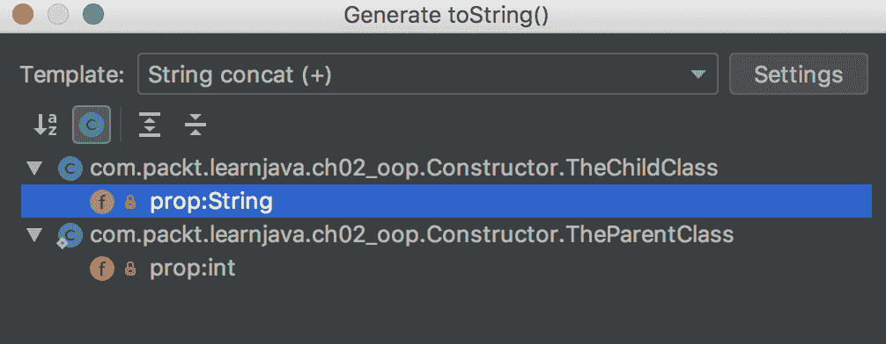

# 二、Java 面向对象编程（OOP）

**面向对象编程**（**OOP**）是为了更好地控制共享数据的并发修改而产生的，这是前 OOP 编程的祸根。这个想法的核心不是允许直接访问数据，而是只允许通过专用的代码层访问数据。由于数据需要在这个过程中传递和修改，因此就产生了对象的概念。在最一般的意义上，*对象*是一组数据，它们也只能通过传递的一组方法来传递和访问。这些数据被称为组成了一个**对象状态**，而这些方法构成了**对象行为**。对象状态被隐藏（**封装**），不允许直接访问。

每个对象都是基于一个称为**类**的模板构建的，换句话说，一个类定义了一个对象类。每个对象都有一个特定的**接口**，这是其他对象与之交互方式的正式定义。最初，据说一个对象通过调用其方法向另一个对象发送消息。但这个术语并不适用，特别是在引入了实际的基于消息的协议和系统之后。

为了避免代码重复，引入了对象之间的父子关系：据说一个类可以从另一个类继承行为。在这种关系中，第一类称为**子类**或**派生类**，第二类称为**父类**或**基类**或**超类**。

在类和接口之间定义了另一种关系：据说一个类可以*实现*一个接口。由于接口描述了如何与对象交互，而不是对象如何响应交互，因此在实现同一接口时，不同对象的行为可能不同。

在 Java 中，一个类只能有一个直接父类，但可以实现许多接口。像它的祖先一样行为并依附于多个接口的能力被称为**多态**。

在本章中，我们将介绍这些面向对象的概念以及它们是如何在 Java 中实现的。讨论的主题包括：

*   面向对象的概念
*   类
*   接口
*   重载、覆盖和隐藏
*   最终变量、方法和类
*   多态的作用

# 面向对象的概念

正如我们在引言中所述，OOP 的主要概念如下：

*   **对象/类**：定义一个状态（数据）和行为（方法），并将它们结合在一起
*   **继承**：它将行为传播到通过父子关系连接的类链上
*   *“抽象/接口”*：描述如何访问对象数据和行为。它将对象的外观与其实现（行为）隔离（抽象）
*   **封装**：隐藏实现的状态和细节
*   **多态**：允许对象呈现实现接口的外观，并表现为任何祖先类

# 对象/类

原则上，您可以用最少的类和对象来创建一个非常强大的应用。在 Java8 和 JDK 中加入了函数式编程之后，实现这一点就变得更加容易了，它允许您将行为作为函数传递。但是传递数据（状态）仍然需要类/对象。这意味着 Java 作为 OOP 语言的地位保持不变。

类定义了保存对象状态的所有内部对象属性的类型。类还定义了由方法的代码表示的对象行为。类/对象可能没有状态或行为。Java 还提供了一个在不创建对象的情况下静态访问行为的方法。但是这些可能性仅仅是为了保持状态和行为一致而引入的对象/类概念的补充。

举例来说，为了说明这个概念，一个类`Vehicle`在原则上定义了车辆的特性和行为。让我们把模型简单化，假设一辆车只有两个特性：重量和一定功率的发动机。它也可以有一定的行为：它可以在一定的时间内达到一定的速度，这取决于它的两个属性的值。这种行为可以用一种方法来表示，该方法计算车辆在一定时间内可以达到的速度。`Vehicle`类的每个对象都有一个特定的状态（属性值），速度计算将在同一时间段内产生不同的速度

所有 Java 代码都包含在方法中。**方法**是一组具有（可选）输入参数和返回值（可选）的语句。此外，每种方法都有副作用：例如，它可以显示消息或将数据写入数据库。类/对象行为在方法中实现。

例如，按照我们的示例，速度计算可以驻留在`double calculateSpeed(float seconds)`方法中。您可以猜到，该方法的名称是`calculateSpeed`，它接受秒数（带有小数部分）作为参数，并将速度值返回为`double`。

# 继承

正如我们已经提到的，对象可以建立父子关系，并以这种方式共享属性和行为。例如，我们可以创建一个继承`Vehicle`类的属性（例如权重）和行为（速度计算）的`Car`类。此外，子类可以有自己的属性（例如，乘客数量）和特定于汽车的行为（例如，软减震）。但是，如果我们创建一个`Truck`类作为车辆的子类，它的额外卡车特定属性（例如有效载荷）和行为（硬减震）将不同。

据说，`Car`类或`Truck`类的每个对象都有一个`Vehicle`类的父对象。但是`Car`和`Truck`类的对象不共享特定的`Vehicle`对象（每次创建子对象时，首先创建一个新的父对象）。他们只分享父项的行为。这就是为什么所有子对象可以有相同的行为，但状态不同。这是实现代码可重用性的一种方法。当对象行为必须动态更改时，它可能不够灵活。在这种情况下，对象组合（从其他类带来行为）或函数式编程更合适（参见第 13 章、“函数式编程”）。

有可能使子项的行为与遗传行为不同。为了实现它，捕获行为的方法可以在`child`类中重新实现。据说子项可以*覆盖*遗传的行为，我们将很快解释如何做（见“重载、覆盖和隐藏”一节）。例如，如果`Car`类有自己的速度计算方法，则不继承父类`Vehicle`的相应方法，而是使用在子类中实现的新速度计算方法。

父类的属性也可以继承（但不能覆盖）。然而，类属性通常被声明为私有的；它们不能被继承这就是封装的要点。参见“访问修饰符”部分中对各种访问级别的描述`public`、`protected`和`private`。

如果父类从另一个类继承某些行为，那么子类也会获取（继承）该行为，当然，除非父类覆盖它。继承链的长度没有限制。

Java 中的父子关系用`extends`关键字表示：

```java
class A { }
class B extends A { }
class C extends B { }
class D extends C { }
```

在此代码中，`A`、`B`、`C`和`D`类具有以下关系：

*   类`D`继承自类`C`、`B`和`A`
*   类`C`继承自类`B`和`A`
*   类`B`继承自类`A`

类`A`的所有非私有方法都由类`B`、`C`和`D`继承（如果不覆盖）

# 抽象/接口

一个方法的名称及其参数类型的列表称为**方法签名**。它描述了如何访问一个对象（在我们的示例中是`Car`或`Truck`的）的行为。这样的描述与`return`类型一起被呈现为接口。它没有说明只计算方法名、参数类型、它们在参数列表中的位置以及结果类型的代码。所有的实现细节都隐藏（封装）在*实现*这个接口的类中。

正如我们已经提到的，一个类可以实现许多不同的接口。但是两个不同的类（及其对象）即使实现同一个接口，其行为也可能不同

与类类似，接口也可以使用`extends`关键字具有父子关系：

```java
interface A { }
interface B extends A {}
interface C extends B {}
interface D extends C {}
```

在本规范中，`A`、`B`、`C`、`D`的接口关系如下：

*   接口`D`继承自接口`C`、`B`和`A`
*   接口`C`继承自接口`B`和`A`
*   接口`B`继承自接口`A`

接口`A`的所有非私有方法都由接口`B`、`C`和`D`继承

抽象/接口还减少了代码不同部分之间的依赖性，从而提高了代码的可维护性。只要接口保持不变，每个类都可以更改，而无需与客户端协调。

# 封装

**封装**通常被定义为一种数据隐藏，或者将公开访问的方法和私有访问的数据捆绑在一起。从广义上讲，封装是对对象属性的受控访问

对象属性值的快照称为**对象状态**。对象状态是封装的数据。因此，封装解决了促使创建面向对象编程的主要问题：更好地管理对共享数据的并发访问。例如：

```java
class A {
  private String prop = "init value";
  public void setProp(String value){
     prop = value;
  }
  public String getProp(){
     return prop;
  }
}
```

如您所见，要读取或修改`prop`属性的值，我们不能直接访问它，因为访问修饰符`private`。相反，我们只能通过`setProp(String value)`和`getProp()`方法来实现。

# 多态

**多态**是一个对象作为不同类的对象或作为不同接口实现的能力。它的存在归功于前面提到的所有概念：继承、接口和封装。没有它们，多态就不可能

继承允许对象获取或覆盖其所有祖先的行为。接口对客户端代码隐藏实现它的类的名称。封装防止暴露对象状态

在下面的部分中，我们将演示所有这些概念的实际应用，并在“多态的实际应用”部分中查看多态的具体用法。

# 类

Java 程序是表示可执行操作的一系列语句，这些语句按方法组织，方法按类组织。一个或多个类存储在`.java`文件中，它们可以由 Java 编译器`javac`编译（从 Java 语言转换成字节码）并存储在`.class`文件中。每个`.class`文件只包含一个编译类，可以由 JVM 执行。

一个`java`命令启动 JVM 并告诉它哪个类是`main`类，这个类有一个名为`main()`的方法。`main`方法有一个特定的声明：它必须是`public static`，必须返回`void`，名称为`main`，并接受一个`String`类型数组的单个参数。

JVM 将主类加载到内存中，找到`main()`方法，开始一条语句一条语句地执行它。`java`命令还可以传递`main()`方法作为`String`值数组接收的参数（参数），如果 JVM 遇到需要执行另一个类的方法的语句，那么这个类（它的`.class`文件）也会加载到内存中，并执行相应的方法，Java 程序流是关于加载类和执行它们的方法的。

下面是主类的示例：

```java
public class MyApp {
  public static void main(String[] args){
     AnotherClass an = new AnotherClass();
     for(String s: args){
        an.display(s);
     }
   }
}
```

它表示一个非常简单的应用，它接收任意数量的参数并将它们逐个传递到`AnotherClass`类的`display()`方法中，当 JVM 启动时，它首先从`MyApp.class`文件加载`MyApp`类。然后它从`AnotherClass.class`文件加载`AnotherClass`类，使用`new`操作符创建该类的对象（我们稍后将讨论），并调用`display()`方法。

这里是`AnotherClass`类：

```java
public class AnotherClass {
   private int result;
   public void display(String s){
      System.out.println(s);
   }
   public int process(int i){
      result = i *2;
      return result;
   }
   public int getResult(){
      return result;
   }
} 
```

如您所见，`display()`方法用于它的副作用，只是它打印出传入的值，并且不返回任何内容（`void`。`AnotherClass`类还有两种方法：

*   `process()`方法将输入整数加倍，存储在其`result`属性中，并将值返回给调用者
*   `getResult()`方法允许以后随时从对象获取结果

在我们的演示应用中没有使用这两种方法。我们展示它们只是为了演示一个类可以有属性（在本例中为`result`）和许多其他方法。

`private`关键字使值只能从类内部、从其方法访问。关键字使属性或方法可由任何其他类访问。

# 方法

如前所述，Java 语句被组织为方法：

```java
<return type> <method name>(<list of parameter types>){
     <method body that is a sequence of statements>
}
```

我们已经看到了一些例子。一个方法有一个名称，一组输入参数或根本没有参数，`{}`括号内有一个主体，返回类型或`void`关键字表示该方法不返回任何值。

方法名和参数类型列表一起称为**方法签名**。输入参数的数量称为**参数量**。

如果两个方法在输入参数列表中具有相同的名称、相同的参数量和相同的类型序列，则它们具有相同的*签名*。

以下两种方法具有相同的签名：

```java
double doSomething(String s, int i){
    //some code goes here
}

double doSomething(String i, int s){
    //some code other code goes here
}
```

即使签名相同，方法中的代码也可能不同

以下两种方法具有不同的签名：

```java
double doSomething(String s, int i){
    //some code goes here
}

double doSomething(int s, String i){
    //some code other code goes here
}
```

只要改变参数序列，签名就不同了，即使方法名保持不变。

# 可变参数

有一种特殊类型的参数需要提及，因为它与所有其他类型的参数完全不同。它被声明为后跟三个点的类型。它被称为**可变参数**（**varargs**）。但是，首先，让我们简单地定义一下 Java 中的数组是什么。

**数组**是保存相同类型元素的数据结构。元素由数字索引引用。这就够了，现在。我们在第 6 章、“数据结构、泛型和流行工具”中更多地讨论数组

让我们从一个例子开始。让我们使用可变参数声明方法参数：

```java
String someMethod(String s, int i, double... arr){
 //statements that compose method body
}
```

当调用`someMethod`方法时，Java 编译器从左到右匹配参数。一旦到达最后一个可变参数，它将创建一个剩余参数的数组并将其传递给方法。下面是演示代码：

```java
public static void main(String... args){
    someMethod("str", 42, 10, 17.23, 4);

}

private static String someMethod(String s, int i, double... arr){
    System.out.println(arr[0] + ", " + arr[1] + ", " + arr[2]); 
                                             //prints: 10.0, 17.23, 4.0
    return s;
}
```

如您所见，可变参数的作用类似于指定类型的数组。它可以作为方法的最后一个或唯一参数列出。这就是为什么有时您可以看到前面示例中声明的`main`方法。

# 构造器

当创建一个对象时，JVM 使用一个**构造器**。构造器的目的是初始化对象状态，为所有声明的属性赋值。如果类中没有声明构造器，JVM 只会将缺省值赋给属性。我们已经讨论了原始类型的默认值：整数类型的默认值是`0`，浮点类型的默认值是`0.0`，布尔类型的默认值是`false`。对于其他 Java 引用类型（参见第 3 章、“Java 基础”），默认值为`null`，表示引用类型的属性没有赋值。

当一个类中没有声明构造器时，就说这个类有一个没有 JVM 提供的参数的默认构造器。

如果需要，可以显式声明任意数量的构造器，每个构造器使用不同的参数集来设置初始状态。举个例子：

```java
class SomeClass {
     private int prop1;
     private String prop2;
     public SomeClass(int prop1){
         this.prop1 = prop1;
     }
     public SomeClass(String prop2){
         this.prop2 = prop2;
     }
     public SomeClass(int prop1, String prop2){
         this.prop1 = prop1;
         this.prop2 = prop2;
     }   
     // methods follow 
}
```

如果属性不是由构造器设置的，则相应类型的默认值将自动分配给它。

当多个类沿同一连续线相关联时，首先创建父对象。如果父对象需要为其属性设置非默认初始值，则必须使用如下所示的`super`关键字将其构造器作为子构造器的第一行调用：

```java
class TheParentClass {
    private int prop;
    public TheParentClass(int prop){
        this.prop = prop;
    }
    // methods follow
}

class TheChildClass extends TheParentClass{
 private int x;
 private String prop;
 private String anotherProp = "abc";
 public TheChildClass(String prop){
 super(42);
 this.prop = prop;
 }
 public TheChildClass(int arg1, String arg2){
 super(arg1);
 this.prop = arg2;
 }
 // methods follow
}
```

在前面的代码示例中，我们向`TheChildClass`添加了两个构造器：一个总是将`42`传递给`TheParentClass`的构造器，另一个接受两个参数。请注意已声明但未显式初始化的`x`属性。当创建`TheChildClass`的对象时，它将被设置为值`0`，即`int`类型的默认值。另外，请注意显式初始化为`"abc"`值的`anotherProp`属性。否则，它将被初始化为值`null`，任何引用类型的默认值，包括`String`。

从逻辑上讲，有三种情况不需要类中构造器的显式定义：

*   当对象及其任何父对象都没有需要初始化的属性时
*   当每个属性与类型声明一起初始化时（例如，`int x = 42`）
*   当属性初始化的默认值足够好时

然而，即使满足了所有三个条件（在列表中提到），也有可能仍然实现了构造器。例如，您可能希望执行一些语句来初始化某个外部资源—对象一经创建就需要的文件或另一个数据库。

一旦添加了显式构造器，就不会提供默认构造器，并且以下代码将生成一个错误：

```java
class TheParentClass {
    private int prop;
    public TheParentClass(int prop){
        this.prop = prop;
    }
    // methods follow
}

class TheChildClass extends TheParentClass{
    private String prop;
    public TheChildClass(String prop){
        //super(42);       //No call to the parent's contuctor
        this.prop = prop;
    }
    // methods follow
}
```

为了避免这个错误，要么在`TheParentClass`中添加一个没有参数的构造器，要么调用父类的显式构造器作为子类构造器的第一条语句。以下代码不会生成错误：

```java
class TheParentClass {
    private int prop;
 public TheParentClass() {}
    public TheParentClass(int prop){
        this.prop = prop;
    }
    // methods follow
}

class TheChildClass extends TheParentClass{
    private String prop;
    public TheChildClass(String prop){
        this.prop = prop;
    }
    // methods follow
}
```

需要注意的一个重要方面是，构造器虽然看起来像方法，但不是方法，甚至不是类的成员。构造器没有返回类型，并且总是与类同名。它的唯一用途是在创建类的新实例时调用。

# `new`运算符

`new`操作符通过为新对象的属性分配内存并返回对该内存的引用来创建类的对象（也可以说它**实例化类**或**创建类**的实例）。此内存引用被分配给与用于创建对象或其父对象类型的类相同类型的变量：

```java
TheChildClass ref1 = new TheChildClass("something"); 
TheParentClass ref2 = new TheChildClass("something");
```

这是一个有趣的观察。在代码中，对象引用`ref1`和`ref2`都提供了对`TheChildClass`和`TheParentClass`方法的访问。例如，我们可以向这些类添加方法，如下所示：

```java
class TheParentClass {
    private int prop;
    public TheParentClass(int prop){
        this.prop = prop;
    }
    public void someParentMethod(){}
}

class TheChildClass extends TheParentClass{
    private String prop;
    public TheChildClass(int arg1, String arg2){
        super(arg1);
        this.prop = arg2;
    }
    public void someChildMethod(){}
}
```

然后我们可以使用以下任何引用调用它们：

```java
TheChildClass ref1 = new TheChildClass("something");
TheParentClass ref2 = new TheChildClass("something");
ref1.someChildMethod();
ref1.someParentMethod();
((TheChildClass) ref2).someChildMethod();
ref2.someParentMethod();

```

注意，要使用父级的类型引用访问子级的方法，我们必须将其强制转换为子级的类型。否则，编译器将生成一个错误。这是可能的，因为我们已经为父对象的类型引用指定了子对象的引用。这就是多态的力量。我们将在“多态的作用”一节中详细讨论。

当然，如果我们将父对象赋给父类型的变量，那么即使使用强制转换，也无法访问子对象的方法，如下例所示：

```java
TheParentClass ref2 = new TheParentClass(42);
((TheChildClass) ref2).someChildMethod();  //compiler's error
ref2.someParentMethod();
```

为新对象分配内存的区域称为**堆**。JVM 有一个名为**垃圾收集**的进程，它监视这个区域的使用情况，并在不再需要对象时释放内存以供使用。例如，查看以下方法：

```java
void someMethod(){
   SomeClass ref = new SomeClass();
   ref.someClassMethod();
   //other statements follow
}
```

一旦`someMethod()`方法的执行完成，`SomeClass`的对象就不再可访问。这就是垃圾收集器注意到的，并释放这个对象占用的内存，我们将在第 9 章、“JVM 结构和垃圾收集”中讨论垃圾收集过程。

# `java.lang.Object`对象

在 Java 中，默认情况下，所有类都是`Object`类的子类，即使您没有隐式地指定它。`Object`类在标准 JDK 库的`java.lang`包中声明。我们将在“包、导入和访问”部分定义什么是*包*，并在第 7 章、“Java 标准和外部库”中描述库。

让我们回顾一下在“继承”一节中提供的示例：

```java
class A { }
class B extends A {}
class C extends B {}
class D extends C {}
```

所有类`A`、`B`、`C`、`D`都是`Object`类的子类，每个类继承 10 个方法：

*   `public String toString()`
*   `public int hashCode()`
*   `public boolean equals (Object obj)`
*   `public Class getClass()`
*   `protected Object clone()`
*   `public void notify()`
*   `public void notifyAll()`
*   `public void wait()`
*   `public void wait(long timeout)`
*   `public void wait(long timeout, int nanos)`

前三个`toString()`、`hashCode()`和`equals()`是最常用的方法，并且经常被重新实现（覆盖）。`toString()`方法通常用于打印对象的状态。它在 JDK 中的默认实现如下所示：

```java
public String toString() {
   return getClass().getName()+"@"+Integer.toHexString(hashCode());
}
```

如果我们在`TheChildClass`类的对象上使用它，结果如下：

```java
TheChildClass ref1 = new TheChildClass("something");
System.out.println(ref1.toString());  
//prints: com.packt.learnjava.ch02_oop.Constructor$TheChildClass@72ea2f77
```

顺便说一句，在将对象传递给`System.out.println()`方法和类似的输出方法时，不需要显式调用`toString()`，因为它们无论如何都是在方法内部调用的，在我们的例子中`System.out.println(ref1)`会产生相同的结果。

所以，正如您所看到的，这样的输出对人不友好，所以覆盖`toString()`方法是个好主意，最简单的方法是使用 IDE。例如，在 IntelliJ IDEA 中，在`TheChildClass`代码中单击鼠标右键，如下图所示：


选择并单击“生成”，然后选择并单击`toString()`，如下图所示：


新的弹出窗口将允许您选择在`toString()`方法中包含哪些属性。仅选择`TheChildClass`的属性，如下所示：



单击“确定”按钮后，将生成以下代码：

```java
@Override
public String toString() {
    return "TheChildClass{" +
            "prop='" + prop + '\'' +
            '}';
}
```

如果类中有更多属性并且您选择了它们，那么更多属性及其值将包含在方法输出中。如果我们现在打印对象，结果将是：

```java
TheChildClass ref1 = new TheChildClass("something");
System.out.println(ref1.toString());  
                          //prints: TheChildClass{prop='something'}
```

这就是为什么`toString()`方法经常被覆盖，甚至包括在 IDE 的服务中。

我们将在第 6 章、“数据结构、泛型和流行工具”中更详细地讨论`hashCode()`和`equals()`方法。

`getClass()`和`clone()`方法不常使用。`getClass()`方法返回`Class`类的一个对象，这个对象有许多提供各种系统信息的方法。最常用的方法是返回当前对象的类名的方法。`clone()`方法可以复制当前对象。只要当前对象的所有属性都是原始类型，它就可以正常工作。但是，如果存在引用类型属性，`clone()`方法必须重新实现，这样才能正确复制引用类型。否则，将只复制引用，而不复制对象本身。这种拷贝称为**浅拷贝**，在某些情况下可能已经足够好了。`protected`关键字表示只有该类的子类可以访问它（参见“包、导入和访问”部分）。

类`Object`中的最后五个方法用于线程之间的通信，而轻量级进程用于并发处理。它们通常不会重新实现。

# 实例和静态属性及方法

到目前为止，我们看到的大多数方法只能在类的对象（实例）上调用。这种方法称为**实例方法**。它们通常使用对象属性（对象状态）的值。否则，如果它们不使用对象状态，则可以使它们成为`static`并在不创建对象的情况下调用。这种方法的例子是`main()`方法，这里是另一个例子：

```java
class SomeClass{
    public static void someMethod(int i){
        //do something
    }
}
```

此方法可按如下方式调用：

```java
SomeClass.someMethod(42);

```

静态方法也可以在对象上调用，但这被认为是不好的做法，因为它对试图理解代码的人隐藏了方法的静态特性。此外，它还会引发编译器警告，根据编译器的实现，甚至可能生成编译器错误。

类似地，属性可以声明为静态的，因此无需创建对象即可访问。例如：

```java
class SomeClass{
    public static String SOME_PROPERTY = "abc";
}
```

也可以通过类直接访问此属性，如下所示：

```java
System.out.println(SomeClass.SOME_PROPERTY);  //prints: abc

```

拥有这样一个静态属性与状态封装的思想背道而驰，可能会导致并发数据修改的所有问题，因为它作为一个副本存在于 JVM 内存中，并且使用它的所有方法共享相同的值。这就是为什么静态属性通常用于两个目的：

*   存储一个常数—一个可以读取但不能修改的值（也称为**只读值**）
*   存储无状态对象，该对象的创建成本很高或保留只读值

常量的典型示例是资源的名称：

```java
class SomeClass{
    public static final String INPUT_FILE_NAME = "myFile.csv";
}
```

注意`static`属性前面的`final`关键字。它告诉编译器和 JVM 这个值一旦分配就不能改变。尝试这样做会产生错误。它有助于保护该值并清楚地表达将该值作为常量的意图。当人们试图理解代码的工作原理时，这些看似很小的细节使代码更容易理解。

也就是说，考虑使用接口来达到这样的目的。由于 Java1.8，接口中声明的所有字段都是隐式静态和`final`的，因此忘记将值声明为`final`的可能性较小。我们将很快讨论接口。

当一个对象被声明为静态`final`类属性时，并不意味着它的所有属性都自动成为`final`。它只保护属性不被分配同一类型的另一个对象，我们将在第 8 章、“多线程和并发处理”中讨论并发访问对象属性的复杂过程。然而，程序员通常使用静态`final`对象来存储只读的值，这些值只是按照在应用中使用的方式来存储的。典型的例子是应用配置信息。一旦从磁盘读取后创建，它就不会更改，即使可以更改。此外，数据的缓存是从外部资源获得的

同样，在将此类类属性用于此目的之前，请考虑使用一个接口，该接口提供更多支持只读功能的默认行为

与静态属性类似，可以在不创建类实例的情况下调用静态方法。例如，考虑以下类：

```java
class SomeClass{
    public static String someMethod() {
        return "abc";
    }
}
```

我们可以只使用类名来调用前面的方法：

```java
System.out.println(SomeClass.someMethod()); //prints: abc
```

# 接口

在“抽象/接口”部分中，我们一般地讨论了接口。在本节中，我们将描述一个表示它的 Java 语言构造

一个**接口**显示了一个对象的期望值。它隐藏了实现，并且只公开带有返回值的方法签名。例如，下面是一个接口，它声明了两个抽象方法：

```java
interface SomeInterface {
    void method1();
    String method2(int i);
}
```

下面是一个实现它的类：

```java
class SomeClass implements SomeInterface{
    public void method1(){
        //method body
    }
    public String method2(int i) {
        //method body
        return "abc";
    }
}
```

无法实例化接口。只有创建*实现*此接口的类的对象，才能创建接口类型的对象：

```java
SomeInterface si = new SomeClass(); 

```

如果没有实现接口的所有抽象方法，则必须将类声明为抽象的，并且不能实例化（参见“接口与抽象类”部分）

接口不描述如何创建类的对象。要发现这一点，必须查看该类并查看它有哪些构造器。接口也不描述静态类方法。因此，接口只是类实例（对象）的公共面。

在 Java8 中，接口不仅具有抽象方法（没有主体），而且具有真正实现的方法。根据 Java 语言规范，“接口的主体可以声明接口的成员，即字段、方法、类和接口。”如此宽泛的语句提出了一个问题：接口和类有什么区别？我们已经指出的一个主要区别是：不能实例化接口；只能实例化类。

另一个区别是在接口内部实现的非静态方法被声明为`default`或`private`。相反，`default`声明对于类方法不可用。

此外，接口中的字段是隐式公共的、静态的和最终的。相比之下，默认情况下，类属性和方法不是静态的或最终的。类本身、其字段、方法和构造器的隐式（默认）访问修饰符是包私有的，这意味着它只在自己的包中可见

# 默认方法

为了了解接口中默认方法的功能，让我们看一个接口和实现它的类的示例，如下所示：

```java
interface SomeInterface {
    void method1();
    String method2(int i);
 default int method3(){
 return 42;
    }
}

class SomeClass implements SomeInterface{
    public void method1(){
        //method body
    }
    public String method2(int i) {
        //method body
        return "abc";
    }
}
```

我们现在可以创建一个`SomeClass`类的对象并进行以下调用：

```java
SomeClass sc = new SomeClass();
sc.method1();
sc.method2(22);  //returns: "abc"
sc.method3();    //returns: 42

```

如您所见，`method3()`并没有在`SomeClass`类中实现，但是看起来好像该类已经实现了它。这是一种将新方法添加到现有类而不更改它的方法，方法是将默认方法添加到类实现的接口。

现在我们也将`method3()`实现添加到类中，如下所示：

```java
class SomeClass implements SomeInterface{
    public void method1(){
        //method body
    }
    public String method2(int i) {
        //method body
        return "abc";
    }
    public int method3(){
 return 15;
 }
}
```

现在忽略`method3()`的接口实现：

```java
SomeClass sc = new SomeClass();
sc.method1();
sc.method2(22);  //returns: "abc"
sc.method3();    //returns: 15
```

接口中默认方法的目的是为类（实现此接口的类）提供一个新方法，而不更改它们。但是一旦类实现了新方法，接口实现就会被忽略。

# 私有方法

如果接口中有多个默认方法，则可以创建只能由接口的默认方法访问的私有方法。它们可以用来包含公共功能，而不是在每个默认方法中重复：

```java
interface SomeInterface {
    void method1();
    String method2(int i);
    default int method3(){
        return getNumber();
    }
    default int method4(){
        return getNumber() + 22;
    }
    private int getNumber(){
        return 42;
    }
}
```

私有方法的这个概念与类中的私有方法没有什么不同（参见“包、导入和访问”部分）。无法从接口外部访问私有方法。

# 静态字段和方法

自 Java8 以来，接口中声明的所有字段都是隐式公共、静态和`final`常量。这就是为什么接口是常量的首选位置。你不需要在他们的声明中加上`public static final`。

至于静态方法，它们在接口中的作用方式与在类中的作用方式相同：

```java
interface SomeInterface{
   static String someMethod() {
      return "abc";
   }
}
```

注意，不需要将接口方法标记为`public`。默认情况下，所有非私有接口方法都是公共的。

我们可以只使用一个接口名来调用前面的方法：

```java
System.out.println(SomeInetrface.someMethod()); //prints: abc
```

# 接口与抽象类

我们已经提到类可以声明为`abstract`。它可能是我们不希望实例化的常规类，也可能是包含（或继承）抽象方法的类。在后一种情况下，我们必须将此类类声明为`abstract`，以避免编译错误。

在许多方面，抽象类与接口非常相似。它强制扩展它的每个子类实现抽象方法。否则，子级不能实例化，必须声明为抽象本身

但是，接口和抽象类之间的一些主要区别使它们在不同的情况下都很有用：

*   抽象类可以有构造器，而接口不能。
*   抽象类可以有状态，而接口不能。
*   抽象类的字段可以是`public`、`private`或`protected`、`static`或`final`或`final`，而在接口中，字段总是`public`、`static`、`final`。
*   抽象类中的方法可以是`public`、`private`或`protected`，接口方法只能是`public`或`private`。
*   如果要修改的类已经扩展了另一个类，则不能使用抽象类，但可以实现接口，因为一个类只能扩展另一个类，但可以实现多个接口

参见“多态实践”一节中的抽象用法示例。

# 重载、覆盖和隐藏

我们已经在*继承*和“抽象/接口”部分中提到了覆盖。它将父类中实现的非静态方法替换为子类中具有相同签名的方法。接口的默认方法也可以在扩展它的接口中覆盖。

隐藏类似于覆盖，但仅适用于静态方法和静态以及实例属性。

重载是在同一个类或接口中创建几个具有相同名称和不同参数（因此，不同的签名）的方法

在本节中，我们将讨论所有这些概念，并演示它们如何用于类和接口。

# 重载

不可能在同一接口中有两个方法，也不可能在一个类中有相同的签名。要有不同的签名，新方法必须有新名称或不同的参数类型列表（类型的顺序很重要）。有两个同名但参数类型列表不同的方法构成重载。下面是一些在接口中重载的合法方法的示例：

```java
interface A {
    int m(String s);
    int m(String s, double d);
    default int m(String s, int i) { return 1; }
    static int m(String s, int i, double d) { return 1; }
}
```

请注意，前面的两个方法没有相同的签名，包括`default`和`static`方法，否则将生成编译器的错误。指定为默认值或静态值都不会在重载中起任何作用。返回类型也不影响重载。我们到处使用`int`作为返回类型，只是为了让示例不那么混乱。

方法重载在类中的执行方式类似：

```java
    class C {
        int m(String s){ return 42; }
        int m(String s, double d){ return 42; }
        static int m(String s, double d, int i) { return 1; }
    }
```

在哪里声明具有相同名称的方法并不重要。下面的方法重载与前面的示例没有区别，如下所示：

```java
interface A {
    int m(String s);
    int m(String s, double d);
}
interface B extends A {
    default int m(String s, int i) { return 1; }
    static int m(String s, int i, double d) { return 1; }
}
class C {
     int m(String s){ return 42; }
}
class D extends C {
     int m(String s, double d){ return 42; }
     static int m(String s, double d, int i) { return 1; }
}
```

私有非静态方法只能由同一类的非静态方法重载。

当方法具有相同名称但参数类型列表不同，并且属于同一接口（或类）或不同接口（或类），其中一个接口是另一个接口的祖先时，就会发生重载。私有方法只能由同一类中的方法重载。

# 覆盖

与重载不同的是，重载发生在静态和非静态方法中，方法覆盖只发生在非静态方法中，并且只有当它们具有*完全相同的签名*和*属于不同的接口（或类）*，其中一个接口是另一个接口的祖先。

覆盖方法驻留在子接口（或类）中，而覆盖方法具有相同的签名，并且属于某个祖先接口（或类）。不能覆盖私有方法。

以下是在接口中覆盖方法的示例：

```java
interface A {
    default void method(){
        System.out.println("interface A");
    }
}
interface B extends A{
    @Override
    default void method(){
        System.out.println("interface B");
    }
}
class C implements B { }
```

如果我们使用`C`类实例调用`method()`，结果如下：

```java
C c = new C();
c.method();      //prints: interface B

```

请注意注解`@Override`的用法。它告诉编译器程序员认为带注解的方法覆盖了一个祖先接口的方法。通过这种方式，编译器可以确保覆盖确实发生，否则会生成错误。例如，程序员可能会将方法的名称拼错如下：

```java
interface B extends A{
    @Override
    default void metod(){
        System.out.println("interface B");
    }
}
```

如果发生这种情况，编译器会生成一个错误，因为没有方法`metod()`可以覆盖。如果没有注解`@Overrride`，这个错误可能会被程序员忽略，结果会截然不同：

```java
C c = new C();
c.method();      //prints: interface A
```

覆盖的规则同样适用于类实例方法。在下面的示例中，`C2`类覆盖了`C1`类的方法：

```java
class C1{
    public void method(){
        System.out.println("class C1");
    }
}
class C2 extends C1{
    @Override
    public void method(){
        System.out.println("class C2");
    }
}
```

结果如下：

```java
C2 c2 = new C2();
c2.method();      //prints: class C2

```

而且，在具有覆盖方法的类或接口和具有覆盖方法的类或接口之间有多少祖先并不重要：

```java
class C1{
    public void method(){
        System.out.println("class C1");
    }
}
class C3 extends C1{
    public void someOtherMethod(){
        System.out.println("class C3");
    }
}
class C2 extends C3{
    @Override
    public void method(){
        System.out.println("class C2");
    }
}
```

前面方法的覆盖结果仍然相同。

# 隐藏

**隐藏**被很多人认为是一个复杂的话题，但不应该是，我们会尽量让它看起来简单。

*隐藏*这个名字来源于类和接口的静态属性和方法的行为。每个静态属性或方法在 JVM 内存中作为单个副本存在，因为它们与接口或类关联，而不是与对象关联。接口或类作为单个副本存在。这就是为什么我们不能说子级的静态属性或方法覆盖父级的具有相同名称的静态属性或方法。当类或接口被加载时，所有静态属性和方法只被加载到内存中一次，并且保持在那里，而不是复制到任何地方。让我们看看这个例子。

让我们创建两个具有父子关系和具有相同名称的静态字段和方法的接口：

```java
interface A {
    String NAME = "interface A";
    static void method() {
        System.out.println("interface A");
    }
}
interface B extends A {
    String NAME = "interface B";
    static void method() {
        System.out.println("interface B");
    }
}
```

请注意接口字段标识符的大写字母。这就是通常用来表示常量的约定，不管它是在接口中还是在类中声明的。只是提醒您，Java 中的常量是一个变量，一旦初始化，就不能重新分配另一个值。接口字段默认为常量，因为接口中的任何字段都是*最终的*（请参阅“最终属性、方法和类”部分）。

如果从`B`接口打印`NAME`并执行其`method()`，则得到如下结果：

```java
System.out.println(B.NAME); //prints: interface B
B.method();                 //prints: interface B

```

它看起来很像覆盖，但实际上，它只是我们调用与这个特定接口相关联的特定属性或方法。

类似地，考虑以下类：

```java
public class C {
    public static String NAME = "class C";
    public static void method(){
        System.out.println("class C"); 
    }
    public String name1 = "class C";
}
public class D extends C {
    public static String NAME = "class D";
    public static void method(){
        System.out.println("class D"); 
    }
    public String name1 = "class D";
}
```

如果我们尝试使用类本身访问`D`类的静态成员，我们将得到我们所要求的：

```java
System.out.println(D.NAME);  //prints: class D
D.method();                  //prints: class D
```

只有在使用对象访问属性或静态方法时才会出现混淆：

```java
C obj = new D();

System.out.println(obj.NAME);       //prints: class C
System.out.println(((D) obj).NAME); //prints: class D

obj.method();                       //prints: class C
((D)obj).method();                  //prints: class D

System.out.println(obj.name1);       //prints: class C
System.out.println(((D) obj).name1); //prints: class D
```

`obj`变量引用了`D`类的对象，强制转换证明了这一点，如前面的示例所示。但是，即使我们使用对象，尝试访问静态属性或方法也会带来用作声明变量类型的类的成员。对于示例最后两行中的实例属性，Java 中的属性不符合多态行为，我们得到父`C`类的`name1`属性，而不是子`D`类的预期属性。

若要避免与类的静态成员混淆，请始终使用类而不是对象访问它们。若要避免与实例属性混淆，请始终将它们声明为私有并通过方法访问。

要演示最后一个技巧，请考虑以下类：

```java
class X {
    private String name = "class X";
    public String getName() {
        return name;
    }
    public void setName(String name) {
        this.name = name;
    }
}
class Y extends X {
    private String name = "class Y";
    public String getName() {
        return name;
    }
    public void setName(String name) {
        this.name = name;
    }
}
```

如果我们对实例属性执行与对类`C`和`D`相同的测试，结果将是：

```java
X x = new Y();
System.out.println(x.getName());      //prints: class Y
System.out.println(((Y)x).getName()); //prints: class Y

```

现在我们使用方法访问实例属性，这些方法是覆盖效果的主题，不再有意外的结果。

为了结束在 Java 中隐藏的讨论，我们想提到另一种类型的隐藏，即当局部变量隐藏具有相同名称的实例或静态属性时。下面是一个类：

```java
public class HidingProperty {
   private static String name1 = "static property";
   private String name2 = "instance property";

   public void method() {
      var name1 = "local variable";
      System.out.println(name1);     //prints: local variable

      var name2 = "local variable";  //prints: local variable
      System.out.println(name2);

      System.out.println(HidingProperty.name1); //prints: static property
      System.out.println(this.name2);         //prints: instance property
   }
}
```

如您所见，局部变量`name1`隐藏同名的静态属性，而局部变量`name2`隐藏实例属性。仍然可以使用类名访问静态属性（参见`HidingProperty.name1`。请注意，尽管声明为`private`，但可以从类内部访问它

实例属性总是可以通过使用`this`关键字来访问，该关键字表示**当前对象**。

# 最终变量、方法和类

在 Java 中，我们已经多次提到了与常量概念相关的一个`final`属性。但这只是使用`final`关键字的一种情况，它一般可以应用于任何变量。此外，类似的约束也可以应用于方法，甚至类，从而防止方法被覆盖和类被扩展。

# 最终变量

变量声明前面的`final`关键字使该变量在初始化后不可变。例如：

```java
final String s = "abc";

```

初始化甚至可以延迟：

```java
final String s;
s = "abc";

```

对于对象属性，此延迟只能持续到创建对象为止。这意味着可以在构造器中初始化属性。例如：

```java
private static class A {
    private final String s1 = "abc";
    private final String s2;
    private final String s3;   //error
    private final int x;       //error

    public A() {
        this.s1 = "xyz";      //error
        this.s2 = "xyz";     
    }
}
```

请注意，即使在对象构造期间，也不可能在声明期间和构造器中两次初始化属性。另外值得注意的是，`final`属性必须显式初始化。从前面的示例中可以看到，编译器不允许将`final`属性初始化为默认值。

也可以初始化初始化块中的`final`属性：

```java
class B {
    private final String s1 = "abc";
    private final String s2;
    {
        s1 = "xyz"; //error
        s2 = "abc";
    }
}
```

对于静态属性，无法在构造器中对其进行初始化，因此必须在其声明期间或在静态初始化块中对其进行初始化：

```java
class C {
    private final static String s1 = "abc";
    private final static String s2;
    static {
        s1 = "xyz"; //error
        s2 = "abc";
    }
}
```

在接口中，所有字段都是`final`，即使它们没有声明为`final`。由于接口中不允许使用构造器或初始化块，因此初始化接口字段的唯一方法是在声明期间。否则会导致编译错误：

```java
interface I {
    String s1;  //error
    String s2 = "abc";
}
```

# 最终方法

声明为`final`的方法不能在子类中覆盖，也不能在静态方法中隐藏。例如，`java.lang.Object`类是 Java 中所有类的祖先，它的一些方法声明为`final`：

```java
public final Class getClass()
public final void notify()
public final void notifyAll()
public final void wait() throws InterruptedException
public final void wait(long timeout) throws InterruptedException
public final void wait(long timeout, int nanos)
                                     throws InterruptedException
```

`final`类的所有私有方法和未继承方法实际上都是`final`的，因为您不能覆盖它们。

# 最终类

`final`类不能扩展。它不能有子项，这使得所有的方法都有效的`final`。此功能用于安全性，或者当程序员希望确保类功能不能由于某些其他设计考虑而被覆盖、重载或隐藏时。

# 多态的作用

多态是 OOP 最强大、最有用的特性。它使用了我们目前介绍的所有其他面向对象的概念和特性。这是掌握 Java 编程的最高概念点。之后，本书的其余部分将主要介绍 Java 语言语法和 JVM 功能

正如我们在“OOP 概念”一节中所述，**多态**是一个对象作为不同类的对象或作为不同接口的实现的能力。如果你在网上搜索“多态”这个词，你会发现它是“以几种不同形式出现的状态”。“变形”是“通过自然或超自然的方式，将一个事物或人的形式或性质改变为一种完全不同的形式或性质”。所以，**Java 多态**是一个对象在不同的条件下表现出完全不同的行为的能力，就像经历了一次蜕变。

我们将使用**对象工厂**——工厂的具体编程实现，这是一种返回不同原型或类的对象的方法（参见[《面向对象程序设计》](https://en.wikipedia.org/wiki/Factory_(object-oriented_programming))以实际动手的方式提出这个概念。*

# 对象工厂

对象工厂背后的思想是创建一个方法，在特定条件下返回特定类型的新对象。例如，查看`CalcUsingAlg1`和`CalcUsingAlg2`类：

```java
interface CalcSomething{ double calculate(); }
class CalcUsingAlg1 implements CalcSomething{
    public double calculate(){ return 42.1; }
}
class CalcUsingAlg2 implements CalcSomething{
    private int prop1;
    private double prop2;
    public CalcUsingAlg2(int prop1, double prop2) {
        this.prop1 = prop1;
        this.prop2 = prop2;
    }
    public double calculate(){ return prop1 * prop2; }
}
```

如您所见，它们都实现相同的接口`CalcSomething`，但使用不同的算法。现在，假设我们决定在属性文件中选择所使用的算法。然后我们可以创建以下对象工厂：

```java
class CalcFactory{
    public static CalcSomething getCalculator(){
        String alg = getAlgValueFromPropertyFile();
        switch(alg){
            case "1":
                return new CalcUsingAlg1();
            case "2":
                int p1 = getAlg2Prop1FromPropertyFile();
                double p2 = getAlg2Prop2FromPropertyFile();
                return new CalcUsingAlg2(p1, p2);
            default:
                System.out.println("Unknown value " + alg);
                return new CalcUsingAlg1();
        }
    }
}
```

工厂根据`getAlgValueFromPropertyFile()`方法返回的值选择要使用的算法，对于第二种算法，工厂还使用`getAlg2Prop1FromPropertyFile()`方法和`getAlg2Prop2FromPropertyFile()`方法获取算法的输入参数。但这种复杂性对客户来说是隐藏的：

```java
CalcSomething calc = CalcFactory.getCalculator();
double result = calc.calculate();

```

我们可以添加新的算法变体，改变源代码中的算法参数或算法选择的过程，但是客户端不需要改变代码。这就是多态的力量。

或者，我们可以使用继承来实现多态行为。考虑以下类别：

```java
class CalcSomething{
    public double calculate(){ return 42.1; }
}
class CalcUsingAlg2 extends CalcSomething{
    private int prop1;
    private double prop2;
    public CalcUsingAlg2(int prop1, double prop2) {
        this.prop1 = prop1;
        this.prop2 = prop2;
    }
    public double calculate(){ return prop1 * prop2; }
}
```

那么我们的工厂可能会如下所示：

```java
class CalcFactory{
    public static CalcSomething getCalculator(){
        String alg = getAlgValueFromPropertyFile();
        switch(alg){
            case "1":
                return new CalcSomething();
            case "2":
                int p1 = getAlg2Prop1FromPropertyFile();
                double p2 = getAlg2Prop2FromPropertyFile();
                return new CalcUsingAlg2(p1, p2);
            default:
                System.out.println("Unknown value " + alg);
                return new CalcSomething();
        }
    }
}
```

但客户端代码不变：

```java
CalcSomething calc = CalcFactory.getCalculator();
double result = calc.calculate();
```

如果有选择的话，有经验的程序员会使用一个公共接口来实现。它允许更灵活的设计，因为 Java 中的类可以实现多个接口，但可以扩展（继承）一个类。

# 实例运算符

不幸的是，生活并不总是那么简单，有时，程序员不得不处理一个由不相关的类（甚至来自不同的框架）组装而成的代码，在这种情况下，使用多态可能不是一个选择。尽管如此，您仍然可以隐藏算法选择的复杂性，甚至可以使用`instanceof`操作符模拟多态行为，当对象是某个类的实例时，该操作符返回`true`。

假设我们有两个不相关的类：

```java
class CalcUsingAlg1 {
    public double calculate(CalcInput1 input){
        return 42\. * input.getProp1();
    }
}

class CalcUsingAlg2{
    public double calculate(CalcInput2 input){
        return input.getProp2() * input.getProp1();
    }
}
```

每个类都需要一个特定类型的对象作为输入：

```java
class CalcInput1{
    private int prop1;
    public CalcInput1(int prop1) { this.prop1 = prop1; }
    public int getProp1() { return prop1; }
}

class CalcInput2{
    private int prop1;
    private double prop2;
    public CalcInput2(int prop1, double prop2) {
        this.prop1 = prop1;
        this.prop2 = prop2;
    }
    public int getProp1() { return prop1; }
    public double getProp2() { return prop2; }
}
```

假设我们实现的方法接收到这样一个对象：

```java
void calculate(Object input) {
    double result = Calculator.calculate(input);
    //other code follows
}
```

我们在这里仍然使用多态，因为我们将输入描述为`Object`类型，我们可以这样做，因为`Object`类是所有 Java 类的基类。

现在让我们看看`Calculator`类是如何实现的：

```java
class Calculator{
    public static double calculate(Object input){
        if(input instanceof CalcInput1){
            return new CalcUsingAlg1().calculate((CalcInput1)input);
        } else if (input instanceof CalcInput2){
            return new CalcUsingAlg2().calculate((CalcInput2)input);
        } else {
            throw new RuntimeException("Unknown input type " + 
                               input.getClass().getCanonicalName());
        }
    }
}
```

如您所见，它使用`instanceof`操作符来选择适当的算法。通过使用`Object`类作为输入类型，`Calculator`类也利用了多态，但它的大多数实现与之无关。然而，从外面看，它看起来是多态的，确实如此，但只是在一定程度上。

# 总结

本章向读者介绍了 OOP 的概念以及它们是如何在 Java 中实现的。它提供了每个概念的解释，并演示了如何在特定的代码示例中使用它。详细讨论了`class`和`interface`的 Java 语言结构。读者还了解了什么是重载、覆盖和隐藏，以及如何使用`final`关键字保护方法不被覆盖

从“多态的作用”部分，读者了解了多态强大的 Java 特性。本节将所有呈现的材料放在一起，并展示了多态如何保持在 OOP 的中心。

在下一章中，读者将熟悉 Java 语言语法，包括包、导入、访问修饰符、保留关键字和限制关键字，以及 Java 引用类型的一些方面。读者还将学习如何使用`this`和`super`关键字，原始类型的加宽和缩小转换是什么，装箱和拆箱，原始类型和引用类型的赋值，以及引用类型的`equals()`方法是如何工作的。

# 测验

1.  从以下列表中选择所有正确的 OOP 概念：

2.  从以下列表中选择所有正确的语句：

3.  从以下列表中选择所有正确的语句：

4.  从以下列表中选择所有正确的语句：

5.  从以下列表中选择所有正确的语句：

6.  从以下列表中选择所有正确的语句：

7.  从以下列表中选择所有正确的语句：

8.  从以下列表中选择所有正确的语句：

9.  从以下列表中选择所有正确的语句：

10.  从以下列表中选择所有正确的语句：

11.  从以下列表中选择所有正确的语句：

12.  从以下列表中选择所有正确的语句：

13.  从以下列表中选择所有正确的语句：

14.  从以下列表中选择所有正确的语句：

15.  从以下列表中选择所有正确的语句：

16.  从以下列表中选择所有正确的语句：

17.  从以下列表中选择所有正确的语句：

18.  从以下列表中选择所有正确的语句：

19.  从以下列表中选择所有正确的语句：

20.  从以下列表中选择所有正确的语句：

21.  从以下列表中选择所有正确的语句：