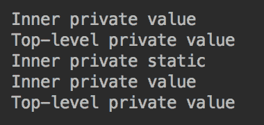

# Java 基础知识

本章向读者提供了更详细的 Java 作为一种语言的视图。 它从包中的代码组织和类别（接口）的辅助级别和它们的方法和属性（字段）的描述。 作为 Java 面向对象性质的主要类型的参考类型，也详细介绍，然后是保留和受限制的关键字列表以及对其使用的讨论。 章节以原始类型与原始类型与相应的引用类型和背部的转换方法结尾。

这些是 Java 语言的基本术语和功能。 他们的理解的重要性不能夸大。 没有它们，人们无法编写任何 Java 程序。 所以，尽量不要急于通过这一章，并确保你了解一切呈现。

本章将介绍以下主题：

*   包，导入和访问
*   Java 参考类型
*   保留和限制的关键字
*   使用`this`和`super`关键词
*   在原始类型之间转换
*   在原始和引用类型之间转换

# 包，导入和访问

如您所知，包名称反映了目录结构，从包含`.java`文件的项目目录开始。 每个`.java`文件的名称必须与其中声明的顶级类的名称相同（此类可以包含其他类）。 `.java`文件的第一行是以`package`关键字以实际包名称开头的包语句 - 此文件的目录路径，其中斜杠被替换为点。

包名称和类名一起撰写**完全限定的类名**。 它唯一地识别课程，但往往是过长和不方便的。 即，当**导入**来救援时，允许仅允许一次性限定名称一次，然后仅由类名称引用类。

仅在调用者访问该类及其方法时，才能从另一个类的方法中调用类的方法。 Access Modifiers `public`，`protected`和`private`定义了可访问性的级别，允许（或禁止）某些方法，属性，甚至是其他类的类本身。

所有这些方面将在当前部分详细讨论。

# 包

让我们来看看我们叫做`Packages`的课程：

```
package com.packt.learnjava.ch03_fundamentals;
import com.packt.learnjava.ch02_oop.hiding.C;
import com.packt.learnjava.ch02_oop.hiding.D;
public class Packages {
    public void method(){
        C c = new C();
        D d = new D();
    }
}
```

`Packages`类中的第一行是一个包声明，它标识源树上的类位置，或者换句话说，换句话说，文件系统中的`.java`文件位置。 编译类并生成带有字节码的`.class`文件时，包名也反映了文件系统中的`.class`文件位置。

# 输入

包声明后，`import`语句关注。 正如您可以从上一个示例中看到的，它们允许避免使用当前类中的其他所有其他类（或接口）名称的使用。 当从同一包中导入许多类（和接口）时，可以使用符号`*`将所有类和接口从与组相同的包。 在我们的示例中，它将如下所示：

```
import com.packt.learnjava.ch02_oop.hiding.*;

```

但这不是推荐的练习，因为它在将几个包作为组导入时隐藏导入的类（和接口）位置。 例如，查看此代码片段：

```
package com.packt.learnjava.ch03_fundamentals;
import com.packt.learnjava.ch02_oop.*;
import com.packt.learnjava.ch02_oop.hiding.*;
public class Packages {
    public void method(){
        C c = new C();
        D d = new D();
    }
}
```

在前面的代码中，您是否可以猜到课程`C`或类`D`所属的包？ 此外，不同包中的两个类可能具有相同的名称。 如果是这种情况，小组导入可以创造混淆甚至难以钉住的问题。

也可以导入单个静态类（或接口）成员。 例如，如果`SomeInterface`有`NAME`属性（提醒您，接口属性是公共和默认情况下的），通常可以将其引用如下：

```
package com.packt.learnjava.ch03_fundamentals;
import com.packt.learnjava.ch02_oop.SomeInterface;
public class Packages {
    public void method(){
        System.out.println(SomeInterface.NAME);
    }
}
```

要避免使用甚至接口名称，可以使用静态导入：

```
package com.packt.learnjava.ch03_fundamentals;
import static com.packt.learnjava.ch02_oop.SomeInterface.NAME;
public class Packages {
    public void method(){
        System.out.println(NAME);
    }
}
```

同样，如果`SomeClass`具有公共静态属性，`someProperty`和公共静态方法，`someMethod()`，也可以静态导入它们：

```
package com.packt.learnjava.ch03_fundamentals;
import com.packt.learnjava.ch02_oop.StaticMembers.SomeClass;
import com.packt.learnjava.ch02_oop.hiding.C;
import com.packt.learnjava.ch02_oop.hiding.D;
import static com.packt.learnjava.ch02_oop.StaticMembers
                                          .SomeClass.someMethod;
import static com.packt.learnjava.ch02_oop.StaticMembers
                                          .SomeClass.SOME_PROPERTY;
public class Packages {
    public static void main(String... args){
        C c = new C();
        D d = new D();

        SomeClass obj = new SomeClass();
        someMethod(42);
        System.out.println(SOME_PROPERTY);    //prints: abc
    }
}
```

但是，应该明智地使用此技术，因为它可能会创建一个据称，静态导入的方法或属性属于当前类。

# 访问修饰符

我们已经在我们的示例中使用了三个访问修改器-`public`，`protected`和`private` - 从其他类或接口中调节对类，接口和其成员的访问。 当指定三个显式访问修饰程序中的任何一个都没有时，还存在第四个隐式屏蔽（也称为**默认修改器包 - Prictual** ）。

他们使用的效果非常简单：

*   `public`：可用于当前和其他包的其他类和接口
*   `protected`：只能访问同一包装和班级儿童的其他成员
*   没有访问修改器意味着只能访问同一包的其他成员
*   `private`：只能访问同一类的成员

从类或接口中，始终可以访问所有类或接口成员。 此外，由于我们已经陈述了几次，除非声明为`private`，否则所有接口成员都是公众的。

此外，请注意，类可访问性取代了类成员的可访问性，因为如果从某处无法访问此类本身，则其方法或属性的可访问性不会更改，可以使其可访问。

当人们谈论类和接口的访问修饰符时，它们都意味着在其他类或接口中声明的类和接口。 包含类或接口称为**顶级类或接口**，而其中内部称为**内部类或接口**。 静态内部类也称为**静态嵌套类**。

声明顶级类或接口`private`没有意义，因为它将无法从任何地方访问。 Java 作者决定允许允许宣称`protected`的顶级类或接口。 尽管有一个没有显式访问修饰符的类，因此可以仅访问同一包的成员。

这是一个例子：

```
public class AccessModifiers {
    String prop1;
    private String prop2;
    protected String prop3;
    public String prop4;

    void method1(){ }
    private void method2(){ }
    protected void method3(){ }
    public void method4(){ }

    class A1{ }
    private class A2{ }
    protected class A3{ }
    public class A4{ }

    interface I1 {}
    private interface I2 {}
    protected interface I3 {}
    public interface I4 {}
}
```

请注意，静态嵌套类无法访问顶级类的其他成员。

内部类的另一个特定特征是它可以访问顶级类的所有甚至私有成员，反之亦然。 要演示此功能，让我们在顶级类和私有内部类中创建以下私有属性和方法：

```
public class AccessModifiers {
    private String topLevelPrivateProperty = "Top-level private value";
    private void topLevelPrivateMethod(){
        var inner = new InnerClass();
        System.out.println(inner.innerPrivateProperty);
        inner.innerPrivateMethod();
    }

    private class InnerClass {
        //private static String PROP = "Inner static"; //error
        private String innerPrivateProperty = "Inner private value";
        private void innerPrivateMethod(){
            System.out.println(topLevelPrivateProperty);
        }
    }

    private static class InnerStaticClass {
        private static String PROP = "Inner private static";
        private String innerPrivateProperty = "Inner private value";
        private void innerPrivateMethod(){
            var top = new AccessModifiers();
            System.out.println(top.topLevelPrivateProperty);
        }
    }
}
```

如您所见，以前类中的所有方法和属性都是私有的，这意味着通常它们无法从类外部访问。 这对于`AccessModifiers`类是如此：它的私有方法和属性无法对其外部声明的其他类别无法访问。 但`InnerClass`类可以访问顶级类的私有成员，而顶级类可以访问其内部类的私有成员。 唯一的限制是非静态内部类不能具有静态成员。 相比之下，静态嵌套类可以具有静态和非静态成员，这使得一个静态嵌套类更具可用性。

要演示所有所描述的可能性，我们将以下`main()`方法添加到类`AccessModifiers`：

```
public static void main(String... args){
    var top = new AccessModifiers();
    top.topLevelPrivateMethod();
    //var inner = new InnerClass();  //error
    System.out.println(InnerStaticClass.PROP);
    var inner = new InnerStaticClass();
    System.out.println(inner.innerPrivateProperty);
    inner.innerPrivateMethod();
}
```

当然，无法从顶级类的静态上下文访问非静态内部类，因此在前面的代码中的评论。 如果我们运行它，结果将如下：



输出的前两行来自`topLevelPrivateMethod()`，其余来自`main()`方法。 如您所见，内部和顶级类可以访问彼此的私有状态，无法从外部访问。

# Java 参考类型

A `new`操作员创建类的对象，并返回对对象所在的内存的引用。 从实际的角度来看，包含此引用的变量在代码中处理，就像它是对象本身一样。 这种变量的类型可以是类，接口，阵列或`null`文字，表示没有将内存参考分配给变量。 如果引用的类型是接口，则可以分配`null`或引用实现此接口的类的对象，因为无法实例化接口本身。

JVM 为所有创建的对象监视，并检查当前已执行的代码中是否存在对它们中的每一个的引用。 如果有一个没有任何引用的对象，JVM 将从名为**垃圾收集**的过程中的内存中删除它。 我们将在[第 9 章](09.html)， *JVM 结构和垃圾收集*中描述此过程。 例如，在方法执行期间创建对象，并由本地变量引用。 一旦方法完成其执行，此参考将会消失。

您已经看到了自定义类和接口的示例，我们已经讨论了`String`类（参见[第 1 章](01.html)，*入门使用 java 12* ）。 在本节中，我们还将描述另外两种 Java 参考类型阵列和枚举 - 并演示如何使用它们。

# 班级和界面

使用相应的类名声明类类型的变量：

```
<Class name> identifier;
```

可以分配给此类变量的值可以是以下之一：

*   引用类型文字`null`（表示可以使用变量但不引用任何对象）
*   对同一类别或其任何后代的对象的引用（因为后代继承了所有祖先的类型）

最后类型的分配称为**扩大分配**，因为它强制了专门的专业化。 例如，由于每个 Java 类是`java.lang.Object`的子类，因此可以为任何类完成以下赋值：

```
Object obj = new AnyClassName();
```

这样的分配也被称为 **usccasting** ，因为它会在继承行上移动变量的类型（与任何家谱一样，通常呈现顶部最古老的祖先）。

在这样的升高之后，可以使用演员操作员`(type)`进行缩小分配：

```
AnyClassName anyClassName = (AnyClassName)obj;
```

这样的分配也称为**衰减**，并允许您恢复后代类型。 要应用此操作，您必须确保标识符是指事实上的后代类型。 如果有疑问，可以使用`instanceof`运算符（参见[第 2 章](02.html)， *java 面向对象编程*）来检查引用类型。

类似地，如果类实现某个接口，则可以将其对象引用分配给该接口或接口的任何祖先：

```
interface C {}
interface B extends C {}
class A implements B { }
B b = new A();
C c = new A();
A a1 = (A)b;
A a2 = (A)c;
```

正如您所看到的，就像在具有类参考 Compacting 和衰减的情况下，可以在将其引用分配给一个实现的接口类型之一的变量后恢复对象的原始类型。

该部分的材料也可以被视为 Java 多态性在动作中的另一个演示。

# 大批

**array** 是引用类型，因此也可以扩展`java.lang.Object`类。 数组元素具有与声明的数组类型相同的类型。 元素的数量可以是零，在这种情况下，阵列被称为空阵列。 可以通过索引访问每个元素，该索引是正整数或零。 第一个元素的索引为零。 元素的数量称为数组长度。 创建数组后，其长度永远不会更改。

以下是数组声明的示例：

```
int[] intArray;
float[][] floatArray;
String[] stringArray;
SomeClass[][][] arr;
```

每个支架对表示另一种尺寸。 括号对的数量是阵列的嵌套深度：

```
int[] intArray = new int[10];
float[][] floatArray = new float[3][4];
String[] stringArray = new String[2];
SomeClass[][][] arr = new SomeClass[3][5][2];
```

`new`操作员为每个元素分配内存，以后可以分配（填充）值。 但是，阵列的元素被初始化为创建时间的默认值，因为以下示例演示：

```
System.out.println(intArray[3]);      //prints: 0
System.out.println(floatArray[2][2]); //prints: 0.0
System.out.println(stringArray[1]);   //prints: null

```

创建数组的另一种方法是使用阵列初始化程序 - 一个逗号分隔的值列表，用于每个维度的支架中。 例如：

```
int[] intArray = {1,2,3,4,5,6,7,8,9,10};
float[][] floatArray ={{1.1f,2.2f,3,2},{10,20.f,30.f,5},{1,2,3,4}};
String[] stringArray = {"abc", "a23"};

System.out.println(intArray[3]);      //prints: 4
System.out.println(floatArray[2][2]); //prints: 3.0
System.out.println(stringArray[1]);   //prints: a23

```

可以在不声明每个维度的长度的情况下创建多维数组。 只有第一个维度必须具有指定的长度：

```
float[][] floatArray = new float[3][];

System.out.println(floatArray.length);  //prints: 3
System.out.println(floatArray[0]);      //prints: null
System.out.println(floatArray[1]);      //prints: null
System.out.println(floatArray[2]);      //prints: null
//System.out.println(floatArray[3]);    //error
//System.out.println(floatArray[2][2]); //error

```

稍后可以指定其他维度的缺失长度：

```
float[][] floatArray = new float[3][];
floatArray[0] = new float[4];
floatArray[1] = new float[3];
floatArray[2] = new float[7];
System.out.println(floatArray[2][5]);   //prints: 0.0

```

这样，可以将不同的长度分配给不同的维度。 使用数组初始化程序，也可以创建不同长度的尺寸：

```
float[][] floatArray ={{1.1f},{10,5},{1,2,3,4}};

```

唯一的要求是在可以使用之前必须初始化维度。

# 枚举

**枚举**参考类型类扩展了`java.lang.Enum`类，又延伸了`java.lang.Object`。 它允许指定一组有限的常量，它们中的每一个相同类型的实例。 此类集的声明以关键字`enum`开头。 这是一个例子：

```
enum Season { SPRING, SUMMER, AUTUMN, WINTER }
```

列出的项目 - `SPRING`，`SUMMER`，`AUTUMN`和`WINTER`中的每一个 - 是`Season `类型的实例。 它们是`Season`类可以拥有的四个实例。 它们是提前创建的，可以随处使用`Season`类型的值来使用。 可以创建`Season`类的其他实例。 这就是创建`enum`类型的原因：当类的实例列表必须限制为固定集时，它可以用于情况。

`enum`声明也可以用骆驼盒写入：

```
enum Season { Spring, Summer, Autumn, Winter }
```

但是，所有资本风格都被更频繁地使用，因为，正如我们之前提到的那样，有一个惯例将静态最终常量的标识符表达在大写案例中。 它有助于区分变量的常数。 `enum`常数隐含地是静态和最终的。

因为`enum`值是常量，所以它们在 JVM 中唯一存在，并且可以通过引用进行比较：

```
Season season = Season.WINTER;
boolean b = season == Season.WINTER;
System.out.println(b);   //prints: true
```

以下是`java.lang.Enum`类的最常用方法：

*   `name()`：返回`enum`常量的标识符，因为声明（例如`WINTER`）时拼写。
*   `toString()`：默认情况下返回与`name()`方法相同的值，但可以覆盖以返回任何其他`String`值。
*   `ordinal()`：声明时返回`enum`常量的位置（列表中的第一个具有`0`序数值）。
*   `valueOf(Class enumType, String name)`：通过其名称返回`enum`常量对象，表示为`String`文字。
*   `values()`：`java.lang.Enum`类的文档中未描述的静态方法。 在 *java 语言规范*中，*第 8.9.3 节*（ [https://docs.oracle.com/javase/specs/jls/se12/html/jls-8。 HTML＃JLS-8.9.3](https://docs.oracle.com/javase/specs/jls/se12/html/jls-8.html#jls-8.9.3) ），它被描述为隐式声明。 *java™教程*（ [https://docs.oracle.com/javase/tutorial/java/javaoo/enum.html](https://docs.oracle.com/javase/tutorial/java/javaOO/enum.html) ）指出编译器在它时自动添加一些特殊方法 创造一个`enum`; 其中，返回包含它们被声明的顺序的静态`values()`方法，其中包含`enum`的所有值。

要演示前面的方法，我们将使用已经熟悉的`enum`，`Season`：

```
enum Season { SPRING, SUMMER, AUTUMN, WINTER }
```

这是演示代码：

```
System.out.println(Season.SPRING.name());            //prints: SPRING
System.out.println(Season.WINTER.toString());        //prints: WINTER
System.out.println(Season.SUMMER.ordinal());         //prints: 1
Season season = Enum.valueOf(Season.class, "AUTUMN");
System.out.println(season == Season.AUTUMN);         //prints: true

for(Season s: Season.values()){
    System.out.print(s.name() + " "); 
                               //prints: SPRING SUMMER AUTUMN WINTER
}
```

要覆盖`toString()`方法，请创建`enum` `Season1`：

```
enum Season1 {
    SPRING, SUMMER, AUTUMN, WINTER;
    public String toString() {
        return this.name().charAt(0) + 
               this.name().substring(1).toLowerCase();
    }
}
```

下面是它的工作原理：

```
for(Season1 s: Season1.values()){
    System.out.print(s.toString() + " "); 
                                 //prints: Spring Summer Autumn Winter
}
```

可以向每个`enum`常数添加任何其他属性。 例如，让我们添加到每个`enum`实例平均温度值：

```
enum Season2 {
    SPRING(42), SUMMER(67), AUTUMN(32), WINTER(20);
    private int temperature;
    Season2(int temperature){
        this.temperature = temperature;
    }
    public int getTemperature(){
        return this.temperature;
    }
    public String toString() {
        return this.name().charAt(0) +
                this.name().substring(1).toLowerCase() +
                "(" + this.temperature + ")";
    }
}
```

如果我们迭代`enum` `Season2`的值，结果如下：

```
for(Season2 s: Season2.values()){
    System.out.print(s.toString() + " "); 
              //prints: Spring(42) Summer(67) Autumn(32) Winter(20)
}
```

在标准的 Java 库中，有几个`enum`类。 例如，`java.time.Month`，`java.time.DayOfWeek`，`java.util.concurrent.TimeUnit`。

# 默认值和文字

正如我们已经看到的那样，引用类型的默认值是`null`。 有些消息来源称之为**特殊类型 null** ，但 Java 语言规范将其作为文字符合。 当自动初始化实例属性或参考类型的数组时（当未明确分配值时）时，指定的值为`null`。

除了`null`文字之外的唯一引用类型是我们在[第 1 章](01.html)，*中讨论了 java 12* 中讨论了字符串的`String`类。

# 引用类型作为方法参数

当原始类型值传递到方法中时，我们使用它。 如果我们不喜欢传递到该方法的值，我们会改变它，因为我们认为适合，并不三思而后行：

```
void modifyParameter(int x){
    x = 2;
}
```

我们没有担心方法外的变量值可能会改变：

```
int x = 1;
modifyParameter(x);
System.out.println(x);  //prints: 1

```

不可能更改方法外部的基元类型的参数值，因为引用类型参数通过值传递给方法*。 这意味着将该值的副本传递到方法中，因此即使该方法内的代码为其分配了不同的值，原始值不受影响。*

引用类型的另一个问题是，即使参考本身通过值传递，它仍然指向内存中的相同原始对象，因此该方法内的代码可以访问对象并修改它。 要演示它，让我们创建一个`DemoClass`和使用它的方法：

```
class DemoClass{
    private String prop;
    public DemoClass(String prop) { this.prop = prop; }
    public String getProp() { return prop; }
    public void setProp(String prop) { this.prop = prop; }
}
void modifyParameter(DemoClass obj){
    obj.setProp("Changed inside the method");
}
```

如果我们使用前面的方法，结果将如下：

```
DemoClass obj = new DemoClass("Is not changed");
modifyParameter(obj);
System.out.println(obj.getProp()); //prints: Changed inside the method

```

这是一个很大的不同，不是吗？ 因此，您必须小心不要修改传递的对象，以避免不希望的效果。 但是，这种效果偶尔用于返回结果。 但它不属于最佳实践列表，因为它使代码更少可读。 更改传递的对象就像使用难以注意到的秘密隧道。 所以，只有当你必须的时候使用它。

即使传递的对象是一种包裹原始值的类，也仍然保持这种效果（我们将在原始和引用类型部分之间的*转换中讨论原始值包装类型。 以下是`DemoClass1`和`modifyParameter()`方法的超载版本：*

```
class DemoClass1{
    private Integer prop;
    public DemoClass1(Integer prop) { this.prop = prop; }
    public Integer getProp() { return prop; }
    public void setProp(Integer prop) { this.prop = prop; }
}
void modifyParameter(DemoClass1 obj){
    obj.setProp(Integer.valueOf(2));
}
```

如果我们使用前面的方法，结果将如下：

```
DemoClass1 obj = new DemoClass1(Integer.valueOf(1));
modifyParameter(obj);
System.out.println(obj.getProp());  //prints: 2

```

此引用类型的此行为的唯一例外是`String`类的对象。 以下是`modifyParameter()`方法的另一个超载版本：

```
void modifyParameter(String obj){
    obj = "Changed inside the method";
}  
```

如果我们使用前面的方法，结果将如下：

```
String obj = "Is not changed";
modifyParameter(obj);
System.out.println(obj); //prints: Is not changed

obj = new String("Is not changed");
modifyParameter(obj);
System.out.println(obj); //prints: Is not changed

```

如您所见，无论我们使用文字还是新的`String`对象，结果保持不变：在为其分配另一个值的方法后，原始`String`值不会更改。 这正是 [](01.html) [](01.html)，*中讨论的`String`价值不变性特征的目的，使用 Java 12* 。

# 方法等于（）

当应用于参考类型的变量时，平等运算符（`==`）比较了引用本身，而不是对象的内容（状态）。 但是，即使它们具有相同的内容，两个对象始终具有不同的内存引用。 即使用于`String`对象时，如果使用`new`运算符中的至少一个，则返回操作员（`==`）返回`false`（参见[第 1 章](01.html)[的讨论](01.html) ，*使用 Java 12* 开始。

要比较内容，您可以使用`equals()`方法。 它在`String`类和数字类型包装类（`Integer`，`Float`等中的实现确切地说 - 比较对象的内容。

然而，`equals()`方法在`java.lang.Object`类中实现仅比较引用，这是可理解的，因为后代可能具有的各种可能的内容是巨大的，但通用内容比较的实现是不可行的。 这意味着每个需要具有`equals()`方法的 java 对象比较对象的内容 - 不仅是引用 - 必须重新实现`equals()`方法，从而覆盖所需的`java.lang.Object`类中的实现 如下：

```
  public boolean equals(Object obj) {
       return (this == obj);
}
```

相比之下，了解`Integer`类中实现相同的方法：

```
private final int value;
public boolean equals(Object obj) {
    if (obj instanceof Integer) {
        return value == ((Integer)obj).intValue();
    }
    return false;
}

```

如您所见，它从输入对象中提取原始`int`值，并将其与当前对象的原始值进行比较。 它根本没有比较对象引用。

另一方面，`String`类首先比较引用，如果引用不相同的值，则会比较对象的内容：

```
private final byte[] value;
public boolean equals(Object anObject) {
      if (this == anObject) {
            return true;
      }
      if (anObject instanceof String) {
         String aString = (String)anObject;
         if (coder() == aString.coder()) {
           return isLatin1() ? StringLatin1.equals(value, aString.value)
                             : StringUTF16.equals(value, aString.value);
         }
      }
      return false;
}
```

`StringLatin1.equals()`和`StringUTF16.equals()`方法按字符的值比较值，而不仅仅是引用。

同样，如果应用程序代码需要通过它们的内容进行比较两个对象，则必须覆盖相应类中的`equals()`方法。 例如，让我们来看看熟悉的`DemoClass`类：

```
class DemoClass{
    private String prop;
    public DemoClass(String prop) { this.prop = prop; }
    public String getProp() { return prop; }
    public void setProp(String prop) { this.prop = prop; }
}
```

我们可以手动添加`equals()`方法，但 IDE 可以帮助我们如下：

1.  右键单击关闭括号前的课程（`}`）
2.  选择生成，然后按照提示

最终，将生成两种方法并将其添加到类中：

```
@Override
public boolean equals(Object o) {
    if (this == o) return true;
    if (!(o instanceof DemoClass)) return false;
    DemoClass demoClass = (DemoClass) o;
    return Objects.equals(getProp(), demoClass.getProp());
}

@Override
public int hashCode() {
    return Objects.hash(getProp());
}
```

查看生成的代码，我们想吸引您对以下几点的注意：

*   使用`@Override`注释：它确保该方法在其中一个祖先中覆盖了一种方法（具有相同的签名）。 使用此注释到位，如果修改方法并更改签名（错误或故意），编译器（和您的 IDE）将立即引发错误，告诉您任何祖先都没有此类签名的方法 课程。 因此，它有助于早期检测错误。
*   使用`java.util.Objects`类：它具有相当多的非常有用的方法，包括`equals()`静态方法，不仅可以使用`equals()`方法：

```
     public static boolean equals(Object a, Object b) {
         return (a == b) || (a != null && a.equals(b));
     }
```

由于我们之前展示的，`equals()`在`String`类中实现的方法将字符串通过其内容进行比较，并为我们的目的服务，因为`DemoClass`的方法`getProp()`返回一个字符串。

*   `hashCode()`方法：此方法返回的整数唯一标识此特定对象（但请不要指望在应用程序的不同运行之间相同）。 如果所需的唯一方法是`equals()`，则没有必要实现该方法。 尽管如此，建议将其仅在此类的对象将在`Set`或其他集合中基于哈希码（我们将谈论[第 6 章](06.html) ）收集（我们将谈论 Java Collections *数据结构，泛型和流行的实用程序*）。

这两种方法都在`Object`中实现，因为许多算法使用`equals()`和`hashCode()`方法，并且在没有这些方法实现的情况下，您的应用程序可能无法工作。 同时，您的对象可能不需要它们在您的应用程序中。 但是，一旦您决定实现`equals()`方法，也是实现`hasCode()`方法的好主意。 此外，如您所见，IDE 可以在没有任何开销的情况下进行。

# 保留和限制的关键字

**关键字**是对编译器特别含义的单词，不能用作识别器。 有 51 个保留关键字和 10 个受限关键字。 保留关键字不能用作 Java 代码中的任何位置的识别器，而受限制的关键字不能仅在模块声明的上下文中用作识别器。

# 保留的关键词

以下是所有 Java 保留关键字的列表：

| `abstract` | `assert` | `boolean` | `break` | `byte` |
| `case` | `catch` | `char` | `class` | `const` |
| `continue` | `default` | `do` | `double` | `else` |
| `enum` | `extends` | `final ` | `finally` | `float` |
| `for` | `if` | `goto` | `implements` | `import` |
| `instanceof` | `int` | `interface` | `long` | `native` |
| `new` | `package` | `private` | `protected` | `public` |
| `return` | `short` | `static` | `strictfp` | `super` |
| `switch` | `synchronized` | `this` | `throw` | `throws` |
| `transient` | `try` | `void` | `volatile` | `while` |

下划线（`_`）也是一个保留的词。

到目前为止，您应该熟悉前面的大多数关键字。 通过练习，您可以通过列表并检查您记得的多少。 我们没有谈论以下八个关键词：

*   `const`和`goto`是保留但未使用，到目前为止
*   `assert`关键字在`assert`语句中使用（我们将在[中讨论它第 4 章](04.html)，*异常处理*）
*   `synchronized`关键字用于并发编程（我们将在[中讨论它第 8 章](08.html)，*多线程和并发处理*）
*   `volatile`关键字使变量的值不被缓存
*   `transient`关键字使变量的值不序列化
*   `strictfp`关键字限制浮点计算使其在每个平台上的结果相同的结果，同时在浮点变量中执行操作
*   `native`关键字声明在依赖于平台的代码中实现的方法，例如 c 或 c ++

# 受限制的关键字

Java 中的 10 个受限制的关键字如下：

*   `open`
*   `module`
*   `requires`
*   `transitive`
*   `exports`
*   `opens`
*   `to`
*   `uses`
*   `provides`
*   `with`

它们被称为*限制*，因为它们不能在模块声明的上下文中成为标识符，我们不会在本书中讨论。 在所有其他地方，可以将它们用作标识符。 例如：

```
String to = "To";
String with = "abc";
```

虽然您可以，但即使在模块声明之外，也是一个很好的做法不要将它们用作标识符。

# 使用此和超级关键字

`this`关键字提供对当前对象的引用。 `super`关键字是指父类对象。 这些关键字允许我们参考当前上下文中具有相同名称和父对象中的变量或方法。

# 使用此关键字

这是最受欢迎的例子：

```
class A {
    private int count;
    public void setCount(int count) {
        count = count;         // 1
    }
    public int getCount(){
        return count;          // 2
    }
}
```

第一行看起来不明显，但事实上，它不是：局部变量`int count`隐藏实例私有属性`int count`。 我们可以通过运行以下代码来演示它：

```
A a = new A();
a.setCount(2);
System.out.println(a.getCount());     //prints: 0

```

使用`this`关键字修复问题：

```
class A {
    private int count;
    public void setCount(int count) {
        this.count = count;         // 1
    }
    public int getCount(){
        return this.count;          // 2
    }
}
```

将`this`添加到行 1 允许将值分配给实例属性。 将`this`添加到第 2 行不会产生差异，但每次使用`instance`属性使用`this`关键字是一个很好的做法。 它使得代码更可读，并有助于避免难以跟踪的错误，例如我们刚才展示的错误。

我们还看到了`equals()`方法中的`this`关键字用法：

```
@Override
public boolean equals(Object o) {
    if (this == o) return true;
    if (!(o instanceof DemoClass)) return false;
    DemoClass demoClass = (DemoClass) o;
    return Objects.equals(getProp(), demoClass.getProp());
}
```

而且，只是提醒您，这里是我们在 [](02.html) 中呈现的构造函数的示例， *java 面向对象编程（OOP）*：

```
class TheChildClass extends TheParentClass{
    private int x;
    private String prop;
    private String anotherProp = "abc";
    public TheChildClass(String prop){
        super(42);
        this.prop = prop;
    }
    public TheChildClass(int arg1, String arg2){
        super(arg1);
        this.prop = arg2;
    }
    // methods follow
}
```

在前面的代码中，您不仅可以看到`this`关键字，还可以看到`super`关键字的使用，我们将要接下来讨论。

# 超级关键字的用法

`super`关键字是指父对象。 我们在构造函数中的*使用情况下，我们在*使用情况下的用法，它必须仅在第一行中使用，因为必须在创建当前对象之前创建父类对象 。 如果构造函数的第一行不是`super()`，则表示父类具有没有参数的构造函数。**

当覆盖方法并且必须调用父类的方法时，`super`关键字特别有用：

```
class B  {
    public void someMethod() {
        System.out.println("Method of B class");
    }
}
class C extends B {
    public void someMethod() {
        System.out.println("Method of C class");
    }
    public void anotherMethod() {
        this.someMethod();    //prints: Method of C class
        super.someMethod();   //prints: Method of B class
    }
}
```

当我们通过本书的进步时，我们将看到使用`this`和`super`关键字的其他示例。

# 在原始类型之间转换

最大数值一个数字类型可以保存取决于分配给它的比特数。 以下是每个数字类型表示的位数：

*   `byte`：8 位
*   `char`：16 位
*   `short`：16 位
*   `int`：32 位
*   `long`：64 位
*   `float`：32 位
*   `double`：64 位

当将一个数字类型的值分配给另一个数字类型的变量并且新类型可以保持更大的数字时，这种转换称为**加宽转换**。 否则，它是一个**缩小**转换，其通常需要使用`cast`操作员的键音。

# 扩大转换

根据 Java 语言规范，有 19 个扩大原始类型转换：

*   `byte`至`short`，`int`，`long`，`float`，或`double`
*   `short`至`int`，`long`，`float`，或`double`
*   `char`至`int`，`long`，`float`，或`double`
*   `int`至`long`，`float`，或`double`
*   `long`到`float`或`double`
*   `float`到`double`

在整体类型之间的转换和从某些积分类型到浮点类型的转换期间，结果值完全匹配原始的。 然而，从`int`到`float`或从`long`到`float`或从`long`转换为`double`，可能导致精度损失。 根据 Java 语言规范，可以使用`IEEE 754 round-to-nearest mode`正确舍入的浮点值。 以下是一些展示精度损失的例子：

```
int i = 123456789;
double d = (double)i;
System.out.println(i - (int)d);    //prints: 0

long l1 = 12345678L;
float f1 = (float)l1;
System.out.println(l1 - (long)f1);    //prints: 0

long l2 = 123456789L;
float f2 = (float)l2;
System.out.println(l2 - (long)f2);    //prints: -3

long l3 = 1234567891111111L;
double d3 = (double)l3;
System.out.println(l3 - (long)d3);    //prints: 0

long l4 = 12345678999999999L;
double d4 = (double)l4;
System.out.println(l4 - (long)d4);    //prints: -1 
```

如您所见，从`int`到`double`的转换将值保留，但`long`到`float`或`long`至`double`可能会失去精度。 这取决于价值有多大。 因此，请注意，如果对于您的计算很重要，请注意并允许某种精度丢失。

# 缩小转换

Java 语言规范识别 22 缩小原始转换：

*   `short`到`byte`或`char`
*   `char`到`byte`或`short`
*   `int`至`byte`，`short`，或`char`
*   `long`至`byte`，`short`，`char`，或`int`
*   `float`至`byte`，`short`，`char`，`int`，或`long`
*   `double`至`byte`，`short`，`char`，`int`，`long`，或`float`

类似于扩展转换，缩小转换可能导致精度损失，甚至可能导致值幅度的损失。 缩小转换比一个加宽的转换更复杂，我们不会在这本书中讨论它。 重要的是要记住，在执行缩小之前，必须确保原始值小于目标类型的最大值。 否则，您可以获得完全不同的值（损失幅度）。 看看以下示例：

```
System.out.println(Integer.MAX_VALUE); //prints: 2147483647
double d1 = 1234567890.0;
System.out.println((int)d1);           //prints: 1234567890

double d2 = 12345678909999999999999.0;
System.out.println((int)d2);           //prints: 2147483647

```

您可以从示例中看到，无需检查目标类型是否可以容纳值，可以获得等于目标类型的最大值的结果。 其余的将刚刚失去了，不管差异有多大。

在执行缩小转换之前，请检查目标类型的最大值是否可以保持原始值。

请注意，`char`类型和`byte`或`short`类型之间的转换是一个更复杂的过程，因为`char`类型是无符号数字类型，而`byte`和`short`类型是 符号数值类型，因此即使值可能看起来好像它适合目标类型，也可以进行一些信息丢失。

# 转换方法

除了铸造外，每个原始类型还具有相应的参考类型（称为**包装类**），其具有将此类型的值转换为除`boolean`和`char`之外的任何其他原始类型的方法。 所有包装课程属于`java.lang`套件：

*   `java.lang.Boolean`
*   `java.lang.Byte`
*   `java.lang.Character`
*   `java.lang.Short`
*   `java.lang.Integer`
*   `java.lang.Long`
*   `java.lang.Float`
*   `java.lang.Double`

它们中的每一个 - 除类`Boolean`和`Character` - dext dendstapta astuptand `java.lang.Number`，它具有以下抽象方法：

*   `byteValue()`
*   `shortValue()`
*   `intValue()`
*   `longValue()`
*   `floatValue()`
*   `doubleValue()`

这种设计迫使`Number`类的后代实现所有这些。 它们产生的结果与前面的示例中的`cast`操作员相同：

```
int i = 123456789;
double d = Integer.valueOf(i).doubleValue();
System.out.println(i - (int)d);          //prints: 0

long l1 = 12345678L;
float f1 = Long.valueOf(l1).floatValue();
System.out.println(l1 - (long)f1);       //prints: 0

long l2 = 123456789L;
float f2 = Long.valueOf(l2).floatValue();
System.out.println(l2 - (long)f2);       //prints: -3

long l3 = 1234567891111111L;
double d3 = Long.valueOf(l3).doubleValue();
System.out.println(l3 - (long)d3);       //prints: 0

long l4 = 12345678999999999L;
double d4 = Long.valueOf(l4).doubleValue();
System.out.println(l4 - (long)d4);       //prints: -1

double d1 = 1234567890.0;
System.out.println(Double.valueOf(d1)
                         .intValue());   //prints: 1234567890

double d2 = 12345678909999999999999.0;
System.out.println(Double.valueOf(d2)
                         .intValue());   //prints: 2147483647

```

另外，每个包装器类都具有允许将数值的`String`表示的方法与相应的基元数字类型或引用类型的方法。 例如：

```
byte b1 = Byte.parseByte("42");
System.out.println(b1);             //prints: 42
Byte b2 = Byte.decode("42");
System.out.println(b2);             //prints: 42

boolean b3 = Boolean.getBoolean("property");
System.out.println(b3);            //prints: false
Boolean b4 = Boolean.valueOf("false");
System.out.println(b4);            //prints: false

int i1 = Integer.parseInt("42");
System.out.println(i1);            //prints: 42
Integer i2 = Integer.getInteger("property");
System.out.println(i2);            //prints: null

double d1 = Double.parseDouble("3.14");
System.out.println(d1);            //prints: 3.14
Double d2 = Double.valueOf("3.14");
System.out.println(d2);            //prints: 3.14

```

在示例中，请注意接受参数**属性**的两种方法。 这两种和类似的其他包装类别的方法将系统属性（如果存在）转换为相应的原始类型。

每个包装类都具有`toString(primitive value)`静态方法，将原始类型值转换为其`String`表示表示。 例如：

```
String s1 = Integer.toString(42);
System.out.println(s1);            //prints: 42
String s2 = Double.toString(3.14);
System.out.println(s2);            //prints: 3.14
```

包装类包含许多其他有用的转换方法从一个原始类型到另一个原始类型和不同的格式。 所以，如果你需要这样的东西，请先查看相应的包装类。

# 在原始和引用类型之间转换

将原始类型值转换为相应包装类的对象称为**拳击**。 此外，从包装类的对象转换为相应的原始类型值称为 **unboxing** 。

# Boxing

可以自动（称为**自动拨款**）或使用每个包装器类型中可用的`valueOf()`方法进行自动（称为**自动框**来完成原始类型的拳击

```
int i1 = 42;
Integer i2 = i1;              //autoboxing
//Long l2 = i1;               //error
System.out.println(i2);       //prints: 42

i2 = Integer.valueOf(i1);
System.out.println(i2);       //prints: 42

Byte b = Byte.valueOf((byte)i1);
System.out.println(b);       //prints: 42

Short s = Short.valueOf((short)i1);
System.out.println(s);       //prints: 42

Long l = Long.valueOf(i1);
System.out.println(l);       //prints: 42

Float f = Float.valueOf(i1);
System.out.println(f);       //prints: 42.0

Double d = Double.valueOf(i1);
System.out.println(d);       //prints: 42.0 
```

请注意，仅在将原始类型转换为相应的包装器类型时，才能实现自动拨款。 否则，编译器会生成错误。

`Byte`和`Short`包装器的方法`valueOf()`的输入值所需的铸造，因为它是我们在上一节中讨论的原始类型的缩小。

# unboxing.

可以使用每个包装器类中实现的`Number`类的方法来完成解箱：

```
Integer i1 = Integer.valueOf(42);
int i2 = i1.intValue();
System.out.println(i2);      //prints: 42

byte b = i1.byteValue();
System.out.println(b);       //prints: 42

short s = i1.shortValue();
System.out.println(s);       //prints: 42

long l = i1.longValue();
System.out.println(l);       //prints: 42

float f = i1.floatValue();
System.out.println(f);       //prints: 42.0

double d = i1.doubleValue();
System.out.println(d);       //prints: 42.0

Long l1 = Long.valueOf(42L);
long l2 = l1;                //implicit unboxing
System.out.println(l2);      //prints: 42

double d2 = l1;              //implicit unboxing
System.out.println(d2);      //prints: 42

long l3 = i1;                //implicit unboxing
System.out.println(l3);      //prints: 42

double d3 = i1;              //implicit unboxing
System.out.println(d3);      //prints: 42
```

您可以从该示例中的注释中看到，从包装类型转换为相应的原始类型的转换不被称为**自动解压缩**; 它被称为**隐式 unboxing** 。 与自动框相比，即使在不匹配的包装和原始类型之间也可以使用隐式 unboxing。

# 概括

在本章中，您已经了解了 Java 软件包以及它们在组织代码和类访问中的角色，包括`import`语句和访问修饰符。 您也熟悉参考类型：类，接口，阵列和枚举。 任何引用类型的默认值为`null`，包括`String`类型。

您现在明白，参考类型通过引用传递到方法中，以及如何使用`equals()`方法且可以覆盖。 您还有机会研究保留和限制关键字的完整列表，并学习了`this`和`super`关键字的含义和用法。

通过描述原始类型，包装类型和`String`文字之间的转换过程和方法结论。

在下一章中，我们将讨论 Java 例外框架，选中和未选中（运行时）异常，`try-catch-finally`块，`throws`和`throw`语句以及异常处理的最佳实践。

# 测验

1.  选择正确的所有语句：
    1.  `Package`语句描述了类或接口位置
    2.  `Package`语句描述了类或接口名称
    3.  `Package`是一个完全合格的名称
    4.  `Package`名称和类名撰写了一个完全限定的类名称

2.  选择正确的所有语句：
    1.  `Import`语句允许使用完全限定的名称
    2.  `Import`声明必须是`.java`文件中的第一个
    3.  `Group import`语句只带来一个包的类（和界面）
    4.  `Import statement`允许避免使用完全限定的名称

3.  选择正确的所有语句：
    1.  如果没有访问修饰符，则该类仅可由相同包的其他类和接口访问
    2.  私有类的私有方法可用于在同一`.java`文件中声明的其他类中
    3.  私有类的公共方法可以在同一`.java`文件中未声明的其他类别访问，但是来自同一包
    4.  受保护的方法只能访问该类的后代

4.  选择正确的所有语句：
    1.  私有方法可以超载但未被覆盖
    2.  保护方法可以被覆盖但未超载
    3.  没有访问修饰符的方法都可以覆盖并重载
    4.  私有方法可以访问同一类的私有属性

5.  选择正确的所有语句：
    1.  缩小和沮丧是同义词
    2.  扩大和衰减是同义词
    3.  扩大和浮断是同义词
    4.  扩大和缩小与扫累和悲惨没有任何共同之处

6.  选择正确的所有语句：
    1.  `Array`是一个对象
    2.  `Array`的长度是它可以容纳的多个元素
    3.  阵列的第一个元素具有索引 1
    4.  阵列的第二个元素具有索引 1

7.  选择正确的所有语句：
    1.  `Enum`包含常量。
    2.  `Enum`始终具有构造函数，默认或显式
    3.  `enum`常量可以具有属性
    4.  `Enum`可以具有任何参考类型的常数

8.  选择正确的所有语句：
    1.  可以修改作为参数中传递的任何引用类型
    2.  可以修改作为参数的`new String()`对象
    3.  不能修改作为参数的对象参考值
    4.  作为参数传递的数组可以具有分配给不同值的元素

9.  选择正确的所有语句：
    1.  无法使用保留的关键字
    2.  受限制的关键字不能用作标识符
    3.  保留的关键字`identifier`不能用作标识符
    4.  保留关键字不能用作标识符

10.  选择正确的所有语句：
    1.  `this`关键字是指`current`类
    2.  `super`关键字是指`super`类
    3.  关键字`this`和`super`是指对象
    4.  关键字`this`和`super`是指方法

11.  选择正确的所有语句：
    1.  原始类型的扩展使得值更大
    2.  原始类型的缩放总是改变值的类型
    3.  在缩小转换之后，原始的扩展可以仅完成
    4.  缩小使得值更小

12.  选择正确的所有语句：
    1.  拳击对价值限制了
    2.  unboxing 创建一个新的价值
    3.  拳击创建引用类型对象
    4.  unboxing 删除引用类型对象