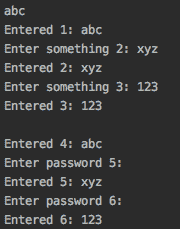
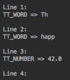
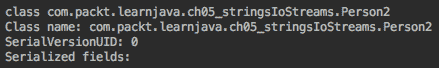
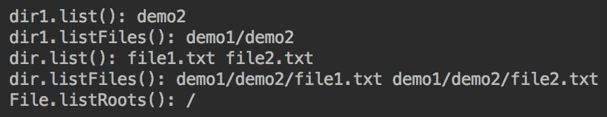

# 字符串、输入/输出和文件

在本章中，读者将更详细地了解`String`类方法。我们还将讨论标准库和 ApacheCommons 项目中流行的字符串工具。下面将概述 Java 输入/输出流和`java.io`包的相关类，以及`org.apache.commons.io`包的一些类。文件管理类及其方法在专用部分中进行了描述。

本章将讨论以下主题：

*   字符串处理
*   I/O 流
*   文件管理
*   Apache Commons 工具`FileUtils`和`IOUtils`

# 字符串处理

在主流编程中，`String`可能是最流行的类。在[第一章](01.html)“Java12 入门”中，我们了解了这个类，它的文本和它的特殊特性**字符串不变性**。在本节中，我们将解释如何使用标准库中的`String`类方法和工具类处理字符串，特别是使用`org.apache.commons.lang3`包中的`StringUtils`类。

# 字符串类的方法

`String`类有 70 多个方法，可以分析、修改、比较字符串，并将数字文本转换为相应的字符串文本。要查看`String`类的所有方法，请参考[在线 Java API](https://docs.oracle.com/en/java/javase)。

# 字符串分析

`length()`方法返回字符串中的字符数，如下代码所示：

```java
String s7 = "42";
System.out.println(s7.length());    //prints: 2
System.out.println("0 0".length()); //prints: 3

```

当字符串长度（字符数）为`0`时，下面的`isEmpty()`方法返回`true`：

```java
System.out.println("".isEmpty());   //prints: true
System.out.println(" ".isEmpty());  //prints: false

```

`indexOf()`和`lastIndexOf()`方法返回指定子字符串在该代码段所示字符串中的位置：

```java
String s6 = "abc42t%";
System.out.println(s6.indexOf(s7));            //prints: 3
System.out.println(s6.indexOf("a"));           //prints: 0
System.out.println(s6.indexOf("xyz"));         //prints: -1
System.out.println("ababa".lastIndexOf("ba")); //prints: 3
```

如您所见，字符串中的第一个字符有一个位置（索引）`0`，缺少指定的子字符串将导致索引`-1`。

`matches()`方法将正则表达式（作为参数传递）应用于字符串，如下所示：

```java
System.out.println("abc".matches("[a-z]+"));   //prints: true
System.out.println("ab1".matches("[a-z]+"));   //prints: false

```

正则表达式超出了本书的范围。你可以在[这个页面](https://www.regular-expressions.info)了解它们。在上例中，表达式`[a-z]+`只匹配一个或多个字母。

# 字符串比较

在第 3 章、“Java 基础”中，我们已经讨论过只有当两个`String`对象或文字拼写完全相同时才返回`true`的`equals()`方法。以下代码段演示了它的工作原理：

```java
String s1 = "abc";
String s2 = "abc";
String s3 = "acb";
System.out.println(s1.equals(s2));     //prints: true
System.out.println(s1.equals(s3));     //prints: false
System.out.println("abc".equals(s2));  //prints: true
System.out.println("abc".equals(s3));  //prints: false

```

另一个`String`类`equalsIgnoreCase()`方法做了类似的工作，但忽略了字符大小写的区别，如下所示：

```java
String s4 = "aBc";
String s5 = "Abc";
System.out.println(s4.equals(s5));           //prints: false
System.out.println(s4.equalsIgnoreCase(s5)); //prints: true

```

`contentEquals()`方法的作用类似于此处所示的`equals()`方法：

```java
String s1 = "abc";
String s2 = "abc";
System.out.println(s1.contentEquals(s2));    //prints: true
System.out.println("abc".contentEquals(s2)); //prints: true 
```

区别在于`equals()`方法检查两个值是否都用`String`类
表示，而`contentEquals()`只比较字符序列的字符（内容），字符序列可以用`String`、`StringBuilder`、`StringBuffer`、`CharBuffer`表示，或者实现`CharSequence`接口的任何其他类。然而，如果两个序列包含相同的字符，`contentEquals()`方法将返回`true`，而如果其中一个序列不是由`String`类创建的，`equals()`方法将返回`false`。

如果`string`包含某个子串，`contains()`方法返回`true`，如下所示：

```java
String s6 = "abc42t%";
String s7 = "42";
String s8 = "xyz";
System.out.println(s6.contains(s7));    //prints: true
System.out.println(s6.contains(s8));    //prints: false

```

`startsWith()`和`endsWith()`方法执行类似的检查，但仅在字符串的开头或字符串值的结尾执行，如以下代码所示：

```java
String s6 = "abc42t%";
String s7 = "42";

System.out.println(s6.startsWith(s7));      //prints: false
System.out.println(s6.startsWith("ab"));    //prints: true
System.out.println(s6.startsWith("42", 3)); //prints: true

System.out.println(s6.endsWith(s7));        //prints: false
System.out.println(s6.endsWith("t%"));      //prints: true
```

`compareTo()`和`compareToIgnoreCase()`方法根据字符串中每个字符的 Unicode 值按字典顺序比较字符串。如果字符串相等，则返回值`0`；如果第一个字符串按字典顺序小于第二个字符串（Unicode 值较小），则返回负整数值；如果第一个字符串按字典顺序大于第二个字符串（Unicode 值较大），则返回正整数值。例如：

```java
String s4 = "aBc";
String s5 = "Abc";
System.out.println(s4.compareTo(s5));             //prints: 32
System.out.println(s4.compareToIgnoreCase(s5));   //prints: 0
System.out.println(s4.codePointAt(0));            //prints: 97
System.out.println(s5.codePointAt(0));            //prints: 65

```

从这个代码片段中，您可以看到，`compareTo()`和`compareToIgnoreCase()`方法基于组成字符串的字符的代码点。字符串`s4`比字符串`s5`大`32`的原因是因为字符`a`（`97`的码点比字符`A`（`65`的码点大`32`

示例还显示，`codePointAt()`方法返回字符串中指定位置的字符的码位。代码点在第 1 章“Java12 入门”的“整数类型”部分进行了描述。

# 字符串变换

`substring()`方法返回从指定位置（索引）开始的子字符串，如下所示：

```java
System.out.println("42".substring(0));   //prints: 42
System.out.println("42".substring(1));   //prints: 2
System.out.println("42".substring(2));   //prints:
System.out.println("42".substring(3));   //error: index out of range: -1
String s6 = "abc42t%";
System.out.println(s6.substring(3));     //prints: 42t%
System.out.println(s6.substring(3, 5));  //prints: 42
```

`format()`方法使用传入的第一个参数作为模板，并在模板的相应位置依次插入其他参数！请给我两个苹果！“三次：

```java
String t = "Hey, %s! Give me %d apples, please!";
System.out.println(String.format(t, "Nick", 2));

String t1 = String.format(t, "Nick", 2);
System.out.println(t1);

System.out.println(String
          .format("Hey, %s! Give me %d apples, please!", "Nick", 2));

```

`%s`和`%d`符号称为**格式说明符**。有许多说明符和各种标志，允许程序员精确控制结果。您可以在`java.util.Formatter`类的 API 中了解它们。

`concat()`方法的工作方式与算术运算符（`+`相同，如图所示：

```java
String s7 = "42";
String s8 = "xyz";
String newStr1 = s7.concat(s8);
System.out.println(newStr1);    //prints: 42xyz

String newStr2 = s7 + s8;
System.out.println(newStr2);    //prints: 42xyz
```

以下`join()`方法的作用类似，但允许添加分隔符：

```java
String newStr1 = String.join(",", "abc", "xyz");
System.out.println(newStr1);        //prints: abc,xyz

List<String> list = List.of("abc","xyz");
String newStr2 = String.join(",", list);
System.out.println(newStr2);        //prints: abc,xyz

```

以下一组`replace()`、`replaceFirst()`和`replaceAll()`方法用提供的字符替换字符串中的某些字符：

```java
System.out.println("abcbc".replace("bc", "42"));         //prints: a4242
System.out.println("abcbc".replaceFirst("bc", "42"));    //prints: a42bc
System.out.println("ab11bcd".replaceAll("[a-z]+", "42"));//prints: 421142

```

前面代码的第一行用`"42"`替换`"bc"`的所有实例。第二个实例仅将`"bc"`的第一个实例替换为`"42"`。最后一个将匹配所提供正则表达式的所有子字符串替换为`"42"`。

`toLowerCase()`和`toUpperCase()`方法改变整个字符串的大小写，如下所示：

```java
System.out.println("aBc".toLowerCase());   //prints: abc
System.out.println("aBc".toUpperCase());   //prints: ABC

```

`split()`方法将字符串分成子字符串，使用提供的字符作为分隔符，如下所示：

```java
String[] arr = "abcbc".split("b");
System.out.println(arr[0]);   //prints: a
System.out.println(arr[1]);   //prints: c
System.out.println(arr[2]);   //prints: c
```

有几种`valueOf()`方法可以将原始类型的值转换为`String`类型。例如：

```java
float f = 23.42f;
String sf = String.valueOf(f);
System.out.println(sf);         //prints: 23.42

```

也有`()`和`getChars()`方法将字符串转换为相应类型的数组，而`chars()`方法创建一个`IntStream`字符（它们的代码点）。我们将在第 14 章、“Java 标准流”中讨论流。

# 使用 Java11 添加的方法

Java11 在`String`类中引入了几个新方法。

`repeat()`方法允许您基于同一字符串的多个连接创建新的字符串值，如下代码所示：

```java
System.out.println("ab".repeat(3)); //prints: ababab
System.out.println("ab".repeat(1)); //prints: ab
System.out.println("ab".repeat(0)); //prints:

```

如果字符串长度为`0`或只包含空格，`isBlank()`方法返回`true`。例如：

```java
System.out.println("".isBlank());     //prints: true
System.out.println("   ".isBlank());  //prints: true
System.out.println(" a ".isBlank());  //prints: false

```

`stripLeading()`方法从字符串中删除前导空格，`stripTrailing()`方法删除尾部空格，`strip()`方法同时删除这两个空格，如下所示：

```java
String sp = "   abc   ";
System.out.println("'" + sp + "'");                 //prints: '   abc   '
System.out.println("'" + sp.stripLeading() + "'");  //prints: 'abc   '
System.out.println("'" + sp.stripTrailing() + "'"); //prints: '  abc'
System.out.println("'" + sp.strip() + "'");         //prints: 'abc'

```

最后，`lines()`方法通过行终止符来中断字符串并返回结果行的`Stream<String>`，行终止符是转义序列换行符`\n`（`\u000a`），或回车符`\r`（`\u000d`），或回车符紧跟换行符`\r\n`（`\u000d\u000a`）。例如：

```java
String line = "Line 1\nLine 2\rLine 3\r\nLine 4";
line.lines().forEach(System.out::println); 
```

上述代码的输出如下：


我们将在第 14 章、“Java 标准流”中讨论流。

# 字符串工具

除了`String`类之外，还有许多其他类具有处理`String`值的方法。其中最有用的是来自一个名为 **Apache Commons** 的项目的`org.apache.commons.lang3`包的`StringUtils`类，该项目由名为 **Apache Software Foundation** 的开源程序员社区维护。我们将在第 7 章、“Java 标准和外部库”中详细介绍这个项目及其库。要在项目中使用它，请在`pom.xml`文件中添加以下依赖项：

```java
<dependency>
    <groupId>org.apache.commons</groupId>
    <artifactId>commons-lang3</artifactId>
    <version>3.8.1</version>
</dependency>
```

`StringUtils`类是许多程序员的最爱。它通过提供以下空安全操作来补充`String`类的方法：

*   `isBlank(CharSequence cs)`：如果输入值为空格、空（`""`或`null`，则返回`true`
*   `isNotBlank(CharSequence cs)`：前面方法返回`true`时返回`false`
*   `isEmpty(CharSequence cs)`：如果输入值为空（`""`或`null`，则返回`true`
*   `isNotEmpty(CharSequence cs)`：前面方法返回`true`时返回`false`
*   `trim(String str)`：从输入值中删除前导和尾随空格，并按如下方式处理`null`、空（`""`）和空格：

```java
System.out.println("'" + StringUtils.trim(" x ") + "'"); //prints: 'x'
System.out.println(StringUtils.trim(null));              //prints: null
System.out.println("'" + StringUtils.trim("") + "'");    //prints: ''
System.out.println("'" + StringUtils.trim("   ") + "'"); //prints: ''

```

*   `trimToNull(String str)`：从输入值中删除前导和尾随空格，并按如下方式处理`null`、空（`""`）和空格：

```java
System.out.println("'" + StringUtils.trimToNull(" x ") + "'");  // 'x'
System.out.println(StringUtils.trimToNull(null));        //prints: null
System.out.println(StringUtils.trimToNull(""));          //prints: null
System.out.println(StringUtils.trimToNull("   "));       //prints: null
```

*   `trimToEmpty(String str)`：从输入值中删除前导和尾随空格，并按如下方式处理`null`、空（`""`）和空格：

```java
System.out.println("'" + StringUtils.trimToEmpty(" x ") + "'");   // 'x'
System.out.println("'" + StringUtils.trimToEmpty(null) + "'");    // ''
System.out.println("'" + StringUtils.trimToEmpty("") + "'");      // ''
System.out.println("'" + StringUtils.trimToEmpty("   ") + "'");   // ''
```

*   `strip(String str)`、`stripToNull(String str)`、`stripToEmpty(String str)`：产生与前面`trim*(String str)`方法相同的结果，但使用更广泛的空格定义（基于`Character.isWhitespace(int codepoint)`），从而删除与`trim*(String str)`相同的字符，等等

*   `strip(String str, String stripChars)`、`stripAccents(String input)`、`stripAll(String... strs)`、`stripAll(String[] strs, String stripChars)`、`stripEnd(String str, String stripChars)`、`stripStart(String str, String stripChars)`：从`String`或`String[]`数组元素的特定部分删除特定字符
*   `startsWith(CharSequence str, CharSequence prefix)`、`startsWithAny(CharSequence string, CharSequence... searchStrings)`、`startsWithIgnoreCase(CharSequence str, CharSequence prefix)`以及类似的`endsWith*()`方法：检查`String`值是否以某个前缀（或后缀）开始（或结束）
*   `indexOf`、`lastIndexOf`、`contains`：以空安全的方式检查索引
*   `indexOfAny`、`lastIndexOfAny`、`indexOfAnyBut`、`lastIndexOfAnyBut`：收益指标
*   `containsOnly`、`containsNone`、`containsAny`：检查值是否包含特定字符
*   `substring`、`left`、`right`、`mid`：空安全返回子串
*   `substringBefore`、`substringAfter`、`substringBetween`：从相对位置返回子串
*   `split`、`join`：拆分或合并一个值（对应）
*   `remove`、`delete`：消除子串
*   `replace`、`overlay`：替换一个值
*   `chomp`、`chop`：移除末尾的换行符
*   `appendIfMissing`：如果不存在，则添加一个值
*   `prependIfMissing`：如果不存在，则在`String`值的开头加前缀
*   `leftPad`、`rightPad`、`center`、`repeat`：添加填充
*   `upperCase`、`lowerCase`、`swapCase`、`capitalize`、`uncapitalize`：变更案例

*   `countMatches`：返回子串出现的次数
*   `isWhitespace`、`isAsciiPrintable`、`isNumeric`、`isNumericSpace`、`isAlpha`、`isAlphaNumeric`、`isAlphaSpace`、`isAlphaNumericSpace`：检查是否存在某种类型的字符
*   `isAllLowerCase`、`isAllUpperCase`：检查案例
*   `defaultString`、`defaultIfBlank`、`defaultIfEmpty`：若`null`返回默认值
*   `rotate`：使用循环移位旋转字符
*   `reverse`、`reverseDelimited`：倒排字符或分隔字符组
*   `abbreviate`、`abbreviateMiddle`：使用省略号或其他值的缩写值
*   `difference`：返回值的差异
*   `getLevenshteinDistance`：返回将一个值转换为另一个值所需的更改数

如您所见，`StringUtils`类有一组非常丰富的方法（我们没有列出所有的方法）用于字符串分析、比较和转换，这些方法是对`String`类方法的补充。

# I/O 流

任何软件系统都必须接收和生成某种数据，这些数据可以组织为一组独立的输入/输出或数据流。流可以是有限的，也可以是无穷无尽的。一个程序可以从一个流中读取（然后称为一个**输入流**），或者写入一个流（然后称为一个**输出流**）。java I/O 流要么基于字节，要么基于字符，这意味着它的数据要么被解释为原始字节，要么被解释为字符。

`java.io`包包含支持许多（但不是所有）可能数据源的类。它主要围绕文件、网络流和内部内存缓冲区的输入来构建。它不包含许多网络通信所必需的类。它们属于 Java 网络 API 的`java.net`、`javax.net`等包。只有在建立了网络源或目的地（例如网络套接字）之后，程序才能使用`java.io`包的`InputStream`和`OutputStream`类读写数据

`java.nio`包的类与`java.io`包的类具有几乎相同的功能。但是，除此之外，它们还可以在非阻塞的模式下工作，这可以在某些情况下显著提高性能。我们将在第 15 章“反应式编程”中讨论非阻塞处理。

# 流数据

一个程序所能理解的数据必须是二进制的，基本上用 0 和 1 表示。数据可以一次读或写一个字节，也可以一次读或写几个字节的数组。这些字节可以保持二进制，也可以解释为字符。

在第一种情况下，它们可以被`InputStream`和`OutputStream`类的后代读取为字节或字节数组。例如（如果类属于`java.io`包，则省略包名）：`ByteArrayInputStream`、`ByteArrayOutputStream`、`FileInputStream`、`FileOutputStream`、`ObjectInputStream`、`ObjectOutputStream`、`javax.sound.sampled.AudioInputStream`、`org.omg.CORBA.portable.OutputStream`；使用哪一个取决于数据的来源或目的地。`InputStream`和`OutputStream`类本身是抽象的，不能实例化。

在第二种情况下，可以解释为字符的数据称为**文本数据**，在`Reader`和`Writer`的基础上还有面向字符的读写类，它们也是抽象类。它们的子类的例子有：`CharArrayReader`、`CharArrayWriter`、`InputStreamReader`、`OutputStreamWriter`、`PipedReader`、`PipedWriter`、`StringReader`和`StringWriter`。

你可能已经注意到了，我们把这些类成对地列了出来。但并非每个输入类都有匹配的输出特化。例如，有`PrintStream`和`PrintWriter`类支持输出到打印设备，但没有相应的输入伙伴，至少没有名称。然而，有一个`java.util.Scanner`类以已知格式解析输入文本

还有一组配备了缓冲区的类，它们通过一次读取或写入更大的数据块来帮助提高性能，特别是在访问源或目标需要很长时间的情况下。

在本节的其余部分，我们将回顾`java.io`包的类以及其他包中一些流行的相关类。

# `InputStream`类及其子类

在 Java 类库中，`InputStream`抽象类有以下直接实现：`ByteArrayInputStream`、`FileInputStream`、`ObjectInputStream`、`PipedInputStream`、`SequenceInputStream`、`FilterInputStream`、`javax.sound.sampled.AudioInputStream`

它们要么按原样使用，要么重写`InputStream`类的以下方法：

*   `int available()`：返回可读取的字节数
*   `void close()`：关闭流并释放资源
*   `void mark(int readlimit)`：标记流中的一个位置，定义可以读取的字节数
*   `boolean markSupported()`：支持打标返回`true`
*   `static InputStream nullInputStream()`：创建空流
*   `abstract int read()`：读取流中的下一个字节
*   `int read(byte[] b)`：将流中的数据读入`b`缓冲区
*   `int read(byte[] b, int off, int len)`：从流中读取`len`或更少字节到`b`缓冲区
*   `byte[] readAllBytes()`：读取流中所有剩余的字节
*   `int readNBytes(byte[] b, int off, int len)`：在`off`偏移量处将`len`或更少字节读入`b`缓冲区
*   `byte[] readNBytes(int len)`：将`len`或更少的字节读入`b`缓冲区
*   `void reset()`：将读取位置重置为上次调用`mark()`方法的位置
*   `long skip(long n)`：跳过流的`n`或更少字节；返回实际跳过的字节数
*   `long transferTo(OutputStream out)`：从输入流读取数据，逐字节写入提供的输出流；返回实际传输的字节数

`abstract int read()`是唯一必须实现的方法，但是这个类的大多数后代也重写了许多其他方法。

# 字节数组输入流

`ByteArrayInputStream`类允许读取字节数组作为输入流。它有以下两个构造器，用于创建类的对象并定义用于读取字节输入流的缓冲区：

*   `ByteArrayInputStream(byte[] buffer)`
*   `ByteArrayInputStream(byte[] buffer, int offset, int length)`

第二个构造器除了允许设置缓冲区外，还允许设置缓冲区的偏移量和长度。让我们看看这个例子，看看如何使用这个类。我们假设有一个`byte[]`数组的数据源：

```java
byte[] bytesSource(){
    return new byte[]{42, 43, 44};
}
```

然后我们可以写下：

```java
byte[] buffer = bytesSource();
try(ByteArrayInputStream bais = new ByteArrayInputStream(buffer)){
    int data = bais.read();
    while(data != -1) {
        System.out.print(data + " ");   //prints: 42 43 44
        data = bais.read();
    }
} catch (Exception ex){
    ex.printStackTrace();
}
```

`bytesSource()`方法生成填充缓冲区的字节数组，缓冲区作为参数传递给`ByteArrayInputStream`类的构造器。然后使用`read()`方法逐字节读取得到的流，直到到达流的末尾为止（并且`read()`方法返回`-1`。每个新字节都会被打印出来（不带换行符，后面有空格，所以所有读取的字节都显示在一行中，用空格隔开）

前面的代码通常以更简洁的形式表示，如下所示：

```java
byte[] buffer = bytesSource();
try(ByteArrayInputStream bais = new ByteArrayInputStream(buffer)){
    int data;
    while ((data = bais.read()) != -1) {
        System.out.print(data + " ");   //prints: 42 43 44
    }
} catch (Exception ex){
    ex.printStackTrace();
}
```

不只是打印字节，它们可以以任何其他必要的方式进行处理，包括将它们解释为字符。例如：

```java
byte[] buffer = bytesSource();
try(ByteArrayInputStream bais = new ByteArrayInputStream(buffer)){
    int data;
    while ((data = bais.read()) != -1) {
        System.out.print(((char)data) + " ");   //prints: * + ,
    }
} catch (Exception ex){
    ex.printStackTrace();
}
```

但在这种情况下，最好使用专门用于字符处理的`Reader`类之一。我们将在“读取器类和写入器及其子类”部分讨论它们。

# 文件输入流

`FileInputStream`类从文件系统中的文件获取数据，例如图像的原始字节。它有以下三个构造器：

*   `FileInputStream(File file)`
*   `FileInputStream(String name)`
*   `FileInputStream(FileDescriptor fdObj)`

每个构造器打开指定为参数的文件。第一个构造器接受`File`对象，第二个是文件系统中文件的路径，第三个是表示文件系统中实际文件的现有连接的文件描述符对象。让我们看看下面的例子：

```java
String filePath = "src/main/resources/hello.txt";
try(FileInputStream fis=new FileInputStream(filePath)){
    int data;
    while ((data = fis.read()) != -1) {
        System.out.print(((char)data) + " ");   //prints: H e l l o !
    }
} catch (Exception ex){
    ex.printStackTrace();
}
```

在`src/main/resources`文件夹中，我们创建了只有一行的`hello.txt`文件—`Hello!`。上述示例的输出如下所示：


因为我们在 IDE 中运行这个示例，所以它在项目根目录中执行。为了找到代码的执行位置，您可以这样打印：

```java
File f = new File(".");                //points to the current directory
System.out.println(f.getAbsolutePath()); //prints the directory path
```

在从`hello.txt`文件读取字节之后，出于演示目的，我们决定将每个`byte`转换为`char`，因此您可以看到我们的代码确实从指定的文件读取，但是对于文本文件处理，`FileReader`类是一个更好的选择（我们将很快讨论）。如果没有演员阵容，结果将是：

```java
System.out.print((data) + " ");   //prints: 72 101 108 108 111 33
```

顺便说一下，因为`src/main/resources`文件夹是由 IDE（使用 Maven）放置在类路径上的，所以放置在其中的文件也可以通过类加载器访问，该类加载器使用自己的`InputStream`实现创建流：

```java
try(InputStream is = InputOutputStream.class.getResourceAsStream("/hello.txt")){
    int data;
    while ((data = is.read()) != -1) {
        System.out.print((data) + " ");   //prints: 72 101 108 108 111 33
    }
} catch (Exception ex){
    ex.printStackTrace();
}
```

上例中的`InputOutputStream`类不是某个库中的类。它只是我们用来运行示例的主类。`InputOutputStream.class.getResourceAsStream()`构造允许使用加载了`InputOutputStream`类的类加载器来查找类路径上的文件并创建包含其内容的流。在“文件管理”部分，我们也将介绍其他读取文件的方法。

# 对象输入流

`ObjectInputStream`类的方法集比任何其他`InputStream`实现的方法集大得多。原因是它是围绕读取对象字段的值构建的，对象字段可以是各种类型的。为了使`ObjectInputStream`能够从输入的数据流构造一个对象，该对象必须是*可反序列化的*，这意味着它首先必须是*可序列化的*，可以转换成字节流。通常，这样做是为了通过网络传输对象。在目标位置，序列化对象被反序列化，原始对象的值被还原。

基本类型和大多数 Java 类，包括`String`类和基本类型包装器，都是可序列化的。如果类具有自定义类型的字段，则必须通过实现`java.io.Serizalizable`使其可序列化。怎么做不在这本书的范围之内。现在，我们只使用可序列化类型。我们来看看这个类：

```java
class SomeClass implements Serializable {
    private int field1 = 42;
    private String field2 = "abc";
}
```

我们必须告诉编译器它是可序列化的。否则，编译将失败。这样做是为了确保在声明类是可序列化的之前，程序员检查了所有字段并确保它们是可序列化的，或者已经实现了序列化所需的方法

在创建输入流并使用`ObjectInputStream`进行反序列化之前，我们需要先序列化对象。这就是为什么我们首先使用`ObjectOutputStream`和`FileOutputStream`来序列化一个对象并将其写入`someClass.bin`文件的原因，我们将在“类`OutputStream`及其子类”一节中详细讨论它们。然后我们使用`FileInputStream`读取文件，并使用`ObjectInputStream`反序列化文件内容：

```java
String fileName = "someClass.bin";
try (ObjectOutputStream objectOutputStream =
             new ObjectOutputStream(new FileOutputStream(fileName));
     ObjectInputStream objectInputStream =
              new ObjectInputStream(new FileInputStream(fileName))){
    SomeClass obj = new SomeClass();
    objectOutputStream.writeObject(obj);
    SomeClass objRead = (SomeClass) objectInputStream.readObject();
    System.out.println(objRead.field1);  //prints: 42
    System.out.println(objRead.field2);  //prints: abc
} catch (Exception ex){
    ex.printStackTrace();
}
```

请注意，在运行前面的代码之前，必须先创建文件。我们将在“创建文件和目录”一节中展示如何进行。并且，为了提醒您，我们使用了资源尝试语句，因为`InputStream`和`OutputStream`都实现了`Closeable`接口

# 管道输入流

管道输入流具有非常特殊的特化；它被用作线程之间通信的机制之一。一个线程从`PipedInputStream`对象读取数据，并将数据传递给另一个线程，该线程将数据写入`PipedOutputStream`对象。举个例子：

```java
PipedInputStream pis = new PipedInputStream();
PipedOutputStream pos = new PipedOutputStream(pis);

```

或者，当一个线程从`PipedOutputStream`对象读取数据，而另一个线程向`PipedInputStream`对象写入数据时，数据可以反向移动，如下所示：

```java
PipedOutputStream pos = new PipedOutputStream();
PipedInputStream pis = new PipedInputStream(pos);

```

在这方面工作的人都熟悉消息，“*断管**，表示提供的数据管道流已经停止工作。*

 *管道流也可以在没有任何连接的情况下创建，稍后再连接，如下所示：

```java
PipedInputStream pis = new PipedInputStream();
PipedOutputStream pos = new PipedOutputStream();
pos.connect(pis); 
```

例如，这里有两个类将由不同的线程执行。首先，`PipedOutputWorker`类如下：

```java
class PipedOutputWorker implements Runnable{
    private PipedOutputStream pos;
    public PipedOutputWorker(PipedOutputStream pos) {
        this.pos = pos;
    }
    @Override
    public void run() {
        try {
            for(int i = 1; i < 4; i++){
                pos.write(i);
            }
            pos.close();
        } catch (Exception ex) {
            ex.printStackTrace();
        }
    }
}
```

`PipedOutputWorker`类有`run()`方法（因为它实现了`Runnable`接口），将三个数字`1`、`2`和`3`写入流中，然后关闭。现在让我们看一下`PipedInputWorker`类，如下所示：

```java
class PipedInputWorker implements Runnable{
    private PipedInputStream pis;
    public PipedInputWorker(PipedInputStream pis) {
        this.pis = pis;
    }
    @Override
    public void run() {
        try {
            int i;
            while((i = pis.read()) > -1){
                System.out.print(i + " ");  
            }
            pis.close();
        } catch (Exception ex) {
            ex.printStackTrace();
        }
    }
}
```

它还有`run()`方法（因为它实现了`Runnable`接口），从流中读取并打印出每个字节，直到流结束（由`-1`表示）。现在我们连接这些管道，执行这些类的`run()`方法：

```java
PipedOutputStream pos = new PipedOutputStream();
PipedInputStream pis = new PipedInputStream();
try {
    pos.connect(pis);
    new Thread(new PipedOutputWorker(pos)).start();
    new Thread(new PipedInputWorker(pis)).start(); //prints: 1 2 3
} catch (Exception ex) {
    ex.printStackTrace();
}
```

如您所见，工作器的对象被传递到了`Thread`类的构造器中。`Thread`对象的`start()`方法执行传入的`Runnable`的`run()`方法。我们看到了我们预期的结果，`PipedInputWorker`打印了`PipedOutputWorker`写入管道流的所有字节。我们将在第 8 章“多线程和并发处理”中详细介绍线程。

# 序列输入流

`SequenceInputStream`类将传入以下构造器之一的输入流作为参数连接起来：

*   `SequenceInputStream(InputStream s1, InputStream s2)`
*   `SequenceInputStream(Enumeration<InputStream> e)`

**枚举**是尖括号中所示类型的对象集合，称为`T`类型的**泛型**。`SequenceInputStream`类从第一个输入字符串读取，直到它结束，然后从第二个字符串读取，依此类推，直到最后一个流结束。例如，我们在`hello.txt`文件旁边的`resources`文件夹中创建一个`howAreYou.txt`文件（文本为`How are you?`）。`SequenceInputStream`类的用法如下：

```java
try(FileInputStream fis1 = 
                    new FileInputStream("src/main/resources/hello.txt");
    FileInputStream fis2 = 
                new FileInputStream("src/main/resources/howAreYou.txt");
    SequenceInputStream sis=new SequenceInputStream(fis1, fis2)){
    int i;
    while((i = sis.read()) > -1){
        System.out.print((char)i);       //prints: Hello!How are you?
    }
} catch (Exception ex) {
    ex.printStackTrace();
}
```

类似地，当输入流的枚举被传入时，每个流都被读取（在本例中被打印）直到结束。

# 过滤流

`FilterInputStream`类是在构造器中作为参数传递的`InputStream`对象周围的包装器。以下是`FilterInputStream`类的构造器和两个`read()`方法：

```java
protected volatile InputStream in;
protected FilterInputStream(InputStream in) { this.in = in; }
public int read() throws IOException { return in.read(); }
public int read(byte b[]) throws IOException { 
    return read(b, 0, b.length);
}

```

`InputStream`类的所有其他方法都被类似地重写；函数被委托给分配给`in`属性的对象。

如您所见，构造器是受保护的，这意味着只有子级可以访问它。这样的设计对客户端隐藏了流的实际来源，并迫使程序员使用`FilterInputStream`类扩展之一：`BufferedInputStream`、`CheckedInputStream`、`DataInputStream`、`PushbackInputStream`、`javax.crypto.CipherInputStream`、`java.util.zip.DeflaterInputStream`、`java.util.zip.InflaterInputStream`、`java.security.DigestInputStream`或`javax.swing.ProgressMonitorInputStream`。或者，可以创建自定义扩展。但是，在创建自己的扩展之前，请查看列出的类，看看其中是否有一个适合您的需要。下面是一个使用`BufferedInputStream`类的示例：

```java
try(FileInputStream  fis = 
        new FileInputStream("src/main/resources/hello.txt");
    FilterInputStream filter = new BufferedInputStream(fis)){
    int i;
    while((i = filter.read()) > -1){
        System.out.print((char)i);     //prints: Hello!
    }
} catch (Exception ex) {
    ex.printStackTrace();
}
```

`BufferedInputStream`类使用缓冲区来提高性能。当跳过或读取流中的字节时，内部缓冲区会自动重新填充所包含的输入流中所需的字节数。

`CheckedInputStream`类添加了所读取数据的校验和，允许使用`getChecksum()`方法验证输入数据的完整性。

`DataInputStream`类以独立于机器的方式将输入数据读取并解释为原始 Java 数据类型。

`PushbackInputStream`类增加了使用`unread()`方法倒推读取数据的功能，在代码具有分析刚刚读取的数据并决定未读取的逻辑的情况下非常有用，因此可以在下一步重新读取。

`javax.crypto.CipherInputStream`类将`Cipher`添加到`read()`方法中。如果`Cipher`初始化为解密，`javax.crypto.CipherInputStream`将在返回之前尝试解密数据。

`java.util.zip.DeflaterInputStream`类以 Deflate 压缩格式压缩数据。

类以 Deflate 压缩格式解压缩数据。

`java.security.DigestInputStream`类使用流经流的位来更新相关的消息摘要。`on (boolean on)`方法打开或关闭摘要功能。计算的摘要可使用`getMessageDigest()`方法检索。

`javax.swing.ProgressMonitorInputStream`类提供了对`InputStream`读取进度的监控。可以使用`getProgressMonitor()`方法访问监控对象。

# `javax.sound.sampled.AudioInputStream`

`AudioInputStream`类表示具有指定音频格式和长度的输入流。它有以下两个构造器：

*   `AudioInputStream (InputStream stream, AudioFormat format, long length)`：接受音频数据流、请求的格式和样本帧的长度
*   `AudioInputStream (TargetDataLine line)`：接受指示的目标数据行

`javax.sound.sampled.AudioFormat`类描述音频格式属性，如频道、编码、帧速率等。`javax.sound.sampled.TargetDataLine`类有`open()`方法打开指定格式的行，还有`read()`方法从数据行的输入缓冲区读取音频数据。

还有一个`javax.sound.sampled.AudioSystem`类，它的方法处理`AudioInputStream`对象。它们可用于读取音频文件、流或 URL，以及写入音频文件，还可用于将音频流转换为其他音频格式。

# `OutputStream`类及其子类

`OutputStream`类是`InputStream`类的一个对等类，它是一个抽象类，在 **Java 类库**（**JCL**）中有以下直接实现：`ByteArrayOutputStream`、`FilterOutputStream`、`ObjectOutputStream`、`PipedOutputStream`、`FileOutputStream`

`FileOutputStream`类有以下直接扩展：`BufferedOutputStream`、`CheckedOutputStream`、`DataOutputStream`、`PrintStream`、`javax.crypto.CipherOutputStream`、`java.util.zip.DeflaterOutputStream`、`java.security.DigestOutputStream`和`java.util.zip.InflaterOutputStream`。

它们要么按原样使用，要么重写`OutputStream`类的以下方法：

*   `void close()`：关闭流并释放资源
*   `void flush()`：强制写出剩余字节
*   `static OutputStream nullOutputStream()`：创建一个新的`OutputStream`，不写入任何内容
*   `void write(byte[] b)`：将提供的字节数组写入输出流
*   `void write(byte[] b, int off, int len)`：从`off`偏移量开始，将所提供字节数组的`len`字节写入输出流
*   `abstract void write(int b)`：将提供的字节写入输出流

唯一需要实现的方法是`abstract void write(int b)`，但是`OutputStream`类的大多数后代也重写了许多其他方法

在学习了“类`InputStream`及其子类”部分中的输入流之后，除了`PrintStream`类之外的所有`OutputStream`实现都应该对您非常熟悉。所以，我们在这里只讨论`PrintStream`类。

# 打印流

`PrintStream`类向另一个输出流添加了将数据打印为字符的能力。实际上我们已经用过很多次了。`System`类将`PrintStream`类的对象设置为`System.out`公共静态属性。这意味着每次我们使用`System.out`打印东西时，我们都使用`PrintStream`类：

```java
System.out.println("Printing a line");
```

让我们看另一个`PrintStream`类用法的例子：

```java
String fileName = "output.txt";
try(FileOutputStream  fos = new FileOutputStream(fileName);
    PrintStream ps = new PrintStream(fos)){
    ps.println("Hi there!");
} catch (Exception ex) {
    ex.printStackTrace();
}
```

如您所见，`PrintStream`类接受`FileOutputStream`对象并打印它生成的字符，在这种情况下，它打印出`FileOutputStream`写入文件的所有字节，顺便说一下，不需要显式地创建目标文件。如果不存在，则会在`FileOutputStream`构造器中自动创建，如果在前面的代码运行后打开文件，则会看到其中一行：`"Hi there!"`

或者，也可以使用另一个`PrintStream`构造器来获得相同的结果，该构造器接受`File`对象，如下所示：

```java
String fileName = "output.txt";
File file = new File(fileName);
try(PrintStream ps = new PrintStream(file)){
    ps.println("Hi there!");
} catch (Exception ex) {
    ex.printStackTrace();
}
```

使用以文件名为参数的`PrintStream`构造器的第三个变体可以创建一个更简单的解决方案：

```java
String fileName = "output.txt";
try(PrintStream ps = new PrintStream(fileName)){
    ps.println("Hi there!");
} catch (Exception ex) {
    ex.printStackTrace();
}
```

前两个例子是可能的，因为`PrintStream`构造器在幕后使用`FileOutputStream`类，就像我们在`PrintStream`类用法的第一个例子中所做的一样。所以`PrintStream`类有几个构造器只是为了方便，但它们基本上都有相同的功能：

*   `PrintStream(File file)`
*   `PrintStream(File file, String csn)`
*   `PrintStream(File file, Charset charset)`
*   `PrintStream(String fileName)`
*   `PrintStream(String fileName, String csn)`
*   `PrintStream(String fileName, Charset charset)`
*   `PrintStream(OutputStream out)`
*   `PrintStream(OutputStream out, boolean autoFlush)`
*   `PrintStream(OutputStream out, boolean autoFlush, String encoding)`
*   `PrintStream(OutputStream out, boolean autoFlush, Charset charset)`

一些构造器还采用一个`Charset`实例或其名称（`String csn`），这允许在 16 位 Unicode 代码单元序列和字节序列之间应用不同的映射。只需将所有可用的字符集打印出来即可查看它们，如下所示：

```java
for (String chs : Charset.availableCharsets().keySet()) {
    System.out.println(chs);
}
```

其他构造器以`boolean autoFlush`为参数。此参数表示（当`true`时）当写入数组或遇到符号行尾时，输出缓冲区应自动刷新。

一旦创建了一个`PrintStream`的对象，它就提供了如下所示的各种方法：

*   `void print(T value)`：打印传入的任何`T`原始类型的值，而不移动到另一行
*   `void print(Object obj)`：对传入对象调用`toString()`方法，打印结果，不移行；传入对象为`null`时不生成`NullPointerException`，而是打印`null`

*   `void println(T value)`：打印传入的任何`T`原始类型的值并移动到另一行
*   `void println(Object obj)`：对传入对象调用`toString()`方法，打印结果，移到另一行；传入对象为`null`时不生成`NullPointerException`，而是打印`null`
*   `void println()`：移动到另一行
*   `PrintStream printf(String format, Object... values)`：用提供的`values`替换提供的`format`字符串中的占位符，并将结果写入流中
*   `PrintStream printf(Locale l, String format, Object... args)`：与前面的方法相同，但是使用提供的`Local`对象进行定位；如果提供的`Local`对象是`null`，则不进行定位，该方法的行为与前面的方法完全相同
*   `PrintStream format(String format, Object... args)`、`PrintStream format(Locale l, String format, Object... args)`：与`PrintStream printf(String format, Object... values)`、`PrintStream printf(Locale l, String format, Object... args)`（已在列表中描述）行为相同，例如：

```java
System.out.printf("Hi, %s!%n", "dear reader"); //prints: Hi, dear reader!
System.out.format("Hi, %s!%n", "dear reader"); //prints: Hi, dear reader!

```

在上例中，（`%`表示格式化规则。以下符号（`s`）表示`String`值，此位置的其他可能符号可以是（`d`（十进制）、（`f`（浮点）等。符号（`n`）表示新行（与（`\n`）转义符相同）。有许多格式规则。所有这些都在`java.util.Formatter`类的文档中进行了描述。

*   `PrintStream append(char c)`、`PrintStream append(CharSequence c)`、`PrintStream append(CharSequence c, int start, int end)`：将提供的字符追加到流中。例如：

```java
System.out.printf("Hi %s", "there").append("!\n");  //prints: Hi there!
System.out.printf("Hi ")
               .append("one there!\n two", 4, 11);  //prints: Hi there!

```

至此，我们结束了对`OutputStream`子类的讨论，现在将注意力转向另一个类层次结构`Reader`和`Writer`类及其子类。

# `Reader`和`Writer`类及其子类

正如我们已经多次提到的，`Reader`和`Writer`类在功能上与`InputStream`和`OutputStream`类非常相似，但专门处理文本。它们将流字节解释为字符，并有自己独立的`InputStream`和`OutputStream`类层次结构。在没有`Reader`和`Writer`或它们的任何子类的情况下，可以将流字节作为字符进行处理。我们在前面描述`InputStream`和`OutputStream`类的章节中看到了这样的示例。但是，使用`Reader`和`Writer`类可以简化文本处理，代码更易于阅读。

# `Reader`及其子类

类`Reader`是一个抽象类，它将流作为字符读取。它是对`InputStream`的模拟，有以下方法：

*   `abstract void close()`：关闭流和其他使用的资源
*   `void mark(int readAheadLimit)`：标记流中的当前位置
*   `boolean markSupported()`：如果流支持`mark()`操作，则返回`true`
*   `static Reader nullReader()`：创建不读取字符的空读取器
*   `int read()`：读一个字符
*   `int read(char[] buf)`：将字符读入提供的`buf`数组，并返回读取字符的计数
*   `abstract int read(char[] buf, int off, int len)`：从`off`索引开始将`len`字符读入数组
*   `int read(CharBuffer target)`：尝试将字符读入提供的`target`缓冲区
*   `boolean ready()`：当流准备好读取时返回`true`
*   `void reset()`：重新设置标记，但是不是所有的流都支持这个操作，有些流支持，但是不支持设置标记

*   `long skip(long n)`：尝试跳过`n`个字符；返回跳过字符的计数
*   `long transferTo(Writer out)`：从该读取器读取所有字符，并将字符写入提供的`Writer`对象

如您所见，唯一需要实现的方法是两个抽象的`read()`和`close()`方法。然而，这个类的许多子类也重写了其他方法，有时是为了更好的性能或不同的功能。JCL 中的`Reader`子类是：`CharArrayReader`、`InputStreamReader`、`PipedReader`、`StringReader`、`BufferedReader`和`FilterReader`。`BufferedReader`类有`LineNumberReader`子类，`FilterReader`类有`PushbackReader`子类。

# `Writer`及其子类

抽象的`Writer`类写入字符流。它是`OutputStream`的一个模拟，具有以下方法：

*   `Writer append(char c)`：将提供的字符追加到流中
*   `Writer append(CharSequence c)`：将提供的字符序列追加到流中
*   `Writer append(CharSequence c, int start, int end)`：将所提供的字符序列的子序列追加到流中
*   `abstract void close()`：刷新并关闭流和相关系统资源
*   `abstract void flush()`：冲流
*   `static Writer nullWriter()`：创建一个新的`Writer`对象，丢弃所有字符
*   `void write(char[] c)`：写入`c`字符数组
*   `abstract void write(char[] c, int off, int len)`：从`off`索引开始写入`c`字符数组的`len`元素
*   `void write(int c)`：写一个字
*   `void write(String str)`：写入提供的字符串
*   `void write(String str, int off, int len)`：从`off`索引开始，从提供的`str`字符串写入一个`len`长度的子字符串

如您所见，三个抽象方法：`write(char[], int, int)`、`flush()`和`close()`必须由这个类的子类实现，它们通常也重写其他方法。

JCL 中的`Writer`子类是：`CharArrayWriter`、`OutputStreamWriter`、`PipedWriter`、`StringWriter`、`BufferedWriter`、`FilterWriter`和`PrintWriter`。`OutputStreamWriter`类有一个`FileWriter`子类。

# `java.io`包的其他类

`java.io`包的其他类别包括：

*   `Console`：允许与当前 JVM 实例关联的基于字符的控制台设备进行交互
*   `StreamTokenizer`：获取一个输入流并将其解析为`tokens`
*   `ObjectStreamClass`：类的序列化描述符
*   `ObjectStreamField`：可序列化类中可序列化字段的描述
*   `RandomAccessFile`：允许对文件进行随机读写，但其讨论超出了本书的范围
*   `File`：允许创建和管理文件和目录；在“文件管理”部分中描述

# 控制台

创建和运行执行应用的 **Java 虚拟机**（**JVM**）实例有几种方法，如果 JVM 是从命令行启动的，控制台窗口会自动打开，它允许从键盘在显示器上键入内容，但是 JVM 也可以通过后台进程启动。在这种情况下，不会创建控制台。

为了通过编程检查控制台是否存在，可以调用`System.console()`静态方法。如果没有可用的控制台设备，则调用该方法将返回`null`。否则，它将返回一个允许与控制台设备和应用用户交互的`Console`类的对象。

让我们创建以下`ConsoleDemo`类：

```java
package com.packt.learnjava.ch05_stringsIoStreams;
import java.io.Console;
public class ConsoleDemo {
    public static void main(String... args)  {
        Console console = System.console();
        System.out.println(console);
    }
}
```

如果我们像通常那样从 IDE 运行它，结果如下：


这是因为 JVM 不是从命令行启动的。为了做到这一点，让我们编译应用并通过在项目的根目录中执行`mvn clean package`Maven 命令来创建一个`.jar`文件。删除`target`文件夹，然后重新创建，将所有`.java`文件编译成`target`文件夹中相应的`.class`文件，然后归档到`.jar`文件`learnjava-1.0-SNAPSHOT.jar`中。

现在我们可以使用以下命令从同一个项目根目录启动`ConsoleDemo`应用：

```java
java -cp ./target/learnjava-1.0-SNAPSHOT.jar 
 com.packt.learnjava.ch05_stringsIoStreams.ConsoleDemo
```

前面的命令显示为两行，因为页面宽度不能容纳它。但是如果你想运行它，一定要把它作为一行。结果如下：


它告诉我们现在有了`Console`类对象。让我们看看能用它做些什么。该类具有以下方法：

*   `String readLine()`：等待用户点击`Enter`并从控制台读取文本行
*   `String readLine(String format, Object... args)`：显示提示（提供的格式将占位符替换为提供的参数后产生的消息），等待用户点击`Enter`，从控制台读取文本行；如果没有提供参数`args`，则显示格式作为提示

*   `char[] readPassword()`：执行与`readLine()`功能相同的功能，但不回显键入的字符
*   `char[] readPassword(String format, Object... args)`：执行与`readLine(String format, Object... args)`相同的功能，但不回显键入的字符

让我们用下面的例子来演示前面的方法：

```java
Console console = System.console();

String line = console.readLine();
System.out.println("Entered 1: " + line);
line = console.readLine("Enter something 2: ");
System.out.println("Entered 2: " + line);
line = console.readLine("Enter some%s", "thing 3: ");
System.out.println("Entered 3: " + line);

char[] password = console.readPassword();
System.out.println("Entered 4: " + new String(password));
password = console.readPassword("Enter password 5: ");
System.out.println("Entered 5: " + new String(password));
password = console.readPassword("Enter pass%s", "word 6: ");
System.out.println("Entered 6: " + new String(password));
```

上例的结果如下：



另一组`Console`类方法可以与刚才演示的方法结合使用：

*   `Console format(String format, Object... args)`：用提供的`args`值替换提供的`format`字符串中的占位符，并显示结果
*   `Console printf(String format, Object... args)`：与`format()`方法相同

例如，请看下面一行：

```java
String line = console.format("Enter some%s", "thing:").readLine();

```

它产生与此行相同的结果：

```java
String line = console.readLine("Enter some%s", "thing:");

```

最后，`Console`类的最后三个方法如下：

*   `PrintWriter writer()`：创建一个与此控制台关联的`PrintWriter`对象，用于生成字符的输出流
*   `Reader reader()`：创建一个与此控制台相关联的`Reader`对象，用于将输入作为字符流读取
*   `void flush()`：刷新控制台并强制立即写入任何缓冲输出

以下是它们的用法示例：

```java
try (Reader reader = console.reader()){
    char[] chars = new char[10];
    System.out.print("Enter something: ");
    reader.read(chars);
    System.out.print("Entered: " + new String(chars));
} catch (IOException e) {
    e.printStackTrace();
}

PrintWriter out = console.writer();
out.println("Hello!");

console.flush();

```

上述代码的结果如下所示：


`Reader`和`PrintWriter`还可以用于创建我们在本节中讨论的其他`Input`和`Output`流。

# 流分词器

`StreamTokenizer`类解析输入流并生成令牌。它的`StreamTokenizer(Reader r)`构造器接受一个`Reader`对象，该对象是令牌的源。每次对`StreamTokenizer`对象调用`int nextToken()`方法时，都会发生以下情况：

1.  下一个标记被解析
2.  `StreamTokenizer`实例字段`ttype`由指示令牌类型的值填充：
    *   `ttype`值可以是以下整数常量之一：`TT_WORD`、`TT_NUMBER`、`TT_EOL`（行尾）或`TT_EOF`（流尾）
    *   如果`ttype`值为`TT_WORD`，则`StreamTokenizer`实例`sval`字段由令牌的`String`值填充
    *   如果`ttype`值为`TT_NUMBER`，则`StreamTokenizer`实例字段`nval`由令牌的`double`值填充
3.  `StreamTokenizer`实例的`lineno()`方法返回当前行号

在讨论`StreamTokenizer`类的其他方法之前，让我们先看一个例子。假设在项目`resources`文件夹中有一个`tokens.txt`文件，其中包含以下四行文本：

```java
There
happened
42
events.
```

以下代码将读取文件并标记其内容：

```java
String filePath = "src/main/resources/tokens.txt";
try(FileReader fr = new FileReader(filePath);
 BufferedReader br = new BufferedReader(fr)){
 StreamTokenizer st = new StreamTokenizer(br);
    st.eolIsSignificant(true);
    st.commentChar('e');
    System.out.println("Line " + st.lineno() + ":");
    int i;
    while ((i = st.nextToken()) != StreamTokenizer.TT_EOF) {
        switch (i) {
            case StreamTokenizer.TT_EOL:
                System.out.println("\nLine " + st.lineno() + ":");
                break;
            case StreamTokenizer.TT_WORD:
                System.out.println("TT_WORD => " + st.sval);
                break;
            case StreamTokenizer.TT_NUMBER:
                System.out.println("TT_NUMBER => " + st.nval);
                break;
            default:
                System.out.println("Unexpected => " + st.ttype);
        }
    }         
} catch (Exception ex){
    ex.printStackTrace();
}
```

如果运行此代码，结果如下：



我们已经使用了`BufferedReader`类，这是提高效率的一个很好的实践，但是在我们的例子中，我们可以很容易地避免这样的情况：

```java
 FileReader fr = new FileReader(filePath);
 StreamTokenizer st = new StreamTokenizer(fr);

```

结果不会改变。我们还使用了以下三种尚未描述的方法：

*   `void eolIsSignificant(boolean flag)`：表示行尾是否作为令牌处理
*   `void commentChar(int ch)`：表示哪个字符开始一个注释，因此忽略行的其余部分
*   `int lineno()`：返回当前行号

使用`StreamTokenizer`对象可以调用以下方法：

*   `void lowerCaseMode(boolean fl)`：表示单词标记是否应该小写
*   `void ordinaryChar(int ch)`、`void ordinaryChars(int low, int hi)`：表示必须作为*普通*处理的特定字符或字符范围（不能作为注释字符、词成分、字符串分隔符、空格或数字字符）
*   `void parseNumbers()`：表示具有双精度浮点数格式的字标记必须被解释为数字而不是字
*   `void pushBack()`：强制`nextToken()`方法返回`ttype`字段的当前值
*   `void quoteChar(int ch)`：表示提供的字符必须解释为字符串值的开头和结尾，该字符串值必须按原样（作为引号）处理
*   `void resetSyntax()`：重置此标记器的语法表，使所有字符都是*普通*
*   `void slashSlashComments(boolean flag)`：表示必须识别 C++ 风格的注释
*   `void slashStarComments(boolean flag)`：表示必须识别 C 风格的注释
*   `String toString()`：返回令牌的字符串表示和行号
    `void whitespaceChars(int low, int hi)`：表示必须解释为空白的字符范围
*   `void wordChars(int low, int hi)`：表示必须解释为单词的字符范围

如您所见，使用前面丰富的方法可以对文本解释进行微调。

# `ObjectStreamClass`和`ObjectStreamField`

`ObjectStreamClass`和`ObjectStreamField`类提供对 JVM 中加载的类的序列化数据的访问。`ObjectStreamClass`对象可以使用以下查找方法之一找到/创建：

*   `static ObjectStreamClass lookup(Class cl)`：查找可序列化类的描述符
*   `static ObjectStreamClass lookupAny(Class cl)`：查找任何类的描述符，无论是否可序列化

在找到`ObjectStreamClass`并且类是可序列化的（实现`Serializable`接口）之后，可以使用它访问`ObjectStreamField`对象，每个对象包含一个序列化字段的信息。如果该类不可序列化，则没有与任何字段关联的`ObjectStreamField`对象。

让我们看一个例子。以下是显示从`ObjectStreamClass`和`ObjectStreamField`对象获得的信息的方法：

```java
void printInfo(ObjectStreamClass osc) {
    System.out.println(osc.forClass());
    System.out.println("Class name: " + osc.getName());
    System.out.println("SerialVersionUID: " + osc.getSerialVersionUID());
    ObjectStreamField[] fields = osc.getFields();
    System.out.println("Serialized fields:");
    for (ObjectStreamField osf : fields) {
        System.out.println(osf.getName() + ": ");
        System.out.println("\t" + osf.getType());
        System.out.println("\t" + osf.getTypeCode());
        System.out.println("\t" + osf.getTypeString());
    }
}
```

为了演示它是如何工作的，我们创建了一个可序列化的`Person1`类：

```java
package com.packt.learnjava.ch05_stringsIoStreams;
import java.io.Serializable;
public class Person1 implements Serializable {
    private int age;
    private String name;
    public Person1(int age, String name) {
        this.age = age;
        this.name = name;
    }
}
```

我们没有添加方法，因为只有对象状态是可序列化的，而不是方法。现在让我们运行以下代码：

```java
ObjectStreamClass osc1 = ObjectStreamClass.lookup(Person1.class);
printInfo(osc1);

```

结果如下：


如您所见，有关于类名、所有字段名和类型的信息。使用`ObjectStreamField`对象还可以调用另外两个方法：

*   `boolean isPrimitive()`：如果该字段有原始类型，则返回`true`
*   `boolean isUnshared()`：如果此字段未共享（私有或只能从同一包访问），则返回`true`

现在让我们创建一个不可序列化的`Person2`类：

```java
package com.packt.learnjava.ch05_stringsIoStreams;
public class Person2 {
    private int age;
    private String name;
    public Person2(int age, String name) {
        this.age = age;
        this.name = name;
    }
}
```

这次，我们将运行只查找类的代码，如下所示：

```java
ObjectStreamClass osc2 = ObjectStreamClass.lookup(Person2.class);
System.out.println("osc2: " + osc2);    //prints: null

```

正如预期的那样，使用`lookup()`方法找不到不可序列化的对象。为了找到一个不可序列化的对象，我们需要使用`lookupAny()`方法：

```java
ObjectStreamClass osc3 = ObjectStreamClass.lookupAny(Person2.class);
printInfo(osc3);
```

如果我们运行前面的示例，结果如下：



从一个不可序列化的对象中，我们可以提取关于类的信息，但不能提取关于字段的信息。

# `java.util.Scanner`类

`java.util.Scanner`类通常用于从键盘读取输入，但可以从实现`Readable`接口的任何对象读取文本（该接口只有`int read(CharBuffer buffer)`方法）。它用一个分隔符（空白是默认分隔符）将输入值拆分为使用不同方法处理的标记。

例如，我们可以从`System.in`读取一个输入—一个标准输入流，它通常表示键盘输入：

```java
Scanner sc = new Scanner(System.in);
System.out.print("Enter something: ");
while(sc.hasNext()){
    String line = sc.nextLine();
    if("end".equals(line)){
        System.exit(0);
    }
    System.out.println(line);
}
```

它接受许多行（每行在按下`Enter`键后结束），直到按如下方式输入行`end`：


或者，`Scanner`可以从文件中读取行：

```java
String filePath = "src/main/resources/tokens.txt";
try(Scanner sc = new Scanner(new File(filePath))){
    while(sc.hasNextLine()){
        System.out.println(sc.nextLine());
    }
} catch (Exception ex){
    ex.printStackTrace();
}
```

如您所见，我们再次使用了`tokens.txt`文件。结果如下：


为了演示`Scanner`用分隔符打断输入，让我们运行以下代码：

```java
String input = "One two three";
Scanner sc = new Scanner(input);
while(sc.hasNext()){
    System.out.println(sc.next());
}
```

结果如下：


要使用另一个分隔符，可以按如下方式设置：

```java
String input = "One,two,three";
Scanner sc = new Scanner(input).useDelimiter(",");
while(sc.hasNext()){
    System.out.println(sc.next());
}
```

结果保持不变：


也可以使用正则表达式来提取标记，但是本主题不在本书的范围之内。

`Scanner`类有许多其他方法使其用法适用于各种源和所需结果。`findInLine()`、`findWithinHorizon()`、`skip()`和`findAll()`方法不使用分隔符，它们只是尝试匹配提供的模式。有关更多信息，[请参阅扫描器文档](https://docs.oracle.com/en/java/javase/12/docs/api/java.base/java/util/Scanner.html)。

# 文件管理

我们已经使用了一些方法来使用 JCL 类查找、创建、读取和写入文件。我们必须这样做，以支持输入/输出流的演示代码。在本节中，我们将更详细地讨论使用 JCL 的文件管理。

来自`java.io`包的`File`类表示底层文件系统。可以使用以下构造器之一创建`File`类的对象：

*   `File(String pathname)`：根据提供的路径名新建`File`实例
*   `File(String parent, String child)`：根据提供的父路径名和子路径名新建`File`实例
*   `File(File parent, String child)`：基于提供的父`File`对象和子路径名创建一个新的`File`实例
*   `File(URI uri)`：根据提供的`URI`对象创建一个新的`File`实例，该对象表示路径名

我们现在将看到构造器在创建和删除文件时的用法示例。

# 创建和删除文件和目录

要在文件系统中创建文件或目录，首先需要使用“文件管理”部分中列出的一个构造器来构造一个新的`File`对象。例如，假设文件名为`FileName.txt`，则可以将`File`对象创建为`new File("FileName.txt")`。如果必须在目录中创建文件，则必须在文件名前面添加路径（当文件被传递到构造器时），或者必须使用其他三个构造器中的一个。例如：

```java
String path = "demo1" + File.separator + "demo2" + File.separator;
String fileName = "FileName.txt";
File f = new File(path + fileName);

```

注意使用`File.separator`代替斜杠符号（`/`）或（`\`）。这是因为`File.separator`返回特定于平台的斜杠符号。下面是另一个`File`构造器用法的示例：

```java
String path = "demo1" + File.separator + "demo2" + File.separator;
String fileName = "FileName.txt";
File f = new File(path, fileName);
```

另一个构造器可以如下使用：

```java
String path = "demo1" + File.separator + "demo2" + File.separator;
String fileName = "FileName.txt";
File f = new File(new File(path), fileName);
```

但是，如果您喜欢或必须使用**通用资源标识符**（**URI**），您可以这样构造一个`File`对象：

```java
String path = "demo1" + File.separator + "demo2" + File.separator;
String fileName = "FileName.txt";
URI uri = new File(path + fileName).toURI();
File f = new File(uri);
```

然后必须在新创建的`File`对象上调用以下方法之一：

*   `boolean createNewFile()`：如果该名称的文件不存在，则新建一个文件，返回`true`，否则返回`false`

*   `static File createTempFile(String prefix, String suffix)`：在临时文件目录中创建一个文件
*   `static File createTempFile(String prefix, String suffix, File directory)`：创建目录，提供的前缀和后缀用于生成目录名

如果要创建的文件必须放在尚不存在的目录中，则必须首先使用以下方法之一，在表示文件的文件系统路径的`File`对象上调用：

*   `boolean mkdir()`：用提供的名称创建目录
*   `boolean mkdirs()`：用提供的名称创建目录，包括任何必要但不存在的父目录

在看代码示例之前，我们需要解释一下`delete()`方法是如何工作的：

*   `boolean delete()`：删除文件或空目录，即可以删除文件，但不能删除所有目录，如下所示：

```java
String path = "demo1" + File.separator + "demo2" + File.separator;
String fileName = "FileName.txt";
File f = new File(path + fileName);
f.delete();
```

让我们在下面的示例中看看如何克服此限制：

```java
String path = "demo1" + File.separator + "demo2" + File.separator;
String fileName = "FileName.txt";
File f = new File(path + fileName);
try {
    new File(path).mkdirs();
    f.createNewFile();
    f.delete();
    path = StringUtils.substringBeforeLast(path, File.separator);
    while (new File(path).delete()) {
        path = StringUtils.substringBeforeLast(path, File.separator);
    }
} catch (Exception e) {
    e.printStackTrace();
}
```

这个例子创建和删除一个文件和所有相关的目录，注意我们在“字符串工具”一节中讨论的`org.apache.commons.lang3.StringUtils`类的用法。它允许我们从路径中删除刚刚删除的目录，并继续这样做，直到所有嵌套的目录都被删除，而顶层目录最后被删除

# 列出文件和目录

下列方法可用于列出其中的目录和文件：

*   `String[] list()`：返回目录中文件和目录的名称
*   `File[] listFiles()`：返回`File`表示目录中文件和目录的对象
*   `static File[] listRoots()`：列出可用的文件系统根目录

为了演示前面的方法，假设我们已经创建了目录和其中的两个文件，如下所示：

```java
String path1 = "demo1" + File.separator;
String path2 = "demo2" + File.separator;
String path = path1 + path2;
File f1 = new File(path + "file1.txt");
File f2 = new File(path + "file2.txt");
File dir1 = new File(path1);
File dir = new File(path);
dir.mkdirs();
f1.createNewFile();
f2.createNewFile();

```

之后，我们应该能够运行以下代码：

```java
System.out.print("\ndir1.list(): ");
for(String d: dir1.list()){
    System.out.print(d + " ");
}
System.out.print("\ndir1.listFiles(): ");
for(File f: dir1.listFiles()){
    System.out.print(f + " ");
}
System.out.print("\ndir.list(): ");
for(String d: dir.list()){
    System.out.print(d + " ");
}
System.out.print("\ndir.listFiles(): ");
for(File f: dir.listFiles()){
    System.out.print(f + " ");
}
System.out.print("\nFile.listRoots(): ");
for(File f: File.listRoots()){
    System.out.print(f + " ");
}
```

结果如下：



演示的方法可以通过向其添加以下过滤器来增强，因此它们将仅列出与过滤器匹配的文件和目录：

*   `String[] list(FilenameFilter filter)`
*   `File[] listFiles(FileFilter filter)`
*   `File[] listFiles(FilenameFilter filter)`

但是，对文件过滤器的讨论超出了本书的范围。

# Apache 公共工具`FileUtils`和`IOUtils`

JCL 最流行的伙伴是 [ApacheCommons 项目](https://commons.apache.org)，它提供了许多库来补充 JCL 功能。`org.apache.commons.io`包的类包含在以下根包和子包中：

*   `org.apache.commons.io`根包包含用于常见任务的带有静态方法的工具类，例如分别在“类`FileUtils`”和“类`IOUtils`”小节中描述的流行的`FileUtils`和`IOUtils`类
*   `org.apache.commons.io.input`包包含支持基于`InputStream`和`Reader`实现的输入的类，如`XmlStreamReader`或`ReversedLinesFileReader`

*   `org.apache.commons.io.output`包包含支持基于`OutputStream`和`Writer`实现的输出的类，如`XmlStreamWriter`或`StringBuilderWriter`
*   `org.apache.commons.io.filefilter`包包含用作文件过滤器的类，如`DirectoryFileFilter`或`RegexFileFilter`
*   `org.apache.commons.io.comparator`包包含`java.util.Comparator`的各种文件实现，如`NameFileComparator`
*   `org.apache.commons.io.serialization`包提供了一个控制类反序列化的框架
*   `org.apache.commons.io.monitor`包允许监视文件系统并检查目录或文件的创建、更新或删除；可以将`FileAlterationMonitor`对象作为线程启动，并创建一个`FileAlterationObserver`对象，以指定的间隔检查文件系统中的更改

请参阅 [Apache Commons 项目文档](https://commons.apache.org)了解更多细节。

# `FileUtils`类

一个流行的`org.apache.commons.io.FileUtils`类允许对您可能需要的文件执行所有可能的操作，如下所示：

*   写入文件
*   从文件读取
*   创建包含父目录的目录
*   复制文件和目录
*   删除文件和目录
*   与 URL 之间的转换
*   按过滤器和扩展名列出文件和目录
*   比较文件内容
*   获取文件上次更改日期
*   计算校验和

如果您计划以编程方式管理文件和目录，那么您必须学习 [ApacheCommons 项目网站](https://commons.apache.org/proper/commons-io/javadocs/api-2.5/org/apache/commons/io/FileUtils.html)上的此类文档。

# `IOUtils`类

`org.apache.commons.io.IOUtils`是另一个非常有用的工具类，提供以下通用 IO 流操作方法：

*   `closeQuietly`：关闭流的方法，忽略空值和异常
*   `toXxx/read`：从流中读取数据的方法
*   `write`：将数据写入流的方法
*   `copy`：将所有数据从一个流复制到另一个流的方法
*   `contentEquals`：比较两种流的含量的方法

该类中所有读取流的方法都在内部缓冲，因此不需要使用`BufferedInputStream`或`BufferedReader`类。`copy`方法都在幕后使用`copyLarge`方法，大大提高了它们的性能和效率。

这个类对于管理 IO 流是必不可少的。在 [ApacheCommons 项目网站](https://commons.apache.org/proper/commons-io/javadocs/api-2.5/org/apache/commons/io/IOUtils.html)上可以看到关于这个类及其方法的更多细节。

# 总结

在本章中，我们讨论了允许分析、比较和转换字符串的`String`类方法。我们还讨论了 JCL 和 ApacheCommons 项目中流行的字符串工具。本章的两个主要部分专门介绍 JCL 和 ApacheCommons 项目中的输入/输出流和支持类。文中还讨论了文件管理类及其方法，并给出了具体的代码实例。

在下一章中，我们将介绍 Java 集合框架及其三个主要接口`List`、`Set`和`Map`，包括泛型的讨论和演示。我们还将讨论用于管理数组、对象和时间/日期值的工具类。

# 测验

1.  下面的代码打印什么？

```java
String str = "&8a!L";
System.out.println(str.indexOf("a!L"));
```

2.  下面的代码打印什么？

```java
String s1 = "x12";
String s2 = new String("x12");
System.out.println(s1.equals(s2)); 
```

3.  下面的代码打印什么？

```java
System.out.println("%wx6".substring(2));

```

4.  下面的代码打印什么？

```java
System.out.println("ab"+"42".repeat(2));
```

5.  下面的代码打印什么？

```java
String s = "  ";
System.out.println(s.isBlank()+" "+s.isEmpty());

```

6.  选择所有正确的语句：

    1.  流可以表示数据源
    2.  输入流可以写入文件
    3.  流可以表示数据目的地
    4.  输出流可以在屏幕上显示数据
7.  选择所有关于`java.io`包类的正确语句：
    1.  读取器扩展`InputStream`
    2.  读取器扩展`OutputStream`
    3.  读取器扩展`java.lang.Object`
    4.  读取器扩展`java.lang.Input`
8.  选择所有关于`java.io`包类的正确语句：
    1.  写入器扩展`FilterOutputStream`
    2.  写入器扩展`OutputStream`
    3.  写入器扩展`java.lang.Output`
    4.  写入器扩展`java.lang.Object`
9.  选择所有关于`java.io`包类的正确语句：
    1.  `PrintStream`扩展`FilterOutputStream`
    2.  `PrintStream`扩展`OutputStream`
    3.  `PrintStream`扩展`java.lang.Object`
    4.  `PrintStream`扩展`java.lang.Output`

10.  下面的代码是做什么的？

```java
String path = "demo1" + File.separator + "demo2" + File.separator;
String fileName = "FileName.txt";
File f = new File(path, fileName);
try {
    new File(path).mkdir();
    f.createNewFile();
} catch (Exception e) {
    e.printStackTrace();
} 
```*