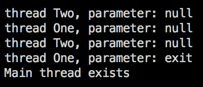
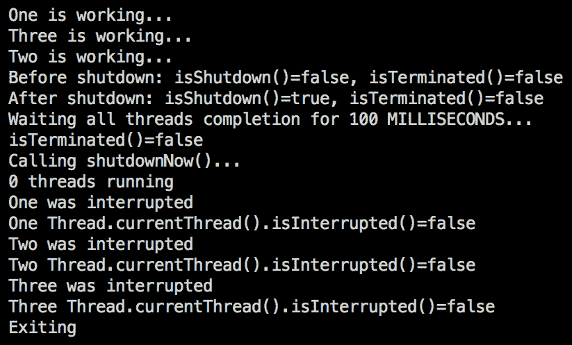
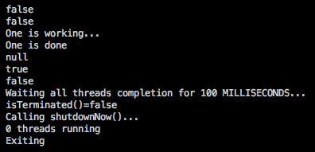
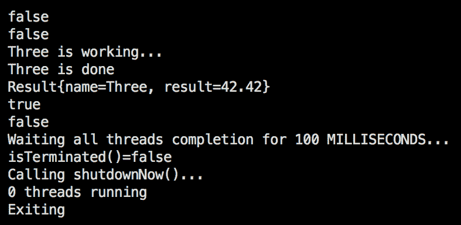
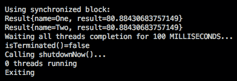

# 多线程和并发处理

在本章中，我们将讨论通过使用并发处理数据的 worker（线程）来提高 Java 应用程序性能的方法。我们将解释 Java 线程的概念并演示它们的用法。我们还将讨论并行处理和并发处理的区别，以及如何避免由于并发修改共享资源而导致的不可预知的结果。

本章将讨论以下主题：

*   线程与进程
*   用户线程与守护进程
*   扩展类线程
*   实现接口`Runnable`
*   扩展线程与实现`Runnable`
*   使用线程池
*   从线程获取结果
*   并行与并行处理
*   同一资源的并发修改

# 线程与进程

Java 有两个执行单元：进程和线程。一个**进程**通常代表整个 JVM，尽管应用程序可以使用`java.lang.ProcessBuilder`创建另一个进程。但是由于多进程的情况不在本书的讨论范围内，所以我们将重点讨论第二个执行单元，即一个**线程**，它与进程类似，但与其他线程的隔离度较低，执行所需资源较少。

一个进程可以有许多线程在运行，并且至少有一个线程称为**主线程**——启动应用程序的线程，我们在每个示例中都使用它。线程可以共享资源，包括内存和打开的文件，这样可以提高效率。但它的代价是，意外的相互干扰，甚至阻碍执行的风险更高。这就需要编程技巧和对并发技术的理解

# 用户线程与守护进程

有一种特殊的线程叫做 daemon。

daemon 一词起源于古希腊语，意思是*神与人之间的神性或超自然存在*和*内在或伴随的精神或激励力量*。

在计算机科学中，术语**daemon**有更普通的用法，用于*作为后台进程运行的计算机程序，而不是由交互用户*直接控制。这就是为什么 Java 中有以下两种类型的线程：

*   用户线程（默认），由应用程序启动（主线程就是这样一个例子）
*   后台工作以支持用户线程活动的守护线程

这就是为什么所有守护进程线程在最后一个用户线程退出之后立即退出，或者在未处理的异常之后被 JVM 终止。

# 扩展类线程

创建线程的一种方法是扩展`java.lang.Thread`类并重写其`run()`方法。例如：

```java
class MyThread extends Thread {
    private String parameter;
    public MyThread(String parameter) {
        this.parameter = parameter;
    }
    public void run() {
        while(!"exit".equals(parameter)){
            System.out.println((isDaemon() ? "daemon" : "  user") +
              " thread " + this.getName() + "(id=" + this.getId() +
                                      ") parameter: " + parameter);
            pauseOneSecond();
        }
        System.out.println((isDaemon() ? "daemon" : "  user") +
          " thread " + this.getName() + "(id=" + this.getId() +
                                  ") parameter: " + parameter);
    }
    public void setParameter(String parameter) {
        this.parameter = parameter;
    }
}
```

如果未重写`run()`方法，则线程不执行任何操作。在我们的示例中，只要参数不等于 string`"exit"`，线程就会每秒打印它的名称和其他属性；否则它就会退出。`pauseOneSecond()`方法如下：

```java
private static void pauseOneSecond(){
    try {
        TimeUnit.SECONDS.sleep(1);
    } catch (InterruptedException e) {
        e.printStackTrace();
    }
}
```

我们现在可以使用`MyThread`类来运行两个线程—一个用户线程和一个守护进程线程：

```java
public static void main(String... args) {
    MyThread thr1 = new MyThread("One");
    thr1.start();
    MyThread thr2 = new MyThread("Two");
    thr2.setDaemon(true);
    thr2.start();
    pauseOneSecond();
    thr1.setParameter("exit");
    pauseOneSecond();
    System.out.println("Main thread exists");
}
```

如您所见，主线程创建另外两个线程，暂停一秒钟，在用户线程上设置参数`exit`，再暂停一秒钟，最后退出（方法`main()`完成执行）。

如果我们运行前面的代码，我们会看到如下屏幕截图（线程`id`在不同的操作系统中可能不同）：


前面的屏幕截图显示，只要最后一个用户线程（本例中的主线程）退出，守护进程线程就会自动退出。

# 实现接口可运行

创建线程的第二种方法是使用实现`java.lang.Runnable`的类。下面是这样一个类的示例，它的功能与`MyThread`类几乎完全相同：

```java
class MyRunnable implements Runnable {
    private String parameter, name;
    public MyRunnable(String name) {
        this.name = name;
    }
    public void run() {
        while(!"exit".equals(parameter)){
            System.out.println("thread " + this.name + 
                               ", parameter: " + parameter);
            pauseOneSecond();
        }
        System.out.println("thread " + this.name +
                              ", parameter: " + parameter);
    }
    public void setParameter(String parameter) {
        this.parameter = parameter;
    }
}
```

不同的是没有`isDaemon()`方法、`getId()`或任何其他现成的方法。`MyRunnable`类可以是实现`Runnable`接口的任何类，因此我们无法打印线程是否为守护进程。这就是为什么我们添加了`name`属性，以便我们可以识别线程。

我们可以使用`MyRunnable`类来创建线程，就像我们使用`MyThread`类一样：

```java
public static void main(String... args) {
    MyRunnable myRunnable1 = new MyRunnable("One");
    MyRunnable myRunnable2 = new MyRunnable("Two");

    Thread thr1 = new Thread(myRunnable1);
    thr1.start();
    Thread thr2 = new Thread(myRunnable2);
    thr2.setDaemon(true);
    thr2.start();
    pauseOneSecond();
    myRunnable1.setParameter("exit");
    pauseOneSecond();
    System.out.println("Main thread exists");
}
```

下面的截图证明了`MyRunnable`类的行为与`MyThread`类的行为相似：



守护进程线程（名为`Two`的线程）在最后一个用户线程存在后退出，它与`MyThread`类的情况完全相同。

# 扩展线程与实现 Runnable

`Runnable`的实现具有允许实现扩展另一个类的优点（在某些情况下是唯一可能的选择）。当您想向现有类添加类似线程的行为时，它特别有用。实现`Runnable`允许更灵活的使用。但除此之外，与`Thread`类的扩展相比，在功能上没有区别。

`Thread`类有几个构造函数，允许设置线程名称及其所属的组。线程的分组有助于在多个线程并行运行的情况下对它们进行管理。`Thread`类还有几个方法，提供有关线程状态、属性的信息，并允许控制其行为。

如您所见，线程的 ID 是自动生成的。它不能更改，但可以在线程终止后重用。另一方面，可以使用相同的名称设置多个线程。

执行优先级也可以用一个介于`Thread.MIN_PRIORITY`和`Thread.MAX_PRIORITY`之间的值编程设置。值越小，允许线程运行的时间就越多，这意味着它具有更高的优先级。如果未设置，则优先级值默认为`Thread.NORM_PRIORITY`。

线程的状态可以具有以下值之一：

*   `NEW`：线程尚未启动时
*   `RUNNABLE`：执行线程时
*   `BLOCKED`：线程被阻塞，等待监视器锁定时
*   `WAITING`：当一个线程无限期地等待另一个线程执行特定操作时
*   `TIMED_WAITING`：当一个线程等待另一个线程执行某个操作时，等待时间长达指定的等待时间
*   `TERMINATED`：线程退出时

线程和任何对象也可以使用`java.lang.Object`基类的`wait()`、`notify()`和`notifyAll()`方法*彼此*交谈。但是线程行为的这一方面超出了本书的范围。

# 使用线程池

每个线程都需要资源-**CPU**和**内存**。这意味着必须控制线程的数量，其中一种方法是创建一个固定数量的线程池。此外，创建对象会产生开销，这对于某些应用程序可能非常重要

在本节中，我们将研究`java.util.concurrent`包中提供的`Executor`接口及其实现。它们封装了线程管理，最大限度地减少了应用程序开发人员在编写与线程生命周期相关的代码上花费的时间。

在`java.util.concurrent`包中定义了三个`Executor`接口：

*   基本`Executor`接口：只有一个`void execute(Runnable r)`方法。

*   `ExecutorService`接口：对`Executor`进行了扩展，增加了四组方法来管理工作线程和执行器本身的生命周期：
    *   `submit()`将`Runnable`或`Callable`对象放入队列中执行的方法（`Callable`允许工作线程返回值）；返回`Future`接口的对象，用于访问`Callable`返回的值，管理工作线程的状态
    *   `invokeAll()`方法，将接口`Callable`对象的集合放入队列中执行；当所有工作线程完成时返回`Future`对象的`List`（还有一个重载的`invokeAll()`方法超时）
    *   `invokeAny()`方法，将接口`Callable`对象的集合放入队列中执行；返回一个已完成的任何工作线程的`Future`对象（还有一个带超时的重载`invokeAny()`方法）
    *   方法管理工作线程的状态和服务本身，如下所示：
        *   `shutdown()`：防止新的工作线程提交到服务。
        *   `shutdownNow()`：中断每个未完成的工作线程。工作线程应该被写入，这样它就可以周期性地检查自己的状态（例如使用`Thread.currentThread().isInterrupted()`），并自动正常关闭；否则，即使在调用`shutdownNow()`之后，它也会继续运行。
        *   `isShutdown()`：检查执行器是否启动关机。
        *   `awaitTermination(long timeout, TimeUnit timeUnit)`：等待关闭请求后所有工作线程执行完毕，或者超时，或者当前线程中断，以先发生的为准。
        *   `isTerminated()`：检查关闭启动后是否所有工作线程都已完成。除非先调用了`shutdown()`或`shutdownNow()`，否则它永远不会返回`true`。

*   `ScheduledExecutorService`接口：它扩展了`ExecutorService`并添加了允许调度工作线程执行（一次性和周期性）的方法。

可以使用`java.util.concurrent.ThreadPoolExecutor`或`java.util.concurrent.ScheduledThreadPoolExecutor`类创建基于池的`ExecutorService`实现。还有一个`java.util.concurrent.Executors`工厂类，它涵盖了大多数实际案例。因此，在为工作线程池创建编写自定义代码之前，我们强烈建议您使用`java.util.concurrent.Executors`类的以下工厂方法：

*   `newCachedThreadPool()`创建一个线程池，根据需要添加一个新线程，除非之前创建了一个空闲线程；已经空闲 60 秒的线程将从池中删除
*   创建一个按顺序执行工作线程的`ExecutorService`（池）实例的`newSingleThreadExecutor()`
*   `newSingleThreadScheduledExecutor()`创建一个单线程执行器，可以安排在给定的延迟后运行，或者定期执行
*   `newFixedThreadPool(int nThreads)`创建一个线程池，该线程池重用固定数量的工作线程；如果在所有工作线程仍在执行时提交一个新任务，则该任务将被放入队列中，直到有一个工作线程可用为止
*   `newScheduledThreadPool(int nThreads)`创建一个固定大小的线程池，可以计划在给定的延迟后运行，或者定期执行
*   `newWorkStealingThreadPool(int nThreads)`创建一个线程池，该线程池使用`ForkJoinPool`使用的*偷功*算法，在工作线程生成其他线程时特别有用，例如在递归算法中；它还适应指定数量的 CPU，您可以将其设置为高于或低于计算机上的实际 CPU 数

工作窃取算法

工作窃取算法允许已完成分配任务的线程帮助其他仍忙于分配任务的任务。例如，请参见 Oracle Java 官方文档（[中对 Fork/Join 实现的描述 https://docs.oracle.com/javase/tutorial/essential/concurrency/forkjoin.html](https://docs.oracle.com/javase/tutorial/essential/concurrency/forkjoin.html)）。

这些方法中的每一个都有一个重载版本，允许在需要时传入一个用来创建新线程的`ThreadFactory`。让我们看看它在代码示例中是如何工作的。首先，我们运行另一个版本的`MyRunnable`类：

```java
class MyRunnable implements Runnable {
    private String name;
    public MyRunnable(String name) {
        this.name = name;
    }
    public void run() {
        try {
            while (true) {
                System.out.println(this.name + " is working...");
                TimeUnit.SECONDS.sleep(1);
            }
        } catch (InterruptedException e) {
            System.out.println(this.name + " was interrupted\n" +
                this.name + " Thread.currentThread().isInterrupted()="
                            + Thread.currentThread().isInterrupted());
        }
    }
}
```

我们不能再使用`parameter`属性来告诉线程停止执行，因为线程生命周期现在将由`ExecutorService`控制，它的方式是调用`interrupt()`线程方法。另外，请注意，我们创建的线程有一个无限循环，因此它永远不会停止执行，除非强制执行（通过调用`interrupt()`方法）。让我们编写执行以下操作的代码：

1.  创建一个包含三个线程的池
2.  确保池不接受更多线程
3.  等待一段固定的时间，让所有线程完成它们所做的事情
4.  停止（中断）未完成任务的线程
5.  出口

以下代码执行前面列表中描述的所有操作：

```java
ExecutorService pool = Executors.newCachedThreadPool();
String[] names = {"One", "Two", "Three"};
for (int i = 0; i < names.length; i++) {
    pool.execute(new MyRunnable(names[i]));
}
System.out.println("Before shutdown: isShutdown()=" + pool.isShutdown() 
                           + ", isTerminated()=" + pool.isTerminated());
pool.shutdown(); // New threads cannot be added to the pool
//pool.execute(new MyRunnable("Four"));    //RejectedExecutionException
System.out.println("After shutdown: isShutdown()=" + pool.isShutdown() 
                           + ", isTerminated()=" + pool.isTerminated());
try {
    long timeout = 100;
    TimeUnit timeUnit = TimeUnit.MILLISECONDS;
    System.out.println("Waiting all threads completion for "
                                + timeout + " " + timeUnit + "...");
    // Blocks until timeout, or all threads complete execution,
    // or the current thread is interrupted, whichever happens first.
    boolean isTerminated = pool.awaitTermination(timeout, timeUnit);
    System.out.println("isTerminated()=" + isTerminated);
    if (!isTerminated) {
        System.out.println("Calling shutdownNow()...");
        List<Runnable> list = pool.shutdownNow();
        System.out.println(list.size() + " threads running");
        isTerminated = pool.awaitTermination(timeout, timeUnit);
        if (!isTerminated) {
            System.out.println("Some threads are still running");
        }
        System.out.println("Exiting");
    }
} catch (InterruptedException ex) {
    ex.printStackTrace();
}
```

尝试在`pool.shutdown()`之后向池中添加另一个线程被称为**会生成**`java.util.concurrent.RejectedExecutionException`。

执行上述代码会产生以下结果：



注意前面屏幕截图中的`Thread.currentThread().isInterrupted()=false`消息。线程被中断。我们知道是因为线程得到了`InterruptedException`。那么为什么`isInterrupted()`方法返回`false`？这是因为线程状态在收到中断消息后立即被清除。我们现在提到它是因为它是一些程序员错误的来源。例如，如果主线程监视`MyRunnable`线程并对其调用`isInterrupted()`，则返回值将为`false`，这可能会在线程中断后产生误导。

因此，在另一个线程可能正在监视`MyRunnable`线程的情况下，`MyRunnable`的实现必须更改为以下内容（注意在`catch`块中如何调用`interrupt()`方法）：

```java
class MyRunnable implements Runnable {
   private String name;
   public MyRunnable(String name) {
      this.name = name;
   }
   public void run() {
      try {
         while (true) {
             System.out.println(this.name + " is working...");
             TimeUnit.SECONDS.sleep(1);
         }
      } catch (InterruptedException e) {
         Thread.currentThread().interrupt();
         System.out.println(this.name + " was interrupted\n" +
           this.name + " Thread.currentThread().isInterrupted()="
                       + Thread.currentThread().isInterrupted());
      }
   }
}
```

现在，如果我们再次使用相同的`ExecutorService`池运行这个线程，结果将是：


如您所见，现在由`isInterrupted()`方法返回的值是`true`，并与发生的事情相对应。公平地说，在许多应用程序中，一旦线程中断，就不会再次检查其状态。但是设置正确的状态是一种很好的做法，特别是在您不是创建线程的更高级别代码的作者的情况下。

在我们的示例中，我们使用了一个缓存线程池，它根据需要创建一个新线程，或者，如果可用的话，重用已经使用过的线程，但是该线程完成了它的任务并返回到池中进行新的分配。我们不担心创建太多线程，因为我们的演示应用程序最多有三个工作线程，而且它们的生命周期非常短。

但是，如果应用程序可能需要的工作线程没有固定的限制，或者没有很好的方法来预测线程可能需要多少内存或可以执行多长时间，那么设置工作线程计数的上限可以防止应用程序性能的意外降级、内存不足或资源耗尽工作线程使用的任何其他资源。如果线程行为极不可预测，那么单线程池可能是唯一的解决方案，可以选择使用自定义线程池执行器。但在大多数情况下，固定大小的线程池执行器是应用程序需求和代码复杂性之间的一个很好的实际折衷方案（在本节前面，我们列出了由`Executors`工厂类创建的所有可能的池类型）

将池的大小设置得过低可能会剥夺应用程序有效利用可用资源的机会。因此，在选择池大小之前，建议花一些时间监视应用程序，以确定应用程序行为的特性。事实上，为了适应和利用代码或执行环境中发生的更改，必须在应用程序的整个生命周期中重复 cycle deploy monitor adjust。

考虑的第一个特征是系统中 CPU 的数量，因此线程池的大小至少可以与 CPU 的计数一样大。然后，您可以监视应用程序，查看每个线程占用 CPU 的时间以及占用其他资源（如 I/O 操作）的时间。如果不使用 CPU 所花费的时间与线程的总执行时间相当，则可以按以下比率增加池大小：不使用 CPU 的时间除以总执行时间。但这是在另一个资源（磁盘或数据库）不是线程间争用的主题的情况下。如果是后者，那么您可以使用该资源而不是 CPU 作为描述因子。

假设应用程序的工作线程不太大或执行时间不太长，并且属于典型工作线程的主流群体，这些线程在合理的短时间内完成其任务，通过将所需响应时间与线程使用 CPU 或其他最具争议的资源的时间之比（四舍五入）相加，可以增加池大小。这意味着，在期望的响应时间相同的情况下，线程使用 CPU 或另一个并发访问的资源的次数越少，池的大小就应该越大。如果有争议的资源有自己的能力来改进并发访问（如数据库中的连接池），请首先考虑使用该特性。

如果所需的同时运行的线程数在不同的情况下在运行时发生变化，则可以使池大小成为动态的，并使用新的大小创建一个新池（在所有线程完成后关闭旧池）。添加或删除可用资源后，可能还需要重新计算新池的大小。例如，您可以使用`Runtime.getRuntime().availableProcessors()`根据可用 CPU 的当前计数以编程方式调整池大小。

如果 JDK 附带的现成线程池执行器实现都不能满足特定应用程序的需要，那么在从头开始编写线程管理代码之前，请先尝试使用`java.util.concurrent.ThreadPoolExecutor`类。它有几个重载构造函数。

为了让您了解它的功能，以下是具有最多选项的构造函数：

```java
ThreadPoolExecutor (int corePoolSize, 
                    int maximumPoolSize, 
                    long keepAliveTime, 
                    TimeUnit unit, 
                    BlockingQueue<Runnable> workQueue, 
                    ThreadFactory threadFactory, 
                    RejectedExecutionHandler handler)
```

上述构造函数的参数如下：

*   `corePoolSize`是池中要保留的线程数，即使它们是空闲的，除非用`true`值调用`allowCoreThreadTimeOut(boolean value)`方法
*   `maximumPoolSize`是池中允许的最大线程数
*   `keepAliveTime`：当线程数大于核心时，这是多余空闲线程等待新任务结束前的最长时间
*   `unit`是`keepAliveTime`参数的时间单位
*   `workQueue`是用于在任务执行之前保存任务的队列；此队列将只保存由`execute()`方法提交的`Runnable`对象
*   `threadFactory`是执行器创建新线程时使用的工厂
*   `handler`是由于达到线程边界和队列容量而阻止执行时要使用的处理程序

在创建了`ThreadPoolExecutor`类的对象之后，除了`workQueue`之外，前面的每个构造函数参数也可以通过相应的 setter 进行设置，从而允许对现有池特性进行更大的灵活性和动态调整。

# 从线程获取结果

在我们的示例中，到目前为止，我们使用了`ExecutorService`接口的`execute()`方法来启动线程。实际上，这个方法来自于`Executor`基本接口。同时，`ExecutorService`接口还有其他方法（在前面的*使用线程池*一节中列出）可以启动线程并返回线程执行结果。

带回线程执行结果的对象是类型`Future`——一个具有以下方法的接口：

*   `V get()`：阻塞直到线程结束；返回结果（*如果可用*）
*   `V get(long timeout, TimeUnit unit)`：阻塞直到线程完成或提供的超时结束；返回结果（如果可用）
*   `boolean isDone()`：线程结束返回`true`
*   `boolean cancel(boolean mayInterruptIfRunning)`：尝试取消线程的执行；如果成功则返回`true`；如果调用方法时线程已经正常完成，则返回`false`
*   `boolean isCancelled()`：如果线程执行在正常完成之前被取消，则返回`true`

`get()`方法说明中的备注*如果可用*意味着，即使调用无参数的`get()`方法，结果原则上也不总是可用的。这完全取决于生成`Future`对象的方法。以下是返回`Future`对象的`ExecutorService`的所有方法的列表：

*   `Future<?> submit(Runnable task)`：提交线程（任务）执行，返回一个代表任务的`Future`；返回的`Future`对象的`get()`方法返回`null`；例如，我们使用只工作 100 毫秒的`MyRunnable`类：

```java
class MyRunnable implements Runnable {
   private String name;
   public MyRunnable(String name) {
     this.name = name;
   }
   public void run() {
     try {
         System.out.println(this.name + " is working...");
         TimeUnit.MILLISECONDS.sleep(100);
         System.out.println(this.name + " is done");
     } catch (InterruptedException e) {
         Thread.currentThread().interrupt();
         System.out.println(this.name + " was interrupted\n" +
           this.name + " Thread.currentThread().isInterrupted()="
                       + Thread.currentThread().isInterrupted());
     }
   }
}
```

并且，根据上一节的代码示例，让我们创建一个关闭池并在必要时终止所有线程的方法：

```java
void shutdownAndTerminate(ExecutorService pool){
   try {
      long timeout = 100;
      TimeUnit timeUnit = TimeUnit.MILLISECONDS;
      System.out.println("Waiting all threads completion for "
                             + timeout + " " + timeUnit + "...");
      //Blocks until timeout or all threads complete execution, 
      //  or the current thread is interrupted, 
      //  whichever happens first.
      boolean isTerminated = 
                        pool.awaitTermination(timeout, timeUnit);
      System.out.println("isTerminated()=" + isTerminated);
      if (!isTerminated) {
          System.out.println("Calling shutdownNow()...");
          List<Runnable> list = pool.shutdownNow();
          System.out.println(list.size() + " threads running");
          isTerminated = pool.awaitTermination(timeout, timeUnit);
          if (!isTerminated) {
             System.out.println("Some threads are still running");
          }
          System.out.println("Exiting");
      }
   } catch (InterruptedException ex) {
      ex.printStackTrace();
   }
}
```

我们将在`finally`块中使用前面的`shutdownAndTerminate()`方法，以确保没有留下任何正在运行的线程。下面是我们要执行的代码：

```java
ExecutorService pool = Executors.newSingleThreadExecutor();

Future future = pool.submit(new MyRunnable("One"));
System.out.println(future.isDone());         //prints: false
System.out.println(future.isCancelled());    //prints: false
try{
    System.out.println(future.get());        //prints: null
    System.out.println(future.isDone());     //prints: true
    System.out.println(future.isCancelled());//prints: false
} catch (Exception ex){
    ex.printStackTrace();
} finally {
    shutdownAndTerminate(pool);
}
```

您可以在这个屏幕截图上看到这个代码的输出：



正如所料，`Future`对象的`get()`方法返回`null`，因为`Runnable`的`run()`方法不返回任何内容。从返回的`Future`中我们只能得到任务是否完成的信息。

*   `Future<T> submit(Runnable task, T result)`：提交线程（任务）执行，返回一个`Future`代表任务，其中包含提供的`result`，例如，我们将使用下面的类作为结果：

```java
class Result {
    private String name;
    private double result;
    public Result(String name, double result) {
        this.name = name;
        this.result = result;
    }
    @Override
    public String toString() {
        return "Result{name=" + name +
                ", result=" + result + "}";
    }
}
```

下面的代码演示了`submit()`方法返回的`Future`如何返回默认结果：

```java
ExecutorService pool = Executors.newSingleThreadExecutor();
Future<Result> future = pool.submit(new MyRunnable("Two"), 
                                        new Result("Two", 42.));
System.out.println(future.isDone());          //prints: false
System.out.println(future.isCancelled());     //prints: false
try{
    System.out.println(future.get());         //prints: null
    System.out.println(future.isDone());      //prints: true
    System.out.println(future.isCancelled()); //prints: false
} catch (Exception ex){
    ex.printStackTrace();
} finally {
    shutdownAndTerminate(pool);
}
```

如果执行前面的代码，输出如下：


正如所料，`Future`的`get()`方法返回作为参数传入的对象。

*   `Future<T> submit(Callable<T> task)`：提交线程（任务）执行，返回一个`Future`，表示任务，返回结果由`Callable`接口的`V call()`方法生成并返回，即`Callable`方法接口唯一的一个方法。例如：

```java
class MyCallable implements Callable {
   private String name;
   public MyCallable(String name) {
        this.name = name;
   }
   public Result call() {
      try {
         System.out.println(this.name + " is working...");
         TimeUnit.MILLISECONDS.sleep(100);
         System.out.println(this.name + " is done");
         return new Result(name, 42.42);
      } catch (InterruptedException e) {
         Thread.currentThread().interrupt();
         System.out.println(this.name + " was interrupted\n" +
           this.name + " Thread.currentThread().isInterrupted()="
                       + Thread.currentThread().isInterrupted());
      }
      return null;
   }
```

上述代码的结果如下：



如您所见，`Future`的`get()`方法返回由`MyCallable`类的`call()`方法生成的值

*   `List<Future<T>> invokeAll(Collection<Callable<T>> tasks)`：执行所提供集合的所有`Callable`任务；返回`Futures`列表，其中包含已执行`Callable`对象生成的结果
*   `List<Future<T>> invokeAll(Collection<Callable<T>>`：执行所提供集合的所有`Callable`任务；返回`Futures`列表，其中包含已执行的`Callable`对象产生的结果或超时过期，以先发生的为准
*   `T invokeAny(Collection<Callable<T>> tasks)`：执行所提供集合的所有`Callable`任务，如果有，返回一个已成功完成的任务的结果（即不抛出异常）
*   `T invokeAny(Collection<Callable<T>> tasks, long timeout, TimeUnit unit)`：执行所提供集合的所有`Callable`任务；如果在所提供的超时过期之前有一个任务成功完成，则返回该任务的结果（即不抛出异常）

如您所见，有许多方法可以从线程中获得结果。选择的方法取决于应用程序的特定需要。

# 并行与并行处理

当我们听到工作线程同时执行时，我们会自动地假设它们实际上做了编程所要并行执行的事情。只有在我们深入研究了这样一个系统之后，我们才意识到，只有当线程分别由不同的 CPU 执行时，这种并行处理才是可能的。否则，它们的时间共享相同的处理能力。我们认为他们在同一时间工作，只是因为他们使用的时间间隔非常短，只是我们在日常生活中使用的时间单位的一小部分。当线程共享同一个资源时，在计算机科学中，我们说它们同时进行。

# 同一资源的并发修改

两个或多个线程在其他线程读取同一值的同时修改该值，这是对并发访问问题之一的最一般描述。更微妙的问题包括**线程干扰**和**内存一致性**错误，这两种错误都会在看似良性的代码片段中产生意想不到的结果。在本节中，我们将演示此类情况以及避免此类情况的方法。

乍一看，解决方案似乎非常简单：一次只允许一个线程修改/访问资源，就这样。但是如果访问需要很长时间，就会产生一个瓶颈，可能会消除多线程并行工作的优势。或者，如果一个线程在等待访问另一个资源时阻塞了对一个资源的访问，而第二个线程在等待访问第一个资源时阻塞了对第二个资源的访问，则会产生一个称为**死锁**的问题。这是程序员在使用多线程时可能遇到的挑战的两个非常简单的例子。

首先，我们将重现由同一值的并发修改引起的问题。我们创建一个`Calculator`接口：

```java
interface Calculator {
    String getDescription();
    double calculate(int i);
}
```

我们将使用`getDescription()`方法来捕获实现的描述。以下是第一个实现：

```java
class CalculatorNoSync implements Calculator{
    private double prop;
    private String description = "Without synchronization";
    public String getDescription(){ return description; }
    public double calculate(int i){
        try {
            this.prop = 2.0 * i;
            TimeUnit.MILLISECONDS.sleep(i);
            return Math.sqrt(this.prop);
        } catch (InterruptedException e) {
            Thread.currentThread().interrupt();
            System.out.println("Calculator was interrupted");
        }
        return 0.0;
    }
}
```

如您所见，`calculate()`方法将一个新值赋给`prop`属性，然后执行其他操作（我们通过调用`sleep()`方法来模拟它），然后计算分配给`prop`属性的值的平方根。`"Without synchronization"`描述描述了在没有任何协调或**同步**的情况下，每次调用`calculate()`方法时`prop`属性的值都在变化，当线程同时修改同一资源时，在线程之间进行协调时调用。

我们现在将在两个线程之间共享这个对象，这意味着`prop`属性将被同时更新和使用。因此，围绕`prop`属性进行某种线程同步是必要的，但我们已经决定，我们的第一个实现不会这样做。

下面是我们在执行我们要创建的每个`Calculator`实现时要使用的方法：

```java
void invokeAllCallables(Calculator c){
    System.out.println("\n" + c.getDescription() + ":");
    ExecutorService pool = Executors.newFixedThreadPool(2);
    List<Callable<Result>> tasks = List.of(new MyCallable("One", c), 
                                           new MyCallable("Two", c));
    try{
        List<Future<Result>> futures = pool.invokeAll(tasks);
        List<Result> results = new ArrayList<>();
        while (results.size() < futures.size()){
            TimeUnit.MILLISECONDS.sleep(5);
            for(Future future: futures){
                if(future.isDone()){
                    results.add((Result)future.get());
                }
            }
        }
        for(Result result: results){
            System.out.println(result);
        }
    } catch (Exception ex){
        ex.printStackTrace();
    } finally {
        shutdownAndTerminate(pool);
    }
}
```

如您所见，前面的方法执行以下操作：

*   打印传入的`Calculator`实现的描述
*   为两个线程创建固定大小的池
*   创建两个`Callable`任务的列表，这些任务是以下`MyCallable`类的对象：

```java
class MyCallable implements Callable<Result> {
    private String name;
    private Calculator calculator;
    public MyCallable(String name, Calculator calculator) {
        this.name = name;
        this.calculator = calculator;
    }
    public Result call() {
        double sum = 0.0;
        for(int i = 1; i < 20; i++){
            sum += calculator.calculate(i);
        }
        return new Result(name, sum);
    }
}
```

*   任务列表传入池的`invokeAll()`方法，每个任务通过调用`call()`方法来执行；每个`call()`方法将传入的`Calculator`对象的`calculate()`方法应用到从 1 到 20 的 19 个数字中的每一个，并对结果进行汇总；结果和与`MyCallable`对象的名称一起返回到`Result`对象中

*   每个`Result`对象最终返回到`Future`对象中
*   然后`invokeAllCallables()`方法对`Future`对象列表进行迭代，检查每个对象是否完成任务；当任务完成时，结果被添加到`List<Result> results`中
*   所有任务完成后，`invokeAllCallables()`方法将打印`List<Result> results`的所有元素并终止池

以下是我们运行`invokeAllCallables(new CalculatorNoSync())`得到的结果：


每次运行前面的代码时，实际的数字都略有不同，但是任务`One`的结果永远不会等于任务`Two`的结果，这是因为在设置`prop`字段的值和在`calculate()`方法中返回其平方根之间的时间段内，另一个线程设法分配了不同的值至`prop`。这是螺纹干涉的情况。

有几种方法可以解决这个问题。我们从一个原子变量开始，以此实现对属性的线程安全并发访问。然后我们还将演示两种线程同步方法。

# 原子变量

**原子变量**是一个仅当其当前值与期望值匹配时才能更新的变量。在我们的例子中，这意味着如果`prop`值已被另一个线程更改，则不应使用它。

`java.util.concurrent.atomic`包有十几个类支持这种逻辑：`AtomicBoolean`、`AtomicInteger`、`AtomicReference`和`AtomicIntegerArray`，举几个例子。这些类中的每一个都有许多方法可用于不同的同步需求。[查看这些类的在线 API 文档](https://docs.oracle.com/en/java/javase/12/docs/api/java.base/java/util/concurrent/atomic/package-summary.html)。在演示中，我们将仅使用其中的两种方法：

*   `V get()`：返回当前值
*   `boolean compareAndSet(V expectedValue, V newValue)`：如果当前值等于运算符（`==`），则将值设置为`newValue`；如果成功，则返回`true`，如果实际值不等于期望值，则返回`false`

下面是如何使用`AtomicReference`类来解决线程的干扰问题，同时使用这两种方法访问`Calculator`对象的`prop`属性：

```java
class CalculatorAtomicRef implements Calculator {
    private AtomicReference<Double> prop = new AtomicReference<>(0.0);
    private String description = "Using AtomicReference";
    public String getDescription(){ return description; }
    public double calculate(int i){
        try {
            Double currentValue = prop.get();
            TimeUnit.MILLISECONDS.sleep(i);
            boolean b = this.prop.compareAndSet(currentValue, 2.0 * i);
            //System.out.println(b);    //prints: true for one thread 
                                        //and false for another thread
            return Math.sqrt(this.prop.get());
        } catch (InterruptedException e) {
            Thread.currentThread().interrupt();
            System.out.println("Calculator was interrupted");
        }
        return 0.0;
    }
}
```

如您所见，前面的代码确保在线程睡眠时，`prop`属性的`currentValue`不会更改。下面是我们运行`invokeAllCallables(new CalculatorAtomicRef())`时产生的消息截图：


现在线程产生的结果是相同的。

`java.util.concurrent`包的以下类也提供同步支持：

*   `Semaphore`：限制可以访问资源的线程数
*   `CountDownLatch`：允许一个或多个线程等待，直到在其他线程中执行的一组操作完成
*   `CyclicBarrier`：允许一组线程等待彼此到达公共屏障点
*   `Phaser`：提供了一种更灵活的屏障形式，可用于控制多线程之间的阶段计算
*   `Exchanger`：允许两个线程在一个集合点交换对象，在多个管道设计中非常有用

# 同步方法

另一种解决问题的方法是使用同步方法。这里是`Calculator`接口的另一个实现，它使用这种解决线程干扰的方法：

```java
class CalculatorSyncMethod implements Calculator {
    private double prop;
    private String description = "Using synchronized method";
    public String getDescription(){ return description; }
    synchronized public double calculate(int i){
        try {
            this.prop = 2.0 * i;
            TimeUnit.MILLISECONDS.sleep(i);
            return Math.sqrt(this.prop);
        } catch (InterruptedException e) {
            Thread.currentThread().interrupt();
            System.out.println("Calculator was interrupted");
        }
        return 0.0;
    }
}
```

我们刚刚在`calculate()`方法前面添加了`synchronized`关键字。现在，如果我们运行`invokeAllCallables(new CalculatorSyncMethod())`，两个线程的结果总是一样的：


这是因为在当前线程（已经进入同步方法的线程）退出同步方法之前，另一个线程无法进入同步方法。这可能是最简单的解决方案，但如果该方法需要很长时间才能执行，则此方法可能会导致性能下降。在这种情况下，可以使用同步块，它在一个原子操作中只包装几行代码。

# 同步块

以下是用于解决线程干扰问题的同步块的示例：

```java
class CalculatorSyncBlock implements Calculator {
    private double prop;
    private String description = "Using synchronized block";
    public String getDescription(){
        return description;
    }
    public double calculate(int i){
        try {
            //there may be some other code here
            synchronized (this) {
                this.prop = 2.0 * i;
                TimeUnit.MILLISECONDS.sleep(i);
                return Math.sqrt(this.prop);
            }
        } catch (InterruptedException e) {
            Thread.currentThread().interrupt();
            System.out.println("Calculator was interrupted");
        }
        return 0.0;
    }
}
```

如您所见，synchronized 块在`this`对象上获取一个锁，该锁由两个线程共享，并且只有在线程退出块之后才释放它。在我们的演示代码中，该块覆盖了该方法的所有代码，因此在性能上没有差异。但是想象一下这个方法中有更多的代码（我们将位置注释为`there may be some other code here`。如果是这样的话，代码的同步部分就更小，因此成为瓶颈的机会就更少。

如果我们运行`invokeAllCallables(new CalculatorSyncBlock())`，结果如下：



如您所见，结果与前两个示例完全相同，在`java.util.concurrent.locks`包中组装了针对不同需求和不同行为的不同类型的锁

Java 中的每个对象都从基对象继承了`wait()`、`notify()`和`notifyAll()`方法。这些方法还可以用来控制线程的行为及其对锁的访问。

# 并行集合

解决并发性的另一种方法是使用来自`java.util.concurrent`包的线程安全集合，阅读 [Javadoc](https://docs.oracle.com/en/java/javase/12/docs/api/index.html) 查看您的申请是否接受托收限制。以下是这些托收清单和一些建议：

*   `ConcurrentHashMap<K,V>`：支持检索的完全并发和更新的高期望并发，当并发要求很高，需要允许对写操作进行锁定但不需要锁定元素时使用。
*   `ConcurrentLinkedQueue<E>`：基于链接节点的线程安全队列，采用高效的非阻塞算法。
*   `ConcurrentLinkedDeque<E>`：基于链接节点的并发队列，当多个线程共享对一个公共集合的访问时，`ConcurrentLinkedQueque`和`ConcurrentLinkedDeque`都是合适的选择。
*   `ConcurrentSkipListMap<K,V>`：并发`ConcurrentNavigableMap`接口实现。
*   `ConcurrentSkipListSet<E>`：基于`ConcurrentSkipListMap`的并发`NavigableSet`实现。`ConcurrentSkipListSet`和`ConcurrentSkipListMap`类，根据*Javadoc*，*提供包含、添加和删除操作及其变体的预期平均日志（n）时间成本。升序视图及其迭代器的速度比降序视图快*；当您需要按特定顺序快速遍历元素时，请使用它们。
*   `CopyOnWriteArrayList<E>`：一种线程安全的`ArrayList`变体，所有的变异操作（add、set 等）都是通过对底层数组进行一个新的拷贝来实现的；根据*Javadoc*，`CopyOnWriteArrayList`类*通常成本太高，但当遍历操作的数量远远超过突变时，它可能比其他方法更有效，当您不能或不想同步遍历，但需要排除并发线程之间的干扰时，它会很有用*；当您不需要在不同位置添加新元素且不需要排序时，使用它；否则，使用`ConcurrentSkipListSet`。
*   `CopyOnWriteArraySet<E>`：所有操作都使用内部`CopyOnWriteArrayList`的集合。

*   `PriorityBlockingQueue`：当一个自然的顺序是可以接受的，并且您需要快速向尾部添加元素和快速从队列头部移除元素时，这是一个更好的选择；**阻塞**是指队列在检索元素时等待变为非空，在存储元素时等待队列中的空间变为可用。
*   `ArrayBlockingQueue`、`LinkedBlockingQueue`和`LinkedBlockingDeque`具有固定大小（有界）；其他队列是无界的。

使用这些和指南中类似的特性和建议，但是在实现功能之前和之后执行全面的测试和性能度量。为了演示其中的一些收集功能，让我们使用`CopyOnWriteArrayList<E>`。首先，让我们看看当我们试图同时修改它时，`ArrayList`是如何工作的：

```java
List<String> list = Arrays.asList("One", "Two");
System.out.println(list);
try {
    for (String e : list) {
        System.out.println(e);  //prints: One
        list.add("Three");      //UnsupportedOperationException
    }
} catch (Exception ex) {
    ex.printStackTrace();
}
System.out.println(list);       //prints: [One, Two]

```

正如预期的那样，在对列表进行迭代时尝试修改列表会生成一个异常，并且该列表保持不变。

现在，让我们在同样的情况下使用`CopyOnWriteArrayList<E>`：

```java
List<String> list = 
             new CopyOnWriteArrayList<>(Arrays.asList("One", "Two"));
System.out.println(list);
try {
    for (String e : list) {
        System.out.print(e + " "); //prints: One Two
        list.add("Three");         //adds element Three
    }
} catch (Exception ex) {
    ex.printStackTrace();
}
System.out.println("\n" + list);   //prints: [One, Two, Three, Three]

```

此代码生成的输出如下所示：


如您所见，该列表已被修改，没有异常，但不是当前迭代的副本。如果需要，您可以使用这种行为。

# 寻址内存一致性错误

在多线程环境中，内存一致性错误可能有多种形式和原因。它们在`java.util.concurrent`包的*Javadoc*中有很好的讨论。在这里，我们将只提到最常见的情况，这是由于缺乏能见度造成的。

当一个线程更改属性值时，另一个线程可能不会立即看到更改，并且不能对原始类型使用 synchronized 关键字。在这种情况下，可以考虑对属性使用`volatile`关键字；它保证了不同线程之间的读/写可见性。

并发问题不容易解决。这就是为什么现在越来越多的开发人员采取更激进的方法也就不足为奇了。他们更喜欢在一组无状态操作中处理数据，而不是管理对象状态。我们将在[第 13 章](13.html)、*函数式编程*和[第 14 章](14.html)、*Java 标准流*中看到这些代码的示例。Java 和许多现代语言以及计算机系统似乎正朝着这个方向发展。

# 摘要

在这一章中，我们讨论了多线程处理，以及如何组织它，以及如何避免由于并发修改共享资源而导致的不可预知的结果。我们向读者展示了如何创建线程并使用线程池执行它们。我们还演示了如何从成功完成的线程中提取结果，并讨论了并行处理和并发处理之间的区别

在下一章中，我们将让读者更深入地了解 JVM 及其结构和进程，并详细讨论防止内存溢出的垃圾收集过程。在本章的最后，读者将了解什么构成了 Java 应用程序执行、JVM 中的 Java 进程、垃圾收集以及 JVM 通常是如何工作的。

# 测验

1.  选择所有正确的语句：
    1.  JVM 进程可以有主线程
    2.  主线程是主进程
    3.  一个进程可以启动另一个进程
    4.  一个线程可以启动另一个线程

2.  选择所有正确的语句：
    1.  守护进程是一个用户线程
    2.  守护进程线程在第一个用户线程完成后退出
    3.  守护进程线程在最后一个用户线程完成后退出
    4.  主线程是一个用户线程

3.  选择所有正确的语句：
    1.  所有线程都有`java.lang.Thread`作为基类
    2.  所有螺纹延伸`java.lang.Thread`
    3.  所有线程实现`java.lang.Thread`
    4.  守护进程线程不扩展`java.lang.Thread`

4.  选择所有正确的语句：
    1.  任何类都可以实现`Runnable`接口
    2.  `Runnable`接口实现是一个线程
    3.  `Runnable`接口实现由线程使用
    4.  `Runnable`接口只有一个方法

5.  选择所有正确的语句：
    1.  线程名称必须是唯一的
    2.  线程 ID 自动生成
    3.  可以设置线程名称
    4.  可以设置线程优先级

6.  选择所有正确的语句：
    1.  线程池执行线程
    2.  线程池重用线程
    3.  某些线程池可以有固定的线程数
    4.  某些线程池可以有无限个线程

7.  选择所有正确的语句：
    1.  `Future`对象是从线程获取结果的唯一方法
    2.  `Callable`对象是从线程获取结果的唯一方法
    3.  `Callable`对象允许从线程获取结果
    4.  `Future`对象表示线程

8.  选择所有正确的语句：
    1.  并行处理可以并行进行
    2.  只有在计算机上有几个 CPU 或内核的情况下，才能进行并行处理
    3.  并行处理是并行处理
    4.  没有多个 CPU，就不可能进行并发处理

9.  选择所有正确的语句：
    1.  并发修改总是导致错误的结果
    2.  原子变量保护属性不受并发修改
    3.  原子变量保护属性不受线程干扰
    4.  原子变量是保护属性不受并发修改的唯一方法

10.  选择所有正确的语句：
    1.  同步方法是避免线程干扰的最佳方法
    2.  `synchronized`关键字可以应用于任何方法
    3.  同步方法可能会造成处理瓶颈
    4.  同步方法易于实现

11.  选择所有正确的语句：
    1.  同步块只有在小于方法时才有意义
    2.  同步块需要共享锁
    3.  每个 Java 对象都可以提供一个锁
    4.  同步块是避免线程干扰的最佳方法

12.  选择所有正确的语句：
    1.  首选使用并发集合，而不是使用非并发集合
    2.  使用并发集合会产生一些开销
    3.  不是每个并发集合都适合每个并发处理场景
    4.  可以通过调用`Collections.makeConcurrent()`方法来创建并发集合

13.  选择所有正确的语句：
    1.  避免内存一致性错误的唯一方法是声明`volatile`变量
    2.  使用`volatile`关键字可以确保值在所有线程中的变化的可见性
    3.  避免并发的方法之一是避免任何状态管理
    4.  无状态实用程序方法不能有并发问题