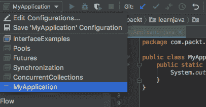
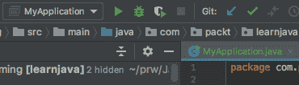
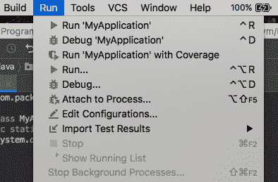
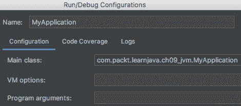
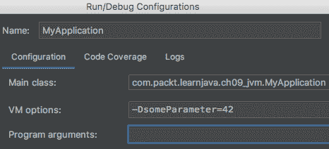
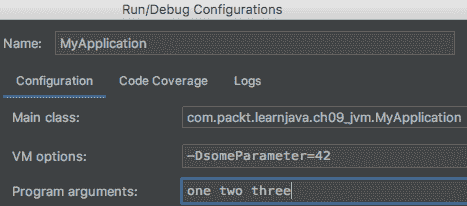
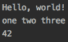

# JVM 结构与垃圾回收

本章向读者概述了**Java 虚拟机**（**JVM**）的结构和行为，它们比您预期的要复杂。

JVM 只是根据编码逻辑执行指令的执行器。它还发现并将应用程序请求的`.class`文件加载到内存中，验证它们，解释字节码（也就是说，它将它们转换为特定于平台的二进制代码），并将生成的二进制代码传递给中央处理器（或多个处理器）执行。除了应用程序线程外，它还使用多个服务线程。其中一个服务线程，称为**垃圾收集**（**GC**），执行从未使用对象释放内存的重要任务

阅读本章之后，读者将更好地理解什么是 Java 应用程序执行、JVM 中的 Java 进程、GC 以及 JVM 通常是如何工作的。

本章将讨论以下主题：

*   Java 应用程序执行
*   Java 进程
*   JVM 结构
*   垃圾收集

# Java 应用程序执行

在深入了解 JVM 的工作原理之前，让我们回顾一下如何运行应用程序，记住以下语句是同义词：

*   运行/执行/启动主类
*   运行/执行/启动主方法
*   运行/执行/启动/启动应用程序
*   运行/执行/启动/启动 JVM 或 Java 进程

也有几种方法。在[第一章](01.html)*Java 入门 12*中，我们向您展示了如何使用 IntelliJ IDEA 运行`main(String[])`方法。在本章中，我们将重复已经说过的一些内容，并添加可能对您有所帮助的其他变体。

# 使用 IDE

任何 IDE 都允许运行`main()`方法。在 IntelliJ IDEA 中，可以通过三种方式完成：

*   单击`main()`方法名称旁边的绿色三角形：


*   使用绿色三角形至少执行一次`main()`方法后，类的名称将添加到下拉菜单（在绿色三角形左侧的顶行上）：



选择它并单击菜单右侧的绿色三角形：



*   打开 Run 菜单并选择类的名称。有几种不同的选项可供选择：



在前面的屏幕截图中，您还可以看到编辑配置的选项。。。。它可用于设置在开始时传递给`main()`方法的程序参数和一些其他选项：



VM options 字段允许设置`java`命令选项。例如输入`-Xlog:gc`，IDE 会形成如下`java`命令：

```java
java -Xlog:gc -cp . com.packt.learnjava.ch09_jvm.MyApplication
```

`-Xlog:gc`选项要求显示 GC 日志。我们将在下一节中使用此选项来演示 GC 是如何工作的。`-cp .`选项（**cp**代表**类路径**）表示该类位于文件树上从当前目录（输入命令的目录）开始的文件夹中。在本例中，`.class`文件位于`com/packt/learnjava/ch09_jvm`文件夹中，其中`com`是当前目录的子文件夹。类路径可以包括许多位置，JVM 必须在这些位置查找应用程序执行所需的`.class`文件。

对于此演示，让我们按如下方式设置 VM 选项：



程序参数字段允许在`java`命令中设置参数。例如，我们在这个字段中设置`one two three`：



此设置将导致以下`java`命令：

```java
java -DsomeParameter=42 -cp . \
       com.packt.learnjava.ch09_jvm.MyApplication one two three
```

我们可以在`main()`方法中读取这些参数：

```java
public static void main(String... args){
    System.out.println("Hello, world!"); //prints: Hello, world!
    for(String arg: args){
        System.out.print(arg + " ");     //prints: one two three
    }
    String p = System.getProperty("someParameter");
    System.out.println("\n" + p);        //prints: 42
}
```

编辑配置屏幕上的另一个可能设置是在环境变量字段中：


这是使用`System.getenv()`设置可从应用程序访问的环境变量的方法。例如，设置环境变量`x`和`y`如下：


如果按照前面的屏幕截图所示进行，则不仅可以在`main()`方法中读取`x`和`y`的值，而且可以在使用`System.getenv("varName")`方法的应用程序中的任何地方读取。在我们的例子中，`x`和`y`的值可以如下检索：

```java
String p = System.getenv("x");
System.out.println(p);                  //prints: 42
p = System.getenv("y");
System.out.println(p);                  //prints: 43

```

`java`命令的其他参数也可以在编辑配置屏幕上设置。我们鼓励您在该屏幕上花费一些时间并查看可能的选项。

# 对类使用命令行

现在让我们从命令行运行`MyApplication`。为了提醒您，主类如下所示：

```java
package com.packt.learnjava.ch09_jvm;
public class MyApplication {
    public static void main(String... args){
        System.out.println("Hello, world!"); //prints: Hello, world!
        for(String arg: args){
            System.out.print(arg + " ");     //prints all arguments
        }
        String p = System.getProperty("someParameter");
        System.out.println("\n" + p);    //prints someParameter set
                                         // as VM option -D
    }
}
```

首先，必须使用`javac`命令来编译它。命令行如下所示（前提是您打开了项目根目录中`pom.xml`所在文件夹中的 terminal 窗口）：

```java
javac src/main/java/com/packt/learnjava/ch09_jvm/MyApplication.java
```

这适用于 Linux 类型的平台。在 Windows 上，命令类似：

```java
javac src\main\java\com\packt\learnjava\ch09_jvm\MyApplication.java
```

编译后的`MyApplication.class`文件与`MyApplication.java`放在同一文件夹中。现在我们可以用`java`命令执行编译后的类：

```java
java -DsomeParameter=42 -cp src/main/java \
           com.packt.learnjava.ch09_jvm.MyApplication one two three
```

注意，`-cp`指向文件夹`src/main/java`（路径是相对于当前文件夹的），主类的包从这里开始。结果是：



如果应用程序使用位于不同文件夹中的其他`.class`文件，则这些文件夹的所有路径（相对于当前文件夹）都可以列在`-cp`选项后面，用冒号（`:`分隔）。例如：

```java
java -cp src/main/java:someOtherFolder/folder \
                        com.packt.learnjava.ch09_jvm.MyApplication
```

注意，`-cp`选项列出的文件夹可以包含任意数量的`.class`文件。这样，JVM 就可以找到它需要的东西。例如，我们在`com.packt.learnjava.ch09_jvm`包中创建一个子包`example`，其中包含`ExampleClass`类：

```java
package com.packt.learnjava.ch09_jvm.example;
public class ExampleClass {
    public static int multiplyByTwo(int i){
        return 2 * i;
    }
}
```

现在让我们在`MyApplication`类中使用它：

```java
package com.packt.learnjava.ch09_jvm;
import com.packt.learnjava.ch09_jvm.example.ExampleClass;
public class MyApplication {
    public static void main(String... args){
        System.out.println("Hello, world!"); //prints: Hello, world!
        for(String arg: args){
            System.out.print(arg + " ");    
        }
        String p = System.getProperty("someParameter");
        System.out.println("\n" + p);  //prints someParameter value

        int i = ExampleClass.multiplyByTwo(2);
        System.out.println(i);               
    }
}
```

我们将使用与前面相同的`javac`命令编译`MyApplication`类：

```java
javac src/main/java/com/packt/learnjava/ch09_jvm/MyApplication.java
```

结果是以下错误：


这意味着编译器找不到`ExampleClass.class`文件。我们需要编译它并放在类路径上：

```java
javac src/main/java/com/packt/learnjava/ch09_jvm/example/ExampleClass.java
javac -cp src/main/java \
 src/main/java/com/packt/learnjava/ch09_jvm/MyApplication.java
```

如您所见，我们在类路径中添加了位置`ExampleClass.class`，即`src/main/java`。现在我们可以执行`MyApplication.class`：

```java
java -cp src/main/java com.packt.learnjava.ch09_jvm.MyApplication
```

结果如下：


不需要列出包含**Java 类库**（**JCL**中的类的文件夹。JVM 知道在哪里可以找到它们。

# 对 JAR 文件使用命令行

将编译后的文件作为`.class`文件保存在一个文件夹中并不总是很方便的，特别是当同一框架的许多编译文件属于不同的包并且作为单个库分发时。在这种情况下，编译的`.class`文件通常一起归档在`.jar`文件中。此类档案的格式与`.zip`文件的格式相同。唯一的区别是，`.jar`文件还包含一个清单文件，其中包含描述存档的元数据（我们将在下一节中详细讨论清单）。

为了演示如何使用它，让我们使用以下命令创建一个包含`ExampleClass.class`文件的`.jar`文件和另一个包含`MyApplication.class`文件的`.jar`文件：

```java
cd src/main/java
jar -cf myapp.jar com/packt/learnjava/ch09_jvm/MyApplication.class
jar -cf example.jar \
 com/packt/learnjava/ch09_jvm/example/ExampleClass.class
```

注意，我们需要在`.class`文件包开始的文件夹中运行`jar`命令

现在我们可以按如下方式运行应用程序：

```java
java -cp myapp.jar:example.jar \
 com.packt.learnjava.ch09_jvm.MyApplication
```

`.jar`文件在当前文件夹中。如果我们想从另一个文件夹执行应用程序（让我们回到根目录，`cd ../../..`），命令应该如下所示：

```java
java -cp src/main/java/myapp.jar:src/main/java/example.jar \
 com.packt.learnjava.ch09_jvm.MyApplication
```

注意，每个`.jar`文件都必须单独列在类路径上。仅仅指定一个文件夹来存放所有的`.jar`文件（就像`.class`文件一样）是不够的。如果文件夹中只包含`.jar`个文件，则所有这些文件都可以包含在类路径中，如下所示：

```java
java -cp src/main/java/* com.packt.learnjava.ch09_jvm.MyApplication
```

如您所见，必须在文件夹名称之后添加通配符。

# 对可执行 JAR 文件使用命令行

可以避免在命令行中指定主类。相反，我们可以创建一个可执行的`.jar`文件。它可以通过将主类的名称（您需要运行的主类和包含`main()`方法的主类）放入 manifest 文件中来实现。步骤如下：

1.  创建一个文本文件，`manifest.txt`（名称实际上并不重要，但是这个名称清楚地表明了意图），其中包含以下行：

```java
 Main-Class: com.packt.learnjava.ch09_jvm.MyApplication 
```

冒号（`:`后面必须有一个空格，结尾必须有一个不可见的换行符，因此请确保您按了`Enter`键，并且光标已经跳到下一行的开头。

2.  执行命令：

```java
cd src/main/java 
jar -cfm myapp.jar manifest.txt com/packt/learnjava/ch09_jvm/*.class \ 
 com/packt/learnjava/ch09_jvm/example/*.class

```

注意`jar`命令选项的顺序（`fm`和以下文件的顺序：`myapp.jar manifest.txt`。它们必须相同，因为`f`代表`jar`命令将要创建的文件，`m`代表清单源。如果将选项包括为`mf`，则文件必须列为`manifest.txt myapp.jar`。

3.  现在我们可以使用以下命令运行应用程序：

```java
java -jar myapp.jar 
```

另一种创建可执行文件`.jar`的方法要简单得多：

```java
jar cfe myjar.jar com.packt.learnjava.ch09_jvm.MyApplication \
 com/packt/learnjava/ch09_jvm/*.class       \ 
 com/packt/learnjava/ch09_jvm/example/*.class
```

该命令自动生成指定主类名的清单：`c`选项表示**新建档案**，选项`f`表示**档案文件名**，选项`e`表示**应用入口点**。

# Java 进程

您可能已经猜到了，JVM 对 Java 语言和源代码一无所知。它只知道如何读取字节码。它从`.class`文件中读取字节码和其他信息，将字节码转换（解释）成特定于当前平台（JVM 运行的地方）的一系列二进制代码指令，并将生成的二进制代码传递给执行它的微处理器作为一个**Java****进程**、**或只是**进程**。**

 **JVM 通常被称为**JVM 实例**。这是因为每次执行一个`java`命令时，都会启动一个新的 JVM 实例，专用于将特定应用程序作为一个单独的进程运行，并使用它自己分配的内存（内存大小被设置为默认值或作为命令选项传入）。在这个 Java 进程中，有多个线程正在运行，每个线程都有自己分配的内存。一些是由 JVM 创建的服务线程；另一些是由应用程序创建和控制的应用程序线程。

这就是 JVM 执行编译代码的总体情况。但是如果仔细阅读 JVM 规范，就会发现与 JVM 相关的单词*process*也被用来描述 JVM 内部进程。JVM 规范标识了 JVM 中运行的其他几个进程，程序员通常不会提及这些进程，除了可能的**类加载进程**。

这是因为在大多数情况下，我们可以成功地编写和执行 Java 程序，而不必了解任何内部 JVM 进程。但偶尔，对 JVM 内部工作的一些一般性理解有助于确定某些问题的根本原因。这就是为什么在本节中，我们将简要概述 JVM 中发生的所有进程。然后，在下面的部分中，我们将更详细地讨论 JVM 的内存结构及其功能的其他方面，这些方面可能对程序员有用。

有两个子系统运行所有 JVM 内部进程：

*   **类加载器**：读取`.class`文件，用类相关数据填充 JVM 内存中的方法区：
    *   静态场
    *   方法字节码
    *   描述类的类元数据
*   **执行引擎**：使用以下方式执行字节码：
    *   对象实例化的堆区域
    *   Java 和本机方法栈，用于跟踪调用的方法
    *   回收内存的垃圾回收过程

在主 JVM 进程内运行的进程包括：

*   classloader 执行的进程包括：
    *   类加载
    *   类链接
    *   类初始化
*   执行引擎执行的过程包括：
    *   类实例化
    *   方法执行
    *   垃圾收集
    *   申请终止

JVM 架构

JVM 架构可以描述为有两个子系统：**类加载器**和**执行引擎**，它们使用运行时数据存储区域（如方法区域、堆和应用程序线程栈）来运行服务进程和应用程序线程。**线程**是比 JVM 执行进程需要更少资源分配的轻量级进程。

该列表可能会给您这样的印象：这些过程是按顺序执行的。在某种程度上，这是真的，如果我们只谈论一个类。在加载之前，不可能对类执行任何操作。方法的执行只能在前面的所有进程都完成之后开始。但是，例如，GC 不会在停止使用对象后立即发生（请参阅*垃圾收集*部分）。此外，当发生未处理的异常或其他错误时，应用程序可以随时退出。

只有类加载器进程受 JVM 规范的控制。执行引擎的实现在很大程度上取决于每个供应商。它基于语言语义和实现作者设定的性能目标。

执行引擎的进程位于 JVM 规范未规定的领域中。有一些常识、传统、已知且经验证的解决方案，还有一个 Java 语言规范，可以指导 JVM 供应商的实现决策。但没有单一的监管文件。好消息是，最受欢迎的 jvm 使用类似的解决方案，或者至少，在高层次上是这样的

考虑到这一点，让我们更详细地讨论前面列出的七个过程中的每一个。

# 类加载

根据 JVM 规范，加载阶段包括按名称（在类路径上列出的位置）查找`.class`文件并在内存中创建其表示。

要加载的第一个类是在命令行中传递的类，其中包含了`main(String[])`方法。类加载器读取`.class`文件，对其进行解析，并用静态字段和方法字节码填充方法区域。它还创建了一个描述类的`java.lang.Class`实例。然后类加载器链接该类（参见*类链接*部分），对其进行初始化（参见*类初始化*部分），然后将其传递给执行引擎以运行其字节码。

`main(String[])`方法是进入应用程序的入口。如果它调用另一个类的方法，则必须在类路径上找到该类，然后加载、初始化，只有这样才能执行它的方法。如果这个-just loaded-方法调用另一个类的方法，那么这个类也必须被找到、加载和初始化。等等。这就是 Java 应用程序如何启动和运行的。

`main(String[])`方法

每个类都可以有一个`main(String[])`方法，而且经常有。这种方法用于将类作为独立应用程序独立运行，以进行测试或演示。这种方法的存在不会使类成为 main。只有在`java`命令行或`.jar`文件清单中标识为 main 时，类才会成为 main。

也就是说，让我们继续讨论加载过程。

如果您查看`java.lang.Class`的 API，您将不会在那里看到公共构造器。classloader 自动创建它的实例，顺便说一句，它是您可以在任何 Java 对象上调用的`getClass()`方法返回的同一个实例。

它不携带类静态数据（在方法区域中维护），也不携带状态值（它们在执行期间创建的对象中）。它也不包含方法字节码（它们也存储在方法区域中）。相反，`Class`实例提供描述类的元数据—它的名称、包、字段、构造器、方法签名等等。元数据不仅对 JVM 有用，而且对应用程序也有用。

由类加载器在内存中创建并由执行引擎维护的所有数据称为类型为的**二进制表示。**

如果`.class`文件有错误或不符合某一格式，则进程终止。这意味着加载过程已经对加载的类格式及其字节码进行了一些验证。在下一个过程（称为**类链接**的过程）开始时，会进行更多的验证。

下面是加载过程的高级描述。它执行三项任务：

*   查找并读取`.class`文件
*   根据内部数据结构将其解析到方法区域
*   用类元数据创建`java.lang.Class`实例

# 类链接

根据 JVM 规范，链接解析加载类的引用，因此可以执行类的方法。

下面是链接过程的高级描述。它执行三项任务：

1.  **验证类或接口的二进制表示**：

尽管 JVM 可以合理地预期`.class`文件是由 Java 编译器生成的，并且所有指令都满足该语言的约束和要求，但不能保证加载的文件是由已知的编译器实现或编译器生成的。

这就是为什么连接过程的第一步是验证。它确保类的二进制表示在结构上是正确的，这意味着：

2.  **方法区静场准备**：

验证成功完成后，将在方法区域中创建接口或类（静态）变量，并将其初始化为其类型的默认值。其他类型的初始化，如程序员指定的显式赋值和静态初始化块，则延迟到称为**类初始化**的过程（参见*类初始化*部分）。

3.  **将符号引用分解为指向方法区域的具体引用**：

如果加载的字节码引用其他方法、接口或类，则符号引用将解析为指向方法区域的具体引用，这由解析过程完成。如果引用的接口和类还没有加载，类加载器会找到它们并根据需要加载。

# 类初始化

根据 JVM 规范，初始化是通过执行类初始化方法来完成的。也就是说，当程序员定义的初始化（在静态块和静态赋值中）被执行时，除非该类已经在另一个类的请求下被初始化。

这个语句的最后一部分很重要，因为类可能被不同的（已经加载的）方法请求多次，而且 JVM 进程由不同的线程执行，并且可能并发地访问同一个类。因此，需要不同线程之间的**协调**（也称为**同步**），这使得 JVM 的实现变得非常复杂。

# 类实例化

这一步可能永远不会发生。从技术上讲，`new`操作符触发的实例化过程是执行的第一步。如果`main(String[])`方法（静态的）只使用其他类的静态方法，则不会发生实例化。这就是为什么将这个过程与执行分开是合理的。

此外，这项活动还有非常具体的任务：

*   为堆区域中的对象（其状态）分配内存
*   将实例字段初始化为默认值
*   为 Java 和本机方法创建线程栈

当第一个方法（不是构造器）准备好执行时，执行就开始了。对于每个应用程序线程，都会创建一个专用的运行时栈，其中每个方法调用都被捕获到栈帧中。例如，如果发生异常，我们在调用`printStackTrace()`方法时从当前栈帧获取数据。

# 方法执行

第一个应用程序线程（称为**主线程**）是在`main(String[])`方法开始执行时创建的。它可以创建其他应用程序线程。

执行引擎读取字节码，解释它们，并将二进制代码发送给微处理器执行。它还维护每个方法被调用的次数和频率的计数。如果计数超过某个阈值，执行引擎将使用一个编译器，称为**实时**（**JIT**编译器），它将方法字节码编译为本机代码。这样，下次调用该方法时，就可以不用解释了。它大大提高了代码性能。

当前正在执行的指令和下一条指令的地址保存在**程序计数器**（**PC**寄存器中。每个线程都有自己的专用 PC 寄存器。它还可以提高性能并跟踪执行情况。

# 垃圾收集

**垃圾收集器**（**GC**）运行一个进程，该进程标识不再被引用并且可以从内存中删除的对象。

有一个 Java 静态方法`System.gc()`，可以通过编程方式触发 GC，但不能保证立即执行。每个 GC 周期都会影响应用程序的性能，因此 JVM 必须在内存可用性和足够快地执行字节码的能力之间保持平衡。

# 申请终止

有几种方法可以通过编程方式终止应用程序（并停止或退出 JVM）：

*   无错误状态代码的正常终止
*   由于未处理的异常而导致异常终止
*   带或不带错误状态代码的强制程序退出

如果没有异常和无限循环，`main(String[])`方法通过一个 return 语句或在最后一个语句执行之后完成。一旦发生这种情况，主应用程序线程就会将控制流传递给 JVM，JVM 也停止执行。这就是幸福的结局，许多应用程序在现实生活中都享受到了这一点。我们的大多数例子，除了那些演示了异常或无限循环的例子外，也成功地退出了。

然而，Java 应用程序还有其他退出方式，其中一些方式也非常优雅，而另一些则不那么优雅。如果主应用程序线程创建了子线程，或者换句话说，程序员编写了生成其他线程的代码，那么即使优雅地退出也可能不容易。这完全取决于创建的子线程的类型。

如果其中任何一个是用户线程（默认值），那么 JVM 实例即使在主线程退出之后也会继续运行。只有在所有用户线程完成之后，JVM 实例才会停止。主线程可以请求子用户线程完成。但在退出之前，JVM 将继续运行。这意味着应用程序仍然在运行。

但是，如果所有子线程都是守护进程线程，或者没有子线程在运行，那么只要主应用程序线程退出，JVM 实例就会停止运行。

应用程序在异常情况下如何退出取决于代码设计。在讨论异常处理的最佳实践时，我们在第 4 章、*异常处理*中对此进行了讨论。如果线程捕获了`main(String[])`中 try-catch 块或类似高级方法中的所有异常，那么由应用程序（以及编写代码的程序员）决定如何最好地继续—尝试更改输入数据并重复生成异常的代码块，记录错误并继续，或者退出。

另一方面，如果异常保持未处理状态并传播到 JVM 代码中，则线程（发生异常的地方）停止执行并退出。接下来会发生什么，取决于线程的类型和其他一些条件。以下是四种可能的选择：

*   如果没有其他线程，JVM 将停止执行并返回错误代码和栈跟踪
*   如果包含未处理异常的线程不是主线程，则其他线程（如果存在）将继续运行
*   如果主线程抛出了未处理的异常，而子线程（如果存在）是守护进程，则它们也会退出
*   如果至少有一个用户子线程，JVM 将继续运行，直到所有用户线程退出

还有一些方法可以通过编程强制应用程序停止：

*   `System.exit(0);`
*   `Runtime.getRuntime().exit(0);`
*   `Runtime.getRuntime().halt(0);`

所有这些方法都会强制 JVM 停止执行任何线程，并以传入的状态代码作为参数退出（在我们的示例中为`0`）：

*   零表示正常终止
*   非零值表示异常终止

如果 Java 命令是由某个脚本或另一个系统启动的，那么状态代码的值可以用于下一步决策的自动化。但这已经超出了应用程序和 Java 代码的范围。

前两种方法具有相同的功能，因为`System.exit()`就是这样实现的：

```java
public static void exit(int status) { 
    Runtime.getRuntime().exit(status); 
}
```

要查看 IDE 中的源代码，只需单击方法。

当某个线程调用`Runtime`或`System`类的`exit()`方法，或`Runtime`类的`halt()`方法时，JVM 退出，安全管理器允许退出或停止操作。`exit()`和`halt()`的区别在于`halt()`强制 JVM 立即退出，而`exit()`执行可以使用`Runtime.addShutdownHook()`方法设置的额外操作。但所有这些选项很少被主流程序员使用。

# JVM 结构

JVM 结构可以用内存中的运行时数据结构和使用运行时数据的两个子系统（类加载器和执行引擎）来描述。

# 运行时数据区

JVM 内存的每个运行时数据区域都属于以下两个类别之一：

*   **共享区域**包括：
    *   **方法区**：类元数据、静态字段、方法字节码
    *   **堆区**：对象（状态）
*   **专用于特定应用线程的非共享区域**，包括：
    *   **Java 栈**：当前帧和调用方帧，每个帧保持 Java（非本机）方法调用的状态：
        *   局部变量值
        *   方法参数值
        *   中间计算的操作数值（操作数栈）
        *   方法返回值（如果有）
    *   **PC 寄存器**：下一条要执行的指令
    *   **本机方法栈**：本机方法调用的状态

我们已经讨论过，程序员在使用引用类型时必须小心，除非需要修改对象，否则不要修改对象本身。在多线程应用程序中，如果可以在线程之间传递对对象的引用，则必须格外小心，因为可能同时修改相同的数据。不过，从好的方面来看，这样一个共享区域可以而且经常被用作线程之间的通信方法

# 类加载器

类加载器执行以下三个功能：

*   读取`.class`文件
*   填充方法区域
*   初始化程序员未初始化的静态字段

# 执行引擎

执行引擎执行以下操作：

*   实例化堆区域中的对象
*   使用程序员编写的初始化器初始化静态和实例字段
*   在 Java 栈中添加/删除帧
*   用下一条要执行的指令更新 PC 寄存器
*   维护本机方法栈
*   保持方法调用的计数并编译常用的方法调用
*   完成对象
*   运行垃圾回收
*   终止应用程序

# 垃圾收集

自动内存管理是 JVM 的一个重要方面，它使程序员不再需要以编程方式进行管理。在 Java 中，清理内存并允许其重用的过程称为**垃圾收集**。

# 响应能力、吞吐量和阻止世界

GC 的有效性影响两个主要的应用特性–**响应性**和**吞吐量**：

*   **响应性**：这是通过应用程序对请求的响应速度（带来必要的数据）来衡量的；例如，网站返回页面的速度，或者桌面应用程序对事件的响应速度。响应时间越短，用户体验越好。
*   **吞吐量**：表示一个应用程序在一个时间单位内可以完成的工作量，例如一个 web 应用程序可以服务多少个请求，或者数据库可以支持多少个事务。数字越大，应用程序可能产生的价值就越大，支持的用户请求也就越多。

同时，GC 需要移动数据，这在允许数据处理的情况下是不可能实现的，因为引用将发生变化。这就是为什么 GC 需要时不时地停止应用程序线程执行一段时间，称为**停止世界***。*这些时间越长，GC 完成工作的速度就越快，应用程序冻结的持续时间也就越长，最终会变得足够大，从而影响应用程序的响应性和吞吐量。

幸运的是，可以使用 Java 命令选项优化 GC 行为，但这超出了本书的范围。相反，我们将集中在 GC 主要活动的高级视图上，检查堆中的对象并删除那些在任何线程栈中都没有引用的对象。

# 对象年龄和世代

基本的 GC 算法确定每个对象的年龄。术语**年龄**是指对象存活的收集周期数。

JVM 启动时，堆为空，分为三个部分：

*   年轻一代
*   老一代或终身一代
*   用于容纳标准区域大小 50%或更大的物体的巨大区域

年轻一代有三个方面：

*   伊甸园空间
*   幸存者 0（S0）
*   幸存者 1（S1）

新创建的对象被放置在伊甸园中。当它充满时，一个小的 GC 过程开始。它删除未检索的和圆形的引用对象，并将其他对象移动到 S1 区域。在下一个小集合中，S0 和 S1 切换角色。参照对象从伊甸园和 S1 移动到 S0。

在每个小集合中，已达到某个年龄的对象都会被移动到老一代。这个算法的结果是，旧一代包含的对象比某个特定的年龄要老。这个地区比年轻一代大，正因为如此，这里的垃圾收集费用更高，而且不像年轻一代那样频繁。但它最终会被检查（经过几次小的收集）。将删除未引用的对象并对内存进行碎片整理。老一代的这种清洁被认为是一个主要的收藏。

# 当世界不可避免的停止

旧一代中的一些对象集合是同时完成的，而有些是使用 stop the world pauses 完成的。步骤包括：

1.  **初始标记**：标记可能引用旧代对象的幸存区域（根区域）。这是通过停止世界停顿来完成的。
2.  **扫描**：搜索幸存者区域，寻找旧世代的参考。这是在应用程序继续运行时并发完成的。
3.  **并发标记**：标记整个堆上的活动对象。这是在应用程序继续运行时并发完成的。
4.  **备注**：完成活体标记。这是通过停止世界停顿来完成的。
5.  **清理**：计算活动对象和自由区域的年龄（使用“停止世界”）并将其返回到自由列表。这是同时进行的。

前面的序列可能会与年轻一代的撤离交织在一起，因为大多数物体都是短暂的，更频繁地扫描年轻一代更容易释放大量内存。还有一个混合阶段（当 G1 收集年轻人和老年人中已经标记为主要垃圾的区域时）和庞大的分配阶段（当大型物体被移动到庞大的区域或从庞大的区域撤离时）。

为了帮助 GC 调优，JVM 为垃圾收集器、堆大小和运行时编译器提供了依赖于平台的默认选择。但幸运的是，JVM 供应商一直在改进和调优 GC 过程，因此大多数应用程序都可以很好地使用默认的 GC 行为。

# 摘要

在本章中，读者了解了如何使用 IDE 或命令行执行 Java 应用程序。现在您可以编写自己的应用程序，并以最适合给定环境的方式启动它们。了解 JVM 结构及其过程（类加载、链接、初始化、执行、垃圾收集和应用程序终止），可以更好地控制应用程序的执行，并透明地了解 JVM 的性能和当前状态。

在下一章中，我们将讨论并演示如何从 Java 应用程序管理数据库中的数据（插入、读取、更新和删除）。我们还将简要介绍 SQL 语言和基本数据库操作：如何连接到数据库，如何创建数据库结构，如何使用 SQL 编写数据库表达式，以及如何执行它们。

# 测验

1.  选择所有正确的语句：
    1.  IDE 执行 Java 代码而不编译它
    2.  IDE 使用安装的 Java 来执行代码
    3.  IDE 检查代码时不使用 Java 安装
    4.  IDE 使用 Java 安装的编译器

2.  选择所有正确的语句：
    1.  应用程序使用的所有类都必须列在类路径上
    2.  应用程序使用的所有类的位置都必须列在类路径上
    3.  如果类位于类路径上列出的文件夹中，编译器可以找到该类
    4.  主包的类不需要在类路径上列出

3.  选择所有正确的语句：
    1.  应用程序使用的所有`.jar`文件都必须列在类路径上
    2.  应用程序使用的所有`.jar`文件的位置必须列在类路径上
    3.  JVM 只能在类路径上列出的`.jar`文件中找到类
    4.  每个类都可以有`main()`方法

4.  选择所有正确的语句：
    1.  每个有清单的`.jar`文件都是可执行文件
    2.  如果`java`命令使用了`-jar`选项，则忽略 classpath 选项
    3.  每个`.jar`文件都有一个清单
    4.  可执行文件`.jar`是带有清单的 ZIP 文件

5.  选择所有正确的语句：
    1.  类加载和链接可以在不同的类上并行工作
    2.  类加载将类移动到执行区域
    3.  类链接连接两个类
    4.  类链接使用内存引用

6.  选择所有正确的语句：
    1.  类初始化为实例属性赋值
    2.  每次类被另一个类引用时，都会发生类初始化
    3.  类初始化为静态属性赋值
    4.  类初始化为`java.lang.Class`实例提供数据

7.  选择所有正确的语句：
    1.  类实例化可能永远不会发生
    2.  类实例化包括对象属性初始化
    3.  类实例化包括堆上的内存分配
    4.  类实例化包括执行构造器代码

8.  选择所有正确的语句：
    1.  方法执行包括二进制代码生成
    2.  方法执行包括源代码编译
    3.  方法执行包括重用实时编译器生成的二进制代码
    4.  方法执行统计每个方法被调用的次数

9.  选择所有正确的语句：
    1.  在调用`System.gc()`方法后，垃圾回收立即开始
    2.  应用程序可以在有或没有错误代码的情况下终止
    3.  一旦抛出异常，应用程序就会退出
    4.  主线程是一个用户线程

10.  选择所有正确的语句：
    1.  JVM 拥有跨所有线程共享的内存区域
    2.  JVM 没有跨线程共享的内存区域
    3.  类元数据在所有线程之间共享
    4.  方法参数值不在线程之间共享

11.  选择所有正确的语句：
    1.  Classloader 填充方法区域
    2.  类加载器在堆上分配内存
    3.  Classloader 写入`.class`文件
    4.  类加载器解析方法引用

12.  选择所有正确的语句：
    1.  执行引擎在堆上分配内存
    2.  执行引擎终止应用程序
    3.  执行引擎运行垃圾回收
    4.  执行引擎初始化程序员未初始化的静态字段

13.  选择所有正确的语句：
    1.  数据库每秒可支持的事务数是一种吞吐量度量
    2.  当垃圾收集器暂停应用程序时，它被称为 stop all things
    3.  网站返回数据的速度有多慢是一个响应性指标
    4.  垃圾收集器清除 CPU 队列中的作业

14.  选择所有正确的语句：
    1.  对象年龄是以创建后的秒数来衡量的
    2.  对象越老，从内存中删除的可能性就越大
    3.  清洁老一代是一大收藏
    4.  将对象从年轻一代的一个区域移动到年轻一代的另一个区域是一个小集合

15.  选择所有正确的语句：
    1.  垃圾收集器可以通过设置`javac`命令的参数进行调优
    2.  垃圾收集器可以通过设置`java`命令的参数进行调优
    3.  垃圾收集器使用自己的逻辑，不能基于设置的参数更改其行为
    4.  清理老一代地区需要停止世界的停顿**