# Java GUI 编程

本章概述了 Java **图形用户界面**（**GUI**）技术，并演示了如何使用 JavaFX 工具包创建 GUI 应用程序。JavaFX 的最新版本不仅提供了许多有用的特性，还允许保留和嵌入遗留的实现和样式

本章将讨论以下主题：

*   Java GUI 技术
*   JavaFX 基础
*   你好，JavaFX
*   控制元素
*   图表
*   应用 CSS
*   使用 FXML
*   嵌入 HTML
*   播放媒体
*   添加效果

# Java GUI 技术

名称 **Java 基础类**（**JFC**）可能会引起很多混淆。这意味着在 Java java T5 的基础上的类，而事实上，JFC 只包含与 GUI 相关的类和接口。准确地说，JFC 是三个框架的集合：**抽象窗口工具包**（**AWT**）、Swing 和 java2d

JFC 是 **Java 类库**（**JCL**）的一部分，尽管 JFC 这个名字是 1997 年才出现的，而 AWT 从一开始就是 JCL 的一部分。当时，Netscape 开发了一个名为 **互联网基础类**（**IFC**）的 GUI 库，微软也为 GUI 开发创建了**应用基础类**（**AFC**）。因此，当 Sun Microsystems 和 Netscape 决定建立一个新的 GUI 库时，他们*继承了*`Foundation`这个词，并创建了 JFC。Swing 框架从 AWT 接管了 javagui 编程，并成功地使用了近 20 年

java8 中的 JCL 添加了一个新的 GUI 编程工具包 JavaFX。它是在 Java11 中从 JCL 中删除的，从那时起，它就作为一个开放源代码项目驻留在 Gluon 公司的支持下，作为 JDK 之外的一个可下载模块。JavaFX 使用与 AWT 和 Swing 稍有不同的 GUI 编程方法。它提供了一个更一致、更简单的设计，很有可能成为一个成功的 javagui 编程工具包。

# JavaFX 基础

纽约、伦敦、巴黎和莫斯科等城市有许多剧院，住在那里的人们几乎每周都会听到新的戏剧和作品。这使他们不可避免地熟悉戏剧术语，其中最常用的可能是*舞台*、*场景*、*事件*。这三个术语也是 java 语言应用程序结构的基础。

JavaFX 中包含所有其他组件的顶级容器由`javafx.stage.Stage`类表示。所以，可以说，在 JavaFX 应用程序中，一切都发生在舞台上。从用户的角度来看，它是一个显示区域或窗口，所有控件和组件在其中执行它们的操作（就像剧院中的演员）。而且，与剧院中的演员类似，他们在场景的上下文中这样做，由`javafx.scene.Scene`类表示。因此，JavaFX 应用程序就像剧院中的戏剧一样，由`Stage`对象中呈现的`Scene`对象组成，一次呈现一个。每个`Scene`对象都包含一个图形，它定义了场景参与者的位置，在 JavaFX 中称为**节点**：控件、布局、组、形状等等。它们都扩展了抽象类`javafx.scene.Node`

一些节点控件与事件关联：例如，单击的按钮或选中的复选框。这些事件可以由与相应控制元素关联的事件处理程序来处理

JavaFX 应用程序的主类必须扩展抽象类`java.application.Application`，它有几个生命周期方法。我们按照调用的顺序列出它们：`launch()`、`init()`、`notifyPreloader()`、`start()`、`stop()`。看来要记住的还真不少。但是，最有可能的是，您只需要实现一个方法`start()`，在这里构建并执行实际的 GUI。因此，我们将回顾所有方法的完整性：

*   `static void launch(Class<? extends Application> appClass, String... args)`：启动应用程序，通常由 main 方法调用；直到`Platform.exit()`被调用或所有应用程序窗口关闭后才返回，`appClass`参数必须是`Application`的一个公共子类，具有一个公共的无参数构造器
*   `static void launch(String... args)`：与前面的方法相同，假设`Application`的 public 子类是立即封闭的类，这是启动 JavaFX 应用程序最常用的方法，我们也将在示例中使用它
*   `void init()`：这个方法是在`Application`类被加载后调用的，通常用于某种资源初始化，默认实现什么都不做，我们不打算使用它
*   `void notifyPreloader(Preloader.PreloaderNotification info)`：初始化时间长时可以显示进度，我们不使用
*   `abstract void start(Stage primaryStage)`：我们要实现的方法，`init()`方法返回后调用，`primaryStage`参数是应用程序呈现场景的阶段

*   `void stop()`：当应用程序应该停止时调用，可以用来释放资源，默认实现什么都不做，我们不使用

[JavaFX 工具包的 API 可以在网上找到](https://openjfx.io/javadoc/11/)。在撰写本文时，最新版本是 11。[Oracle 也提供了大量的文档和代码示例](https://docs.oracle.com/javafx/2/)。文档包括 Scene Builder（一个开发工具）的描述和用户手册，它提供了一个可视化的布局环境，让您无需编写任何代码就可以快速地为 JavaFX 应用程序设计用户界面。这个工具对于创建复杂的 GUI 可能很有用，而且很多人一直都在这么做。

要做到这一点，首先需要三个步骤：

1.  将以下依赖项添加到`pom.xml`文件：

```java
<dependency>
   <groupId>org.openjfx</groupId>
   <artifactId>javafx-controls</artifactId>
   <version>11</version>
</dependency>
<dependency>
   <groupId>org.openjfx</groupId>
   <artifactId>javafx-fxml</artifactId>
   <version>11</version>
</dependency>
```

2.  从[这个页面](https://gluonhq.com/products/javafx)下载适用于您操作系统的 JavaFXSDK 并在任何目录中解压。
3.  假设您已将 JavaFX SDK 解压到`/path/JavaFX/`文件夹中，请将以下选项添加到将在 Linux 平台上启动 JavaFX 应用程序的 Java 命令中：

```java
--module-path /path/JavaFX/lib -add-modules=javafx.controls,javafx.fxml
```

在 Windows 上，相同的选项如下所示：

```java
--module-path C:\path\JavaFX\lib -add-modules=javafx.controls,javafx.fxml
```

“/path/JavaFX/”和“C:\path\JavaFX\”是占位符，您需要用包含 javafxsdk 的文件夹的实际路径替换它们。

假设应用程序的主类是`HelloWorld`，如果是 IntelliJ，则在`VM options`字段中输入前面的选项，如下所示：


这些选项必须添加到源代码包`ch12_gui`的`HelloWorld`、`BlendEffect`和`OtherEffects`类的运行/调试配置中。如果您喜欢不同的 IDE 或有不同的操作系统，您可以在[`openjfx.io`文档](https://openjfx.io/openjfx-docs/#introduction)中找到如何设置它的建议。

要从命令行运行`HelloWorld`、`BlendEffect`和`OtherEffects`类，请在 Linux 平台上的项目根目录（即`pom.xml`文件所在的目录）中使用以下命令：

```java
mvn clean package

java --module-path /path/javaFX/lib --add-modules=javafx.controls,javafx.fxml -cp target/learnjava-1.0-SNAPSHOT.jar:target/libs/* com.packt.learnjava.ch12_gui.HelloWorld

java --module-path /path/javaFX/lib --add-modules=javafx.controls,javafx.fxml -cp target/learnjava-1.0-SNAPSHOT.jar:target/libs/* com.packt.learnjava.ch12_gui.BlendEffect

java --module-path /path/javaFX/lib --add-modules=javafx.controls,javafx.fxml -cp target/learnjava-1.0-SNAPSHOT.jar:target/libs/* com.packt.learnjava.ch12_gui.OtherEffects
```

在 Windows 上，相同的命令如下所示：

```java
mvn clean package

java --module-path C:\path\JavaFX\lib --add-modules=javafx.controls,javafx.fxml -cp target\learnjava-1.0-SNAPSHOT.jar;target\libs\* com.packt.learnjava.ch12_gui.HelloWorld

java --module-path C:\path\JavaFX\lib --add-modules=javafx.controls,javafx.fxml -cp target\learnjava-1.0-SNAPSHOT.jar;target\libs\* com.packt.learnjava.ch12_gui.BlendEffect

java --module-path C:\path\JavaFX\lib --add-modules=javafx.controls,javafx.fxml -cp target\learnjava-1.0-SNAPSHOT.jar;target\libs\* com.packt.learnjava.ch12_gui.OtherEffects
```

`HelloWorld`、`BlendEffect`、`OtherEffects`每个类都有几个`start()`方法：`start1()`、`start2()`等，运行一次该类后，将`start()`重命名为`start1()`、`start1()`重命名为`start()`，再运行上述命令。然后将`start()`重命名为`start2()`，将`start2()`重命名为`start()`，再次运行上述命令。以此类推，直到所有的`start()`方法都被执行。这样，您将看到本章所有示例的结果。

这就是 JavaFX 的高级视图的全部内容。有了这些，我们进入了最激动人心的部分（对于任何程序员来说）：编写代码。

# 你好，JavaFX

下面是显示文本 Hello，World 的`HelloWorld`JavaFX 应用程序！和出口：

```java
import javafx.application.Application;
import javafx.application.Platform;
import javafx.scene.control.Button;
import javafx.scene.layout.Pane;
import javafx.scene.text.Text;
import javafx.scene.Scene;
import javafx.stage.Stage;

public class HelloWorld extends Application {
    public static void main(String... args) {
        launch(args);
    }
    @Override
    public void start(Stage primaryStage) {
        Text txt = new Text("Hello, world!");
        txt.relocate(135, 40);

        Button btn = new Button("Exit");
        btn.relocate(155, 80);
        btn.setOnAction(e:> {
            System.out.println("Bye! See you later!");
            Platform.exit();
        });

        Pane pane = new Pane();
        pane.getChildren().addAll(txt, btn);

        primaryStage.setTitle("The primary stage (top-level container)");
        primaryStage.onCloseRequestProperty()
               .setValue(e:> System.out.println("Bye! See you later!"));
        primaryStage.setScene(new Scene(pane, 350, 150));
        primaryStage.show();
    }
}
```

如您所见，应用程序是通过调用静态方法`Application.launch(String... args)`来启动的。`start(Stage primaryStage)`方法创建一个`Text`节点，消息是 Hello，World！位于绝对位置 135（水平）和 40（垂直）。然后创建另一个节点`Button`，文本出口位于 155（水平）和 80（垂直）的绝对位置。分配给按钮的操作（单击时）将打印“再见”！再见！并强制应用程序使用`Platform.exit()`方法退出。这两个节点作为子节点添加到允许绝对定位的布局窗格中

`Stage`对象指定了主阶段（顶级容器）标题。它还指定了单击窗口上角的关闭窗口符号（x 按钮）的操作。此符号在 Linux 系统上显示在左侧，在 Windows 系统上显示在右侧

在创建动作时，我们使用了 lambda 表达式，我们将在第 13 章、“函数式编程”中讨论。

创建的布局窗格设置在`Scene`对象上。场景大小水平设置为 350，垂直设置为 150。场景对象放置在舞台上。然后通过调用`show()`方法显示舞台。

如果我们运行前面的应用程序，将弹出以下窗口：


单击上角的按钮或 x 按钮将显示预期的消息：


但是如果在点击 x 按钮并关闭窗口后需要执行其他操作，可以在`HelloWorld`类中添加`stop()`方法的实现，例如如下所示：

```java
@Override
public void stop(){
    System.out.println("Doing what has to be done before closing");
}
```

如果是，则单击 x 按钮后，显示屏将显示以下内容：


这个例子让您了解 JavaFX 是如何工作的。从现在开始，在回顾 JavaFX 功能的同时，我们将只展示`start()`方法中的代码。

这个工具箱有大量的包，每个包有许多类，每个类有许多方法，我们没有机会讨论所有这些。相反，我们将概述 JavaFX 功能的所有主要方面，并以最简单、最直接的方式展示它。

# 控制元素

**控制元素**包含在[`javafx.scene.control`](https://openjfx.io/javadoc/11/javafx.controls/javafx/scene/control/package-summary.html)包装中。其中有 80 多个，包括按钮、文本字段、复选框、标签、菜单、进度条和滚动条等等。正如我们已经提到的，每个控制元素都是`Node`的一个子类，它有 200 多个方法。因此，您可以想象使用 JavaFX 可以构建多丰富、多精细的 GUI。然而，这本书的范围允许我们只涵盖一些元素及其方法。

我们已经看到一个按钮。现在让我们使用一个标签和一个文本字段来创建一个带有输入字段（名字、姓氏和年龄）和一个`submit`按钮的简单表单。我们将分步建造。以下所有代码片段都是`start()`方法的连续部分。

首先，让我们创建控件：

```java
Text txt = new Text("Fill the form and click Submit");
TextField tfFirstName = new TextField();
TextField tfLastName = new TextField();
TextField tfAge = new TextField();
Button btn = new Button("Submit");
btn.setOnAction(e:> action(tfFirstName, tfLastName, tfAge));
```

正如你所猜测的，文本将被用作形式说明。其余部分非常简单，看起来与我们在`HelloWolrd`示例中看到的非常相似。`action()`是一个按以下方法实现的函数：

```java
void action(TextField tfFirstName, 
                TextField tfLastName, TextField tfAge ) {
    String fn = tfFirstName.getText();
    String ln = tfLastName.getText();
    String age = tfAge.getText();
    int a = 42;
    try {
        a = Integer.parseInt(age);
    } catch (Exception ex){}
    fn = fn.isBlank() ? "Nick" : fn;
    ln = ln.isBlank() ? "Samoylov" : ln;
    System.out.println("Hello, " + fn + " " + ln + ", age " + a + "!");
    Platform.exit();
}
```

此函数接受三个参数（`javafx.scene.control.TextField`对象），然后获取提交的输入值并打印它们。该代码确保始终有一些默认值可用于打印，并且输入非数字的 age 值不会中断应用程序。

在控件和操作就位后，我们使用类`javafx.scene.layout.GridPane`将它们放入网格布局中：

```java
GridPane grid = new GridPane();
grid.setAlignment(Pos.CENTER);
grid.setHgap(15);
grid.setVgap(5);
grid.setPadding(new Insets(20, 20, 20, 20));
```

`GridPane`布局窗格有行和列，这些行和列构成可以在其中设置节点的单元格。节点可以跨越列和行，`setAlignment()`方法将网格的位置设置为场景的中心（默认位置为场景的左上角）。`setHgap()`和`setVgap()`方法设置列（水平）和行（垂直）之间的间距（以像素为单位）。`setPadding()`方法沿网格窗格的边界添加一些空间。`Insets()`对象按上、右、下、左的顺序设置值（以像素为单位）

现在我们将把创建的节点放在相应的单元格中（按两列排列）：

```java
int i = 0;
grid.add(txt,    1, i++, 2, 1);
GridPane.setHalignment(txt, HPos.CENTER);
grid.addRow(i++, new Label("First Name"), tfFirstName);
grid.addRow(i++, new Label("Last Name"),  tfLastName);
grid.addRow(i++, new Label("Age"), tfAge);
grid.add(btn,    1, i);
GridPane.setHalignment(btn, HPos.CENTER);
```

`add()`方法接受三个或五个参数：

*   节点、列索引、行索引
*   节点、列索引、行索引、要跨多少列、要跨多少行

列和行索引从`0`开始

`setHalignment()`方法设置节点在小区中的位置。枚举`HPos`有值：`LEFT`、`RIGHT`、`CENTER`。方法`addRow(int i, Node... nodes)`接受行索引和节点变量。我们用它来放置`Label`和`TextField`对象

`start()`方法的其余部分与`HellowWorld`示例非常相似（只有标题和大小发生了变化）：

```java
primaryStage.setTitle("Simple form example");
primaryStage.onCloseRequestProperty()
        .setValue(e -> System.out.println("Bye! See you later!"));
primaryStage.setScene(new Scene(grid, 300, 200));
primaryStage.show();
```

如果我们运行刚刚实现的`start()`方法，结果如下：

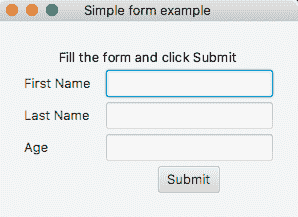

我们可以按如下方式填写数据，例如：


单击“提交”按钮后，将显示以下消息，并且应用程序已存在：

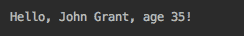

为了帮助可视化布局，特别是在更复杂的设计中，可以使用网格方法`setGridLinesVisible(boolean v)`使网格线可见。这有助于查看单元格的对齐方式。我们可以在示例中添加以下行：

```java
grid.setGridLinesVisible(true);

```

我们再运行一次，结果如下：

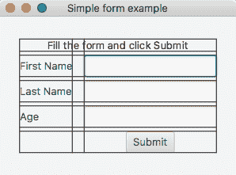

如您所见，布局现在已明确列出，这有助于可视化设计。

`javafx.scene.layout`包包括 24 个布局类，例如`Pane`（我们在`HelloWorld`示例中看到过）、`StackPane`（允许我们覆盖节点）、`FlowPane`（允许节点的位置随着窗口大小的变化而流动）、`AnchorPane`（保留节点相对于其锚定点的位置），等等。`VBox`布局将在下一节“图表”中演示。

# 图表

JavaFX 为`javafx.scene.chart`包中的数据可视化提供了以下图表组件：

*   `LineChart`：在一系列数据点之间添加一条线；通常用于表示随时间变化的趋势
*   `AreaChart`：与`LineChart`类似，但填充连接数据点的线和轴之间的区域；通常用于比较一段时间内累积的总和
*   `BarChart`：以矩形条表示数据，用于离散数据的可视化
*   `PieChart`：表示一个分为若干段的圆（用不同的颜色填充），每一段代表一个值占总数的比例，我们将在本节中演示
*   `BubbleChart`：将数据呈现为二维椭圆形，称为**气泡**，允许呈现三个参数
*   `ScatterChart`：按原样显示序列中的数据点；有助于识别是否存在聚类（数据相关性）

下面的示例演示如何将测试结果显示为饼图。每个段表示成功、失败或忽略的测试数：

```java
Text txt = new Text("Test results:");

PieChart pc = new PieChart();
pc.getData().add(new PieChart.Data("Succeed", 143));
pc.getData().add(new PieChart.Data("Failed" ,  12));
pc.getData().add(new PieChart.Data("Ignored",  18));

VBox vb = new VBox(txt, pc);
vb.setAlignment(Pos.CENTER);
vb.setPadding(new Insets(10, 10, 10, 10));

primaryStage.setTitle("A chart example");
primaryStage.onCloseRequestProperty()
        .setValue(e:> System.out.println("Bye! See you later!"));
primaryStage.setScene(new Scene(vb, 300, 300));
primaryStage.show();

```

我们已经创建了两个节点-`Text`和`PieChart`，并将它们放置在`VBox`布局的单元格中，该布局将它们设置为一列，一个在另一列之上。我们在`VBox`窗格的边缘添加了 10 个像素的填充。请注意，VBox 扩展了`Node`和`Pane`类，就像其他窗格一样。我们还使用`setAlignment()`方法将窗格放置在场景中心。其余部分与前面的所有示例相同，只是场景标题和大小不同

如果我们运行前面的示例，结果如下：

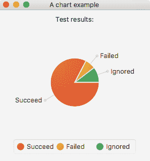

`PieChart`类以及任何其他图表都有许多其他方法，这些方法对于以用户友好的方式呈现更复杂和动态的数据非常有用。

# 应用 CSS

默认情况下，JavaFX 使用分发 jar 文件附带的样式表。要覆盖默认样式，可以使用`getStylesheets()`方法将样式表添加到场景中：

```java
scene.getStylesheets().add("/mystyle.css");
```

`mystyle.css`文件必须放在`src/main/resources`文件夹中。让我们这样做，并将具有以下内容的`mystyle.css`文件添加到`HelloWorld`示例中：

```java
#text-hello {
  :fx-font-size: 20px;
   -fx-font-family: "Arial";
   -fx-fill: red;
}
.button {
   -fx-text-fill: white;
   -fx-background-color: slateblue;
}
```

如您所见，我们希望以某种方式设置 button 节点和具有 ID`text-hello`的`Text`节点的样式。我们还必须修改 HelloWorld 示例，将 ID 添加到`Text`元素中，并将样式表文件添加到场景中：

```java
Text txt = new Text("Hello, world!");
txt.setId("text-hello");
txt.relocate(115, 40);

Button btn = new Button("Exit");
btn.relocate(155, 80);
btn.setOnAction(e -> {
    System.out.println("Bye! See you later!");
    Platform.exit();
});

Pane pane = new Pane();
pane.getChildren().addAll(txt, btn);

Scene scene = new Scene(pane, 350, 150);
scene.getStylesheets().add("/mystyle.css");

primaryStage.setTitle("The primary stage (top-level container)");
primaryStage.onCloseRequestProperty()
        .setValue(e -> System.out.println("\nBye! See you later!"));
primaryStage.setScene(scene);
primaryStage.show();

```

如果现在运行此代码，结果如下：

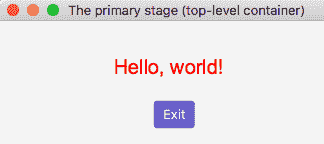

或者，可以在将用于覆盖文件样式表的任何节点上设置内联样式，无论是否为默认样式

```java

btn.setStyle("-fx-text-fill: white; -fx-background-color: red;");
```

如果我们再次运行该示例，结果如下：


[浏览 JavaFXCSS 参考指南](https://docs.oracle.com/javafx/2/api/javafx/scene/doc-files/cssref.html)了解定制造型的种类和可能的选择。

# 使用 FXML

**FXML** 是一种基于 XML 的语言，它允许构建一个用户界面，并独立地维护应用程序（业务）逻辑的用户界面（就外观和感觉或其他与表示相关的更改而言）。使用 FXML，您甚至不用编写一行 Java 代码就可以设计用户界面。

FXML 没有模式，但其功能反映了用于构建场景的 JavaFX 对象的 API。这意味着您可以使用 API 文档来了解 FXML 结构中允许哪些标记和属性。大多数情况下，JavaFX 类可以用作标记，它们的属性可以用作属性。

除了 FXML 文件（视图）之外，控制器（Java 类）还可以用于处理模型和组织页面流。模型由视图和控制器管理的域对象组成。它还允许使用 CSS 样式和 JavaScript 的所有功能。但在本书中，我们将只能演示基本的 FXML 功能。剩下的和许多在线的好教程可以在 [FXML 简介](https://docs.oracle.com/javafx/2/api/javafx/fxml/doc-files/introduction_to_fxml.html)中找到。

为了演示 FXML 的用法，我们将复制在“控制元素”部分中创建的简单表单，然后通过添加页面流来增强它。以下是我们的名、姓和年龄表单如何在 FXML 中表达：

```java
<?xml version="1.0" encoding="UTF-8"?>
<?import javafx.scene.Scene?>
<?import javafx.geometry.Insets?>
<?import javafx.scene.text.Text?>
<?import javafx.scene.control.Label?>
<?import javafx.scene.control.Button?>
<?import javafx.scene.layout.GridPane?>
<?import javafx.scene.control.TextField?>
<Scene fx:controller="com.packt.learnjava.ch12_gui.HelloWorldController"
       xmlns:fx="http://javafx.com/fxml"
       width="350" height="200">
    <GridPane alignment="center" hgap="15" vgap="5">
        <padding>
            <Insets top="20" right="20" bottom="20" left="20"/>
        </padding>
        <Text id="textFill" text="Fill the form and click Submit"
              GridPane.rowIndex="0" GridPane.columnSpan="2">
            <GridPane.halignment>center</GridPane.halignment>
        </Text>
        <Label text="First name"
               GridPane.columnIndex="0" GridPane.rowIndex="1"/>
        <TextField fx:id="tfFirstName"
                   GridPane.columnIndex="1" GridPane.rowIndex="1"/>
        <Label text="Last name"
               GridPane.columnIndex="0" GridPane.rowIndex="2"/>
        <TextField fx:id="tfLastName"
                   GridPane.columnIndex="1" GridPane.rowIndex="2"/>
        <Label text="Age"
               GridPane.columnIndex="0" GridPane.rowIndex="3"/>
        <TextField fx:id="tfAge"
                   GridPane.columnIndex="1" GridPane.rowIndex="3"/>
        <Button text="Submit"
                GridPane.columnIndex="1" GridPane.rowIndex="4"
                onAction="#submitClicked">
            <GridPane.halignment>center</GridPane.halignment>
        </Button>
    </GridPane>
</Scene>
```

如您所见，它表达了您已经熟悉的所需场景结构，并指定了控制器类`HelloWorldController`，我们稍后将看到它。正如我们已经提到的，这些标记与我们用来仅用 Java 构建同一 GUI 的类名相匹配。我们将把`helloWorld.fxml`文件放入`resources`文件夹。

现在让我们看一下使用前面的`FXML`文件的`HelloWorld`类的`start()`方法实现：

```java
try {
  FXMLLoader lder = new FXMLLoader();
  lder.setLocation(new URL("file:src/main/resources/helloWorld.fxml"));
  Scene scene = lder.load();

  primaryStage.setTitle("Simple form example");
  primaryStage.setScene(scene);
  primaryStage.onCloseRequestProperty()
          .setValue(e -> System.out.println("\nBye! See you later!"));
  primaryStage.show();
} catch (Exception ex){
    ex.printStackTrace();
}
```

`start()`方法只是加载`helloWorld.fxml`文件并设置 stage，后者的操作与前面的示例完全相同。现在让我们看看`HelloWorldController`类，如果需要，我们可以启动只有以下内容的应用程序：

```java
public class HelloWorldController {
    @FXML
    protected void submitClicked(ActionEvent e) {
    }
}
```

表单将被显示，但按钮单击将不起任何作用。这就是我们在讨论独立于应用程序逻辑的用户界面开发时的意思。注意`@FXML`注释。它使用 FXML 标记的 id 将方法和属性绑定到 FXML 标记。以下是完整控制器实现的外观：

```java
@FXML
private TextField tfFirstName;
@FXML
private TextField tfLastName;
@FXML
private TextField tfAge;
@FXML
protected void submitClicked(ActionEvent e) {
    String fn = tfFirstName.getText();
    String ln = tfLastName.getText();
    String age = tfAge.getText();
    int a = 42;
    try {
        a = Integer.parseInt(age);
    } catch (Exception ex) {
    }
    fn = fn.isBlank() ? "Nick" : fn;
    ln = ln.isBlank() ? "Samoylov" : ln;
    System.out.println("Hello, " + fn + " " + ln + ", age " + a + "!");
    Platform.exit();
}
```

在大多数情况下，你应该很熟悉它。唯一的区别是我们并没有直接引用字段及其值（如前所述），而是使用带有注释`@FXML`的绑定。如果现在运行`HelloWorld`类，页面外观和行为将与我们在“控制元素”部分中描述的完全相同。

现在，我们添加另一个页面并修改代码，以便在点击`Submit`按钮后，控制器将提交的值发送到另一个页面并关闭表单。为了简单起见，新页面将只显示接收到的数据。以下是 FXML 的外观：

```java
<?xml version="1.0" encoding="UTF-8"?>
<?import javafx.scene.Scene?>
<?import javafx.geometry.Insets?>
<?import javafx.scene.text.Text?>
<?import javafx.scene.layout.GridPane?>

<Scene fx:controller="com.packt.lernjava.ch12_gui.HelloWorldController2"
       xmlns:fx="http://javafx.com/fxml"
       width="350" height="150">
    <GridPane alignment="center" hgap="15" vgap="5">
        <padding>
            <Insets top="20" right="20" bottom="20" left="20"/>
        </padding>
        <Text fx:id="textUser"
              GridPane.rowIndex="0" GridPane.columnSpan="2">
            <GridPane.halignment>center</GridPane.halignment>
        </Text>
        <Text id="textDo" text="Do what has to be done here"
              GridPane.rowIndex="1" GridPane.columnSpan="2">
            <GridPane.halignment>center</GridPane.halignment>
        </Text>
    </GridPane>
</Scene>
```

如您所见，页面只有两个只读的`Text`字段。第一个（带`id="textUser"`）将显示上一页传递的数据。第二个只会显示消息“执行此处必须执行的操作”。这不是很复杂，但它演示了如何组织数据流和页面。

新页面使用不同的控制器，如下所示：

```java
package com.packt.learnjava.ch12_gui;
import javafx.fxml.FXML;
import javafx.scene.text.Text;
public class HelloWorldController2 {
    @FXML
    public Text textUser;
}
```

正如您可能猜到的，公共字段`textUser`必须由第一个控制器`HelloWolrdController`填充值。我们开始吧。我们修改`submitClicked()`方法如下：

```java
@FXML
protected void submitClicked(ActionEvent e) {
    String fn = tfFirstName.getText();
    String ln = tfLastName.getText();
    String age = tfAge.getText();
    int a = 42;
    try {
        a = Integer.parseInt(age);
    } catch (Exception ex) {}
    fn = fn.isBlank() ? "Nick" : fn;
    ln = ln.isBlank() ? "Samoylov" : ln;
    String user = "Hello, " + fn + " " + ln + ", age " + a + "!";
    //System.out.println("\nHello, " + fn + " " + ln + ", age " + a + "!");
    //Platform.exit();

    goToPage2(user);
    Node source = (Node) e.getSource();
    Stage stage = (Stage) source.getScene().getWindow();
    stage.close();
}
```

我们不只是打印提交的（或默认的）数据并退出应用程序（参见注释掉的两行），而是调用`goToPage2()`方法并将提交的数据作为参数传递。然后我们从事件中提取对当前窗口阶段的引用并关闭它

`goToPage2()`方法如下：

```java
try {
  FXMLLoader lder = new FXMLLoader();
  lder.setLocation(new URL("file:src/main/resources/helloWorld2.fxml"));
  Scene scene = lder.load();

  HelloWorldController2 c = loader.getController();
  c.textUser.setText(user);

  Stage primaryStage = new Stage();
  primaryStage.setTitle("Simple form example. Page 2.");
  primaryStage.setScene(scene);
  primaryStage.onCloseRequestProperty()
            .setValue(e -> {
                System.out.println("Bye! See you later!");
                Platform.exit();
            });
  primaryStage.show();
} catch (Exception ex) {
    ex.printStackTrace();
}
```

它加载`helloWorld2.fxml`文件，从中提取控制器对象，并在其上设置传入的值。其余的与您现在已经见过几次的 stage 配置相同。唯一的区别是第 2 页被添加到标题中

如果我们现在执行`HelloWorld`类，我们将看到熟悉的表单并用数据填充它：


单击“提交”按钮后，此窗口将关闭并显示新窗口：


我们单击左上角的 x 按钮（或者在 Windows 上单击右上角），会看到与我们之前看到的相同的消息：


同级动作功能和`stop()`方法如预期效果。

至此，我们结束了对 FXML 的介绍，并进入下一个主题，即向 JavaFX 应用程序添加 HTML。

# 嵌入 HTML

向 JavaFX 添加 HTML 很容易。您所要做的就是使用`javafx.scene.web.WebView`类，该类提供了一个窗口，在该窗口中，添加的 HTML 的呈现方式与浏览器中的呈现方式类似。`WebView`类使用开源浏览器引擎 WebKit，因此支持完整的浏览功能。

与所有其他 JavaFX 组件一样，`WebView`类扩展了`Node`类，可以在 Java 代码中这样处理。此外，它有自己的属性和方法，允许通过设置窗口大小（最大值、最小值和首选高度和宽度）、字体比例、缩放率、添加 CSS、启用上下文（右键单击）菜单等来调整浏览器窗口以适应所包括的应用程序是的。它提供了加载 HTML 页面、导航页面、对加载的页面应用不同样式、访问页面浏览历史和文档模型以及执行 JavaScript 的功能

要开始使用`javafx.scene.web`包，必须首先采取两个步骤：

1.  将以下依赖项添加到`pom.xml`文件：

```java
<dependency>
 <groupId>org.openjfx</groupId>
 <artifactId>javafx-web</artifactId>
 <version>11.0.2</version>
</dependency>

```

`javafx-web`的版本通常与 Java 版本保持同步，但在撰写本文时，`javafx-web`的第 12 版尚未发布，因此我们使用的是最新的可用版本 11.0.2。

2.  因为`javafx-web`使用了从 Java9 中删除的包（[`com.sun.*`](https://docs.oracle.com/javase/9/migrate/toc.htm#JSMIG-GUID-F7696E02-A1FB-4D5A-B1F2-89E7007D4096)），要从 Java 9+ 访问`com.sun.*`包，除了设置`--module-path`和`--add-modules`之外，还要设置以下 VM 选项，在`ch12_gui`包的`HtmlWebView`类的“JavaFX 基础”部分的运行/调试配置中描述：

```java
--add-exports javafx.graphics/com.sun.javafx.sg.prism=ALL-UNNAMED 
--add-exports javafx.graphics/com.sun.javafx.scene=ALL-UNNAMED 
--add-exports javafx.graphics/com.sun.javafx.util=ALL-UNNAMED 
--add-exports javafx.base/com.sun.javafx.logging=ALL-UNNAMED 
--add-exports javafx.graphics/com.sun.prism=ALL-UNNAMED 
--add-exports javafx.graphics/com.sun.glass.ui=ALL-UNNAMED 
--add-exports javafx.graphics/com.sun.javafx.geom.transform=ALL-UNNAMED 
--add-exports javafx.graphics/com.sun.javafx.tk=ALL-UNNAMED 
--add-exports javafx.graphics/com.sun.glass.utils=ALL-UNNAMED 
--add-exports javafx.graphics/com.sun.javafx.font=ALL-UNNAMED 
--add-exports javafx.graphics/com.sun.javafx.application=ALL-UNNAMED 
--add-exports javafx.controls/com.sun.javafx.scene.control=ALL-UNNAMED 
--add-exports javafx.graphics/com.sun.javafx.scene.input=ALL-UNNAMED 
--add-exports javafx.graphics/com.sun.javafx.geom=ALL-UNNAMED 
--add-exports javafx.graphics/com.sun.prism.paint=ALL-UNNAMED 
--add-exports javafx.graphics/com.sun.scenario.effect=ALL-UNNAMED 
--add-exports javafx.graphics/com.sun.javafx.text=ALL-UNNAMED 
--add-exports javafx.graphics/com.sun.javafx.iio=ALL-UNNAMED
--add-exports javafx.graphics/com.sun.scenario.effect.impl.prism=ALL-UNNAMED
--add-exports javafx.graphics/com.sun.javafx.scene.text=ALL-UNNAMED
```

要从命令行执行类`HtmlWebView`，请使用以下命令：

```java
mvn clean package

java --module-path /path/javaFX/lib --add-modules=javafx.controls,javafx.fxml --add-exports javafx.graphics/com.sun.javafx.sg.prism=ALL-UNNAMED --add-exports javafx.graphics/com.sun.javafx.scene=ALL-UNNAMED --add-exports javafx.graphics/com.sun.javafx.util=ALL-UNNAMED --add-exports javafx.base/com.sun.javafx.logging=ALL-UNNAMED --add-exports javafx.graphics/com.sun.prism=ALL-UNNAMED --add-exports javafx.graphics/com.sun.glass.ui=ALL-UNNAMED --add-exports javafx.graphics/com.sun.javafx.geom.transform=ALL-UNNAMED --add-exports javafx.graphics/com.sun.javafx.tk=ALL-UNNAMED --add-exports javafx.graphics/com.sun.glass.utils=ALL-UNNAMED  --add-exports javafx.graphics/com.sun.javafx.font=ALL-UNNAMED  --add-exports javafx.graphics/com.sun.javafx.application=ALL-UNNAMED --add-exports javafx.controls/com.sun.javafx.scene.control=ALL-UNNAMED --add-exports javafx.graphics/com.sun.javafx.scene.input=ALL-UNNAMED --add-exports javafx.graphics/com.sun.javafx.geom=ALL-UNNAMED  --add-exports javafx.graphics/com.sun.prism.paint=ALL-UNNAMED  --add-exports javafx.graphics/com.sun.scenario.effect=ALL-UNNAMED --add-exports javafx.graphics/com.sun.javafx.text=ALL-UNNAMED --add-exports javafx.graphics/com.sun.javafx.iio=ALL-UNNAMED --add-exports javafx.graphics/com.sun.scenario.effect.impl.prism=ALL-UNNAMED --add-exports javafx.graphics/com.sun.javafx.scene.text=ALL-UNNAMED  -cp target/learnjava-1.0-SNAPSHOT.jar:target/libs/* com.packt.learnjava.ch12_gui.HtmlWebView
```

在 Windows 上，相同的命令如下所示：

```java
mvn clean package

java --module-path C:\path\JavaFX\lib --add-modules=javafx.controls,javafx.fxml --add-exports javafx.graphics/com.sun.javafx.sg.prism=ALL-UNNAMED --add-exports javafx.graphics/com.sun.javafx.scene=ALL-UNNAMED --add-exports javafx.graphics/com.sun.javafx.util=ALL-UNNAMED --add-exports javafx.base/com.sun.javafx.logging=ALL-UNNAMED --add-exports javafx.graphics/com.sun.prism=ALL-UNNAMED --add-exports javafx.graphics/com.sun.glass.ui=ALL-UNNAMED --add-exports javafx.graphics/com.sun.javafx.geom.transform=ALL-UNNAMED --add-exports javafx.graphics/com.sun.javafx.tk=ALL-UNNAMED --add-exports javafx.graphics/com.sun.glass.utils=ALL-UNNAMED  --add-exports javafx.graphics/com.sun.javafx.font=ALL-UNNAMED  --add-exports javafx.graphics/com.sun.javafx.application=ALL-UNNAMED --add-exports javafx.controls/com.sun.javafx.scene.control=ALL-UNNAMED --add-exports javafx.graphics/com.sun.javafx.scene.input=ALL-UNNAMED --add-exports javafx.graphics/com.sun.javafx.geom=ALL-UNNAMED  --add-exports javafx.graphics/com.sun.prism.paint=ALL-UNNAMED  --add-exports javafx.graphics/com.sun.scenario.effect=ALL-UNNAMED --add-exports javafx.graphics/com.sun.javafx.text=ALL-UNNAMED --add-exports javafx.graphics/com.sun.javafx.iio=ALL-UNNAMED --add-exports javafx.graphics/com.sun.scenario.effect.impl.prism=ALL-UNNAMED --add-exports javafx.graphics/com.sun.javafx.scene.text=ALL-UNNAMED  -cp target\learnjava-1.0-SNAPSHOT.jar;target\libs\* com.packt.learnjava.ch12_gui.HtmlWebView
```

类`HtmlWebView`也包含几个`start()`方法。按照“JavaFX 基础”一节中的描述，逐个重命名并执行它们。

现在我们来看几个例子。我们创建一个新的应用程序`HtmlWebView`，并使用前面描述的 VM 选项`--module-path`、`--add-modules`和`--add-exports`为其设置 VM 选项。现在我们可以编写并执行一个使用`WebView`类的代码。

首先，下面是如何将简单的 HTML 添加到 JavaFX 应用程序：

```java
WebView wv = new WebView();
WebEngine we = wv.getEngine();
String html = "<html><center><h2>Hello, world!</h2></center></html>";
we.loadContent(html, "text/html");
Scene scene = new Scene(wv, 200, 60);
primaryStage.setTitle("My HTML page");
primaryStage.setScene(scene);
primaryStage.onCloseRequestProperty()
            .setValue(e -> System.out.println("Bye! See you later!"));
primaryStage.show();
```

前面的代码创建一个`WebView`对象，从中获取`WebEngine`对象，使用获取的`WebEngine`对象加载 HTML，在场景中设置`WebView`对象，并配置舞台。`loadContent()`方法接受两个字符串：内容及其 mime 类型。内容字符串可以在代码中构造，也可以通过读取`.html`文件来创建

如果我们运行前面的示例，结果如下：


如果需要，您可以在同一窗口中显示其他 JavaFX 节点以及`WebView`对象。例如，让我们在嵌入的 HTML 上面添加一个`Text`节点：

```java
Text txt = new Text("Below is the embedded HTML:");

WebView wv = new WebView();
WebEngine we = wv.getEngine();
String html = "<html><center><h2>Hello, world!</h2></center></html>";
we.loadContent(html, "text/html");

VBox vb = new VBox(txt, wv);
vb.setSpacing(10);
vb.setAlignment(Pos.CENTER);
vb.setPadding(new Insets(10, 10, 10, 10));

Scene scene = new Scene(vb, 300, 120);
primaryStage.setScene(scene);
primaryStage.setTitle("JavaFX with embedded HTML");
primaryStage.onCloseRequestProperty()
            .setValue(e -> System.out.println("Bye! See you later!"));
primaryStage.show();
```

如您所见，`WebView`对象不是直接设置在场景上，而是与`txt`对象一起设置在布局对象上。然后，在场景中设置布局对象。上述代码的结果如下：

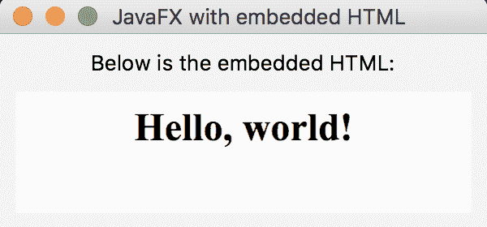

对于更复杂的 HTML 页面，可以使用`load()`方法直接从文件加载。为了演示这种方法，我们在`resources`文件夹中创建`form.htm`文件，内容如下：

```java
<!DOCTYPE html>
<html lang="en">
<head>
    <meta charset="UTF-8">
    <title>The Form</title>
</head>
<body>
<form action="http://server:port/formHandler" metrod="post">
    <table>
        <tr>
            <td><label for="firstName">Firts name:</label></td>
            <td><input type="text" id="firstName" name="firstName"></td>
        </tr>
        <tr>
            <td><label for="lastName">Last name:</label></td>
            <td><input type="text" id="lastName" name="lastName"></td>
        </tr>
        <tr>
            <td><label for="age">Age:</label></td>
            <td><input type="text" id="age" name="age"></td>
        </tr>
        <tr>
            <td></td>
            <td align="center">
                <button id="submit" name="submit">Submit</button>
            </td>
        </tr>
    </table>
</form>
</body>
</html>
```

这个 HTML 呈现的表单与我们在`Using FXML`部分中创建的表单类似。单击`Submit`按钮后，表单数据被发布到服务器的`\formHandler`URI 中。要在 JavaFX 应用程序中显示此表单，可以使用以下代码：

```java
Text txt = new Text("Fill the form and click Submit");

WebView wv = new WebView();
WebEngine we = wv.getEngine();
File f = new File("src/main/resources/form.html");
we.load(f.toURI().toString());

VBox vb = new VBox(txt, wv);
vb.setSpacing(10);
vb.setAlignment(Pos.CENTER);
vb.setPadding(new Insets(10, 10, 10, 10));

Scene scene = new Scene(vb, 300, 200);

primaryStage.setScene(scene);
primaryStage.setTitle("JavaFX with embedded HTML");
primaryStage.onCloseRequestProperty()
            .setValue(e -> System.out.println("Bye! See you later!"));
primaryStage.show();

```

如您所见，与其他示例的不同之处在于，我们现在使用`File`类及其`toURI()`方法直接访问`src/main/resources/form.html`文件中的 HTML，而无需先将内容转换为字符串。结果如下：


当您需要从 JavaFX 应用程序发送请求或发布数据时，此解决方案非常有用。但是当您希望用户填写的表单在服务器上已经可用时，您可以从 URL 加载它。例如，让我们将 Google 搜索合并到 JavaFX 应用程序中。我们可以通过将`load()`方法的参数值更改为要加载的页面的 URL 来实现：

```java
Text txt = new Text("Enjoy searching the Web!");

WebView wv = new WebView();
WebEngine we = wv.getEngine();
we.load("http://www.google.com");

VBox vb = new VBox(txt, wv);
vb.setSpacing(20);
vb.setAlignment(Pos.CENTER);
vb.setStyle("-fx-font-size: 20px;-fx-background-color: lightblue;");
vb.setPadding(new Insets(10, 10, 10, 10));

Scene scene = new Scene(vb,750,500);
primaryStage.setScene(scene);
primaryStage.setTitle("JavaFX with the window to another server");
primaryStage.onCloseRequestProperty()
        .setValue(e -> System.out.println("Bye! See you later!"));
primaryStage.show();

```

我们还为布局添加了一个样式，以便增加字体并为背景添加颜色，这样我们就可以看到嵌入呈现的 HTML 的区域的轮廓。运行此示例时，将出现以下窗口：


在此窗口中，您可以执行通常通过浏览器访问的搜索的所有方面。

而且，正如我们已经提到的，您可以放大呈现的页面。例如，如果我们将`wv.setZoom(1.5)`行添加到前面的示例中，结果如下：


同样，我们可以从文件中设置字体的比例，甚至样式：

```java
wv.setFontScale(1.5);
we.setUserStyleSheetLocation("mystyle.css");
```

但是请注意，我们在`WebView`对象上设置了字体比例，而在`WebEngine`对象中设置了样式

我们也可以使用`WebEngine`类方法`getDocument()`访问（和操作）加载页面的 DOM 对象：

```java
Document document = we.getDocument();
```

我们还可以访问浏览历史，获取当前索引，并前后移动历史：

```java
WebHistory history = we.getHistory();  
int currInd = history.getCurrentIndex(); 
history.go(-1);
history.go( 1);
```

对于历史记录的每个条目，我们可以提取其 URL、标题或上次访问日期：

```java
WebHistory history = we.getHistory();
ObservableList<WebHistory.Entry> entries = history.getEntries();
for(WebHistory.Entry entry: entries){
    String url = entry.getUrl();
    String title = entry.getTitle();
    Date date = entry.getLastVisitedDate();
}

```

阅读`WebView`和`WebEngine`类的文档，了解如何利用它们的功能。

# 播放媒体

向 JavaFX 应用程序的场景添加图像不需要`com.sun.*`包，因此不需要“添加 HTML”部分中列出的`--add-export`VM 选项。但是不管怎样，拥有它们并没有什么坏处，所以如果您已经添加了它们，那么就保留`--add-export`选项。

可以使用类`javafx.scene.image.Image`和`javafx.scene.image.ImageView`将图像包括在场景中。为了演示如何做到这一点，我们将使用位于`resources`文件夹中的 Packt logo`packt.png`。下面是执行此操作的代码：

```java
Text txt = new Text("What a beautiful image!");

FileInputStream input = 
               new FileInputStream("src/main/resources/packt.png");
Image image = new Image(input);
ImageView iv = new ImageView(image);

VBox vb = new VBox(txt, iv);
vb.setSpacing(20);
vb.setAlignment(Pos.CENTER);
vb.setPadding(new Insets(10, 10, 10, 10));

Scene scene = new Scene(vb, 300, 200);
primaryStage.setScene(scene);
primaryStage.setTitle("JavaFX with embedded HTML");
primaryStage.onCloseRequestProperty()
        .setValue(e -> System.out.println("Bye! See you later!"));
primaryStage.show();

```

如果我们运行前面的代码，结果如下：


当前支持的图像格式有 BMP、GIF、JPEG 和 PNG。查看[`Image`和`ImageView`类](https://openjfx.io/javadoc/11/javafx.graphics/javafx/scene/image/package-summary.html)学习根据需要格式化和调整图像的多种方法。

现在让我们看看如何在 JavaFX 应用程序中使用其他媒体文件。播放音频或电影文件需要在“添加 HTML”部分中列出的`--add-export`VM 选项

当前支持的编码如下：

*   **AAC**：高级音频编码音频压缩
*   **H.264/AVC**：H.264/MPEG-4/**AVC**（**高级视频编码**）视频压缩
*   **MP3**：原始 MPEG-1、2 和 2.5 音频；第一层、第二层和第三层
*   **PCM**：未压缩的原始音频样本

您可以在 [API 文档](https://openjfx.io/javadoc/11/javafx.media/javafx/scene/media/package-summary.html)中看到对支持的协议、媒体容器和元数据标记的更详细的描述。

以下三个类允许构造可以添加到场景的媒体播放器：

```java
javafx.scene.media.Media;
javafx.scene.media.MediaPlayer;
javafx.scene.media.MediaView;
```

`Media`类表示媒体的来源，`MediaPlayer`类提供了控制媒体播放的所有方法：`play(),``stop()`、`pause()`、`setVolume()`等。您还可以指定媒体播放的次数。`MediaView`类扩展了`Node`类，可以添加到场景中。它提供媒体播放器正在播放的媒体的视图。它负责在媒体上露面。

为了演示，让我们在`HtmlWebView`应用程序中添加另一个版本的`start()`方法，该方法播放位于`resources`文件夹中的`jb.mp3`文件：

```java
Text txt1 = new Text("What a beautiful music!");
Text txt2 = new Text("If you don't hear music, turn up the volume.");

File f = new File("src/main/resources/jb.mp3");
Media m = new Media(f.toURI().toString());
MediaPlayer mp = new MediaPlayer(m);
MediaView mv = new MediaView(mp);

VBox vb = new VBox(txt1, txt2, mv);
vb.setSpacing(20);
vb.setAlignment(Pos.CENTER);
vb.setPadding(new Insets(10, 10, 10, 10));

Scene scene = new Scene(vb, 350, 100);
primaryStage.setScene(scene);
primaryStage.setTitle("JavaFX with embedded media player");
primaryStage.onCloseRequestProperty()
        .setValue(e -> System.out.println("Bye! See you later!"));
primaryStage.show();

mp.play();
```

注意如何基于源文件构造一个`Media`对象；然后基于`Media`对象构造`MediaPlayer`对象，然后将其设置为`MediaView`类构造器的属性。`MediaView`对象与两个`Text`对象一起设置在场景中。我们使用`VBox`对象来提供布局。最后，在舞台上设置场景并且舞台变得可见之后（在`show()`方法完成之后），在`MediaPlayer`对象上调用`play()`方法。默认情况下，媒体播放一次。

如果执行上述代码，将出现以下窗口并播放`jb.m3`文件：

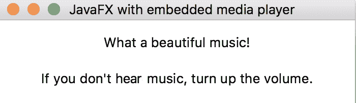

我们可以添加控件来停止、暂停和调整音量，但这将需要更多的代码，这不符合本书的预期大小。您可以在 [Oracle 在线文档](https://docs.oracle.com/javafx/2/media/jfxpub-media.htm)中找到有关如何执行此操作的指南。

`sea.mp4`电影文件可以类似地播放：

```java
Text txt = new Text("What a beautiful movie!");

File f = new File("src/main/resources/sea.mp4");
Media m = new Media(f.toURI().toString());
MediaPlayer mp = new MediaPlayer(m);
MediaView mv = new MediaView(mp);

VBox vb = new VBox(txt, mv);
vb.setSpacing(20);
vb.setAlignment(Pos.CENTER);
vb.setPadding(new Insets(10, 10, 10, 10));

Scene scene = new Scene(vb, 650, 400);
primaryStage.setScene(scene);
primaryStage.setTitle("JavaFX with embedded media player");
primaryStage.onCloseRequestProperty()
        .setValue(e -> System.out.println("Bye! See you later!"));
primaryStage.show();

mp.play();
```

唯一的区别是不同大小的场景需要显示这个特定剪辑的完整帧。经过几次试错调整，我们找到了必要的尺寸。或者，我们可以使用`MediaView`方法`autosize()`、`preserveRatioProperty()`、`setFitHeight()`、`setFitWidth()`、`fitWidthProperty()`、`fitHeightProperty()`以及类似的方法来调整嵌入窗口的大小并自动匹配场景的大小。如果执行上述示例，将弹出以下窗口并播放片段：


我们甚至可以同时播放音频和视频文件，从而为电影提供配乐：

```java
Text txt1 = new Text("What a beautiful movie and sound!");
Text txt2 = new Text("If you don't hear music, turn up the volume.");

File fs = new File("src/main/resources/jb.mp3");
Media ms = new Media(fs.toURI().toString());
MediaPlayer mps = new MediaPlayer(ms);
MediaView mvs = new MediaView(mps);

File fv = new File("src/main/resources/sea.mp4");
Media mv = new Media(fv.toURI().toString());
MediaPlayer mpv = new MediaPlayer(mv);
MediaView mvv = new MediaView(mpv);

VBox vb = new VBox(txt1, txt2, mvs, mvv);
vb.setSpacing(20);
vb.setAlignment(Pos.CENTER);
vb.setPadding(new Insets(10, 10, 10, 10));

Scene scene = new Scene(vb, 650, 500);
primaryStage.setScene(scene);
primaryStage.setTitle("JavaFX with embedded media player");
primaryStage.onCloseRequestProperty()
        .setValue(e -> System.out.println("Bye! See you later!"));
primaryStage.show();

mpv.play();
mps.play();

```

这是可能的，因为每个播放器都由自己的线程执行

有关`javafx.scene.media`包的更多信息，请在线阅读 API 和开发者指南：

*   <https://openjfx.io/javadoc/11/javafx.media/javafx/scene/media/package-summary.html>
*   <https://docs.oracle.com/javafx/2/media/jfxpub-media.htm>

# 添加效果

`javafx.scene.effects`包包含许多类，允许向节点添加各种效果：

*   `Blend`：使用一个预定义的`BlendMode`组合来自两个源（通常是图像）的像素
*   `Bloom`：使输入图像更亮，使其看起来发光
*   `BoxBlur`：为图像添加模糊
*   `ColorAdjust`：允许调整图像的色调、饱和度、亮度和对比度
*   `ColorInput`：呈现一个矩形区域，其中填充了给定的`Paint`
*   `DisplacementMap`：将每个像素移动指定的距离
*   `DropShadow`：在内容后面呈现给定内容的阴影
*   `GaussianBlur`：使用特定（高斯）方法添加模糊
*   `Glow`：使输入图像看起来发光
*   `InnerShadow`：在帧内创建阴影
*   `Lighting`：模拟光源照射在内容上；使平面对象看起来更逼真
*   `MotionBlur`：模拟运动中看到的给定内容
*   `PerspectiveTransform`：从一个角度转换内容
*   `Reflection`：呈现低于实际输入内容的输入的反射版本
*   `SepiaTone`：产生暗褐色的色调效果，类似于古董照片的外观
*   `Shadow`：创建具有模糊边缘的内容的单色副本

所有效果共享父级-抽象类`Effect`。`Node`类具有`setEffect(Effect e)`方法，这意味着可以将任何效果添加到任何节点。这是将效果应用于节点的主要方式，演员在舞台上产生场景（如果我们回想一下本章开头介绍的类比）

唯一的例外是`Blend`效果，这使得它的使用比其他效果的使用更加复杂。除了使用`setEffect(Effect e)`方法外，一些`Node`班的孩子还有`setBlendMode(BlendMode bm)`方法，可以调节图像重叠时如何相互融合。因此，可以以不同的方式设置不同的混合效果，以相互覆盖，并产生可能难以调试的意外结果。这就是为什么`Blend`效果的使用更加复杂，这就是为什么我们要开始概述`Blend`效果如何使用的原因。

有四个方面可以控制两个图像重叠区域的外观（我们在示例中使用两个图像使其更简单，但实际上，许多图像可以重叠）：

*   **不透明度属性的值**：定义通过图像可以看到多少；不透明度值 0.0 表示图像是完全透明的，而不透明度值 1.0 表示后面看不到任何东西。
*   **每种颜色的 alpha 值和强度**：将颜色的透明度定义为 0.0-1.0 或 0-255 范围内的双倍值。
*   **混合模式，由`enum BlendMode`值定义**：取决于每种颜色的模式、不透明度和 alpha 值，结果也可能取决于**将图像添加到场景的顺序**；第一个添加的图像称为**底部输入**，而重叠图像中的第二个称为**顶部输入**；如果顶部输入完全不透明，则底部输入被顶部输入隐藏。

重叠区域的结果外观是基于不透明度、颜色的 alpha 值、颜色的数值（强度）和混合模式计算的，混合模式可以是以下之一：

*   `ADD`：顶部输入的颜色和 alpha 分量与底部输入的颜色和 alpha 分量相加
*   `BLUE`：将底部输入的蓝色分量替换为顶部输入的蓝色分量；其他颜色分量不受影响
*   `COLOR_BURN`：将底部输入颜色分量的倒数除以顶部输入颜色分量，然后全部倒数以产生结果颜色
*   `COLOR_DODGE`：将底部输入颜色分量除以顶部输入颜色分量的倒数，得到结果颜色
*   `DARKEN`：选择来自两个输入的颜色分量中较暗的部分来产生结果颜色
*   `DIFFERENCE`：将两个输入的颜色分量中较深的分量从较浅的分量中减去，得到结果颜色
*   `EXCLUSION`：将两个输入的颜色分量相乘并加倍，然后从底部输入的颜色分量之和中减去，得到结果颜色
*   `GREEN`：将底部输入的绿色分量替换为顶部输入的绿色分量；其他颜色分量不受影响
*   `HARD_LIGHT`：根据顶部的输入颜色，输入颜色分量可以是相乘的，也可以是筛选的
*   `LIGHTEN`：从两个输入中选择颜色分量中的较浅者来产生结果颜色
*   `MULTIPLY`：第一次输入的颜色分量与第二次输入的颜色分量相乘
*   `OVERLAY`：根据底部的输入颜色，输入颜色分量可以是相乘的，也可以是筛选的
*   `RED`：将底部输入的红色分量替换为顶部输入的红色分量；其他颜色分量不受影响
*   `SCREEN`：来自两个输入的颜色分量被反转，彼此相乘，并且该结果再次被反转以产生结果颜色
*   `SOFT_LIGHT`：根据顶部的输入颜色，输入颜色组件要么变暗，要么变亮
*   `SRC_ATOP`：顶部输入位于底部输入内部的部分与底部输入混合
*   `SRC_OVER`：顶部输入与底部输入混合

为了演示`Blend`效果，让我们创建另一个名为`BlendEffect`的应用程序。它不需要`com.sun.*`包，因此不需要`--add-export`VM 选项。编译和执行时只需设置`--module-path`和`--add-modules`选项，如“JavaFX 基础”一节所述

本书的范围不允许我们演示所有可能的组合，因此我们将创建一个红色圆圈和一个蓝色正方形：

```java
Circle createCircle(){
    Circle c = new Circle();
    c.setFill(Color.rgb(255, 0, 0, 0.5));
    c.setRadius(25);
    return c;
}

Rectangle createSquare(){
    Rectangle r = new Rectangle();
    r.setFill(Color.rgb(0, 0, 255, 1.0));
    r.setWidth(50);
    r.setHeight(50);
    return r;
}
```

我们使用`Color.rgb(int red, int green, int blue, double alpha)`方法来定义每个图形的颜色。但是还有很多方法可以做到。[阅读`Color`类 API 文档了解更多详细信息](https://openjfx.io/javadoc/11/javafx.graphics/javafx/scene/paint/Color.html)。

为了重叠创建的圆和正方形，我们将使用`Group`节点：

```java
Node c = createCircle();
Node s = createSquare();
Node g = new Group(s, c);

```

在前面的代码中，正方形是底部输入。我们还将创建一个组，其中正方形是顶部输入：

```java
Node c = createCircle();
Node s = createSquare();
Node g = new Group(c, s);
```

区别很重要，因为我们将圆定义为半不透明，而正方形是完全不透明的。我们将在所有示例中使用相同的设置

让我们比较两种模式`MULTIPLY`和`SRC_OVER`。我们将使用`setEffect()`方法将它们设置在组上，如下所示：

```java
Blend blnd = new Blend();
blnd.setMode(BlendMode.MULTIPLY);
Node c = createCircle();
Node s = createSquare();
Node g = new Group(s, c);
g.setEffect(blnd);
```

对于每个模式，我们创建两个组，一个顶部输入一个圆，另一个顶部输入一个正方形，然后我们将创建的四个组放置在一个`GridPane`布局中（详细信息请参见源代码）。如果我们运行`BlendEffect`应用程序，结果将是：


正如所料，当正方形位于顶部（右边的两个图像）时，重叠区域完全由不透明的正方形拍摄。但是，当圆是顶部输入（左边的两个图像）时，重叠区域在某种程度上是可见的，并基于混合效果进行计算。

但是，如果我们直接在组上设置相同的模式，结果会略有不同。让我们运行相同的代码，但在组上设置模式：

```java
Node c = createCircle();
Node s = createSquare();
Node g = new Group(c, s);
g.setBlendMode(BlendMode.MULTIPLY);
```

如果再次运行应用程序，结果如下所示：

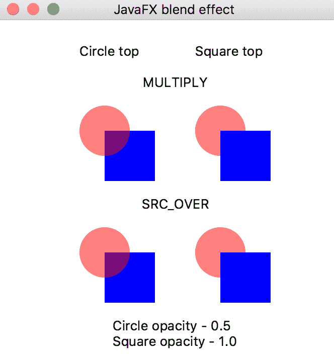

如您所见，圆圈的红色稍有变化，`MULTIPLY`和`SRC_OVER`模式之间没有区别。这就是我们在本节开头提到的场景中添加节点的顺序的问题。

结果也会根据设置效果的节点而变化。例如，与其在组上设置效果，不如仅在圆上设置混合效果：

```java
Blend blnd = new Blend();
blnd.setMode(BlendMode.MULTIPLY);
Node c = createCircle();
Node s = createSquare();
c.setEffect(blnd);
Node g = new Group(s, c);
```

我们运行应用程序并看到以下内容：


右侧的两个图像与前面所有示例中的图像相同，但左侧的两个图像显示了重叠区域的新颜色。现在让我们在正方形而不是圆形上设置相同的混合效果，如下所示：

```java
Blend blnd = new Blend();
blnd.setMode(BlendMode.MULTIPLY);
Node c = createCircle();
Node s = createSquare();
s.setEffect(blnd);
Node g = new Group(s, c);
```

结果将再次发生轻微变化，并显示在以下屏幕截图上：

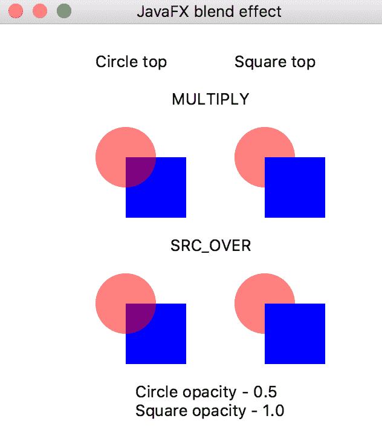

`MULTIPLY`和`SRC_OVER`模式之间没有区别，但是红色与我们在圆上设置效果时的颜色不同

我们可以再次更改方法，并使用以下代码直接在圆上设置混合效果模式：

```java
Node c = createCircle();
Node s = createSquare();
c.setBlendMode(BlendMode.MULTIPLY);

```

结果再次发生变化：


在正方形上设置混合模式只会再次消除`MULTIPLY`和`SRC_OVER`模式之间的差异：


为了避免混淆并使混合的结果更可预测，必须观察节点添加到场景的顺序以及应用混合效果的方式的一致性。

在随书提供的源代码中，您将找到`javafx.scene.effects`包中包含的所有效果的示例。它们都是通过并排比较来证明的。下面是一个例子：

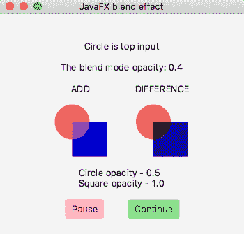

为方便起见，提供了“暂停”和“继续”按钮，允许您暂停演示并查看混合效果上设置的不同不透明度值的结果。

为了演示所有其他效果，我们创建了另一个名为`OtherEffects`的应用程序，它也不需要`com.sun.*`包，因此不需要`--add-export`VM 选项。演示的效果包括`Bloom`、`BoxBlur`、`ColorAdjust`、`DisplacementMap`、`DropShadow`、`Glow`、`InnerShadow`、`Lighting`、`MotionBlur`，`PerspectiveTransform`、`Reflection`、`ShadowTone`和`SepiaTone`。我们使用了两个图像来展示应用每种效果的结果，即 Packt 徽标和山湖景观：

```java
FileInputStream inputP = 
                   new FileInputStream("src/main/resources/packt.png");
Image imageP = new Image(inputP);
ImageView ivP = new ImageView(imageP);

FileInputStream inputM = 
                  new FileInputStream("src/main/resources/mount.jpeg");
Image imageM = new Image(inputM);
ImageView ivM = new ImageView(imageM);
ivM.setPreserveRatio(true);
ivM.setFitWidth(300);
```

我们还添加了两个按钮，允许您暂停并继续演示（它会迭代效果及其参数值）：

```java
Button btnP = new Button("Pause");
btnP.setOnAction(e1 -> et.pause());
btnP.setStyle("-fx-background-color: lightpink;");

Button btnC = new Button("Continue");
btnC.setOnAction(e2 -> et.cont());
btnC.setStyle("-fx-background-color: lightgreen;");

```

`et`对象是`EffectsThread`线程的对象：

```java
EffectsThread et = new EffectsThread(txt, ivM, ivP);

```

线程遍历效果列表，创建相应的效果 10 次（使用 10 个不同的效果参数值），每次在每个图像上设置创建的`Effect`对象，然后休眠一秒钟，让您有机会查看结果：

```java
public void run(){
    try {
        for(String effect: effects){
            for(int i = 0; i < 11; i++){
                double d = Math.round(i * 0.1 * 10.0) / 10.0;
                Effect e = createEffect(effect, d, txt);
                ivM.setEffect(e);
                ivP.setEffect(e);
                TimeUnit.SECONDS.sleep(1);
                if(pause){
                    while(true){
                        TimeUnit.SECONDS.sleep(1);
                        if(!pause){
                            break;
                        }
                    }
                }
            }
        }
        Platform.exit();
    } catch (Exception ex){
        ex.printStackTrace();
    }
}
```

接下来，我们将在带有效果结果的屏幕截图下展示如何创建每个效果。为了呈现结果，我们使用了`GridPane`布局：

```java
GridPane grid = new GridPane();
grid.setAlignment(Pos.CENTER);
grid.setVgap(25);
grid.setPadding(new Insets(10, 10, 10, 10));

int i = 0;
grid.add(txt,    0, i++, 2, 1);
GridPane.setHalignment(txt, HPos.CENTER);
grid.add(ivP,    0, i++, 2, 1);
GridPane.setHalignment(ivP, HPos.CENTER);
grid.add(ivM,    0, i++, 2, 1);
GridPane.setHalignment(ivM, HPos.CENTER);
grid.addRow(i++, new Text());
HBox hb = new HBox(btnP, btnC);
hb.setAlignment(Pos.CENTER);
hb.setSpacing(25);
grid.add(hb,    0, i++, 2, 1);
GridPane.setHalignment(hb, HPos.CENTER);

```

最后，创建的`GridPane`对象被传递到场景中，场景又被放置在您熟悉的舞台上，这些舞台来自我们前面的示例：

```java
Scene scene = new Scene(grid, 450, 500);
primaryStage.setScene(scene);
primaryStage.setTitle("JavaFX effect demo");
primaryStage.onCloseRequestProperty()
            .setValue(e3 -> System.out.println("Bye! See you later!"));
primaryStage.show();
```

下面的屏幕截图描述了 10 个参数值中的 1 个的效果示例。在每个屏幕截图下，我们展示了创建此效果的`createEffect(String effect, double d, Text txt)`方法的代码片段：


```java
//double d = 0.9;
txt.setText(effect + ".threshold: " + d);
Bloom b = new Bloom();
b.setThreshold(d);
```


```java
// double d = 0.3;
int i = (int) d * 10;
int it = i / 3;
txt.setText(effect + ".iterations: " + it);
BoxBlur bb = new BoxBlur();
bb.setIterations(i);

```


```java
double c = Math.round((-1.0 + d * 2) * 10.0) / 10.0;      // 0.6
txt.setText(effect + ": " + c);
ColorAdjust ca = new ColorAdjust();
ca.setContrast(c);

```


```java
double h = Math.round((-1.0 + d * 2) * 10.0) / 10.0;     // 0.6
txt.setText(effect + ": " + h);
ColorAdjust ca1 = new ColorAdjust();
ca1.setHue(h);

```

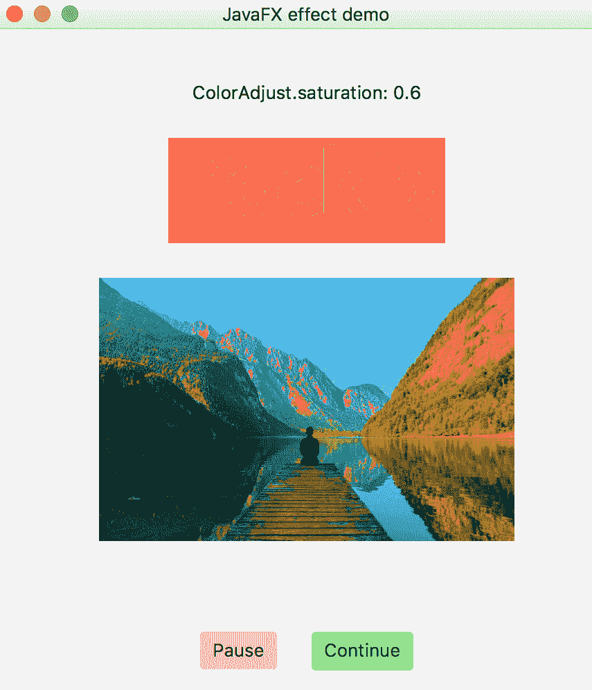

```java
double st = Math.round((-1.0 + d * 2) * 10.0) / 10.0;    // 0.6
txt.setText(effect + ": " + st);
ColorAdjust ca3 = new ColorAdjust();
ca3.setSaturation(st);

```


```java
int w = (int)Math.round(4096 * d);  //819
int h1 = (int)Math.round(4096 * d); //819
txt.setText(effect + ": " + ": width: " + w + ", height: " + h1);
DisplacementMap dm = new DisplacementMap();
FloatMap floatMap = new FloatMap();
floatMap.setWidth(w);
floatMap.setHeight(h1);
for (int k = 0; k < w; k++) {
    double v = (Math.sin(k / 20.0 * Math.PI) - 0.5) / 40.0;
    for (int j = 0; j < h1; j++) {
        floatMap.setSamples(k, j, 0.0f, (float) v);
    }
}
dm.setMapData(floatMap);

```

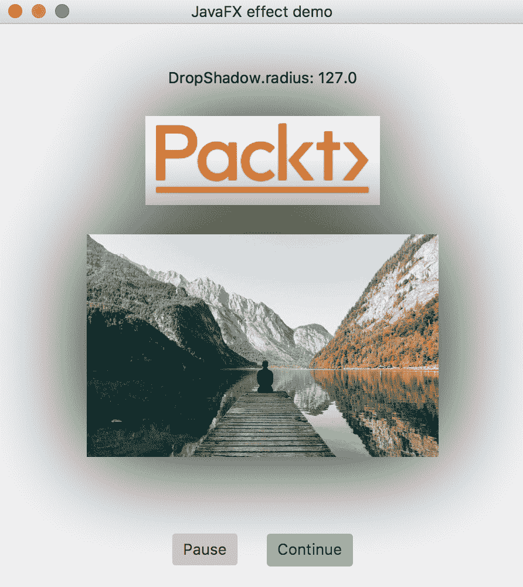

```java
double rd = Math.round((127.0 * d) * 10.0) / 10.0; // 127.0
System.out.println(effect + ": " + rd);
txt.setText(effect + ": " + rd);
DropShadow sh = new DropShadow();
sh.setRadius(rd);
```


```java
double rad = Math.round(12.1 * d *10.0)/10.0;      // 9.7
double off = Math.round(15.0 * d *10.0)/10.0;      // 12.0
txt.setText("InnerShadow: radius: " + rad + ", offset:" + off);
InnerShadow is = new InnerShadow();
is.setColor(Color.web("0x3b596d"));
is.setOffsetX(off);
is.setOffsetY(off);
is.setRadius(rad);

```


```java
double sS = Math.round((d * 4)*10.0)/10.0;      // 0.4
txt.setText(effect + ": " + sS);
Light.Spot lightSs = new Light.Spot();
lightSs.setX(150);
lightSs.setY(100);
lightSs.setZ(80);
lightSs.setPointsAtX(0);
lightSs.setPointsAtY(0);
lightSs.setPointsAtZ(-50);
lightSs.setSpecularExponent(sS);
Lighting lSs = new Lighting();
lSs.setLight(lightSs);
lSs.setSurfaceScale(5.0);

```


```java
double r = Math.round((63.0 * d)*10.0) / 10.0;      // 31.5
txt.setText(effect + ": " + r);
MotionBlur mb1 = new MotionBlur();
mb1.setRadius(r);
mb1.setAngle(-15);

```


```java
// double d = 0.9;
txt.setText(effect + ": " + d); 
PerspectiveTransform pt =
        new PerspectiveTransform(0., 1\. + 50.*d, 310., 50\. - 50.*d,
                   310., 50\. + 50.*d + 1., 0., 100\. - 50\. * d + 2.);

```


```java
// double d = 0.6;
txt.setText(effect + ": " + d);
Reflection ref = new Reflection();
ref.setFraction(d);

```

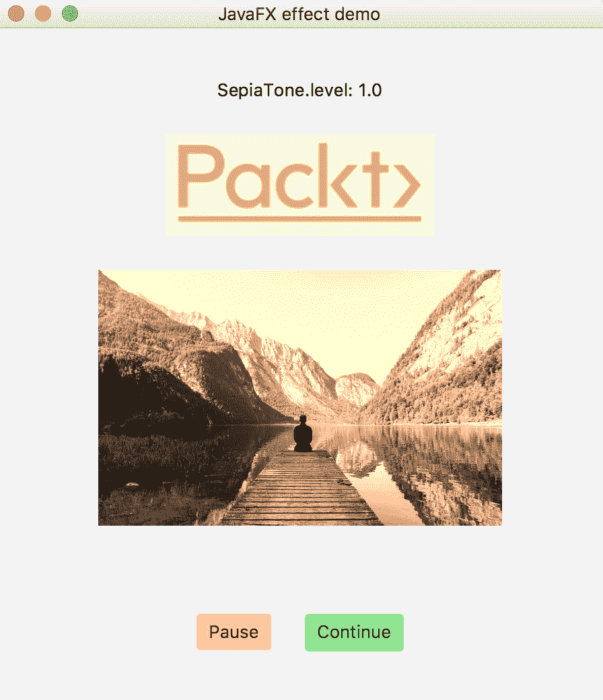

```java
// double d = 1.0;
txt.setText(effect + ": " + d);
SepiaTone sep = new SepiaTone();
sep.setLevel(d);

```

本书提供了此演示的完整源代码，可以在 GitHub 中获得。

# 摘要

在本章中，读者将了解 JavaFX 工具包、它的主要特性以及如何使用它创建 GUI 应用程序。涵盖的主题包括 JavaGUI 技术概述、JavaFX 控制元素、图表、使用 CSS、FXML、嵌入 HTML、播放媒体和添加效果。

下一章专门讨论函数式编程。它概述了 JDK 附带的函数式接口，解释了 lambda 表达式是什么，以及如何在 lambda 表达式中使用函数式接口。它还解释和演示了如何使用方法引用。

# 测验

1.  JavaFX 中的顶级内容容器是什么？
2.  JavaFX 中所有场景参与者的基类是什么？
3.  命名 JavaFX 应用程序的基类。
4.  JavaFX 应用程序必须实现的一种方法是什么？
5.  主方法必须调用哪个`Application`方法来执行 JavaFX 应用程序？
6.  执行 JavaFX 应用程序需要哪两个 VM 选项？
7.  当使用上角的 x 按钮关闭 JavaFX 应用程序窗口时，调用哪个`Application`方法？
8.  必须使用哪个类来嵌入 HTML？
9.  说出三个必须用来播放媒体的类
10.  要播放媒体，需要添加什么虚拟机选项？
11.  说出五个 JavaFX 效果。