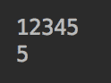

# Java 标准流

在本章中，我们将讨论数据流的处理，它不同于我们在第 5 章、“字符串、输入/输出和文件”中回顾的 I/O 流。我们将定义数据流是什么，如何使用`java.util.stream.Stream`对象的方法（操作）处理它们的元素，以及如何在管道中链接（连接）流操作。我们还将讨论流的初始化以及如何并行处理流。

本章将讨论以下主题：

*   作为数据和操作源的流
*   流初始化
*   操作（方法）
*   数字流接口
*   平行流

# 作为数据和操作源的流

上一章中描述和演示的 Lambda 表达式以及函数式接口为 Java 添加了强大的函数编程功能。它们允许将行为（函数）作为参数传递给为数据处理性能而优化的库。通过这种方式，应用程序员可以专注于所开发系统的业务方面，而将性能方面留给专家——库的作者。这样一个库的一个例子是包`java.util.stream`，这将是本章的重点。

在第 5 章“字符串、输入/输出和文件”中，我们谈到了 I/O 流作为数据源，但除此之外，它们对数据的进一步处理没有太大帮助。它们是基于字节或字符的，而不是基于对象的。只有先以编程方式创建并序列化对象之后，才能创建对象流。I/O 流只是到外部资源的连接，大部分是文件，其他的不多。然而，有时可以从 I/O 流转换到`java.util.stream.Stream`。例如，`BufferedReader`类的`lines()`方法将底层基于字符的流转换为`Stream<String>`对象。

另一方面，`java.util.stream`包的流面向对象集合的处理。在第 6 章“数据结构、泛型和流行实用程序”中，我们描述了`Collection`接口的两种方法，允许将集合元素作为流的元素读取：`default Stream<E> stream()`和`default Stream<E> parallelStream()`。我们还提到了`java.util.Arrays`的`stream()`方法。它有以下八个重载版本，用于将数组或数组的一部分转换为相应数据类型的流：

*   `static DoubleStream stream(double[] array)`
*   `static DoubleStream stream(double[] array, int startInclusive, int endExclusive)`
*   `static IntStream stream(int[] array)`
*   `static IntStream stream(int[] array, int startInclusive, int endExclusive)`
*   `static LongStream stream(long[] array)`
*   `static LongStream stream(long[] array, int startInclusive, int endExclusive)`
*   `static <T> Stream<T> stream(T[] array)`
*   `static <T> Stream<T> stream(T[] array, int startInclusive, int endExclusive)`

现在让我们更仔细地看一下包`java.util.stream`的流。理解流的最好方法是将它与集合进行比较。后者是存储在内存中的数据结构。在将每个集合元素添加到集合之前，都会对其进行计算。相比之下，流发出的元素存在于源中的其他地方，并且是按需计算的。因此，集合可以是流的源。

一个`Stream`对象是一个接口`Stream`、`IntStream`、`LongStream`或`DoubleStream`的实现；最后三个被称为**数字流**。接口`Stream`的方法也可以在数字流中使用。一些数值流有一些特定于数值的额外方法，例如`average()`和`sum()`。在本章中，我们将主要讨论`Stream`接口及其方法，但是我们将要讨论的所有内容也同样适用于数字流。

流一旦处理了先前发射的元素，就*产生*（或*发射*）流元素。它允许对方法（操作）进行声明性表示，这些方法（操作）也可以并行地应用于发出的元素。今天，当大型数据集处理的机器学习需求变得无处不在时，这个特性加强了 Java 在为数不多的现代编程语言中的地位。

# 流初始化

创建和初始化流的方法有很多种，`Stream`类型的对象或任何数字接口。我们将它们按类和接口进行分组，这些类和接口具有`Stream`创建方法。我们这样做是为了方便读者，所以读者更容易记住和找到他们，如果需要的话。

# 流接口

这组`Stream`工厂由属于`Stream`接口的静态方法组成。

# 空（）

`Stream<T> empty()`方法创建一个不发射任何元素的空流：

```java
Stream.empty().forEach(System.out::println);   //prints nothing
```

`Stream`方法`forEach()`的作用类似于`Collection`方法`forEach()`，并将传入的函数应用于每个流元素：

```java
new ArrayList().forEach(System.out::println);  //prints nothing
```

结果与从空集合创建流相同：

```java
new ArrayList().stream().forEach(System.out::println);  //prints nothing
```

如果没有任何元素发射，什么都不会发生。我们将在“终端操作”部分讨论`Stream`方法`forEach()`。

# `of(T... values)`

`of(T... values)`方法接受可变参数，也可以创建空流：

```java
Stream.of().forEach(System.out::print);       //prints nothing
```

但它通常用于初始化非空流：

```java
Stream.of(1).forEach(System.out::print);           //prints: 1
Stream.of(1,2).forEach(System.out::print);         //prints: 12
Stream.of("1 ","2").forEach(System.out::print);    //prints: 1 2
```

注意用于调用`println()`和`print()`方法的方法引用。

使用`of(T... values)`方法的另一种方法如下：

```java
String[] strings = {"1 ", "2"};
Stream.of(strings).forEach(System.out::print);      //prints: 1 2
```

如果没有为`Stream`对象指定类型，则编译器不会抱怨数组是否包含混合类型：

```java
Stream.of("1 ", 2).forEach(System.out::print);      //prints: 1 2
```

添加声明预期元素类型的泛型会在至少一个列出的元素具有不同类型时导致异常：

```java
//Stream<String> stringStream = Stream.of("1 ", 2);   //compile error
```

泛型可以帮助程序员避免许多错误，因此应该尽可能地添加泛型。

`of(T... values)`方法也可用于多个流的串联。例如，假设我们有以下四个流，我们希望将它们连接成一个流：

```java
Stream<Integer> stream1 = Stream.of(1, 2);
Stream<Integer> stream2 = Stream.of(2, 3);
Stream<Integer> stream3 = Stream.of(3, 4);
Stream<Integer> stream4 = Stream.of(4, 5);

```

我们希望将它们连接到一个新的流中，该流将发出值`1,2,2,3,3,4,4,5`。首先，我们尝试以下代码：

```java
Stream.of(stream1, stream2, stream3, stream4)
      .forEach(System.out::print);
              //prints: java.util.stream.ReferencePipeline$Head@58ceff1j

```

它没有达到我们所希望的。它将每个流视为`Stream`接口实现中使用的内部类`java.util.stream.ReferencePipeline`的对象。因此，我们需要添加`flatMap()`操作来将每个流元素转换为一个流（我们在“中间操作”部分中描述）：

```java
Stream.of(stream1, stream2, stream3, stream4)
      .flatMap(e -> e).forEach(System.out::print);   //prints: 12233445

```

我们作为参数（`e -> e`传入`flatMap()`的函数看起来好像什么都没做，但这是因为流的每个元素已经是一个流了，所以不需要对它进行转换。通过返回一个元素作为`flatMap()`操作的结果，我们告诉管道将返回值视为`Stream`对象。

# `ofNullable(T)`

如果传入的参数`t`不是`null`，则`ofNullable(T t)`方法返回一个发出单个元素的`Stream<T>`，否则返回一个空的`Stream`。为了演示`ofNullable(T t)`方法的用法，我们创建了以下方法：

```java
void printList1(List<String> list){
    list.stream().forEach(System.out::print);
}
```

我们已经执行了两次这个方法——参数列表等于`null`和`List`对象。结果如下：

```java
//printList1(null);                          //NullPointerException
List<String> list = List.of("1 ", "2");
printList1(list);                            //prints: 1 2

```

注意第一次调用`printList1()`方法是如何生成`NullPointerException`的。为了避免异常，我们可以实现如下方法：

```java
void printList1(List<String> list){ 
     (list == null ? Stream.empty() : list.stream()) 
                           .forEach(System.out::print);
} 
```

用`ofNullable(T t)`方法也可以得到同样的结果：

```java
void printList2(List<String> list){
    Stream.ofNullable(list).flatMap(l -> l.stream())
                           .forEach(System.out::print);
}
```

注意我们如何添加了`flatMap()`，否则，流入`forEach()`的`Stream`元素将是`List`对象。我们将在“中间操作”一节中详细介绍`flatMap()`方法。前面代码中传递给`flatMap()`操作的函数也可以表示为方法引用：

```java
void printList4(List<String> list){
    Stream.ofNullable(list).flatMap(Collection::stream)
                           .forEach(System.out::print);
}
```

# 迭代（对象，一元运算符）

`Stream`接口的两种静态方法允许使用类似于传统`for`循环的迭代过程生成值流：

*   `Stream<T> iterate(T seed, UnaryOperator<T> func)`：基于第二参数、函数`func`对第一参数`seed`的迭代应用，创建无限序列流，产生值流`seed`、`f(seed)`、`f(f(seed))`等
*   `Stream<T> iterate(T seed, Predicate<T> hasNext, UnaryOperator<T> next)`：基于第三个参数函数`next`对第一个参数`seed`的迭代应用，创建一个有限的序列流，只要第三个参数函数`hasNext`返回`true`，就会产生一个值流`seed`、`f(seed)`、`f(f(seed))`等等

以下代码演示了这些方法的用法：

```java
Stream.iterate(1, i -> ++i).limit(9)
      .forEach(System.out::print); //prints: 123456789

Stream.iterate(1, i -> i < 10, i -> ++i)
      .forEach(System.out::print);        //prints: 123456789

```

请注意，我们被迫在第一个管道中添加一个中间运算符`limit(int n)`，以避免生成无穷多的生成值。我们将在“中间操作”一节中详细讨论此方法

# `concat(Stream<> a, Stream<T> b)`

`Stream`接口的`Stream<T> concat(Stream<> a, Stream<T> b)`静态方法基于作为参数传入的两个流`a`和`b`创建一个值流。新创建的流包括第一个参数`a`的所有元素，然后是第二个参数`b`的所有元素。以下代码演示了此方法：

```java
Stream<Integer> stream1 = List.of(1, 2).stream();
Stream<Integer> stream2 = List.of(2, 3).stream();
Stream.concat(stream1, stream2)
 .forEach(System.out::print); //prints: 1223

```

注意，元素`2`在两个原始流中都存在，因此由结果流发射两次。

# 生成（供应商）

接口`Stream`的静态方法`Stream<T> generate(Supplier<T> supplier)`创建一个无限流，其中每个元素由提供的函数`Supplier<T>`生成。以下是两个示例：

```java
Stream.generate(() -> 1).limit(5)
 .forEach(System.out::print);        //prints: 11111

Stream.generate(() -> new Random().nextDouble()).limit(5)
      .forEach(System.out::println);      //prints: 0.38575117472619247
                                          //        0.5055765386778835
                                          //        0.6528038976983277
                                          //        0.4422354489467244
                                          //        0.06770955839148762

```

如果运行此代码，可能会得到不同的结果，因为生成的值具有随机（伪随机）性质。

由于创建的流是无限的，所以我们添加了一个只允许指定数量的流元素通过的`limit(int n)`操作，我们将在“中间操作”部分详细介绍这个方法

# 流生成器接口

`Stream.Builder<T> builder()`静态方法返回可用于构造`Stream`对象的内部（位于接口`Stream`内部）接口`Builder`。接口`Builder`扩展了`Consumer`接口，有如下方法：

*   `default Stream.Builder<T> add(T t)`：调用`accept(T)`方法并返回（`Builder`对象），从而允许以流畅的点连接样式链接`add(T t)`方法
*   `void accept(T t)`：在流中添加一个元素（这个方法来自`Consumer`接口）
*   `Stream<T> build()`：将此生成器从构造状态转换为`built`状态；调用此方法后，不能向该流添加新元素

`add(T t)`方法的用法很简单：

```java
Stream.<String>builder().add("cat").add(" dog").add(" bear")
      .build().forEach(System.out::print);       //prints: cat dog bear

```

请注意我们是如何将泛型`<String>`添加到`builder()`方法前面的。这样，我们告诉构建器我们正在创建的流将具有`String`类型的元素。否则，它会将元素添加为`Object`类型，并且不会确保添加的元素是`String`类型。

`accept(T t)`方法在生成器作为`Consumer<T>`类型的参数传递时使用，或者不需要链接添加元素的方法时使用。例如，下面是一个代码示例：

```java
Stream.Builder<String> builder = Stream.builder();
List.of("1", "2", "3").stream().forEach(builder);   
builder.build().forEach(System.out::print);        //prints: 123

```

`forEach(Consumer<T> consumer)`方法接受具有`accept(T t)`方法的`Consumer`函数。每次流发出一个元素时，`forEach()`方法接收它并将它传递给`Builder`对象的`accept(T t)`方法。然后，当在下一行中调用`build()`方法时，将创建`Stream`对象，并开始发射前面由`accept(T t)`方法添加的元素。发出的元素被传递到`forEach()`方法，然后由该方法逐个打印它们。

下面是一个明确使用`accept(T t)`方法的例子：

```java
List<String> values = List.of("cat", " dog", " bear");
Stream.Builder<String> builder = Stream.builder();
for(String s: values){
    if(s.contains("a")){
        builder.accept(s);
    }
}
builder.build().forEach(System.out::print);        //prints: cat bear

```

这一次，我们决定不向流中添加所有的列表元素，而只添加那些包含字符`a`的元素，正如所料，创建的流只包含`cat`和`bear`元素。另外，请注意我们如何使用`<String>`泛型来确保所有流元素都是`String`类型。

# 其他类和接口

在 Java8 中，`java.util.Collection`接口增加了两个默认方法：

*   `Stream<E> stream()`：返回此集合的元素流
*   `Stream<E> parallelStream()`：返回（可能）此集合元素的并行流；*可能*，因为 JVM 试图将流拆分为几个块并并行（如果有多个 CPU）或实际上并行（使用 CPU 的分时）处理；但这并不总是可能的，并且部分取决于请求处理的性质

这意味着所有扩展这个接口的集合接口，包括`Set`和`List`，都有这些方法。例如：

```java
List.of("1", "2", "3").stream().forEach(builder);
List.of("1", "2", "3").parallelStream().forEach(builder);
```

我们将在“并行处理”部分讨论并行流。

我们已经在“作为数据和操作源的流”部分的开头描述了`java.util.Arrays`类的八个静态重载方法`stream()`。下面是使用数组的子集创建流的另一种方法的示例：

```java
int[] arr = {1, 2, 3, 4, 5}; 
Arrays.stream(arr, 2, 4).forEach(System.out::print); //prints: 34 
```

`java.util.Random`类允许创建伪随机值的数字流：

*   `DoubleStream doubles()`：在`0`（包含）和`1`（排除）之间创建一个不受限制的`double`值流
*   `IntStream ints()`和`LongStream longs()`：创建对应类型值的无限流
*   `DoubleStream doubles(long streamSize)`：在`0`（含）和`1`（不含）之间创建`double`值的流（指定大小）
*   `IntStream ints(long streamSize)`和`LongStream longs(long streamSize)`：创建相应类型值的指定大小的流
*   `IntStream ints(int randomNumberOrigin, int randomNumberBound)`：在`randomNumberOrigin`（包含）和`randomNumberBound`（排除）之间创建一个不受限制的`int`值流
*   `LongStream longs(long randomNumberOrigin, long randomNumberBound)`：在`randomNumberOrigin`（包含）和`randomNumberBound`（排除）之间创建一个不受限制的`long`值流
*   `DoubleStream doubles(long streamSize, double randomNumberOrigin, double randomNumberBound)`：创建一个在`randomNumberOrigin`（包括）和`randomNumberBound`（不包括）之间具有指定大小的`double`值的流

以下是上述方法之一的示例：

```java
new Random().ints(5, 8).limit(5) 
            .forEach(System.out::print);    //prints: 56757 
```

`java.nio.file.Files`类有六个静态方法创建线和路径流：

*   `Stream<String> lines(Path path)`：从提供的路径指定的文件创建行流
*   `Stream<String> lines(Path path, Charset cs)`：从提供的路径指定的文件创建行流；使用提供的字符集将文件中的字节解码为字符
*   `Stream<Path> list(Path dir)`：在指定目录中创建文件和目录流
*   `Stream<Path> walk(Path start, FileVisitOption... options)`：创建以`Path start`开头的文件树的文件和目录流
*   `Stream<Path> walk(Path start, int maxDepth, FileVisitOption... options)`：创建文件树的文件和目录流，从`Path start`开始，一直到指定的深度`maxDepth`
*   `Stream<Path> find(Path start, int maxDepth, BiPredicate<Path, BasicFileAttributes> matcher, FileVisitOption... options)`：创建文件树的文件和目录流（与提供的谓词匹配），从`Path start`开始，向下到`maxDepth`值指定的深度

创建流的其他类和方法包括：

*   `java.util.BitSet`类有`IntStream stream()`方法，该方法创建一个索引流，这个`BitSet`包含一个处于设置状态的位。
*   `java.io.BufferedReader`类有`Stream<String> lines()`方法，它从这个`BufferedReader`对象（通常是从一个文件）创建一个行流。
*   `java.util.jar.JarFile`类具有创建 ZIP 文件条目流的`Stream<JarEntry> stream()`方法。
*   `java.util.regex.Pattern`类具有`Stream<String> splitAsStream(CharSequence input)`方法，该方法根据提供的序列围绕此模式的匹配创建流。
*   `java.lang.CharSequence`接口有两种方式：
    *   `default IntStream chars()`：创建一个扩展`char`值的`int`零流
    *   `default IntStream codePoints()`：根据该序列创建代码点值流

还有一个`java.util.stream.StreamSupport`类，它包含库开发人员使用的静态低级实用程序方法。但我们不会再讨论它，因为这超出了本书的范围。

# 操作（方法）

`Stream`接口的许多方法，那些以函数式接口类型作为参数的方法，被称为**操作**，因为它们不是作为传统方法实现的。它们的功能作为函数传递到方法中。这些操作只是调用函数式接口的方法的 Shell，该函数式接口被指定为参数方法的类型。

例如，让我们看一下`Stream<T> filter (Predicate<T> predicate)`方法。它的实现是基于对`Predicate<T>`函数的方法`boolean test(T t)`的调用。因此，与其说*使用`Stream`对象的`filter()`方法来选择一些流元素并跳过其他流元素*，程序员更喜欢说，*应用一个操作过滤器，允许一些流元素通过并跳过其他流元素*。它描述动作（操作）的性质，而不是特定的算法，在方法接收到特定函数之前，算法是未知的。`Stream`界面有两组操作：

*   **中间操作**：返回`Stream`对象的实例方法
*   **终端操作**：返回`Stream`以外类型的实例方法

流处理通常被组织为使用 Fluent（点连接）样式的管道。一个`Stream`创建方法或另一个流源启动这样一个管道。终端操作产生最终结果或副作用，并结束管道，因此命名为。中间操作可以放在起始`Stream`对象和终端操作之间。

中间操作处理流元素（或不处理，在某些情况下）并返回修改（或不修改）`Stream`对象，因此可以应用下一个中间或终端操作。中间操作示例如下：

*   `Stream<T> filter(Predicate<T> predicate)`：仅选择与标准匹配的元素
*   `Stream<R> map(Function<T,R> mapper)`：根据传入的函数转换元素；请注意返回的`Stream`对象的类型可能与输入类型有很大的不同
*   `Stream<T> distinct()`：删除重复项
*   `Stream<T> limit(long maxSize)`：将流限制为指定的元素数
*   `Stream<T> sorted()`：按一定顺序排列流元素
*   我们将在“中间操作”部分讨论其他一些中间操作。

流元素的处理实际上只有在终端操作开始执行时才开始。然后所有中间操作（如果存在）按顺序开始处理。一旦终端操作完成执行，流就会关闭并且无法重新打开。

终端操作的例子有`forEach()`、`findFirst()`、`reduce()`、`collect()`、`sum()`、`max()`以及`Stream`接口的其他不返回`Stream`对象的方法。我们将在“终端操作”部分讨论。

所有的`Stream`操作都支持并行处理，这在多核计算机上处理大量数据的情况下尤其有用。我们将在“并行流”部分讨论。

# 中间业务

正如我们已经提到的，中间操作返回一个`Stream`对象，该对象发出相同或修改的值，甚至可能与流源的类型不同。

中间操作可以按其功能分为四类操作，分别执行**过滤**、**映射**、**排序**或**窥视**。

# 过滤

此组包括删除重复项、跳过某些元素、限制已处理元素的数量以及仅选择通过某些条件的元素进行进一步处理的操作：

*   `Stream<T> distinct()`：使用`method Object.equals(Object)`比较流元素并跳过重复项
*   `Stream<T> skip(long n)`：忽略首先发出的流元素的提供数量
*   `Stream<T> limit(long maxSize)`：只允许处理提供数量的流元素
*   `Stream<T> filter(Predicate<T> predicate)`：只允许被提供的`Predicate`函数处理时产生`true`的元素被处理
*   `default Stream<T> dropWhile(Predicate<T> predicate)`：在所提供的`Predicate`函数处理时，跳过流中导致`true`的第一个元素
*   `default Stream<T> takeWhile(Predicate<T> predicate)`：只允许流的第一个元素在被提供的`Predicate`函数处理时产生`true`

下面的代码演示了刚才描述的操作是如何工作的：

```java
Stream.of("3", "2", "3", "4", "2").distinct()
                         .forEach(System.out::print);     //prints: 324

List<String> list = List.of("1", "2", "3", "4", "5");
list.stream().skip(3).forEach(System.out::print);         //prints: 45

list.stream().limit(3).forEach(System.out::print);        //prints: 123

list.stream().filter(s -> Objects.equals(s, "2"))
             .forEach(System.out::print);                 //prints: 2

list.stream().dropWhile(s -> Integer.valueOf(s) < 3)
             .forEach(System.out::print);                 //prints: 345

list.stream().takeWhile(s -> Integer.valueOf(s) < 3)
             .forEach(System.out::print);                 //prints: 12

```

注意，我们可以重用源`List<String>`对象，但不能重用`Stream`对象。一旦`Stream`对象被关闭，它就不能被重新打开。

# 映射

这一组可以说包括最重要的中间操作。它们是修改流元素的唯一中间操作。它们**将**（转换）原始流元素值映射到新的流元素值：

*   `Stream<R> map(Function<T, R> mapper)`：将提供的函数应用于流的`T`类型的每个元素，并生成`R`类型的新元素值
*   `IntStream mapToInt(ToIntFunction<T> mapper)`：将提供的函数应用于流的`T`类型的每个元素，并生成`int`类型的新元素值
*   `LongStream mapToLong(ToLongFunction<T> mapper)`：将提供的函数应用于流的`T`类型的每个元素，并生成`long`类型的新元素值
*   `DoubleStream mapToDouble(ToDoubleFunction<T> mapper)`：将提供的函数应用于流的`T`类型的每个元素，并生成`double`类型的新元素值
*   `Stream<R> flatMap(Function<T, Stream<R>> mapper)`：将提供的函数应用于流的`T`类型的每个元素，并生成一个`Stream<R>`对象，该对象发出`R`类型的元素
*   `IntStream flatMapToInt(Function<T, IntStream> mapper)`：将提供的函数应用于流的`T`类型的每个元素，并生成一个`IntStream`对象，该对象发出`int`类型的元素
*   `LongStream flatMapToLong(Function<T, LongStream> mapper)`：将提供的函数应用于流的`T`类型的每个元素，并生成一个`LongStream`对象，该对象发出`long`类型的元素
*   `DoubleStream flatMapToDouble(Function<T, DoubleStream> mapper)`：将提供的函数应用于流的`T`类型的每个元素，并生成一个`DoubleStream`对象，该对象发出`double`类型的元素

以下是使用这些操作的示例：

```java
List<String> list = List.of("1", "2", "3", "4", "5");
list.stream().map(s -> s + s)
             .forEach(System.out::print);    //prints: 1122334455

list.stream().mapToInt(Integer::valueOf)
             .forEach(System.out::print);    //prints: 12345

list.stream().mapToLong(Long::valueOf)
             .forEach(System.out::print);    //prints: 12345

list.stream().mapToDouble(Double::valueOf)
             .mapToObj(Double::toString)
             .map(s -> s + " ")
             .forEach(System.out::print);  //prints: 1.0 2.0 3.0 4.0 5.0

list.stream().mapToInt(Integer::valueOf)
             .flatMap(n -> IntStream.iterate(1, i -> i < n, i -> ++i))
             .forEach(System.out::print);        //prints: 1121231234

list.stream().map(Integer::valueOf)
             .flatMapToInt(n ->
                  IntStream.iterate(1, i -> i < n, i -> ++i))
             .forEach(System.out::print);        //prints: 1121231234

list.stream().map(Integer::valueOf)
             .flatMapToLong(n ->
                  LongStream.iterate(1, i -> i < n, i -> ++i))
             .forEach(System.out::print);        //prints: 1121231234

list.stream().map(Integer::valueOf)
             .flatMapToDouble(n ->
                  DoubleStream.iterate(1, i -> i < n, i -> ++i))
             .mapToObj(Double::toString)
             .map(s -> s + " ")
             .forEach(System.out::print);
                       //prints: 1.0 1.0 2.0 1.0 2.0 3.0 1.0 2.0 3.0 4.0
```

在上一个示例中，将流转换为`DoubleStream`，我们将每个数值转换为一个`String`对象，并添加空格，这样就可以用数字之间的空格打印结果。这些示例非常简单：只需进行最小处理即可进行转换。但在现实生活中，每个`map()`或`flatMap()`操作通常都接受一个更复杂的函数，该函数做一些更有用的事情。

# 排序

以下两个中间操作对流元素进行排序：

*   `Stream<T> sorted()`：按自然顺序排序流元素（根据它们的`Comparable`接口实现）
*   `Stream<T> sorted(Comparator<T> comparator)`：根据提供的`Comparator<T>`对象对流元素进行排序

当然，在所有元素发出之前，这些操作无法完成，因此这种处理会产生大量开销，降低性能，并且必须用于小规模流

下面是演示代码：

```java
List<String> list = List.of("2", "1", "5", "4", "3");
list.stream().sorted().forEach(System.out::print);  //prints: 12345
list.stream().sorted(Comparator.reverseOrder())
             .forEach(System.out::print);           //prints: 54321

```

# 偷窥

中间的`Stream<T> peek(Consumer<T> action)`操作将提供的`Consumer<T>`函数应用于每个流元素，但不改变流值（函数`Consumer<T>`返回`void`。此操作用于调试。下面的代码显示了它的工作原理：

```java
List<String> list = List.of("1", "2", "3", "4", "5");
list.stream()
 .peek(s -> System.out.print("3".equals(s) ? 3 : 0))
 .forEach(System.out::print); //prints: 0102330405
```

# 终端操作

**终端操作**是流的最重要的操作。不使用任何其他操作就可以完成其中的所有操作。

我们已经使用了`forEach(Consumer<T>)`终端操作来打印每个元素。它不返回一个值，因此用于它的副作用。但是`Stream`接口有许多更强大的终端操作，它们返回值。

其中最主要的是`collect()`操作，它有`R collect(Collector<T, A, R> collector)`和`R collect(Supplier<R> supplier, BiConsumer<R, T> accumulator, BiConsumer<R, R> combiner)`两种形式。它允许组合几乎任何可以应用于流的进程。经典的例子如下：

```java
List<String> list = Stream.of("1", "2", "3", "4", "5")
                          .collect(ArrayList::new,
                                   ArrayList::add,
                                   ArrayList::addAll);
System.out.println(list);  //prints: [1, 2, 3, 4, 5]

```

在这个例子中，它的使用方式适合于并行处理。`collect()`操作的第一个参数是基于流元素生成值的函数。第二个参数是累积结果的函数。第三个参数是组合处理流的所有线程的累积结果的函数。

但是只有一个这样的通用终端操作会迫使程序员重复编写相同的函数。这就是 API 作者添加类`Collectors`的原因，该类生成许多专门的`Collector`对象，而无需为每个`collect()`操作创建三个函数。

除此之外，API 作者还在接口`Stream`中添加了各种更专门的终端操作，这些操作更简单、更易于使用。在本节中，我们将回顾`Stream`接口的所有终端操作，并在`Collect`小节中查看`Collectors`类生成的大量`Collector`对象。我们从最简单的终端操作开始，它允许一次处理这个流的每个元素。

在我们的示例中，我们将使用以下类：`Person`：

```java
public class Person {
    private int age;
    private String name;
    public Person(int age, String name) {
        this.age = age;
        this.name = name;
    }
    public int getAge() {return this.age; }
    public String getName() { return this.name; }
    @Override
    public String toString() {
        return "Person{" + "name='" + this.name + "'" +
                                       ", age=" + age + "}";
    }
}
```

# 处理每个元素

此组中有两个终端操作：

*   `void forEach(Consumer<T> action)`：为该流的每个元素应用提供的操作
*   `void forEachOrdered(Consumer<T> action)`：按照源定义的顺序为该流的每个元素应用提供的操作，而不管该流是连续的还是并行的

如果需要处理元素的顺序很重要，并且必须是顺序值在源代码处排列，请使用第二种方法，特别是如果您可以预见您的代码可能会在具有多个 CPU 的计算机上执行。否则，请使用第一个，就像我们在所有示例中所做的那样。

让我们看一个使用`forEach()`操作从文件中读取逗号分隔的值（年龄和名称）并创建`Person`对象的示例。我们已将以下文件`persons.csv`（`csv`代表*逗号分隔值*）放在`resources`文件夹中：

```java
23 , Ji m
    2 5 , Bob
  15 , Jill
17 , Bi ll
```

我们在值的内部和外部添加了空格，以便借此机会向您展示一些处理实际数据的简单但非常有用的技巧。

首先，我们将读取文件并逐行显示其内容，但只显示包含字母`J`的行：

```java
Path path = Paths.get("src/main/resources/persons.csv");
try (Stream<String> lines = Files.newBufferedReader(path).lines()) {
    lines.filter(s -> s.contains("J"))
         .forEach(System.out::println);  //prints: 23 , Ji m
                                         //          15 , Jill
} catch (IOException ex) {
    ex.printStackTrace();
}
```

这是使用`forEach()`操作的一种典型方式：独立地处理每个元素。此代码还提供了一个资源尝试构造的示例，该构造自动关闭`BufferedReader`对象

下面是一个没有经验的程序员如何编写代码，从`Stream<String> lines`对象读取流元素，并创建`Person`对象列表：

```java
List<Person> persons = new ArrayList<>();
lines.filter(s -> s.contains("J")).forEach(s -> {
    String[] arr = s.split(",");
    int age = Integer.valueOf(StringUtils.remove(arr[0], ' '));
    persons.add(new Person(age, StringUtils.remove(arr[1], ' ')));
});

```

您可以看到`split()`方法是如何使用逗号分隔各行的，以及`org.apache.commons.lang3.StringUtils.remove()`方法是如何从每个值中删除空格的。尽管此代码在单核计算机上的小示例中运行良好，但它可能会在长流和并行处理中产生意外的结果。

这就是 Lambda 表达式要求所有变量都是`final`或有效`final`的原因，因为同一个函数可以在不同的上下文中执行。

以下是上述代码的正确实现：

```java
List<Person> persons = lines.filter(s -> s.contains("J"))
        .map(s -> s.split(","))
        .map(arr -> {
            int age = Integer.valueOf(StringUtils.remove(arr[0], ' '));
            return new Person(age, StringUtils.remove(arr[1], ' '));
        }).collect(Collectors.toList());
```

为了提高可读性，我们可以创建一个方法来进行映射：

```java
private Person createPerson(String[] arr){
    int age = Integer.valueOf(StringUtils.remove(arr[0], ' '));
    return new Person(age, StringUtils.remove(arr[1], ' '));
}
```

现在我们可以使用它如下：

```java
List<Person> persons = lines.filter(s -> s.contains("J"))
                            .map(s -> s.split(","))
                            .map(this::createPerson)
                            .collect(Collectors.toList());

```

如您所见，我们使用了`collect()`操作符和`Collectors.toList()`方法创建的`Collector`函数。我们将在“收集”小节中看到更多由类`Collectors`创建的函数。

# 计算所有元素

`Stream`接口的`long count()`终端操作看起来简单而良性。它返回此流中的元素数。那些习惯于使用集合和数组的人可以不用三思而后行地使用`count()`操作。以下代码段演示了一个警告：

```java
long count = Stream.of("1", "2", "3", "4", "5")
                   .peek(System.out::print)
                   .count();
System.out.print(count);          //prints: 5               

```

如果我们运行前面的代码，结果如下所示：


如您所见，实现`count()`方法的代码能够在不执行所有管道的情况下确定流大小。`peek()`操作没有打印任何内容，这证明元素没有被发射。因此，如果您希望看到打印的流的值，您可能会感到困惑，并希望代码有某种缺陷

另一个警告是，并不总是能够在源位置确定流的大小。此外，这条河可能是无限的。所以，你必须小心使用`count()`。

确定流大小的另一种可能方法是使用`collect()`操作：

```java
long count = Stream.of("1", "2", "3", "4", "5")
                   .peek(System.out::print)         //prints: 12345
                   .collect(Collectors.counting());
System.out.println(count);                          //prints: 5 
```

下面的屏幕截图显示了在运行前面的代码示例后发生的情况：



如您所见，`collect()`操作不计算源处的流大小。这是因为`collect()`操作没有`count()`操作专业化。它只是将传入的收集器应用于流。收集器只计算由`collect()`操作提供给它的元素。

# 全部匹配，任何匹配，无匹配

有三个看起来非常相似的终端操作，允许我们评估所有、任何或没有一个流元素具有特定的值：

*   `boolean allMatch(Predicate<T> predicate)`：当每个流元素在用作所提供的`Predicate<T>`函数的参数时返回`true`时，返回`true`
*   `boolean anyMatch(Predicate<T> predicate)`：当其中一个流元素作为所提供的`Predicate<T>`函数的参数返回`true`时，返回`true`
*   `boolean noneMatch(Predicate<T> predicate)`：当作为提供的`Predicate<T>`函数的参数使用时，当没有一个流元素返回`true`时，返回`true`

以下是它们的用法示例：

```java
List<String> list = List.of("1", "2", "3", "4", "5");
boolean found = list.stream()
                    .peek(System.out::print)             //prints: 123
                    .anyMatch(e -> "3".equals(e));
System.out.println(found);                               //prints: true

boolean noneMatches = list.stream()
                          .peek(System.out::print)       //prints: 123
                          .noneMatch(e -> "3".equals(e));
System.out.println(noneMatches);                         //prints: false

boolean allMatch = list.stream()
                       .peek(System.out::print)          //prints: 1
                       .allMatch(e -> "3".equals(e));
System.out.println(allMatch);                            //prints: false
```

请注意，所有这些操作都进行了优化，以便在可以提前确定结果的情况下不会处理所有流元素。

# 找到任何一个或第一个

以下终端操作允许相应地查找流的任何或第一个元素：

*   `Optional<T> findAny()`：返回一个包含流的任何元素的值的`Optional`，如果流为空，则返回一个空的`Optional`
*   `Optional<T> findFirst()`：返回一个包含流的第一个元素的值的`Optional`，如果流是空的，则返回一个空的`Optional`

以下示例说明了这些操作：

```java
List<String> list = List.of("1", "2", "3", "4", "5");
Optional<String> result = list.stream().findAny();
System.out.println(result.isPresent());    //prints: true
System.out.println(result.get());          //prints: 1

result = list.stream()
             .filter(e -> "42".equals(e))
             .findAny();
System.out.println(result.isPresent());    //prints: false
//System.out.println(result.get());        //NoSuchElementException

result = list.stream().findFirst();
System.out.println(result.isPresent());    //prints: true
System.out.println(result.get());          //prints: 1

```

在前面的第一个和第三个示例中，`findAny()`和`findFirst()`操作产生相同的结果：它们都找到流的第一个元素。但在并行处理中，结果可能不同。

当流被分成若干部分进行并行处理时，`findFirst()`操作总是返回流的第一个元素，`findAny()`操作只返回其中一个处理线程中的第一个元素。

现在让我们更详细地谈谈`class java.util.Optional`。

# 类可选

`java.util.Optional`的宾语用于避免返回`null`（因为它可能导致`NullPointerException`）。相反，`Optional`对象提供的方法允许检查值的存在，如果返回值是`null`，则用预定义的值替换它。例如：

```java
List<String> list = List.of("1", "2", "3", "4", "5");
String result = list.stream()
                    .filter(e -> "42".equals(e))
                    .findAny()
                    .or(() -> Optional.of("Not found"))
                    .get();
System.out.println(result);                       //prints: Not found

result = list.stream()
             .filter(e -> "42".equals(e))
             .findAny()
             .orElse("Not found");
System.out.println(result);                      //prints: Not found

Supplier<String> trySomethingElse = () -> {
    //Code that tries something else
    return "43";
};
result = list.stream()
             .filter(e -> "42".equals(e))
             .findAny()
             .orElseGet(trySomethingElse);
System.out.println(result);                      //prints: 43

list.stream()
    .filter(e -> "42".equals(e))
    .findAny()
    .ifPresentOrElse(System.out::println,
        () -> System.out.println("Not found")); //prints: Not found

```

如您所见，如果`Optional`对象是空的，那么以下情况适用：

*   `Optional`类的`or()`方法允许返回另一个`Optional`对象。
*   `orElse()`方法允许返回替代值。
*   `orElseGet()`方法允许提供`Supplier`函数，该函数返回一个可选值。
*   `ifPresentOrElse()`方法允许提供两个函数：一个消耗`Optional`对象的值，另一个在`Optional`对象为空的情况下执行其他操作。

# 最小值和最大值

以下终端操作返回流元素的最小值或最大值（如果存在）：

*   `Optional<T> min(Comparator<T> comparator)`：使用提供的`Comparator`对象返回该流的最小元素
*   `Optional<T> max(Comparator<T> comparator)`：使用提供的`Comparator`对象返回该流的最大元素

下面的代码演示了这一点：

```java
List<String> list = List.of("a", "b", "c", "c", "a");
String min = list.stream()
                 .min(Comparator.naturalOrder())
                 .orElse("0");
System.out.println(min);     //prints: a

String max = list.stream()
 .max(Comparator.naturalOrder())
                 .orElse("0");
System.out.println(max);     //prints: c

```

如您所见，在非数值的情况下，最小元素是根据提供的比较器从左到右排序时的第一个元素。因此，最大值是最后一个元素。对于数值，最小值和最大值只是：流元素中的最小值和最大值：

```java
int mn = Stream.of(42, 77, 33)
               .min(Comparator.naturalOrder())
               .orElse(0);
System.out.println(mn);    //prints: 33

int mx = Stream.of(42, 77, 33)
               .max(Comparator.naturalOrder())
               .orElse(0);
System.out.println(mx);    //prints: 77

```

让我们看另一个例子，使用`Person`类。任务是在以下列表中找到最年长的人：

```java
List<Person> persons = List.of(new Person(23, "Bob"),
 new Person(33, "Jim"),
 new Person(28, "Jill"),
 new Person(27, "Bill"));

```

为了做到这一点，我们可以创建下面的`Compartor<Person>`，只按年龄比较`Person`对象：

```java
Comparator<Person> perComp = (p1, p2) -> p1.getAge() - p2.getAge();
```

然后，使用这个比较器，我们可以找到最年长的人：

```java
Person theOldest = persons.stream()
                          .max(perComp)
                          .orElse(null);
System.out.println(theOldest);    //prints: Person{name='Jim', age=33}
```

# 到数组

以下两个终端操作生成包含流元素的数组：

*   `Object[] toArray()`：创建一个对象数组；每个对象都是流的一个元素
*   `A[] toArray(IntFunction<A[]> generator)`：使用提供的函数创建流元素数组

让我们看一些例子：

```java
List<String> list = List.of("a", "b", "c");
Object[] obj = list.stream().toArray();
Arrays.stream(obj).forEach(System.out::print);    //prints: abc

String[] str = list.stream().toArray(String[]::new);
Arrays.stream(str).forEach(System.out::print);    //prints: abc

```

第一个例子很简单。它将元素转换为相同类型的数组。至于第二个例子，`IntFunction`作为`String[]::new`的表示可能并不明显，所以让我们来看看它。`String[]::new`是表示 Lambda 表达式`i -> new String[i]`的方法引用，因为`toArray()`操作从流接收的不是元素，而是它们的计数：

```java
String[] str = list.stream().toArray(i -> new String[i]);
```

我们可以通过添加`i`值的打印来证明：

```java
String[] str = list.stream()
                   .toArray(i -> {
                          System.out.println(i);    //prints: 3
                          return  new String[i];
                   });

```

`i -> new String[i]`表达式是一个`IntFunction<String[]>`，根据它的文档，它接受一个`int`参数并返回指定类型的结果。可以使用匿名类定义它，如下所示：

```java
IntFunction<String[]> intFunction = new IntFunction<String[]>() { 
         @Override 
         public String[] apply(int i) { 
              return new String[i]; 
         } 
}; 
```

`java.util.Collection`接口有一个非常类似的方法，可以将集合转换为数组：

```java
List<String> list = List.of("a", "b", "c");
String[] str = list.toArray(new String[lits.size()]);
Arrays.stream(str).forEach(System.out::print);    //prints: abc

```

唯一的区别是`Stream`接口的`toArray()`接受一个函数，而`Collection`接口的`toArray()`接受一个数组。

# 减少

这种终端操作被称为`reduce`，因为它处理所有流元素并产生一个值，从而将所有流元素减少为一个值。但这并不是唯一的行动。`collect`操作将流元素的所有值也减少为一个结果。而且，在某种程度上，所有的终端操作都是还原的。它们在处理许多元素后产生一个值。

因此，您可以将`reduce`和`collect`视为同义词，它们有助于为`Stream`接口中的许多可用操作添加结构和分类。此外，`reduce`组中的操作可以被视为`collect`操作的专用版本，因为`collect()`可以定制为提供与`reduce()`操作相同的功能。

也就是说，让我们看一组`reduce`操作：

*   `Optional<T> reduce(BinaryOperator<T> accumulator)`：使用提供的聚合元素的关联函数来减少流中的元素；返回一个包含减少值（如果可用）的`Optional`
*   `T reduce(T identity, BinaryOperator<T> accumulator)`：提供与先前`reduce()`版本相同的功能，但使用`identity`参数作为累加器的初始值，或者在流为空时使用默认值
*   `U reduce(U identity, BiFunction<U,T,U> accumulator, BinaryOperator<U> combiner)`：提供与先前`reduce()`版本相同的功能，但是，当此操作应用于并行流时，使用`combiner`函数来聚合结果；如果流不是并行的，则不使用`combiner`函数

为了演示`reduce()`操作，我们将使用之前使用的`Person`类和`Person`对象的相同列表作为流示例的源：

```java
List<Person> persons = List.of(new Person(23, "Bob"),
                               new Person(33, "Jim"),
                               new Person(28, "Jill"),
                               new Person(27, "Bill"));
```

让我们使用`reduce()`操作来查找列表中最年长的人：

```java
Person theOldest = list.stream()
              .reduce((p1, p2) -> p1.getAge() > p2.getAge() ? p1 : p2)
              .orElse(null);
System.out.println(theOldest);    //prints: Person{name='Jim', age=33}

```

它的实现有点令人惊讶，不是吗？`reduce()`操作需要一个累加器，但它似乎没有积累任何东西。相反，它比较所有流元素。累加器保存比较的结果，并将其作为下一个比较（与下一个元素）的第一个参数。在本例中，可以说累加器累加了前面所有比较的结果

现在让我们明确地积累一些东西。让我们把所有人的名字集中在一个逗号分隔的列表中：

```java
String allNames = list.stream()
                      .map(p -> p.getName())
                      .reduce((n1, n2) -> n1 + ", " + n2)
                      .orElse(null);
System.out.println(allNames);            //prints: Bob, Jim, Jill, Bill

```

在这种情况下，积累的概念更有意义，不是吗？

现在让我们使用`identity`值来提供一些初始值：

```java
String all = list.stream()
                 .map(p -> p.getName())
                 .reduce("All names: ", (n1, n2) -> n1 + ", " + n2);
System.out.println(all);   //prints: All names: , Bob, Jim, Jill, Bill

```

注意，`reduce()`操作的这个版本返回`value`，而不是`Optional`对象。这是因为，通过提供初始值，我们可以保证，如果流结果为空，结果中至少会出现这个值。但最终的字符串看起来并不像我们希望的那么漂亮。显然，所提供的初始值被视为任何其他流元素，并且我们创建的累加器会在它后面添加一个逗号。为了使结果看起来更漂亮，我们可以再次使用第一个版本的`reduce()`操作，并通过以下方式添加初始值：

```java
String all = "All names: " + list.stream()
                                 .map(p -> p.getName())
                                 .reduce((n1, n2) -> n1 + ", " + n2)
                                 .orElse(null);
System.out.println(all);     //prints: All names: Bob, Jim, Jill, Bill
```

或者我们可以用空格代替逗号作为分隔符：

```java
String all = list.stream()
                 .map(p -> p.getName())
                 .reduce("All names:", (n1, n2) -> n1 + " " + n2);
System.out.println(all);     //prints: All names: Bob Jim Jill Bill
```

现在结果看起来更好了。在下一小节中演示`collect()`操作的同时，我们将展示一种更好的方法来创建以逗号分隔的带有前缀的值列表。

同时，让我们继续回顾一下`reduce()`操作，看看它的第三种形式：有三个参数的形式：`identity`、`accumulator`和`combiner`。将组合器添加到`reduce()`操作不会改变结果：

```java
String all = list.stream()
                 .map(p -> p.getName())
                 .reduce("All names:", (n1, n2) -> n1 + " " + n2,
                                       (n1, n2) -> n1 + " " + n2 );
System.out.println(all);      //prints: All names: Bob Jim Jill Bill

```

这是因为流不是并行的，并且组合器仅与并行流一起使用。如果我们使流平行，结果会改变：

```java
String all = list.parallelStream()
                 .map(p -> p.getName())
                 .reduce("All names:", (n1, n2) -> n1 + " " + n2,
                                       (n1, n2) -> n1 + " " + n2 );
System.out.println(all); 
  //prints: All names: Bob All names: Jim All names: Jill All names: Bill
```

显然，对于并行流，元素序列被分解成子序列，每个子序列独立地处理，其结果由组合器聚合。在执行此操作时，组合器将初始值（标识）添加到每个结果中。即使我们移除合并器，并行流处理的结果仍然是相同的，因为提供了默认的合并器行为：

```java
String all = list.parallelStream()
                 .map(p -> p.getName())
                 .reduce("All names:", (n1, n2) -> n1 + " " + n2);
System.out.println(all); 
  //prints: All names: Bob All names: Jim All names: Jill All names: Bill
```

在前两种形式的`reduce()`操作中，累加器使用同一值。在第三种形式中，标识值由组合器使用（注意，`U`类型是组合器类型）。为了消除结果中的重复标识值，我们决定从组合器中的第二个参数中删除它（以及尾随空格）：

```java
String all = list.parallelStream().map(p->p.getName())
                 .reduce("All names:", (n1, n2) -> n1 + " " + n2,
       (n1, n2) -> n1 + " " + StringUtils.remove(n2, "All names: "));
System.out.println(all);      //prints: All names: Bob Jim Jill Bill 
```

结果如预期。

到目前为止，在我们基于字符串的示例中，标识不仅仅是一个初始值。它还充当结果字符串中的标识符（标签）。但是当流的元素是数字时，标识看起来更像是一个初始值。让我们看看下面的例子：

```java
List<Integer> ints = List.of(1, 2, 3);
int sum = ints.stream()
              .reduce((i1, i2) -> i1 + i2)
              .orElse(0);
System.out.println(sum);                          //prints: 6
sum = ints.stream()
          .reduce(Integer::sum)
          .orElse(0);
System.out.println(sum);                          //prints: 6
sum = ints.stream()
          .reduce(10, Integer::sum);
System.out.println(sum);                         //prints: 16
sum = ints.stream()
          .reduce(10, Integer::sum, Integer::sum);
System.out.println(sum);                         //prints: 16

```

前两个管道完全相同，只是第二个管道使用方法引用。第三和第四条管道也具有相同的功能。它们都使用初始值`10`。现在第一个参数作为初始值比恒等式更有意义，不是吗？在第四个管道中，我们添加了一个组合器，但由于流不是平行的，所以没有使用它。让我们把它平行，看看会发生什么：

```java
List<Integer> ints = List.of(1, 2, 3);
int sum = ints.parallelStream()
              .reduce(10, Integer::sum, Integer::sum);
System.out.println(sum);                        //prints: 36
```

结果是`36`，因为`10`的初始值加了三次，每次都是部分结果。很明显，这条河被分成了三个子序列。但情况并非总是如此，因为子序列的数量随着流的增长而变化，计算机上的 CPU 数量也随之增加。这就是为什么不能依赖于固定数量的子序列，最好不要对并行流使用非零初始值：

```java
List<Integer> ints = List.of(1, 2, 3);
int sum = ints.parallelStream()
              .reduce(0, Integer::sum, Integer::sum);
System.out.println(sum);                             //prints: 6
sum = 10 + ints.parallelStream()
               .reduce(0, Integer::sum, Integer::sum);
System.out.println(sum);                             //prints: 16

```

如您所见，我们已经将`identity`设置为`0`，所以每个子序列都会得到它，但是当组合器组装所有处理线程的结果时，总数不受影响。

# 收集

`collect()`操作的一些用法非常简单，任何初学者都很容易掌握，而其他情况可能很复杂，即使对于一个经验丰富的程序员来说也不容易理解。加上已经讨论过的操作，我们在这一节中介绍的最流行的`collect()`用法足以满足初学者的所有需求，并将涵盖更有经验的专业人士的大多数需求。与数字流的操作（见下一节“数字流接口”）一起，它们涵盖了主流程序员的所有需求。

正如我们已经提到的，`collect()`操作非常灵活，允许我们定制流处理。它有两种形式：

*   `R collect(Collector<T, A, R> collector)`：使用提供的`Collector`处理`T`类型的流元素，通过`A`类型的中间累加产生`R`类型的结果
*   `R collect(Supplier<R> supplier, BiConsumer<R, T> accumulator, BiConsumer<R, R> combiner)`：使用提供的函数处理`T`类型的流元素：
    *   `Supplier<R> supplier`：新建结果容器
    *   `BiConsumer<R, T> accumulator`：向结果容器添加元素的无状态函数
    *   `BiConsumer<R, R> combiner`：合并两个部分结果容器的无状态函数：将第二个结果容器中的元素添加到第一个结果容器中

让我们先来看第二种形式的`collect()`操作。它非常类似于我们刚才演示的三个参数的`reduce()`操作：`supplier`、`accumulator`和`combiner`。最大的区别在于，`collect()`操作中的第一个参数不是一个标识或初始值，而是一个容器，一个对象，它将在函数之间传递并保持处理的状态。

让我们通过从`Person`对象列表中选择最年长的人来演示它是如何工作的。对于下面的示例，我们将使用熟悉的`Person`类作为容器，但向其中添加一个没有参数的构造器和两个设置器：

```java
public Person(){}
public void setAge(int age) { this.age = age;}
public void setName(String name) { this.name = name; }
```

添加一个没有参数和设置器的构造器是必要的，因为作为容器的`Person`对象应该可以在任何时候创建，而不需要任何参数，并且应该能够接收和保留部分结果：迄今为止年龄最大的人的姓名和年龄。`collect()`操作将在处理每个元素时使用此容器，并且在处理最后一个元素后，将包含最年长者的姓名和年龄。

我们将再次使用相同的人员名单：

```java
List<Person> list = List.of(new Person(23, "Bob"),
                            new Person(33, "Jim"),
                            new Person(28, "Jill"),
                            new Person(27, "Bill"));

```

下面是一个`collect()`操作，用于查找列表中最年长的人：

```java
BiConsumer<Person, Person> accumulator = (p1, p2) -> {
    if(p1.getAge() < p2.getAge()){
        p1.setAge(p2.getAge());
        p1.setName(p2.getName());
    }
};
BiConsumer<Person, Person> combiner = (p1, p2) -> {
    System.out.println("Combiner is called!");
    if(p1.getAge() < p2.getAge()){
        p1.setAge(p2.getAge());
        p1.setName(p2.getName());
    }
};
Person theOldest = list.stream()
                       .collect(Person::new, accumulator, combiner);
System.out.println(theOldest);     //prints: Person{name='Jim', age=33}

```

我们尝试在操作调用中内联函数，但是看起来有点难读，所以我们决定先创建函数，然后在`collect()`操作中使用它们。容器，一个`Person`对象，在处理第一个元素之前只创建一次。在这个意义上，它类似于`reduce()`操作的初始值。然后将其传递给累加器，累加器将其与第一个元素进行比较。容器中的`age`字段被初始化为默认值 0，因此，第一个元素的`age`和`name`在容器中被设置为迄今为止最老的人的参数。当第二个流元素（`Person`对象）被发射时，它的`age`值与当前存储在容器中的`age`值进行比较，依此类推，直到流的所有元素都被处理。结果显示在前面的注释中。

当流是连续的时，从不调用组合器。但是当我们使它并行（`list.parallelStream()`）时，消息合并器被调用！打印了三次。好吧，在`reduce()`操作的情况下，部分结果的数量可能会有所不同，这取决于 CPU 的数量和`collect()`操作实现的内部逻辑。因此，消息组合器被称为！可打印任意次数

现在让我们看一下`collect()`操作的第一种形式。它需要实现`java.util.stream.Collector<T,A,R>`接口的类的对象，其中`T`是流类型，`A`是容器类型，`R`是结果类型。您可以使用以下方法之一`of()`（来自`Collector`界面）来创建必要的`Collector`对象：

```java
static Collector<T,R,R> of(Supplier<R> supplier, 
                           BiConsumer<R,T> accumulator, 
                           BinaryOperator<R> combiner, 
                           Collector.Characteristics... characteristics)
```

或者

```java
static Collector<T,A,R> of(Supplier<A> supplier, 
                           BiConsumer<A,T> accumulator, 
                           BinaryOperator<A> combiner, 
                           Function<A,R> finisher, 
                           Collector.Characteristics... characteristics).
```

必须传递给前面方法的函数与我们已经演示过的函数类似。但我们不打算这么做，有两个原因。首先，它涉及的内容更多，将我们推到了本书的范围之外；其次，在此之前，您必须查看`java.util.stream.Collectors`类，它提供了许多现成的收集器。

正如我们已经提到的，连同到目前为止讨论的操作和我们将在下一节中介绍的数字流操作，即用收集器涵盖了主流编程中的绝大多数处理需求，并且很有可能您永远不需要创建自定义收集器

# 收藏家

`java.util.stream.Collectors`类提供了 40 多个创建`Collector`对象的方法。我们将只演示最简单和最流行的：

*   `Collector<T,?,List<T>> toList()`：创建一个收集器，从流元素生成一个`List`对象
*   `Collector<T,?,Set<T>> toSet()`：创建一个收集器，从流元素生成一个`Set`对象
*   `Collector<T,?,Map<K,U>> toMap (Function<T,K> keyMapper, Function<T,U> valueMapper)`：创建一个收集器，从流元素生成一个`Map`对象
*   `Collector<T,?,C> toCollection (Supplier<C> collectionFactory)`：创建一个收集器，该收集器生成`Supplier<C> collectionFactory`所提供类型的`Collection`对象
*   `Collector<CharSequence,?,String> joining()`：创建一个收集器，通过连接流元素生成一个`String`对象
*   `Collector<CharSequence,?,String> joining (CharSequence delimiter)`：创建一个收集器，该收集器生成一个分隔符，将`String`对象与流元素分开
*   `Collector<CharSequence,?,String> joining (CharSequence delimiter, CharSequence prefix, CharSequence suffix)`：创建一个收集器，该收集器生成一个分隔符，将`String`对象与流元素分开，并添加指定的`prefix`和`suffix`
*   `Collector<T,?,Integer> summingInt(ToIntFunction<T>)`：创建一个收集器，计算应用于每个元素的所提供函数生成的结果之和；对于`long`和`double`类型，存在相同的方法
*   `Collector<T,?,IntSummaryStatistics> summarizingInt(ToIntFunction<T>)`：创建一个收集器，用于计算应用于每个元素的所提供函数生成的结果的总和、最小值、最大值、计数和平均值；对于`long`和`double`类型，存在相同的方法
*   `Collector<T,?,Map<Boolean,List<T>>> partitioningBy (Predicate<? super T> predicate)`：创建一个收集器，使用提供的`Predicate`函数分离元素
*   `Collector<T,?,Map<K,List<T>>> groupingBy(Function<T,U>)`：创建一个收集器，将元素分组到一个`Map`，其中包含所提供函数生成的键

下面的演示代码演示如何使用由所列方法创建的收集器。首先，我们演示`toList()`、`toSet()`、`toMap()`和`toCollection()`方法的用法：

```java
List<String> ls = Stream.of("a", "b", "c")
                        .collect(Collectors.toList());
System.out.println(ls);                //prints: [a, b, c]

Set<String> set = Stream.of("a", "a", "c")
                        .collect(Collectors.toSet());
System.out.println(set);                //prints: [a, c]

List<Person> list = List.of(new Person(23, "Bob"),
                            new Person(33, "Jim"),
                            new Person(28, "Jill"),
                            new Person(27, "Bill"));
Map<String, Person> map = list.stream()
                              .collect(Collectors
                              .toMap(p -> p.getName() + "-" + 
                                          p.getAge(), p -> p));
System.out.println(map); //prints: {Bob-23=Person{name='Bob', age:23},
                         //         Bill-27=Person{name='Bill', age:27},
                         //         Jill-28=Person{name='Jill', age:28},
                         //         Jim-33=Person{name='Jim', age:33}}

Set<Person> personSet = list.stream()
                            .collect(Collectors
                            .toCollection(HashSet::new));
System.out.println(personSet);  //prints: [Person{name='Bill', age=27},
                                //         Person{name='Jim', age=33},
                                //         Person{name='Bob', age=23},
                                //         Person{name='Jill', age=28}]
```

`joining()`方法允许将分隔列表中的`Character`和`String`值与`prefix`和`suffix`连接起来：

```java
List<String> list1 = List.of("a", "b", "c", "d");
String result = list1.stream()
                     .collect(Collectors.joining());
System.out.println(result);                    //prints: abcd

result = list1.stream()
              .collect(Collectors.joining(", "));
System.out.println(result);                 //prints: a, b, c, d

result = list1.stream()
              .collect(Collectors.joining(", ", "The result: ", ""));
System.out.println(result);           //prints: The result: a, b, c, d

result = list1.stream()
        .collect(Collectors.joining(", ", "The result: ", ". The End."));
System.out.println(result);    //prints: The result: a, b, c, d. The End.
```

现在让我们转到`summingInt()`和`summarizingInt()`方法。它们创建收集器，计算应用于每个元素的所提供函数产生的`int`值的总和和其他统计信息：

```java
List<Person> list2 = List.of(new Person(23, "Bob"),
                             new Person(33, "Jim"),
                             new Person(28, "Jill"),
                             new Person(27, "Bill"));
int sum = list2.stream()
               .collect(Collectors.summingInt(Person::getAge));
System.out.println(sum);                 //prints: 111

IntSummaryStatistics stats = list2.stream()
           .collect(Collectors.summarizingInt(Person::getAge));
System.out.println(stats); //prints: IntSummaryStatistics{count=4,
                           //sum=111, min=23, average=27.750000, max=33}
System.out.println(stats.getCount());    //prints: 4
System.out.println(stats.getSum());      //prints: 111
System.out.println(stats.getMin());      //prints: 23
System.out.println(stats.getAverage());  //prints: 27.750000
System.out.println(stats.getMax());      //prints: 33
```

还有`summingLong()`、`summarizingLong()`、`summingDouble()`和`summarizingDouble()`方法。

`partitioningBy()`方法创建一个收集器，该收集器根据提供的条件对元素进行分组，并将这些组（列表）放在一个`Map`对象中，`boolean`值作为键：

```java
Map<Boolean, List<Person>> map2 = list2.stream()
       .collect(Collectors.partitioningBy(p -> p.getAge() > 27));
System.out.println(map2);
     //{false=[Person{name='Bob', age=23}, Person{name='Bill', age=27},
     //  true=[Person{name='Jim', age=33}, Person{name='Jill', age=28}]}

```

如您所见，使用`p.getAge() > 27`标准，我们可以将所有人分为两组：一组低于或等于`age`的`27`年（键为`false`），另一组高于`27`（键为`true`）。

最后，`groupingBy()`方法允许按一个值对元素进行分组，并将这些组（列表）放入一个`Map`对象中，该值作为键：

```java
List<Person> list3 = List.of(new Person(23, "Bob"),
                             new Person(33, "Jim"),
                             new Person(23, "Jill"),
                             new Person(33, "Bill"));
Map<Integer, List<Person>> map3 = list3.stream()
                       .collect(Collectors.groupingBy(Person::getAge));
System.out.println(map3);  
      // {33=[Person{name='Jim', age=33}, Person{name='Bill', age=33}], 
      //  23=[Person{name='Bob', age=23}, Person{name='Jill', age=23}]} 
```

为了能够演示这个方法，我们更改了`Person`对象的列表，将每个对象上的`age`设置为`23`或`33`。结果是两组按`age`排序。

还有重载的`toMap()`、`groupingBy()`和`partitioningBy()`方法，以及以下创建相应`Collector`对象的方法（通常也是重载的）：

*   `counting()`
*   `reducing()`
*   `filtering()`
*   `toConcurrentMap()`
*   `collectingAndThen()`
*   `maxBy()``minBy()`
*   `mapping()``flatMapping()`
*   `averagingInt()``averagingLong()``averagingDouble()`
*   `toUnmodifiableList()``toUnmodifiableMap()``toUnmodifiableSet()`

如果在本书中讨论的操作中找不到所需的操作，请先搜索`Collectors`API，然后再构建自己的`Collector`对象。

# 数字流接口

如前所述，三个数字接口`IntStream`、`LongStream`和`DoubleStream`的方法都与接口`Stream`中的方法相似，包括接口`Stream.Builder`中的方法。这意味着我们在本章中讨论的所有内容都同样适用于任何数字流接口。这就是为什么在本节中我们只讨论那些在`Stream`接口中不存在的方法：

*   接口`IntStream`和`LongStream`中的`range(lower,upper)`和`rangeClosed(lower,upper)`方法允许从指定范围内的值创建流
*   中间操作`boxed()`和`mapToObj()`将数字流转换为`Stream`
*   中间操作`mapToInt()`、`mapToLong()`和`mapToDouble()`将一种类型的数字流转换为另一种类型的数字流
*   中间操作`flatMapToInt()`、`flatMapToLong()`和`flatMapToDouble()`将流转换为数字流
*   终端操作`sum()`和`average()`计算数字流元素的总和和平均值

# 创建流

除了创建流的`Stream`接口的方法之外，接口`IntStream`和`LongStream`还允许从指定范围内的值创建流。

# `range()`，`rangeClosed()`

`range(lower, upper)`方法依次生成所有值，从`lower`值开始，以`upper`前的值结束：

```java
IntStream.range(1, 3).forEach(System.out::print);   //prints: 12
LongStream.range(1, 3).forEach(System.out::print);  //prints: 12

```

`rangeClosed(lower, upper)`方法依次生成所有值，从`lower`值开始，到`upper`值结束：

```java
IntStream.rangeClosed(1, 3).forEach(System.out::print); //prints: 123
LongStream.rangeClosed(1, 3).forEach(System.out::print);  //prints: 123

```

# 中间业务

除了`Stream`接口的中间操作外，接口`IntStream`、`LongStream`、`DoubleStream`还具有若干特定的中间操作：`boxed()`、`mapToObj()`、`mapToInt()`、`mapToLong()`、`mapToDouble()`、`flatMapToInt()`、`flatMapToLong()`、`flatMapToDouble()`。

# `boxed()`，`mapToObj()`

中间操作`boxed()`将原语数字类型的元素转换为相应的包装类型：

```java
    //IntStream.range(1, 3).map(Integer::shortValue) //compile error
    //                  .forEach(System.out::print);

    IntStream.range(1, 3)
             .boxed()
             .map(Integer::shortValue)
             .forEach(System.out::print);            //prints: 12

    //LongStream.range(1, 3).map(Long::shortValue)   //compile error
    //                .forEach(System.out::print);

    LongStream.range(1, 3)
              .boxed()
              .map(Long::shortValue)
              .forEach(System.out::print);           //prints: 12

    //DoubleStream.of(1).map(Double::shortValue)     //compile error
    //              .forEach(System.out::print);

    DoubleStream.of(1)
                .boxed()
                .map(Double::shortValue)
                .forEach(System.out::print);         //prints: 1
```

在前面的代码中，我们已经注释掉了生成编译错误的行，因为`range()`方法生成的元素是原始类型。`boxed()`操作将原语值转换为相应的包装类型，因此可以将其作为引用类型进行处理。中间操作`mapToObj()`做了类似的转换，但它不像`boxed()`操作那样专业化，允许使用原始类型的元素来生成任何类型的对象：

```java
IntStream.range(1, 3)
         .mapToObj(Integer::valueOf)
         .map(Integer::shortValue)
         .forEach(System.out::print);           //prints: 12

IntStream.range(42, 43)
      .mapToObj(i -> new Person(i, "John"))
      .forEach(System.out::print); //prints: Person{name='John', age=42}

LongStream.range(1, 3)
          .mapToObj(Long::valueOf)
          .map(Long::shortValue)
          .forEach(System.out::print);          //prints: 12

DoubleStream.of(1)
            .mapToObj(Double::valueOf)
            .map(Double::shortValue)
            .forEach(System.out::print);        //prints: 1

```

在前面的代码中，我们添加了`map()`操作，只是为了证明`mapToObj()`操作完成了任务，并按照预期创建了一个包装类型的对象。另外，通过添加产生`Person`对象的管道，我们已经演示了如何使用`mapToObj()`操作来创建任何类型的对象

# `mapToInt()`，`mapToLong()`，`mapToDouble()`

中间操作`mapToInt()`、`mapToLong()`、`mapToDouble()`允许将一种类型的数字流转换为另一种类型的数字流。出于演示目的，我们通过将每个`String`值映射到其长度，将`String`值列表转换为不同类型的数字流：

```java
List<String> list = List.of("one", "two", "three");
list.stream()
    .mapToInt(String::length)
    .forEach(System.out::print);               //prints: 335

list.stream()
    .mapToLong(String::length)
    .forEach(System.out::print);               //prints: 335

list.stream()
    .mapToDouble(String::length)
    .forEach(d -> System.out.print(d + " "));  //prints: 3.0 3.0 5.0

list.stream()
    .map(String::length)
    .map(Integer::shortValue)
    .forEach(System.out::print);               //prints: 335

```

创建的数字流的元素属于原始类型：

```java
//list.stream().mapToInt(String::length)
//             .map(Integer::shortValue) //compile error
//             .forEach(System.out::print);
```

而且，正如我们在本主题中所讨论的，如果您想将元素转换为数字包装类型，中间的`map()`操作是实现这一点的方法（而不是`mapToInt()`）：

```java
list.stream().map(String::length)
        .map(Integer::shortValue)
        .forEach(System.out::print);      //prints: 335

```

# `flatMapToInt()`，`flatMapToLong()`，`flatMapToDouble()`

中间操作`flatMapToInt()`、`flatMapToLong()`、`flatMapToDouble()`产生相应类型的数字流：

```java
List<Integer> list = List.of(1, 2, 3);
list.stream()
    .flatMapToInt(i -> IntStream.rangeClosed(1, i))
    .forEach(System.out::print);               //prints: 112123

list.stream()
    .flatMapToLong(i -> LongStream.rangeClosed(1, i))
    .forEach(System.out::print);               //prints: 112123

list.stream()
    .flatMapToDouble(DoubleStream::of)
    .forEach(d -> System.out.print(d + " "));  //prints: 1.0 2.0 3.0

```

正如您在前面的代码中看到的，我们在原始流中使用了`int`值。但它可以是任何类型的流：

```java
List.of("one", "two", "three")
    .stream()
    .flatMapToInt(s -> IntStream.rangeClosed(1, s.length()))
    .forEach(System.out::print);             //prints: 12312312345

```

# 终端操作

特定于数字的终端操作非常简单。其中有两个：

*   `sum()`：计算数字流元素的和
*   `average()`：计算数值流元素的平均值

# 求和（），平均（）

如果需要计算数值流元素值的总和或平均值，则流的唯一要求是它不应是无限的。否则，计算永远不会结束。以下是这些操作用法的示例：

```java
int sum = IntStream.empty()
                   .sum();
System.out.println(sum);            //prints: 0

sum = IntStream.range(1, 3)
               .sum();
System.out.println(sum);            //prints: 3

double av = IntStream.empty()
                     .average()
                     .orElse(0);
System.out.println(av);             //prints: 0.0

av = IntStream.range(1, 3)
              .average()
              .orElse(0);
System.out.println(av);             //prints: 1.5

long suml = LongStream.range(1, 3)
                      .sum();
System.out.println(suml);           //prints: 3

double avl = LongStream.range(1, 3)
                       .average()
                       .orElse(0);
System.out.println(avl);            //prints: 1.5

double sumd = DoubleStream.of(1, 2)
                          .sum();
System.out.println(sumd);           //prints: 3.0

double avd = DoubleStream.of(1, 2)
                         .average()
                         .orElse(0);
System.out.println(avd);            //prints: 1.5

```

如您所见，在空流上使用这些操作不是问题。

# 平行流

我们已经看到，如果没有为处理并行流而编写和测试代码，那么从顺序流更改为并行流可能会导致不正确的结果。以下是与并行流相关的更多考虑事项。

# 无状态和有状态操作

有**无状态操作**，例如`filter()`、`map()`和`flatMap()`，它们在从一个流元素到下一个流元素的处理过程中不保留数据（不维护状态）。并且有状态操作，例如`distinct()`、`limit()`、`sorted()`、`reduce()`和`collect()`，可以将状态从先前处理的元素传递到下一个元素的处理。

在从顺序流切换到并行流时，无状态操作通常不会造成问题。每个元素都是独立处理的，流可以被分解成任意数量的子流进行独立处理。对于有状态操作，情况就不同了。首先，将它们用于无限流可能永远无法完成处理。此外，在讨论有状态操作`reduce()`和`collect()`时，我们已经演示了如果在没有考虑并行处理的情况下设置初始值（或标识），那么切换到并行流如何产生不同的结果。

还有性能方面的考虑。有状态操作通常需要使用缓冲在多个过程中处理所有流元素。对于大型流，它可能会占用 JVM 资源，并且会减慢（如果不是完全关闭）应用的速度。

这就是为什么程序员不应该轻率地从顺序流切换到并行流的原因。如果涉及到有状态操作，则必须对代码进行设计和测试，以便能够在没有负面影响的情况下执行并行流处理。

# 顺序处理还是并行处理？

正如我们在上一节中所指出的，并行处理可能会也可能不会产生更好的性能。在决定使用并行流之前，您必须测试每个用例。并行性可以产生更好的性能，但代码必须经过设计和可能的优化才能做到这一点。每个假设都必须在尽可能接近生产的环境中进行测试。

但是，在决定顺序处理和并行处理时，您可以考虑以下几点：

*   小数据流通常按顺序处理得更快（那么，对于您的环境来说，什么是*小*应该通过测试和测量性能来确定）
*   如果有状态的操作不能被无状态的操作所替代，那么请仔细设计并行处理的代码，或者干脆避免它
*   对于需要大量计算的过程，请考虑并行处理，但要考虑将部分结果合并到一起以获得最终结果

# 总结

在本章中，我们讨论了数据流处理，它不同于我们在第 5 章、“字符串、输入/输出和文件”中回顾的处理 I/O 流。我们定义了数据流是什么，如何使用流操作处理它们的元素，以及如何在管道中链接（连接）流操作。我们还讨论了流初始化以及如何并行处理流

在下一章中，读者将介绍**反应式宣言**，它的主旨，以及它的实现示例。我们将讨论无功和响应系统的区别，以及什么是**异步**和**非阻塞**处理。我们还将讨论**反应流**和 **RxJava**。

# 测验

1.  I/O 流和`java.util.stream.Stream`有什么区别？选择所有适用的选项：
    1.  I/O 流面向数据传送，`Stream`面向数据处理
    2.  一些 I/O 流可以转换成`Stream`
    3.  I/O 流可以从文件中读取，而`Stream`不能
    4.  I/O 流可以写入文件，`Stream`不能

2.  `Stream`方法`empty()`和`of(T... values)`有什么共同点？
3.  由`Stream.ofNullable(Set.of(1,2,3 )`流发射的元素是什么类型的？
4.  下面的代码打印什么？

```java
Stream.iterate(1, i -> i + 2)
      .limit(3)
      .forEach(System.out::print);
```

5.  下面的代码打印什么？

```java
Stream.concat(Set.of(42).stream(), 
             List.of(42).stream()).limit(1)
                                  .forEach(System.out::print);
```

6.  下面的代码打印什么？

```java
Stream.generate(() -> 42 / 2)
      .limit(2)
      .forEach(System.out::print);
```

7.  `Stream.Builder`是函数式接口吗？
8.  下面的流发出多少元素？

```java
new Random().doubles(42).filter(d -> d >= 1)
```

9.  下面的代码打印什么？ 

```java
Stream.of(1,2,3,4)
        .skip(2)
        .takeWhile(i -> i < 4)
        .forEach(System.out::print);
```

10.  以下代码中的`d`值是多少？ 

```java
double d = Stream.of(1, 2)
                 .mapToDouble(Double::valueOf)
                 .map(e -> e / 2)
                 .sum();
```

11.  在下面的代码中，`s`字符串的值是多少？

```java
String s = Stream.of("a","X","42").sorted()
 .collect(Collectors.joining(","));
```

12.  以下代码的结果是什么？

```java
List.of(1,2,3).stream()
              .peek(i -> i > 2 )
              .forEach(System.out::print);
```

13.  `peek()`操作在下面的代码中打印多少个流元素？

```java
List.of(1,2,3).stream()
              .peek(System.out::println)
              .noneMatch(e -> e == 2);

```

14.  当`Optional`对象为空时，`or()`方法返回什么？
15.  在下面的代码中，`s`字符串的值是多少？

```java
String s = Stream.of("a","X","42")
 .max(Comparator.naturalOrder())
 .orElse("12");
```

16.  `IntStream.rangeClosed(42, 42)`流发出多少元素？
17.  说出两个无状态操作。
18.  说出两个有状态操作。