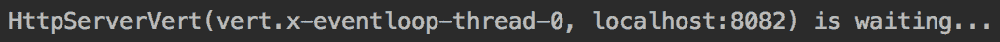
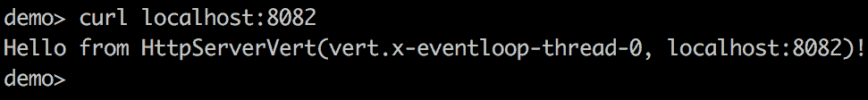
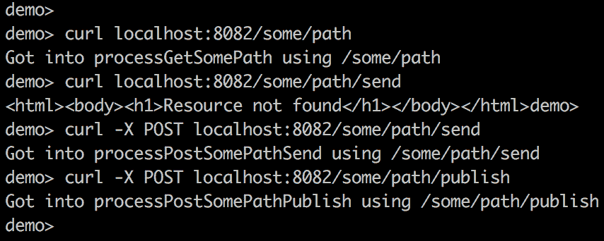
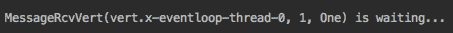
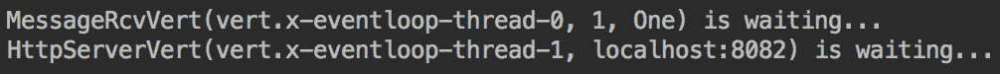
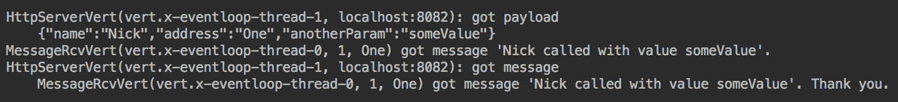
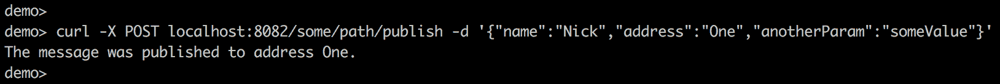
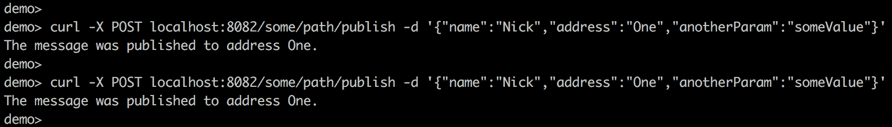
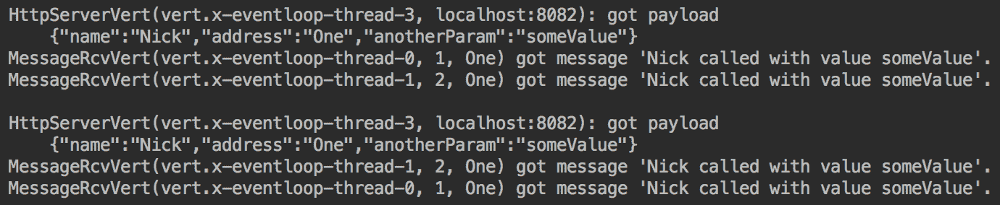

# 微服务

在本章中，您将了解什么是微服务，它们与其他架构样式的区别，以及现有的微服务框架如何支持消息驱动架构。我们还将帮助您决定微服务的大小，并讨论服务大小是否对将其标识为微服务起到任何作用。在本章结束时，您将了解如何构建微服务，并将它们用作创建反应式系统的基础组件。我们将通过使用 Vert.x 工具箱构建的小型反应式系统的详细代码演示来支持讨论。

本章将讨论以下主题：

*   什么是微服务？
*   微型服务的大小
*   微服务之间的通信方式
*   微服务反应系统的一个例子

# 什么是微服务？

随着处理负载的不断增加，解决这个问题的传统方法是添加更多具有相同部署的`.ear`或`.war`文件的服务器，然后将它们连接到一个集群中。这样，故障服务器可以自动替换为另一个服务器，系统性能不会下降。支持所有集群服务器的数据库通常也是集群的

然而，增加集群服务器的数量对于可伸缩性来说是一个过于粗粒度的解决方案，特别是当处理瓶颈仅局限于应用程序中运行的许多过程中的一个时。想象一下，一个特定的 CPU 或 I/O 密集型进程会降低整个应用程序的速度；添加另一个服务器只是为了缓解应用程序的一个部分的问题，可能会带来太多的开销

减少开销的一种方法是将应用程序分为三层：前端（或 Web 层）、中间层（或应用层）和后端（或后端层）。每一层都可以使用自己的服务器集群独立部署，这样每一层都可以水平增长并保持独立于其他层。这样的解决方案使得可伸缩性更加灵活；然而，与此同时，这使得部署过程复杂化，因为需要处理更多的可部署单元。

另一种保证每一层顺利部署的方法是一次在一台服务器上部署新代码，特别是在设计和实现新代码时考虑到了向后兼容性。这种方法对于前端和中间层都很好，但是对于后端可能没有那么顺利。此外，部署过程中的意外中断是由人为错误、代码缺陷、纯事故或所有这些因素的组合造成的，因此，很容易理解为什么很少有人期待在生产过程中部署一个主要版本。

然而，将应用程序划分为多个层可能仍然过于粗糙。在这种情况下，应用程序的一些关键部分，特别是那些需要比其他部分更大扩展性的部分，可以部署在它们自己的服务器集群中，并且只需向系统的其他部分提供*服务*。

事实上，**面向服务架构**（**SOA**）就是这样诞生的。当独立部署的服务不仅通过它们对可伸缩性的需求，而且通过它们中的代码更改的频率来确定时，增加可部署单元的数量所引起的复杂性被部分抵消。在设计过程中尽早识别这一点可以简化部署，因为与系统的其他部分相比，只有少数部分需要更频繁地更改和重新部署。不幸的是，预测未来的系统将如何演变并不容易。这就是为什么一个独立的部署单元通常被认为是一种预防措施，因为在设计阶段这样做比以后更容易。这反过来又导致可部署部队的规模不断缩小

不幸的是，维护和协调一个松散的服务系统是要付出代价的。每个参与者都必须负责维护其 API，不仅在形式上（比如名称和类型），而且在精神上：相同服务的新版本产生的结果在规模上必须相同。在类型上保持相同的值，然后在规模上使其变大或变小，这对于服务的客户来说可能是不可接受的。因此，尽管声明了独立性，但服务作者必须更清楚他们的客户是谁，他们的需求是什么

幸运的是，将应用程序拆分为可独立部署的单元带来了一些意想不到的好处，这些好处增加了将系统拆分为更小服务的动机。物理隔离允许在选择编程语言和实现平台时具有更大的灵活性。它还可以帮助您选择最适合该工作的技术，并聘请能够实施该技术的专家。这样，您就不必受为系统其他部分所做的技术选择的约束。这也有助于招聘人员在寻找必要人才时更加灵活，这是一个很大的优势，因为对工作的需求继续超过流入就业市场的专家。

每一个独立的部分（服务）都能够以自己的速度发展，并且变得更加复杂，只要与系统其他部分的契约没有改变或者以一种协调良好的方式引入。微服务就是这样产生的，后来被 Netflix、Google、Twitter、eBay、Amazon 和 Uber 等数据处理巨头投入使用。现在让我们谈谈这项努力的结果和经验教训。

# 微型服务的大小

*微服务必须有多小？* 对于这个问题没有一个普遍的答案，一般共识与微服务的以下特征一致（没有特定顺序）：

*   源代码的大小应该小于 SOA 架构中服务的大小。
*   一个开发团队应该能够支持多个微服务，团队的规模应该是两个比萨饼足够为整个团队提供午餐。
*   它必须是可部署的，并且独立于其他微服务，假设契约（即 API）没有变化。
*   每个微服务都必须有自己的数据库（或模式，或至少是一组表）–尽管这是一个有争议的话题，特别是在多个微服务能够修改同一个数据集的情况下；如果同一个团队维护所有这些数据集，那么在同时修改同一数据时更容易避免冲突。
*   它必须是无状态且幂等的；如果微服务的一个实例失败了，那么另一个实例应该能够完成失败的微服务所期望的。
*   它应该提供一种检查其*健康状况*的方法，证明服务已启动并正在运行，拥有所有必要的资源，并且准备好执行该工作

在设计过程、开发和部署后需要考虑资源共享，并在从不同过程访问同一资源时对干扰程度（例如阻塞）假设的验证进行监控。在修改同一持久性数据的过程中也需要特别小心，无论是在数据库、模式之间共享，还是在同一模式中的表之间共享。如果*最终的一致性*是可接受的（这通常是用于统计目的的较大数据集的情况），则需要采取特殊措施。但是，对事务完整性的需求常常带来一个难题。

支持跨多个微服务的事务的一种方法是创建一个充当**分布式事务管理器**（**DTM**）角色的服务。通过这种方式，其他服务可以将数据修改请求传递给它。DTM 服务可以将并发修改的数据保存在自己的数据库表中，只有在数据变得一致后，才能在一个事务中将结果移动到目标表中。例如，只有当相应的金额被另一个微服务添加到分类账时，一个微服务才能将钱添加到一个账户。

如果访问数据所花费的时间是一个问题，或者如果您需要保护数据库不受过多并发连接的影响，那么将数据库专用于微服务可能是一个解决方案。或者，内存缓存可能是一种方法。添加一个提供对缓存的访问的服务会增加服务的隔离，但是需要在管理同一缓存的对等方之间进行同步（这有时很困难）。

在回顾了所有列出的要点和可能的解决方案之后，每个微服务的大小应该取决于这些考虑的结果，而不是作为强加给所有服务的大小的空白声明。这有助于避免毫无成效的讨论，并产生一个适合于解决特定项目及其需求的结果

# 微服务之间的通信方式

目前有十多种框架用于构建微服务。最流行的两种是 [SpringBoot](https://spring.io/projects/spring-boot)和 [MicroFile](https://microprofile.io)，其目标是优化基于微服务架构的企业 Java。轻量级开源微服务框架，[KumuluzEE](https://ee.kumuluz.com) 符合 MicroFile。

以下是其他框架的列表（按字母顺序排列）：

*   **Akka**：这是一个为 Java 和 Scala 构建高度并发、分布式和弹性的消息驱动应用程序的工具箱（`akka.io`。
*   **Bootique**：这是一个针对可运行 Java 应用程序的最低限度的固执己见的框架（`bootique.io`。
*   **Dropwizard**：这是一个 Java 框架，用于开发操作友好、高性能和 RESTful Web 服务（[www.dropwizard.io](https://www.dropwizard.io/1.3.9/docs/)）。
*   **Jodd**：这是一套 1.7MB 以下的 Java 微框架、工具和实用程序（[jodd.org 网站](https://jodd.org/)）。
*   **Lightbend Lagom**：这是一个基于 Akka 和 Play（[的固执己见的微服务框架 www.lightbend.com](https://www.lightbend.com/)）。
*   **Ninja**：这是一个 [Java 的全栈框架](https://www.ninjaframework.org/)。
*   **Spotify-Apollo**：这是 Spotify 用来编写微服务的一组 Java 库（Spotify/Apollo）。
*   **Vert.x**：这是一个在 JVM（`vertx.io`上构建反应式应用程序的工具箱。

所有这些框架都支持微服务之间基于 REST 的通信；其中一些还具有发送消息的附加方式

为了演示与传统通信方法相比的替代方法，我们将使用 Vert.x，它是一个事件驱动的非阻塞轻量级多语言工具包。它允许您用 Java、JavaScript、Groovy、Ruby、Scala、Kotlin 和 Ceylon 编写组件。它支持一个异步编程模型和一个分布式事件总线，可以访问浏览器内的 JavaScript，从而允许创建实时 Web 应用程序。但是，由于本书的重点，我们将只使用 Java。

Vert.xAPI 有两个源代码树：第一个源代码树以`io.vertx.core`开头，第二个源代码树以`io.vertx.rxjava.core`开头。第二个源树是`io.vertx.core`类的反应版本。事实上，无功源树是基于非无功源的，所以这两个源树并不是不兼容的。相反，除了非反应式实现还提供了反应式版本。因为我们的讨论集中在反应式编程上，所以我们将主要使用`io.vertx.rxjava`源代码树的类和接口，也称为 **RX 化的 Vert.xapi**。

首先，我们将向`pom.xml`文件添加以下依赖项，如下所示：

```java
<dependency>
   <groupId>io.vertx</groupId>
    <artifactId>vertx-web</artifactId>
    <version>3.6.3</version>
</dependency>
<dependency>
    <groupId>io.vertx</groupId>
    <artifactId>vertx-rx-java</artifactId>
    <version>3.6.3</version>
</dependency>
```

实现`io.vertx.core.Verticle`接口的类作为基于 Vert.x 的应用程序的构建块。`io.vertx.core.Verticle`接口有四个抽象方法：

```java
Vertx getVertx();
void init(Vertx var1, Context var2);
void start(Future<Void> var1) throws Exception;
void stop(Future<Void> var1) throws Exception;

```

为了使编码在实践中更容易，有一个抽象的`io.vertx.rxjava.core.AbstractVerticle`类实现了所有的方法，但是它们是空的，不做任何事情。它允许通过扩展`AbstractVerticle`类并只实现应用程序所需的`Verticle`接口的那些方法来创建垂直体。在大多数情况下，仅仅实现`start()`方法就足够了。

Vert.x 有自己的系统，通过事件总线交换消息（或事件）。通过使用`io.vertx.rxjava.core.eventBus.EventBus`类的`rxSend(String address, Object msg)`方法，任何垂直体都可以向任何地址发送消息（只是一个字符串）：

```java
Single<Message<String>> reply = vertx.eventBus().rxSend(address, msg);

```

`vertx`对象（它是`AbstractVerticle`的受保护属性，可用于每个垂直方向）允许访问事件总线和`rxSend()`调用方法。`Single<Message<String>>`返回值表示响应消息可以返回的回复；您可以订阅它，或者以任何其他方式处理它。

verticle 还可以注册为特定地址的消息接收器（使用者）：

```java
vertx.eventBus().consumer(address);
```

如果多个 verticle 注册为同一地址的消费者，那么`rxSend()`方法使用循环算法只将消息传递给这些消费者中的一个。

或者，`publish()`方法可用于向使用相同地址注册的所有消费者传递消息：

```java
EventBus eb = vertx.eventBus().publish(address, msg);
```

返回的对象是`EventBus`对象，它允许您在必要时添加其他`EventBus`方法调用。

如您所记得的，消息驱动异步处理是由微服务组成的反应系统的弹性、响应性和弹性的基础。因此，在下一节中，我们将演示如何构建一个既使用基于 REST 的通信又使用基于 Vert.x`EventBus`的消息的反应式系统。

# 微服务的反应系统

为了演示如果使用 Vert.x 实现，微服务的反应式系统会是什么样子，我们将创建一个 HTTP 服务器，它可以接受系统中基于 REST 的请求，向另一个 verticle 发送基于`EventBus`的消息，接收回复，并将响应发送回原始请求。

为了演示这一切是如何工作的，我们还将编写一个程序，向系统生成 HTTP 请求，并允许您从外部测试系统。

# HTTP 服务器

让我们假设进入反应式系统演示的入口点是一个 HTTP 调用。这意味着我们需要创建一个充当 HTTP 服务器的 verticle。Vert.x 使这变得非常简单；下面垂直线中的三行就可以做到这一点：

```java
HttpServer server = vertx.createHttpServer();
server.requestStream().toObservable()
      .subscribe(request -> request.response()
                .setStatusCode(200)
                .end("Hello from " + name + "!\n")
      );
server.rxListen(port).subscribe();
```

如您所见，创建的服务器监听指定的端口，并用 Hello…响应每个传入的请求。默认情况下，主机名为`localhost`。如有必要，可以使用相同方法的重载版本为主机指定另一个地址：

```java
server.rxListen(port, hostname).subscribe();
```

下面是我们创建的垂直体的完整代码：

```java
package com.packt.learnjava.ch16_microservices;
import io.vertx.core.Future;
import io.vertx.rxjava.core.AbstractVerticle;
import io.vertx.rxjava.core.http.HttpServer;
public class HttpServerVert extends AbstractVerticle {
    private int port;
    public HttpServerVert(int port) { this.port = port; }
    public void start(Future<Void> startFuture) {
        String name = this.getClass().getSimpleName() + 
                       "(" + Thread.currentThread().getName() + 
                                            ", localhost:" + port + ")";
        HttpServer server = vertx.createHttpServer();
        server.requestStream().toObservable()
              .subscribe(request -> request.response()
                        .setStatusCode(200)
                        .end("Hello from " + name + "!\n")
              );
        server.rxListen(port).subscribe();
        System.out.println(name + " is waiting...");
    }
}
```

我们可以使用以下代码部署此服务器：

```java
Vertx vertx = Vertx.vertx();
RxHelper.deployVerticle(vertx, new HttpServerVert(8082));
```

结果如下：



请注意，…is waiting…消息会立即出现，甚至在任何请求传入之前也会出现–这是此服务器的异步特性。`name`前缀被构造成包含类名、线程名、主机名和端口。注意，线程名称告诉我们服务器监听事件循环线程`0`。

现在我们可以使用`curl`命令向部署的服务器发出请求，响应如下：



如您所见，我们已经发出了 HTTP`GET`（默认）请求，并用预期的名称返回了预期的 Hello…消息

以下代码是`start()`方法的更现实版本：

```java
Router router = Router.router(vertx);
router.get("/some/path/:name/:address/:anotherParam")
      .handler(this::processGetSomePath);
router.post("/some/path/send")
      .handler(this::processPostSomePathSend);
router.post("/some/path/publish")
      .handler(this::processPostSomePathPublish);
vertx.createHttpServer()
     .requestHandler(router::handle)
     .rxListen(port)
     .subscribe();
System.out.println(name + " is waiting..."); 
```

现在我们使用`Router`类，根据 HTTP 方法（`GET`或`POST`和路径向不同的处理程序发送请求。它要求您向`pom.xml`文件添加以下依赖项：

```java
<dependency>
    <groupId>io.vertx</groupId>
    <artifactId>vertx-web</artifactId>
    <version>3.6.3</version>
</dependency>

```

第一条路由为`/some/path/:name/:address/:anotherParam`路径，包含三个参数（`name`、`address`、`anotherParam`）。HTTP 请求在`RoutingContext`对象内传递给以下处理程序：

```java
private void processGetSomePath(RoutingContext ctx){
    ctx.response()
       .setStatusCode(200)
       .end("Got into processGetSomePath using " + 
                                        ctx.normalisedPath() + "\n");
}
```

处理程序只返回一个 HTTP 代码`200`和一个硬编码消息，该消息设置在 HTTP 响应对象上，并由`response()`方法返回。在幕后，HTTP 响应对象来自 HTTP 请求。为了清晰起见，我们已经使处理程序的第一个实现变得简单。稍后，我们将以更现实的方式重新实现它们。

第二条路径为`/some/path/send`路径，处理程序如下：

```java
private void processPostSomePathSend(RoutingContext ctx){
    ctx.response()
       .setStatusCode(200)
       .end("Got into processPostSomePathSend using " + 
                                        ctx.normalisedPath() + "\n");

```

第三条路径为`/some/path/publish`路径，处理程序如下：

```java
private void processPostSomePathPublish(RoutingContext ctx){
    ctx.response()
       .setStatusCode(200)
       .end("Got into processPostSomePathPublish using " + 
                                        ctx.normalisedPath() + "\n");
}
```

如果我们再次部署服务器并发出 HTTP 请求以命中每个路由，我们将看到以下屏幕截图：



前面的屏幕截图说明了我们向第一个 HTTP`GET`请求发送了预期的消息，但在响应第二个 HTTP`GET`请求时未找到接收到的资源。这是因为我们的服务器中没有 HTTP`GET`请求的`/some/path/send`路由。然后，我们切换到 HTTP`POST`请求，并接收两个`POST`请求的预期消息。

从路径名可以猜到我们将使用`/some/path/send`路由发送`EventBus`消息，使用`/some/path/publish`路由发布`EventBus`消息，但是在实现相应的路由处理程序之前，我们先创建一个接收`EventBus`消息的垂直体。

# EventBus 消息接收器

消息接收器的实现非常简单：

```java
vertx.eventBus()
     .consumer(address)
     .toObservable()
     .subscribe(msgObj -> {
            String body = msgObj.body().toString();
            String msg = name + " got message '" + body + "'.";
            System.out.println(msg);
            String reply = msg + " Thank you.";
            msgObj.reply(reply);
     }, Throwable::printStackTrace );

```

可以通过`vertx`对象访问`EventBus`对象。`EventBus`类的`consumer(address)`方法允许您设置与此消息接收器关联的地址并返回`MessageConsumer<Object>`。然后我们将这个对象转换成`Observable`并订阅它，等待异步接收消息。`subscribe()`方法有几个重载版本。我们选择了一个接受两个函数的函数：第一个函数为每个发出的值（在我们的例子中，为每个接收到的消息）调用；第二个函数在管道中的任何地方抛出异常时调用（即，它的行为类似于包罗万象的`try...catch`块）。`MessageConsumer<Object>`类表示，原则上消息可以由任何类的对象表示。如您所见，我们决定发送一个字符串，所以我们将消息体转换为`String`。`MessageConsumer<Object>`类还有一个`reply(Object)`方法，允许您将消息发送回发送者。

消息接收垂直的完整实现如下：

```java
package com.packt.learnjava.ch16_microservices;
import io.vertx.core.Future;
import io.vertx.rxjava.core.AbstractVerticle;
public class MessageRcvVert extends AbstractVerticle {
    private String id, address;
    public MessageRcvVert(String id, String address) {
        this.id = id;
        this.address = address;
    }
    public void start(Future<Void> startFuture) {
        String name = this.getClass().getSimpleName() + 
                    "(" + Thread.currentThread().getName() + 
                                   ", " + id + ", " + address + ")";
        vertx.eventBus()
             .consumer(address)
             .toObservable()
             .subscribe(msgObj -> {
                    String body = msgObj.body().toString();
                    String msg = name + " got message '" + body + "'.";
                    System.out.println(msg);
                    String reply = msg + " Thank you.";
                    msgObj.reply(reply);
             }, Throwable::printStackTrace );
        System.out.println(name + " is waiting...");
    }
}
```

我们可以用部署`HttpServerVert`垂直的方式部署此眩晕：

```java
String address = "One";
Vertx vertx = Vertx.vertx();
RxHelper.deployVerticle(vertx, new MessageRcvVert("1", address));

```

如果运行此代码，将显示以下消息：



如您所见，到达并执行了`MessageRcvVert`的最后一行，而创建的管道和我们传递给它的操作符的函数正在等待消息的发送。所以，我们现在就开始吧。

# EventBus 消息发送者

正如我们所承诺的，我们现在将以更现实的方式重新实现`HttpServerVert`垂直面的处理程序。`GET`方法处理程序现在看起来像以下代码块：

```java
private void processGetSomePath(RoutingContext ctx){
    String caller = ctx.pathParam("name");
    String address = ctx.pathParam("address");
    String value = ctx.pathParam("anotherParam");
    System.out.println("\n" + name + ": " + caller + " called.");
    vertx.eventBus()
         .rxSend(address, caller + " called with value " + value)
         .toObservable()
         .subscribe(reply -> {
            System.out.println(name + 
                           ": got message\n    " + reply.body());
            ctx.response()
               .setStatusCode(200)
               .end(reply.body().toString() + "\n");
        }, Throwable::printStackTrace);
}
```

如您所见，`RoutingContext`类提供了`pathParam``()`方法，该方法从路径中提取参数（如果它们被标记为`:`，如我们的示例所示）。然后，我们再次使用`EventBus`对象向作为参数提供的地址异步发送消息。`subscribe()`方法使用提供的函数来处理来自消息接收器的应答，并将应答发送回原始请求到 HTTP 服务器。

现在让我们部署两个垂直点，`HttpServerVert`和`MessageRcvVert`垂直点：

```java
String address = "One";
Vertx vertx = Vertx.vertx();
RxHelper.deployVerticle(vertx, new MessageRcvVert("1", address));
RxHelper.deployVerticle(vertx, new HttpServerVert(8082));

```

运行上述代码时，屏幕显示以下消息：



请注意，每个 verticle 都在自己的线程上运行。现在我们可以使用`curl`命令提交 HTTP`GET`请求，结果如下：


这就是如何从我们的演示系统之外看待交互。在内部，我们还可以看到以下消息，这些消息允许我们跟踪我们的眩晕是如何相互作用和发送消息的：


结果与预期完全一致。

现在，`/some/path/send`路径的处理程序如下：

```java
private void processPostSomePathSend(RoutingContext ctx){
   ctx.request().bodyHandler(buffer -> {
       System.out.println("\n" + name + ": got payload\n    " + buffer);
       JsonObject payload = new JsonObject(buffer.toString());
       String caller = payload.getString("name");
       String address = payload.getString("address");
       String value = payload.getString("anotherParam");
       vertx.eventBus()
            .rxSend(address, caller + " called with value " + value)
            .toObservable()
            .subscribe(reply -> {
                System.out.println(name + 
                                  ": got message\n    " + reply.body());
                ctx.response()
                   .setStatusCode(200)
                   .end(reply.body().toString() + "\n");
            }, Throwable::printStackTrace);
   });
}
```

对于 HTTP`POST`请求，我们希望发送 JSON 格式的有效负载，其值与我们作为 HTTP`GET`请求的参数发送的值相同。该方法的其余部分与`processGetSomePath()`实现非常相似。让我们再次部署`HttpServerVert`和`MessageRcvVert`verticles，然后用有效负载发出 HTTP`POST`请求，结果如下：


这看起来与设计的 HTTP`GET`请求的结果一模一样。在后端，将显示以下消息：



这些消息中也没有什么新内容，只是显示了 JSON 格式。

最后，我们来看一下`/some/path/publish`路径的 HTTP`POST`请求的处理程序：

```java
private void processPostSomePathPublish(RoutingContext ctx){
   ctx.request().bodyHandler(buffer -> {
       System.out.println("\n" + name + ": got payload\n    " + buffer);
       JsonObject payload = new JsonObject(buffer.toString());
       String caller = payload.getString("name");
       String address = payload.getString("address");
       String value = payload.getString("anotherParam");
       vertx.eventBus()
            .publish(address, caller + " called with value " + value);
       ctx.response()
          .setStatusCode(202)
          .end("The message was published to address " + 
                                                     address + ".\n");
    });
}
```

这一次，我们使用了`publish()`方法来发送消息。请注意，此方法无法接收答复。这是因为，正如我们已经提到的，`publish()`方法将消息发送给所有注册到此地址的接收器。如果我们使用`/some/path/publish`路径发出一个 HTTP`POST`请求，结果看起来略有不同：



此外，后端上的消息看起来也不同：


所有这些差异都与服务器无法获得回复这一事实有关，即使接收方发送回复的方式与响应由`rxSend()`方法发送的消息的方式完全相同。

在下一节中，我们将部署几个发送者和接收器的实例，并通过`rxSend()`和`publish()`方法检查消息分布之间的差异。

# 反应系统演示

现在，让我们使用上一节中创建的 verticles 来组装和部署一个小型反应式系统：

```java
package com.packt.learnjava.ch16_microservices;
import io.vertx.rxjava.core.RxHelper;
import io.vertx.rxjava.core.Vertx;
public class ReactiveSystemDemo {
   public static void main(String... args) {
      String address = "One";
      Vertx vertx = Vertx.vertx();
      RxHelper.deployVerticle(vertx, new MessageRcvVert("1", address));
      RxHelper.deployVerticle(vertx, new MessageRcvVert("2", address));
      RxHelper.deployVerticle(vertx, new MessageRcvVert("3", "Two"));
      RxHelper.deployVerticle(vertx, new HttpServerVert(8082));
   }
}
```

如您所见，我们将部署两个使用相同的`One`地址接收消息的 verticle 和一个使用`Two`地址的 verticle。如果我们运行上述程序，屏幕将显示以下消息：


现在开始向系统发送 HTTP 请求。首先，我们发送三次相同的 HTTP`GET`请求：


如前所述，如果有多个注册在同一地址的垂直站点，`rxSend()`方法使用循环算法来选择应该接收下一条消息的垂直站点。第一个请求通过`ID="1"`发送给接收器，第二个请求通过`ID="2"`发送给接收器，第三个请求再次通过`ID="1"`发送给接收器。

我们使用对`/some/path/send`路径的 HTTP`POST`请求得到相同的结果：


同样，使用循环算法旋转消息的接收器。

现在，让我们向系统发布两次消息：



由于接收方的回复无法传播回系统用户，因此我们需要查看登录到后端的消息：



如您所见，`publish()`方法将消息发送到注册到指定地址的所有 verticle。注意，带有`ID="3"`（注册为`Two`地址）的 verticle 从未收到消息。

在我们结束这个被动系统演示之前，值得一提的是，Vert.x 允许您轻松地对 verticle 进行集群。您可以在 [Vert.x 文档](https://vertx.io/docs/vertx-core/java)中阅读此功能。

# 摘要

本章向读者介绍了微服务的概念，以及如何使用微服务创建反应式系统。我们讨论了应用程序大小的重要性，以及它如何影响您将其转换为微服务的决策。您还了解了现有的微服务框架如何支持消息驱动架构，并有机会在实践中使用其中的一个工具 Vert.x 工具包。

在下一章中，我们将探讨 **Java 微基准线束**（**JMH**）项目，它允许您测量代码性能和其他参数。我们将定义什么是 JMH，如何创建和运行基准，基准参数是什么，以及支持的 IDE 插件。

# 测验

1.  选择所有正确的语句：

2.  微服务能比一些单一应用程序更大吗？ 
3.  微服务如何相互通信？
4.  列举两个为支持微服务而创建的框架。
5.  Vert.x 中微服务的主要构建块是什么？
6.  Vert.x 中的`send`和`publish`事件总线消息有什么区别？
7.  事件总线的`send`方法如何决定在 Vert.x 中发送消息的接收器？
8.  Vert.x verticles 可以集群吗？
9.  在哪里可以找到有关 Vert.x 的更多信息？