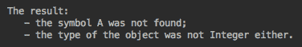

# Java 新特性

在本章中，读者将了解当前最重要的项目，这些项目将为 Java 添加新特性并在其他方面增强它。阅读本章之后，读者将了解如何遵循 Java 开发，并将设想未来 Java 发行版的路线图。如果需要，读者也可以成为 JDK 源代码贡献者。

本章将讨论以下主题：

*   Java 继续发展
*   Panama项目
*   Valhalla项目
*   Amber项目
*   Loom项目
*   Skara项目

# Java 继续发展

这对任何 Java 开发人员来说都是最好的消息：Java 得到了积极的支持，并不断得到增强，以跟上行业的最新需求。这意味着，无论你听到什么关于其他语言和最新技术的消息，你都会很快得到添加到 Java 中的最佳特性和功能。每半年发布一次新的时间表，你可以放心，新增加的内容一旦证明是有用和实用的，就会发布

在考虑设计一个新的应用或新的功能以添加到现有的应用时，了解 Java 在不久的将来如何增强是很重要的。这些知识可以帮助您设计新代码，使之更容易适应新的 Java 函数，并使您的应用更简单、更强大。对于一个主流程序员来说，遵循所有的 **JDK 增强建议**（**JEP**）可能是不切实际的，因为必须遵循太多不同的讨论和开发线程。相比之下，掌握您感兴趣的领域中的一个 Java 增强项目要容易得多。你甚至可以尝试作为某一领域的专家或只是作为感兴趣的一方为这样的项目做出贡献。

在本章中，我们将回顾我们认为最重要的五个 Java 增强项目：

*   **Panama 项目**：关注与非 Java 库的互操作性
*   **Valhalla 项目**：围绕引入新的值类型和相关的泛型增强而构思
*   **Amber 项目**：包括 Java 语言扩展的各种工作，包括数据类、模式匹配、原始字符串文本、简明方法体和 Lambda 增强，这些都是最重要的子项目
*   **Loom 项目**：解决了名为**纤程**的轻量级线程的创建问题，并简化了异步编码

# Panama项目

在整本书中，我们建议使用各种 Java 库—标准的 **Java 类库**（**JCL**）和外部 Java 库，这些库有助于提高代码质量并缩短开发时间。但是应用也可能需要非 Java 外部库。近年来，随着人们对使用机器学习算法进行数据处理的需求不断增长，这种需求也随之增加。例如，将这些算法移植到 Java 并不总是能跟上人脸识别、视频中人类行为分类和跟踪摄像机运动等领域的最新成果。

现有的利用不同语言编写的库的机制是 **Java 本机接口**（**JNI**）、**Java 本机访问**（**JNA**）和 **Java 本机运行时**（**JNR**）。尽管有这些功能，访问本机代码（为特定平台编译的其他语言的代码）并不像使用 Java 库那么容易。此外，它限制了 **Java 虚拟机**（**JVM**）的代码优化，经常需要用 C 语言编写代码

[**Panama** 项目](https://openjdk.java.net/projects/panama)为了解决这些问题，包括 C++ 功能的支持。作者使用的术语是**外部库**。这个术语包括所有其他语言的库。新方法背后的思想是使用一个名为 **jextract** 的工具将本机头翻译成相应的 Java 接口。生成的接口允许直接访问本机方法和数据结构，而无需编写 C 代码。

毫不奇怪，支持类计划存储在`java.foreign`包中。

在撰写本文时（2019 年 3 月），Panama早期的 access 构建基于不完整的 Java13 版本，面向专家用户。预计它可以将为本机库创建 Java 绑定的工作量减少 90%，生成的代码的执行速度至少是 JNI 的四到五倍。

# Valhalla项目

[**Valhalla 项目**](https://openjdk.java.net/projects/valhalla)源于这样一个事实，即自从 Java 在大约 25 年前首次引入以来，硬件已经发生了变化，当时做出的决定在今天会有不同的结果。例如，从内存获取值的操作和算术操作在性能时间方面产生的成本大致相同。如今，情况发生了变化。内存访问比算术运算长 200 到 1000 倍。这意味着涉及原始类型的操作要比基于它们的包装类型的操作便宜得多。

当我们使用两个基本类型做一些事情时，我们获取值并在操作中使用它们。当我们对包装器类型执行相同的操作时，我们首先使用引用来访问对象（相对于 20 年前的操作本身，对象现在要长得多），只有这样我们才能获取值。这就是为什么 Valhalla 项目试图为引用类型引入一个新的**值**类型，它提供了对值的访问，而无需使用引用，就像原始类型通过值可用一样。

它还将节省内存消耗和包装数组的效率。现在，每个元素将由一个值表示，而不是由引用表示。

这样的解决方案从逻辑上引出了泛型问题。今天，泛型只能用于包装类型。我们可以写`List<Integer>`，但不能写`List<int>`。这也是Valhalla项目准备解决的问题。它将扩展泛型类型，以支持泛型类和接口在原始类型上的特化。扩展也允许在泛型中使用原始类型。

# Amber项目

[**Amber 项目**](https://openjdk.java.net/projects/amber)专注于小型 Java 语法增强，使其更具表现力、简洁性和简单性。这些改进将提高 Java 程序员的工作效率，并使他们的代码编写更加愉快

Amber 项目创建的两个 Java 特性已经交付，我们讨论了它们：

*   类型保持架`var`（参见第 1 章、“Java12 入门”）从 Java10 开始使用。
*   Java11 中增加了 Lambda 参数的局部变量语法（参见第 13 章、“函数式编程”。
*   不太详细的`switch`语句（参见第 1 章、“Java12 入门”）是作为 Java12 的预览特性引入的。

未来的 Java 版本还将发布其他新特性。在下面的小节中，我们将只仔细研究其中的五个：

*   数据类
*   图案匹配
*   生字符串
*   简明方法体
*   Lambda 表达式

# 数据类

有些类只携带数据。它们的目的是将几个值放在一起，而不是其他值。例如：

```
public class Person {
    public int age;
    public String firstName, lastName;

    public Person(int age, String firstName, String lastName) {
        this.age = age;
        this.lastName = lastName;
        this.firstName = firstName;
    }
}
```

它们还可能包括`equals()`、`hashCode()`和`toString()`方法的标准集，如果是这样的话，为什么还要为这些方法编写实现呢？它们可以自动生成—就像您的 IDE 现在可以这样做一样。这就是名为**数据类**的新实体背后的思想，可以简单地定义如下：

```
record Person(int age, String firstName, String lastName) {}
```

默认情况下，其余的将假定为存在

但是，[正如 Brian Goetz 所写](https://cr.openjdk.java.net/~briangoetz/amber/datum.html)，问题来了：

“它们是可扩展的吗？字段是可变的吗？我可以控制生成的方法的行为或字段的可访问性吗？我可以添加其他字段和构造函数吗？”

——布莱恩·戈茨

正是在这种情况下，这一思想的当前状态正处于试图限制范围，并仍然为语言提供价值的中间阶段。

敬请关注

# 模式匹配

几乎每个程序员都会时不时地遇到需要根据值的类型切换到不同的值处理的情况。例如：

```
SomeClass someObj = new SomeClass();
Object value = someOtherObject.getValue("someKey");
if (value instanceof BigDecimal) {
    BigDecimal v = (BigDecimal) value;
    BigDecimal vAbs = v.abs();
    ...
} else if (value instanceof Boolean) {
    Boolean v = (Boolean)value;
    boolean v1 = v.booleanValue();
    ...
} else if (value instanceof String) {
    String v = (String) value;
    String s = v.substring(3);
    ...
}
...
```

在编写这样的代码时，您很快就会感到厌烦。这就是模式匹配要解决的问题。实现该功能后，可以将前面的代码示例更改为如下所示：

```
SomeClass someObj = new SomeClass();
Object value = someOtherObject.getValue("someKey");
if (value instanceof BigDecimal v) {
    BigDecimal vAbs = v.abs();
    ...
} else if (value instanceof Boolean v) {
    boolean v1 = v.booleanValue();
    ...
} else if (value instanceof String v) {
    String s = v.substring(3);
    ...
}
...
```

很好，不是吗？它还将支持内联版本，如以下版本：

```
if (value instanceof String v && v.length() > 4) {
    String s = v.substring(3);
    ...
}
```

这个新的语法将首先在一个`if`语句中被允许，然后再添加到一个`switch`语句中。

# 原始字符串

偶尔，您可能希望缩进一个输出，因此它看起来像这样，例如：



要实现这一点，代码如下所示：

```
String s = "The result:\n" +
           "   - the symbol A was not found;\n" +
           "   - the type of the object was not Integer either.";
System.out.println(s); 
```

添加新的*原始字符串字面值*后，相同的代码可以更改为如下所示：

```
String s = `The result:
               - the symbol A was not found;
               - the type of the object was not Integer either.
           `;
System.out.println(s); 
```

这样，代码看起来就不那么杂乱，更容易编写。也可以使用`align()`方法将原始字符串文本与左边距对齐，使用`indent(int n)`方法设置缩进值，并使用`align(int indent)`方法设置对齐后的缩进值。

类似地，将字符串放在符号（```）内将允许我们避免使用转义指示符反斜杠（`\`）。例如，在执行命令时，当前代码可能包含以下行：

```
Runtime.getRuntime().exec("\"C:\\Program Files\\foo\" bar");

```

使用原始字符串字面值，可以将同一行更改为以下内容：

```
Runtime.getRuntime().exec(`"C:\Program Files\foo" bar`);

```

同样，它更容易写和读。

# 简明方法体

Lambda 表达式语法终止了这个特性的概念，它可以非常紧凑。例如：

```
Function<String, Integer> f = s -> s.length();
```

或者，使用方法引用，可以表示得更短：

```
Function<String, Integer> f = String::length;
```

这种方法的逻辑扩展是：为什么不对标准获取器应用相同的速记风格呢？看看这个方法：

```
String getFirstName() { return firstName; }
```

可以简单地缩短为以下形式：

```
String getFirstName() -> firstName;
```

或者，考虑该方法使用其他方法时的情况：

```
int getNameLength(String name) { return name.length(); }
```

也可以通过方法引用来缩短，如下所示：

```
int getNameLength(String name) = String::length;
```

但是，在撰写本文（2019 年 3 月）时，该提案仍处于早期阶段，在最终版本中，许多内容可以更改。

# Lambda 改进

Amber项目计划向 Lambda 表达式语法添加三个内容：

*   阴影局部变量
*   函数表达式的 Netter 消歧
*   使用下划线表示未使用的参数

# 使用下划线而不是参数名

在许多其他编程语言中，Lambda 表达式中的下划线（`_`表示未命名的参数。在 Java9 将下划线用作标识符定为非法之后，Amber项目计划在当前实现实际上不需要该参数的情况下将其用作 Lambda 参数。例如，看看这个函数：

```
BiFunction<Integer, String, String> f = (i, s) -> s.substring(3);
```

参数（`i`在函数体中没有使用，但是我们仍然提供标识符作为占位符

使用新的添加项，可以将其替换为下划线，从而避免使用标识符并指示从未使用参数：

```
BiFunction<Integer, String, String> f = (_, s) -> s.substring(3);
```

这样，就很难忽略一个输入值没有被使用的事实。

# 隐藏局部变量

目前，不可能为 Lambda 表达式的参数指定与在本地上下文中用作标识符的名称相同的名称。例如：

```
int i = 42;
//some other code
BiFunction<Integer, String, String> f = (i, s) -> s.substring(3); //error

```

在将来的版本中，这样的名称重用是可能的。

# 更好地消除函数表达式的歧义

在撰写本文时，可以按如下方式重载方法：

```
void method(Function<String, String> fss){
    //do something
}
void method(Predicate<String> predicate){
    //do something
}
```

但是，只能通过显式定义传入函数的类型来使用它：

```
Predicate<String> pred = s -> s.contains("a");
method(pred);

```

尝试将其与内联 Lambda 表达式一起使用将失败：

```
method(s -> s.contains("a"));   // compilation error
```

编译器抱怨，因为它无法解决一个歧义，因为两个函数都有一个相同类型的输入参数，并且只有在涉及到`return`类型时才不同。

Amber 项目可能会解决这个问题，但是最终的决定还没有做出，因为这取决于这个建议对编译器实现的影响

# Loom项目

[**Loom**](https://openjdk.java.net/projects/loom) 可能是本章中列出的能够提升 Java 能力的最重要的项目。从大约 25 年前的早期开始，Java 就提供了一个相对简单的多线程模型和一个定义良好的同步机制。我们在第 8 章、“多线程和并发处理”中进行了描述。这种简单性，以及 Java 的整体简单性和安全性，是 Java 成功的主要因素之一。Java Servlet 允许处理许多并发请求，并且是基于 Java 的 HTTP 服务器的基础。

Java 中的线程是基于 OS 内核线程的，这是一个通用线程。但是内核操作系统线程也被设计用来执行许多不同的系统任务。它使得这样的线程对于特定应用的业务需求来说过于繁重（需要太多的资源）。满足应用接收的请求所需的实际业务操作通常不需要所有线程功能。这意味着当前的线程模型限制了应用的能力。为了估计这个限制有多强，我们可以观察到，现在的 HTTP 服务器可以处理超过一百万个并发打开的套接字，而 JVM 不能处理超过几千个。

这就是引入异步处理的动机，尽量少地使用线程，而引入轻量级处理工作者。我们在第 15 章、“反应式编程”和第 16 章、“微服务”中讨论过。异步处理模型工作得很好，但是它的编程并不像其他 Java 编程那样简单。它还需要大量的工作来与基于线程的遗留代码集成，甚至需要更多的工作来迁移遗留代码以采用新模型

添加这样的复杂性使得 Java 不像以前那么容易学习，而 Loom 项目将通过使 Java 更加轻量级来重新使用 Java 并发处理的简单性。

该项目计划向 Java 添加一个新类`Fiber`，以支持由 JVM 管理的轻量级线程构造。纤程占用的资源要少得多。它们也几乎没有或几乎没有上下文切换的开销，当一个线程挂起时，另一个线程必须启动或继续它自己的由于 CPU 时间共享或类似原因而挂起的作业。当前线程的上下文切换是性能受限的主要原因之一。

为了让您了解与线相比，纤程有多轻，织机开发商罗恩·普雷斯勒（Ron Pressler）和艾伦·贝特曼（Alan Bateman）[提供了以下数字](http://cr.openjdk.java.net/~rpressler/loom/JVMLS2018.pdf)：

*   **线程**：
    *   通常为栈保留 1 MB+16 KB 的内核数据结构
    *   每个启动线程约 2300 字节，包括**虚拟机**（**VM**）元数据
*   **纤程**：
    *   延续栈：数百字节到 KBs
    *   当前原型中每根纤程 200-240 字节

如您所见，我们希望并行处理的性能会有显著的改进。

术语**延续**并不新鲜。在*纤程*之前使用。它表示*一个顺序执行的指令序列，可以挂起自身*。并发处理器的另一部分是**调度器**，它将延续分配给 CPU 核心，将暂停的一个替换为准备运行的另一个，并确保准备恢复的延续最终将分配给 CPU 核心。当前的线程模型也有一个延续和一个调度程序，即使它们并不总是作为 API 公开。Loom 项目打算将延续和调度器分开，并在它们之上实现 Java 纤程。现有的`ForkJoinPool`可能会用作纤程

[您可以在项目提案](https://cr.openjdk.java.net/~rpressler/loom/Loom-Proposal.html)中阅读更多关于Loom项目动机和目标的信息，这对于任何 Java 开发人员来说都是一本相对简单且非常有启发性的读物。

# Skara项目

[**Skara**](http://openjdk.java.net/projects/skara) 没有向 Java 添加新特性。它的重点是改进对 JDK 的 Java 源代码的访问

现在要访问源代码，需要从 Mercurial 存储库下载并手动编译。Skara 项目的目标是将源代码迁移到 Git，因为 Git 现在是最流行的源代码存储库，而且许多程序员已经在使用它了。如您所知，本书中示例的源代码也存储在 GitHub 上

[你可以在 GitHub 中看到 Skara 项目的当前结果](https://github.com/Project-Skara/jdk)。它仍然使用 JDK Mercurial 存储库的镜像。但是，在未来，它将变得更加独立。

# 总结

在本章中，读者了解了增强 JDK 的当前最重要的项目。我们希望您能够理解如何遵循 Java 开发，并且已经设想了未来 Java 发行版的路线图 https://openjdk.java.net/projects）你也可以看看。我们还希望您对成为一名高效的 JDK 源代码贡献者和活跃的社区成员的前景感到足够的兴奋。欢迎光临！