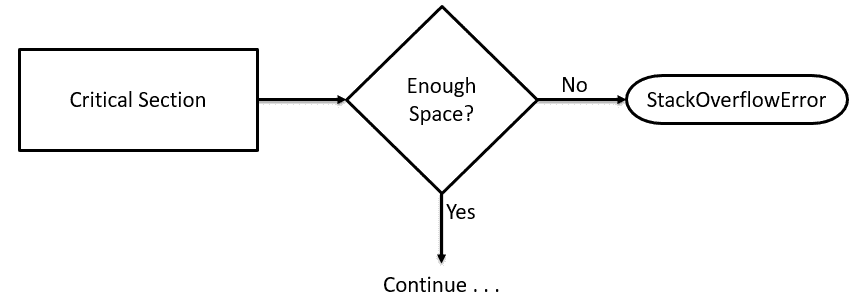
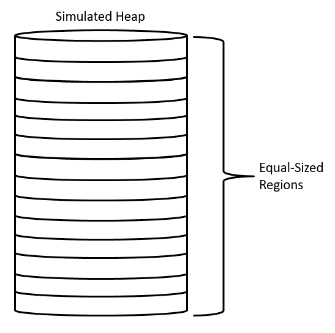

# 发现 Java11

在上一章中，我们探讨了新实现的 Java 平台基于时间的版本控制系统。我们还从高层次了解了 Java9、10 和 11 中引入的更改，这些更改分别称为 9、18.3 和 18.9 版本。Java9 最重要的变化是引入了基于 Jigsaw 项目的模块化，包括关注 Javashell、控制外部进程、垃圾收集、JHM 等的其他变化。介绍了 Java10 的主要特性，包括局部变量类型推断、JDK 合并、垃圾收集、应用程序**类数据共享**（**CDS**）、根证书等。Java11 中引入的更改包括动态类文件常量、垃圾收集、Lambda 的局部变量类型推断等等。

在本章中，我们将介绍几个引入 Java 平台的内部更改，包括来自 Java9、10 和 11 的更改。Java9 是 Java 平台的主要版本；Java10 和 11 是定时版本。总的来说，这些版本包含了大量的内部更改，为 Java 开发人员提供了一系列新的可能性，有些源于开发人员的请求，有些源于 Oracle 的增强

在本章中，我们将回顾 29 个最重要的变化。每个变更都与一个 **JDK 增强方案**（**JEP**）相关。JEP 索引并存放在[这个页面](http://openjdk.java.net/jeps/0)。您可以访问此链接以获取有关每个 JEP 的更多信息。

JEP 计划是 Oracle 支持开源、开放创新和开放标准的一部分。虽然可以找到其他开源 Java 项目，但 OpenJDK 是 Oracle 唯一支持的项目。

在本章中，我们将介绍以下内容：

*   改进的争用锁
*   分段码缓存
*   智能 Java 编译，第二阶段[JEP199]
*   解决 lint 和 doclint 警告[JEP212]
*   Javac 的分层属性[JEP215]
*   注释管道 2.0[JEP217]
*   新版本字符串方案
*   自动生成运行时编译器测试[JEP233]
*   测试 Javac[JEP235]生成的类文件属性
*   在 CD 档案中存储内部字符串[JEP250]
*   为模块化准备 JavaFXUI 控件和 CSS API[JEP253]
*   紧弦
*   将选定的 Xerces 2.11.0 更新合并到 JAXP[JEP255]
*   将 JavaFX/Media 更新为 GStreamer 的更新版本[JEP257]
*   HarfBuzz 字体布局引擎
*   Windows 和 Linux 上的 HiDPI 图形[JEP263]
*   马林图形渲染器
*   Unicode 8.0.0[JEP267 和 JEP314]
*   临界截面预留堆放区[JEP270]
*   语言定义对象模型的动态链接
*   G1 中大型物体的附加试验[JEP278]
*   改进测试故障排除
*   优化字符串串联
*   热点 C++ 单元测试框架[JEP281 ]
*   在 Linux 上启用 GTK3[JEP283]
*   新热点构建系统
*   将 JDF 林整合到单个存储库中[JEP296]

# 技术要求

本章及后续章节以 Java11 为特色，Java 平台的**标准版**（**SE**）可从 [Oracle 官方下载网站的链接](http://www.oracle.com/technetwork/java/javase/downloads/index.html)下载。

一个**集成开发环境**（**IDE**）软件包就足够了。来自 JetBrains 的 IntelliJ IDEA 用于与本章和后续章节相关的所有编码。IntelliJ IDEA 的社区版可从[网站](https://www.jetbrains.com/idea/features/)下载。

本章的源代码可以在 [GitHub 的 URL](https://github.com/PacktPublishing/Mastering-Java-11-Second-Edition)上找到。

# 改进的争用锁定

JVM 将堆空间用于类和对象。每当我们创建一个对象时，JVM 就会在堆上分配内存。这有助于促进 Java 的垃圾收集，垃圾收集释放以前用来保存不再有内存引用的对象的内存。Java 栈内存有点不同，通常比堆内存小得多

JVM 在管理由多个线程共享的数据区域方面做得很好。它将监视器与每个对象和类相关联；这些监视器具有在任何时候由单个线程控制的锁。这些由 JVM 控制的锁本质上是给控制线程对象的监视器？当一个线程在一个队列中等待一个当前被锁定的对象时，它就被认为是在争夺这个锁。下图显示了此争用的高级视图：


正如您在前面的图中所看到的，任何正在等待的线程在被释放之前都不能使用锁定的对象。

# 改进目标

JEP143 的总体目标是提高 JVM 如何在锁定的 Java 对象监视器上管理争用的总体性能。对争用锁定的改进都是 JVM 内部的，不需要任何开发人员操作就可以从中获益。总体改进目标与更快的操作相关。其中包括：

*   更快的监视器输入
*   更快的监视器退出
*   更快的通知

通知是当对象的锁定状态改变时调用的`notify()`和`notifyAll()`操作。测试这种改进并不是一件容易完成的事情。任何级别的更高的效率都是值得欢迎的，因此这一改进是值得我们感谢的。

# 分段代码缓存

Java 的分段代码缓存升级已经完成，结果是执行速度更快、效率更高。这一变化的核心是将代码缓存分割为三个不同的段：非方法段、概要代码段和非概要代码段。

代码缓存是 JVM 存储生成的本机代码的内存区域。

前面提到的每个代码缓存段都将保存特定类型的编译代码。如下图所示，代码堆区域按编译代码的类型进行分段：


# 内存分配

包含非方法代码的代码堆用于 JVM 内部代码，由 3MB 固定内存块组成。其余的代码缓存内存平均分配给已分析代码和未分析代码段。您可以通过命令行命令对此进行控制。

以下命令可用于定义非方法编译代码的代码堆大小：

```java
-XX:NonMethodCodeHeapSize
```

以下命令可用于定义已分析编译方法的代码堆大小：

```java
-XX:ProfiledCodeHeapSize
```

以下命令可用于定义非概要编译方法的代码堆大小：

```java
-XX:NonProfiledCodeHeapSize
```

这个特性当然可以提高 Java 应用程序的效率。它还会影响使用代码缓存的其他进程。

# 智能 Java 编译

所有 Java 开发人员都将熟悉将源代码编译成字节码的工具，JVM 使用它来运行 Java 程序。Smart Java compilation，也称为 Smart Javac 和`sjavac`，在`javac`进程周围添加了一个智能包装器。`sjavac`增加的核心改进可能是只重新编译必要的代码。在此上下文中，必要的代码是自上一个编译周期以来更改的代码。

如果开发人员只在小项目上工作，这种增强可能不会让他们感到兴奋。但是，考虑一下，当您不断地为中大型项目重新编译代码时，在效率方面的巨大收益。开发人员节省的时间足以让他们接受 JEP199。

这将如何改变编译代码的方式？它可能不会，至少现在不会，Javac 仍然是默认的编译器。尽管`sjavac`提供了增量构建的效率，但 Oracle 认为它没有足够的稳定性来成为标准编译工作流程的一部分。

# 解决 lint 和 doclint 警告

Lint 和 doclint 是向`javac`报告警告的来源。我们来看看每一个：

*   Lint 分析`javac`的字节码和源代码。lint 的目标是识别所分析代码中的安全漏洞。Lint 还可以深入了解可伸缩性和线程锁定问题。lint 还有更多的功能，其总体目的是节省开发人员的时间。

[您可以在这里阅读更多关于 lint 的信息](http://openjdk.java.net/jeps/212)。

*   Doclint 与 lint 类似，是针对`javadoc`的。lint 和 doclint 都报告编译过程中的错误和警告。这些警告的解决是 JEP212 的重点。使用核心库时，不应出现任何警告。这种思维方式导致了 JEP212，它已经在 Java9 中得到了解决和实现。

lint 和 doclint 警告的综合列表可以在 **JDK 错误系统**（**JBS**）中查看，可在[这个页面](https://bugs.openjdk.java.net)中获得。

# Javac 的分层属性

Javac 的类型检查已经简化了，让我们首先回顾一下 Java8 中的类型检查是如何工作的，然后我们将探讨现代 Java 平台中的变化。

在 Java8 中，poly 表达式的类型检查由推测属性工具处理

推测属性是一种类型检查方法，作为`javac`编译过程的一部分。它有很大的处理开销。

使用推测属性方法进行类型检查是准确的，但缺乏效率。这些检查包括参数位置，在递归、多态性、嵌套循环和 Lambda 表达式中进行测试时，速度会以指数级的速度减慢。因此，更新的目的是更改类型检查模式以创建更快的结果。结果本身并不是不准确的推测归因，他们只是没有迅速产生。

Java9-11 中提供的新方法使用了分层属性工具。此工具实现了一种分层方法，用于对所有方法调用的参数表达式进行类型检查。还为方法重写设置了权限。为了使此新架构正常工作，将为以下列出的每种类型的方法参数创建新的结构类型：

*   Lambda 表达式
*   多边形表达式
*   常规方法调用
*   方法引用
*   菱形实例创建表达式

对`javac`的修改比本节强调的更为复杂。对开发人员来说，除了效率更高和节省时间之外，没有什么直接的影响。

# 注释管道 2.0

Java 注释是指驻留在 Java 源代码文件中的一种特殊元数据。它们不会被`javac`剥离，因此它们可以在运行时对 JVM 保持可用。

注释看起来类似于 JavaDocs 引用，因为它们以`@`符号开头。注释有三种类型。让我们按如下方式检查每一项：

*   注释的最基本形式是标记注释。这些是独立的注释，唯一的组件是动画的名称。举个例子：

```java
@thisIsAMarkerAnnotation
public double computeSometing(double x, double y) {
     // do something and return a double
}
```

*   第二种类型的注释是包含一个值或一段数据的注释。正如您在下面的代码中所看到的，以`@`符号开头的注释后面是包含数据的圆括号：

```java
@thisIsAMarkerAnnotation (data="compute x and y coordinates")
public double computeSometing(double x, double y) {
     // do something and return a double
}
```

编码单值注释类型的另一种方法是省略`data=`组件，如以下代码所示：

```java
@thisIsAMarkerAnnotation ("compute x and y coordinates")
public double computeSometing(double x, double y) {
     // do something and return a double
}
```

*   第三种类型的注释是当有多个数据组件时。对于这种类型的注释，`data=`组件不能省略。举个例子：

```java
@thisIsAMarkerAnnotation (data="compute x and y coordinates", purpose="determine intersecting point")
public double computeSometing(double x, double y) {
     // do something and return a double
}
```

那么，Java9、10 和 11 中发生了什么变化？要回答这个问题，我们需要回顾一下 Java8 引入的几个影响 Java 注释的更改：

*   Lambda 表达式
*   重复注释
*   Java 类型注释

这些与 Java8 相关的更改影响了 Java 注释，但并没有改变`javac`处理它们的方式。有一些硬编码的解决方案允许`javac`处理新的注释，但它们效率不高。此外，这种类型的编码（硬编码解决方法）很难维护。

因此，JEP217 专注于重构`javac`注释管道。这种重构都是`javac`内部的，所以对开发人员来说应该不明显。

# 新版本字符串方案

在 Java9 之前，版本号没有遵循行业标准的版本控制语义版本控制。例如，最后四个 JDK8 版本如下：

*   Java SE 8 更新 144
*   Java SE 8 更新 151
*   Java SE 8 更新 152
*   Java SE 8 更新 161
*   Java SE 8 更新 162

**语义版本控制**使用主要、次要、补丁（`0.0.0`）模式，如下所示：

*   **主要**等同于不向后兼容的新 API 更改
*   **次要**是添加向后兼容的功能时
*   **补丁**是指错误修复或向后兼容的小改动

Oracle 从 Java9 开始就支持语义版本控制。对于 Java，Java 版本号的前三个元素将使用主次安全模式：

*   **主要**：由一组重要的新特性组成的主要版本
*   **次要**：向后兼容的修订和错误修复
*   **安全**：被认为是提高安全性的关键修复

Java9 有三个版本：初始版本和两个更新。下面列出的版本演示了主要的次要安全模式：

*   Java SE 9
*   Java SE 9.0.1 版
*   Java SE 9.0.4 版

如第 1 章、“Java11 场景”所述，在 Java9 之后的版本将遵循*的时间发布模式年月日*。使用该模式，Java9 之后的四个版本如下：

*   Java SE 18.3（2018 年 3 月）
*   Java SE 18.9（2018 年 9 月）
*   Java SE 19.3（2019 年 3 月）
*   Java SE 19.9（2019 年 9 月）

# 自动生成运行时编译器测试

Java 可以说是最常用的编程语言，并且驻留在越来越多样化的平台上。这加剧了以有效方式运行目标编译器测试的问题。新的 Java 平台包括一个自动化运行时编译器测试的工具。

这个新工具首先生成一组随机的 Java 源代码和/或字节码。生成的代码将具有三个关键特征：

*   它在语法上是正确的
*   它在语义上是正确的
*   它将使用一个随机种子，允许重用相同的随机生成的代码

随机生成的源代码将保存在以下目录中：

```java
hotspot/test/testlibrary/jit-tester
```

这些测试用例将被存储起来以供以后重用。它们可以从`j-treg`目录或工具的 makefile 运行。重新运行保存的测试的好处之一是测试系统的稳定性。

# 测试 Javac 生成的类文件属性

缺乏或不足以为类文件属性创建测试的能力是确保`javac`完全正确地创建类文件属性的动力。这表明，即使某些属性没有被类文件使用，所有类文件都应该生成一组完整的属性。还需要有一种方法来测试类文件是否根据文件的属性正确创建

在 Java9 之前，没有测试类文件属性的方法。运行类并测试代码以获得预期的或预期的结果是测试`javac`生成的类文件最常用的方法。这种技术无法通过测试来验证文件的属性。

JVM 使用的类文件属性有三类：可选属性和 JVM 不使用的属性。

JVM 使用的属性包括：

*   `BootstrapMethods`
*   `Code`
*   `ConstantValue`
*   `Exceptions`
*   `StackMapTable`

可选属性包括：

*   `Deprecated`
*   `LineNumberTable`
*   `LocalVariableTable`
*   `LocalVariableTypeTable`
*   `SourceDebugExtension`
*   `SourceFile`

JVM 未使用的属性包括：

*   `AnnotationDefault`
*   `EnclosingMethod`
*   ``InnerClasses``
*   `MethodParameters`
*   `RuntimeInvisibleAnnotations`
*   `RuntimeInvisibleParameterAnnotations`
*   `RuntimeInvisibleTypeAnnotations`
*   `RuntimeVisibleAnnotations`
*   `RuntimeVisibleParameterAnnotations`
*   `RuntimeVisibleTypeAnnotations`
*   `Signature`
*   `Synthetic`

# 在类数据共享档案中存储内部字符串

在 Java5 到 Java5 中，存储字符串并从 CDS 存档中访问字符串的方法效率低下，非常耗时，而且浪费了内存。下图说明了 Java 在 Java9 之前将内部字符串存储在 CD 存档中的方法：


低效率源于存储模式。当 CDS 工具将类转储到共享存档文件中时，这一点尤为明显。包含`CONSTANT_String`项的常量池具有 UTF-8 字符串表示。

UTF-8 是一种 8 位可变长度字符编码标准。

# 问题

在 Java9 之前使用 UTF-8 时，字符串必须转换为字符串对象，即`java.lang.String`类的实例。这种转换是按需进行的，这通常会导致系统速度变慢和不必要的内存使用。处理时间非常短，但内存使用过多。一个内部字符串中的每个字符都需要至少 3 个字节的内存，甚至更多。

一个相关的问题是，并非所有 JVM 进程都可以访问存储的字符串。

# Java9 解决方案

CDS 存档从 Java9 开始，在堆上为字符串分配特定的空间。该过程如下图所示：


使用共享字符串表、哈希表和重复数据消除映射字符串空间。

**数据去重**是一种数据压缩技术，可消除档案中的重复信息。

# Java10 的改进

Java9 引入了更高效的 cd，Java9 进一步改进了这个特性，特别是支持将应用程序类添加到共享存档中。JEP310 应用程序 cd 的目的不是为了使归档文件膨胀、启动时间变慢或消耗超过需要的内存。尽管如此，如果不对 CDS 采取有目的的方法，这些结果是可能的

我们对 CDS 存档使用三个步骤：确定要包含的类、创建存档和使用存档：

1.  阶级决定
2.  AppCD 存档创建
3.  使用 AppCD 存档

让我们检查一下每一步的细节。

# 阶级决定

使用 cd 的最佳实践是只归档所使用的类。这将有助于防止档案不必要地膨胀。我们可以使用以下命令行和标志来确定加载了哪些类：

```java
java -Xshare:off -XX:+UseAppCDS -XX:DumpLoadedClassList=ch2.lst - cp cp2.jar Chapter2
```

# AppCD 存档创建

一旦我们知道加载了哪些类，我们就可以创建 AppCDS 存档。以下是要使用的命令行和标志选项：

```java
java  -Xshare:dump -XX:+UseApsCDS \
 -XX:SharedClassListFile=ch2.lst \
 -XX:SharedArchiveFile=ch2.jsa -cp ch2.jar
```

# 使用 AppCD 存档

为了使用 AppCDS 存档，我们发出`-Xshare:on`命令行选项，如下所示：

```java
java -Xshare:on -XX:+UseAppCDS -XX:SharedArchiveFile=ch2.jsa -cp ch2.jar Chapter2
```

# 为模块化准备 javafxui 控件和级联样式表 API

JavaFX 是一组允许设计和开发富媒体图形用户界面的软件包。JavaFX 应用程序为开发人员提供了一个很好的 API，用于为应用程序创建一致的接口。**级联样式表**（**CSS**）可用于定制接口。JavaFX 的一个优点是编程和接口设计的任务可以很容易地分开。

# JavaFX 概述

JavaFX 包含一个很棒的可视化脚本工具 Scene Builder，它允许您使用拖放和属性设置来创建图形用户界面。场景生成器生成 IDE 使用的必要 FXML 文件，例如 NetBeans。

以下是使用场景生成器创建的示例 UI：


下面是场景生成器创建的 FXML 文件：

```java
<?xml version="1.0" encoding="UTF-8"?>
<?import java.lang.*?>
<?import java.util.*?>
<?import javafx.scene.control.*?>
<?import javafx.scene.layout.*?>
<?import javafx.scene.paint.*?>
<?import javafx.scene.text.*?>

<AnchorPane id="AnchorPane" maxHeight="-Infinity"
  maxWidth="-Infinity" minHeight="-Infinity"
  minWidth="-Infinity" prefHeight="400.0" prefWidth="600.0"
  xmlns:fx="http://javafx.com/fxml/1"
  >
  <children>
    <TitledPane animated="false" collapsible="false"
      layoutX="108.0" layoutY="49.0" text="Sample">
    <content>
      <AnchorPane id="Content" minHeight="0.0" minWidth="0.0"
        prefHeight="180.0" prefWidth="200.0">
      <children>
        <CheckBox layoutX="26.0" layoutY="33.0"
          mnemonicParsing="false" prefWidth="94.0"
          text="CheckBox" />
        <ColorPicker layoutX="26.0" layoutY="65.0" />
        <Hyperlink layoutX="26.0" layoutY="103.0"
          text="Hyperlink" />
        <Label alignment="CENTER" layoutX="14.0" layoutY="5.0"
          prefWidth="172.0" text="This is a Label"
          textAlignment="CENTER">
          <font>
            <Font size="14.0" />
          </font>
        </Label>
        <Button layoutX="81.0" layoutY="146.0"
          mnemonicParsing="false" text="Button" />
      </children>
      </AnchorPane>
    </content>
    </TitledPane>
  </children>
</AnchorPane>
```

# 对 Java9、10 和 11 的影响

在 Java9 之前，JavaFX 控件和 CSS 功能只能通过与内部 API 接口提供给开发人员。Java9 的模块化使得内部 API 无法访问。因此，创建 JEP253 是为了定义公共 API，而不是内部 API

这是一项比看上去更大的任务。以下是作为 JEP 一部分采取的一些行动：

*   将 JavaFX 控件皮肤从内部移动到公共 API（`javafx.scene.skin`）
*   确保 API 一致性
*   产生一个彻底的`javadoc`

以下类已从内部包移到公共`javafx.scene.control.skin`包：

| `AccordionSkin` | `ButtonBarSkin` | `ButtonSkin` | `CellSkinBase` |
| `CheckBoxSkin` | `ChoiceBoxSkin` | `ColorPickerSkin` | `ComboBoxBaseSkin` |
| `ComboBoxListViewSkin` | `ComboBoxPopupControl` | `ContextMenuSkin` | `DateCellSkin` |
| `DatePickerSkin` | `HpyerLinkSkin` | `LabelSkin` | `LabeledSkinBase` |
| `ListCellSkin` | `ListViewSkin` | `MenuBarSkin` | `MenuButtonSkin` |
| `MenuButtonSkinBase` | `NestedTableColumnHeader` | `PaginationSkin` | `ProgressBarSkin` |
| `ProgressIndicatorSkin` | `RadioButtonSkin` | `ScrollBarSkin` | `ScrollPanelSkin` |
| `SeparatorSkin` | `SliderSkin` | `SpinnerSkin` | `SplitMenuButtonSkin` |
| `SplitPaneSkin` | `TabPaneSkin` | `TableCellSkin` | `TableCellSkinBase` |
| `TableColumnHeader` | `TableHeaderRow` | `TableHeaderSkin` | `TabelRowSkinBase` |
| `TableViewSkin` | `TableViewSkinBase` | `TextAreaSkin` | `TextFieldSkin` |
| `TextInputControlSkin` | `TitledPaneSkin` | `ToggleButtonSkin` | `ToolBarSkin` |
| `TooltipSkin` | `TreeCellSkin` | `TreeTableCellSkin` | `TreeTableRowSkin` |
| `TreeTableViewSkin` | `TreeViewSkin` | `VirtualContainerBase` | `VirtualFlow` |

公共`javafx.css`包现在有以下附加类：

*   `CascadingStyle.java:public class CascadingStyle implements Comparable<CascadingStyle>`
*   `CompoundSelector.java:final public class CompoundSelector extends Selector`
*   `CssError.java:public class CssError`
*   `Declaration.java:final public class Declaration`
*   `Rule.java:final public class Rule`
*   `Selector.java:abstract public class Selector`
*   `SimpleSelector.java:final public class SimpleSelector extends Selector`
*   `Size.java:final public class Size`
*   `Style.java:final public class Style`
*   `Stylesheet.java:public class Stylesheet`
*   `CssParser.java:final public class CssParser`

# 压缩字符串

字符串数据类型几乎是每个 Java 应用程序的重要组成部分，在 Java9 之前，字符串数据存储为一个数组`chars`。这要求每个`char`有 16 位。确定大多数字符串对象只能用 8 位或 1 字节的存储空间来存储。这是因为大多数字符串都由拉丁 1 字符组成。

**拉丁 -1 字符**是指国际标准化组织建立的拉丁 -1 字符集。字符集由字符编码的单字节集组成。

从 Java9 开始，字符串现在在内部用一个`byte`数组表示，还有一个用于编码引用的标志字段。

# 将选定的 Xerces 2.11.0 更新合并到 JAXP 中

Xerces 是一个用于在 Java 中解析 XML 的库。它在 2010 年末被更新为 2.11.0，JAXP 也被更新为包含 xerces2.11.0 中的更改。

JAXP 是 Java 用于 XML 处理的 API。

在 Java9 之前，JDK 关于 XML 处理的最新更新是基于 Xerces2.7.1 的，JDK7 在 Xerces2.10.0 的基础上有一些额外的变化。Java 现在对基于 Xerces2.11.0 的 JAXP 进行了进一步的改进。

Xerces 2.11.0 支持以下标准：

*   XML 1.0，第四版
*   XML 1.0 中的名称空间，第二版
*   XML 1.1，第二版
*   XML 1.1 中的名称空间，第二版
*   XML 1.0，第二版
*   **文档对象模型**（**DOM**）：
*   3 级：
    *   核心
    *   加载并保存
*   2 级：
    *   核心
    *   事件

*   遍历和范围
*   元素遍历，第一版
*   XML 2.0.2 的简单 API
*   Java API for XML Processing（JAXP）1.4
*   XML 1.0 流 API
*   XML 架构 1.0
*   XML 模式 1.1
*   XML 模式定义语言

JDK 已更新为包括以下 Xerces 2.11.0 类别：

*   目录分解器
*   数据类型
*   文档对象模型级别 3
*   XML 架构验证
*   XPointer 公司

JAXP 的公共 API 在 Java9、10 或 11 中没有改变。

# 将 JavaFX/Media 更新为 GStreamer 的更新版本

JavaFX 用于创建桌面和 Web 应用程序。JavaFX 的创建是为了取代 Swing 成为 Java 的标准 GUI 库。`Media`类`javafx.scene.media.Media`用于实例化表示媒体资源的对象。JavaFX/`Media`表示如下类：

```java
public final class Media extends java.lang.Object
```

此类向媒体资源提供引用数据。`javafx.scene.media`包为开发人员提供了将媒体合并到 JavaFX 应用程序中的能力。JavaFX/`Media`使用 GStreamer 管道。

GStreamer 是一个多媒体处理框架，可用于构建系统，该系统接收多种不同格式的媒体，并在处理后以选定的格式导出它们。

对现代 Java 平台的更新确保了 JavaFX/Media 被更新为包括 GStreamer 的最新版本，以保证稳定性、性能和安全性。

# HarfBuzz 字体布局引擎

在 Java9 之前，布局引擎用于处理字体的复杂性，特别是那些具有超出常用拉丁字体的呈现行为的字体。Java 使用统一客户机接口（也称为 ICU）作为事实上的文本呈现工具。ICU 布局引擎已经贬值，在 Java9 中，已经被 HarfBuzz 字体布局引擎所取代。

HarfBuzz 是一个 OpenType 文本呈现引擎。这种类型的布局引擎的特点是提供脚本感知代码，以帮助确保文本按所需布局。

OpenType 是一个 HTML 格式的字体格式规范。

从 ICU 布局引擎向 HarfBuzz 字体布局引擎转变的动力是 IBM 决定停止支持 ICU 布局引擎。因此，JDK 被更新为包含 HarfBuzz 字体布局引擎。

# Windows 和 Linux 下的 HiDPI 图形

为了确保屏幕组件相对于显示器像素密度的清晰度，我们做出了一致的努力。以下术语与此工作相关，并随附所列描述性信息一起提供：

*   **DPI 感知应用**：一种能够根据显示器的特定像素密度检测和缩放图像的应用。
*   **DPI 非感知应用**：不尝试检测和缩放显示器特定像素密度的图像的应用程序。
*   **HiDPI 图形**：每英寸高点图形。
*   **视网膜显示器**：这个术语是由苹果公司创建的，指像素密度至少为每英寸 300 像素的显示器。向用户显示图形（包括图像和图形用户界面组件）通常是最重要的性能。以高质量显示此图像可能有些问题。计算机显示器 DPIs 的变化很大。开发显示器有三种基本方法：
*   开发应用程序时不考虑潜在的不同显示尺寸。换句话说，创建一个 DPI 应用程序。
*   开发一个支持 DPI 的应用程序，有选择地使用给定显示的预渲染图像大小。
*   开发一个支持 DPI 的应用程序，该应用程序可以根据运行应用程序的特定显示适当地上下缩放图像。

显然，前两种方法有问题，原因不同。对于第一种方法，不考虑用户体验。当然，如果应用程序是为一个没有预期像素密度变化的非常特定的显示而开发的，那么这种方法是可行的。

第二种方法需要在设计和开发端进行大量工作，以确保以编程方式创建和实现每个预期显示密度的图像。除了大量的工作之外，应用程序大小将不必要地增加，并且新的和不同的像素密度将不被考虑。

第三种方法是创建具有 DPI 意识的应用程序，该应用程序具有高效和有效的扩展功能。这种方法工作得很好，已经在 Mac 视网膜显示器上得到了验证

在 Java9 之前，MacOSX 已经在 Java 中实现了自动伸缩和调整大小。这个功能是在 Windows 和 Linux 操作系统的 Java9 中添加的。

# 马林图形渲染器

在 Java2dAPI 中，双鱼座图形光栅化器已经被 Marlin 图形渲染器所取代。此 API 用于绘制 2D 图形和动画。

我们的目标是用一个光栅化器/渲染器来代替双鱼座，这个光栅化器/渲染器效率更高，而且没有任何质量损失。这个目标是在 Java9 中实现的。一个预期的附带好处是包括一个开发人员可访问的 API。以前，与 AWT 和 Java2d 的接口是内部的。

# Unicode 8.0.0 标准

Unicode 8.0.0 于 2015 年 6 月 17 日发布。Java 的相关 API 已更新为支持 Unicode 8.0.0。

# Unicode 8.0.0 中的新功能

Unicode 8.0.0 增加了近 8000 个字符。以下是此次发布的亮点：

*   泰阿洪语的阿洪语脚本（印度）
*   阿尔维语，泰米尔语（阿拉伯语）
*   切罗基符号
*   中日韩统一象形文字
*   表情符号以及肉色符号修饰符
*   格鲁吉亚拉里货币符号
*   lk 语言（乌干达）
*   库兰戈语（科特迪瓦）

# 更新了 Java9 中的类

为了完全符合新的 Unicode 标准，更新了几个 Java 类。为使 Java9 符合新的 Unicode 标准，更新了以下列出的类：

*   `java.awt.font.NumericShaper`
*   `java.lang.Character`
*   `java.lang.String`
*   `java.text.Bidi`
*   `java.text.BreakIterator`
*   `java.text.Normalizer`

# 临界段预留堆放区

在执行关键部分期间，由栈溢出引起的问题得到了缓解。这种缓解措施的形式是保留额外的线程栈空间。

# Java9 之前的情况

当 JVM 被要求在栈空间不足且没有分配额外空间权限的线程中执行数据计算时，JVM 抛出`StackOverflowError`。这是一个异步异常。JVM 还可以在调用方法时同步抛出`StackOverflowError`异常。

调用方法时，将使用内部进程报告栈溢出。虽然当前模式足以报告错误，但调用应用程序没有空间轻松地从错误中恢复。这不仅会给开发者和用户带来麻烦。如果`StackOverflowError`是在关键的计算操作期间抛出的，则数据可能已损坏，从而导致其他问题。

虽然不是这些问题的唯一原因，`ReentrantLock`类的锁的有效状态是导致不良结果的常见原因。这个问题在 Java7 中很明显，因为`ConcurrentHashMap`代码实现了`ReentrantLock`类。为 Java8 修改了`ConcurrentHashMap`代码，但是`ReentrantLock`类的任何实现仍然存在问题。类似的问题不仅仅存在于`ReentrantLock`类的使用上。

下图概括介绍了`StackOverflowError`问题：



在下一节中，我们将看看 Java9 是如何解决这个问题的。

# Java9 中的新功能

随着现代 Java 平台的变化，一个关键的部分会自动地被赋予额外的空间，这样它就可以完成它的执行而不受`StackOverflowError`的影响，这是基于额外的空间分配需求很小。对 JVM 进行了必要的更改以允许此功能。

当关键部分正在执行时，JVM 实际上会延迟`StackOverflowError`，或者至少尝试延迟。为了利用这个新模式，必须用以下内容对方法进行注释：

```java
jdk.internal.vm.annotation.ReservedStackAccess
```

当一个方法有这个注释并且存在一个`StackOverflowError`条件时，就授予对保留内存空间的临时访问权。新流程在高抽象层次上呈现如下：


# 语言定义对象模型的动态链接

Java 互操作性得到了增强。对 JDK 进行了必要的更改，以允许来自多种语言的运行时链接器在单个 JVM 实例中共存。正如您所期望的那样，此更改适用于高级操作。相关高级操作的一个示例是使用诸如访问器和变异器之类的元素读取或写入属性。

高级操作适用于未知类型的对象。它们可以通过`INVOKEDYNAMIC`指令调用。下面是一个在编译时对象类型未知时调用对象属性的示例：

```java
INVOKEDYNAMIC "dyn:getProp:age"
```

# 概念证明

Nashorn 是一个轻量级、高性能的 JavaScript 运行时，它允许在 Java 应用程序中嵌入 JavaScript。它是为 Java8 创建的，并取代了以前基于 MozillaRhino 的 JavaScript 脚本引擎。纳索恩已经有了这个功能。它提供对任何未知类型的对象（如`obj.something`）的高级操作之间的链接，其中它产生以下结果：

```java
INVOKEDYNAMIC "dyn.getProp.something"
```

动态链接器启动并在可能的情况下提供适当的实现。

# G1 中大型物体的附加试验

Java 平台长期以来最受欢迎的特性之一是幕后垃圾收集。改进的目标是为庞大的对象创建额外的白盒测试，作为 G1 垃圾收集器的一个特性。

**白盒测试**是用于查询 JVM 内部的 API。 白盒测试 API 是在 Java7 中引入的，并在 Java8 和 Java9 中进行了升级。

G1 垃圾收集器工作得非常好，但仍有提高效率的空间。G1 垃圾收集器的工作方式是首先将堆划分为大小相等的区域，如下所示：



G1 垃圾收集器的问题是如何处理庞大的对象。

在垃圾收集上下文中，庞大的对象是占用堆上多个区域的任何对象。

庞大对象的问题是，如果它们占用了堆上某个区域的任何部分，那么剩余的空间就无法分配给其他对象。在 Java9 中，白盒 API 扩展了四种新方法：

*   方法，其目的是阻止完全垃圾收集并启动并发标记。
*   可以访问单个 G1 垃圾收集堆区域的方法。对这些区域的访问包括属性读取，例如区域的当前状态。
*   直接访问 G1 垃圾回收内部变量的方法。
*   方法，这些方法可以确定堆上是否存在大量对象，如果存在，则位于哪些区域。

# 改进测试故障排除

Java 中添加了额外的功能来自动收集信息，以支持测试失败和超时的故障排除。在测试期间收集现成的诊断信息，为开发人员和工程师的日志和其他输出提供更高的保真度。

测试中有两种基本类型的信息：

*   环境的
*   过程

每种类型的信息将在下一节中描述。

# 环境信息

在运行测试时，测试环境信息对于故障排除工作非常重要。这些信息包括：

*   CPU 负载
*   磁盘空间
*   I/O 负载
*   内存空间
*   打开的文件
*   开放式插座
*   进程正在运行
*   系统事件
*   系统消息

# Java 进程信息

在测试过程中也有与 Java 进程直接相关的信息。其中包括：

*   C 堆
*   堆芯转储
*   小型转储
*   堆统计信息
*   Java 栈

关于这个概念的更多信息，请阅读 JDK 的回归测试工具（`jtreg`）。

# 优化字符串连接

在 Java9 之前，字符串连接由`javac`翻译成`StringBuilder : : append`链。这是一种次优的翻译方法，通常需要预先确定。

增强更改了由`javac`生成的字符串串联字节码序列，因此它使用`INVOKEDYNAMIC`调用。增强的目的是增加优化并支持将来的优化，而不需要重新格式化`javac`的字节码。

有关`INVOKEDYNAMIC`的更多信息，请参见 JEP276。

使用`INVOKEDYAMIC`调用`java.lang.invoke.StringConcatFactory`允许我们使用类似于 Lambda 表达式的方法，而不是使用`StringBuilder`的逐步过程。这样可以更有效地处理字符串连接。

# 热点 C++ 单元测试框架

HotSpot 是 JVM 的名称。此 java 增强旨在支持 JVM 的 C++ 单元测试的开发。以下是此增强功能的部分非优先目标列表：

*   命令行测试
*   创建适当的文档
*   调试编译目标
*   骨架弹性
*   IDE 支持
*   单个和独立单元测试
*   个性化测试结果
*   与现有基础设施集成
*   内部测试支持
*   阳性和阴性检测
*   短执行时间测试
*   支持所有 JDK9 构建平台
*   测试编译目标
*   测试排除
*   测试分组
*   需要初始化 JVM 的测试
*   测试与源代码共存
*   平台相关代码的测试
*   编写和执行单元测试（针对类和方法）

这种增强是扩展性不断增强的证据。

# 在 Linux 上启用 GTK3

GTK+，正式称为 GIMP 工具箱，是一种用于创建图形用户界面的跨平台工具。该工具由可通过其 API 访问的小部件组成，Java 的增强功能确保在 Linux 上开发带有图形组件的 Java 应用程序时支持 GTK2 和 GTK3。该实现支持使用 JavaFX、AWT 和 Swing 的 Java 应用程序。

我们可以使用 JavaFX、AWT 和 Swing 创建 Java 图形应用程序。下面的表格总结了这三种方法与 GTK（Java9 之前）的关系：

| **方法** | **备注** |
| JavaFX | 

*   使动态 GTK 函数查找
*   JFXPanel 掴 AWT 掴 Swing 交
*   美国运通

 |
| AWT | 

*   使动态 GTK 函数查找

 |
| Swing | 

*   使动态 GTK 函数查找

 |

那么，实施这一增强需要进行哪些更改？对于 JavaFX，更改了三个具体内容：

*   GTK 2 和 GTK 3 都增加了自动测试
*   添加了动态加载 gtk2 的功能
*   为 GTK 3 添加了支持

对于 AWT 和 Swing，实施了以下更改：

*   GTK 2 和 GTK 3 都增加了自动测试
*   `AwtRobot`迁移到 gtk3
*   为 GTK 3 更新了`FileChooserDilaog`
*   添加了动态加载 gtk3 的功能
*   Swing GTK LnF 经过修改以支持 GTK 3

Swing GTK LnF 是 Swing GTK look and feel 的缩写。

# 新热点构建系统

在 Java9-11 之前使用的 Java 平台是一个充满重复代码、冗余和其他低效的构建系统。构建系统已经为基于 buildinfra 框架的现代 Java 平台重新设计。在这种情况下，infra 是 infrastructure 的缩写。这个增强的首要目标是将构建系统升级到一个简化的系统。

具体目标包括：

*   利用现有构建系统
*   创建可维护代码
*   最小化重复代码
*   简化
*   支持未来的增强功能

您可以通过[以下链接](http://www.oracle.com/technetwork/oem/frmwrk-infra-496656.html)了解更多关于 Oracle 基础架构框架的信息。

# 将 JDF 林整合到单个存储库中

Java9 平台由八个不同的存储库组成，如下图所示。在 Java10 中，所有这些存储库都合并到一个存储库中：


存储库整合有助于简化开发。此外，它还增加了维护和更新 Java 平台的容易性。

# 摘要

在本章中，我们介绍了 Java9、10 和 11 引入的 Java 平台的一些令人印象深刻的新特性。我们关注于`javac`、JDK 库和各种测试套件。内存管理的改进，包括堆空间效率、内存分配和改进的垃圾收集，代表了一组强大的 Java 平台增强功能。关于提高效率的汇编过程的变化是我们这一章的一部分。我们还介绍了一些重要的改进，如编译过程、类型测试、注释和自动运行时编译器测试。

在下一章中，我们将介绍 Java9、10 和 11 中引入的几个小的语言增强。

# 问题

1.  什么是知足锁？
2.  什么是代码缓存？
3.  用于定义已分析编译方法的代码堆大小的命令行代码是什么？
4.  警告上下文中的 lint 和 doclint 是什么？
5.  自动生成运行时编译器测试时使用的目录是什么？
6.  在确定 CDS 类时，`-Xshare`命令行选项使用了什么标志？
7.  场景生成器生成的文件扩展名是什么？
8.  在 Java9 之前，字符串数据是如何存储的？
9.  从 Java9 开始，字符串数据是如何存储的？
10.  什么是 OpenType？

# 进一步阅读

这里列出的书籍也可以作为电子书提供，它们将帮助您深入了解 Java9 和 JavaFX：

*   [《Java9 高性能》](https://www.packtpub.com/application-development/java-9-high-performance)。
*   [《JavaFX 基础》](https://www.packtpub.com/web-development/javafx-essentials)。