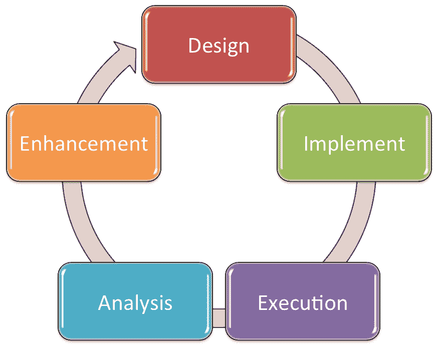
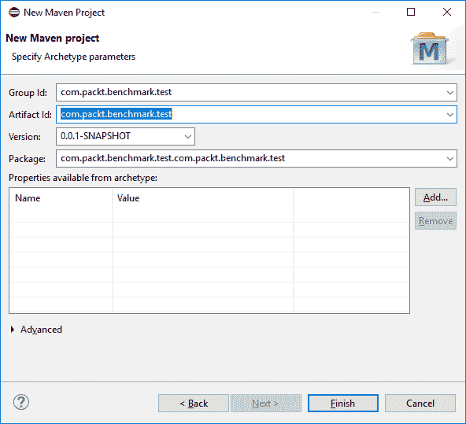
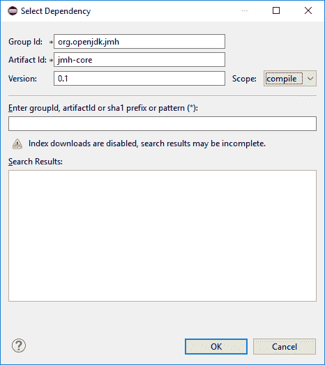
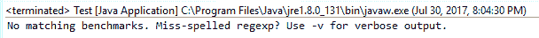
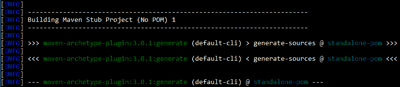
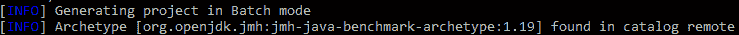
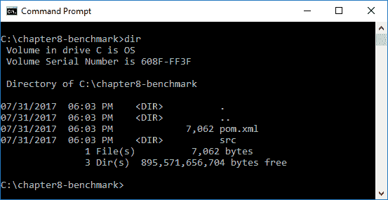
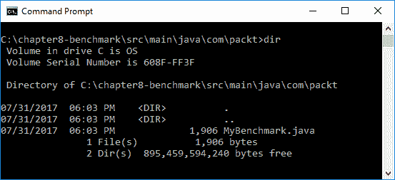

# Microbenchmarking 应用与 JMH

在上一章中，我们对垃圾收集进行了深入的审查，包括对象生命周期，垃圾收集算法，垃圾收集选项和与垃圾收集相关的方法。 我们简要介绍了 java 8 中的垃圾收集升级，并专注于新的 Java 平台的变化。 我们对 Java 11 中的垃圾收集探索包括默认垃圾收集，折旧的垃圾收集组合，统一垃圾收集日志记录和持续的垃圾收集问题。

在本章中，我们将使用 **java microbenchmark marks** （ **jmh** ）查看如何编写性能测试，用于编写 JVM 的基准的 Java Harness 库。 我们将使用 Maven 以及 JMH 来帮助说明与新的 Java 平台进行微磁盘的力量。

具体来说，我们将涵盖以下主题：

*   MicroBenchmarking 概述
*   与 maven 微生物发布
*   基准选项
*   用于避免微磁性缺陷的技术

# 技术要求

本章具有 Java 11\. Java 平台的**标准版**（ **SE** ）可以从 Oracle 的官方下载站点下载（ [http://www.oracle.com/ technetwork / java / javase / downloads / index.html](http://www.oracle.com/technetwork/java/javase/downloads/index.html) ）。

IDE 软件包就足够了。 来自 JetBrains 的 Intellij Idea 用于与本章相关的所有编码以及随后的章节。 可以从网站下载 Intellij Idea 的社区版本（ [https://www.jetbrains.com/idea/features/](https://www.jetbrains.com/idea/features/) ）。

本章的源代码在 URL（ [https://github.com/packtpublisht/mastering-java-11-chishishtition](https://github.com/PacktPublishing/Mastering-Java-11-Second-Edition) [）上可用于 github 上可用。](https://github.com/PacktPublishing/Mastering-Java-11-Second-Edition)

# MicroBenchmarking 概述

Microbenchmark 用于测试系统的性能。 这与 Macrobenchmarking 不同，这在不同平台上运行测试以进行效率比较和随后的分析。 通过微磁发布，我们通常针对一个系统上的特定切片代码，例如方法或循环。 Microbenchmarking 的主要目的是识别我们的代码中的优化机会。

有多种方法是基准测试; 我们将专注于使用 JMH 工具。 那么，为什么要基准？ 除非表现是一个规定的要求，否则开发人员并不总是关心绩效问题。 如果作为开发过程的一部分进行微磁盘，这可能会导致部署后可能已经避免的惊喜。

Microbenchmarking 在过程的几个阶段进行。 如下图所示，该过程涉及设计，实现，执行，分析和增强：



Microbenchmarking Process 阶段

在**设计**阶段，我们相应地确定了我们的目标并设计了微调。 在**实现**阶段，我们正在编写微稳定，然后在**执行**阶段，我们实际运行测试。 使用微磁发布结果，我们解释和分析**分析**相中的结果。 这导致**增强**相中的代码改进。 一旦我们的代码已更新，我们会重新设计微磁发布测试，调整实现，或直接转到**执行**相位。 这是一个继续持续到我们在我们的目标中确定的性能优化之前继续的周期性过程。

# 使用 JMH 的方法

Oracle 的文档表明最理想的 JMH 用例是使用依赖于应用程序的 JAR 文件的 Maven 项目。 他们还建议通过命令行而不是 IDE 内的微磁发布，因为这可能会影响结果。

Maven，也称为 Apache Maven，是我们可以用于管理我们的应用程序项目构建，报告和文档的项目管理和理解工具。

要使用 JMH，我们将使用 Bytecode 处理器（注释）来生成基准代码。 我们使用 Maven Archetypes 启用 JMH。

为了测试 JMH，您必须拥有 IDE 支持 Maven 和您正在使用的 Java 版本。 如果您还没有 Java 11 或 IDE 与 Java 11 支持，则可以按照下一节中的步骤进行操作。

# 安装 Java 和 Eclipse

您可以从 JDK 11 早期访问 Builds 页面下载和安装 Java 11（ [http://jdk.java.net/11/](http://jdk.java.net/11/) ）。

安装 Java 11 后，下载最新版本的 Eclipse。 在撰写本书时，这是氧气。 这是相关链接 [https://www.eclipse.org/](https://www.eclipse.org/downloads/) [下载/](https://www.eclipse.org/downloads/) 。

# 动手实验

现在我们安装了 Eclipse 氧气，您可以进行快速测试以确定 JMH 是否正在开发开发计算机。 首先创建一个新的 Maven 项目，如下屏幕截图所示：



新的 Maven 项目

接下来，我们需要添加依赖项。 我们可以通过以下代码编辑`pom.xml`文件来完成此操作：

```
<dependency>
  <groupId>org.openjdk.jmh</groupId>
```

```
  <artifactId>jmh-core</artifactId>
  <version>0.1</version>
</dependency>
```

或者，我们可以单击“新建 Maven 项目”对话框窗口上的“添加...”按钮（请参阅上一个屏幕截图）以在对话框窗口中输入数据，如以下屏幕截图所示。 使用此表单使用前面的代码更新`pom.xml`文件：



依赖选择

接下来，我们需要编写一个包含 JMH 方法的类。 这是确认我们最近更新的开发环境的初始测试。 以下是您可以用于测试的示例代码：

```
package com.packt.benchmark.test.com.packt.benchmark.test;
import org.openjdk.jmh.Main;

public class Test {
  public static void main(String[] args) {
    Main.main(args);
  }
}
```

我们现在可以编译并运行非常简单的测试程序。 如果使用命令行，则在控制台选项卡或实际控制台中提供结果。 这是您将看到的：



JMH 测试结果

# 与 maven 微生物发布

JMH 入门的一种方法是使用 JMH Maven Archetype。 第一步是创建一个新的 JMH 项目。 在我们的系统的命令提示符下，我们将输入`mvn`命令后跟一组长一组参数来创建一个新的 Java 项目和必要的 Maven `pom.xml`文件：

```
mvn archetype:generate -DinteractiveMode=false -DarchetypeGroupId=org.openjdk.jmh -DarchetypeArtifactId=jmh-java-benchmark-archetype -DgroupId=com.packt -DartifactId=chapter8-benchmark -Dversion=1.0
```

输入`mvn`命令和前面的详细参数后，您将通过终端查看向您报告的结果。 根据您的使用级别，您可能会看到来自 [https://repo.maven.apache.org/maven2/org/apache/maven/plugins/](https://repo.maven.apache.org/maven2/org/apache/maven/plugins/) 和其他类似的存储库站点的大量下载。

您还将看到一个信息部分，该信息部分通知您的项目构建过程，如以下屏幕截图所示：



Maven Build Process.

可能是从 [https://repo.maven.apache.org](https://repo.maven.apache.org) 存储库中下载的额外插件和其他资源。 然后，您将看到一个信息反馈组件，允许您知道项目正在以批处理模式生成项目，如下所示：



Maven 项目生成

最后，您将以一组参数呈现，并注意您的项目构建成功。 您可以通过以下示例看到，此过程花费不到 21 秒才能完成：


新的 Maven 项目

将根据`-DartifactId`选项中包含的参数创建文件夹。 在我们的示例中，我们使用`-DartifactId=chapter8-benchmark`，Maven 创建了`chapter8-benchmark`项目文件夹，如下所示：



基准项目文件夹

您将看到 Maven 创建了`pom.xml`文件以及源（`src`）文件夹。 在该文件夹中，在`C:\chapter8-benchmark\src\main\java\com\packt`的子目录结构下，是`MyBenchmark.java`文件。 Maven 为我们创建了一个基准课程，显示在下一个屏幕截图中：



mybenchmark.java 文件位置

以下是 JMH Maven 项目创建过程创建的`MyBenchmark.java`类的内容：

```
/*
 * Copyright (c) 2014, Oracle America, Inc.
 * All rights reserved.
 *
 * Redistribution and use in source and binary forms, with or without
 * modification, are permitted provided that the following conditions 
   are met:
 *
 * 
 * Redistributions of source code must retain the above copyright 
   notice,
 * this list of conditions and the following disclaimer.
 *
 * * Redistributions in binary form must reproduce the above copyright
 * notice, this list of conditions and the following disclaimer in the
 * documentation and/or other materials provided with the distribution.
 *
 * * Neither the name of Oracle nor the names of its contributors may 
   be used
 * to endorse or promote products derived from this software without
 * specific prior written permission.
 *
 * THIS SOFTWARE IS PROVIDED BY THE COPYRIGHT HOLDERS AND CONTRIBUTORS 
   "AS IS"
 * AND ANY EXPRESS OR IMPLIED WARRANTIES, INCLUDING, BUT NOT LIMITED 
   TO, THE
 * IMPLIED WARRANTIES OF MERCHANTABILITY AND FITNESS FOR A PARTICULAR 
   PURPOSE
 * ARE DISCLAIMED. IN NO EVENT SHALL THE COPYRIGHT HOLDER OR 
   CONTRIBUTORS BE
 * LIABLE FOR ANY DIRECT, INDIRECT, INCIDENTAL, SPECIAL, EXEMPLARY, OR
 * CONSEQUENTIAL DAMAGES (INCLUDING, BUT NOT LIMITED TO, PROCUREMENT OF
 * SUBSTITUTE GOODS OR SERVICES; LOSS OF USE, DATA, OR PROFITS; OR 
   BUSINESS
 * INTERRUPTION) HOWEVER CAUSED AND ON ANY THEORY OF LIABILITY, WHETHER 
   IN
 * CONTRACT, STRICT LIABILITY, OR TORT (INCLUDING NEGLIGENCE OR 
   OTHERWISE)
 * ARISING IN ANY WAY OUT OF THE USE OF THIS SOFTWARE, EVEN IF ADVISED 
   OF 
 * THE POSSIBILITY OF SUCH DAMAGE.
 */

package com.packt;
import org.openjdk.jmh.annotations.Benchmark;

public class MyBenchmark {
  @Benchmark
  public void testMethod() {
    // This is a demo/sample template for building your JMH benchmarks.
    // Edit as needed.
    // Put your benchmark code here.
  }
}
```

我们的下一步是修改`testMethod()`，以便有一些需要测试。 以下是我们将用于基准测试的修改方法：

```
@Benchmark
public void testMethod() {
  int total = 0;
  for (int i=0; i<100000; i++) {
    total = total + (i * 2 );
  }
System.out.println("Total: " + total);
}
```

使用我们的代码编辑，我们将在命令提示符下返回项目文件夹，`C:\chapter8-benchmark`，`C:\chapter8-benchmark`，并在命令提示符下执行`mvn clean install`。

您将看到多个存储库下载，源编译，插件安装，最后是`Build Success`指示器，如下所示：


建立结果

您现在将看到`.classpath`和`.project`文件以及项目目录中的新`.settings`和`target`子文件夹，如下所示：


项目目录

如果您导航到`\target`子文件夹，则会看到我们的`benchmarks.jar`文件已创建。 这个 jar 包含我们需要运行的基准测试。

`benchmarks.jar`中的外部依赖项在`pom.xml`文件中配置。

我们可以在 IDE 中更新我们的`MyBenchmark.java`文件，如 Eclipse。 然后，我们可以再次执行`mvn clean install`以覆盖我们的文件。 在初次执行之后，我们的构建将更快，因为需要下载任何内容。

以下是在初始执行之后查看从构建过程的输出：


清洁安装过程

我们的最后一步是从`C:\chapter8-benchmark\target`文件夹中运行基准工具。 我们可以使用以下命令`-java -jar benchmarks.jar`来执行此操作。 即使对于简单的代码上的小型基准，与我们的示例一样，基准测试可能需要一些时间来运行。 可能有几个迭代包括热身，提供更简洁有效的基准结果。

我们在这里提供了我们的基准结果。 正如您所看到的，测试运行`00:08:08`小时：


mybenchmark.java 文件位置

# 基准选项

在上一节中，您学习了如何运行基准测试。 在本节中，我们将查看以下可配置选项，以运行我们的基准：

*   模式
*   时间单位

# 模式

从上一节中的基准结果的输出包括具有`thrpt`值的`Mode`列，这是吞吐量的缺点。 这是默认模式，还有另外的四种模式。 所有 JMH 基准模式列出并描述如下：

| **模式** | **描述** |
| 全部 | 按顺序测量所有其他模式。 |
| 平均时间 | 此模式测量单个基准运行的平均时间。 |
| 采样时间 | 此模式测量基准执行时间并包括最小和最大时间。 |
| 单次射击时间 | 使用此模式，没有 JVM 预热，测试是确定单个基准方法运行多长时间。 |
| 吞吐量 | 这是默认模式，并测量每秒的操作数。 |

要指示要使用的基层模式，您将修改`@Benchmark`代码行为以下之一：

*   `@Benchmark @BenchmarkMode(Mode.All)`
*   `@Benchmark @BenchmarkMode(Mode.AverageTime)`
*   `@Benchmark @BenchmarkMode(Mode.SampleTime)`
*   `@Benchmark @BenchmarkMode(Mode.SingleShotTime)`
*   `@Benchmark @BenchmarkMode(Mode.Throughput)`

# 时间单位

为了在基准输出中获得更大的保真度，我们可以指定特定的时间单位，从最短到时间最短

*   `NANOSECONDS`
*   `MICROSECONDS`
*   `MILLISECONDS`
*   `SECONDS`
*   `MINUTES`
*   `HOURS`
*   `DAYS`

为了制作这个名称，我们只需将以下代码添加到我们的`@Benchmark`行：

```
@Benchmark @BenchmarkMode(Mode.AverageTime)
@OutputTimeUnit(TimeUnit.NANOSECONDS)
```

在前面的示例中，我们已经将平均模式和纳秒作为时间单位指定。

# 用于避免微磁性缺陷的技术

Microbenchmarking 并不是每个开发人员都必须担心的东西，但对于那些所做的人来说，有几个你应该意识到的陷阱。 在本节中，我们将审查最常见的陷阱，并建议避免它们的策略。

# 能源管理

有许多子系统可用于帮助您管理电源和性能之间的平衡（即`cpufreq`）。 这些系统可以改变基准期间的时间状态。

这个陷阱有两种建议的策略：

*   在运行测试之前禁用任何电源管理系统
*   运行较长时间的基准

# OS 调度员

操作系统调度程序（如 Solaris Scheduler），帮助确定哪些软件进程获得对系统资源的访问权限。 使用这些调度程序可以具有不可靠的基准测试结果。

这个陷阱有两种建议的策略：

*   优化您的系统调度策略
*   运行较长时间的基准

# 分阶段

分时系统用于帮助平衡系统资源。 使用这些系统通常会导致线程开始和停止时间之间的不规则间隙。 此外，CPU 负载不均匀，我们的基准数据对我们不太有用。

有两种建议的策略来避免这种陷阱：

*   在运行基准之前测试所有代码，以确保事项工作
*   只有在所有线程启动或所有线程已停止后才能测量才能测量

# 消除死亡码和常量折叠

死人代码和常量折叠通常被称为冗余代码，我们的现代编译器非常擅长消除它们。 死码的示例是永远不会到达的代码。 考虑以下示例：

```
. . .
int value = 10;
if (value != null) {
  System.out.println("The value is " + value + ".");
} else {
    System.out.println("The value is null."); // This is a line of Dead-Code
}
. . .
```

在我们的前述示例中，由于变量值永远不会等于 NULL，因此从未达到识别为死码的行。 它在条件`if`语句评估变量之前，它立即设置为`10`。

问题是，有时可以在尝试消除死亡码中删除基准测试代码。

常量折叠是使用实际结果替换编译时约束时发生的编译器操作。 编译器执行常量折叠以删除任何冗余运行时计算。 在以下示例中，我们有一个最终`int`，后跟一个基于涉及第一个`int`的数学计算的第二`int`：

```
. . .
static final int value = 10;
int newValue = 319 * value;
. . .
```

常量折叠操作会将前面代码的两行转换为以下内容：

```
int newValue = 3190;
```

这个陷阱有一个建议的策略：

*   使用 JMH API 支持来确保不会消除基准测试代码

# 运行到运行方差

有一种巨大的问题，可以大大影响基准测试的运行差异。

这个陷阱有两种建议的策略：

*   在每个子系统内多次运行 JVM
*   使用多个 JMH 叉

# 缓存容量

**动态随机访问的内存**（ **dram** ）非常慢。 这可能导致基准测试期间的性能非常不同。

这个陷阱有两种建议的策略：

*   运行多个基准，具有不同的问题集。 在测试期间跟踪您的内存占地面积。
*   使用`@State`注释来指示 JMH 状态。 此注释用于定义实例的范围。 有三个州：
*   `Scope.Benchmark`：实例在运行相同测试的所有线程上共享
*   `Scope.Group`：每个线程组分配一个实例
*   `Scope.Thread`：每个线程都有自己的实例。 这是默认状态

# 概括

在本章中，我们了解到 JMH 是一个用于编写 JVM 的基准的 Java 线束库。 我们尝试使用 Maven 与 JMH 一起使用 Maven 进行写入性能测试，以帮助说明与新的 Java 平台进行微磁盘标记的程序。 我们开始使用微调概述，然后使用 Maven 深入了解 MICROBMARKING，审查了基准选项，并结束了一些技术，以避免微磁性缺陷。

在下一章中，我们将学习编写管理其他进程的应用程序，并利用 Java 平台的现代进程管理 API。

# 问题

1.  什么是微磁发布？
2.  微稳标的主要阶段是什么？
3.  什么是 maven？
4.  什么文件用于定义依赖项？
5.  模式和时间单位对基准测试有什么共同之处？
6.  什么是 JMH 基准模式？
7.  基准测试的时间单位是什么，按比最小到最大的顺序？
8.  避免电力管理陷阱的建议策略是什么？
9.  避免 OS 调度员陷阱的建议策略是什么？
10.  避免分阶段陷阱的建议策略是什么？

# 进一步阅读

列出的以下引用将帮助您深入了解本章介绍的概念：

*   *Java EE 开发与 Eclipse* ，可在 [https://www.packtpub.com/application-development/java-ee-development-eclipse](https://www.packtpub.com/application-development/java-ee-development-eclipse) 。
*   *Java EE 开发与 Eclipse - 第二版*，可在 [https://www.packtpub.com/application-development/java-ee-development-eclipse-secondondition](https://www.packtpub.com/application-development/java-ee-development-eclipse-second-edition) 。