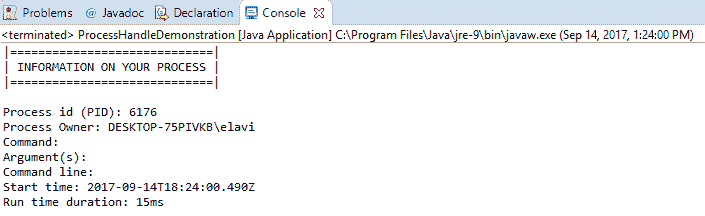
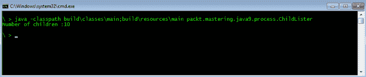
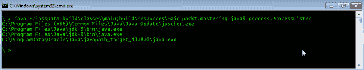

# 利用过程 API

在上一章中，我们了解到，**Java 微基准线束**（**JMH**是一个 Java 线束库，用于为 JVM 编写基准测试。我们尝试使用 Maven 和 JMH 编写性能测试，以帮助说明使用新 Java 平台进行微基准标记的过程。我们从微基准概述开始，然后与 Maven 深入到微基准，回顾了基准选项，最后介绍了一些避免微基准陷阱的技术。

在本章中，我们将重点介绍对`Process`类和`java.lang.ProcessHandle`API 的更新。在 Java 的早期版本中，在 Java9 之前，用 Java 管理进程是很困难的。API 不够，有些功能不够，有些任务需要以特定于系统的方式来解决。例如，在 Java8 中，让进程访问自己的**进程标识符**（**PID**）是一项不必要的困难任务。

在本章中，我们将探讨编写一个利用 Java 的进程管理 API 管理其他进程的应用程序所需的必要知识。具体来说，我们将介绍以下内容：

*   引入流程
*   使用`ProcessHandle`接口
*   查看示例 process controller 应用程序

# 技术要求

本章以 Java 11 为特色，Java 平台的**标准版**（**SE**）可从 Oracle 官方下载网站（[下载 http://www.oracle.com/technetwork/java/javase/downloads/index.html](http://www.oracle.com/technetwork/java/javase/downloads/index.html)）。

IDE 软件包就足够了。来自 JetBrains 的 IntelliJ IDEA 用于与本章和后续章节相关的所有编码。IntelliJ IDEA 的社区版可从网站（[下载 https://www.jetbrains.com/idea/features/](https://www.jetbrains.com/idea/features/)）。

本章的源代码可以在 GitHub 的 URL（[上找到 https://github.com/PacktPublishing/Mastering-Java-11-Second-Edition](https://github.com/PacktPublishing/Mastering-Java-11-Second-Edition)

# 引入流程

在 Java 应用程序编程的上下文中，进程是操作系统中的执行单元。当你启动一个程序，你就启动了一个过程。当机器引导代码时，它做的第一件事就是执行引导过程。然后，此进程启动其他进程，这些进程将成为引导进程的子进程。这些子进程可能会启动其他进程。这样，当机器运行时，就会有进程树在运行。

当机器做某事时，它是在某个进程内执行的某个代码中完成的。操作系统还作为同时执行的多个进程运行。应用程序作为一个或多个进程执行。大多数应用程序都是作为一个进程运行的，但作为一个例子，Chrome 浏览器启动几个进程来执行所有渲染和网络通信操作，这些操作共同起到浏览器的作用

要更好地了解进程是什么，请启动 Windows 上的任务管理器或 OSX 上的活动监视器，然后单击“进程”选项卡。您将看到机器上当前存在的不同进程。使用这些工具，您可以查看进程的参数，并且可以逐个终止进程

单个进程为其工作分配了内存，不允许它们自由访问彼此的内存

操作系统调度的执行单元是线程。进程由一个或多个线程组成。这些线程由操作系统调度程序调度，并在时隙中执行

对于每个操作系统，进程都有一个 PID，它是一个标识进程的数字。不能同时有两个进程共享同一 PID。当我们想要在操作系统中识别一个活动进程时，我们使用 PID。在 Linux 和其他类似 Unix 的操作系统上，`kill`命令终止进程。要传递给此程序的参数是要终止的进程的 PID。终止可以是优雅的。这有点像要求进程退出。如果进程决定不运行，它可以继续运行。

程序可以准备在收到此类请求时停止。例如，Java 应用程序可以添加一个调用`Runtime.getRuntime().addShutdownHook(Thread t)`方法的`Thread`对象。传递的线程应该在进程被要求停止时启动，这样线程就可以执行程序退出前必须执行的所有任务。不幸的是，不能保证线程会真正启动，这取决于实际的实现。

# 使用 ProcessHandle 接口

Java9 中引入了两个支持处理操作系统进程的新接口-`ProcessHandle`和`ProcessHandle.Info`。

`ProcessHandle`对象标识操作系统进程并提供管理该进程的方法。在以前的 Java 版本中，这只能通过特定于操作系统的方法使用 PID 来标识进程。这种方法的主要问题是，PID 只有在进程处于活动状态时才是唯一的。当一个进程完成时，操作系统可以自由地为一个新进程重用 PID。当我们使用 PID 检查一个进程是否仍在运行时，我们实际上是在用该 PID 检查一个活动进程。当我们检查进程时，它可能是活动的，但是下次程序查询进程状态时，它可能是另一个进程

桌面和服务器操作系统尽量不重用 PID 值。在某些嵌入式系统上，操作系统可能只使用 16 位值来存储 PID。当仅使用 16 位值时，PIDs 被重用的可能性更大。我们现在可以使用`ProcessHandle`API 来避免这个问题。我们可以接收`ProcessHandle`，也可以调用`handle.is.Alive()`方法。此方法将在流程完成时返回`false`。即使重用了 PID，这种方法也可以工作。

# 获取当前进程的 PID

我们可以通过`handle`访问进程的 PID。`handle.getPid()`方法返回`Long`表示 PID 的数值，由于通过句柄访问进程更安全，因此该方法的重要性受到限制。当我们的代码想要将自己的信息提供给其他管理工具时，它可能会派上用场。

程序通常会创建一个以数字 PID 作为文件名的文件。某个程序不能在多个进程中运行可能是一个要求。在这种情况下，代码将自己的 PID 文件写入特定目录。如果具有该名称的 PID 文件已存在，则处理将停止。如果前一个进程崩溃或终止而没有删除 PID 文件，那么系统管理器可以轻松地删除该文件并启动新进程。如果程序挂起，那么如果 PID 已知，系统管理器可以很容易地终止死进程。

为了得到当前进程的 PID，可以使用调用链`ProcessHandle.current().getPid()`。

# 获取有关进程的信息

要获取有关进程的信息，我们需要访问进程的`Info`对象。可通过`ProcessHandle`获取。我们使用对`handle.info()`方法的调用来返回它。

`Info`接口定义了传递流程信息的查询方法。这些是：

*   `command()`返回`Optional<String>`，其中包含用于启动进程的命令
*   `arguments()`返回`Optional<String[]>`，其中包含启动进程的命令后在命令行上使用的参数
*   `commandLine()`返回包含整个命令行的`Optional<String>`
*   `startInstant()`返回`Optional<Instant>`，它本质上表示流程开始的时间
*   `totalCpuDuration()`返回`Optional<Duration>`，表示进程自启动以来占用的 CPU 时间
*   `user()`返回`Optional<String>`，其中包含进程所属的用户的名称

这些方法返回的值都是`Optional`，因为不能保证操作系统或 Java 实现能够返回信息，但是在大多数操作系统上，它应该工作，并且返回的值应该存在。

以下示例代码显示给定进程的信息：

```java
import java.io.IOException;
import java.time.Duration;
import java.time.Instant;

public class ProcessHandleDemonstration {
  public static void main(String[] args) throws InterruptedException, 
  IOException {
    provideProcessInformation(ProcessHandle.current());
    Process theProcess = new 
     ProcessBuilder("SnippingTool.exe").start();
    provideProcessInformation(theProcess.toHandle());
    theProcess.waitFor();
    provideProcessInformation(theProcess.toHandle());
  }
  static void provideProcessInformation(ProcessHandle theHandle) {
    // get id
    long pid = ProcessHandle.current().pid();

    // Get handle information (if available)
    ProcessHandle.Info handleInformation = theHandle.info();

    // Print header
    System.out.println("|=============================|");
    System.out.println("| INFORMATION ON YOUR PROCESS |");
    System.out.println("|=============================|\n");

    // Print the PID
    System.out.println("Process id (PID): " + pid);
    System.out.println("Process Owner: " + 
    handleInformation.user().orElse(""));

    // Print additional information if available
    System.out.println("Command:" + 
    handleInformation.command().orElse(""));
    String[] args = handleInformation.arguments().orElse (new String[]{});
    System.out.println("Argument(s): ");
    for (String arg: args) System.out.printf("\t" + arg);
      System.out.println("Command line: " + 
      handleInformation.commandLine().orElse(""));
      System.out.println("Start time: " + 
      handleInformation.startInstant().orElse(Instant.now()).
      toString());
      System.out.printf("Run time duration: %sms%n",    
      handleInformation.totalCpuDuration().
      orElse(Duration.ofMillis(0)).toMillis());
  }
}
```

以下是前面代码的控制台输出：



# 上市流程

在 Java9 之前，我们没有获得活动进程列表的方法。使用 Java9、10 和 11，可以在`Stream`中获取进程。有三种方法返回`Stream<ProcessHandle>`，用于：

*   列出子进程
*   列出所有子体
*   列出所有进程

下一节将对每一项进行回顾。

# 列出子项

为了得到控制子进程的进程句柄的`Stream`，应该使用静态方法`processHandle.children()`。这将创建`processHandle`表示的进程的子进程的快照，并创建`Stream`，由于进程是动态的，因此不能保证在代码执行过程中，当我们的程序处理句柄时，所有子进程仍然是活动的。它们中的一些可能会终止，而我们的进程可能会产生新的子进程，可能来自不同的线程。因此，代码不应该假设`Stream`的`ProcessHandle`元素代表一个活动的、正在运行的进程

以下程序在 Windows 中启动 10 个命令提示，然后计算子进程的数量并将其打印到标准输出：

```java
import java.io.IOException;

public class ChildLister {
  public static void main(String[] args) throws IOException {
    for (int i = 0; i < 10; i++) {
      new ProcessBuilder().command("cmd.exe").start();
    }
    System.out.println("Number of children :" +
      ProcessHandle.current().children().count());
  }
}
```

执行该程序将导致以下结果：



# 列出子体

列出子进程与列出子进程非常相似，但是如果我们调用`processHandle.descendants()`方法，那么`Stream`将包含所有子进程以及这些进程的子进程，依此类推。

以下程序以命令行参数启动命令提示，以便它们也生成另一个终止的【T0”：

```java
import java.io.IOException;
import java.util.stream.Collectors;

public class DescendantLister {
  public static void main(String[] args) throws IOException {
    for (int i = 0; i < 10; i++) {
      new ProcessBuilder().command("cmd.exe","/K","cmd").start();
    }
    System.out.println("Number of descendants: " +
      ProcessHandle.current().descendants().count();
  }
}
```

多次运行该命令将导致以下不确定的输出：


输出清楚地表明，当子进程的`Stream`被创建时，并不是所有进程都是活动的。示例代码启动 10 个进程，每个进程启动另一个进程。`Stream`没有 20 个元素，因为其中一些子进程在处理过程中被终止。

# 列出所有进程

列出所有进程与列出子进程和子进程略有不同。方法`allProcess()`是静态的，返回执行时操作系统中所有活动进程的句柄`Stream`。

以下示例代码将进程命令打印到控制台，这些命令看起来像是 Java 进程：

```java
import java.lang.ProcessHandle.Info;

public class ProcessLister {
  private static void out(String format, Object... params) {
    System.out.println(String.format(format, params));
  }

  private static boolean looksLikeJavaProcess(Info info) {
    return info.command().isPresent() && info.command().get().
      toLowerCase().indexOf("java") != -1;
  }

  public static void main(String[] args) {
    ProcessHandle.allProcesses().map(ProcessHandle::info).
      filter(info -> looksLikeJavaProcess(info)).
      forEach((info) -> System.out.println(info.command().
      orElse("---")));
  }
}
```

程序的输出列出了所有内有字符串`java`的过程命令，如下所示：



当然，您的实际输出可能不同。

# 正在等待进程

当一个进程启动另一个进程时，它可能会多次等待该进程，因为它需要另一个程序的结果。如果任务的结构可以这样组织，即父程序可以在等待子进程完成时执行其他操作，则父进程可以调用进程句柄上的`isAlive()`方法。通常，在派生的进程完成之前，父进程无事可做。遗留应用程序实现了调用`Thread.sleep()`方法的循环，这样 CPU 就不会过度浪费，进程会定期检查，看它是否还活着

当前的 Java 平台提供了一种更好的方法来处理等待过程，`ProcessHandle`接口有一个名为`onExit()`的方法返回`CompletableFuture`。这个类可以在不循环的情况下等待任务完成。如果我们有一个进程的句柄，我们可以简单地调用`handle.onExit().join()`方法等待进程完成。返回的`CompletableFuture`的`get()`方法返回最初用于创建它的`ProcessHandle`实例

我们可以多次调用句柄上的`onExit()`方法，每次它都会返回不同的`CompletableFuture`对象，每个对象都与同一进程相关。我们可以在对象上调用`cancel()`方法，但它只会取消`CompletableFuture`对象，而不会取消进程，并且不会对从同一`ProcessHandle`实例创建的其他`CompletableFuture`对象产生任何影响。

# 终止进程

要终止一个进程，我们可以在`ProcessHandle`实例上调用`destroy()`方法或`destroyForcibly()`方法。这两种方法都将终止进程，`destroy()`方法将终止进程，优雅地执行进程关闭序列。在这种情况下，如果实际实现支持进程的正常终止，那么将执行添加到运行时的关闭挂钩。

`destroyForcibly()`方法将强制进程终止，在这种情况下，将不执行关闭序列。如果句柄管理的进程不活动，则代码调用这些方法时不会发生任何事情。如果在句柄上创建了调用`onExit()`方法的`CompletableFuture`对象，则当进程终止时，在调用`destroy()`或`destroyForcefully()`方法后，这些对象将完成。

这意味着`CompletableFuture`对象将在流程结束一段时间后从`join()`或类似方法返回，而不是在`destroy()`或`destroyForcefully()`返回之后立即返回

同样重要的是要注意，进程终止可能取决于许多事情。如果等待终止另一个进程的实际进程无权终止另一个进程，则请求将失败。在这种情况下，方法的返回值是`false`。返回值`true`并不意味着进程实际上已经终止。这只意味着操作系统接受了终止请求，并且操作系统将在将来的某个时候终止进程。这实际上很快就会发生，但不是瞬间发生的，因此如果方法`isAlive()`在`destroy()`或`destroyForcefully()`方法返回值`true`之后的一段时间内返回`true`，也就不足为奇了。

`destroy()`和`destroyForcefully()`之间的区别是具体实现的。Java 标准没有规定`destroy()`终止让关闭序列执行的进程。它只请求终止进程。此`ProcessHandle`对象表示的进程是否正常终止取决于实现。

这是因为某些操作系统没有实现优雅的进程终止特性。在这种情况下，`destroy()`的实现与调用`destroyForcefully()`相同。接口`ProcessHandle`的系统特定实现必须实现方法`supportsNormalTermination()`，只有当实现支持正常（非强制）进程终止时，才应该是`true`。对于实际实现中的所有调用，该方法应返回相同的值，并且在执行 JVM 实例期间不应更改返回值。不需要多次调用该方法。

下面的示例演示了进程启动、进程终止和等待进程终止。在我们的示例中，我们使用两个类。第一节课演示了`.sleep()`方法：

```java
public class WaitForChildToBeTerminated { 
  public static void main(String[] args) throws InterruptedException {
    Thread.sleep(10_000);
  }
}
```

我们示例中的第二个类称为`WaitForChildToBeTerminated`类：

```java
import java.io.IOException;
import java.util.Arrays;
import java.util.concurrent.CompletableFuture;
import java.util.stream.Collectors;

public class TerminateAProcessAfterWaiting {
  private static final int N = 10;
  public static void main(String[] args) throws IOException, 
  InterruptedException {
    ProcessHandle ph[] = new ProcessHandle[N];
      for (int i = 0; i < N; i++) {
        final ProcessBuilder pb = ew ProcessBuilder().
          command("java", "-cp", "build/classes/main",
          "packt.mastering.java11.process.WaitForChildToBeTerminated");
        Process p = pb.start();
        ph[i] = p.toHandle();
      }

      long start = System.currentTimeMillis();
      Arrays.stream(ph).forEach(ProcessHandle::destroyForcibly);
      CompletableFuture.allOf(Arrays.stream(ph).
        map(ProcessHandle::onExit).collect(Collectors.toList()).
        toArray(new CompletableFuture[ph.length])).join();
      long duration = System.currentTimeMillis() - start;
      System.out.println("Duration " + duration + "ms");
  }
}
```

前面的代码启动 10 个进程，每个进程执行休眠 10 秒的程序。它强制销毁进程，或者更具体地说，要求操作系统销毁进程。我们的示例连接了由`CompletableFuture`对象数组组成的`CompletableFuture`，这些对象是使用各个进程的句柄创建的

当所有进程完成后，它以毫秒为单位打印出测量的时间。时间间隔从进程创建和进程创建循环完成时开始。当 JVM 从`join()`方法返回时，当进程被识别时，测量的时间间隔结束

示例代码将睡眠时间设置为 10 秒。这是一个更明显的时间段。运行两次代码并删除破坏进程的行会导致打印速度慢得多。实际上，测量和打印的运行时间也会显示终止进程会产生影响。

# 查看示例 process controller 应用程序

最后一节提供了一个示例过程控制应用程序来演示本章的内容。应用程序的功能非常简单。它从一系列配置文件参数中读取如何启动某些进程，然后，如果其中任何进程停止，它将尝试重新启动进程。

这个示例应用程序可以作为实际应用程序的起点。可以使用环境变量规范扩展流程的参数集。您还可以为进程、输入和输出重定向添加一个默认目录，甚至还可以添加一个进程的 CPU 消耗量，而无需控制应用程序终止并重新启动它

应用程序由四个类组成：

*   `Main`：此类包含`public static void main`方法，用于启动守护进程。
*   `Parameters`：此类包含流程的配置参数。在这个简单的例子中，它只包含一个字段，即命令行。如果应用程序得到扩展，这个类将包含默认目录、重定向和 CPU 使用限制数据。
*   `ParamsAndHandle`：这个类只不过是一个数据元组，其中包含对`Parameters`对象的引用，同时也是一个进程句柄。当一个进程死亡并重新启动时，进程句柄将被新的句柄替换，但是对`Parameters`对象的引用不会改变它的配置
*   `ControlDaemon`：这个类实现了`Runnable`接口，作为一个单独的线程启动。

# 主要类别

`main()`方法从命令行参数中获取目录名。它将此视为相对于当前工作目录。它使用同一类中的单独方法从目录中的文件读取配置集，然后启动控制守护进程。以下代码是程序的`main()`方法：

```java
public static void main(String[] args) throws IOException, 
  InterruptedException {

  // DemoOutput.out() simulated - implementation not shown
  DemoOutput.out(new File(".").getAbsolutePath().toString());
  if (args.length == 0) {
    System.err.println("Usage: daemon directory");
    System.exit(-1);
  }

  Set<Parameters> params = parametersSetFrom(args[0]);
  Thread t = new Thread(new ControlDaemon(params));
  t.start();
}
```

虽然这是一个守护进程，但我们将它作为普通线程而不是守护进程线程启动。当一个线程被设置为守护进程线程时，它不会使 JVM 保持活动状态。当所有其他非守护进程线程停止时，JVM 将退出，守护进程线程将停止。在我们的例子中，我们执行的守护进程线程是保持代码运行的唯一线程。在启动之后，主线程就没有什么事情可做了，但是 JVM 应该保持活动状态，直到操作员发出 Unix`kill`命令或在命令行上按*Ctrl*+`C`将其杀死。

使用 JDK 中新的`Files`和`Paths`类，获取指定目录中的文件列表并从文件中获取参数非常简单：

```java
private static Set<Parameters>
  GetListOfFilesInDirectory(String directory) throws IOException {
    return Files.walk(Paths.get(directory)).map(Path::toFile)
      .filter(File::isFile).map(file -> Parameters.fromFile(file))
      .collect(Collectors.toSet());
}
```

我们得到一个以`Path`对象形式出现的文件流，将其映射到`File`对象，然后过滤出`configuration`目录中的目录，并使用静态方法将剩余的普通文件从`Parameters`类的`File`映射到`Parameters`对象。最后，我们返回对象的`Set`。

# 参数类

我们的`Parameters`类有一个字段和一个构造器，如下所示：

```java
final String[] commandLine;
public Parameters(String[] commandLine) {
  this.commandLine = commandLine;
}
```

`Parameters`类有两个方法。第一个方法`getCommandLineStrings()`从属性中检索命令行字符串。此数组包含命令和命令行参数。如果文件中没有定义，则返回一个空数组，如下所示：

```java
private static String[] getCommandLineStrings(Properties props) {
  return Optional.ofNullable(props.getProperty("commandLine"))
    .orElse("").split("\\s+");
}
```

第二种方法是静态的`fromFile()`，它从`properties`文件中读取属性，如下所示：

```java
public static Parameters fromFile(final File file) {
  final Properties props = new Properties();
  try (final InputStream is = new FileInputStream(file)) {
    props.load(is);
  } catch (IOException e) {
      throw new RuntimeException(e);
    }
  return new Parameters(getCommandLineStrings(props));
}
```

如果程序处理的参数集被扩展，那么这个类也应该被修改。

# 参数手柄

`ParamsAndHandle`是一个非常简单的类，它包含两个字段，一个是参数字段，另一个是进程句柄的句柄，用于访问使用参数启动的进程，如下所示：

```java
public class ParamsAndHandle {
  final Parameters params;
  ProcessHandle handle;
  public ParamsAndHandle(Parameters params,ProcessHandle handle) {
    this.params = params;
    this.handle = handle;
  }

  public ProcessHandle toHandle() {
    return handle;
  }
}
```

由于该类与使用它的`ControlDaemon`类紧密相连，因此没有与该字段相关联的 mutator 或 accessor。我们把这两个类看作是在同一个封装边界内的东西。`toHandle () `方法就在那里，所以我们可以将它用作方法句柄，我们将在第 10 章、*细粒度栈跟踪*中看到。

# 控制守护进程

`ControlDaemon`类实现`Runnable`接口，并作为单独的线程启动。构造器获取从属性文件读取的参数集，并将其转换为一组`ParamsAndHandle`对象，如下所示：

```java
private final Set<ParamsAndHandle> handlers;

public ControlDaemon(Set<Parameters> params) {
  handlers = params.stream()
    .map( s -> new ParamsAndHandle(s,null))
    .collect(Collectors.toSet());
}
```

因为此时没有启动进程，所以句柄都是`null`。使用`run()`方法启动流程，如下所示：

```java
@Override
public void run() {
  try {
    for (ParamsAndHandle pah : handlers) {
      log.log(DEBUG, "Starting {0}", pah.params);
      ProcessHandle handle = start(pah.params);
      pah.handle = handle;
    }
    keepProcessesAlive();
    while (handlers.size() > 0) {
      allMyProcesses().join();
    }
  } catch (IOException e) {
      log.log(ERROR, e);
    }
}
```

处理遍历参数集并使用方法（稍后在此类中实现）启动进程。每个进程的句柄到达`ParamsAndHandle`对象。之后，调用`keepProcessesAlive()`方法并等待进程完成。当进程停止时，它就会重新启动。如果不能重新启动，它将从集合中删除

`allMyProcesses()`方法（也在这个类中实现）返回一个`CompletableFuture`，当所有启动的进程都停止时，该方法就会完成。当`join()`方法返回时，一些进程可能已经重新启动。只要至少有一个进程在运行，线程就应该运行。

使用`CompletableFuture`等待进程和`while`循环，只要至少有一个进程可以运行，我们就使用最少的 CPU 来保持线程的活动性，可能甚至在重新启动几次之后。我们必须让这个线程保持活动状态，即使它大部分时间不使用 CPU，也不执行代码，以便让`keepProcessesAlive()`方法使用`CompletableFutures`完成工作。该方法显示在以下代码段中：

```java
private void keepProcessesAlive() {
  anyOfMyProcesses().thenAccept(ignore -> {
    restartProcesses();
    keepProcessesAlive();
  });
}
```

`keepProcessesAlive()`方法调用返回`CompletableFuture`的`anyOfMyProcesses()`方法，该方法在任何托管进程退出时完成。方法计划在完成`CompletableFuture`时执行作为参数传递给`thenAccept()`方法的 Lambda。Lambda 做了两件事：

*   重新启动已停止的进程（可能只有一个）
*   调用`keepProcessesAlive()`方法

重要的是要理解这个调用不是从`keepProcessesAlive()`方法本身执行的。这不是递归调用。这被安排为一个`CompletableFuture`动作。我们不是在递归调用中实现循环，因为我们会耗尽栈空间。我们要求 JVM 执行者在进程重新启动时再次执行这个方法。

JVM 使用默认的`ForkJoinPool`来调度这些任务，这个池包含守护进程线程。这就是我们必须等待并保持方法运行的原因，因为这是唯一阻止 JVM 退出的非守护进程线程。

下一种方法是`restartProcesses()`，如下所示：

```java
private void restartProcesses() {
  Set<ParamsAndHandle> failing = new HashSet<>();
  handlers.stream()
    .filter(pah -> !pah.toHandle().isAlive())
    .forEach(pah -> {
  try {
    pah.handle = start(pah.params);
  } catch (IOException e) {
      failing.add(pah);
    }
  });
handlers.removeAll(failing);
}
```

此方法启动我们的托管流程集中且不存在的进程。如果任何重新启动失败，它将从集合中删除失败的进程。（注意不要在回路中取出，以免`ConcurrentModificationException`。`anyOfMyProcesses()`和`allMyProcesses()`方法采用辅助`completableFuturesOfTheProcessesand()`方法，简单明了，如下：

```java
private CompletableFuture anyOfMyProcesses() {
  return CompletableFuture.anyOf(
    completableFuturesOfTheProcesses());
}

private CompletableFuture allMyProcesses() {
  return CompletableFuture.allOf(
    completableFuturesOfTheProcesses());
}
```

`completableFuturesOfTheProcesses()`方法返回从当前运行的托管进程调用其`onExit()`方法创建的`CompletableFutures`数组。这是以简洁易读的函数式编程风格完成的，如下所示：

```java
private CompletableFuture[] completableFuturesOfTheProcesses() {
  return handlers.stream()
    .map(ParamsAndHandle::toHandle)
    .map(ProcessHandle::onExit)
    .collect(Collectors.toList())
    .toArray(new CompletableFuture[handlers.size()]);
}
```

集合被转换成一个`Stream`，映射到`ProcessHandle`对象的`Stream`（这就是为什么我们需要`ParamsAndHandle`类中的`toHandle()`方法）。然后使用`onExit()`方法将句柄映射到`CompletableFuture`流，最后将其收集到列表并转换为数组。

我们完成示例应用程序的最后一种方法如下：

```java
private ProcessHandle start(Parameters params) 
  throws IOException {
    return new ProcessBuilder(params.commandLine)
      .start().toHandle();
}
```

此方法使用`ProcessBuilder`启动流程并返回`ProcessHandle`，以便替换集合中的旧流程并管理新流程。

# 摘要

在本章中，我们讨论了当前的 Java 平台如何使我们能够管理流程。这与早期版本的 Java 相比有了很大的改进，后者需要特定于操作系统的实现，而且在 CPU 使用和编码实践方面还不够理想。现代的 API，加上像`ProcessHandle`这样的新类，使得处理流程的几乎所有方面成为可能。我们还构建了一个完整的应用程序，管理将学到的 API 付诸实践的流程。

在下一章中，我们将详细介绍 Java 栈遍历 API。我们将使用代码示例来说明如何使用 API。

# 问题

1.  什么是流程？
2.  哪两个接口支持处理操作系统进程？
3.  当一个进程结束时，什么方法返回`false`？
4.  如何访问进程的 PID？
5.  如何检索当前进程的 PID？
6.  列出`Info`接口用于传递流程信息的六种查询方法。

7.  用什么方法得到控制子进程的进程句柄的`Stream`？
8.  使用什么方法来获取子体的进程句柄的`Stream`？
9.  什么方法可以用来检索所有子代和子代的列表？
10.  `onExit()`方法返回什么？

# 进一步阅读

有关详细信息，请访问以下链接：

*   *Java 9 高性能*、*在*[提供 https://www.packtpub.com/application-development/java-9-high-performance](https://www.packtpub.com/application-development/java-9-high-performance)。**