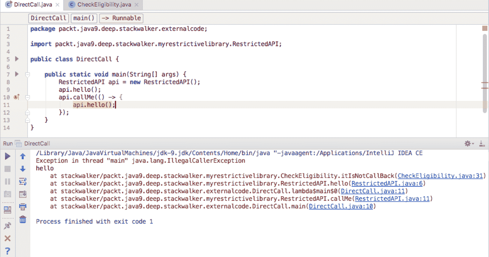

# 细粒度栈跟踪

在最后一章中，我们探讨了`Process`类和`java.lang.ProcessHandle`API。在 Java 早期版本中，Java 中的流程管理需要特定于 OS 的实现，在 CPU 使用和编码实践方面，它的实现不如最优。现代 API，带有诸如`ProcessHandle`等新类，使得几乎可以处理过程管理的所有方面。具体来说，我们介绍了过程，使用`ProcessHandle`接口，并回顾了一个示例过程控制器应用。

在本章中，我们将重点介绍 Java 的`StackWalker`API。API 支持普通程序很少需要的特殊功能。API 在一些非常特殊的情况下非常有用，比如框架提供的功能。因此，如果您想要一种有效的栈遍历方法，使您能够对栈跟踪信息进行可过滤的访问，那么您将喜欢使用`StackWalker`API。API 提供了对调用栈的快速优化访问，实现了对单个帧的延迟访问。

具体来说，我们将讨论以下主题：

*   Java 栈概述
*   栈信息的重要性
*   使用`StackWalker`
*   `StackFrame`
*   性能

# 技术要求

本章以及随后的章节以 Java18.9（也称为 Java11）为特色。Java 平台的标准版（SE）可以从 [Oracle 的官方下载站点](http://www.oracle.com/technetwork/java/javase/downloads/index.html)下载。

集成开发环境（IDE）软件包就足够了。来自 JetBrains 的 IntelliJ IDEA 用于与本章和后续章节相关的所有编码。[IntelliJ IDEA 的社区版可从以下网站下载](https://www.jetbrains.com/idea/features/)。

# Java 栈概述

在深入研究`StackWalker`之前，让我们先介绍一下 Java 栈。我们将查看基本栈信息，而不是针对`StackWalker`。

Java 运行时有一个名为`Stack`的类，可以使用**后进先出**（**LIFO**）策略来存储对象。算术表达式是使用栈计算的。如果我们在代码中加上`A`和`B`，首先将`A`推送到**操作数栈**上，然后将`B`推送到操作数栈上，最后执行加法运算，取操作数栈最上面的两个元素并推送结果，`A`+`B`那里。

JVM 是用 C 编写的，并执行调用 C 函数并从那里返回。此调用返回序列使用**本机方法栈**与其他 C 程序一样进行维护。

最后，当 JVM 创建一个新线程时，它还会分配一个调用栈，其中包含一个帧，该帧依次包含本地变量、对上一个帧的引用以及对包含执行方法的类的引用。当调用一个方法时，会创建一个新的框架。当一个方法完成它的执行时，框架就被破坏了；换句话说，它返回或抛出一个异常。这个栈，**Java 虚拟机栈**，是`StackWalker`API 管理的栈。

# 栈信息的重要性

一般来说，我们在开发依赖调用方的代码时需要栈信息。拥有关于调用者的信息可以让我们的代码根据这些信息做出决策。在一般实践中，让功能依赖于调用者不是一个好主意。影响方法行为的信息应该可以通过参数获得。依赖调用方的代码开发应该相当有限。

JDK 使用 Java 应用不可用的本机方法访问栈信息。`SecurityManager`类是定义应用安全策略的类。此类检查是否允许反射 API 的调用方访问另一个类的非公共成员。要做到这一点，它必须能够访问调用者类，并通过受保护的本机方法实现这一点。

这是一个实现一些安全措施而不必遍历栈的示例。我们为外部开发人员打开代码，将其用作库。我们还调用库用户提供的类的方法，它们可能会回调到我们的代码。我们希望允许库用户调用某些代码，但前提是这些代码不是从我们的代码中调用的。如果我们不想让库使用代码直接访问某些代码，我们可以使用 Java 的模块化结构，而不导出包含不被调用的类的包。这就是我们设置额外条件的原因，即代码对来自外部的调用者可用，除非它们是由我们的代码调用的：


隔离受保护代码

另一个例子是当我们想要访问一个记录器时。Java 应用使用许多不同的记录器，并且日志记录系统通常非常灵活，因此可以根据实际需要打开和关闭不同记录器的输出，以便对代码进行内省。最常见的做法是为每个类使用不同的记录器，记录器的名称通常是类的名称。这种做法非常普遍，日志框架甚至提供了记录器访问方法，这些方法接受对类本身的引用而不是名称。它本质上意味着获取记录器句柄的调用如下所示：

```java
private static final Logger LOG = Logger.getLogger(MyClass.class);
```

如果在获取新记录器的调用中忘记更改类名的名称，则在从现有类创建新类时可能会出现问题。这不是一个严重的问题，但它是常见的。在这种情况下，我们的代码将使用另一个类的记录器，它实际上可以工作，但在分析日志文件时可能会造成混乱。如果我们有一个方法返回名为调用方类的记录器，那就更好了。

让我们在接下来的两节中用示例代码片段继续探索栈信息。

# 示例-限制调用者

在本节中，我们将用两种方法开发一个示例库。`hello()`方法将`hello`打印到标准输出。`callMe()`方法接受`Runnable`作为参数并运行它。然而，第一种方法受到限制。它只在调用方完全在库之外时执行。如果调用方以调用库的方式获得控件，则抛出`IllegalCallerException`，可能是通过调用传递的`Runnable`的第二个方法。API 的实现很简单：

```java
package packt.java9.deep.stackwalker.myrestrictivelibrary;
public class RestrictedAPI {
  public void hello() {
    CheckEligibility.itIsNotCallBack();
    System.out.println("hello");
  }
  public void callMe(Runnable cb) {
    cb.run();
  }
}
```

执行资格检查的代码是在一个单独的类中实现的，以保持简单；我们将在本节稍后检查该代码。首先，让我们回顾一下用于开始演示的主要代码：

```java
package packt.java9.deep.stackwalker.externalcode;
import packt.java9.deep.stackwalker.myrestrictivelibrary.RestrictedAPI;

public class DirectCall {
  public static void main(String[] args) {
    RestrictedAPI api = new RestrictedAPI();
    api.hello();
    api.callMe(() -> { api.hello(); 
    });
  }
}
```

这段代码创建了我们的 API 类的一个实例，然后直接调用`hello()`方法。它应该可以工作，并且应该在屏幕上打印字符`hello`。下一行代码要求`callMe()`方法回调以 Lambda 表达式形式提供的`Runnable`。在这种情况下，调用将失败，因为调用方在库外部，但是从库内部调用的。

现在让我们看看资格检查是如何实现的：

```java
package packt.java9.deep.stackwalker.myrestrictivelibrary;
import static java.lang.StackWalker.Option.RETAIN_CLASS_REFERENCE;

public class CheckEligibility {
  private static final String packageName
    = CheckEligibility.class.getPackageName();
  private static boolean notInLibrary(StackWalker.StackFrame f) {
    return !inLibrary(f);
  }

  private static boolean inLibrary(StackWalker.StackFrame f) {
    return f.getDeclaringClass().getPackageName()
      .equals(packageName);
  }

  public static void itIsNotCallBack() {
    boolean eligible = StackWalker
      .getInstance(RETAIN_CLASS_REFERENCE)
      .walk(s -> s.dropWhile(CheckEligibility::inLibrary)
      .dropWhile(CheckEligibility::notInLibrary)
      .count() == 0
    );
    if (!eligible) {
      throw new IllegalCallerException();
    }
  }
}
```

`itIsNotCallBack()`方法是从`hello()`方法调用的方法。此方法创建`StackWalker`并调用`walk()`方法。`walk()`方法的参数是一个函数，它将`StackFrame`对象的`Stream`转换为`walk()`方法将返回的其他值。

一开始，这个参数设置似乎很复杂，很难理解。更合乎逻辑的做法是返回提供`StackFrame`对象的`Stream`，而不是强制调用者定义一个将其作为参数的函数。

示例代码使用 Lambda 表达式将函数定义为`walk()`方法的参数。Lambda 表达式的参数是流。因为这个流的第一个元素是实际的调用，所以我们放弃它。因为如果调用方不符合条件，也应该拒绝这些调用，即使对`hello()`方法的调用是通过库中已经存在的其他类和方法进行的，所以我们从框架中删除属于`CheckEligibility`类包中类的所有元素。这个包是`packt.java9.deep.stackwalker.myrestrictivelibrary`，在代码中，这个字符串存储在`packageName`字段中。结果流只包含来自库外部的`StackFrame`对象。我们把这些也扔下去，直到流耗尽，或者直到我们发现`StackFrame`又属于图书馆。如果所有的元素都消失了，我们就好了。在这种情况下，`count()`的结果为零。如果我们在`StackFrame`中找到一个属于库的类，这意味着外部代码是从库中调用的，在这种情况下，我们必须拒绝工作。在这种情况下，变量`eligible`将是`false`，我们抛出一个异常，如下面的屏幕截图所示：



`StackFrame`在库中找到的类

# 示例–为调用者获取记录器

在 Java 中，我们使用 API 来获取`Logger`。使用 API，模块可以为服务`LoggerFinder`提供实现，服务`LoggerFinder`可以返回实现`getLogger()`方法的`Logger`。这消除了库对特定记录器或记录器外观的依赖，这是一个巨大的优势。还有一个更小但仍然很烦人的问题需要我们在`getLogger()`方法的参数中再次写入类名。

为了避免这个繁琐的任务，我们创建了一个辅助类来查找调用者类并检索适合调用者类和模块的记录器。因为在这种情况下不需要栈跟踪中引用的所有类，所以我们将调用`StackWalker`类的`getCallerClass()`方法。我们在`packt.java9.deep.stackwalker.logretrieve`包中创建一个名为`Labrador`的类：

```java
package packt.java9.deep.stackwalker.logretriever;
import java.lang.System.Logger;
import java.lang.System.LoggerFinder;
import static java.lang.StackWalker.Option.RETAIN_CLASS_REFERENCE;

public class Labrador {
  public static Logger retrieve() {
    final Class clazz = StackWalker
      .getInstance(RETAIN_CLASS_REFERENCE)
      .getCallerClass();
    return LoggerFinder.getLoggerFinder().getLogger(
      clazz.getCanonicalName(), clazz.getModule());
  }
}
```

在 Java9 之前，这个问题的解决方案是从`Thread`类中获取`StackTrace`数组，并从中查找调用者类的名称。另一种方法是扩展`SecurityManager`，它有一个受保护的方法`getClassContext()`，该方法返回栈上所有类的数组。这两种解决方案都遍历栈并组成一个数组，尽管我们只需要数组中的一个元素。在`Logger`检索的情况下，这可能不是显著的性能损失，因为记录器通常存储在`private static final`字段中，因此在类初始化期间每个类初始化一次。在其他用例中，性能损失可能很大。

接下来，我们来看看`StackWalker`的细节。

# 与`StackWalker`合作

在本节中，您将熟悉如何使用`StackWalker`。本节将探讨以下主题：

*   获取`StackWalker`实例
*   枚举选项
*   访问类
*   `StackWalker`方法

# 获取`StackWalker`的实例

要遍历栈元素，我们需要一个`StackWalker`的实例。为此，我们调用`getInstance()`方法。如图所示，此方法有四个重载版本：

*   `static StackWalker getInstance()`
*   ``static StackWalker getInstance(StackWalker.Option option)``
*   `static StackWalker getInstance(Set<StackWalker.Option> options)`
*   `static StackWalker getInstance(Set<StackWalker.Option> options, int estimateDepth)`

第一个版本不接受任何参数，并返回一个`StackWalker`实例，让我们遍历正常的栈帧。这通常是我们感兴趣的。该方法的其他版本接受一个或多个`StackWalker`类中的`StackWalker.Option`枚举，有三个值：

*   `RETAIN_CLASS_REFERENCE`
*   `SHOW_REFLECT_FRAMES`
*   `SHOW_HIDDEN_FRAMES`

# 枚举选项

`RETAIN_CLASS_REFERENCE`、`SHOW_REFLECT_FRAMES`和`SHOW_HIDDEN_FRAMES`枚举选项具有自描述性名称，下面将对其进行说明。

# `RETAIN_CLASS_REFERENCE`

如果我们指定第一个选项的枚举常量，`RETAIN_CLASS_REFERENCE`作为`getInstance()`方法的参数，那么返回的实例将授予我们访问各个栈在遍历期间引用的类的权限。

# `SHOW_REFLECT_FRAMES`

`SHOW_REFLECT_FRAMES`枚举常量将生成一个遍历器，其中包含来自某个反射调用的帧。

# `SHOW_HIDDEN_FRAMES`

最后，枚举常量选项`SHOW_HIDDEN_FRAMES`将包括所有隐藏帧，其中包含反射调用以及为 Lambda 函数调用生成的调用帧。

下面是反射和隐藏框架的简单演示：

```java
package packt;
import static java.lang.StackWalker.Option.SHOW_HIDDEN_FRAMES;
import static java.lang.StackWalker.Option.SHOW_REFLECT_FRAMES;
public class Main {
```

允许我们执行此代码的`main`方法直接调用`simpleCall()`方法：

```java
public static void main(String[] args) {
  simpleCall();
}
```

`simpleCall()`方法只是调用，顾名思义：

```java
static void simpleCall() {
  reflectCall();
}
```

链中的下一个方法要复杂一些。虽然这也只调用下一个，但它使用反射：

```java
static void reflectCall() {
  try {
    Main.class.getDeclaredMethod("lambdaCall",
      new Class[0]).invoke(null, new Object[0]);
  } catch (Exception e) {
      throw new RuntimeException();
  }
}
```

在下一个示例中，我们有一个使用 Lambda 调用的方法：

```java
static void lambdaCall() {
  Runnable r = () -> {
    walk();
  };
  r.run();
}
```

实际行走前的最后一种方法称为`walk()`：

```java
static void walk() {
  noOptions();
  System.out.println();
  reflect();
  System.out.println();
  hidden();
}
```

前面的`walk()`方法依次调用三个方法。这些方法非常相似，如下所示：

```java
static void noOptions() {
  StackWalker
    .getInstance()
    .forEach(System.out::println);
}

static void reflect() {
  StackWalker
    .getInstance(SHOW_REFLECT_FRAMES)
    .forEach(System.out::println);
}

static void hidden() {
  StackWalker
    .getInstance(SHOW_HIDDEN_FRAMES)
    .forEach(System.out::println);
}
```

前面三种方法将帧打印到标准输出。他们使用`StackWalker`的`forEach()`方法。下面是栈遍历程序的输出：

```java
stackwalker/packt.Main.noOptions(Main.java:45)
stackwalker/packt.Main.walk(Main.java:34)
stackwalker/packt.Main.lambda$lambdaCall$0(Main.java:28)
stackwalker/packt.Main.lambdaCall(Main.java:30)
stackwalker/packt.Main.reflectCall(Main.java:19)
stackwalker/packt.Main.simpleCall(Main.java:12)
stackwalker/packt.Main.main(Main.java:8)
```

此输出仅包含属于代码中的调用的帧。`main()`方法调用`simpleCall()`，后者调用`reflectCall()`，后者依次调用`lambdaCall()`，后者调用 Lambda 表达式，后者调用`walk()`，依此类推。我们没有指定任何选项的事实并没有从栈中删除 Lambda 调用。我们执行了那个呼叫，所以它一定在那里。它删除的是 JVM 实现 Lambda 所需的额外栈帧。我们可以在下一个输出中看到，当选项为`SHOW_REFLECT_FRAMES`时，反射帧已经存在：

```java
stackwalker/packt.Main.reflect(Main.java:58)
stackwalker/packt.Main.walk(Main.java:36)
stackwalker/packt.Main.lambda$lambdaCall$0(Main.java:28)
stackwalker/packt.Main.lambdaCall(Main.java:30)
java.base/jdk.internal.reflect.NativeMethodAccessorImpl.invoke0(NativeMethod)
java.base/jdk.internal.reflect.NativeMethodAccessorImpl.invoke(NativeMethodAccessorImpl.java:62)
java.base/jdk.internal.reflect.DelegatingMethodAccessorImpl.invoke(DelegatingMethodAccessorImpl.java:43)
java.base/java.lang.reflect.Method.invoke(Method.java:547)
stackwalker/packt.Main.reflectCall(Main.java:19)
stackwalker/packt.Main.simpleCall(Main.java:12)
stackwalker/packt.Main.main(Main.java:8)
```

在这种情况下，区别在于我们可以看到，从`reflectCall()`方法到`lambdaCall()`方法的调用不是直接的。`reflectCall()`方法调用调用调用另一个名称相同的方法的`invoke()`方法，该方法在不同的类中定义，该方法反过来调用`invoke()`方法，该方法是 JVM 提供的本机方法。然后，我们终于找到了`lambdaCall()`方法。

在输出中，我们还可以看到这些反射调用属于`java.base`模块，而不是我们的`StackWalker`模块。

如果我们除了反射帧之外还包括隐藏帧，并指定选项`SHOW_HIDDEN_FRAMES`，那么我们将看到以下输出：

```java
stackwalker/packt.Main.hidden(Main.java:52)
 stackwalker/packt.Main.walk(Main.java:38)
stackwalker/packt.Main.lambda$lambdaCall$0(Main.java:28)
stackwalker/packt.Main$$Lambda$46/269468037.run(Unknown Source)
stackwalker/packt.Main.lambdaCall(Main.java:30)
java.base/jdk.internal.reflect.NativeMethodAccessorImpl.invoke0(NativeMethod)
java.base/jdk.internal.reflect.NativeMethodAccessorImpl.invoke(NativeMethodAccessorImpl.java:62)
java.base/jdk.internal.reflect.DelegatingMethodAccessorImpl.invoke(DelegatingMethodAccessorImpl.java:43)
java.base/java.lang.reflect.Method.invoke(Method.java:547)
stackwalker/packt.Main.reflectCall(Main.java:19)
stackwalker/packt.Main.simpleCall(Main.java:12)
stackwalker/packt.Main.main(Main.java:8)
```

这包括 JVM 用来执行 Lambda 调用的额外隐藏帧。此外，还包括反射框。

# 关于枚举常量的最后思考

我们还可以指定多个选项来提供一组选项。最简单的方法是使用`java.util.Set`接口的静态`of()`方法。这样，`RETAIN_CLASS_REFERENCE`选项可以与`SHOW_REFLECT_FRAMES`选项或`SHOW_HIDDEN_FRAMES`选项组合。

尽管从技术上讲可以将`SHOW_REFLECT_FRAMES`和`SHOW_HIDDEN_FRAMES`组合为一个选项集，但这样做并没有什么好处。后者包括前者，因此两者的结合与后者完全相同。

# 访问类

当我们想在栈遍历期间访问类对象时，我们必须指定`RETAIN_CLASS_REFERENCE`选项。虽然`StackFrame`接口定义了`getClassName()`方法，但可以使用`Class.forName()`方法访问名称为的类，这样做并不能保证`StackFrame`对象引用的类是由调用`Class.forName()`的代码所在的类装入器装入的。在某些特殊情况下，我们可能会得到由两个不同的类装入器装入的两个同名的不同类。

如果在创建`StackWalker`实例的过程中没有使用该选项，则返回类对象的方法将抛出`UnsupportedOperationException`异常。这样，`getDeclaringClass()`就不能用在`StackFrame`上，`getCallerClass()`不能用在`StackWalker`上。

# `walk()`方法

`StackWalker`类定义了`forEach()`方法，该方法期望`Consumer`（最好是以 Lambda 表达式的形式），该方法为向上遍历栈的栈跟踪的每个元素调用。`Consumer`方法的参数是`StackFrame`对象。

尽管名为`forEach`的方法也是由`Stream`接口定义的，并且`walk()`方法将`Stream`对象作为参数传递给它得到的函数，但我们不应混淆这两者。`StackWalker`中的`forEach()`方法是一种更简单的方法，大多数情况下是一种不太有效的方法，可以穿透栈跟踪的所有元素。

在大多数情况下，它的效率较低，因为它强制`StackWalker`实例获取栈跟踪的所有元素，这样`forEach()`方法就可以遍历每个元素到最后。如果我们知道我们不会遍历栈跟踪到最后，我们应该使用`walk()`方法，即以惰性的方式访问栈，从而为性能优化留下更多的空间。

`StackWalker`类有`walk()`方法，这是使其成为遍历器的定义方法。该方法接受由`StackWalker`调用的函数。`walk()`方法的返回值将是函数返回的对象。函数的参数是传递栈帧的`Stream<StackFrame>`。第一帧是包含`walk()`方法调用的帧，下一帧是调用包含`walk()`方法调用的帧，依此类推。

该函数可用于根据来自流的`StackFrame`对象计算一些值，并决定调用方是否有资格调用我们的代码。

在回顾了`walk()`方法之后，您可能会想，这个方法需要一个函数，而函数又得到一个`Stream<StackFrame>`作为参数，为什么它如此复杂。理想情况下，我们可以直接从`StackWalter`实例获取`Stream<StackFrame>`。最简单的方法是将流从函数传回。考虑以下示例：

```java
// EXAMPLE OF WHAT NOT TO DO!!!!
public static void itIsNotCallBack() {
  Stream<StackWalker.StackFrame> stream = StackWalker
    .getInstance(RETAIN_CLASS_REFERENCE)
    .walk(s -> s);
  // The following results in an EXCEPTION 
  boolean eligible = stream
    .dropWhile(CheckEligibility::inLibrary)
    .dropWhile(CheckEligibility::notInLibrary)
    .count() == 0;
  if (!eligible) {
    throw new IllegalCallerException();
  }
}
```

我们所做的只是直接从遍历器调用返回流，然后遍历流，然后执行相同的计算。我们的结果是`IllegalStateException`例外，而不是资格检查。

原因是`StackWalker`的实现高度优化。它不会复制整个栈来为流提供源信息。它是从实际的，活生生的栈中工作的。为此，必须确保在使用流时不修改栈。这与迭代集合时更改集合可能得到的`ConcurrentModificationException`异常非常相似。如果我们在调用栈中向上传递流，然后想要从中获取`StackFrame`，那么流将尝试从早已消失的栈帧中获取信息，因为我们从它所属的方法返回。这样，`StackWalker`就不会生成整个栈的快照，而是从实际栈开始工作，并且必须确保所需的栈部分不会更改。我们可以从函数中调用方法，这样我们可以在调用链中更深入地挖掘，但是在流被使用时，我们不能得到更高的值。

`StackWalker`类是`final`类，不能扩展。

# `StackFrame`

在前面的部分中，我们遍历了`StackFrame`元素并提供了示例代码片段。接下来，我们将更仔细地研究它。`StackFrame`是`StackWalker`类内部定义的接口。它定义了访问器，是一个转换器，可用于将信息转换为`StackTraceElement`。

接口定义的访问器如下：

*   `getClassName()`返回`StackFrame`表示的方法类的二进制名称。
*   `getMethodName()`返回`StackFrame`表示的方法名称。
*   `getDeclaringClass()`返回`StackFrame`表示的方法的类。如果在创建`StackWalker`实例时没有使用`Option.RETAIN_CLASS_REFERENCE`，则该方法将抛出`UnsupportedOperationException`。
*   `getByteCodeIndex()`获取包含`StackFrame`表示的方法的执行点的代码数组的索引。当查看命令行工具`javap`可以提供给我们的反汇编 Java 代码时，这个值的使用在 bug 搜索期间会很有帮助。这个值的编程使用只能对直接访问代码的字节码的应用、Java 代理或在运行时生成字节码的库有价值。如果方法是本机的，则该方法将返回一个负数。
*   `getFileName()`返回定义了`StackFrame`表示的方法的源文件名。
*   `getLineNumber()`返回源代码的行号。
*   如果`StackFrame`表示的方法是本机方法，`isNativeMethod()`返回`true`，否则返回`false`。

`StackFrame`不提供任何方法来访问该方法所属的对象。您无法访问由`StackFrame`表示的方法的参数和局部变量，并且没有其他方法可以实现这一点。这很重要。这样的访问太具侵入性，是不可能的。

# 性能

如果不考虑性能因素，我们对`StackWalker`的报道是不完整的。

`StackWalker`高度优化，不会产生大量未使用的内存结构。这就是为什么我们必须使用传递给`walker()`方法的函数作为参数的原因。这也是创建时，`StackTrace`不会自动转换为`StackTraceElement`的原因。只有当我们查询方法名，即特定的`StackTraceElement`的行号时，才会发生这种情况。理解这种转换需要花费大量的时间是很重要的，如果它在代码中用于某种调试目的，则不应将其留在那里。

为了使`StackWalker`更快，我们可以提供我们将在流中工作的`StackFrame`元素的估计数。如果我们不提供这样的估计，JDK 中的当前实现将使用八个预分配的`StackFrame`对象，当这些对象用完时，JDK 将分配更多的对象。JDK 将根据我们的估计分配元素的数量，除非我们估计的值大于 256。在这种情况下，JDK 将使用 256。

# 总结

在本章中，我们学习了如何使用`StackWalker`API，并检查了示例代码片段以加强我们的理解。我们对 API 的详细审查包括不同的使用场景、选项和信息。我们探讨了 API 的复杂性，并分享了如何使用和如何不使用该类。最后我们讨论了一些开发人员应该注意的相关性能问题。

在下一章中，我们将介绍与现代 Java 平台相关的十几种工具和工具增强。这些特色的变化将涵盖各种各样的工具和 API 的更新，这些工具和 API 旨在使使用 Java 进行开发变得更容易，并且能够创建优化的 Java 应用。我们将介绍新的 HTTP 客户端、对 Javadoc 和 Doclet API 的更改、新的 JavaScript 解析器、JAR 和 JRE 更改、新的 Java 级 JVM 编译器接口、对 TIFF 图像的支持、平台日志记录、XML 目录支持、集合、新的特定于平台的桌面功能、对方法处理的增强以及废弃注释。

# 问题

1.  Java 如何使用栈存储对象？
2.  Java 对调用返回序列使用什么栈？
3.  `StackWalker`API 管理什么栈？
4.  如何检索记录器？
5.  `getCallerClass()`方法属于哪一类？
6.  `StackWalker.Option`枚举的可能值是什么？
7.  `RETAIN_CLASS_REFERNCE`枚举用于什么？
8.  `SHOW_REFLECT_FRAMES`枚举用于什么？
9.  `SHOW_HIDDEN_FRAMES`枚举用于什么？
10.  `StackWalker`类怎么扩展？