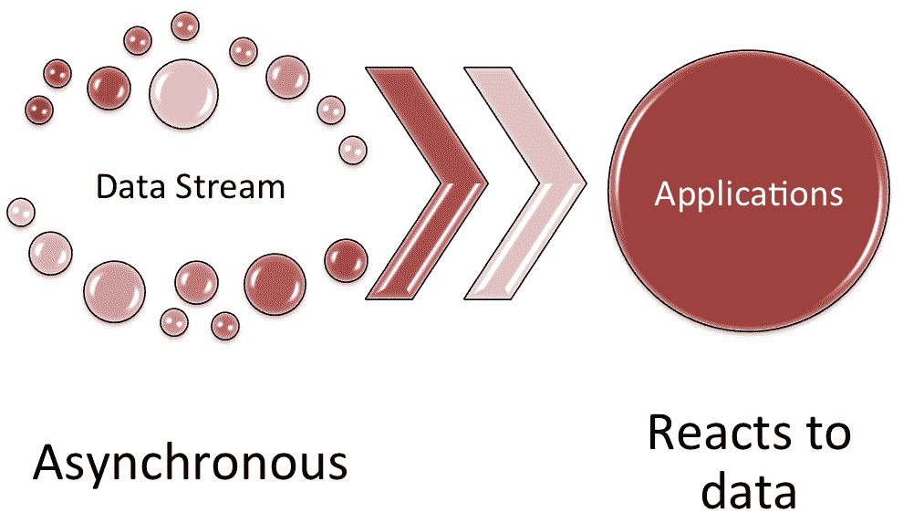
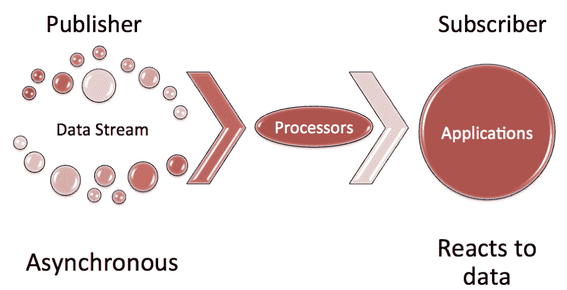
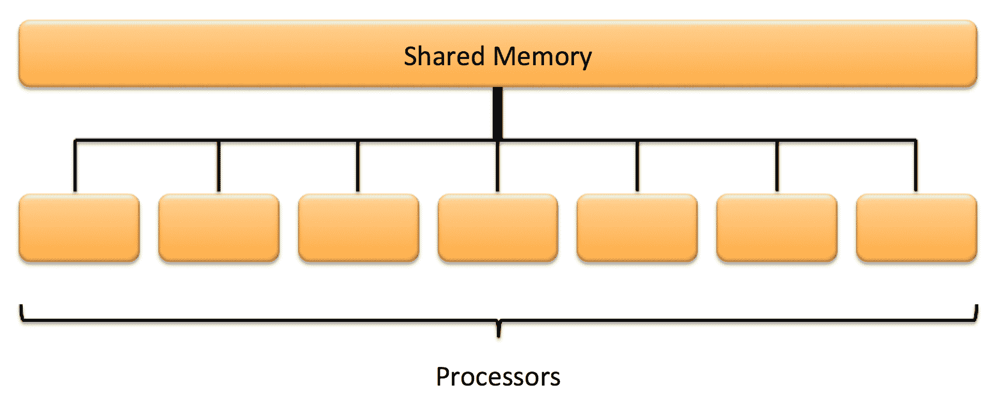
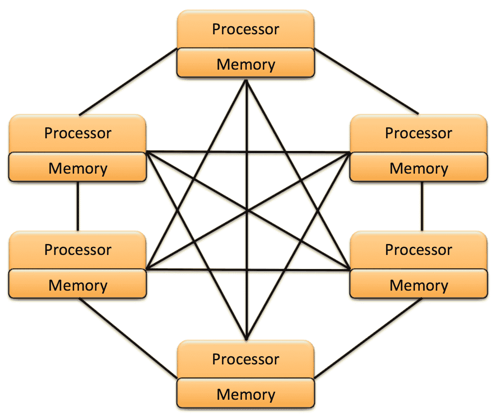

# 并发性增强

在上一章中，我们讨论了现代 Java 平台的几个增强。这些增强代表了一系列工具和 API 的更新，以使使用 Java 开发更容易，并为我们的 Java 应用提供了更大的优化可能性。我们研究了新的 HTTP 客户端、对 Javadoc 和 Doclet API 的更改、新的 JavaScript 解析器、JAR 和 JRE 更改、新的 Java 级 JVM 编译器接口、对 TIFF 图像的新支持、平台日志记录、XML 目录支持、集合以及新的特定于平台的桌面功能。我们还研究了对方法处理和弃用注解的增强。

在本章中，我们将介绍 Java 平台的并发增强。我们主要关注的是对反应式编程的支持，这是一种由`Flow `类 API 提供的并发增强。反应式编程最初是在 Java9 中发布的，它仍然是 Java10 和 Java11 的一个重要特性。我们还将探讨额外的并发增强。

更具体地说，我们将讨论以下主题：

*   反应式程序设计
*   `Flow`API
*   其他并发更新
*   旋转等待提示

# 技术要求

本章以及随后的几章介绍 Java11。Java 平台的 SE 可从 [Oracle 官方网站](http://www.oracle.com/technetwork/java/javase/downloads/index.html)下载。

集成开发环境（IDE）软件包就足够了。来自 JetBrains 的 IntelliJ IDEA 用于与本章和后续章节相关的所有编码。IntelliJ IDEA 的社区版可从[网站](https://www.jetbrains.com/idea/features/)下载。

# 反应式程序设计

反应式编程是指应用在异步数据流发生时对其作出反应。下图说明了此流程：



反应式编程流程

反应式编程并不是一个仅由学术界使用的奇特的软件工程术语。事实上，它是一种编程模型，可以提高效率，而不是让应用在内存中的数据上迭代的更常见方法。

有更多的反应式编程。首先，让我们考虑一下数据流是由发布者以异步方式提供给订阅服务器的。

数据流是字符串和原始数据类型的二进制输入/输出，`DataInput`接口用于输入流，`DataOutput `接口用于输出流。

处理器或处理器链可用于转换数据流，而无需发布者或订阅者参与。在下面的例子中，**处理器**在没有**发布者**或**订户**参与，甚至没有意识到的情况下处理数据流：



处理器-订户关系

除了更高的效率之外，反应式编程还带来了一些额外的好处，这些好处强调如下：

*   代码库可以不那么冗长，因此：
*   更容易编码
*   易于维护
*   更容易阅读

*   流处理可提高内存效率
*   这是一个针对各种编程应用的解决方案
*   需要编写的样板代码更少，因此开发时间可以集中在编程核心功能上
*   以下类型的编程需要较少的时间和代码：
*   并发
*   低级线程
*   同步

# 反应式程序设计标准化

软件开发的许多方面都有标准，而反应式编程也没有逃脱这一点。有一个**反应流**计划来标准化异步流处理。在 Java 上下文中，具体的焦点是 JVM 和 JavaScript。

Reactive 流计划旨在解决控制线程之间如何交换数据流的问题。正如您在上一节中所记得的，处理器的概念是基于对发布者或接收器没有影响。本无影响授权书规定，不需要以下内容：

*   数据缓冲
*   数据平移
*   转换

该标准的基本语义定义了数据流元素传输的规则。这个标准是专门为 Java9 平台而建立的。Reactive 流包含一个库，可以帮助开发人员在`org.reactivestreams`和`java.util.concurrent.Flow`名称空间之间进行转换。

成功使用反应式编程和反应式流标准化的关键是理解相关术语：

| **术语** | **说明** |
| --- | --- |
| 需求 | 需求是指订阅者对更多元素的请求，以及发布者尚未满足的元素请求总数。 |
| 需求 | 需求还指发布者尚未满足的请求元素总数。 |
| 外部同步 | 线程安全的外部访问协调。 |
| 无阻碍 | 如果方法在不需要大量计算的情况下快速执行，则称其为无障碍方法。非阻塞方法不会延迟订阅服务器的线程执行。 |
| 没有 | NOP 执行是可以重复调用而不影响调用线程的执行。 |
| 响应度 | 这个术语是指组件的响应能力。 |
| 正常返回 | 正常返回是指当没有错误时的正常状态。`onError`方法是标准允许的唯一通知用户故障的方法。 |
| 信号 | 以下方法之一： |
| | `cancel()` |
| | `onComplete()` |
| | `onError()` |
| | `onSubscribe()` |
| | `request()` |

在下一节中，我们将研究 Java 平台中的`Flow` API，因为它们对应于反应流规范。

# `Flow` API

`Flow`类是`java.util.concurrent`包的一部分。它帮助开发人员将反应式编程融入到他们的应用中。这个类有一个方法`defaultBufferSize()`和四个接口。

`defaultBufferSize()`方法是一个静态方法，返回发布和订阅缓冲区的默认缓冲区大小。默认为`256`，返回为`int`。

让我们看看这四个接口。

# `Flow.Publisher`接口

`Flow.Publisher`接口是一个函数式接口。`Publisher`是发送给用户的数据的生产者：

```java
@FunctionalInterface
public static interface Flow.Publisher<T>
```

此函数式接口可以用作 Lambda 表达式赋值目标。它只接受一个参数，所订阅项目的类型`<T>`。它有一种方法，即`void subscribe(Flow.Subscriber subscriber)`。

# `Flow.Subscriber`接口

`Flow.Subscriber`接口用于接收消息，其实现如下：

```java
public static interface Flow.Subscriber<T>
```

此接口设置为接收消息。它只接受一个参数，所订阅项目的类型，`<T>`。它有以下方法：

*   `void onComplete()`
*   `void onError(Throwable throwable)`
*   `void onNext(T item)`
*   `void onSubscribe(Flow.Subscription subscription)`

# `Flow.Subscription`接口

`Flow.Subscription`接口确保只有订户接收请求。此外，您将在此处看到，订阅可以随时取消：

```java
public static interface Flow.Subscription
```

此接口不接受任何参数，是控制`Flow.Publisher`和`Flow.Subscriber`实例之间消息的链接。它有以下方法：

*   `void cancel()`
*   `void request(long n)`

# `Flow.Processor`接口

`Flow.Processor`接口可以同时作为`Subscriber`和`Publisher`。此处提供了实现：

```java
static interface Flow.Processor<T,R> extends Flow.Subscriber<T>, Flow.Publisher<R>
```

此接口接受两个参数：订阅项类型`<T>`和发布项类型`<R>`。它没有自己的方法，但从`java.util.concurrent.Flow.Publisher`继承了以下方法：

```java
void subscribe(Flow.Subscriber<? super T> subscriber)
```

`Flow.Processor`还继承了`java.util.concurrent.Flow.Subscriber`接口的以下方法：

*   `void onComplete()`
*   `void onError(Throwable throwable)`
*   `void onNext(T item)`
*   `void onSubscribe(Flow.Subscription subscription)`

# 示例实现

在任何给定的反应式编程实现中，我们将有请求数据的`Subscriber`和提供数据的`Publisher`。首先，让我们看一个示例`Subscriber`实现：

```java
import java.util.concurrent.Flow.*;

public class packtSubscriber<T> implements Subscriber<T> {

  private Subscription theSubscription;

  // We will override the four Subscriber interface methods
  @Override
  public void onComplete() {
    System.out.println("Data stream ended");
  }

  @Override
  public void onError(Throwable theError) {
    theError.printStackTrace();
  }

  @Override
  public void onNext(T theItem) {
    System.out.println("Next item received: " + theItem);
    theSubscription.request(19); // arbitrary number 
  }

  @Override
  public void onSubscribe(Subscription theSubscription) {
    this.theSubscription = theSubscription;
    theSubscription.request(19);
  }
}
```

如您所见，实现`Subscriber`并不困难。繁重的工作由位于`Subscriber`和`Publisher`之间的处理器完成。让我们看一个示例实现，`Publisher`向订阅者发布数据流：

```java
import java.util.concurrent.SubsmissionPublisher;
. . .
// First, let's create a Publisher instance
SubmissionPublisher<String> packtPublisher = 
  newSubmissionPublisher<>();

// Next, we will register a Subscriber
PacktSubscriber<String> currentSubscriber = 
  new PacktSubscriber<>();
packtPublisher.subscribe(currentSubscriber);

// Finally, we will publish data to the Subscriber 
// and close the publishing effort
System.out.println("||---- Publishing Data Stream ----||");
. . .
packtPublisher.close();
System.out.println("||---- End of Data Stream Reached ----||");
```

# 额外的并发更新

Java 平台最近得到了增强，以改进并发性的使用。在本节中，我们将简要探讨 Java 并发的概念，并查看 Java 平台的相关增强功能，包括：

*   Java 并发
*   反应流的支持
*   `CompletableFuture`API 增强

# Java 并发

在本节中，我们将从并发的简要说明开始，然后看系统配置，介绍 Java 线程，最后看并发的改进。

# 并发性解释

并行处理从 20 世纪 60 年代就开始了，在那些形成的年代，我们已经有了允许多个进程共享一个处理器的系统。这些系统被更清楚地定义为伪并行系统，因为它看起来只是多个进程同时被执行。时至今日，我们的计算机仍以这种方式运行。20 世纪 60 年代和现在的区别在于，我们的计算机可以有多个 CPU，每个 CPU 都有多个内核，这更好地支持并发。

并发性和并行性经常被用作可互换的术语。并发是指当多个进程重叠时，尽管开始和停止时间可能不同。并行性发生在任务同时启动、运行和停止时。

# 系统配置

需要考虑几种不同的处理器配置。本节提供两种常见配置。第一种配置是共享内存的配置，如下所示：



共享内存配置

如您所见，共享内存系统配置有多个处理器，它们共享一个公共系统内存。第二个特色系统配置是分布式内存系统：



分布式存储系统

在分布式存储系统中，每个处理器都有自己的内存，每个单独的处理器都与其他处理器完全链接，形成了一个完全链接的分布式系统。

# Java 线程

Java 中的线程是一个程序执行，内置在 JVM 中。`Thread`类是`java.lang`包（`java.lang.Thread`的一部分。线程具有控制 JVM 执行它们的顺序的优先级。虽然概念很简单，但实现却不简单。让我们先来仔细看看`Thread`类。

`Thread`类有一个嵌套类：

*   `public static enum Thread.State`

与`Thread`类相关的还有以下接口：

*   `public static interface Thread.UncaughtExceptionHandler`

有三个类变量用于管理线程优先级：

*   `public static final int MAX_PRIORITY`
*   `public static final int MIN_PRIORITY`
*   `public static final int NORM_PRIORITY`

`Thread`类有八个构造器，它们都分配一个新的`Thread`对象。以下是构造器签名：

*   `public Thread()`
*   `public Thread(Runnable target)`
*   `public Thread(Runnable target, String name)`
*   `public Thread(String name)`
*   `public Thread(ThreadGroup group, Runnable target)`
*   `public Thread(ThreadGroup group, Runnable target, String name)`
*   `public Thread(ThreadGroup group, Runnable target, String name, long stackSize)`
*   `public Thread(ThreadGroup group, String name)`

`Thread`类还有 43 个方法，其中 6 个已经被弃用。剩下的方法在这里列出，除了分别列出的访问器和变异器。有关每种方法的详细信息，请参阅文档：

*   `public static int activeCount()`
*   `public final void checkAccess()`
*   `protected Object clone() throws CloneNotSupportedException`
*   `public static Thread currentThread()`
*   `public static void dumpStack()`
*   `public static int enumerate(Thread[] array)`
*   `public static boolean holdsLock(Object obj)`
*   `public void interrupt()`
*   `public static boolean interrupted()`
*   `public final boolean isAlive()`
*   `public final boolean isDaemon()`
*   `public boolean isInterrupted()`
*   连接方法：
*   `public final void join() throws InterruptedException`
*   `public final void join(long millis) throws InterruptedException`
*   `public final void join(long millis, int nano) throws InterruptedException`

*   `public void run()`
*   睡眠方法：
*   `public static void sleep(long mills) throws InterruptedException`
*   `public static void sleep(long mills, int nano) throws InterruptedException`

*   `public void start()`
*   `public String toString()`
*   `public static void yield()`

以下是`Thread`类的访问器/获取器和变异器/设置器列表：

*   访问器/获取器：
*   `public static Map<Thread, StackTraceElement[]> getAllStacktraces()`
*   `public ClassLoader getContextClassLoader()`
*   `public static Thread.UncaughtExceptionHandler getDefaultUncaughtExceptionHandler()`
*   `public long getId()`
*   `public final String getName()`
*   `public final int getPriority()`
*   `public StackTraceElement[] getStackTrace()`
*   `public Thread.State getState()`
*   `public final ThreadGroup getThreadGroup()`
*   `public Thread.UncaughtExceptionHandler getUncaughtExceptionHandler()`

*   更改器/设置器：
*   `public void setContextClassLoader(ClassLoader cl)`
*   `public final void setDaemon(boolean on)`
*   `public static void setDefaultUncaughtExceptionHandler(Thread.UncaughtExceptionHandler eh)`
*   `public final void setName(String name)`
*   `public final void setPriority(int newPriority)`
*   `public void setUncaughtExceptionHandler(Thread.UncaughtException Handler eh)`

在 Java 中，并发通常被称为多线程。如前所述，管理线程，尤其是多线程，需要非常逼真的控制。Java 提供了一些技术，包括锁的使用。可以锁定代码段，以确保在任何给定时间只有一个线程可以执行该代码。我们可以使用`synchronized`关键字锁定类和方法。下面是如何锁定整个方法的示例：

```java
public synchronized void protectedMethod() {
  . . .
}
```

下面的代码片段演示了如何使用`synchronized`关键字锁定方法中的代码块：

```java
. . .
public class unprotectedMethod() {
  . . .
  public int doSomething(int tValue) {
    synchronized (this) {
      if (tValue != 0) {
        // do something to change tValue
        return tValue;
      }
    }
  }
}
```

# 并发性改进

在我们的 Java 应用中使用多线程的能力将极大地提高效率，并利用现代计算机日益增长的处理能力。Java 中线程的使用为我们的并发控制提供了很大的粒度。

线程是 Java 并发功能的核心。我们可以通过定义一个`run`方法并实例化一个`Thread`对象，在 Java 中创建一个线程。完成这组任务有两种方法。我们的第一个选择是扩展`Thread`类并覆盖`Thread.run()`方法。下面是这种方法的一个例子：

```java
. . .
class PacktThread extends Thread {
  . . .
  public void run() {
    . . .
  }
}
. . .
Thread varT = new PacktThread();
. . .
// This next line is start the Thread by 
// executing the run() method.
varT.start();
. . .
```

第二种方法是创建一个实现`Runnable`接口的类，并将该类的实例传递给`Thread`的构造器。举个例子：

```java
. . .
class PacktRunner implements Runnable {
  . . .
  public void run() {
    . . .
  }
}
. . .
PacktRunner varR = new PacktRunner();
Thread varT = new Thread(varR);
. . .
// This next line is start the Thread by 
// executing the run() method.
varT.start();
. . .
```

这两种方法都同样有效，您使用哪种方法被认为是开发人员的选择。当然，如果您希望获得更多的灵活性，那么第二种方法可能是更好的方法。你可以尝试这两种方法来帮助你做出决定。

# `CompletableFuture` API 增强

`CompletableFuture<T>`类是`java.util.concurrent`包的一部分。该类扩展了`Object`类，实现了`Future<T>`和`CompletionStage<T>`接口。此类用于标注可以完成的线程。我们可以使用`CompletableFuture`类来表示未来的结果。当使用`complete`方法时，可以完成将来的结果。

重要的是要认识到，如果多个线程试图同时完成（完成或取消），除一个线程外，其他所有线程都将失败。让我们看看这个类，然后看看增强功能。

# 类详情

`CompletableFuture<T>`类有一个嵌套类，用于标记异步任务：

```java
public static interface CompletableFuture.AsynchronousCompletionTask
```

`CompletableFuture<T>`类的构造器必须与提供的构造器签名同步。它也不能接受任何论据。该类具有以下方法，这些方法按返回的内容组织：

返回`CompletionStage`：

*   `public CompletableFuture<Void> acceptEither(CompletionStage<? extends T> other, Consumer<? super T> action)`
*   `public CompletableFuture<Void> acceptEitherAsync(CompletionStage<? extends T> other, Consumer<? super T> action)`
*   `public CompletableFuture<Void> acceptEitherAsync(CompletionStage<? extends T> other, Consumer<? super T> action, Executor executor)`
*   `public <U> CompletableFuture<U> applyToEither(CompletionStage<? extends T> other, Function<? super T, U> fn)`
*   `public <U> CompletableFuture<U> applyToEitherAsync(CompletionStage<? extends T> other, Function<? super T, U> fn)`
*   `public <U> CompletableFuture<U> applyToEitherAsync(CompletionStage<? extends T> other, Function<? super T, U> fn, Executor executor)`
*   `public static <U> CompletedStage<U> completedStage(U value)`
*   `public static <U> CompletionStage<U> failedStage(Throwable ex)`
*   ``public <U> CompletableFuture<U> handle(BiFunction<? super T, Throwable, ? extends U> fn)``
*   `public <U> CompletableFuture<U> handleAsync(BiFunction<? super T, Throwable, ? extends U> fn)`
*   `public <U> CompletableFuture<U> handleAsync(BiFunction<? super T, Throwable, ? extends U> fn, Executor executor)`
*   `public CompletionStage<T> minimalCompletionStage()`
*   `public CompletableFuture<Void> runAfterBoth(CompletionStage<?> other, Runnable action)`
*   `public CompletableFuture<Void> runAfterBothAsync(CompletionStage<?> other, Runnable action)`
*   `public CompletableFuture<Void> runAfterBothAsync(CompletionStage<?> other, Runnable action, Executor executor)`
*   `public CompletableFuture<Void> runAfterEither(CompletionStage<?> other, Runnable action)`
*   `public CompletableFuture<Void> runAfterEitherAsync(CompletionStage<?> other, Runnable action)`
*   `public CompletableFuture<Void> runAfterEitherAsync(CompletionStage<?> other, Runnable action, Executor executor)`
*   `public CompletableFuture<T> whenComplete(BiConsumer<? super T, ? super Throwable> action)`
*   `public CompletableFuture<T> whenCompleteAsync(BiConsumer<? super T, ? super Throwable> action)`
*   `public CompletableFuture<T> whenCompleteAsync(BiConsumer<? super T, ? super Throwable> action, Executor executor)`

这些方法返回`CompletionStage`：

*   `public CompletableFuture<Void> thenAccept(Consumer<? super T> action)`
*   `public CompletableFuture<Void> thenAcceptAsync(Consumer<? super T> action)`
*   ``public CompletableFuture<Void> thenAcceptAsync(Consumer<? super T> action, Executor executor)``
*   `public <U> CompletableFuture<Void> thenAcceptBoth(CompletionStage<? extends U> other, BiConsumer<? super T, ? super U> action)`
*   `public <U> CompletableFuture<Void> thenAcceptBothAsync(CompletionStage<? extends U> other, BiConsumer<? super T, ? super U> action)`
*   `public <U> CompletableFuture<Void> thenAcceptBothAsync(CompletionStage<? extends U> other, BiConsumer<? super T, ? super U> action, Executor executor)`
*   `public <U> CompletableFuture<U> thenApply(Function<? super T, ? extends U> fn)`
*   `public <U> CompletableFuture<U> thenApplyAsync(Function<? super T, ? extends U> fn)`
*   `public <U> CompletableFuture<U> thenApplyAsync(Function<? super T, ? extends U> fn, Executor executor)`
*   `public <U, V> CompletableFuture<V> thenCombine(CompletionStage<? extends U> other, BiFunction<? super T, ? super U, ? extends V> fn)`
*   `public <U, V> CompletableFuture<V> thenCombineAsync(CompletionStage<? extends U> other, BiFunction<? super T, ? super U, ? extends V> fn)`
*   `public <U, V> CompletableFuture<V> thenCombineAsync(CompletionStage<? extends U> other, BiFunction<? super T, ? super U, ? extends V> fn, Executor executor)`
*   `public <U> CompletableFuture<U> thenCompose(Function<? super T, ? extends CompletionStage<U>> fn)`
*   `public <U> CompletableFuture<U> thenComposeAsync(Function<? super T, ? extends CompletionStage<U>> fn)`
*   `public <U> CompletableFuture<U> thenComposeAsync(Function<? super T, ? extends CompletionStage<U>> fn, Executor executor)`
*   `public CompletableFuture<Void> thenRun(Runnable action)`
*   `public CompletableFuture<Void>thenRunAsync(Runnable action)`
*   `public CompletableFuture<Void>thenRunAsync(Runnable action, Executor executor)`

这些方法返回`CompletableFuture`：

*   `public static CompletableFuture<Void> allOf(CompletableFuture<?>...cfs)`
*   `public static CompletableFuture<Object> anyOf(CompletableFuture<?>... cfs)`
*   `public CompletableFuture<T> completeAsync(Supplier<? extends T> supplier, Executor executor)`
*   `public CompletableFuture<T> completeAsync(Supplier<? extends T> supplier)`
*   `public static <U> CompletableFuture<U> completedFuture(U value)`
*   `public CompletableFuture<T> completeOnTimeout(T value, long timeout, TimeUnit unit)`
*   `public CompletableFuture<T> copy()`
*   `public CompletableFuture<T> exceptionally(Function<Throwable, ? extends T> fn)`
*   `public static <U> CompletableFuture<U> failedFuture(Throwable ex)`
*   `public <U> CompletableFuture<U> newIncompeteFuture()`
*   `public CompletableFuture<T> orTimeout(long timeout, TimeUnit unit)`
*   `public static ComletableFuture<Void> runAsync(Runnable runnable)`
*   `public static CompletableFuture<Void> runAsync(Runnable runnable, Executor executor)`
*   `public static <U> CompletableFuture<U> supplyAsync(Supplier<U> supplier)`
*   `public static <U> CompletableFuture<U> supplyAsync(Supplier<U. supplier, Executor executor)`
*   `public CompletableFuture<T> toCompletableFuture()`

这些方法返回`Executor`：

*   `public Executor defaultExecutor()`
*   `public static Executor delayedExecutor(long delay, Timeunit unit, Executor executor)`
*   `public static Executor delayedExecutor(long delay, Timeunit unit)`

这些方法返回`boolean`：

*   `public boolean cancel(boolean mayInterruptIfRunning)`
*   `public boolean complete(T value)`
*   `public boolean completeExceptionally(Throwable ex)`
*   `public boolean isCancelled()`
*   `public boolean isCompletedExceptionally()`
*   `public boolean isDone()`

无返回类型：

*   `public void obtrudeException(Throwable ex)`
*   `public void obtrudeValue(T value)`

其他方法：

*   `public T get(long timeout, TimeUnit unit) throws InterruptedException, ExecutionException, TimeoutException`
*   `public T get() throws InterruptedException, ExecutionException`
*   `public T getNow(T valueIfAbsent)`
*   `public int getNumberOfDependents()`
*   `public T join()`
*   `public String toString()`

# 增强

作为当前 Java 平台的一部分，`CompletableFuture<T>`类收到了以下增强：

*   添加的基于时间的增强功能：
*   这样可以根据经过的时间来完成
*   现在也支持延迟执行

*   子类显著增强：
    *   扩展`CompletableFuture`更容易
    *   子类支持可选的默认执行器

具体来说，Java9 中添加了以下方法：

*   `newIncompleteFuture()`
*   `defaultExecutor()`
*   `copy()`
*   `minimalCompletionStage()`
*   `completeAsync()`
*   `orTimeout()`
*   `completeOnTimeout()`
*   `delayedExecutor()`
*   `completedStage()`
*   `failedFuture()`
*   `failedStage()`

# 旋转等待提示

对于并发，我们需要确保等待执行的线程实际得到执行。自旋等待的概念是一个不断检查真实情况的过程。Java 平台有一个 API，允许 Java 代码发出当前正在执行自旋循环的提示。

虽然这并不是每个 Java 开发人员都会使用的特性，但它对于低级编程是有用的。提示系统只是发出提示指示，不执行其他操作。添加这些提示的理由包括以下假设：

*   当使用自旋提示时，自旋循环的动作时间可以提高
*   使用自旋提示将减少线程到线程的延迟
*   CPU 功耗将降低
*   硬件线程将执行得更快

这个提示功能将包含在一个新的`onSpinWait()`方法中，作为`java.lang.Thread`类的一部分。下面是实现`onSpinWait()`方法的示例：

```java
. . .
volatile boolean notInReceiptOfEventNotification
. . .
while ( notInReceiptOfEventNotification ); {
  java.lang.Thread.onSpinWait();
}
// Add functionality here to read and process the event
. . .
```

# 总结

在本章中，我们讨论了 Java 平台的并发增强。我们将并发作为一个核心 Java 概念进行了深入的研究，并着眼于 Java 提供了什么。我们还研究了支持反应式编程的`Flow`类 API。此外，我们还探讨了并发增强和新的旋转等待提示。

在下一章中，我们将重点介绍 Java 平台的安全增强功能，以及实际示例。

# 问题

1.  什么是反应式编程？
2.  什么是数据流？
3.  使用反应式编程的主要好处是什么？
4.  反应式编程的无影响授权有哪些规定？
5.  `Flow`类是什么包？
6.  列出`Flow`类的四个接口。
7.  什么是并发性？
8.  并发和并行的区别是什么？
9.  解释共享内存系统配置。
10.  解释分布式内存系统配置。

# 进一步阅读

以下是您可以参考的信息列表：

*   《Java9 反应式编程》在[这个页面](https://www.packtpub.com/application-development/reactive-programming-java-9)提供。
*   《Java9 并发高级元素》【视频】在[这个页面](https://www.packtpub.com/application-development/java-9-concurrency-advanced-elements-video)提供。