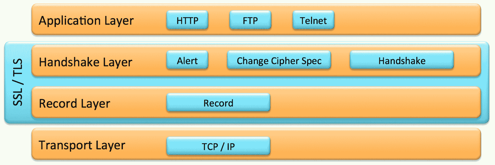
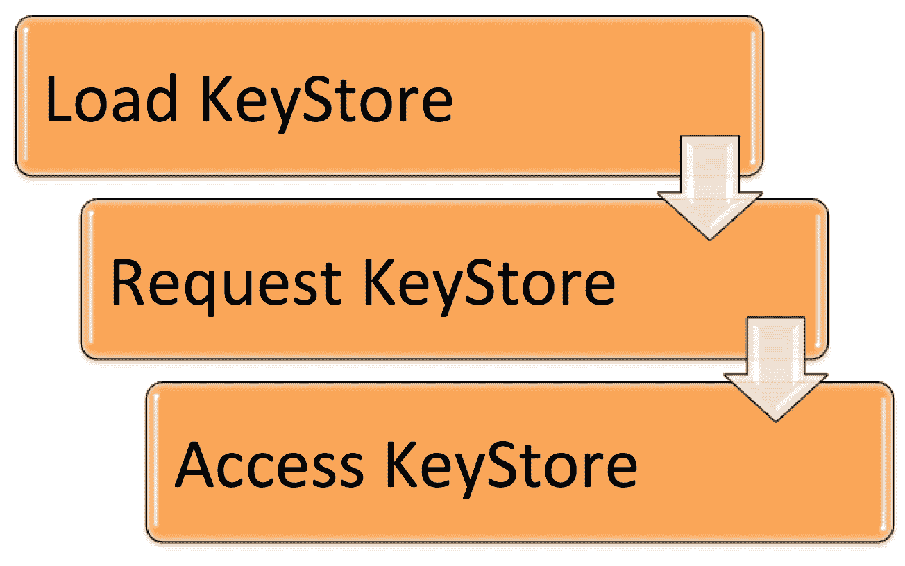
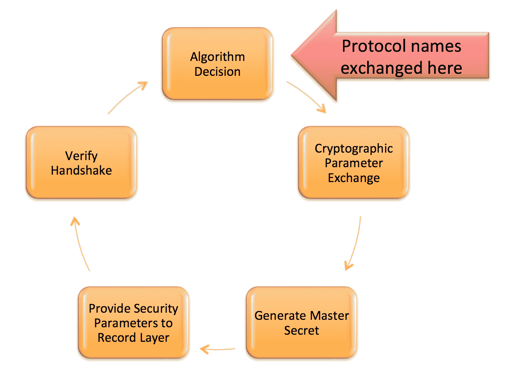
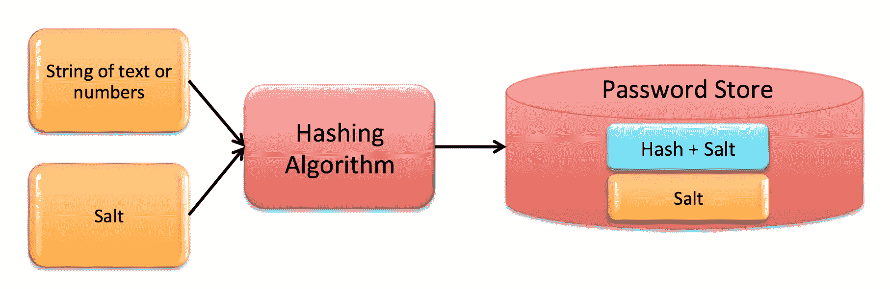

# 安全增强功能

在最后一章中，我们讨论了现代 Java 平台的并发增强。我们深入研究了并发性，它既是一个核心概念，也是 Java 的一系列增强。我们还研究了支持反应式编程的`Flow`类 API。此外，我们还探讨了 Java 的并发增强和 spin wait 提示。

在本章中，我们将介绍最近对 JDK 所做的几个涉及安全性的更改。这些变化的大小并不反映其重要性。现代 Java 平台的安全增强为开发人员提供了编写和维护比以前更安全的应用程序的能力。

更具体地说，我们将在本章中回顾以下主题：

*   数据报传输层安全
*   创建 PKCS12 密钥库
*   提高安全应用程序性能
*   TLS 应用层协议协商扩展
*   利用 GHASH 和 RSA 的 CPU 指令
*   用于 TLS 的 OCSP 装订
*   基于 DRBG 的`SecureRandom`实现

# 技术要求

本章和随后的几章主要介绍 Java11。Java 平台的**标准版**（**SE**）可从 [Oracle 官网](http://www.oracle.com/technetwork/java/javase/downloads/index.html)下载。

IDE 软件包就足够了。来自 JetBrains 的 IntelliJ IDEA 用于与本章和后续章节相关的所有编码。IntelliJ IDEA 的社区版可从[网站](https://www.jetbrains.com/idea/features/)下载。

# 数据报传输层安全

**数据报传输层安全**（**DTLS**）是一种通信协议。该协议为基于数据报的应用程序提供了一个安全层。DTLS 允许安全通信，基于**传输层安全**（**TLS**）协议。嵌入式安全性有助于确保消息不被伪造、篡改或窃听。

让我们回顾一下相关术语：

*   **通信协议**：一组控制信息传输方式的规则。
*   **数据报**：结构化传输单元。
*   **窃听**：监听在途数据包时未被发现。
*   **伪造**：用伪造的发送者传送数据包。
*   **网络包**：一种格式化的数据传输单元。
*   **篡改**：在发送方发送数据包之后，在预定接收方接收数据包之前，对数据包的篡改。
*   **TLS 协议**：最常用的网络安全协议。例如，它使用 IMPA 和 POP 发送电子邮件。

最近的 DTLS Java 增强旨在为 DTLS 的 1.0 和 1.2 版本创建 API。

在接下来的部分中，我们将查看每个 DTLS 版本 1.0 和 1.2，然后回顾对 Java 平台所做的更改。

# DTLS 协议版本 1.0

DTLS 协议 1.0 版于 2006 年建立，为数据报协议提供通信安全。其基本特征如下：

*   允许客户端/服务器应用程序通信，而不允许：
*   窃听
*   篡改
*   信息伪造

*   基于 TLS 协议
*   提供安全保障
*   保留了 DLS 协议的数据报语义

下图说明了**传输层**在 **SSL/TLS** 协议层的总体架构中的位置以及每层的协议：



SSL/TLS 协议层

DTLS 协议版本 1.0 提供了主要覆盖区域的详细规范，如下所示：

*   密码：
*   防重放分组密码
*   新密码套件
*   标准（或空）流密码

*   拒绝服务对策
*   握手：
*   消息格式
*   协议
*   可靠性

*   信息：
*   分裂与重组
*   对丢失不敏感的消息
*   大小
*   超时和重传
*   数据包丢失

*   **路径最大转换单元**（PMTU）发现
*   记录层
*   记录有效负载保护
*   重新排序
*   重放检测
*   传输层映射

# DTLS 协议版本 1.2

DTLS 协议 1.2 版于 2012 年 1 月发布，版权归**互联网工程任务组**（**IETF**）所有。本节共享说明在版本 1.2 中所做更改的代码示例。

下面的代码演示了 TLS1.2 握手消息头。此格式支持：

*   消息碎片
*   消息丢失
*   重新排序：

```java
// Copyright (c) 2012 IETF Trust and the persons identified 
// as authors of the code. All rights reserved.

struct 
{
  HandshakeType msg_type;
  uint24 length;
  uint16 message_seq; // New field
  uint24 fragment_offset; // New field
  uint24 fragment_length; // New field
  select (HandshakeType)
  {
    case hello_request: HelloRequest;
    case client_hello: ClientHello;
    case hello_verify_request: HelloVerifyRequest; // New type
    case server_hello: ServerHello;
    case certificate:Certificate;
    case server_key_exchange: ServerKeyExchange;
    case certificate_request: CertificateRequest;
    case server_hello_done:ServerHelloDone;
    case certificate_verify: CertificateVerify;
    case client_key_exchange: ClientKeyExchange;
    case finished: Finished;
  } body;
} Handshake;
```

本节中的代码来自 DTLS 协议文件，并根据 IETF *有关文件*的法律规定重新发布。

记录层包含我们打算发送到记录中的信息。信息开始于`DTLSPlaintext`结构中，然后在握手发生之后，记录被加密，并且可以通过通信流发送。记录层格式遵循 1.2 版中的新字段，并在代码注释中用`// New field`注释，如下所示：

```java
// Copyright (c) 2012 IETF Trust and the persons identified
// as authors of the code. All rights reserved.

struct
{
  ContentType type;
  ProtocolVersion version;
  uint16 epoch; // New field
  uint48 sequence_number; // New field
  uint16 length;
  opaque fragment[DTLSPlaintext.length];
} DTLSPlaintext;

struct
{
  ContentType type;
  ProtocolVersion version;
  uint16 epoch; // New field
  uint48 sequence_number; // New field
  uint16 length;
  opaque fragment[DTLSCompressed.length];
} DTLSCompressed;

struct
{
  ContentType type;
  ProtocolVersion version;
  uint16 epoch; // New field
  uint48 sequence_number; // New field
  uint16 length;
  select (CipherSpec.cipher_type)
  {
    case block: GenericBlockCipher;
    case aead: GenericAEADCipher; // New field
  } fragment;
} DTLSCiphertext;
```

最后，这里是更新的握手协议：

```java
// Copyright (c) 2012 IETF Trust and the persons identified
// as authors of the code. All rights reserved.

enum {
  hello_request(0), client_hello(1),
  server_hello(2),
  hello_verify_request(3), // New field
  certificate(11), server_key_exchange (12),
  certificate_request(13), server_hello_done(14),
  certificate_verify(15), client_key_exchange(16),
  finished(20), (255) } HandshakeType;

  struct {
    HandshakeType msg_type;
    uint24 length;
    uint16 message_seq; // New field
    uint24 fragment_offset; // New field
    uint24 fragment_length; // New field
    select (HandshakeType) {
      case hello_request: HelloRequest;
      case client_hello: ClientHello;
      case server_hello: ServerHello;
      case hello_verify_request: HelloVerifyRequest; // New field
      case certificate:Certificate;
      case server_key_exchange: ServerKeyExchange;
      case certificate_request: CertificateRequest;
      case server_hello_done:ServerHelloDone;
      case certificate_verify: CertificateVerify;
      case client_key_exchange: ClientKeyExchange;
      case finished: Finished;
    } body; } Handshake;

  struct {
    ProtocolVersion client_version;
    Random random;
    SessionID session_id;
    opaque cookie<0..2^8-1>; // New field
    CipherSuite cipher_suites<2..2^16-1>;
    CompressionMethod compression_methods<1..2^8-1>; } ClientHello;

 struct {
    ProtocolVersion server_version;
    opaque cookie<0..2^8-1>; } HelloVerifyRequest;
```

# Java 中的 DTLS 支持

dtlsAPI 的 Java 实现是独立于传输的，而且是轻量级的。API 的设计考虑如下：

*   将不管理读取超时
*   实现将为每个包装/展开操作使用一个 TLS 记录
*   应用程序（而不是 API）需要：
*   确定超时值
*   组装无序的应用程序数据

DTLS 是一种协议，用于在将数据传递到传输层协议之前保护来自应用层的数据。DTLS 是加密和传输实时数据的一个很好的解决方案。应谨慎行事，以免在应用程序实现中引入漏洞。以下是在 Java 应用程序中实现 DTL 的一些安全注意事项：

*   实现 dtlsv1.2，因为它是 Java 支持的最新版本。
*   避免 **Rivest Shamir Adleman**（**RSA**）加密。如果必须使用 RSA，请为私钥添加额外的安全性，因为这是 RSA 的一个弱点。
*   当使用**椭圆曲线 Diffie-Hellman**（**ECDH**）匿名密钥协商协议时，使用 192 位或更多。192 位的值基于**美国国家标准与技术研究所**（**NIST**）的建议。
*   强烈建议使用**带有相关数据的认证加密**（**AEAD**），这是一种加密形式。AEAD 为加密和解密的数据提供真实性、机密性和完整性保证。
*   在实现握手重新协商时，始终实现`renegotiation_info`扩展。
*   在使用通信协议的所有 Java 应用程序中建立**前向保密**（**FS**）功能。实现 FS 可以确保过去的会话加密密钥不会在长期加密密钥受损时受损。理想情况下，**完美前向保密**（**PFS**），其中每个密钥仅对单个会话有效，将用于要求传输数据最大安全性的 Java 应用程序中。

# 创建 PKCS12 密钥库

Java 平台为密钥库提供了更高的安全性。在默认情况下创建 PKCS12 密钥库之前，我们将首先回顾密钥库的概念，查看`KeyStore`类，然后查看 Java 平台的最新更新。

# 密钥库底漆

`KeyStore`的概念相对简单。它本质上是一个存储公钥证书和私钥的数据库文件或数据存储库文件。`KeyStore`将存储在`/jre/lib/security/cacerts`文件夹中。正如您将在下一节中看到的，这个数据库是由 Java 的`java.security.KeyStore`类方法管理的。

`KeyStore`的特点包括：

*   包含以下条目类型之一：
*   私钥
*   公钥证书

*   每个条目的唯一别名字符串名称
*   每个密钥的密码保护

# Java 密钥库（JKS）

`java.security.KeyStore`类是加密密钥和证书的存储设施。这个类扩展了`java.lang.Object`，如下所示：

```java
public class KeyStore extends Object
```

由`KeyStore`管理的条目有三种类型，每种类型都实现`KeyStore.Entry`接口，`KeyStore`类提供的三个接口之一。下表定义了条目实现：

| **实施** | **说明** |
| `KeyStore.PrivateKeyEntry` | 包含`PrivateKey`，它可以以受保护的格式存储。包含公钥的证书链。 |
| `KeyStore.SecretKeyEntry` | 包含`SecretKey`，它可以以受保护的格式存储。 |
| `KeyStore.TrustedCertifcateEntry` | 包含来自外部源的单个公钥`Certificate`。 |

这个类从 1.2 版开始就是 Java 平台的一部分。它有一个构造器、三个接口、六个子类和几个方法。构造器定义如下：

```java
protected KeyStore(KeyStoreSpi keyStoresSpi, Provider provider, String type)
```

`KeyStore`类包含以下接口：

*   `public static interface KeyStore.Entry`：此接口作为`KeyStore`条目类型的标记，不包含方法。
*   `public static interface KeyStore.LoadStoreParameter`：此接口作为加载和存储参数的标记，有如下返回 null 的方法，或用于保护`KeyStore`数据的参数：
    *   `getProtectionParameter()`
*   `public static interface KeyStore.ProtectionParameter`：此接口作为`KeyStore`保护参数的标记，不含方法。

`java.security.KeyStore`类还包含六个嵌套类，每个嵌套类都将在后面的部分中进行研究。

`KeyStoreSpi`类定义密钥存储的**服务提供者接口**（**SPI**）。

# 了解密钥库生成器

`KeyStore.Builder`类用于延迟`KeyStore`的实例化：

```java
public abstract static class KeyStore.Builder extends Object
```

这个类为实例化一个`KeyStore`对象提供了必要的信息。该类具有以下方法：

*   `public abstract KeyStore getKeyStore() throws KeyStoreException`。
*   `public abstractKeyStore.ProtectionParameter getProjectionParameter(String alias) throws KeyStoreException`。
*   `newInstance`有三个选项：
*   `public static KeyStore.Builder newInstance(KeyStore keyStore, KeyStore.ProtectionParameter protectionParameter)`
*   `public static KeyStore.Builder newInstance(String type, Provider provider, File file, KeyStore.ProtectionParameter protection)`
*   `public static KeyStore.Builder newInstance(String type, Provider provider, KeyStore.ProtectionParameter protection)`

# CallbackHandlerProtection 类

`KeyStore.CallbackHandlerProtection`类定义如下：

```java
public static class KeyStore.CallbackHandlerProtection extends Object implements KeyStore.ProtectionParameter
```

此类提供`ProtectionParameter`来封装`CallbackHandler`，方法如下：

```java
public CallbackHandler getCallbackHandler()
```

# 密码保护类

`KeyStore.PasswordProtection`类定义如下：

```java
public static class KeyStore.PasswordProtection extends Object implements KeyStore.ProtectionParameter, Destroyable
```

这个调用提供了一个基于密码的`ProtectionParameter`实现。此类具有以下方法：

*   `public void destroy() throws DestroyFailedException`：此方法清除密码
*   `public char[] getPassword()`：返回对密码的引用
*   `public boolean isDestroyed()`：清除密码返回 true

# PrivateKeyEntry 类

`KeyStore.PrivateKeyEntry`类定义如下：

```java
public static final class KeyStore.PrivateKeyEntry extends Object implements KeyStore.Entry
```

这将创建一个条目来保存`PrivateKey`和相应的`Certificate`链。此类具有以下方法：

*   `public Certificate getCertificate()`：从`Certificate`链返回结束实体`Certificate`
*   `public Certificate[] getCertificateChain()`：返回`Certificate`链作为`Certificates`的数组
*   `public PrivateKey getPrivateKey()`：返回当前分录的`PrivateKey`
*   `public String toString()`：返回`PrivateKeyEntry`为`String`

# SecretKeyEntry 类

`KeyStore.SecretKeyEntry`类定义如下：

```java
public static final class KeyStore.SecretKeyEntry extends Object implements KeyStore.Entry
```

这个类持有`SecretKey`，有以下方法：

*   `public SecretKey getSecretKey()`：返回分录的`SecretKey`
*   `public String toString()`：返回`SecretKeyEntry`为`String`

# TrustedCertificateEntry 类

`KeyStore.TrustedCertificateEntry`类定义如下：

```java
public static final class KeyStore.TrustedCertificateEntry extends Object implements KeyStore.Entry
```

此类持有一个可信的`Certificate`，并具有以下方法：

*   `public Certificate getTrustedCertificate()`：返回条目的可信`Certificate`
*   `public String toString()`：返回条目的可信`Certificate`为`String`

使用这个类的关键是理解它的流。首先，我们必须使用`getInstance`方法加载`KeyStore`。接下来，我们必须请求访问`KeyStore`实例。然后，我们必须获得访问权限，以便能够读写到`Object`：



密钥库加载请求访问模式

以下代码段显示了加载请求访问实现：

```java
. . .
try {
  // KeyStore implementation will be returned for the default type
  KeyStore myKS = KeyStore.getInstance(KeyStore.getDefaultType());

  // Load
  myKS.load(null, null);

  // Instantiate a KeyStore that holds a trusted certificate
  TrustedCertificateEntry myCertEntry =
    new TrustedCertificateEntry(generateCertificate());

  // Assigns the trusted certificate to the "packt.pub" alias
  myKS.setCertificateEntry("packt.pub", 
    myCertEntry.getTrustedCertificate());

  return myKS;
  }
  catch (Exception e) {
    throw new AssertionError(e);
  }
}
. . .
```

# Java9、10 和 11 中的 PKCS12 默认值

在 Java9 之前，默认的`KeyStore`类型是 **Java 密钥库**（**JKS**）。当前的 Java 平台使用 PKCS 作为默认的`KeyStore`类型，更确切地说，PKCS12。

**PKCS** 是**公钥密码标准**的首字母缩写。

与 JKS 相比，PKCS 的这种变化提供了更强的加密算法。正如您所料，JDK9、10 和 11 仍然与 JKS 兼容，以支持以前开发的系统。

# 提高安全应用程序性能

当运行安装了安全管理器的应用程序时，现代 Java 平台包括性能改进。安全管理器可能导致处理开销和不理想的应用程序性能。

这是一项令人印象深刻的任务，因为当前运行安全管理器时的 CPU 开销估计会导致 10-15% 的性能下降。完全消除 CPU 开销是不可行的，因为运行 security manager 需要一些 CPU 处理。也就是说，目标是尽可能降低间接费用的百分比。

这项工作导致了以下优化，每个优化将在后面的部分中详细介绍：

*   安全策略实施
*   权限评估
*   散列码
*   包检查算法

# 安全策略实施

JDK 使用`ConcurrentHashMap`将`ProtectionDomain`映射到`PermissionCollection`。`ConcurrentHashMap`通常用于应用程序中的高并发性。它具有以下特点：

*   线程安全的
*   enter 映射不需要同步
*   快速阅读
*   写入使用锁
*   无对象级锁定
*   锁定在非常精细的级别

`ConcurrentHashMap`类定义如下：

```java
public class ConcurrentHashMap<K, V> extends AbstractMap<K, V> implements ConcurrentMap<K, V>, Serializable
```

在前面的类定义中，`K`表示哈希映射维护的键的类型，`V`表示映射值的类型。有一个`KeySetView`子类和几个方法。

与强制执行安全策略相关的附加类有三个-`ProtectionDomain`、`PermissionCollection`和`SecureClassLoader`：

*   `ProtectionDomain`类用于封装一组类，以便向域授予权限。
*   `PermissionCollection`类表示权限对象的集合。
*   `SecureClassLoader`类扩展了`ClassLoader`类，它提供了额外的功能，用于定义具有系统策略检索权限的类。在 Java 中，这个类使用`ConcurrentHashMap`来提高安全性。

# 权限评估

在权限评估类别下，进行了三项优化：

*   `identifyPolicyEntries`列表以前有用于同步的策略提供程序代码。此代码已被删除，在 Java9、10 或 11 中不可用。
*   `PermissionCollection`条目现在存储在`ConcurrentHashMap`中。它们以前被存储为`Permission`类中的`HashMap`。
*   权限现在存储在`PermissionCollection`的子类中的并发集合中。

# 这个 Java.Security.code 源包裹

哈希码是一个对象生成的数字，存储在哈希表中，用于快速存储和检索。Java 中的每个对象都有一个哈希代码。以下是哈希代码的一些特征和规则：

*   哈希代码对于正在运行的进程中的相等对象是相同的
*   哈希代码可以在执行周期之间更改
*   哈希码不应用作密钥

Java 平台包括一个改进的`hashCode`方法`java.security.CodeSource`来优化 DNS 查找。这些可能是处理器密集型的，因此使用代码源 URL 的字符串版本来计算哈希代码。

`CodeSource`类定义如下：

```java
public class CodeSource extends Object implements Serializable
```

此类具有以下方法：

*   `public boolean equals(Object obj)`：如果对象相等，则返回 true。这将重写`Object`类中的 equals 方法。
*   `public final Certificate[] getCertificates()`：返回证书数组。
*   `public final CodeSigner[] getCodeSigners()`：返回与`CodeSource`关联的代码签名者数组。
*   `public final URL getLocation()`：返回 URL。
*   `public int hashCode()`：返回当前对象的哈希码值。
*   `public boolean implies(CodeSource codesource)`：如果给定的代码源满足以下条件，则返回 true：
    *   不为空
    *   对象的证书不为空
    *   对象的位置不为空
*   `public String toString()`：返回一个字符串，其中包含关于`CodeSource`的信息，包括位置和证书。

# 包检查算法

当运行安装了安全管理器的应用程序时，Java 最近的性能改进是以`java.lang.SecurityManager`包增强的形式出现的。更具体地说，`checkPackageAccess`方法的包检查算法被修改。

`java.lang.SecurityManager`类允许应用程序在特定操作上实现安全策略。此类的`public void checkPackageAccess(String pkg)`方法从`getProperty()`方法接收逗号分隔的受限包列表。如这里所示，根据评估，`checkPackageAccess`方法可以抛出两个异常中的一个：


checkPackageAccess 方法的异常

# TLS 应用层协议协商扩展

`javax.net.ssl`包最近进行了增强，支持**传输层安全扩展**（**TLS ALPN**）（简称**应用层协议协商**）。此扩展允许 TLS 连接的应用程序协议协商。

# TLS ALPN 扩展

ALPN 是 TLS 扩展，可用于协商在使用安全连接时要实现的协议。ALPN 是协商协议的有效手段。如下图所示，TLS 握手有五个基本步骤：


TLS 握手的五个步骤

# 这个 Javax.net.ssl 文件包裹

`java.net.ssl`包包含与安全套接字包相关的类。这允许我们以 SSL 为例，可靠地检测引入网络字节流的错误。它还提供了加密数据以及提供客户端和服务器认证的能力。

此软件包包括以下接口：

*   `public interface HandshakeCompletedListener extends EventListener`
*   `public interface HostnameVerifier`
*   `public interface KeyManager`
*   `public interface ManagerFactoryParameters`
*   `public interface SSLSession`
*   `public interface SSLSessionBindingListener extends EventListener`
*   `public interface SSLSessionContext`
*   `public interace TrustManager`
*   `public interface X509KeyManager extends KeyManager`
*   `public interface X509TrustManager extends TrustManager`

`java.net.ssl`包还有以下子类：

*   `public class CertPathTrustManagerParameters extends Object implements ManagerFactoryParameters`
*   `public abstract class ExtendedSSLSession extends Object implements SSLSession`
*   `public class HandshakeCompleteEvent extends EventObject`
*   `public abstract class HttpsURLConnection extends HttpURLConnection`
*   `public class KeyManagerFactory extends Object`
*   `public abstract class KeyManagerFactorySpi`
*   `public class KeyStoreBuilderParameters extends Object implements ManagerFactoryParameters`
*   ``public class SSLContext extends Object``
*   `public abstract class SSLContextSpi extends Object`
*   `public abstract class SSLEngine extends Object`
*   `public class SSLEngineResult extends Object`
*   `public class SSLParameters extends Object`
*   `public final class SSLPermission extends BasicPermission`
*   `public abstract class SSLServerSocket extends ServerSocket`
*   `public abstract class SSLServerSocketFactory extends ServerSocketFactory`
*   `public class SSLSessionBindingEvent extends EventObject`
*   `public abstract class SSLSocket extends Socket`
*   `public abstract class SSLSocketFactory extends SocketFactory`
*   `public class TrustManagerFactory extends Object`
*   `public abstract class TrustManagerFactorySpi extends Object`
*   `public abstract class X509ExtendedKeyManager extends Object implements X509KeyManager`
*   `public abstract class X509ExtendedTrustManager extends Object implements x509TrustManager`

# 这个 Java.net.ssl 文件包扩展

Java 平台中对`java.net.ssl`包的这个更改使得它现在支持 TLS-ALPN 扩展。这一变化的主要好处如下：

*   TLS 客户机和服务器现在可以使用多个应用层协议，这些协议可以使用也可以不使用同一传输层端口
*   ALPN 扩展允许客户端对其支持的应用层协议进行优先级排序
*   服务器可以为 TLS 连接选择客户端协议
*   支持 HTTP/2

下面的说明是 TLS 握手的五个基本步骤。针对 Java9 进行了更新并在此处显示，下图显示了在客户端和服务器之间共享协议名称的位置：



TLS 握手：共享协议名称

一旦接收到客户端的应用层协议列表，服务器就可以选择服务器的首选交集值，并从外部扫描初始明文`ClientHellos`，选择一个 ALPN 协议。应用程序服务器将执行以下操作之一：

*   选择任何受支持的协议
*   确定 ALPN 值（远程提供和本地支持）是互斥的
*   忽略 ALPN 扩展名

与 ALPN 扩展相关的其他关键行为如下：

*   服务器可以更改连接参数
*   SSL/TLS 握手开始后，应用程序可以查询 ALPN 值是否已被选中
*   SSL/TLS 握手结束后，应用程序可以查看使用了哪种协议

`ClientHello`是 TLS 握手中的第一条消息。其结构如下：

```java
struct {
  ProtocolVersion client_version;
  Random random;
  SessionID session_id;
  CipherSuite cipher_suites<2..2^16-1>;
  CompressionMethod compression_methods<1..2^8-1>;
  Extension extensions<0..2^16-1>;
} ClientHello;
```

# 利用 GHASH 和 RSA 的 CPU 指令

现代 Java 平台包括一个改进的加密操作性能，特别是 GHASH 和 RSA。通过利用最新的 SPARC 和 intelx64cpu 指令，Java 实现了这种性能改进。

此增强不需要新的或修改的 API 作为 Java 平台的一部分。

# 散列

**Galois HASH**（**GHASH**）和 **RSA** 是密码系统哈希算法。哈希是由文本字符串生成的固定长度的字符串或数字。算法，更具体地说是散列算法，被设计成这样的结果散列不能被反向工程。我们使用散列存储用 salt 生成的密码。

在密码学中，salt 是一种随机数据，用作哈希函数生成密码的输入。盐有助于防止彩虹表攻击和字典攻击。

下图说明了哈希的基本工作原理：



哈希概述

如您所见，**散列算法**被输入明文和**盐**，从而产生一个新的散列密码并存储**盐**。以下是带有示例输入/输出的相同图形，以演示功能：


哈希和 salt 功能

如下图所示，验证过程从用户输入纯文本密码开始。散列算法接受纯文本并用存储的 salt 重新散列它。然后，将得到的哈希密码与存储的密码进行比较：


哈希匹配验证

# 用于 TLS 的 OCSP 装订

**在线证书状态协议**（**OCSP**）装订是检查数字证书撤销状态的方法。确定 SSL 证书有效性的 OCSP 装订方法被评估为既安全又快速。通过允许 Web 服务器提供其组织证书的有效性信息，而不是从证书的颁发供应商处请求验证信息的较长过程，可以实现确定速度。

OCSP 装订以前被称为 TLS 证书状态请求扩展。

# OCSP 装订底漆

OCSP 装订过程涉及多个组件和有效性检查。下图说明了 OCSP 装订过程：


哈希匹配验证

如您所见，当用户试图通过浏览器打开 SSL 加密的网站时，该过程就开始了。浏览器查询 Web 服务器以确保 SSL 加密的网站具有有效的证书。Web 服务器查询证书的供应商，并提供证书状态和数字签名的时间戳。Web 服务器获取这两个组件，将它们装订在一起，并将装订好的集合返回到请求的浏览器。然后，浏览器可以检查时间戳的有效性，并决定是显示 SSL 加密的网站还是显示错误。

# Java 平台的最新变化

**TLS 的 OCSP 装订**通过 TLS 证书状态请求扩展实现 OCSP 装订。OSCP 装订检查 X.509 证书的有效性。

X.509 证书是使用 X509 **公钥基础设施**（**PKI**）的数字证书。

在 Java9 之前，可以在客户端启用证书有效性检查（实际上，检查证书是否已被吊销），但效率低下：

*   OCSP 响应程序性能瓶颈
*   基于多通道的性能下降
*   如果在客户端执行 OCSP 检查，则性能会进一步降低
*   **在浏览器未连接到 OCSP 响应程序时**失败
*   OCSP 响应程序易受拒绝服务攻击

用于 TLS 的新 OCSP 装订包括 Java9、10 和 11 的以下系统属性更改：

*   `jdk.tls.client.enableStatusRequestExtension`：
    *   默认设置：true
    *   启用`status_request`扩展
    *   启用`status_request_v2`扩展
    *   允许处理来自服务器的`CertificateStatus`消息
*   `jdk.tls.server.enableStatusRequestExtension`：
    *   默认设置：false
    *   启用 OCSP 装订支持服务器端
*   `jdk.tls.stapling.responseTimeout`：
    *   默认设置：5000 毫秒
    *   控制服务器分配的获取 OCSP 响应的最长时间
*   `jdk.tls.stapling.cacheSize`：
    *   默认设置：256
    *   控制缓存项的最大数目
    *   可将最大值设置为零
*   `jdk.tls.stapling.cacheLifetime`：
    *   默认设置：3600 秒（1 小时）
    *   控制缓存响应的最大生存期
    *   可以将该值设置为零以禁用缓存的生存期
*   `jdk.tls.stapling.responderURI`：
    *   默认设置：无
    *   可以为没有**权限信息访问**（**AIA**）扩展的证书设置默认 URI
    *   除非设置了`jdk.tls.stapling.Override`属性，否则不重写 AIA 扩展
*   `jdk.tls.stapling.respoderOverride`：
    *   默认设置：false
    *   允许`jdk.tls.stapling.responderURI`提供的属性重写 AIA 扩展值
*   `jdk.tls.stapling.ignoreExtensions`：
    *   默认设置：false
    *   禁用 OCSP 扩展转发，如`status_request`或`status_request_v2`TLS 扩展中所述

`status_request`和`status_request_v2`TLS hello 扩展现在都受客户端和服务器端 Java 实现的支持。

# 基于 DRBG 的 SecureRandom 实现

在 Java 的早期版本中，即版本 8 和更早版本中，JDK 有两种生成安全随机数的方法。有一种方法是用 Java 编写的，使用基于 SHA1 的随机数生成，而且不是很强。另一种方法依赖于平台，使用预配置的库。

**确定性随机位发生器**（**DRBG**）是一种产生随机数的方法。它已经被美国商务部的分支机构 NIST 批准。DRBG 方法包括生成安全随机数的现代和更强的算法。

最近，实施了三种特定的 DRBG 机制。这些机制如下：

*   `Hash_DRBG`
*   `HMAC_DRBG`
*   `CTR_DRBG`

您可以在[这个页面](http://nvlpubs.nist.gov/nistpubs/SpecialPublications/NIST.SP.800-90Ar1.pdf)了解每个 DRBG 机制的细节。

以下是三个新的 API：

*   `SecureRandom`：新方法，允许配置具有以下可配置属性的`SecureRandom`对象：
    *   播种
    *   重新播种
    *   随机位生成
*   `SecureRandomSpi`：实现`SecureRandom`方法的新方法。
*   `SecureRandomParameter`：新的接口，以便输入可以传递给新的`SecureRandom`方法。

# 摘要

在本章中，我们研究了 JDK 中涉及安全性的几个小而重要的更改。特色的安全增强功能为开发人员提供了编写和维护实现安全性的应用程序的独特能力。更具体地说，我们讨论了 DTL、密钥库、提高安全应用程序性能、TLS ALPN、利用 GHASH 和 RSA 的 CPU 指令、TLS 的 OCSP 装订以及基于 DRBG 的`SecureRandom`实现。

在下一章中，我们将探讨 Java 中使用的新命令行标志以及对各种命令行工具的更改。我们的内容将包括使用新的命令行选项和标志管理 Java 的 JVM 运行时和编译器。

# 问题

1.  什么是 DTLS？
2.  什么是 TLS？
3.  握手重新协商的安全考虑是什么？
4.  为什么要在 Java 应用程序中建立 FS 功能？
5.  什么是`KeyStore`？
6.  `KeyStore`存放在哪里？
7.  这门课的目的是什么？
8.  `ConcurrentHashMap`有什么特点？
9.  什么是散列码？
10.  什么是嘎什？

# 进一步阅读

以下是您可以参考的信息列表：

*   《即时 Java 密码和认证安全》，在[这个页面](https://www.packtpub.com/application-development/instant-java-password-and-authentication-security-instant)提供。