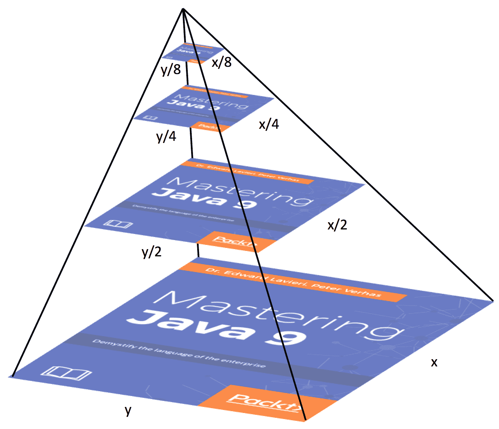

# Java 平台的其他增强功能

在最后一章中，我们探讨了 Java 中命令行标志的一些变化，具体包括统一 JVM 日志记录、编译器控制、新的诊断命令、删除 HPROF 堆分析代理、删除 **Java 堆分析工具**（**JHAT**），命令行标志参数验证，以及为旧平台版本编译的能力。

在本章中，我们将重点介绍 Java 平台提供的附加实用程序的最佳实践。具体来说，我们将讨论以下主题：

*   支持 UTF-8
*   Unicode 支持
*   Linux/AArch64 端口
*   多分辨率图像
*   **公共场所数据库**（**CDLR**）

# 技术要求

本章及后续章节主要介绍 Java11，Java 平台的**标准版**（**SE**）可从 [Oracle 官方下载网站](http://www.oracle.com/technetwork/java/javase/downloads/index.html)下载。

IDE 软件包就足够了。来自 JetBrains 的 IntelliJ IDEA 用于与本章和后续章节相关的所有编码。IntelliJ IDEA 的社区版可从[网站](https://www.jetbrains.com/idea/features/)下载。

# 支持 UTF-8

**Unicode 转换格式 8**（**UTF-8**）是一个字符集，它封装了所有 Unicode 字符，使用一到四个 8 位字节。UTF-8 是面向字节的 Unicode 编码格式，自 2009 年以来一直是网页编码的主要字符集。

以下是 UTF-8 的一些特点：

*   它可以对所有 1112064 个 Unicode 代码点进行编码
*   它使用 1 到 4 个 8 位字节
*   它几乎占所有网页的 90%
*   它与 ASCII 向后兼容
*   它是可逆的

UTF-8 的广泛使用强调了确保 Java 平台完全支持 UTF-8 的重要性。对于 Java 应用，我们能够指定具有 UTF-8 编码的属性文件。Java 平台包括对`ResourceBundle`API 的更改，以支持 UTF-8。

让我们看一看前现代 Java（Java8 和更早版本）`ResourceBundle`类，然后看看在现代 Java 平台上对这个类做了哪些更改。

# `ResourceBundle`类

下面的类为开发人员提供了从资源包中隔离特定于语言环境的资源的能力。这个类大大简化了本地化和翻译：

```java
public abstract class ResourceBundle extends Object
```

创建资源包需要有目的的方法。例如，假设我们正在创建一个资源包，它将为业务应用支持多种语言。我们的按钮标签，除其他外，将显示不同的根据当前地区。因此，在我们的示例中，我们可以为按钮创建一个资源包，我们可以称之为`buttonResources`。然后，对于每个区域设置，我们可以创建`buttonResource_<identifier>`。以下是一些示例：

*   `buttonResource_ja:`日语
*   `buttonResource_uk:`英国英语
*   `buttonResource_it:`意大利语
*   `buttonResource_lh:`立陶宛语

我们可以使用与缺省包的基名称相同的资源包，因此，`buttonResource`将包含缺省包。

为了获得特定于语言环境的对象，我们调用了`getBundle`方法。例如：

```java
. . .
ResourceBundle = buttonResource = 
  ResourceBundle.getBundle("buttonResource", currentLocale);
. . .
```

在下一节中，我们将通过查看其嵌套类、字段和构造器以及包含的方法来检查`ResourceBundle`类。

# 嵌套类

有一个嵌套类与`ResourceBundle`类相关联，即`ResourceBundle.Control`类。提供使用`ResourceBundle.getBundle`方法时使用的回调方法，如下图：

```java
public static class ResourceBundle.Control extends Object
```

`ResourceBundle.Control`类有以下字段：

*   `public static final List<String> FORMAT_CLASS`
*   `public static final List<String> FORMAT_DEFAULT`
*   `public static final List<String> FORMAT_PROPERTIES`
*   `public static final long TTL_DONT_CACHE`
*   `public static final long TTL_NO_EXPIRATION_CONTROL`

该类有一个空构造器和以下方法：

*   `getCandidateLocales()`：

```java
public List<Locale> getCandidateLocales(String baseName, Locale locale)
```

我们来看看`getCandidateLocales()`方法的细节：

| **组件** | **明细** |
| --- | --- |
| **抛出** | `NullPointerException`（如果`baseName`或`locale`为空） |
| **参数** | `baseName`：完全限定类名`locale`：期望的`locale` |
| **返回** | 候选区域设置列表 |

*   `getControl()`：

```java
public static final ResourceBundle.Control getControl(List<String> formats)
```

我们来看看`getControl()`方法的细节：

| **组件** | **明细** |
| --- | --- |
| **抛出** | `IllegalArgumentException`（如а`formats`未知） |
| | `NullPointerException`（如а`formats`空）  |
| **参数** | `formats`：这些是`ResourceBundle.Control.getFormats`方法返回的格式 |
| **返回** | `ResourceBundle.Control`支持指定格式的 |

*   `getFallbackLocale()`：

```java
public Locale getFallbackLocale(String baseName, Locale locale)
```

我们来看看`getFallbackLocale()`方法的细节：

| **组件** | **明细** |
| --- | --- |
| **抛出** | `NullPointerException`（如果`baseName`或`locale`为空） |
| **参数** | `baseName`：完全限定类名 |
| | `locale`：`ResourceBundle.getBundle`方法找不到的所需`locale` |
| **返回** | 后备`locale` |

*   `getFormats()`：

```java
public List<String> getFormats(String baseName)
```

我们来看看`getFormats()`方法的细节：

| **组件** | **明细** |
| --- | --- |
| **抛出** | `NullPointerException`（如果`baseName`为空） |
| **参数** | `baseName`：完全限定类名 |
| **返回** | 字符串列表及其格式，以便可以加载资源包 |

*   `getNoFallbackControl()`：

```java
public static final ResourceBundle.Control getNoFallbackControl(List<String> formats)
```

我们来看看`getNoFallbackControl()`方法的细节：

| **组件** | **明细** |
| --- | --- |
| **抛出** |  `IllegalArgumentException`（如а`formats`未知） |
| | `NullPointerException`（如а`formats`空） |
| **参数** | `formats`：这些是`ResourceBundle.Control.getFormats`方法返回的格式 |
| **返回** | `ResourceBundle.Control`支持指定的格式，没有后备`locale`。 |

*   `getTimeToLive()`：

```java
public long getTimeToLive(String baseName, Locale locale)
```

我们来看看`getTimeToLive()`方法的细节：

| **组件** | **明细** |
| --- | --- |
| **抛出** | `NullPointerException`（如果`baseName`为空） |
| **参数** | `baseName`：完全限定的类名 |
| | `locale`：时间`locale` |
| **返回** | 从缓存时间偏移的零或正毫秒 |

*   `needsReload()`：

```java
public boolean needsReload(String baseName, Locale locale, String format, ClassLoader loader, ResourceBundle bundle, long loadTime)
```

我们来看看`needsReload()`方法的细节：

| **组件** | **明细** |
| --- | --- |
| **抛出** | `NullPointerException`（如果下列任何参数为空）： |
| | `baseName` |
| | `locale` |
| | `format` |
| | `loader` |
| | `bundle` |
| **参数** | `baseName`：完全限定类名 |
| | `locale`：所需`locale` |
| | `format`：资源包格式 |
| | `loader`：用于加载包的`ClassLoader` |
| | `bundle`：过期包 |
| | `ClassLoader loadTime`：包被添加到缓存中的时间 |
| **返回** | `true`/`false`表示到期包是否需要重新加载 |

*   `newBundle()`：

```java
public ResourceBundle newBundle(String baseName, Locale locale, String format, ClassLoader loader, boolean reload)
```

我们来看看`newBundle()`方法的细节：

| **组件** | **明细** |
| **抛出** | 

*   `ClassCastException ResourceBundle`
*   `ExceptionInInitializerError`（如初始化失ฝ）
*   `IllegalAccessException`（如或造函数不可访问）
*   `IllegalArgumentException`（如格未知）
*   `InstantiationException`（如实例化失ฝ）
*   `IOException`（续）
*   `NullPointerException`（如下列参数空）：
    *   `baseName`
    *   `locale`
    *   `format`

*   `SecurityException`（如拒绝访问实例）

 |
| **参数** | 

*   `baseName`：完全限定类名
*   【时间】：年月日
*   `format`：包格格
*   `loader`：时间`ClassLoader`
*   `reload`：`true`/`false`标志、指示

 |
| **返回** | 资源包的实例 |

*   `toBundleName()`：

```java
public String toBundleName(String baseName, Locale locale)
```

我们来看看`toBundleName()`方法的细节：

| **组件** | **明细** |
| **抛出** | `NullPointerException`（如果`baseName`或`locale`为空） |
| **参数** | 

*   [答：]
*   `locale`：时间`locale`

 |
| **返回** | 捆绑包名称 |

*   `toResourceName()`：

```java
public final String toResourceName(String bundleName, String suffix)
```

我们来看看`toResourceName()`方法的细节：

| **组件** | **明细** |
| **抛出** | `NullPointerException`（如果`bundleName`或`suffix`为空） |
| **参数** | 

*   `bundleName`：君
*   `suffix`：名

的后缀 |
| **返回** | 转换后的资源名称 |

# 字段和构造器

`ResourceBundle`类有一个字段，如下所述：

```java
protected Resourcebundle parent
```

当找不到指定的资源时，通过`getObject`方法搜索父包。

`ResourceBundle`类的构造器如下：

```java
public ResourceBundle() {
}
```

# 方法

`ResourceBundle`类有 18 个方法，这里分别描述：

*   `clearCache()`：

```java
public static final void clearCache()
```

从下表可以看出，`clearCache()`方法不抛出任何异常，不接受任何参数，也没有返回值：

| **组件** | **明细** |
| **抛出** | 没有 |
| **参数** | 没有 |
| **返回** | 没有 |

以下是以`ClassLoader`为参数的`clearCache()`方法的一个版本：

```java
public static final void clearCache(ClassLoader loader)
```

以下是以`ClassLoader`为参数的`clearCache()`方法版本的详细信息：

| **组件** | **明细** |
| **抛出** | `NullPointerException`（如果`loader`为空） |
| **参数** | `loader`：班级`loader` |
| **返回** | 没有 |

*   `containsKey()`：

```java
public boolean containsKey(String key)
```

我们来看看`containsKey()`方法的细节：

| **组件** | **明细** |
| **抛出** | `NullPointerException`（如果`key`为空） |
| **参数** | `key`：资源`key` |
| **返回** | `true`/`false`取决于`key`是在`ResourceBundle`还是在父束中 |

*   `getBundle()`：

```java
public static final ResourceBundle getBundle(String baseName)
```

我们来看看第一版`getBundle()`方法的细节：

| **组件** | **明细** |
| **抛出** | 

*   `MissingResourceException`
*   `NullPointerException`（如如`baseName`空话）

 |
| **参数** | `baseName`：完全限定类名 |
| **返回** | 基于给定`baseName`和默认`locale`的资源包 |

以下是第二版`getBundle()`方法的语法：

```java
public static final ResourceBundle getBundle(String baseName, Resourcebundle.Control control)
```

我们来看看第二版`getBundle()`方法的细节：

| **组件** | **明细** |
| **抛出** | 

*   【时间】
*   `MissingResourceException`
*   `NullPointerException`（如а`baseName`空）

 |
| **参数** | 

*   `baseName`：完全限定类名
*   `control control`供信息、可以加载`resource`包

 |
| **返回** | 基于给定`baseName`和默认`locale`的资源包 |

以下是第三版`getBundle()`方法的语法：

```java
public static final ResourceBundle getBundle(String baseName, Locale locale)
```

我们来看看第三版`getBundle()`方法的细节：

| **组件** | **明细** |
| **抛出** | 

*   `MissingResourceException`
*   `NullPointerException`（如或`baseName`或`locale`空）

 |
| **参数** | 

*   `baseName`：完全限定类名
*   `locale`：期望`locale`

 |
| **返回** | 基于给定的`baseName`和`locale`的资源包 |

以下是第四版`getBundle()`方法的语法：

```java
public static final ResourceBundle getBundle(String baseName, Locale targetLocale, Resourcebundle.Control control)
```

我们来看看第四版`getBundle()`方法的细节：

| **组件** | **明细** |
| **抛出** | 

*   【时间】（时间）
*   `MissingResourceException baseName locales`
*   `NullPointerException`（第`baseName`、`control`号`locale`号）

 |
| **参数** | 

*   `baseName`：完全限定类名
*   `control control`供信息、可以加载
*   `targetLocale`：需`locale`

 |
| **返回** | 基于给定的`baseName`和`locale`的资源包 |

以下是第五版`getBundle()`方法的语法：

```java
public static final ResourceBundle getBundle(String baseName, Locale locale, ClassLoader loader)
```

我们来看看第五版`getBundle()`方法的细节：

| **组件** | **明细** |
| **抛出** | 

*   `MissingResourceException baseName locales`
*   `NullPointerException baseName`、`loader locale`

 |
| **参数** | 

*   `baseName`：完全限定类名
*   `locale`：时间`locale`
*   `loader`：名`loader`

 |
| **返回** | 基于给定的`baseName`和`locale`的资源包 |

以下是第六版`getBundle()`方法的语法：

```java
public static final ResourceBundle getBundle(String baseName, Locale targetLocale, ClassLoader loader, ResourceBundle.Control control)
```

我们来看看第六版`getBundle()`方法的细节：

| **组件** | **明细** |
| **抛出** | 

*   【时间】（时间）
*   `MissingResourceException`（如аа`locales`
*   `NullPointerException`（一、二、三、四）

 |
| **参数** | 

*   `baseName`：完全限定类名
*   `control`：第二天
*   `loader`：雨果`loader`
*   `targetLocale`：需`locale`

 |
| **返回** | 基于给定的`baseName`和`locale`的资源包 |

*   `getKeys()`：

```java
public abstract Enumeration<String> getKeys()
```

我们来看看`Enumeration()`方法的细节：

| **组件** | **明细** |
| **抛出** | 没有 |
| **参数** | 没有 |
| **返回** | `ResourceBundle`和父包中的键的枚举 |

*   `getLocale()`：

```java
public Locale getLocale()
```

我们来看看`getLocale()`方法的细节：

| **组件** | **明细** |
| **抛出** | 没有 |
| **参数** | 没有 |
| **返回** | 当前资源包的`locale` |

*   `getObject()`：

```java
public final Object getObject(String key)
```

我们来看看`getObject()`方法的细节：

| **组件** | **明细** |
| **抛出** | 

*   `MissingResourceException key`
*   `NullPointerException`（如а`key`空）

 |
| **参数** | `key`：这是所需对象的`key` |
| **返回** | 提供`key`的对象 |

*   `getString()`：

```java
public final String getString(String key)
```

我们来看看`getString()`方法的细节：

| **组件** | **明细** |
| **抛出** | 

*   `ClassCastException key`
*   `MissingResourceException`
*   `NullPointerException`（如а`key`空）

 |
| **参数** | `key`：这是所需`String`的关键 |
| **返回** | `String`提供的钥匙 |

*   `getStringArray()`：

```java
public final String[] getStringArray(String key)
```

我们来看看`getStringArray()`方法的细节：

| **组件** | **明细** |
| **抛出** | 

*   【时间】【时间】
*   `MissingResourceException`
*   `NullPointerException`（如а`key`空）

 |
| **参数** | `key`：这是所需`String`数组的`key` |
| **返回** | 为`key`提供`String`数组 |

*   `handleGetObject()`：

```java
protected abstract Object handleGetObject(String key)
```

我们来看看`handleGetObject()`方法的细节：

| **组件** | **明细** |
| **抛出** | `NullPointerException`（如果`key`为空） |
| **参数** | `key`：`key`表示所需的`Object` |
| **返回** | 给定`key`的对象 |

*   `handleKeySet()`：

```java
protected Set<String> handleKeySet()
```

我们来看看`handleKeySet()`方法的细节：

| **组件** | **明细** |
| **抛出** | 没有 |
| **参数** | 没有 |
| **返回** | `ResourceBundle`中的一组键 |

*   `keySet()`：

```java
public Set<String> keySet()
```

我们来看看`keySet()`方法的细节：

| **组件** | **明细** |
| **抛出** | 没有 |
| **参数** | 没有 |
| **返回** | `ResourceBundle`及其`parent`包中的一组键 |

*   `setParent()`：

```java
protected void setParent(ResourceBundle parent)
```

我们来看看`setParent()`方法的细节：

| **组件** | **明细** |
| **抛出** | 没有 |
| **参数** | `parent`：当前捆绑的`parent`捆绑 |
| **返回** | 没有 |

# 现代 Java 平台的变化

Java 平台以前支持基于 ISO-8859-1 的属性文件格式。这种格式不容易支持转义字符，尽管它提供了适当的转义机制。使用 ISO-8859-1 需要在文本字符与其转义形式之间进行转换。

当前的 Java 平台包括一个修改过的`ResourceBundle`类，其默认文件编码设置为 UTF-8，而不是 ISO-8859-1。这节省了应用进行上述转义机制转换所需的时间。

# Unicode 支持

随着 Unicode 规范的更新，Java 平台也随之更新。Java8 支持 Unicode 6.2，Java9 支持 Unicode 7.0，Java11 支持 Unicode 10.0.0，于 2017 年 6 月 20 日发布。

有关 Unicode 版本 10.0.0 的更多信息，[请访问官方规范页面](http://unicode.org/versions/Unicode10.0.0/)。

Java 平台尚未实现以下 Unicode 标准：

*   **Unicode 技术标准 #10**（**UTS#10**）：**Unicode 排序算法详细说明了如何比较 Unicode 字符串**
*   **Unicode 技术标准 #39**（**UTS#39**）：Unicode 安全机制   
*   **Unicode 技术标准 #46**（**UTS#46**）：Unicode 应用中的国际化域名（**IDNA**）——允许应用使用 ASCII 字符串标签来表示非 ASCII 标签
*   **Unicode 技术标准 #51**（**UTS#51**）：Unicode 表情符号

特定于 Unicode 支持的核心 Java 平台更改包括以下 Java 类：

*   `java.lang`包装包括以下内容：
    *   `Character`
    *   `String`

*   `java.text`包装包括以下内容：
    *   `Bidi`
    *   `BreakIterator`
    *   `Normalizer`

让我们快速看一下这些类中的每一个，以帮助巩固我们对 Unicode 10.0.0 在 Java 平台上的广泛影响的理解。

# `java.lang`包

`java.lang`包提供了几乎所有 Java 应用中使用的基本类。在本节中，我们将介绍`Character`和`String`类。

这是`Character`类：

```java
public final class Character extends Object implements 
  Serializable, Comparable<Character>
```

这是自 Java 第一个版本以来出现的众多核心类之一。`Character`类的对象由一个类型为`char`的字段组成。

这是`String`类：

```java
public final class String extends Object implements 
  Serializable, Comparable<String>, CharSequence
```

字符串（字符串是另一个核心原始类）是不可变的字符串。

修改`Character`和`String`类以支持更新的 Unicode 版本，即用于 Java9 和更高版本的版本 7.0，这是帮助保持 Java 作为首要编程语言的相关性的一个重要步骤。

# `java.text`包

`Bidi`、`BreakIterator`和`Normalizer`类的应用不如`Character`和`String`类广泛。以下是这些课程的简要概述：

这是`Bidi`类：

```java
public final class Bidi extends Object
```

此类用于实现 Unicode 的双向算法。用于支持阿拉伯语或希伯来语。

有关 *UNICODE 双向算法*的具体信息，请访问[这个页面](http://unicode.org/reports/tr9/)。

`BreakIterator`类用于查找文本边界：

```java
public abstract class BreakIterator extends Object implements Cloneable
```

这是`Normalizer`类：

```java
public final class Normalizer extends Object
```

此类包含两个方法：

*   `isNormalized`：用于确定给定序列的`char`值是否归一化
*   `normalize`：规范化`char`值的序列

# 额外重要事项

如前所述，JDK8 支持 Unicode 6.2。6.3 版于 2013 年 9 月 30 日发布，主要内容如下：

*   双向行为改进
*   改进的 Unihan 数据
*   更好地支持希伯来语

2014 年 6 月 16 日发布的 7.0.0 版引入了以下更改：

*   添加了 2834 个字符
    *   增加对阿塞拜疆语、俄语和高级德语方言的支持
    *   象形符号
    *   多个国家和地区的历史剧本
*   Unicode 双向算法的更新。
*   新增粤语发音词条近 3000 条。
*   Indic 脚本属性的主要增强。

Unicode 在 6.3 和 7.0.0 版本中的巨大变化强调了当前支持 7.0.0 的 Java 平台的重要性，而不是像 Java8 那样支持 6.3。

# Linux/AArch64 端口

从 JDK9 开始，JDK 已经被移植到 Linux/AArch64。为了理解这对我们 Java 开发人员意味着什么，让我们来讨论一下硬件。

ARM 是一家英国公司，30 多年来一直在开发计算核心和架构。他们的原名是 Acorn RISC Machine，**RISC** 代表**精简指令集计算机**。在此过程中，公司更名为**高级 RISC 机器**（**ARM**），最后更名为 **ARM Holdings**，或者干脆更名为 **ARM**。它将其架构授权给其他公司。ARM 报告说，已经制造了超过 1000 亿个 ARM 处理器。

2011 年末，ARM 推出了一个新的 ARM 架构，名为 **ARMv8**。这个架构包括一个名为 **AArch64** 的 64 位可选架构，正如您所料，它附带了一个新的指令集。以下是 AArch64 功能的简要列表：

*   A64 指令集：
    *   31 个通用 64 位寄存器
    *   专用零或栈指针寄存器
    *   接受 32 位或 64 位参数的能力
*   高级 SIMD（NEON）-增强：
    *   32 x 128 位寄存器
    *   支持双精度浮点
    *   AES 加密/解密和 SHA-1/SHA-2 哈希
*   新的例外制度

Oracle 在确定这种架构是现代 Java 平台需要支持的方面做了大量的工作。据说新的 AArch64 架构本质上是一种全新的设计。JDK9、10 和 11 已通过以下实现成功移植到 Linux/AArch64：

*   模板解释器
*   C1 JIT 编译器
*   C2 JIT 编译器

有关 C1 和 C2 JIT 编译器的信息，请参阅第 14 章“命令行标志”。

# 多分辨率图像

Java11 包含一个支持多分辨率图像的 API。具体来说，它允许多分辨率图像封装同一图像的多个分辨率变体。此 API 位于`java.awt.image`包中。下图显示了多分辨率如何将一组具有不同分辨率的图像封装到单个图像中：



多图像分辨率封装

这个新的 API 将使开发人员能够检索所有图像变体或检索特定分辨率的图像。这是一套强大的功能。`java.awt.Graphics`类用于从多分辨率图像中检索所需的变量

下面简要介绍一下 API：

```java
package java.awt.image;

public interface MultiResolutionImage {
  Image getResolutionVariant(float destinationImageWidth, 
    float destinationImageHeight);

  public List <Image> getResolutionVariants();
}
```

从前面的代码示例中可以看到，API 包含分别返回图像和图像列表的`getResolutionVariant`和`getResolutionVariants`。因为`MultiResolutionImage`是一个接口，所以我们需要一个抽象类来实现它。

# 通用区域数据仓库

默认情况下，Java11 实现了使用 Unicode 公共语言环境数据存储库中的语言环境数据的决策。CLDR 是许多支持多种语言的软件应用的关键组件，它被吹捧为最大的语言环境数据存储库，被众多大型软件供应商使用，包括苹果、谷歌、IBM 和微软。CLDR 的广泛使用使其成为非官方的行业标准语言环境数据存储库。使其成为当前 Java 平台中的默认存储库进一步巩固了其作为软件行业标准的地位。

有趣的是，CLDR 已经是 JDK8 的一部分，但不是默认库。在 Java8 中，我们必须通过设置系统属性来启用 CLDR，如下所示：

```java
java.locale.providers=JRE,CLDR
```

现在，在 Java 中，我们不再需要启用 CLDR，因为它将是默认的存储库

在当前的 Java 平台中还有其他语言环境数据存储库。它们按默认的查找顺序列在此处：

*   CLDR 公司
*   COMPAT（以前叫 JRE）
*   **服务提供商接口**（**SPI**）

要更改查找顺序，我们可以更改`java.locale.providers`设置，如图所示：

```java
java.locale.providers=SPI,COMPAT,CLDR
```

在上例中，`SPI`将首先，然后是`COMPAT`，然后是`CLDR`。

# 总结

在本章中，我们将重点介绍当前 Java 平台提供的附加实用程序的最佳实践。具体来说，我们介绍了 UTF-8 属性文件、Unicode 7.0.0、Linux/AArch64 端口、多分辨率图像和公共语言环境数据存储库。

在下一章中，我们将通过展望 Java19.3（Java12）和 Java19.9（Java13）中的内容来展望 Java 平台的未来方向。

# 问题

1.  什么是 UTF-8？
2.  列出 UTF-8 的五个特性。
3.  哪个类为开发人员提供了从资源包中隔离特定于语言环境的资源的能力？
4.  `clearCache()`方法返回什么？
5.  `getBundle()`方法返回什么？
6.  Java11 支持什么版本的 Unicode？
7.  JDK9、10 和 11 已经成功移植到 Linux/AArch64。列出三种实现。
8.  什么是多分辨率图像？
9.  哪个类用于从多分辨率图像中检索所需的变体？
10.  什么是 CLDR？