# 二、编写第一个云原生应用

本章介绍构建第一个云原生应用的基本要素。我们将完成在开发环境中运行微服务所需的最少步骤。

如果您是一名经验丰富的 Java 开发人员，使用 Eclipse 等 IDE，您会发现自己处于熟悉的领域。虽然大部分内容与构建传统应用相似，但也有一些细微差别，我们将在本章中讨论，并在最后总结。

进行开发的设置步骤将根据开发人员的类型而有所不同：

*   对于业余爱好者、自营职业者或在家工作的开放互联网开发者来说，云开发相对简单。
*   对于在封闭环境中为客户或业务团队处理项目并且必须通过代理访问 internet 的企业开发人员，您需要遵循您的企业开发指南。您将受到下载、运行和配置内容的限制。话虽如此，作为这种类型的开发人员的好处是你并不孤单。您有团队和同事的支持，他们可以通过非正式帮助或 Wiki 中的正式文档提供帮助。

到本章结束时，您的机器上将运行一个云原生微服务。为此，我们将介绍以下主题：

*   开发者的工具箱和生态系统
*   互联网连接
*   开发生命周期
*   框架选择
*   编写云原生微服务
*   启用一些云原生行为
*   回顾云开发的关键方面

# 设置开发人员工具箱

对于任何职业来说，工具都非常重要，这同样适用于编码。在编写一行代码之前，我们需要使用正确的设备启动。

# 获得 IDE

一个**集成开发环境**（**IDE**）不仅仅是一个代码编辑器；它包括用于自动完成、语法、格式和其他杂项功能（如搜索和替换）的工具。IDE 具有高级功能，例如重构、构建、测试和在运行时容器的帮助下运行程序。

流行的 IDE 有 Eclipse、IntellijIDEA 和 NetBeans。在这三个 IDE 中，Eclipse 是最流行的、可用于 Java 的开源 IDE。它有一个很大的社区，并且经常更新。它有一个工作空间和一个可扩展的插件系统。各种语言中应用的开发潜力是无穷的。基于 Eclipse 的其他一些开发 IDE 包括以下内容：

*   如果您只打算进行 Spring 开发，那么 Eclipse 的派生工具**Spring 工具套件**（**STS**是一个不错的选择。
*   还有云 IDE，如 EclipseChe，被吹捧为下一代 Eclipse。它不需要任何安装。您可以在连接到 Che 服务器的浏览器中开发，该服务器在 Docker 容器中远程构建工作区（包含库、运行时和依赖项）。因此，您可以从任何机器进行开发，任何人都可以为您的项目做出贡献，只需一个 URL。如果你认为这很酷，并且需要一个独立于位置和机器的开发，那就试试吧。

在本书中，让我们坚持使用基本的、非常流行的 Eclipse。在撰写本书时，目前的版本是 Neon。大型社区和可配置插件支持使其成为基于云的 Java 开发的首选 IDE。

从[下载最新版本 https://www.eclipse.org/](https://www.eclipse.org/) 。假设您安装了 JDK 8 或更高版本，Eclipse 应该可以正常启动。

配置将存储项目文件和设置的工作区：


当您点击 OK 时，Eclipse IDE 应该会打开。Eclipse Neon 将自动为您提供开发所需的两个重要插件：

*   **Git 客户端**：这将允许我们连接到 Git 源代码管理存储库。本书假设您使用 Git 是因为它的流行性和特性，但是在企业中使用了许多较旧的选项，例如 Subversion 和 Perforce。如果您使用这些替代方法，请按照项目团队或团队 wiki 中的开发人员设置说明将相应的插件下载到 IDE 中。如果这些说明不存在，请要求构建一个供新团队成员使用的说明。
*   **Maven 支持**：Maven 和 Gradle 都是优秀的项目管理和配置工具。它们帮助完成诸如获取依赖项、编译、构建等任务。我们选择 Maven 是因为它在企业中的成熟度。

如果你是第一次遇到这两个问题，请通过阅读他们各自的网站来熟悉这两个问题。

# 设置 internet 连接

如果您在企业中工作，并且必须通过代理访问 internet，这可能是一种痛苦，这取决于您的企业策略限制您做什么。

出于我们的发展目的，我们需要以下方面的互联网连接：

*   下载作为 Maven 存储库一部分配置的依赖项库，如 Log4j 和 Spring。这是一项一次性活动，因为这些库一旦下载就成为本地 Maven 存储库的一部分。如果您的组织有一个存储库，则需要对其进行配置。
*   随着示例应用的发展，Eclipse 插件将从市场上推出。
*   您的程序调用公共云中的服务或 API。

对于编写我们的第一个服务，只有第一点很重要。请获取您的代理详细信息，并在主菜单 Windows |首选项的 Maven 设置中进行配置，如下所示：

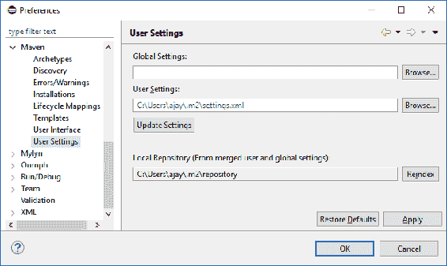

在用户设置中更改`settings.xml`文件，并添加代理部分：

```java
<proxies> 
   <proxy>
      <id>myproxy</id>
      <active>true</active> 
      <protocol>http</protocol> 
      <host>proxy.yourorg.com</host> 
      <port>8080</port> 
      <username>mahajan</username> 
      <password>****</password> 
      <nonProxyHosts>localhost,127.0.0.1</nonProxyHosts> 
    </proxy> 
    <proxy> 
      <id>myproxy1</id> 
      <active>true</active> 
      <protocol>https</protocol> 
      <host> proxy.yourorg.com</host> 
      <port>8080</port> 
      <username>mahajan</username> 
      <password>****</password> 
      <nonProxyHosts>localhost,127.0.0.1</nonProxyHosts> 
    </proxy> 
```

保存文件并重新启动 Eclipse。当我们创建一个项目时，我们将知道它是否有效。

# 了解开发生命周期

专业软件写作经历了不同的阶段。在以下部分中，我们将讨论开发应用时将遵循的所有不同阶段。

# 需求/用户故事

在开始任何编码或设计之前，了解正在解决的问题陈述非常重要。敏捷开发方法建议将整个项目分解为模块和服务，然后作为用户故事一次实现几个特性。我们的想法是获得一个**最低可行的产品**（**MVP**），然后继续添加功能。

我们要解决的问题是电子商务领域。由于网上购物，我们大多数人作为消费者都熟悉电子商务。是时候看看引擎盖下面了。

起点是一个`product`服务，它执行以下操作：

*   返回给定产品 ID 的产品的详细信息
*   获取给定产品类别的产品 ID 列表

# 建筑学

我们在本书后面有单独的章节专门讨论这一点。简言之，一旦需求已知，架构就是做出关键决策并创建如何实现需求的蓝图，而设计就是关于实现需求的契约和机制。对于云原生开发，我们已经接到了实现微服务体系结构的呼吁。

microservices 架构范例建议使用包含功能单元的较小部署单元。因此，我们的`product`服务将运行自己的进程并拥有自己的运行时。这使得捆绑整个运行时变得更容易，并以一致的行为将其从开发环境带到测试环境，然后带到生产环境。每个`product`服务将在服务注册表中注册自身，以便其他服务可以发现。稍后我们将研究技术选择。

# 设计

设计更深入地研究服务的接口和实现决策。`product`服务将有一个简单的接口，它接受一个产品 ID 并返回一个 Java 对象。如果在存储库中找不到该产品，则可以决定返回异常或空产品。将记录访问，并记录访问服务的次数和所用时间。这些是设计决策。

我们将在后面的章节中详细讨论特定于云开发的架构和设计原则。

# 测试和开发

在任何现代企业软件开发中，测试都不是事后思考或开发后的活动。通过**测试驱动开发**（**TDD**）和**行为驱动开发**（**BDD**等概念在开发之前或之前完成。首先编写测试用例，测试用例最初失败。然后，编写足够的代码以通过测试用例。这个概念对于产品未来迭代中的回归测试非常重要，并且与后面讨论的**连续集成**（**CI**和**连续交付**（**CD**）概念很好地融合在一起。

# 建设和部署

构建和部署是从源代码创建部署单元并将其放入目标运行时环境的步骤。开发人员执行 IDE 中的大部分步骤。然而，使用 CI 原则，集成服务器完成编译、自动测试用例执行、构建部署单元以及在目标运行时部署它。

在云环境中，可部署单元部署在**虚拟机**（**VM**）等虚拟环境或容器中。作为部署的一部分，重要的是将必要的运行时和依赖项作为构建过程本身的一部分。这不同于在每个环境中运行的应用服务器中放置`.war`或`.ear`的传统过程。在可部署单元中包含所有依赖项，使其在各种环境中移动时具有完整性和一致性。这减少了服务器上的依赖项与开发人员的本地计算机上的依赖项不匹配时发生错误的机会。

# 选择框架

在了解了基本知识之后，让我们编写我们的`product`服务。在 IDE 设置之后，下一步是选择一个框架来编写服务。微服务体系结构提出了一些有趣的设计注意事项，有助于我们选择框架：

*   **轻量级运行时**：服务应该体积小，部署速度快
*   **高弹性**：应支持断路器、超时等模式
*   **可测量和可监控**：它应该捕获度量并公开钩子，以便监控代理可以利用
*   **高效**：在负载增加的情况下，应避免阻塞资源，实现高可扩展性和弹性

一个很好的比较可以在以下位置找到：[https://cdelmas.github.io/2015/11/01/A-comparison-of-Microservices-Frameworks.html](https://cdelmas.github.io/2015/11/01/A-comparison-of-Microservices-Frameworks.html) 。有三种框架在 Java 领域越来越流行，它们满足了上述要求：Dropwizard、Vert.x 和 Spring Boot。

# Dropwizard

Dropwizard 是首批推广 fat JAR 概念的框架之一，它将容器运行时以及所有依赖项和库放在部署单元中，而不是将部署单元放在容器中。它将 Jetty for HTTP、Jackson for JSON、Jersey for REST 和 Metrics 等库混搭在一起，为构建 RESTful web 服务创建了完美的组合。它是用于微服务开发的早期框架之一。

它的选择，如 JDBI、Freemarker 和 moustach，对于一些希望在选择实现时具有灵活性的组织来说，可能听起来有些限制。

# 垂直 x

x 是一个极好的框架，用于构建不阻塞资源（线程）的反应式应用，因此具有很强的可伸缩性和弹性，因此具有弹性。这是一个相对较新的版本（在版本 3.0 中进行了重大升级）。

然而，它的反应式编程模型在业界还不是很流行，因此它刚刚被采用，特别是对于需要非常高的弹性和可伸缩性的用例。

# 弹簧靴

SpringBoot 正在迅速成为构建云原生微服务的最流行的 Java 框架。以下是一些很好的理由：

*   它在春季和春季 MVC 基础上，已经在企业中流行。
*   与 Dropwizard 一样，它组装了最合理的默认值，并采用了一种自以为是的方法来组装服务所需的依赖项，从而减少了配置所需的 XML
*   它集成了 SpringCloud 开箱即用，它为云部署所需的分布式服务开发提供了有用的库，如 Hystrix 和 Ribbon
*   它具有较低的学习曲线；您可以在几分钟内开始（我们将在下面看到）
*   它具有 40+starter Maven**项目对象模型（POM）**的概念，为选择和开发应用提供了良好的灵活性

SpringBoot 适用于适用于云原生部署的各种工作负载，因此对于大多数用例来说是一个不错的首选。

现在让我们开始在 SpringBoot 中编写服务。

# 编写产品服务

为了简单起见，我们的`product`服务有两个功能：

*   `List<int> getProducts(int categoryId)`
*   `Product getProduct(int prodId)`

这两种方法的意图非常清楚。第一个返回给定类别 ID 的产品 ID 列表，第二个返回给定产品 ID 的产品详细信息（作为对象）。

# 服务注册和发现

为什么服务注册和发现很重要？到目前为止，我们一直在通过其 URL 调用该服务，其中包括 IP 地址，例如，`http://localhost:8080/prod`——因此我们希望该服务在该地址运行。即使我们可以替换测试 URL 和生产 URL，在特定 IP 地址和端口调用服务的步骤仍然是静态的。

然而，在云环境中，事情是动态的。如果服务在给定的 IP 上宕机，它可以在不同的 IP 地址上出现，就像它在某个容器上出现一样。尽管我们可以通过虚拟 IP 和反向代理来缓解这种情况，但最好在服务调用时动态查找服务，然后在 IP 地址调用服务。查找地址可以缓存在客户机中，这样就不需要为每个服务调用执行动态查找。

在这种情况下，注册表（称为服务注册表）会有所帮助。当服务启动时，它会在注册表中注册自己。注册表和服务之间还有心跳，以确保注册表在其注册表中只保留活动服务。如果心跳停止，注册表将注销该服务实例。

对于这个快速入门，我们将使用 SpringCloudNetflix，它与 SpringBoot 很好地集成。我们现在需要三个组成部分：

*   **产品服务**：我们已经写好了
*   **服务注册**：我们将使用 Eureka，它是 Spring Cloud 的一部分
*   **服务客户端**：我们将不通过浏览器直接调用我们的服务，而是为我们的服务编写一个简单的客户端

# 创建 Maven 项目

打开 IDE（Eclipse Neon 或其他），然后创建一个新的 Maven 项目，如下所示：

1.  右键单击 Package Explorer 并选择 New and Project…，如以下屏幕截图所示：


2.  选择 Maven 项目：


3.  在向导的下一个窗口中，选择“创建简单项目”。

4.  下一个对话框将询问许多参数。其中，组 Id（项目名称）和工件 Id（应用或服务名称）非常重要。选择合理的名称，如以下屏幕截图所示：


5.  选择 Finish。您应该看到以下结构：


如果 JRE 系统库[JavaSE-1.6]不存在，或者您有更高版本，请转到项目属性并对其进行编辑，以选择 Eclipse 配置的版本。您可以通过右键单击 JRE 系统库[JavaSE-1.6]来更改属性。下面是将 JRE 系统库调整为 1.8 后的屏幕截图。


6.  现在，你有了一张干净的名单。打开 Maven 文件`pom.xml`并向`spring-boot-starter-web`添加依赖项。这将告诉 Spring Boot 配置此项目以获取用于 web 开发的库：

```java
<project xmlns.... 
  <modelVersion>4.0.0</modelVersion> 
  <parent> 
    <groupId>org.springframework.boot</groupId> 
    <artifactId>spring-boot-starter-parent</artifactId> 
    <version>1.4.3.RELEASE</version> 
  </parent> 
  <groupId>com.mycompany.petstore</groupId> 
  <artifactId>product</artifactId> 
  <version>0.0.1-SNAPSHOT</version>    
<dependencies> 
    <dependency> 
        <groupId>org.springframework.boot</groupId> 
        <artifactId>spring-boot-starter-web</artifactId> 
    </dependency> 
</dependencies> 
</project> 
```

当您保存此 POM 文件时，您的 IDE 将构建工作区并下载相关库，前提是您的 internet 连接可以正常工作（直接连接或通过前面配置的代理），并且您已准备好开发该服务。

# 编写 Spring 启动应用类

此类包含开始执行的主方法。此主要方法将引导 Spring 引导应用，查看配置，并在执行 web 服务时启动相应的捆绑容器，如 Tomcat：

```java
package com.mycompany.product;

import org.springframework.boot.SpringApplication;
import org.springframework.boot.autoconfigure.EnableAutoConfiguration;

@SpringBootApplication
public class ProductSpringApp {
  publicstaticvoid main(String[] args) throws Exception {
    SpringApplication.run(ProductSpringApp.class, args);
    }
  } 
```

请注意名为`@SpringBootApplication`的注释。

`@SpringBootApplication`注释相当于使用`@Configuration`、`@EnableAutoConfiguration`和`@ComponentScan`，这三种注释的作用如下：

*   `@Configuration`：这是一个核心弹簧注释。它告诉 Spring 这个类是`Bean`定义的来源。
*   `@EnableAutoConfiguration`：此注释告诉 Spring Boot 根据您添加的 JAR 依赖项猜测您将如何配置 Spring。我们添加了 starter web，因此该应用将被视为 Spring MVC web 应用。
*   `@ComponentScan`：此注释告诉 Spring 扫描任何组件，例如，我们将要编写的`RestController`。注意，扫描发生在当前和子包中。因此，具有此组件扫描的类应该位于包层次结构的顶部。

# 编写服务和域对象

SpringBoot 中的注释使提取参数和路径变量以及执行服务变得容易。现在，让我们模拟响应，而不是从数据库获取数据。

创建一个名为`Product`类的简单 Java 实体。现在，它是一个简单的**普通旧 Java 对象**（**POJO**类），有三个字段：

```java
publicclass Product {
  privateint id = 1 ;
  private String name = "Oranges " ;
  privateint catId = 2 ;
```

添加 getter 和 setter 方法以及接受产品 ID 的构造函数：

```java
  public Product(int id) {
    this.id = id;
    }
```

另外，添加一个空构造函数，该构造函数将由服务客户端使用，稍后我们将看到：

```java
  public Product() {
   } 
```

然后，编写`ProductService`类，如下所示：

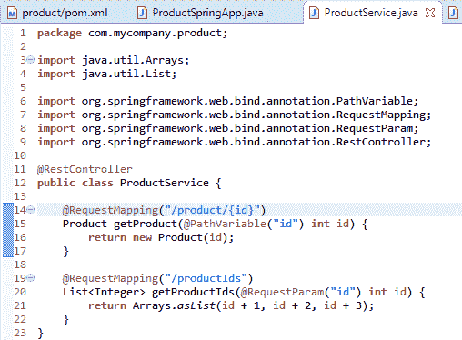

# 运行服务

有许多方法可以运行该服务。

右键点击项目，选择 RunAs | Maven build 并配置运行配置以执行`spring-boot:run`目标，如下所示：

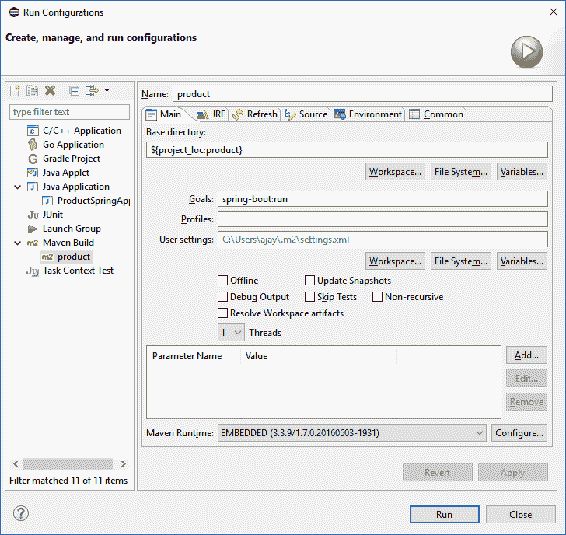

单击 Run，如果 internet 连接和配置正常，您将看到以下控制台输出：

```java
[INFO] Building product 0.0.1-SNAPSHOT 
... 
[INFO] Changes detected - recompiling the module! 
[INFO] Compiling 3 source files to C:Appswkneonproducttargetclasses 
... 
 :: Spring Boot ::        (v1.4.3.RELEASE) 

2016-10-28 13:41:16.714  INFO 2532 --- [           main] com.mycompany.product.ProductSpringApp   : Starting ProductSpringApp on L-156025577 with PID 2532 (C:Appswkneonproducttargetclasses started by MAHAJAN in C:Appswkneonproduct) 
... 
2016-10-28 13:41:19.892  INFO 2532 --- [           main] s.b.c.e.t.TomcatEmbeddedServletContainer : Tomcat initialized with port(s): 8080 (http) 
... 
2016-10-28 13:41:21.201  INFO 2532 --- [           main] s.w.s.m.m.a.RequestMappingHandlerMapping : Mapped "{[/product/{id}]}" onto com.mycompany.product.Product com.mycompany.product.ProductService.getProduct(int) 
2016-10-28 13:41:21.202  INFO 2532 --- [           main] s.w.s.m.m.a.RequestMappingHandlerMapping : Mapped "{[/productIds]}" onto java.util.List<java.lang.Integer> com.mycompany.product.ProductService.getProductIds(int) 
... 
... 
2016-10-28 13:41:21.915  INFO 2532 --- [           main] s.b.c.e.t.TomcatEmbeddedServletContainer : Tomcat started on port(s): 8080 (http) 
2016-10-28 13:41:21.922  INFO 2532 --- [           main] com.mycompany.product.ProductSpringApp   : Started ProductSpringApp in 6.203 seconds (JVM running for 14.199) 
```

请注意 Maven 执行的各个阶段：

1.  首先，Maven 任务编译所有 Java 文件。到目前为止，我们有三个简单的 Java 类。
2.  下一步将它作为应用运行，其中启动一个 Tomcat 实例。
3.  注意 URL`/product/`和`/productIds`到`Bean`方法的映射。
4.  Tomcat 在端口`8080`上侦听服务请求。

您也可以通过在 PackageExplorer 中右键单击具有主方法（`ProductSpringApp`）的类，然后选择 RunAs | Java Application 来运行该服务。

# 在浏览器上测试服务

打开浏览器并点击以下 URL:`http://localhost:8080/product/1`。

您应该得到以下回复：

```java
{"id":1,"name":"Oranges ","catId":2}
```

现在，尝试其他服务（URL-`http://localhost:8080/productIds`）。你得到了什么回应？错误如下：

```java
    There was an unexpected error (type=Bad Request, status=400).
    Required int parameter 'id' is not present
```

你能猜出原因吗？这是因为您编写的服务定义有一个需要请求参数的方法：

```java
@RequestMapping("/productIds")
List<Integer> getProductIds(@RequestParam("id") int id) {
```

因此，URL 需要一个`id`，因为您没有提供它，所以它给出了一个错误。

给出参数并重试`http://localhost:8080/productIds?id=5`。

您现在将得到正确的答复：

```java
[6,7,8]
```

# 创建可部署的

我们不打算在 Eclipse 上运行我们的服务。我们希望将其部署到服务器上。执行此操作有两个选项：

*   创建 WAR 并将其部署在 Tomcat 或任何其他 web 容器中。这是传统的方法。
*   创建一个包含运行时（Tomcat）的 JAR，这样您只需要 Java 来执行服务。

在云应用开发中，第二种选择，也称为 fat JAR 或 uber JAR，由于以下原因而变得流行：

*   可部署组件是自包含的，具有所需的所有依赖项。这降低了可部署单元部署到开发、测试、UAT 和生产环境中时环境不匹配的可能性。如果它在开发中起作用，那么它很有可能在所有其他环境中都起作用。
*   部署服务的主机、服务器或容器不需要预先安装应用服务器或 servlet 引擎。只要一个基本的 JRE 就足够了。

让我们看一下创建 JAR 文件并运行它的步骤。

包括 POM 文件的以下依赖项：

```java
<build><plugins><plugin> 
            <groupId>org.springframework.boot</groupId> 
            <artifactId>spring-boot-maven-plugin</artifactId> 
</plugin></plugins></build> 
```

现在，右键单击资源管理器中的项目并选择 RunAs | Maven Install 来运行它。

您将在项目文件夹结构的目标目录中看到`product-0.0.1-SNAPSHOT.jar`。

导航到`product`文件夹，以便在命令行中看到目标目录，然后通过 Java 命令运行 JAR，如以下屏幕截图所示：


您将看到 Tomcat 在启动结束时监听端口。再次通过浏览器进行测试。实现了一个里程碑。

# 启用云原生行为

我们刚刚开发了一个基本服务，其中包含两个响应请求的 API。让我们添加一些功能，使 it 成为一个好的云公民。我们将讨论以下问题：

*   外部化配置
*   仪器健康和度量
*   服务注册和发现

# 外部化配置

配置可以是环境或生产部署之间可能不同的任何属性。典型的例子有队列和主题名称、端口、URL、连接和池属性等。

可部署系统中不应包含配置。配置应该从外部注入。这使得可部署单元在经历生命周期的各个阶段（如开发、质量保证和用户验收测试）时保持不变。

让我们假设我们必须在不同的环境中运行`product`服务，URL 使环境有所不同。因此，我们在请求映射中所做的小更改如下：

```java
@RequestMapping("/${env}product/{id}")
Product getProduct(@PathVariable("id") int id) {
```

我们可以用各种方式注入这个变量。一旦注入，该值在部署生命周期内不会更改。最简单的方法是在命令行参数中传递它。打开运行配置对话框，在参数中添加命令行参数`-env=dev/`，如下所示：

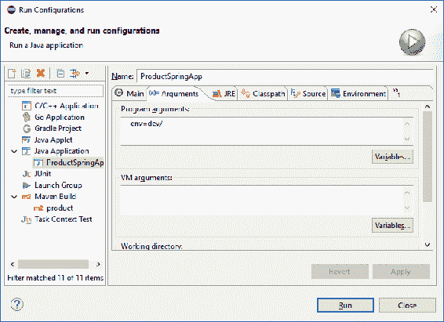

现在，运行配置。在启动期间，您将在 log 语句中找到替换的值，如下所示：

```java
... Mapped "{[/dev/product/{id}]}" onto com.mycompany.product.Product com.mycompany.product.ProductService.getProduct(int) 
```

还可以通过配置文件、数据库、操作系统环境属性等提供配置。

Spring 应用通常使用`application.properties`来存储端口号等一些属性。最近，由于属性的分层定义，JSON 的超集 YAML 变得越来越流行。

在应用的`/product/src/main/resources`文件夹中创建一个`application.yml`文件，并放入以下内容：

```java
server: 
  port: 8081 
```

这告诉`product`服务在端口`8081`而不是默认的`8080`上运行。这一概念进一步扩展到配置文件。因此，可以通过加载特定于配置文件的配置来加载不同的配置文件。

SpringCloudConfig 作为一个项目可以很好地处理这个问题。它使用一个`bootstrap.yml`文件启动应用，并提供源的名称和详细信息，以进一步加载配置。因此，`bootstrap.yml`包含应用名称和配置服务器详细信息，然后加载相应的配置文件配置。

在应用的`resources`文件夹中创建一个`bootstrap.yml`文件，并放入以下内容：

```java
spring: 
  application: 
    name: product 
```

稍后讨论服务注册时，我们将回到这些文件。

# 计量您的服务

检测对于云应用很重要。您的服务应该公开健康检查和指标，以便更好地对其进行监控。弹簧防尘套允许通过`actuator`模块进行更简单的检测。

在 POM 中包括以下内容：

```java
    <dependency> 
        <groupId>org.springframework.boot</groupId> 
        <artifactId>spring-boot-starter-actuator</artifactId> 
    </dependency> 
```

运行服务。在启动过程中，您将看到许多映射被创建。

您可以直接访问这些 URL（如`http://localhost:8080/env`），并查看显示的信息：

```java
{ 
  "profiles": [], 
  "server.ports": { 
    "local.server.port": 8082 
  }, 
  "commandLineArgs": { 
    "env": "dev/" 
  }, 
  "servletContextInitParams": {}, 
  "systemProperties": { 
    "java.runtime.name": "Java(TM) SE Runtime Environment", 
    "sun.boot.library.path": "C:\Program Files\Java\jdk1.8.0_73\jrebin", 
    "java.vm.version": "25.73-b02", 
    "java.vm.vendor": "Oracle Corporation", 
    "java.vendor.url": "http://java.oracle.com/", 
    "path.separator": ";", 
    "java.vm.name": "Java HotSpot(TM) 64-Bit Server VM", 
    "file.encoding.pkg": "sun.io", 
    "user.country": "IN", 
    "user.script": "", 
    "sun.java.launcher": "SUN_STANDARD", 
    "sun.os.patch.level": "Service Pack 1", 
    "PID": "9332", 
    "java.vm.specification.name": "Java Virtual Machine Specification", 
    "user.dir": "C:\Apps\wkneon\product", 
```

这些指标特别有趣（`http://localhost:8080/metrics`：

```java
{ 
  "mem": 353416, 
  "mem.free": 216921, 
  "processors": 4, 
  "instance.uptime": 624968, 
  "uptime": 642521, 
... 
  "gauge.servo.response.dev.product.id": 5, 
... 
   threads.peak": 38, 
  "threads.daemon": 35, 
  "threads.totalStarted": 45, 
  "threads": 37, 
... 
```

这些信息包括存储服务访问次数和响应时间的计数器和仪表。

# 运行服务注册表

concur 和 Eureka 是两个流行的动态服务注册中心。它们在心跳方法和基于代理的操作方面存在细微的概念差异，但注册表的基本概念是相似的。登记册的选择将取决于企业的需要和决定。对于我们的示例，让我们继续使用 SpringBoot 和 SpringCloud 生态系统，并在本例中使用 Eureka。SpringCloud 包括支持 Eureka 注册的 SpringCloudNetflix。

执行以下步骤以运行服务注册表：

1.  创建一个新的 Maven 项目，将`artifactId`作为`eureka-server`。
2.  编辑 POM 文件并添加以下内容：
    *   父项为`spring-boot-starter-parent`
    *   对`eureka-server`的依赖关系为``spring-cloud-starter-eureka-server``
    *   `dependencyManagement`到`spring-cloud-netflix`之间：


3.  创建一个类似于我们为`product`项目创建的应用类。注意注释。注释`@EnableEurekaServer`将 Eureka 作为一项服务启动：

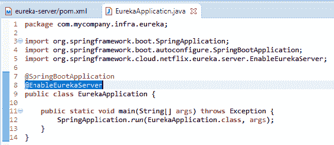

4.  在应用的`/product/src/main/resources`文件夹中创建一个`application.yml`文件，并放入以下内容：

```java
server: 
  port: 8761 
```

5.  在应用的`resources`文件夹中创建一个`bootstrap.yml`文件，并放入以下内容：

```java
spring: 
  application: 
    name: eureka 
```

6.  构建`eureka-server`Maven 项目（就像我们为`product`所做的那样），然后运行它。
7.  除了一些连接错误（稍后将详细介绍），您还应该看到一条 Tomcat 启动消息，如下所示：

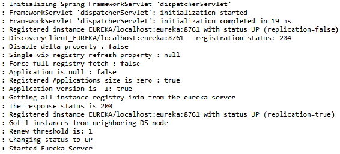

启动完成后，访问`localhost:8761`上的 Eureka 服务器，查看是否进入以下页面：


请看前面屏幕截图中带圆圈的部分。当前在 Eureka 注册的实例本身就是`EUREKA`。我们可以稍后纠正这个问题。现在，让我们专注于在这个 Eureka 服务注册中心注册我们的`product`服务。

# 注册产品服务

`product`服务启动并在端口`8081`上侦听`product`服务请求。现在，我们将添加必要的说明，以便服务实例在 Eureka 注册表中注册自身。多亏了 Spring Boot，我们只需进行一些配置和注释：

1.  将依赖于`spring-cloud-netflix`的`dependencyManagement`部分和现有依赖部分中的依赖项添加到`spring-cloud-starter-eureka`到`product`服务 POM 中，如下所示：

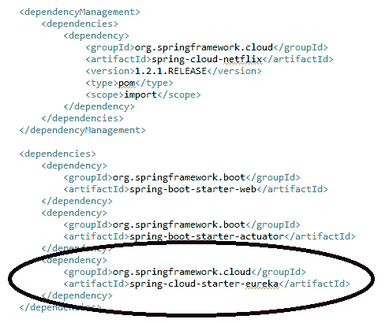

2.  `product`服务每隔一段特定的时间间隔不断更新其租约。通过在`application.yml`中明确定义一个条目，将其缩短为 5 秒，如下所示：

```java
server: 
  port: 8081 

eureka: 
  instance: 
    leaseRenewalIntervalInSeconds: 5
```

3.  将注释`@EnableDiscoveryClient`包含在`product`项目的启动应用类中，即`ProductSpringApp`。`@EnableDiscoveryClient`注释激活 Netflix Eureka`DiscoveryClient`实现，因为这是我们在 POM 文件中定义的实现。其他服务注册中心还有其他实现，如 HashiCorp Consor 或 Apache Zookeeper：


4.  现在，像以前一样启动`product`服务：


在`product`服务初始化结束时，您将看到向 Eureka 服务器注册服务的日志语句。

要检查`product`服务是否已注册，请刷新您刚刚访问的 Eureka 服务器页面：


还要在 Eureka 日志上保留一个选项卡。您将找到`product`服务的租约续签日志声明。

# 创建产品客户机

我们创建了一个动态产品注册中心，甚至注册了我们的服务。现在，让我们使用这个查找来访问`product`服务。

我们将使用 Netflix Ribbon 项目，它提供了一个负载平衡器，并且可以从服务注册表中查找地址。SpringCloud 使配置和使用它变得更容易。

现在，让我们在与服务本身相同的项目中运行客户端。在 Eureka 中查找产品定义后，客户端将对服务进行 HTTP 调用。所有这些都将由 Ribbon 库完成，我们只将其用作端点：

1.  将依赖项添加到`product`项目的 Maven POM 中，如下所示：


2.  创建一个`ProductClient`类，该类只监听`/client`并在查找后将请求转发到实际的`product`服务：

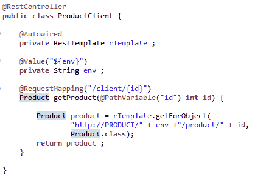

URL 结构`http://PRODUCT/`将在执行查找后由 Ribbon 在运行时进行翻译。我们没有提供服务的 IP 地址。

3.  `restTemplate`通过自动接线注入此处。但是，它需要在最新的 Spring 版本中初始化。因此，在主应用类中声明它，该类也充当配置类：

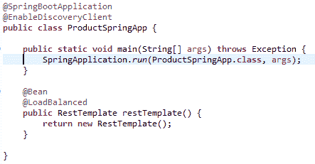

`@LoadBalanced`注释告诉 Spring 使用 Ribbon 负载平衡器（由于 Maven，Ribbon 位于类路径中）。

# 查看正在运行的查找

现在，我们都准备好运行产品客户端了。综上所述，在本阶段，我们有一个 Eureka 服务器项目和一个具有以下结构的`product`项目：

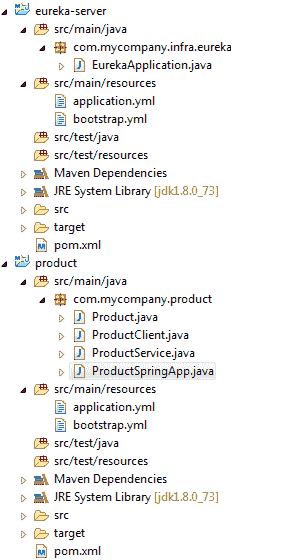

让我们花几分钟回顾一下我们做了什么：

1.  我们创建了一个 Maven 项目，并定义了启动器和依赖项。
2.  我们为引导和应用属性创建了 YML 文件。
3.  我们创建了`ProductSpringApp`类，其中包含作为应用起点的 main 方法。
4.  对于`product`项目，我们有以下课程：
    *   `Product`：我们稍后会提升的领域或实体
    *   `ProductService`：负责实现服务和 API 的微服务
    *   `ProductClient`：测试服务查找的客户端

现在，让我们看看它的实际效果：

1.  运行`EurekaApplication`类（或者在`eureka-server`项目上运行 Maven 构建）。观察日志中的最后几行：

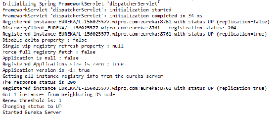

2.  运行`ProductSpringApp`类（或者在`product`项目上运行 Maven 构建）。请注意日志中的最后几行：


3.  Access the `product` service directly at: `http://localhost:8081/dev/product/4`.

    您将看到以下响应：

```java
{"id":4,"name":"Oranges ","catId":2}
```

4.  Now, access the client URL, `http://localhost:8081/client/4` , which does a lookup of the `product` service from the service registry and directs it to the respective `product` service.

    您将看到以下响应：

```java
 {"id":4,"name":"Oranges ","catId":2}
```

您可能会看到一个内部服务器错误（`No instances available for PRODUCT`。当心跳信号完成并且功能区负载平衡器重新拾取地址时，可能会发生这种情况。请等待几秒钟，等待注册表更新，然后重试。

为了得到这样的回应，在幕后发生了很多事情：

1.  获取`/client/4`的 HTTP 请求由`ProductClient`类中的`getProduct`方法处理。
2.  它从 Eureka 注册表中查找服务。这是我们发现日志语句的地方，如下所示：

```java
c.n.l.DynamicServerListLoadBalancer: Using serverListUpdater PollinServerListUpdater
c.netflix.config.ChainedDynamicProperty: Flipping property: PRODUCT.ribbon.ActiveConnectionsLimit to use NEXT property: niws.loadbalancer
c.n.l.DynamicServerListLoadBalancer: DynamicServerListLoadBalancer for client PRODUCT intiated: DynamicServerListLoadBalancer:
```

3.  完成查找后，它通过功能区负载平衡器库将请求转发到实际的`ProductService`。

这只是客户端通过动态查找调用服务的简单机制。在后面的章节中，我们将添加一些功能，使其在从数据库获取数据方面具有弹性和功能性。

# 总结

让我们回顾一下迄今为止我们讨论过的云应用的关键概念。我们让我们的应用**轻量级**，让它在 servlet 引擎上运行，并在不到 15 秒的时间内启动。我们的应用是**自包含的**，因为胖罐子有所有库来运行我们的服务。我们只需要一个 JVM 来运行这个 JAR 文件。通过从命令行注入环境和来自`application.yml`和`bootstrap.yml`的属性，它已经**外部化了配置**（在某种程度上）。我们将在[第 7 章](07.html)*云原生应用运行时*中深入了解外部化的下一个阶段。Spring 执行器帮助捕获所有指标，并使其 URL 可供使用，从而启用了**工具**。**位置抽象**由 Eureka 实现。

在下一章中，我们将通过向该服务添加数据层和弹性，以及添加缓存行为和本章中跳过的其他增强功能来增强该服务。