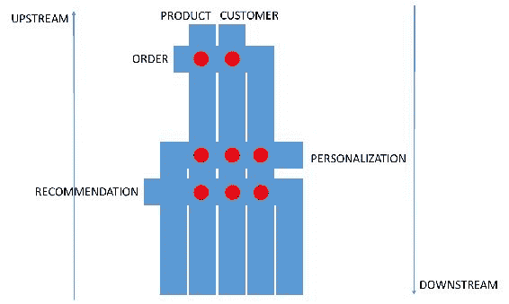
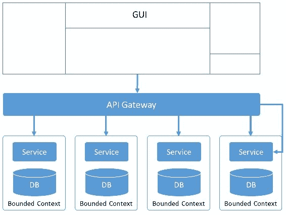
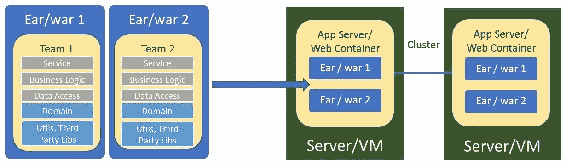
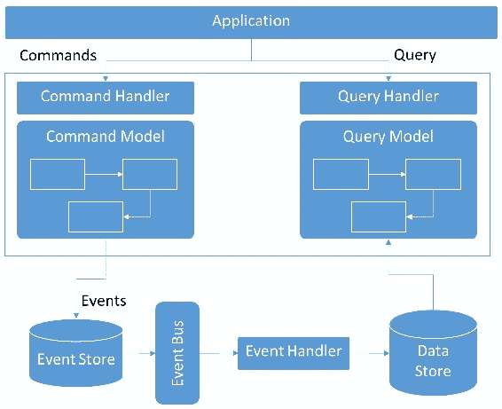

# 三、设计您的云原生应用

在本章中，我们暂停应用开发，后退一步，看看设计云应用的大局。如第一章所示，云中的应用比我们目前开发的传统企业应用具有更多独特的挑战。此外，必须通过不牺牲性能、稳定性和弹性来满足敏捷性的业务需求。因此，看看第一原则就变得很重要了。

在第一章中，我们了解了云环境与传统企业之间的差异，以及 DevOps、12 因素应用、微服务和生态系统的概念是如何重要的。这里，我们将介绍各种原理和技术，它们使我们能够设计健壮、可扩展和敏捷的应用。

我们将介绍的一些领域包括 REST、HTTP 和 JSON 在构建 API 方面的主导地位、API 网关的作用、如何解耦应用、如何识别微服务、各种微服务设计指南、数据架构的作用以及设计 API 时的安全性作用。

本章将介绍以下主题：

*   REST、HTTP 和 JSON 的流行
*   API 的兴起和普及
*   API 网关的作用
*   解耦对更小应用边界的需求
*   微服务标识
*   微服务设计指南
*   微服务模式
*   数据架构
*   安全的作用

# REST、HTTP 和 JSON 三者

web 使 HTTP 非常流行，是访问 internet 内容的事实上的集成机制。有趣的是，这种技术在依赖本机和二进制协议的应用中并不流行，例如 RMI 和 CORBA 用于应用间访问。

当 Google、Amazon、Facebook 和 Twitter 等社会消费公司开始发布 API 来连接/集成其产品时，跨 web 集成的事实标准变成了 HTTP/REST。社会消费者公司开始投资于平台，供车载开发者开发各种应用，从而导致依赖 HTTP 作为协议的应用的激增。

浏览器端的应用是 HTML 和 JavaScript 的混合体。从服务器或其他应用返回的信息需要采用简单、可用的格式。JavaScript 支持数据操作，最适合的数据格式是**JavaScript 对象表示法**（**JSON**）。

REST 是一种状态表示风格，它提供了一种处理 HTTP 交换的方法。REST 有很多有利因素：

*   利用 HTTP 协议标准，为 WWW 上的任何东西提供了巨大的支持
*   隔离对实体（`GET`/`PUT`/`POST`/`DELETE`的访问的机制，同时仍使用相同的 HTTP 请求模型
*   支持 JSON 作为数据格式

REST with JSON 已经成为 SOAP/XML 模型的主导模型。根据 ProgrammableWeb 的一项统计：

73%的可编程 Web API 使用 REST。SOAP 远远落后，但仍有 17%的 API 使用 SOAP。

让我们介绍一下 REST/JSON 模型优于服务开发的 SOAP/XML 模型的一些高级原因：

*   契约优先方法的 SOAP 模型使得制作 web 服务变得困难。
*   与 REST 相比，SOAP 是复杂的，与 REST 相比，SOAP 的学习曲线更陡峭。
*   与 SOAP 相比，REST 是轻量级的，并且不会像 SOAP 那样对带宽征税。
*   Java 世界之外对 SOAP 的支持是有限的，主要将 SOAP 归属于企业世界。
*   客户端的 XML 解析是内存和计算密集型的，这不适合移动世界。
*   XML 模式/标记提供了结构定义和验证模型，但需要额外的解析。JSON 具有松散的语法，允许在数据模型上快速迭代。

今天，现实情况是 REST/JSON 已被采纳为跨编程语言集成的标准，提供了一种通过 internet 集成 API 的简便方法。

# API 的兴起和普及

**应用编程接口**（**API**）提供标准接口或合同，通过互联网消费其服务。API 定义了输入和输出的结构，并在 API 版本的生命周期内保持不变。

API 是客户机层和企业之间的契约。它们是面向消费者的，也就是说，由客户机设计，并且从客户机抽象出服务实现细节。

回到社会消费品公司的出现，创建新的应用意味着不能从头开始。例如，如果我的应用需要使用地理地图，我可以使用 GoogleMapAPI 并在此基础上构建我的应用。类似地，我可以使用 OAuth 并使用 Google、Facebook 或 Twitter 作为 OAuth 提供商，而不是构建自己的身份验证模型。

这种将可重复但往往复杂的功能作为可重用服务提供的整个模型导致了这样一种模型：开发人员开始使用这些预先存在的 API 构建应用，这反过来又提高了开发人员的生产率，并推动了现代应用或移动应用经济的发展。

公司开始考虑是否可以将 API 货币化，这意味着多家公司正在编写/发布提供类似功能的 API。这导致了 API 的民主化，允许任何人和每个人访问特性/功能。

API 的整个民主化意味着，突然之间，每个流程或功能都可以作为一组 API 提供，这些 API 可以被编排或编排以构建新的特性或功能。以前花了几个月或几年的时间，现在只需要几周或几天。所有这些生产力意味着更短的开发周期，允许快速迭代来提供新的和创新的特性。

如今，各种 API 都可以使用：从 Facebook、Google 和 Twitter 等社交公司到 Salesforce、NetSuite 等企业，以及 PaaS/IaaS 提供商，如 AWS、Azure、**谷歌云引擎**（**GCE**等，它们都提供从配置 VM 到数据库实例的功能，到人工智能提供商，如 Watson、AWS 人工智能和 Azure ML。

# API 网关的作用

API 网关是一个单一的接口，它在重定向到内部服务器之前处理所有传入的请求。API 网关通常提供以下功能：

*   将传入流量路由到由提供商的数据中心/云托管的适当服务。提供反向代理模型，以限制提供商数据中心/云内托管的各种 API 和服务的公开。
*   过滤来自 web、移动等各种渠道的所有传入流量。
*   实现安全机制（如 OAuth）来验证和记录服务使用情况。
*   提供对特定服务的流量进行节流和限制的能力。
*   在服务使用者和提供者之间转换数据。
*   提供一个或多个映射到基础服务提供商的 API。例如，对于不同类型的消费者（移动、web、付费服务或免费服务），可以将同一基础服务拆分为多个自定义 API，这些 API 向不同的消费者公开，以便消费者只看到其需要的功能：

# API 网关的好处

使用 API 网关可提供以下好处：

*   **关注点分离**：将微服务提供商与应用端的服务消费者隔离。这允许将应用层与服务请求客户端分离。
*   **面向消费者**：API 网关为大量 API 和微服务提供统一的枢纽。这使使用者能够将注意力集中在 API 实用程序上，而不是定位服务的托管位置、管理服务请求限制、安全性等。
*   **面向 API 的**：根据客户端类型和所需协议提供最佳 API。
*   **编排**：提供将多个服务调用编排成一个 API 调用的能力，从而简化客户端的逻辑。现在，它可以调用一个 API，而不是调用多个服务。更少的请求意味着更少的调用开销，并从整体上改善消费者体验。API 网关对于移动应用至关重要。
*   **监控**：API 网关还提供了监控 API 调用的能力，从而让企业能够评估 API 的成功与使用情况。

除了总体优势外，API 网关还为整个难题添加了更多的内容。这意味着需要管理更多的基础设施、需要管理更多的配置、更多的故障点以及请求的额外跃点。因此，除非好处大于缺点，否则需要仔细检查 API 网关的使用，以了解业务需求和好处。

接下来，我们将看到将应用功能分解为一组 API 或微服务的过程。

# 应用解耦

传统的应用开发模型将所有特性和功能捆绑在一个称为单片应用的大型软件包中，但由于多种原因，该模型越来越不受欢迎。Monolith 应用以功能和逻辑的形式承担了太多的责任。正是这一特点使它们具有高耦合性和低内聚性。由于功能的一部分无法与功能和逻辑的其余部分分离，因此整体中的重用系数往往较低。

当我们开始分解整体功能，甚至设计新的应用时，重点需要放在定义服务边界上。定义正确的服务边界集及其相关交互是实现高内聚和低耦合模型的关键。

问题变成了，应用应该在什么基础上解耦成服务和定义的服务边界？

# 有界上下文/域驱动设计

作为应用设计的一部分，需要将业务域分解为更小的子域或业务功能。我们需要仔细检查业务实体及其属性，以定义服务边界。例如，在客户 ID 实体的情况下，客户的地址可能是客户的一部分。在应用的上下文中，地址维护可能是一个单独的活动，可能需要单独处理。同样，个性化可能需要客户偏好或购物习惯。在这种情况下，个性化引擎对这组属性更感兴趣。

我们是应该将一个具有各种属性的大型客户服务拼凑在一起，还是可以根据从业务中获得的角度进行划分？这些不同的观点导致了将有界上下文定义为领域驱动设计的一部分。

bounded context 是一种域驱动的设计范例，有助于添加 seam 和创建服务组。有界上下文在解决方案空间中工作，以指示服务是相关的，并且属于公共功能域。它是由一个团队按照逆康威定律与一个业务部门合作建立的。受限上下文可以通过以下方式与其他服务/业务功能通信：

*   公开内部 API 或服务
*   在事件总线上发出事件

一个有界的上下文可能有它自己的服务通用的数据存储，或者采用每个服务的数据存储范例。

每个有界上下文都有自己的生命，并形成一个产品。团队围绕这些有限的上下文进行组织，并承担服务的完整堆栈实现的全部责任。这些团队是跨职能的，从开发、测试、用户体验、数据库、部署和项目管理中获得技能。每种产品都可以拆分为更小的服务集，这些服务集可以彼此异步通信。记住，重点不是一组功能，而是业务能力。

我们开始围绕业务能力构建服务。该服务拥有其业务数据和功能。该服务是此类数据的主数据，其他服务不能拥有任何此类服务数据。

# 上/下游服务分类

分解应用系统的另一种方法是按上游和下游数据流模型对它们进行分类。系统中的核心实体包括上游服务。这些上游服务会引发下游服务订阅的事件，以增强其功能。这旨在使系统解耦，并帮助提高总体业务敏捷性。这适用于反应式（也称为事件驱动的）体系结构概念。

让我们对电子商务应用的一个简化的视图，其中核心实体是 Po.T0.客户 AutoT1；**订单**服务取决于来自核心实体的客户和产品信息。接下来，我们将为客户提供**推荐**和**个性化**服务。**推荐**和**个性化**服务依赖于核心实体**客户**、**产品**和**订单**的数据。当任何核心实体发生更改时，将发布更改。这些更改由**推荐**和**个性化**服务获取，在这些服务中，它们使用附加属性来增加这些数据，以提供相关服务。**推荐**和**个性化**服务在这些服务的下游：

这种将业务能力划分为**上游**和**下游**的模型有助于定义服务之间的依赖关系，并改变任何上游服务对下游服务的影响。

# 商业活动

随着系统的发展，这些服务将开始聚合为自然盟友。这意味着确定服务是否依赖于一组类似的数据元素，或者提供重叠/侧踢功能，并且可能是同一个有界上下文的一部分。

在同一域中工作的有界上下文中的服务可能需要依赖于主服务器才能实现准确的功能。这可能意味着，一些主服务数据属性需要提供给相关的有界上下文服务。例如，在前面的示例中，我们讨论了客户偏好。现在，这些首选项可能需要映射到客户的位置（地址）。在这种情况下，客户首选项是否应该每次调用客户地址服务来构建首选项，或者是否可以将相关属性复制到自己的域中？在没有数据重复的情况下，这两个服务开始紧密耦合，从而形成一个双向通信模型。为了打破这种紧密耦合，我们允许 customer preferences 服务使用事件缓存或复制相关的 customer 属性。这种异步模型打破了服务之间的时间紧耦合。每当客户地址发生更改时，服务都会发布一个业务事件以进行必要的更改。更改由客户首选项订阅，客户首选项接收更改以更新其首选项模型。

此异步模型允许我们确保：

*   数据的所有权仍然很清楚。对数据的任何更改都将声明给从属服务。允许从属服务保存或复制数据，但除非更新主副本，否则不能更改本地副本（golden source 原则）。依赖服务只存储所需的和功能相关的数据子集（需要知道原则）。
*   异步业务事件导致服务之间的低耦合。核心服务更改会导致事件。事件向下传播到感兴趣的相关服务。唯一的依赖关系是发布的业务事件的格式。
*   下游服务遵循最终一致性原则；所有业务事件都以顺序方式存储，以在以后构建/声明（事件源/CQR）。查询模型可以不同于记录系统。
*   业务事件的异步模型还促进编排而不是编排，从而产生松散耦合的系统/服务。

有时，当团队开始开发新产品时，可能不可能预先定义有界上下文或服务分解。因此，团队通过将应用的功能公开为一组服务，开始将其构建为一个整体应用。随着团队实现更多的故事，他们可以识别快速变化的功能（通常是体验或渠道服务）和缓慢变化的功能（通常是核心服务或实体服务）。

团队可以开始将服务分为两类：体验服务和系统服务。系统服务可以围绕实体和相互关系进一步分组。体验服务映射到客户旅程。团队通常会进行 sprint，只是为了清理/重构代码，以清除每个周期累积的技术债务。

那么，下一个问题是，什么将服务标识为微服务？

# 微服务识别

microservice 的名称并不一定意味着该服务必须是小型的。但它有以下特点：

*   **单一责任原则**：这是微服务的核心设计原则。他们应该完成一项任务的一个业务单元，并完成它。如果存在低耦合，则服务将更容易修改和部署，甚至更容易完全替换。
*   **粒度**：微服务粒度包含在单个功能域、单个数据域及其直接依赖关系、自给自足的封装和技术域的交集中。
*   **受限**：服务应该能够访问其受限上下文中的资源，该上下文由同一团队管理。但是，它不应该直接访问其他模块的资源，例如缓存和数据库。如果服务需要访问其他模块，则应通过内部 API 或服务层访问。这有助于减少耦合并提高灵活性。
*   **独立**：每个微服务都是在自己的源代码中独立开发、测试和部署的。它可以使用第三方或共享库。

# 微服务和面向服务架构（SOA）之间的区别

以下是微服务与**面向服务架构**（**SOA**的区别：

*   服务执行整个业务工作单元。例如，如果服务需要客户或产品数据，则最好将其存储在服务数据存储中。通常，通过 ESB 获取客户记录不需要转到客户服务。
*   服务有自己的私有数据库，或者只有在其有限上下文中共享的数据库，可以存储为业务工作单元提供服务所需的信息。
*   服务是一个智能端点，通常在 Swagger 或类似的存储库中公开带有契约定义的 REST 接口。其他部门或客户端使用的某些服务通过 API 平台公开。

# 服务粒度

以下是服务的类型：

*   **原子或系统服务**：这些服务完成一个单位级别的工作，并足以通过引用数据库或下游源来服务请求。
*   **组合或流程服务**：这些服务依赖于两个或多个原子服务之间的协调。通常，不鼓励使用复合微服务，除非业务案例已经涉及到使用现有的原子服务。一个例子是从一个储蓄账户进行信用卡支付，它调用两种服务，一种用于借记储蓄账户，另一种用于贷记卡账户。复合微服务还引入了固有的复杂性，例如在分布式场景中难以实现的状态管理和事务。
*   **体验服务**：这些服务与客户旅程紧密相连，部署在基础设施的边缘。这些服务处理来自移动和 web 应用的请求。这些服务通过使用 API 网关等工具的反向代理公开。

# 微服务设计指南

微服务的整个概念是关于关注点的分离。这需要在具有不同职责的服务之间进行逻辑和体系结构分离。下面是一些设计微服务的指南。

这些指南符合 Heroku 工程师给出的 12 因素应用指南：

*   **轻量级**：微服务必须是轻量级的，以实现更小的内存占用和更快的启动时间。这有助于更快的 MTTR，并允许在较小的运行时实例上部署服务，从而更好地进行水平扩展。与繁重的运行时（如应用服务器）相比，较小的运行时（如 Tomcat、Netty、Node.js 和 Undertow）更适合。此外，服务应该以轻量级文本格式（如 JSON）或二进制格式（如 Avro、Thrift 或协议缓冲区）交换数据。
*   **无功**：适用于高并发负载或响应时间稍长的业务。典型的服务器实现会阻止线程执行命令式编程样式。由于微服务可能依赖于其他微服务或 I/O 资源（如数据库），因此阻塞线程可能会增加操作系统的开销。反应式样式对非阻塞 I/O 进行操作，使用回调处理程序，并对事件作出反应。这不会阻塞线程，因此可以更好地提高微服务的可伸缩性和负载处理特性。数据库驱动程序已经开始支持反应模式，例如 MongoDB 反应流 Java 驱动程序。
*   **无状态**：无状态服务的扩展性更好，启动更快，因为在关机时磁盘上没有存储状态，启动时也没有激活状态。它们也更具弹性，因为服务的终止不会导致数据丢失。无状态也是轻量级的一步。如果需要状态，服务可以将状态存储委托给高速持久（键值）存储，或者将其保存在分布式缓存中。
*   **原子**：这是微服务的核心设计原则。它们应该易于更改、测试和部署。如果服务相当小，并且能够独立完成最小的业务单元的工作，那么所有这些都可以实现。如果存在低耦合，则服务将更易于修改和独立部署。复合微服务可能根据需要而需要，但在设计上应受到限制。
*   **外部化配置**：典型的应用属性和配置通常作为配置文件进行管理。鉴于微服务的多个大型部署，随着服务规模的增加，这种做法将变得越来越麻烦。因此，最好将配置外部化到配置服务器中，这样就可以在每个环境的层次结构中维护配置。诸如热更改之类的功能也更容易同时反映许多服务。
*   **一致**：服务应按照编码标准和命名约定指南以一致的风格编写。诸如序列化、REST、异常处理、日志记录、配置、属性访问、计量、监视、资源调配、验证和数据访问等常见问题应该通过可重用资产、注释等一致地完成。来自同一团队的其他开发人员应该更容易理解服务的意图和操作。
*   **弹性**：服务应该处理由技术原因（连接、运行时）和业务原因（无效输入）引起的异常，而不是崩溃。他们应该使用诸如超时和断路器之类的模式，以确保仔细处理故障。
*   **好公民**：通过 JMX API 报告他们的使用统计数据、访问次数、平均响应时间等，和/或通过库将其发布到中央监控基础设施，并按照规定的标准记录审核、错误和业务事件。通过健康检查接口暴露其状况，例如，通过弹簧执行器。
*   **版本化**：微服务可能需要支持不同客户端的多个版本，直到所有客户端迁移到更高版本。因此，部署和 URL 应该支持语义版本控制，即 X.X.X。

此外，微服务还需要利用通常在企业级构建的其他功能，例如：

*   **动态服务注册**：微服务在启动时向服务注册中心注册自身。
*   **日志聚合**：可以聚合微服务生成的日志，进行集中分析和故障排除。日志聚合是一个独立的基础结构，通常构建为异步模型。Splunk 和 ELK Stack 等产品与 Kafka 等事件流一起用于构建/部署日志聚合系统。
*   **外部配置**：微服务可以从外部配置（如 Consor 和 Zookeeper）获取参数和属性进行初始化和运行。
*   **配置和自动扩展**：如果 PaaS 环境根据传入负载、某些服务失败或未及时响应检测到需要启动其他实例，则该服务将由 PaaS 环境自动启动。
*   **API 网关**：微服务接口可以通过提供抽象、安全、节流和服务聚合的 API 网关向客户端或其他部门公开。

在开始构建和部署服务时，我们将在后续章节中介绍所有服务设计指南。

# 设计和部署模式

在开始设计应用时，您需要了解各种服务设计和集成模式。

# 设计模式

根据要解决的问题，可以将微服务设计模式分为多个类别。下面几节将讨论最常见的类别和相关模式。

# 内容聚合模式

对于微服务和受限上下文，还有一个额外的内容聚合责任。客户可能需要跨多个域或业务领域的信息（或在解决方案术语中，有界上下文）。一项服务可能无法提供所需的内容。这些模式主要帮助识别和建模体验服务类别。因此，可以应用各种聚合模式。

# 按客户端聚合

在最后一英里处聚集。这适用于 web 浏览器或具有合理*处理能力的*用户界面，该界面显示来自不同领域的内容。此模式通常用于聚合各种主题区域的主页。此外，这也是亚马逊普遍使用的模式：

**利益**

通过客户端模式使用聚合的好处如下：

*   服务层的解耦方法。在每个单独的服务中更容易实现灵活性和可维护性。
*   由于请求可以并行运行以填充屏幕上的各个区域，因此 UI 层的感知性能更快。当有更高的带宽可用于并行获取数据时，会得到更大的增强。

**权衡**

与客户机模式的聚合相关联的权衡如下：

*   需要复杂的用户界面处理功能，如 Ajax 和单页应用
*   聚合的知识在 UI 层公开，因此，如果类似的输出作为数据集提供给第三方，则需要聚合

# API 聚合

在门口聚集。这适用于移动或第三方用例，它们不想知道聚合的详细信息，而是希望在单个请求上使用一个数据结构。API 网关设计用于进行此聚合，然后向客户端公开统一服务。如果在内容聚合期间不需要显示聚合服务中的任何数据节，则 API 网关还可以选择删除这些数据节：

**利益**

使用 API 聚合模式的好处如下：

*   各个服务细节由 API 网关从客户端抽象出来。因此，它提供了在不影响客户端层的情况下在内部更改服务的灵活性。
*   在带宽受限的情况下，运行并行 HTTP 请求可能不是一个好主意。
*   在处理能力可能不足以同时生成页面的 UI 处理受限场景中，效果更好。

**权衡**

与 API 聚合模式相关的权衡如下：

*   如果有足够的带宽，此选项的延迟将高于客户端的聚合。这是因为 API 网关在将数据发送到客户端之前等待所有内容聚合。

# 微服务聚合

业务层的聚合。在这种方法中，微服务聚合来自不同组成微服务的响应。如果在聚合数据时要应用任何实时业务逻辑，则此模式非常有用。例如，显示不同业务的客户持有的总价值：

**利益**

使用微服务聚合模式的好处如下：

*   对聚合进行更精细的控制。此外，还可以基于聚合数据合并业务逻辑。因此，提供了更丰富的内容聚合功能。
*   降低对 API 网关功能的依赖性。

**权衡**

与微服务聚合模式相关的权衡如下：

*   更低的延迟和更多的代码，因为额外的步骤会引入额外的跃点。
*   更多失败或犯错的机会。来自微服务的并行聚合将需要复杂的代码，如反应式或回调机制。

# 数据库聚合

数据层的聚合。在这种方法中，数据被预先聚合到一个**操作数据存储**（**ODS**）中，通常是一个文档数据库。这种方法适用于对聚合数据进行额外业务推断的场景，这些数据很难通过微服务实时计算，因此可以由分析引擎预先计算：

**利益**

使用数据库聚合模式的好处如下：

*   可以通过分析工作进一步丰富数据。例如，在客户 360°视图中，基于 ODS 中聚合的客户组合，可以对**次佳行动**（**NBA**场景应用其他分析。
*   与以前的方法相比，该方法更灵活、能力更强，并且可以对数据模型进行更精细的控制。

**权衡**

与数据库聚合模式相关的权衡如下：

*   更高复杂性
*   重复数据和更多数据存储需求
*   将数据从记录系统发送到 ODS 中央存储所需的附加 ETL 或**更改数据捕获**（**CDC**工具

# 协调模式

理想情况下，微服务应该能够完成一个业务单元的工作。然而，在某些业务场景中，微服务必须利用其他服务作为依赖项或组合。例如，考虑信用卡付款首先借记储蓄账户，然后贷记信用卡账户。在这种情况下，借记卡和信用卡这两种基础服务可能会被各自的储蓄账户和信用卡域公开，需要在它们之间进行协调。

# 业务流程管理（BPM）

涉及长时间运行的流程的复杂协调最好由 BPM 完成。企业可能已经有了 BPM 产品。然而，对于简单的两步或三步协调来说，BPM 可能有些过分。

# 复合服务

指导原则是使用组合服务进行低复杂性（或简单的）协调，这是大量的。在剩下的讨论中，这种协调可以称为微流。

# 为什么是复合服务？

在微服务体系结构中，服务定义的实现是由较小的可部署单元完成的，而不是在应用服务器中运行的大型整体式应用。这使得服务更容易编写，更改和测试更快，部署更快。但这也给跨越两个或多个微服务的微流带来了挑战，可能跨越多个有界上下文。在 monolith 应用中，这些微流可以作为单个事务跨部署在单个可部署单元中的两个模块进行协调。在微服务体系结构中，不鼓励分布式事务，因此，必须使用组合方法解决微流。

# 微服务协调能力

本节列出了组合服务所需的功能：

*   **状态管理**：通常需要状态管理器组件来管理其正在协调的服务的输出状态。此状态需要保存在不受**服务器端状态管理**（**SSM**故障影响的持久存储中。另一个 SSM 实例应该能够检索状态并从它停止的地方开始。
*   **交易控制**：交易边界受微服务影响。在一个事务中对两个方法的两个单独的函数调用现在通过一个复合服务变成了两个单独的服务调用。有两种方法可以处理这种情况。
    *   **分布式事务**：支持两阶段提交协议。它们不可扩展，会增加延迟和死锁场景，需要昂贵的产品和基础架构来支持它们。选定的协议（如 REST 或消息传递）可能不支持它们。这种样式的好处是系统始终处于一致状态。
    *   **补偿交易**：通过运行功能性反向交易，而不是试图回滚到较早的交易，在功能上强制执行交易控制。这是一种更加解耦的方法，因此具有可扩展性。
        由于技术产品要求的简化，我们建议对分布式事务进行补偿。
*   **服务后呼叫协调**：原子服务调用可以导致成功，即当组成服务成功完成工作时；或者，由于技术或功能错误，任一协调服务未响应或处理失败。复合服务需要获得已完成服务的响应，并决定下一步的操作。
*   **超时处理**：启动微流时启动定时器。如果服务在启动微流的特定时间内没有响应，则引发事件以发送到事件总线。
*   **可配置性**：SSM 组件的多个实例将运行，以适应各种微流。在每个微流程中，服务协调、计时器和操作都会有所不同。所以，提供一个可以参数化配置计时器、补偿事务和后处理操作的框架非常重要。

# 协调模型

我们将讨论复合服务微流的以下协调方式。

# 异步并行

复合服务异步启动对组成原子服务的服务调用，然后侦听服务响应。如果其中一个服务失败，它将向另一个服务发送一个补偿事务。

这类似于 EIP 的分散-聚集或合成消息处理器模式：

# 异步顺序

在管道处理中，复合服务按顺序向原子服务发送消息。它等待上一个服务返回成功，然后再调用下一个服务。如果任何服务失败，那么组合服务将向以前成功的服务发送补偿事务。这类似于 EIP 中的 Process Manager 模式：

# 使用请求/响应的编排

与上一节类似，但采用请求/响应和同步方式，而不是异步消息传递。

# 崩溃微服务

当组合和其组成的微服务之间似乎存在耦合时，可以选择将服务折叠并作为单个组件运行。例如，转账可以通过账户服务实现，另外还有一种方式`transferFunds`接受`fromAcc`、`toAcc`和资金金额。然后，它可以作为单个事务的一部分发出`debit`和`credit`方法调用。然而，这一方法需要经过适当考虑后才能决定。缺点包括信用卡和储蓄领域的借贷服务耦合部署：

# 部署模式

微服务试图解决独立的问题，如依赖性，并通过拥有独立的可部署单元来实现灵活性。我们可以在目标运行时上以各种样式部署微服务。选项按增加隔离度（好）和成本（坏）的顺序进行描述。

# 每个 WAR 文件有多个服务

尽管开发可能采用微服务风格（服务的独立代码库、处理不同服务的不同团队），但部署基本上遵循整体式风格：

# 利益和权衡

与完整的整体风格相比，唯一的好处是，由于独立的代码基础和较少的依赖性，对公共代码元素的依赖性较低。但是，它不提供服务行为之间的任何运行时隔离，因此没有微服务体系结构模型的真正好处，例如独立发布、扩展单个服务或限制一个服务问题对其他服务的影响。

# 适合

在很多情况下，这是有用的，因为它不提供运行时隔离。然而，这可能是实现完全分离的中间步骤。

# 每战/每耳服务

该模型将服务的构建过程分离，以便为每个服务创建单独的`.war`/`.ear`文件。但是，它们最终被部署到同一 web 容器或应用服务器：

# 利益和权衡

这种风格将隔离更进一步，通过分离每个服务的构建过程来创建一个可部署单元。但是，由于它们部署在相同的 web 容器或应用服务器上，因此它们共享相同的进程。因此，服务之间没有运行时隔离。

# 适合

一些团队可能在目标部署上遇到限制，无法使用他们在 monolith 式开发中使用的相同软件或硬件。在这种情况下，这种部署风格是合适的，因为团队仍然可以进行独立开发，而无需相互牵制，但在部署到传统生产基础设施的过程中，必须与其他团队协调发布。

# 每个进程的服务

这种风格使用前面讨论的 fat JAR 概念，将应用服务器或 web 容器作为部署单元的一部分。因此，目标运行时环境只需要一个 JVM 来运行服务。Dropwizard 和 Spring 引导框架鼓励这种类型的部署构建。我们在[第 2 章](02.html)*编写您的第一个云原生应用*中也看到了创建这样一个部署单元的示例：

# 利益和权衡

与“按流程提供服务”样式相关的好处和权衡如下：

*   这种方法有助于分离运行服务的运行时进程。因此，它在服务之间创建了隔离，因此一个进程中的内存泄漏或 fat 异常在某种程度上不会影响其他服务。
*   与现有硬件上的其他服务相比，这允许对服务进行更多的部署，从而有选择地扩展服务。
*   它还允许团队根据特定用例或团队需求自由使用不同的应用服务器/web 容器。
*   但是，它无法防止任何一个服务占用系统资源（如 CPU、I/O 和内存），从而影响其他服务的性能。
*   它还减少了对操作团队运行时的控制，因为此模型中没有中央 web 容器或应用服务器。
*   这种风格需要良好的治理来限制部署状态的可变性，并有大量的用例来支持这种差异。

# 适合

这种风格为那些受限于使用其现有生产基础架构且还没有 Docker 容器或小型 VM 配置的团队提供了最佳折衷方案。

# 每个 Docker 容器的服务

在这种风格中，服务作为一个胖 JAR 部署在 Docker 容器中，该容器具有必要的先决条件，例如 JVM。它比 Linux 容器技术提供的隔离度高一步：

# 利益和权衡

与每个 Docker 容器样式的服务相关联的好处和权衡如下：

*   Linux 容器技术除了提供网络和文件访问隔离外，还限制了服务的 CPU 和内存消耗。这种隔离级别对于许多服务来说已经足够了。
*   容器可以快速从图像启动。因此，可以快速生成基于应用或服务映像的新容器，以满足应用不断变化的需求。
*   容器可以通过各种编排机制进行编排，如 Kubernetes、Swarm 和 DC/OS，以便可以根据定义良好的应用蓝图自动创建整个应用配置。
*   与前面的样式一样，可以在容器中运行各种服务技术。例如，除了 Java 服务之外，还可以运行 Node.js 服务，因为容器映像将位于操作系统级别，因此可以由编排框架无缝启动。
*   与虚拟机相比，容器在资源需求方面的开销要低得多，因为它们更轻量级。因此，与在自己的虚拟机中运行每个服务相比，它们更便宜。
*   但是，容器重用主机系统的内核。因此，不可能运行要求不同操作系统（例如，基于容器技术的 Windows 或 Solaris）的工作负载。

# 适合

这种部署方式很好地平衡了隔离和成本。这是推荐的样式，适用于大多数服务部署。

# 每个虚拟机的服务

在这种风格中，fat JAR 直接部署在 VM 上，就像在*每个进程的服务*部分中一样。但是，这里每个 VM 只部署一个服务。这确保了服务与其他服务的完全隔离。

部署通过诸如 Chef 和 Puppet 之类的工具实现自动化，这些工具可以获取基本映像（例如安装 Java），然后运行一系列步骤在 VM 上安装应用 JAR 和其他实用程序：

# 利益和权衡

与每 VM 服务风格相关的好处和权衡如下：

*   如果有任何用例需要完全的操作系统级隔离，那么这种风格是合适的
*   这种风格还允许我们在虚拟机上混合完全不同的工作负载，如 Linux、Windows 和 Solaris
*   但是，与以前的样式相比，这种样式的资源更密集，启动速度也更慢，因为虚拟机包括一个完整的来宾操作系统启动
*   因此，与早期的选项相比，它的成本效率更低

# 适合

这种部署方式倾向于增加成本。这是推荐的样式，适用于基于云映像的部署，例如创建**亚马逊机器映像**（**AMI**）。

# 每台主机的服务

通过在不同的物理主机上部署服务，这将从虚拟机监控程序（用于虚拟机）到硬件级别的隔离。微型服务器或专用设备的概念可用于此目的。

# 利益和权衡

与每主机服务样式相关的好处和权衡如下：

*   硬件（如处理器、内存和 I/O）可以根据服务的使用情况进行精确调整。Intel 提供了一系列针对特定任务（如图形处理、web 内容服务等）进行优化的微型服务器。
*   在这种解决方案中可以实现非常高的组件密度。
*   这种部署方式只适用于极少数从硬件级隔离或专用硬件需求中获益的用例。
*   这是一项成熟的技术，因此目前还没有多少数据中心云提供商提供这项技术。然而，到本书出版时，它已经成熟了。

# 适合

这种部署方式非常罕见，因为很少有用例需要如此高级别的隔离或专门的硬件需求。用于 web 内容或图形处理的设备是一些特殊的用例，它们将从这种部署样式中受益。

# 释放模式

以下是服务中使用的不同发布模式：

*   **胖罐**：正如[第 2 章](02.html)所述，*编写您的第一个云原生应用*胖罐有助于将 web 容器与可部署应用捆绑在一起。这确保了开发、测试和生产环境中的部署版本之间不存在不一致。
*   **蓝绿色部署**：此模式建议维护两个相同的生产环境。一个新的版本将发布到一个未使用的环境中，比如 green。交换机通过路由器向绿色部署发送流量。如果成功，绿色环境将成为新的生产环境，而蓝色环境将处于非活动状态。如果有问题，回滚会更容易。下一个周期反过来进行，部署到 blue 环境，从而在两个环境之间交替进行。还有一些挑战，例如数据库升级。对于异步微服务，此技术可用于释放一个或一组具有不同输入队列的微服务。从连接参数加载的配置决定将请求消息丢弃在一个队列中而不是另一个队列中。
*   **语义版本控制**：语义版本控制是关于发布带有版本号的软件，它们改变底层代码含义的方式，以及从一个版本到下一个版本的修改内容。参见[http://semver.org/](http://semver.org/) 了解更多详情。在异步微服务中，每个微服务使用输入队列的类似策略也适用。但是，在这种情况下，两个服务都是活动的，一个用于遗留服务，另一个用于新更改。基于请求，可以使用基于内容的路由模式切换队列以发送请求。
*   **金丝雀发布**：此模式用于使用路由逻辑向一小部分用户引入更改，该路由逻辑选择一组客户来提供新服务。就异步服务而言，这可以由两组输入队列来处理，重定向逻辑现在决定将请求消息丢弃到哪个队列。
*   **不可变服务器/不可变传递**：不可变服务器和不可变传递是相关的。目的是从配置管理存储库中自动构建服务器（VM 或容器）及其软件和应用。一旦构建，它就不会改变，即使从一个环境移动到另一个环境也不会改变。只有配置参数是通过环境、JNDI 或单独的配置服务器（如 concur 或使用 Git）注入的。这可确保对生产部署所做的任何临时更改都不会记录在版本控制系统中。
*   **功能切换**：这允许在生产中发布的功能在一些配置设置中切换开或关。此切换通常在前端或 API 门处实现，以便服务/功能的最终用户可以看到或不看到它。这种模式对于暗发射能力非常有用，这将在以下章节中讨论。
*   **黑暗发布**：由 Facebook 推广。暗启动意味着在计划发布之前将服务/功能发布到生产中。这为在生产环境中测试集成点和复杂服务提供了机会。如前所述，只有前端或 API 更改使用金丝雀版本和功能切换来完成。

# 微服务的数据体系结构

微服务的关键设计理念之一是有界上下文和管理数据存储的服务。在一个有限的上下文中，多个服务可以访问一个公共数据存储，或者采用每服务数据存储范例。

由于可能有多个服务实例在运行，如何确保数据读取/更新操作不会导致资源死锁？

# 命令查询责任分离（CQRS）

CQRS 引入了一个有趣的范例，挑战了使用相同数据存储来创建/更新和查询系统的传统思想。其思想是将更改系统状态的命令与幂等查询分开。物化视图就是这种模式的一个例子。这种分离还提供了使用不同数据模型进行更新和查询的灵活性。例如，关系模型可用于更新，但从更新生成的事件可用于更新更易于读取的缓存或文档数据库。

用户请求可以大致分为两部分，例如更改系统状态的命令和获取系统状态供用户使用的查询。对于命令处理，交战系统收集足够的业务数据，以便能够调用记录系统上的相应服务来执行命令。对于查询，参与系统可以选择调用记录系统，或者从为读取工作负载设计的本地存储中获取信息。这种策略分离可以产生巨大的好处，例如减少记录系统的负载和减少延迟：

CQRS 模式有助于利用旧的记录系统以及较新的文档数据库和缓存。我们将在下一章介绍如何在您的服务中实现 CQR。

# 复制数据

在有限的上下文中，服务是数据的保管人。但是，如果另一个服务需要您的数据的子集呢？出现的一些问题/解决方案如下：

*   我应该调用服务来获取数据吗？
    *   增加了服务之间的聊天
    *   两个服务的紧密耦合
*   我可以直接从另一个有界上下文访问数据存储吗？
    *   断开有界上下文模型

那么，另一个服务（位于另一个有界上下文中）如何访问数据子集呢？（例如，在个性化服务中要求客户（来自客户服务）的地址属性。）

在这种情况下，最好的方法是从主域复制数据。主域将所需的更改发布为事件，任何对这些更改感兴趣的域都会订阅这些事件。事件从事件总线中拾取，事件中的数据用于更新重复数据存储中的更改：

# 利益

复制数据的好处如下：

*   有助于分离服务边界
*   包含数据的业务事件是服务之间的唯一关系
*   有助于避免昂贵的跨边界分布式事务模型
*   允许我们在不妨碍系统其他部分进展的情况下更改服务边界
*   我们可以决定我们希望以多快或多慢的速度看到外面的世界，并最终变得一致
*   能够使用适合我们服务模型的技术将数据存储在我们自己的数据库中
*   灵活地更改模式/数据库
*   使我们能够变得更具可扩展性、容错性和灵活性

# 欺骗

与复制数据相关的缺点如下：

*   大量数据更改可能意味着两端都有一个更强健的基础设施，处理丢失事件的能力需要事件的持久性
*   导致最终的一致性模型
*   系统复杂，调试困难

# 适切

有界上下文模型意味着所包含的数据只能通过定义的服务接口或 API 进行修改。这意味着用于存储数据的实际模式或存储技术与 API 功能无关。这为我们提供了使用适合用途的数据存储的可能性。如果我们正在构建搜索功能，并且内存中的数据存储更适合给定的业务需求，那么我们可以继续进行。

由于对数据的访问由服务 API 控制，因此数据存储的选择和结构对于实际的服务消费者来说并不重要：

服务 API 模型还提供了从一个数据存储移动到另一个数据存储的灵活性，只要维护服务契约，就不会影响其他使用服务。马丁·福勒将其称为“多语言的坚持”。

# 安全的作用

随着微服务的激增，管理这些服务的安全性成为一项挑战。除了**开放式 Web 应用安全项目**（**OWASP**）十大 Web 漏洞之外，还需要回答的一些问题如下：

*   服务是否要求客户端在调用服务之前进行身份验证（例如 OAuth）？
*   客户机可以调用任何服务，还是只调用其授权的服务？
*   服务是否知道来自请求的客户端的身份，并且是否将其传递给下游服务？下游服务是否有验证其调用授权的机制？
*   服务到服务调用（HTTPS）之间的通信是否安全？
*   我们如何验证从经过身份验证的用户收到的请求没有被篡改？
*   我们如何检测和拒绝请求的重播？

在分布式微服务模型中，我们需要控制和限制呼叫方拥有的权限，以及在出现安全漏洞的情况下，每次呼叫可以访问多少数据（最低权限）。大量的微服务和支持数据库意味着需要保护的攻击面很大。跨服务的服务器强化成为确保网络安全的一项重要而关键的活动。监控服务访问并对威胁进行建模非常重要，以便将我们最容易受到攻击的流程分解并集中精力。我们将看到 API 网关在解决一些安全问题方面的作用。

# 总结

这让我们得出了云应用设计原则的结论。在本章中，您了解了 API 流行的原因，如何解耦 monolith 应用，以及用于微服务设计的各种类型的微服务模式和数据体系结构原则。我们还看到了安全性在微服务中的作用以及 API 网关的作用。

在下一章中，我们将以[第 2 章](02.html)*为例，编写您的第一个云原生应用*，并开始向其添加更多的肉，使其更具生产等级。我们将添加数据访问、缓存选项及其注意事项、应用 CQR 和错误处理。