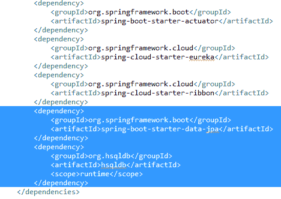
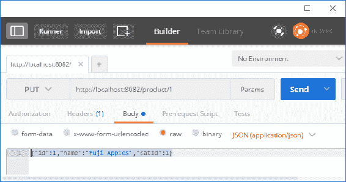
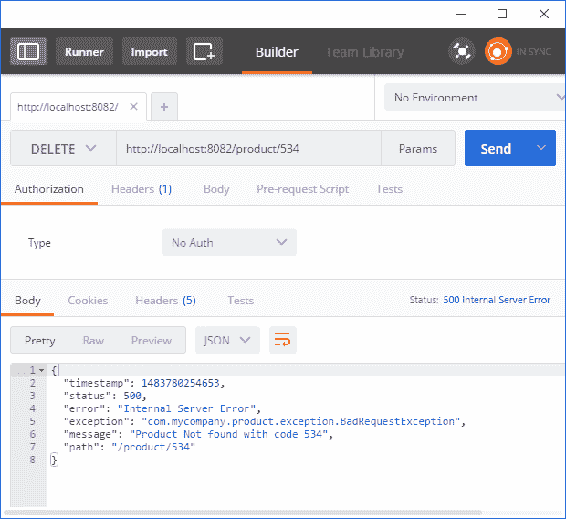
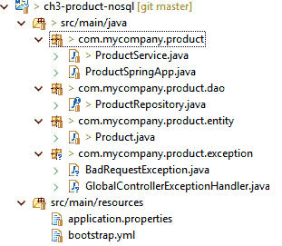

# 四、扩展云原生应用

在理解了设计原则之后，让我们以[第 2 章](02.html)*中开发的框架服务为例，编写您的第一个云原生应用*，并对其进行一些实际工作，使其为生产做好准备。

我们定义了两个 get 服务；`getProduct`对于给定的产品 ID，`getProducts`对于给定的类别。这两种服务具有高度的非功能性需求。它们必须始终可用，并以尽可能低的延迟提供数据。我们将采取以下步骤：

1.  **访问数据**：跨各种资源服务访问数据
2.  **缓存**：缓存选项及其注意事项
3.  **应用 CQRS**：使我们能够拥有不同的数据模型来服务不同的请求
4.  **错误处理**：如何恢复，发送什么返回码，断路器等模式的实现

我们还将研究添加方法来修改数据，例如`insert`、`update`和`delete`。在本章中，我们将介绍：

*   **验证**：确保数据在处理前是干净的
*   **保持两个 CQR 模型同步**：数据一致性
*   **事件驱动和****同步更新**：如何同时扩展架构和解耦架构

# 实现 get 服务

让我们把我们在[第 2 章](02.html)中开发的`product`项目*写下您的第一个云原生应用*向前推进。我们将在讨论概念时逐步增强它。

让我们仔细考虑一下我们两个服务的数据库。`getProduct`返回产品信息，`getProducts`搜索属于该类别的产品列表。首先，对于简单和标准的需求，这两个查询都可以由关系数据库中的单个数据模型来回答：

1.  将产品存储在具有固定列数的产品表中。
2.  然后，您将为该类别编制索引，以便可以快速运行针对该类别的查询。

现在，对于一般规模的公司来说，这种设计可以满足大多数要求。

# 简单产品表

让我们在标准关系数据库中使用产品表，并使用 Spring 数据在我们的服务中访问它。Spring 数据为使用**Java 持久化 API**（**JPA**）提供了出色的抽象，并使**数据访问对象**（**DAO**的编码更加容易。SpringBoot 进一步帮助我们编写最简单的代码，并在继续进行时对其进行扩展。

Spring Boot 可以使用嵌入式数据库，如 H2、HSQLDB 或外部数据库。进程内嵌入式数据库从进程中的 Java 服务开始，然后在进程死亡时终止。这是好的开始。稍后，可以将依赖项和 URL 更改为指向实际数据库。

您可以从[第 2 章](02.html)*开始编写您的第一个云原生应用*并添加以下步骤，或者从 GitHub 下载完成的代码（[https://github.com/PacktPublishing/Cloud-Native-Applications-in-Java](https://github.com/PacktPublishing/Cloud-Native-Applications-in-Java) ：

1.  **Maven POM**：包括 POM 依赖项：



这将告诉 Spring Boot 包含 Spring Boot starter JPA，并在嵌入式模式下使用 HSQLDB。

2.  **实体**：根据 JPA，我们将开始使用实体的概念。我们已经有一个名为`Product`的域对象，它来自我们以前的项目。重构它以放入实体包中。然后，添加`@Entity`、`@Id`和`@Column`的符号，如以下`Product.java`文件所示：

```java
package com.mycompany.product.entity ; 

import javax.persistence.Column; 
import javax.persistence.Entity; 
import javax.persistence.GeneratedValue; 
import javax.persistence.GenerationType; 
import javax.persistence.Id; 

@Entity 
public class Product { 

   @Id 
   @GeneratedValue(strategy=GenerationType.AUTO) 
   private int id ; 

   @Column(nullable = false) 
   private String name ; 

   @Column(nullable = false) 
   private int catId ; 
```

其余的代码，如构造函数和 getter/setter，保持不变。

3.  **存储库**：Spring 数据提供了一个类似于 DAO 类的存储库，提供了对数据进行**创建**、**读取**、**更新**、**删除**（**CRUD**操作的方法。`CrudRepository`界面已经提供了很多标准操作。从现在起，我们将只使用查询操作。
    在我们的例子中，因为我们的域实体是`Product`，所以存储库将是`ProductRepository`，它扩展了 Spring 的`CrudRepository`，并管理`Product`实体。扩展时，需要使用泛型指定主键的实体和数据类型，如下`ProductRepository.java`文件所示：

```java
package com.mycompany.product.dao; 

import java.util.List; 
import org.springframework.data.repository.CrudRepository; 
import com.mycompany.product.entity.Product; 

public interface ProductRepository extends CrudRepository<Product, Integer> { 

   List<Product> findByCatId(int catId); 
} 
```

我想到的第一个问题是，这个代码是否足以工作。它只有一个接口定义。如何处理我们的两种方法，即`getProduct`（给定产品 ID）和`getProducts`（给定类别）就足够了？

神奇发生在 Spring 数据中，这有助于样板代码。`CrudRepository`接口提供了一组默认方法来实现最常见的操作。其中包括满足大多数查询和更新任务的`save`、`delete`、`find`、`count`和`exists`操作。我们将在本章的后半部分中介绍`update`操作，但我们首先关注查询操作。

查找给定 ID 的产品的操作已经作为一种`findOne`方法出现在`CrudRepository`中。因此，我们不需要显式地调用它。

在我们的`ProductRepository`界面中，通过`findByCatId`方法查找给定类别的产品。Spring 数据存储库基础结构中内置的查询生成器机制对于在存储库的实体上构建查询非常有用。该机制从方法中去除前缀，例如`find`、`read`、`query`、`count`、`get`，并基于实体开始解析其剩余部分。该机制非常强大，因为关键字和组合的选择意味着方法名称足以完成大多数查询操作，包括运算符（`and`/`or`）不同子句等。务必参考弹簧数据参考文件（[https://docs.spring.io/spring-data/jpa/docs/current/reference/html/](https://docs.spring.io/spring-data/jpa/docs/current/reference/html/) 查看详情。

这些约定允许 Spring 数据和 Spring 引导基于解析接口注入方法的实现。

4.  **更改服务**：在[第 2 章](02.html)中*编写您的第一个云原生应用时，*我们的`product`服务返回了虚拟硬编码数据。让我们将其更改为与数据库相反的有用内容。我们通过使用前面定义的`ProductRepository`接口，并通过`@Autowiring`注释将其注入到我们的`ProductService`类中来实现，如下面的`ProductService.java`文件所示：

```java
@RestController 
public class ProductService { 

   @Autowired 
   ProductRepository prodRepo ; 

   @RequestMapping("/product/{id}") 
   Product getProduct(@PathVariable("id") int id) { 
         return prodRepo.findOne(id); 
   } 

   @RequestMapping("/products") 
   List<Product> getProductsForCategory(@RequestParam("id") int id) { 
         return prodRepo.findByCatId(id); 
   } 
} 
```

存储库中的`findOne`方法获取给定主键的对象，我们定义的`findByCatId`方法有助于查找给定类别的产品。

5.  **模式定义**：现在，我们将把模式创建留给`hibernate`自动生成脚本的功能。因为我们确实想看看创建了什么脚本，所以让我们在`application.properties`文件中为类启用`logging`，如下所示：

```java
logging.level.org.hibernate.tool.hbm2ddl=DEBUG 
logging.level.org.hibernate.SQL=DEBUG 
```

6.  **测试数据**：由于我们稍后要插入产品，我们需要用一些产品初始化我们的数据库。因此，将以下行添加到`import.sql`中，并将其放在参考资料中（在`application.properties`和引导文件所在的位置）：

```java
-- Adding a few initial products
insert into product(id, name, cat_Id) values (1, 'Apples', 1) 
insert into product(id, name, cat_Id) values (2, 'Oranges', 1) 
insert into product(id, name, cat_Id) values (3, 'Bananas', 1) 
insert into product(id, name, cat_Id) values (4, 'Carrot', 2) 
```

7.  **让 Spring 数据和 Spring 引导来解决其余问题：**但在生产应用中，我们希望对连接 URL、用户 ID、密码、连接池属性等进行细粒度控制。

# 运行服务

要运行我们的`product`服务，请执行以下步骤：

1.  使用`EurekaApplication`类启动 Eureka 服务器（正如我们在[第 2 章](02.html)中所做的，*编写您的第一个云原生应用*。我们将始终保持 Eureka 服务的运行。
2.  一旦`Eureka`项目启动，运行`product`服务。

注意由`hibernate`生成的日志。它首先自动使用 HSQLDB 方言，然后创建并运行`Product`表 SQL，如下所示：

```java
HHH000227: Running hbm2ddl schema export 
drop table product if exists 
create table product (id integer generated by default as identity (start with 1), cat_id integer not null, name varchar(255) not null, primary key (id)) 
HHH000476: Executing import script '/import.sql' 
HHH000230: Schema export complete 
```

一旦服务开始监听端口，在浏览器中触发一个查询：`http://localhost:8082/product/1`。这将返回以下内容：

```java
{"id":1,"name":"Apples","catId":1} 
```

当您看到日志时，您将观察在后台运行的 SQL：

```java
select product0_.id as id1_0_0_, product0_.cat_id as cat_id2_0_0_, product0_.name as name3_0_0_ from product product0_ where product0_.id=? 
```

现在，触发另一个查询，返回给定类别的产品：`http://localhost:8082/products?id=1`。这将返回以下内容：

```java
[{"id":1,"name":"Apples","catId":1},{"id":2,"name":"Oranges","catId":1},{"id":3,"name":"Bananas","catId":1}] 
```

在此条件下运行的 SQL 如下所示：

```java
select product0_.id as id1_0_, product0_.cat_id as cat_id2_0_, product0_.name as name3_0_ from product product0_ where product0_.cat_id=? 
```

尝试使用另一个类别`http://localhost:8082/products?id=2`，将返回如下内容：

```java
[{"id":4,"name":"Carrot","catId":2}] 
```

这就完成了针对数据源的简单查询服务。

出于生产目的，这将需要增强，以将标准数据库作为 Oracle、PostgreSQL 或 MySQL 数据库。您将在 category 列上引入索引，以便查询运行得更快。

# 传统数据库的局限性

但在以下情况下，当公司扩展其产品和客户时会发生什么？

*   关系数据库的可伸缩性（就产品数量和并发请求数量而言）成为瓶颈。
*   产品结构因类别而异，很难在关系数据库的固定模式中建模。
*   搜索条件的范围开始增加。到目前为止，我们只按类别进行搜索；稍后，我们可能希望按产品描述、筛选字段以及类别描述进行搜索。

单个关系数据库是否足以满足所有需求？

让我们用一些设计技巧来解决这些问题。

# 缓存

随着服务在数据量和请求并发性方面的扩展，数据库将开始成为瓶颈。为了扩展，我们可以采用一种缓存解决方案，如果缓存中有可用的值，它将通过服务缓存中的请求来减少对数据库的点击次数。

Spring 提供了通过注释包含缓存的机制，因此 Spring 可以返回缓存的值，而不是调用实际的处理或检索方法。

从概念上讲，缓存有两种类型，如下几节所述。

# 本地缓存

本地缓存与服务的本地缓存位于同一 JVM 中。它的范围是有限的，因为它可以被服务实例访问，并且必须完全由服务实例管理。

让我们先让我们的产品可以在本地缓存中缓存。

Spring3.1 引入了自己的符号，用于返回缓存条目、逐出或填充条目。但后来，JSR107JCache 引入了不同的符号。Spring 4.1 及更高版本也支持这些功能。

让我们从弹簧符号开始：

1.  告诉 Spring 应用启用缓存并查找可缓存实例。这是一个一次性声明，因此最好在启动类中完成。将`@``EnableCaching`注释添加到主类中：

```java
@SpringBootApplication
@EnableDiscoveryClient 
@EnableCaching 
public class ProductSpringApp { 
```

2.  通过添加可缓存符号，在`ProductRepository`中启用缓存，以便按类别获取产品。我们将给出一个显式的缓存名称，该名称将用于此方法：

```java
public interface ProductRepository extends CrudRepository<Product, Integer> { 

   @Cacheable("productsByCategoryCache") 
   List<Product> findByCatId(int catId); 
} 
```

现在，在浏览器中运行以下一组查询时，再次运行该服务并观察日志：

1.  `http://localhost:8082/products?id=1`
2.  `http://localhost:8082/products?id=2`
3.  `http://localhost:8082/products?id=1`
4.  `http://localhost:8082/products?id=2`

您将看到以下 SQL 只被激发了两次：

```java
select product0_.id as id1_0_, product0_.cat_id as cat_id2_0_, product0_.name as name3_0_ from product product0_ where product0_.cat_id=? 
```

这意味着存储库仅在未在缓存中找到类别条目时才执行`findByCatId`方法。

# 幕后

虽然 Spring 处理了很多问题（比如在引擎盖下缓存实现），但了解正在发生的事情并意识到其局限性是很重要的。

在内部，缓存由内部类（如缓存管理器和缓存解析器）实现。当没有提供缓存产品或框架时，Spring 默认使用`ConcurrentHashMap`。Spring 的缓存实现了许多其他本地缓存，如 EHCache、番石榴和咖啡因。

查看 Spring 文档（[https://docs.spring.io/spring/docs/current/javadoc-api/org/springframework/cache/annotation/Cacheable.html](https://docs.spring.io/spring/docs/current/javadoc-api/org/springframework/cache/annotation/Cacheable.html) 用于更复杂的操作，如`sync=true`和条件缓存。

# 本地缓存的限制

本地缓存在有限的用例中很有用（例如，非更改的静态数据），因为如果出于负载平衡或恢复的目的运行一个服务的多个实例，则在一个服务中使用 Spring 注释（如`@CachePut`、`@CacheEvict`等）进行的更新无法与另一个服务实例上的缓存同步。

# 分布式缓存

分布式缓存（如 Hazelcast、Gemfire 和/或 Coherence）是网络感知的，缓存实例作为进程内模型（对等模型）运行，其中缓存是服务运行时的一部分，或者作为客户端-服务器模型运行，其中缓存请求从服务发送到单独的专用缓存实例。

对于本例，我们选择了 Hazelcast，因为它是一个非常轻量级但功能强大的分布式缓存解决方案。它还与 Spring Boot 集成得非常好。以下是如何：

1.  在 POM（Maven 文件）中，向`hazelcast-spring`添加依赖项。`hazelcast-spring`有一个`HazelcastCacheManager`配置要使用的 Hazelcast 实例：

```java
<dependency> 
   <groupId>org.springframework.boot</groupId> 
   <artifactId>spring-boot-starter-cache</artifactId> 
</dependency> 
<dependency> 
   <groupId>com.hazelcast</groupId> 
   <artifactId>hazelcast-spring</artifactId>              
</dependency>
```

2.  由于 Hazelcast 是一个分布式缓存，它需要可序列化的元素。因此，我们需要确保我们的`Product`实体是可序列化的：

```java
public class Product implements Serializable {
```

3.  一个简化的 Hazelcast 配置文件，用于通知各个 Hazelcast 实例相互发现和同步：

```java
<hazelcast xmlns:xsi="http://www.w3.org/2001/XMLSchema-instance" 
   xsi:schemaLocation="http://www.hazelcast.com/schema/config http://www.hazelcast.com/schema/config/hazelcast-config-3.6.xsd" 
   > 

   <group> 
         <name>ProductCluster</name> 
         <password>letmein</password> 
   </group> 
   <network> 
        <join> 
            <multicast enabled="true"/> 
        </join> 
    </network> 
</hazelcast>
```

现在，让我们测试这些更改。为此，我们必须运行两个`product`服务实例来检查它是否工作。通过更改端口号，我们可以运行两个实例：

1.  使用端口`8082`（已配置）运行服务。
2.  将`application.properties`更改为`8083`。
3.  再次运行服务。

您将在一个启动如下的服务上看到 Hazelcast 消息：

```java
Loading 'hazelcast.xml' from classpath. 
[LOCAL] [ProductCluster] [3.6.5] Picked Address[169.254.104.186]:5701, using socket  
[169.254.104.186]:5701 [ProductCluster] [3.6.5] Hazelcast 3.6.5 (20160823 - e4af3d9) starting 
Members [1] { 
Member [169.254.104.186]:5701 this 
}
```

但一旦第二个服务启动，成员定义就会被`2`更新：

```java
Members [2] { 
   Member [169.254.104.186]:5701 
   Member [169.254.104.186]:5702 this 
} 
```

现在，在浏览器上运行以下查询并观察控制台中的日志：

1.  `http://localhost:8082/products?id=1`
2.  `http://localhost:8082/products?id=2`
3.  `http://localhost:8082/products?id=1`
4.  `http://localhost:8082/products?id=2`
5.  `http://localhost:8083/products?id=1`
6.  `http://localhost:8083/products?id=2`

您会发现，在 SQL 中，调试日志在第一个服务中只出现两次。另外四次，缓存项从 Hazelcast 中选取。与以前的本地缓存不同，缓存项在两个实例之间同步。

# 将 CQR 应用于单独的数据模型和服务

分布式缓存是解决伸缩问题的一种方法。但是，它带来了某些挑战，例如缓存过时（保持缓存与数据库同步）和额外的内存需求。

此外，缓存是向 CQRS 范式过渡的开始。重温我们在[第 3 章](04.html)*设计您的云原生应用*中讨论的 CQR 概念。

这些查询从缓存中得到响应（除了第一次命中），这是从记录系统（即数据库）发出的命令中分离出来的查询，并在以后更新查询模型（缓存更新）。

让我们在 CQR 中进行下一步，以干净地完成此分离。CQRS 带来的复杂性是：

*   有两个（或多个）模型要维护而不是一个
*   数据更改时更新所有模型的开销
*   不同模型之间的一致性保证

因此，只有当用例需要分离以满足高并发性、高容量和快速敏捷性需求时，才应该遵循此模型。

# 关系数据库上的物化视图

物化视图是 CQR 的最简单形式。如果我们假设与产品和类别的读取相比，产品更新的频率较低，那么我们可以有两种不同的模型支持`getProduct`（用于 ID）和`getProducts`（用于给定类别）。

搜索查询`getProducts`与此视图相反，而传统的基于主键的`getProduct`进入常规表。

如果有 Oracle 之类的数据库支持，这应该很容易。如果默认情况下数据库不支持物化视图，则可以在需要时手动完成，方法是在使用触发器或更好的事件驱动体系结构（如 BusinessEvents）更新主产品表时手动更新统计信息或摘要表。我们将在本章的后半部分看到这一点，当我们将`addProduct`功能添加到我们的服务集中时。

# Elasticsearch 和文档数据库

为了解决灵活模式、高搜索能力和更高容量处理的局限性，我们可以选择 NoSQL 技术：

*   为了服务不同类型的产品，我们可以选择使用具有灵活模式的文档数据库，例如 MongoDB。
*   对于服务搜索请求，基于 Lucene 的技术 Elasticsearch 将因其强大的索引功能而受益。

# 为什么不只使用文档数据库或 Elasticsearch？

也可以考虑这些选项：

*   Elasticsearch 通常是一种补充技术，不作为主数据库使用。因此，产品信息应该保存在可靠的关系数据库或 NoSQL 数据库中。
*   像 MongoDB 这样的文档数据库也可以构建索引。但是，性能或索引功能不能等同于 Elasticsearch。

这是一个适用于特定用途的经典示例。您的选择将取决于您的用例：

*   您是否有灵活的模式需求
*   可扩展的高容量应用
*   高度灵活的搜索要求

# 文档数据库上的核心产品服务

保持 REST 接口不变，让我们将内部实现从使用关系数据库（本例中为 HSQLDB）更改为 MongoDB。我们不会在诸如 HSQLDB 这样的进程中运行 MongoDB，而是将其作为服务器单独运行。

# 让 MongoDB 准备好测试数据

下载和安装 MongoDB 的步骤如下：

1.  安装 MongoDB。遵循 MongoDB 网站（[上的各种平台说明相当容易 https://www.mongodb.com/](https://www.mongodb.com/) ）。
2.  运行`mongod.exe`启动 MongoDB 实例。
3.  使用我们的样本数据创建一个测试文件（类似于`import.sql`。不过，这次我们将以 JSON 格式而不是 SQL 语句保存数据。`products.json`文件如下：

```java
{"_id":"1","name":"Apples","catId":1} 
{"_id":"2","name":"Oranges","catId":1} 
{"_id":"3","name":"Bananas","catId":1} 
{"_id":"4","name":"Carrot","catId":2} 
```

注意`_id`，它是 MongoDB 的主键符号。如果您不提供`_id`，MongoDB 将自动生成具有`ObjectId`定义的字段。

4.  将示例数据加载到 MongoDB 中。我们将创建一个名为`masterdb`的数据库，并加载到名为`product`的集合中：

```java
mongoimport --db masterdb --collection product --drop --file D:datamongoscriptsproducts.json 
```

5.  在`use masterdb`之后，使用`db.product.find()`命令检查数据是否加载到命令行，如下所示：


# 创建产品服务

创建`product`服务的步骤如下：

1.  最好从头开始。使用 Hazelcast 和 HSQLDB 从前面的示例中复制您的项目，或者从 GitHub 存储库中提取项目（[https://github.com/PacktPublishing/Cloud-Native-Applications-in-Java](https://github.com/PacktPublishing/Cloud-Native-Applications-in-Java) ）。
2.  调整 Maven POM 文件，使其具有以下依赖项。删除其他选项，因为我们的小示例不需要它们：

```java
<dependencies> 
         <dependency> 
               <groupId>org.springframework.boot</groupId> 
               <artifactId>spring-boot-starter-web</artifactId> 
         </dependency> 
         <dependency> 
               <groupId>org.springframework.boot</groupId> 
               <artifactId>spring-boot-starter-actuator</artifactId> 
         </dependency> 
         <dependency> 
               <groupId>org.springframework.cloud</groupId> 
               <artifactId>spring-cloud-starter-eureka</artifactId> 
         </dependency> 
         <dependency> 
               <groupId>org.springframework.boot</groupId> 
               <artifactId>spring-boot-starter-data- 
                mongodb</artifactId> 
        </dependency> 
</dependencies> 
```

3.  `Product`实体应该只有一个`@Id`字段。在类级别放置`@Document`注释是可选的。否则，第一次插入的性能将受到影响。现在，让我们在`Product.java`文件中添加注释：

```java
@Document 
public class Product  { 

   @Id 
   private String id ;      
   private String name ;    
   private int catId ; 

   public Product() {} 

   .... (other constructors, getters and setters) 
```

注意这里的`id`是`String`而不是`int`。原因是 NoSQL 数据库在以字符串（GUID）形式生成 ID 方面比数据库等关系系统中的递增整数要好得多。原因是数据库越来越分散，所以可靠地生成递增的数字比生成 guid 要困难一些。

4.  `ProductRepository`现在扩展了`MongoRepository`，在`ProductRepository.java`文件中有从 MongoDB 检索产品的方法，如下所示：

```java
package com.mycompany.product.dao; 

import java.util.List; 
import org.springframework.data.mongodb.repository.MongoRepository; 
import com.mycompany.product.entity.Product; 

public interface ProductRepository extends MongoRepository<Product, String> { 

   List<Product> findByCatId(int catId); 
}
```

5.  我们只需在`application.properties`中添加一个属性，告诉服务从 MongoDB 中的`masterdb`数据库获取我们的数据。此外，最好在不同的端口上运行它，以便我们可以在以后需要并行运行服务时：

```java
server.port=8085 
eureka.instance.leaseRenewalIntervalInSeconds=5 
spring.data.mongodb.database=masterdb 
```

`ProductService`类没有变化，因为接口没有变化。

现在，启动 Eureka 服务器，然后启动服务，并在浏览器中启动以下查询：

1.  `http://localhost:8085/products?id=1`
2.  `http://localhost:8085/products?id=2`
3.  `http://localhost:8085/product/1`
4.  `http://localhost:8085/product/2`

您将获得与以前相同的 JSON。这是微服务的内部实现更改。

# 拆分服务

让我们从学习的角度来简单实现建议的分离。由于我们正在分离主模型和搜索模型，因此分离服务是有意义的，因为搜索功能可以被视为**产品**主模型的下游功能。

类别的`getProducts`功能是搜索功能的一部分，搜索功能本身可以成为一个复杂而独立的业务领域。因此，现在是时候重新思考将两者保持在同一个微服务中还是将其分为核心的**产品**服务和**产品搜索**服务。


# 产品搜索服务

让我们创建一个专门从事高速、大容量搜索的新微服务。支持搜索微服务的搜索数据存储不需要是产品数据的主数据，但可以作为补充搜索模型。Elasticsearch 在各种搜索用例中都非常流行，适合极端搜索需求。

# 使用测试数据准备 Elasticsearch

以下是使用测试数据准备 Elasticsearch 的步骤：

1.  安装弹性版本。使用版本 2.4.3，因为最近的 5.1 版本与 Spring 数据不兼容。Spring 数据使用 Java 驱动程序，这些驱动程序在端口`9300`上与服务器通信，因此在客户端和服务器上具有相同的版本非常重要。
2.  使用我们的样本数据创建一个测试文件（类似于`products.json`。该格式与前一种情况略有不同，但用于 Elasticsearch 而不是 MongoDB。`products.json`文件如下：

```java
{"index":{"_id":"1"}} 
{"id":"1","name":"Apples","catId":1} 

{"index":{"_id":"2"}} 
{"id":"2","name":"Oranges","catId":1} 

{"index":{"_id":"3"}} 
{"id":"3","name":"Bananas","catId":1} 

{"index":{"_id":"4"}} 
{"id":"4","name":"Carrot","catId":2} 
```

3.  使用 Postman 或 cURL 调用 Elasticsearch 上的 REST 服务来加载数据。有关 Postman 扩展中的输出，请参见以下屏幕截图。在 Elasticsearch 中，数据库的等价物是索引，我们可以将索引命名为`product`。Elasticsearch 也有一个类型的概念，但稍后将详细介绍：


4.  检查是否通过在 Postman、浏览器或 cURL 中运行简单的`*`查询来加载数据：

```java
http://localhost:9200/product/_search?q=*&pretty
```

因此，您应该添加这四种产品。

# 创建产品搜索服务

到目前为止，已经完成了两个数据库，您现在必须熟悉该演练。这与我们为 HSQLDB 和 MongoDB 所做的没有太大区别。复制 Mongo 项目以创建一个`productsearch`服务，并像以前一样对 Maven POM、实体、存储库类和应用属性进行更改：

1.  在 Maven POM 中，`spring-boot-starter-data-elasticsearch`替换了前面两个服务示例中的`spring-boot-starter-data-mongodb`或`spring-boot-starter-data-jpa`。

2.  在`Product`实体中，`@Document`现在表示 Elasticsearch 文档。它应该有一个定义相同的`index`和`type`，因为我们用来加载测试数据，如`Product.java`文件所示：

```java
package com.mycompany.product.entity ; 

import org.springframework.data.annotation.Id; 
import org.springframework.data.elasticsearch.annotations.Document; 

@Document(indexName = "product", type = "external" ) 
public class Product  { 

   @Id 
   private String id ;      
   private String name ;    
   private int catId ;           //Remaining class is same as before 
```

3.  `ProductRepository`现在扩展`ElasticsearchRepository`，如`ProductRepository.java`文件所示：

```java
package com.mycompany.product.dao; 

import java.util.List; 
import org.springframework.data.elasticsearch.repository.ElasticsearchRepository; 
import com.mycompany.product.entity.Product; 

public interface ProductRepository extends ElasticsearchRepository<Product, String> { 

   List<Product> findByCatId(int catId); 
} 
```

4.  在`application.properties`中进行更改，以指示服务器型号`elasticsearch`（与嵌入式型号相比，就像我们对 HSQLDB 所做的那样）：

```java
server.port=8086 
eureka.instance.leaseRenewalIntervalInSeconds=5 

spring.data.elasticsearch.repositories.enabled=true 
spring.data.elasticsearch.cluster-name=elasticsearch 
spring.data.elasticsearch.cluster-nodes=localhost:9300 
```

现在，启动 Eureka 服务器，然后启动`productsearch`服务，并在浏览器中按以下顺序发出以下查询：

1.  `http://localhost:8085/products?id=1`。
2.  `http://localhost:8085/products?id=2`。

您将获得与以前相同的 JSON。这是微服务的内部实现更改，从[第 2 章](02.html)中的硬编码实现、*编写您的第一个云原生应用、*到 HSQLDB、MongoDB，现在是 Elasticsearch。

由于 Spring 数据框架，访问驱动程序并与其通信的代码已经从我们这里大量抽象出来，因此我们需要做的就是添加以下内容：

1.  Maven POM 文件中的依赖项。
2.  对于存储库，要从中扩展的基类。
3.  要用于实体的注释。
4.  要在应用属性中配置的属性。

# 数据更新服务

到目前为止，我们已经研究了如何获取数据。让我们看看一些数据修改操作，例如创建、更新和删除（CRUD 操作）。

鉴于 REST 在基于云的 API 操作中的流行，我们将通过 REST 方法进行数据操作。

让我们选择我们在本章前面讨论的带有 Hazelcast 的 HSQLDB 示例。

# 休息约定

`GET`方法是一个简单易懂的方法，但创建、插入和删除等操作方法的选择需要仔细考虑。我们将按照行业指南遵循以下惯例：

| **URL** | **HTTP 操作** | **服务方式** | **说明** |
| `/product/{id}` | `GET` | `getProduct` | 获取给定 ID 的产品 |
| `/product` | `POST` | `insertProduct` | 插入产品并返回新 ID |
| `/product/{id}` | `PUT` | `updateProduct` | 使用请求正文中的数据更新给定 ID 的产品 |
| `/product/{id}` | `DELETE` | `deleteProduct` | 删除具有提供的 ID 的产品 |

让我们看看`ProductService`类中的实现。我们已经有了本章前面提到的`getProduct`实现。让我们添加其他方法。

# 插入产品

将验证放在一边一分钟（稍后我们将讨论这一点），插入对于实现 REST 接口来说看起来非常简单。

我们将`POST`操作映射到`insertProduct`方法，在实现中，我们只需对已经定义的存储库调用`save`：

```java
@RequestMapping(value="/product", method = RequestMethod.POST) 
ResponseEntity<Product> insertProduct(@RequestBody Product product) { 

   Product savedProduct = prodRepo.save(product) ; 
   return new ResponseEntity<Product>(savedProduct, HttpStatus.OK);         
}  
```

请注意与我们前面编码的`getProduct`方法有一些不同：

*   我们在`@RequestMapping`中增加了`POST`方法，这样当使用 HTTP`POST`时，URL 会映射到`insertProduct`方法。
*   我们正在从`@RequestBody`注释中捕获`product`细节。这将在插入新产品时提供。Spring 为我们将 JSON（或 XML）映射到`Product`类。
*   我们返回的是一个`ResponseEntity`对象，而不仅仅是`getProduct`方法中的`Product`对象。这允许我们定制 HTTP 响应和头，这在 REST 体系结构中很重要。对于成功的插入，我们将返回一个 HTTP`OK`（`200`）响应，告诉客户他添加产品的请求已成功。

# 测试

测试我们的`insertProduct`方法的步骤如下：

1.  启动 Eureka 服务器，然后启动`product`服务（假设它正在侦听`8082`。
2.  请注意，浏览器现在还不够，因为我们希望指示 HTTP 方法并提供响应主体。用邮递员或卷发代替。
3.  将内容类型设置为 application/json，因为我们将以 json 格式提交新产品信息。
4.  提供 JSON 格式的生产信息，如`{"name":"Grapes","catId":1}`。注意：我们不提供产品 ID：


5.  点击发送。您将得到一个带有产品 JSON 的响应。这一次，将填充一个 ID。这是存储库生成的 ID（存储库又从底层数据库获取）。

# 更新产品

在这里，我们将使用一个指示 URL 模式中要更新的产品 ID 的`PUT`方法来代替`POST`。与`POST`方法一样，待更新产品的详细信息在`@RequestBody`注释中提供：

```java
@RequestMapping(value="/product/{id}", method = RequestMethod.PUT) 
ResponseEntity<Product> updateProduct(@PathVariable("id") int id, @RequestBody Product product) { 

   // First fetch an existing product and then modify it.  
   Product existingProduct = prodRepo.findOne(id);  

   // Now update it back  
   existingProduct.setCatId(product.getCatId()); 
   existingProduct.setName(product.getName()); 
   Product savedProduct = prodRepo.save(existingProduct) ; 

   // Return the updated product with status ok  
   return new ResponseEntity<Product>(savedProduct, HttpStatus.OK);         
} 
```

实施工作包括：

1.  从存储库中检索现有产品。
2.  根据业务逻辑对 it 进行更改。
3.  将其保存回存储库。
4.  返回更新后的产品（用于客户验证），状态与之前相同`OK`。

如果您没有注意到，最后两个步骤与 insert case 完全相同。检索和更新产品才是新的步骤。

# 测试

测试我们的`insertProduct`方法的步骤如下：

1.  就像我们插入产品一样，再次启动 Eureka 和`ProductService`。
2.  让我们将第一个产品的产品描述更改为`Fuji Apples`。因此，我们的 JSON 看起来像`{"id":1,"name":"Fuji Apples","catId":1}`。
3.  准备邮递员提交`PUT`请求，如下所示：



4.  点击发送。您将得到一个包含 JSON`{"id":1,"name":"Fuji Apples","catId":1}`的主体的 200 OK 响应。
5.  启动`GET`请求`http://localhost:8082/product/1`检查变更。您会发现`apples`已更改为`Fuji Apples`。

# 删除产品

删除产品的映射和实现如下所示：

```java
@RequestMapping(value="/product/{id}", method = RequestMethod.DELETE) 
ResponseEntity<Product> deleteProduct(@PathVariable("id") int id) {         
   prodRepo.delete(id); 
   return new ResponseEntity<Product>(HttpStatus.OK);           
} 
```

我们在存储库上调用`delete`操作，并将`OK`返回给客户机，假设一切正常。

# 测试

要进行测试，请通过邮递员在产品 ID`1`上发出`DELETE`请求：


您将得到 200 OK 的回复。要检查它是否真的被删除，请在同一产品上尝试`GET`请求。您将得到一个空的响应。

# 缓存失效

如果执行填充缓存的 get 操作，则当发生更新数据的`PUT`/`POST`/`DELETE`操作时，缓存更新或失效必须发生。

如果您还记得，我们有一个缓存，它保存着与类别 ID 相对应的产品。当我们使用为插入、更新和删除而创建的 API 添加和删除产品时，缓存需要刷新。我们的第一个首选项是检查是否可以更新缓存条目。但是，数据库中存在拉取缓存对应的类别的业务逻辑（通过`WHERE`子句）。因此，最好在产品更新时使包含关系的缓存失效。

缓存用例的一般假设是读取比插入和更新高得多。

要启用缓存逐出，我们必须在`ProductRepository`类中添加方法并提供注释。因此，除了现有的`findByCatId`方法之外，我们在接口中添加了两个新方法，并将逐出标记为 false：

```java
public interface ProductRepository extends CrudRepository<Product, Integer> { 

   @Cacheable("productsByCategoryCache") 
   List<Product> findByCatId(int catId); 

   @CacheEvict(cacheNames="productsByCategoryCache", allEntries=true) 
   Product save(Product product); 

   @CacheEvict(cacheNames="productsByCategoryCache", allEntries=true) 
   void delete(Product product); 
} 
```

虽然前面的代码是一个有效的解决方案，但它不是有效的。它会清除整个缓存。我们的缓存可能有 100 个类别，清除与插入、更新或删除的产品无关的类别是不对的。

我们可以更聪明一点，只清除与所操作类别相关的条目：

```java
@CacheEvict(cacheNames="productsByCategoryCache", key = "#result?.catId") 
Product save(Product product); 

@CacheEvict(cacheNames="productsByCategoryCache", key = "#p0.catId") 
void delete(Product product); 
```

由于**Spring 表达式语言**（**SpEL**）和`CacheEvict`的文档，代码有点晦涩：

1.  `key`表示要清除的缓存项。
2.  `#result`表示返回结果。我们从中提取`catId`并使用它来清除数据。
3.  `#p0`表示调用的方法中的第一个参数。这是我们想要使用类别的`product`对象，然后删除该对象。

要测试缓存删除是否正常工作，请启动服务和 Eureka，激发以下请求，并观察结果：

| **请求** | **结果** |
| `http://localhost:8082/products?id=1` | 获取`1`类别对应的产品并缓存。SQL 将显示在输出日志中。 |
| `http://localhost:8082/products?id=1` | 从缓存中获取产品。SQL 数据库中没有更新的条目。 |
| `POST`至`http://localhost:8082/product`将`{"name":"Mango","catId":1}`添加为`application/json` | 将新的芒果产品添加到数据库中。 |
| `http://localhost:8082/products?id=1` | 反映了新添加的芒果。SQL 表示数据已刷新。 |

# 验证和错误消息

到目前为止，我们一直走在非常安全的领域，走上了幸福的道路。但并非所有的事情都会一直正确。有许多场景，例如：

1.  `GET`、`PUT`、`DELETE`对不存在的产品的请求。
2.  `PUT`和`POST`缺少关键信息，例如，没有产品名称或类别。
3.  业务验证（如产品）应属于已知类别，名称应超过 10 个字符。
4.  提交的数据格式不正确，例如类别 ID 的字母数字格式，其中只需要整数。

这些都不是详尽无遗的。因此，当出现问题时，进行验证并返回适当的错误代码和消息总是很重要的。

# 格式验证

如果请求在提交的请求体的格式中有错误（例如，无效的 JSON），那么 Spring 会在到达方法之前抛出一个错误。

例如，对于对`http://localhost:8082/product`的`POST`请求，如果提交的正文缺少逗号，例如`{"id":1 "name":"Fuji Apples" "catId":1}`，则返回的错误为`400`，如下所示。这表明它是一个格式错误的请求：

```java
{ 
  "timestamp": 1483701698917, 
  "status": 400, 
  "error": "Bad Request", 
  "exception": "org.springframework.http.converter.HttpMessageNotReadableException", 
  "message": "Could not read document: Unexpected character ('"' (code 34)): was expecting comma to separate Object entriesn at ... 
```

同样，一个字母而不是一个数字，例如，在 ID 中，将被足够早地捕捉到。例如，`http://localhost:8082/product/A`将导致`Failed to convert value`错误：


# 数据验证

如果不允许，可以在实体级别捕获一些错误。例如，当我们对`Product`实体进行如下注释时，不提供产品说明：

```java
@Column(nullable = false) 
private String name ; 
```

这将导致在尝试保存请求中提供的产品时出现错误消息，而不使用名称，例如，`{"id":1, "catId":1}`。

服务器返回`500`内部服务器错误，并给出如下详细消息：

```java
could not execute statement; SQL [n/a]; constraint [null]; nested exception is org.hibernate.exception.ConstraintViolationException: 
```

返回给客户机的消息不是很干净。因此，最好先捕获验证，然后将`400`错误代码返回给客户端。

# 业务验证

这通常是在代码中完成的，因为它是特定于正在处理的功能或业务用例的。例如，在更新或删除产品之前检查产品。这是一个简单的基于代码的验证，如下所示：

```java
@RequestMapping(value="/product/{id}", method = RequestMethod.DELETE) 
ResponseEntity<Product> deleteProduct(@PathVariable("id") int id) { 

   // First fetch an existing product and then delete it.  
   Product existingProduct = prodRepo.findOne(id);  
   if (existingProduct == null) { 
         return new ResponseEntity<Product>(HttpStatus.NOT_FOUND); 
   } 

   // Return the inserted product with status ok 
   prodRepo.delete(existingProduct); 
   return new ResponseEntity<Product>(HttpStatus.OK);           
} 
```

# 异常和错误消息

在发生错误的情况下，最简单的一件事是首先指出一条错误消息，告诉我们出了什么问题，特别是在输入请求或业务验证错误的情况下，因为客户机（或请求者）可能不知道出了什么问题。例如，在前一种情况下，返回`NOT_FOUND`状态代码，但不提供其他详细信息。

Spring 提供了有趣的符号，如`ExceptionHandler`和`ControllerAdvice`来处理此错误。让我们看看这是怎么回事。

其次，之前的服务方法是通过发送 HTTP 代码直接操作`ResponseEntity`。我们将把它还原为返回业务对象，例如`Product`而不是`ResponseEntity`，使它更像 POJO。将前面讨论的`deleteProduct`代码还原为以下代码：

```java
@RequestMapping(value="/product/{id}", method = RequestMethod.DELETE) 
Product deleteProduct(@PathVariable("id") int id) { 

   // First fetch an existing product and then delete it.  
   Product existingProduct = prodRepo.findOne(id);  
   if (existingProduct == null) { 
     String errMsg = "Product Not found with code " + id ;            
     throw new BadRequestException(BadRequestException.ID_NOT_FOUND, errMsg); 
   }      
   // Return the deleted product  
   prodRepo.delete(existingProduct); 
   return existingProduct ;             
} 
```

在上述代码中：

1.  我们将返回`Product`而不是`ResponseEntity`，因为错误代码和响应的处理将在外部完成。
2.  抛出一个异常（运行时异常或其扩展版本），告诉我们请求中的错误。
3.  `Product`方法的范围到此结束。

`BadRequestException`类是一个简单的类，它提供了一个 ID，并从`RuntimeException`类扩展而来：

```java
public class BadRequestException extends RuntimeException { 

   public static final int ID_NOT_FOUND = 1 ;       
   private static final long serialVersionUID = 1L; 

   int errCode ; 

   public BadRequestException(int errCode, String msg) { 
         super(msg); 
         this.errCode = errCode ; 
   } 
} 
```

当您现在执行该服务时，我们将收到一条正确的消息，指出出现了什么问题，而不是仅仅获得一个`404 Not Found`状态。请参阅发送的请求和收到的异常的屏幕截图：



但是，发送`500`并在日志中获取异常堆栈并不干净。`500`表示错误处理不可靠，堆栈跟踪被抛出。

因此，我们应该捕获并处理此错误。弹簧提供可在服务中使用的`@ExceptionHandler`。方法上的此注释使 Spring 能够调用该方法来处理错误：

```java
@ExceptionHandler(BadRequestException.class) 
void handleBadRequests(BadRequestException bre, HttpServletResponse response) throws IOException { 

   int respCode = (bre.errCode == BadRequestException.ID_NOT_FOUND) ? 
         HttpStatus.NOT_FOUND.value() : HttpStatus.BAD_REQUEST.value() ; 

   response.sendError(respCode, bre.errCode + ":" + bre.getMessage()); 
} 
```

当我们现在执行服务，并使用不可用的产品 ID 调用`DELETE`方法时，错误代码变得更加具体，看起来足够清晰：


现在，更进一步，如果我们希望我们的所有服务都遵循这种模式，即提出一个`BadRequestException`并返回正确的错误代码，该怎么办？Spring 提供了一种称为`ControllerAdvice`的机制，当在类中使用该机制时，类中的异常处理程序可以普遍应用于作用域中的所有服务。

创建一个新类，如下所示，并将其放入异常包中：

```java
@ControllerAdvice 
public class GlobalControllerExceptionHandler { 

   @ExceptionHandler(BadRequestException.class) 
   void handleBadRequests(BadRequestException bre, HttpServletResponse response) throws IOException { 

         ... Same code as earlier ...  
   } 
} 
```

这允许以一致的方式跨服务处理异常。

# CQR 的数据更新

正如前一章所讨论的，我们在前一节中看到的，CQRS 模式为单独处理命令和查询提供了一个高效的、适合用途的数据模型。总而言之，我们在 MongoDB 中有一个灵活的文档模型来处理具有事务保证的命令模式。我们在 Elasticsearch 中有一个灵活的查询模型来处理复杂的搜索条件。

尽管这种模式由于适合特定目的的查询模型而允许更简单的查询，但挑战在于跨各种模型更新数据。在前一章中，我们讨论了跨模型保持信息更新的多种机制，例如分布式事务，以及最终使用发布-订阅消息传递的一致性模型。

在下面的部分中，我们将介绍如何使用消息传递和更新数据的异步机制。

# 异步消息传递

HTTP/REST 提供了执行服务的请求-响应机制。客户端等待（或者更确切地说，阻塞）直到处理完成，并使用服务结束时提供的结果。因此，处理被称为是同步的。

在异步处理中，客户端不等待响应。异步处理可用于两种场景，例如**触发并忘记**和**请求/响应**。

在 fire and forget 中，客户端向下游服务发送命令或请求，然后不需要响应。它通常在管道处理体系结构中使用，其中一个服务对请求进行充实和处理，并将其发送给另一个服务，后者发送给第三个服务，依此类推。

在异步请求/响应中，客户端向服务发送请求，但与同步处理不同，它不等待或阻止响应。当服务完成处理时，它必须通知客户端，以便客户端可以使用响应。

在 CQR 中，我们使用消息传递将更新事件发送到各种服务，以便可以更新读取或查询模型。

首先，在本章中，我们将使用 ActiveMQ 作为可靠的消息传递机制，然后在前面的章节中将 Kafka 视为一个可扩展的分布式消息传递系统。

# 启动 ActiveMQ

设置 ActiveMQ 的步骤如下：

1.  从 Apache 网站下载 ActiveMQ（[http://activemq.apache.org/](http://activemq.apache.org/) ）。
2.  将其解压缩到一个文件夹中。
3.  导航到`bin`文件夹。
4.  运行`activemq start`命令。

打开控制台查看消息，在`http://localhost:8161/admin`管理 ActiveMQ，并使用`admin/admin`登录。您应该看到如下的 UI 界面：


# 创建主题

点击主题链接，创建一个名为`ProductT`的主题。您可以遵循您习惯的命名约定。本主题将获取产品的所有更新。这些更新可用于各种下游处理目的，例如使本地数据模型保持最新。创建主题后，它将出现在管理控制台的主题列表中，如下所示。其他两个主题是 ActiveMQ 自己的主题，我们将不讨论它们：


# 金源更新

当 CQR 中存在多个模型时，我们遵循黄金源模式，如前所述：

1.  一种模式（指挥模式）被认为是黄金来源。
2.  所有验证都是在更新到 golden source 之前执行的。
3.  对 golden source 的更新发生在事务中，以避免任何不一致的更新和失败状态。因此，更新操作是自动的。

4.  更新完成后，将在主题上播放一条广播消息。
5.  如果将消息放在主题上时出错，则回滚事务并向客户端发送错误消息。

我们使用 MongoDB 和 Elasticsearch 实现了 CQRS。在我们的例子中，MongoDB 是产品数据（也是命令模型）的黄金来源。Elasticsearch 是包含从搜索角度组织的数据的查询模型。

让我们首先看看更新命令模型或黄金源代码。

# 服务方式

我们在 HSQLDB 实现中使用了三种方法：插入、更新和删除。将相同的方法复制到基于 MongoDB 的项目中，以便此项目中的服务类与 HSQLDB 项目中的服务类完全相同。

另外，复制我们在 HSQLDB 项目中所做的异常类和`ControllerAdvice`。您的包结构应该与 HSQLDB 项目相同，如下所示：



这个项目的区别在于 ID 是一个字符串，因为它在 MongoDB 中支持更好的本机处理来创建 ID。因此，方法签名将是 ID 的字符串，而不是我们的 HSQLDB 项目中的整数。

更新 MongoDB 的`PUT`操作如下所示：

```java
@RequestMapping(value="/product/{id}", method = RequestMethod.PUT) 
Product updateProduct(@PathVariable("id") String id, @RequestBody Product product) { 

   // First fetch an existing product and then modify it.  
   Product existingProduct = prodRepo.findOne(id);  
   if (existingProduct == null) { 
         String errMsg = "Product Not found with code " + id ; 
         throw new BadRequestException(BadRequestException.ID_NOT_FOUND, errMsg); 
   } 

   // Now update it back  
   existingProduct.setCatId(product.getCatId()); 
   existingProduct.setName(product.getName()); 
   Product savedProduct = prodRepo.save(existingProduct) ; 

   // Return the updated product   
   return savedProduct ;          
} 
```

测试 get、insert、update 和 delete 操作是否正常运行。

# 引发有关数据更新的事件

当执行插入、删除或更新操作时，golden source 系统广播更改是很重要的，这样可以执行许多下游操作。这包括：

1.  依赖系统的缓存清除。
2.  更新系统中的本地数据模型。
3.  进行进一步的业务处理，例如，在添加新产品时向感兴趣的客户发送电子邮件。

# 使用 springjmstemplate 发送消息

使用 JMSTemplate 的步骤如下：

1.  在 POM 文件中包括 ActiveMQ 的 Spring starter：

```java
        <dependency> 
            <groupId>org.springframework.boot</groupId> 
            <artifactId>spring-boot-starter-activemq</artifactId> 
        </dependency>
```

2.  我们必须为 Spring 应用启用 JMS 支持。因此，在`ProductSpringApp.java`文件中包含如下注释，并提供消息转换器。消息转换器将帮助将对象转换为 JSON，反之亦然：

```java
@SpringBootApplication 
@EnableDiscoveryClient 
@EnableJms 
public class ProductSpringApp {
```

3.  创建一个封装`Product`和动作的实体，这样无论谁收到产品消息，都可以通过在`ProductUpdMsg.java`文件中添加实体来知道所执行的动作是删除还是插入/更新，如下所示：

```java
public class ProductUpdMsg { 

   Product product ; 
   boolean isDelete = false ; 
// Constructor, getters and setters 
```

如果有更多操作，可以根据您的用例将`isDelete`标志更改为字符串操作标志。

4.  在`application.properties`文件中配置 JMS 属性。`pub-sub-domain`表示应该使用主题而不是队列。请注意，默认情况下，消息是持久的：

```java
spring.activemq.broker-url=tcp://localhost:61616 
jms.ProductTopic=ProductT 
spring.jms.pub-sub-domain=true 
```

5.  创建用于发送消息的消息生成器组件：
    *   这是基于 Spring 的`JmsMessagingTemplate`
    *   使用`JacksonJmsMessageConverter`从对象转换为消息结构

`ProductMsgProducer.java`文件如下：

```java
@Component 
public class ProductMsgProducer { 

   @Autowired  
   JmsTemplate prodUpdtemplate ; 

   @Value("${jms.ProductTopic}") 
   private String productTopic ; 

@Bean 
   public MessageConverter jacksonJmsMessageConverter() { 
         MappingJackson2MessageConverter converter = new MappingJackson2MessageConverter(); 
         converter.setTargetType(MessageType.TEXT); 
         converter.setTypeIdPropertyName("_type"); 
         return converter; 

   public void sendUpdate(Product product, boolean isDelete) { 
         ProductUpdMsg msg = new ProductUpdMsg(product, isDelete);          
         prodUpdtemplate.convertAndSend(productTopic, msg);  
   }      
} 
```

6.  最后，在您的服务中，声明`producer`，并在完成插入、更新和删除操作之后以及返回响应之前调用它。`DELETE`方法如下图所示，其中标志`isDelete`为真。其他方法将标记为 false。`ProductService.java`文件如下：

```java
@Autowired 
ProductMsgProducer producer ; 

@RequestMapping(value="/product/{id}", method = RequestMethod.DELETE) 
Product deleteProduct(@PathVariable("id") String id) { 

   // First fetch an existing product and then delete it.  
   Product existingProduct = prodRepo.findOne(id);  
   if (existingProduct == null) { 
         String errMsg = "Product Not found with code " + id ;              
         throw new BadRequestException(BadRequestException.ID_NOT_FOUND, errMsg); 
   } 

   // Return the deleted product  
   prodRepo.delete(existingProduct); 
   producer.sendUpdate(existingProduct, true); 
   return existingProduct ;             
} 
```

这将发送关于主题的消息，您可以在管理控制台的主题部分下看到。

# 查询模型更新

在`productsearch`项目中，我们必须进行更改以更新 Elasticsearch 中的记录。

# 插入、更新和删除方法

这些方法与我们在 MongoDB 中设计的方法非常不同。区别如下：

1.  MongoDB 方法有严格的验证。Elasticsearch 不需要验证，因为假定主（命令模型或黄金源）已更新，我们必须将更新应用于查询模型。
2.  更新查询模型时出现的任何错误都必须发出警报，并且不应被忽略。我们将在前面的章节中讨论这一方面。
3.  我们不分离 insert 和 update 方法。由于我们的`ProductRepository`类的原因，单保存方法可以满足这两个目的。
4.  此外，这些方法不必公开为 RESTHTTP 服务，因为它们可能不是通过消息更新直接调用的。我们在这里这样做只是为了方便。
5.  在`product-nosql`（MongoDB）项目中，我们从`ProductService`类调用了`ProductMsgProducer`类。在这个`productsearch-nosql`项目中，情况正好相反，`ProductUpdListener`调用服务方法。

以下是变化：

1.  ActiveMQ 上的 Maven POM 依赖项：

```java
<dependency> 
   <groupId>org.springframework.boot</groupId> 
   <artifactId>spring-boot-starter-activemq</artifactId> 
</dependency> 
```

2.  要包括主题和连接详细信息的应用属性：

```java
spring.activemq.broker-url=tcp://localhost:61616 
jms.ProductTopic=ProductT 
spring.jms.pub-sub-domain=true
```

3.  `Product`服务包括对存储库保存和删除方法的调用：

```java
   @PutMapping("/product/{id}") 
   public void insertUpdateProduct(@RequestBody Product product) {          
         prodRepo.save(product) ;                         
   } 

   @DeleteMapping("/product/{id}") 
   public void deleteProduct(@RequestBody Product product) { 
         prodRepo.delete(product); 
   } 
```

JMS 相关的类和更改如下：

1.  在`ProductSpringApp`中，包括注释`EnableJms`，如 MongoDB 项目中所做。
2.  创建一个调用服务的`ProductUpdListener`类：

```java
@Component 
public class ProductUpdListener { 

   @Autowired 
   ProductService prodService ; 

   @JmsListener(destination = "${jms.ProductTopic}", subscription = "productSearchListener") 
   public void receiveMessage(ProductUpdMsg msg) { 

         Product product = msg.getProduct() ; 
         boolean isDelete = msg.isDelete() ; 
         if (isDelete) { 
               prodService.deleteProduct(product); 
               System.out.println("deleted " + product.getId()); 
         } else { 
               prodService.insertUpdateProduct(product);        
               System.out.println("upserted " + product.getId()); 
         } 
   } 

   @Bean // Serialize message content to json using TextMessage 
   public MessageConverter jacksonJmsMessageConverter() { 
         MappingJackson2MessageConverter converter = new  
         MappingJackson2MessageConverter(); 
         converter.setTargetType(MessageType.BYTES); 
         converter.setTypeIdPropertyName("_type"); 
         return converter; 
   } 
}  
```

# 端到端测试 CQRS 更新场景

要测试我们的场景，请执行以下步骤：

1.  如前所述，在本地计算机上启动三个服务器进程，如 Elasticsearch、MongoDB 和 ActiveMQ。
2.  启动 Eureka 服务器。
3.  启动两个应用，一个连接 MongoDB（金源，命令模型），监听`8085`，另一个连接 Elasticsearch（查询模型），监听`8086`。
4.  在 Elasticsearch-`http://localhost:8086/products?id=1`上测试`GET`请求，并记录 ID 和描述。
5.  现在，假设服务在`8085`端口监听，在您的邮递员身上发布以下内容，更改 golden source 上的产品描述：


6.  再次在 Elasticsearch 上测试`GET`请求-`http://localhost:8086/products?id=1`。您将在 Elasticsearch 中找到更新后的产品说明。

# 总结

在本章中，我们介绍了许多核心概念，首先是添加一个常规关系数据库来支持 get 请求。我们通过本地缓存和分布式缓存 Hazelcast 增强了其性能。我们还研究了 CQRS 模式，将关系数据库替换为 MongoDB 以实现灵活的模式，Elasticsearch 以实现灵活的搜索和查询功能。

我们在`product`服务中添加了插入、更新和删除操作，并确保在关系项目中发生必要的缓存失效。我们在 API 中添加了输入验证和正确的错误消息。我们讨论了事件，以确保查询模型与命令模型保持最新。这是通过命令模型服务发送更改广播，查询模型服务监听更改并更新其数据模型来实现的。

接下来，我们将研究如何使这些项目足够健壮，能够在运行时环境中工作。