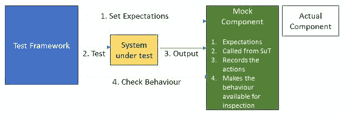
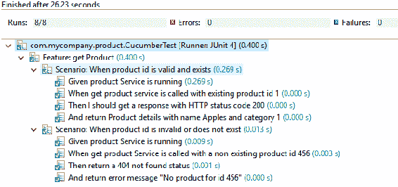
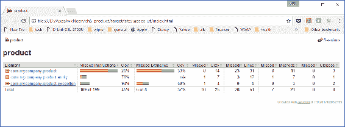
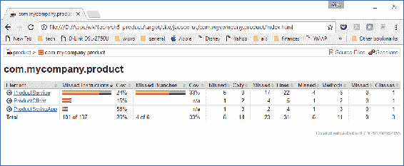
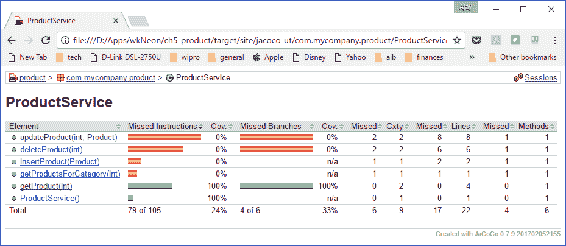
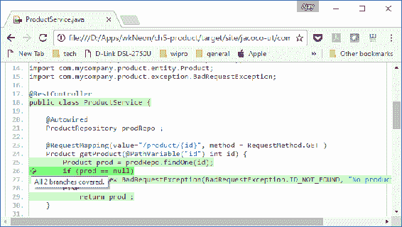
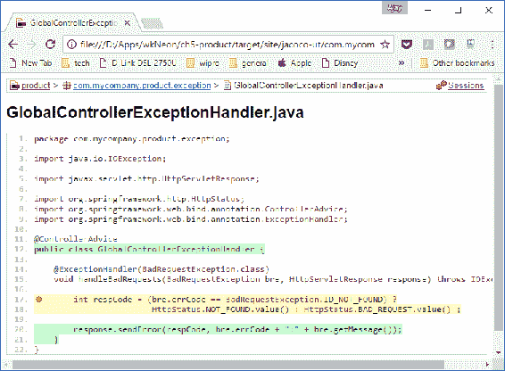

# 测试云本地应用程序

在本章中，我们将深入研究测试云本机应用程序。使用各种测试工具、策略和模式，从手动测试到自动化测试，测试已经成熟了很多。这种方法的好处是可以以故障保护的方式频繁地进行测试，这对云开发非常重要。

本章将介绍以下主题：

*   测试概念，如**行为驱动开发（BDD）**和**测试驱动开发（TDD）**
*   测试模式，如 A/B 测试和双重测试
*   测试工具，如 JUnit、Cucumber、JaCoCo 和 Spring 测试
*   测试类型，如单元测试、集成测试、性能测试和压力测试
*   将 BDD 和集成测试的概念应用到我们在[第 2 章](02.html)中开发的产品服务中，*编写您的第一个云本机应用程序*，并在[第 4 章](04.html)中增强，*扩展您的云本机应用程序*

# 在开发之前编写测试用例

在本书中，我们在[第 2 章](02.html)*中开始开发一个简单的服务，在春季启动时编写您的第一个云本机应用程序*，让您对云开发感到兴奋。然而，真正的开发遵循不同风格的最佳实践。

# TDD

一个项目从理解需求和编写验证需求的测试用例开始。由于此时代码不存在，测试用例将失败。然后，编写通过测试用例的代码。这个过程不断迭代，直到完成测试用例和所需的代码，以实现业务功能。Kent Beck 有一本关于这个主题的好书，*通过示例*进行测试驱动开发。在下一节中，我们将使用本章的原则，重做[第 4 章](04.html)中的产品服务*扩展您的云本机应用程序*。但在此之前，让我们看看另一个重要的概念，BDD。

# BDD

借鉴敏捷开发原则和用户案例，BDD 鼓励我们将开发视为一组场景，在这些场景中，给定特定条件，系统以特定的、可预测的方式对设置的刺激进行行为。如果这些场景、条件和操作可以在业务和 IT 团队之间用一种易于理解的通用语言捕获，这将为开发带来很多清晰性，并减少犯错误的机会。这是一种编写易于测试的规范的方法。

在本章中，我们将介绍我们的产品服务，并使用 Cucumber 工具对其应用 BDD。

# 测试模式

为云测试大型互联网应用程序需要一种严格的方法，其中一些模式很方便。

# A/B 测试

A/B 测试也被称为**拆分测试**，其初衷是为了通过实验找出几个选定用户对具有相同功能的两个不同网页的响应。如果与其他模式相比，用户对某个模式的响应更为积极，则选择该模式。

这一概念可以扩展到分阶段引入新功能。向一组受控用户介绍功能、活动、布局或新服务，并测量响应：


测试窗口结束后，对结果进行汇总，以规划更新功能的有效性。

这种测试的策略是，对于选定的用户集，使用 HTTP`302`（临时重定向）将用户从常规网站切换到新设计的网站。这将需要在测试期间运行网站或功能服务的变体。一旦测试成功，该功能将慢慢扩展到更多用户，并合并到主网站/代码库中。

# 双打

通常，被测试的功能依赖于由其他团队独立开发的组件和 API，这有以下缺点：

*   在开发功能时，它们可能不可用于测试
*   它们可能并不总是可用的，并且使用测试各种情况所需的数据进行设置
*   每次使用实际组件可能会较慢

因此，双重测试的概念变得流行起来。测试替身（就像电影中的特技替身）是一个组件/API，它替换实际组件并模仿其行为。test double 组件通常是一个轻量级且易于更改的组件，由构建功能的团队控制，与可能是依赖项或外部流程的真实组件不同。

There are many types of test doubles, such as Dummy, Fakes, Test Stubs, and Mocks.

# 测试存根

当下游组件返回改变被测系统行为的响应时，测试存根很有用；例如，如果我们的产品服务要调用其输出决定产品服务行为的引用数据服务。参考数据服务的测试存根可以模拟导致产品服务行为变化的各种响应类型：


# 模拟对象

下一种类型的 test-double 是一个模拟对象，它记录系统如何使用它，然后呈现记录以供验证。例如，一个模拟数据库组件可以检查一个产品是否没有被调用，而该产品应该从缓存层而不是数据库得到响应。

以下是模拟周围生态系统的基本示意图：



# 模拟 API

在云开发中，您将构建一个依赖于其他服务或主要依赖于访问服务的 API 的服务。通常，其他服务无法立即用于测试。但是你不能阻止你的发展。在这里，模拟或添加虚拟服务是测试服务的有用模式。

服务模拟模拟模拟真实服务的所有契约和行为。[WireMock.org](http://wiremock.org/)或[Mockable.io](https://www.mockable.io/)等示例帮助我们模拟 API，测试主要情况、边缘情况和故障条件。

# 确保代码审查和覆盖

自动代码审查工具增加了对代码的手动审查。这有助于识别代码中任何可能的错误，并确保覆盖范围完整，并且测试所有路径。

稍后我们将介绍代码覆盖工具 JaCoCo。

# 测试类型

我们在本章后面讨论的各种类型的测试在云计算普及之前就已经知道了。使用**持续集成**（**CI**和**持续开发**（**CD**的敏捷开发原则使得自动化这些类型的测试变得非常重要，以便在每次代码签入和构建时都执行这些测试。

# 单元测试

单元测试的目的是测试每个类或代码组件，并确保其按预期执行。JUnit 是用于单元测试的流行 Java 框架。

使用模拟对象模式和测试存根，可以隔离被测试服务的依赖组件，以便测试集中在被测试的系统上，即服务。

JUnit 是执行单元测试最流行的工具。

# 集成测试

组件测试的目的是检查组件（如产品服务）是否按预期运行。

`spring-boot-test`等组件帮助运行测试套件，并在整个组件上运行测试。我们将在本章中看到这一点。

# 负载测试

负载测试涉及将大量并发请求推送到被测系统一段时间，并观察其影响，如系统的响应时间和错误率。如果添加更多的服务实例使系统能够处理额外的负载，则系统称为水平可伸缩。

JMeter 和 Gatling 是涵盖此维度的常用工具。

# 回归测试

在引入新功能时，现有功能不应中断。回归测试涵盖了这一点。

Selenium 是一种基于 web 浏览器的开源工具，在该领域流行，用于执行回归测试。

# 测试产品服务

让我们将我们学到的测试原则应用到我们迄今为止一直在构建的产品服务中。我们从用户的角度出发，进行验收测试。

# 黄瓜中的 BDD

第一步是回顾我们产品和服务的规格。在[第 4 章](04.html)*扩展您的云本机应用程序*中，我们在产品服务上构建了一些功能，允许我们获取、添加、修改和删除产品，并获取给定产品类别的产品 ID 列表。

让我们将其表示为 Cucumber 中的特性。

# 为什么是黄瓜？

Cucumber 允许用一种简单的类似英语的语言表达行为，称为**小黄瓜**。这使得领域驱动的设计术语中的语言无处不在，因此业务、开发和测试之间的通信是无缝的，并且可以很好地理解。

# 黄瓜是如何工作的？

让我们了解 Cumber 的工作原理：

1.  Cucumber 中的第一步是用场景和`Given`-`When`-`Then`条件将用户故事表达为功能：
    *   `Given`：设置行为的前提条件
    *   `When`：改变系统状态的触发器，例如，向服务发出请求
    *   `Then`：服务应该如何响应
2.  使用`cucumber-spring`转换层将这些转换为自动测试用例，以便执行。

让我们从一个简单的`getProduct`验收测试用例开始。我们将在 Gherkin 中编写一个简单的特性，如果产品 ID 存在，则获取产品；如果找不到产品 ID，则返回一个错误。

让我们以真正的 BDD 样式实现以下特性。产品服务上的`get`API 返回产品详细信息，例如给定产品 ID 的描述和类别 ID。如果找不到产品，它还可以返回错误，例如 404。让我们在小黄瓜特性文件中将这两种行为表示为两种不同的场景。

**特征**：`getProduct`

获取给定产品 ID 的产品详细信息。

**场景 1**：产品 ID 有效且存在。将返回其所属的产品名称和类别：

1.  `Given`产品服务正在运行
2.  `When`使用现有产品 ID`1`调用 get product 服务
3.  `Then`我们应该得到一个 HTTP 状态码为`200`的响应
4.  `And`退货产品明细，名称`Apples`和类别`1`

**场景 2**：产品 ID 无效或不存在。应返回一个错误：

1.  `Given`产品服务正在运行
2.  `When`使用不存在的产品 ID`456`调用 get product 服务
3.  `Then`返回 404 未找到状态
4.  `And`返回错误消息`No product for ID 456`

场景 1 是一个成功的场景，返回数据库中存在的产品 ID 并根据其进行验证。

场景 2 检查数据库中不存在的 ID 的故障情况。

每个场景分为多个部分。对于快乐之路场景：

*   `Given`设定了一个前提条件。在我们的例子中，很简单：产品服务应该运行。
*   `When`更改系统的状态，在我们的例子中，它通过提供产品 ID 向服务发出请求。
*   `Then`和`And`是系统预期的结果。在这种情况下，我们希望服务返回`200`成功代码以及给定产品的有效描述和类别代码。

正如您可能已经注意到的，这是我们服务的文档，业务和测试团队以及开发人员都可以理解。它是技术不可知论；也就是说，如果通过 SpringBoot、Ruby 或.NET 微服务实现，则不会改变。

在下一节中，我们将把服务映射到我们开发的 Spring 引导应用程序。

# 使用 JaCoCo 的代码覆盖率

JaCoCo 是由 EclEmma 团队开发的代码覆盖率库。JaCoCo 在 JVM 中嵌入了一个代理，它扫描遍历的代码路径并创建一个报告。

此报告可以导入到更广泛的 DevOps 代码质量工具（如 SonarQube）中。SonarQube 是一个平台，它通过大量插件帮助管理代码质量，并与 DevOps 进程很好地集成（我们将在后面的章节中看到）。它是开源的，但也有商业版。它是一个平台，因为它有多个组件，例如服务器（计算引擎服务器、Web 服务器和 Elasticsearch）、数据库和特定于语言的扫描仪。

# 弹簧启动试验

Spring 引导测试扩展并简化了 Spring 框架提供的 Spring 测试模块。让我们看一下编写验收测试的基本要素，然后我们可以在本章后面的部分重新讨论细节：

1.  复制我们在[第 4 章](04.html)中创建的项目*使用 HSQLDB 和 Hazelcast 扩展您的云本机应用程序*，作为本章的新项目。

2.  在 Maven POM 文件中包含对 Spring 的依赖：

```java
        <dependency> 
            <groupId>org.springframework.boot</groupId> 
            <artifactId>spring-boot-starter-test</artifactId> 
            <scope>test</scope> 
        </dependency> 
```

您可能已经注意到，`scope`已更改为`test`。这意味着我们所定义的依赖关系不是正常运行时所必需的，只是用于编译和测试执行。

3.  向 Maven 添加另外两个依赖项。我们正在下载 Cucumber 及其 Java 翻译的库，以及`spring-boot-starter-test`：

```java
        <dependency> 
            <groupId>info.cukes</groupId> 
            <artifactId>cucumber-spring</artifactId> 
            <version>1.2.5</version> 
            <scope>test</scope> 
        </dependency> 
        <dependency> 
            <groupId>info.cukes</groupId> 
            <artifactId>cucumber-junit</artifactId> 
            <version>1.2.5</version> 
            <scope>test</scope> 
        </dependency> 
```

`CucumberTest`类是启动 Cumber 测试的主类：

```java
@RunWith(Cucumber.class) 
@CucumberOptions(features = "src/test/resources") 
public class CucumberTest { 

} 
```

`RunWith`告诉 JUnit 使用 Spring 的测试支持，然后使用 Cucumber。我们给出了`.feature`文件的路径，其中包含前面讨论的小黄瓜中的测试用例。

`Productservice.feature`文件是包含小黄瓜语言场景的文本文件，如前所述。我们将在这里介绍两个测试用例。此文件存在于`src/test/resources`文件夹中。

`CucumberTestSteps`类包含将小黄瓜中的步骤转换为等效的 Java 代码。每个步骤对应一个方法，并且根据小黄瓜文件中的场景构造调用这些方法。让我们讨论与一个用例相关的所有步骤：

```java
@SpringBootTest(webEnvironment = SpringBootTest.WebEnvironment.RANDOM_PORT) 
@ContextConfiguration 
public class CucumberTestSteps { 

    @Autowired 
    private TestRestTemplate restTemplate; 

    private ResponseEntity<Product> productResponse; 
    private ResponseEntity<String> errResponse; 

    @Given("(.*) Service is running") 
    public void checkServiceRunning(String serviceName) { 
         ResponseEntity<String> healthResponse = restTemplate.getForEntity("/health",String.class, new HashMap<>()); 
         Assert.assertEquals(HttpStatus.OK, healthResponse.getStatusCode()); 
    } 

    @When("get (.*) service is called with existing product id (\d+)$") 
    public void callService(String serviceName, int prodId) throws Throwable { 
         productResponse = this.restTemplate.getForEntity("/"+serviceName+"/" + prodId, Product.class, new HashMap<>()); 
    } 

    @Then("I should get a response with HTTP status code (.*)") 
    public void shouldGetResponseWithHttpStatusCode(int statusCode) { 
         Assert.assertEquals(statusCode, productResponse.getStatusCodeValue()); 
    } 

    @And("return Product details with name (.*) and category (\d+)$") 
    public void theResponseShouldContainTheMessage(String prodName, int categoryId) { 
         Product product = productResponse.getBody() ; 
         Assert.assertEquals(prodName, product.getName()); 
         Assert.assertEquals(categoryId, product.getCatId());       
    } 
```

`@SpringBootTest`注释告诉 Spring Boot 框架它是一个测试类。`RANDOM_PORT`表示测试服务在随机端口上启动 Tomcat 进行测试。

我们注入了一个自动连线的`restTemplate`，它将帮助访问 HTTP/REST 服务并接收将要测试的响应。

现在，请注意带有注释`@Given`、`@When`和`@Then`的方法。每个方法都使用正则表达式（从功能文件）提取变量，并将其用于方法中的断言。我们通过以下方式对此进行了系统测试：

1.  首先通过访问`/health`检查服务是否正在运行（正如我们在[第 2 章](02.html)中对 Spring Boot Actuator 所做的那样，*编写您的第一个云本机应用程序*。
2.  使用产品 ID 调用服务。
3.  检查返回码是否为`200`，响应的描述和类别是否与预期结果相符。
4.  运行测试。
5.  右键单击`CucumberTest.java`文件并选择运行方式| JUnit 测试：


您将看到控制台发出启动消息。最后，JUnit 将反映测试结果，如下所示：



作为练习，尝试将测试用例添加到`ProductService`类中的插入、更新和删除产品方法中。

# 集成 JaCoCo

让我们将 JaCoCo 整合到现有项目中：

1.  首先，在 POM 文件中包含包含 JaCoCo 的插件：

```java
<plugin> 
   <groupId>org.jacoco</groupId> 
   <artifactId>jacoco-maven-plugin</artifactId> 
   <version>0.7.9</version> 
</plugin> 
```

The second and third step is to include pre-executions and post-executions into the preceding plugin.

2.  预执行为要配置并添加到命令行的代理做好准备。
3.  执行后确保在输出文件夹中创建报告：

```java
<executions> 
   <execution> 
         <id>pre-unit-test</id> 
         <goals> 
               <goal>prepare-agent</goal> 
         </goals> 
         <configuration> 
               <destFile>${project.build.directory}/coverage-reports/jacoco-ut.exec</destFile> 
               <propertyName>surefireArgLine</propertyName> 
         </configuration> 
   </execution> 
   <execution> 
         <id>post-unit-test</id> 
         <phase>test</phase> 
         <goals> 
               <goal>report</goal> 
         </goals> 
         <configuration> 
               <dataFile>${project.build.directory}/coverage-reports/jacoco-ut.exec</dataFile> 
   <outputDirectory>${project.reporting.outputDirectory}/jacoco-ut</outputDirectory> 
         </configuration> 
   </execution> 
</executions> 
```

4.  最后，创建的命令行更改必须插入到`maven-surefire-plugin`中，如下所示：

```java
<plugin> 
   <groupId>org.apache.maven.plugins</groupId> 
   <artifactId>maven-surefire-plugin</artifactId> 
   <configuration> 
         <!-- Sets the VM argument line used when unit tests are run. --> 
         <argLine>${surefireArgLine}</argLine> 
         <excludes> 
               <exclude>**/IT*.java</exclude> 
         </excludes>        
   </configuration> 
</plugin> 
```

5.  现在，我们都准备好运行覆盖率报告了。右键单击项目并选择 Run As | Maven test 以测试程序，如以下屏幕截图所示：


6.  当控制台中充满 Spring 引导启动时，您将看到以下行：

```java
2 Scenarios ([32m2 passed[0m) 
8 Steps ([32m8 passed[0m) 
0m0.723s 
Tests run: 10, Failures: 0, Errors: 0, Skipped: 0, Time elapsed: 26.552 sec - in com.mycompany.product.CucumberTest......Results :Tests run: 10, Failures: 0, Errors: 0, Skipped: 0[INFO] [INFO] --- jacoco-maven-plugin:0.7.9:report (post-unit-test) @ product ---[INFO] Loading execution data file D:AppswkNeonch5-producttargetcoverage-reportsjacoco-ut.exec[INFO] Analyzed bundle 'product' with 6 classes 
```

7.  这告诉我们使用`8 Steps`执行了两个场景（与之前一样）。但除此之外，`coverage-reports`被生成并放置在`target`目录中：


8.  在`site`文件夹中，点击`index.html`；您将看到以下报道：



9.  通过对`product`包的调查，您可以看到`ProductService`只覆盖了`24%`，如下图所示：



10.  原因是我们在服务中只涉及了`getProduct`API。`insertProduct`和`updateProduct`未涵盖。以下屏幕截图中的向下钻取报告显示了这一点：



11.  在`getProduct`方法中，覆盖是完整的。这是因为，在两个场景中，我们讨论了快乐路径和错误条件：



12.  另一方面，您会发现我们没有涵盖`ExceptionHandler`类中的分支，如下所示：



# 总结

在接下来的章节中，我们将把覆盖率报告与 DevOps 管道集成在一起，并看到它在 CI 和 CD 期间工作。但是，首先，让我们看看部署机制。