# 平台部署–Azure

本章讨论 Microsoft 公共云平台 Azure 的应用程序设计和部署。云本机开发的本质是能够将您的应用程序与云提供商提供的 PaaS 平台集成。作为一名开发人员，您专注于创造价值（解决客户问题），并允许云提供商为您的应用程序的基础架构承担重任。

在本章中，我们将学习以下内容：

*   Azure 提供的不同类别的 PaaS 服务。我们将深入研究示例应用程序将使用的服务。
*   将示例应用程序迁移到 Azure 并了解各种可用选项。我们还将评估所有选项，并了解每个选项的优缺点。

我们讨论 Azure 平台的目的是展示如何构建和部署应用程序。我们不打算深入讨论 Azure，我们希望读者使用 Azure 文档（[https://docs.microsoft.com/en-us/azure/](https://docs.microsoft.com/en-us/azure/) 探索其他选项。

Azure 支持多种编程语言，但就本书而言，我们正在研究 Azure 中对 Java 应用程序的支持。

# Azure 平台

Azure 在一系列技术领域提供了一套不断增加的 PaaS 和 IaaS。出于我们的目的，我们将研究应用程序直接适用和使用的区域和服务子集。

为了便于使用，我跨与典型业务应用程序最相关的技术领域创建了此服务分类模型：

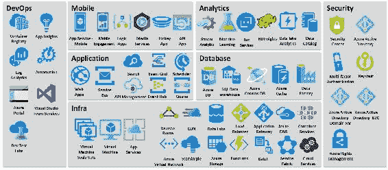

*这只是一份指示性清单，并非详尽无遗的清单。有关完整列表，请参阅 Azure 门户。*

在前面的分类模型中，我们将服务分为以下几个方面：

*   **基础设施**：这是 Azure 为部署和托管我们的应用程序而提供的全面服务列表。我们在这一类别中结合了跨计算、存储和网络的服务。为了实现示例 Java 应用程序，我们将研究以下一组服务。
    *   **应用服务**：我们如何将现有的 Spring Boot 应用程序部署到 Azure 平台？这更像是一种升降式场景。在这里，应用程序没有重构，但依赖项部署在应用程序服务上。使用其中一个数据库服务，可以部署和托管应用程序。Azure 提供了 PostgreSQL 和 MySQL 作为托管数据库模型，以及各种其他选项。
    *   **容器服务**：对于打包为 Docker 容器的应用程序，我们可以探索如何将 Docker 容器部署到平台上。
    *   **功能**：这是无服务器平台模式，您无需担心应用托管和部署。您创建了一个功能，让平台为您完成繁重的工作。到目前为止，基于 Java 的 Azure 云功能正在测试阶段。我们将探索如何在开发环境中创建一个并在本地进行测试。
    *   **服务结构**：服务结构是用于部署和管理微服务和容器应用程序的分布式系统平台。我们将探讨如何在服务结构中部署示例`product`API。
*   **应用程序**：这是帮助构建分布式应用程序的服务列表。当我们转向分布式微服务模型时，我们需要将应用程序组件和服务解耦。队列、EventHub、EventGrid 和 API 管理等功能有助于构建一组紧密的健壮 API 和服务。
*   **数据库**：这是 Azure 平台提供的数据存储选项列表。这包括关系、键值、redis 缓存和数据仓库等。
*   **DevOps**：为了在云中构建和部署应用程序，我们需要强大的 CI/CD 工具集的支持。Visual Studio 团队服务用于托管代码、问题跟踪和自动生成。同样，开源工具在 Azure 门户中仍然不是一流的公民。您始终可以使用所需软件的托管版本。
*   **安全**：云应用的另一个关键因素是安全服务。Active directory、权限管理、密钥库和多因素身份验证是该领域提供的一些关键服务。
*   **移动**：如果您正在构建移动应用，平台将提供移动应用服务、媒体服务、移动参与服务等关键服务。
*   **分析**：在分析领域，平台在 MapReduce、Storm、Spark through HDInsight 和 Data Lake services for Analytics 以及数据存储库等领域提供强大的服务。

此外，Azure 还提供多个其他技术领域的服务——**物联网**（**物联网**）、监控、管理、**人工智能**（**AI**）以及认知和企业集成领域。

# Azure 平台部署选项

正如我们在上一节中看到的，Azure 提供了许多在平台上构建和部署应用程序的选项。我们将使用`product`API REST 服务的示例来检查 Azure 为部署和运行应用程序提供的各种选项。

在开始之前，我假设您熟悉 Azure 平台，并且已经在门户中注册。

Azure 支持多种编程语言，并提供 SDK 以支持各自领域的开发。出于我们的目的，我们主要探索在 Azure 平台中对 Java 应用程序的支持。

我们将在以下四个领域探索应用程序托管服务：

*   应用程序服务
*   集装箱服务
*   服务结构
*   功能

有关更多详细信息和入门信息，请参阅以下链接：[https://azure.microsoft.com/en-in/downloads/](https://azure.microsoft.com/en-in/downloads/) 。

# 将 Spring 启动 API 部署到 Azure 应用程序服务

在本节中，我们将使用`product`API 服务并将其迁移到 Azure 应用程序服务。我们将研究对应用程序所做的附加更改，以符合 Azure 应用程序服务的要求。

我接受了我们在[第三章](03.html)中构建的`product`API REST 服务*设计您的云本机应用程序*。在服务中，我们进行了以下更改：

在项目的根文件夹中添加一个文件`web.config`：

```java
<?xml version="1.0" encoding="UTF-8"?>
<configuration>
  <system.webServer>
    <handlers>
      <add name="httpPlatformHandler" path="*" verb="*" 
       modules="httpPlatformHandler" resourceType="Unspecified"/>
    </handlers>
    <httpPlatform processPath="%JAVA_HOME%binjava.exe"
     arguments="-Djava.net.preferIPv4Stack=true -            
     Dserver.port=%HTTP_PLATFORM_PORT% -jar &quot;
     %HOME%sitewwwrootproduct-0.0.1-SNAPSHOT.jar&quot;">
    </httpPlatform>
  </system.webServer>
</configuration>
```

该文件添加了以下更改，`product-0.0.1-SNAPSHOT.jar`，这是我们应用程序的包名。如果应用程序名称不同，则需要进行更改。

我们首先在这里查看`product`API 代码：[https://azure.microsoft.com/en-in/downloads/](https://azure.microsoft.com/en-in/downloads/) 。

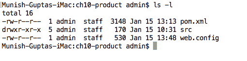

我们运行`mvn clean package`命令将项目打包为胖罐子：

```java
[INFO] Scanning for projects... 
[INFO]                                                                          
[INFO] ------------------------------------------------------------------------ 
[INFO] Building product 0.0.1-SNAPSHOT 
[INFO] ------------------------------------------------------------------------ 
[INFO]  
[INFO] ...... 
[INFO]  
[INFO] --- maven-jar-plugin:2.6:jar (default-jar) @ product --- 
[INFO] Building jar: /Users/admin/Documents/workspace/CloudNativeJava/ch10-product/target/product-0.0.1-SNAPSHOT.jar 
[INFO]  
[INFO] --- spring-boot-maven-plugin:1.4.3.RELEASE:repackage (default) @ product --- 
[INFO] ------------------------------------------------------------------------ 
[INFO] BUILD SUCCESS 
[INFO] ------------------------------------------------------------------------ 
[INFO] Total time: 14.182 s 
[INFO] Finished at: 2018-01-15T15:06:56+05:30 
[INFO] Final Memory: 40M/353M 
[INFO] ------------------------------------------------------------------------ 
```

接下来，我们登录 Azure 门户（[https://portal.azure.com/](https://portal.azure.com/) ）。

1.  单击左侧列中的 App Services 菜单项，如以下屏幕截图所示：

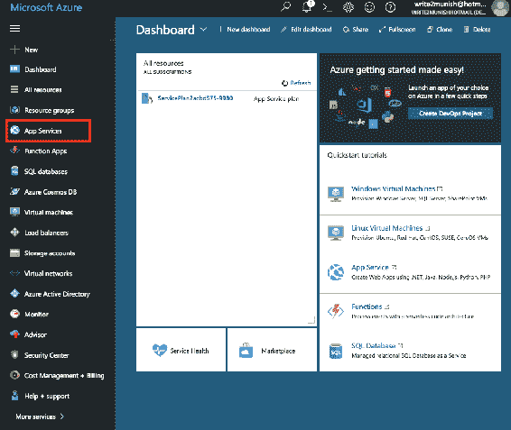

在 Azure 门户中选择应用程序服务

2.  单击添加链接：

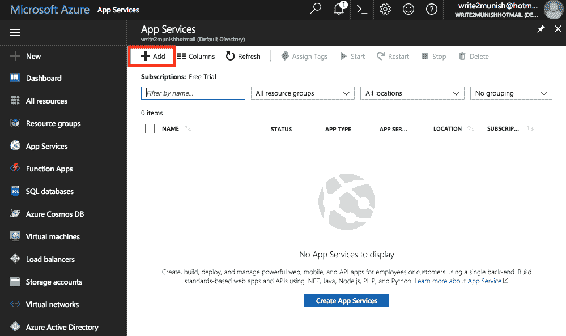

3.  接下来，单击 Web 应用程序链接，如图所示：


通过 Azure 门户|应用程序服务|添加导航选择 Web 应用程序。

4.  单击 Create 按钮链接，您将看到以下页面

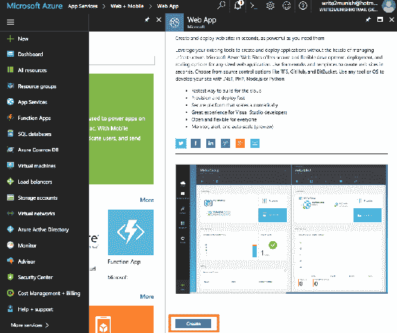

5.  我们为我们的`product`API 填写详细信息。我已将 App name 填写为`ch10product`并将其他选项保留为默认值。

6.  接下来，单击页面底部的“创建”按钮。


这将导致创建应用程序服务。

7.  我们点击 App Services 下的`ch10product`，进入菜单：


8.  请注意应用程序部署的 URL 和 FTP 主机名。我们需要在两个位置更改应用程序设置和部署凭据：

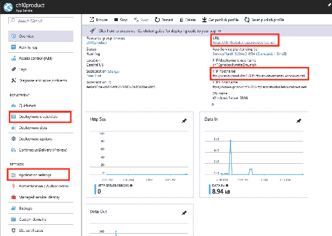

9.  我们单击应用程序设置链接，并在下拉菜单中选择以下选项：
    1.  选择 Java8 作为 Java 版本
    2.  为 Java 次要版本选择最新版本
    3.  为 Web 容器选择最新的 Tomcat 9.0（实际上不会使用此容器；Azure 使用作为 Spring Boot 应用程序一部分捆绑的容器。）
    4.  单击保存


10.  接下来，我们单击左侧的 Deployment credentials 链接。在这里，我们捕获 FTP/部署用户名和密码，以便能够将应用程序推送到主机，并单击保存，如以下屏幕截图所示：

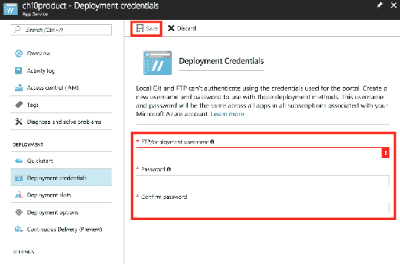

11.  连接到我们在*步骤 8*中看到的 FTP 主机名，并使用您在*步骤 10*中保存的凭据登录：

```java
ftp  
open ftp://waws-prod-dm1-035.ftp.azurewebsites.windows.net 
user ch10productwrite2munish 
password *******
```

12.  接下来，我们将远程服务器上的目录更改为`site/wwwroot`，并将 fat JAR 和`web.config`转移到文件夹中：

```java
cd site/wwwroot 
put product-0.0.1-SNAPSHOT.jar 
put web.config 
```

13.  我们回到概述部分，重新启动应用程序。我们应该能够启动应用程序并看到 RESTAPI 工作。

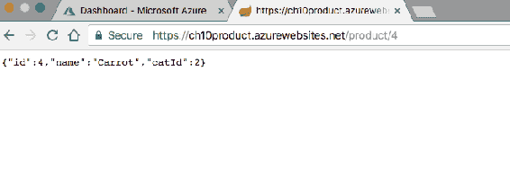

在本节中，我们了解了如何获取现有的 RESTAPI 应用程序并将其部署到 Azure 中。这不是最简单、最好的部署方式。这个选项更像是一种提升和转移，我们利用现有的应用程序并尝试将工作负载转移到云上。对于部署 web 应用程序，Azure 提供了一个 Maven 插件，可以将您的应用程序直接推送到云端。更多详细信息，请参阅以下链接：[https://docs.microsoft.com/en-in/java/azure/spring-framework/deploy-spring-boot-java-app-with-maven-plugin](https://docs.microsoft.com/en-in/java/azure/spring-framework/deploy-spring-boot-java-app-with-maven-plugin) 。

RESTAPI 部署在 Windows Server VM 上。Azure 正在增加对 Java 应用程序的支持，但它们的强项仍然是.NET 应用程序。

如果您想使用 Linux 并部署 RESTAPI 应用程序，可以选择使用基于 Docker 的部署。我们将在下一节介绍基于 Docker 的部署。

# 将 Docker 容器部署到 Azure 容器服务

让我们部署 Docker 容器应用程序。我已经为上一节中使用的`product`API 示例创建了 Docker 图像。可通过以下命令从 Docker hub 中提取 Docker 映像：

```java
docker pull cloudnativejava/ch10productapi 
```

让我们开始登录 Azure 门户。我们应该看到：

1.  单击左侧列中的 App Services 菜单项。我们将看到以下屏幕。单击屏幕截图中所示的新建：


2.  在`Web App for Containers`的新搜索下：

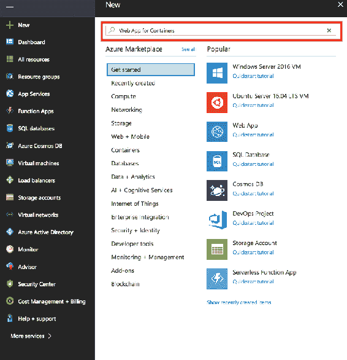

3.  选择容器的 Web 应用程序后，单击创建，如图所示：


选择通过应用服务导航创建|添加| Web 应用

4.  我们将填写`product`API 容器的详细信息：
    1.  我已将 App Name 和 Resource Group 填写为`ch10productContainer`，其他选项保留为默认值。
    2.  在配置容器部分，我们选择容器存储库。如果 Docker hub 中已经有 Docker 镜像，请提供镜像拉标签`cloudnativejava/ch10productapi`。
    3.  单击页面底部的“确定”。它验证图像。
    4.  接下来，我们单击页面底部的“创建”：

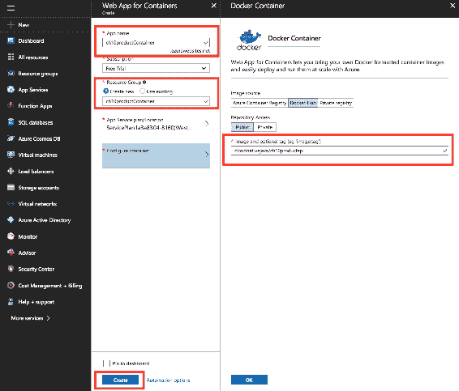

选择通过 Azure 门户导航创建|新建|搜索`Web App for Containers`

5.  这将导致创建应用程序服务：


通过 Azure portal |应用程序服务导航选择新创建的应用程序容器

6.  我们点击 App Services 下的`ch10productcontainer`，进入菜单，在那里我们可以看到标记的 URL`https://ch10productcontainer.azurewebsites.net`，在那里容器是可用的

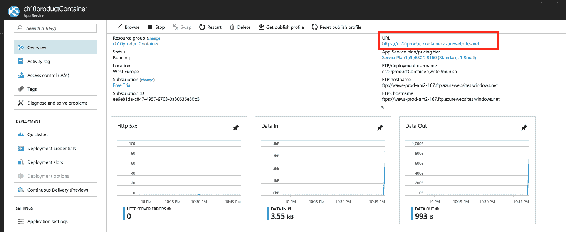

可以访问主机 docker 应用程序的 URL

7.  我们可以看到我们的`product`API 在浏览器中运行：


这是一种将应用程序部署到云平台的简单方法。在前面的两个场景中，我们都没有使用任何专门的应用程序或数据存储服务。对于真正的云本地应用程序，我们需要利用提供商提供的平台服务。整个想法是，应用程序可伸缩性和可用性方面的繁重工作由本机平台处理。作为开发人员，我们专注于构建关键业务功能以及与其他组件的集成。

# 将 Spring 引导 API 部署到 Azure 服务结构

构建应用程序并将其部署到基础 IaaS 平台是大多数组织开始与公共云提供商合作的方式。随着云流程的舒适度和成熟度的提高，应用程序开始使用 PaaS 功能构建。因此，应用程序开始由排队、事件处理、托管数据存储、安全性和平台服务的其他功能组成。

但非功能性需求仍然是一个关键问题。谁会想到应用程序的能力？

*   如何确保有足够的应用程序实例在运行？
*   当一个实例失败时会发生什么？
*   应用程序如何根据传入流量进行放大/缩小？
*   我们如何监视所有正在运行的实例？
*   我们如何管理分布式有状态服务？
*   我们如何对部署的服务执行滚动升级？

编曲引擎进来了。Kubernetes、Mesos 和 Docker swarm 等产品提供了管理应用程序容器的能力。Azure 已经发布了 Service Fabric，它是用于您的应用程序的应用程序/容器管理软件。它可以在本地或云中运行。

服务结构提供以下关键功能：

*   允许您部署可大规模扩展并提供自我修复平台的应用程序
*   允许您安装/部署基于状态和无状态微服务的应用程序
*   提供仪表板以监视和诊断应用程序的运行状况
*   定义自动修复和升级的策略

在当前版本中，ServiceFabric 仅支持 Windows Server 和 Ubuntu 16.04 这两种底层操作系统。最好的选择是 Windows Server 群集，因为支持、工具和文档是最好的。

为了演示 Service Fabric 的特性和用法，我将使用 Ubuntu 映像进行本地测试，并使用 Service Fabric party cluster 在 Service Fabric 集群中在线部署我们的`product`API 示例。我们还将研究如何扩展应用程序实例，以及服务结构的自愈功能。

# 基本环境设置

对于环境，我使用的是 macOS 机器。我们需要建立以下机制：

1.  本地服务结构群集设置拉取 Docker 映像：

```java
docker pull servicefabricoss/service-fabric-onebox 
```

2.  使用以下附加设置更新主机上的 Docker 守护程序配置，并重新启动 Docker 守护程序：

```java
{ 
    "ipv6": true, 
    "fixed-cidr-v6": "fd00::/64" 
}
```

3.  启动从 Docker hub 下拉的 Docker 映像：

```java
docker run -itd -p 19080:19080 servicefabricoss/service-fabric-onebox bash 
```

4.  在容器外壳内添加以下命令：

```java
./setup.sh      
./run.sh        
```

最后一步完成后，将启动一个开发服务结构集群，该集群可在`http://localhost:19080`处从浏览器访问。

现在，我们需要为容器和来宾可执行文件设置 Yeoman 生成器：

1.  首先，我们需要确保 Node.js 和**节点包管理器**（**NPM**已经安装。软件可以使用自制软件安装，如下所示：

```java
brew install node node -v npm -v 
```

2.  接下来，我们从 NPM 安装 Yeoman 模板生成器：

```java
npm install -g yo 
```

3.  接下来，我们安装 Yeoman 生成器，该生成器将用于使用 Yeoman 创建服务结构应用程序。遵循以下步骤：

```java
# for Service Fabric Java Applications npm install -g generator-azuresfjava # for Service Fabric Guest executables npm install -g generator-azuresfguest # for Service Fabric Container Applications npm install -g generator-azuresfcontainer
```

4.  要在 macOS、JDK 1.8 版和 Gradle 上构建 Service Fabric Java 应用程序，必须在主机上安装该软件。软件可以使用自制软件安装，如下所示：

```java
brew update 
brew cask install java 
brew install gradle 
```

这就完成了环境设置。接下来，我们将把`product`API 应用程序打包为服务结构应用程序，以便在集群中部署。

# 打包产品 API 应用程序

我们登录到`product`API 项目（完整代码可在[获取）https://github.com/PacktPublishing/Cloud-Native-Applications-in-Java](https://github.com/PacktPublishing/Cloud-Native-Applications-in-Java) ）并运行以下命令：

```java
yo azuresfguest
```

我们将看到以下屏幕：


我们输入以下值：

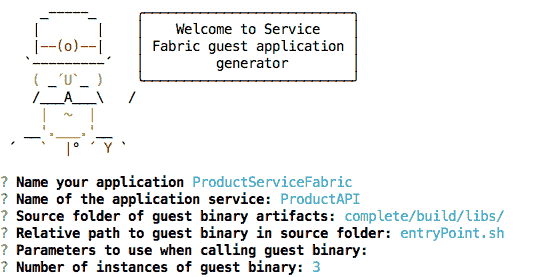

这将创建一个包含一组文件的应用程序包：

```java
ProductServiceFabric/ProductServiceFabric/ApplicationManifest.xml 
ProductServiceFabric/ProductServiceFabric/ProductAPIPkg/ServiceManifest.xml 
ProductServiceFabric/ProductServiceFabric/ProductAPIPkg/config/Settings.xml 
ProductServiceFabric/install.sh 
ProductServiceFabric/uninstall.sh 
```

接下来，我们进入`/ProductServiceFabric/ProductServiceFabric/ProductAPIPkg`文件夹。

创建一个目录`code`并在其中创建一个名为`entryPoint.sh`的文件，其内容如下：

```java
#!/bin/bash 
BASEDIR=$(dirname $0) 
cd $BASEDIR 
java -jar product-0.0.1-SNAPSHOT.jar 
```

此外，请确保我们将打包的 JAR（`product-0.0.1-SNAPSHOT.jar`）复制到此文件夹中。

对于本地环境开发，`Number of instances of guest binary`的值应为`1`，对于云中的服务结构集群，`Number of instances of guest binary`的值可以更高。

接下来，我们将在服务结构集群中托管我们的应用程序。我们将使用 Service Fabric party 群集。

# 正在启动服务结构群集

我们将登录到[http://try.servicefabric.azure.com](https://try.servicefabric.azure.com/) 使用我们的 Facebook 或 GitHub ID：

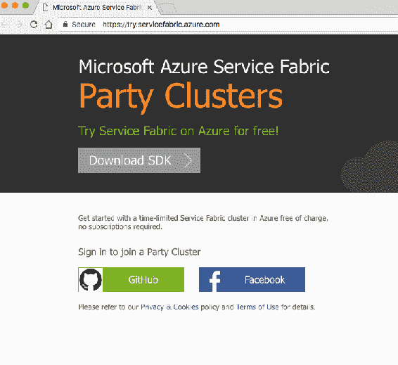

加入 Linux 群集：


我们将被引导到包含集群详细信息的页面。集群可用一小时。

默认情况下，某些端口处于打开状态。当我们部署`product`API 应用程序时，我们可以在端口`8080`上访问相同的应用程序：


Service Fabric cluster explorer 位于前面提到的 URL 处。由于集群使用基于证书的身份验证，因此需要将 PFX 文件导入密钥链。

如果访问 URL，您可以看到服务结构群集资源管理器。默认情况下，集群有三个节点。您可以将多个应用程序部署到集群。根据应用程序设置，群集将管理您的应用程序可用性。


Azure 参与方群集默认视图

# 将产品 API 应用程序部署到服务结构群集

为了将我们的应用程序部署到集群，我们需要登录为应用程序创建的服务结构脚手架的`ProductServiceFabric`文件夹。

# 连接到本地群集

我们可以使用以下命令在此处连接到本地群集：

```java
sfctl cluster select --endpoint http://localhost:19080 
```

这将连接到 Docker 容器中运行的服务结构集群。

# 连接到服务结构方群集

由于 Service Fabric party cluster 使用基于证书的身份验证，我们需要在`/ProductServiceFabric`的工作文件夹中下载 PFX 文件。

运行以下命令：

```java
openssl pkcs12 -in party-cluster-1496019028-client-cert.pfx -out party-cluster-1496019028-client-cert.pem -nodes -passin pass: 
```

接下来，我们使用**隐私增强邮件**（**PEM**文件）连接到服务结构方集群：

```java
sfctl cluster select --endpoint https://zlnxyngsvzoe.westus.cloudapp.azure.com:19080 --pem ./party-cluster-1496019028-client-cert.pem --no-verify 
```

连接到 Service Fabric 群集后，我们需要通过运行以下命令安装应用程序：

```java
./install.sh 
```

我们应该看到我们的应用程序被上传并部署到集群中：


在 Docker 容器中安装并启动 Service Fabric 群集

上载应用程序后，我们可以在 Service Fabric explorer 中看到该应用程序，并且可以访问该应用程序的功能：

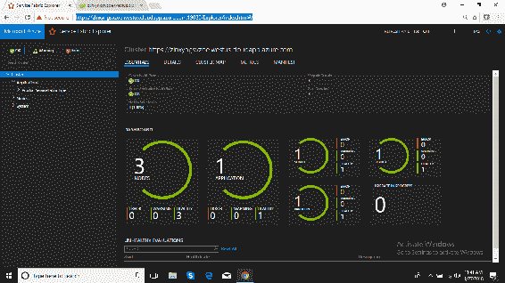

观察部署在 Azure 参与方群集中的应用程序

API 功能可在以下网址获得：`http://zlnxyngsvzoe.westus.cloudapp.azure.com:8080/product/2`。

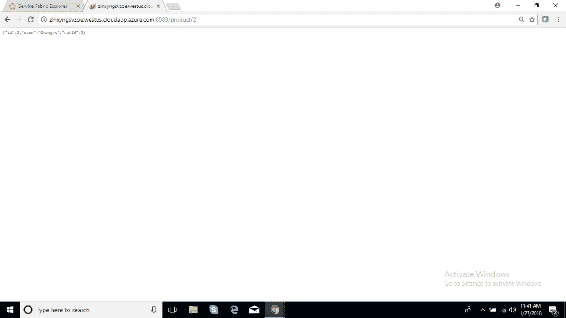

验证 API 是否正常工作

我们可以看到应用程序目前是如何部署在一个节点（`_lnxvm_2`上的。如果关闭该节点，应用程序实例将自动部署到另一个节点实例上：

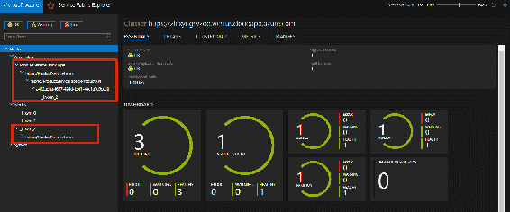

观察部署在三台可用主机中的单个节点上的应用程序

通过选择节点菜单中的选项（在下面的屏幕截图中突出显示）来关闭节点（`_lnxvm_2`）：

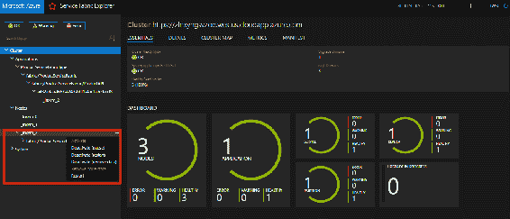

请注意可用于禁用 Azure 参与方群集中主机上的应用程序的选项

立即，我们可以看到应用程序部署在节点`_lnxvm_0`上，作为集群的自愈模型：

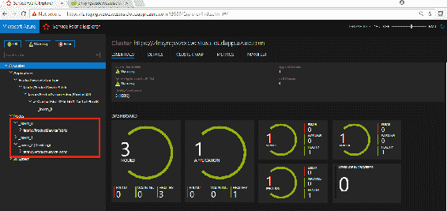

在一种模式下禁用的应用程序将在另一个具有服务结构群集的节点上启动

再一次，我希望读者足够感兴趣，继续探索集群的功能。对 Java 应用程序和多版本 Linux 的支持是有限的。Azure 正在努力向平台添加额外的支持，以支持各种应用程序。

# Azure 云功能

当我们将应用程序移动到云端时，我们使用平台服务来提高我们对业务功能的关注，而不必担心应用程序的可伸缩性。无服务器应用程序是下一个前沿领域。开发人员的重点是构建应用程序，而不必担心服务器资源调配、可用性和可扩展性。

Java 函数目前处于测试阶段，在 Azure 门户上不可用。

我们可以下载并尝试在本地机器上创建 Java 函数。我们将看到该功能的简要预览。

# 环境设置

Azure Functions Core Tools SDK 提供了一个本地开发环境，用于编写、运行和调试 Java Azure 函数：

```java
npm install -g azure-functions-core-tools@core 
```

# 创建新的 Java 函数项目

让我们创建一个示例 Java 函数项目。我们将使用以下 Maven 原型来生成虚拟项目结构：

```java
mvn archetype:generate  -DarchetypeGroupId=com.microsoft.azure  -DarchetypeArtifactId=azure-functions-archetype 
```

我们运行`mvn`命令以提供必要的输入：

```java
Define value for property 'groupId': : com.mycompany.product 
Define value for property 'artifactId': : mycompany-product 
Define value for property 'version':  1.0-SNAPSHOT: :  
Define value for property 'package':  com.mycompany.product: :  
Define value for property 'appName':  ${artifactId.toLowerCase()}-${package.getClass().forName("java.time.LocalDateTime").getMethod("now").invoke(null).format($package.Class.forName("java.time.format.DateTimeFormatter").getMethod("ofPattern", $package.Class).invoke(null, "yyyyMMddHHmmssSSS"))}: : productAPI 
Define value for property 'appRegion':  ${package.getClass().forName("java.lang.StringBuilder").getConstructor($package.getClass().forName("java.lang.String")).newInstance("westus").toString()}: : westus 
Confirm properties configuration: 
groupId: com.mycompany.product 
artifactId: mycompany-product 
version: 1.0-SNAPSHOT 
package: com.mycompany.product 
appName: productAPI 
appRegion: westus 
 Y: : y 
```

# 构建和运行 Java 函数

让我们继续构建包：

```java
mvn clean package 
```

接下来，我们可以按如下方式运行该函数：

```java
mvn azure-functions:run 
```

我们可以在下图中看到该函数正在启动：


构建 Java 云函数

默认功能在以下 URL 中可用：

```java
http://localhost:7071/api/hello 
```

如果我们转到`http://localhost:7071/api/hello?name=cloudnative`我们可以看到函数的输出：

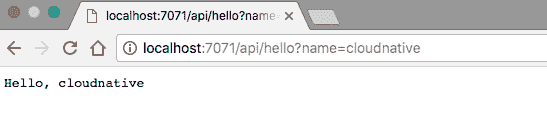

# 潜入代码

如果我们深入研究代码，我们可以看到定义了默认函数`hello`的主代码文件：

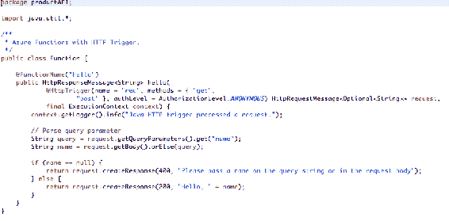

该方法用`@HttpTrigger`注释，其中我们定义了触发器的名称、允许的方法、使用的授权模型等。

编译函数时，会产生一个`function.json`，其中定义了函数绑定：

```java
{ 
  "scriptFile" : "../mycompany-product-1.0-SNAPSHOT.jar", 
  "entryPoint" : "productAPI.Function.hello", 
  "bindings" : [ { 
    "type" : "httpTrigger", 
    "name" : "req", 
    "direction" : "in", 
    "authLevel" : "anonymous", 
    "methods" : [ "get", "post" ] 
  }, { 
    "type" : "http", 
    "name" : "$return", 
    "direction" : "out" 
  } ], 
  "disabled" : false 
} 
```

您可以看到输入和输出数据绑定。函数只有一个触发器。触发器与一些相关数据一起触发，这些数据通常是触发函数的有效负载。

输入和输出绑定是从代码中连接到数据的声明性方式。绑定是可选的，一个函数可以有多个输入和输出绑定。

您可以使用 Azure 门户开发功能。触发器和绑定直接配置在`function.json`文件中。

Java 函数仍然是一种预览功能。该功能集仍处于测试阶段，文档也很少。我们需要等待 Java 成为 Azure 功能领域的一流公民。

这将我们带到使用 Azure 进行平台开发的终点。

# 总结

在本章中，我们看到了 Azure 云平台提供的各种功能和服务。当我们将应用程序引入云本地模型时，我们将从应用程序服务|容器服务|服务结构|无服务器模型（云功能）转移。在构建绿地应用程序时，我们跳过了最初的步骤，直接采用平台服务，从而实现了应用程序的自动可扩展性和可用性管理。

在下一章中，我们将介绍各种类型的 XaaS API，包括 IaaS、PaaS、iPaaS 和 DBaaS。我们将在构建您自己的 XaaS 时讨论架构和设计问题。