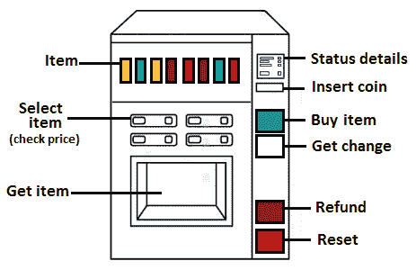
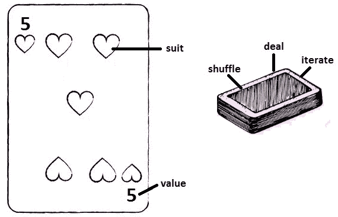

# 六、面向对象编程

本章介绍了在 Java 访谈中遇到的与**面向对象编程**（**OOP**相关的最常见问题。

请记住，我的目标不是教你 OOP，或者更一般地说，本书的目的不是教你 Java。我的目标是教你如何在面试中回答问题和解决问题。在这种情况下，面试官希望得到一个清晰简洁的答案；你没有时间做论文和辅导。你必须能够清楚而有说服力地表达你的想法。你的回答应该是有意义的，你必须让面试官相信你真的明白你在说什么，而且你不仅仅是在背诵一些毫无意义的定义。大多数时候，你应该能够在一个或几个关键段落中表达一篇几页的文章或一本书的一章。

到本章结束时，您将知道如何回答 40 多个涉及 OOP 基本方面的问题。作为基本方面，你必须详细了解它们。如果你不知道这些问题的正确和简洁的答案，那就没有理由了。缺乏这方面的知识会严重影响你在面试中的成功机会。

那么，让我们将我们的议程总结如下：

*   面向对象的概念
*   坚实的原则
*   GOF 设计模式
*   编码挑战

让我们从与 OOP 概念相关的问题开始。

# 技术要求

您可以在 GitHub 上找到本章中的所有代码。请访问以下链接：[https://github.com/PacktPublishing/The-Complete-Coding-Interview-Guide-in-Java/tree/master/Chapter06](https://github.com/PacktPublishing/The-Complete-Coding-Interview-Guide-in-Java/tree/master/Chapter06)

# 理解 OOP 概念

OOP 模型基于几个概念。任何计划设计和编程依赖对象的应用程序的开发人员都必须熟悉这些概念。因此，让我们从下面列举它们开始：

*   对象
*   班
*   抽象
*   封装
*   遗产
*   多态性
*   协会
*   聚集
*   作文

通常，当这些概念包含在问题中时，它们的前缀是*什么是。。。？*例如*什么是对象？*或*什么是多态性？*

重要提示

这些问题的正确答案是技术知识和现实世界的类比或示例的结合。避免使用超技术细节和没有示例的冷淡回答（例如，不要谈论对象的内部表示）。注意你在说什么，因为面试官可能会直接从你的答案中提取问题。如果你的回答顺便提到了一个概念，那么下一个问题可能会提到这个概念。换句话说，不要在你的答案中添加任何你不熟悉的方面。

那么，让我们在采访中回答与 OOP 概念相关的问题。请注意，我们将在[*第 5 章*](05.html#_idTextAnchor072)*中学习的知识应用于【编码挑战】*。更准确地说，我们遵循**理解问题****指定关键词/要点****包装答案**技巧。首先，为了熟悉这项技术，我将以项目符号列表的形式提取关键点，并在答案中用斜体表示。

## 什么是物体？

您应该在回答中概括的要点如下：

*   对象是 OOP 的核心概念之一。
*   对象是真实世界的实体。
*   对象具有状态（字段）和行为（方法）。
*   对象表示类的实例。
*   对象占用内存中的一些空间。
*   一个对象可以与其他对象通信。

现在，我们可以给出如下答案：

*对象是 OOP 的核心概念之一。对象是真实世界的实体，例如汽车、**表或 cat*。在其生命周期内，对象*具有状态和行为*。例如，猫的状态可以是颜色、名称和品种，而它的行为可以是玩耍、进食、睡觉和喵喵叫。在 Java 中，对象是通常通过**new**关键字构建的类的实例，*将状态存储在字段中，并通过方法公开其行为。每个实例占用内存空间，可以与其他对象通信*。例如，一个男孩，这是另一个物体，可以抚摸一只猫，它就睡着了。

如果需要进一步的详细信息，那么您可能希望讨论以下事实：对象可以具有不同的访问修饰符和可见性范围，可以是可变的、不可修改的或不可变的，并且可以通过垃圾收集器进行收集。

## 什么是班级？

您应该在回答中概括的要点如下：

*   类是 OOP 的核心概念之一。
*   类是用于创建对象的模板或蓝图。
*   类不消耗内存。
*   一个类可以被实例化多次。
*   一个类只做一件事。

现在，我们可以给出如下答案：

*类是 OOP 的核心概念之一。*类是构建特定类型对象所需的一组指令。我们可以*将类想象为模板、蓝图*或者告诉我们如何创建该类对象的配方。*创建该类的对象是一个称为实例化*的过程，通常通过**new**关键字完成。*我们可以根据需要实例化任意多个对象。类定义不会消耗硬盘上作为文件保存的内存*。一个类应该遵循的最佳实践之一是**单一责任原则****（SRP）**。在遵循这一原则的同时，*类的设计和编写应该只做一件事。*

如果需要进一步的详细信息，那么您可能想谈谈这样一个事实：类可以具有不同的访问修饰符和可见性范围，支持不同类型的变量（本地、类和实例变量），并且可以声明为**抽象**、**最终**或**私有**，嵌套在另一个类（内部类）中，依此类推。

## 什么是抽象？

您应该在回答中概括的要点如下：

*   抽象是 OOP 的核心概念之一。
*   抽象的概念是只向用户公开那些与他们相关的东西，并隐藏其余的细节。
*   抽象允许用户关注应用程序做什么，而不是它如何做。
*   抽象是通过抽象类和接口在 Java 中实现的。

现在，我们可以给出如下答案：

爱因斯坦声称*一切都应该尽可能简单，但不应该更简单*。*抽象是 OOP 的主要概念*之一，力求让用户的事情尽可能简单。换句话说，*抽象只向用户公开与他们相关的东西，并隐藏其余的细节*。在 OOP 术语中，我们说一个对象应该只向其用户公开一组高级操作，而这些操作的内部实现是隐藏的。因此，*抽象允许用户关注应用程序做什么，而不是它如何做*。通过这种方式，抽象降低了公开内容的复杂性，提高了代码的可重用性，避免了代码重复，并保持了低耦合和高内聚。此外，它通过仅公开重要细节来维护应用程序的安全性和自由裁量权。

让我们来考虑一个现实生活中的例子：一个开车的人。这名男子知道每个踏板和方向盘的作用，但他不知道这些事情是如何由汽车内部完成的。他不知道这些东西的内在机制。这就是抽象。*在 Java 中，抽象可以通过抽象类和接口*实现。

如果需要更多详细信息，则可以共享屏幕或使用纸和笔编写示例代码。

我们说一个男人在开车。这个人可以通过相应的踏板使汽车加速或减速。他还可以借助方向盘左右转弯。所有这些动作都分组在一个名为**Car**的界面中：

```java
public interface Car {
    public void speedUp();
    public void slowDown();
    public void turnRight();
    public void turnLeft();
    public String getCarType();
}
```

接下来，每种类型的汽车都应该实现**汽车**接口，并覆盖这些方法以提供这些动作的实现。此实现对用户（驾驶汽车的人）隐藏。例如，**电动车**类出现如下（实际上，我们有复杂的业务逻辑来代替**System.out.println**：

```java
public class ElectricCar implements Car {
    private final String carType;
    public ElectricCar(String carType) {
        this.carType = carType;
    }        
    @Override
    public void speedUp() {
        System.out.println("Speed up the electric car");
    }
    @Override
    public void slowDown() {
        System.out.println("Slow down the electric car");
    }
    @Override
    public void turnRight() {
        System.out.println("Turn right the electric car");
    }
    @Override
    public void turnLeft() {
        System.out.println("Turn left the electric car");
    }
    @Override
    public String getCarType() {
        return this.carType;
    }        
}
```

此类的用户可以访问这些**公共**方法，而不知道的实现：

```java
public class Main {
    public static void main(String[] args) {
        Car electricCar = new ElectricCar("BMW");
        System.out.println("Driving the electric car: " 
		  + electricCar.getCarType() + "\n");
        electricCar.speedUp();
        electricCar.turnLeft();
        electricCar.slowDown();
    }
}
```

输出如下所示：

```java
Driving the electric car: BMW
Speed up the electric car
Turn left the electric car
Slow down the electric car
```

这是一个通过接口进行抽象的例子。完整的应用程序名为*抽象/抽象接口*。在本书附带的代码中，可以找到通过抽象类实现的相同场景。完整的应用程序名为*抽象/抽象 ViaAbstractClass***。**

接下来，我们来讨论封装。

## 什么是封装？

您应该在回答中概括的要点如下：

*   封装是 OOP 的核心概念之一。
*   封装是一种对外部世界隐藏对象状态并公开一组访问该状态的公共方法的技术。
*   当每个对象在类内保持其状态私有时，就实现了封装。
*   封装被称为*数据隐藏*机制。
*   封装有许多与之相关的重要优点，例如松散耦合、可重用、安全和易于测试的代码。
*   在 Java 中，封装是通过访问修饰符来实现的–**public**、**private**和**protected。**

现在，我们可以给出如下答案：

*封装是 OOP*的核心概念之一。主要是，封装将代码和数据绑定到单个工作单元（类）中，并充当防御屏障，不允许外部代码直接访问这些数据。主要是*对外界隐藏对象状态，并公开一组访问该状态的***公共***方法的技术。当每个对象在类中保持其状态***private***时，可以说实现了封装。这就是为什么封装也被称为***数据隐藏***机制*。*利用封装的代码是松散耦合的*（例如，我们可以在不破坏客户端代码的情况下更改类变量的名称）、可重用的、安全的（客户端不知道类内如何操作数据）和易于测试（方法比字段更容易测试）。在 Java 中，可以通过访问修饰符**public**、**private**和**protected**实现封装。通常，当对象管理自己的状态时，其状态通过**private**声明变量，并通过胡理 T29 公开和/或修改，通过公开 T30.方法。让我们考虑一个例子：一个 TA31 T31 猫 CAT T32。类不能直接修改这些字段中的任何一个，它可以在内部调用**public**方法，如**play（）**、**feed（）**、**sleep（）**等修改**Cat**状态的方法。**Cat**类也可以有**private**类类外无法访问的方法，例如**meow（）**。这是封装。

如果需要更多详细信息，则可以共享屏幕或使用纸和笔编写示例代码。

因此，我们示例中的**Cat**类可以按照下面的代码块进行编码。请注意，该类的状态是通过**私有**字段封装的，因此不能从类外部直接访问：

```java
public class Cat {
    private int mood = 50;
    private int hungry = 50;
    private int energy = 50;
    public void sleep() {
        System.out.println("Sleep ...");
        energy++;
        hungry++;
    }
    public void play() {
        System.out.println("Play ...");
        mood++;
        energy--;
        meow();
    }
    public void feed() {
        System.out.println("Feed ...");
        hungry--;
        mood++;
        meow();
    }
    private void meow() {
        System.out.println("Meow!");
    }
    public int getMood() {
        return mood;
    }
    public int getHungry() {
        return hungry;
    }
    public int getEnergy() {
        return energy;
    }
}
```

修改状态的唯一方式是通过公共方法**播放（）**、**馈送（）**和**睡眠（）**，如下例：

```java
public static void main(String[] args) {
    Cat cat = new Cat();
    cat.feed();
    cat.play();
    cat.feed();
    cat.sleep();
    System.out.println("Energy: " + cat.getEnergy());
    System.out.println("Mood: " + cat.getMood());
    System.out.println("Hungry: " + cat.getHungry());
}
```

输出结果如下：

```java
Feed ...Meow!Play ...Meow!Feed ...Meow!Sleep ...
Energy: 50
Mood: 53
Hungry: 49
```

完整的应用程序名为*封装***。**现在，让我们来做一个遗产概述。

## 什么是继承？

您应该在回答中概括的要点如下：

*   继承是 OOP 的核心概念之一。
*   继承允许一个对象基于另一个对象。
*   继承通过允许一个对象重用另一个对象的代码并添加自己的逻辑来维持代码的可重用性。
*   继承被称为**is-A**关系，也被称为父子关系。
*   在 Java 中，继承是通过**扩展**关键字实现的。
*   继承的对象被引用为超类，继承超类的对象被引用为子类。
*   在 Java 中，不能继承多个类。

现在，我们可以给出如下答案：

*继承是 OOP 的核心概念之一。它允许一个对象基于另一个对象*，当不同的对象非常相似并且共享一些共同的逻辑，但它们并不相同时，这很有用。*继承通过允许一个对象重用另一个对象的代码来维持代码的可重用性，同时它也添加了自己的逻辑*。因此，为了实现继承，我们重用了公共逻辑，并在另一个类中提取了唯一的逻辑。*这称为 is-A 关系，也称为父子关系*。这就像说**Foo**是一种**嗡嗡**类型的东西。例如，猫是猫，火车是车。IS-A 关系是用于定义类层次结构的工作单元。*在 Java 中，继承是通过***从父派生子***关键字来完成的。子级可以重用其父级的字段和方法，并添加自己的字段和方法。*继承的对象被引用为超类或父类，继承超类的对象被引用为子类或子类。在 Java 中，继承不能是多个*；因此，子类或子类不能继承多个超类或父类的字段和方法。例如，一个**Employee**类（父类）可以定义软件公司中任何员工的公共逻辑，而另一个名为**Programmer**的类（子类）可以扩展**Employee**使用该公共逻辑并添加特定于程序员的逻辑。其他类也可以扩展**程序员**或**员工**类。*

如果需要更多详细信息，则可以共享屏幕或使用纸和笔编写示例代码。

**Employee**类非常简单。它包装了员工的姓名：

```java
public class Employee {
    private String name;
    public Employee(String name) {
        this.name = name;
    }
    // getters and setters omitted for brevity
}
```

然后，**程序员**类扩展了**员工**。作为任何员工，程序员都有一个名字，但他们也被分配到一个团队：

```java
public class Programmer extends Employee {
    private String team;
    public Programmer(String name, String team) {
        super(name);
        this.team = team;
    }
    // getters and setters omitted for brevity
}
```

现在，让我们通过创建一个**程序员**并调用继承自**Employee**类的**getName（）**，以及继承自**程序员**类的**getTeam（）**来测试继承性：

```java
public static void main(String[] args) {
    Programmer p = new Programmer("Joana Nimar", "Toronto");
    String name = p.getName();
    String team = p.getTeam();
    System.out.println(name + " is assigned to the " 
          + team + " team");
}
```

输出结果如下：

```java
Joana Nimar is assigned to the Toronto team
```

完整的应用程序名为*继承*。接下来，我们来谈谈多态性。

## 什么是多态性？

您应该在回答中概括的要点如下：

*   多态性是 OOP 的核心概念之一。
*   多态性在希腊语中表示*多种形式*。
*   多态性允许对象在某些情况下表现不同。
*   多态性可以通过方法重载（称为编译时多态性）或在 IS-A 关系的情况下通过方法重写（称为运行时多态性）形成。

现在，我们可以给出如下答案：

*多态性是 OOP*的核心概念之一。多态性是一个由两个希腊单词组成的词：*poly*，意思是*多*；和*morph*，意思是*形式*。因此，*多态性意味着多种形式*。

更准确地说，在 OOP 上下文中，*多态性允许对象在某些情况下以不同的方式行为*，或者换句话说，允许以不同的方式（方法）完成操作。*实现多态性的一种方法是通过方法重载。这被称为编译时多态性*，因为编译器可以在编译时确定要调用哪种形式的重载方法（具有相同名称但不同参数的多个方法）。因此，根据调用重载方法的形式，对象的行为会有所不同。例如，一个名为**Triangle**的类可以使用不同的参数定义多个名为**draw（）**的方法。

*实现多态性的另一种方法是通过方法重写，这是我们有 is-A 关系时常用的方法。它被称为运行时多态，或动态方法调度*。通常，我们从包含一系列方法的接口开始。接下来，每个类实现这个接口并重写这些方法以提供特定的行为。这一次，多态性允许我们像其父类（接口）一样使用这些类中的任何一个，而不会混淆它们的类型。这是可能的，因为在运行时，Java 可以区分这些类，并知道使用哪个类。例如，名为**Shape**的接口可以声明名为**draw（）**的方法，**三角形**、**矩形**和**圆**类实现**Shape**接口并重写【T18 draw（）方法绘制相应的形状。

如果需要更多详细信息，则可以共享屏幕或使用纸和笔编写示例代码。

### 通过方法重载的多态性（编译时）

**三角形**类包含三个**draws（）**方法，如下所示：

```java
public class Triangle {
    public void draw() {
        System.out.println("Draw default triangle ...");
    }
    public void draw(String color) {
        System.out.println("Draw a triangle of color " 
            + color);
    }
    public void draw(int size, String color) {
        System.out.println("Draw a triangle of color " + color
           + " and scale it up with the new size of " + size);
    }
}
```

接下来，请注意如何调用对应的**draw（）**方法：

```java
public static void main(String[] args) {
    Triangle triangle = new Triangle();
    triangle.draw();
    triangle.draw("red");
    triangle.draw(10, "blue");
}
```

输出结果如下：

```java
Draw default triangle ...
Draw a triangle of color red
Draw a triangle of color blue and scale it up 
with the new size of 10
```

完整的应用程序名为*多态性/编译时间*。接下来，让我们看一个实现运行时多态性的示例。

### 通过方法重写的多态性（运行时）

这一次，**draw（）**方法是在一个接口中声明的，如下所示：

```java
public interface Shape {
    public void draw();
}
```

**三角形**、**矩形**和**圆**类实现**形状**接口，并重写**绘制（）方法**绘制对应形状：

```java
public class Triangle implements Shape {
    @Override
    public void draw() {
        System.out.println("Draw a triangle ...");
    }
}
public class Rectangle implements Shape {
    @Override
    public void draw() {
        System.out.println("Draw a rectangle ...");
    }
}
public class Circle implements Shape {
    @Override
    public void draw() {
        System.out.println("Draw a circle ...");
    }
}
```

接下来，我们创建一个三角形、矩形和一个圆。对于这些实例中的每一个，让我们调用**draw（）**方法：

```java
public static void main(String[] args) {
    Shape triangle = new Triangle();
    Shape rectangle = new Rectangle();
    Shape circle = new Circle();
    triangle.draw();
    rectangle.draw();
    circle.draw();
}
```

输出显示，Java 在运行时调用了正确的**draw（）**方法：

```java
Draw a triangle ...
Draw a rectangle ...
Draw a circle ...
```

完整的应用程序名为*多态性/运行时*。接下来，我们来谈谈联想。

重要提示

有人认为多态是 OOP 中最重要的概念。此外，有声音认为运行时多态性是唯一真正的多态性，而编译时间多态性实际上不是多态性的一种形式。在采访期间，不建议发起这样的辩论。最好充当调解人，呈现硬币的两面。我们将很快讨论如何应对这种情况。

## 什么是联想？

您应该在回答中概括的要点如下：

*   关联是 OOP 的核心概念之一。
*   关联定义了相互独立的两个类之间的关系。
*   协会没有所有者。
*   关联可以是一对一、一对多、多对一和多对多。

现在，我们可以给出如下答案：

*关联是 OOP 的核心概念之一。关联目标是定义相互独立的两个类之间的关系*，也被称为对象之间的多重性关系。*没有协会*的所有者。关联中涉及的对象可以相互使用（双向关联），也可以仅一个使用另一个（单向关联），但它们有自己的生命周期。*关联可以是单向/双向、一对一、一对多、多对一和多对多*。例如，在**Person**和**Address**对象之间，我们可能存在双向多对多关系。换句话说，一个人可以与多个地址关联，而一个地址可以属于多个人。然而，人可以没有地址而存在，反之亦然。

如果需要更多详细信息，则可以共享屏幕或使用纸和笔编写示例代码。

**Person**和**Address**类非常简单：

```java
public class Person {
    private String name;
    public Person(String name) {
        this.name = name;
    }
    // getters and setters omitted for brevity
}
public class Address {
    private String city;
    private String zip;
    public Address(String city, String zip) {
        this.city = city;
        this.zip = zip;
    }
    // getters and setters omitted for brevity
}
```

**人**与**地址**的关联是通过**main（）**方法完成的，如所示，如下代码块：

```java
public static void main(String[] args) {
    Person p1 = new Person("Andrei");
    Person p2 = new Person("Marin");
    Address a1 = new Address("Banesti", "107050");
    Address a2 = new Address("Bucuresti", "229344");
    // Association between classes in the main method 
    System.out.println(p1.getName() + " lives at address "
            + a2.getCity() + ", " + a2.getZip()
            + " but it also has an address at "
            + a1.getCity() + ", " + a1.getZip());
    System.out.println(p2.getName() + " lives at address "
            + a1.getCity() + ", " + a1.getZip()
            + " but it also has an address at "
            + a2.getCity() + ", " + a2.getZip());
}
```

输出为如下所示：

```java
Andrei lives at address Bucuresti, 229344 but it also has an address at Banesti, 107050
Marin lives at address Banesti, 107050 but it also has an address at Bucuresti, 229344
```

完整的申请被命名为*协会*。接下来，我们来讨论聚合。

## 什么是聚合？

你应该在回答中概括的要点如下：

*   聚合是 OOP 的核心概念之一。
*   聚合是单向关联的一种特殊情况。
*   聚合表示 HAS-a 关系。
*   两个聚合对象有各自的生命周期，但其中一个对象是 HAS-A 关系的所有者。

现在，我们可以给出如下答案：

*聚合是 OOP*的核心概念之一。聚合主要是单向关联的一种特例。虽然关联定义了彼此独立的两个类之间的关系，*聚合表示这两个类*之间的 HAS-a 关系。换句话说，*两个聚合对象有各自的生命周期，但其中一个对象是 HAS-A 关系*的所有者。拥有自己的生命周期意味着结束一个对象不会影响另一个对象。以为例，一个**网球选手**有一个**球拍**。这是一个单向关联，因为**球拍**不能有**网球手**。即使**网球选手**死亡，**球拍**也不会受到影响。

重要提示

注意，当我们定义聚合的概念时，我们还有一个关于什么是关联的语句。当两个概念紧密相关且其中一个是另一个概念的特例时，请遵循此方法。接下来，将组合定义为聚合的一种特殊情况也采用了相同的做法。面试官会注意到并感激你对事情有一个全面的了解，并且你能提供一个有意义的答案，而不是忽略上下文。

如果需要更多详细信息，则可以共享屏幕或使用纸和笔编写示例代码。

我们从**火箭**类开始。这是网球拍的简单表示：

```java
public class Racket {
    private String type;
    private int size;
    private int weight;
    public Racket(String type, int size, int weight) {
        this.type = type;
        this.size = size;
        this.weight = weight;
    }
    // getters and setters omitted for brevity
}
```

一个**网球选手**有一个**球拍**。因此，**网球选手**等级必须能够接收**球拍**，如下所示：

```java
public class TennisPlayer {
    private String name;
    private Racket racket;
    public TennisPlayer(String name, Racket racket) {
        this.name = name;
        this.racket = racket;
    }
    // getters and setters omitted for brevity
}
```

接下来，我们创建一个**球拍**和一个**天网播放机**，它使用这个**球拍**：

```java
public static void main(String[] args) {
    Racket racket = new Racket("Babolat Pure Aero", 100, 300);
    TennisPlayer player = new TennisPlayer("Rafael Nadal", 
        racket);
    System.out.println("Player " + player.getName() 
        + " plays with " + player.getRacket().getType());
}
```

结果如下：

```java
Player Rafael Nadal plays with Babolat Pure Aero
```

完整的应用程序名为*聚合*。接下来，我们来谈谈作文。

## 什么是构图？

您应该在回答中概括的要点如下：

*   组合是 OOP 的核心概念之一。
*   组合是聚合的一种更具限制性的情况。
*   组合表示一个 HAS-a 关系，该关系包含一个不能单独存在的对象。
*   组合支持代码重用和对象的可见性控制。

现在，我们可以给出如下答案：

*组合是 OOP*的核心概念之一。*首先，成分是聚集*的一种更具限制性的情况。聚合表示两个对象之间具有各自生命周期的 HAS-a 关系，*组合表示包含无法单独存在的对象*的 HAS-a 关系。为了突出显示这种耦合，HAS-A 关系也可以命名为的一部分。例如，一辆**汽车**有一个**发动机**。换句话说，发动机是汽车的一部分。如果汽车被毁，那么发动机也会被毁。组合据说比继承更好，因为它支持代码重用和对象的可见性控制。

如果需要进一步的详细信息，那么您可以共享屏幕或使用纸和笔编写示例代码。

**发动机**级相当简单：

```java
public class Engine {
    private String type;
    private int horsepower;
    public Engine(String type, int horsepower) {
        this.type = type;
        this.horsepower = horsepower;
    }
    // getters and setters omitted for brevity
}
```

接下来是**车**类。检查这个类的构造函数。由于**发动机**是**车**的一部分，我们用**车**创建：

```java
public class Car {
    private final String name;
    private final Engine engine;
    public Car(String name) {
        this.name = name;
        Engine engine = new Engine("petrol", 300);
        this.engine=engine;
    }
    public int getHorsepower() {
        return engine.getHorsepower();
    }
    public String getName() {
        return name;
   }    
}
```

接下来，我们可以通过**main（）**

```java
public static void main(String[] args) {
    Car car = new Car("MyCar");
    System.out.println("Horsepower: " + car.getHorsepower());
}
```

输出如下：

```java
Horsepower: 300
```

完整申请命名为*组合***。**

到目前为止，我们已经讨论了有关 OOP 概念的基本问题。请记住，在 Java 技术面试中，几乎任何涉及编码或架构应用程序的职位都会出现这样的问题。特别是如果你有 2-4 年的工作经验，你很可能会被问到前面的问题，你必须知道答案，否则这将是对你不利的一个黑点。

现在，让我们继续讲坚实的原则。这是 OOP 概念之外的另一个基本领域，也是一个必须了解的主题。在面试的最后决定中，缺乏这方面的知识将被证明是有害的。

# 了解坚实的原则

在本节中，我们将针对五种著名的写作课程设计模式——扎实的原则，制定问题的答案。通过快速余数，SOLID 是以下内容的首字母缩写：

*   **S**：单一责任原则
*   **O**：开闭原理
*   **L**：利斯科夫替代原理
*   **I**：接口隔离原则
*   **D**：依赖倒置原则

在采访中，最常见的关于固体的问题是什么是。。。？型。例如，*S 是什么？*或*D 是什么？*通常，OOP 相关的问题故意含糊不清。这样，面试官会测试你的知识水平，并想知道你是否要求进一步澄清。所以，让我们依次回答这些问题，并给出一个能给面试官留下深刻印象的精彩答案。

## S 是什么？

您应该在答案中概括的要点如下：

*   S 代表**单一责任原则**（SRP）。
*   S 代表*一个类应该有一个且只有一个责任*。
*   S 告诉我们只为一个目标编写一个类。
*   S 在应用程序模块中保持高可维护性和可见性控制。

现在，我们可以给出如下答案：

首先，SOLID 是 Robert C.Martin 阐述的前五个**面向对象设计****（OOD）**原则的首字母缩写，也称为 Bob 叔叔（*可选短语*。*S*是 SOLID 的第一原则，被称为**单一责任原则**（**SRP**。*这一原则解释为一个类应该有一个且只有一个责任*。对于任何类型的类（模型、服务、控制器、管理器类等等），这是任何类型的项目都应该遵循的一个非常重要的原则。*只要我们只为一个目标编写一个类，我们将在应用程序模块*之间保持高可维护性和可见性控制。换句话说，通过*保持高可维护性*，这一原则具有重大的业务影响，通过*提供跨应用程序模块*的可见性控制，这一原则支持封装。

如果需要进一步的详细信息，那么您可以共享屏幕或使用纸和笔将示例编码为此处所示的示例。

例如，要计算矩形的面积。矩形的尺寸最初以米为单位，面积也以米为单位计算，但我们希望能够将计算的面积转换为其他单位，例如英寸。让我们看看打破 SRP 的方法。

打破 SRP

在单个类**RectangleAreaCalculator**中实现上述问题，可以按如下方式完成。但是这个类做的不止一件事：它破坏了 SRP。请记住，通常，当您使用单词**和**来表示类所做的事情时，这是 SRP 被破坏的标志。例如，以下类计算面积**并**将其转换为英寸：

```java
public class RectangleAreaCalculator {
    private static final double INCH_TERM = 0.0254d;
    private final int width;
    private final int height;
    public RectangleAreaCalculator(int width, int height) {
        this.width = width;
        this.height = height;
    }
    public int area() {
        return width * height;
    }
    // this method breaks SRP
    public double metersToInches(int area) {
        return area / INCH_TERM;
    }    
}
```

由于该代码违反了 SRP，我们必须修正它才能遵守 SRP。

### 遵循 SRP

通过从**矩形区域计算器**中移除**metersToInches（）**方法，可以纠正这种情况，如下所示：

```java
public class RectangleAreaCalculator {
    private final int width;
    private final int height;
    public RectangleAreaCalculator(int width, int height) {
        this.width = width;
        this.height = height;
    }
    public int area() {
        return width * height;
    }       
}
```

现在，**矩形面积计算器**只做一件事（它计算矩形面积），从而观察 SRP。

接下来，可以在单独的类中提取**metersToInches（）**。此外，我们还可以添加一种将米转换为英尺的新方法：

```java
public class AreaConverter {
    private static final double INCH_TERM = 0.0254d;
    private static final double FEET_TERM = 0.3048d;
    public double metersToInches(int area) {
        return area / INCH_TERM;
    }
    public double metersToFeet(int area) {
        return area / FEET_TERM;
    }
}
```

本课程也遵循 SRP，因此我们的工作已经完成。完整的应用程序名为*SingleResponsibilityPrinciple*。接下来，我们来谈谈第二个固体原理，开闭原理。

什么是 O？

您在答案中应该概括的要点如下：

*   O 代表**开闭原则**（OCP）。
*   O 代表*软件组件应打开进行扩展，但关闭进行修改*。
*   O 支持这样一个事实，即我们的类不应包含要求其他开发人员修改我们的类以完成其工作的约束——其他开发人员只应扩展我们的类以完成其工作。
*   O 以通用、直观和无害的方式保持软件的可扩展性。

现在，我们可以给出如下答案：

首先，SOLID 是 Robert C.Martin 阐述的前五个**面向对象设计****（OOD）**原则的首字母缩写，也称为 Bob 叔叔（*可选短语*。*O*是固体的第二个原理，称为**开闭原理**（OCP）。此原则代表*软件组件应开放以供扩展，但关闭以供修改*。这意味着我们的类应该以这样的方式设计和编写：其他开发人员可以通过简单地扩展它们来改变这些类的行为。因此，*我们的类不应该包含要求其他开发人员修改我们的类以完成他们的工作的约束—其他开发人员只应该扩展我们的类以完成他们的工作*。

虽然我们*必须以一种通用、直观且无害的方式*保持软件的可扩展性，但我们不必认为其他开发人员会想要改变我们类的整个逻辑或核心逻辑。首先，如果我们遵循这个原则，那么我们的代码将作为一个好的框架，不允许我们修改它们的核心逻辑，但是我们可以通过扩展一些类、传递初始化参数、重写方法、传递不同的选项等来修改它们的流和/或行为。

如果需要进一步的详细信息，那么您可以共享屏幕，或者使用纸和笔编写一个示例，如本文所示。

现在，举例来说，你有不同的形状（例如，矩形，圆形），我们要求它们的面积之和。首先，让我们看看打破 OCP 的实现。

### 打破 OCP

每个形状将实现**形状**接口。因此，代码非常简单：

```java
public interface Shape {    
}
public class Rectangle implements Shape {
    private final int width;
    private final int height;
    // constructor and getters omitted for brevity
}
public class Circle implements Shape {
    private final int radius;
    // constructor and getter omitted for brevity
}
```

此时，我们可以轻松地使用这些类的构造函数创建不同大小的矩形和圆。一旦我们有了几个形状，我们就要对它们的面积求和。为此，我们可以定义一个**面积计算器**类，如下所示：

```java
public class AreaCalculator {
    private final List<Shape> shapes;
    public AreaCalculator(List<Shape> shapes) {
        this.shapes = shapes;
    }
    // adding more shapes requires us to modify this class
    // this code is not OCP compliant
    public double sum() {
        int sum = 0;
        for (Shape shape : shapes) {
            if (shape.getClass().equals(Circle.class)) {
                sum += Math.PI * Math.pow(((Circle) shape)
                    .getRadius(), 2);
            } else 
            if(shape.getClass().equals(Rectangle.class)) {
                sum += ((Rectangle) shape).getHeight() 
                    * ((Rectangle) shape).getWidth();
            }
        }
        return sum;
    }
}
```

由于每个形状都有自己的面积公式，我们需要一个**if-else**（或**开关**）结构来确定形状的类型。此外，如果我们想添加一个新的形状（例如三角形），我们必须修改**AreaCalculator**类以添加一个新的**if**案例。这意味着前面的代码破坏了 OCP。修复此代码以观察 OCP 会在所有类中施加若干修改。因此，请注意，修复不遵循 OCP 的代码可能非常棘手，即使是在一个简单的示例中。

### 遵循 OCP

主要思想是从**面积计算器**中提取对应**形状**类中每个形状的面积公式。因此，矩形将计算其面积、圆等。为了强化每个形状必须计算其面积的事实，我们将**面积（）**方法添加到**形状**合同中：

```java
public interface Shape { 
    public double area();
}
```

接下来，**矩形**和**圆**实现**形状**如下：

```java
public class Rectangle implements Shape {
    private final int width;
    private final int height;
    public Rectangle(int width, int height) {
        this.width = width;
        this.height = height;
    }
    public double area() {
        return width * height;
    }
}
public class Circle implements Shape {
    private final int radius;
    public Circle(int radius) {
        this.radius = radius;
    }
    @Override
    public double area() {
        return Math.PI * Math.pow(radius, 2);
    }
}
```

现在，**面积计算器**可以循环形状列表，并通过调用适当的**面积（）**方法求和面积：

```java
public class AreaCalculator {
    private final List<Shape> shapes;
    public AreaCalculator(List<Shape> shapes) {
        this.shapes = shapes;
    }
    public double sum() {
        int sum = 0;
        for (Shape shape : shapes) {
            sum += shape.area();
        }
        return sum;
    }
}
```

该代码符合 OCP。我们可以添加新形状，无需修改**面积计算器**。因此，**区域计算器**被关闭以进行修改，当然，也被打开以进行扩展。完整的应用程序名为*OpenClosedPrinciple*。接下来，我们来谈谈第三个固体原理，利斯科夫的替代原理。

## 我是什么？

您应该在答案中概括的要点如下：

*   L 代表**利斯科夫的替代原则****（LSP）**。
*   L 代表*派生类型必须完全可替代其基类型*。
*   L 支持这样一个事实：子类的对象必须以与超类的对象相同的方式运行。
*   L 对于运行时类型标识和强制转换非常有用。

现在，我们可以给出如下答案：

首先，SOLID 是 Robert C.Martin 阐述的前五个**面向对象设计****（OOD）**原则的缩写，也称为 Bob 叔叔（可选短语）。*L*是固体的第三个原理，称为**利斯科夫替代原理*****（LSP）**。此原则表示*派生类型必须完全可替代其基类型*。这意味着扩展类的类应该可以在应用程序中使用，而不会导致失败。更准确地说，*这个原则支持这样一个事实，即子类的对象必须以与超类*的对象相同的方式运行，因此每个子类（或派生类）都应该能够无任何问题地替换其超类。大多数情况下，*这对于运行时类型识别以及随后的转换*非常有用。例如，考虑 O.T18（Fo（p）），T19，To，T20，P，T21，T 是 Ty2 T22 的类型。那么，如果**q**属于**S**类型，**S**属于**T**的子类型，**foo（q）**应该可以正常工作。*

 *如果需要进一步的详细信息，那么您可以共享屏幕，或者使用纸和笔编写一个示例，如本文所示。

我们有一个国际象棋俱乐部，接受三种会员：高级、VIP 和免费。我们有一个名为**成员**的抽象类作为基类，还有三个子类——**PremiumMember**、**VipmMember**和**FreeMember**。让我们看看这些成员类型是否都可以替换基类。

### 打破 LSP

**成员**类是抽象的，它代表我们国际象棋俱乐部所有成员的基类：

```java
public abstract class Member {
    private final String name;
    public Member(String name) {
        this.name = name;
    }
    public abstract void joinTournament();
    public abstract void organizeTournament();
}
```

**预备成员**班可以参加国际象棋比赛，也可以组织国际象棋比赛。因此，它的实现非常简单：

```java
public class PremiumMember extends Member {
    public PremiumMember(String name) {
        super(name);
    }
    @Override
    public void joinTournament() {
        System.out.println("Premium member joins tournament");         
    }
    @Override
    public void organizeTournament() {
        System.out.println("Premium member organize 
            tournament");        
     }
}
```

**VipMember**类与**PremiumMember**类大致相同，因此我们可以跳过它，将重点放在**FreeMember**类上。**FreeMember**类可以参加比赛，但不能组织比赛。这是我们需要在**organizeTournament（）**方法中解决的问题。我们可以抛出带有有意义的消息的异常，也可以显示如下消息：

```java
public class FreeMember extends Member {
    public FreeMember(String name) {
        super(name);
    }
    @Override
    public void joinTournament() {
        System.out.println("Classic member joins tournament 
            ...");

    }
    // this method breaks Liskov's Substitution Principle
    @Override
    public void organizeTournament() {
        System.out.println("A free member cannot organize 
            tournaments");

    }
}
```

但抛出异常或显示消息并不意味着我们遵循 LSP。因为自由会员不能组织比赛，它不能代替基类，因此它破坏了 LSP。查看以下成员列表：

```java
List<Member> members = List.of(
    new PremiumMember("Jack Hores"),
    new VipMember("Tom Johns"),
    new FreeMember("Martin Vilop")
); 
```

以下循环显示我们的代码不符合 LSP，因为当**FreeMember**类必须替换**Member**类时，它无法完成其工作，因为**FreeMember**无法组织国际象棋比赛：

```java
for (Member member : members) {
    member.organizeTournament();
}
```

这种情况是一种阻碍。我们无法继续实施我们的应用程序。我们必须重新设计解决方案，以获得符合 LSP 的代码。那我们就这么做吧！

### 在 LSP 之后

重构过程从定义两个接口开始，这两个接口用于分隔两个动作，加入并组织国际象棋比赛：

```java
public interface TournamentJoiner {
    public void joinTournament();
}
public interface TournamentOrganizer {
    public void organizeTournament();
}
```

接下来，抽象基类实现这两个接口，如下所示：

```java
public abstract class Member 
    implements TournamentJoiner, TournamentOrganizer {
    private final String name;
    public Member(String name) {
        this.name = name;
    }  
}
```

**前置成员**和**VIP 成员**保持不变。它们扩展了**成员**基类。但是，不能组织比赛的**自由会员**类不会扩展**会员**基类。它将只实现**TournamJoiner**接口：

```java
public class FreeMember implements TournamentJoiner {
    private final String name;
    public FreeMember(String name) {
        this.name = name;
    }
    @Override
    public void joinTournament() {
        System.out.println("Free member joins tournament ...");
    }
}
```

现在，我们可以定义一个可以参加国际象棋比赛的成员列表，如下所示：

```java
List<TournamentJoiner> members = List.of(
    new PremiumMember("Jack Hores"),
    new PremiumMember("Tom Johns"),
    new FreeMember("Martin Vilop")
);
```

循环此列表，并将**TournamentJoiner**接口替换为每种类型的成员，按照预期工作并遵守 LSP：

```java
// this code respects LSP
for (TournamentJoiner member : members) {
    member.joinTournament();
}   
```

按照同样的逻辑，可以组织国际象棋比赛的成员名单可以写如下：

```java
List<TournamentOrganizer> members = List.of(
    new PremiumMember("Jack Hores"),
    new VipMember("Tom Johns")
);
```

**FreeMember**未实现**锦标赛组织者**接口。因此，无法将其添加到此列表中。循环此列表，并将**锦标赛组织者**接口替换为每种类型的成员，按照预期工作，并遵循 LSP：

```java
// this code respects LSP
for (TournamentOrganizer member : members) {
    member.organizeTournament();
}
```

完成！现在我们有了符合 LSP 的代码。完整的应用程序名为*Liskov 替换原理*。接下来，让我们讨论第四个固体原则，界面分离原则。

## 我是什么？

您应该在答案中概括的要点如下：

*   I 代表**接口隔离原则**（**ISP**）。
*   我代表*客户不应该被迫实现他们不会使用*的不必要的方法。
*   我将一个接口拆分为两个或多个接口，直到客户机不被迫实现他们不会使用的方法。

现在，我们可以给出如下答案：

首先，SOLID 是 Robert C.Martin 阐述的前五个**面向对象设计****（OOD）**原则的缩写，也称为 Bob 叔叔（可选短语）。它是固体的第四个原理，被称为**界面分离原理*****【ISP】**。此原则代表*客户机不应被迫实现他们不会使用的不必要的方法*。换句话说，*我们应该将一个接口拆分为两个或多个接口，直到客户机不被迫实现他们不会使用的方法为止*。例如，考虑 AutoT14-^连接 To15T.A.接口，它有三种方法：AuthT16.Load（），Ty17 To，Ont18，SoCK（）TytT19，和 Po.T20.HTTP（）T221。客户机可能希望仅为通过 HTTP 的连接实现此接口。因此，他们不需要**socket（）**方法。大多数情况下，客户端会将此方法留空，这是一个糟糕的设计。为了避免这种情况，只需将**连接**接口拆分为两个接口即可；**SocketConnection**采用**socket（）**方法，**HttpConnection**采用**http（）**方法。这两个接口都将扩展仍然使用常用方法**connect（）**的**连接**接口。*

 *如果需要进一步的详细信息，那么您可以共享屏幕，或者使用纸和笔编写一个示例，如本文所示。既然我们已经描述了前面的例子，让我们跳到关于破坏 ISP 的部分。

### 破坏 ISP

**连接**接口定义了以下三种方式：

```java
public interface Connection {
    public void socket();
    public void http();
    public void connect();
}
```

**WwwPingConnection**是一个通过 HTTP ping 不同网站的类；因此，它需要**http（）**方法，但不需要**套接字（）**方法。请注意虚拟的**套接字（）**实现–由于**WwwPingConnection**实现了**连接**，因此它也被迫为**套接字（）**方法提供一个实现：

```java
public class WwwPingConnection implements Connection {
    private final String www;
    public WwwPingConnection(String www) {
        this.www = www;
    }
    @Override
    public void http() {
        System.out.println("Setup an HTTP connection to " 
            + www);
    }
    @Override
    public void connect() {
        System.out.println("Connect to " + www);
    }
    // this method breaks Interface Segregation Principle
    @Override
    public void socket() {
    }
}
```

拥有一个空的实现或从不需要的方法（如**socket（）**中抛出一个有意义的异常）是一个非常糟糕的解决方案。检查以下代码：

```java
WwwPingConnection www 
    = new WwwPingConnection 'www.yahoo.com');
www.socket(); // we can call this method!
www.connect();
```

我们希望从该代码中获得什么？一个不执行任何操作的工作代码，或者由于没有 HTTP 端点而导致的**connect（）**方法异常？或者，我们可以从类型为：*套接字不受支持的**套接字（）**抛出异常！*。那它为什么在这里？！因此，现在是重构代码以遵循 ISP 的时候了。

### 跟随 ISP

为了符合 ISP，我们需要隔离**连接**接口。由于**connect（）**方法是任何客户端所必需的，因此我们将其保留在该接口中：

```java
public interface Connection {
    public void connect();
}
```

**http（）**和**socket（）**方法分布在不同的接口中，扩展**连接**接口，如下所示：

```java
public interface HttpConnection extends Connection {
    public void http();
}
public interface SocketConnection extends Connection {
    public void socket();
}
```

本次**WwwPingConnection**类只能实现**HttpConnection**接口并使用**http（）**方法：

```java
public class WwwPingConnection implements HttpConnection {
    private final String www;
    public WwwPingConnection(String www) {
        this.www = www;
    }
    @Override
    public void http() {
        System.out.println("Setup an HTTP connection to "
            + www);
    }
    @Override
    public void connect() {
        System.out.println("Connect to " + www);
    } 
}
```

完成！现在，代码跟随 ISP。完整的应用程序名为*InterfaceSegrationPrinciple*。接下来，让我们讨论最后一个坚实的原则，依赖倒置原则。

## D 是什么？

您应该在答案中概括的要点如下：

*   *D*代表**依赖倒置原则****（DIP）**。
*   *D*代表*依赖抽象，而非具体*。
*   *D*支持使用抽象层将具体模块绑定在一起，而不是使用依赖于其他具体模块的具体模块。
*   *D*支持混凝土模块的解耦。

现在，我们可以给出如下答案：

首先，SOLID 是 Robert C.Martin 阐述的前五个**面向对象设计****（OOD）**原则的首字母缩写，也称为 Bob 叔叔（*可选短语*。*D*是来自固体的最后一个原理，被称为**依赖倒置原理*****（DIP）**。这个原则代表*依赖抽象，而不是具体化*。这意味着我们应该*依赖抽象层将具体模块绑定在一起，而不是依赖于其他具体模块*的具体模块。为了实现这一点，所有具体模块都应该只公开抽象。这样，具体模块允许在另一个具体模块中扩展功能或插件，同时保持具体模块的解耦。通常，高等级混凝土模块和低等级混凝土模块之间存在高度耦合。*

 *如果需要更多详细信息，您可以共享屏幕或使用纸和笔编写示例。

数据库 JDBC URL**PostgreSQLJdbcUrl**可以是低级模块，而连接到数据库的类可以表示高级模块，如**ConnectToDatabase#connect（）**。

### 打破低谷

如果我们向**connect（）**方法传递**PostgreSQLJdbcUrl**类型的参数，那么我们违反了 DIP。我们来看一下**PostgreSQLJdbcUrl**和**ConnectToDatabase**的代码：

```java
public class PostgreSQLJdbcUrl {
    private final String dbName;
    public PostgreSQLJdbcUrl(String dbName) {
        this.dbName = dbName;
    }
    public String get() {
        return "jdbc:// ... " + this.dbName;
    }
}
public class ConnectToDatabase {
    public void connect(PostgreSQLJdbcUrl postgresql) {
        System.out.println("Connecting to "
            + postgresql.get());
    }
}
```

如果我们创建另一种类型的 JDBC URL（例如，**MySQLJdbcUrl**，那么我们不能使用前面的**连接（PostgreSQLJdbcUrl postgreSQL）**方法。因此，我们必须放弃对具体的依赖，创建对抽象的依赖。

### 下跌之后

抽象可以用一个接口来表示，该接口应该由每种类型的 JDBC URL 实现：

```java
public interface JdbcUrl {
    public String get();
}
```

接下来，**PostgreSQLJdbcUrl**实现**JdbcUrl**返回特定于 PostgreSQL 数据库的 JDBC URL：

```java
public class PostgreSQLJdbcUrl implements JdbcUrl {
    private final String dbName;
    public PostgreSQLJdbcUrl(String dbName) {
        this.dbName = dbName;
    }
    @Override
    public String get() {
        return "jdbc:// ... " + this.dbName;
    }
}
```

同样，我们可以编写**MySQLJdbcUrl**、**OracleJdbcUrl**等等。最后，**ConnectToDatabase#connect（）**方法依赖于**JdbcUrl**抽象，因此它可以连接到实现此抽象的任何 JDBC URL：

```java
public class ConnectToDatabase {
    public void connect(JdbcUrl jdbcUrl) {
        System.out.println("Connecting to " + jdbcUrl.get());
    }
}
```

完成！完整的应用程序名为*依赖性反转原理*。

到目前为止，我们已经介绍了 OOP 的基本概念和流行的可靠原则。如果您计划申请一个 Java 职位，其中包括应用程序的设计和架构，那么建议您也看看**一般责任分配软件原则****（GRAP）**（[https://en.wikipedia.org/wiki/GRASP_（面向对象设计](https://en.wikipedia.org/wiki/GRASP_(object-oriented_design).这不是采访中的热门话题，但你永远不会知道！

接下来，我们将浏览结合这些概念的一系列流行问题。既然您已经熟悉了**理解问题****指定关键点**回答技巧，我将只强调答案中的关键点，而不会事先将其提取为列表。

# 与 OOP、SOLID 和 GOF 设计模式相关的流行问题

在本节中，我们将解决一些更难的问题，这些问题需要真正理解 OOP 概念、坚实的设计原则和**四人帮****【GOF】**设计模式。请注意，这本书没有介绍 GOF 设计模式，但是有很多非常好的书籍和视频专门介绍这个主题。我建议您尝试 Aseem Jain（[的*使用 Java*学习设计模式 https://www.packtpub.com/application-development/learn-design-patterns-java-video](https://www.packtpub.com/application-development/learn-design-patterns-java-video) 。

## OOP（Java）中的方法重写是什么？

*方法重写是一种面向对象的编程技术，允许开发人员编写两个名称和签名相同但行为不同的方法（***非静态、非私有和非最终***）。*方法重写可以在**继承**或**运行时多态性**存在的情况下使用。

在继承的存在下，我们在超类中有一个方法（被引用为重写方法），我们在子类中重写它（被引用为重写方法）。在运行时多态性中，接口中有一个方法，实现该接口的类将重写该方法。

*Java 在运行时决定应该调用的实际方法，具体取决于对象*的类型。方法重写支持灵活和可扩展的代码，或者换句话说，*它支持在代码更改最少的情况下添加新功能*。

如果需要更多详细信息，则可以列出控制方法重写的主要规则：

*   方法的名称和签名（包括相同的返回类型或子类型）在超类和子类中，或者在接口和实现中是相同的。
*   我们不能重写同一类中的方法（但可以在同一类中重载它）。
*   我们不能覆盖**私有**、**静态**和**最终**方法。
*   重写方法不能降低被重写方法的可访问性，但可能相反。
*   重写方法无法引发异常层次结构中高于被重写方法引发的已检查异常的已检查异常。
*   覆盖方法始终使用**@Override**注释。

Java 中重写方法的一个示例是在本书捆绑的代码中提供的名为*MethodOverriding*的。

## 什么是 OOP（Java）中的方法重载？

*方法重载是一种面向对象的编程技术，允许开发人员编写两个名称相同、但签名不同、功能不同的方法（静态或非静态）*。通过不同的签名，我们理解了不同数量的参数、不同类型的参数和/或不同顺序的参数列表。*返回类型不是方法签名*的一部分。因此，当两个方法具有相同的签名但返回类型不同时，就不是有效的方法重载。因此，这是一种强大的技术，允许我们编写具有相同名称但具有不同输入的方法（静态或非静态）。*编译器绑定重载方法调用实际方法；因此，在运行时*期间不进行绑定。方法重载的一个著名例子是**System.out.println（）**。**println（）**方法有几种重载风格。

因此，有四条主要规则控制方法重载：

*   重载是通过更改方法签名来实现的。
*   返回类型不是方法签名的一部分。
*   我们可以重载**私有**、**静态**和**最终**方法。
*   我们可以在同一个类中重载一个方法（但不能在同一个类中重写它）。

如果需要更多详细信息，您可以尝试编写一个示例。Java 中重载方法的一个例子可以在本书中捆绑的名为*MethodOverloading*的代码中找到。

重要提示

除了上述两个问题外，您可能还需要回答一些其他相关问题，包括*什么规则管理方法重载和重写*（见上文）；*方法重载和重写*（见上文）；*之间的主要区别是什么我们可以覆盖静态方法还是私有方法*（简短的答案是*否*，见上文）？，*我们可以覆盖最终的方法*（简短的答案是*否*，见上文）？，*我们可以重载静态方法*（简短的答案是*是*，见上文）？，*我们是否可以更改覆盖方法*的参数列表（简短答案为*否*，请参见上文）？因此，建议摘录并准备这些问题的答案。上一节提供了所需的所有信息。另外，请注意像*这样的问题，我们是否真的只能防止通过最终修饰符*重写方法？这类措辞意在混淆候选人，因为答案需要对所涉及的概念进行概述。这里的答案可以表述为*这不是真的，因为我们可以通过将方法标记为私有或静态来防止重写它。此类方法不能被*覆盖。

接下来，让我们研究几个与重写和重载方法相关的其他问题。

## Java 中的协变方法重写是什么？

协变方法重写是 Java5 中引入的一个鲜为人知的特性。通过此特性，*重写方法可以返回其实际返回类型的子类型。*这意味着重写方法的客户端不需要返回类型的显式类型转换。例如，Java**clone（）**方法返回**对象**。这意味着，当我们重写此方法以返回克隆时，我们将返回一个**对象**，该对象必须显式转换为我们需要的**对象**的实际子类。但是，如果我们利用 Java 5 协变方法重写特性，那么重写的**clone（）**方法可以直接返回所需的子类，而不是**对象**。

几乎总是，这样的问题需要一个例子作为答案的一部分，所以让我们考虑一下 Tobe T0.矩形 Ty1 T1 类，它实现了 Ty2 T2。**clone（）**方法可以返回**矩形**而不是**对象**，如下所示：

```java
public class Rectangle implements Cloneable {
    ...  
    @Override
    protected Rectangle clone() 
            throws CloneNotSupportedException {
        Rectangle clone = (Rectangle) super.clone();
        return clone;
    }
}
```

调用**clone（）**方法不需要显式强制转换：

```java
Rectangle r = new Rectangle(4, 3);
Rectangle clone = r.clone();
```

完整的应用程序名为*协变方法递归*。注意关于协变方法覆盖的不太直接的问题。例如，可以这样表述：*我们可以在重写时将方法的返回类型修改为 subclass 吗？*这个问题的答案与*在 Java 中，什么是协变方法重写？*，这里讨论。

重要提示

在面试中，了解针对 Java 不太为人所知的特性的问题的答案是一个很大的优势。这向面试官证明了你有很深的知识水平，并且你对 Java 的发展是最新的。如果您需要通过大量示例和最小值理论对所有 JDK 8 到 JDK 13 功能进行超音速更新，那么您一定会喜欢我的书，书名为*Java 编码问题*，由 Packt 出版（[packtpub.com/au/programming/Java-Coding-Problems](https://www.packtpub.com/product/java-coding-problems/9781789801415)。

## 在重写和重载方法中处理异常的主要限制是什么？

首先，让我们讨论一下覆盖方法。*如果我们谈论未检查的异常，那么我们必须说在重写方法*中使用它们没有限制。这样的方法可以抛出未检查的异常，因此，任何**RuntimeException**。另一方面，*在检查异常的情况下，重写方法只能抛出被重写方法的检查异常或该检查异常的子类*。换句话说，重写方法无法引发范围比重写方法引发的已检查异常更广的已检查异常。例如，如果重写方法抛出**SQLException**，那么重写方法可以抛出**BatchUpdateException**等子类，但不能抛出**Exception**等超类。

其次，让我们讨论重载方法。*此类方法不施加任何限制*。这意味着我们可以根据需要修改**throw**子句。

重要提示

注意按照*主要的……？，你能列举某些……？，你能提名…？，你能突出。。。？*等。通常情况下，当问题包含诸如*主要、确定、提名、*和*突出显示*之类的词时，面试官希望得到一个清晰、简洁的答案，听起来像一个子弹清单。回答这些问题的最佳实践是直接跳到回答中，并将每个项目作为压缩且有意义的陈述列举出来。在给出预期答案之前，不要犯一个常见的错误，即开始一个关于所涉及概念的故事或论文。面试官希望看到你在检查自己的知识水平的同时，综合和净化事物、提取精华的能力。

如果需要更多细节，那么您可以编写一个类似于本书附带代码的示例。考虑检查 Apple T1、ExtRebug 异常、T2 和 Ty3。现在，让我们继续回答更多的问题。

## 子类重写方法如何调用超类重写方法？

*我们可以通过 Java***super***关键字*从子类重写方法调用超类重写方法。例如，考虑一个 Ty6 T6 超级类，AUTT7.一个 Ty8 T8，包含一个方法，AuthT9，英尺（），Ty10 T1，和一个子类，即 Ty12 T1。如果我们重写子类**B**中的**foo（）**方法，并从重写方法**B#foo（）**调用**super.foo（）**，那么我们调用被重写的方法**A#foo（）**。

## 我们可以重写或重载 main（）方法吗？

我们必须记住，**main（）**方法是静态的。这意味着我们可以使它过载。但是，我们不能重写它，因为静态方法是在编译时解析的，而我们可以重写的方法是在运行时解析的，具体取决于对象的类型。

## 我们可以在 Java 中将非静态方法重写为静态方法吗？

否。*我们不能将非静态方法重写为静态*。此外，反过来也是不可能的。两者都会导致编译错误。

重要提示

切中要害的问题，如前面提到的最后两个问题，应该得到简短的回答。面试官会用手电筒提问来衡量你分析情况和做出决定的能力。主要来说，答案很简单，但您需要一些时间来说*是*或*否*。这样的问题分数不高，但如果你不知道答案，它们可能会产生重大的负面影响。如果你知道答案，面试官可能会在心里说，*好吧，这是一个简单的问题！*但是，如果你不知道答案，他可能会说，*他错过了一个简单的答案！她/他的基本知识存在严重缺陷。*

接下来，让我们看一些与其他 OOP 概念相关的问题。

我们可以在 Java 接口中使用非抽象方法吗？

*在 Java 8 之前，我们无法在 Java 接口*中使用非抽象方法。接口中的所有方法都是隐式公开和抽象的。然而，从 Java8 开始，我们有了可以添加到接口的新类型的方法。*实际上，从 Java8 开始，我们可以添加直接在接口中实现的方法。这可以通过使用***默认***和***静态***关键字来实现。Java8 中引入了***default***关键字，用于在接口中包含称为***default、defender、***或***扩展方法**的方法。他们的主要目标是允许我们改进现有接口，同时确保向后兼容性。JDK 本身使用默认方法，通过添加新特性而不破坏现有代码来改进 Java。另一方面，接口中的**静态***方法与默认方法非常相似，唯一的区别是我们不能在实现这些接口*的类中重写**静态***方法。由于**静态**方法没有绑定到对象，因此可以使用前面带有点的接口名和方法名来调用它们。此外，还可以在其他**默认**和**静态**方法中调用**静态**方法。*

如果需要进一步的细节，那么您可以尝试编写一个示例。考虑到我们有一个像蒸汽车一样的汽车的接口（这是一个完全像旧代码的旧汽车类型）：

```java
public interface Vehicle {
    public void speedUp();
    public void slowDown();    
}
```

显然，不同种类的蒸汽车是通过以下**蒸汽车**等级建造的：

```java
public class SteamCar implements Vehicle {
    private String name;
    // constructor and getter omitted for brevity
    @Override
    public void speedUp() {
        System.out.println("Speed up the steam car ...");
    }
    @Override
    public void slowDown() {
        System.out.println("Slow down the steam car ...");
    }
}
```

由于**SteamCar**类实现了**Vehicle**接口，因此它重写了**加速（）**和**减速（）**方法。过了一段时间，汽油车发明了，人们开始关心马力和燃料消耗。因此，我们的代码必须不断发展，为汽油车提供支持。为了计算消费水平，我们可以通过添加**ComputeConsument（）**默认方法来进化**Vehicle**接口，如下所示：

```java
public interface Vehicle {
    public void speedUp();
    public void slowDown();
    default double computeConsumption(int fuel, 
            int distance, int horsePower) {        
        // simulate the computation 
        return Math.random() * 10d;
    }        
}
```

升级**车辆**接口不会破坏**蒸汽车**的兼容性。此外，电动汽车已经发明。电动汽车的耗电量计算与汽油汽车的耗电量计算不同，但公式依赖于相同的术语：燃料、距离和马力。这意味着**电动车**将覆盖**计算消耗（）**，如下所示：

```java
public class ElectricCar implements Vehicle {
    private String name;
    private int horsePower;
    // constructor and getters omitted for brevity
    @Override
    public void speedUp() {
        System.out.println("Speed up the electric car ...");
    }
    @Override
    public void slowDown() {
        System.out.println("Slow down the electric car ...");
    }
    @Override
    public double computeConsumption(int fuel, 
            int distance, int horsePower) {
        // simulate the computation
        return Math.random()*60d / Math.pow(Math.random(), 3);
    }     
}
```

因此，我们可以重写一个**默认**方法，也可以使用隐式实现。最后，我们必须为我们的接口添加一个描述，因为现在它服务于蒸汽、汽油和电动汽车。我们可以在**车辆**中添加一个名为**description（）**的**静态**方法，如下所示：

```java
public interface Vehicle {
    public void speedUp();
    public void slowDown();
    default double computeConsumption(int fuel, 
        int distance, int horsePower) {        
        return Math.random() * 10d;
    }
    static void description() {
        System.out.println("This interface control
            steam, petrol and electric cars");
    }
}
```

此**静态**方法不绑定任何类型的车，可以通过**车直接调用。description（）**。完整的代码名为*Java8DefaultStaticMethods*。

接下来，让我们继续回答其他问题。到目前为止，您应该非常熟悉**理解问题****指定关键点****回答**技巧，因此我将不再强调关键点。从现在起，你的工作就是发现它们。

## 默认方法接口与抽象类接口的主要区别是什么？

在 Java 8 接口和抽象类之间的差异中，我们可以提到一个事实，即抽象类可以有构造函数，而接口不支持构造函数。因此，抽象类可以有状态，而接口不能有状态。此外，接口仍然是完全抽象的第一公民，其主要目的是实现，而抽象类则用于部分抽象。接口的设计目标仍然是完全抽象的东西，这些东西本身不做任何事情，而是指定关于在实现时如何工作的契约。默认方法表示在不影响客户机代码和不更改状态的情况下向接口添加附加功能的方法。它们不应该被用于其他目的。换句话说，另一个不同之处在于，拥有一个没有抽象方法的抽象类是完全可以的，但是拥有一个只有默认方法的接口是一种反模式。这意味着我们已经创建了作为实用程序类替代的接口。这样，我们就无法实现接口的主要目的。

重要提示

当你必须列举两个概念之间的一系列差异或相似之处时，注意将你的答案限制在问题所解决的坐标上。例如，在前面的问题中，不要说一个区别在于接口支持多重继承而抽象类不支持。这是接口和类之间的一般变化，而不是 Java 8 接口和抽象类之间的具体变化。

## 抽象类和接口之间的主要区别是什么？

在 Java8 之前，抽象类和接口之间的主要区别在于抽象类可以包含非抽象方法，而接口不能包含此类方法。从 Java8 开始，主要区别在于抽象类可以有构造函数和状态，而接口不能有这两者。

## 我们可以拥有一个没有抽象方法的抽象类吗？

是的，我们可以。通过将**abstract**关键字添加到类中，它将变得抽象。它不能被实例化，但它可以有构造函数，只能有非抽象方法。

## 我们可以同时拥有一个抽象和最终的类吗？

最后一个类不能被子类或继承。抽象类是为了使用而扩展的。因此，final 和抽象是两个相反的概念。这意味着它们不能同时应用于同一类。编译器将抛出一个错误。

## 多态、重写和重载之间有什么区别？

在这个问题的上下文中，重载技术被称为**编译时多态性**，而重写技术被称为**运行时多态性**。重载涉及使用静态（或早期）绑定，而重写使用动态（或后期）绑定。

接下来的两个问题构成了这个问题的附加问题，但它们也可以单独表述。

什么是绑定操作？

绑定操作根据代码行中的引用确定要调用的方法（或变量）。换句话说，将方法调用关联到方法体的过程称为绑定操作。一些引用在编译时绑定，而其他引用在运行时绑定。运行时绑定的对象取决于对象的类型。编译时解析的引用称为静态绑定操作，而运行时解析的引用称为动态绑定操作。

## 静态绑定和动态绑定的主要区别是什么？

首先，静态绑定发生在编译时，而动态绑定发生在运行时。要考虑的第二件事涉及私有、静态和最终成员（方法和变量）使用静态绑定的事实，而虚拟方法基于对象的类型在运行时绑定。换句话说，静态绑定是通过**类型**（Java 中的类）信息来完成的，而动态绑定是通过**对象**来完成的，这意味着依赖于静态绑定的方法不与对象关联，而是在**类型**（Java 中的类）上调用，而依赖动态绑定的方法与**对象**关联。依赖静态绑定的方法的执行速度略快于依赖动态绑定的方法。多态性中还使用了静态绑定和动态绑定。静态绑定用于编译时多态性（重载方法），而动态绑定用于运行时多态性（重写方法）。静态绑定增加了编译时性能方面的开销，而动态绑定增加了运行时性能方面的开销，这意味着静态绑定更可取。

## Java 中隐藏的方法是什么？

方法隐藏特定于静态方法。更准确地说，如果我们在超类和子类中声明两个具有相同签名和名称的静态方法，那么它们将相互隐藏。从超类调用方法将从超类调用静态方法，从子类调用相同的方法将从子类调用静态方法。隐藏与重写不同，因为静态方法不能是多态的。

如果需要进一步的细节，那么您可以编写一个示例。考虑车辆 To.T1 的超类，具有 SUT2 T2（）Ty3（T3）静态方法：

```java
public class Vehicle {
    public static void move() {
        System.out.println("Moving a vehicle");
    }
}
```

现在，考虑一下具有相同静态方法的 AutoTo1 T1 子类：

```java
public class Car extends Vehicle {
    // this method hides Vehicle#move()
    public static void move() {
        System.out.println("Moving a car");
    }
}
```

现在，让我们从**main（）**方法调用这两个静态方法：

```java
public static void main(String[] args) {
    Vehicle.move(); // call Vehicle#move()
    Car.move();     // call Car#move()
}
```

输出显示这两个静态方法相互隐藏：

```java
Moving a vehicle
Moving a car
```

注意，我们通过类名调用静态方法。在实例上调用静态方法是一种非常糟糕的做法，所以在面试时避免这样做！

## 我们可以用 Java 编写虚拟方法吗？

是的，我们可以！实际上，在 Java 中，默认情况下，所有非静态方法都是虚拟方法。我们可以用**private**和/或**final**关键字标记来编写非虚拟方法。换句话说，可以为多态行为继承的方法是虚拟方法。或者，如果我们将此语句的逻辑颠倒过来，则无法继承的方法（标记为**private**）和无法重写的方法（标记为**final**）是非虚拟的。

## 多态和抽象有什么区别？

抽象和多态性代表了两个相互依赖的基本 OOP 概念。抽象允许开发人员设计可重用和可定制的通用解决方案，而多态性允许开发人员推迟选择应在运行时执行的代码。虽然抽象是通过接口和抽象类实现的，但多态性依赖于重写和重载技术。

## 您是否考虑过重载实现多态性的方法？

这是一个有争议的话题。有些人不认为超载是多态性；因此，他们不接受编译时多态性的想法。这样的声音认为唯一的覆盖方法是真正的多态性。此语句背后的参数表示，只有重写允许代码根据运行时条件表现出不同的行为。换句话说，显示多态行为是方法重写的特权。我认为只要我们理解重载和重写的前提，我们也知道两个变体如何保持多态行为。

重要提示

涉及争议话题的问题很微妙，很难正确处理。因此，最好直接用这句话来回答这个问题*这是一个有争议的话题*。当然，面试官也想听听你的意见，但他会很高兴看到你知道事情的两面。根据经验，尽量以客观的方式回答问题，不要以激进主义或拙劣的论据接近硬币的一面。有争议的事情终究还是有争议的，现在不是揭开它们神秘面纱的适当时机和地点。

好的，现在让我们继续讨论一些基于坚实原则和著名且不可或缺的**四人帮****【GOF】**设计模式的问题。请注意，这本书并没有涵盖 GOF 设计模式，但是有很多非常好的书籍和视频专门介绍这个主题。我建议您尝试使用 Aseem Jain（[的 Java 学习设计模式 https://www.packtpub.com/application-development/learn-design-patterns-java-video)](https://www.packtpub.com/application-development/learn-design-patterns-java-video))。

## 哪个 OOP 概念服务于装饰设计模式？

服务于装饰设计模式的 OOP 概念是**组合**。通过这个 OOP 概念，Decorator 设计模式在不修改原始类的情况下提供了新的功能。

## 什么时候应该使用单例设计模式？

当我们只需要一个类的一个应用程序级（全局）实例时，单例设计模式似乎是正确的选择。然而，应谨慎使用单例，因为它增加了类之间的耦合，并可能成为开发、测试和调试期间的瓶颈。正如著名的*高效 Java*所指出的，使用 Java 枚举是实现此模式的最佳方式。对于全局配置（例如，记录器、**java.lang.Runtime】**）、硬件访问、数据库连接等，通常依赖单例模式。

重要提示

无论何时，只要你能引用或提到著名的参考文献，就要这样做。

## 战略和状态设计模式之间有什么区别？

状态设计模式是意味着根据*状态*做某件事（它在不同*状态*下展示某些行为，而不改变类）。另一方面，策略设计模式用于在一系列算法之间切换，而无需修改使用它的代码（客户机通过组合和运行时委托互换使用算法）。此外，在状态中，我们有一个清晰的*状态*转换顺序（流是通过将每个*状态*链接到另一个*状态*来创建的），而在策略中，客户端可以以任何顺序选择它想要的算法。例如，状态模式可以定义向客户端发送包的*状态*。

包从*已订购状态*开始，继续*已交付状态*以此类推，直到通过每个*状态*并在客户端*收到*包时达到最终*状态*。另一方面，策略模式定义了完成每个*状态*的不同策略（例如，我们可能有不同的策略来交付包）。

## 代理模式和装饰模式之间有什么区别？

代理设计模式对于提供访问控制网关非常有用。通常，此模式会创建代理对象来代替真实对象。对真实对象的每个请求都必须通过代理对象，代理对象决定如何以及何时将其转发给真实对象。Decorator 设计模式从不创建对象，它只是在运行时用新功能装饰现有对象。虽然链接代理不是一种可取的做法，但以特定顺序链接装饰程序以正确的方式利用此模式。例如，虽然代理模式可以表示 internet 的代理服务器，但装饰器模式可以用于使用不同的自定义设置装饰代理服务器。

## 立面和装饰图案有什么区别？

装饰设计模式旨在为对象添加新功能（换句话说，装饰对象），而立面设计模式根本不添加新功能。它只是将现有功能表面化（隐藏系统的复杂性），并通过向客户展示的*友好面孔*在幕后调用它们。Facade 模式可以公开一个简单的接口，该接口调用各个组件来完成复杂的任务。例如，Decorator 模式可以通过用发动机、变速箱等装饰底盘来建造汽车，而 Facade 模式可以通过为了解建造过程细节的指挥工业机器人提供简单界面来隐藏建造汽车的复杂性。

模板方法和战略模式之间的关键区别是什么？

模板方法和策略模式将特定于领域的算法集封装到对象中，但它们的方式不同。关键区别在于，策略模式旨在根据需求在运行时决定不同的策略（算法），而模板方法模式旨在遵循算法的固定框架（预定义的步骤序列）实现。某些步骤是固定的，而其他步骤可以根据的不同用途进行修改。例如，策略模式可以决定不同的支付策略（例如，信用卡或贝宝），而模板方法可以描述使用特定策略支付的预定义步骤序列（例如，通过贝宝支付需要固定的步骤序列）。

## 建筑商模式和工厂模式的关键区别是什么？

工厂模式在单个方法调用中创建一个对象。我们必须在这个调用中传递所有必要的参数，工厂将返回对象（通常通过调用构造函数）。另一方面，Builder 模式是为通过 setter 方法链构建复杂对象而设计的，setter 方法链允许我们塑造任何参数组合。在链的末尾，Builder 方法公开了一个**build（）**方法，该方法表示参数列表已设置，现在是构建对象的时候了。换句话说，Factory 充当构造函数的包装器，而 Builder 则更细粒度，充当所有可能要传递到构造函数中的参数的包装器。通过 Builder，我们避免使用伸缩构造函数来公开所有可能的参数组合。例如，回想一下**Book**对象。一本书的特点是一手固定的参数，如作者、标题、ISBN 和格式。最有可能的是，在创建书籍时，您不会处理这些参数的数量，因此 factory 模式将非常适合对书籍进行分解。但是**服务器**对象呢？服务器是一个具有大量可选参数的复杂对象，因此构建器模式在这里更为合适，甚至是 Factory 内部依赖于构建器的这些模式的组合。

## 适配器和桥接器模式之间的关键区别是什么？

适配器模式努力在我们无法修改的现有代码（例如，第三方代码）和新系统或接口之间提供兼容性。另一方面，桥接模式是预先实现的，旨在将抽象与实现解耦，以避免类数量过多。因此，Adapter 努力在设计后提供事物之间的兼容性（按照*A 来自*之后的思路思考），而 Bridge 则是预先构建的，以使抽象和实现独立变化（按照*B 来自*之前的思路思考）。适配器充当两个系统之间的**中间人**，这两个系统独立工作，但无法相互通信（它们没有兼容的输入/输出），当我们的问题可以通过正交类层次结构解决时，桥接模式进入场景，但我们遇到了可伸缩性问题和有限的扩展。例如，考虑两个类，即 OutT8AdRejSnReaveApple T9 和 Tyl T10 AddixMLQuestEnter T11AL，它们能够从几个设备中读取，如 AutoT12E.D1 AutoT13T，OrdT14.D2 AutoT15T，和 OutT16.D3 AUTT17T。**D1**和**D2**只生成 JSON 请求，而**D3**只生成 XML 请求。通过适配器，我们可以在 JSON 和 XML 之间进行转换，这意味着这两个类可以与所有三个设备进行通信。另一方面，通过桥接模式，我们可以避免以许多类结束，例如**ReadXMLRequestD1**、**ReadXMLRequestD2**、**ReadXMLRequestD3**、**ReadJsonRequestD1**、**ReadJsonRequestD2**和**ReadJsonRequestD3**。

我们可以继续比较设计模式，直到完成所有可能的组合。最后几个问题涵盖了**型设计模式 1 和**型设计模式 2 中最受欢迎的问题。强烈建议用这些类型的问题来挑战自己，并尝试识别两个或更多给定设计模式之间的相似性和差异。大多数情况下，这些问题使用来自同一类别的两种设计模式（例如，两种结构模式或两种创作模式），但它们也可以来自不同的类别。在这种情况下，这是面试官希望听到的第一句话。因此，在这种情况下，首先要说明所涉及的每个设计模式属于哪个类别。

注意，我们跳过了所有类型的简单问题，*什么是接口？*等等。通常情况下，这样的问题是可以避免的，因为它们并不能说明你的理解水平，更多的是关于背诵一些定义。面试官可以问*抽象类和接口之间的主要区别是什么？*，他可以从你的答案推断出你是否知道什么是接口和抽象类。随时准备举例说明。无法塑造一个例子表明对事物本质的理解严重不足。

拥有面向对象的知识只是问题的一半。另一半表现为具有将这些知识用于设计应用程序的远见和敏捷性。这就是我们在接下来的 10 个例子中要做的。请记住，我们关注的是设计，而不是实现。

# 编码挑战

接下来，我们将解决一些关于面向对象编程的编码挑战。对于每个问题，我们将遵循[*第 5 章*](05.html#_idTextAnchor072)*中的图 5.2，如何处理编码挑战*。主要来说，我们会先问面试官一个问题，比如*什么是设计约束？*通常情况下，面试官会用一种通用的方式来表达编码挑战。这样做是为了让您询问有关设计约束的详细信息。

一旦我们对约束有了清晰的了解，我们可以尝试一个例子（可以是草图、一步一步的运行时可视化、项目符号列表等等）。然后，我们给出了算法/解决方案，最后，我们提供了设计框架。

## 示例 1：自动存储塔

**亚马逊**、**谷歌**

**问题**：设计点唱机音乐机的主要类。

**问什么**：点唱机在播放什么——CD、MP3？我应该设计什么？自动存储塔的构建过程，它是如何工作的，还是其他什么？这是免费的自动点唱机还是需要钱？

**采访者**：免费点唱机是否只播放 CD？设计其主要功能，从而设计其工作方式。

**解决方案**：为了了解我们的设计应该包含哪些类，我们可以尝试将自动存储塔可视化，并确定其主要部件和功能。沿着图中的线条画一张图表也有助于面试官了解你的想法。我建议您始终采取以书面形式将问题可视化的方法–草图是一个完美的开始：


图 6.1–自动存储塔

因此，我们可以识别自动存储塔的两个主要部分：CD 播放器（或特定的自动存储塔播放机制）和带有用户命令的接口。CD 播放器能够管理播放列表并播放这些歌曲。我们可以将命令的接口看作是由自动存储塔实现的 Java 接口，如下面的代码所示。除了下面的代码，您还可以从这里使用 UML 图：[https://github.com/PacktPublishing/The-Complete-Coding-Interview-Guide-in-Java/blob/master/Chapter06/Jukebox/JukeboxUML.png](https://github.com/PacktPublishing/The-Complete-Coding-Interview-Guide-in-Java/blob/master/Chapter06/Jukebox/JukeboxUML.png)

```java
public interface Selector {
    public void nextSongBtn();
    public void prevSongBtn();
    public void addSongToPlaylistBtn(Song song);
    public void removeSongFromPlaylistBtn(Song song);
    public void shuffleBtn();
}
public class Jukebox implements Selector {
    private final CDPlayer cdPlayer;
    public Jukebox(CDPlayer cdPlayer) {
        this.cdPlayer = cdPlayer;        
    }            
    @Override
    public void nextSongBtn() {...}
    // rest of Selector methods omitted for brevity
}
```

**CDPlayer**是自动点唱机的核心。通过**选择器**控制**CDPlayer**行为。**CDPlayer**必须具有访问可用 CD 集和播放列表的权限：

```java
public class CDPlayer {
    private CD cd;
    private final Set<CD> cds;
    private final Playlist playlist;
    public CDPlayer(Playlist playlist, Set<CD> cds) {
        this.playlist = playlist;
        this.cds = cds;
    }                
    protected void playNextSong() {...}
    protected void playPrevSong() {...}   
    protected void addCD(CD cd) {...}
    protected void removeCD(CD cd) {...}
    // getters omitted for brevity
}
```

接下来，**播放列表**管理一个**歌曲**的列表：

```java
public class Playlist {
    private Song song;
    private final List<Song> songs; // or Queue
    public Playlist(List<Song> songs) {
        this.songs = songs;
    }   
    public Playlist(Song song, List<Song> songs) {
        this.song = song;
        this.songs = songs;
    }        
    protected void addSong(Song song) {...}
    protected void removeSong(Song song) {...}
    protected void shuffle() {...}    
    protected Song getNextSong() {...};
    protected Song getPrevSong() {...};
    // setters and getters omitted for brevity
}
```

目前跳过了**用户**、**CD**和**歌曲**类，但您可以在名为*Jukebox*的完整应用程序中找到它们。这类问题可以通过多种方式实现，因此也可以尝试自己的设计。

## 例 2：自动售货机

**亚马逊**、**谷歌**、**Adobe**

**问题**：设计支持实现典型自动售货机功能的主要类。

**问什么**：这是一台自动售货机，里面有不同类型的硬币和物品吗？它是否公开了诸如检查商品价格、购买商品、退款和重置等功能？

**采访者**：是的，没错！对于硬币，你可以考虑一分钱、一分钱、一角硬币和四分之一硬币。

**解决方案**：为了了解我们的设计应该包含哪些类，我们可以尝试绘制一个自动售货机的草图。自动售货机种类繁多。简单地画一个你知道的（如下图所示）：



图 6.2–自动售货机

首先，我们立即注意到物品和硬币是 Java 枚举的良好候选对象。我们有四种类型的硬币和几种类型的物品，因此我们可以编写两个 Java 枚举，如下所示。除了下面的代码，您还可以从这里使用 UML 图：[https://github.com/PacktPublishing/The-Complete-Coding-Interview-Guide-in-Java/blob/master/Chapter06/VendingMachine/VendingMachineUML.png](https://github.com/PacktPublishing/The-Complete-Coding-Interview-Guide-in-Java/blob/master/Chapter06/VendingMachine/VendingMachineUML.png)

```java
public enum Coin {
    PENNY(1), NICKEL(5), DIME(10), QUARTER(25);
    ...
}
public enum Item {
    SKITTLES("Skittles", 15), TWIX("Twix", 35) ...
    ...
}
```

自动售货机需要一个内部库存来跟踪硬币的项目和状态。我们可以概括如下：

```java
public final class Inventory<T> {
    private Map<T, Integer> inventory = new HashMap<>();
    protected int getQuantity(T item) {...}
    protected boolean hasItem(T item) {...}
    protected void clear() {...}    
    protected void add(T item) {...}
    protected void put(T item, int quantity) {...}
    protected void deduct(T item) {...}
}
```

接下来，我们可以关注客户用来与自动售货机交互的按钮。正如您在前面的示例中所看到的，将这些按钮提取到界面是常见的做法，如下所示：

```java
public interface Selector {
    public int checkPriceBtn(Item item);
    public void insertCoinBtn(Coin coin);
    public Map<Item, List<Coin>> buyBtn();
    public List<Coin> refundBtn();
    public void resetBtn();    
}
```

最后，自动售货机可以成形以实现**选择器**接口，并提供一系列用于完成内部任务的私有方法：

```java
public class VendingMachine implements Selector {
    private final Inventory<Coin> coinInventory
        = new Inventory<>();
    private final Inventory<Item> itemInventory
        = new Inventory<>();
  private int totalSales;
    private int currentBalance;
    private Item currentItem;
    public VendingMachine() {
        initMachine();
    }   
    private void initMachine() {
        System.out.println("Initializing the
            vending machine with coins and items ...");
    }
    // override Selector methods omitted for brevity
}
```

完整的应用程序名为*自动售货机*。按照上面提到的两个例子，你可以试着设计一台自动取款机、洗衣机和类似的东西。

## 例 3：一副牌

**亚马逊**、**谷歌**、**Adobe**、**微软**

**问题**：设计通用卡片组的主要类。

**问什么**：既然一张卡几乎可以是任何东西，你能定义*通用*吗？

**面试官**：卡片的特征是一个符号（套装）和一个值。例如，想象一个标准的 52 张卡片集。

**解决方案**：为了了解我们的设计应该涉及哪些类，我们可以快速绘制一张卡和一副卡，用于标准 52 卡集，如图 6.3 所示：



图 6.3–一副卡片

因为每张卡都有一套和一个值，所以我们需要一个封装这些字段的类。我们把这个类称为**标准卡**。**标准卡**的套装包含*铁锹、心形、钻石*或*俱乐部*，因此这套套装是 Java enum 的理想选择。**标准卡**值可以介于 1 和 13 之间。

一张卡片可以作为一个独立的卡片存在，也可以是一组卡片的一部分。多张卡片形成一组卡片（例如，一个标准的 52 张卡片集形成一组卡片）。一个包中的卡片数量通常是可能的套色和值之间的笛卡尔乘积（例如，4 套 x 13 值=52 张卡片）。因此，52 个**标准卡**对象构成**标准包**。

最后，一副卡片应该是一个能够使用这个**标准包**执行某些操作的类。例如，一副牌可以洗牌，可以交易一手牌或一张牌，等等。这意味着还需要一个**甲板**类。

到目前为止，我们已经决定拥有 Java**enum**和**StandardCard**、**StandardPack**和**Deck**类。如果我们添加所需的抽象层以避免这些具体层之间的高度耦合，那么我们将获得以下实现。除了下面的代码，您还可以从这里使用 UML 图：[https://github.com/PacktPublishing/The-Complete-Coding-Interview-Guide-in-Java/blob/master/Chapter06/DeckOfCards/DeckOfCardsUML.png](https://github.com/PacktPublishing/The-Complete-Coding-Interview-Guide-in-Java/blob/master/Chapter06/DeckOfCards/DeckOfCardsUML.png)

*   对于标准卡实施：

```java
public enum StandardSuit {   
    SPADES, HEARTS, DIAMONDS, CLUBS;
}
public abstract class Card {
    private final Enum suit;
    private final int value;
    private boolean available = Boolean.TRUE;
    public Card(Enum suit, int value) {
        this.suit = suit;
        this.value = value;
    }
    // code omitted for brevity
}
public class StandardCard extends Card {
    private static final int MIN_VALUE = 1;
    private static final int MAX_VALUE = 13;
    public StandardCard(StandardSuit suit, int value) {
        super(suit, value);
    }
    // code omitted for brevity
}
```

*   卡片实现的标准包给出如下代码：

```java
public abstract class Pack<T extends Card> {
    private List<T> cards;
    protected abstract List<T> build();
  public int packSize() {
        return cards.size();
    }
    public List<T> getCards() {
        return new ArrayList<>(cards);
    }
    protected void setCards(List<T> cards) {
        this.cards = cards;
    }
}
public final class StandardPack extends Pack {
    public StandardPack() {
        super.setCards(build());
    }
    @Override
    protected List<StandardCard> build() {
        List<StandardCard> cards = new ArrayList<>();
        // code omitted for brevity        
        return cards;
    }
}
```

*   卡片执行的卡片组提供以下内容：

```java
public class Deck<T extends Card> implements Iterable<T> {
    private final List<T> cards;
    public Deck(Pack pack) {
        this.cards = pack.getCards();
    }
    public void shuffle() {...}
    public List<T> dealHand(int numberOfCards) {...}
    public T dealCard() {...}
    public int remainingCards() {...}
    public void removeCards(List<T> cards) {...}
    @Override
    public Iterator<T> iterator() {...}
}
```

代码的演示可以快速编写如下：

```java
// create a single classical card
Card sevenHeart = new StandardCard(StandardSuit.HEARTS, 7);       
// create a complete deck of standards cards      
Pack cp = new StandardPack();                   
Deck deck = new Deck(cp);
System.out.println("Remaining cards: " 
    + deck.remainingCards());
```

此外，通过扩展**卡**和**包**类，您可以轻松添加更多类型的卡。完整代码为名为*DeckOfCards*。

## 例 4：停车场

**亚马逊**、**谷歌**、**Adobe**、**微软**

**问题**：设计停车场的主要类。

**问什么**：是单层停车场还是多层停车场？所有停车位都一样吗？我们应该停放什么类型的车辆？是免费停车吗？我们用停车罚单吗？

**采访者**：同步自动多级免费停车场。所有停车位的大小都相同，但我们希望汽车（需要 1 个停车位）、货车（需要 2 个停车位）和卡车（需要 5 个停车位）。应在不修改代码的情况下添加其他类型的车辆。系统会释放一张停车罚单，可在以后用于解锁车辆。但是，如果驾驶员只介绍了车辆信息（假设车票丢失），系统仍应工作，并在停车场找到车辆，然后将其解绑。

**解决方案**：为了了解我们的设计应该包含哪些类，我们可以快速绘制一个停车场，以确定主要参与者和行为，如图 6.4 所示：


图 6.4——停车场

该图揭示了两个主要因素：停车场和自动停车系统。

首先，让我们关注停车场。停车场的主要用途是停放车辆；因此，我们需要塑造可接受的车辆（轿车、厢式货车和卡车）。这看起来像一个抽象类（**车辆**和三个子类（**汽车**、**货车**和**卡车**的典型案例）。但事实并非如此！驾驶员提供有关其车辆的信息。它们不能有效地将车辆（物体）推入停车系统，因此我们的系统不需要汽车、货车、卡车等专用物体。从停车场的角度思考。它需要车牌和停车所需的免费停车位。它不关心货车或卡车的特性。因此，我们可以按如下方式塑造一个**车辆**。除了下面的代码，您还可以从这里使用 UML 图：[https://github.com/PacktPublishing/The-Complete-Coding-Interview-Guide-in-Java/blob/master/Chapter06/ParkingLot/ParkingLotUML.png](https://github.com/PacktPublishing/The-Complete-Coding-Interview-Guide-in-Java/blob/master/Chapter06/ParkingLot/ParkingLotUML.png)

```java
public enum VehicleType {
    CAR(1), VAN(2), TRUCK(5);
}
public class Vehicle {
    private final String licensePlate;
    private final int spotsNeeded;
    private final VehicleType type;
    public Vehicle(String licensePlate, 
            int spotsNeeded, VehicleType type) {
        this.licensePlate = licensePlate;
        this.spotsNeeded = spotsNeeded;
        this.type = type;
    }
    // getters omitted for brevity    
    // equals() and hashCode() omitted for brevity
}
```

接下来，我们要设计停车场。停车场主要有几层（或几层），每层都有停车位。除其他外，停车场应公开停车/拆卸车辆的方法。这些方法将停车/解列任务委托给每个楼层（或某个楼层），直到成功或没有楼层可扫描：

```java
public class ParkingLot {
    private String name;
    private Map<String, ParkingFloor> floors;
    public ParkingLot(String name) {
        this.name = name;
    }
    public ParkingLot(String name, 
            Map<String, ParkingFloor> floors) {
        this.name = name;
        this.floors = floors;
    }    
    // delegate to the proper ParkingFloor
    public ParkingTicket parkVehicle(Vehicle vehicle) {...}
    // we have to find the vehicle by looping floors  
    public boolean unparkVehicle(Vehicle vehicle) {...} 
    // we have the ticket, so we have the needed information
    public boolean unparkVehicle
        ParkingTicket parkingTicket) {...} 
    public boolean isFull() {...}
    protected boolean isFull(VehicleType type) {...}
    // getters and setters omitted for brevity
}
```

停车场控制某一楼层的停车/停车过程。它有自己的停车罚单登记处，并有能力管理其停车位。每个停车层主要作为一个独立的停车场。这样，我们可以关闭整个楼层，而其余楼层不受影响：

```java
public class ParkingFloor{
    private final String name;
    private final int totalSpots;
    private final Map<String, ParkingSpot>
        parkingSpots = new LinkedHashMap<>();
    // here, I use a Set, but you may want to hold the parking 
    // tickets in a certain order to optimize search
    private final Set<ParkingTicket>
        parkingTickets = new HashSet<>();
private int totalFreeSpots;
    public ParkingFloor(String name, int totalSpots) {
        this.name = name;
        this.totalSpots = totalSpots;
        initialize(); // create the parking spots
    }
    protected ParkingTicket parkVehicle(Vehicle vehicle) {...}     
    //we have to find the vehicle by looping the parking spots  
    protected boolean unparkVehicle(Vehicle vehicle) {...} 
    // we have the ticket, so we have the needed information
    protected boolean unparkVehicle(
        ParkingTicket parkingTicket) {...} 
    protected boolean isFull(VehicleType type) {...}
    protected int countFreeSpots(
        VehicleType vehicleType) {...}
    // getters omitted for brevity
    private List<ParkingSpot> findSpotsToFitVehicle(
        Vehicle vehicle) {...}    
    private void assignVehicleToParkingSpots(
        List<ParkingSpot> spots, Vehicle vehicle) {...}    
    private ParkingTicket releaseParkingTicket(
        Vehicle vehicle) {...}    
    private ParkingTicket findParkingTicket(
        Vehicle vehicle) {...}    
    private void registerParkingTicket(
        ParkingTicket parkingTicket) {...}           
    private boolean unregisterParkingTicket(
        ParkingTicket parkingTicket) {...}                    
    private void initialize() {...}
}
```

最后，停车位是一个对象，它保存有关其名称（标签或编号）、可用性（是否免费）和车辆（是否有车辆停在该停车位）的信息。它还具有将车辆分配到该地点/从该地点移除车辆的方法：

```java
public class ParkingSpot {
    private boolean free = true;
    private Vehicle vehicle;
    private final String label;
    private final ParkingFloor parkingFloor;
    protected ParkingSpot(ParkingFloor parkingFloor, 
            String label) {
        this.parkingFloor = parkingFloor;
        this.label = label;
    }
    protected boolean assignVehicle(Vehicle vehicle) {...}
    protected boolean removeVehicle() {...}
    // getters omitted for brevity
}
```

此时此刻，我们拥有了停车场的所有主要等级。接下来，我们将关注自动停车系统。这可以形成一个类，充当停车场的调度员：

```java
public class ParkingSystem implements Parking {

    private final String id;
    private final ParkingLot parkingLot;
    public ParkingSystem(String id, ParkingLot parkingLot) {
        this.id = id;
 this.parkingLot = parkingLot;
    }
    @Override
    public ParkingTicket parkVehicleBtn(
        String licensePlate, VehicleType type) {...}
    @Override
    public boolean unparkVehicleBtn(
        String licensePlate, VehicleType type) {...}
    @Override
    public boolean unparkVehicleBtn(
        ParkingTicket parkingTicket) {...}     
    // getters omitted for brevity
}
```

包含部分实现的完整应用程序名为*ParkingLot*。

## 例 5：在线阅读器系统

**问题**：设计在线阅读器系统的主要类。

**问什么**：需要什么功能？能同时读多少本书？

**采访者**：系统应该能够管理读者和书籍。您的代码应该能够添加/删除读卡器/书籍并显示读卡器/书籍。该系统一次可以为一个读者和一本书提供服务。

**解决方案**：为了了解我们的设计应该涉及哪些类，我们可以考虑画一些东西，如图 6.5 所示：


图 6.5–在线阅读器系统

为了管理读者和书籍，我们需要有这样的对象。这是一个小而容易的部分，在面试中从这些部分开始对打破僵局和解决手头的问题非常有帮助。当我们在访谈中设计对象时，不需要拿出对象的完整版本。例如，一个有名字和电子邮件的读者，一本有作者、书名和 ISBN 的书就足够了。让我们在下面的代码中看到它们。除了下面的代码，您还可以从这里使用 UML 图：[https://github.com/PacktPublishing/The-Complete-Coding-Interview-Guide-in-Java/blob/master/Chapter06/OnlineReaderSystem/OnlineReaderSystemUML.png](https://github.com/PacktPublishing/The-Complete-Coding-Interview-Guide-in-Java/blob/master/Chapter06/OnlineReaderSystem/OnlineReaderSystemUML.png)

```java
public class Reader {
    private String name;
    private String email;
    // constructor omitted for brevity
    // getters, equals() and hashCode() omitted for brevity
}
public class Book {
    private final String author;
    private final String title;
    private final String isbn;
    // constructor omitted for brevity
    public String fetchPage(int pageNr) {...}
    // getters, equals() and hashCode() omitted for brevity
}
```

接下来，如果我们认为书籍通常是由一个库管理的，那么我们可以在一个类中封装几个功能，如添加、查找和删除一本书：

```java
public class Library {
    private final Map<String, Book> books = new HashMap<>();
    protected void addBook(Book book) {
       books.putIfAbsent(book.getIsbn(), book);
    }
    protected boolean remove(Book book) {
       return books.remove(book.getIsbn(), book);
    }
    protected Book find(String isbn) {
       return books.get(isbn);
    }
}
```

读卡器可以由名为**ReaderManager**的类似类管理。您可以在完整的应用程序中找到此类。要阅读一本书，我们需要一个显示器。**显示器**应显示阅读器和书籍详细信息，并应能够在书籍页面中导航：

```java
public class Displayer {
    private Book book;
    private Reader reader;
    private String page;
    private int pageNumber;
    protected void displayReader(Reader reader) {
        this.reader = reader;
        refreshReader();
    }
    protected void displayBook(Book book) {
        this.book = book;
        refreshBook();
    }
    protected void nextPage() {
        page = book.fetchPage(++pageNumber);
        refreshPage();
    }
    protected void previousPage() {
        page = book.fetchPage(--pageNumber);        
        refreshPage();
    }        
    private void refreshReader() {...}    
    private void refreshBook() {...}    
    private void refreshPage() {...}
}
```

最后，我们需要做的就是在**OnlineReaderSystem**类中包装**库**、**读者管理器**和**显示器**。此类在此处列出：

```java
public class OnlineReaderSystem {
    private final Displayer displayer;
    private final Library library;
    private final ReaderManager readerManager;
    private Reader reader;
    private Book book;
    public OnlineReaderSystem() {
        displayer = new Displayer();
        library = new Library();
        readerManager = new ReaderManager();
    }
    public void displayReader(Reader reader) {
        this.reader = reader;
        displayer.displayReader(reader);
    }
    public void displayReader(String email) {
        this.reader = readerManager.find(email);
        if (this.reader != null) {
            displayer.displayReader(reader);
        }
    }
    public void displayBook(Book book) {
        this.book = book;
        displayer.displayBook(book);
    }
    public void displayBook(String isbn) {
        this.book = library.find(isbn);
        if (this.book != null) {
            displayer.displayBook(book);
        }
    }
    public void nextPage() {
        displayer.nextPage();
    }
    public void previousPage() {
        displayer.previousPage();
    }
    public void addBook(Book book) {
        library.addBook(book);
    }
    public boolean deleteBook(Book book) {
        if (!book.equals(this.book)) {
            return library.remove(book);
        }
        return false;
    }
    public void addReader(Reader reader) {
        readerManager.addReader(reader);
    }
    public boolean deleteReader(Reader reader) {
        if (!reader.equals(this.reader)) {
            return readerManager.remove(reader);
        }
        return false;
    }
    public Reader getReader() {
        return reader;
    }
    public Book getBook() {
        return book;
    }
}
```

完整的应用程序名为*OnlineReaderSystem*。

## 例 6：哈希表

**亚马逊**、**谷歌**、**Adobe**、**微软**

**问题**：设计一个哈希表（这是采访中非常流行的问题）。

**问什么**：需要哪些功能？应该应用什么技术来解决索引冲突？键值对的数据类型是什么？

**采访者**：说到功能，我不想要什么特别的。我只需要典型的**add（）**和**get（）**操作。为了解决索引冲突，我建议您使用*链接*技术。键值对应该是泛型的。

**哈希表概述：**哈希表是一种存储键值对的数据结构。通常，一个数组包含表中的所有键值项，该数组的大小设置为容纳预期的数据量。每个键值的键通过输出散列值或散列的散列函数（或多个散列函数）传递。散列值主要表示散列表中键值对的索引（例如，如果我们使用一个数组来存储所有键值对，则散列函数返回该数组的索引，该数组应包含当前键值对）。每次通过哈希函数传递相同的键都应该生成相同的索引–这对于通过其键查找值非常有用。

当散列函数为不同的键生成两个相同的索引时，我们将面临索引冲突。解决索引冲突问题最常用的技术是*线性探测*（此技术线性搜索表中的下一个空闲插槽–尝试在数组中查找不包含键值对的插槽（索引）和*链接*（此技术表示一个哈希表，实现为链表数组–冲突存储在与链表节点相同的数组索引中。）下图是一个用于存储*姓名电话*对的哈希表。它具有*链接*功能（请查看*Marius-0838234）*条目链接到*Karina-0727928*，因为它们的键*Marius*和*Karina*指向相同的数组索引*126*：


图 6.6–哈希表

**解决方案**：首先，我们需要形成一个哈希表条目（**哈希条目**）。如上图所示，一个键值对有三个主要部分：键、值和到下一个键值对的链接（这样，我们实现了*链接*。由于哈希表条目只能通过专用方法访问，例如**get（）**和**put（）**，我们将其封装如下：

```java
public class HashTable<K, V> {
    private static final int SIZE = 10;
    private static class HashEntry<K, V> {
        K key;
        V value;
        HashEntry <K, V> next;
        HashEntry(K k, V v) {
            this.key = k;
            this.value = v;
            this.next = null;
        }        
    }
    ...
```

接下来，我们定义保存**HashEntry**的数组。出于测试的目的，一个**10**元素的大小就足够了，它允许我们轻松测试*链接*（尺寸小容易发生碰撞）。实际上，这样的阵列要大得多：

```java
private final HashEntry[] entries 
        = new HashEntry[SIZE];
    ...
```

接下来，我们添加了**get（）**和**put（）**方法。他们的代码非常直观：

```java
    public void put(K key, V value) {
        int hash = getHash(key);
        final HashEntry hashEntry = new HashEntry(key, value);
        if (entries[hash] == null) {
            entries[hash] = hashEntry;
        } else { // collision => chaining
            HashEntry currentEntry = entries[hash];
            while (currentEntry.next != null) {
                currentEntry = currentEntry.next;
            }
            currentEntry.next = hashEntry;
        }
    }
    public V get(K key) {
        int hash = getHash(key);
        if (entries[hash] != null) {
            HashEntry currentEntry = entries[hash];
            // Loop the entry linked list for matching 
            // the given 'key'
            while (currentEntry != null) {                
                if (currentEntry.key.equals(key)) {
                    return (V) currentEntry.value;
                }
                currentEntry = currentEntry.next;
            }
        }
        return null;
    }
```

最后，我们添加了一个伪哈希函数（实际上，我们使用杂音 3–[等哈希函数）https://en.wikipedia.org/wiki/MurmurHash](https://en.wikipedia.org/wiki/MurmurHash) ：

```java
    private int getHash(K key) {        
        return Math.abs(key.hashCode() % SIZE);
    }    
}
```

完成！完整的应用程序名为*哈希表*。

对于以下四个示例，我们跳过了书中的源代码。慢慢来，仔细分析每个例子。能够理解现有设计只是另一种工具，您可以使用它来塑造您的设计技能。当然，在查看本书的代码之前，您可以尝试自己的方法，并在最后比较结果。

## 示例 7：文件系统

**问题**：设计文件系统的主要类。

**问什么**：需要哪些功能？文件系统有哪些部分？

**采访者**：您的设计应该支持目录和文件的添加、删除和重命名。我们正在讨论目录和文件的层次结构，就像大多数操作系统一样。

**解决方案**：完整的应用程序名为*文件系统*。请访问以下链接查看 UML:[https://github.com/PacktPublishing/The-Complete-Coding-Interview-Guide-in-Java/blob/master/Chapter06/FileSystem/FileSystemUML.png](https://github.com/PacktPublishing/The-Complete-Coding-Interview-Guide-in-Java/blob/master/Chapter06/FileSystem/FileSystemUML.png)

## 例 8：元组

**亚马逊**、**谷歌**

**问题**：设计元组数据结构。

**问什么**：元组可以有 1 到*n*个元素。那么，你期望什么样的元组呢？元组中应该存储哪些数据类型？

**采访者**：我期待一个包含两个通用元素的元组。元组也称为*对*。

**解决方案**：完整的应用程序名为*元组*。

## 例 9：有电影票预订系统的电影院

**亚马逊**、**谷歌**、**Adobe**、**微软**

**问题**：设计一个电影院，带有电影票预订系统。

**问什么**：电影院的主体结构是什么？有多间电影院吗？我们有什么类型的票？我们如何播放电影（只在房间里，一天一次）？

**采访者**：我期待一家有多个相同房间的电影院。一部电影可以同时在多个房间中运行，也可以在同一个房间中一天运行多次。根据座位类型，有三种类型的票，简单票、银票和金票。电影可以以多种方式添加/删除（例如，我们可以在特定开始时间从特定房间删除电影，也可以向所有房间添加电影）。

**解决方案**：完整的应用程序名为*MovieTicketBooking*。请访问以下链接查看 UML:[https://github.com/PacktPublishing/The-Complete-Coding-Interview-Guide-in-Java/blob/master/Chapter06/MovieTicketBooking/MovieTicketBookingUML.png](https://github.com/PacktPublishing/The-Complete-Coding-Interview-Guide-in-Java/blob/master/Chapter06/MovieTicketBooking/MovieTicketBookingUML.png)

示例 10：循环字节缓冲区

**亚马逊**、**谷歌**、**Adobe**

**问题**：设计一个循环字节缓冲区。

**问什么**：应该可以调整大小？

**采访者**：是的，应该可以调整大小。主要是，我希望你设计所有你认为必要的方法的签名。

**解决方案**：完整的应用程序名为*循环细胞缓冲液*。

到现在为止，一直都还不错！我建议你也可以针对前 10 个问题尝试自己的设计。不要认为所给出的解是唯一正确的。通过改变问题的背景尽可能多地练习，并用其他问题挑战自己。

本章的源代码包名为*Chapter06*。

# 总结

本章涵盖了 OOP 基础知识方面最流行的问题，以及访谈中非常流行的 10 个设计编码挑战。在第一部分中，我们从 OOP 概念（对象、类、抽象、封装、继承、多态、关联、聚合和组合）开始，接着是坚实的原则，最后是结合 OOP 概念、坚实的原则和设计模式知识的一系列问题。在第二部分中，我们解决了 10 个精心设计的设计编码挑战，包括设计自动存储塔、自动售货机和著名的哈希表。

练习这些问题将使你有能力解决面试中遇到的任何 OOP 问题。

在下一章中，我们将讨论大 O 符号和时间。***