*第 9 章*：

# 位操作

本章涵盖了位操作的最重要方面，当它成为技术面试的一部分时，您应该了解这些方面。这些问题在面试中经常遇到，而且并不容易。人类的大脑不是设计用来操纵比特的；计算机就是为此而设计的。这意味着操作 BIT 相当困难，并且极易出错。因此，建议始终对每个位操作进行双重检查。

有两件事对于掌握这类问题非常重要，如下所示：

*   你必须很好地理解位的理论（例如，位运算符）
*   您必须尽可能多地练习位操作

在处理以下主题时，我们需要牢记这两种说法：

*   理解位操作
*   编码挑战

让我们从理论部分开始。强烈建议您从本节中提取图表。在本章的第二部分，他们将是你最好的朋友。

# 技术要求

本章中的所有代码都可以在 GitHub 的[上找到 https://github.com/PacktPublishing/The-Complete-Coding-Interview-Guide-in-Java/tree/master/Chapter09](https://github.com/PacktPublishing/The-Complete-Coding-Interview-Guide-in-Java/tree/master/Chapter09) 。

# 简言之，钻头操纵

在 Java 中，我们可以操作以下数据类型的位：**字节**（8 位）、**短**（16 位）、**int**（32 位）、**长**（64 位）和**字符**（16 位）。

例如，让我们使用正数 51。在这种情况下，我们有以下声明：

*   51 的二进制表示是 110011。
*   因为 51 是一个**int**，所以它被表示为一个 32 位的值；也就是说，1 或 0 的 32 个值（从 0 到 31）。
*   110011 左侧的所有位置实际上都用零填充，总共高达 32 位。
*   这意味着 51 是 00000000 00000000 00000000 00110011（我们将其呈现为 110011，因为显示二进制表示通常不需要额外的零）。

## 获取 Java 整数的二进制表示

我们怎么知道 110011 是 51 的二进制表示？我们如何计算 112 或任何其他 Java 整数的二进制表示？一种简单的方法是将数字连续除以 2，直到商小于 1，然后将余数解释为 0 或 1。0 的余数解释为 0，而大于 0 的余数解释为 1。例如，让我们将其应用于 51：

1.  51/2=25.5 的商为 25，余数为 5->存储 1
2.  25/2=12.5 的商为 12，余数为 5->存储 1
3.  12/2=6 的商为 6，余数为 0->存储 0
4.  6/2=3 的商为 3，余数为 0->存储 0
5.  3/2=1.5 的商为 1，余数为 5->存储 1
6.  1/2=0.5 的商为 0，余数为 5->存储 1

因此，我们存储了 110011，这是 51 的二进制表示。其余 26 位为零（00000000000000000000000000**110011**。相反的过程从右到左开始，在位等于 1 的情况下增加 2 的幂。这里，51=20+21+24+25。下图可以帮助我们理解这一点：


图 9.1–二进制到十进制（32 位整数）

在 Java 中，我们可以通过**整数#toString（int i，int 基数）**或**整数#toBinaryString（int i）**快速看到数字的二进制表示。例如，基数为 2 表示二进制：

```java
// 110011
System.out.println("Binary: " + Integer.toString(51, 2));
System.out.println("Binary: " + Integer.toBinaryString(51));
```

反向过程（从二进制到十进制）可通过**整数#parseInt（字符串 nr，int 基数）**获得：

```java
System.out.println("Decimal: " 
  + Integer.parseInt("110011", 2));  //51
```

接下来，让我们处理按位运算符。这些运算符允许我们操作位，因此理解它们非常重要。

## 位运算符

操作位涉及几个运算符。这些经营者如下：

*   **一元逐位补码运算符[~]**：作为一元运算符，此运算符需要一个位于数字之前的操作数。此运算符获取数字的每一位并翻转其值，因此 1 变为 0，反之亦然；例如，5=101，~5=010。
*   **按位 AND[&**：此运算符需要两个操作数，且位于两个数字之间。此运算符逐个比较两个数字的位。充当逻辑 AND（&&），即仅当比较位等于 1 时才返回 1；例如，5=101，7=111，5&7=101&111=101=5。
*   **按位 OR[******：此运算符需要两个操作数，且位于两个数之间。此运算符逐个比较两个数字的位。它充当逻辑 OR（| |），这意味着如果至少一个比较位为 1（或两者都为 1），它将返回 1。否则返回 0；例如，5=101，7=111，5 | 7=101 | 111=111=7。****
*****   **位异或（XOR）****^****：此运算符需要两个操作数，且位于两个数字之间。此运算符逐个比较两个数字的位。仅当比较的位具有不同的值时，它才会返回 1。否则返回 0；例如，5=101，7=111，5^7=101 | 111=010=2。******

 ******下图是一个方便的工具，当您需要处理 BIT 时，应该将其放在旁边。基本上，它总结了位运算符的工作原理（我建议您在阅读*编码挑战*部分时，将此表关闭）：


图 9.2–按位运算符

此外，下图显示了一些对操作位非常有用的提示。0s 符号表示一系列的零，而 1s 符号表示一系列的一：

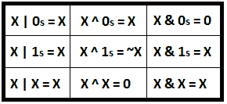

图 9.3–按位提示

慢慢来，探索一下这些技巧。拿一张纸和一支笔，把它们逐一检查一遍。此外，还可以尝试发现其他提示。

## 位移位运算符

在处理位时，移位是一种常见的操作。在这里，我们有**符号左移位**<<、**符号右移位**>>、**符号右移位**>>>。移位用于**字节**（8 位）、**短**（16 位）、**int**（32 位）、**长**（64 位）和**字符**（16 位）；位移位运算符不会抛出异常。

### 有符号左移[<

有符号左移位，或简称左移位，需要两个操作数。左移位获取第一个操作数（左侧操作数）的位模式，并将其向左移位第二个操作数（右侧操作数）给出的位置数。

例如，以下是将 23 向左移动 3 个位置，23<<3 的结果：

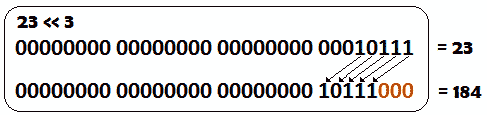

图 9.4–有符号左移

如我们所见，整数 12（10111）的每一位向左移动 3 个位置，而向右的所有位置都自动用零填充。

重要提示

以下是两个在某些情况下非常有用的提示：

1.将一个数字左移*n*位相当于乘以 2n（例如，23<<3 等于 184，相当于 184=23*23）。

2.要移动的位置数自动减少到模 32；也就是说，23<<35 等于 23<

### Java 中的负整数

首先，重要的是要记住，二进制表示本身并不能告诉我们一个数字是否为负数。这意味着计算机需要一些表示负数的规则。通常情况下，计算机以所谓的*二的补码*表示形式存储整数。Java 也使用这种表示。

简言之，*2 的补码*表示采用负数的二进制表示，并翻转（否定）其所有位。之后，它加 1 并将其追加到位号的左侧。如果最左边的位为 1，则数字为负数。否则，它是积极的。

让我们以 4 位整数，-5 为例。符号有一位，值有三位。我们知道 5（正数）表示为 101，而-5（负数）表示为**1**011。这是通过翻转 101 使其变为 010，添加 1 以获得 011，并将其附加到符号位（**1**的左侧以获得**1**011。粗体的 1 是符号位。我们有一位表示符号，三位表示值。

另一种方法是知道作为*n*位数的*-Q*（负*Q*）的二进制表示是通过将 1 与 2n-1–*Q*串联得到的。

### 签名右移[>>]

有符号右移或算术右移[>>]接受两个操作数。有符号右移位获取第一个操作数（左侧操作数）的位模式，并通过保留符号将其向右移位第二个操作数（右侧操作数）给定的位置数。

例如，以下是-75>>1 的结果（-75 是一个 8 位整数，其中符号位是**最高有效位**（**MSB**）：

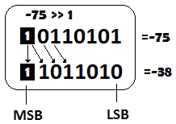

图 9.5–有符号右移

我们可以看到，-75（10110101）的每一位都向右移动了 1 个位置（注意，**最低有效位**（**LSB**）已更改），并且位符号被保留。

重要提示

以下是在某些场景中非常有用的三个提示：

将数字右移*n*位置相当于除以 2n（例如，24>>3 等于 3，相当于 3=24/23）。

要移动的位置数自动减少到模 32；也就是说，23>>35 相当于 23>>（35%32），这相当于 23>>3。

二进制（有符号）中所有 1 的序列表示十进制形式的-1。

### 无符号右移[>>>]

无符号右移位，或逻辑右移位[>>【T3]，接受两个操作数。无符号右移位获取第一个操作数（左侧操作数）的位模式，并按第二个操作数（右侧操作数）给定的位置数将其向右移位。MSB 设置为 0。这意味着，对于正数，有符号和无符号右移返回相同的结果，而负数总是变为正数。

例如，以下是-75>>>1 的结果（-75 是一个 8 位整数，其中符号位是 MSB）：

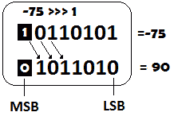

图 9.6–无符号右移

重要提示

要移动的位置数自动减少到模 32；也就是说，23>>>35 相当于 23>>（35%32），这相当于 23>>>3。

现在您已经了解了位移位运算符是什么，是时候解决更多的技巧和技巧了。

## 小窍门

操作 bits 涉及到与 bits 操作员合作时的高超技能，并了解一些技巧和窍门。您已经在本章前面看到了一些提示。现在，让我们再添加一些要点列表：

*   如果我们将一个数与其自身进行偶数次异或运算，那么结果是 0（*x^x=*0；*x^x^x=*（*x^x*）*（*x^x**=*0^0=0）。*
**   如果我们将一个数与其自身进行异或运算奇数次，那么结果就是这个数（*x^x^x=*（*x^*（*x^x*））*=*（*x^*0】*=x；x^x^x^x=*（*x^*（*x^*）*（*x^x*）*=*（*x^*0^0】*=x*）。**   我们可以用*p*>0、*q*>0 计算表达式*p%q*的值，其中*q*是 2 的幂；即*p*&（*q*-1）。您可以看到的一个简单应用程序是*ComputeModuloDivision*。*   对于给定的正整数*p*，如果（*p*&1）！=0，即使（*p*&1）==0，我们说它是奇数。您可以看到的一个简单应用程序是*奇偶*。*   对于两个给定的数*p*和*q*，我们可以说*p*等于*q*if（（*p*^*q*==0）。您可以看到的一个简单应用程序是*CheckEquality*。*   对于两个给定的整数*p*和*q*，我们可以通过*p*=*p*^*q*^（*q*=*p*进行交换。您可以看到的一个简单应用程序是*SwapTwoIntegers*。*

 *好的，现在是解决一些编码挑战的时候了。

# 编码挑战

在接下来的 25 个编码挑战中，我们将利用位操作的不同方面。因为这类问题真的是脑筋急转弯，所以在面试中它们是首选。理解一段处理比特的代码不是一件容易的事情，所以花点时间仔细分析每个问题和代码片段。这是获得一些模式和模板以解决此类问题的唯一方法。

下图包含一组四位掩码，这些掩码在工具带中很重要：

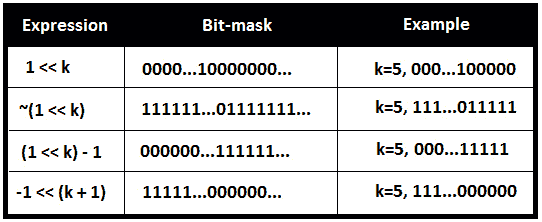

图 9.7–位掩码

它们对于解决需要处理位的各种问题非常有用。

## 编码挑战 1–获取位值

问题 T1：考虑到 T2 T2：32 位整数，AUT T3。编写一段代码，返回给定位置*k*处*n*的位值。

Po.T0.溶液：To T2：n，T2，T3＝423。其二进制表示为 1**1**0100111。我们怎么能说出位置*k*=7 的位的值是多少（位置 7 的粗体位的值为 1）？解决方案包括通过*k*位置（*n*>>*k*位置）将给定数字右移。这样，*k*第位成为位置 0 处的位（1**1**0100111>>7=00000001**1**。接下来，我们可以将 AND[&运算符应用为 1&（*n*T30]>*k*：


图 9.8–二进制表示法

如果位置 0 处的位值为 1，则 AND[&]运算符将返回 1；否则，它将返回 0。在代码方面，我们有以下内容：

```java
public static char getValue(int n, int k) {
  int result = n & (1 << k);
  if (result == 0) {
    return '0';
  }
  return '1';
}
```

另一种方法是将表达式 1&（*n*>>*k*替换为表达式*n*&（1<<*k*）。慢慢来，试着解剖它。完整的应用程序称为*GetBitValue*。

## 编码挑战 2–设置位值

**亚马逊**、**谷歌**、**Adobe**、**微软**、**Flipkart**

问题 T1A:考虑一个 32 位整数，AUT T2。编写一段代码，将给定位置*n*的位值*k*设置为 0 或 1。

Po.T0.溶液：To T2：n，T2，T3＝423。其二进制表示为 1**1**0100111。我们如何将位从位置*k*=7（现在为 1）设置为 0？将逐位运算符表放在我们面前有助于我们看到 AND[&运算符是唯一具有两个操作数的运算符，允许我们写入 1&0=0 或第 7 位&0=0。此外，我们有 1&1=1、0&1=0 和 0&0=0，因此我们可以将位掩码设为 1…101111111 并写入以下内容：


图 9.9–二进制表示法

这正是我们想要的。我们想把第 7 位从 1 变成 0，剩下的保持不变。但是我们如何获得 1…101111。。。面具嗯，有两个小面具你需要知道。首先，一个位掩码，它有一个 1，其余的是 0（10000…）。这可以通过将 1 左移*k*位置来获得（例如，位掩码 1000 可以获得为 1<<3，但如果我们将其表示为 32 位掩码，则获得 00000000000000000000000**1000**。另一个位掩码包含 0，其余为 1s（01111…）。这可以通过将一元逐位补码运算符[~]应用于位掩码 10000。。。。（例如，~（1000）=0111，但如果我们将其表示为 32 位掩码，则得到 111111111111111111111**0111**。所以，我们可以得到 1…101111。。。位掩码为（1<<*k*。最后，我们需要做的就是使用 AND[&操作符，如下代码所示：

```java
public static int setValueTo0(int n, int k) {       
  return n & ~(1 << k);
}
```

如果我们取*k*=3、4 或 6，那么我们得到 0&0=0。

让我们考虑一下，t0＝n1，t1＝295。其二进制表示为 1**0**0100111。我们如何将位从位置*k*=7（现在为 0）设置为 1？将按位运算符表放在前面有助于我们看到 OR[|]和 XOR[^]运算符是具有两个操作数的运算符，这两个操作数允许我们分别写入 0 | 1=1 或 0^1=1。

或者，我们可以写出第七个| 1=1 和第七个^1=1。

通过进一步一步，我们可以看到在 OR[|]运算符的情况下，我们可以编写以下内容：

1 | 1=1，而在 XOR[^]运算符的情况下，我们写 1^1=0。

因为我们想要将第 7 位值从 0 变为 1，所以我们可以使用这两个运算符中的任何一个。然而，如果*k*表示初始值为 1 的位，那么 1^1=0 不再对我们有帮助，而 1|1=1 正是我们想要的。所以在这里，我们应该使用 10000。。。位掩码，如下所示：


图 9.10–二进制表示法

在代码方面，我们有以下内容：

```java
public static int setValueTo1(int n, int k) {       
  return n | (1 << k);
}
```

如果我们取*k*=0、1、2、5 或 8，那么我们得到 1|1=1。

完整的应用程序称为*SetBitValue*。

## 编码挑战 3–清除位

**亚马逊**、**谷歌**、**Adobe**

问题 T1：考虑一个 32 位的 To2 T2 整数。编写一段代码，用于清除 MSB 和给定*k*之间的*n*（将其值设置为 0）位。

Po.T0.溶液：To T2：n，T2，T3＝423。其二进制表示为**110**100111。我们如何清除 MSB 和位置*k*=6 之间的位，以便有 110 位？前面有位运算符表有助于我们看到需要 0001111 类型的位掩码。让我们看看如果在*n*和该位掩码之间应用 AND[&运算符会发生什么：


图 9.11–二进制表示法

因此，我们清除了 MSB 和*k*=6 之间的位。一般来说，我们需要一个位掩码，它在 MSB 和*k*（含）之间包含 0，在*k*（不含）和 LSB 之间包含 1。我们可以通过将 1 的位左移到*k*位置（例如，对于*k*=6，我们得到 1000000）并减去 1 来实现这一点。通过这种方式，我们获得所需的位掩码 011111。因此，在代码方面，我们有以下内容：

```java
public static int clearFromMsb(int n, int k) {        
  return n & ((1 << k) - 1);
}
```

清除给定的*k*和 LSB 之间的位如何？让我向您展示代码：

```java
public static int clearFromPosition(int n, int k) {        
  return n & ~((1 << k) - 1);
}
```

现在，慢慢来，仔细分析这个解决方案。此外，我们可以用以下溶液替换此溶液：*n*&（-1<<（*k*+1））。

同样，使用纸和笔，一步一步地进行。完整的应用程序称为*ClearBits*。

## 编码挑战 4–在纸上对二进制文件求和

问题 T1：考虑几个 T2 的正 32 位整数。拿一支笔和一些纸，告诉我你如何总结他们的二进制表示法。

**注意**：这不是一个编码挑战，但了解它很重要。

**解决方案**：二进制数求和有几种方法。一种简单的方法是执行以下操作：

1.  对当前列的所有位求和（第一列是 LSB 的列）。
2.  将结果转换为二进制（例如，通过连续除以 2）。
3.  保留最右边的位作为结果。
4.  将剩余的位带入其余列（每列一位）。
5.  转到下一列并从*步骤 1*重复。

举个例子就能说明问题。让我们加上 1（1）+9（1001）+29（011101）+124（1111100）=163（10100011）。

下图显示了这些数字相加的结果：


图 9.12–二进制数求和

现在，让我们一步一步地来看看这个（粗体部分被携带）：

*   列 0 上的总和位：1+1+1+0=3=**1**1
*   第 1 列上的总和位：**1**+0+0+0=1=1
*   第 2 列上的和位：0+1+1=2=**1**0
*   第 3 列上的总和位：**1**+1+1+1=4=**10**0
*   第 4 列上的总和位：**0**+1+1=2=**1**0
*   第 5 列和位：**1**+**1**+0+1=3=**1**1
*   第 6 列上的总和位：**1**+1=2=**1**0
*   第 7 列和位：**1**=1=1

所以，的结果是 10100011。

## 编码挑战 5–对代码中的二进制文件求和

问题 T1：考虑两个 32 位整数，即 T2，Q，T3，3，P 4。编写一段代码，使用二进制的表示法计算*q*+*p*。

**解决方案**：我们可以尝试前面编码挑战中提出的算法的实现，或者我们可以尝试另一种方法。该方法引入了一个方程，该方程有助于了解：


注意存在 AND[&]和 XOR[^]位运算符。如果我们用*和*表示*p*&*q*，用*xor*表示*p**q*，那么我们可以这样写：


如果*p*和*q*没有公共位，那么我们可以将其简化为以下内容：


例如，如果*p*=1010 且*q*=0101，则*p*&*q*=0000。由于 2*0000=0，我们仍然使用*p*+*q*=*xor*或*p*+*q*=1111。

但是，如果*p*和*q*有公共位，那么我们必须处理*和*以及*xor*的相加。因此，如果我们强制*和*表达式返回 0，则*和+xor*可以解决。这可以通过递归实现。

通过递归，我们可以将递归的第一步写成：


或者，如果我们表示*和*{1}=2**和*&*xor*和*xor*{1}=2**和*^*xor*，其中{1}表示递归的一步，那么我们可以这样写：


但是这个递归什么时候停止？那么当*和*{*n*表达式中的两个位序列（*p*和*q*的交集返回 0 时，应该停止。因此，在这里，我们强制*和*表达式返回 0。

在代码方面，我们有以下内容：

```java
public static int sum(int q, int p) {
  int xor;
  int and;
  int t;
  and = q & p;
  xor = q ^ p;
  // force 'and' to return 0
  while (and != 0) {
    and = and << 1; // this is multiplication by 2
    // prepare the next step of recursion
    t = xor ^ and;
    and = and & xor;
    xor = t;
  }
  return xor;
}
```

完整的应用程序称为*求和二进制文件*。

## 编码挑战 6–将二进制文件在纸上相乘

问题 T1A:考虑两个 T2 阳性 32 位整数，AUT3，Q，T4，4，P T5。拿几张纸和一支笔，告诉我你是如何将这两个数字的二进制表示法相乘的（*q***p*。

**注意**：这不是一个编码挑战，但了解它很重要。

**解决方案**：当我们将二进制数相乘时，我们必须记住，将二进制数乘以 1 会返回完全相同的二进制数，而将二进制数乘以 0 会返回 0。将两个二进制数相乘的步骤如下：

1.  从最右边的列（第 0 列）开始，将第二个二进制数的每一位乘以第一个二进制数的每一位。
2.  总结结果。

让我们做 124（1111100）*29（011101）=3596（111000001100）。

下图显示了我们的计算结果：


图 9.13–二进制数相乘

因此，我们将 29 的每一位乘以 124 的每一位。接下来，我们总结这些二进制文件，正如您在前面的*编码挑战 4–在纸上总结二进制文件*部分中看到的。

## 编码挑战 7–在代码中乘以二进制文件

**亚马逊**、**谷歌**、**Adobe**

问题 T1：考虑两个 32 位整数，即 T2，Q，T3，3，P 4。编写一段代码，使用二进制的表示法计算*q***p*。

**解决方案**：我们可以尝试前面编码挑战中提出的算法的实现，或者我们可以尝试另一种方法。这种方法首先假设*p*=1，所以这里有*q**1=*q*。我们知道任何*q*乘以 1 就是*q*，所以我们可以说*q**1 跟在下一个和之后（我们从 0 到 30，所以我们忽略位置 31 上的有符号位）：


图 9.14–在代码中乘以二进制文件

例如，如果*q*=5（101），则 5*1=0*230+0*229+…1*22+0*21+1*20=5。

所以，5*1=5。

到目前为止，这还没什么大不了的，但是让我们继续 5*2；也就是说，101*10。如果我们认为 5*2=5*0+10*1，那么这意味着 101*10=101*0+1010*1。所以，我们左移了 5 个位置，右移了 2 个位置。

让我们继续 5*3。这是 101*011。然而，5*3=5*1+10*1。因此它就像 101*1+1010*1。

让我们继续 5*4。这是 101*100。但是，5*4=5*0+10*0+20*1。因此，它类似于 101*0+1010*0+10100*1。

现在，我们可以开始查看遵循以下步骤的模式（最初，*结果*=0）：

1.  If the LSB of *p* is 1, then we write the following:

    

    图 9.15–p 的 LSB 为 1

2.  我们将*q*左移一个位置，将*p*逻辑右移一个位置。
3.  我们从*步骤 1*重复，直到*p*为 0。

如果我们将这三个步骤编入代码，那么我们将获得以下输出：

```java
public static int multiply(int q, int p) {
  int result = 0;
  while (p != 0) {
    // we compute the value of q only when the LSB of p is 1            
    if ((p & 1) != 0) {
      result = result + q;
    }
    q = q << 1;  // q is left shifted with 1 position
    p = p >>> 1; // p is logical right shifted with 1 position
  }
  return result;
}
```

完整的应用程序是称为*乘法二进制文件*。

## 编码挑战 8–在纸上减去二进制文件

问题 T1A:考虑两个正 32 位整数，即 T2，Q，To，T3，和 T4。拿几张纸和一支笔，告诉我你如何减去这两个数字的二进制表示（*q*-*p*。

**注意**：这不是一个编码挑战，但了解它很重要。

**解决方案**：为了计算 0 减 1，可以减少二进制数的减法运算。主要是，我们知道 1 减 1 等于 0，0 减 0 等于 0，1 减 0 等于 1。要计算 0 减去 1，我们必须遵循以下步骤：

1.  从当前列中，我们搜索左列，直到找到 1 位。
2.  我们借用这个位，将它作为两个值 1 放在前一列中。
3.  然后，我们从上一列中借用这两个值 1 中的一个作为 1 中的另两个。
4.  对每列重复*步骤 3*，直到到达当前列。
5.  现在，我们可以进行计算了。
6.  如果我们遇到另一个 0 减 1，那么我们从*步骤 1*重复这个过程。

让我们做 124（1111100）-29（011101）=95（1011111）。

下图显示了我们的计算结果：

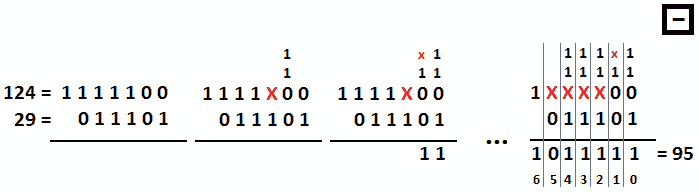

图 9.16–减去二进制数

现在，让我们一步一步来看看：

1.  从列 0 开始，从 0 减 1 开始。我们在左列中搜索，直到找到 1。我们在第 2 列找到它（该位对应于 22=4）。我们在第 1 列借用该位，并将其用作 1 的两个值（换句话说，2 中的两个为 21+21）。我们在列 0 中借用这两个值 1 中的一个（这是 21=2），并将它们用作 1 的另外两个值（换句话说，1 中的两个值是 20+20）。现在，我们可以用 2 减 1 等于 1 来计算。我们写下 1，然后转到第 1 列。
2.  我们继续第 1 列，所以 1 减 0 等于 1。我们写下 1，然后移到第 2 栏。
3.  然后我们继续第 2 列，0 减去 1。我们在左列中搜索，直到找到 1。我们在第 3 列找到它（该位对应于 23=8）。我们从第 2 列借用该位，并将其用作 1 的两个值（换句话说，2 中的 2 是 22+22）。现在，我们可以用 2 减 1 等于 1 来计算。我们写下 1，然后移到第 3 栏。
4.  我们继续第 3 列，0 减去 1。我们在左列中搜索，直到找到 1。我们在第 4 列找到它（该位对应于 24=16）。我们借用第 3 列中的这一位，并将其用作 1 的两个值（换句话说，2 中的 2 是 23+23）。现在，我们可以用 2 减 1 等于 1 来计算。我们写下 1，然后转到第 4 栏。
5.  我们继续第 4 列，0 减去 1。我们在左列中搜索，直到找到 1。我们在第 5 列找到它（该位对应于 25=32）。我们借用第 4 列中的位，将其用作 1 的两个值（换句话说，2 中的两个为 24+24）。现在，我们可以用 2 减 1 等于 1 来计算。我们写下 1，然后转到第 5 列。
6.  我们继续第 5 列，所以是 0 减去 0。我们写下 0，然后移到第 6 列。
7.  我们继续第 6 列，所以是 1 减 0。我们写下 1，然后我们就完成了。

结果是 1011111。

## 编码挑战 9–在代码中减去二进制文件

问题 T1A:考虑两个 32 位的 To2 T2，整数，3，3，q，4，4 和 5。编写一段代码，使用二进制表示法计算*q-p*。

**解决方案**：从之前的编码挑战中我们已经知道，减去二进制数可以简化为计算 0 减去 1。此外，我们知道如何使用*借用*技术求解 0 减去 1。除了借用技巧之外，重要的是要注意|*q-p*|=*q*^*p*；例如：

|1-1 |=1^1=0，| 1-0 |=1^0=1，| 0-1 |=0^1=1 和| 0-0 |=0^0=0。

基于这两条语句，我们可以实现两个二进制文件的减法，如下所示：

```java
public static int subtract(int q, int p) {
  while (p != 0) {
    // borrow the unset bits of q AND set bits of p
    int borrow = (~q) & p;
    // subtraction of bits of q and p 
    // where at least one of the bits is not set
    q = q ^ p;
    // left shift borrow by one position            
    p = borrow << 1;
  }
  return q;
}
```

完整的应用程序称为*减法二进制文件*。

## 编码挑战 10–在纸上分割二进制文件

问题 T1：考虑两个正 32 位整数，即 T2，Q，T3，3，P 4。拿几张纸和一支笔，让我看看你是如何将这两个数字的二进制表示法（*q*/*p*）分开的。

**注意**：这不是一个编码挑战，但了解它很重要。

**解决方案**：在二进制除法中，只有两种可能：0 或 1。除法包括*股息*（*q*）、*除数*（*p*）*、*商*商*和*余数*。例如，我们知道 11（被除数）/2（除数）=5（商）1（余数）。或者，在二进制表示中，我们有 1011（被除数）/10（除数）=101（商）1（余数）

我们首先将除数与股息的 MSB 进行比较（我们称之为*次级股息*，并执行以下操作：

a、 如果除数不适合分红利（除数>分红利），那么我们在商后面加上 0。

a、 a）我们将股息的下一位附加到子股息上，并从*步骤 a*继续。

b、 如果除数与次除数相匹配（除数<=次除数），那么我们在商后面加上 1。

b、 a）我们从当前次级股息中减去除数。

b、 b）我们将被除数的下一位附加到减法结果上（这是新的子除数），并从*步骤 a**重复。*

c、 当我们处理了被除数的所有位后，我们应该得到商和余数，这是除法的结果。

c、 a）我们可以停在这里，用得到的商和余数表示结果。

c、 b）我们可以在商上加一个点（“**”、**），在当前余数上加一个 0（这是新的子股息），然后从*步骤 a*继续，直到余数为 0 或者我们对结果感到满意。

下图表示 11/2 分区：

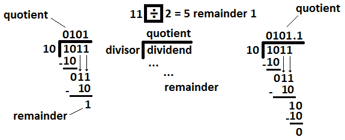

图 9.17–二进制数的除法

现在，让我们一步一步地看这个（集中在前面图表的左侧）：

*   次级股息=1，10>1，因为 2>1，所以我们在商后面加上 0。
*   次级股息=10，10=10，因为 2=2，所以我们在商后面加上 1。
*   做减法，10-10=0。
*   次级股息=01，10>01，因为 2>1，所以我们在商后面加上 0。
*   次级股息=011，10<011，因为 2<3，所以我们在商后面加 1。
*   做减法，011-10=1。
*   被除数的处理没有更多的位，因此我们可以说 11/2 有商 101（即 5），余数是 1。

如果你看上图的右侧，你会发现我们可以通过应用给定的*步骤 c.b*继续计算，直到余数为 0。

## 编码挑战 11–在代码中划分二进制文件

**亚马逊**、**谷歌**、**Adobe**

问题 T1：考虑两个 32 位整数，即 T2，Q，T3，3，P 4。编写一段代码，使用二进制的表示法计算*q*/*p*。

**解决方案**：有几种方法可以用来分割两个二进制文件。让我们专注于实现一个只计算商的解决方案，这意味着我们跳过余数。

这种方法非常简单。我们知道一个 32 位整数包含的位对我们来说是 31 到 0 之间的。我们所要做的就是将除数（*p*左移*i*位置（*i*=31,30,29，…，2,1,0），然后检查结果是否小于被除数（*q*。每次我们找到这样的位，我们都会更新第*i*位的位置。我们累积结果并将其传递到下一个位置。以下代码不言自明：

```java
private static final int MAX_BIT = 31;
...
public static long divideWithoutRemainder(long q, long p) {
  // obtain the sign of the division
  long sign = ((q < 0) ^ (p < 0)) ? -1 : 1;
  // ensure that q and p are positive
  q = Math.abs(q);
  p = Math.abs(p);
  long t = 0;
  long quotient = 0;
  for (int i = MAX_BIT; i >= 0; --i) {
    long halfdown = t + (p << i);
    if (halfdown <= q) {
      t = t + p << i;
      quotient = quotient | 1L << i;
    }
  }
  return sign * quotient;
}
```

完整的应用程序称为*DividingBinaries*。它还包含计算余数的实现。

## 编码挑战 12–替换位

**亚马逊**、**谷歌**、**Adobe**

问题 T1 题：考虑两个正项 T2，32 位整数，O.T3，Q，T4，To，T5，P，T6，2 位，AUT T7。编写一段代码，将位置*i*和*j*之间的*q*中的位替换为*p*的位。您可以假设，在*i*和*j 之间，*有足够的空间容纳*p*的所有位。

Po.T0.解决方案 To1 T1：让我们考虑，T2 T2，Q，T3，Ty＝4914（二进制，1001100110010），Po.T4，P，Po.T5，To＝63（二元，111111），Apple T6。下图显示了我们拥有的以及我们想要获得的：

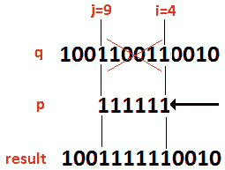

图 9.18–替换 i 和 j 之间的位

正如我们所看到的，解决方案应该完成三个主要步骤。首先，我们需要清除*i*和*j*之间的*q*位。第二，我们需要通过*i*位置左移*p*（这样，我们将*p*放置在右侧位置）。最后，我们将*p*和*q*合并在最终结果中。

为了清除*i*和*j*之间的*q*位（将这些位设置为 0，无论其初始值如何），我们可以使用 and[&运算符。我们知道只有 1&1 返回 1，所以如果我们有一个在*i*和*j*之间包含 0 的位掩码，那么*q*&*位掩码*将导致自 1&起在【T14 i 和*j*之间只包含 0 的位序列 0 和 0&0 都是 0。此外，在位掩码的 MSB 和*j*（独占）以及*i*（独占）和 LSB 之间，我们应该只有值 1。这样，*q*&*位掩码*将保留*q*位，因为 1&1=1 和 0&1=0。所以，我们的位掩码应该是 1110000001111。让我们在工作中看到它：


图 9.19–位掩码（a）

但是我们怎么才能得到这个面具呢？我们可以通过 OR[|]运算符获得它，如下所示：


图 9.20–位掩码（b）

1110000000000 位掩码可通过将-1 左移*j*+1 个位置获得，而 000000000 1111 位掩码可通过将 1 左移*i*个位置并减去 1 获得。

在这里，我们解决了前两个步骤。最后，我们需要将*p*放在正确的位置。这很简单：我们只是在*i*位置左移*p*。最后，我们在*q*之间应用 OR[|]运算符，清除位在*i*和*j*之间，移位的*p*：


图 9.21–二进制表示法

我们完了！现在，让我们将其转化为代码：

```java
public static int replace(int q, int p, int i, int j) {
  int ones = ~0; // 11111111 11111111 11111111 11111111          
  int leftShiftJ = ones << (j + 1);
  int leftShiftI = ((1 << i) - 1);
  int mask = leftShiftJ | leftShiftI;
  int applyMaskToQ = q & mask;
  int bringPInPlace = p << i;
  return applyMaskToQ | bringPInPlace;
}
```

完整的应用程序被称为*替换位*。

## 编码挑战 13–1 的最长序列

**亚马逊**、**Adobe**、**微软**、**Flipkart**

问题 T1A:考虑一个 32 位整数，AUT T2。101 的序列可视为 111。编写一段代码，计算 1 的最长序列的长度。

**解决方案**：我们将看几个示例（以下三列表示整数及其二进制表示，以及最长序列 1 的长度）：


图 9.22–三个示例

如果我们知道*n*的 LSB 为 1 时*n*1=1，如果*n*的 LSB 为 0 时*n*n&0=0，那么这个问题的解决方案是很容易实现的。让我们关注第一个示例 67534（100000**11111**001110）。在这里，我们执行以下操作：

*   初始化最长序列=0。
*   申请并[&]：100000**11111**001110&1=0，最长序列=0。
*   右移并应用[&]：100000**11111**00111&1=1，最长顺序=1。
*   右移并应用[&]：100000**11111**0011&1=1，最长顺序=2。
*   右移并应用[&]：100000**11111**001&1=1，最长顺序=3。
*   右移并应用[&]：100000**11111**00&1=0，最长顺序=0
*   右移并应用[&]：100000**11111**0&1=0，最长顺序=0。
*   右移并应用和[&]：100000**11111**&1=1，最长顺序=1。
*   右移并应用和[&]：100000**1111**&1=1，最长顺序=2。
*   右移并应用和[&]：100000**111**&1=1，最长顺序=3。
*   右移并应用和[&]：100000**11**&1=1，最长顺序=4。
*   右移并应用[&]：100000**1**&1=1，最长顺序=5。
*   右移并应用和[&]：100000&1=0，最长序列=0。

因此，只要我们在最长的 1 序列中没有任何 0 交错，我们就可以实现前面的方法。然而，这种方法不适用于第三种情况，即 339809（10100**101111011**00001）。在这里，我们需要做一些额外的检查；否则，最长序列的长度将等于 4。但由于 101 可以被视为 111，正确答案是 9。这意味着当我们有*n*&1=0 时，我们必须执行以下检查（主要是检查 0 的当前位是否由 1 的两个位作为 101 进行保护）：

*   检查下一位是否为 1 或 0，（*n*&2）==1 或 0
*   如果下一位为 1，则检查前一位是否为 1

我们可以将其转化为代码，如下所示：

```java
public static int sequence(int n) {
  if (~n == 0) {
    return Integer.SIZE; // 32
  }
  int currentSequence = 0;
  int longestSequence = 0;
  boolean flag = true;
  while (n != 0) {
    if ((n & 1) == 1) {
      currentSequence++;
      flag = false;
    } else if ((n & 1) == 0) {
      currentSequence = ((n & 0b10) == 0) // 0b10 = 2
        ? 0 : flag 
        ? 0 : ++currentSequence;
      flag = true;
    }
    longestSequence = Math.max(
      currentSequence, longestSequence);
    n >>>= 1;
  }
  return longestSequence;
}
```

完整的应用程序是称为*最长序列*。

## 编码挑战 14–下一个和上一个数字

**Adobe**、**微软**

问题 T1A:考虑一个 32 位整数，AUT T2。编写一段代码，返回下一个最大的数字，包含完全相同的 1 位数字。

Po.T0.溶液：To T2，n，T3，124344＝11110010110111000。要获得另一个具有相同 1 位数字的数字，我们必须翻转 1 位将其转换为 0，再翻转 0 位将其转换为 1。结果数字将不同于给定数字，并包含相同数量的 1 位。现在，如果我们希望这个数字大于给定的数字，那么从 0 翻转到 1 的位应该在从 1 翻转到 0 的位的左边。换言之，如果有两个位位置*i*和*j*，并且将*i*位置的位从 1 翻转到 0，将*j*位置的位从 0 翻转到 1，这将导致新的数字小于给定的数字，如果*i>j*，而如果*i<j*分别较大。

这意味着我们必须找到 0 的第一位，它的右边不只是零（换句话说，非尾随零的第一位）。这样，如果我们将这个位从 0 翻转到 1，那么我们知道在这个位的右边至少有一个 1 的位可以从 1 翻转到 0。这意味着我们用相同数量的 1 位获得一个更大的数字。下图以图形形式显示了这些数字：

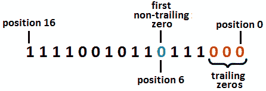

图 9.23–非尾随零位

因此，对于我们的数字，第一个非尾随零位于第 6 位。如果我们将这个位从 0 翻转到 1，那么得到的数字比给定的数字大。但是现在，我们必须从这个位的右边选择一个位，它将从 1 翻转到 0。基本上，我们必须在位置 3、4 和 5 的位之间进行选择。然而，这是正确的逻辑吗？请记住，我们必须返回下一个最大的数字，而不是大于给定数字的任何数字。在位置 5 翻转位比从位置 3 或 4 翻转位要好，但这不是第二大数字。检查以下关系（下标是对应于二进制表示的十进制值）：


图 9.24——几种关系

到目前为止，我们可以得出结论 1111001011**10**11000124376 看起来是正确的选择。然而，我们也应注意以下几点：

1111001011**10**11000124376>11110010111000011124355

因此，如果我们计算位置 6（独占）和 0 之间 1 的位数（让我们用*k*=3 表示），清除位置 6（独占）和 0 之间的所有位数（将它们设置为 0），并在位置*k*-1 和 0 之间将*k*-1 位设置为 1，则得到下一个最大的数字。

好啊到目前为止，一切都很好！现在，让我们把这个算法编成代码。首先，我们需要找到非尾随零的第一位的位置。这意味着我们需要将尾随零的计数与 1 的计数相加，直到得到第一个 0。计算尾随零的方法如下（我们正在制作一份*n*的副本，因为我们不想移动给定数字的位）：

```java
int copyn = n;
int zeros = 0;
while ((copyn != 0) && ((copyn & 1) == 0)) {
  zeros++;
  copyn = copyn >> 1;
}
```

按如下方式计算 1，直到第一个 0：

```java
int ones=0;
while ((copyn & 1) == 1) {
  ones++;
  copyn = copyn >> 1;
}
```

现在，**标记=0+1**给我们搜索的位置。接下来，我们将位从该位置从 0 翻转到 1，并清除该位置（独占）和 0 之间的所有位：

```java
n = n | (1 << marker);
```

在我们的例子中，**标记**=6。该线的效应产生以下输出：


图 9.25–输出（1）

```java
n = n & (-1 << marker);
```


图 9.26–输出（2）

最后，我们将位设置在（**个**-1）和 0 到 1 之间：

```java
n = n | (1 << (ones - 1)) - 1;
```

在我们的例子中，**个**=3。该行的效果产生以下输出：


图 9.27–输出（3）

因此，最终的结果是 11110010111000011，即 124355。因此，最终的方法如下所示：

```java
public static int next(int n) {
  int copyn = n;
  int zeros = 0;
  int ones = 0;
  // count trailing 0s
  while ((copyn != 0) && ((copyn & 1) == 0)) {
    zeros++;
    copyn = copyn >> 1;
  }
  // count all 1s until first 0
  while ((copyn & 1) == 1) {
    ones++;
    copyn = copyn >> 1;
  }
  // the 1111...000... is the biggest number 
  // without adding more 1
  if (zeros + ones == 0 || zeros + ones == 31) {
    return -1;
  }
  int marker = zeros + ones;
  n = n | (1 << marker);
  n = n & (-1 << marker);
  n = n | (1 << (ones - 1)) - 1;
  return n;
}
```

完整的应用程序称为*下一个编号*。它还包含一个方法，该方法返回下一个最小的数字，该数字包含完全相同数量的 1 位。接受挑战，尝试自己提供解决方案。完成后，只需将您的解决方案与捆绑代码中的解决方案对抗即可。作为提示，您将需要尾随 1 的数量（让我们用*k*表示），以及尾随 1 左侧的 0 数量，直到您到达第一个 1 为止。将这些值相加将得到应该从 1 翻转到 0 的位的位置。接下来，清除该位置右侧的所有位，并立即将该位置右侧的（*k*+1）位设置为 1。

## 编码挑战 15–转换

**亚马逊**、**谷歌**、**Adobe**

问题 T1：考虑两个 T2 阳性 32 位的 T3，整数，T4，Q，T5，5 和 P5。写一段代码，计算我们应该在*q*中翻转的位数，以便将其转换为*p*。

**解决方案**：如果我们观察到 XOR[^]运算符仅在操作数不同时返回 1，那么这个问题的解决方案就变得清晰了。让我们考虑一下，T2，q，T3，Ty＝290932（100011100000111010）和 Po.T4，P，T5，To＝352345（101011000000101100）。让我们应用 XOR[^]运算符：


图 9.28–转换

换句话说，如果我们用*xor*（*xor*=*q*^*p*，来表示*q*^*p*，那么我们所要做的就是计算*xor*中 1 的位数（在我们的示例中，1 中有 6 位）。这可以使用 AND[&运算符来完成，AND[运算符只为 1&1=1 返回 1，因此我们可以为*异或*中的每一位计算*异或*异或&1。每次比较后，我们将*异或*右移一个位置。代码本身就说明了：

```java
public static int count(int q, int p) {
  int count = 0;
  // each 1 represents a bit that is 
  // different between q and p
  int xor = q ^ p;
  while (xor != 0) {
    count += xor & 1; // only 1 & 1 = 1
    xor = xor >> 1;
  }
  return count;
}
```

完整的申请称为*转换*。

## 编码挑战 16–最大化表达式

问题 T1 题：考虑两个 T2 的正 32 位整数，AUT3，Q，T4，T4，P To.T6.≠ P 使表达式（*q*和*s*）（*p*和*s*最大化的*q*和*p*之间的关系是什么，其中和是逻辑运算符[&？

**解决方案**：这类问题听起来很难，但非常简单。让我们从一个简单的*a*b*开始。*a*b*何时达到最大值？好吧，让我们考虑一下这个问题。*a**4 何时达到最大值？让我们编写一些测试用例：

*a*=1，1*4=4

*a*=2，2*4=8

*a*=3，3*4=12

*a*=4，4*4=16

所以，当*a=b*时，我们已经达到最大值 16。但是，*a*可以是 5，5*4=20>16。这是正确的，但这意味着*b*也可以是 5，所以 5*5=，25>20。这与数学演示相去甚远，但我们可以注意到，如果*a=b*，则*a*b*处于最大值。

对于那些对数学演示感兴趣的人，假设我们有以下内容：


图 9.29–最大化表达式（1）

这意味着我们有以下几点：


图 9.30–最大化表达式（2）

此外，这意味着我们有以下几点：


图 9.31–最大化表达式（3）

现在，如果我们说当*a=b*时*a*b*是最大值，那么让我们表示*a*=（*q*和*s*和*b*=（【t12p 和*s*。因此，（*q*和*s*）（*p*和*s*在（*q*和*s*＝（*p*和*s*时达到最大值。

让我们考虑，T0，T0，T1，Ty＝822（1100110110）和 Po.T2，P，T3，To＝663（1010010111）。*q*的 LSB 为 0，而*p*的 LSB 为 1，因此我们可以写以下内容：

（1 和*s*=（0 和*s*）→ *s*=0→ （1&0）=（0&0）=0

如果我们将*q*和*p*右移 1 位，那么我们发现*q*的 LSB 为 1，*p*的 LSB 为 1：


图 9.32–按 1 个位置右移 q 和 p

在这里，我们还有两个病例可以通过以下方式进行插管：


图 9.33–两个案例

在这里，我们可以看到我们问题的答案是*q*&*p=s*。让我们在工作中看到这一点：


图 9.34–答案

答案是 100001110，也就是 534。这意味着（822 和 534）=（663 和 534）。

## 编码挑战 17–交换奇偶位

**Adobe**、**微软**、**Flipkart**

问题 T1：考虑一个 T2 的正 32 位整数。编写一段代码，交换这个整数的奇偶位。

Po.T0.溶液：To T2，n，T3，663＝1010010111。如果我们手动执行掉期，那么我们应该获得 0101101011。我们可以通过两个步骤来实现这一点：

1.  我们取奇数位，将它们向右移动一个位置。
2.  我们取偶数位，将它们向左移动一个位置。

但我们如何才能做到这一点呢？

我们可以通过 AND[&]运算符和位掩码获取奇数位，该位掩码在奇数位置包含 1 位：10101010101010101010101010。让我们看看这一点：


图 9.35–交换奇偶位（1）

结果显示 1010010111 在位置 1、7 和 9 处包含 1 的奇数位。接下来，我们将结果 1010000010 向右移动一个位置。结果是 0101000001。

我们可以通过 AND[&]运算符和位掩码获取偶数位，该位掩码包含偶数位置的 1 位：1010101010101010101010101。让我们看看这一点：


图 9.36–交换奇偶位（2）

结果显示 1010010111 在位置 0、2 和 4 处包含 1 的偶数位。接下来，我们将结果 0000010101 向左移动一个位置。这将导致 000010010。

要获得最终结果，我们只需要对这两个结果应用 OR[|]运算符：


图 9.37–最终结果

最终结果是 0101101011。实现遵循以下步骤*ad litteram*，所以这是简单的：

```java
public static int swap(int n) {
  int moveToEvenPositions
    = (n & 0b10101010101010101010101010101010) >>> 1;
  int moveToOddPositions
    = (n & 0b1010101010101010101010101010101) << 1;
  return moveToEvenPositions | moveToOddPositions;
}
```

完整的应用程序称为*SwapOddEven*。

## 编码挑战 18–旋转位

**亚马逊**、**谷歌**、**Adobe**、**微软**、**Flipkart**

问题 T1：考虑一个正的 32 位整数，ORT T2。编写一段将*k*位向左或向右旋转的代码。通过旋转，我们了解到在二进制表示的一端脱落的位被发送到的另一端。因此，在左旋转中，从左端掉下来的比特被发送到右端，而在右旋转中，从右端掉下来的比特被发送到左端。

**解决方案**：让我们关注左旋转（通常，右旋转解决方案是镜像左旋转解决方案）。我们已经知道，通过将*k*位向左移动，我们将位向左移动，空点用零填充。然而，代替这些零，我们必须把从左端掉下来的位放进去。

让我们考虑一下，T0，T1，T1＝423099897（000 011001001111111110111111001）和 PoT T2，k Ont3＝10＝10，所以我们向左旋转了 10 位。下图突出显示了下降位和最终结果：


图 9.38–左旋转钻头

上图给出了解决方案。如果我们仔细观察 b）点和 c）点，我们将看到最终结果中会出现掉落的碎片。该结果可通过将下降位右移 32-10=22 个位置来获得。

因此，如果我们将*n*左移 10 个位置，我们将得到一个二进制表示，在右侧用零填充（如上图中的 b 点或下一个除法的除数）。如果我们将*n*右移 22 个位置，我们将获得一个在左侧填充有零的二进制表示（作为下一个除法的除数）。此时，OR[|]操作符进入场景，如以下示例所示：

![Figure 9.39 OR [|] Operator ](img/Figure_9.39_B15403.jpg)

图 9.39–应用 OR[|]运算符

左旋转的最终结果为 110111111011110010001100100。现在，我们可以很容易地将其转化为代码，如下所示：

```java
public static int leftRotate(int n, int bits) {
  int fallBits = n << bits;
  int fallBitsShiftToRight = n >> (MAX_INT_BITS - bits);
  return fallBits | fallBitsShiftToRight;
}
```

现在，通过实施正确的轮换来挑战自己。

对于正确的循环，代码如下所示（您应该能够遵循此解决方案而不会出现任何问题）：

```java
public static int rightRotate(int n, int bits) {
  int fallBits = n >> bits;
  int fallBitsShiftToLeft = n << (MAX_INT_BITS - bits);
  return fallBits | fallBitsShiftToLeft;
}
```

完整的应用程序称为*RotateBits*。

## 编码挑战 19–计算数字

问题 T1A.问题：考虑两个 T2 的位置，AUTT3。编写一段代码，返回一个 32 位整数，其中包含介于*i*（含）和*j*（含）之间的 1（set），其余位为 0（未设置）。

Po.T0.溶液：To T2：我认为 T3，T3＝3，而 T4，J，Ty5 T5＝7。我们知道所需的 32 位整数是 248，或者，在二进制表示中是 11111000（或者全部为 0，00000000000000000000000011111000）。

如果您注意到*编码挑战 8–减去纸面上的二进制文件，*那么您应该知道 0 减去 1 是一个可以通过*从当前位左侧借用*位来完成的操作。*借用*技术向左传播，直到找到 1 位。此外，如果我们记住 1 减 0 等于 1，那么我们可以写出以下减法：

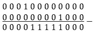

图 9.40–减法

看看这个减法的结果。1 正好位于位置*i*=3（含）和*j*=7（含）之间。这正是我们要找的数字：248。股息和除数分别通过*（*j*+1）位和*i*位左移 1 得到。*

 *有了这些语句，很容易将它们转换成代码：

```java
public static int setBetween(int left, int right) {
  return (1 << (right + 1)) - (1 << left);
}
```

完整的应用程序名为*NumberWithOneInLR*。

## 编码挑战 20–独特元素

**亚马逊**、**谷歌**、**Adobe**、**微软**、**Flipkart**

问题 T1：考虑一个给定的整数数组。这个数组中的每个元素正好出现三次，除了一个元素只出现一次。这使得它独一无二。写一段代码，在 O（n）复杂度时间和 O（1）额外空间中找到这个独特的元素。

Po.T0.解 To1 T1：让我们考虑给定的数组是 Po.t2。ARR ORD T3＝{= 4, 4, 3，1, 7, 7，7, 1, 1，4 }，所以 3 是唯一的元素。如果我们写下这些数字的二进制表示，我们会得到以下结果：100100011001111111111111001001100。现在，让我们对相同位置的位求和，并检查得到的和是否是 3 的倍数，如下所示：

*   前位%3 的总和=0+0+1+1+1+1+1+1+1+0=7%3=1
*   第二位%3 的和=0+0+1+0+1+1+0+0+0=4%3=1
*   第三位的总和%3=1+1+0+0+1+1+1+0+0+1=6%3=0

唯一编号为 011=3。

让我们来看另一个例子。这次，*arr*={51,14,14,51,98,7,14,98,51,98}，所以 7 是唯一的元素。让我们将之前使用的相同逻辑应用于二进制表示：110011101110110111001111111111100010 1111111110101100010。这一次，让我们使用一个图表，因为这使事情更清楚：


图 9.41–在给定数组中查找唯一元素

因此，基于这两个示例，我们可以详细阐述以下算法：

1.  将相同位置上的位相加。
2.  对于每个*和*，计算模量 3。
3.  如果*和*%3=0（*和*是 3 的倍数），这意味着在给定元素中出现三次的元素中设置位。
4.  如果*总和*%3！=0（*和*不是 3 的倍数），这意味着该位在出现一次的元素中设置（**但不确定该位是未设置还是在出现三次的元素中设置**。
5.  我们必须对所有给定元素和位的所有位置重复*步骤 1*、*2*和*3*。通过这样做，我们将得到只出现一次的元素，正如您在上图中所看到的。

其代码如下：

```java
private static final int INT_SIZE = 32;
public static int unique(int arr[]) {
  int n = arr.length;
  int result = 0;
  int nr;
  int sumBits;
  // iterate through every bit 
  for (int i = 0; i < INT_SIZE; i++) {
    // compute the sum of set bits at 
    // ith position in all array
    sumBits = 0;
    nr = (1 << i);
    for (int j = 0; j < n; j++) {
      if ((arr[j] & nr) == 0) {
        sumBits++;
      }
    }
    // the sum not multiple of 3 are the 
    // bits of the unique number
    if ((sumBits % 3) == 0) {                
      result = result | nr;
    }
  }
  return result;
}
```

这是解决这个问题的一种方法。另一种方法是，当对同一个数字应用两次 XOR[^]运算符时，返回 0。此外，XOR[^]运算符是关联的（无论分组如何，都给出相同的结果：1^1^2^2=1^2^1^2=0）和可交换的（与顺序无关：1^2=2^1）。但是，如果我们对相同的数字进行三次异或[^]，那么结果将是相同的数字，因此在这里对所有数字使用异或[^]将没有帮助。但是，我们可以采用以下算法：

使用变量可注意该变量是第一次出现的。

1.  对于每个新元素，将其 XOR[^]放在一个变量中，**oneAppearance**。
2.  如果该元素再次出现，那么它将从**一个外观**中删除，我们将它的 XOR[^]放在另一个变量**两个外观**中。
3.  如果该元素第三次出现，则该元素将从**一个外观**和**两个外观**中删除。**一个外观**和**两个外观**变量变为 0，我们开始寻找新元素。
4.  对于所有出现三次的元素，**一个外观**和**两个外观**变量将为 0。另一方面，对于只出现一次的元素，**oneAppearance**变量将设置该值。

就代码而言，这看起来如下所示：

```java
public static int unique(int arr[]) {
  int oneAppearance = 0;
  int twoAppearances = 0;
  for (int i = 0; i < arr.length; i++) {
    twoAppearances = twoAppearances
        | (oneAppearance & arr[i]);
    oneAppearance = oneAppearance ^ arr[i];
    int neutraliser = ~(oneAppearance & twoAppearances);
    oneAppearance = oneAppearance & neutraliser;
    twoAppearances = twoAppearances & neutraliser;
  }
  return oneAppearance;
}
```

这段代码的运行时是 O（n）加上 O（1）额外时间。完整的应用程序称为*oncetwice 三次*。

## 编码挑战 21–查找重复项

**亚马逊**、**谷歌**、**Adobe**、**微软**、**Flipkart**

问题 T1：考虑到你得到一个整数数组，从 1 到 Ty2 T2 阿纳尔 T3，其中，To4 T4 n n T5 的最多可以是 32000。数组可能包含重复项，您不知道*n*的值。编写一段代码，只使用 4KB 内存打印给定数组中的所有副本。

**解决方案**：解决方案应该从 4KB 内存相当于 4*8*210 位的事实开始。由于 4*8*210 大于 32000，我们可以创建 32000 位的向量，并将每个整数表示为 1 位。没有必要为位向量编写我们自己的实现；我们可以简单地使用 Java 内置的**位集**类（这个类实现了一个根据需要增长的位向量）。

使用**位集**，我们可以迭代给定的数组，并且对于每个遍历的元素，将相应索引的位从 0 翻转到 1。如果我们试图翻转一个已经是 1 的位，那么我们会找到并打印一个副本。这方面的代码非常简单：

```java
  private static final int MAX_N = 32000;
  public static void printDuplicates(int[] arr) {
    BitSet bitArr = new BitSet(MAX_N);
    for (int i = 0; i < arr.length; i++) {
      int nr = arr[i];
      if (bitArr.get(nr)) {                
        System.out.println("Duplicate: " + nr);
      } else {
        bitArr.set(nr);
      }
    }
  }
```

完整的应用程序称为*FindDuplicates*。

## 编码挑战 22–两个非重复元素

**亚马逊**、**谷歌**、**Adobe**

问题 T1：考虑到一个整数数组，包含 2 个阿纳尔 T3，n 个 T4 个+ 2 个元素。2 个*n*元素是重复一次的*n*元素。因此，2*n*中的每个元素在给定的数组中出现两次。其余两个元素只显示一次。编写一段代码来查找这两个元素。

Po.T0.解 To1 T1：让我们考虑给定的数组是 Po.t2。ARR ORD T3 TURE＝{ 2, 7, 1，5, 9, 4，1, 2, 5，4 }。我们要找的两个数字是 7 和 9。这两个数字在数组中只显示一次，而 2、1、5 和 4 显示两次。

如果我们考虑蛮力方法，那么迭代数组并检查每个元素的出现次数是非常直观的。但是采访者不会对这个解决方案印象深刻，因为它的运行时间是 O（n2）。

另一种方法是对给定数组进行排序。通过这种方式，重复的元素被分组在一起，以便我们可以计算每个组的出现次数。大小为 1 的组表示一个不重复的值。在寻找更好的解决方案的过程中，最好提及这种方法。

更好的解决方案依赖于*散列*。创建一个**映射<***元素***、***计数***>**并用元素和出现次数填充它（例如，对于我们的数据，我们将有以下几对：（2,2）、（7,1）、（1,2）、（5,2）、（9,1）和（4,2））。现在，遍历地图并找到计数为 1 的元素。在寻找更好的解决方案的过程中，最好提及这种方法。

在本章中，我们讨论的是位，因此最好的解决方案应该依赖于位操作。此解决方案依赖于 XOR[^]运算符和我们在*提示和技巧*部分中提到的提示：

*   如果我们将一个数字与其自身进行偶数次异或运算，那么结果如下 0（*x*^*x*=0；*x*^*x*^*x*^*x*=（【T12 x^【T14 x】^*x*x*^*） = 0 ^ 0 = 0)**

另一方面，如果我们对两个不同的数字*p*和*q*应用异或[^]运算符，则结果是一个数字，其中包含位于*p*和*q*不同位置的一组位（1 位）。这意味着，如果我们对数组中的所有元素应用异或[^]，那么所有重复元素都将彼此无效。

因此，如果我们取 XOR[^]结果的任何集合位（例如，最右边的位）并将数组的元素划分为两个集合，那么一个集合将包含具有相同位集合的元素，另一个集合将包含具有相同未设置位的元素。换句话说，我们通过比较 XOR[^]最右边的集合位与每个元素中相同位置的位，将元素划分为两个集合。这样，我们将在一组中获得*p*，在另一组中获得*q*。

现在，如果我们对第一个集合中的所有元素应用 XOR[^]操作符，那么我们将得到第一个非重复元素。在另一个集合中执行相同操作将获得第二个非重复元素。

让我们把这个流应用到我们的数据上，*arr*={2,7,1,5,9,4,1,2,5,4}。因此，7 和 9 是非重复值。首先，我们将 XOR[^]运算符应用于所有数字：

*异或*=2^7^1^5^9^4^1^2^5^4=0010（2）^0111（7）^0001（1）^0101（5）^1001（9）^0100（4）^0010（2）^0101（5）^0100（4）=1110=7^9=0111&1001=1110=14。

那么，7^9！=如果 7，则为 0！=9 因此，将至少有一个设置位（1 的至少一个位）。我们可以接受任何设置位，但最右边的位作为*xor*&（*xor*-1）非常简单。我们有 1110&~（1101）=1110&0010=0010。请随意选择任何其他设置位。

到目前为止，我们在这两个数字（7 和 9）的异或[^]中发现了这个集合位（0010），所以这个位必须出现在 7 或 9 中（在本例中，它出现在 7 中）。接下来，通过比较 XOR[^]最右边的集合位与每个元素中相同位置的位，将元素划分为两个集合。我们得到第一个集合，包含元素{2,7,2}，第二个集合，包含元素{1,5,9,4,1,5,4}。由于 2、7 和 2 包含集合位，因此它们位于第一个集合中，而 1、5、9、4、1、5 和 4 不包含集合位，这意味着它们是第二个集合的一部分。

这样，我们就把一个集合中的第一个非重复元素（7）分离出来，把第二个非重复元素（9）放到另一个集合中。此外，每个重复的元素将在相同的位表示集合中（例如，{2，2}将始终在相同的集合中）。

最后，我们对每个集合应用 XOR[^]。因此，我们有*xor_first_set*=2^7^2=010^111^010=111=7（第一个非重复元素）。

对于第二组，我们有：

*异或第二集*=1^5^9^4^1^5^4=0001^0101^1001^0100^0001^0101^0100=1001=9（第二个非重复元素）。

完成！

就代码而言，我们有以下几点：

```java
public static void findNonRepeatable(int arr[]) {
  // get the XOR[^] of all elements in the given array
  int xor = arr[0];
  for (int i = 1; i < arr.length; i++) {
    xor ^= arr[i];
  }
  // get the rightmost set bit (you can use any other set bit)
  int setBitNo = xor & ~(xor - 1);
  // divide the elements in two sets by comparing the 
  // rightmost set bit of XOR[^] with the bit at the same 
  // position in each element
  int p = 0;
  int q = 0;
  for (int i = 0; i < arr.length; i++) {
    if ((arr[i] & setBitNo) != 0) {
      // xor of the first set
      p = p ^ arr[i];
    } else {
      // xor of the second set
      q = q ^ arr[i];
    }
  }
  System.out.println("The numbers are: " + p + " and " + q);
}
```

此代码的运行时为 O（n），带有 O（1）个辅助空间（*n*是给定数组中的元素数）。完整的应用程序称为*Two 非重复*。

## 编码挑战 23–集合的幂集合

**亚马逊**、**谷歌**、**Adobe**

问题 T1：考虑一个给定的 T2，T3。编写一段代码，返回*S*的幂集。集合*S*的幂集合 P（*S*是*S*的所有可能子集的集合，包括空集和*S*本身。* 

*【方法】To1 T1：考虑到给定的 T2，T3，T3，A，B，C，T5。如果是这样的话，发电机组包括：{{}，*5【T7*a【T9*T9*T9T9}【T10}如果是这样的话，发电机组包括：{{}，【t5}、【t5}、【t5}、【T6}【T6【T6【T6*T8【T8*a*a【T8【T8【T8【T8【T8【T8【T8【T8*a【T9【T9【T9【T9【T9【T9【T9【T9【T9【T9【T9*【T9【T9【T9【T9【T9【T9【T9【T9【T9*5】5】5】10】5】10】10【T11【T11【T11**a，b，c*。请注意，对于包含三个元素的集合，幂集合包含 23=8 个元素。对于包含四个元素的集合，幂集合包含 24=16 个元素。一般来说，对于一组*n*个元件，电源组包含 2n 个元件。****

现在，如果我们生成从 0 到 2n-1 的所有二进制数，那么我们得到类似于以下内容的结果（本例适用于 23-1）：

20=000, 21=001, 22=010, 23=011, 24=100, 25=101, 26=110, 27=111

接下来，如果我们列出这些 Ty0 T0 二进制文件，并且我们认为第一集合位（最右边的位）是与 Tyle T2 的关联的 T1 T1，一个 TA3 T3，第二个集合位与 PoT T4 B B OrthT5T 相关联，并且第三个集合位（最左边的位）与 OrthT6E.C OutT7T 相关，然后我们得到如下：

20 = 000 = {}

21=001={*a*

22=010={*b*

23=011={*a*、*b*

24=100={*c*

25=101={*a*、*c*

26=110={*b*、*c*

27=111={*a*、*b*、*c*}

请注意，如果我们将 1 的位替换为*a*、*b*和*c*，那么我们将获得给定集合的功率集。基于这些语句，我们可以为给定集合创建以下伪代码，*S*：

```java
Compute the Power Set size as 2 size of S
Iterate via i from 0 to Power Set size
     Iterate via j from 0 to size of S
          If jth bit in i is set then
               Add jth element from set to current subset
     Add the resulted subset to subsets
Return all subsets
```

因此，这个问题的解决方案可以写成如下：

```java
public static Set<Set<Character>> powerSet(char[] set) {
  // total number of subsets (2^n)
  long subsetsNo = (long) Math.pow(2, set.length);
  // store subsets
  Set<Set<Character>> subsets = new HashSet<>();
  // generate each subset one by one
  for (int i = 0; i < subsetsNo; i++) {
    Set<Character> subset = new HashSet<>();
    // check every bit of i
    for (int j = 0; j < set.length; j++) {
      // if j'th bit of i is set, 
      // add set[j] to the current subset
      if ((i & (1 << j)) != 0) {                    
        subset.add(set[j]);
      }
    }
    subsets.add(subset);
  }
  return subsets;
}
```

完整代码为称为*PowerSetOfSet*。

## 编码挑战 24–查找唯一设置位的位置

**Adobe**、**微软**

问题 T1：考虑一个 T2 的正整数。该数字的二进制表示有一个单位集（1 的单位）。编写一段代码，返回该位的位置。

**解决方案**：问题本身给了我们一个重要的细节或约束：给定的数字包含一个 1 位。这意味着给定的数字必须是 2 的幂。只有 20、21、22、23、24、25、…、2n 具有包含单个位 1 的二进制表示。所有其他数字都包含 0 或多个值 1。

一个*n*&（*n*-1）公式可以告诉我们给定的数字是否是二的幂。查看下图：

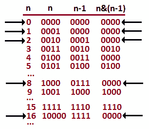

图 9.42–n&（n-1）公式给出了两个的幂

所以，数字 0，1，2，8，16。。。将它们的二进制表示形式*n*&（*n*-1）表示为 0000。到目前为止，我们可以说给定的数字是二的幂。如果不是，那么我们可以返回-1，因为没有 1 的位或者有多个 1 的位。

接下来，我们可以在跟踪移位次数的同时，将*n*向右移位，只要*n*不是 0。当*n*为 0 时，这意味着我们已经移位了 1 的单个位，因此我们可以停止并返回计数的移位。基于这些语句，代码非常简单：

```java
public static int findPosition(int n) {
  int count = 0;
  if (!isPowerOfTwo(n)) {
    return -1;
  }
  while (n != 0) {
    n = n >> 1;
    ++count;
  }
  return count;
}
private static boolean isPowerOfTwo(int n) {
  return (n > 0) && ((n & (n - 1)) == 0);
}
```

完整的代码被称为*位置函数 Firstbitofone*。

## 编码挑战 25–将浮点转换为二进制，反之亦然

问题 T1：考虑 java 的 T2。浮点数 T3。编写一段代码，将此**浮点**转换为 IEEE 754 单精度二进制浮点（binary-32），反之亦然。

**解决方案**：要解决这个问题，必须知道 Java 对**浮点数**使用 IEEE 754 单精度二进制浮点表示。IEEE 754 标准将二进制 32 指定为具有符号位（1 位）、指数宽度（8 位，可表示 256 个值）和有效精度（24 位（23 显式存储）），也称为尾数。

下图表示 IEEE 754 标准中的二进制-32：


图 9.43–IEEE 754 单精度二进制浮点（二进制 32）

**浮点**值由 32 位二进制数据表示，带有给定符号、有偏指数、*e*（8 位无符号整数）和 23 位分数，如下所示：


图 9.44–浮动值

存储在 8 位上的指数使用 0 到 127 之间的值表示负指数（例如，2-3），使用 128-255 之间的值表示正指数。负指数 10-7 的值为-7+127=120。127 的值称为指数偏差。

有了这些信息，您应该能够将**浮点数**转换为 IEEE 754 二进制-32 表示形式，反之亦然。在检查名为*FloatToBinaryAndBack*的源代码之前，请尝试使用您自己的实现。

这是本章最后一个编码挑战。让我们快速总结一下！

# 总结

由于本章是位操作的综合资源，那么如果您走到了这一步，您已经大大提高了位操作技能。为了帮助您学习解决位操作问题的模式和模板，我们涵盖了主要的理论方面并解决了 25 个编码难题。

在下一章中，我们将继续使用数组和字符串。*******