*第 10 章*：

# 数组和字符串

本章涵盖涉及字符串和数组的广泛问题。由于 Java 字符串和数组是开发人员的常见主题，我将通过几个您必须记住的标题简要介绍它们。但是，如果您需要深入研究这个主题，那么就考虑正式的 java 文档（https://docs.oracle.com/javase/tutorial/java/ ）。

到本章结束时，您应该能够解决涉及 Java 字符串和/或数组的任何问题。他们很可能会出现在技术面试中。因此，本章将涵盖的主题非常简短和明确：

*   简言之，数组和字符串
*   编码挑战

让我们从快速回顾字符串和数组开始。

# 技术要求

本章中的所有代码都可以在 GitHub 的[上找到 https://github.com/PacktPublishing/The-Complete-Coding-Interview-Guide-in-Java/tree/master/Chapter10](https://github.com/PacktPublishing/The-Complete-Coding-Interview-Guide-in-Java/tree/master/Chapter10) 。

# 简言之，数组和字符串

在 Java 中，数组是动态创建的对象。数组可以分配给**对象**类型的变量。它们可以具有单个维度（例如，**m[]**）或多个维度（例如，作为三维数组，**m[][]**）。数组的元素以索引 0 开始存储，因此长度为*n*的数组将其元素存储在索引 0 和*n*-1（含）之间。创建阵列对象后，其长度永远不会更改。除了长度为 0 的无用数组外，数组不能是不可变的（例如，**字符串[]不可变=新字符串[0]**。

在 Java 中，字符串是不可变的（**字符串**是不可变的）。字符串可以包含**ASCII 字符**（0-31 之间的不可打印控制码，32-127 之间的可打印字符，128-255 之间的扩展 ASCII 码）和**Unicode 字符**。小于 65535（0xFFFF）的 Unicode 字符在 Java 中使用 16 位**字符**数据类型表示（例如，调用**字符（int index）**工作正常—**索引**是从 0 到*字符串长度*-1 变化的索引）。在 1114111（0x10FFFF）之前超过 65535 的 Unicode 字符不能放入 16 位（Java**字符**。它们存储为 32 位整数值（称为*码点*。这方面在*编码挑战 7–提取代理项对的代码点*一节中有详细说明。

用于操作字符串的一个非常有用的类是**StringBuilder**（和线程安全的**StringBuffer**）。

现在，让我们看看一些编码挑战。

# 编码挑战

在下面的 29 个编码挑战中，我们将解决一系列常见的问题，这些问题是在中大型公司（包括谷歌、亚马逊、Flipkart、Adobe 和微软）进行的 Java 技术访谈中遇到的。除了这 29 个编码挑战（在本书中讨论），您可能还想查看以下字符串和数组编码挑战的非详尽列表，您可以在我的另一本书*Java 编码问题*（[中找到这些挑战 https://www.amazon.com/gp/product/1789801419/](https://www.amazon.com/gp/product/1789801419/) ），也由 Packt 出版：

*   重复字符计数
*   查找第一个非重复字符
*   颠倒字母和单词
*   检查字符串是否仅包含数字
*   计算元音和辅音
*   计算某个字符的出现次数
*   从字符串中删除空格
*   用分隔符连接多个字符串
*   检查字符串是否为回文
*   删除重复字符
*   删除给定字符
*   查找具有最多外观的角色
*   按长度对字符串数组排序
*   检查字符串是否包含子字符串
*   计算字符串中的子字符串出现次数
*   检查两个字符串是否为字谜
*   声明多行字符串（文本块）
*   将同一字符串*n*次串联
*   删除前导空格和尾随空格
*   查找最长的公共前缀
*   应用压痕
*   变换字符串
*   对数组排序
*   在数组中查找元素
*   检查两个数组是否相等或不匹配
*   按字典法比较两个数组
*   数组的最小值、最大值和平均值
*   反转数组
*   填充和设置数组
*   下一大元素
*   更改数组大小

本章中涉及的 29 个编码挑战未在前面的挑战中介绍，反之亦然。

## 编码挑战 1–唯一字符（1）

**谷歌**、**Adobe**、**微软**

问题 T1：考虑一个包含 ASCII 和 Unicode 字符的字符串，范围在 0 到 655 之间。如果此字符串包含唯一字符，请编写一段返回**true**的代码。空白可以忽略。

让我们考虑以下三个有效的给定字符串：


图 10.1–字符串

首先，重要的是要知道，我们可以通过**charAt（int index）**方法获取 0 到 65535 之间的任何字符（**index**是从 0 到*字符串长度*–1 的索引），因为这些字符在 Java 中使用 16 位**char**数据类型表示。

这个问题的一个简单解决方案是使用一个**映射<字符，布尔>**。当我们通过**charAt（int index）**方法循环给定字符串的字符时，我们尝试将**index**中的字符放入该映射，并将相应的**布尔值**从**false**翻转到**true**。如果给定的键（字符）没有映射，**Map#put（kk，vv）**方法返回**null**。如果给定的键（字符）存在映射，那么**Map#put（K K，V V）**返回与该键相关的上一个值（在本例中为**true**。因此，当返回值不是**null**时，我们可以推断至少有一个字符是重复的，因此我们可以说给定的字符串不包含唯一的字符。

此外，在尝试将字符放入映射之前，我们通过**字符串【codePointAt（索引 i）】**确保其代码范围在 0 到 65535 之间。此方法将指定的**索引**处的 Unicode 字符返回为**int**，称为*码点*。让我们看看代码：

```java
private static final int MAX_CODE = 65535;
...
public static boolean isUnique(String str) {
  Map<Character, Boolean> chars = new HashMap<>();
  // or use, for(char ch : str.toCharArray()) { ... }
  for (int i = 0; i < str.length(); i++) {
    if (str.codePointAt(i) <= MAX_CODE) {
      char ch = str.charAt(i);
      if (!Character.isWhitespace(ch)) {
        if (chars.put(ch, true) != null) {
          return false;
        }
      }
    } else {
      System.out.println("The given string 
        contains unallowed characters");
      return false;
    }
  }
  return true;
}
```

完整的应用程序称为*唯一字符*。

## 编码挑战 2–唯一字符（2）

**谷歌**、**Adobe**、**微软**

问题 T1A:考虑一个字符串，该字符串只能包含从 TytT2T.A.Z.Po.T3 的字符。编写一段代码，如果此字符串包含唯一的字符，则返回**true**。空白可以忽略。

**解决方案**：前面的编码挑战中给出的解决方案也涵盖了这种情况。然而，让我们试着想出一个针对这种情况的解决方案。给定字符串只能包含*a-z*中的字符，因此只能包含 97（*a*到 122（*z*中的 ASCII 码）。让我们考虑给定的字符串是 Ont8。

如果我们回忆起我们在[*第 9 章*](09.html#_idTextAnchor181)*位操作*中的经验，那么我们可以想到一个位掩码，它用位 1 覆盖*a*-*z*字母，如下图所示（1 的位对应于我们字符串的字母，*afghnqrsuz）*：


图 10.2–唯一字符位掩码

如果我们将*a-z*中的每个字母表示为 1 位，那么我们将获得唯一字符的位掩码，类似于上图中所示的位掩码。最初，该位掩码只包含 0（因为没有处理任何字母，所以所有位都等于 0 或未设置）。

接下来，我们查看给定字符串中的第一个字母，并计算其 ASCII 码与 97（ASCII 码为*a*）之间的减法。让我们用*s*来表示这一点。现在，我们通过将 1 左移*s*位置来创建另一个位掩码。这将导致位掩码的 MSB 为 1，后跟 0（1000…）的*s*位。接下来，我们可以在唯一字符的位掩码（最初为 0000…）和该位掩码（1000…）之间应用 AND[&运算符。结果将是 10000。。。因为 0&1=0。这是预期的结果，因为这是第一个处理的字母，所以在唯一字符的位掩码中没有翻转的字母。

接下来，我们通过将位从位置*s*从 0 翻转到 1 来更新唯一角色的位掩码。这是通过 OR[|]运算符完成的。现在，唯一字符的位掩码为 1000。。。。因为我们翻转了一个位，所以有一个位是 1；也就是说，与第一个字母对应的字母。

最后，我们对给定字符串的每个字母重复这个过程。如果遇到重复，则唯一字符的位掩码和 1000 之间的 AND[&]操作。。。与当前处理的信件对应的掩码将返回 1（1&1=1）。如果发生这种情况，那么我们已经找到了一个副本，所以我们可以返回它。

在代码方面，我们有以下内容：

```java
private static final char A_CHAR = 'a';
...
public static boolean isUnique(String str) {
  int marker = 0;
  for (int i = 0; i < str.length(); i++) {
    int s = str.charAt(i) - A_CHAR;
    int mask = 1 << s;
    if ((marker & mask) > 0) {
      return false;
    }
    marker = marker | mask;
  }
  return true;
}
```

完整的应用程序称为*UniqueCharactersAZ*。

## 编码挑战 3–编码字符串

问题 T1A:考虑一个字符串，作为一个 TA3 T3。编写一段代码，用序列*%20*替换所有空格。结果字符串应作为**字符[]**返回。

Po.T0.解决方案 T1：考虑给定的 T2 T2 值 CAR[ORE TA3T]代表以下字符串：

```java
char[] str = "  String   with spaces  ".toCharArray();
```

预期结果为*%20%20String%20%20%20with%20spaces%20%20*。

我们可以分三步解决这个问题：

1.  我们计算给定的**字符[]**中的空格数。
2.  接下来，创建一个新的**字符[]**，这是初始**字符[]**、*str*的大小，加上空格数乘以 2（单个空格在给定的**字符[]**中占据一个元素，*%20*序列在结果中占据三个元素）**字符[]**。
3.  最后，我们循环给定的**字符[]**并创建生成的**字符[]**。

在代码方面，我们有以下内容：

```java
public static char[] encodeWhitespaces(char[] str) {
  // count whitespaces (step 1)
  int countWhitespaces = 0;
  for (int i = 0; i < str.length; i++) {
    if (Character.isWhitespace(str[i])) {
        countWhitespaces++;
    }
  }
  if (countWhitespaces > 0) {
    // create the encoded char[] (step 2)
    char[] encodedStr = new char[str.length
      + countWhitespaces * 2];
    // populate the encoded char[] (step 3)
    int index = 0;
    for (int i = 0; i < str.length; i++) {
      if (Character.isWhitespace(str[i])) {
        encodedStr[index] = '0';
        encodedStr[index + 1] = '2';
        encodedStr[index + 2] = '%';
        index = index + 3;
      } else {
        encodedStr[index] = str[i];
        index++;
      }
    }
    return encodedStr;
  }
  return str;
}
```

完整的应用程序称为*编码字符串*。

## 编码挑战 4–一次编辑

**谷歌**、**微软**

【问题】T1：考虑两个给定的 T2、T3、Q、T4、P5、T5。编写一段代码，确定我们是否可以通过在*q*或*p*中执行单个编辑来获得两个相同的字符串。更准确地说，我们可以在*q*或*p*中插入、删除或替换单个字符，*q*将变为等于*p*。

为了更好地理解需求，让我们考虑几个例子：

*   *储罐，tanc*一次编辑：将*k*替换为*c*（反之亦然）
*   *tnk，坦克*一次编辑：在*t*和*n*之间的*tnk*中插入*a*或从*坦克*中移除*a*
*   *坦克，tinck*需要多个编辑！
*   *坦克，坦克师*需要多个编辑！

通过检查这些示例，我们可以得出结论，如果出现以下情况，我们离编辑只有一步之遥：

*   *q*与*p*的长度差不大于 1
*   *q*和*p*在一个地方是不同的

我们可以很容易地检查*q*和*p*之间的长度差异，如下所示：

```java
if (Math.abs(q.length() - p.length()) > 1) {
  return false;
}
```

为了找出*q*和*p*在一个地方是否不同，我们必须将*q*中的每个字符与*p*中的每个字符进行比较。如果我们发现多个差异，则返回**false**；否则返回**true**。让我们从代码的角度来看：

```java
public static boolean isOneEditAway(String q, String p) {
  // if the difference between the strings is bigger than 1 
  // then they are at more than one edit away
  if (Math.abs(q.length() - p.length()) > 1) {
    return false;
  }
  // get shorter and longer string
  String shorter = q.length() < p.length() ? q : p;
  String longer = q.length() < p.length() ? p : q;
  int is = 0;
  int il = 0;
  boolean marker = false;
  while (is < shorter.length() && il < longer.length()) {
    if (shorter.charAt(is) != longer.charAt(il)) {
      // first difference was found
      // at the second difference we return false
      if (marker) {
        return false;
      }
      marker = true;
      if (shorter.length() == longer.length()) {
        is++;
      }
    } else {
      is++;
    }
    il++;
  }
  return true;
}
```

完整的应用程序称为*OneEditAway*。

## 编码挑战 5–收缩字符串

问题 T1：考虑一个给定的字符串，它只包含字母 T3、A、Z、T4、T4 和 Po.T5。此字符串包含大量连续重复的字符。编写一段代码，通过计算连续重复的字符数并创建另一个附加每个字符和连续出现次数的字符串来收缩此字符串。空白应按原样复制到结果字符串中（不要收缩空白）。如果结果字符串不短于给定字符串，则返回给定字符串。

Po.T0.解决方案：考虑给定的串为 AUBB VVVV S RTTT RR EEEE F。预期结果为*a1b3 v4 s1 r1t3 r2 e4 f1*。要计算连续字符数，我们需要逐个字符循环此字符串：

*   如果当前字符和下一个字符相同，则我们增加一个计数器。
*   如果下一个字符与当前字符不同，则我们将当前字符和计数器值附加到最终结果，并将计数器重置为 0。
*   最后，在处理了给定字符串中的所有字符后，我们将结果的长度与给定字符串的长度进行比较，并返回最短的字符串。

在代码方面，我们有以下内容：

```java
public static String shrink(String str) {
  StringBuilder result = new StringBuilder();
  int count = 0;
  for (int i = 0; i < str.length(); i++) {
    count++;
    // we don't count whitespaces, we just copy them
    if (!Character.isWhitespace(str.charAt(i))) {
      // if there are no more characters
      // or the next character is different
      // from the counted one
      if ((i + 1) >= str.length()
           || str.charAt(i) != str.charAt(i + 1)) {
        // append to the final result the counted character
        // and number of consecutive occurrences
        result.append(str.charAt(i))
              .append(count);
        // reset the counter since this 
        // sequence was appended to the result
        count = 0;
      }
    } else {
      result.append(str.charAt(i));
      count = 0;
    }
  }
  // return the result only if it is 
  // shorter than the given string
  return result.length() > str.length()
              ? str : result.toString();
}
```

完整的应用程序称为*StringShrinker*。

## 编码挑战 6–提取整数

问题 T1A:考虑一个包含 T2 的白线和 Po.T3，A，Z，T4，4，5，9，9，6 个字符。编写一段代码，从该字符串中提取整数。您可以假设任何连续数字序列构成有效整数。

Po.T0.解决方案：考虑给定的字符串为 Ty2 T2，CV DD 4 K 2321，2 11 K4K2 66 66 D AutoT3。预期结果将包含以下整数：4、2321、2、11、4、2、66 和 4。

一个简单的解决方案是逐字符循环给定的字符串，并串联连续数字序列。数字包含 48（含）到 97（含）之间的 ASCII 码。因此，ASCII 码在[48,97]范围内的任何字符都是数字。我们也可以使用**字符**方法。当连续数字序列被非数字字符中断时，我们可以将获取的序列转换为整数，并将其附加为整数列表。让我们从代码的角度来看：

```java
public static List<Integer> extract(String str) {
  List<Integer> result = new ArrayList<>();
  StringBuilder temp = new StringBuilder(
    String.valueOf(Integer.MAX_VALUE).length());
  for (int i = 0; i < str.length(); i++) {
    char ch = str.charAt(i);
    // or, if (((int) ch) >= 48 && ((int) ch) <= 57)
    if (Character.isDigit(ch)) { 
      temp.append(ch);
    } else {
      if (temp.length() > 0) {
        result.add(Integer.parseInt(temp.toString()));
        temp.delete(0, temp.length());
      }
    }
  }
  return result;
}
```

完整的应用程序称为*提取整数*。

## 编码挑战 7–提取代理项对的代码点

问题 T1 问题：考虑一个包含 Type T3 字符的任何类型的字符，包括 Unicode 字符的给定字符串，它作为 java T4 替代代理对 Ty5 T5。编写一段代码，提取列表中*代理项对*的*代码点*。

解决方案 To1 T1：让我们考虑给定的字符串包含在下面的图像中显示的 Unicode 字符（前三个 Unicode 字符用 java 表示为 Ont2）替代代理对 Ty3Ty，而最后一个不是）


图 10.3–Unicode 字符（代理项对）

在 Java 中，我们可以编写如下字符串：

```java
char[] musicalScore = new char[]{'\uD83C', '\uDFBC'}; 
char[] smileyFace = new char[]{'\uD83D', '\uDE0D'};   
char[] twoHearts = new char[]{'\uD83D', '\uDC95'};   
char[] cyrillicZhe = new char[]{'\u04DC'};          
String str = "is" + String.valueOf(cyrillicZhe) + "zhe"
  + String.valueOf(twoHearts) + "two hearts"
  + String.valueOf(smileyFace) + "smiley face and, "
  + String.valueOf(musicalScore) + "musical score";
```

要解决这个问题，我们必须了解以下几点（最好记住以下语句，因为它们对于解决涉及 Unicode 字符的问题至关重要）：

*   Unicode characters that exceed 65,535 until 1,114,111 (0x10FFFF) don't fit into 16 bits, and so 32-bit values (known as *code points*) were considered for the UTF-32 encoding scheme.

    不幸的是，Java 不支持 UTF-32！尽管如此，Unicode 还是提出了一个解决方案，仍然使用 16 位来表示这些字符。此解决方案包含以下内容：

*   16 位*高位代理*：1024 个值（U+D800 到 U+DBFF）
*   16 位*低位代理*：1024 个值（U+DC00 到 U+DFFF）
*   现在，*高代理*后跟*低代理*定义了被称为*代理对*的。这些*代理项对*用于表示 65536（0x10000）和 1114111（0x10FFFF）之间的值。
*   Java 利用了这种表示，并通过一组方法公开它，例如**codepoint（）**、**codePoints（）**、**codePointCount（）**和**offsetByCodePoints（）**（有关详细信息，请参阅 Java 文档）。
*   调用**codePointAt（）**而不是**charAt（）**，调用**codePoints（）**而不是**chars（）**等等可以帮助我们编写涵盖 ASCII 和 Unicode 字符的解决方案。

例如，众所周知的两颗心符号（上图中的第一个符号）是一个 Unicode 代理项对，可以表示为包含两个值的**字符[]**：\uD83D 和\uDC95。此符号的*代码点*为 128149。要从此代码点获取**字符串**对象，请调用以下命令：

```java
String str = String.valueOf(Character.toChars(128149));
```

通过调用**str.codePointCount（0，str.length（））**可以计算**str**中的代码点，即使**str**长度为 2，也返回 1。调用**str.codePointAt（0）**返回 128149，调用**str.codePointAt（1）**返回 56469。调用**Character.toChars（128149）.length**返回 2，因为需要两个字符将此*代码点*表示为 Unicode*代理项对*。对于 ASCII 和 Unicode 16 位字符，它将返回 1。

基于此示例，我们可以很容易地识别一个*代理项对*，如下所示：

```java
public static List<Integer> extract(String str) {
  List<Integer> result = new ArrayList<>();
  for (int i = 0; i < str.length(); i++) {
    int cp = str.codePointAt(i);
    if (i < str.length()-1 
        && str.codePointCount(i, i+2) == 1) {
      result.add(cp);
      result.add(str.codePointAt(i+1));
      i++;
    }
  }
  return result;
}
```

或者，像这样：

```java
public static List<Integer> extract(String str) {
  List<Integer> result = new ArrayList<>();
  for (int i = 0; i < str.length(); i++) {
    int cp = str.codePointAt(i);        
    // the constant 2 means a suroggate pair       
    if (Character.charCount(cp) == 2) { 
      result.add(cp);
      result.add(str.codePointAt(i+1));
      i++;
    } 
  }
  return result;
}
```

完整的应用程序称为*提取代理步骤*。

## 编码挑战 8–是轮换吗

**亚马逊**、**谷歌**、**Adobe**、**微软**

问题 T1：考虑两个给定的弦，AUT3，STR1，T4 和 Tr2，T6，T6，T6。写一行代码告诉我们*str2*是否是*str1*的旋转。

【方法】T1：Tr1、T4、T4、T5、H2、T7、Tr2、T8、T8 等。由于*str2*是*str1*的旋转，可以说*str2*是将*str1*分为两部分，重新排列而成。下图显示了这些单词：


图 10.4–将 str1 分为两部分并重新排列

因此，根据这张图像，让我们将剪刀的左侧表示为*p1*，将剪刀的右侧表示为*p2*。有了这些符号，我们可以说*p1=hellow*和*p2=World*。此外，我们可以说，*str1=p1+p2=hellow+orld*和*str2=p2+p1=orld+hellow*。所以，无论我们在哪里进行*str1*的剪切，我们都可以说*str1=p1+p2*和*str2=p2+p1*。然而，这意味着*str1+str2=p1+p2+p2+p1=hellow+orld+orld+hellow=p1+p2+p1+p2=str1+str1*，因此*p2+p1*是*p1+***p2+p1***+p2*的子串。换句话说，*str2*必须是*str1+str1*的子串；否则不能是*str1*的旋转。在代码方面，我们可以编写以下代码：

```java
public static boolean isRotation(String str1, String str2) {      
  return (str1 + str1).matches("(?i).*" 
    + Pattern.quote(str2) + ".*");
}
```

完整的代码称为*旋转约束*。

## 编码挑战 9–将矩阵旋转 90 度

**亚马逊**、**谷歌**、**Adobe**、**微软**、**Flipkart**

问题 T1：考虑一个给定的 T2，n，3，3，x，4，4，n，5，5，整矩阵的 T6。编写一段代码，在不使用任何额外空间的情况下，以逆时针方向将该矩阵旋转 90 度。

**解决方案**：此问题至少有两种解决方案。一种解决方案依赖于矩阵的转置，而另一种解决方案依赖于将矩阵逐环旋转。

### 使用矩阵转置

让我们来处理第一个解，依赖于找到矩阵的转置，*M*。矩阵的转置是线性代数中的一个概念，这意味着我们需要将矩阵翻转到其主对角线上，从而产生一个新的矩阵，表示为*M*T。例如，有矩阵*M*和索引*i*和*j*，我们可以写出以下关系：

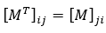

图 10.5–矩阵转置关系

一旦我们获得了*M*的转置，我们就可以反转转置的列。这将给出最终结果（矩阵*M*逆时针旋转 90 度）。下图阐明了 5x5 矩阵的这种关系：


图 10.6–左侧矩阵的转置和右侧的最终结果

为了获得转置（*M*T），我们可以通过以下方法将*M**j**i*与*M**i**j*进行交换：

```java
private static void transpose(int m[][]) {
  for (int i = 0; i < m.length; i++) {
    for (int j = i; j < m[0].length; j++) {
      int temp = m[j][i];
      m[j][i] = m[i][j];
      m[i][j] = temp;
    }
  }
}
```

将*M*T 的柱反转可以这样做：

```java
public static boolean rotateWithTranspose(int m[][]) {
  transpose(m);
  for (int i = 0; i < m[0].length; i++) {
    for (int j = 0, k = m[0].length - 1; j < k; j++, k--) {
      int temp = m[j][i];
      m[j][i] = m[k][i];
      m[k][i] = temp;
    }
  }
  return true;
}
```

此解决方案的时间复杂度为 O（n2），空间复杂度为 O（1），因此我们尊重问题要求。现在，让我们看看这个问题的另一个解决方案。

### 逐环旋转矩阵

如果我们把一个矩阵看作一组同心环，那么我们可以试着旋转每个环，直到整个矩阵旋转。下图显示了 5x5 矩阵的此过程：

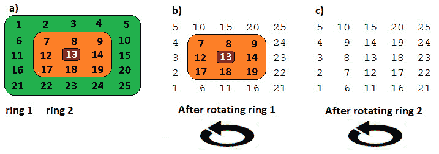

图 10.7–逐环旋转矩阵

我们可以从最外层的环开始，最终向内工作。为了旋转最外层的环，我们从顶部（0，0）开始逐个交换索引。这样，我们移动右边缘代替上边缘，下边缘代替右边缘，左边缘代替下边缘，上边缘代替左边缘。完成此过程后，最外层的环逆时针旋转 90 度。我们可以继续第二个环，从索引（1，1）开始，重复这个过程，直到旋转第二个环。让我们从代码的角度来看：

```java
public static boolean rotateRing(int[][] m) {
  int len = m.length;
  // rotate counterclockwise
  for (int i = 0; i < len / 2; i++) {
    for (int j = i; j < len - i - 1; j++) {
      int temp = m[i][j];
      // right -> top 
       m[i][j] = m[j][len - 1 - i];
       // bottom -> right 
       m[j][len - 1 - i] = m[len - 1 - i][len - 1 - j];
       // left -> bottom 
       m[len - 1 - i][len - 1 - j] = m[len - 1 - j][i];
       // top -> left
       m[len - 1 - j][i] = temp;
     }
   }                 
   return true;
 }
```

该解决方案的时间复杂度为 O（n2），空间复杂度为 O（1），因此我们尊重了问题的要求。

完整的应用程序称为*旋转矩阵*。它还包含将矩阵顺时针旋转 90 度的解决方案。此外，它还包含在单独矩阵中旋转给定矩阵的解。

## 编码挑战 10–包含零的矩阵

**谷歌**、**Adobe**

问题 T1：考虑一个给定的 T2，n，3，3，x，4，4，m，5，整数矩阵。如果*M*（*i，j*）等于 0，则整行*i*和列*j*只应包含零。编写一段代码，在不使用任何额外空间的情况下完成此任务。

**解决方案**：一种简单的方法包括循环矩阵，对于每个（*i，j*）=0，将行*i*和列*j*设置为零。问题是，当我们遍历该行/列的单元格时，我们将找到零并再次应用相同的逻辑。我们很有可能最终得到一个由零组成的矩阵。

为了避免这种幼稚的方法，最好举个例子，尝试将解决方案可视化。让我们考虑一个 5x8 矩阵，如下面的图像所示：

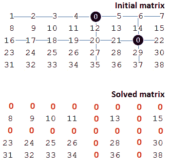

图 10.8–包含零的矩阵

初始矩阵在（0,4）处有一个 0，在（2,6）处有另一个。这意味着求解的矩阵在第 0 行和第 2 行以及第 4 列和第 6 列上只应包含零。

一种易于实现的方法是存储零的位置，并在第二次遍历矩阵时将相应的行和列设置为零。然而，存储零意味着使用一些额外的空间，这是问题所不允许的。

提示

通过一些技巧和工作，我们可以将空间复杂度设置为 O（1）。诀窍包括使用矩阵的第一行和第一列来标记矩阵其余部分中的零。例如，如果我们在单元格（*i*、*j*）和*i*中找到一个零≠0 和*j*≠0，然后我们设置*M**i*【0】=0 和*M*【0】*j*=0。一旦我们对整个矩阵都这样做了，我们就可以循环第一列（第 0 列）并传播行中找到的每个零。之后，我们可以循环第一行（第 0 行）并传播在列上找到的每个零。

但是第一行和第一列的潜在初始零呢？当然，我们也必须解决这方面的问题，因此我们首先标记第一行/列是否至少包含一个 0：

```java
boolean firstRowHasZeros = false;
boolean firstColumnHasZeros = false;
// Search at least a zero on first row
for (int j = 0; j < m[0].length; j++) {
  if (m[0][j] == 0) {
    firstRowHasZeros = true;
    break;
  }
}
// Search at least a zero on first column
for (int i = 0; i < m.length; i++) {
  if (m[i][0] == 0) {
    firstColumnHasZeros = true;
    break;
  }
}
```

此外，我们将应用刚才所说的内容。为此，我们循环矩阵的其余部分，对于每个 0，我们在第一行和第一列上标记它：

```java
// Search all zeros in the rest of the matrix
for (int i = 1; i < m.length; i++) {
  for (int j = 1; j < m[0].length; j++) {
    if (m[i][j] == 0) {
       m[i][0] = 0;
       m[0][j] = 0;
    }
  }
}
```

接下来，我们可以循环第一列（列 0）并传播行中找到的每个零。之后，我们可以循环第一行（第 0 行）并传播在列上找到的每个零：

```java
for (int i = 1; i < m.length; i++) {
  if (m[i][0] == 0) {
    setRowOfZero(m, i);
  }
}
for (int j = 1; j < m[0].length; j++) {
  if (m[0][j] == 0) {
    setColumnOfZero(m, j);
  }
}
```

最后，如果第一行至少包含一个 0，那么我们将整行设置为 0。另外，如果第一列至少包含一个 0，那么我们将整个列设置为 0：

```java
if (firstRowHasZeros) {
  setRowOfZero(m, 0);
}
if (firstColumnHasZeros) {
  setColumnOfZero(m, 0);
}
```

**setRowOfZero（）**和**setColumnOfZero（）**非常简单：

```java
private static void setRowOfZero(int[][] m, int r) {
  for (int j = 0; j < m[0].length; j++) {
    m[r][j] = 0;
  }
}
private static void setColumnOfZero(int[][] m, int c) {
  for (int i = 0; i < m.length; i++) {
    m[i][c] = 0;
  }
}
```

应用程序称为带零的*矩阵*。

## 编码挑战 11–用一个数组实现三个堆栈

**亚马逊**、**谷歌**、**Adobe**、**微软**、**Flipkart**

**问题**：使用单个数组编写三个堆栈的实现。实现应该公开三种方法：**推送（）**、**pop（）**和**打印堆栈（）**。

**解决方案**：提供所需实现的方法主要有两种。我们将在这里介绍的方法是基于交错这三个堆栈的元素。查看以下图像：


图 10.9–交错堆栈的节点

如您所见，有一个数组保存这三个堆栈的节点，分别表示为*堆栈 1*、*堆栈 2*和*堆栈 3*。我们实现的关键在于，推送到堆栈上的每个节点（分别是数组）都有一个到其前一个节点的反向链接。每个堆栈的底部都有一个到-1 的链接。例如，对于*堆栈 1*，我们知道索引 0 处的值 2 具有到伪索引-1 的反向链接，索引 1 处的值 12 具有到索引 0 的反向链接，索引 7 处的值 1 具有到索引 1 的反向链接。

因此，堆栈节点包含两条信息–值和反向链接：

```java
public class StackNode {
  int value;
  int backLink;
  StackNode(int value, int backLink) {
    this.value = value;
    this.backLink = backLink;
  }
}
```

另一方面，阵列管理到下一个空闲插槽的链接。最初，当数组为空时，我们只能创建空闲插槽，因此链接的形状如下（请注意**initializeSlots（）**方法）：

```java
public class ThreeStack {
  private static final int STACK_CAPACITY = 15;
  // the array of stacks
  private final StackNode[] theArray;                   
  ThreeStack() {
    theArray = new StackNode[STACK_CAPACITY];
    initializeSlots();
  }
  ...   
  private void initializeSlots() {
    for (int i = 0; i < STACK_CAPACITY; i++) {
      theArray[i] = new StackNode(0, i + 1);
    }
  }
}
```

现在，当我们将一个节点推入其中一个堆栈时，我们需要找到一个空闲插槽并将其标记为非空闲。这是通过以下代码完成的：

```java
public class ThreeStack {
  private static final int STACK_CAPACITY = 15;
  private int size;
  // next free slot in array
  private int nextFreeSlot;
  // the array of stacks
  private final StackNode[] theArray;                      
  // maintain the parent for each node
  private final int[] backLinks = {-1, -1, -1};  
  ...
  public void push(int stackNumber, int value) 
                throws OverflowException {
    int stack = stackNumber - 1;
    int free = fetchIndexOfFreeSlot();
    int top = backLinks[stack];
    StackNode node = theArray[free];
    // link the free node to the current stack
    node.value = value;
    node.backLink = top;
    // set new top
    backLinks[stack] = free;
  }
  private int fetchIndexOfFreeSlot()  
                throws OverflowException {
    if (size >= STACK_CAPACITY) {
      throw new OverflowException("Stack Overflow");
    }
    // get next free slot in array
    int free = nextFreeSlot;
    // set next free slot in array and increase size
    nextFreeSlot = theArray[free].backLink;
    size++;
    return free;
  }
}
```

当我们从堆栈中弹出一个节点时，我们必须释放该插槽。这样，这个插槽就可以被未来的推送重新使用。此处列出了相关代码：

```java
public class ThreeStack {
  private static final int STACK_CAPACITY = 15;
  private int size;
  // next free slot in array
  private int nextFreeSlot;
  // the array of stacks
  private final StackNode[] theArray;                      
  // maintain the parent for each node
  private final int[] backLinks = {-1, -1, -1};  
  ...
  public StackNode pop(int stackNumber)
              throws UnderflowException {
    int stack = stackNumber - 1;
    int top = backLinks[stack];
    if (top == -1) {
      throw new UnderflowException("Stack Underflow");
    }
    StackNode node = theArray[top]; // get the top node
    backLinks[stack] = node.backLink;
    freeSlot(top);
    return node;
  }
  private void freeSlot(int index) {
    theArray[index].backLink = nextFreeSlot;
    nextFreeSlot = index;
    size--;
  }
}
```

完整的代码，包括**printStacks（）**的用法，称为*ThreeStacksInOneArray*。

解决此问题的另一种方法是将堆栈阵列拆分为三个不同的区域：

*   第一个区域被分配给第一个堆栈，位于数组端点的左侧（当我们推入该堆栈时，它朝着正确的方向增长）。
*   第二个区域被指定给第二个堆栈，位于数组端点的右侧（当我们推入此堆栈时，它会向左侧增长）。
*   第三个区域被分配给第三个堆栈，并位于数组的中间（当我们推到这个堆栈中时，它可以在任何方向上生长）。

下图将帮助您澄清这些要点：

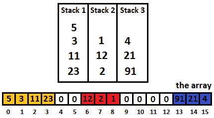

图 10.10–将阵列拆分为三个区域

这种方法的主要挑战在于通过相应地移动中间堆栈来避免堆栈冲突。或者，我们可以将阵列划分为三个固定区域，并允许单个堆栈在有限的空间中增长。例如，如果数组大小为*s*，则第一个堆栈可以从 0（含）到*s*/3（不含），第二个堆栈可以从*s*/3（含）到 2**s*/3（不含），第三个堆栈可以从 2**s*/3（含）到*s*（独家）。此实现在捆绑代码中作为*ThreeStacksInOneArrayFixed*提供。

或者，中间堆栈可以通过后续推送的交替序列来实现。通过这种方式，我们也减少了变化，但我们正在减少同质性。但是，也要挑战自己并实施这种方法。

## 编码挑战 12–对

**亚马逊**、**Adobe**、**Flipkart**

问题 T1：考虑一个完整的整数数组（正和负）。编写一段代码，查找其总和为等于给定数字*k*的所有整数对。

解决方法：像往常一样，让我们考虑一个例子。假设我们有一个由 15 个元素组成的数组，如下：-5，-2，5，4，3，7，2，1，-1，-2，15，6，12，-4，3。同样，如果*k*=10，那么我们有四对，它们的和是 10:（-15+5），（-2+12），（3+7）和（4+6）。但是我们如何找到这对呢？

解决这个问题有不同的方法。例如，我们有暴力方法（通常，面试官不喜欢这种方法，所以只能作为最后的手段使用——虽然暴力方法可以是了解问题细节的良好开端，但不能作为最终解决方案）。根据蛮力，我们从数组中取出每个元素，并尝试与剩余的每个元素配对。与几乎所有基于蛮力的解决方案一样，这一解决方案也具有不可接受的复杂性。

我们可以找到一个更好的方法，如果我们考虑排序给定的数组。我们可以通过 Java 内置的**array.sort（）**方法来实现这一点，该方法的运行时为 O（n logn）。拥有一个排序数组允许我们使用两个指针，根据以下步骤扫描整个数组（这种技术被称为*两个指针*，在本章中，您将看到它在几个问题中起作用）：

1.  一个指针从索引 0 开始（左指针，表示为*l*，另一个指针从*米长*-1）索引开始（右指针，表示为*r*。
2.  如果*m**l**+m**r**=k*，那么我们有一个解决方案，我们可以增加*l*位置，减少*r*位置。
3.  如果*m**l**+m**r**<k*，则我们增加*l*并将*r*保持在原位。
4.  如果*m**l**+m**r**>k*，则我们减少*r*并将*l*保留在适当位置。
5.  我们重复*步骤 2-4*直到*l>=r*。

下图将帮助您实施这些步骤：

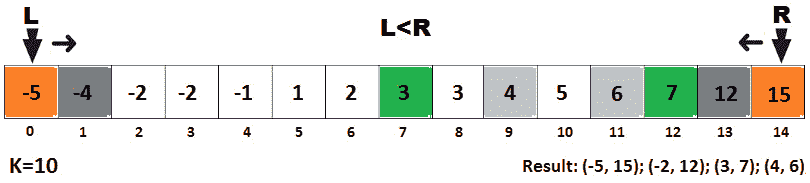

图 10.11–查找总和等于给定数字的所有对

请注意这张图片，同时我们可以看到它在*k*=10 的情况下是如何工作的：

*   *l*=0，*r*=14→ *和*=*米*[0]+*米*[14]=-5+15=10→ *和*=*k*→ *l*++、*r*--
*   *l*=1，*r*=13→ *和*=*米*[1]+*米*[13]=-4+12=8→ *总和<k*→ *l*++
*   *l*=2、*r*=13→ *和*=*米*[2]+*米*[13]=-2+12=10→ *和*=*k*→ *l*++、*r*--
*   *l*=3，*r*=12→ *和*=*米*[3]+*米*[12]=-2+7=5→ *总和<k*→ *l*++
*   *l*=4、*r*=12→ *和*=*米*[4]+*米*[12]=-1+7=6→ *总和*<*k*→ *l*++
*   *l*=5、*r*=12→ *和*=*米*[5]+*米*[12]=1+7=8→ *总和*<*k*→ *l*++
*   *l*=6、*r*=12→ *和*=*米*[6]+*米*[12]=2+7=9→ *总和*<*k*→ *l*++
*   *l*=7、*r*=12→ *和*=*米*[7]+*米*[12]=3+7=10→ *和*=*k*→ *l*++、*r*--
*   *l*=8、*r*=11→ *和*=*m*[8]+*m*[11]=3+6=9→ *总和*<*k*→ *l*++
*   *l*=9、*r*=11→ *和*=*米*[9]+*米*[11]=4+6=10→ *和*=*k*→ *l*++、*r*--
*   *l*=10，*r*=10→ 停止

如果我们将这个逻辑放入代码中，那么我们得到以下方法：

```java
public static List<String> pairs(int[] m, int k) {
  if (m == null || m.length < 2) {
    return Collections.emptyList();
  }
  List<String> result = new ArrayList<>();
  java.util.Arrays.sort(m);
  int l = 0;
  int r = m.length - 1;
  while (l < r) {
    int sum = m[l] + m[r];
    if (sum == k) {
      result.add("(" + m[l] + " + " + m[r] + ")");
      l++;
      r--;
    } else if (sum < k) {
      l++;
    } else if (sum > k) {
      r--;
    }
  }
  return result;
}
```

完整的应用程序称为*FindPairsSumEqualK*。

## 编码挑战 13–合并排序数组

**亚马逊**、**谷歌**、**Adobe**、**微软**、**Flipkart**

**问题**：假设您有*k*个不同长度的排序数组。编写一个将这些数组合并到 O（nk log n）中的应用程序，其中*n*是最长数组的长度。

**解决方案**：假设给定的阵列为以下五个阵列，分别以*a*、*b*、*c*、*d*和*e*表示：

*a*：{1,2,32,46}*b*：{-4,5,15,18,20}*c*：{3}*d*：{6,8}*e*{-2，-1,0}

预期结果如下：

{-4, -2, -1, 0, 1, 2, 3, 5, 6, 8, 15, 18, 20, 32, 46}

最简单的方法是将这些数组中的所有元素复制到单个数组中。这将取 O（nk），其中*n*是最长数组的长度，*k*是数组的数量。接下来，我们通过一个 O（n logn）时间复杂度算法对这个数组进行排序（例如，通过合并排序）。这将导致 O（nk log nk）。然而，这个问题需要我们编写一个可以在 O（nk log n）中执行的算法。

有几种解决方案在 O（nk log n）中执行，其中一种基于二进制 Min 堆（详见[*第 13 章*](13.html#_idTextAnchor295)*、树和图*）。简而言之，二进制最小堆是一个完整的二叉树。二进制最小堆通常表示为一个数组（让我们将其表示为*堆*，其根位于*堆*[0]。更重要的是，对于*堆**i*，我们有以下内容：

*   *堆*[（*i*-1）/2]：返回父节点
*   *heap*[（2**i*）+1]：返回左侧子节点
*   *heap*[（2**i*）+2]：返回正确的子节点

现在，我们的算法遵循以下步骤：

1.  创建大小为*n*k*的结果数组。
2.  创建一个大小为*k*的二进制最小堆，并将所有数组的第一个元素插入该堆。
3.  Repeat the following steps *n*k* times:

    A.从二进制最小堆中获取最小元素，并将其存储在结果数组中。

    B 将二进制最小堆的根替换为从中提取元素的数组中的下一个元素（如果数组没有更多元素，则将根元素替换为无限；例如，使用**Integer.MAX_VALUE**）。

    C 更换根后，*对*树进行处理。

代码太大，无法在本书中列出，因此以下只是其实现的结尾（即堆结构和**merge（）**操作）：

```java
public class MinHeap {
  int data;
  int heapIndex;
  int currentIndex;
  public MinHeap(int data, int heapIndex,
        int currentIndex) {
    this.data = data;
    this.heapIndex = heapIndex;
    this.currentIndex = currentIndex;
  }
}
```

以下代码用于**merge（）**操作：

```java
public static int[] merge(int[][] arrs, int k) {
  // compute the total length of the resulting array
  int len = 0;
  for (int i = 0; i < arrs.length; i++) {
    len += arrs[i].length;
  }
  // create the result array
  int[] result = new int[len];
  // create the min heap
  MinHeap[] heap = new MinHeap[k];
  // add in the heap first element from each array
  for (int i = 0; i < k; i++) {
    heap[i] = new MinHeap(arrs[i][0], i, 0);
  }
  // perform merging
  for (int i = 0; i < result.length; i++) {
    heapify(heap, 0, k);
    // add an element in the final result
    result[i] = heap[0].data;
    heap[0].currentIndex++;
    int[] subarray = arrs[heap[0].heapIndex];
    if (heap[0].currentIndex >= subarray.length) {
      heap[0].data = Integer.MAX_VALUE;
    } else {
      heap[0].data = subarray[heap[0].currentIndex];
    }
  }
  return result;
}
```

完整的应用程序称为*Mergeksortedar*。

## 编码挑战 14–中位数

**亚马逊**、**谷歌**、**Adobe**、**微软**、**Flipkart**

【问题】T2：考虑两个排序的数组，AUTT3，Q，T4，4 和 P5。编写一个应用程序，在对数运行时计算这两个数组的中值。

**解决方案**：中值将数据样本（例如数组）的上半部分与下半部分分开。例如，下图显示了分别具有奇数个元素（左侧）和偶数个元素（右侧）的数组的中值：

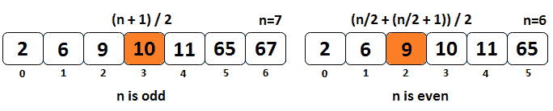

图 10.12–奇偶阵列的中值

因此，对于元素数为*n*的数组，我们有以下两个公式：

*   如果*n*为奇数，则中值由（*n*+1）/2 给出
*   如果*n*为偶数，则中值由[（*n*/2+（*n*/2+1）]/2 给出

计算单个阵列的中值非常容易。但是对于两个不同长度的数组，我们如何计算它呢？我们有两个排序数组，我们必须从中找出一些东西。具备应聘者的经验，知道如何准备面试，就足以直觉地认为应该考虑使用著名的二进制搜索算法。通常，在实现二进制搜索算法时，应该考虑排序数组。

我们可以粗略地推断，找到两个排序数组的中值可以简化为找到该值必须遵守的适当条件。

由于中值将输入分成两个相等的部分，我们可以得出结论，第一个条件要求*q*数组的中值应位于中间索引。如果我们将这个中间指标表示为*qPointer*，那么我们得到两个相等的部分：[0、*qPointer*和[*qPointer*+1*，q.长度**。*如果我们对*p*数组应用相同的逻辑，*p*数组的中值也应该位于中间索引。如果我们将这个中间指数表示为*点*，那么我们得到两个相等的部分：[0，*点*和[*点*+1，*p.length*。让我们通过下图将其可视化：


图 10.13–将阵列分成两个相等的部分

从该图中我们可以得出结论，中值应满足的第一个条件是*qLeft+pLeft=qRight+pRight*。换句话说，*qPointer+pPointer=*（*q.length-qPointer*）*+*（*p.length-pPointer*）。

但是，由于我们的数组长度不同（它们可以相等，但这只是我们的解决方案也应该涵盖的一种特殊情况），因此我们不能简单地将它们减半。我们可以做的是假设*p*>=*q*（如果它们不是这样给出的，那么我们只是交换它们来强制这个假设）。此外，在这一假设下，我们可以写出以下内容：

*质点仪+质点仪=**质点仪长度-质点仪**+**质点仪长度-质点仪**→*

*2**指针=q.length+p.length-*2**指针→**

 **pPointer=**q.length+p.length**/*2*-Qointer*

到目前为止，PoTr0pPosier-T1 可以落到中间，我们可以通过添加 1 来避免这一点，这意味着我们有以下的开始指针：

*   *qPointer*=（（*q.length*-1）+0）/2
*   *p 指针*=（*q.length*+*p.length*+1）/2-*q 指针*

如果*p*>=*q*，则最小（*q.length*+*p.length*+1）/2-*qPointer*将始终导致*pPointer*为正整数。这将消除数组越界异常，并尊重第一个条件。

但是，我们的第一个条件是不够的，因为它不能保证左数组中的所有元素都小于右数组中的元素。换句话说，左侧部分的最大值必须小于右侧部分的最小值。左边部分的最大值可以是*q**qPointer*-1】或*p**PPpointer*-1】，右边部分的最小值可以是*q**qPointer*或*p**PPpointer*。因此，我们可以得出结论，以下条件也应得到尊重：

*   *q**qPointer*-1】<=*p**PPpointer*
*   *p**pPointer*-1】<=*q**Qointer*

在这些条件下，*q*和*p*的中值如下：

*   *p.length*+*q.length*为偶数：左侧最大值与右侧最小值的平均值
*   *p.length*+*q.length*为奇数：左边部分的最大值，最大值（*q*[*qPointer*-1]，*p*[*pPointer*-1]）。

让我们用三个步骤和一个例子来总结这个算法。我们从*qPointer*开始，作为*q*的中间（因此，【（*q.length*-1）+0）/2】和*pPointer*作为*q.length*+*p.length*/2-*qPointer*。让我们完成以下步骤：

1.  如果*q*-1】<=*p**pPointer*和*p**pPointer*-1】<=*q*【T14 pPointer】，那么我们已经找到了完美的*pPointer*（完美指数）。
2.  如果*p**点位*-1】>*q**点位*，那么我们知道*q**点位*点位太小，所以*点位*必须增加，而*点位*必须减少。由于数组已排序，此操作将导致更大的*q**qPointer*和更小的*p**pppointer*。此外，我们可以得出结论，*qPointer*只能位于*q*的右侧（从*中间*+1 到*q.length*）。返回到*步骤 1*。
3.  如果*q**qPointer*-1】>*p**PPpointer*，那么我们知道*q**qPointer*-1】太大了。我们必须减少*qPointer*才能得到*q**qPointer*-1】<=*p**pppointer*。此外，我们可以得出结论，*qPointer*可以只在*q*的左侧（从 0 到*中间*-1）。进入*步骤 2*。

现在，让我们考虑一下，t0，t0，t1，t{＝2, 6, 9，10, 11, 65，67 }，和 Po.t2，p，Po.t3tu= { 1, 5, 17，18, 25, 28，39, 77, 88 }，让我们应用前面的步骤。

根据我们之前的陈述，我们知道*qPointer*=（0+6）/2=3 和*pPointer*=（7+9+1）/2-3=5。下图说明了这一点：

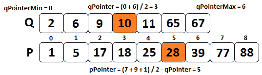

图 10.14–计算中值（步骤 1）

我们的算法的步骤 1 指定了*q**qPointer*-1】<=*p*[*pPointer*和*p*[*pPointer*-1】<=*q**qPointer*。显然，9<28，但 25>10，所以我们应用*步骤 2*，然后返回*步骤 1*。我们增加*qPointer*并减少*qPointer*，因此*qPointerMin*成为*qPointer*+1。新的*点位器*为（4+6）/2=5，新的*点位器*为（7+9+1）/2-5=3。下图将帮助您可视化此场景：

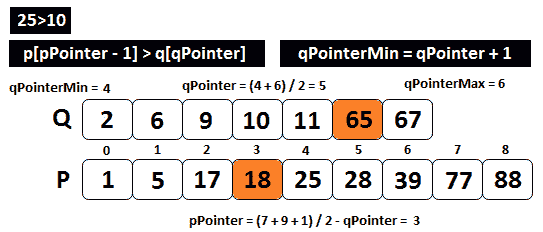

图 10.15——计算中值（步骤 2）

在这里，您可以看到新的*qPointer*和新的*pPointer*尊重我们算法的*步骤 1*，因为*q**qPointer*-1】是 11，小于*p**pPointer*，即 18；而*p**点*-1】为 17，小于*q**点*为 65。有了这个，我们发现完美的*qPointer*是 5。

最后，我们必须找到左侧的最大值和右侧的最小值，并基于两个数组的奇数或偶数长度，返回左侧的最大值或左侧的最大值和右侧的最小值的平均值。我们知道左侧的最大值是 max（*q**qPointer*-1】、*p**pppointer*-1]），所以 max（11，17）=17。我们也知道右侧的最小值是 min（*q**qPointer*、*p**pppointer*），所以 min（65，18）=18。由于长度之和为 7+9=16，我们计算中值是这两个值的平均值，因此平均值（17，18）=17.5。我们可以设想如下：

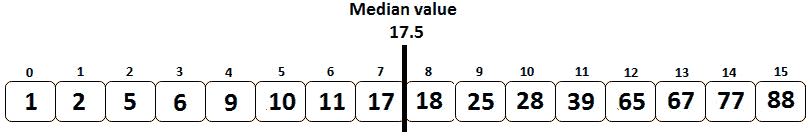

图 10.16–中值（最终结果）

将此算法放入代码会产生以下输出：

```java
public static float median(int[] q, int[] p) {
  int lenQ = q.length;
  int lenP = p.length;
  if (lenQ > lenP) {
    swap(q, p);
  }
  int qPointerMin = 0;
  int qPointerMax = q.length;
  int midLength = (q.length + p.length + 1) / 2;
  int qPointer;
  int pPointer;
  while (qPointerMin <= qPointerMax) {
    qPointer = (qPointerMin + qPointerMax) / 2;
    pPointer = midLength - qPointer;
    // perform binary search
    if (qPointer < q.length 
          && p[pPointer-1] > q[qPointer]) {
      // qPointer must be increased
      qPointerMin = qPointer + 1;
    } else if (qPointer > 0 
          && q[qPointer-1] > p[pPointer]) {
      // qPointer must be decreased
      qPointerMax = qPointer - 1;
    } else { // we found the poper qPointer
      int maxLeft = 0;
      if (qPointer == 0) { // first element on array 'q'?
        maxLeft = p[pPointer - 1];
      } else if (pPointer == 0) { // first element                                   // of array 'p'?
        maxLeft = q[qPointer - 1];
      } else { // we are somewhere in the middle -> find max
        maxLeft = Integer.max(q[qPointer-1], p[pPointer-1]);
      }
      // if the length of 'q' + 'p' arrays is odd, 
      // return max of left
      if ((q.length + p.length) % 2 == 1) {
        return maxLeft;
      }
      int minRight = 0;
      if (qPointer == q.length) { // last element on 'q'?
        minRight = p[pPointer];
      } else if (pPointer == p.length) { // last element                                          // on 'p'?
        minRight = q[qPointer];
      } else { // we are somewhere in the middle -> find min
        minRight = Integer.min(q[qPointer], p[pPointer]);
      }
      return (maxLeft + minRight) / 2.0f;
    }
  }
  return -1;
}
```

我们的解决方案以 O（log（max（*q.length，p.length*）时间执行。完整的应用程序称为*medianofsortedarray*。

## 编码挑战 15–一个的子矩阵

**亚马逊**、**微软**、**Flipkart**

问题 T1：考虑到你得到了一个矩阵，即 T3，M，T4，X，0，1（二进制矩阵）。编写一段代码，返回方子矩阵的最大大小，使其仅包含 1 的元素。

解 To1 T1 席：让我们考虑给定矩阵是下面图像（5x7 矩阵）中的一个矩阵：


图 10.17–给定的 5 x 7 二进制矩阵

如您所见，仅包含元素 1 的方子矩阵的大小为 3。蛮力方法，或天真方法，将是找到所有包含所有 1 的方子矩阵，并确定哪一个具有最大大小。然而，对于具有*z*=min（*m，n*的*m*x*n*矩阵，时间复杂度将为 O（z3mn）。您可以在本书附带的代码中找到蛮力实现。当然，在检查解决方案之前先挑战自己。

现在，让我们试着找到一个更好的方法。让我们考虑给定矩阵的大小是 T0，n，T1，x，x，2，2，n，3，3 席，研究 4x4 样本矩阵的几种情况。在 4x4 矩阵中，我们可以看到 1s 的最大平方子矩阵的大小可以是 3x3，因此在大小为*n*x*n*的矩阵中，1s 的最大平方子矩阵的大小可以是*n*-1*x*n*-1。此外，下图显示了两种基本情况，这两种基本情况对于*m x n*矩阵也是如此：*

 *

图 10.18–4x4 矩阵中 1s 的最大子矩阵

这些情况解释如下：

*   如果给定矩阵仅包含一行，则其中包含 1 的单元格将是方子矩阵的最大大小。因此，最大大小为 1。
*   如果给定矩阵仅包含一列，则其中包含 1 的单元格将是方子矩阵的最大大小。因此，最大大小为 1。

接下来，让我们考虑，子 T0 矩阵 T1 T1 席[〔T2〕I i Ty3Ty[] [ORT T4 j j JORT T5·TU]代表方子矩阵的最大大小，所有 1S 在单元结束（Adv.T6A. I，J Soad T7T.）：


图 10.19——总体复发关系

前面的图允许我们在给定矩阵和辅助*子矩阵*之间建立递归关系（一个与给定矩阵大小相同的矩阵，应根据递归关系填充）：

*   这不容易直觉，但我们可以看到，如果*矩阵**i**j*=0，那么*子矩阵**i**j*=0
*   If *matrix*[*i*][*j*] = 1, then *subMatrix*[*i*][*j*]

    =1+min（*子矩阵**i*-1】*j*、*子矩阵**i**j*-1】、*子矩阵**i*-1】*j*-1】）

如果我们将此算法应用于我们的 5 x 7 矩阵，则我们得到以下结果：

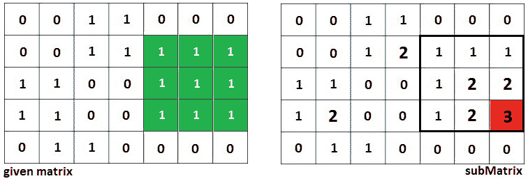

图 10.20–解析我们的 5 x 7 矩阵

将前面的基本情况和递归关系粘合在一起，会产生以下算法：

1.  创建与给定矩阵大小相同的辅助矩阵（*子矩阵*）。
2.  将给定矩阵的第一行和第一列复制到此辅助*子矩阵*（这些是基本情况）。
3.  For each cell from the given matrix (starting at (1, 1)), do the following:

    A.填写符合上述递推关系的*子矩阵*。

    B 跟踪*子矩阵*的最大元素，因为该元素为我们提供了包含所有 1 的子矩阵的最大大小。

以下实施澄清了任何剩余细节：

```java
public static int ofOneOptimized(int[][] matrix) {
  int maxSubMatrixSize = 1;
  int rows = matrix.length;
  int cols = matrix[0].length;                
  int[][] subMatrix = new int[rows][cols];
  // copy the first row
  for (int i = 0; i < cols; i++) {
    subMatrix[0][i] = matrix[0][i];
  }
  // copy the first column
  for (int i = 0; i < rows; i++) {
    subMatrix[i][0] = matrix[i][0];
  }
  // for rest of the matrix check if matrix[i][j]=1
  for (int i = 1; i < rows; i++) {
    for (int j = 1; j < cols; j++) {
      if (matrix[i][j] == 1) {
        subMatrix[i][j] = Math.min(subMatrix[i - 1][j - 1],
            Math.min(subMatrix[i][j - 1], 
             subMatrix[i - 1][j])) + 1;
        // compute the maximum of the current sub-matrix
        maxSubMatrixSize = Math.max(
          maxSubMatrixSize, subMatrix[i][j]);
      }
    }
  }        
  return maxSubMatrixSize;
}
```

由于我们迭代*m***n*次来填充辅助矩阵，因此该解的总体复杂度为 O（mn）。完整的申请称为*美沙酮*。

## 编码挑战 16–水最多的容器

**谷歌**、**Adobe**、**微软**

问题 T1A.问题：考虑到你已经得到了 Ty2 T2，正 T3，正 T5，P，T5，1，Po.T6，P，T7，2，…，Po.T9，P，T9，n，其中每个整数代表在一个点 T10 坐标。接下来，绘制*n*条垂直线，使得线*i*的两个端点位于（*i，p*i）和（*i*0）。写一段代码，找出两条线，这两条线与 X 轴一起构成了一个盛水的容器。

我们认为给定的整数是 1, 4, 6、2, 7, 3、8, 5 和 3。在问题陈述之后，我们可以绘制*n*垂直线（第 1 行：{（0,1）、（0,0）}，第 2 行：{（1,4）、（1,0）}，第 3 行：{（2,6）、（2,0）}，等等）。这可以在下图中看到：

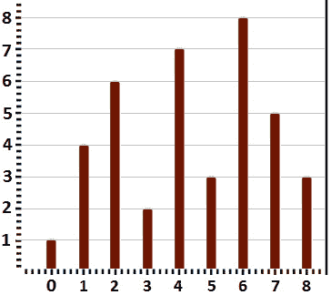

图 10.21–n 垂直线表示法

首先，让我们看看我们应该如何解释这个问题。我们必须找到盛水最多的容器。这意味着，在二维表示中，我们必须找到面积最大的矩形。在三维表示中，此容器的体积最大，因此它将包含最多的水。

用蛮力方法来考虑解决方案是非常简单的。对于每条线，我们计算显示其余线的面积，同时跟踪找到的最大面积。这需要两个嵌套循环，如下所示：

```java
public static int maxArea(int[] heights) {
  int maxArea = 0;
  for (int i = 0; i < heights.length; i++) {
    for (int j = i + 1; j < heights.length; j++) {
      // traverse each (i, j) pair
      maxArea = Math.max(maxArea, 
          Math.min(heights[i], heights[j]) * (j - i));
    }
  }
  return maxArea;
}
```

这段代码的问题是它的运行时是 O（n2）。更好的方法是采用一种称为*双指针*的技术。别担心——这是一种非常简单的技术，在你的工具带中非常有用。你永远不知道什么时候你会需要它！

我们知道我们正在寻找最大面积。因为我们谈论的是矩形区域，这意味着最大区域必须尽可能容纳*最大宽度*和*最大高度*之间的最佳报告。最大宽度从 0 到*n*-1（在我们的示例中，从 0 到 8）。要找到最大高度，我们必须在跟踪最大面积的同时调整最大宽度。为此，我们可以从最大宽度开始，如下图所示：

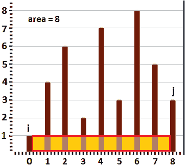

图 10.22–最大宽度区域

因此，如果我们用两个指针来标定最大宽度的边界，我们可以说，*i*=0，*j*=8（或*n*-1）。在这种情况下，盛水的容器的面积为*p*i*8=1*8=8。容器不能高于*p*i=1，因为水会流出。但是，我们可以增加*i*（*i*=1，*p*i=4）以获得更高的容器，并且可能是更大的容器，如下图所示：


图 10.23–增加 i 以获得更大的容器

一般来说，如果*p*i≤ *p*j，然后我们增加*i*；否则，我们将递减*j*。通过依次增加/减少*i*和*j*，我们可以获得最大面积。从左到右，从上到下，下图显示了以下六个步骤中的工作状态：

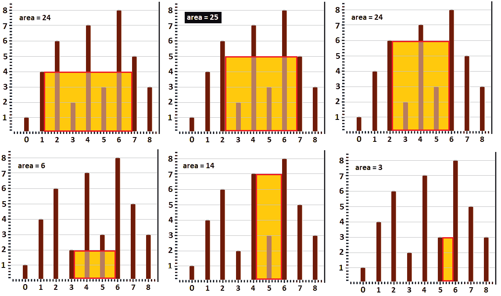

图 10.24–增加/减少 i 和 j 时的计算面积

步骤如下：

1.  在左上角的图像中，我们从*p*i>pj*、p*1*>p*8（4>3）开始减少*j*。
2.  在中上方的图像中，我们从*p*i*p*j*、p*1*<p*7（4<5）开始增加*i*。
3.  在右上角的图像中，我们从*p*i>pj*开始减少*j*，p*2*p>p*7（6>5）。
4.  在左下角的图像中，我们从*p*i*p*j*、p*2<*p*6（6<8）开始增加*i*。
5.  在中下方的图像中，我们从*p*i*p*j*、p*3*<p*6（2<8）开始增加*i*。
6.  在右下角的图像中，我们从*p*i*p*j*，p*4*<p*6（7<8）开始增加*i*。

完成！如果我们再增加*i*或减少*j*一次，则*i=j*，面积为 0。此时，我们可以看到最大面积为 25（中上图像）。这个技术被称为*两个指针*，在这种情况下可以通过以下算法实现：

1.  从最大面积 0*开始，i*=0，*j=n*-1
2.  While *i < j*, do the following:

    A.计算电流*i*和*j*的面积。

    B 相应地更新最大面积（如果需要）。

    C 如果*p*i*≤ p*j，然后*i++；*否则，*j--*。

就代码而言，我们有以下几点：

```java
public static int maxAreaOptimized(int[] heights) {
  int maxArea = 0;
  int i = 0; // left-hand side pointer            
  int j = heights.length - 1; // right-hand side pointer
  // area cannot be negative, 
  // therefore i should not be greater than j
  while (i < j) {
    // calculate area for each pair
    maxArea = Math.max(maxArea, Math.min(heights[i],
         heights[j]) * (j - i));
    if (heights[i] <= heights[j]) {
      i++; // left pointer is small than right pointer
    } else {
      j--; // right pointer is small than left pointer
    }
  }
  return maxArea;
}
```

此代码的运行时为 O（n）。完整的应用程序称为*ContainerMostWater*。

## 编码挑战 17–在循环排序数组中搜索

**亚马逊**、**谷歌**、**Adobe**、**微软**、**Flipkart**

问题 T1：考虑到你已经给出了一个没有重复的整数的整数排序数组。编写一个程序，在 O（logn）复杂度时间内搜索给定的*x*。

**解决方案**：如果我们能够在 O（n）复杂度时间内解决这个问题，那么蛮力方法是最简单的解决方案。数组中的线性搜索将给出搜索到的*x*的索引。然而，我们需要提出一个 O（logn）解决方案，因此我们需要从另一个角度来解决这个问题。

我们有足够多的线索可以让我们找到著名的二进制搜索算法，我们在[*第 7 章*](07.html#_idTextAnchor135)*、大 O 算法分析*和[*第 14 章*](14.html#_idTextAnchor340)*排序和搜索*中讨论了该算法。我们有一个排序数组，我们需要找到一个特定的值，我们需要在 O（logn）复杂度时间内完成。因此，这里有三条线索指向二进制搜索算法。当然，最大的问题是排序数组的循环性，因此我们不能应用普通的二进制搜索算法。

让我们考虑，m t0＝m，t1＝{= 11, 14, 23，24，- 1, 3, 5，6, 8, 9，10 }，和 Ont2，x，x，t3，t＝14，并且我们预期输出是指数 1。下图介绍了几种符号，并作为解决当前问题的指南：

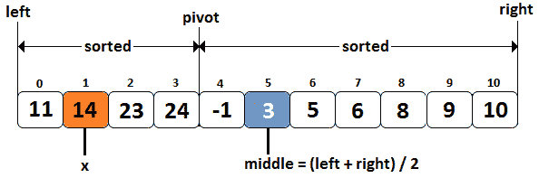

图 10.25–循环排序数组和二进制搜索算法

由于排序数组是圆形的，因此我们有一个*轴*。这是一个指向数组头部的索引。轴左侧的图元已旋转。当数组不旋转时，它将是{-1,3,5,6,8,9,10，**11,14,23,24**。现在，让我们看看基于二进制搜索算法的解决方案的步骤：

1.  我们采用二进制搜索算法，因此我们首先计算数组的*中间*为（*左+右*）/2。
2.  我们检查*x*=*m*[*中间*是否正确。如果是，我们返回*中间*。如果没有，我们继续下一步。
3.  Next, we check whether the right-half of the array is sorted. All the elements from the range [*middle, right*] are sorted if *m*[*middle*] <= *m*[*right*]:

    A.如果*x*>*m**中*和*x*<=*m**右*，那么我们忽略左半部分，设置*左*=【T14 中+1，并从*开始重复步骤 1*。

    B 如果*x*<=*m*[*middle*或*x>m*[*right*，则忽略右半部分，设置*right=middle*-1，并从*步骤 1*重复。

4.  If the right-half of the array is not sorted, then the left-half must be sorted:

    A.如果*x>=m**左**和*x<m**中*，则忽略右半部分，设置*右=中*-1，并从*步骤 1*重复。*

    *B 如果*x<m**左**或*x>=m**中*，则忽略左半部分，设置*左=中*+1，并从*步骤 1*重复。**

 **只要我们没有找到*x*或*左<=右*，我们就重复*步骤 1-4*。

让我们将前面的算法应用到我们的案例中。

所以，*中间*是（*左+右*）/2=（0+10）/2=5。自*m*起[5]≠14（记住 14 是*x*，我们继续*步骤 3*。由于*m*[5】<*m*[10]，我们得出结论，右半部分已排序。但是我们注意到*x>m**对*（14>10），所以我们采用*步骤 3b*。基本上，我们忽略了右半部分，设置了*right=middle*-1=5-1=4。我们再次应用*步骤 1*。

新的*中间*为（0+4）/2=2。自*m*起[2]≠14、我们继续*步骤 3*。由于*m*[2】>*m*[4]，我们得出结论，左半部分已排序。我们注意到*x*>*m**左*（14>11）和*x*<*m**中*（14<23），所以我们采用*步骤 4a*。我们忽略右半部分，将*设置为右*=*中*-1=2-1=1。我们再次应用*步骤 1*。

新的*中间*为（0+1）/2=0。自*m*起[0]≠14、我们继续*步骤 3*。由于*m*[0】<*m*[1]，我们得出结论，右半部分已排序。我们注意到*x*>*m**中*（14>11）和*x*=*m**对*（14=14），所以我们采用*步骤 3a*。忽略左半部分，设置*左=中*+1=0+1=1。我们再次应用*步骤 1*。

新的*中间*为（1+1）/2=1。由于*m*[1]=14，我们停止并返回 1 作为找到搜索值的数组的索引。

让我们将其转化为代码：

```java
public static int find(int[] m, int x) {
  int left = 0;
  int right = m.length - 1;
  while (left <= right) {
    // half the search space
    int middle = (left + right) / 2;
    // we found the searched value
    if (m[middle] == x) {
      return middle;
    }
    // check if the right-half is sorted (m[middle ... right])
    if (m[middle] <= m[right]) {
      // check if n is in m[middle ... right]
      if (x > m[middle] && x <= m[right]) {
        left = middle + 1;  // search in the right-half
      } else {
        right = middle - 1;	// search in the left-half
      }
    } else { // the left-half is sorted (A[left ... middle])
      // check if n is in m[left ... middle]
      if (x >= m[left] && x < m[middle]) {
        right = middle - 1; // search in the left-half
      } else {
        left = middle + 1; // search in the right-half
      }
    }
  }
  return -1;
}
```

完整的应用程序称为*SearchInCircularArray*。类似的问题将要求您在循环排序数组中查找最大值或最小值。虽然这两个应用程序在捆绑代码中都有*MaximuminCircularray*和*MinimuminCircularray*可供使用，但建议您使用迄今为止学到的知识，挑战自己，找到解决方案。

## 编码挑战 18–合并间隔

**亚马逊**、**谷歌**、**Adobe**、**微软**、**Flipkart**

问题 T1：考虑到阿纳尔 T2 给出了一系列区间[Adv.t3]开始，结束，To4Ty]类型。编写一段代码，合并所有重叠的间隔。

Po.T0.解 To1 T1：让我们考虑给定的区间是[12，15]，[12，17]，[2,4]，[16，18]，[4，7]，[9，11]，和[1,2]。在合并重叠区间后，我们得到以下结果：[1,7]，[9,11][12,18]。

我们可以从暴力手段开始。非常直观的是，我们取一个区间（将其表示为*p*i），并将其结束（*p*ei）与其余区间的开始进行比较。如果一个区间的起点（从其余区间开始）小于*p*的终点，那么我们可以合并这两个区间。合并间隔的末端成为这两个间隔末端的最大值。但是这种方法会在 O（n2）中执行，因此不会给面试官留下深刻印象。

然而，蛮力方法可以为我们提供一个重要的提示，让我们尝试更好的实现。在任何时刻，我们都必须将*p*的结束与另一个区间的开始进行比较。这一点很重要，因为它可以引导我们按照间隔的起点对间隔进行排序。这样，我们就大大减少了比较的次数。通过排序间隔，我们可以在线性遍历中组合所有间隔。

让我们尝试使用一个图形来表示我们的样本间隔，该间隔按其起始点升序排序（*p*si<*p*si+1】<*p*si+2）。而且，每个区间都是前瞻性的（*p*ei>*p*si、*p*ei+1】*p*si+1、*p*ei+2】*p*si+2，等等）。这将有助于我们理解即将介绍的算法：

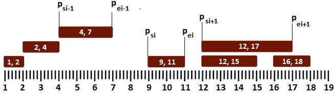

图 10.26–对给定间隔进行排序

从上图可以看出，如果*p*的开始大于前一个*p*（*p*si>*p*ei-1）的结束，那么下一个*p*的开始大于前一个*p*（*p*的结束 si+1>*p*ei-1），因此无需将上一个*p*与下一个*p*进行比较。换句话说，如果*p*i 与*p*i-1 不重叠，则*p*i+1 不能与*p*i-1 重叠，因为*p*i+1 的起始必须大于或等于【T31 pi。

如果*p*si 小于*p*ei-1，那么我们应该更新*p*ei-1，最大值在*p*ei-1 和*p*ei 之间，并移动到*p*ei+1。这可以通过堆栈完成，如下所示：


图 10.27–使用堆栈解决问题

以下是发生的步骤：

**步骤 0**：我们从一个空堆栈开始。

**步骤 1**：由于堆栈为空，我们将第一个间隔（[1，2]）推入堆栈。

**第二步**：接下来我们关注第二个区间（[2,4]）。[2，4]的起点等于从堆栈顶部开始的间隔的终点[1，2]，因此我们不会将[2，4]推入堆栈。我们继续比较[1,2]和[2,4]的结尾。由于 2 小于 4，我们将区间[1,2]更新为[1,4]。因此，我们将[1,2]与[2,4]合并。

**第三步**：接下来我们关注区间[4,7]。[4,7]的起点等于从堆栈顶部开始的间隔的终点[1,4]，因此我们不会将[4,7]推入堆栈。我们继续比较[1,4]和[4,7]的结尾。由于 4 小于 7，我们将区间[1,4]更新为[1,7]。因此，我们将[1,4]与[4,7]合并。

**步骤 4**：接下来我们关注区间[9,11]。[9,11]的起点大于堆栈顶部的间隔终点[1,7]，因此间隔[1,7]和[9,11]不会重叠。这意味着我们可以将 interval[9,11]推入堆栈。

**步骤 5**：接下来我们关注区间[12,15]。[12,15]的起点大于堆栈[9,11]顶部的间隔终点，因此间隔[9,11]和[12,15]不会重叠。这意味着我们可以将 interval[12,15]推入堆栈。

**步骤 6**：接下来我们关注区间[12,17]。[12,17]的起点等于从堆栈顶部开始的间隔的终点[12,15]，因此我们不会将[12,17]推入堆栈。我们继续比较[12,15]的结尾和[12,17]的结尾。由于 15 小于 17，我们将区间[12,15]更新为[12,17]。在这里，我们将[12,15]与[12,17]合并。

**步骤 7**：最后，我们关注区间[16,18]。[16,18]的起点小于从堆栈顶部开始的间隔的终点[12,17]，因此间隔[16,18]和[12,17]是重叠的。这一次，我们必须从堆栈顶部更新间隔的末尾，最大值介于该间隔的末尾和[16,18]之间。因为 18 大于 17，所以从堆栈顶部开始的间隔变为[12,17]。

现在，我们可以弹出堆栈的内容以查看合并的间隔[[12,18]、[9,11]、[1,7]]，如下图所示：


图 10.28——合并区间

基于这些步骤，我们可以创建以下算法：

1.  根据给定时间间隔的起始值按升序排序。
2.  将第一个间隔推入堆栈。
3.  For the rest of intervals, do the following:

    A.如果当前间隔与堆栈顶部的间隔不重叠，则将其推入堆栈。

    B 如果当前间隔与堆栈顶部的间隔重叠，并且当前间隔的结束时间大于堆栈顶部的结束时间，则使用当前间隔的结束时间更新堆栈顶部。

4.  最后，堆栈包含合并的间隔。

在代码方面，该算法如下所示：

```java
public static void mergeIntervals(Interval[] intervals) {
  // Step 1
  java.util.Arrays.sort(intervals,
          new Comparator<Interval>() {
    public int compare(Interval i1, Interval i2) {
      return i1.start - i2.start;
    }
  });
  Stack<Interval> stackOfIntervals = new Stack();
  for (Interval interval : intervals) {
    // Step 3a
    if (stackOfIntervals.empty() || interval.start
           > stackOfIntervals.peek().end) {
        stackOfIntervals.push(interval);
    }
    // Step 3b
    if (stackOfIntervals.peek().end < interval.end) {
      stackOfIntervals.peek().end = interval.end;
    }
  }
  // print the result
  while (!stackOfIntervals.empty()) {
    System.out.print(stackOfIntervals.pop() + " ");
  }
}
```

此代码的运行时为 O（n logn），堆栈的辅助空间为 O（n）。虽然面试官应该对这种方法感到满意，但他/她可能会要求你进行优化。更准确地说，我们可以放弃堆栈并获得 O（1）的复杂度空间吗？

如果我们丢弃堆栈，那么我们必须在适当的位置执行合并操作。可以做到这一点的算法不言自明：

1.  根据给定时间间隔的起始值按升序排序。
2.  For the rest of the intervals, do the following:

    A.如果当前间隔不是第一个间隔且与前一个间隔重叠，则合并这两个间隔。对之前的所有间隔执行相同的操作。

    B 否则，将当前间隔添加到间隔的输出数组中。

请注意，这一次，间隔是按开始的降序排列的。这意味着我们可以通过比较前一个间隔的开始与当前间隔的结束来检查两个间隔是否重叠。让我们看看这方面的代码：

```java
public static void mergeIntervals(Interval intervals[]) {
  // Step 1
  java.util.Arrays.sort(intervals,
        new Comparator<Interval>() {
    public int compare(Interval i1, Interval i2) {
      return i2.start - i1.start;
    }
  });
  int index = 0;
  for (int i = 0; i < intervals.length; i++) {
    // Step 2a
    if (index != 0 && intervals[index - 1].start 
             <= intervals[i].end) {
      while (index != 0 && intervals[index - 1].start 
             <= intervals[i].end) {
        // merge the previous interval with 
        // the current interval  
        intervals[index - 1].end = Math.max(
          intervals[index - 1].end, intervals[i].end);
        intervals[index - 1].start = Math.min(
          intervals[index - 1].start, intervals[i].start);
        index--;
      }
    // Step 2b
    } else {
      intervals[index] = intervals[i];
    }
    index++;
  }
  // print the result        
  for (int i = 0; i < index; i++) {
    System.out.print(intervals[i] + " ");
  }
}
```

此代码的运行时为 O（n logn），辅助空格为 O（1）。完整的应用程序称为*合并间隔*。

## 编码挑战 19–汽油铺环游

**亚马逊**、**谷歌**、**Adobe**、**微软**、**Flipkart**

问题 T1：考虑到你已经得到了一个圆形路线的汽油舱。每个汽油铺包含两个数据：燃油量（*燃油*[]）和当前汽油铺到下一个汽油铺的距离（*距离*[]）。接下来，你有一辆装有无限油箱的卡车。编写一段代码，计算卡车应从何处开始以完成整个行程的第一个点。你在一个汽油铺上用一个空油箱开始旅程。使用 1 升汽油，卡车可以行驶 1 个单位的距离。

Po.T0.解决方案：考虑到你已经得到了以下数据：Po.T2。Det，T3，Tube＝{ 5, 4, 6，3, 5, 7 }，Ont4。燃料 ORT T5＝{ 3, 3, 5，5, 6, 8 }。

让我们使用以下图片更好地了解此问题的背景，并支持我们找到解决方案：


图 10.29–卡车循环巡更示例

从 0 点到 5 点，我们有六个汽油铺。在图像的左侧，您可以看到给定环形路线的草图和汽油铺的分布。第一个汽油铺有 3 升汽油，到下一个汽油铺的距离是 5 个单位。第二个汽油铺有 3 升汽油，到下一个汽油铺的距离是 4 个单位。第三个汽油铺有 5 升汽油，到下一个汽油铺的距离是 6 个单位，依此类推。显然，如果我们想从油铺*X*到油铺*Y*，一个至关重要的条件是*X*和*Y*之间的距离小于或等于卡车油箱中的燃油量。例如，如果卡车从汽油铺 0 开始行驶，则它无法到达汽油铺 1，因为这两个汽油铺之间的距离为 5 个单位，并且卡车油箱中只能有 3 升汽油。另一方面，如果卡车从汽油铺 3 开始行驶，那么它可以到汽油铺 4，因为卡车的油箱中将有 5 升汽油。事实上，如图右侧所示，本案例的解决方案是从 3 号汽油铺开始，油箱中有 5 升汽油——慢慢来，用一些纸和笔完成整个过程。

蛮力（或天真）的方法可以依赖于一个直截了当的陈述：我们从每个汽油铺开始，并尝试完成整个旅程。这很容易实现，但其运行时将为 O（n2）。挑战自己，提出更好的实施方案。

为了更有效地解决这个问题，我们需要了解并利用以下事实：

*   如果燃料的*总和≥ 距离之和*，则可完成游览。
*   如果汽油铺*X*无法按*X 的顺序到达汽油铺*Z*→ Y→ Z*，那么*Y*也不能来。

虽然第一个子弹是常识概念，但第二个子弹需要一些额外的证据。下面是第二个项目背后的原因：

如果*燃料**X**距离**X*，那么*X*甚至无法达到*Y*，因此从*X*到达*Z*，那么*燃料**X*必须是*≥ 地区**X*。

鉴于*X*无法到达*Z*，我们有*燃料**X**+燃料**Y**距离**X**【T18 Y 燃料[*X**≥ 地区**X*。因此，*燃油**Y**<距离**Y*和*Y*无法到达*Z*。*

 *基于这两点，我们可以提出以下实施方案：

```java
public static int circularTour(int[] fuel, int[] dist) {
  int sumRemainingFuel = 0; // track current remaining fuel
  int totalFuel = 0;        // track total remaining fuel
  int start = 0;
  for (int i = 0; i < fuel.length; i++) {
    int remainingFuel = fuel[i] - dist[i];
    //if sum remaining fuel of (i-1) >= 0 then continue 
    if (sumRemainingFuel >= 0) {
      sumRemainingFuel += remainingFuel;
      //otherwise, reset start index to be current
    } else {
      sumRemainingFuel = remainingFuel;
      start = i;
    }
    totalFuel += remainingFuel;
  }
  if (totalFuel >= 0) {
    return start;
  } else {
    return -1;
  }
}
```

要理解此代码，请尝试使用一些纸和笔通过代码传递给定的数据集。此外，您可能希望尝试以下几套：

```java
// start point 1
int[] dist = {2, 4, 1};
int[] fuel = {0, 4, 3};
// start point 1
int[] dist = {6, 5, 3, 5};
int[] fuel = {4, 6, 7, 4};
// no solution, return -1
int[] dist = {1, 3, 3, 4, 5};
int[] fuel = {1, 2, 3, 4, 5};
// start point 2
int[] dist = {4, 6, 6};
int[] fuel = {6, 3, 7};
```

此代码的运行时为 O（n）。完整的申请称为*石油桶*。

## 编码挑战 20–雨水收集

**亚马逊**、**谷歌**、**Adobe**、**微软**、**Flipkart**

问题 T1：考虑到你已经给出了一组不同高度的杆（非负整数）。条的宽度等于 1。编写一段代码，计算可以困在钢筋内的水量。

Po.T0.解 To1 T1：让我们考虑给定的条集是一个数组，如下：Po.T2 阿纳尔 T3 Tube = { 1, 0, 0，4, 0, 2，0, 1, 6，2, 3 }。下图是这些钢筋高度的草图：


图 10.30–给定钢筋组

现在，雨水正填满这些酒吧间的空间。因此，在下雨之后，我们将有如下情况：


图 10.31–雨后的给定钢筋

这里的最大水量等于 16。这个问题的解决取决于我们如何看待水。例如，我们可以查看酒吧之间的水或每个酒吧顶部的水。第二种观点正是我们想要的。

查看下图，其中有一些关于如何隔离每个酒吧顶部的水的附加指南：

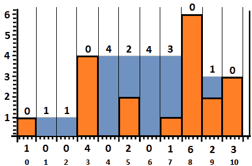

图 10.32–每个酒吧顶部的水

所以，在 0 条以上，我们没有水。在第一栏上方，我们有一个单位的水。在第二栏上面，我们有一个单位的水，依此类推。如果我们把这些值加起来，那么我们得到了 0+1+1+0+4+2+4+3+0+1+0=16，这是我们的精确水量。然而，为了确定*x*条顶部的水量，我们必须知道左侧和右侧最高条之间的最小值。换句话说，对于每个条，即 1，2，3。。。9（请注意，我们不使用条形图 0 和 10，因为它们是边界），我们必须确定左侧和右侧的最高条形图，并计算它们之间的最小值。下面的图像显示我们的计算（中间的范围从 1 到 9）：

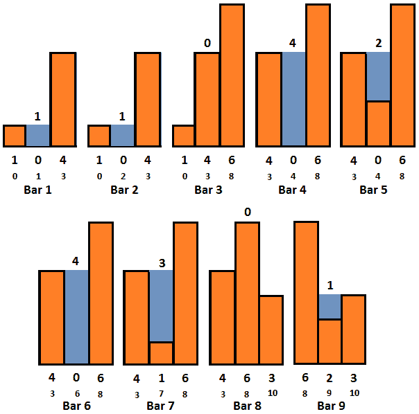

图 10.33–左侧和右侧的最高杆

因此，我们可以得出结论，一个简单的解决方案是遍历这些条，在左侧和右侧找到最高的条。这两个钢筋中的最小钢筋可利用如下：

*   如果最小值小于当前条的高度，则当前条不能在其顶部蓄水。
*   如果最小值大于当前条的高度，则当前条可容纳水量，等于其顶部的最小值与当前条高度之差。

因此，这个问题可以通过计算每个条左右两侧的最高条来解决。这些语句的有效实现包括在 O（n）时间内预计算每个条的左侧和右侧的最高条。然后，我们需要使用结果来找到每个酒吧顶部的水量。以下代码应澄清任何其他细节：

```java
public static int trap(int[] bars) {
  int n = bars.length - 1;
  int water = 0;
  // store the maximum height of a bar to 
  // the left of the current bar
  int[] left = new int[n];
  left[0] = Integer.MIN_VALUE;
  // iterate the bars from left to right and 
  // compute each left[i]
  for (int i = 1; i < n; i++) {
    left[i] = Math.max(left[i - 1], bars[i - 1]);
  }
  // store the maximum height of a bar to the 
  // right of the current bar
  int right = Integer.MIN_VALUE;
  // iterate the bars from right to left 
  // and compute the trapped water
  for (int i = n - 1; i >= 1; i--) {
    right = Math.max(right, bars[i + 1]);
    // check if it is possible to store water 
    // in the current bar           
    if (Math.min(left[i], right) > bars[i]) {
      water += Math.min(left[i], right) - bars[i];
    }
  }
  return water;
}
```

此代码的运行时间为 O（n），对于*左侧的*[]数组，辅助空格为 O（n）。通过使用基于堆栈的实现可以获得类似的大 O（捆绑代码也包含此实现）。编写一个具有 O（1）空间的实现怎么样？

好的，我们不需要维护一个大小为*n*的数组来存储所有左侧最大高度，我们可以使用两个变量来存储最大值，直到该条（这种技术称为*两个指针**。*您可能还记得，您在之前的一些编码挑战中观察到了这一点。这两个指针是**maxBarLeft**和**maxBarRight**。实施情况如下：

```java
public static int trap(int[] bars) {
  // take two pointers: left and right pointing 
  // to 0 and bars.length-1        
  int left = 0;
  int right = bars.length - 1;
  int water = 0;
  int maxBarLeft = bars[left];
  int maxBarRight = bars[right];
  while (left < right) {
    // move left pointer to the right
    if (bars[left] <= bars[right]) {
      left++;
      maxBarLeft = Math.max(maxBarLeft, bars[left]);
      water += (maxBarLeft - bars[left]);
    // move right pointer to the left
    } else {
      right--;
      maxBarRight = Math.max(maxBarRight, bars[right]);
      water += (maxBarRight - bars[right]);
    }
  }
  return water;
}
```

这段代码的运行时是 O（n）和 O（1）空间。完整的应用程序称为*TrapRainWater*。

## 编码挑战 21–买卖股票

**亚马逊**、**微软**

问题阿纳尔：考虑到你已经给出了一组正整数代表一天的股票价格。因此，数组的第*i*个元素表示该股票在第*i*天的价格。一般来说，您不能同时进行多笔交易（买卖顺序称为交易），您必须在再次购买之前卖出股票。编写一段代码，在以下任一场景中返回最大利润（通常，面试官会给出以下场景之一）：

*   你只能买卖股票一次。
*   你只能买卖股票两次。
*   你可以无限次买卖股票。
*   您只允许买卖股票*k*次（*k*已给出）。

我们认为，给定的价格数组是价格 T2，价格 T3＝{ 200, 500, 1000，700, 30, 400，900, 400, 550 }。让我们来处理前面的每个场景。

### 只买卖股票一次

在这种情况下，我们必须通过只买卖一次股票来获得最大利润。这非常简单而且直观。这个想法是在股票最便宜的时候买进，在最贵的时候卖出。让我们通过以下价格趋势图来确定这一说法：

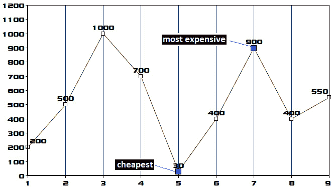

图 10.34–价格趋势图

根据上图，我们应在第 5 天以 30 的价格购买股票，并在第 7 天以 900 的价格出售。这样，利润将达到最大值（870）。为了确定最大利润，我们可以采用一个简单的算法，如下所示：

1.  考虑到第 1 天最便宜的价格席上没有利润（最高利润 0）。
2.  Iterate the rest of the days (2, 3, 4, ...) and do the following:

    A.每天更新*最大利润*为最大值（*当前最大利润，*（*今日价格-最便宜价格*）。

    B 将*最便宜价格*更新为 min（*当前最便宜价格，今天的价格*。

让我们把这个算法应用到我们的数据中。因此，我们认为最便宜的价格是 200 席（第 1 天的价格），而最大利润是 0。下图显示了每天的计算：

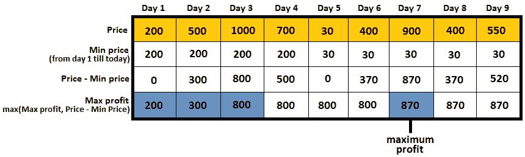

图 10.35——计算最大利润

**第一天**：*最低价格*为 200；第 1 天的*价格-最低价格*=0；因此，到目前为止*最大利润*为 200。

**第 2 天**：*最低价格*为 200（自 500>200 起）；第 2 天的*价格-最低价格*=300；因此，迄今为止*最大利润*为 300（自 300>200 起）。

**第 3 天**：*最低价格*为 200（自 1000>200 起）；第 3 天的*价格-最低价格*=800；因此，迄今为止*最大利润*为 800（自 800>300 起）。

**第 4 天**：*最低价格*为 200（自 700>200 起）；第 4 天的*价格-最低价格*=500；因此，到目前为止的*最大利润*为 800（自 800>500 起）。

**第 5 天**：*最低价格*为 30（自 200>30 起）；第 5 天的*价格-最低价格*=0；因此，迄今为止*最大利润*为 800（自 800>0 起）。

**第 6 天**：*最低价格*为 30（自 400>30 起）；第 6 天的*价格-最低价格*=370；因此，迄今为止的*最大利润*为 800（自 800>370 起）。

**第 7 天**：*最低价格*为 30（自 900>30 起）；第 7 天的*价格-最低价格*=870；因此，到目前为止*最大利润*为 870（自 870>800 起）。

**第 8 天**：*最低价格*为 30（自 400>30 起）；第 8 天的*价格-最低价格*=370；因此，迄今为止的*最大利润*为 870（自 870>370 起）。

**第 9 天**：*最低价格*为 30（自 550>30 起）；第 9 天的*价格-最低价格*=520；因此，迄今为止的*最大利润*为 870（自 870>520 起）。

最后，*最大利润*为 870。

让我们看看代码：

```java
public static int maxProfitOneTransaction(int[] prices) {
  int min = prices[0];
  int result = 0;
  for (int i = 1; i < prices.length; i++) {
    result = Math.max(result, prices[i] - min);
    min = Math.min(min, prices[i]);
  }
  return result;
}
```

此代码的运行时为 O（n）。让我们来处理下一个场景。

### 只买卖股票两次

在这种情况下，我们必须通过只买卖两次股票来获得最大利润。这个想法是在股票最便宜的时候买进，在最贵的时候卖出。我们这样做两次。让我们通过以下价格趋势图来确定这一说法：


图 10.36–价格趋势图

根据上图，我们应该在第一天以 200 的价格买入股票，在第三天以 1000 的价格卖出。这笔交易带来 800 英镑的利润。接下来，我们应该在第 5 天以 30 的价格购买股票，然后在第 7 天以 900 的价格出售。这笔交易带来 870 英镑的利润。因此，最大利润为 870+800=1670。

为了确定*最大利润*，我们必须找到两个利润最高的交易。我们可以通过动态规划和*分治*技术来实现这一点。我们*将*算法分为两部分。算法的第一部分包含以下步骤：

1.  考虑一下第 1 天最便宜的价格。
2.  Iterate the rest of the days (2, 3, 4, ...) and do the following:

    A.将*最便宜价格*更新为 min（*当前最便宜价格，今天的价格*。

    B 跟踪今天的*最大利润*作为最大值（*前一天的最大利润*，*今天价格-最便宜价格*）。

在这个算法的末尾，我们将有一个数组（让我们将其表示为*left*[]），表示每天（包括当天）之前可以获得的最大利润。例如，直到第 3 天（包括第 3 天），最大利润为 800，因为您可以在第 1 天以 200 的价格购买，在第 3 天以 1000 的价格出售；或者直到第 7 天（包括第 7 天），最大利润为 870，因为您可以在第 5 天以 30 的价格购买，在第 7 天以 900 的价格出售，依此类推。

该阵列通过*步骤 2b*获得。我们可以将其表示为我们的数据，如下所示：


图 10.37——从第 1 天开始计算每天前的最大利润

在我们介绍了算法的第二部分之后，*左*数组对。接下来，算法的第二部分如下所示：

1.  考虑一下最后一天最贵的价格。
2.  Iterate the rest of the days from (*last*-1) to the *first* day(*last-1, last-2, last-3, ...*) and do the following:

    A.将*最贵价格*更新为最高（*当前最贵价格，今日价格*。

    B 跟踪今天的*最大利润*作为第二天的最大利润（*最大利润，（最贵价格-今天价格*）。

在这个算法的末尾，我们将有一个数组（我们将其表示为*right*[]），表示每天（包括当天）之后可以获得的最大利润。例如，在第 3 天（包括第 3 天）之后，最大利润为 870，因为您可以在第 5 天以 30 的价格购买，在第 7 天以 900 的价格出售；或者在第 7 天之后，最大利润为 150，因为您可以在第 8 天以 400 的价格购买，在第 9 天以 550 的价格出售，依此类推。该阵列通过*步骤 2b*获得。我们可以将其表示为我们的数据，如下所示：


图 10.38——从前一天开始计算每天之后的最大利润

到目前为止，我们已经完成了*分割*部分。现在，是*征服*部分的时候了。两次交易可实现的*最大利润*取最大值（*左**天**+右**天*）。我们可以在下图中看到这一点：

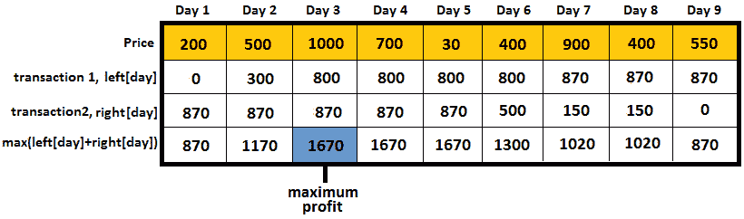

图 10.39——计算交易 1 和交易 2 的最终最大利润

现在，让我们看看代码：

```java
public static int maxProfitTwoTransactions(int[] prices) {
  int[] left = new int[prices.length];
  int[] right = new int[prices.length];
  // Dynamic Programming from left to right
  left[0] = 0;
  int min = prices[0];
  for (int i = 1; i < prices.length; i++) {
    min = Math.min(min, prices[i]);
    left[i] = Math.max(left[i - 1], prices[i] - min);
  }
  // Dynamic Programming from right to left
  right[prices.length - 1] = 0;
  int max = prices[prices.length - 1];
  for (int i = prices.length - 2; i >= 0; i--) {
    max = Math.max(max, prices[i]);
    right[i] = Math.max(right[i + 1], max - prices[i]);
  }
  int result = 0;
  for (int i = 0; i < prices.length; i++) {
    result = Math.max(result, left[i] + right[i]);
  }
  return result;
}
```

此代码的运行时为 O（n）。现在，让我们来处理下一个场景。

### 买卖股票的次数不限

在这种情况下，我们必须通过无限次买卖股票来获得最大利润。您可以通过以下价格趋势图识别此声明：


图 10.40–价格趋势图

根据上图，我们应该在第一天以 200 的价格购买股票，然后在第二天以 500 的价格出售。这笔交易带来 300 英镑的利润。接下来，我们应该在第 2 天以 500 的价格购买股票，然后在第 3 天以 1000 的价格出售。这笔交易带来 500 英镑的利润。当然，我们可以通过在第一天以 200 的价格买入，在第三天以 1000 的价格卖出，将这两项交易合并为一项交易。同样的逻辑可以应用到第 9 天。最终最高利润将为 1820 英镑。慢慢来，确定从第一天到第九天的所有交易。

通过研究前面的价格趋势图，我们可以看到，这个问题可以看作是试图找到所有的上升序列。下图突出显示了数据的升序：


图 10.41–上升序列

基于以下算法，查找所有升序序列是一项简单的任务：

1.  考虑到最大利润席 0（无利润）。
2.  Iterate all the days, starting from day 2, and do the following:

    A.计算*今天的价格*与*前一天的价格*之间的差额（例如，在第一次迭代时，计算（第 2 天的价格-第 1 天的价格），所以 500-200）。

    B 如果计算的差值为正，则通过该差值增加*最大利润*。

在这个算法的最后，我们将知道最终的*最大利润*。如果我们将此算法应用于我们的数据，那么我们将获得以下输出：


图 10.42——计算最终最大利润

**第 1 天**：*最大利润*为 0。

**第 2 天**：*最大利润*为 0+（500-200）=0+300=300。

**第 3 天**：*最大利润*为 300+（1000-500）=300+500=800。

**第 4 天**：自 700-1000<0 起*最高利润*保持在 800。

**第 5 天**：*最高利润*自 30-700<0 起保持 800。

**第 6 天**：*最大利润*为 800+（400-30）=800+370=1170。

**第 7 天**：*最大利润*为 1170+（900-400）=1170+500=1670。

**第 8 天**：自 400-900<0 起*最高利润*保持在 1670。

**第 9 天**：*最大利润*为 1670+（550-400）=1670+150=1820。

最终*最大利润*为 1820。

就代码而言，如下所示：

```java
public static int maxProfitUnlimitedTransactions(
          int[] prices) {
  int result = 0;
  for (int i = 1; i < prices.length; i++) {
    int diff = prices[i] - prices[i - 1];
    if (diff > 0) {               
      result += diff;
    }
  }
  return result;
}
```

此代码的运行时间为 O（n）。接下来，让我们讨论最后一个场景。

### 只买卖股票 k 次（给出 k）

这个场景是*只买卖股票两次*的广义版本。脚本主要是通过解决这个场景，我们也解决了*k*=2 的*只买卖股票两次*场景。

根据我们在前面场景中的经验，我们知道可以通过动态规划来解决这个问题。更准确地说，我们需要跟踪两个阵列：

*   当最后一笔交易发生在*q*日时，第一个数组将跟踪*p*交易的*最大利润*。
*   第二个数组将跟踪*p*交易的*最大利润*，直到*q*日。

如果我们将第一个数组表示为**temp**，将第二个数组表示为**结果**，那么我们有以下两个关系：

1.  ```java
    temp[p] = Math.max(result[p - 1] 
    ```

    ```java
                + Math.max(diff, 0), temp[p] + diff);
    ```

```java
result[p] = Math.max(temp[p], result[p]);
```

为了更好地理解，让我们将这些关系放在代码上下文中：

```java
public static int maxProfitKTransactions(
          int[] prices, int k) {
  int[] temp = new int[k + 1];
  int[] result = new int[k + 1];
  for (int q = 0; q < prices.length - 1; q++) {
    int diff = prices[q + 1] - prices[q];
    for (int p = k; p >= 1; p--) {
      temp[p] = Math.max(result[p - 1] 
              + Math.max(diff, 0), temp[p] + diff);
      result[p] = Math.max(temp[p], result[p]);
     }
  }
  return result[k];
}
```

该代码的运行时间为 O（kn）。完整的应用程序称为*BestTimeToBuySellStock*。

## 编码挑战 22–最长序列

**亚马逊**、**Adobe**、**微软**

问题阿纳尔：考虑到你已经有了整数数组。编写一段代码，查找最长的整数序列。请注意，序列只包含连续的不同元素。给定数组中元素的顺序并不重要。

Po.T0.解决方案 T1：我们假设给定的数组是{4, 2, 9，5, 12, 6，8 }。最长的序列包含三个元素，由 4、5 和 6 组成。或者，如果给定的数组是{2,0,6,1,4,3,8}，那么最长的序列包含五个元素，由 2,0,1,4 和 3 组成。再次注意，给定数组中元素的顺序并不重要。

蛮力或朴素的方法包括按升序对数组排序，并查找最长的连续整数序列。由于数组已排序，因此间隙会打断序列。但是，这种实现的运行时为 O（n logn）。

更好的方法是使用*散列*技术。让我们使用下图作为解决方案的支持：


图 10.43–序列集

首先，我们从给定的数组{4,2,9,5,12,6,8}构建一个集合。如上图所示，集合不保持插入顺序，但这对我们来说并不重要。接下来，我们迭代给定的数组，对于每个被遍历的元素（让我们将其表示为*e*，我们在集合中搜索*e*-1。例如，当我们遍历 4 时，我们在集合中搜索 3，当我们遍历 2 时，我们在集合中搜索 1，依此类推。如果*e-*1 不在集合中，那么我们可以说*e*代表一个新的连续整数序列的开始（在这种情况下，我们有从 12、8、4 和 2 开始的序列）；否则，它已经是现有序列的一部分。当我们开始一个新序列时，我们继续搜索集合中的连续元素：*e*+1、*e*+2、*e*+3，等等。只要我们找到连续的元素，我们就计算它们。如果找不到 e+*i*（1，2，3，…），则当前序列是完整的，我们知道其长度。最后，我们将此长度与迄今为止发现的最长长度进行比较，并相应地进行处理。

这方面的代码非常简单：

```java
public static int findLongestConsecutive(int[] sequence) {
  // construct a set from the given sequence
  Set<Integer> sequenceSet = IntStream.of(sequence)
    .boxed()
    .collect(Collectors.toSet());
  int longestSequence = 1;
  for (int elem : sequence) {
    // if 'elem-1' is not in the set then     // start a new sequence
    if (!sequenceSet.contains(elem - 1)) {
      int sequenceLength = 1;
      // lookup in the set for elements 
      // 'elem + 1', 'elem + 2', 'elem + 3' ...
      while (sequenceSet.contains(elem + sequenceLength)) {
        sequenceLength++;
      }
      // update the longest consecutive subsequence
      longestSequence = Math.max(
        longestSequence, sequenceLength);
    }
  }
  return longestSequence;
}
```

此代码的运行时为 O（n），辅助空间为 O（n）。挑战自我，打印最长的序列。完整的应用程序称为*最长连续序列*。

## 编码挑战 23–计算游戏分数

**亚马逊**、**谷歌**、**微软**

问题 T1：考虑一个游戏 T2，玩家在一个动作中可以得分 3, 5，或者 10 分。此外，考虑到你已经得到了一个总得分。编写一段代码，返回达到此分数的方法数。

我们认为给定的分数是 33。有七种方法可以达到这个分数：

(10+10+10+3) = 33

(5+5+10+10+3) = 33

(5+5+5+5+10+3) = 33

(5+5+5+5+5+5+3) = 33

(3+3+3+3+3+3+3+3+3+3+3) = 33

(3+3+3+3+3+3+5+5+5) = 33

(3+3+3+3+3+3+5+10) = 33

我们可以借助动态规划来解决这个问题。我们创建一个表（数组），其大小为等于*n*+1。在此表中，我们存储了从 0 到*n*的所有分数的计数。对于移动 3、5 和 10，我们增加数组中的值。《守则》不言自明：

```java
public static int count(int n) {
  int[] table = new int[n + 1];
  table[0] = 1;
  for (int i = 3; i <= n; i++) {
    table[i] += table[i - 3];
  }
  for (int i = 5; i <= n; i++) {
    table[i] += table[i - 5];
  }
  for (int i = 10; i <= n; i++) {
    table[i] += table[i - 10];
  }
  return table[n];
}
```

这段代码的运行时是 O（n），有 O（n）个额外空间。完整的应用程序称为*CountScore3510*。

## 编码挑战 24–检查重复项

**亚马逊**、**谷歌**、**Adobe**

问题 T1：考虑到你已经得到了整数数组，阿纳尔。如果此数组包含重复项，请编写几个返回**true**的解决方案。

**解**：假设给定的整数是*arr*={1,4,5,4,2,3}，所以 4 是一个重复的。蛮力方法（或朴素方法）将依赖嵌套循环，如以下简单代码所示：

```java
public static boolean checkDuplicates(int[] arr) {
  for (int i = 0; i < arr.length; i++) {
    for (int j = i + 1; j < arr.length; j++) {
      if (arr[i] == arr[j]) {
        return true;
      }
    }
  }
  return false;
}
```

这个代码非常简单，但它在 O（n2）和 O（1）辅助空间中执行。我们可以在检查重复项之前对数组进行排序。如果数组已排序，则可以比较相邻元素。如果任何相邻元素相等，我们可以说数组包含重复项：

```java
public static boolean checkDuplicates(int[] arr) {
  java.util.Arrays.sort(arr);
  int prev = arr[0];
  for (int i = 1; i < arr.length; i++) {
    if (arr[i] == prev) {
      return true;
    }
    prev = arr[i];
  }
  return false;
}
```

这段代码在 O（n logn）（因为我们对数组进行排序）和 O（1）辅助空间中执行。如果我们要编写在 O（n）时间中执行的实现，我们还必须考虑辅助 O（n）空间。例如，我们可以依赖*哈希*（如果您不熟悉哈希的概念，请阅读[*第 6 章*](06.html#_idTextAnchor080)*、面向对象编程*、*哈希表*问题）。在 Java 中，我们可以通过内置的**哈希集**实现来使用哈希，因此无需从头开始编写哈希实现。但是这个**散列集**有什么用处呢？在迭代给定数组时，我们将数组中的每个元素添加到**哈希集**。但是如果当前元素已经存在于**HashSet**中，这意味着我们发现了一个重复元素，因此我们可以停止并返回：

```java
public static boolean checkDuplicates(int[] arr) {
  Set<Integer> set = new HashSet<>();
  for (int i = 0; i < arr.length; i++) {
    if (set.contains(arr[i])) {
      return true;
    }

    set.add(arr[i]);
  }
  return false;
}
```

因此，该代码在 O（n）时间和辅助 O（n）空间中执行。但是如果我们记住**哈希集**不接受重复项，那么我们可以简化前面的代码。换句话说，如果我们将给定数组的所有元素插入到**哈希集**中，并且该数组包含重复项，那么**哈希集**的大小将与数组的大小不同。本书附带的代码中可以找到该实现以及一个基于 Java8 的实现，该实现具有一个 O（n）运行时和一个 O（n）辅助空间。

一个有一个 O（n）运行时和一个 O（1）辅助空间的实现怎么样？如果我们考虑给定阵列的两个重要约束，这是可能的：

*   给定的数组不包含负元素。
*   元素位于范围[0，*n*-1]内，其中*n=arr.length*。

在这两个约束下，我们可以使用以下算法。

1.  We iterate over the given array and for each *arr*[*i*], we do the following:

    A.如果*arr*【abs（*arr**i*】】大于 0，则我们将其设为负值。

    B 如果*arr*【abs（*arr**i*】】等于 0，则我们将其设为-（*arr.length*-1）。

    C 否则返回**true**（有重复项）。

让我们考虑我们的数组，Po.t0\. ARR PooLt1＝{ 1, 4, 5，4, 2, 3 }，并应用前面的算法：

*   *i*=0，因为*arr*abs（*arr*[0]）=*arr*[1]=4>0 导致*arr*[1]=-*arr*=-4。
*   *i*=1，因为*arr*abs（*arr*[1]）=*arr*[4]=2>0 导致*arr*[4]=-*arr*[4]=-2。
*   *i*=2，因为*arr*abs（*arr*[5]）=*arr*[5]=3>0 导致*arr*[5]=-*arr*[5]=-3。
*   *i*=3，因为*arr*abs（*arr*[4]）=*arr*[4]=-2<0 返回**true**（我们发现了一个副本）

现在，让我们看一下*arr*={1,4,5,3,0,2,0}：

*   *i*=0，因为*arr*abs（*arr*[0]）=*arr*[1]=4>0 导致*arr*[1]=-*arr*=-4。
*   *i*=1，因为*arr*abs（*arr*[1]）=*arr*[4]=0=0 导致*arr*[4]=-（*arr.length*=-6。
*   *i*=2，因为*arr*abs（*arr*[2]）=*arr*[5]=2>0 导致*arr*[5]=-*arr*[5]=-2。
*   *i*=3，因为*arr*abs（*arr*[3]）=*arr*[3]=3>0 导致*arr*[3]=-*arr*[3]=-3。
*   *i*=4，因为*arr*abs（*arr*[4]）=*arr*[6]=0=0 导致*arr*[6]=-（*arr.length*=-6。
*   *i*=5，因为*arr*abs（*arr*[5]）=*arr*[2]=5>0 导致*arr*[2]=-*arr*[2]=-5。
*   *i*=6，因为*arr*abs（*arr*[6]）=*arr*[6]=-6<0 返回**true**（我们发现了一个副本）。

让我们把这个算法编成代码：

```java
public static boolean checkDuplicates(int[] arr) {
  for (int i = 0; i < arr.length; i++) {
    if (arr[Math.abs(arr[i])] > 0) {
      arr[Math.abs(arr[i])] = -arr[Math.abs(arr[i])];
    } else if (arr[Math.abs(arr[i])] == 0) {
      arr[Math.abs(arr[i])] = -(arr.length-1);
    } else {
      return true;
    }
  }
  return false;
}
```

完整的应用程序称为*DuplicatesInArray*。

对于以下五个编码挑战，您可以在本书附带的代码中找到解决方案。在检查捆绑代码之前，花点时间挑战自己，想出一个解决方案。

## 编码挑战 25–最长的不同子串

问题 T1：考虑到你已经得到了一个字符串。*str*的接受字符属于扩展 ASCII 表（256 个字符）。编写一段代码，查找包含不同字符的*str*的最长子字符串。

**解决方案**：作为提示，使用*滑动窗口*技术。如果你不熟悉这一技巧，那么考虑阅读增瑞望的 T4 滑动窗口技术 https://medium.com/@zengruiwang/滑动窗口技术-360d840d5740，然后继续。完整的应用程序称为*最长的 distinctsubstring*。您可以访问以下链接查看代码：[https://github.com/PacktPublishing/The-Complete-Coding-Interview-Guide-in-Java/tree/master/Chapter10/LongestDistinctSubstring](https://github.com/PacktPublishing/The-Complete-Coding-Interview-Guide-in-Java/tree/master/Chapter10/LongestDistinctSubstring)

## 编码挑战 26–用等级替换元素

问题 T1：考虑到你已经被证明没有重复的数组，阿纳尔。编写一段代码，用元素的秩替换该数组的每个元素。数组中的最小元素的秩为 1，第二个最小元素的秩为 2，依此类推。

**解决方案**：作为提示，您可以使用**树状图**。完整的应用程序称为*替换元素 withRank*。您可以访问以下链接查看代码：[https://github.com/PacktPublishing/The-Complete-Coding-Interview-Guide-in-Java/tree/master/Chapter10/ReplaceElementWithRank](https://github.com/PacktPublishing/The-Complete-Coding-Interview-Guide-in-Java/tree/master/Chapter10/ReplaceElementWithRank)

## 编码挑战 27–每个子数组中的不同元素

问题 T1：考虑到你已经得到了一个数组，阿纳尔 T2，M，T3，以及整数，编写一段代码，计算大小为*n*的每个子数组中不同元素的数量。

**解决方案**：作为提示，使用**哈希映射**来存储当前窗口中大小为*n*的元素的频率。完整的应用程序称为*CountDifferentionBarray*。您可以访问以下链接查看代码：[https://github.com/PacktPublishing/The-Complete-Coding-Interview-Guide-in-Java/tree/master/Chapter10/CountDistinctInSubarray](https://github.com/PacktPublishing/The-Complete-Coding-Interview-Guide-in-Java/tree/master/Chapter10/CountDistinctInSubarray)

## 编码挑战 28–将阵列旋转 k 次

问题 T1：考虑到你已经被数组，阿纳尔，T3，M，T4，和一个整数，编写一段代码，将数组向右旋转*k*次（例如，数组{1,2,3,4,5}，旋转三次，结果为{3,4,5,1,2}）。

**解决方案**：作为提示，依赖于模（%）运算符。完整的应用程序称为*RotatarAyktimes*。您可以访问以下链接查看代码：[https://github.com/PacktPublishing/The-Complete-Coding-Interview-Guide-in-Java/tree/master/Chapter10/RotateArrayKTimes](https://github.com/PacktPublishing/The-Complete-Coding-Interview-Guide-in-Java/tree/master/Chapter10/RotateArrayKTimes) 。

## 编码挑战 29–排序数组中的不同绝对值

问题 T1：考虑到你已经得到了一个排序的整数数组。编写一段代码，计算不同的绝对值（例如，-1 和 1 被视为单个值）。

**解决方案**：作为提示，使用的*滑动窗口*技术。如果你不熟悉这一技巧，那么增瑞望就要考虑阅读 T6 滑动窗口技术。https://medium.com/@zengruiwang/滑动窗口技术-360d840d5740，然后继续。完整的应用程序称为*CountDistincTableSolutionsOrtedArray*。您可以访问以下链接查看代码：[https://github.com/PacktPublishing/The-Complete-Coding-Interview-Guide-in-Java/tree/master/Chapter10/CountDistinctAbsoluteSortedArray](https://github.com/PacktPublishing/The-Complete-Coding-Interview-Guide-in-Java/tree/master/Chapter10/CountDistinctAbsoluteSortedArray)

# 总结

本章的目的是帮助您掌握涉及字符串和/或数组的各种编码挑战。希望本章中的编码挑战提供了各种技术和技能，这些技术和技能在这一类的编码挑战中非常有用。不要忘记，通过*Java 编码问题*（[一书），您可以更加丰富您的技能 https://www.amazon.com/gp/product/1789801419/](https://www.amazon.com/gp/product/1789801419/) ），也由 Packt 出版。*Java 编码问题*附带了 35 个以上的字符串和数组问题，这本书没有解决这些问题。

在下一章中，我们将讨论链表和地图。*****