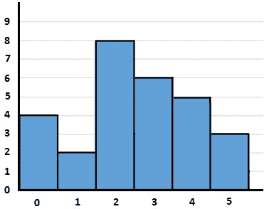
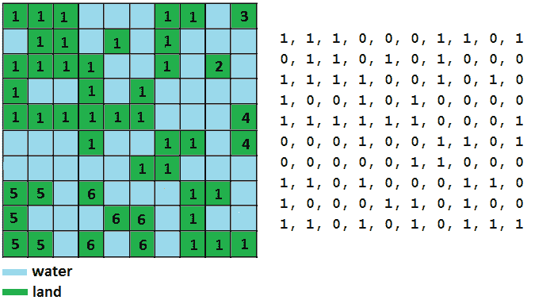

*第 12 章*：

# 堆栈和队列

本章介绍最常见的面试编码挑战，包括堆栈和队列。您将主要学习如何从头开始提供堆栈/队列实现，以及如何通过 Java 的内置实现解决编码难题，例如**堆栈**类和**队列**接口实现，特别是**ArrayDeque**。通常，这一类的编码挑战会要求您构建堆栈/队列，或者要求您使用 Java 的内置实现解决某个问题。根据问题的不同，它可能明确禁止您调用某些内置方法，这些方法将引导您找到一个简单的解决方案。

在本章结束时，您将对堆栈和队列有深入的了解，您将能够利用它们的功能，并识别和编写依赖于堆栈和队列的解决方案。

在本章中，您将了解以下主题：

*   一言以蔽之
*   简而言之
*   编码挑战

让我们从简要介绍堆栈的数据结构开始。

# 技术要求

本章中介绍的所有代码文件都可以在 GitHub 的[上找到 https://github.com/PacktPublishing/The-Complete-Coding-Interview-Guide-in-Java/tree/master/Chapter12](https://github.com/PacktPublishing/The-Complete-Coding-Interview-Guide-in-Java/tree/master/Chapter12) 。

# 一言以蔽之

堆栈是使用**后进先出**（**后进先出**原则的线性数据结构。想想一堆需要清洗的盘子。你从顶部取下第一个盘子（这是最后一个要添加的盘子），然后清洗它。然后，从顶部取出下一个盘子，依此类推。这正是现实生活中的一堆东西（例如，一堆盘子、一堆书、一堆 CD 等等）。

因此，从技术上讲，在一个堆栈中，元素只被添加（称为**推**操作）和移除（称为的**pop**操作）到它的一端（称为的**顶部**）。

在堆栈中执行的最常见操作如下：

*   **推（EE）**：在堆栈的顶部添加一个元素
*   **E pop（）**：从堆栈中移除顶部元素
*   **E peek（）**：返回（但不删除）堆栈中的顶部元素
*   **boolean isEmpty（）**：如果堆栈为空，则返回**true**
*   **int size（）**：返回堆栈的大小
*   **boolean isFull（）**：如果堆栈已满，则返回**true**

与数组不同，堆栈不提供在恒定时间内访问第*n*个元素的权限。然而，它确实为添加和删除元素提供了恒定的时间。堆栈可以实现在数组的顶部，甚至可以实现在链表的顶部。这里使用的实现基于一个数组，名为**MyStack**。此实现的存根如下所示：

```java
public final class MyStack<E> {
  private static final int DEFAULT_CAPACITY = 10;
  private int top;
  private E[] stack;
  MyStack() {
    stack = (E[]) Array.newInstance(
             Object[].class.getComponentType(), 
             DEFAULT_CAPACITY);
    top = 0; // the initial size is 0
  }
  public void push(E e) {}
  public E pop() {}
  public E peek() {}
  public int size() {}
  public boolean isEmpty() {}
  public boolean isFull() {}
  private void ensureCapacity() {}
}
```

将元素推入堆栈意味着将该元素添加到基础数组的末尾。在推动一个元素之前，我们必须确保堆栈未满。如果它已满，那么我们可以通过消息/异常发出信号，或者我们可以增加它的容量，如下所示：

```java
// add an element 'e' in the stack
public void push(E e) {
  // if the stack is full, we double its capacity
  if (isFull()) {
    ensureCapacity();
  }
  // adding the element at the top of the stack
  stack[top++] = e;
}
// used internally for doubling the stack capacity
private void ensureCapacity() {
  int newSize = stack.length * 2;
  stack = Arrays.copyOf(stack, newSize);
}
```

正如您所看到的，每次我们达到堆栈的容量时，它的大小都会翻倍。从堆栈中弹出一个元素意味着返回上次添加到基础数组中的元素。通过使最后一个索引为空，将此元素从基础数组中删除，如下所示：

```java
// pop top element from the stack
public E pop() {
  // if the stack is empty then just throw an exception
  if (isEmpty()) {
    throw new EmptyStackException();
  }
  // extract the top element from the stack                
  E e = stack[--top];
  // avoid memory leaks
  stack[top] = null;
  return e;
}
```

从堆栈中查看元素意味着返回最后添加到基础数组中的元素，但不将其从此数组中移除：

```java
// return but not remove the top element in the stack
public E peek() {
  // if the stack is empty then just throw an exception
  if (isEmpty()) {
    throw new EmptyStackException();
  }
  return stack[top - 1];
}
```

由于此实现可以代表您在面试中可能面临的编码挑战，建议您慢慢来，仔细分析其代码。完整的应用程序称为*MyStack*。

# 一言以蔽之

队列是使用**先进先出**（**FIFO**原理的线性数据结构。想想人们排队买东西。你也可以想象蚂蚁排成队行走。

因此，从技术上讲，元素从队列中移除的顺序与添加的顺序相同。在队列中，在一端添加的元素称为后部（此操作称为排队操作），从另一端删除的元素称为前部（此操作称为出列或轮询操作）。

队列中的常见操作如下：

*   **排队（EE）**：在队列后面添加一个元素
*   **E dequeue（）**：从队列前面移除并返回元素
*   **E peek（）**：返回（但不删除）队列前面的元素
*   **boolean isEmpty（）**：如果队列为空，则返回**true**
*   **int size（）**：返回队列的大小
*   **boolean isFull（）**：如果队列已满，则返回**true**

与数组不同，队列不在固定时间内提供对第*n*个元素的访问。但是，它确实为添加和删除元素提供了恒定的时间。队列可以实现在数组的顶部，甚至可以实现在链表或堆栈（构建在数组或链表的顶部）的顶部。这里使用的实现基于一个数组，名为**MyQueue**。此实现的存根如下所示：

```java
public final class MyQueue<E> {
  private static final int DEFAULT_CAPACITY = 10;
  private int front;
  private int rear;
  private int count;
  private int capacity;
  private E[] queue;
  MyQueue() {
    queue = (E[]) Array.newInstance(
                Object[].class.getComponentType(), 
                DEFAULT_CAPACITY);
  count = 0; // the initial size is 0
  front = 0;
  rear = -1;
  capacity = DEFAULT_CAPACITY;
  }
  public void enqueue(E e) {}
  public E dequeue() {}
  public E peek() {}
  public int size() {}
  public boolean isEmpty() {}
  public boolean isFull() {}
  private void ensureCapacity() {}
} 
```

将元素加入队列意味着将该元素添加到基础数组的末尾。在对元素排队之前，我们必须确保队列未满。如果已满，则我们可以通过消息/异常发出信号，或者我们可以增加其容量，如下所示：

```java
// add an element 'e' in the queue
public void enqueue(E e) {
  // if the queue is full, we double its capacity
  if (isFull()) {
    ensureCapacity();
  }
  // adding the element in the rear of the queue
  rear = (rear + 1) % capacity;
  queue[rear] = e;
  // update the size of the queue
  count++;
}
// used internally for doubling the queue capacity
private void ensureCapacity() {       
  int newSize = queue.length * 2;
  queue = Arrays.copyOf(queue, newSize);
  // setting the new capacity
  capacity = newSize;
}
```

从队列中退出一个元素意味着从基础数组的开头返回下一个元素。此元素已从阵列中移除：

```java
// remove and return the front element from the queue
public E dequeue() {
  // if the queue is empty we just throw an exception
  if (isEmpty()) {
    throw new EmptyStackException();
  }
  // extract the element from the front
  E e = queue[front];
  queue[front] = null;
  // set the new front
  front = (front + 1) % capacity;
  // decrease the size of the queue
  count--;
  return e;
}
```

从队列中窥视一个元素意味着从基础数组的开头返回下一个元素，而不将其从数组中移除：

```java
// return but not remove the front element in the queue
public E peek() {
  // if the queue is empty we just throw an exception
  if (isEmpty()) {
    throw new EmptyStackException();
  }
  return queue[front];
}
```

由于此实现可能代表您在面试中可能面临的编码挑战，建议您慢慢来并剖析其代码。完整的应用程序称为*MyQueue*。

# 编码挑战

在接下来的 11 个编码挑战中，我们将介绍过去几年在招聘 Java 开发人员的众多公司的访谈中出现的涉及堆栈和队列的最常见问题。[*第 10 章*](10.html#_idTextAnchor217)*、数组和字符串*介绍了最常见的问题之一*用一个数组实现三个堆栈*。

以下编码挑战的解决方案依赖于 Java 内置的**堆栈**和**ArrayQue**API。那么，让我们开始吧！

## 编码挑战 1–反向字符串

问题 T1：考虑一下你已经得到了一个字符串。使用堆栈将其反转。

**解决方案**：使用堆栈反转字符串可以按如下方式进行：

1.  从左到右循环字符串，并将每个字符推入堆栈。
2.  循环堆栈并逐个弹出字符。每个弹出字符都会放回字符串中。

基于这两个步骤的代码如下：

```java
public static String reverse(String str) {
  Stack<Character> stack = new Stack();
  // push characters of the string into the stack
  char[] chars = str.toCharArray();
  for (char c : chars) {
    stack.push(c);
  }
  // pop all characters from the stack and
  // put them back to the input string
  for (int i = 0; i < str.length(); i++) {
    chars[i] = stack.pop();
  }
  // return the string
  return new String(chars);
}
```

完整的申请被称为*堆栈反向限制*。

## 编码挑战 2–一堆花括号

**亚马逊**、**谷歌**、**Adobe**、**微软**、**Flipkart**

问题 T1：考虑你已经得到了一个包含 TraceT2 的卷曲括号。编写一段代码，如果有对匹配的花括号，则返回**true**。如果我们能找到一个合适顺序的左大括号来代替左大括号，那么我们可以说我们有一对匹配的大括号。例如，包含{T7]匹配对的字符串如下所示：{{{}}{}{{}}。

我们的解决方案应该考虑两个主要方案。首先，如果打开的花括号的数量不等于关闭的花括号的数量，那么我们返回**false**。第二，如果它们的数量相等，那么它们必须按正确的顺序排列；否则，我们返回**false**。按照正确的顺序，我们知道最后一个打开的花括号是第一个要关闭的大括号，最后一个之前的大括号是第二个要关闭的大括号，依此类推。如果我们依赖于堆栈，那么我们可以详细说明以下算法：

1.  For each character of the given string, take one of the following decisions:

    A.如果字符是一个大括号，{，则将其放在堆栈上。

    B 如果角色是右大括号，}，请执行以下操作：

    我检查堆栈顶部，如果为{，则弹出并将其移动到下一个字符。

    二,。如果不是{，则返回**false**。

2.  如果堆栈为空，则返回**true**（我们找到了所有对）；否则，返回**false**（堆栈包含不匹配的花括号）。

将这些步骤放入代码中，结果如下：

```java
public static boolean bracesMatching(String bracesStr) {
  Stack<Character> stackBraces = new Stack<>();
  int len = bracesStr.length();
  for (int i = 0; i < len; i++) {
    switch (bracesStr.charAt(i)) {
      case '{':
        stackBraces.push(bracesStr.charAt(i));
        break;
      case '}':
        if (stackBraces.isEmpty()) { // we found a mismatch
          return false;
        }
        // for every match we pop the corresponding '{'
        stackBraces.pop(); 
        break;
      default:
        return false;
    }
  }
  return stackBraces.empty();
}
```

完整的应用程序称为*StackBraces*。通过实现一个类似的问题来挑战自己，但是针对多种类型的括号（例如，在同一给定字符串中允许（）{}[]）。

## 编码挑战 3–板堆

**亚马逊**、**谷歌**、**Adobe**、**微软**、**Flipkart**

问题 T1：考虑一个堆栈的 T2。如果车牌数量大于*n*，则我们需要将其排列在新的*n*车牌堆栈中。因此，每当当前堆栈超过*n*容量时，就会创建该容量的新堆栈。编写一段代码，将这些堆栈塑造成一个单独的堆栈。换言之，**push（）**和**pop（）**方法的工作原理与单个堆栈类似。另外，编写一个**popAt（int stackIndex）**方法，从堆栈中弹出一个值，如**stackIndex**所示。

**解决方案**：我们知道如何处理单个堆栈，但如何将多个堆栈链接在一起？好吧，既然我们必须*链接*，那链表呢？如果链表在每个节点中包含一个堆栈，则节点的下一个指针将指向下一个堆栈。下图显示了此解决方案：


图 12.1–堆栈链接列表

每当超过当前堆栈容量时，我们就创建一个新节点并将其附加到链表中。Java 内置的链表（**LinkedList**允许我们通过**getLast（）**方法访问最后一个节点。换句话说，通过**LinkedList#getLast（）**，我们可以轻松地对当前堆栈进行操作（例如，我们可以推送或弹出元素）。通过**LinkedList【add（）**方法添加新堆栈非常简单。基于这些语句，我们可以实现**push（）**方法，如下图所示：

```java
private static final int STACK_SIZE = 3;
private final LinkedList<Stack<Integer>> stacks 
  = new LinkedList<>();
public void push(int value) {
  // if there is no stack or the last stack is full
  if (stacks.isEmpty() || stacks.getLast().size()
      >= STACK_SIZE) {
    // create a new stack and push the value into it
    Stack<Integer> stack = new Stack<>();
    stack.push(value);
    // add the new stack into the list of stacks
    stacks.add(stack);
  } else {
    // add the value in the last stack
    stacks.getLast().push(value);
  }
}
```

如果我们想弹出一个元素，那么我们必须从最后一个堆栈中弹出，因此，**LinkedList#getLast（）**在这里非常方便。这里的角案例由我们从最后一个堆栈中弹出最后一个元素的时刻表示。发生这种情况时，我们必须移除最后一个堆栈，在这种情况下，最后一个堆栈之前的堆栈（如果有）将成为最后一个堆栈。以下代码不言自明：

```java
public Integer pop() {
  // find the last stack
  Stack<Integer> lastStack = stacks.getLast();
  // pop the value from the last stack
  int value = lastStack.pop();
  // if last stack is empty, remove it from the list of stacks
  removeStackIfEmpty();
  return value;
}
private void removeStackIfEmpty() {
  if (stacks.getLast().isEmpty()) {
      stacks.removeLast();
  }
}
```

最后，让我们重点介绍如何实现**popAt（int stackIndex）**方法。我们只需调用**stacks.get（stackIndex.pop（）**，就可以从**stackIndex**堆栈中弹出。一旦我们弹出一个元素，我们必须移动其余的元素。下一个堆栈的底部元素将成为由**stackIndex**等指向的堆栈的顶部元素。如果最后一个堆栈包含一个元素，那么移动其他元素将消除最后一个堆栈，并且在它之前的一个将成为最后一个堆栈。让我们从代码的角度来看：

```java
public Integer popAt(int stackIndex) {
  // get the value from the correspondind stack
  int value = stacks.get(stackIndex).pop();
  // pop an element -> must shift the remaining elements        
  shift(stackIndex);
  // if last stack is empty, remove it from the list of stacks
  removeStackIfEmpty();
  return value;
}
private void shift(int index) {
  for (int i = index; i<stacks.size() - 1; ++i) {
    Stack<Integer> currentStack = stacks.get(i);
    Stack<Integer> nextStack = stacks.get(i + 1);
    currentStack.push(nextStack.remove(0));
  }
}
```

完整的应用程序称为*StackOfPlates*。

## 编码挑战 4–库存跨度

**亚马逊**、**谷歌**、**Adobe**、**微软**、**Flipkart**

问题：阿纳尔：考虑到你已经连续几个星期得到一个单一股票的价格。股票跨度由当日（今天）前连续天的数量表示，此时股票价格低于或等于当日价格。例如，考虑一只股票的价格，涵盖 10 天；也就是说，{55,34,22,23,27,88,70,42,51,100}。得到的股票跨度是{1,1,1,2,3,6,1,1,1,2,10}。请注意，对于第一天，库存跨度始终为 1。编写一段代码，计算给定价格列表的库存跨度。

**解决方案**：我们可以从给定的示例开始，尝试将其可视化，如下所示：


图 12.2–10 天的库存跨度

从上图中，我们可以观察到以下情况：

*   对于第一天，跨度始终为 1。
*   第二天的价格是 34 英镑。由于 34 低于前一天（55）的价格，第 2 天的库存跨度也为 1。
*   第三天的价格是 22 英镑。由于 22 低于前一天（34）的价格，第 3 天的库存跨度也为 1。第 7 天和第 8 天属于同一情景。
*   第四天的价格是 23 英镑。由于 23 大于前一天（22）的价格，但小于第 2 天的价格，因此股票跨度为 2。第 9 天与第 4 天相似。
*   第五天的价格是 27 英镑。由于该价格大于第 3 天和第 4 天的价格，但小于第 2 天的价格，因此库存跨度为 3。
*   第六天的价格是 88 美元。这是迄今为止最大的价格，因此库存跨度为 6。
*   第 10 天的价格是 100 美元。这是迄今为止最大的价格，因此股票跨度为 10。

请注意，我们将当日的股票跨度计算为当日指数与最后一个最大股价对应的当日指数之差。跟踪此场景后，我们的第一个想法听起来可能是这样的：对于每一天，扫描它之前的所有天，并增加股票跨度，直到股票价格大于当天。换句话说，我们正在使用暴力手段。正如我在本书前面提到的，暴力手段应该作为面试的最后手段，因为它的表现很差，面试官不会留下深刻印象。在这种情况下，蛮力方法在 O（n2）复杂度时间内工作。

然而，让我们尝试另一种思考视角。对于每一天，我们都希望找到前一天的价格比当天的价格更高。换句话说，我们正在寻找比当天价格更高的最后一个价格。

在这里，我们应该选择一种后进先出的数据结构，它允许我们按降序推送价格，并弹出最后推送的价格。一旦我们有了这一点，我们就可以浏览每一天，并将堆栈顶部的价格与当天的价格进行比较。在堆栈顶部的价格低于当天的价格之前，我们可以从堆栈中弹出。但是如果堆栈顶部的价格大于当天的价格，那么我们计算当天的库存跨度，作为堆栈顶部价格在当天和当天之间的天数差。如果我们按降序将价格推入堆栈，这将起作用–最大的价格位于堆栈顶部。但是，由于我们可以将股票跨度计算为当天指数与最后一个最大股价对应的当天指数之差（用**i**表示），因此我们可以简单地将**i**指数存储在堆栈中；**stackPrices【i】**（将价格数组表示为**stackPrices**）将在*i*日返回该股票的价格。

这可以通过以下算法实现：

1.  第一天的股票跨度为 1，指数为 0–我们将该指数放入堆栈（将其表示为**dayStack**；因此，**dayStack.push（0）**）。
2.  We loop the remaining days (day 2 has index 1, day 3 has index 2, and so on) and do the following:

    A.而**股价【i】>股价【dayStack.peek（）】**和**！dayStack.empty（）**，我们从堆栈中弹出（**dayStack.pop（）**。

3.  如果**dayStack.empty（）**，则**i+1**中的库存跨度。
4.  如果**股价[i]<=stockPrices[dayStack.peek（）]**，则股票跨度为**i-dayStack.peek（）**。
5.  将当天的索引**i**推入栈中（**dayStack**）。

让我们看看这个算法在我们的测试用例中是如何工作的：

1.  第一天的股票跨度为 1，指数为 0–我们将该指数推到堆栈中**dayStack。推（0）**。
2.  第二天，**股价[1]=34**和**股价[0]=55**。自 34<55 起，第 2 天的库存跨度为**i-dayStack.peek（）**=1-0=1。我们推进堆栈 1，**日堆栈。推（1）**。
3.  第三天，**股价【2】**=22，**股价【1】**=34。自 22<34 起，第 3 天的库存跨度为 2-1=1。我们推进堆栈 1，**日堆栈。推（2**。
4.  第四天，**股价【3】**=23，**股价【2】**=22。由于 23>22 和堆栈不是空的，我们弹出顶部，因此我们弹出值 2。由于 23<34（**股价[1]【T5]），第 4 天的股票跨度为 3-1=2。我们把第三层推进去，**天层。推（3）**。**
5.  第五天，**股价【4】**=27，**股价【3】**=23。由于 27>23 且堆栈不是空的，我们弹出顶部，因此我们弹出值 3。接下来，27<34（记住，我们在上一步中弹出了值 2，因此下一个顶部的值为 1），第 5 天的库存跨度为 4-1=3。我们把第四组推进去，**日组。推（4）**。
6.  第六天，**股价【5】**=88，**股价【4】**=27。由于 88>27 且堆栈不是空的，我们弹出顶部，因此我们弹出值 4。接下来是 88>34，堆栈不是空的，所以我们弹出值 1。接下来是 88>55，堆栈不是空的，所以我们弹出值 0。接下来，堆栈为空，第 6 天的库存跨度为 5+1=6。

好吧，我想你明白了，所以现在，挑战自己，继续到第 10 天。目前，我们有足够的信息将此算法转化为代码：

```java
public static int[] stockSpan(int[] stockPrices) {
  Stack<Integer> dayStack = new Stack();
  int[] spanResult = new int[stockPrices.length];
  spanResult[0] = 1; // first day has span 1
  dayStack.push(0);
  for (int i = 1; i < stockPrices.length; i++) {
    // pop until we find a price on stack which is 
    // greater than the current day's price or there 
    // are no more days left
    while (!dayStack.empty() 
      && stockPrices[i] > stockPrices[dayStack.peek()]) {
      dayStack.pop();
    }
    // if there is no price greater than the current 
    // day's price then the stock span is the numbers of days
    if (dayStack.empty()) {
        spanResult[i] = i + 1;
    } else {
      // if there is a price greater than the current 
      // day's price then the stock span is the 
      // difference between the current day and that day
        spanResult[i] = i - dayStack.peek();
    }
    // push current day onto top of stack
     dayStack.push(i);
  }
  return spanResult;
}
```

完整的申请称为*StockSpan*。

## 编码挑战 5–堆栈最小值

**亚马逊**、**谷歌**、**Adobe**、**微软**、**Flipkart**

**问题**：设计一个在恒定时间内计算最小值的堆栈。**push（）**、**pop（）**和**min（）**方法应在 O（1）时间内运行。

**解决方案**：经典的方法包括声明一个实例变量，该变量保存堆栈的最小值。当从堆栈中弹出的值等于最小值时，我们在堆栈中搜索新的最小值。这工作正常，但不受此问题的限制，需要在 O（1）时间内运行**push（）**和**pop（）**。

尊重问题约束的解决方案需要额外的堆栈来跟踪最小值。主要是，当推送值小于当前最小值时，我们将该值添加到辅助堆栈（将其表示为**stackOfMin**）和原始堆栈中。如果从原始堆栈中弹出的值是**stackOfMin**的顶部，那么我们也从**stackOfMin**中弹出它。在代码方面，我们有以下内容：

```java
public class MyStack extends Stack<Integer> {
  Stack<Integer> stackOfMin;
  public MyStack() {
    stackOfMin = new Stack<>();
  }
  public Integer push(int value) {
    if (value <= min()) {
       stackOfMin.push(value);
    }
    return super.push(value);
  }
  @Override
  public Integer pop() {
    int value = super.pop();
    if (value == min()) {
       stackOfMin.pop();
    }
    return value;
  }
  public int min() {
   if (stackOfMin.isEmpty()) {
      return Integer.MAX_VALUE;
    } else {
      return stackOfMin.peek();
    }
  }
}
```

完成！我们的解决方案在 O（1）复杂度时间内执行。完整的应用程序称为*分钟*。与此相关的问题要求您在恒定的时间和空间中实现相同的功能。这个问题的解决方案有以下几个限制：

*   **pop（）**方法返回**void**以避免返回不正确的值。
*   给定值乘以 2 不应超过**int**数据类型域。

简言之，这些限制是由解决方案本身造成的。我们不能使用额外的空间；因此，我们将使用初始值堆栈来存储最小值。此外，我们需要将给定值乘以 2，因此我们应该确保不超过**int**域。为什么我们需要把给定的值乘以 2？

让我们来谈谈这个问题吧！让我们假设我们需要将一个值推送到具有某个最小值的堆栈中。如果该值大于或等于当前最小值，那么我们可以简单地将其推入堆栈。但是如果它小于最小值，那么我们推 2**值最小值*，它应该小于值本身。然后，我们将当前最小值更新为值。

当我们弹出一个值时，我们必须考虑两个方面。如果弹出的值大于或等于最小值，则这是先前推送的实际值。否则，弹出的值不是推送的值。实际推送值存储在最小值中。在弹出堆栈顶部（最小值）后，我们必须恢复以前的最小值。之前的最小值为 2**最小值-顶部。*换言之，由于当前顶部为 2**值-上一个 _ 最小值*且该值为当前最小值，因此上一个最小值为 2**当前 _ 最小值-顶部*。以下代码说明了此算法：

```java
public class MyStack {
  private int min;
  private final Stack<Integer> stack = new Stack<>();
  public void push(int value) {
    // we don't allow values that overflow int/2 range
    int r = Math.addExact(value, value);
    if (stack.empty()) {
      stack.push(value);
      min = value;
    } else if (value > min) {
      stack.push(value);
    } else {
      stack.push(r - min);
      min = value;
    }
  }
  // pop() doesn't return the value since this may be a wrong   
  // value (a value that was not pushed by the client)!
  public void pop() {
    if (stack.empty()) {
      throw new EmptyStackException();
    }
    int top = stack.peek();
    if (top < min) {
      min = 2 * min - top;
    }
    stack.pop();
  }
  public int min() {
    return min;
  }
}
```

完整的应用程序是称为*分钟平均空间*。

## 编码挑战 6–通过堆栈排队

**谷歌**、**Adobe**、**微软**、**Flipkart**

**问题**：通过两个栈设计一个队列。

**解决方案**：为了找到这个问题的正确解决方案，我们必须从队列和堆栈之间的主要区别开始。我们知道队列在 FIFO 上工作，而堆栈在 LIFO 上工作。接下来，我们必须考虑主要操作（push、pop 和 peek）并确定差异。

它们都以同样的方式推动新的元素。当我们将一个元素推入队列时，我们将它推到一端（队列的后部）。当我们将一个元素推入堆栈时，我们从堆栈的新顶部将其推入，这可以被视为与队列的后部相同。

当我们从堆栈中弹出或查看一个值时，我们会从顶部执行此操作。然而，当我们在队列上执行相同的操作时，我们是从前面执行的。这意味着，在弹出或窥视元素时，反向堆栈将充当队列。下图举例说明了这一说法：


图 12.3–通过两个堆栈排队

因此，每个新元素都被推送到*队列堆栈*中作为新的顶部。当我们需要弹出或查看一个值时，我们使用*出列*堆栈，这是*入列堆栈*的反向版本。请注意，我们不必在每次 pop/peek 操作时反转*排队堆栈*。我们可以让元素坐在*出列堆栈*中，直到我们绝对必须反转元素。换句话说，对于每个 pop/peek 操作，我们可以检查*出列堆栈*是否为空。由于只要*排队列堆栈*不是空的，我们就不需要反转*排队列堆栈*，因为我们至少有一个元素要弹出/查看。

让我们从代码的角度来看：

```java
public class MyQueueViaStack<E> {
  private final Stack<E> stackEnqueue;
  private final Stack<E> stackDequeue;
  public MyQueueViaStack() {
    stackEnqueue = new Stack<>();
    stackDequeue = new Stack<>();
  }
  public void enqueue(E e) {
    stackEnqueue.push(e);
  }
  public E dequeue() {
    reverseStackEnqueue();
    return stackDequeue.pop();
  }
  public E peek() {
    reverseStackEnqueue();
    return stackDequeue.peek();
  }
  public int size() {
    return stackEnqueue.size() + stackDequeue.size();
  }
  private void reverseStackEnqueue() {
    if (stackDequeue.isEmpty()) {
      while (!stackEnqueue.isEmpty()) {
        stackDequeue.push(stackEnqueue.pop());
      }
    }
  }
}
```

完整的应用程序称为*队列堆栈*。

## 编码挑战 7–通过队列堆叠

**谷歌**、**Adobe**、**微软**

**问题**：通过两个队列设计一个堆栈。

**解决方案**：为了找到这个问题的正确解决方案，我们必须从堆栈和队列的主要区别开始。我们知道堆栈是后进先出，而队列是先进先出。接下来，我们必须考虑主要操作（push、pop 和 peek）并确定差异。

它们都以同样的方式推动新的元素。当我们将一个元素推入堆栈时，我们会从堆栈的新顶部将其推入。当我们将一个元素推入队列时，我们从一端（队列的后部）将其推入。队列的后部类似于堆栈的顶部。

当我们从队列中弹出或窥视一个值时，我们从前面这样做。但是，当我们在堆栈上执行相同的操作时，我们是从顶部执行的。这意味着，当从充当堆栈的队列中弹出或查看元素时，我们需要轮询除最后一个元素之外的所有元素。最后一个元素是我们弹出/查看的元素。下图举例说明了这一说法：


图 12.4–通过两个队列的堆栈

如上图左侧所示，将元素推入堆栈和队列是一个简单的操作。上图的右侧显示，当我们想要从队列中弹出/查看作为堆栈的元素时，会出现问题。主要是，在弹出/偷看一个元素之前，我们必须将元素从队列（在上图中表示为*队列 1*）中（*后*-1）和*前*之间移动到另一个队列中（在上图中表示为*队列 2*）。在上图中，在右侧，我们轮询来自*队列 1*的元素 2、5、3 和 1，并将它们添加到*队列 2*。接下来，我们弹出/查看*队列 1*中的最后一个元素。如果我们弹出元素 6，那么*队列 1*仍然为空。如果我们查看元素 6，那么*队列 1*将保留此元素。

现在，剩下的元素在*队列 2*中，因此为了执行另一个操作（推送、窥视或弹出），我们有两个选项：

*   通过将剩余元素从*队列 2*移回，恢复*队列 1*。
*   使用*队列 2*就像使用*队列 1*一样，这意味着交替使用*队列 1*和*队列 2*。

在第二个选项的情况下，为了在*队列 1*上执行下一个操作，我们避免了将元素从*队列 2*移回*队列 1*的开销。虽然您可以挑战自己实现第一个选项，但让我们更关注第二个选项。

如果我们认为下一个操作应该使用的队列不是空的，那么可以尝试使用 Realt1。因为我们在这两个队列之间移动元素，所以其中一个队列总是空的。因此，当我们窥视一个元素时会出现一个问题，因为窥视操作没有删除该元素，所以其中一个队列仍然与该元素在一起。因为没有一个队列是空的，所以我们不知道下一个操作应该使用哪个队列。解决方案非常简单：我们轮询最后一个元素，即使对于 peek 操作也是如此，并将其存储为实例变量。后续的 peek 操作将返回此实例变量。推送操作将在推送给定值之前将该实例变量推回到队列中，并将该实例变量设置为**null**。pop 操作将检查此实例变量是否为**null**。如果不是**null**，则该元素将弹出。

让我们看看代码：

```java
public class MyStackViaQueue<E> {
  private final Queue<E> queue1;
  private final Queue<E> queue2;
  private E peek;
  private int size;
  public MyStackViaQueue() {
    queue1 = new ArrayDeque<>();
    queue2 = new ArrayDeque<>();
  }
  public void push(E e) {
    if (!queue1.isEmpty()) {
      if (peek != null) {
        queue1.add(peek);
      }
      queue1.add(e);
    } else {
      if (peek != null) {
        queue2.add(peek);
      }
      queue2.add(e);
    }
    size++;
    peek = null;
  }
  public E pop() {
    if (size() == 0) {
      throw new EmptyStackException();
    }
    if (peek != null) {
      E e = peek;
      peek = null;
      size--;
      return e;
    }
    E e;
    if (!queue1.isEmpty()) {
      e = switchQueue(queue1, queue2);
    } else {
      e = switchQueue(queue2, queue1);
    }
    size--;
    return e;
  }
  public E peek() {
    if (size() == 0) {
      throw new EmptyStackException();
    }
    if (peek == null) {
      if (!queue1.isEmpty()) {
        peek = switchQueue(queue1, queue2);
      } else {
        peek = switchQueue(queue2, queue1);
      }
    }
    return peek;
  }
  public int size() {
    return size;
  }
  private E switchQueue(Queue from, Queue to) {
    while (from.size() > 1) {
      to.add(from.poll());
    }
    return (E) from.poll();
  }
}
```

完整的应用程序被称为*StackViaQueue*。

## 编码挑战 8–最大直方图区域

**亚马逊**、**谷歌**、**Adobe**、**微软**、**Flipkart**

问题 T1：考虑到你已经得到了下面的图像中所示的直方图：



图 12.5——类间隔等于 1 的直方图

我们将直方图定义为矩形条图，其中面积与某个变量的频率成比例。条形图的宽度称为直方图类间隔。例如，前面图像中的直方图的类间隔等于 1。共有六根钢筋，其宽度等于 1，高度为 4、2、8、6、5 和 3。

考虑到你已经把这些高度作为整数数组（这是问题的输入）阿纳尔。编写一段代码，使用堆栈计算直方图中最大的矩形区域。为了更好地理解这一点，下图突出显示了几个可以形成的矩形（不是全部）：


图 12.6——直方图的矩形

在前面的图像中，最大的矩形区域（即最大矩形）是中间的一个，3×5＝15。

**解决方案**：这个问题比乍一看要难。首先，我们需要分析给定的图像，并制定几个声明。例如，请务必注意，如果条形的高度小于或等于矩形区域的高度，则条形只能是该区域的一部分。此外，对于每个条，我们可以说左侧高于当前条的所有条都可以与当前条形成矩形区域。类似地，右侧高于当前条的所有条可以与当前条形成矩形区域。

这意味着每个矩形区域由*左*和*右*边界分隔，并且*右-左***当前 _ 条*给出了该区域的值。我们应该计算所有可能的面积，并将最高面积作为实现的输出。下图高亮显示了 3 x 5 矩形的左右边界：


图 12.7–左右边界

记住，我们必须使用堆栈来解决这个问题。现在我们有了一些可以引导我们找到解决方案的陈述，现在是时候将堆栈引入讨论了。我们主要可以使用堆栈来计算左右边界。

我们从第一个条开始，将其索引（索引 0）推入堆栈。我们继续使用剩余的条，并执行以下操作：

1.  Repeat *steps 1a*, *1b*, and *1c* as long as the current bar is smaller than the top of the stack and the stack is not empty:

    A.我们从堆栈的顶部弹出。

    B 我们计算左边界。

    C 我们计算在计算的左边界条和当前边界条之间可以形成的矩形区域的宽度。

    D 我们将面积计算为计算出的宽度乘以*步骤 1a 中弹出的杆的高度。*

    E 如果这个区域比前一个区域大，那么我们存储这个区域。

2.  将当前条的索引推入堆栈。
3.  从*步骤 1*开始重复，直到处理完每根棒材。

让我们从代码的角度来看：

```java
public static int maxAreaUsingStack(int[] histogram) {
  Stack<Integer> stack = new Stack<>();
  int maxArea = 0;
  for (int bar = 0; bar <= histogram.length; bar++) {
    int barHeight;
    if (bar == histogram.length) {
      barHeight = 0; // take into account last bar
    } else {
      barHeight = histogram[bar];
    }
    while (!stack.empty() 
          && barHeight < histogram[stack.peek()]) {
      // we found a bar smaller than the one from the stack                
      int top = stack.pop();
      // find left boundary
      int left = stack.isEmpty() ? -1 : stack.peek();
      // find the width of the rectangular area 
      int areaRectWidth = bar - left - 1;
      // compute area of the current rectangle
      int area = areaRectWidth * histogram[top];
      maxArea = Integer.max(area, maxArea);
    }
    // add current bar (index) into the stack
    stack.push(bar);
  }        
  return maxArea;
}
```

该码的时间复杂度为 O（n）。此外，额外的空间复杂度为 O（n）。完整的应用程序称为*StackHistorogramarea*。

## 编码挑战 9–最小数字

问题 T1：考虑到你已经得到了一个字符串，它代表了许多的 T2。编写一段代码，在删除给定的*k*位后打印出尽可能最小的数字。

Po.T0.溶液：To T2：我们考虑给定的数是 T3，n，T4，4514327＝4。在这种情况下，去掉四位数字后的最小数字是 127。如果*n*=2222222，则最小的数字为 222。

该解决方案可以通过**堆栈**和以下算法轻松实现：

1.  Iterate the given number from left to right, digit by digit.

    A.当给定的*k*大于 0 时，堆栈不是空的，堆栈中的顶部元素大于当前遍历的数字：

    我从堆栈中弹出顶部元素。

    二,。将*k*减少 1。

    B 将当前数字推入堆栈。

2.  While the given *k* is greater than 0, do the following (to handle special cases such as 222222):

    A.从堆栈中弹出元素。

    B 将*k*减少 1。

就代码而言，我们有以下：

```java
public static void smallestAfterRemove(String nr, int k) {
  int i = 0;
  Stack<Character> stack = new Stack<>();
  while (i < nr.length()) {
    // if the current digit is less than the previous 
    // digit then discard the previous one
    while (k > 0 && !stack.isEmpty()
          && stack.peek() > nr.charAt(i)) {
      stack.pop();
      k--;
    }
    stack.push(nr.charAt(i));
    i++;
  }
  // cover corner cases such as '2222'
  while (k > 0) {
    stack.pop();
    k--;
  }
  System.out.println("The number is (as a printed stack; "
      + "ignore leading 0s (if any)): " + stack);
  }
}
```

完整的申请被称为*最小号*。

## 编码挑战 10–岛屿

**亚马逊**、**Adobe**

问题 T1：考虑到你一直是一个矩阵，一个矩阵 T3。按照惯例，1 表示土地，0 表示水。编写一段代码，计算岛的数量。孤岛定义为一组由 0 包围的 1。

**解决方案**：让我们设想一个测试用例。以下是一个 10x10 矩阵，包含 6 个岛，突出显示为 1、2、3、4、5 和 6：



图 12.8–通过 10x10 矩阵的岛屿

为了找到岛屿，我们必须遍历矩阵。换句话说，我们必须遍历矩阵的每个单元。由于一个单元的特征是一行（我们将其表示为*r*）和一列（我们将其表示为*c*），我们观察到，从一个单元（*r，c*），我们可以朝八个方向移动：（*r-*1*、c-*1）、（【T10 r-1*、c*（*r-*1*、c+*1）、（*r、c-*1）、（*r、c+*、（*r+*1*、c-*1）、（*r+*1*、c*、【T30 r+1*、c+*1。这意味着我们可以从当前小区（*r，c*）移动到（*r+行*[*k*]]、*、c+列*[*k*），只要**行**和**列**是下面的数组和 0≤ *k*≤ 7:

```java
// top, right, bottom, left and 4 diagonal moves
private static final int[] ROW = {-1, -1, -1, 0, 1, 0, 1, 1};
private static final int[] COL = {-1, 1, 0, -1, -1, 1, 0, 1};
```

只要我们执行以下操作，移动到单元格是有效的：

*   不要从格子上掉下来。
*   在表示土地的单元上进行踏步（1 的单元）。
*   以前没进过那个牢房。

为了确保我们不会多次访问同一个单元，我们使用了一个布尔矩阵，表示为**标记的[][[]**。最初，该矩阵仅包含**false**的值，每次我们访问一个单元（**r**、**c**），我们将相应的**标记的【r】【c】**翻转为**true**。

以下是代码形式的前三个要点：

```java
private static booleanisValid(int[][] matrix, 
      int r, int c, boolean[][] flagged) {
  return (r >= 0) && (r < flagged.length)
    && (c >= 0) && (c < flagged[0].length)
    && (matrix[r][c] == 1 && !flagged[r][c]);
}
```

到目前为止，我们知道如何确定从当前单元格移动到另一个单元格（从八个可能的移动）是否有效。此外，我们必须定义一个算法来确定运动模式。我们知道从一个细胞（*r，c*，我们可以在相邻的细胞中向八个方向移动。因此，最方便的算法包括尝试从当前单元格移动到所有有效邻居，如下所示：

1.  从一个空队列开始。
2.  移动到有效单元格（*r，c*），将其排队，并将其标记为已标记–起点应为单元格（0，0）。
3.  将当前单元格出列并解析其所有八个相邻单元格–解析单元格意味着在其有效时将其入列并将其标记为已标记。
4.  重复*步骤 3*直到队列为空。当队列为空时，这意味着我们找到了一个岛。
5.  从*步骤 2*重复，直到不再有有效单元格。

就代码而言，我们有以下：

```java
private static class Cell {
  int r, c;
  public Cell(int r, int c) {
    this.r = r;
    this.c = c;
  }
}
// there are 8 possible movements from a cell    
private static final int POSSIBLE_MOVEMENTS = 8;
// top, right, bottom, left and 4 diagonal moves
private static final int[] ROW = {-1, -1, -1, 0, 1, 0, 1, 1};
private static final int[] COL = {-1, 1, 0, -1, -1, 1, 0, 1};
public static int islands(int[][] matrix) {
  int m = matrix.length;
  int n = matrix[0].length;
  // stores if a cell is flagged or not
  boolean[][] flagged = new boolean[m][n];
  int island = 0;
  for (int i = 0; i < m; i++) {
    for (int j = 0; j < n; j++) {
      if (matrix[i][j] == 1 && !flagged[i][j]) {
        resolve(matrix, flagged, i, j);
        island++;
      }
    }
  }
  return island;
}
private static void resolve(int[][] matrix, 
        boolean[][] flagged, int i, int j) {
  Queue<Cell> queue = new ArrayDeque<>();
  queue.add(new Cell(i, j));
  // flag source node
  flagged[i][j] = true;
  while (!queue.isEmpty()) {
    int r = queue.peek().r;
    int c = queue.peek().c;
    queue.poll();
    // check for all 8 possible movements from current 
    // cell and enqueue each valid movement
    for (int k = 0; k < POSSIBLE_MOVEMENTS; k++) {
      // skip this cell if the location is invalid
      if (isValid(matrix, r + ROW[k], c + COL[k], flagged)) {
        flagged[r + ROW[k]][c + COL[k]] = true;
        queue.add(new Cell(r + ROW[k], c + COL[k]));
      }
    }
  }
}
```

完整的应用程序被称为*队列岛*。

## 编码挑战 11–最短路径

**亚马逊**、**谷歌**、**Adobe**

问题 T1：考虑到你得到了一个矩阵，即 T2，M，T3，x，x，4，n，5，1，只包含 0 和 1s。按照惯例，1 表示安全土地，而 0 表示不安全土地。更准确地说，0 表示不应激活的传感器。此外，所有八个相邻单元都可以激活传感器。编写一段代码，计算从第一列的任何单元格到最后一列的任何单元格的最短路径。一次只能移动一步；左、右、上或下。结果路由（如果存在）应仅包含值 1。

**解决方案**：让我们设想一个测试用例。以下是一个 10 x 10 的矩阵。

在下图的左侧，您可以看到给定的矩阵。请注意，0 的值表示不应激活的传感器。在右边，您可以看到应用程序正在使用的矩阵和可能的解决方案。该矩阵是通过扩展传感器的覆盖区域从给定矩阵中获得的。请记住，传感器的八个相邻单元也可以激活传感器。溶液从第一列（单元格（4，0））开始，到最后一列（单元格（9，9））结束，包含 15 个步骤（从 0 到 14）。您可以在下图中看到这些步骤：


图 12.9–给定矩阵（左侧）和解析矩阵（右侧）

从坐标的安全单元（*r，c*，我们可以向四个安全方向移动：（*r*-1*、c*）（*r、c*-1）、（*r*+1*、c*、和（*r、c*+1）。如果我们将可能的运动看作方向（边），将单元看作顶点，那么我们可以在图形的上下文中可视化这个问题。边是可能的移动，而顶点是我们可以移动的可能单元。每个移动保持当前单元格到起始单元格的距离（起始单元格是从第一列开始的单元格）。对于每个移动，距离增加 1。因此，在图的上下文中，问题归结为在图中寻找最短路径。因此，我们可以使用**广度优先搜索（BFS）**方法来解决这个问题。在[*第 13 章*](13.html#_idTextAnchor295)*【树与图】*中，向您提供了 BFS 算法的描述，并以与此处解决的问题相同的方式解决了另一个问题—*国际象棋骑士*问题。

现在，根据前一个问题提供的经验，我们可以详细介绍这个算法：

1.  从一个空队列开始。
2.  将第一列的所有安全单元格排队，并将其距离设置为 0（此处，0 表示每个单元格到自身的距离）。此外，这些单元格被标记为已访问或已标记。
3.  As long as the queue is not empty, do the following:

    A.弹出表示队列顶部的单元格。

    B 如果弹出的单元格是目标单元格（即位于最后一列），则只需返回其距离（从目标单元格到第一列源单元格的距离）。

    C 如果弹出的单元格不是目的地，则对于该单元格的四个相邻单元格中的每一个，将每个有效单元格（安全和未访问）按距离（+1）排队，并将其标记为已访问。

    D 如果我们在没有到达目的地的情况下处理了队列中的所有单元格，那么就没有解决方案。返回-1。

由于我们依赖于 BFS 算法，我们知道最短路径为 1 的所有单元都会首先访问。接下来，访问的小区是相邻小区，其最短路径为 1+1=2，依此类推。因此，具有最短路径的单元等于其父代的*最短路径+*1。这意味着，当我们第一次遍历目标单元时，它会给出最终结果。这是最短的路径。让我们看看代码中与此最相关的部分：

```java
private static int findShortestPath(int[][] board) {
  // stores if cell is visited or not
  boolean[][] visited = new boolean[M][N];
  Queue<Cell> queue = new ArrayDeque<>();
  // process every cell of first column
  for (int r1 = 0; r1 < M; r1++) {
    // if the cell is safe, mark it as visited and
    // enqueue it by assigning it distance as 0 from itself
    if (board[r1][0] == 1) {
      queue.add(new Cell(r1, 0, 0));
      visited[r1][0] = true;
    }
  }
  while (!queue.isEmpty()) {
    // pop the front node from queue and process it
    int rIdx = queue.peek().r;
    int cIdx = queue.peek().c;
    int dist = queue.peek().distance;
    queue.poll();
    // if destination is found then return minimum distance
    if (cIdx == N - 1) {
      return (dist + 1);
    }
    // check for all 4 possible movements from 
    // current cell and enqueue each valid movement
    for (int k = 0; k < 4; k++) {
      if (isValid(rIdx + ROW_4[k], cIdx + COL_4[k])
            && isSafe(board, visited, rIdx + ROW_4[k], 
                cIdx + COL_4[k])) {
        // mark it as visited and push it into 
        // queue with (+1) distance
        visited[rIdx + ROW_4[k]][cIdx + COL_4[k]] = true;
        queue.add(new Cell(rIdx + ROW_4[k], 
          cIdx + COL_4[k], dist + 1));
      }
    }
  }
  return -1;
}
```

完整的申请被称为*最短安全路线*。

# 中缀、后缀和前缀表达式

前缀、后缀和中缀表达式现在不是一个非常常见的访谈主题，但它可以被认为是一个任何开发人员都应该至少讨论一次的主题。以下是快速概述：

*   **前缀表达式**：这是一种符号（代数表达式），用于编写算术表达式，其中操作数列在其运算符之后。
*   **后缀表达式**：这是一种符号（代数表达式），用于编写算术表达式，其中操作数列在其运算符之前。
*   **中缀表达式**：这是一种符号（代数表达式），通常用于算术公式或语句中，其中运算符写在操作数之间。

如果我们有三个操作符 a、b 和 c，我们可以写出下图所示的表达式：


图 12.10–中缀、后缀和前缀

最常见的问题是计算前缀和后缀表达式，以及在前缀、中缀和后缀表达式之间进行转换。所有这些问题都有依赖于堆栈（或二叉树）的解决方案，并且在任何专门讨论基本算法的严肃书籍中都有涉及。花点时间，收集一些关于这个主题的资源来熟悉它。由于这一主题在专门的书籍中有广泛的介绍，并且在采访中也不是一个常见的话题，我们将不在这里介绍。

# 总结

本章介绍了任何准备参加 Java 开发人员技术面试的应聘者必须了解的堆栈和队列问题。堆栈和队列出现在许多实际应用程序中，因此掌握它们是面试官测试您的最高技能之一。

在下一章*树、尝试和图*中，您将看到堆栈和队列经常用于解决涉及树和图的问题，这意味着它们也值得您关注。