*第 14 章*：

# 分类检索

本章介绍在技术访谈中遇到的最流行的排序和搜索算法。我们将介绍排序算法，如合并排序、快速排序、基数排序、堆排序和桶排序，以及搜索算法，如二进制搜索。

到本章结束时，您应该能够解决涉及排序和搜索算法的广泛问题。我们将介绍以下主题：

*   排序算法
*   搜索算法
*   编码挑战

让我们开始吧！

# 技术要求

您可以在 GitHub 的[上找到本章的所有代码文件 https://github.com/PacktPublishing/The-Complete-Coding-Interview-Guide-in-Java/tree/master/Chapter14](https://github.com/PacktPublishing/The-Complete-Coding-Interview-Guide-in-Java/tree/master/Chapter14) 。

# 排序算法

从准备面试的人的角度考虑排序算法，会发现两个主要的类别：一个类别包含许多面试中没有的相对简单的排序算法，如冒泡排序、插入排序、计数排序等，另一个类别包含堆排序、合并排序，快速排序、桶排序和基数排序。这些代表了技术面试中出现的五大排序算法。

如果您不熟悉简单的排序算法，那么我强烈建议您购买我的书，*Java 编码问题*（[www.packtpub.com/programming/Java-Coding-Problems](http://www.packtpub.com/programming/java-coding-problems)），由 Packt 出版。在[*第 5 章*](05.html#_idTextAnchor072)**Java 编码问题*的数组、集合和数据结构*中，您可以找到气泡排序、插入排序、计数排序等的详细内容。

此外，名为*SortArraysIn14Ways*的应用程序包含您应该知道的 14 种不同排序算法的实现。完整清单如下：

*   气泡排序
*   使用**比较器**进行气泡排序
*   气泡排序优化
*   使用**比较器**优化气泡排序
*   煎饼类
*   交换排序
*   选择排序
*   贝壳类
*   插入排序
*   带**比较器**的插入排序
*   计数排序
*   合并排序
*   堆排序
*   使用**比较器**进行堆排序
*   斗式分拣
*   鸡尾酒类
*   循环排序
*   快速排序
*   使用**比较器**进行快速排序
*   基数排序

在以下几节中，我们将简要概述访谈中遇到的主要算法：堆排序、合并排序、快速排序、桶排序和基数排序。如果你已经熟悉了这些 To0T0ES 算法，那么考虑直接跳到 OLE T1 搜索算法 To.T2A-节，或者甚至到 To.T3 编码挑战 ALE T4 节。

## 堆排序

如果你不熟悉 HOP 概念，那么 To1 T1 考虑阅读 Po.T2 的二进制堆，T3。

堆排序是一种依赖于二进制堆（完整的二叉树）的算法。时间复杂度情况如下：最佳情况 O（n logn）、平均情况 O（n logn）、最坏情况 O（n logn）。空间复杂度为 O（1）。

可以通过最大堆（父节点始终大于或等于子节点）按升序排序元素，通过最小堆（父节点始终小于或等于子节点）按降序排序元素。

堆排序算法有几个主要步骤，如下所示：

1.  将给定数组转换为最大二进制堆。
2.  接下来，根与堆中的最后一个元素交换，堆的大小减少 1（这类似于删除堆的根元素）。因此，较大的元素（堆根）进入最后一个位置。换句话说，位于堆根的元素按排序顺序逐个出现。
3.  最后一步包括*堆化*剩余堆（应用以自顶向下方式重建 max 堆的递归过程）。
4.  当堆大小大于 1 时，从*步骤 2*重复。

下图显示了应用堆排序算法的测试用例：


图 14.1–堆排序

例如，让我们假设上图中的数组；也就是说，4，5，2，7，1：

1.  因此，在第一步，我们构建 Max 堆：7、5、2、4、1（我们将 5 与 7 交换，4 与 7 交换，4 与 5 交换）。
2.  接下来，将根（7）与最后一个元素（1）交换并删除 7。结果：1,5,2,4，**7**。
3.  此外，我们再次构造最大堆：5，4，2，1（我们用 5 替换 1，用 4 替换 1）。
4.  我们将根（5）与最后一个元素（1）交换并删除 5。结果：1,4,2，**5,7**。
5.  接下来，我们再次构造 Max 堆：4，1，2（我们用 4 替换了 1）。
6.  我们用最后一个元素（2）交换根（4）并删除 4。结果：2,1，**4,5,7**。
7.  这已经是一个最大堆了，所以我们只需将根（2）与最后一个元素（1）交换，并删除 2:1、**2、4、5、7**。
8.  完成！堆中只剩下一个元素（1）。因此，最终结果是**1、2、4、5、7**。

就代码而言，前面的示例可以概括如下：

```java
public static void sort(int[] arr) {
  int n = arr.length;
  buildHeap(arr, n);
  while (n > 1) {
    swap(arr, 0, n - 1);
    n--;
    heapify(arr, n, 0);
  }
}
private static void buildHeap(int[] arr, int n) {
  for (int i = arr.length / 2; i >= 0; i--) {
    heapify(arr, n, i);
  }
}
private static void heapify(int[] arr, int n, int i) {
  int left = i * 2 + 1;
  int right = i * 2 + 2;
  int greater;
  if (left < n && arr[left] > arr[i]) {
    greater = left;
  } else {
    greater = i;
  }
  if (right < n && arr[right] > arr[greater]) {
    greater = right;
  }
  if (greater != i) {
    swap(arr, i, greater);
    heapify(arr, n, greater);
  }
}
private static void swap(int[] arr, int x, int y) {
  int temp = arr[x];
  arr[x] = arr[y];
  arr[y] = temp;
}
```

堆排序不是一个稳定的算法。稳定的算法保证了重复元素的顺序。完整的应用程序称为*HeapSort*。此应用程序还包含一个基于**比较器**的实现——这对于排序对象很有用。

## 合并排序

现在，让我们讨论合并排序算法。时间复杂度案例如下：最佳案例 O（n logn）、平均案例 O（n logn）、最差案例 O（n logn）。根据所选择的数据结构，空间复杂度可能有所不同（可以是 O（n））。

合并排序算法是基于著名的*分治*策略的递归算法。考虑到您已经获得了一个未排序的数组，应用合并排序算法需要您不断地将数组一分为二，直到我们获得空的子数组或包含单个元素的子数组（这是*分而治之*。如果子数组为空或包含一个元素，则按其定义排序–这是递归*基本情况*。

如果我们还没有达到*基本情况*，我们将再次划分这两个子数组，并尝试对它们进行排序。因此，如果数组包含多个元素，我们将其拆分，并在两个子数组上递归调用排序操作。下图显示了 52、28、91、19、76、33、43、57、20 阵列的拆分过程：

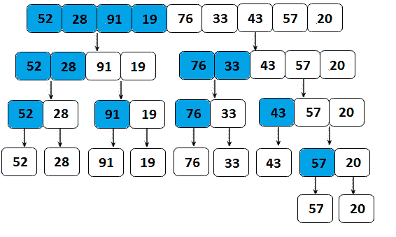

图 14.2–在合并排序算法中拆分给定数组

一旦拆分完成，我们称之为此算法的基本操作：*合并*操作（也称为*合并*操作）。合并是将两个较小的已排序子数组合并为一个已排序的新子数组的操作。直到对整个给定数组进行排序为止。下图显示了阵列的合并操作：

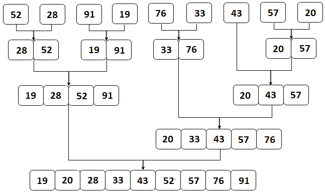

图 14.3–合并排序的合并操作

下面的代码实现了合并排序算法。流程从**sort（）**方法开始。在这里，我们先问一下*基本情况*问题。如果数组的大小大于 1，则调用**leftHalf（）**和**righhalf（）**方法，将给定的数组拆分为两个子数组。**sort（）**中的其余代码负责调用**merge（）**方法，该方法对两个未排序的子数组进行排序：

```java
public static void sort(int[] arr) {
  if (arr.length > 1) {
    int[] left = leftHalf(arr);
    int[] right = rightHalf(arr);
    sort(left);
    sort(right);
    merge(arr, left, right);
  }
}
private static int[] leftHalf(int[]arr) {
  int size = arr.length / 2;
  int[] left = new int[size];
  System.arraycopy(arr, 0, left, 0, size);
  return left;
}
private static int[] rightHalf(int[] arr) {
  int size1 = arr.length / 2;
  int size2 = arr.length - size1;
  int[] right = new int[size2];
  for (int i = 0; i < size2; i++) {
    right[i] = arr[i + size1];
  }
  return right;
}
```

接下来，merge 操作通过重复从已排序的子数组中获取最小的元素，将元素一次一个地放回到原始数组中：

```java
private static void merge(int[] result, 
      int[] left, int[] right) {
  int t1 = 0;
  int t2 = 0;
  for (int i = 0; i < result.length; i++) {
    if (t2 >= right.length
        || (t1 < left.length && left[t1] <= right[t2])) {
      result[i] = left[t1];
      t1++;
    } else {
      result[i] = right[t2];
      t2++;
    }
  }
}
```

注意，**left**<=right<语句保证了算法的稳定性。稳定的算法保证了重复元素的顺序。

完整的应用程序称为*合并排序*。

## 快速分拣

快速排序是另一种递归的排序算法，基于著名的*分治*策略。时间复杂度情况如下：最佳情况 O（n logn）、平均情况 O（n logn）、最坏情况 O（n2）。空间复杂度为 O（logn）或 O（n）。

快速排序算法首次出现时有一个重要的选择。我们必须选择给定数组中的一个元素作为*枢轴*。接下来，我们对给定的数组进行分区，使小于*轴*的所有元素位于大于该轴的所有元素之前。分区操作通过一系列交换进行。这是*分治*中的*分治*步骤。

接下来，使用相应的 pivot 再次对左侧和右侧子数组进行分区。这是通过递归地将子数组传递到算法来实现的。这是*分而治之*中的*征服*步骤。

当给定数组的所有元素小于所选枢轴或大于所选枢轴时，会发生最坏情况场景（O（n2））。选择枢轴元素至少可以通过四种方式完成，如下所示：

*   选择第一个元素作为轴。
*   选择端点元素作为轴。
*   选择中间带元素作为轴。
*   选择随机元素作为轴。

考虑数组 4, 2, 5、1, 6, 7、3。在这里，我们将轴设置为结束元素。下图描述了快速排序的工作原理：


图 14.4–快速分拣

**步骤 1**：我们选择最后一个元素作为枢轴，所以 3 是枢轴。划分从定位两个位置标记开始——我们称它们为*i*和*m*。最初，两者都指向给定数组的第一个元素。接下来，我们将*i*位置的元素与枢轴进行比较，因此将 4 与 3 进行比较。从 4>3 开始，无事可做，*i*变为 1（*i*++），而*m*保持为 0。

**步骤 2**：我们将*i*位置的元素与枢轴进行比较，因此我们将 2 与 3 进行比较。从 2<3 开始，我们将位置*m*的元素与位置*i*的元素交换，因此我们将 4 与 2 交换。*m*和*i*都增加了 1，所以*m*变为 1，*i*变为 2。

**步骤 3**：我们将*i*位置的元素与枢轴进行比较，因此我们将 5 与 3 进行比较。由于 5>3 无事可做，所以*i*变为 3（*i*++），而*m*保持为 1。

**步骤 4**：我们将*i*位置上的元素与枢轴进行比较，因此我们将 1 与 3 进行比较。从 1<3 开始，我们将位置*m*的元素与位置*i*的元素交换，因此我们将 1 与 4 交换。*m*和*i*都增加了 1，所以*m*变为 2，*i*变为 4。

**步骤 5 和步骤 6**：我们继续比较*i*位置的元件与枢轴。由于 6>3 和 7>3，在这两个步骤中没有任何操作。在这些步骤之后，*i*=7。

**步骤 7**：*i*的下一个元素是枢轴本身，因此没有更多的比较需要执行。我们只是将位置*m*处的元素与枢轴交换，因此我们将 5 与 3 交换。这会将枢轴带到其最终位置。它左边的所有元素都比它小，而它右边的所有元素都比它大。最后，我们返回*m*。

此外，对于以 0（*左*）和*m*-1 为边界的数组，以及以*m*+1 为边界的数组和数组的末端（*右*为边界的数组，重复该算法。只要*左*<*右*为真，则该算法重复。当此条件的计算结果为 false 时，将对数组进行排序。

快速排序算法的伪代码如下所示：

```java
sort(array, left, right)
    if left < right
        m = partition(array, left, right)
        sort(array, left, m-1)
        sort(array, m+1, right)
    end
end
partition(array, left, right)
    pivot = array[right]
    m = left
    for i = m to right-1
        if array[i] <= pivot
            swap array[i] with array[m]
            m=m+1
        end 
    end
    swap array[m] with array[right]
    return m
end
```

为了对整个数组进行排序，我们称之为**排序（array，0，array.length-1）**。我们来看看它的实现：

```java
public static void sort(int[] arr, int left, int right) {
  if (left < right) {
    int m = partition(arr, left, right);         
    sort(arr, left, m - 1);
    sort(arr, m + 1, right);
  }
}
private static int partition(int[] arr, int left, int right) {
  int pivot = arr[right];
  int m = left;
  for (int i = m; i < right; i++) {
    if (arr[i] <= pivot) {                
      swap(arr, i, m++);                
    }
  }
  swap(arr, right, m);
  return m;
}
```

快速排序可以交换非相邻元素；因此，它是不稳定的。完整的应用程序称为*快速排序*。此应用程序还包含一个基于**比较器**的实现——这对排序对象很有用。

## 斗式分拣

Bucket 排序（或 Bin 排序）是面试中遇到的另一种排序技巧。它通常用于计算机科学，当元素均匀分布在一个范围内时非常有用。时间复杂度情况如下：最佳和平均情况 O（n+k），其中 O（k）是创建 bucket 的时间（对于链表或哈希表为 O（1）），而 O（n）是将给定数组的元素放入 bucket 所需的时间（对于链表或哈希表也为 O（1））。最坏的情况是 O（n2）。空间复杂度为 O（n+k）。

它的高潮依赖于将给定数组的元素分成称为*桶*的组。接下来，使用不同的合适排序算法或通过递归使用桶排序算法对每个桶进行单独排序。

创建桶可以通过几种方式完成。一种方法依赖于定义多个存储桶，并使用给定阵列中的特定范围的元素填充每个存储桶（这是称为*散射*的。接下来，对每个桶进行排序（通过桶排序或其他排序算法）。最后，从每个 bucket 中收集元素以获得已排序的数组（这是称为*聚集*的。这也被称为*分散排序-聚集*技术，如下图所示。这里，我们在 4、2、11、7、18、3、14、7、4、16 数组上使用桶排序：

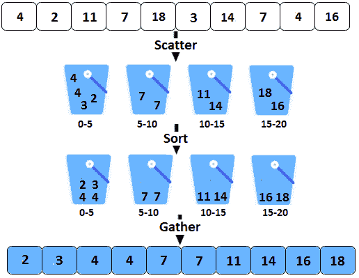

图 14.5–通过分散排序-聚集方法进行桶排序

因此，如上图所示，我们为间隔中的元素定义了四个 bucket；即 0-5、5-10、10-15 和 15-20。给定数组中的每个元素都放入一个桶中。在将给定数组的所有元素分配到 bucket 中之后，我们对每个 bucket 进行排序。第一个铲斗包含元件 2、3、4 和 4。第二个 bucket 包含元素 7、7 等。最后，我们从桶中收集元素（从左到右），得到排序后的数组；也就是说，2，3，4，4，7，7，11，14，16，18。

为此，我们可以编写以下伪代码：

```java
sort(array)
  create N buckets each of which can hold a range of elements
  for all the buckets
    initialize each bucket with 0 values
  for all the buckets
    put elements into buckets matching the range
  for all the buckets 
    sort elements in each bucket
    gather elements from each bucket
end 
```

使用列表实现此伪代码可以如下所示（此代码中调用的**hash（）**方法在本书附带的代码中有：

```java
/* Scatter-Sort-Gather approach */
public static void sort(int[] arr) {
  // get the hash codes 
  int[] hashes = hash(arr);
  // create and initialize buckets
  List<Integer>[] buckets = new List[hashes[1]];
  for (int i = 0; i < hashes[1]; i++) {
    buckets[i] = new ArrayList();
  }
  // scatter elements into buckets
  for (int e : arr) {
    buckets[hash(e, hashes)].add(e);
  }
  // sort each bucket
  for (List<Integer> bucket : buckets) {
    Collections.sort(bucket);
  }
  // gather elements from the buckets
  int p = 0;
  for (List<Integer> bucket : buckets) {
    for (int j : bucket) {
      arr[p++] = j;
    }
  }
}
```

创建 bucket 的另一种方法是将单个元素放入 bucket 中，如下图所示（这次不涉及排序）：


图 14.6–通过分散-聚集方法进行桶排序

在这种*分散-聚集*方法中，我们存储每个 bucket 中元素的出现次数，而不是元素本身，而 bucket 的位置（索引）表示元素值。例如，在 bucket number 2 中，我们存储元素 2 的出现次数，它在数组 4、2、8、7、8、2、2、7、4、9 中出现三次。由于元素 1、3、5 和 6 在给定数组中不存在，因此它们的存储桶为空（其中包含 0）。收集操作从左到右收集元素并获得排序的数组。

为此，我们可以编写以下伪代码：

```java
sort(array)
  create N buckets each of which can track a  
        counter of a single element
  for all the buckets
    initialize each bucket with 0 values
  for all the buckets
    put elements into buckets matching a single 
        element per bucket
  for all the buckets 
    gather elements from each bucket
end 
```

此伪代码的实现可能看起来如下所示：

```java
/* Scatter-Gather approach */
public static void sort(int[] arr) {
  // get the maximum value of the given array
  int max = arr[0];
  for (int i = 1; i < arr.length; i++) {
    if (arr[i] > max) {
      max = arr[i];
    }
  }
  // create max buckets
  int[] bucket = new int[max + 1];
  // the bucket[] is automatically initialized with 0s, 
  // therefore this step is redundant
  for (int i = 0; i < bucket.length; i++) {
    bucket[i] = 0;
  }
  // scatter elements in buckets
  for (int i = 0; i < arr.length; i++) {
    bucket[arr[i]]++;
  }
  // gather elements from the buckets
  int p = 0;
  for (int i = 0; i < bucket.length; i++) {
    for (int j = 0; j < bucket[i]; j++) {
      arr[p++] = i;
    }
  }
}
```

桶排序不是一个稳定的算法。稳定的算法保证了重复元素的顺序。完整的应用程序称为*BucketSort*。

## 基数排序

基数排序是一种排序算法，对整数非常有效。在基数排序中，我们通过将各个数字按其在数字中的位置分组来对元素进行排序。接下来，我们通过对每个有效位置的数字进行排序来对元素进行排序。通常，这是通过计数排序完成的（计数排序算法在 Packt 出版的书*Java 编码问题*（[www.packtpub.com/programming/Java-Coding-Problems](http://www.packtpub.com/programming/java-coding-problems)）中有详细介绍，但您可以在名为*Sortaraysin14ways*的应用程序中找到它的实现）。主要来说，数字排序可以通过任何稳定的排序算法来完成。

理解基数排序算法的简单方法依赖于一个示例。让我们考虑数组 323, 2, 3、123, 45, 6、788。下图显示了通过按顺序对单位、十和百进行排序来对该数组进行排序的步骤：

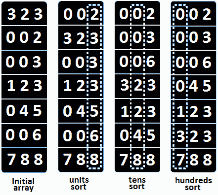

图 14.7–基数排序

因此，首先，我们根据单位位置对应的数字对元素进行排序。其次，我们根据第十位对应的数字对元素进行排序。第三，我们根据百位对应的数字对元素进行排序。当然，根据数组中的最大数字，该过程将继续以千、万等数字进行，直到不再剩下数字。

以下代码是基数排序算法的实现：

```java
public static void sort(int[] arr, int radix) {
  int min = arr[0];
  int max = arr[0];
  for (int i = 1; i < arr.length; i++) {
    if (arr[i] < min) {
      min = arr[i];
    } else if (arr[i] > max) {
      max = arr[i];
    }
  }
  int exp = 1;
  while ((max - min) / exp >= 1) {
    countSortByDigit(arr, radix, exp, min);
    exp *= radix;
  }
}
private static void countSortByDigit(
    int[] arr, int radix, int exp, int min) {
  int[] buckets = new int[radix];
  for (int i = 0; i < radix; i++) {
    buckets[i] = 0;
  }
  int bucket;
  for (int i = 0; i < arr.length; i++) {
    bucket = (int) (((arr[i] - min) / exp) % radix);
    buckets[bucket]++;
  }
  for (int i = 1; i < radix; i++) {
    buckets[i] += buckets[i - 1];
  }
  int[] out = new int[arr.length];
  for (int i = arr.length - 1; i >= 0; i--) {
    bucket = (int) (((arr[i] - min) / exp) % radix);
    out[--buckets[bucket]] = arr[i];
  }
  System.arraycopy(out, 0, arr, 0, arr.length);
}
```

基数排序的时间复杂度取决于用于排序数字的算法（记住这可以是任何稳定的排序算法）。由于我们使用的是计数排序算法，时间复杂度为 O（d（n+b）），其中*n*为元素数，*d*为位数，*b*为基数或基数（在本例中，基数为 10）。空间复杂度为 O（n+b）。

完整的应用程序称为*RadixSort*。到目前为止，我们已经成功地介绍了技术面试中出现的五大排序算法。现在，让我们快速概述一下搜索算法。

# 搜索算法

作为独立问题或另一个问题的一部分出现在面试中的主要搜索算法是二进制搜索算法。最佳情况下的时间复杂度为 O（1），而平均和最坏情况下的时间复杂度为 O（logn）。由于调用堆栈，二进制搜索的最坏情况辅助空间复杂度对于迭代实现是 O（1），对于递归实现是 O（logn）。

二进制搜索算法依赖于*分治*策略。该算法主要通过将给定的数组划分为两个子数组来实现。此外，它丢弃这些子数组中的一个子数组，并对另一个子数组进行迭代或递归操作。换句话说，在每一步中，该算法将搜索空间减半（最初是整个给定数组）。

因此，这些算法描述了在数组*a*中查找元素*x*的步骤。考虑一个排序的数组，如 16 个元素，如下面的图像所示：


图 14.8–包含 16 个元素的有序数组

首先，我们将*x*与阵列的中点*p*进行比较。如果他们相等，我们返回。如果*x>p*，则我们搜索数组的右侧，丢弃左侧（搜索空间为数组的右侧）。如果*x<p*，则在数组左侧搜索，丢弃右侧（搜索空间为数组左侧）。以下是用于查找数字 17 的二进制搜索算法的图形表示：


图 14.9–二进制搜索算法

请注意，我们以 16 个元素开始，以 1 结束。在第一步之后，我们减少到 16/2=8 个元素。在第二步中，我们减少到 8/2=4 个元素。在第三步中，我们将减少到 4/2=2 个元素。在的最后一步，我们找到了搜索到的数字 17。如果我们将此算法放入伪代码中，那么我们将获得类似于以下内容的结果：

```java
search 17 in {1, 4, 5, 7, 10, 16, 17, 18, 20,  
              23, 24, 25, 26, 30, 31, 33}
    compare 17 to 18 -> 17 < 18
    search 17 in {1, 4, 5, 7, 10, 16, 17, 18}
        compare 17 to 7 -> 17 > 7
        search 17 in {7, 10, 16, 17}
            compare 17 to 16 -> 17 > 16
            search 17 in {16, 17}
                compare 17 to 17
                return
```

此处列出了迭代实现：

```java
public static int runIterative(int[] arr, int p) {
  // the search space is the whole array
  int left = 0;
  int right = arr.length - 1;
  // while the search space has at least one element
  while (left <= right) {
    // half the search space
    int mid = (left + right) / 2;
    // if domain overflow can happen then use:
    // int mid = left + (right - left) / 2;
    // int mid = right - (right - left) / 2;
    // we found the searched element 
    if (p == arr[mid]) {
      return mid;
    } // discard all elements in the right of the 
      // search space including 'mid'
    else if (p < arr[mid]) {
      right = mid - 1;
    } // discard all elements in the left of the 
      // search space including 'mid'
    else {
      left = mid + 1;
    }
  }
  // by convention, -1 means element not found into the array
  return -1;
}
```

完整的应用程序称为*二进制搜索*。它还包含二进制搜索算法的递归实现。在[*第 10 章*](10.html#_idTextAnchor217)*、数组和字符串*中，您可以找到利用二进制搜索算法的不同编码挑战。

# 编码挑战

到目前为止，我们已经介绍了在技术访谈中遇到的最流行的排序和搜索算法。建议您练习这些算法，因为它们可能作为独立问题出现，需要伪代码或实现。

也就是说，让我们来解决 18 个与排序和搜索算法相关的问题。

## 编码挑战 1–合并两个排序数组

**亚马逊**、**谷歌**、**Adobe**、**微软**、**Flipkart**

问题 T1：考虑到你已经得到了两个排序的数组。*p*阵列足够大，可以在其末端安装*q*。编写一段将*p*和*q*按排序顺序合并的代码。

**解决方案**：重要的是要强调*p*在末端有足够的空间来容纳*q*。这表明解决方案不应涉及任何辅助空间。解决方案应通过将*q*中的元素按顺序插入*p*中，以排序顺序输出合并*p*和*q*的结果。

主要是比较*p*和*q*中的元素，然后依次插入*p*中，直到我们处理完*p*和*q*中的所有元素。让我们看一个有意义的图表，它显示了这个动作（*p*包含元素-1,3,8,0,0，而*q*包含元素 2,4）：


图 14.10–合并两个排序数组

让我们一步一步地看这个测试案例（让我们用*pIdx*表示*p*中最后一个元素的索引，用*qIdx*表示*q*中最后一个元素的索引）。在上图中，*pIdx*=2（对应于元件 8）*qIdx*=1（对应于元件 4）。

**步骤 1**：我们将*p*中的最后一个元素（索引*pIdx*中的元素）与*q*中的最后一个元素（索引*qIdx*中的元素）进行比较，因此我们将 8 与 4 进行比较。从 8>4 开始，我们将 8 复制到*p*的末尾。由于两个数组都已排序，8 是这些数组中的最大值，因此它必须转到*p*中的最后一个位置（索引）。它将占据*p*中的一个空槽（记住*p*足够大，可以在其末端容纳*q*。我们将*pIdx*减少 1。

**步骤 2**：我们将*p*中的最后一个元素（索引*pIdx*中的元素）与*q*中的最后一个元素（索引*qIdx*中的元素）进行比较，因此我们将 3 与 4 进行比较。从 3<4 开始，我们将 4 复制到*p*的末尾。我们将*qIdx*减少 1。

**步骤 3**：我们将*p*中的最后一个元素（索引*pIdx*中的元素）与*q*中的最后一个元素（索引*qIdx*中的元素）进行比较，因此我们将 3 与 2 进行比较。从 3>2 开始，我们将 3 复制到*p*的末尾。我们将*pIdx*减少 1。

**步骤 4**：我们将*p*中的最后一个元素（索引*pIdx*中的元素）与*q*中的最后一个元素（索引*qIdx*中的元素）进行比较，因此我们将-1 与 2 进行比较。从-1<2 开始，我们将 2 复制到*p*的末尾。我们将*qIdx*减少 1。没有更多的元素可供比较，*p*已排序。

看看这个！每次比较后，我们在*p*的末尾插入元素。这样，我们就不需要移动任何元素。但是，如果我们选择在*p*开头插入元素，那么我们必须向后移动元素以为每个插入的元素腾出空间。这是没有效率的！

现在，是时候看看这个算法的实现了：

```java
public static void merge(int[] p, int[] q) {
  int pLast = p.length - q.length;
  int qLast = q.length;
  if (pLast < 0) {
    throw new IllegalArgumentException("p cannot fit q");
  }
  int pIdx = pLast - 1;
  int qIdx = qLast - 1;
  int mIdx = pLast + qLast - 1;
  // merge p and q
  // start from the last element in p and q
  while (qIdx >= 0) {
    if (pIdx >= 0 && p[pIdx] > q[qIdx]) {
      p[mIdx] = p[pIdx];
      pIdx--;
    } else {
      p[mIdx] = q[qIdx];
      qIdx--;
    }
    mIdx--;
  }
}
```

完整的应用程序称为*MergeTwoSorterDarray*。如果您想检查/记住如何合并*k*排序数组，请重新访问[*第 10 章*](10.html#_idTextAnchor217)*、数组和字符串*、*在 O（nk log k）*中合并 k 排序数组的编码挑战。

## 编码挑战 2–将字谜组合在一起

**Adobe**、**Flipkart**

问题是：你已经给出了一组单词（包含从 A 到 Z 的字符），代表了几个混合的语法（对于阿纳尔 T3 例子，卡尺），“SLAT”，“Toter”，“胖”，“气门”，“Trar”，“最后”，“盐”，“肠”，“箱”，“圈”，“波罗”，“最厚”，“下”，“灌丛”，“池”，“肘部”、“副本”）。编写一段代码，打印此数组，以便将所有字谜组合在一起（例如，“卡钳”、“尖塔”、“副本”、“插入符号”、“迎合”、“痕迹”、“板条箱”、“板条”、“最后”、“盐”、“肠”、“下面”、“肘部”、“灌木丛”、“最厚”、“灌木丛”、“环”、“马球”、“池”）。

**解决方案**：首先，这里有一个关于字谜的快速提醒。如果两个或多个字符串（单词）包含相同的字符但顺序不同，则它们被视为字谜。

根据为该问题提供的示例，让我们定义以下混合字谜数组：

```java
String[] words = {
  "calipers", "caret", "slat", "cater", "thickset",   
  "spiracle", "trace", "last", "salt", "bowel", "crate", 
  "loop", "polo", "thickest", "below", "thickets", 
  "pool", "elbow", "replicas"
};
```

由于字谜包含完全相同的字符，这意味着如果我们对它们进行排序，那么它们将是相同的（例如，将“slat”、“salt”和“last”排序为“alst”）。因此，通过比较两个字符串（单词）的排序版本，我们可以说这两个字符串（单词）是字谜。换句话说，我们只需要一个排序算法。实现这一点最方便的方法是依靠 Java 的内置排序算法，这是基本体的双枢轴快速排序和对象的 TimSort。

内置解决方案称为**sort（）**，在**java.util.Arrays**类中有许多不同的风格（15 种以上的风格）。其中两种口味具有以下特征：

*   **无效排序（对象[]a）**
*   **<T>无效排序（T[]a，比较器<？超级 T>c）**

如果我们将字符串（word）转换为**字符[]**，那么我们可以对其字符进行排序，并通过以下帮助器方法返回新字符串：

```java
// helper method for sorting the chars of a word
private static String sortWordChars(String word) {
  char[] wordToChar = word.toCharArray();
  Arrays.sort(wordToChar);
  return String.valueOf(wordToChar);
}
```

接下来，我们只需要一个**比较器**，它指示两个互为字谜的字符串是等价的：

```java
public class Anagrams implements Comparator<String> {
  @Override
  public int compare(String sl, String s2) {
    return sortStringChars(sl).compareTo(sortStringChars(s2));
  }
}
```

最后，我们通过这个**compareTo（）**方法对给定的字符串（单词）数组进行排序：

```java
Arrays.sort(words, new Anagrams());
```

然而，这个问题实际上并不要求我们对给定的字谜数组进行排序；这个问题要求我们打印组合在一起的字谜。为此，我们可以依赖*哈希*（如果您不熟悉哈希的概念，请阅读[*第 6 章*](06.html#_idTextAnchor080)*、面向对象编程*、*哈希表*问题）。在 Java 中，我们可以通过内置的**HashMap**实现使用哈希，因此不需要从头开始编写哈希实现。但是这个**哈希映射**有什么用处呢？我们应该在这个映射的条目（键值对）中存储什么？

每组字谜聚合到相同的排序版本（例如，包含字符串（单词）“slat”、“salt”和“last”的字谜组具有唯一和通用的排序版本“alst”）。由于其独特性，排序后的版本很可能成为我们地图中的关键。接下来，该值表示字谜图列表。因此，算法非常简单；它包含以下步骤：

1.  循环给定的单词数组。
2.  对每个单词的字符进行排序。
3.  填充地图（添加或更新地图）。
4.  打印结果。

在代码行中：

```java
/* Group anagrams via hashing (O(nm log m) */
public void printAnagrams(String words[]) {
  Map<String, List<String>> result = new HashMap<>();
  for (int i = 0; i < words.length; i++) {
    // sort the chars of each string
    String word = words[i];
    String sortedWord = sortWordChars(word);
    if (result.containsKey(sortedWord)) {
      result.get(sortedWord).add(word);
    } else {
      // start a new group of anagrams
      List<String> anagrams = new ArrayList<>();
      anagrams.add(word);
      result.put(sortedWord, anagrams);
    }
  }
  // print the result
  System.out.println(result.values());
}
```

如果*n*是字符串（单词）的数量，且每个字符串（单词）最多有*m*个字符，则前两种方法的时间复杂度为 O（nm log m）。

我们能做得更好吗？好吧，为了做得更好，我们必须确定前两种方法的问题。问题在于我们对每个字符串（单词）进行排序，这将花费我们额外的时间。但是，我们可以使用额外的**字符[]**来统计字符串（单词）中每个字符的出现次数（频率）。在我们构建这个**字符[]**之后，我们将其转换为**字符串**，以获取我们必须在**HashMap**中搜索的密钥。由于 Java 处理的**字符**类型与它处理的【无符号】**短**类型相同，因此我们可以使用**字符**进行计算。让我们看看代码（**wordToChar**数组跟踪给定数组中每个字符串（单词）从*a*到*z*的字符频率）：

```java
/* Group anagrams via hashing (O(nm)) */
public void printAnagramsOptimized(String[] words) {
  Map<String, List<String>> result = new HashMap<>();
  for (int i = 0; i < words.length; i++) {
    String word = words[i];
    char[] wordToChar = new char[RANGE_a_z];
    // count up the number of occurrences (frequency) 
    // of each letter in 'word'
    for (int j = 0; j < word.length(); j++) {
      wordToChar[word.charAt(j) - 'a']++;
    }
    String computedWord = String.valueOf(wordToChar);
    if (result.containsKey(computedWord)) {
      result.get(computedWord).add(word);
    } else {
      List<String> anagrams = new ArrayList<>();
      anagrams.add(word);
      result.put(computedWord, anagrams);
    }
  }
  System.out.println(result.values());
}
```

如果*n*为个串（字）且每个串（字）最多包含*m*个字符，则前两种方法的时间复杂度为 O（nm）。如果您需要支持更多字符，而不仅仅是从*a*到*z*，那么在*中使用**int[】**数组和**codepoint（）**–更多详细信息请参见[*第 10 章*](10.html#_idTextAnchor217)*、数组和字符串*提取代理项对的代码点*编码挑战。完整的应用程序称为*GroupSortAnagrams*。

## 编码挑战 3–大小未知的列表

问题 T1：考虑到你已经给出了一个表示未知大小的排序列表的数据结构（这意味着不存在仅包含 T5 的正数）的 T3（或）T4（或 T4）或类似的方法。此列表的代码如下所示：

```java
public class SizelessList {
  private final int[] arr;
  public SizelessList(int[] arr) {
    this.arr = arr.clone();
  }
  public int peekAt(int index) {
    if (index >= arr.length) {
      return -1;
    }
    return arr[index];
  }
}
```

但是，正如您所看到的，有一个名为**peekAt（）**的方法返回 O（1）中给定索引处的元素。如果给定的索引超出了此列表的范围，则**peek（）**返回-1。编写一段代码，返回元素*p*出现的索引。

**解决方案**：当我们必须在排序数据结构（例如，在排序数组中）中搜索时，我们知道二进制搜索是正确的选择。那么，在这种情况下我们可以使用二进制搜索吗？由于给定的列表已排序，并且我们可以在 O（1）时间内访问其中的任何元素，这意味着二进制搜索应该是一个不错的选择。除此之外，二进制搜索算法需要数据结构的大小，因为我们必须将搜索空间减半（例如，**list.size（）/2**）才能找到中间点。给定的数据结构（列表）没有显示其大小。

因此，问题就归结为找到这个列表的大小。我们知道如果给定的索引超出此列表的边界，**peekAt（）**将返回-1，因此我们可以循环列表并计算迭代次数，直到**peekAt（）**返回-1。当**peekAt（）**返回-1 时，我们应该知道列表的大小，所以我们可以应用二进制搜索算法。我们可以尝试以指数方式循环列表元素，而不是逐个元素循环（线性算法）。因此，我们不循环**偷看（1）**、**偷看（2）**、**偷看（3）**、**偷看（4）**…，而是循环**偷看（1）**、**偷看（2）**、**偷看（4）**、**偷看（8）**。。。。换句话说，我们可以在 O（logn）时间内完成，而不是在 O（n）时间内完成，其中*n*是列表的大小。我们可以这样做，因为给定的列表已排序！

以下代码应阐明该方法和其余细节：

```java
public static int search(SizelessList sl, int element) {
  int index = 1;
  while (sl.peekAt(index) != -1
        && sl.peekAt(index) < element) {
    index *= 2;
  }
  return binarySearch(sl, element, index / 2, index);
}
private static int binarySearch(SizelessList sl, 
      int element, int left, int right) {
  int mid;
  while (left <= right) {
    mid = (left + right) / 2;
    int middle = sl.peekAt(mid);
    if (middle > element || middle == -1) {
      right = mid - 1;
    } else if (middle < element) {
      left = mid + 1;
    } else {
      return mid;
    }
  }
  return -1;
}
```

完整的应用程序称为*未知列表*。

## 编码挑战 4–合并排序链表

**亚马逊**、**谷歌**、**Adobe**、**微软**、**Flipkart**

问题 T1：考虑一下你已经得到了一个单链表。编写一段代码，通过合并排序算法对链表进行排序。

**解决方案**：解决这个问题需要我们在本书中已经介绍过的几个主题的知识。首先，您必须熟悉链表。本主题包含在[*第 11 章*](11.html#_idTextAnchor252)*、链表和地图*中。其次，您需要阅读本章的*合并排序*部分。

按照合并排序算法，我们必须不断地将链表一分为二，直到我们获得空的子列表或包含单个元素的子列表（这是*分而治之*方法）。如果子列表为空或包含一个元素，则根据定义对其进行排序——此称为*基本情况*递归。下图显示了初始链表 2 的此过程→ 1.→ 4.→ 9→ 8.→ 3.→ 7.→ 无效的：

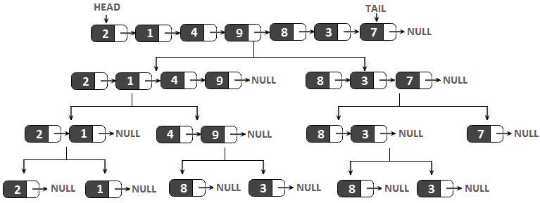

图 14.11–在链表上使用分治

像这样划分给定的链表可以通过快速运行/慢速运行方法来完成。该方法详见[*第 11 章*](11.html#_idTextAnchor252)*、链表和地图*、*快跑/慢跑进近*一节。主要是当**快跑者**（**FR**到达给定链表的末尾时，**慢跑者**（**SR**指向该链表的中间，所以我们可以将链表一分为二。此处列出了此操作的代码：

```java
// Divide the given linked list in two equal sub-lists.
// If the length of the given linked list is odd, 
// the extra node will go in the first sub-list
private Node[] divide(Node sourceNode) {
  // length is less than 2
  if (sourceNode == null || sourceNode.next == null) {
    return new Node[]{sourceNode, null};
  }
  Node fastRunner = sourceNode.next;
  Node slowRunner = sourceNode;
  // advance 'firstRunner' two nodes, 
  // and advance 'secondRunner' one node
  while (fastRunner != null) {
    fastRunner = fastRunner.next;
    if (fastRunner != null) {
      slowRunner = slowRunner.next;
      fastRunner = fastRunner.next;
    }
  }
  // 'secondRunner' is just before the middle point 
  // in the list, so split it in two at that point
  Node[] headsOfSublists = new Node[]{
          sourceNode, slowRunner.next};
  slowRunner.next = null;
  return headsOfSublists;
}
```

代码的其余部分是一个经典的合并排序实现。**sort（）**方法负责对子列表进行递归排序。接下来，**merge（）**方法通过重复从已排序的子列表中获取最小的元素，将元素一次一个地放回原始链表中：

```java
// sort the given linked list via the Merge Sort algorithm
public void sort() {
  head = sort(head);
}
private Node sort(Node head) {
  if (head == null || head.next == null) {
    return head;
  }
  // split head into two sublists
  Node[] headsOfSublists = divide(head);
  Node head1 = headsOfSublists[0];  
  Node head2 = headsOfSublists[1];
  // recursively sort the sublists
  head1 = sort(head1);
  head2 = sort(head2);
  // merge the two sorted lists together
  return merge(head1, head2);
}
// takes two lists sorted in increasing order, and merge 
// their nodes together (which is returned)
private Node merge(Node head1, Node head2) {
  if (head1 == null) {
    return head2;
  } else if (head2 == null) {
    return head1;
  }
  Node merged;
  // pick either 'head1' or 'head2'
  if (head1.data <= head2.data) {
    merged = head1;
    merged.next = merge(head1.next, head2);
  } else {
    merged = head2;
    merged.next = merge(head1, head2.next);
  }
  return merged;
}
```

完整的应用程序称为*MergesortInglyLinkedList*。对双链接列表进行排序非常类似。您可以在名为*MergeSortDoublyLinkedList*的应用程序中找到这样的实现。

## 编码挑战 5–字符串中穿插着空字符串

**亚马逊**、**谷歌**、**Adobe**、**微软**、**Flipkart**

问题 T1A:考虑到你已经给出了一个排列有空字符串的字符串数组。编写一段代码，返回给定非空字符串的索引。

**解决方案**：当我们必须在排序数据结构（例如，在排序数组中）中搜索时，我们知道二进制搜索算法是正确的选择。那么，在这种情况下我们可以使用二进制搜索吗？我们有给定数组的大小，所以我们可以将搜索空间减半并找到中间点。如果我们将数组的索引 0 表示为*左*，将*array.length-*1 表示为*右*，那么我们可以将*mid=*（*左*+*右**/*2 写入。所以，*mid*是给定数组的中点。**

 **但是如果*mid*索引落在空字符串上，我们能做什么呢？在这种情况下，我们不知道应该去*右侧*还是*左侧*。换句话说，哪一半应该丢弃，哪一半应该用于继续我们的搜索？答案可在下图中找到（给定的字符串为“cat”、、、、、、、、、、、、、、、、、、、、、、、、、、、、）：

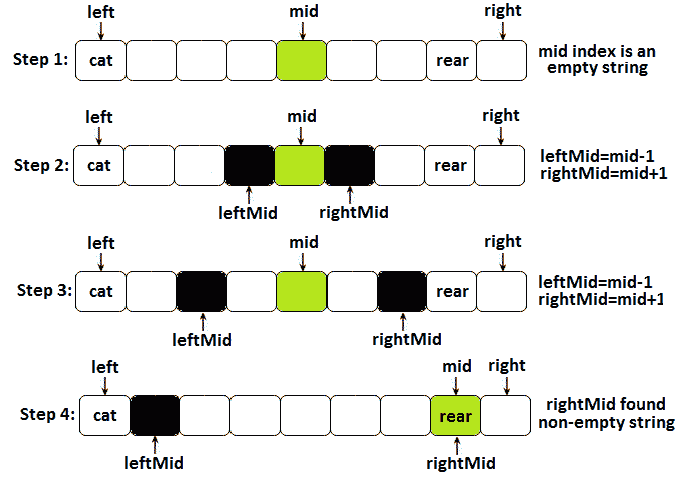

图 14.12–计算空字符串情况下的中点

因此，当中点（*中点*落在空字符串上时，我们必须通过将其移动到最近的非空字符串来更正其索引。如上图*步骤 2*所示，我们选择*左中*为*中*-1，*右中*为*中*+1。我们一直从*中*移动，直到*左中*或*右中*索引指出一个非空字符串（在上图中，*右中*在*步骤 3*和*4*之后找到字符串“rear”）。当这种情况发生时，我们更新*中间*位置并继续经典的二进制搜索（*步骤 4*。

就代码而言，这非常简单：

```java
public static int search(String[] stringsArr, String str) {
  return search(stringsArr, str, 0, stringsArr.length - 1);
}
private static int search(String[] stringsArr, 
      String str, int left, int right) {
  if (left > right) {
    return -1;
  }
  int mid = (left + right) / 2;
  // since mid is empty we try to find the 
  // closest non-empty string to mid
  if (stringsArr[mid].isEmpty()) {
    int leftMid = mid - 1;
    int rightMid = mid + 1;
    while (true) {
      if (leftMid < left && rightMid > right) {
        return -1;
      } else if (rightMid <= right 
            && !stringsArr[rightMid].isEmpty()) {
        mid = rightMid;
        break;
      } else if (leftMid >= left 
            && !stringsArr[leftMid].isEmpty()) {
        mid = leftMid;
        break;
      }
      rightMid++;
      leftMid--;
    }
  }
  if (str.equals(stringsArr[mid])) {
    // the searched string was found
    return mid;
  } else if (stringsArr[mid].compareTo(str) < 0) {
    // search to the right
    return search(stringsArr, str, mid + 1, right);
  } else {
    // search to the left
    return search(stringsArr, str, left, mid - 1);
  }
}
```

这种方法的最坏情况时间复杂度为 O（n）。请注意，如果搜索的字符串是空字符串，则返回-1，因此我们将这种情况视为错误。这是正确的，因为问题表明需要查找的给定字符串是非空的。如果问题没有提供这方面的任何细节，那么你必须与面试官讨论。通过这种方式，你向面试官展示了你对细节和角落案例的关注。完整的应用程序称为*穿插删除字符串*。

## 编码挑战 6–在另一个队列的帮助下对队列进行排序

**亚马逊**、**谷歌**、**Adobe**、**微软**、**Flipkart**

问题 T1：考虑到你已经给出了一个整数队列。编写一段代码，在另一个队列（额外队列）的帮助下对该队列进行排序。

**解决方案**：这个问题的解决方案必须包含一个额外的队列，所以在对给定队列进行排序时，我们必须考虑如何使用这个额外的队列。有不同的方法，但方便的面试方法可以总结如下：

1.  只要给定队列中的元素是按升序排列的（从队列前面开始），我们就将它们出列，并在额外队列中排队。
2.  如果一个元素破坏了前面的语句，那么我们将其出列并重新进入给定的队列，而不涉及额外的队列。
3.  通过*步骤 1*或*2*处理完所有元素后，我们将所有元素从额外队列中出列，并将它们重新排回到给定队列中。
4.  只要额外队列的大小不等于给定队列的初始大小，我们就从*步骤 1*开始重复，因为队列尚未排序。

让我们考虑给定队列包含以下元素：→ 3.→ 9→ 1.→ 8.→ 5.→ 2.→ 正面下图表示给定队列和额外队列（最初为空）：

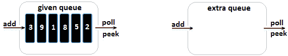

图 14.13–给定队列和额外队列

应用我们算法的*步骤 1*意味着将 2、5 和 8 从给定队列中出列，并将它们放入额外队列中，如下图所示：


图 14.14–在额外队列中排队 2、5 和 8

由于给定队列中的下一个元素小于添加到额外队列中的最后一个元素，因此我们采用我们的算法的*步骤 2*，因此我们将 1 出列并将其放入给定队列中，如下图所示：

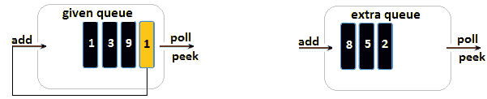

图 14.15–给定队列中的出列和入列 1

此外，我们再次应用*步骤 1*，因为 9（给定队列的前端）比添加到额外队列（8）的最后一个元素大。因此，9 进入额外队列，如下图所示：

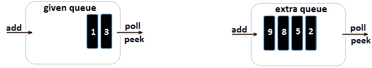

图 14.16–将 9 排在额外队列中

接下来，3 小于 9，因此我们必须将其出列并重新放入给定队列中，如下图所示：


图 14.17–给定队列中的 3 号排队和 3 号排队

此时，我们已经处理（访问）了给定队列中的所有元素，因此我们应用了算法的*步骤 3*。我们从额外队列中取出所有元素，并将它们放入给定队列中，如下图所示：


图 14.18–从额外队列中排队和在给定队列中排队

现在，我们重复整个过程，直到给定队列按升序排序。让我们看看代码：

```java
public static void sort(Queue<Integer> queue) {
  if (queue == null || queue.size() < 2) {
    return;
  }
  // this is the extra queue
  Queue<Integer> extraQueue = new ArrayDeque();
  int count = 0;            // count the processed elements
  boolean sorted = false;   // flag when sorting is done
  int queueSize = queue.size();   // size of the given queue
  int lastElement = queue.peek(); // we start from the front  
                                  // of the given queue
  while (!sorted) {
    // Step 1
    if (lastElement <= queue.peek()) {
      lastElement = queue.poll();
      extraQueue.add(lastElement);
    } else { // Step 2
      queue.add(queue.poll());
    }
    // still have elements to process
    count++;
    if (count != queueSize) {
      continue;
    }
    // Step 4
    if (extraQueue.size() == queueSize) {
      sorted = true;
    }
    // Step 3            
    while (extraQueue.size() > 0) {
      queue.add(extraQueue.poll());
      lastElement = queue.peek();
    }
    count = 0;
  }
}
```

此代码的运行时为 O（n2）。完整的应用程序称为*SortQueueViaTempQueue*。

## 编码挑战 7–在没有额外空间的情况下对队列进行排序

**亚马逊**、**谷歌**、**Adobe**、**微软**、**Flipkart**

问题 T1：考虑到你已经得到了一个整数队列。编写一段代码，在不使用额外空间的情况下对该队列进行排序。

**解决方案**：在前面的问题中，我们必须解决相同的问题，但使用额外的队列。这一次，我们不能使用额外的队列，因此必须对队列进行适当的排序。

我们可以将排序视为一个连续的过程，即从给定队列中找到最小元素，从其当前位置将其提取，然后将其添加到该队列的后面。扩展此想法可能会产生以下算法：

1.  考虑当前最小值，作为最小值。
2.  从队列的未排序部分（最初，未排序部分是整个队列）中取出元素。
3.  将此元素与当前最小值进行比较。
4.  If this element is smaller than the current minimum, then do the following:

    A.如果当前最小值为**Integer.MAX_VALUE**，则该元素将成为当前最小值，我们不会将其重新排队。

    B 如果当前最小值不是**Integer.MAX_VALUE**，那么我们将当前最小值重新排队，该元素将成为当前最小值。

5.  如果该元素大于当前的最小值，则将其重新排入队列。
6.  从*步骤 2*开始重复，直到穿过整个未排序零件。
7.  在这一步中，当前最小值是整个未排序部分的最小值，因此我们将其重新排入队列。
8.  设置未排序零件的新边界，并从*步骤 1*重复，直到未排序零件尺寸为 0（每次执行此步骤时，未排序零件的尺寸减小 1）。

下图是该队列算法的快照；就是后面→ 3.→ 9→ 1.→ 8.→ 5.→ 2.→ 正面：

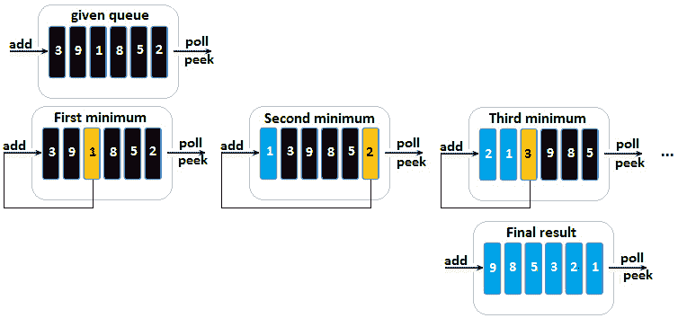

图 14.19–在没有额外空间的情况下对队列进行排序

请注意，未排序部分（最初为整个队列）的每个最小值是如何添加回队列并成为队列已排序部分的成员的。让我们看看代码：

```java
public static void sort(Queue<Integer> queue) {
  // traverse the unsorted part of the queue
  for (int i = 1; i <= queue.size(); i++) {
    moveMinToRear(queue, queue.size() - i);
  }
}
// find (in the unsorted part) the minimum
// element and move this element to the rear of the queue
private static void moveMinToRear(Queue<Integer> queue, 
          int sortIndex) {
  int minElement = Integer.MAX_VALUE;
  boolean flag = false;
  int queueSize = queue.size();
  for (int i = 0; i < queueSize; i++) {
    int currentElement = queue.peek();
    // dequeue
    queue.poll();
    // avoid traversing the sorted part of the queue            
    if (currentElement <= minElement && i <= sortIndex) {
      // if we found earlier a minimum then 
      // we put it back into the queue since
      // we just found a new minimum
      if (flag) {
        queue.add(minElement);
      }
      flag = true;
      minElement = currentElement;
    } else {
      // enqueue the current element which is not the minimum
      queue.add(currentElement);
    }
  }
  // enqueue the minimum element
  queue.add(minElement);
}
```

此代码的运行时为 O（n2）。完整的应用程序称为*sortquewithoutextraspace*。

## 编码挑战 8–借助另一个堆栈对堆栈进行排序

**亚马逊**、**谷歌**、**Adobe**、**微软**、**Flipkart**

问题 T1：考虑到你已经给出了一个未排序的栈。编写一段代码，按降序或升序对堆栈进行排序。您只能使用额外的临时堆栈。

**解决方案**：如果我们可以使用两个额外的堆栈，那么我们可以实现一个算法，在给定的堆栈中重复搜索最小值，并将其推送到最终或生成的堆栈中。搜索给定堆栈时，另一个附加堆栈将用作缓冲区。然而，这个问题要求我们只使用一个额外的临时堆栈。

由于这个约束，我们被迫从给定堆栈中弹出（将其表示为*s1*），并按顺序推入附加堆栈（将其表示为*s2*）。为了实现这一点，我们使用一个临时或辅助变量（让我们将其表示为*t*），如下图所示（给定堆栈位于顶部）→ 1.→ 4.→ 5.→ 3.→ 1.→ 2):

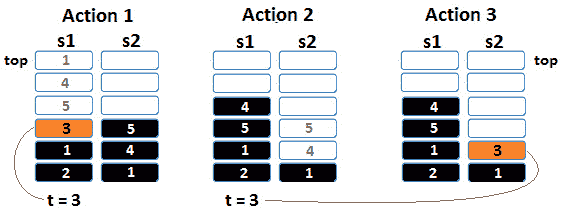

图 14.20–对堆栈进行排序

解决方案包括两个主要步骤：

1.  While *s1* is not empty, do the following:

    A.从*s1*中弹出一个值，存储在*t*中（上图*动作 1*为值 3）。

    B 只要我们从*s2*弹出的大于*t*或*s2*不为空（上图中*动作 2*，就可以从*s2*弹出并将其推入*s1*。

    C 将*t*推入*s2*（上图中的*动作 3*）。

2.  一旦*步骤 1*完成，*s1*为空，*s2*被排序。最大值位于底部，因此生成的堆栈位于顶部→ 5.→ 4.→ 3.→ 2.→ 1.→ 1.第二步是将*s2*复制到*s1*中。这样，*s1*按*s2*的相反顺序排序，所以最小值在*s1*的顶部（顶部）→ 1.→ 1.→ 2.→ 3.→ 4.→ 5).

让我们看看代码：

```java
public static void sort(Stack<Integer> stack) {
  Stack<Integer> auxStack = new Stack<>();
  // Step 1 (a, b and c)
  while (!stack.isEmpty()) {
    int t = stack.pop();
    while (!auxStack.isEmpty() && auxStack.peek() > t) {
      stack.push(auxStack.pop());
    }
    auxStack.push(t);
  }
  // Step 2
  while (!auxStack.isEmpty()) {
    stack.push(auxStack.pop());
  }
}
```

完整的代码称为*SortStack*。

## 编码挑战 9–将堆栈排序到位

**亚马逊**、**谷歌**、**Adobe**、**微软**、**Flipkart**

问题 T1：考虑到你已经给出了一个未排序的栈。编写一段代码，对堆栈进行适当排序。请注意，此问题的一个变体将明确指出，您不能使用任何重复的语句，例如**用于**、**而**等等。

**解决方案**：在前面的问题中，我们必须解决相同的问题，但使用显式额外堆栈。这一次，我们不能使用显式的额外堆栈，因此必须对堆栈进行适当的排序。

让我们考虑给定的堆栈是顶部。→ 4.→ 5.→ 3.→ 8.→ 2.→1.解决方案首先从堆栈中弹出值，直到堆栈为空。然后，我们将递归调用堆栈中的值按排序位置插入到给定堆栈中。

让我们尝试将此方法应用到堆栈中。下图显示了从堆栈中弹出值直到堆栈为空的过程。在左边，我们有初始状态。在右边，我们得到的结果是：


图 14.21–就地排序堆栈（1）

接下来，只要要推的当前元素小于堆栈的当前顶部或堆栈为空，我们就将推回堆栈。那么，我们将推动 1、2 和 8。我们不推 3（下一个要推的元素），因为 3 小于 8（您可以在下图中看到此语句为*动作 1*。此时，我们需要为 3 留出空间，因此我们必须弹出堆栈顶部，8（您可以在下图中看到此语句为*操作 2*。最后，我们推 3，然后，我们将 8 推到堆栈中（您可以在下图中看到此语句为*操作 3*：

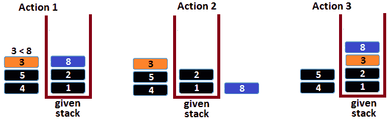

图 14.22–就地排序堆栈（2）

到目前为止，一切都很好！接下来，我们必须重复上图中的流程。因此，要从递归调用堆栈推送到给定堆栈的下一个元素是 5。但是 5 小于 8，所以我们无法推送它（您可以在下图中看到此语句为*动作 1*。此时，我们需要为 5 留出空间，因此我们必须弹出堆栈顶部，即 8（您可以在下图中看到此语句为*操作 2*。最后，我们推 5，然后，我们将 8 推到堆栈中（您可以在下图中看到此语句为*操作 3*：

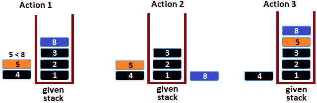

图 14.23–就地排序堆栈（3）

最后，应该从递归调用堆栈推送到给定堆栈的最后一个元素是 4。但是，4 是小于 8，所以我们不能推送它（您可以在下图中看到这个语句为*动作 1*。此时，我们需要将空间设置为 4，因此我们必须弹出堆栈顶部，即 8（您可以在下图中看到此语句为*操作 2*。但是，我们仍然无法将 4 推入堆栈，因为 4 小于 5（弹出 8 后的新顶部元素）。我们还必须弹出 5（您可以在下图中看到此语句为*动作 3*。现在，我们可以按 4。接下来，我们推 5 和 8。您可以在下图中看到这一点，即*动作 4*：

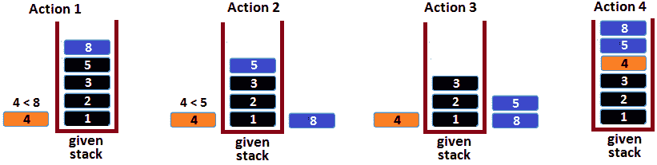

图 14.24–就地排序堆栈（4）

完成！给定的堆栈已排序。让我们看看代码：

```java
public static void sort(Stack<Integer> stack) {
  // stack is empty (base case)
  if (stack.isEmpty()) {
    return;
  }
  // remove the top element
  int top = stack.pop();
  // apply recursion for the remaining elements in the stack
  sort(stack);
  // insert the popped element back in the sorted stack
  sortedInsert(stack, top);
}
private static void sortedInsert(
 Stack<Integer> stack, int element) {
  // the stack is empty or the element 
  // is greater than all elements in the stack (base case)
  if (stack.isEmpty() || element > stack.peek()) {
    stack.push(element);
    return;
  }
  // the element is smaller than the top element, 
  // so remove the top element       
  int top = stack.pop();
  // apply recursion for the remaining elements in the stack
  sortedInsert(stack, element);
  // insert the popped element back in the stack
  stack.push(top);
}
```

此代码的运行时为 O（n2），递归调用堆栈的辅助空间为 O（n）（*n*是给定堆栈中的元素数）。完整的应用程序称为*SortStackInPlace*。

## 编码挑战 10–在全排序矩阵中搜索

**亚马逊**、**微软**、**Flipkart**

问题 T1 问题：考虑到你已经给出了一个整数的矩阵，即 T3 行。*全排序矩阵*表示每行的整数从左到右排序，每行的第一个整数大于前一行的最后一个整数。编写一段代码，如果给定整数在此矩阵中，则返回**true**。

**解决方案**：蛮力法效率很低。如果我们尝试迭代矩阵并将每个（*行，col*整数）与搜索的整数进行比较，那么这将产生 O（mn）的时间复杂度，其中*m*是行数，*n*是矩阵中的列数。

另一种解决方案将依赖于二进制搜索算法。我们有足够的经验在排序数组中实现这个算法，但是我们能在排序矩阵中实现吗？是的，我们可以，因为这个排序矩阵是*完全排序的*。更准确地说，由于每个行的第一个整数大于前一行的最后一个整数，我们可以将此矩阵视为长度为*行*x*cols*的数组。下图阐明了这一说法：


图 14.25–作为数组的完全排序矩阵

因此，如果我们将给定的矩阵看作一个数组，那么我们可以减少将二进制搜索应用于排序数组的问题。无需将矩阵物理转换为数组。我们需要做的就是使用以下语句相应地表示二进制搜索：

*   数组最左边的整数位于索引 0 处（我们将其表示为*左*）。
*   数组最右边的整数位于索引（*行*cols*）-1（将其表示为*右*）。
*   阵列的中点位于（*左+右*）/2。
*   索引中间点的整数位于*矩阵**中/列**中%列*，其中*列*为矩阵中的列数。

有了这些语句，我们可以编写以下实现：

```java
public static boolean search(int[][] matrix, int element) {
  int rows = matrix.length;    // number of rows
  int cols = matrix[0].length; // number of columns
  // search space is an array as [0, (rows * cols) - 1]
  int left = 0;
  int right = (rows * cols) - 1;
  // start binary search
  while (left <= right) {
    int mid = (left + right) / 2;
    int midElement = matrix[mid / cols][mid % cols];
    if (element == midElement) {
      return true;
    } else if (element < midElement) {
      right = mid - 1;
    } else {
      left = mid + 1;
    }
  }
  return false;
}
```

上述代码以 O（log mn）时间执行，其中*m*为行数，*n*为给定矩阵中的列数。该应用程序称为*SearchInFullSortedMatrix*。

## 编码挑战 11–在排序矩阵中搜索

**亚马逊**、**微软**、**Flipkart**

问题 T1：考虑到你已经给出了一个大小为整数的整数矩阵。每行和每列按升序排序。编写一段代码，如果给定的整数在此矩阵中，则返回**true**。

**解决方案**：请注意，此问题与前一个编码挑战不同，因为每行的第一个整数不必大于前一行的最后一个整数。如果我们应用二进制搜索算法（就像我们在前面的编码挑战中所做的那样），那么我们必须将它应用到每一行。由于二进制搜索的复杂度为 O（logn），我们必须将其应用于每一行，这意味着这种方法将在 O（mlogn）时间内执行，其中，*m*是行数，*n*是给定矩阵中的列数。

为了找到一个解决方案，让我们考虑下面的图（4×6 的矩阵）：


图 14.26–在排序矩阵中搜索

假设我们搜索元素 80，可以在（2，3）中找到。让我们来推断这个位置。这一推论的高潮在于矩阵已经对行和列进行了排序。让我们分析列的开头：如果列的开头大于 80（例如，第 4 列），那么我们知道 80 不能在该列中，因为列的开头是该列中的最小元素。此外，在该列右侧的任何列中都找不到 80，因为每个列的起始元素的大小必须从左到右增加。此外，我们可以对行应用相同的逻辑。如果行的开头大于 80，那么我们知道 80 不能在该行或后续（向下）行中。

现在，如果我们查看列和行的末尾，我们可以推断出一些类似的结论（镜像结论）。如果列的结尾小于 80（例如，列 2），那么我们知道 80 不能在该列中，因为列的结尾是该列中的最大元素。此外，在列左侧的任何列中都找不到 80，因为每个列的起始元素的大小必须从右向左减小。此外，我们可以对行应用相同的逻辑。如果一行的末尾小于 80，那么我们知道 80 不能在该行或后续（向上）行中。

如果我们对元素*p*加入、综合并推广这些结论，那么我们可以得出以下结论：

*   如果列的开始大于*p*，则*p*必须位于该列的左侧。
*   如果行的开头大于*p*，则*p*必须在该行之上。
*   如果列的结尾小于*p*，则*p*必须位于该列的右侧。
*   如果行的末尾小于*p*，则*p*必须在该行下方。

这已经开始看起来像一个算法。不过，还有一件事我们必须决定。我们从哪里开始？从哪一行和哪一列开始？幸运的是，我们有几个选择。例如，我们可以从最大的列（0，*最后一列*）开始，在同一行的左侧工作，或者从最大的行（*最后一行*、0）开始，在同一列上工作。

假设我们选择从最大的列（0，*最后一列*开始，向左搜索元素*p*。这意味着我们的流程如下所示（让我们表示*i*=0 和*j=cols*-1）：

1.  如果*矩阵**i**j**>p*，则在同一行中向左移动。此列中的元素肯定大于*矩阵**i**j*，因此，通过扩展，大于*p*。因此，我们丢弃当前列，将*j*减少 1，然后重复。
2.  如果*矩阵**i**j**<p*，则在同一列中下移。这一行中的元素肯定小于*矩阵**i**j*，因此，通过扩展，小于*p*。因此，我们丢弃当前行，将*i*增加 1，然后重复。
3.  如果*p*等于*矩阵**i**j*，则返回**真**。

如果我们应用这个算法在我们的 4x6 矩阵中找到元素 80，那么从（0,5）到（2,3）的路径如下：


图 14.27–解决方案的路径

如果我们将此算法放入代码中，则得到以下结果：

```java
public static boolean search(int[][] matrix, int element) {
  int row = 0;
  int col = matrix[0].length - 1;
  while (row < matrix.length && col >= 0) {
    if (matrix[row][col] == element) {
      return true;
    } else if (matrix[row][col] > element) {
      col--;
    } else {
      row++;
    }
  }
  return false;
}
```

该算法的时间复杂度为 O（m+n），其中*m*为行数，*n*为列数。完整的应用程序称为*SearchInsertedMatrix*。它还包含该算法的递归实现。

## 编码挑战 12–第一个挑战的第一个位置

**亚马逊**、**谷歌**、**Adobe**

问题 T1：考虑到阿纳尔 T2 给出了一个只有 0 和 1 的数组。至少有一个 0 和一个 1。所有 0 都排在第一位，然后是 1。编写一段代码，返回此数组中第一个 1 的索引。

Po.T0.解决方案 To1 T1：考虑数组 ORT T2。ARR PosiT3＝= [ 0, 0, 0，1, 1, 1，1 ]。由于*arr*[3]为 1，搜索索引为 3，这是第一个 1。

由于 0 排在第一位，然后是 1，所以对数组进行排序。

笔记

因为这是面试中非常常见的话题，所以我要再说一遍：当我们必须在排序数组中找到一些东西时，我们必须考虑二进制搜索算法。

在这种情况下，二进制搜索算法可以很容易地实现。二进制搜索中计算的中间点可以落在 0 或 1 上。由于数组是排序的，如果中间点落在 0 上，那么我们肯定知道 1 的第一个值必须在中间点的右侧，因此我们丢弃中间点的左侧。另一方面，如果中间点落在 1 上，那么我们知道 1 的第一个值必须在中间点的左侧，所以我们丢弃中间点的右侧。以下代码对此进行了澄清：

```java
public static int firstOneIndex(int[] arr) {
  if (arr == null) {
    return -1;
  }
  int left = 0;
  int right = arr.length - 1;
  while (left <= right) {
    int middle = 1 + (right - left) / 2;
    if (arr[middle] == 0) {
      left = middle + 1;
    } else {
      right = middle - 1;
    }
    if (arr[left] == 1) {
      return left;
    }
  }
  return -1;
}
```

完整的应用程序称为*PositionOfFirstOne*。

## 编码挑战 13–两个元素之间的最大差异

问题 T1：考虑到你已经给出了整数数组，阿纳尔。写一段代码，当大整数出现在小整数之后时，返回两个元素之间的最大差值。

让我们考虑几个例子。

如果给定数组为 1、34、21、7、4、8、10，则最大差值为 33（计算为 34（索引 1）-1（索引 0））。如果给定的数组为 17、9、2、26、32、27、3，则最大差值为 30（计算为 32（索引 4）-2（索引 2））。

一个按升序排序的数组怎么样，比如 3，7，9，11？在这种情况下，最大差值为 11-3=8，因此这是最大和最小元素之间的差值。以降序排列的数组，如 11、9、7、6，怎么样？在本例中，最大差值为 6-7=-1，因此最大差值是最接近 0 的差值。

根据这些例子，我们可以想出几种解决方案。例如，我们可以从计算数组的最小值和最大值开始。接下来，如果最大值的索引大于最小值的索引，那么最大差值就是数组的最大值和最小值之间的差值。否则，我们需要计算数组的下一个最小值和最大值，并重复此过程。这可能导致复杂性时间为 O（n2）。

另一种方法是对数组进行排序。之后，最大差异将是最大元素和最小元素之间的差异（最后一个元素和第一个元素之间的差异）。这可以通过 O（nlogn）运行时中的排序算法实现。

在 O（n）时间内做怎么样？我们尝试另一种方法，而不是对数组进行排序或计算其最大值或最小值。请注意，如果我们认为，从数组中的第一个元素，我们可以计算每一个连续元素和 PoT T2 p 之间的差。在这样做的同时，我们正在跟踪最大差异并相应地更新它。例如，如果数组为 3、5、2、1、7、4 和*p*=3，则最大差值为 7-*p*=7-3=4。然而，如果我们仔细观察，真正的最大差异是 7-1=6，1 小于*p*。这导致我们得出这样的结论：当遍历*p*之后的元素时，如果当前遍历的元素小于*p*，则*p*应该成为该元素。随后计算此*p*的后续元素之间的差异，直到数组完全遍历，或者我们找到另一个小于*p*的元素。在这种情况下，我们重复这个过程。

让我们看看代码：

```java
public static int maxDiff(int arr[]) {
  int len = arr.length;
  int maxDiff = arr[1] - arr[0];
  int marker = arr[0];
  for (int i = 1; i < len; i++) {
    if (arr[i] - marker > maxDiff) { 
      maxDiff = arr[i] - marker;
    }
    if (arr[i] < marker) {
      marker = arr[i];
    }
  }
  return maxDiff;
}
```

此代码以 O（n）时间运行。完整的应用程序称为*MaxDiffBetweenTwoElements*。

## 编码挑战 14–流排名

问题 T1：考虑到你已经给出了一个整数流（如整数值的连续通量）。我们希望定期检查给定整数的秩，*p*。通过排名，我们了解小于或等于*p*的值的数量。实现支持此操作的数据结构和算法。

让我们考虑下面的数据流：40, 30, 45、15, 33, 42、56, 5, 17、41, 67。45 的排名是 8，5 的排名是 0，17 的排名是 2，依此类推。

蛮力方法可能适用于排序数组。每次生成一个新整数时，我们都将其添加到此数组中。虽然这对于返回给定整数的秩非常方便，但这种方法有一个重要的缺点：每次插入一个元素时，我们都必须将元素移动到大于新整数的位置，以便为它腾出空间。当数组按升序排序时，需要这样做来维护数组。

更好的选择包括**二叉搜索树**（**BST**）。BST 维护一个相对顺序，插入一个新的整数将相应地更新树。让我们将流中的整数添加到二叉搜索树中，如下所示：

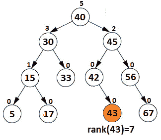

图 14.28–流排名的 BST

让我们假设我们想要找到 43 级。首先，我们将 43 与根进行比较，得出结论，43 必须位于根的右子树 40 中。但是，根在其左子树中有 5 个节点（显然，它们都比根小），因此 43 的排名至少为 6（根的左子树的 5 个节点加上根）。接下来，我们将 43 与 45 进行比较，得出结论，43 必须在 45 的左边，因此排名仍然是 5。最后，我们将 43 与 42 进行比较，得出结论，43 必须位于 42 的右子树中。等级必须增加 1，因此 43 的等级是 7。

那么，我们如何用一个算法来概括这个例子呢？这里，我们注意到，对于每个节点，我们已经知道其左子树的秩。这不需要每次需要排名时都计算，因为这将非常低效。每次生成新元素并插入到树中时，我们都可以跟踪和更新左子树的排名。在前面的图中，每个节点都在节点上方突出显示其子树等级。当需要节点的秩时，我们已经知道其左子树的秩。接下来，我们必须考虑下面的递归步骤，这些步骤通过 Point T1AIN-GeTrink（节点节点，INT 元素）

1.  如果**元素**等于**节点元素**，则返回**节点元素**。
2.  如果**元素**在**节点**左侧，则返回**getRank（node.left，element）**。
3.  如果**元素**在**节点**右侧，则返回**node.leftTreeSize+1+getRank（node.right，element）**。

如果找不到给定的整数，则返回-1。此处列出了相关代码：

```java
public class Stream {
  private Node root = null;
  private class Node {
    private final int element;
    private int leftTreeSize;
    private Node left;
    private Node right;
    private Node(int element) {
      this.element = element;
      this.left = null;
      this.right = null;
    }     
  }
  /* add a new node into the tree */
  public void generate(int element) {
    if (root == null) {
      root = new Node(element);
    } else {
      insert(root, element);
    }
  }
  private void insert(Node node, int element) {
    if (element <= node.element) {
      if (node.left != null) {
        insert(node.left, element);
      } else {
        node.left = new Node(element);
      }
      node.leftTreeSize++;
    } else {
      if (node.right != null) {
        insert(node.right, element);
      } else {
        node.right = new Node(element);
      }
    }
  }
  /* return rank of 'element' */
  public int getRank(int element) {
    return getRank(root, element);
  }
  private int getRank(Node node, int element) {
    if (element == node.element) {
      return node.leftTreeSize;
    } else if (element < node.element) {
      if (node.left == null) {
        return -1;
      } else {
        return getRank(node.left, element);
      }
    } else {
      int rightTreeRank = node.right == null 
        ? -1 : getRank(node.right, element);
      if (rightTreeRank == -1) {
        return -1;
      } else {
        return node.leftTreeSize + 1 + rightTreeRank;
      }
    }
  }
}
```

前面的代码将在平衡树上以 O（logn）时间运行，在非平衡树上以 O（n）时间运行，其中*n*是树中的节点数。完整的应用程序称为*RankInStream*。

## 编码挑战 15–峰值和谷值

**亚马逊**、**谷歌**、**Adobe**、**微软**、**Flipkart**

问题阿纳尔：考虑到你已经给出了一个表示地形高程的正整数数组。如果此数组中的一个整数大于或等于其相邻整数（相邻整数），则此整数称为*峰值*。另一方面，如果这个数组中的一个整数小于或等于它的相邻整数（相邻整数），那么这个整数被称为谷*谷*。例如，对于数组 4、5、8、3、2、1、7、8、5、9，我们可以看到 8（两者）和 9 是峰值，而 4、1 和 5（最后一个除外）是谷值。编写一段代码，将给定数组排序为交替的波峰和波谷序列。

**解决方案**：乍一看，一个方便的解决方案是从按升序排序数组开始。一旦数组被排序为*l1≤ l2≤ l3≤ l4≤ l5。。。*，我们可以看到每个三元组的数字都是*大*（*l1*）≤ *较大*（*l2*）≤ *最大*（*l3*）。如果我们将*l2*与*l3*进行交换，则*l1*≤ *l3*≥ *l2*，因此*l3*成为峰值。对于下一个三联体，*l2*≤ *l4*≤ *l5*，我们将*l4*与*l5*进行互换，获得*l2*≤ *l5*≥ *l4*，所以*l5*是一个峰值。对于下一个三联体，*l4*≤ *l6*≤ *l7*，我们将*l6*与*l7*进行互换，获得*l4*≤ *l7*≥ *l6*，所以*l7*是一个峰值。如果我们继续进行这些互换，那么我们会得到如下结果：*l1*≤ *l3*≥ *l2*≤ *l5*≥ *l4*≤ *l7*≥ *l6*。。。。但这是否有效？由于我们必须对数组进行排序，我们可以说这个解决方案的时间复杂度是 O（n logn）。我们能做得更好吗？是的，我们可以！假设我们将数组表示为：


图 14.29–给定地形高程阵列

现在，我们可以清楚地看到给定阵列的峰谷。如果我们关注第一个三元组（4，5，8）并试图获得一个峰值，那么我们必须将中间（5）的值与其相邻（相邻整数）之间的最大值交换。因此，通过将 5 与 max（4，8）交换，我们得到（4，8，5）。因此，8 是峰值，可表示为：


图 14.30–用 8 替换 5

接下来，让我们关注下一个三元组（5，3，2）。我们可以通过将 3 与 max（5，2）交换来获得峰值，因此通过将 3 与 5 交换来获得峰值。结果是（3，5，2），如下所示：

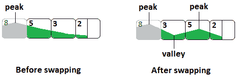

图 14.31–用 5 替换 3

现在，5 是峰，3 是谷。我们应该继续使用三元组（2，1，7）并将 1 与 7 交换以获得峰值（2，7，1）。下一个三元组是（1，8，5），峰值为 8（无需交换）。最后，我们得到了最终结果，如下图所示：


图 14.32–最终结果

面试官会希望你注意细节并提及。例如，当我们将中间值与左侧值交换时，是否可以打断已处理的地形？我们能打破山谷还是山峰？答案是否定的，我们不能破坏任何东西。这是因为当我们将中间值与左边值交换时，我们已经知道中间值小于左边值，左边值是一个谷。因此，我们只是通过给那个地方增加更小的价值来创造一个更深的山谷。

基于这些语句，实现非常简单。以下代码将澄清任何剩余细节：

```java
public static void sort(int[] arr) {
  for (int i = 1; i < arr.length; i += 2) {
    int maxFoundIndex = maxElementIndex(arr, i - 1, i, i + 1);
    if (i != maxFoundIndex) {
      swap(arr, i, maxFoundIndex);
    }            
  }
}
private static int maxElementIndex(int[] arr, 
 int left, int middle, int right) {
  int arrLength = arr.length;
  int leftElement = left >= 0 && left < arrLength
    ? arr[left] : Integer.MIN_VALUE;
  int middleElement = middle >= 0 && middle < arrLength
    ? arr[middle] : Integer.MIN_VALUE;
  int rightElement = right >= 0 && right < arrLength
    ? arr[right] : Integer.MIN_VALUE;
  int maxElement = Math.max(leftElement,
    Math.max(middleElement, rightElement));
  if (leftElement == maxElement) {
    return left;
  } else if (middleElement == maxElement) {
    return middle;
  } else {
    return right;
  }
}
```

此代码在 O（n）复杂度时间内执行。完整的应用程序称为*峰谷*。

## 编码挑战 16–最近的左较小数字

**亚马逊**、**谷歌**、**Adobe**、**微软**、**Flipkart**

问题 T1：考虑到你已经给出了整数数组，阿纳尔。编写一段代码，为每个元素查找并打印最接近的较小的数字，以便较小的元素位于左侧。

我们考虑给定的数组；也就是说，4，1，8，3，8，2，6，7，4，9。预期结果是 u，u，1，1，3，1，2，6，2，4。从左到右，我们有以下内容：

*   *arr*[0]=4，左边没有元素，所以打印。
*   *arr*[1]=1，在它的左边没有比它小的元素，所以我们打印。
*   *arr*[2]=8，其左边最近的最小元素是 1，所以我们打印 1。
*   *arr*[3]=3，其左边最近的最小元素为 1，所以我们打印 1。
*   *arr*[4]=8，其左边最近的最小元素是 3，所以我们打印 3。
*   *arr*[5]=2，其左边最近的最小元素是 1，所以我们打印 1。
*   *arr*[6]=6，其左边最近的最小元素是 2，所以我们打印 2
*   *arr*[7]=7，其左边最近的最小元素是 6，所以我们打印 6
*   *arr*[8]=4，其左边最近的最小元素是 2，所以我们打印 2
*   *arr*[9]=9，其左边最近的最小元素是 4，所以我们打印 4

简单但低效的解决方案依赖于两个循环。外循环可以从第二个元素（索引 1）开始，并到达数组的长度（*arr.length*-1），而内循环则遍历外循环拾取的元素左侧的所有元素。一旦它发现一个较小的元素，它就会停止该过程。这种算法很容易实现，但运行复杂度为 O（n2）。

然而，我们可以通过**堆栈**将时间复杂度降低到 O（n）。主要是，我们可以遍历从 0 到*arr.length*-1 的给定数组，并依赖**堆栈**来跟踪到目前为止已遍历的元素的子序列，这些元素小于任何后续已遍历的元素。虽然这句话听起来很复杂，但让我们通过查看此算法的步骤来澄清它：

1.  创建一个新的空堆栈。
2.  For every element of *arr*, (*i* = 0 to *arr.length*-1), we do the following:

    A.当堆栈不为空且顶部元素大于或等于*arr**i*时，我们从堆栈中弹出。

    B 如果堆栈为空，则在*arr**i*左侧没有元素。我们可以打印一个表示未找到元素的符号（例如，-1 或 1）。

    C 如果堆栈不是空的，则距离*arr*[[T2】i 最近的较小值是堆栈的顶部元素。我们可以窥视并打印此元素。

    D 将*arr**i*推入堆栈。

在代码方面，我们有以下内容：

```java
public static void leftSmaller(int arr[]) {
  Stack<Integer> stack = new Stack<>();
  // While the top element of the stack is greater than 
  // equal to arr[i] remove it from the stack        
  for (int i = 0; i < arr.length; i++) {
    while (!stack.empty() && stack.peek() >= arr[i]) {
      stack.pop();
    }
    // if stack is empty there is no left smaller element
    if (stack.empty()) {
      System.out.print("_, ");
    } else {
      // the top of the stack is the left smaller element
      System.out.print(stack.peek() + ", ");
    }
    // push arr[i] into the stack
    stack.push(arr[i]);
  }
}
```

此代码的运行时为 O（n），其中*n*是给定数组中的元素数。完整的应用程序称为*FindNearestMinimum*。

## 编码挑战 17–单词搜索

**亚马逊**、**谷歌**

问题 T1：考虑到你已经得到了一个 2D 板（一个矩阵）和一个单词。电路板的每个单元都包含一个字母。您可以通过连接水平或垂直相邻单元格中的字母来构造单词。写一段代码，如果给定单词出现在电路板上，则返回**true**。同一个字母单元格不能使用多次。

我们认为，我们有以下几个方面：

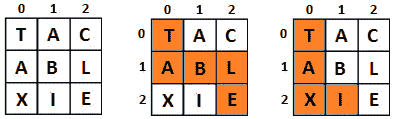

图 14.33–电路板示例

请记住，这不是我们第一次需要解决需要在网格中找到特定路径的问题。在[*第 8 章*](08.html#_idTextAnchor161)*、递归和动态规划*中，我们遇到了*机器人网格*问题，包括*色斑*、*五塔*、*落球、*和*骑士之旅*。在[*第 12 章*](12.html#_idTextAnchor276)*中，堆栈和队列*中，我们有*岛*。最后，在[*第 13 章*](13.html#_idTextAnchor295)*、树与图*中，我们有了*国际象棋骑士*。

根据您从这些问题中积累的经验，挑战您自己，在没有任何进一步说明的情况下为这个问题编写一个实现。完整的应用程序称为*单词搜索*。如果*k*是给定单词的长度，并且板的大小为*m*x*n*，则此应用程序在 O（m*n*4k）时间内运行。

## 编码挑战 18–根据另一个数组对数组进行排序

**亚马逊**、**谷歌**、**微软**

问题 T1：考虑到两个数组，你一直是。编写一段代码，根据第二个数组定义的顺序对第一个数组的元素重新排序。

让我们考虑下面两个数组：

```java
int[] firstArr = {4, 1, 8, 1, 3, 8, 6, 7, 4, 9, 8, 2, 5, 3};
int[] secondArr = {7, 4, 8, 11, 2};
```

预期结果是{7,4,4,8,8,8,2,1,1,3,3,5,6,9}。

这个问题的解决依赖于*散列*。更准确地说，我们可以采用以下算法：

1.  计算并存储映射中第一个数组中每个元素的频率。
2.  For each element of the second array, check if the current element from the second array is present in the map or not.

    然后，执行以下操作：

    A.如果是，则在第一个数组中设置*n*次（*n*是第一个数组中第二个数组当前元素的频率）。

    B 从映射中删除当前元素，这样，映射最终将只包含第一个数组中存在但第二个数组中不存在的元素。

3.  将映射中的元素附加到第一个数组的末尾（因为我们使用了**树集**，所以这些元素已经被排序）。

让我们看看代码：

```java
public static void custom(int[] firstArr, int[] secondArr) {
  // store the frequency of each element of first array
  // using a TreeMap stores the data sorted
  Map<Integer, Integer> frequencyMap = new TreeMap<>();
  for (int i = 0; i < firstArr.length; i++) {
    frequencyMap.putIfAbsent(firstArr[i], 0);
    frequencyMap.put(firstArr[i],   
          frequencyMap.get(firstArr[i]) + 1);
  }
  // overwrite elements of first array
  int index = 0;
  for (int i = 0; i < secondArr.length; i++) {
    // if the current element is present in the 'frequencyMap'
    // then set it n times (n is the frequency of 
    // that element in the first array)
    int n = frequencyMap.getOrDefault(secondArr[i], 0);
    while (n-- > 0) {
      firstArr[index++] = secondArr[i];
    }
    // remove the element from map
    frequencyMap.remove(secondArr[i]);
  }
  // copy the remaining elements (the elements that are
  // present in the first array but not present 
  // in the second array)        
  for (Map.Entry<Integer, Integer> entry :
        frequencyMap.entrySet()) {
    int count = entry.getValue();
    while (count-- > 0) {
      firstArr[index++] = entry.getKey();
    }
  }
}
```

此代码的运行时间为 O（m log m+n），其中*m*是第一个数组中的元素数，*n*是第二个数组中的元素数。完整的应用程序称为*Sortarray BaseDonanotherray*。

这是本章的最后一个问题。现在，是总结我们工作的时候了！

# 总结

这是一个全面的章节，涵盖了排序和搜索算法。您看到了合并排序、快速排序、基数排序、堆排序、桶排序和二进制搜索的实现。此外，在本书附带的代码中，有一个名为*SortArraysIn14Ways*的应用程序，其中包含 14 种排序算法的实现。

在下一章中，我们将讨论一系列问题，分为数学问题和益智问题。**